## 第十一章. 使用高级树解决实际问题

***本章涵盖***

+   使用自平衡树避免栈溢出

+   实现红黑树

+   创建函数式映射

+   设计函数式优先队列

在上一章中，你学习了二叉树结构和基本树操作。但你看到，为了充分利用树，你必须有非常具体的使用案例，例如处理随机排序的数据，或者有限的数据集，以避免任何栈溢出的风险。使树栈安全比列表要困难得多，因为每个计算步骤都涉及两个递归调用，这使得无法创建尾递归版本。

在本章中，我们将研究两种特定的树：

+   红黑树是一种高性能的自平衡通用树。它适用于通用用途和任何大小的数据集。

+   左式堆是一个非常适合实现优先队列的特定树。

### 11.1. 更好的性能和栈安全性通过自平衡树

你在上一章中使用的 Day-Stout-Warren 平衡算法并不适合平衡函数树，因为它是为就地修改而设计的。在函数式编程中，通常避免就地修改，而是为每次更改创建一个新的结构。一个更好的解决方案是定义一个平衡过程，该过程不涉及在重建一个完全不平衡的树并最终平衡它之前将树转换为列表。有两种方法可以优化这个过程：

+   直接旋转原始树（消除列表/不平衡树的过程）。

+   接受一定程度的失衡。

你可以尝试发明这样的解决方案，但其他人早已做到了。最有效的自平衡树设计之一是红黑树。这种结构是在 1978 年由古巴斯和赛德维克发明的.^([1]) 在 1999 年，Chris Okasaki 在他的书《纯函数数据结构》（Cambridge University Press，1999）中发布了红黑树算法的函数式版本。描述通过在 Standard ML 中的实现来展示，后来又添加了 Haskell 的实现。这就是你将在 Java 中实现的算法。

> ¹
> 
> 李奥·J·古巴斯和罗伯特·赛德维克，“平衡树的二色框架”，*计算机科学基础* (1978), [`mng.bz/Ly5Jl`](http://mng.bz/Ly5Jl).

如果你对手动数据结构感兴趣，我强烈建议你购买并阅读 Okasaki 的书。你也可以阅读他 1996 年的同名论文。它不如他的书完整，但可以作为免费下载([www.cs.cmu.edu/~rwh/theses/okasaki.pdf](http://www.cs.cmu.edu/~rwh/theses/okasaki.pdf))。

#### 11.1.1. 基本树结构

红黑树是一种二叉搜索树（BST），在其结构和插入算法上做了一些补充，并且也平衡了结果。不幸的是，Okasaki 没有描述删除操作，而这实际上是一个更为复杂的过程。但 Kimball Germane 和 Matthew Might 在 2014 年描述了这种“缺失的方法”[2]。

> ²
> 
> Kimball Germane 和 Matthew Might，“功能珍珠，删除：红黑树的诅咒”，*JFP 24*，4（2014）：423–433；[`matt.might.net/papers/germane2014deletion.pdf`](http://matt.might.net/papers/germane2014deletion.pdf)。

在红黑树中，每个树（包括子树）都有一个额外的属性来表示其颜色。除此之外，结构与 BST 结构完全相同，如下所示。

##### 列表 11.1. 红黑树基本结构

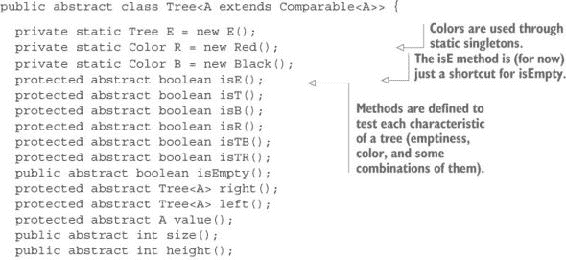

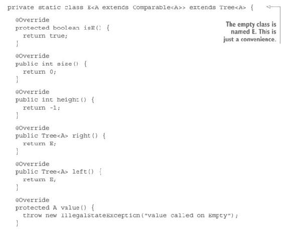

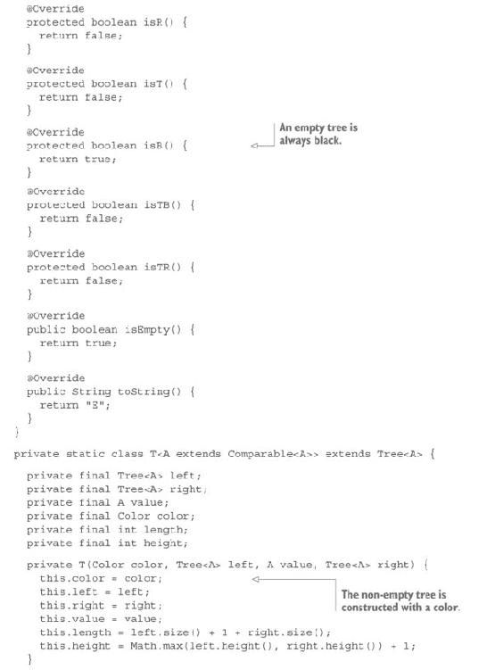


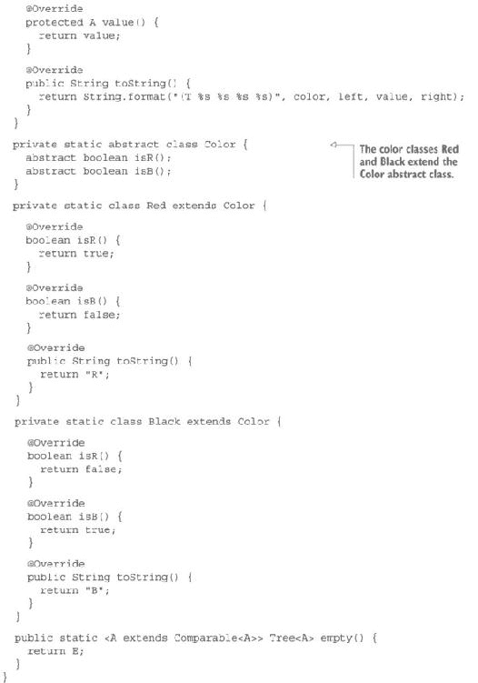

`member`方法没有表示，也没有其他方法，如`fold`、`map`等，因为它们与标准树版本没有区别。正如你将看到的，只有`insert`和`remove`方法不同。

#### 11.1.2. 将元素插入到红黑树中

红黑树的主要特征是必须始终验证的不变量。在修改树的过程中，它将测试这些不变量是否被破坏，并在必要时通过旋转和颜色变化来恢复它们。这些不变量如下：

+   空树是黑色的。（这不会改变，因此不需要验证。）

+   红树的左右子树都是黑色。换句话说，在向下遍历树的过程中，不可能找到两个连续的红色节点。

+   从根到每个空子树的所有路径都有相同数量的黑色节点。

在红黑树中插入一个元素是一个相对复杂的过程，包括在插入后检查不变量（如果需要，还会进行重新平衡）。以下是相应的算法：

+   空树始终是黑色的。

+   正确的插入操作与普通树完全相同，但随后会进行平衡。

+   将一个元素插入到空树中会产生一个红色树。

+   平衡后，根节点变为黑色。

图 11.1 至 11.7 展示了将整数 1 到 7 插入到初始为空的树中的过程。图 11.1 展示了元素`1`被插入到空树中的情况。由于你是在向空树中插入，初始颜色是红色。一旦元素被插入，根节点变为黑色。

##### 图 11.1. 将整数 1 到 7 插入到初始为空的树中，步骤 1

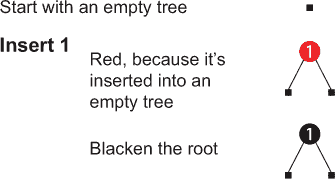

图 11.2 展示了元素`2`的插入。插入的元素是红色，根节点已经是黑色，而且仍然不需要平衡。

##### 图 11.2. 将整数 1 到 7 插入到初始为空的树中，步骤 2

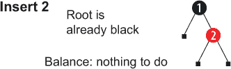

图 11.3 说明了元素 `3` 的插入。插入的元素是红色，树正在平衡，因为它有两个连续的红色元素。因为红色元素现在有两个孩子，它们被设置为黑色。（红色元素的子节点必须是黑色。）最终，根被变黑。

##### 图 11.3\. 将整数 1 至 7 插入初始为空的树中，第 3 步

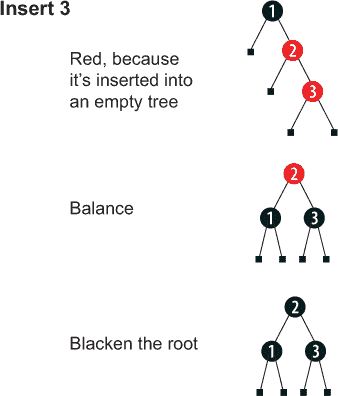

图 11.4 展示了元素 `4` 的插入。不需要进一步操作。

##### 图 11.4\. 将整数 1 至 7 插入初始为空的树中，第 4 步

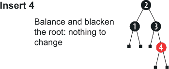

图 11.5 说明了元素 `5` 的插入。现在你有两个连续的红色元素，所以树必须通过将 `3` 作为 `4` 的左孩子来平衡。`4` 成为 `2` 的右孩子。

##### 图 11.5\. 将整数 1 至 7 插入初始为空的树中，第 5 步

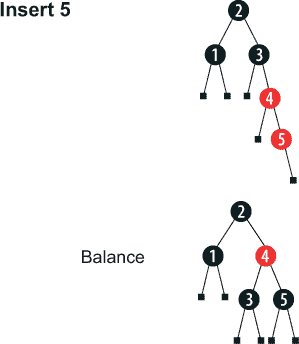

图 11.6 展示了元素 `6` 的插入。不需要进一步操作。

##### 图 11.6\. 将整数 1 至 7 插入初始为空的树中，第 6 步

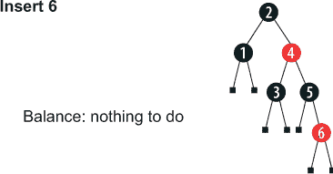

在 图 11.7 中，元素 `7` 被添加到树中。因为元素 `6` 和 `7` 是两个连续的红色元素，所以树必须平衡。第一步是将 `5` 作为 `6` 的左孩子，将 `6` 作为 `4` 的右孩子，这又留下了两个连续的红色元素：`4` 和 `6`。然后树再次平衡，使 `4` 成为根，`2` 成为 `4` 的左孩子，`3` 成为 `2` 的右孩子。最后的操作是使根变黑。

##### 图 11.7\. 将整数 1 至 7 插入初始为空的树中，第 7 步

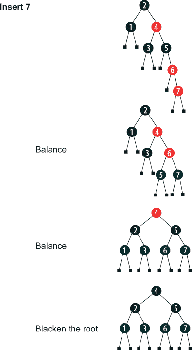

`balance` 方法接受与树构造函数相同的参数：`color`、`left`、`value` 和 `right`。这四个参数被测试以适应各种模式，并据此构建结果。换句话说，`balance` 方法替换了树构造函数。任何使用构造函数的过程都应该修改为使用此方法。

以下列表显示了每种参数模式如何通过此方法进行转换：

+   (T B (T R (T R a x b) y c) z d) → (T R (T B a x b) y (T B c z d))

+   (T B (T R a x (T R b y c)) z d) → (T R (T B a x b) y (T B c z d))

+   (T B a x (T R (T R b y c) z d)) → (T R (T B a x b) y (T B c z d))

+   (T B a x (T R b y (T R c z d))) → (T R (T B a x b) y (T B c z d))

+   (T color a x b) → (T color a x b)

括号中的每一对对应一棵树。字母 T 表示非空树。B 和 R 表示颜色。小写字母是占位符，代表任何可能在该位置有效的值。每个左模式（箭头左侧的模式）按降序应用，这意味着如果找到匹配项，则将相应的右模式应用于结果树。这种呈现方式与 `switch ... case` 指令非常相似，最后一行是默认情况。

#### 练习 11.1

编写 `insert`、`balance` 和 `blacken` 方法以实现红黑树中的插入。不幸的是，Java 不实现模式匹配，所以你必须使用条件指令。

##### 提示

编写一个 `ins` 方法，执行常规插入，然后使用 `balance` 方法的调用替换构造函数调用。接下来，编写 `blacken` 方法，最后在父类中编写 `insert` 方法，在 `ins` 的结果上调用 `blacken`。所有这些方法都应该是受保护的，除了 `insert` 方法，它将是公共的。

#### 解决方案 11.1

一次，我不建议使用条件运算符。使用一系列 `if` 部分来表示模式要容易得多，每个部分都包含一个 `return`。以下是 `balance` 方法：

```
Tree<A> balance(Color color, Tree<A> left, A value, Tree<A> right) {
  if (color.isB() && left.isTR() && left.left().isTR()) {
    return new T<>(R, new T<>(B, left.left().left(), left.left().value(),
      left.left().right()), left.value(), new T<>(B, left.right(), value,
      right));
  }
  if (color.isB() && left.isTR() && left.right().isTR()) {
    return new T<>(R, new T<>(B, left.left(), left.value(),
        left.right().left()), left.right().value(), new T<>(B,
        left.right().right(), value, right));
  }
  if (color.isB() && right.isTR() && right.left().isTR()) {
    return new T<>(R, new T<>(B, left, value, right.left().left()),
        right.left().value(), new T<>(B, right.left().right(),
        right.value(), right.right()));
  }
  if (color.isB() && right.isTR() && right.right().isTR()) {
    return new T<>(R, new T<>(B, left, value, right.left()), right.value(),
        new T<>(B, right.right().left(), right.right().value(),
        right.right().right()));
  }
  return new T<>(color, left, value, right);
}
```

每个 `if` 部分实现了在此练习之前列出的一个模式。如果您想比较它们，在文本编辑器中可能比在打印页面上更容易做到。

`ins` 方法与你在标准二叉搜索树（BST）中做的非常相似，唯一的区别是 `balance` 方法替换了 `T` 构造函数（此外还有一个额外的 `color` 参数）。以下是 `T` 类中的实现：

```
protected Tree<A> ins(A value) {
  return value.compareTo(this.value) < 0
      ? balance(this.color, this.left.ins(value), this.value, this.right)
      : value.compareTo(this.value) > 0
          ? balance(this.color, this.left, this.value,
                                           this.right.ins(value))
          : this;
}
```

以下是 `E` 类中的实现：

```
protected Tree<A> ins(A value) {
  return new T<>(R, empty(), value, empty());
}
```

`blacken` 方法在 `Tree` 类中实现：

```
protected static <A extends Comparable<A>> Tree<A> blacken(Tree<A> t) {
    return t.isEmpty()
        ? empty()
        : new T<>(B, t.left(), t.value(), t.right());
}
```

最后，`insert` 方法在 `Tree` 类中定义，并返回 `ins` 的黑化结果：

```
public Tree<A> insert(A value) {
  return blacken(ins(value));
}
```


##### 从红黑树中删除元素

从红黑树中删除元素由 Kimball Germane 和 Matthew Might 在一篇题为“缺失的方法：从 Okasaki 的红黑树中删除”的文章中讨论（[`matt.might.net/articles/red-black-delete/`](http://matt.might.net/articles/red-black-delete/))。Java 中的实现太长，无法包含在这本书中，但它包含在配套代码中（[`github.com/fpinjava/fpinjava`](http://github.com/fpinjava/fpinjava)）。它将在下一个练习中使用。


### 11.2\. 红黑树的一个应用案例：映射

整数树通常不很有用（尽管有时它们是有用的）。二叉搜索树的一个重要用途是映射，也称为字典或关联数组。映射是一组键/值对，允许插入、删除和快速检索每一对。映射对 Java 程序员来说很熟悉，Java 提供了几种实现，其中最常见的是`HashMap`和`TreeMap`。然而，这些映射在没有使用一些难以正确设计和使用的保护机制的情况下不能在多线程环境中使用（尽管有可用于此类用途的并发版本）。

#### 11.2.1\. 实现映射

函数树，如你开发的红黑树，具有不可变性的优势，这允许你在多线程环境中使用它们，而不必担心锁和同步。下一个列表显示了可以使用红黑树实现的`Map`接口。

##### 列表 11.2\. 一个函数式映射

```
public class Map<K extends Comparable<K>, V> {

  public Map<K, V> add(K key, V value) {
    . . .
  }

  public boolean contains(K key) {
    . . .
  }

  public Map<K, V> remove(K key) {
    . . .
  }

  public Result<MapEntry<K, V>> get(K key) {
    . . .
  }

  public boolean isEmpty() {
    . . .
  }

  public static <K extends Comparable<K>, V> Map<K, V> empty() {
    return new Map<>();
  }
}
```

#### 练习 11.2

通过实现所有方法来完善`Map`类。

##### 提示

你应该使用一个委托。从这个委托中，所有方法都可以用一行代码实现。唯一（非常简单）的问题是选择你如何在映射中存储数据。

#### 解决方案 11.2

解决方案是创建一个表示键/值对的组件，并将该组件的实例存储在树中。这个组件与`Tuple`非常相似，但有一个重要的区别：它必须是可比较的，比较必须基于`key`。`equals`和`hashCode`方法也将基于键的相等性和哈希码。以下是一个可能的实现：

```
public class MapEntry<K extends Comparable<K>, V>
                                  implements Comparable<MapEntry<K, V>> {
  public final K key;
  public final Result<V> value;

  private MapEntry(K key, Result<V> value) {
    this.key = key;
    this.value = value;
  }

  @Override
  public String toString() {
    return String.format("MapEntry(%s, %s)", key, value);
  }

  @Override
  public int compareTo(MapEntry<K, V> me) {
    return this.key.compareTo(me.key);
  }

  @Override
  public boolean equals(Object o) {
    return o instanceof MapEntry && this.key.equals(((MapEntry) o).key);
  }

  @Override
  public int hashCode() {
    return key.hashCode();
  }

  public static <K extends Comparable<K>, V> MapEntry<K, V>
                                           mapEntry(K key, V value) {
    return new MapEntry<>(key, Result.success(value));
  }

  public static <K extends Comparable<K>, V> MapEntry<K, V>
                                                      mapEntry(K key) {
    return new MapEntry<>(key, Result.empty());
  }
}
```

实现`Map`组件现在只是将所有操作委托给`Tree<MapEntry<Key, Value>>`的问题。以下是一个可能的实现：

```
import static com.fpinjava.advancedtrees.exercise11_02.MapEntry.*;

public class Map<K extends Comparable<K>, V> {

  protected final Tree<MapEntry<K, V>> delegate;

  private Map() {
    this.delegate = Tree.empty();
  }
  private Map(Tree<MapEntry<K, V>> delegate) {
    this.delegate = delegate;
  }

  public Map<K, V> add(K key, V value) {
    return new Map<>(delegate.insert(mapEntry(key, value)));
  }

  public boolean contains(K key) {
    return delegate.member(mapEntry(key));
  }

  public Map<K, V> remove(K key) {
    return new Map<>(delegate.delete(mapEntry(key)));
  }

  public MapEntry<K, V> max() {
    return delegate.max();
  }

  public MapEntry<K, V> min() {
    return delegate.min();
  }

  public Result<MapEntry<K, V>> get(K key) {
    return delegate.get(mapEntry(key));
  }

  public boolean isEmpty() {
    return delegate.isEmpty();
  }

  public static <K extends Comparable<K>, V> Map<K, V> empty() {
    return new Map<>();
  }
}
```

#### 11.2.2\. 扩展映射

并非所有树操作都进行了委托，因为有些操作在当前条件下没有太多意义。但某些特殊用例可能需要额外的操作。实现这些操作很简单：扩展`Map`类并添加委托方法。例如，你可能需要找到具有最大或最小键的对象。另一个可能的需求是将映射折叠起来，例如获取包含值的列表。以下是一个委托`foldLeft`方法的示例：

```
public <B> B foldLeft(B identity, Function<B,
        Function<MapEntry<K, V>, B>> f, Function<B, Function<B, B>> g) {
  return delegate.foldLeft(identity, b -> me -> f.apply(b).apply(me), g);
}
```

通常，折叠映射发生在非常具体的用例中，这些用例值得在`Map`类内部进行抽象。

#### 练习 11.3

在`Map`类中编写一个`values`方法，该方法按升序键顺序返回映射中包含的值的列表。

##### 提示

你可能需要在`Tree`类中创建一个新的折叠方法，并从`Map`类中委托给它。

#### 解决方案 11.3

`values` 方法的实现有几种可能。可以委托给 `foldInOrder` 方法，但这个方法按升序遍历树值。使用此方法构造列表将导致列表按降序排列。你可以反转结果，但这不会很高效。

一个更好的解决方案是在 `Tree` 类中添加一个 `foldInReverseOrder` 方法。回想一下 `foldInOrder` 方法：

```
public <B> B foldInOrder(B identity,
                         Function<B, Function<A, Function<B, B>>> f) {
  return f.apply(left.foldInOrder(identity, f))
          .apply(value)
          .apply(right.foldInOrder(identity, f));
}
```

所要做的就是反转顺序：

```
public <B> B foldInReverseOrder(B identity,
                          Function<B, Function<A, Function<B, B>>> f) {
  return f.apply(right.foldInReverseOrder(identity, f))
          .apply(value).apply(left
          .foldInReverseOrder(identity, f));
}
```

如同往常，`Empty` 实现返回 `identity`。现在你可以从 `Map` 类内部委托给这个方法：

```
public List<V> values() {
  return List.sequence(delegate.foldInReverseOrder(List.<Result<V>>list(),
    lst1 -> me -> lst2 -> List.concat(lst2,
                             lst1.cons(me.value)))).getOrElse(List.list());
}
```

如果你有类型问题，你可以用显式类型编写函数：

```
Function<List<Result<V>>, Function<MapEntry<K, V>,
                  Function<List<Result<V>>, List<Result<V>>>>> f =
             lst1 -> me -> lst2 -> List.concat(lst2, lst1.cons(me.value));
```

#### 11.2.3\. 使用不可比较键的 Map

`Map` 类很有用且相对高效，但与您可能习惯的映射相比有一个很大的缺点：键必须是可比较的。用于键的类型通常是可比较的，例如整数或字符串，但如果你需要使用不可比较的类型作为键呢？

#### 练习 11.4

实现一个使用不可比较键的 `Map` 版本。

##### 提示

有两件事需要修改。首先，`MapEntry` 类应该是可比较的，尽管键不是。其次，可能发生非相等值恰好被存储在相等的映射条目中，因此应该通过保留两个冲突条目来解决冲突。

#### 解决方案 11.4

首先要做的是修改 `MapEntry` 类，移除键需要可比较的要求：

```
public class MapEntry<K, V> implements Comparable<MapEntry<K, V>> {
```

注意，尽管 `K` 类型不是，`MapEntry` 类仍然是可比较的。

其次，你必须为 `compareTo` 方法使用不同的实现。一种可能性是基于键哈希码比较来比较映射条目：

```
public int compareTo(MapEntry<K, V> that) {

  int thisHashCode = this.hashCode();
  int thatHashCode = that.hashCode();

  return thisHashCode < thatHashCode
      ? -1
      : thisHashCode > thatHashCode
          ? 1
          : 0;
}
```

然后，你必须处理当两个映射条目具有相同哈希码的不同键时发生的冲突。在这种情况下，应该保留它们两个。最简单的解决方案是将映射条目存储在列表中，为此，你必须修改 `Map` 类。

首先，树代理将有一个修改后的类型：

```
protected final Tree<MapEntry<Integer, List<Tuple<K, V>>>> delegate;
```

然后，你必须更改接受代理作为参数的构造函数：

```
public Map(Tree<MapEntry<Integer, List<Tuple<K, V>>>> delegate) {
  this.delegate = delegate;
}
```

接下来，你需要一个方法来检索与相同键哈希码对应的关键字/值元组的列表：

```
private Result<List<Tuple<K, V>>> getAll(K key) {
  return delegate.get(mapEntry(key.hashCode()))
                       .flatMap(x -> x.value.map(lt -> lt.map(t -> t)));
}
```

你可以定义 `add`、`contains`、`remove` 和 `get` 方法，这些方法基于 `getAll` 方法。以下是 `add` 方法：

```
public Map<K, V> add(K key, V value) {
  Tuple<K, V> tuple = new Tuple<>(key, value);
  List<Tuple<K, V>> ltkv = getAll(key).map(lt ->
              lt.foldLeft(List.list(tuple), l -> t -> t._1.equals(key)
                  ? l
                  : l.cons(t))).getOrElse(() -> List.list(tuple));
  return new Map<>(delegate.insert(mapEntry(key.hashCode(), ltkv)));
}
```

这是 `contains` 方法：

```
public boolean contains(K key) {
  return getAll(key).map(lt -> lt.exists(t ->
                                   t._1.equals(key))).getOrElse(false);
}
```

这里是 `remove` 方法：

```
public Map<K, V> remove(K key) {
  List<Tuple<K, V>> ltkv = getAll(key).map(lt ->
     lt.foldLeft(List.<Tuple<K, V>>list(), l -> t -> t._1.equals(key)
         ? l
         : l.cons(t))).getOrElse(List::list);
  return ltkv.isEmpty()
        ? new Map<>(delegate.delete(MapEntry.mapEntry(key.hashCode())))
        : new Map<>(delegate.insert(mapEntry(key.hashCode(), ltkv)));
}

public Result<Tuple<K, V>> get(K key) {
  return getAll(key).flatMap(lt -> lt.first(t -> t._1.equals(key)));
}
```

最后，需要删除 `min` 和 `max` 方法。

经过这些修改，`Map` 类可以用于不可比较的键。使用列表存储键/值元组可能不是最有效的实现，因为列表中的搜索需要与元素数量成比例的时间。但在大多数情况下，列表中只包含一个元素，因此搜索将立即返回。

关于这种实现的一个需要注意的事项是，`remove` 方法会检查生成的元组列表是否为空。如果是，它会在代理上调用 `remove` 方法。否则，它会调用 `insert` 方法重新插入从其中删除相应条目的新列表。回想一下第十章的练习 10.1。第十章。这之所以可能，仅仅是因为你决定以这种方式实现插入，即如果找到与映射中存在的元素相等的元素，则将其插入原位置。如果你没有这样做，你将不得不首先删除元素，然后使用修改后的列表插入新元素。

### 11.3\. 实现功能优先队列

如你所知，队列是一种具有特定访问协议的列表。队列可以是单端队列，就像你在前几章中经常使用的单链表一样。在这种情况下，访问协议是后进先出（LIFO）。队列也可以是双端队列，允许先进先出（FIFO）的访问协议。但也有一些具有更特殊协议的数据结构。其中之一是*优先队列*。

#### 11.3.1\. 优先队列的访问协议

值可以以任何顺序插入到优先队列中，但它们只能以非常特定的顺序检索。所有值都有一个优先级级别，并且只有具有最高优先级的元素是可用的。优先级通过元素的排序来表示，这意味着元素必须在某种程度上是可比较的。

优先级对应于理论等待队列中元素的位置。最高优先级属于位置最低的元素（即第一个元素）。因此，按照惯例，最高优先级用最低的值来表示。

由于优先队列将包含可比较的元素，这使得它非常适合树状结构。但从用户的角度来看，优先队列被视为一个列表，有一个头部（具有最高优先级的元素，即最低的值）和一个尾部（队列的其余部分）。

#### 11.3.2\. 优先队列的使用场景

优先队列有许多不同的使用场景。一个很快就能想到的是排序。你可以在随机顺序中将元素插入到优先队列中，然后按顺序检索它们。这不是这种结构的主要使用场景，但它可能对排序小型数据集很有用。

另一个非常常见的用例是在异步并行处理后重新排序元素。假设你有大量数据页面需要处理。为了加快处理速度，你可以将数据分配给多个线程并行工作。但是，没有保证线程将以接收它们的相同顺序返回工作。为了重新同步页面，你可以将它们放入优先队列。然后，应该消费页面的进程将轮询队列以检查是否有可用的元素（队列的头部）是预期的。例如，如果将 1、2、3、4、5、6、7 和 8 页分配给八个线程并行处理，消费者将轮询队列以查看第 1 页是否可用。如果是，它将消费它。如果不是，它将只是等待。

在这种情况下，队列既充当缓冲区，也充当重新排序元素的方式。这通常意味着大小变化有限，因为元素将从队列中以大致相同的速度被移除。当然，这是在消费者以与生产者相同的速度消费元素的情况下成立的。如果不是这样，可能可以使用多个消费者。

如我之前所说，选择实现通常是一个权衡空间和时间或时间与时间的问题。在这里，你必须做出的选择是在插入和检索时间之间。在一般用例中，检索时间必须比插入时间优化，因为插入和检索操作的数量比通常将大大有利于检索。（通常头部会被读取但不会被移除。）

#### 11.3.3. 实现要求

你可以实现一个基于红黑树的优先队列，因为查找最小值非常快。但检索并不意味着删除。如果你搜索最小值，却发现它不是你想要的，你将不得不稍后回来再次搜索。解决这个问题的一个方案可能是在插入时缓存最小值。你可能还想做的另一个改变是关于删除。删除一个元素相对较快，但由于你总是删除最小元素，你可能能够优化数据结构以适应这种操作。

另一个重要的问题将涉及到重复项。尽管红黑树不允许重复项，但优先队列必须允许，因为完全可能存在具有相同优先级的多个元素。解决方案可以与映射相同——存储具有相同优先级的元素列表（而不是单个元素），但这可能不会对性能最优。

#### 11.3.4. 左式堆数据结构

为了满足您对优先队列的要求，您将使用 Okasaki 在其书籍《纯函数式数据结构》中描述的“左侧堆”。^([3]) 这种数据结构满足优先队列的要求。Okasaki 将左侧堆定义为“具有额外左侧属性的堆有序树”：

> ³
> 
> 左侧堆最初由 Clark Allan Crane 在“线性列表和优先队列作为平衡二叉树”（1972 年）中描述，但 Okasaki 是最早发布纯函数式实现的人之一。

+   堆有序树是一种树，其中每个元素的分支都大于或等于该元素本身。这保证了树中的最低元素总是根元素，使得访问最低值是瞬时的。

+   “左侧”属性意味着，对于每个元素，左侧分支 *rank* 大于或等于右侧分支 rank。

+   一个元素的 *rank* 是到达一个空元素右侧路径（也称为右侧 *脊*）的长度。左侧属性保证了从任何元素到空元素的最短路径是右侧路径。这一结果的后果是，元素总是按照升序沿任何下降路径找到。

图 11.8 展示了一个左侧树的示例。

##### 图 11.8\. 堆有序的左侧树，显示每个元素的分支都高于或等于该元素本身，并且每个左侧分支的 rank 都大于或等于相应的右侧分支 rank

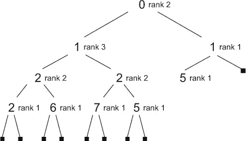

如您所见，检索最高优先级元素是可能的，因为这将始终是树的根。这个元素将被称为结构的“头”。通过类比列表，移除一个元素将包括在移除根之后返回树的其余部分。这个返回值将被称为结构的“尾”。

#### 11.3.5\. 实现左侧堆

左侧堆的主类将被命名为 `Heap`，并且将是一个树形实现。其基本结构在列表 11.3 中展示。与您至今为止所开发的树相比，主要区别在于 `right`、`left` 和 `head`（在之前的例子中您称之为 `value`）等方法将返回一个 `Result` 而不是原始值。请注意，元素的个数被称为 `length`（类比于队列），而缓存的 `length` 和 `rank` 将由构造函数的调用者计算，而不是由构造函数本身计算。这是一个没有明确动机的设计选择，只是为了展示另一种做事的方式。构造函数是私有的，所以这种差异不会泄露到 `Heap` 类外部。

##### 列表 11.3\. 左侧堆结构

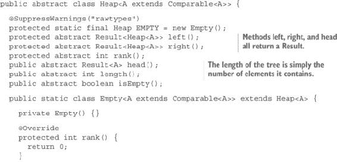

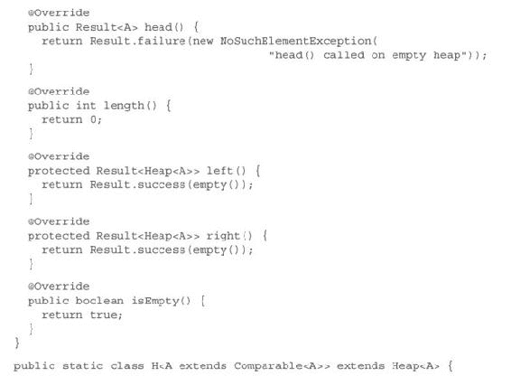

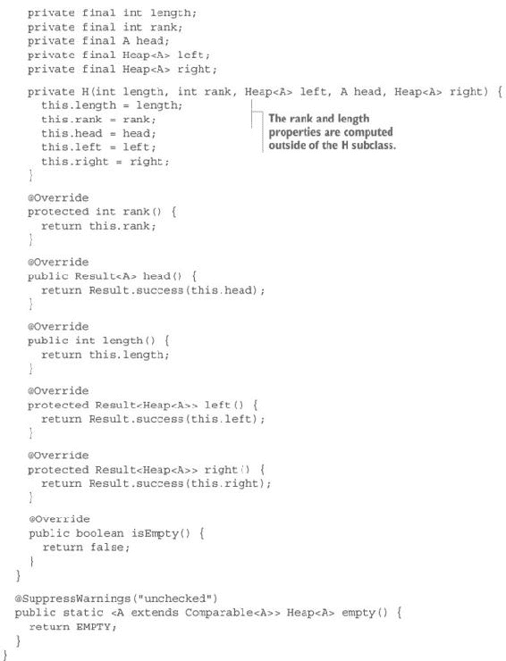

#### 练习 11.5

你想要添加到你的`Heap`实现中的第一个功能是添加一个元素的能力。为此定义一个`add`方法。将其作为`Heap`类中的一个实例方法，其签名如下：

```
public Heap<T> add(T element)
```

要求是在值小于堆中任何元素的情况下，它应成为新堆的根。否则，堆的根不应改变。还应遵守关于右路径等级和长度的其他要求。

##### 提示

定义一个静态方法来从一个元素创建一个`Heap`，另一个方法是通过合并两个堆来创建一个堆，其签名如下：

```
public static <A extends Comparable<A>> Heap<A> heap(A element)
public static <A extends Comparable<A>> Heap<A> merge(Heap<A> first,
                                                            Heap<A> second)
```

然后根据这两个定义`add`方法。

#### 解决方案 11.5

从单个元素创建堆的方法很简单。只需创建一个长度为 1，等级为 1 的新树；参数元素作为头；以及两个空堆作为左右分支：

```
public static <A extends Comparable<A>> Heap<A> heap(A element) {
  return new H<>(1, 1, empty(), element, empty());
}
```

通过合并两个堆来创建堆要复杂一些。为此，你需要一个额外的辅助方法，该方法可以从一个元素和两个堆创建一个堆：

```
protected static <A extends Comparable<A>> Heap<A> heap(A head,
                                        Heap<A> first, Heap<A> second) {
  return first.rank() >= second.rank()
      ? new H<>(first.length() + second.length() + 1,
                                 second.rank() + 1, first, head, second)
      : new H<>(first.length() + second.length() + 1,
                                 first.rank() + 1, second, head, first);
}
```

此代码首先检查第一个堆的等级是否大于或等于第二个堆。如果第一个堆的等级大于或等于，则新等级设置为第二个堆的等级 + 1，并且两个堆按第一、第二顺序使用。否则，新等级设置为第一个堆的等级 + 1，并且两个堆按相反顺序（第二、第一）使用。

现在可以编写合并两个堆的方法如下：

```
public static <A extends Comparable<A>> Heap<A> merge(Heap<A> first,
                                                       Heap<A> second) {
  return first.head().flatMap(
    fh -> second.head().flatMap(
      sh -> fh.compareTo(sh) <= 0
      ? first.left().flatMap(
          fl -> first.right().map(
            fr -> heap(fh, fl, merge(fr, second))))
      : second.left().flatMap(
          sl -> second.right().map(
            sr -> heap(sh, sl, merge(first, sr))))))
                     .getOrElse(first.isEmpty() ? second : first);
}
```

当然，如果要合并的堆之一为空，则返回另一个堆。否则，计算合并的结果。

如果你发现这段代码难以理解（到现在我希望你没有），它只是以下不太有效的实现的全功能等价物：

```
public static <A extends Comparable<A>> Heap<A> merge(Heap<A> first, Heap<A> second) {
  return first.isEmpty()
      ? second
      : second.isEmpty()
          ? first
          : first.head().successValue()
                       .compareTo(second.head().successValue()) <= 0
              ? heap(first.head().successValue(), first.left()
                       .successValue(), merge(first.right()
                                         .successValue(), second))
              : heap(second.head().successValue(), second.left()
                       .successValue(), merge(second.right()
                                         .successValue(), first));
}

public static <A extends Comparable<A>> Heap<A> merge(Heap<A> first,
                                                      Heap<A> second) {
  try {
    return first.head().successValue()
                .compareTo(second.head().successValue()) <= 0
       ? heap(first.head().successValue(), first.left().successValue(),
                           merge(first.right().successValue(), second))
       : heap(second.head().successValue(), second.left().successValue(),
                           merge(second.right().successValue(), first));
  } catch(IllegalStateException e) {
    return first.isEmpty() ? second : first;
  }
}
```

作为一般规则，你应该始终记住，调用`successValue`，就像`getOrThrow`一样，如果`Result`是`Empty`，可能会抛出异常。你可以先测试空值（如上面的第一个示例），或者将代码包含在`try ... catch`块中（如第二个示例），但上述任何解决方案都不是真正有效的。

顺便说一句，你应该尽量避免调用`successValue`和`getOrThrow`。`successValue`方法应该只在使用`Result`类内部时使用。强制执行此操作的最佳解决方案是将其设置为受保护的，但在学习时使用它是很有用的，以便了解发生了什么。

定义了这些方法后，创建`add`方法就很容易了：

```
public Heap<A> add(A element) {
  return merge(this, heap(element));
}
```

#### 11.3.6\. 实现类似队列的接口

尽管它被实现为一个树，但从用户的角度来看，堆就像是一个优先队列，这意味着一种链表，其中头始终是最小的元素。通过类比，树的根元素被称为`head`，而“移除”头之后剩下的部分被称为`tail`。

#### 练习 11.6

定义一个 `tail` 方法，它返回移除 `head` 后剩余的内容。这个方法，就像 `head` 方法一样，返回一个 `Result` 以确保在空队列上调用时的安全性。这是它在 `Heap` 父类中的签名：

```
Result<Heap<A>> tail()
```

#### 解决方案 11.6

`Empty` 的实现很明显，并返回一个 `Failure`：

```
public Result<Heap<A>> tail() {
  return Result.failure(new NoSuchElementException("tail() called
                                                      on empty heap"));
}
```

在前一个练习中定义的方法的基础上，`H` 的实现并不复杂，它只是简单地返回合并左右分支的结果：

```
public Result<Heap<A>> tail() {
  return Result.success(Heap.merge(left, right));
}
```

#### 练习 11.7

实现一个 `get` 方法，它接受一个 `int` 参数，并按优先级顺序返回第 *n* 个元素。这个方法将返回一个 `Result` 以处理找不到元素的情况。这是它在 `Heap` 父类中的签名：

```
public abstract Result<A> get(int index)
```

#### 解决方案 11.7

`Empty` 的实现很明显，将返回一个失败：

```
public Result<A> get(int index) {
  return Result.failure(new NoSuchElementException("Index out of range"));
}
```

`H` 的实现同样简单。它首先测试索引。如果是 0，它返回 `head` 值的 `Success`。否则，它递归地在尾部搜索索引 *n* - 1 的元素。因为尾部实际上并不存在，它只是 `getTail` 方法返回的值（这是一个 `Result`），所以这个结果通过递归调用 `get` 进行扁平映射：

```
public Result<A> get(int index) {
  return index == 0
      ? head()
      : tail().flatMap(x -> x.get(index - 1));
}
```

### 11.4. 非可比较元素的优先队列

要将元素插入到优先队列中，你必须能够比较它们的优先级。但优先级并不总是元素的一个属性；并非所有元素都实现了 `Comparable` 接口。没有实现此接口的元素仍然可以使用 `Comparator` 进行比较，那么你能否为你的优先队列实现这一点？

#### 练习 11.8

修改 `Heap` 类，使其可以使用 `Comparable` 元素或单独的 `Comparator`。

#### 解决方案 11.8

首先，你可以在 `Heap` 类中添加一个方法，该方法将返回 `Comparator`。因为比较器是可选的，所以这个方法将返回一个可能为空的 `Result<Comparator>`。

```
protected abstract Result<Comparator<A>> comparator();
```

然后，你可以在两个子类中实现它。`Empty` 的实现将返回一个在构造函数中初始化的已添加属性的值：

```
private final Result<Comparator<A>> comparator;

private Empty(Result<Comparator<A>> comparator) {
  this.comparator = comparator;
}
protected Result<Comparator<A>> comparator() {
  return this.comparator;
}
```

当然，你也会在 `H` 类中做同样的事情，不同之处在于你将修改现有的构造函数而不是创建一个新的：

```
private final Result<Comparator<A>> comparator;

private H(int length, int rank, Heap<A> left, A head, Heap<A> right,
                                       Result<Comparator<A>> comparator) {
  this.length = length;
  this.rank = rank;
  this.head = head;
  this.left = left;
  this.right = right;
  this.comparator = comparator;
}

protected Result<Comparator<A>> comparator() {
  return this.comparator;
}
```

然后，你必须更新工厂方法。但在你这样做之前，你必须更改类的类型参数，替换为这个

```
public abstract class Heap<A extends Comparable<A>>
```

用这个：

```
public abstract class Heap<A>>
```

应将相同的修改应用于子类构造函数。

创建空 `Heap` 的静态工厂方法将接受一个额外的 `Result<Comparator>` 参数，并且你需要添加一个使用默认 `Result.Empty` 的新方法：

```
public static <A> Heap<A> empty(Comparator<A> comparator) {
  return empty(Result.success(comparator));
}

public static <A> Heap<A> empty(Result<Comparator<A>> comparator) {
  return new Empty<>(comparator);
}
```

注意，我还添加了一个接受 `Comparator<A>` 而不是 `Result<Comparable>` 的方法，以便更容易地使用 `Heap` 类。这个方法主要将从 `Heap` 类外部使用。

然而，你将保留一个不带参数的 `empty` 方法。这个方法仍然需要使用一个 `Comparable` 类型进行参数化。否则，你可能会在以后的风险中遇到 `ClassCastException`。

```
public static <A extends Comparable<A>> Heap<A> empty() {
  return empty(Result.empty());
}
```

通过使用 `Comparable` 类型，你可以确保你得到的是编译器错误而不是运行时异常。

现在，你也可以对创建单个元素 `Heap` 的方法做同样的处理：

```
public static <A extends Comparable<A>> Heap<A> heap(A element) {
  return heap(element, Result.empty());
}

public static <A> Heap<A> heap(A element, Result<Comparator<A>> comparator) {
  Heap<A> empty = empty(comparator);
  return new H<>(1, 1, empty, element, empty, comparator);
}

public static <A> Heap<A> heap(A element, Comparator<A> comparator) {
  Heap<A> empty = empty(comparator);
  return new H<>(1, 1, empty, element, empty, Result.success(comparator));
}
```

需要修改接受一个元素和两个 `Heap` 的方法，但这次，你将从堆参数中提取比较器：

```
protected static <A> Heap<A> heap(A head, Heap<A> first, Heap<A> second) {
  Result<Comparator<A>> comparator = first.comparator()
                                          .orElse(second::comparator);
  return first.rank() >= second.rank()
      ? new H<>(first.length() + second.length() + 1,
                   second.rank() + 1, first, head, second, comparator)
      : new H<>(first.length() + second.length() + 1,
                   first.rank() + 1, second, head, first, comparator);
}
```

对于 `merge` 方法，你可以使用要合并的两个树中的任何一个的 `Comparator`。如果没有 `Comparator`，你可以使用 `Result.Empty`。为了不在每次递归调用中从参数中提取比较器，你可以将方法分成两部分：

```
public static <A> Heap<A> merge(Heap<A> first, Heap<A> second) {
    Result<Comparator<A>> comparator =
                      first.comparator().orElse(second::comparator);
    return merge(first, second, comparator);
  }

  public static <A> Heap<A> merge(Heap<A> first, Heap<A> second,
                                       Result<Comparator<A>> comparator) {
    return first.head().flatMap(fh -> second.head()
                          .flatMap(sh -> compare(fh, sh, comparator) <= 0
        ? first.left().flatMap(fl -> first.right().map(fr ->
                           heap(fh, fl, merge(fr, second, comparator))))
        : second.left().flatMap(sl -> second.right().map(sr ->
                           heap(sh, sl, merge(first, sr, comparator))))))
                  .getOrElse(first.isEmpty()
                      ? second
                      : first);
  }
```

第二种方法使用了一个名为 `compare` 的 `helper` 方法：

```
@SuppressWarnings("unchecked")
public static <A> int compare(A first, A second,
                              Result<Comparator<A>> comparator) {
  return comparator.map(comp -> comp.compare(first, second))
         .getOrElse(() -> ((Comparable<A>) first).compareTo(second));
}
```

此方法对其参数之一进行强制类型转换，但你知道你不会冒 `ClassCastException` 被抛出的风险，因为如果你确保没有比较器就不能创建堆，如果类型参数没有扩展 `Comparable`。

现在，静态最终 `EMPTY` 单例可以被移除。`add` 方法也必须按以下方式修改：

```
public Heap<A> add(A element) {
  return merge(this, heap(element, this.comparator()));
}
```

最后，`Empty` 类中的 `left` 和 `right` 方法必须按以下方式更改：

```
public Result<Heap<A>> left() {
  return Result.success(empty(this.comparator));
}

protected Result<Heap<A>> right() {
  return Result.success(empty(this.comparator));
}
```

#### 练习 11.9

到目前为止，你向 `Heap` 添加元素的唯一方法是通过 `merge` 方法。实现一个 `insert` 方法，在不使用 `merge` 的情况下添加元素。在 `Heap` 父类中定义一个抽象方法，其签名如下：

```
public abstract Heap<A> insert(A a)
```

##### 提示

你应该重用之前练习中的 `compare` 方法。

#### 解决方案 11.9

`Empty` 的实现只是调用 `heap` 工厂方法，传递要插入的值和两个对 `this` 的引用：

```
public Heap<A> insert(A a) {
  return heap(a, this, this);
}
```

在 `H` 类中，你需要实现算法很简单。让我们称 `a` 为要插入的元素。你必须构建一个新的 `H`，包含一个 `head`、一个 `left` 和一个 `right`：

+   如果这个 `head` 比 `a` 低，保持它作为当前 `head`。否则使用 `a`。

+   保持左分支不变。

+   如果 `head` 比 `a` 高，递归地将 `head` 插入到右分支。

+   否则，递归地将 `a` 插入到右分支。

下面是代码：

```
public Heap<A> insert(A a) {
  return heap(compare(head, a, comparator) < 0
      ? head
      : a, left, right.insert(compare(head, a, comparator) > 0
          ? head
          : a));
}
```

这段代码没有优化，因为你用相同的参数调用了 `compare` 两次。你可以只调用一次并缓存结果，这也会使代码更容易阅读：

```
public Heap<A> insert(A a) {
  int comp = compare(head, a, comparator);
  return heap(comp < 0
               ? head
               : a, left, right.insert(comp > 0 ? head : a));
}
```

看起来不错？其实不然。

#### 练习 11.10

在 `Heap<Integer>` 上运行练习 11.9 的解决方案将工作，但它有一个错误。找出它并修复它。当然，如果你做了练习 11.9 并直接找到了正确的解决方案，你可以休息一下。

##### 提示

考虑一下如果插入的值与头部的优先级相同会发生什么。

#### 解决方案 11.10

如果`head`的优先级等于插入元素`a`的优先级，则使用`a`作为新的`head`，并将其插入到新的右分支中。对于整数堆来说，这并不是什么大问题，但对于大多数其他类型来说，这可能会是一个大错误。考虑以下类型：

```
class Point implements Comparable<Point> {

  public final int x;
  public final int y;

  private Point(int x, int y) {
    this.x = x;
    this.y = y;
  }

  public String toString() {
    return "(" + x + "," + y + ")";
  }

  @Override
  public int compareTo(Point that) {
    return this.x < that.x ? -1 : this.x > that.x ? 1 : 0;
  }
}
```

此类型表示可以使用其`x`坐标进行比较的点。现在，考虑以下模拟将点插入堆的程序：

```
List<Tuple<Integer, Integer>> points =
               List.list(1, 2, 2, 2, 6, 7, 5, 0, 5, 1).zipWithPosition();
Heap<Point> heap = points.foldLeft(Heap.empty(), h -> t ->
                                        h.insert(new Point(t._1, t._2)));
List<Point> lp = List.unfold(heap, hp -> hp.head()
                   .flatMap(h -> hp.tail().map(t -> new Tuple<>(h, t))));
System.out.println(points);
System.out.println(lp);
```

在将点插入后，它们将按优先级顺序再次从列表中提取。以下是结果（第一行显示原始点）：

```
[(1,0), (2,1), (2,2), (2,3), (6,4), (7,5), (5,6), (0,7), (5,8), (1,9), NIL]
[(0,7), (1,9), (1,9), (2,3), (2,1), (2,3), (5,8), (5,6), (6,4), (7,5), NIL]
```

在第二行，你可以看到你得到了两个 x = 1 的点，但不是`(1,0)`和`(1,9)`，而是`(1,9)`两次。对于 x = 2 的点，你也会有同样的问题。如果你只向堆中插入整数，这个问题就不会明显。

这里是正确的实现：

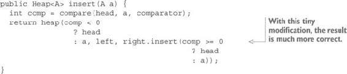

现在你将得到以下（正确）的结果：

```
[(1,0), (2,1), (2,2), (2,3), (6,4), (7,5), (5,6), (0,7), (5,8), (1,9), NIL]
[(0,7), (1,9), (1,0), (2,3), (2,1), (2,2), (5,8), (5,6), (6,4), (7,5), NIL]
```

### 11.5. 概述

+   为了提高性能并避免递归操作中的栈溢出，可以平衡树。

+   红黑树是一种自我平衡的树结构，可以让你不必关心树的平衡。

+   可以通过委托到一个存储键/值对的树来实现映射。

+   使用不可比较键的映射必须处理冲突，以便存储具有相同键表示的元素。

+   优先队列是允许按优先级顺序检索元素的集合。

+   可以使用左倾堆实现优先队列，它是一种堆有序的二元树。

+   可以使用额外的比较器构造不可比较元素的优先队列。
