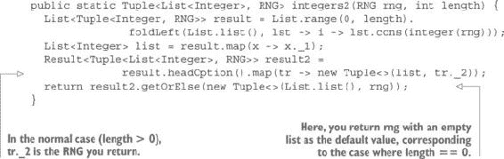

## 第十二章\. 以函数式方式处理状态变化

***本章涵盖***

+   创建一个函数式随机数生成器

+   设计一个通用的 API 来处理状态变化

+   处理和组合状态操作

+   使用递归状态操作

+   通用状态处理

+   构建状态机

在本章中，你将学习如何以纯函数式的方式处理状态。在前面的章节中，我们尽可能地避免了状态变化，你可能会认为状态变化与函数式编程不相容。这并不正确。在函数式编程中，处理状态变化是完全可能的。与你可能习惯的不同之处在于，你必须以函数式的方式处理状态变化，这意味着不依赖于副作用。

对于程序员来说，处理状态变化的理由有很多。一个最简单的例子是随机数生成器。随机数生成器是一个具有返回随机数字的方法的组件。如果随机数生成器没有状态（在现实中意味着没有变化的状态），它将始终返回相同的数字。这不是你期望的。

另一方面，因为我已经在前面的章节中多次说过，一个函数，给定相同的参数，应该返回相同的值，所以你可能很难想象这样的生成器是如何工作的。

### 12.1\. 函数式随机数生成器

随机数生成器有许多用途，但可以将它们分为两大类：

+   生成在给定范围内均匀分布的数字

+   生成真正的“随机”数字，这意味着你无法预测的数字

在第一种情况下，你不需要数字真的随机。你需要的是它们是随机分布的。因此，在这种情况下，随机性不适用于单个数字，而是一系列数字。此外，你希望能够在需要时重现这一系列数字。这将允许你测试你的程序。如果生成的数字真的是随机的（在不可预测的意义上），你就无法测试生成器或使用它的程序，因为你不知道期望哪些值。

在第二种情况下，你真的希望数字是不可预测的。例如，如果你想要生成随机测试数据来测试其他程序，每次测试运行时生成相同的数据将毫无用处。

Java 有一个随机数生成器。你可以通过调用`nextInt`方法（以及其他方法）来使用它：

```
Random rng = new Random();
System.out.println(rng.nextInt());
System.out.println(rng.nextInt());
System.out.println(rng.nextInt());
```

这个程序打印...好吧，你不知道。每次运行，它都会打印不同的结果，如下所示：

```
773282358
-496891854
-47242220
```

虽然有时你可能想要这样，但这不是函数式的。随机数生成器的`nextInt`方法不是一个函数，因为它在用相同的参数调用时并不总是返回相同的值。

| |
| --- |

##### 无参数的函数

`nextInt` 不接受参数的事实并不重要。为了成为一个函数，它必须始终返回相同的值。不接受参数实际上意味着它可以接受任何参数，而这个参数对返回值没有任何影响。这并不违反函数的定义。这种函数只是一个常数。


让我们思考一下正在发生的事情。如果方法不接受参数并返回一个值，那么这个值必须来自某个地方。当然，你会猜测这个“某个地方”就在随机数生成器内部。值在每次调用时都会变化的事实意味着生成器在每次调用之间都会变化；它有一个可变的状态。所以问题是 `nextInt` 方法返回的值是否只依赖于生成器的状态，或者它是否依赖于其他东西。

如果返回的值只依赖于生成器的状态，那么让它成为功能性的将很容易。你只需将生成器的状态作为参数传递给方法。当然，由于状态会在方法返回结果时变化（以便生成器不会总是返回相同的值），方法必须返回生成器的状态以及生成的值。你知道如何通过简单地返回一个元组来完成这个操作，所以 `nextInt` 方法的签名将如下所示：

```
public Tuple<Integer, Random> nextInt(Random)
```

这里的问题在于 Java 的 `Random` 生成器并不这样工作。`nextInt` 方法返回的值不仅依赖于生成器的状态，还依赖于系统时钟：系统时钟用于初始化生成器。实际上，Java 的 `Random` 生成器使用一个 `long` 类型的值来初始化自己。从这一点开始，生成的数字序列将不会变化，但这个称为 *种子* 的 `long` 值默认基于系统时钟返回的纳秒数。（更多细节请查看 `Random.java` 源代码。）重要的是，Java 采取的方法是返回不可预测的数字，除非提供特定的种子来初始化生成器。因此，你仍然可以用它以功能方式生成随机数。

#### 12.1.1\. 随机数生成器接口

你现在将实现一个功能随机数生成器。这不会是最好的数字生成器示例，但因为你只是在学习如何以功能方式处理状态变化，它将作为一个功能状态处理的示例。

首先，你需要定义生成器的接口。生成随机数可以通过许多不同的方式完成，因此你可以使用不同的实现。从业务角度来看，生成器的质量基于仅通过查看前一个数字就无法预测下一个数字的不可能性。因此，你可能定义一个简单的生成器，以低廉的成本生成某种可预测的数据，或者你可能定义一个复杂的实现，用于需要不可预测性作为安全措施的用例。

这是你的生成器接口：

```
import com.fpinjava.common.Tuple;

public interface RNG {
  Tuple<Integer, RNG> nextInt();
}
```

#### 12.1.2\. 实现随机数生成器

在本节中，你将通过使用 Java `Random` 类尽可能简单地实现随机数生成器。你必须使用种子初始化它，以便随机数序列可以重复。以下是一个可能的实现：

```
import com.fpinjava.common.Tuple;
import java.util.Random;

public class JavaRNG implements RNG {

  private final Random random;

  private JavaRNG(long seed) {
    this.random = new Random(seed);
  }

  @Override
  public Tuple<Integer, RNG> nextInt() {
    return new Tuple<>(random.nextInt(), this);
  }

  public static RNG rng(long seed) {
    return new JavaRNG(seed);
  }
}
```

剩下的工作就是创建一个前端组件，使随机数生成器更具功能性：

```
import com.fpinjava.common.Tuple;

public class Generator {
  public static Tuple<Integer, RNG> integer(RNG rng) {
    return rng.nextInt();
  }
}
```

要了解这个类如何使用，让我们看看一个单元测试：

```
public void testInteger() throws Exception {
  RNG rng = JavaRNG.rng(0);
  Tuple<Integer, RNG> t1 = Generator.integer(rng);
  assertEquals(Integer.valueOf(-1155484576), t1._1);
  Tuple<Integer, RNG> t2 = Generator.integer(t1._2);
  assertEquals(Integer.valueOf(-723955400), t2._1);
  Tuple<Integer, RNG> t3 = Generator.integer(t2._2);
  assertEquals(Integer.valueOf(1033096058), t3._1);
}
```

如您所见，`Generator` 类的整数方法是函数式的。你可以运行这个测试任意多次；它总是会生成相同的值。所以尽管生成器返回的值依赖于生成器的可变状态，但该方法仍然是引用透明的。

如果你需要生成真正不可预测的数字，你可以使用带有“随机”长值的 `JavaRNG.rng` 方法；例如，`System.nanoTime()` 返回的值。但是，请注意，返回的值没有 1 纳秒的分辨率，所以连续多次调用可能会返回相同的值。这可以通过缓存 `nanoTime` 返回的值并在值未改变时再次调用它来避免，直到获得不同的值。`Random` 类提供了这项服务，所以最简单的解决方案是创建一个初始化随机字段的无参数 `Random()` 的第二个方法。但再次强调，本章不是关于生成器，而是关于函数式处理状态。

#### 练习 12.1

在 `Generator` 类中编写一个方法，该方法返回一个小于作为参数传递的值但大于或等于 0 的随机正整数。以下是签名：

```
public static Tuple<Integer, RNG> integer(RNG rng, int limit)
```

#### 解决方案 12.1

简单地从生成器中获取下一个随机值。对于第一个元组成员，使用除以参数的其余部分的绝对值创建一个新的元组。第二个成员保持不变。

```
public static Tuple<Integer, RNG> integer(RNG rng, int limit) {
  Tuple<Integer, RNG> random = rng.nextInt();
  return new Tuple<>(Math.abs(random._1 % limit), random._2);
}
```

#### 练习 12.2

编写一个返回一个包含 *n* 个随机整数的列表的方法。它还必须返回当前状态，这相当于最后一个 `RNG`，以便它可以生成下一个整数。以下是签名：

```
Tuple<List<Integer>, RNG> integers(RNG rng, int length)
```

##### 提示

尽量不要使用显式递归。使用 `List` 类的方法，首先创建一个所需大小的列表，然后折叠它。注意，如果你生成一个随机数列表，你也可以将其以反向顺序返回（如果这样更简单）。但你必须确保返回的生成器是最新的，这意味着它必须是 `nextInt` 方法返回的最后一个。

#### 解决方案 12.2

想法是创建一个所需长度的列表，然后使用正确的函数折叠它。你会用整数列表来做这件事：

```
List.range(0, length).foldLeft(identity, f);
```

这是一种常见的模式，用于替换命令式编程中的索引循环。在这里，`f` 函数忽略了列表中的整数。这个函数将生成器产生的值添加到一个列表中，从空列表开始。所以它看起来应该是一个以下类型的函数：

```
Function<List<Tuple<Integer, RNG>>, Function<Integer,
                                             List<Tuple<Integer, RNG>>
```

但如果你这样做，你会遇到问题。你可能会轻易地将生成的 `List<Tuple<Integer, RNG>>` 转换为 `List<Integer>`，但要重建 `Tuple<List<Integer>, RNG>`，你必须获取列表中的最后一个 `RNG`。这是因为将列表折叠到另一个列表中会反转元素的顺序。随机值顺序相反的事实并不重要，但你需要访问最后一个返回的 `RNG`，由于折叠，它将位于最后一个位置。要访问它，你必须反转列表，这既不高效也不明智。

一个更好的解决方案是在折叠整数列表时携带当前的 `RNG`。结果将是一个 `Tuple<List<Tuple<Integer, RNG>>, RNG>`，用于折叠的函数将是以下内容：

```
Function<Tuple<List<Tuple<Integer, RNG>>, RNG>, Function<Integer,
                Tuple<List<Tuple<Integer, RNG>>, RNG>>> f = tuple -> i -> {
  Tuple<Integer, RNG> t = integer(tuple._2);
  return new Tuple<>(tuple._1.cons(t), t._2);
};
```

类型可能看起来令人畏惧，但尽管如此，你不应该使其显式。编译器将能够推断出这个类型，所以你不必写它。以下是完整的折叠：

```
Tuple<List<Tuple<Integer, RNG>>, RNG> result = List.range(0, length)
                .foldLeft(new Tuple<>(List.list(), rng), tuple -> i -> {
  Tuple<Integer, RNG> t = integer(tuple._2);
  return new Tuple<>(tuple._1.cons(t), t._2);
});
```

现在你得到了一个 `Tuple<List<Tuple<Integer, RNG>>, RNG>`，构建预期的结果就很容易了：

```
public static Tuple<List<Integer>, RNG> integers(RNG rng, int length) {
  Tuple<List<Tuple<Integer, RNG>>, RNG> result = List.range(0, length)
                  .foldLeft(new Tuple<>(List.list(), rng), tuple -> i -> {
    Tuple<Integer, RNG> t = integer(tuple._2);
    return new Tuple<>(tuple._1.cons(t), t._2);
  });
  List<Integer> list = result._1.map(x -> x._1);
  return new Tuple<>(list, result._2);
}
```

如你所见，由于单链表构建的方式，生成的随机数列表仍然是反向的，但你不需要反转列表。你不在乎第一个生成的数字最后出现。唯一重要的是返回的 `RNG` 将产生正确的数字。

如果你愿意，你可以这样实现该方法：



或者，你可以使用显式递归：

```
public static Tuple<List<Integer>, RNG> integers3(RNG rng, int length) {
  return integers3_(rng, length, List.list()).eval();
}

private static TailCall<Tuple<List<Integer>, RNG>> integers3_(RNG rng,
                                         int length, List<Integer> xs) {
  if (length <= 0)
    return TailCall.ret(new Tuple<>(xs, rng));
  else {
    Tuple<Integer, RNG> t1 = rng.nextInt();
    return TailCall.sus(() ->
                 integers3_(t1._2, length - 1, xs.cons(t1._1)));
  }
}
```

然而，请注意，函数式程序员通常认为使用显式递归是一种不良做法。他们更倾向于通过使用折叠来抽象递归。

### 12.2. 处理状态的泛型 API

正如我说的，你实现 `RNG` 的方式并不是实现生成器的最佳方式。这只是一个例子，用来向你展示状态如何在函数式方式中处理。你可以从那个例子中学到的是，你的 `RNG` 代表了生成器的当前状态。

但如果你想要生成整数，你可能对 `RNG` 并不真正感兴趣。你可能更希望使其透明。换句话说，你到目前为止使用的是一个接受 `RNG` 并返回生成的值（无论是 `Integer`、`List` 还是其他什么）以及新的 `RNG` 的函数：

```
Function<RNG, Tuple<A, RNG>>
```

如果你能去掉 `RNG` 会更好吗？是否有可能以这种方式抽象处理 `RNG`，以至于你不再需要担心它？

为了抽象处理 `RNG`，你需要创建一个新的类型来封装 `RNG` 参数：

```
public interface Random<A> extends Function<RNG, Tuple<A, RNG>>
```

现在，你可以用这个新类型来重新定义生成操作。例如，你可以替换以下方法

```
public static Tuple<Integer, RNG> integer(RNG rng) {
  return rng.nextInt();
}
```

使用一个函数：

```
public static Random<Integer> integer = RNG::nextInt;
```

#### 12.2.1. 处理状态操作

通过抽象 `RNG`，你剩下的是与你在前面章节中学习过的参数化类型非常相似的东西。你在这里得到的是一个简单类型的计算上下文。还记得 `List` 和 `Result` 吗？这些类型就像其他类型的计算上下文一样在起作用。

整数列表是 `Integer` 类型的计算上下文。例如，它允许你将一个从 `Integer` 到另一个类型的函数应用于整数列表，而无需关心列表中的元素数量。

`Result` 没有不同。它为值创建一个计算上下文，允许你对该值应用函数，而无需关心该值是否真的存在。同样地，`Random` 允许你对该值应用计算，而无需处理该值是随机的这一事实。

你能为 `Random` 定义与 `List` 和 `Result` 相同的抽象吗？让我们试试。

首先，你需要一种方法从单个值创建一个 `Random`。尽管这在现实生活中可能看起来用处不大，但它对于创建其他抽象是必需的。你可以将这个方法命名为 `unit`：

```
public static <A> Random<A> unit(A a) {
  return rng -> new Tuple<>(a, rng);
}
```

按照惯例，`unit` 这个名称被使用。你也可以用这个名称来命名 `Result`、`Stream`、`List`、`Heap` 等等，但你选择了更与商业相关的名称，例如 `list` 和 `success`。这是将相同的概念应用于不同类型。

让我们更进一步。你能使用从 `A` 到 `B` 的函数将 `Random<A>` 转换为 `Random<B>` 吗？当然可以。对于其他类型，这被称为 `map`。让我们为 `Random` 定义一个 `map` 方法：

```
static <A, B> Random<B> map(Random<A> s, Function<A, B> f) {
  return rng -> {
    Tuple<A, RNG> t = s.apply(rng);
    return new Tuple<>(f.apply(t._1), t._2);
  };
}
```

这个方法可以在任何地方定义，例如在 `Random` 接口中。

#### 练习 12.3

使用 `map` 方法生成一个随机的 `Boolean`。通过在 `Random` 接口中创建一个函数来完成此操作。

##### 提示

使用以下你刚刚创建的函数：

```
Random<Integer> intRnd = RNG::nextInt;
```

#### 解决方案 12.3

解决方案包括将 `intRnd` 函数返回的结果映射到一个将 `int` 转换为 `boolean` 的函数。当然，如果你想使结果有 50% 的概率为 `true`，你必须相应地选择函数。常用的算法是测试除以 2 的余数是否为 0：

```
Random<Boolean> booleanRnd = Random.map(intRnd, x -> x % 2 == 0);
```

#### 练习 12.4

实现一个返回随机生成`Double`的函数。

#### 解决方案 12.4

这与`booleanRnd`函数的工作方式完全相同。唯一的区别是映射的函数：

```
Random<Double> doubleRnd =
             map(intRnd, x -> x / (((double) Integer.MAX_VALUE) + 1.0));
```

#### 12.2.2. 组合状态操作

在上一节中，你使用普通函数组合了状态操作。如果你需要组合两个或多个状态操作呢？这就是你在练习 12.2 中做的，以生成一个随机生成的整数`List`。你能否在`Random`类型中抽象化这一点？作为一个起点，你可能需要一个方法来组合两个`Random`实例，例如生成一对随机数。

#### 练习 12.5

实现一个函数，该函数接受一个`RNG`并返回一对整数。

##### 提示

首先在`Random`接口中定义一个`map2`方法，该方法组合两个对随机生成器的调用，以生成泛型类型`A`和`B`的值对，然后使用它们作为返回第三个类型`C`的函数的参数。以下是它的签名：

```
static <A, B, C> Random<C> map2(Random<A> ra, Random<B> rb,
                                Function<A, Function<B, C>> f) {
```

#### 解决方案 12.5

这并不比实现`map`更困难。你首先必须将`rng`参数传递给第一个函数。然后从结果中提取返回的`RNG`，并将其传递给第二个函数。最后，使用这两个值作为`f`函数的输入，并返回结果以及生成的`RNG`：

```
static <A, B, C> Random<C> map2(Random<A> ra, Random<B> rb,
                                Function<A, Function<B, C>> f) {
  return rng -> {
    Tuple<A, RNG> t1 = ra.apply(rng);
    Tuple<B, RNG> t2 = rb.apply(t1._2);
    return new Tuple<>(f.apply(t1._1).apply(t2._1), t2._2);
  };
}
```

使用这种方法，你可以定义一个返回一对随机整数的函数，如下例所示：

```
Random<Tuple<Integer, Integer>> intPairRnd =
                    map2(intRnd, intRnd, x -> y -> new Tuple<>(x, y));
```

不要使用相同的`RNG`来生成两个值。这样做会产生一对相同的整数！

#### 练习 12.6

实现一个函数，该函数接受一个`RNG`并返回一个随机生成的整数列表。

##### 提示

整个过程描述起来相当简单。首先，你必须生成一个`List<Random<Integers>>`。然后，你必须将这个列表转换成`Random<List<Integer>>`。这让你想起了什么吗？这是你为`Result`实现的相同抽象，将`List<Result>`转换为`Result<List>`，你称之为`sequence`。

你可以从在`Random`类中实现一个`sequence`方法开始。以下是它的签名：

```
static <A> Random<List<A>> sequence(List<Random<A>> rs)
```

要生成列表，你可以使用在`List`类中定义的`List.fill()`方法，其签名如下：

```
public static <A> List<A> fill(int n, Supplier<A> s)
```

#### 解决方案 12.6

你可以猜测你将需要遍历列表。你不需要为此使用显式递归，也不应该这样做！你应该使用折叠。起始值将是一个使用空列表构造的`Random`。这就是`unit`方法开始变得有用的地方。使用`foldLeft`或`foldRight`，并使用一个将`map2`应用于当前累加器值和要处理的列表元素的函数。

这比描述代码要困难得多。以下是一个使用`foldLeft`的示例：

```
static <A> Random<List<A>> sequence(List<Random<A>> rs) {
  return rs.foldLeft(unit(List.list()), acc -> r ->
                              map2(r, acc, x -> y -> y.cons(x)));
}
```

然后定义一个函数，返回一个随机整数的列表。这次，类型不再是`Random<Integer>`，因为你必须处理表示列表所需长度的额外`int`参数：

```
Function<Integer, Random<List<Integer>>> integersRnd =
                    length -> sequence(List.fill(length, () -> intRnd));
```

将这个实现与练习 12.2 的解决方案进行比较很有趣：

```
public static Tuple<List<Integer>, RNG> integers(RNG rng, int length) {
  Tuple<List<Tuple<Integer, RNG>>, RNG> result = List.range(0, length)
                  .foldLeft(new Tuple<>(List.list(), rng), tuple -> i -> {
    Tuple<Integer, RNG> t = integer(tuple._2);
    return new Tuple<>(tuple._1.cons(t), t._2);
  });
  List<Integer> list = result._1.map(x -> x._1);
  return new Tuple<>(list, result._2);
}
```

你可以看到，折叠已经被抽象成`sequence`方法，中间结果处理已经被抽象成`map2`方法。生成的代码非常简洁且易于理解（前提是你理解了这两个抽象）。在`integersRnd`函数中，你不需要操作`RNG`生成器。对于`sequence`和`map2`方法也是如此。正如你所见，你非常接近实现一个通用的状态处理工具。

#### 12.2.3. 递归状态操作

到目前为止，你已经看到了如何多次调用生成器以返回多个值。但你可能需要处理不同的用例。想象一下，你想要生成不是 5 的倍数的整数。

如果你正在编写一个命令式程序，你可以简单地生成一个数字并测试它。如果不是 5 的倍数，你就返回它。否则，你生成下一个数字。在这个实现中，你平均每五个案例中就要生成第二个数字。你可能考虑以下方案：

```
Random<Integer> notMultipleOfFiveRnd = Random.map(intRnd, x -> {
  return x % 5 != 0
      ? x
      : Random.notMultipleOfFiveRnd.apply(???);
});
```

但你如何访问必须传递给`not-MultipleOfFiveRnd`函数递归调用的`RNG`？这是函数第一次调用产生的`RNG`。

你**可以**通过显式处理第一次函数调用的结果来解决这个问题：

```
Random<Integer> notMultipleOfFiveRnd = rng -> {
    Tuple<Integer, RNG> t = intRnd.apply(rng);
    return t._1 % 5 != 0
        ? t
        : Random.notMultipleOfFiveRnd.apply(t._2);
};
```

但看起来你回到了起点。你真正需要的是`flatMap`方法。

#### 练习 12.7

编写一个`flatMap`方法，并使用它来实现`notMultipleOfFiveRnd`函数。这是`flatMap`方法的签名：

```
static <A, B> Random<B> flatMap(Random<A> s, Function<A, Random<B>> f)
```

#### 解决方案 12.7

`flatMap`方法与`map`方法非常相似：

```
static <A, B> Random<B> flatMap(Random<A> s, Function<A, Random<B>> f) {
  return rng -> {
    Tuple<A, RNG> t = s.apply(rng);
    return f.apply(t._1).apply(t._2);
  };
}
```

不同之处在于，你不需要构造一个元组并返回它，而是简单地将生成的值传递给`f`函数，这个函数给你一个`Random<B>`。记住，实际上这是一个`Function<RNG, Tuple<A, RNG>>`，所以你将应用`s`到该函数的结果`RNG`传递给它，这给你一个可以返回的`Tuple<A, RNG>`。

现在，你可以用`flatMap`来实现`notMultipleOfFiveRnd`函数：

```
Random<Integer> notMultipleOfFiveRnd = Random.flatMap(intRnd, x -> {
    int mod = x % 5;
    return mod != 0
        ? unit(x)
        : Random.notMultipleOfFiveRnd;
});
```

#### 练习 12.8

用`flatMap`来实现`map`和`map2`。

##### 提示

之间存在着`map`、`flatMap`和`unit`的关系：`flatMap`是`map`和`unit`的组合。

#### 解决方案 12.8

这里是两种新的实现：

```
static <A, B> Random<B> map(Random<A> s, Function<A, B> f) {
  return flatMap(s, a -> unit(f.apply(a)));
}
static <A, B, C> Random<C> map2(Random<A> ra, Random<B> rb,
                                Function<A, Function<B, C>> f) {
  return flatMap(ra, a -> map(rb, b -> f.apply(a).apply(b)));
}
```

正如你所见，`flatMap`为你提供了一个额外的抽象层次，这允许你编写更清晰的方法实现。

### 12.3. 通用状态处理

到目前为止，你在这个章节中开发的全部方法和函数都用于生成随机数。但你从生成随机数的特定代码开始，并以与随机数生成完全无关的工具结束。`Random`接口的方法仅通过这个接口扩展`Function <RNG, Tuple<A, RNG>>`与随机数生成相关联。实际上，你可以重新定义这个接口来处理任何类型的状态：

```
interface State<S, A> extends Function<S, Tuple<A, S>> {}
```

你当然知道组合优于继承，所以你可能更喜欢使用代理来定义`State`类：

```
public class State<S, A> {

  public final Function<S, Tuple<A, S>> run;

  public State(Function<S, Tuple<A, S>> run) {
    super();
    this.run = run;
  }
}
```

现在，你可以将`Random`重新定义为`State`的一个特定情况：

```
public class Random<A> extends State<RNG, A> {

  public Random(Function<RNG, Tuple<A, RNG>> run) {
    super(run);
  }
}
```

#### 练习 12.9

通过以通用方式重新实现`Random`接口的方法，完成`State`类的实现。

##### 提示

将方法定义为实例方法，当然，`unit`方法需要是静态的。每个方法都必须创建一个新的`State`。

#### 解决方案 12.9

这里是您的新方法：

```
public static <S, A> State<S, A> unit(A a) {
  return new State<>(state -> new Tuple<>(a, state));
}

public <B> State<S, B> map(Function<A, B> f) {
  return flatMap(a -> State.unit(f.apply(a)));
}

public <B, C> State<S, C> map2(State<S, B> sb, Function<A,
                                               Function<B, C>> f) {
  return flatMap(a -> sb.map(b -> f.apply(a).apply(b)));
}

public <B> State<S, B> flatMap(Function<A, State<S, B>> f) {
  return new State<>(s -> {
    Tuple<A, S> temp = run.apply(s);
    return f.apply(temp._1).run.apply(temp._2);
  });
}

public static <S, A> State<S, List<A>> sequence(List<State<S, A>> fs) {
  return fs.foldRight(State.unit(List.<A>list()),
                       f -> acc -> f.map2(acc, a -> b -> b.cons(a)));
}
```

你现在可以用`State<RNG, A>`的别名替换你的`Random`接口：

```
public class Random<A> extends State<RNG, A> {
  public Random(Function<RNG, Tuple<A, RNG>> run) {
    super(run);
  }
  public static State<RNG, Integer> intRnd = new Random<>(RNG::nextInt);
}
```

#### 12.3.1\. 状态模式

假设你需要生成三个随机整数来初始化一个三维（3D）点：

```
public class Point {

  public final int x;
  public final int y;
  public final int z;
  public Point(int x, int y, int z) {
    this.x = x;
    this.y = y;
    this.z = z;
  }

  @Override
  public String toString() {
    return String.format("Point(%s, %s, %s)", x, y, z);
  }
}
```

你可以创建一个随机的`Point`如下所示：

```
State<RNG, Point> ns =
    intRnd.flatMap(x ->
        intRnd.flatMap(y ->
            intRnd.map(z -> new Point(x, y, z))));
```

这段代码只是修改了一个状态。但如果有一个`get`方法来读取状态和一个`set`方法来写入它，这种修改可以简化。然后你可以使用函数`f`将它们组合起来修改状态，如下所示：

```
public static <S> State<S, Nothing> modify(Function<S, S> f) {
  return State.<S>get().flatMap(s -> set(f.apply(s)));
}
```

此方法返回`State<S, Nothing>`，因为它不返回任何值。你只对修改后的状态感兴趣。"Nothing"是一个你必须如下定义的类型：

```
public final class Nothing {

  private Nothing() {}

  public static final Nothing instance = new Nothing();
}
```

你可以使用`Void`类型而不是`Nothing`类型返回，但实例化`Void`有点棘手，使用一个肮脏的技巧，所以更清洁的解决方案更可取。

`get`方法创建一个函数，该函数简单地返回参数的状态，既是状态也是值：

```
public static <S> State<S, S> get() {
  return new State<>(s -> new Tuple<>(s, s));
}
```

`set`方法创建一个函数，该函数返回参数的状态作为新状态，以及`Nothing`单例作为值：

```
public static <S> State<S, Nothing> set(S s) {
  return new State<>(x -> new Tuple<>(Nothing.instance, s));
}
```

#### 12.3.2\. 构建状态机

组合状态变异的最常见工具之一是状态机。状态机是一段代码，它通过有条件地从一种状态切换到另一种状态来处理输入。许多业务问题可以通过此类条件状态变异来表示。

通过创建一个参数化状态机，你可以抽象出所有关于状态处理的所有细节。这样，你只需列出条件/转换对，然后输入输入列表以获取结果状态，就能简单地处理任何此类问题。机器将透明地处理各种转换的组合。

首先，你需要定义两个接口来表示条件和相应的转换。这些接口并不是绝对必要的，因为它们是简单的函数，但它们将简化编码：

```
interface Condition<I, S> extends Function<StateTuple<I, S>, Boolean> {}

interface Transition<A, S> extends Function<StateTuple<A, S>, S> {}
```

`StateTuple` 类也是一个辅助类，用于简化编码。它只是一个字段名为 `value` 和 `state` 的元组。这比 `_1` 和 `_2` 或 `left` 和 `right` 更容易阅读，因为很容易忘记哪个是哪个。

```
public class StateTuple<A, S> {

  public final A value;
  public final S state;

  public StateTuple(A a, S s) {
    value = a;
    state = s;
  }
}
```

`StateMachine` 类简单地持有类型为 `Function<A, State<S, Nothing>>` 的函数。将最终值作为状态的一部分是选择问题。在这里，最终值包含在状态中，因此你不需要单独携带该值。

状态机是由一个包含 `<Tuple<Condition<A, S>, Transition<A, S>>` 的列表构建的。在构造函数中，函数构建如下：

```
public class StateMachine<A, S> {

  Function<A, State<S, Nothing>> function;

  public StateMachine(List<Tuple<Condition<A, S>,
                                Transition<A, S>>> transitions) {
    function = a -> State.sequence(m ->
      Result.success(new StateTuple<>(a, m)).flatMap((StateTuple<A, S> t) ->
          transitions.filter((Tuple<Condition<A, S>, Transition<A, S>> x) ->
             x._1.apply(t)).headOption().map((Tuple<Condition<A, S>,
                 Transition<A, S>> y) -> y._2.apply(t))).getOrElse(m));
  }
```

`State.sequence` 方法定义如下：

```
public static <S> State<S, Nothing> sequence(Function<S, S> f) {
  return new State<>(s -> new StateTuple<>(Nothing.instance, f.apply(s)));
}
```

这段代码可能看起来很复杂，但它只是构建一个函数，该函数将组合所有作为构造函数参数接收的条件转换。

`StateMachine` 类还定义了一个 `process` 方法，该方法接收一个输入列表以产生结果状态：

```
public State<S, S> process(List<A> inputs) {
    List<State<S, Nothing>> a = inputs.map(function);
    State<S, List<Nothing>> b = State.compose(a);
    return b.flatMap(x -> State.get());
  }
}
```

`State.compose()` 方法定义如下：

```
public static <S, A> State<S, List<A>> compose(List<State<S, A>> fs) {
  return fs.foldRight(State.unit(List.<A>list()),
                        f -> acc -> f.map2(acc, a -> b -> b.cons(a)));
}
```

#### 练习 12.10

编写一个 `Atm` 类来模拟自动取款机。输入将由以下接口表示：

```
public interface Input {

  Type type();

  boolean isDeposit();

  boolean isWithdraw();

  int getAmount();

  enum Type {DEPOSIT,WITHDRAW}
}
```

`Input` 接口将有两个实现，`Deposit` 和 `Withdraw`：

```
public class Deposit implements Input {

  private final int amount;

  public Deposit(int amount) {
    super();
    this.amount = amount;
  }

  @Override
  public Type type() {
    return Type.DEPOSIT;
  }

  @Override
  public boolean isDeposit() {
    return true;
  }

  @Override
  public boolean isWithdraw() {
    return false;
  }
  @Override
  public int getAmount() {
    return this.amount;
  }
}

public class Withdraw implements Input {

  private final int amount;

  public Withdraw(int amount) {
    super();
    this.amount = amount;
  }

  @Override
  public Type type() {
    return Type.WITHDRAW;
  }

  @Override
  public boolean isDeposit() {
    return false;
  }

  @Override
  public boolean isWithdraw() {
    return true;
  }

  @Override
  public int getAmount() {
    return this.amount;
  }
}
```

为了简化代码，使用一个额外的 `Outcome` 类来表示结果元组：

```
public class Outcome {

  public final Integer account;
  public final List<Integer> operations;

  public Outcome(Integer account, List<Integer> operations) {
    super();
    this.account = account;
    this.operations = operations;
  }

  public String toString() {
    return "(" + account.toString() + "," + operations.toString() + ")";
  }
}
```

如你在该类中看到的，`Atm` 生成一个表示账户最终余额的整数值，以及一个表示操作金额的整数列表（正数表示存款，负数表示取款）。

练习是要实现 `Atm` 类，它基本上包含一个构建 `StateMachine` 的方法：

```
public class Atm {
  public static StateMachine<Input, Outcome> createMachine() {
    ...
  }
}
```

##### 提示

`createMachine` 的实现必须首先构建一个包含条件和相应转换的元组列表。这些元组必须按顺序排列，更具体的元组排在前面。最后一个元组需要一个通配符条件。这就像 switch 结构中的默认情况（以及练习 3.2 中的默认情况）。这个通配符条件并不总是需要的，但总是有更安全的选择。这个元组列表将作为 `StateMachine` 构造函数的参数。

你必须运行生成的状态机以获得可观察的结果。这可以通过将 `run` 函数应用于起始状态来完成，这将产生一个结果状态，你可以从中提取值：

```
Outcome out = Atm.createMachine().process(inputs)
                 .run.apply(new Outcome(0, List.list())).value;
```

此代码的运行部分（第二行）可以通过添加以下方法抽象到 `State` 类中：

```
public A eval(S s) {
  return run.apply(s).value;
}
```

通过添加此方法，运行状态机变得更加整洁：

```
Outcome out = Atm.createMachine().process(inputs)
                           .eval(new Outcome(0, List.list()));
```

#### 解决方案 12.10

解决方案就像一种命令式语言中的程序。它可以像这样用伪代码描述：

```
process operation
  if the operation is a deposit
    add the amount to the account and add the operation
                                              to the operation list
    process next operation
  if the operation is a withdraw and the amount is less
                                              than the account balance
    remove the amount from the account and add the operation
                                              to the operation list
    process next operation
  else
    do not change account nor operation list
```

实现这一点很容易：

```
public static StateMachine<Input, Outcome> createMachine() {

  Condition<Input, Outcome> predicate1 = t -> t.value.isDeposit();
  Transition<Input, Outcome> transition1 =
            t -> new Outcome(t.state.account + t.value.getAmount(),
                             t.state.operations.cons(t.value.getAmount()));

  Condition<Input, Outcome> predicate2 = t -> t.value.isWithdraw()
                              && t.state.account >= t.value.getAmount();
  Transition<Input, Outcome> transition2 =
         t -> new Outcome(t.state.account - t.value.getAmount(),
                        t.state.operations.cons(- t.value.getAmount()));

  Condition<Input, Outcome> predicate3 = t -> true;
  Transition<Input, Outcome> transition3 = t -> t.state;

  List<Tuple<Condition<Input, Outcome>,
                 Transition<Input, Outcome>>> transitions = List.list(
        new Tuple<>(predicate1, transition1),
        new Tuple<>(predicate2, transition2),
        new Tuple<>(predicate3, transition3));

    return new StateMachine<>(transitions);
}
```

如果你想看到机器的实际运行情况，只需运行本书附带代码中的单元测试。

这段代码的工作方式与命令式程序完全一样，顺便说一下，它确实是。这是一种函数式命令式编程。当然，使用这种代码处理如此简单的问题可能是过度设计。这种方法的缺点主要不是代码的复杂性（这段代码非常简单），而是其冗长性。另一方面，好处是它几乎可以零成本扩展。你只需要在正确的位置插入正确的条件/转换即可。

#### 练习 12.11

修改之前的程序，以便报告诸如尝试提取超过账户余额的错误等错误。

#### 解决方案 12.11

我没有为这个练习提供书面解决方案，但在本书的代码中提供了一种可能的解决方案，以及相应的 JUnit 测试。

#### 12.3.3\. 何时使用状态和状态机

可能看起来在函数式编程中处理状态是一个过于复杂的命令式编程版本。对于可以在书中描述的非常简单和小的例子来说，这是真的。但如果你考虑具有大量规则的复杂程序，函数式状态处理的高度抽象显然是有益的。但这不是唯一的优点——主要优点是可扩展性。你可以通过更改规则或添加更多规则来简单地演进应用程序，而无需冒破坏实现的风险。

你可以使这更加简单。在 Java 中描述规则（条件/转换）非常冗长，但可以以更简洁的形式编写。然后你只需阅读它们并将它们转换为 Java。

这可能演变成创建一个领域特定语言（DSL）。当然，你需要一个解析器来处理使用此 DSL 编写的程序，但这样的解析器可以很容易地使用函数式状态机创建。（状态机不是解析所有类型语法的最佳解决方案，但这又是另一个故事。）

### 12.4\. 摘要

+   生成随机数涉及到管理生成器的状态。

+   你可以通过使用状态操作表示来以函数式方式管理状态。

+   你可以使用像 `map` 和 `flatMap` 这样的方法来组合状态操作。

+   你可以递归地组合状态操作。

+   `State` 类型是对状态操作的泛型表示，可以用作实现状态机的基础。
