## 第十三章\. 函数式输入/输出

***本章涵盖***

+   从上下文中安全地应用效果

+   将效果应用添加到`Result`和`List`

+   成功和失败效果的组合

+   使用`Reader`抽象从控制台、文件或内存中安全地读取数据

+   使用`IO`类型处理输入/输出

到目前为止，你已经学习了如何编写没有真正产生任何可用结果的函数式程序。你学习了如何组合真正的函数来构建更强大的函数。更有趣的是，你学习了如何以安全、函数式的方式使用非函数操作。非函数操作是产生副作用的操作，如抛出异常、改变外部世界或简单地依赖于外部世界来产生结果。例如，你学习了如何进行整数除法，这是一个可能不安全的操作，通过在计算上下文中使用它，你可以将其转换为安全的操作。

你已经遇到了几个这样的计算上下文：

+   你在第七章中开发的`Result`类型就是这样一种计算上下文，它允许你以安全、无错误的方式使用可能产生错误的函数。

+   第六章中的`Option`类型也是一个计算上下文，用于安全地应用有时（对于某些参数）可能不会产生数据的函数。

+   你在第五章和第八章学习的`List`类是一个计算上下文，但它不是处理错误，而是允许在元素集合的上下文中使用对单个元素工作的函数。它还处理由空列表表示的数据缺失问题。

在学习这些类型以及`Stream`、`Map`、`Heap`和`State`等其他类型时，你并不关心产生有用的结果。然而，在本章中，你将学习从你的函数式程序中产生有用结果的技术。这包括为人类用户显示结果或将结果传递给另一个程序。

### 13.1\. 在上下文中应用效果

回想一下你是如何将函数应用于整数操作的结果的。假设你想编写一个`inverse`函数，该函数计算整数的倒数：

```
Function<Integer, Result<Double>> inverse = x -> x != 0
    ? Result.success((double) 1 / x)
    : Result.failure("Division by 0");
```

此函数可以应用于整数值，但当与其他函数组合时，值将是另一个函数的输出，因此它通常已经处于上下文中，并且通常是同一类型的上下文。以下是一个例子：

```
Result<Integer> ri = ...
Result<Double> rd = ri.flatMap(inverse);
```

需要注意的是，你不会将`ri`中的值从其上下文中取出以应用函数。相反：你将函数传递给上下文（`Result`类型），以便它可以在其中应用，产生一个新的上下文，可能包含产生的结果。在这里，你将函数传递给`ri`上下文，产生新的`rd`结果。

这非常整洁且安全。不会发生任何坏事；不会抛出异常。这是函数式编程的美丽之处：无论你使用什么数据作为输入，你的程序都将始终有效。但问题是，你如何使用这个结果？假设你想要在控制台上显示结果——你该如何做？

#### 13.1.1\. 什么是效果？

我将纯函数定义为没有任何可观察副作用的功能。效果是任何可以从程序外部观察到的内容。函数的作用是返回一个值，而副作用是除了返回值之外，可以从函数外部观察到的任何内容。它被称为“副作用”，因为它是在返回值之外附加的。一个没有“副”的效果就像副作用，但它是一个程序的主要（并且通常是唯一的）作用。函数式编程是关于以函数式方式编写具有纯函数（没有副作用）和纯效果的程序。

问题是，以函数式方式处理效果意味着什么？在这个阶段，我能给出的最接近的定义是“以不干扰函数式编程原则的方式处理效果，最重要的原则是引用透明性。”有几种方法可以接近或达到这个目标，完全达到这个目标可能很复杂。通常，接近它就足够了。取决于你决定使用哪种技术。将效果应用于上下文是使其他功能程序产生可观察效果的最简单（尽管不是完全函数式）的方法。

#### 13.1.2\. 实现效果

正如我刚才说的，效果是任何可以从程序外部观察到的内容。当然，为了有价值，这种效果通常必须反映程序的结果，所以你通常需要将程序的结果与它进行某种可观察的操作。请注意，“可观察”并不总是指由人类操作员观察。通常，结果可以被另一个程序观察，然后这个程序可能将这种效果转换成人类操作员可以观察的形式，无论是同步还是异步形式。打印到计算机屏幕可以被操作员看到。另一方面，写入数据库可能并不总是直接对人类用户可见。有时结果将由人类查找，但通常它将在稍后由另一个程序读取。在第十四章（[kindle_split_021.xhtml#ch14](https://kindle_split_021.xhtml#ch14)）中，你将了解到这样的效果如何被程序用来与其他程序通信。

因为效果通常应用于一个值，所以纯效果可以被建模为一种特殊类型的函数，不返回任何值。我在书中通过以下接口表示：

```
public interface Effect<T> {
  void apply(T t);
}
```

注意，这相当于 Java 的 `Consumer` 接口。只有类的名称和方法名称不同。实际上，正如我在本书开头提到的几次，名称无关紧要，但有意义的名称更好。

`Effect` 接口是 Java 所称的功能式接口，这大致意味着一个只有一个抽象方法（SAM）的接口。为了定义一个将 `Double` 值打印到屏幕上的效果，你可以编写如下代码：

```
Effect<Double> print = x -> System.out.println(x);
```

或者更好，你可以使用方法引用：

```
Effect<Double> print = System.out::println;
```

注意，这创建了一个类型为 `Effect<Double>` 的对象，所以通常这不是处理效果最高效的方式。命名效果类似于命名函数：匿名 lambda（不要与匿名类混淆）通常编译为添加到底层代码的几个额外指令，而命名 lambda 编译为对象。因此，通常更好的做法是使用匿名 lambda 或匿名方法引用作为效果。此外，使用匿名 lambda 可以使我们不必显式声明类型。

你需要的是类似这样的东西，其中 `rd` 是 第 13.1 节 中的示例的 `Result`：

```
rd.map(x -> System.out.println(x));
```

不幸的是，这无法编译，因为表达式 `System.out.println(x)` 返回 `void`，而它必须返回一个值才能使代码编译。

你可以使用一个返回值并打印副作用的函数。你只需忽略返回的值即可。但你可以做得更好，正如你在第七章中看到的。在第七章中，你编写了一个 `forEach` 方法，该方法接受一个效果并将其应用于底层值。这个方法在 `Empty` 类中如下实现：

```
public void forEach(Effect<T> ef) {
  // Do nothing
}
```

在 `Success` 类中，它是这样实现的：

```
public void forEach(Effect<T> ef) {
  ef.apply(value);
}
```

当然，你不能为这个方法编写单元测试。为了验证它是否工作，你可以运行以下列表中的程序，并查看屏幕上的结果。

##### 列表 13.1. 输出数据

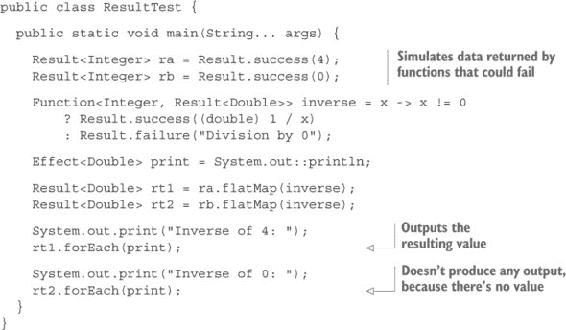

此程序产生以下结果：

```
Inverse of 4: 0.25
Inverse of 0:
```

#### 练习 13.1

在 `List` 类中编写一个 `forEach` 方法，该方法接受一个效果并将其应用于列表的所有元素。

#### 解决方案 13.1

`Nil` 类的实现与 `Result.Empty` 相同：

```
public void forEach(Effect<A> ef) {
  // Do nothing
}
```

`Cons` 类的最简单递归实现如下：

```
public void forEach(Effect<A> ef) {
  ef.apply(head);
  tail.forEach(ef);
}
```

不幸的是，如果你有超过几千个元素，这个实现将会耗尽堆栈。

对于这个问题，有许多不同的解决方案。你不能直接使用 `TailCall` 类来使递归堆栈安全，但你可以使用一个带有副作用的帮助函数并忽略结果：

```
public void forEach(Effect<A> ef) {
  forEach(this, ef).eval();
}

private static <A> TailCall<List<A>> forEach(List<A> list, Effect<A> ef) {
  return list.isEmpty()
      ? TailCall.ret(list)
      : TailCall.sus(() -> {
        ef.apply(list.head());
        return forEach(list.tail(), ef);
      });
}
```

此实现使用了 `forEach` 辅助函数的副作用，但由于你正在实现效果的运用，这实际上并不重要。另一个（更高效）的解决方案是简单地使用 `while` 循环。选择哪种实现取决于你。

#### 13.1.3. 更强大的失败效果

虽然当列表为空时（对于 `Option.None` 和 `Result.Empty` 也是如此）什么都不做是有意义的，但在处理可能出现的错误结果时，这显然是不够的。在这种情况下，你可能需要将效果应用到错误上。

你的 `Result` 类在出现错误的情况下将包含一个 `Exception`。你可能认为对于这种情况有两种不同的效果。第一种效果是抛出异常，第二种是处理异常的另一种方式，避免抛出异常。

在 第七章 中，你在 `Result` 类中编写了 `forEachOrThrow` 方法，它接受一个 `Effect` 作为参数，如果底层值存在，则应用它，如果它是 `Failure`，则抛出异常。

`forEachOrThrow` 的 `Empty` 实现不执行任何操作，类似于 `forEach` 的实现。`Failure` 实现简单地抛出包含的异常：

```
public void forEachOrThrow(Effect<T> c) {
  throw this.exception;
}
```

`Success` 的实现再次类似于 `forEach`，并将效果应用到包含的值上：

```
public void forEachOrThrow(Effect<T> e) {
  e.apply(this.value);
}
```

在失败的情况下抛出异常并不是你通常想要做的，至少在 `Result` 类中是这样。通常，决定做什么是由客户端来决定的，你可能想要做一些比抛出异常更温和的事情。例如，你可能在继续之前记录这个异常。

记录日志并不非常实用，因为日志通常是一个副作用。没有程序是以记录日志作为其主要目标的。使用类似 `forEach` 这样的方法来应用效果是违反函数式契约的。这本身并不是一个问题，但当你记录日志时，你突然就不再是函数式的——这在某些方面意味着函数式程序的终结。效果应用之后，你就可以开始另一个新的函数式程序了。

如果你的应用程序在每一个方法中都记录日志，那么命令式编程和函数式编程之间的边界将不会非常清晰。但是，因为日志通常是一个要求，至少在 Java 世界中是这样，你可能想要一个干净的方式来处理它。在失败的情况下，你没有简单的方法来记录一个异常。你需要的是将失败转换为异常的成功。为此，你需要直接访问异常，而这不能从 `Result` 上下文之外完成。

| |
| --- |

**为什么记录日志是危险的**

在函数式编程中，你不会看到很多日志记录。这是因为函数式编程使得日志记录变得几乎无用。函数式程序是通过组合纯函数构建的，这意味着对于相同的参数，函数总是返回相同的值，因此不可能有任何意外。另一方面，在命令式编程中，日志记录无处不在，因为在命令式程序中，你无法预测给定输入的输出。日志记录就像是在说“我不知道程序在这个点可能会产生什么，所以我将其写入日志文件。如果一切顺利，我就不需要这个日志文件，但如果出了问题，我就能查看日志来了解程序在这个点的状态。”这是无意义的。

在函数式编程中，不需要这样的日志。如果所有函数都是正确的，这通常是可以证明的，你不需要知道中间状态。此外，在命令式程序中的日志记录通常是条件性的，这意味着某些日志代码只有在非常罕见和未知的状态下才会执行。这段代码通常未经测试。如果你曾经看到过一个在 INFO 模式下运行良好的命令式 Java 程序，在 TRACE 模式下运行时突然崩溃，你就知道我的意思了。


#### 13.2 练习

在第七章中，你在`Result`类型中编写了一个`forEachOrException`方法，它在`Empty`和`Success`中的工作方式类似于`forEach`，增加的是它会返回一个`Result.Empty`，并在`Failure`类中返回一个`Result.Success<Exception>`。

编写一个`forEachOrFail`方法，该方法将返回一个包含异常信息的`Result<String>`，而不是异常本身。

注意，这两个方法都不是函数式的。尽管它们返回一个值，但它们可能具有副作用。

#### 13.2 解决方案

`Empty`中的实现不执行任何操作并返回`Empty`：

```
public Result<String> forEachOrFail(Effect<T> c) {
  return empty();
}
```

`Success`中的实现应用了效果并返回`Empty`：

```
public Result<String> forEachOrFail(Effect<T> e) {
  e.apply(this.value);
  return empty();
}
```

`Failure`实现只是返回包含的异常或其消息的`Success`：

```
public Result<String> forEachOrFail(Effect<T> c) {
  return success(exception.getMessage());
}

public Result<RuntimeException> forEachOrException(Effect<T> c) {
  return success(exception);
}
```

这些方法，尽管不是函数式的，但极大地简化了`Result`值的用法：

```
public class ResultTest {

  public static void main(String... args) {

    Result<Integer> ra = Result.success(4);
    Result<Integer> rb = Result.success(0);

    Function<Integer, Result<Double>> inverse = x -> x != 0
        ? Result.success((double) 1 / x)
        : Result.failure("Division by 0");

    Result<Double> rt1 = ra.flatMap(inverse);
    Result<Double> rt2 = rb.flatMap(inverse);

    System.out.print("Inverse of 4: ");
    rt1.forEachOrFail(System.out::println).forEach(ResultTest::log);

    System.out.print("Inverse of 0: ");
    rt2.forEachOrFail(System.out::println).forEach(ResultTest::log);
  }

  private static void log(String s) {
    System.out.println(s);
  }
}
```

这个程序将打印以下内容：

```
Inverse of 4: 0.25
Inverse of 0: Division by 0
```

### 13.2\. 读取数据

到目前为止，你只处理了输出。正如你所看到的，数据输出发生在程序的最后，一旦计算出了结果。这允许大多数程序以函数式的方式编写，并享有该范式的所有好处。只有输出部分不是函数式的。我也说过，输出可以通过将数据发送到其他程序来完成，但你还没有看到如何将数据输入到你的程序中。现在让我们来做这件事。

接下来，我们将探讨一种函数式的方法来输入数据。但首先，就像我们讨论输出那样，我们将讨论如何以干净（尽管非函数式和命令式的）的方式输入数据，这样就可以很好地与函数式部分相匹配。

#### 13.2.1\. 从控制台读取数据

作为示例，你将以一种虽然命令式但允许通过使程序确定性来测试的方式从控制台读取数据。你将使用的方法与你对第十二章中的随机生成器所做的方法类似。

你将首先开发一个示例，该示例读取整数和字符串。以下列表显示了你需要实现的接口。

##### 列表 13.2\. 输入数据的接口

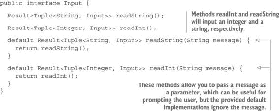

你可以为这个接口编写一个具体实现，但首先你会写一个抽象实现（因为你可能想从其他来源读取数据，例如文件）。你将把通用代码放在一个抽象类中，并为每种输入类型扩展它。以下列表显示了这种实现。

##### 列表 13.3\. `AbstractReader` 的实现

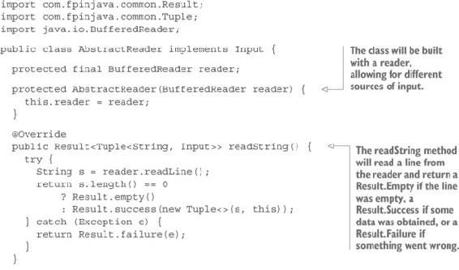

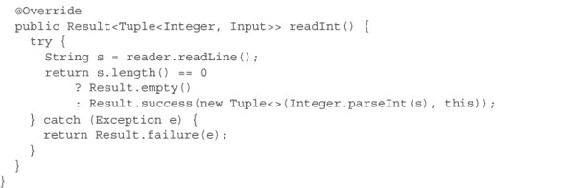

现在你只需要实现一个具体类来从控制台读取。这个类将负责提供 `reader`。此外，你将重新实现接口中的两个默认方法，向用户显示提示。

##### 列表 13.4\. `ConsoleReader` 的实现

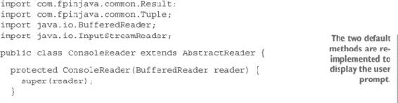

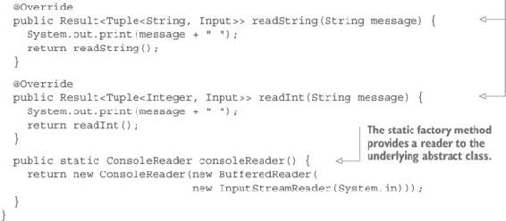

现在，你可以使用你学到的 `ConsoleReader` 类来编写一个完整的程序，从输入到输出。

##### 列表 13.5\. 从输入到输出的完整程序

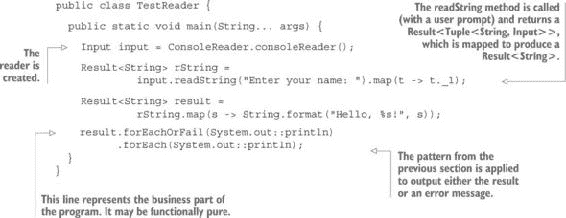

这并不非常令人印象深刻。这相当于大多数编程课程中普遍存在的“hello”程序，通常是第二个示例（在“hello world”之后）。当然，这只是一个示例。有趣的是，它如何容易地演变成为一个更有用的东西。

#### 练习 13.3

编写一个程序，该程序会反复提示用户输入一个整数 ID、一个名字和一个姓氏，并在稍后显示控制台上的人员列表。当用户输入一个空 ID 时，数据输入停止，然后显示输入的数据列表。

##### 提示

你需要一个类来保存每行数据。使用以下列表中显示的 `Person` 类。

##### 列表 13.6\. `Person` 类

```
public class Person {

  private static final String FORMAT =
                 "ID: %s, First name: %s, Last name: %s";
  public final int id;
  public final String firstName;
  public final String lastName;

  private Person(int id, String firstName, String lastName) {
    this.id = id;
    this.firstName = firstName;
    this.lastName = lastName;
  }

  public static Person apply(int id, String firstName, String lastName) {
    return new Person(id, firstName, lastName);
  }

  @Override
  public String toString() {
    return String.format(FORMAT, id, firstName, lastName);
  }
}
```

在 `ReadConsole` 类的主方法中实现解决方案。使用 `Stream.unfold` 方法生成人员流。你可能发现为输入单个人员对应的数据创建一个单独的方法更容易，并使用方法引用作为 `unfold` 的参数。此方法可以具有以下签名：

```
public static Result<Tuple<Person, Input>> person(Input input)
```

#### 解决方案 13.3

解决方案非常简单。考虑到你有一个用于输入单个人员数据的函数，你可以创建一个人员流，并按如下方式打印结果（忽略任何错误）：

```
Input input = ConsoleReader.consoleReader();
Stream<Person> stream = Stream.unfold(input, ReadConsole::person);
stream.toList().forEach(System.out::println);
```

你现在只需要 `person` 方法。此方法将简单地询问 ID、名字和姓氏，生成三个 `Result` 实例，这些实例可以使用你在前几章中学到的理解模式进行组合：

```
public static Result<Tuple<Person, Input>> person(Input input) {
  return input.readInt("Enter ID:")
     .flatMap(id -> id._2.readString("Enter first name:")
         .flatMap(firstName -> firstName._2.readString("Enter last name:")
             .map(lastName -> new Tuple<>(Person.apply(id._1, firstName._1,
                                             lastName._1), lastName._2))));
}
```

注意，理解模式可能是函数式编程中最重要的一种模式，所以你真的需要掌握它。其他语言，如 Scala 或 Haskell，为此提供了语法糖，但 Java 没有提供。在伪代码中，这对应于以下内容：

```
for {
  id in input.readInt("Enter ID:")
  firstName in id._2.readString("Enter first name:")
  lastName in firstName._2.readString("Enter last name:")
} return new Tuple<>(Person.apply(id._1, firstName._1,
                                             lastName._1), lastName._2))
```

但你实际上并不需要这种语法糖。`flatMap` 习语可能一开始比较难掌握，但它确实展示了正在发生的事情。

顺便说一句，许多程序员都知道这个模式如下：

```
a.flatMap(b -> flatMap(c -> map(d -> getSomething(a, b, c, d))))
```

他们常常认为它总是以一系列的 `flatMap` 结尾，最后是 `map`。这绝对不是事实。它是否以 `map` 或 `flatMap` 结尾完全取决于返回类型。通常情况下，最后一个方法（这里指的是 `getSomething`）返回一个裸值，这就是为什么模式以 `map` 结尾。但如果 `getSomething` 返回一个上下文（例如 `Result`），模式如下：

```
a.flatMap(b -> flatMap(c -> flatMap(d -> getSomething(a, b, c, d))))
```

#### 13.2.2. 从文件中读取

你设计的程序使得将其适应读取文件变得非常简单。`FileReader` 类与 `ConsoleReader` 非常相似。唯一的区别是静态工厂方法必须处理 `IOException`，因此它返回 `Result<Input>` 而不是裸值。

##### 列表 13.7. `FileReader` 的实现

```
import com.fpinjava.common.Result;
import java.io.*;

public class FileReader extends AbstractReader {

  private FileReader(BufferedReader reader) {
    super(reader);
  }

  public static Result<Input> fileReader(String path) {
    try {
      return Result.success(new FileReader(new BufferedReader(
        new InputStreamReader(new FileInputStream(new File(path))))));
    } catch (Exception e) {
      return Result.failure(e);
    }
  }
}
```

#### 练习 13.4

编写一个 `ReadFile` 程序，类似于 `ReadConsole`，但它从包含条目的文件中读取，每行一个条目。本书附带代码中提供了一个示例文件（[`github.com/fpinjava/fpinjava`](http://github.com/fpinjava/fpinjava)）。

##### 提示

虽然它与 `ReadConsole` 程序类似，但你必须处理工厂方法返回 `Result` 的事实。尽量重用相同的 `person` 方法。

#### 解决方案 13.4

解决方案在 列表 13.8 中给出。注意在调用 `person` 方法之前如何处理工厂方法返回的 `Result`，这允许你使用与 `ConsoleReader` 相同的方法。（你也可以使用不带任何参数的 `read` 方法。）

##### 列表 13.8. `ReadFile` 的实现

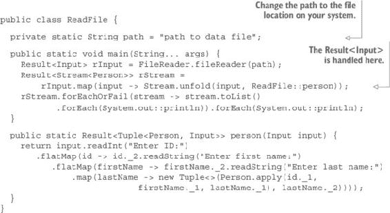

#### 13.2.3. 使用输入进行测试

在前一个解决方案中采取的方法的一个好处是程序很容易测试。当然，你可以通过在控制台提供文件而不是用户输入来测试你的程序，但与将程序与生成输入命令脚本的另一个程序接口一样容易。以下列表显示了一个可以用于测试的示例 `ScriptReader`。

##### 列表 13.9. 允许使用输入命令列表的 `ScriptReader`

```
public class ScriptReader implements Input {

  private final List<String> commands;

  public ScriptReader(List<String> commands) {
    super();
    this.commands = commands;
  }

  public ScriptReader(String... commands) {
    super();
    this.commands = List.list(commands);
  }

  public Result<Tuple<String, Input>> readString() {
    return commands.isEmpty()
        ? Result.failure("Not enough entries in script")
        : Result.success(new Tuple<>(commands.headOption().getOrElse(""),
                                      new ScriptReader(commands.drop(1))));
  }

  @Override
  public Result<Tuple<Integer, Input>> readInt() {
    try {
      return commands.isEmpty()
          ? Result.failure("Not enough entries in script")
          : Integer.parseInt(commands.headOption().getOrElse("")) >= 0
              ? Result.success(new Tuple<>(Integer.parseInt(
                                   commands.headOption().getOrElse("")),
                                      new ScriptReader(commands.drop(1))))
              : Result.empty();
    } catch(Exception e) {
      return Result.failure(e);
    }
  }
}
```

下一个列表显示了一个使用 `ScriptReader` 类的示例。在本书的代码中，你可以找到单元测试的示例。

##### 列表 13.10. 使用 `ScriptReader` 输入数据

```
public class ReadScriptReader {

  public static void main(String... args) {
    Input input = new ScriptReader(
        "0", "Mickey", "Mouse",
        "1", "Minnie", "Mouse",
        "2", "Donald", "Duck",
        "3", "Homer", "Simpson"
    );

    Stream<Person> stream =
                Stream.unfold(input, ReadScriptReader::person);
    stream.toList().forEach(System.out::println);
  }

  public static Result<Tuple<Person, Input>> person(Input input) {
    return input.readInt("Enter ID:")
      .flatMap(id -> id._2.readString("Enter first name:")
         .flatMap(firstName -> firstName._2.readString("Enter last name:")
            .map(lastName -> new Tuple<>(Person.apply(id._1, firstName._1,
                                             lastName._1), lastName._2))));
  }
}
```

### 13.3. 真正的功能性输入/输出

你到目前为止学到的知识对于大多数 Java 程序员来说已经足够了。将程序的函数部分与非函数部分分开是必要的，也是足够的。但是，了解 Java 程序如何变得更加函数化是非常有趣的。

你是否在 Java 程序的生产环境中使用以下技术取决于你。这可能不值得额外的复杂性。然而，学习这些技术是有用且有趣的，这样你可以做出明智的选择。

#### 13.3.1\. 如何使输入/输出完全函数化？

对于这个问题有几个答案。最简短的答案是：它不能。根据我们对函数式程序的定义，即“一个除了返回值外没有其他可观察效果的程序”，无法进行任何输入或输出。

但是，许多程序不需要进行任何输入或输出。例如，许多库都属于这一类。库是设计为供其他程序使用的程序。它们接收参数值，并根据它们的参数返回计算结果。在本章的前两节中，你将你的程序分为三个部分：一个进行输入，一个进行输出，第三个部分作为库，并且完全函数化。

处理问题的另一种方法是编写这个库部分，并生成一个最终返回值，即另一个（非功能性的）程序，该程序处理所有输入和输出。这在概念上与惰性非常相似。你可以将输入和输出视为将来在单独的程序中发生的事情，该程序将是你的纯函数式程序的返回值。

#### 13.3.2\. 实现纯函数式输入/输出

在本节中，你将了解如何实现纯函数式输入/输出。让我们从输出开始。想象一下，你只想在控制台显示一条欢迎信息。目前，你将假设你已经知道要使用的信息名称。而不是编写这个

```
static void sayHello(String name) {
   System.out.println("Hello, " + name + "!");
}
```

我们可以使得`sayHello`方法返回一个程序，一旦运行，就会产生相同的效果。为此，你可能使用 lambda 和`Runnable`接口，如下所示：

```
static Runnable sayHello(String name) {
    return () -> System.out.println("Hello, " + name + "!");
}
```

你可以使用以下方法使用此方法：

```
public static void main(String... args) {
  Runnable program = sayHello("Georges");
}
```

这段代码是纯函数式的。你可以争论说它没有做任何可见的事情，这是真的。它生成一个可以运行以产生所需效果的程序。这个程序可以通过调用它生成的`Runnable`对象的`run`方法来运行。返回的程序不是函数式的，但你并不关心。你的程序是函数式的。

这是在作弊吗？不是。想想任何“函数式”语言编写的程序。最终，它被编译成一个可执行的程序，这个程序绝对不是函数式的，并且可以在你的计算机上运行。你正在做的是完全相同的事情，只是你生成的程序可能看起来像是用 Java 编写的。实际上，它不是。它是用某种类型的 DSL（领域特定语言）编写的，你的程序正在构建这种语言。

要执行这个程序，你可以简单地写下：

```
program.run();
```

注意，大多数代码检查程序不会喜欢在`Runnable`上调用`run`的事实。这就是为什么在之前的章节中，你创建了`Executable`接口来做同样的事情。

在这里，你需要更强大的功能，所以你会创建一个新的接口名为`IO`。你将从单个`run`方法开始。在这个阶段，它与`Runnable`没有区别：

```
public interface IO {
  void run();
}
```

假设你有以下三个方法：

```
static IO println(String message) {
  return () -> System.out.print(message);
}

static <A> String toString(Result<A> rd) {
  return rd.map(Object::toString).getOrElse(rd::toString);
}

static Result<Double> inverse(int i) {
  return i == 0
      ? Result.failure("Div by 0")
      : Result.success(1.0 / i);
}
```

你可能会编写以下纯函数式程序：

```
IO computation = println(toString(inverse(3)));
```

这个程序生成另一个可以稍后执行的程序：

```
computation.run();
```

#### 13.3.3\. 结合 IO

使用你的`IO`接口，你可以构建任何程序，但作为一个单一单元。能够组合这样的程序将很有趣。你可以使用的最简单的组合是将两个程序组合成一个。这就是你将在以下练习中做的。

#### 练习 13.5

在`IO`接口中创建一个方法，允许你将两个`IO`实例组合成一个。这个方法将被称为`add`，并且它将有一个默认实现。以下是签名：

```
default IO add(IO io)
```

#### 解决方案 13.5

解决方案很简单，就是返回一个新的`IO`，它有一个`run`实现，首先执行当前的`IO`，然后执行参数`IO`：

```
default IO add(IO io) {
  return () -> {
    IO.this.run();
    io.run();
  };
}
```

你稍后需要一个“什么也不做”的`IO`来作为某些`IO`组合的中性元素。这可以在 IO 接口中轻松创建，如下所示：

```
IO<Nothing> empty = () -> Nothing.instance;
```

使用这些新方法，你可以通过组合`IO`实例来创建更复杂的程序：

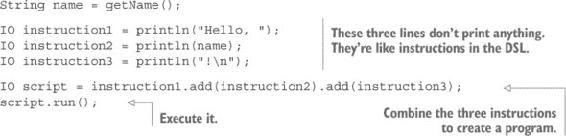

当然，你可以简化这个过程：

```
println("Hello, ").add(println(name)).add(println("!\n")).run();
```

你也可以从一系列指令创建一个程序：

```
List<IO> instructions = List.list(
    println("Hello, "),
    println(name),
    println("!\n")
);
```

这看起来像是一个命令式程序吗？实际上，它是。为了“编译”它，你可能使用一个右折叠：

```
IO program = instructions.foldRight(IO.empty(), io -> io::add);
```

或者一个左折叠：

```
IO program = instructions.foldLeft(IO.empty(), acc -> acc::add);
```

你可以看到为什么需要一个“什么也不做”的实现。最后，你可以像通常一样运行程序：

```
program.run();
```

#### 13.3.4\. 使用 IO 处理输入

到目前为止，你的`IO`类型只能处理输出。为了使其能够处理输入，一个必要的更改是使用输入值的类型对其进行参数化，以便它可以用来处理这个值。以下是新的参数化`IO`类型：

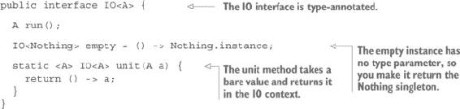

如你所见，`IO`接口以与`Option`、`Result`、`List`、`Stream`、`State`等类似的方式创建计算上下文。它同样有一个返回空实例的方法，以及一个将裸值放入上下文的方法。

为了在`IO`值上执行计算，你现在需要像`map`和`flatMap`这样的方法来将函数绑定到`IO`上下文。

#### 练习 13.6

在`IO<A>`中定义一个`map`方法，它接受一个从`A`到`B`的函数作为其参数，并返回一个`IO<B>`。在`IO`接口中将其作为默认实现。

#### 解决方案 13.6

这是实现，它将函数应用于`this`的值，并在新的`IO`上下文中返回结果：

```
default <B> IO<B> map(Function<A, B> f) {
  return () -> f.apply(this.run());
}
```

#### 练习 13.7

编写一个`flatMap`方法，它接受一个从`A`到`IO<B>`的函数作为其参数，并返回一个`IO<B>`。

##### 提示

不要担心潜在的栈问题。您将在以后处理这个问题。

#### 解决方案 13.7

将函数应用于运行 `thisIO` 获得的值将给出 `IO<IO<B>>`。您需要展开这个结果，这可以通过简单地运行它来完成，如下所示：

```
default <B> IO<B> flatMap(Function<A, IO<B>> f) {
  return () -> f.apply(this.run()).run();
}
```

如您所见，这有点递归。一开始这不会是问题，因为只有一个递归步骤，但如果您要链式调用大量的 `flatMap` 调用，它可能会成为问题。

要查看您的新方法如何工作，请使用以下 `Console` 类。

##### 列表 13.11\. `Console` 类

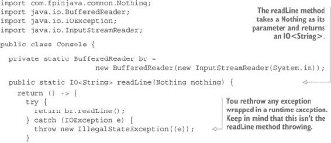

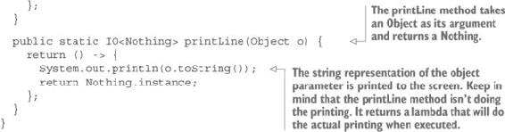

重要的是要注意，这两个方法完全是函数式的。它们不会抛出任何异常，也不会从控制台读取或打印。它们只返回执行这些操作的程序。

要看到这个程序的工作情况，您可以运行以下示例程序。

##### 列表 13.12\. 以纯函数方式从控制台读取和打印

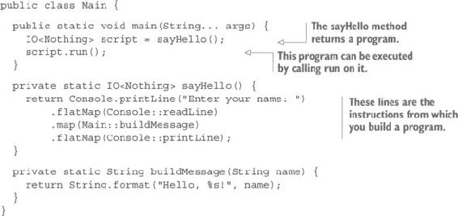

#### 13.3.5\. 扩展 IO 类型

通过使用 `IO` 类型，您可以在纯函数方式中创建不纯的程序（具有效果的程序）。但在这个阶段，这些程序只能让我们从类似 `Console` 类的元素中读取和打印。您可以通过添加创建控制结构（如循环和条件）的指令来扩展您的 DSL。

首先，您将实现一个类似于 `for` 索引循环的循环。这将采取 `repeat` 方法的形式，该方法接受迭代次数和要重复的 `IO` 作为参数。

#### 练习 13.8

在 `IO` 接口中将 `repeat` 实现为一个静态方法，其签名如下：

```
static <A> IO<List<A>> repeat(int n, IO<A> io)
```

##### 提示

您应该创建一个表示每个迭代的 `IO` 实例的集合，然后通过组合 `IO` 实例来折叠这个集合。为此，您需要比 `add` 方法更强大的功能。首先，实现一个具有以下签名的 `map2` 方法：

```
static <A, B, C> IO<C> map2(IO<A> ioa, IO<B> iob,
                                        Function<A, Function<B, C>> f)
```

#### 解决方案 13.8

`map2` 方法可以按以下方式实现：

```
static <A, B, C> IO<C> map2(IO<A> ioa, IO<B> iob,
                                        Function<A, Function<B, C>> f) {
  return ioa.flatMap(a -> iob.map(b -> f.apply(a).apply(b)));
}
```

这是一个普遍存在的理解模式的简单应用。有了这个方法，您可以轻松地实现 `repeat`，如下所示：

```
static <A> IO<List<A>> repeat(int n, IO<A> io) {
  return Stream.fill(n, () -> io)
    .foldRight(() -> unit(List.list()), ioa -> sioLa -> map2(ioa,
                               sioLa.get(), a -> la -> List.cons(a, la)));
}
```

注意您使用 `Stream.fill()` 方法创建流，该方法具有以下签名：

```
public static <T> Stream<T> fill(int n, Supplier<T> elem)
```

它返回一个包含 `T` 类型 `n` 个（懒加载）实例的 `Stream`。

这可能看起来有点复杂，但部分原因是由于打印时换行，部分原因是它被写成一行以进行优化。它与以下内容等效：

```
static <A> IO<List<A>> repeat(int n, IO<A> io) {
  Stream<IO<A>> stream = Stream.fill(n, () -> io);
  Function<A, Function<List<A>, List<A>>> f = a -> la -> List.cons(a, la);
  Function<IO<A>, Function<Supplier<IO<List<A>>>, IO<List<A>>>> g =
                                 ioa -> sioLa -> map2(ioa, sioLa.get(), f);
  Supplier<IO<List<A>>> z = () -> unit(List.list());
  return stream.foldRight(z, g);
}
```

如果您使用的是 IDE，找到类型相对容易。例如，在 IntelliJ 中，您只需在按住 Ctrl 键的同时将鼠标指针放在引用上，就可以显示类型。

使用这些方法，您现在可以编写以下代码：

```
IO program = IO.repeat(3, sayHello());
```

这将给出一个与调用以下方法作为 `sayHello(3)` 相对应的程序：

```
private static void sayHello(int n) throws IOException {

  BufferedReader br = new BufferedReader(new InputStreamReader(System.in));

  for (int i = 0; i < n; i++) {
    System.out.println("Enter your name: ");
    String name = br.readLine();
    System.out.println(buildMessage(name));
  }
}
```

然而，非常重要的区别是，调用`sayHello(3)`会三次积极地执行效果，而`IO.repeat(3, sayHello())`将简单地返回一个（未评估的）程序，它只有在调用其`run`方法时才会执行相同的效果。

可以定义许多其他控制结构。你可以在附带的代码中找到示例，这些代码可以从[`github.com/fpinjava/fpinjava`](http://github.com/fpinjava/fpinjava)下载。以下列表显示了使用`when`和`doWhile`方法的示例，这些方法与命令式 Java 中的`if`和`while`做完全相同的事情。

##### 列表 13.13\. 使用`IO`封装命令式编程

```
public class Main {

  public static void main(String... args) throws IOException {

    IO program = program(buildMessage,
                         "Enter the names of the persons to welcome:");
    program.run();
  }

  public static IO<Nothing> program(Function<String, IO<Boolean>> f,
                                                         String title) {
    return IO.sequence(
        Console.printLine(title),
        IO.doWhile(Console.readLine(), f),
        Console.printLine("bye!")
    );
  }

  private static Function<String, IO<Boolean>> buildMessage =
            name -> IO.when(name.length() != 0,
               () -> IO.unit(String.format("Hello, %s!", name))
      .flatMap(Console::printLine));
}
```

这个例子并不是建议你应该这样编程。当然，最好只使用`IO`类型进行输入和输出，在函数式编程中完成所有计算。毕竟，如果你选择学习函数式编程，可能不是为了在函数式代码中实现命令式语言。但作为一个练习，了解它是如何工作的，这是很有趣的。

#### 13.3.6\. 使`IO`类型堆栈安全

在之前的练习中，你可能没有注意到一些`IO`方法使用了与递归方法相同的方式使用栈。例如，`repeat`方法如果重复次数太高，就会导致栈溢出。"太高"的具体数值取决于栈的大小以及当方法返回的程序运行时栈的满载程度。（到现在为止，我期望你已经理解调用`repeat`方法不会导致栈溢出。只有运行它返回的程序才可能这样做。）

#### 练习 13.9

为了实验栈溢出，创建一个接受`IO`作为参数并返回一个在无限循环中执行该参数的新`IO`的`forever`方法。以下是相应的签名：

```
static <A, B> IO<B> forever(IO<A> ioa)
```

#### 解决方案 13.9

这就像它的无用性一样简单实现！你所要做的就是使构造的程序无限递归。请注意，`forever`方法本身不应该递归。只有返回的程序应该递归。解决方案是使用`Supplier`，并将`IO`参数与执行`get`操作的`Supplier`的`IO`进行`flatMap`：

```
static <A, B> IO<B> forever(IO<A> ioa) {
  Supplier<IO<B>> t = () -> forever(ioa);
  return ioa.flatMap(x -> t.get());
}
```

这个方法可以这样使用：

```
public static void main(String... args) {
  IO program = IO.forever(IO.unit("Hi again!")
                            .flatMap(Console::printLine));
  program.run();
}
```

它在几千次迭代后会溢出栈。请注意，这与以下代码等效：

```
IO.forever(Console.printLine("Hi again!")).run();
```

如果你不知道为什么会导致栈溢出，可以考虑以下伪代码（这个代码无法编译！）其中`t`变量被相应的表达式替换：

```
static <A, B> IO<B> forever(IO<A> ioa) {
  return ioa.flatMap(x -> (() -> forever(ioa)).get());
}
```

现在，让我们用相应的代码替换递归调用：

```
static <A, B> IO<B> forever(IO<A> ioa) {
  return ioa.flatMap(x -> (() -> ioa.flatMap(x -> (() -> forever(ioa)).get())).get());
}
```

你可以无限递归地继续。 （记住，你不应该尝试编译这段代码！）你可能注意到`flatMap`的调用将是嵌套的，每次调用都会将当前状态推入栈中，这确实会在几千步后导致栈溢出。与命令式代码不同，在命令式代码中你会依次执行一条指令，你调用`flatMap`方法递归。

要使`IO`堆栈安全，你可以使用与你在第四章中创建堆栈安全递归方法和函数相同的技巧。首先，你需要表示你程序的三种状态：

+   `Return`将表示一个完成的计算，这意味着你只需返回结果。

+   `Suspend`将表示一个挂起的计算，当在恢复当前计算之前必须应用某些效果时。

+   `Continue`将表示一个程序必须首先应用子计算然后再继续下一个的状态。

这些状态将由以下三个类表示列表 13.14。


##### 注意

列表 13.14 至列表 13.16 是整体的一部分。它们不应该与迄今为止构建的代码一起使用，而应该一起使用。


##### 列表 13.14\. 使`IO`堆栈安全所需的三个类

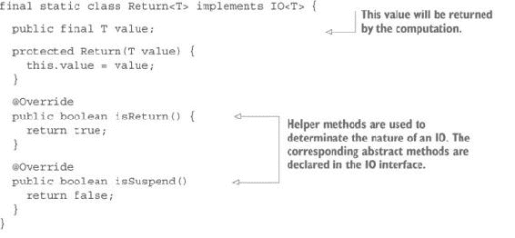

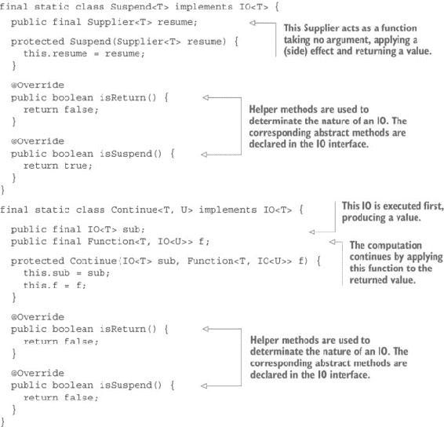

必须对封装的`IO`接口进行一些修改，如列表 13.15 和 13.16 所示。

##### 列表 13.15\. `IO`堆栈安全版本的更改

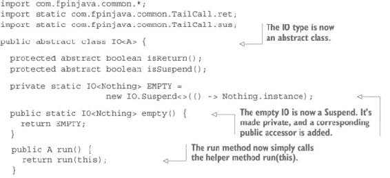

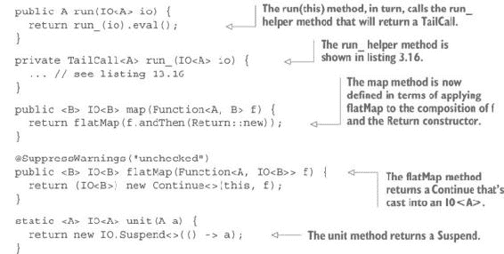

##### 列表 13.16\. 堆栈安全的`run`方法

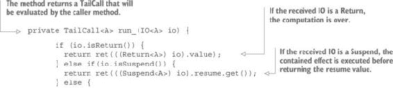

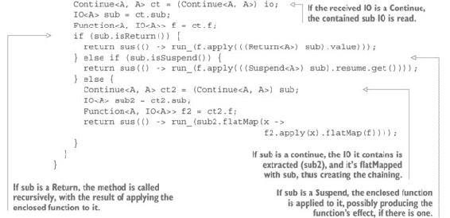

新的堆栈安全版本可以使用如下方式。

##### 列表 13.17\. 使用堆栈安全版本的`Console`类

```
public class Console {

  private static BufferedReader br = new BufferedReader(new InputStreamReader(System.in));

  public static IO<String> readLine(Nothing nothing) {
    return new IO.Suspend<>(() -> {
      try {
        return br.readLine();
      } catch (IOException e) {
        throw new IllegalStateException((e));
      }
    });
  }

  /**
   * A possible implementation of readLine as a function
   */
  public static Function<Nothing, IO<String>> readLine_ = x -> new IO.Suspend<>(() -> {
    try {
      return br.readLine();
    } catch (IOException e) {
      throw new IllegalStateException((e));
    }
  });

  /**
   * A simpler implementation of readLine as a function using a method reference
   */
  public static Function<Nothing, IO<String>> readLine = Console::readLine;

  /**
   * A convenience helper method allowing calling the readLine method without
   * providing a Nothing.
   */
  public static IO<String> readLine() {
    return readLine(Nothing.instance);
  }

  public static IO<Nothing> printLine(Object s) {
    return new IO.Suspend<>(() -> println(s));
  }

  private static Nothing println(Object s) {
    System.out.println(s);
    return Nothing.instance;
  }

  public static IO<Nothing> printLine_(Object s) {
    return new IO.Suspend<>(() -> {
      System.out.println(s);
      return Nothing.instance;
    });
  }
  public static Function<String, IO<Nothing>> printLine_ =
            s -> new IO.Suspend<>(() -> {
              System.out.println(s);
              return Nothing.instance;
            });

  public static Function<String, IO<Nothing>> printLine = Console::printLine;
}
```

现在你可以使用`forever`或`doWhile`而不用担心堆栈溢出。你也可以重写`repeat`使其堆栈安全。这里我不会展示新的实现，但你可以从配套代码([`github.com/fpinjava/fpinjava`](http://github.com/fpinjava/fpinjava))中找到它。

请记住，这并不是编写函数式程序的建议方式。将其视为一个最终可以完成的例子，而不是作为良好实践。此外，请注意，“最终”在这里适用于 Java 编程。使用更函数式友好的语言，你可以构建更强大的程序。

### 13.4\. 摘要

+   可以将效果传递到`List`、`Result`和其他上下文中，安全地应用于值，而不是从这些上下文中提取值并在外部应用效果，如果没有值，这可能会导致错误。

+   成功和失败两种不同效果的处理可以抽象在`Result`类型内部。

+   读取数据可以像在第十二章中生成随机数一样进行。

+   从文件中读取的方式与从控制台或通过`Reader`抽象从内存中读取的方式完全相同。

+   通过`IO`类型可以获得更多功能的输入/输出。

+   `IO`类型可以扩展为一个更通用的类型，这使得通过构建稍后将要执行的程序以函数式方式执行任何命令式任务成为可能。

+   可以通过使用与堆栈安全递归方法和函数相同的技巧来使`IO`类型堆栈安全。
