## 第十四章。使用演员共享可变状态

***本章涵盖的内容***

+   理解演员模型

+   使用异步消息

+   构建演员框架

+   将演员投入工作

+   优化演员表现

在处理这本书的过程中，你首先了解到函数式编程通常处理不可变数据，这导致程序更安全、更可靠，并且更容易设计和扩展。然后你了解到可以通过将状态作为函数的参数传递来以函数式方式处理可变状态。你看到了几个这种技术的例子：

+   在生成随机数时传递生成器允许提高测试性。

+   将控制台作为参数传递允许你将功能输出发送到屏幕，并从键盘接收输入。

这种技术可以广泛应用于许多领域。在命令式编程中，解析文件通常通过持续修改表示解析结果的组件的状态来处理。为了使此过程与函数式编程兼容，你只需将状态作为所有解析函数的附加参数传递即可。日志记录也可以以相同的方式进行，以及监控性能：而不是在每个函数中写入日志文件，你可以让函数接收日志文件作为参数，并将增强的文件作为结果的一部分返回。

这种方法的好处是，它让你在访问资源时不必关心同步和锁定。但这种安全性是通过防止数据共享获得的。这是好事，因为它迫使你找到其他更安全的方法来做事情。使用不可变列表不会自动为涉及共享这些列表的操作增加安全性。它只是阻止你共享可变状态。它允许你以某种方式模拟列表的修改，这大致对应于制作防御性副本，但不会带来性能损失。这很有用，但有时这并不是你需要的。

假设你想要计算一个函数被调用的次数。在一个单线程应用程序中，你可能会通过将计数器添加到函数参数中，并将增加的计数器作为结果的一部分返回来做这件事。但大多数命令式程序员更愿意将计数器作为副作用来增加。这将无缝进行，因为只有一个线程，所以不需要锁定来防止潜在的并发访问。这就像生活在一个荒岛上。如果你是唯一的居民，那么在门上上锁实际上真的没有必要。

但在多线程程序中，你如何以安全的方式增加计数器，避免并发访问？答案通常是使用锁或使操作原子化，或者两者兼而有之。

在函数式编程中，共享资源必须作为一个效果来完成，这意味着，或多或少，每次你访问共享资源时，你都必须离开函数式安全，并将这种访问视为你在第十三章中处理输入/输出时所做的。这意味着你必须管理锁和同步吗？绝对不是。正如你在前面的章节中学到的，函数式编程也是关于将抽象推向极限。共享可变状态可以被抽象化，这样你就可以使用它而不用担心那些令人毛骨悚然的细节。实现这一点的一种方法就是使用演员框架。

与前面的章节不同，在这里你不会开发一个真实、完整的演员框架。创建一个完整的演员框架是一项如此巨大的工作，你可能会选择使用现有的一个。在这里，你将开发一个最小的演员框架，这将给你带来演员框架为函数式编程带来的感觉。

### 14.1. 演员模型

在演员模型中，一个多线程应用程序被划分为基本单线程的组件，称为*演员*。如果每个演员都是单线程的，那么它不需要使用锁或同步来共享数据。演员通过效果与其他演员进行通信，就像这种通信是输入/输出一样。这意味着演员依赖于一种序列化他们接收到的消息的机制。（在这里，“序列化”意味着依次处理一个消息。这不要与 Java 序列化混淆。）由于这种机制，它们可以一次处理一个消息，而无需担心它们资源的并发访问。因此，演员系统可以看作是一系列通过效果相互通信的功能程序。每个演员都可以是单线程的，因此内部没有资源的并发访问。并发性在框架内部被抽象化。

#### 14.1.1. 异步消息传递

作为消息处理的一部分，演员可以向其他演员发送消息。消息是以异步方式发送的，这意味着不需要等待答案。一旦消息被发送，发送者就可以继续其工作，这主要是由处理它接收到的消息队列中的消息组成。当然，处理消息队列意味着需要对队列进行一些并发访问的管理。但这种管理在演员框架中被抽象化，所以你，程序员，不需要担心这一点。

当然，可能需要消息的答案。假设一个演员负责一项长期计算。客户端可以利用异步性，在计算被处理的同时继续自己的工作。但是一旦计算完成，客户端必须有一种方式来接收结果。这很简单，就是让负责计算的演员回调其客户端，并以异步方式发送结果。请注意，客户端可能是原始发送者，尽管这并不总是必须的。

#### 14.1.2\. 处理并行化

演员模型允许通过使用一个负责将任务分解为子任务并将它们分配给多个工作演员的管理演员来并行化任务。每次一个工作演员将结果返回给管理演员时，它都会得到一个新的子任务。这种模型相较于其他并行化模型的优势在于，没有任何工作演员会在子任务列表为空之前处于空闲状态。缺点是管理演员不会参与计算。但在实际应用中，这通常不会造成明显的差异。

对于某些任务，当收到子任务的结果时可能需要重新排序。在这种情况下，管理演员可能会将结果发送给负责这项工作的特定演员。你可以在第 14.2.3 节中看到一个例子。在小程序中，管理器本身可以处理这个任务。在图 14.1 中，这个演员被称为`Receiver`。

##### 图 14.1\. `Main` 演员产生主要任务并将其发送给`Manager` 演员，

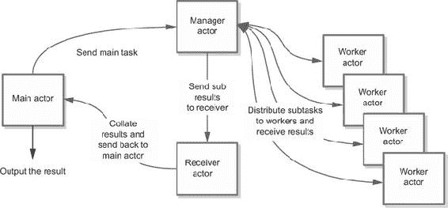

#### 14.1.3\. 处理演员状态变更

演员（actors）可以是无状态的（不可变的）或有状态的，这意味着它们应该根据接收到的消息来改变它们的状态。例如，一个同步器演员可能会接收到需要在使用前重新排序的计算结果。

想象一下，例如，您有一个必须经过大量计算才能提供结果列表的数据列表。简而言之，这是一个映射。可以通过将列表拆分为几个子列表并将这些子列表分配给工作演员进行处理来并行化。但是，不能保证工作演员将以与分配给他们的任务相同的顺序完成他们的工作。为了重新同步结果的一个解决方案是对任务进行编号。当工作演员发送回结果时，它会添加相应的任务编号，这样接收者就可以将结果放入优先队列。这不仅允许自动排序，而且还使得将结果作为异步流处理成为可能。每次接收者收到一个结果时，它会将任务编号与预期编号进行比较。如果匹配，它将结果传递给客户端，然后查看优先队列以确定第一个可用的结果是否对应于新的预期任务编号。如果再次匹配，则出队过程将继续，直到不再匹配。如果接收到的结果与预期结果编号不匹配，它将简单地添加到优先队列中。

在这样的设计中，接收的演员必须处理两块可变数据：优先队列和预期结果编号。这意味着演员必须使用可变属性吗？这并不是什么大问题，但鉴于演员是单线程的，这甚至不是必要的。正如您将看到的，属性变更的处理可以包含并抽象为一个通用的状态变更过程，允许程序员仅使用不可变数据。

### 14.2. 构建演员框架

在本节中，您将学习如何构建一个最小但功能齐全的演员框架。在构建此框架的过程中，您将了解演员框架如何允许安全地共享可变状态、易于且安全的并行化和反序列化，以及应用程序的模块化架构。在本章结束时，您将看到一些您可以使用演员框架执行的一般性操作。

您的演员框架将由四个组件组成：

+   `Actor` 接口将确定演员的行为。

+   `AbstractActor` 类将包含所有演员共有的内容。这个类必须由业务演员扩展。

+   `ActorContext` 将作为访问演员的一种方式。在您的实现中，这个组件将非常简约，主要用于访问演员行为。在这个小型实现中，这个组件实际上并不是必需的，但大多数严肃的实现都会使用这样的组件。这个上下文允许，例如，搜索可用的演员。

+   `MessageProcessor` 接口将是您为任何必须处理接收到的消息的组件实现的接口。

#### 14.2.1. 此演员框架的限制

正如我所说，你在这里创建的实现是极简的；将其视为理解和使用 actor 模型的一种方式。你将缺少许多（大多数？）真实 actor 系统的功能，尤其是那些与 actor 上下文相关的功能。另一个简化是，每个 actor 将被映射到一个单独的线程。在真实的 actor 系统中，actor 会被映射到线程池中，允许数千甚至数百万个 actor 在几十个线程上运行。

你实现的另一个限制是，大多数 actor 框架允许以透明的方式处理分布式 actor，这意味着你可以使用运行在不同机器上的 actor，而不必关心通信。这当然使 actor 框架成为构建可扩展应用的理想方式。我们不会处理这个方面。

#### 14.2.2. 设计 actor 框架接口

首先，你需要定义将构成你的 actor 框架的接口。当然，最重要的是定义`Actor`接口，它将定义几个方法。这个接口的主要方法是

```
void tell(T message, Result<Actor<T>> sender)
```

这个方法用于向这个 actor（即持有这个方法的 actor）发送消息。当然，这意味着要向 actor 发送消息，你必须有它的引用。（这与真实的 actor 框架不同，在真实的 actor 框架中，消息不是发送给 actor，而是发送给 actor 引用、代理或其他替代品。没有这个增强，就无法向远程 actor 发送消息。）这个方法将`Result<Actor>`作为第二个参数。它应该表示发送者，但有时会被设置为无人（空结果）或不同的 actor。

其他方法用于管理 actor 的生命周期，以简化 actor 的使用，如列表 14.1 所示。请注意，这段代码并不是为了使用之前章节的练习结果，而是使用本书附带代码中的`fpinjava-common`模块（[`github.com/fpinjava/fpinjava`](https://github.com/fpinjava/fpinjava)）。这基本上与练习的解决方案相同，但增加了一些方法。

##### 列表 14.1. `Actor`接口

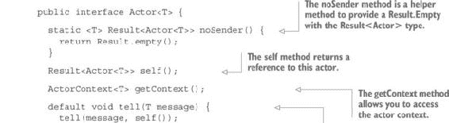

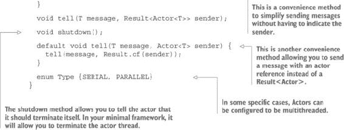

下面的列表显示了另外两个必要的接口：`ActorContext`和`MessageProcessor`。

##### 列表 14.2. `ActorContext`和`MessageProcessor`接口

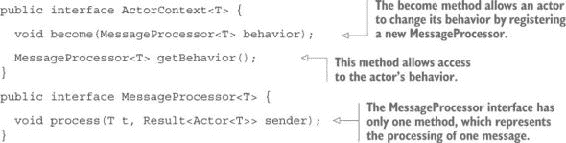

这里最重要的元素是`ActorContext`接口。`become`方法允许 actor 改变其行为，即处理消息的方式。如你所见，actor 的行为看起来像是一个效果，它的参数是一个由要处理的消息和发送者组成的对。

在应用程序的生命周期中，每个演员的行为将被允许改变。通常，这种行为的变化将由演员状态的修改引起，用新的行为替换原始行为。一旦您看到实现，这将更加清晰。

#### 14.2.3. 抽象演员实现

`AbstractActor` 实现代表了所有演员实现中共同的部分。所有的消息管理操作都是共同的，并由演员框架提供，这样您就只需要实现业务部分。`AbstractActor` 实现如下所示。

##### 列表 14.3. `AbstractActor` 实现列表


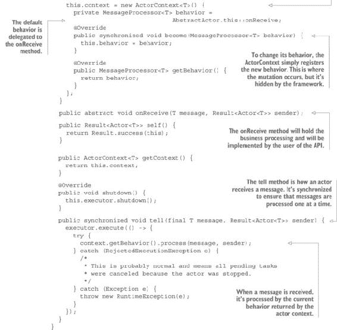

注意，如果演员是单线程的，`Executor` 将使用单个线程执行器初始化，这是最一般的情况，或者如果它是多线程的，则使用缓存线程池。线程池使用守护线程工厂创建，以便在主线程终止时自动关闭。

您的演员框架现在已经完成，尽管如我之前提到的，这并不是生产代码。这是一个最小示例，用来展示一个演员框架可能的工作方式。

### 14.3. 使用演员

现在您已经拥有了一个可用的演员框架，是时候将其应用于一些具体问题上了。当多个线程需要共享一些可变状态时，演员非常有用，例如当一个线程产生计算结果，而这个结果必须传递给另一个线程进行进一步处理时。通常，这种可变状态共享是通过在共享的可变属性中存储值来完成的，这暗示了锁定和同步。我们首先将查看一个最小的演员示例，这可以被认为是演员的“Hello, World!”。然后我们将研究一个更完整的应用，其中使用演员将任务分配给其他并行工作的演员。

第一个示例是一个最小、传统的示例，用于测试演员。它由两个乒乓球运动员和一个裁判员组成。游戏开始时，代表整数的球被交给一个玩家。然后每个玩家将球发送给另一个玩家，直到发生十次，此时球被交还给裁判员。

#### 14.3.1. 实现乒乓球示例

首先，您将实现裁判员。您需要做的只是创建一个演员，实现其 `onReceive` 方法。在这个方法中，您将显示一条消息：

```
Actor<Integer> referee =
         new AbstractActor<Integer>("Referee", Actor.Type.SERIAL) {
  @Override
  public void onReceive(Integer message, Result<Actor<Integer>> sender) {
    System.out.println("Game ended after " + message + " shots");
  }
};
```

接下来，您必须创建两个玩家。因为有两个实例，您不会将它们创建为匿名类。您将创建一个 `Player` 类。

##### 列表 14.4. `Player` 演员列表

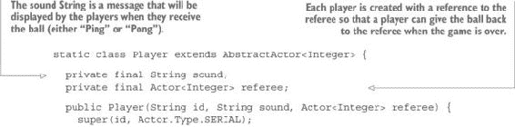

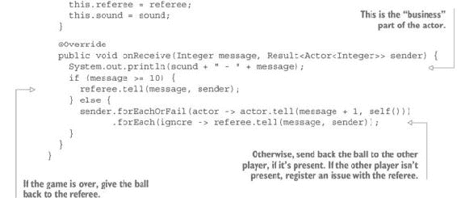

创建了`Player`类后，您就可以完成您的程序了。但是，您需要一种方法来保持应用程序运行，直到游戏结束。如果没有这个，主应用程序线程将在游戏开始时终止，玩家将没有机会玩游戏。这可以通过使用信号量来实现，如下所示。

##### 列表 14.5\. Ping Pong 示例

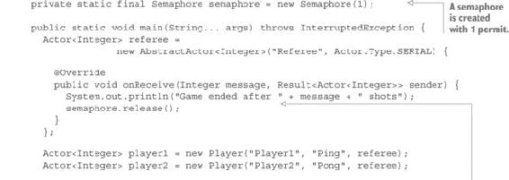

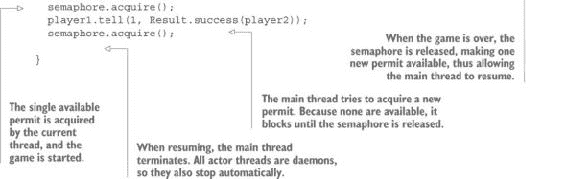

程序显示以下输出：

```
Ping - 1
Pong - 2
Ping - 3
Pong - 4
Ping - 5
Pong - 6
Ping - 7
Pong - 8
Ping - 9
Pong - 10
Game ended after 10 shots
```

#### 14.3.2\. 一个更严重的例子：并行运行计算

现在是时候看看一个更严肃的演员框架实例：并行运行计算了。为了模拟长时间运行的计算，您将选择一个介于 0 到 30 之间的随机数字列表，并使用慢速算法计算相应的斐波那契值。应用程序将由三种类型的演员组成：一个`Manager`，负责创建指定数量的工作演员并将任务分配给他们；几个工作实例；以及一个客户端，它将在主程序类中以匿名演员的形式实现。以下列表显示了这些类中最简单的一个，即`Worker`演员。

##### 列表 14.6\. 负责运行计算部分的`Worker`演员

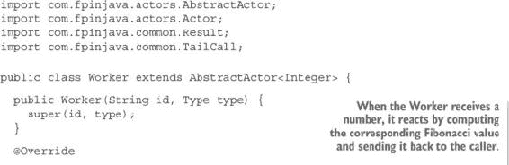

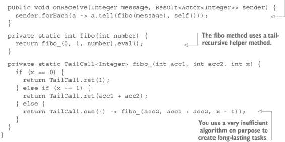

如您所见，这个演员是无状态的。它计算结果并将其发送回它接收引用的发送者。请注意，这可能不同于调用者。因为数字是在 0 到 30 之间随机选择的，所以计算结果所需的时间将高度可变。这模拟了执行时间可变的任务。与第八章中自动并行化的例子不同，除了没有更多任务要处理外，所有线程/演员都将保持忙碌，直到整个计算完成。

`Manager`类稍微复杂一些。以下列表显示了类的构造函数和初始化的属性。

##### 列表 14.7\. `Manager`类的构造函数和属性

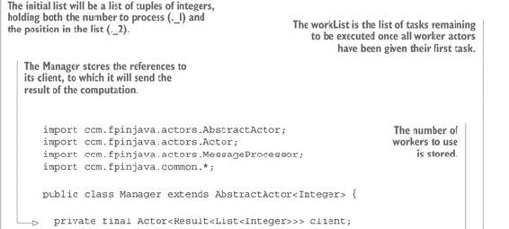

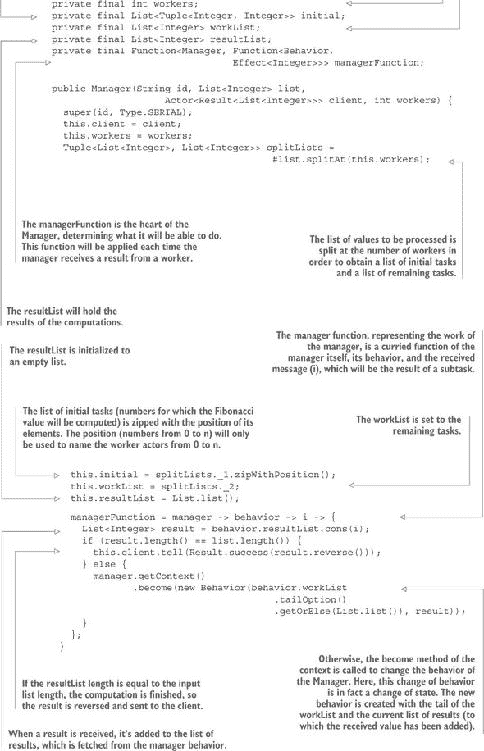

如您所见，如果计算完成，结果将被添加到结果列表中并发送给客户端。否则，结果将被添加到当前结果列表中。在传统程序中，这将通过修改`Manager`将保留的结果列表来完成。这正是这里发生的事情，除了两个区别：

+   结果列表存储在行为中。

+   行为和列表都没有被修改。相反，创建了一个新的行为，并将上下文修改为持有这个新行为，以替换旧的行为。然而，您不必处理这种修改。就您而言，一切都是不可变的，因为修改被演员框架抽象化了。

以下列表显示了作为内部类实现的`Behavior`类。

##### 列表 14.8\. `Behavior`内部类允许你抽象演员的突变

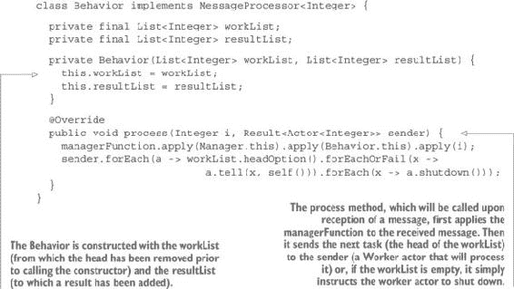

这涵盖了`Manager`的主要部分。其余部分由主要用于启动工作的实用方法组成。

##### 列表 14.9\. `Manager`的实用方法，用于启动处理

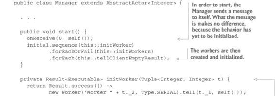

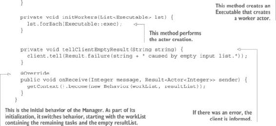

重要的是要理解`onReceive`方法代表了演员在接收到它的第一条消息时将执行的操作。当工人将结果发送给经理时，此方法不会被调用。

程序的最后部分显示在列表 14.10 中。`WorkersExample`类代表应用程序的客户端代码。但与`Manager`和`Worker`不同，它不是一个演员。相反，它*拥有*一个演员。这是一个实现选择。没有具体的原因选择一个解决方案或另一个。但是，为了接收结果，客户端演员是必要的。

##### 列表 14.10\. 客户端应用程序

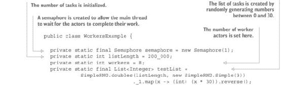

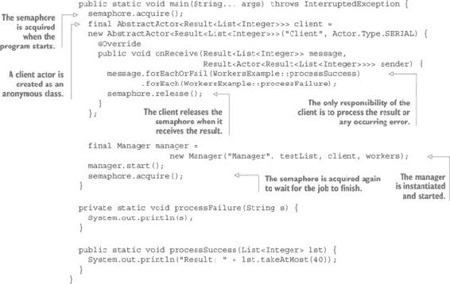

你可以用各种长度的任务列表和各种工作演员的数量运行这个程序。在我的八核 Linux 机器上，以 200,000 个任务长度运行的结果如下：

+   一个工作演员：3.5 秒

+   两个工作演员：1.5 秒

+   三个工作演员：1.1 秒

+   四个工作演员：0.8 秒

+   六个工作演员：0.8 秒

+   八个工作演员：0.8 秒

+   十六个工作演员：0.8 秒

当然，这些数字并不非常精确，但它们表明使用与可用核心数相对应的线程数是无用的。程序显示的结果如下（仅显示前 40 个结果）：

```
Input: [0, 11, 28, 13, 20, 5, 15, 8, 24, 19, 12, 7, 11, 4, 18, 20, 26,
    21, 15, 21, 29, 16, 15, 8, 22, 11, 26, 1, 22, 13, 25, 3, 13, 24, 29,
    10, 7, 26, 24, 1, NIL]
Time: 797
Result: [1, 8, 28657, 34, 196418, 34, 987, 987, 1597, 832040, 28657,
    17711, 987, 377, 1, 17711, 196418, 377, 10946, 4181, 5, 6765, 144,
    21, 75025, 233, 832040, 89, 144, 75025, 514229, 21, 377, 1, 10946,
    3, 17711, 196418, 144, 1597, NIL]
```

如你所见，你遇到了问题！

#### 14.3.3\. 重新排序结果

正如你可能已经注意到的，结果是不正确的。当查看第三个和第五个随机值（28 和 29）以及相应的结果（28,657 和 196,418）时，这一点很明显。你也可以比较 4 和 6 的值和结果。当参数值为 13 和 5 时，结果都是 34。请注意，如果你在自己的计算机上运行程序，你会得到不同的结果。

这里发生的情况是，不是所有任务执行所需的时间都相同。我选择以这种方式执行计算，以便一些任务（低参数值的计算）可以快速返回，而其他任务（高值的计算）则需要更长的时间。因此，返回的值没有按正确的顺序排列。

为了解决这个问题，你需要按与相应参数相同的顺序对结果进行排序。一种解决方案是使用你在第十一章中开发的`Heap`数据类型。你可以对每个任务进行编号，并使用这个编号作为优先队列中的优先级。

你必须改变工作演员的类型。他们不再处理整数，而必须处理整数的元组：一个整数表示参数或计算，另一个表示任务号。下面的列表显示了 `Worker` 类中相应的更改。

##### 列表 14.11\. `Worker` 演员跟踪任务号

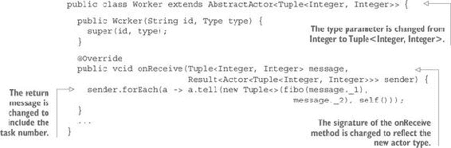

注意，任务号是元组的第二个元素。考虑到任务号和计算参数的类型相同（`Integer`），这并不容易阅读和记忆。在现实生活中，这种情况不应该发生，因为你应该为任务使用特定的类型。但如果你愿意，你也可以使用特定的类型来包装任务和任务号，例如具有数字属性的 `Task` 类型。

`Manager` 类的更改更多。首先，你必须更改类类型以及 `workList` 和结果属性的 类型：

```
public class Manager extends AbstractActor<Tuple<Integer, Integer>> {

  ...

  private final List<Tuple<Integer, Integer>> workList;
  private final Heap<Tuple<Integer, Integer>> resultHeap;
```

这些属性在构造函数中如下初始化：

```
Tuple<List<Tuple<Integer, Integer>>, List<Tuple<Integer, Integer>>>
           splitLists = list.zipWithPosition().splitAt(this.workers);
this.initial = splitLists._1;
this.workList = splitLists._2;
this.resultHeap = Heap.empty((t1, t2) -> t1._2.compareTo(t2._2));
```

`workList` 现在包含元组（正如前一个例子中 `initial` 列表的情况），结果是元组的优先队列（`Heap`）。请注意，这个 `Heap` 是基于元组的第二个元素的比较来初始化的 `Comparator`。使用一个同时包装任务和任务号的 `Task` 类型可以使这个类型 `Comparable`，这样 `Comparator` 就没有用了。（我将这个优化留给你作为练习。）

当然，`managerFunction` 也有所不同：

```
private final Function<Manager, Function<Behavior, Effect<Tuple<Integer,
                                              Integer>>>> managerFunction;
```

它在构造函数中这样初始化：

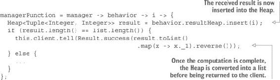

`Behavior` 内部类必须更改以反映演员类型的变化：

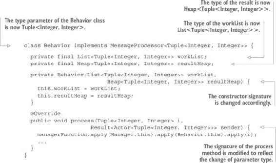

在 `Manager` 类的其余部分还有一些小的更改需要应用。`start` 方法必须进行修改：

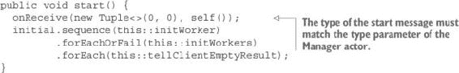

`Worker` 的初始化过程也略有不同：

```
private Result<Executable> initWorker(Tuple<Integer, Integer> t) {
  return Result.success(() -> new Worker("Worker " + t._2,
                Type.SERIAL).tell(new Tuple<>(t._1, t._2), self()));
}
```

最后，`onReceive` 方法也进行了修改：

```
@Override
public void onReceive(Tuple<Integer, Integer> message,
                     Result<Actor<Tuple<Integer, Integer>>> sender) {
  getContext().become(new Behavior(workList, resultHeap));
}
```

现在结果以正确的顺序显示。但你有一个新的问题：现在一个工作演员需要 15 秒，四个工作演员需要 13 秒来计算所需的时间。这是怎么回事？

答案很简单：瓶颈是 `Heap`。`Heap` 数据结构并不适合排序。只要元素数量保持低，它就有很好的性能，但在这里你将所有 200,000 个结果插入到堆中，并在每次插入时对整个数据集进行排序。这并不高效。

#### 14.3.4\. 解决性能问题

显然，这种低效并不是实现问题，而是关于使用正确工具的问题。当计算完成后，通过存储所有结果并在一次排序中排序，你会得到更好的性能，尽管你需要使用正确的工具来进行排序。

另一个选项是修复你的实现。你当前设计中遇到的一个问题是，不仅插入到`Heap`需要很长时间，而且是由`Manager`线程完成的，因此，而不是在计算完成后立即将任务分配给工作演员，`Manager`让他们等待直到它完成堆的插入。一个可能的解决方案是使用一个单独的演员来插入到`Heap`中。

但有时使用正确的工具来做正确的工作会更好。你同步消费结果可能不是必需的。如果不是，你只是在添加一个隐含的要求，这使得问题更难解决。一个可能性是将结果单独传递给客户端。这样，只有在结果无序时才会使用`Heap`，防止它变得太大。实际上，这种使用方式正是优先队列预期的方式。为了考虑这一点，你可以在程序中添加一个`Receiver`演员。

##### 列表 14.12。负责异步接收结果的`Receiver`演员

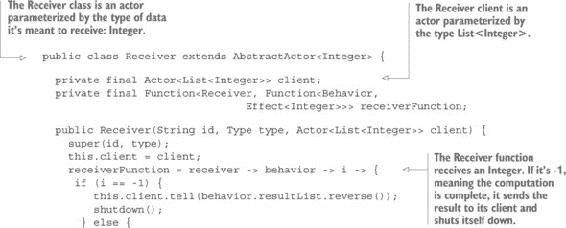

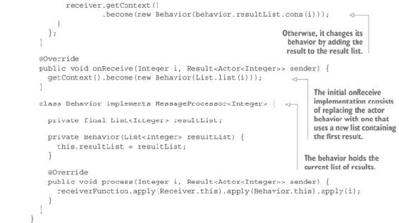

主要类（`WorkersExample`）与上一个示例没有太大不同。唯一的区别是添加了`Receiver`：

```
public static void main(String... args) throws InterruptedException {
  semaphore.acquire();
  final AbstractActor<List<Integer>> client =
              new AbstractActor<List<Integer>>("Client", Actor.Type.SERIAL) {
    @Override
    public void onReceive(List message, Result<Actor<List<Integer>>> sender) {
      System.out.println("Result: " + message.takeAtMost(40));
      semaphore.release();
    }
  };

  final Receiver receiver = new Receiver("Receiver", Actor.Type.SERIAL, client);
  final Manager manager = new Manager("Manager", testList, receiver, workers);
  manager.start();
  semaphore.acquire();
}
```

`Worker`演员与上一个示例中的完全相同。这导致`Manager`类保留了最重要的更改。第一个更改是`Manager`将拥有一个类型为`Actor<Integer>`的客户端，并跟踪任务列表的长度：

```
private final Actor<Integer> client;
...
private final int limit;
...
public Manager(String id, List<Integer> list, Actor<Integer> client,
                                                       int workers) {
  super(id, Type.SERIAL);
  this.client = client;
  this.workers = workers;
  this.limit = list.length() - 1;
```

还要注意，`client`现在是`Receiver`，因此它是`Actor<Integer>`类型，异步接收结果，一个接一个。

当然，`managerFunction`是不同的：

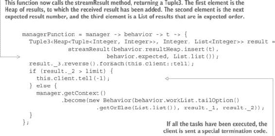

如您所见，大部分工作都是在`streamResult`方法中完成的：

```
private Tuple3<Heap<Tuple<Integer, Integer>>, Integer,
  List<Integer>> streamResult(Heap<Tuple<Integer, Integer>> result,
                                  int expected, List<Integer> list) {
  Tuple3<Heap<Tuple<Integer, Integer>>, Integer, List<Integer>> tuple3 =
                                     new Tuple3<>(result, expected, list);
  Result<Tuple3<Heap<Tuple<Integer, Integer>>, Integer,
         List<Integer>>> temp = result.head().flatMap(head ->
                  result.tail().map(tail -> head._2 == expected
                    ? streamResult(tail, expected + 1, list.cons(head._1))
                    : tuple3));
  return temp.getOrElse(tuple3);
}
```

这种方法可能看起来难以理解，但这只是因为 Java 中的类型表示法非常冗长。`streamResult`方法将其参数作为结果`Heap`、下一个预期的任务编号和一个最初为空的整数列表：

+   如果结果堆的头部与预期的任务结果编号不同，则不需要做任何事情，并将三个参数作为`Tuple3`返回。

+   如果结果堆的头部与预期的任务结果编号匹配，则将其从堆中移除并添加到列表中。然后递归调用该方法，直到头部不再匹配，从而按预期顺序构建结果列表，其余的留在堆中。

通过这种方式处理，堆始终保持较小。例如，在计算 20 万个任务时，发现堆的最大大小为 121。它在 12 次超过了 100，并且超过 95%的时间小于 2。

 14.2 从`Manager`的角度展示了接收结果的整体过程。

##### 图 14.2. `Manager` 接收到一个结果，如果它不对应预期的数字，则将其存储在 `Heap` 中，或者将其发送给客户端。在后一种情况下，它随后查看 `Heap` 以查看下一个预期的结果是否已经被接收。

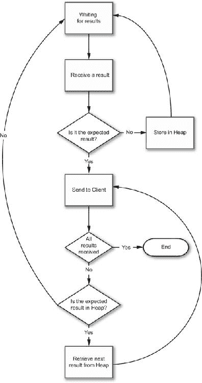

`tellClientEmptyResult` 方法根据客户端类型进行了修改：

```
private void tellClientEmptyResult(String ignore) {
  client.tell(-1);
}
```

`onReceive` 方法不同，因为，在启动时，你期望结果是 0：

```
getContext().become(new Behavior(workList, resultHeap, 0));
```

最后的更改是对 `Behavior` 类的，现在它持有预期的任务编号：

```
class Behavior implements MessageProcessor<Tuple<Integer, Integer>> {

  private final List<Tuple<Integer, Integer>> workList;
  private final Heap<Tuple<Integer, Integer>> resultHeap;
  private final int expected; // Change

  private Behavior(List<Tuple<Integer, Integer>> workList,
            Heap<Tuple<Integer, Integer>> resultHeap, int expected) {
    this.workList = workList;
    this.resultHeap = resultHeap;
    this.expected = expected;
  }

  ...
```

通过这些修改，应用程序的速度大大提高。例如，在先前的例子相同的条件下，一个工作 actor 处理 20 万个数字所需的时间是 7.5 秒，而使用四个工作 actor 时，时间降至 5.3 秒。

显然，这个过程的速度不如将所有值无序存储，然后再排序，这使一个 actor 的时间降至 3.5 秒，四个 actor 降至 1.19 秒。但仍有很大的优化空间。例如，你不必将每个结果放入 `Heap`，而是可以将其传递给 `streamResult` 方法，如果它匹配预期的任务编号，它将直接放入结果列表。

总之，这只是个例子，用来展示 actor 是如何被使用的。解决这类问题最好通过其他方式，例如自动并行化列表（如第八章所示），或者甚至一个简单的 `map`。actor 的主要用途不是用于并行化，而是用于抽象共享可变状态。在这些例子中，你使用了在任务之间共享的列表。如果没有 actor，你将不得不同步访问 `workList` 和 `resultHeap` 以处理并发。actor 允许你在框架中抽象同步和修改。如果你查看你编写的业务代码（除了 actor 框架本身），你会发现没有可变数据，因此不需要关心同步，也没有线程饥饿或死锁的风险。尽管它们不是函数式的，但 actor 提供了一种很好的方式来使代码的函数部分协同工作，以抽象的方式共享可变状态。

你的 actor 框架非常简单，并不打算用于任何严肃的代码。对于此类用途，你可以使用可用的 Java actor 框架之一，尤其是 Akka。尽管 Akka 是用 Scala 编写的，这是一种比 Java 更功能友好的语言，但它也可以用于 Java 程序。当使用 Akka 时，除非你想要，否则你永远不会看到一行 Scala 代码。要了解更多关于 actor 的信息，特别是关于 Akka 的信息，请参阅 Raymond Roestenburg、Rob Bakker 和 Rob Williams 的《Akka in Action》（Manning，2016）。

### 14.4. 摘要

+   Actor 是异步接收消息并依次处理的组件。

+   共享可变状态可以抽象为 actor。

+   抽象可变状态共享可以减轻你关于同步和并发问题的负担。

+   演员模型基于异步消息传递，并且是函数式编程的一个很好的补充。

+   演员模型提供了简单且安全的并行化。

+   框架将演员突变（actor mutations）从程序员那里抽象出来。

+   对于 Java 程序员来说，有多个演员框架可供选择。

+   Akka 是 Java 编程中最常用的演员框架之一。
