## 第十五章. 函数式解决常见问题

***本章涵盖***

+   使用断言

+   读取属性文件

+   适配命令式库

现在，你拥有许多功能工具，可以使你的编程生活更容易。但了解工具是不够的。要成为函数式编程的高效程序员，你必须让它成为第二本能。你需要以函数式的方式思考。最初，你将保持命令式的反射，你可能会考虑如何将命令式解决方案转换为函数式编码。当你第一次处理编程问题时，首先考虑函数式解决方案（也许会有一些困难将其转换为命令式！）时，你将成为一个熟练的函数式程序员。

要达到这个阶段，没有其他方法，只能通过练习。而且，至少在 Java 世界中，大多数已知解决常见问题的方案都是命令式的，因此，查看一些常见问题并看看它们如何以函数式方式解决可能是一个很好的练习。

互联网上有许多关于以函数式方式解决数学问题的示例。这些示例非常有趣，但有时它们在某种程度上是适得其反的，因为它们让程序员相信函数式编程只适用于解决数学问题。更糟糕的是，它导致一些人认为数学技能是实践函数式编程所必需的。这不是事实。数学技能对于解决数学问题是必要的，但你需要解决的绝大多数编程问题与数学无关。而且，它们通常以函数式方式解决要简单得多。

在本章中，我们将探讨程序员在日常生活中必须解决的常见问题，并看看它们如何可以通过函数式范式以不同的方式来处理。

### 15.1. 使用断言验证数据

Java 从 1.4 版本开始就有断言。断言用于检查不变量，如前置条件、后置条件、控制流条件和类条件。在函数式编程中，通常没有控制流，类通常是不可变的，所以唯一需要检查的条件是前置条件和后置条件，由于同样的原因（不可变性和没有控制流），这些条件包括测试方法接收到的参数，并在返回之前测试它们的结果。

在部分函数（如这个例子）中测试参数值是必要的：

```
double inverse(int x) {
  return 1.0 / x;
}
```

此方法对任何输入都返回一个可用的值，除了 0，对于 0 它返回“无穷大”。因为你可能无法使用这个值，你可能更喜欢以特定的方式处理它。在命令式编程中，你可以这样写：

```
double inverse(int x) {
  assert x == 0;
  return 1.0 / x;
}
```

但在 Java 中，你可以在运行时禁用断言，所以常见的技巧是使用静态初始化器来防止程序在禁用断言的情况下运行：

```
static {
  boolean assertsEnabled = false;
  assert assertsEnabled = true;
  if (!assertsEnabled) {
     throw new RuntimeException("Asserts must be enabled!!!");
  }
}
```

这是 Oracle 建议的。当然，写成这样更简单：

```
double inverse(int x) {
  if (x != 0) throw new IllegalArgumentException("div. By 0");
  return 1.0 / x;
}
```

在函数式编程中，函数应该被转换成一个全函数，如下所示：

```
Result<Double> inverse(int x) {
  return x == 0
      ? Result.failure("div. By 0")
      : Result.success(1.0 / x);
}
```

然后，就没有必要检查参数了，因为这种测试是函数实现的一部分。当然，也没有必要检查返回的值。

必须经常检查的一个条件是参数不是 `null`。Java 有 `Objects.requireNonNull` 用于此。这个方法有变体，可以接受一个额外的错误消息，或者一个错误消息的 `Supplier`。这些方法有时可能很有用：

```
public static <T, U> Tuple<T, U> t(T t, U u) {
  return new Tuple<>(Objects.requireNonNull(t), Objects.requireNonNull(u));
}
```

但在函数式程序中，最通用的断言形式是对一个参数进行特定条件的测试，如果不匹配条件则返回 `Result.Failure`，否则返回 `Result.Success`。以 `Person` 类型的工厂方法为例：

```
public static Person apply(int id, String firstName, String lastName) {
  return new Person(id, firstName, lastName);
}
```

这个方法可以与从数据库中提取的数据一起使用：

```
Person person = Person.apply(rs.getInt("personId"),
                rs.getString("firstName"), rs.getString("lastName"));
```

在这种情况下，你可能在调用 `apply` 方法之前想要验证数据。例如，你可能想要检查 ID 是否为正数，以及名字和姓氏是否不是 `null` 或空，并且它们以大写字母开头。在命令式 Java 中，这可以通过使用断言方法来完成：

```
Person person = Person.apply(
    assertPositive(rs.getInt("personId"), "Negative id"),
    assertValidName(rs.getString("firstName"), "Invalid first name:"),
    assertValidName(rs.getString("lastName"), "Invalid last name:"));
private static int assertPositive(int i, String message) {
  if (i < 0) {
    throw new IllegalStateException(message);
  } else {
    return i;
  }
}

private static String assertValidName(String name, String message) {
  if (name == null || name.length() == 0
          || name.charAt(0) < 65 || name.charAt(0) > 91) {
    throw new IllegalStateException(message);
  }
  return name;
}
```

在函数式编程中，你不抛出异常；你使用特殊的上下文，如 `Result` 进行错误处理。这种验证被抽象成 `Result` 类型。你所要做的就是编写验证函数，这意味着你只需要编写方法和使用方法引用。通用的验证函数可以组合到一个特殊类中：

```
public class Assertion {
  public static boolean isPositive(int i) {
    return i >= 0;
  }

  public static boolean isValidName(String name) {
    return name != null && name.length() != 0
                   && name.charAt(0) >= 65 && name.charAt(0) <= 91;
  }
}
```

你可以验证数据：

```
Result<Person> person =
   Result.of(Assertion::isPositive, getInt("personId"), "Negative id")
      .flatMap(id -> Result.of(Assertion::isValidName,
                        getString("firstName"), "Invalid first name")
          .flatMap(firstName -> Result.of(Assertion::isValidName,
                        getString("lastName"), "Invalid last name")
              .map(lastName -> Person.apply(id, firstName, lastName))));
```

但你也可以通过在 `Assertion` 类中抽象更多过程来简化事情：

```
public static Result<Integer> assertPositive(int i, String message) {
  return Result.of(Assertion::isPositive, i, message);
}

public static Result<String> assertValidName(String name, String message) {
  return Result.of(Assertion::isValidName, name, message);
}
```

你可以创建一个 `Person` 如下：

```
Result<Integer> rId = Assertion.assertPositive(getInt("personId"), "Negative id");
Result<String> rFirstName =
         Assertion.assertValidName(getString("firstName"), "Invalid first name");
Result<String> rLastName =
         Assertion.assertValidName(getString("lastName"), "Invalid first name");
Result<Person> person =
    rId.flatMap(id -> rFirstName
           .flatMap(firstName -> rLastName
               .map(lastName -> Person.apply(id, firstName, lastName))));
```

下面的列表展示了 `Assertion` 类和一些示例方法。

##### 列表 15.1\. 功能性断言的示例

```
public final class Assertion {

  private Assertion() {
  }

  public static <T> Result<T> assertCondition(T value,
                                         Function<T, Boolean> f) {
    return assertCondition(value, f,
              "Assertion error: condition should evaluate to true");
  }

  public static <T> Result<T> assertCondition(T value,
                         Function<T, Boolean> f, String message) {
    return f.apply(value)
        ? Result.success(value)
        : Result.failure(message, new IllegalStateException(message));
  }

  public static Result<Boolean> assertTrue(boolean condition) {
    return assertTrue(condition,
                       "Assertion error: condition should be true");
  }

  public static Result<Boolean> assertTrue(boolean condition,
                                               String message) {
    return assertCondition(condition, x -> x, message);
  }

  public static Result<Boolean> assertFalse(boolean condition) {
    return assertFalse(condition,
                       "Assertion error: condition should be false");
  }

  public static Result<Boolean> assertFalse(boolean condition,
                                                     String message) {
    return assertCondition(condition, x -> !x, message);
  }

  public static <T> Result<T> assertNotNull(T t) {
    return assertNotNull(t, "Assertion error: object should not be null");
  }
  public static <T> Result<T> assertNotNull(T t, String message) {
    return assertCondition(t, x -> x != null, message);
  }

  public static Result<Integer> assertPositive(int value) {
    return assertPositive(value,
       String.format("Assertion error: value %s must be positive", value));
  }
  public static Result<Integer> assertPositive(int value, String message) {
    return assertCondition(value, x -> x > 0, message);
  }

  public static Result<Integer> assertInRange(int value, int min,
                                                             int max) {
    return assertCondition(value, x -> x >= min && x < max,
          String.format("Assertion error: value %s should be between %s and
                          %s (exclusive)", value, min, max));
  }

  public static Result<Integer> assertPositiveOrZero(int value) {
    return assertPositiveOrZero(value,
      String.format("Assertion error: value %s must not be negative", 0));
  }

  public static Result<Integer> assertPositiveOrZero(int value,
                                                     String message) {
    return assertCondition(value, x -> x >= 0, message);
  }

  public static <A> void assertType(A element, Class<?> clazz) {
    assertType(element, clazz,
        String.format("Wrong type: %s, expected: %s",
                 element.getClass().getName(), clazz.getName()));
  }

  public static <A> Result<A> assertType(A element, Class<?> clazz,
                                                            String message) {
    return assertCondition(element, e -> e.getClass().equals(clazz)
                                                                 ,message);
  }
}
```

### 15.2\. 从文件中读取属性

大多数软件应用程序都是通过在启动时读取属性文件进行配置的。属性是键/值对，键和值都作为字符串写入。无论选择的属性格式是 `key=value`、XML、JSON、YAML 等等，程序员总是需要读取字符串并将它们转换成 Java 对象或原始数据。这个过程既繁琐又容易出错。你可以使用专门的库来做这件事，但如果出了问题，你会发现自己在抛出异常。为了获得更多功能性的行为，你可能需要编写自己的库。

#### 15.2.1\. 加载属性文件

无论你使用什么格式，过程都是一样的：读取文件并处理在这个过程中可能出现的任何 `IOException`。在下面的示例中，你将读取一个 Java 属性文件。

首先要做的事情是读取文件并返回一个 `Result<Properties>`。

##### 列表 15.2\. 读取 Java 属性文件

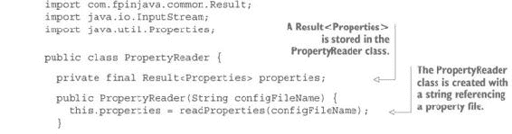

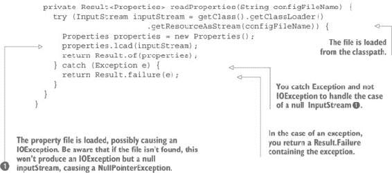

在这个例子中，你从类路径中加载属性文件。当然，它也可以从磁盘上的任何位置加载，或者从远程 URL 读取，或者从任何其他来源读取。

#### 15.2.2\. 将属性作为字符串读取

简单的使用案例就是将属性作为字符串读取。这非常直接。你只需要向`PropertyReader`类添加一个`readProperty`方法，该方法以属性名称作为参数，并返回一个`Result<String>`。但请注意，以下情况不会工作：

```
public Result<String> getProperty(String name) {
  return properties.map(props -> props.getProperty(name));
}
```

如果属性不存在，`getProperty`方法返回`null`。（在 Java 8 中，它应该返回`Optional`，但它没有。）请注意，`Properties`类可以用默认属性列表构造，并且`getProperty`方法本身可以带有默认值调用。但并非所有属性都有默认值。

为了处理这个问题，你可以创建一个辅助方法：

```
public Result<String> getProperty(String name) {
  return properties.flatMap(props ->getProperty(props, name));
}

private Result<String> getProperty(Properties properties, String name) {
  return Result.of(properties.getProperty(name));
}
```

现在，假设你在类路径中有一个属性文件，包含以下属性：

```
host=acme.org
port=6666
name=
temp=71.3
price=$45
list=34,56,67,89
person=3,Jeanne,Doe
```

你可以安全地访问属性：

```
PropertyReader propertyReader = new PropertyReader("com/fpinjava/properties/config.properties");

propertyReader.getProperty("host")
              .forEachOrFail(System.out::println)
              .forEach(System.out::println);

propertyReader.getProperty("name")
              .forEachOrFail(System.out::println)
              .forEach(System.out::println);

propertyReader.getProperty("year")
              .forEachOrFail(System.out::println)
              .forEach(System.out::println);
```

给定你的属性文件，你会得到以下结果：

```
acme.org

Null value
```

第一行对应于`host`属性，这是正确的。第二行对应于`name`属性，它是一个空字符串，这可能正确也可能不正确；你不知道。这取决于从业务角度来看名称是否是可选的。第三行对应于缺失的`year`属性，但“空值”信息并不很有帮助。当然，它包含在一个`Result <String>`中，可以分配给`year`变量，因此你可以知道哪个属性缺失。但最好将属性名称作为消息的一部分。此外，如果文件找不到，你会得到一个非常不详细的错误信息：

```
java.lang.NullPointerException
```

#### 15.2.3\. 生成更好的错误信息

你在这里遇到的问题是一个非常好的例子，说明了永远不应该发生的事情。使用 Java 标准库，你确信事情会按预期进行。特别是，你期望如果找不到文件，或者无法读取，你会得到一个`IOException`。你甚至希望被告知文件的完整路径，因为“缺失”的文件通常只是不在正确位置（或者是一个 Java 没有在正确位置寻找的文件）。在这种情况下，一个好的错误信息会是“我在位置‘xyz’寻找文件‘abc’，但找不到它。”

现在，看看`ClassLoader.getResourceAsStream`方法的代码：

```
public InputStream getResourceAsStream(String name) {
  URL url = getResource(name);
  try {
    return url != null ? url.openStream() : null;
  } catch (IOException e) {
    return null;
  }
}
```

不，你并没有做梦。这就是 Java 8 的编写方式。结论是，作为程序员，你应该在查看相应代码之前，永远不要使用 Java 标准库中的任何方法。

注意，Javadoc 表示该方法返回“用于读取资源的输入流，或者如果资源找不到，则返回 `null`。”这意味着许多事情可能会出错。如果找不到文件或在读取文件时出现问题，可能会发生 `IOException`。或者文件名可能是 `null`。或者 `getResource` 方法可能会抛出异常或返回 `null`。（查看该方法的代码以了解我的意思。）

您至少应该为每种情况提供不同的消息。尽管 `IOException` 很不可能被抛出，但您仍然必须处理这种情况，以及意外的异常的通用情况：

```
private Result<Properties> readProperties(String configFileName) {
  try (InputStream inputStream =
       getClass().getClassLoader().getResourceAsStream(configFileName)) {
    Properties properties = new Properties();
    properties.load(inputStream);
    return Result.of(properties);
  } catch (NullPointerException e) {
    return Result.failure(String.format("File %s not found in classpath",
                                                        configFileName));
  } catch (IOException e) {
    return Result.failure(String.format("IOException reading classpath
                                          resource %s", configFileName));
  } catch (Exception e) {
    return Result.failure(String.format("Exception reading classpath
                                       resource %s", configFileName), e);
  }
}
```

现在，如果找不到文件，消息将是

```
File com/fpinjava/properties/config.properties not found in classpath
```

您还必须处理与属性相关的错误消息。当使用如下代码时

```
Result<String> year = propertyReader.getProperty("year");
```

如果您收到“空值”错误消息，那么这意味着 `year` 属性未找到。但在以下示例中，“空值”消息没有提供有关缺少哪个属性的信息：

```
PropertyReader propertyReader =
            new PropertyReader("com/fpinjava/properties/config.properties");
Result<Person> person =
  propertyReader.getProperty("id").map(Integer::parseInt)
    .flatMap(id -> propertyReader.getProperty("firstName")
      .flatMap(firstName -> propertyReader.getProperty("lastName")
        .map(lastName -> Person.apply(id, firstName, lastName))));
person.forEachOrFail(System.out::println).forEach(System.out::println);
```

为了解决这个问题，您有几种选择可供选择。最简单的是在 `PropertyReader` 类的 `getProperty` 辅助方法中映射失败：

```
private Result<String> getProperty(Properties properties, String name) {
  return Result.of(properties.getProperty(name))
        .mapFailure(String.format("Property \"%s\" no found", name));
}
```

上述示例产生了以下错误消息，清楚地表明 `id` 属性在属性文件中不存在：

```
Property "id" not found
```

另一个潜在的错误来源是在将字符串 `id` 属性转换为整数时发生的解析错误。例如，如果该属性是

```
id=three
```

错误消息将是

```
For input string: "three"
```

这并不提供有意义的错误信息，这是因为它是标准 Java 8 解析错误的错误消息。大多数标准 Java 错误消息都是这样的。它就像一个 `NullPointerException`。它说找到了一个 `null` 引用，但没有说哪个。在这里，甚至没有说明遇到了哪个错误。错误的性质由异常携带。打印堆栈跟踪将给出以下信息：

```
Exception in thread "main" java.lang.NumberFormatException: For input string: "three"
at java.lang.NumberFormatException.forInputString(NumberFormatException.java:48) ...
```

您真正需要的是导致异常的属性名称。类似于以下内容：

```
propertyReader.getProperty("id")
    .map(Integer::parseInt)
    .mapFailure(String.format("Invalid format for property \"id\": ", ???))
```

但是你必须将属性名称写两次，并且希望用找到的值替换“???”（这是不可能的，因为该值已经丢失）。因为您将不得不解析所有非字符串属性值，所以您应该在 `PropertyReader` 类中抽象这一过程。

要做到这一点，您首先需要重命名 `getProperty` 方法：

```
public Result<String> getAsString(String name) {
  return properties.flatMap(props -> getProperty(props, name));
}
```

然后，您将添加一个 `getAsInteger` 方法：

```
public Result<Integer> getAsInteger(String name) {
  Result<String> rString =
       properties.flatMap(props ->getProperty(props, name));
  return rString.flatMap(x -> {
    try {
      return Result.success(Integer.parseInt(x));
    } catch (NumberFormatException e) {
      return Result.failure(String.format("Invalid value while parsing
                                               property %s: %s", name, x));
    }
  });
}
```

现在，您不需要担心在转换为整数时出错：

```
Result<Person> person =
  propertyReader.getAsInteger("id")
    .flatMap(id -> propertyReader.getAsString("firstName")
      .flatMap(firstName -> propertyReader.getAsString("lastName")
        .map(lastName -> Person.apply(id, firstName, lastName))));
person.forEachOrFail(System.out::println).forEach(System.out::println);
```

#### 15.2.4\. 将属性作为列表读取

您可以为其他数值类型，如 `long` 或 `double`，做与整数相同的事情。但您能做的远不止这些。您可以读取属性作为列表：

```
list=34,56,67,89
```

您只需添加一个专门的方法来处理这种情况。您可以使用以下方法将属性作为整数列表获取：

```
public Result<List<Integer>> getAsIntegerList(String name) {
  Result<String> rString =
           properties.flatMap(props ->getProperty(props, name));
  return rString.flatMap(s -> {
    try {
      return Result.success(List.fromSeparatedString(s,',')
                                             .map(Integer::parseInt));
    } catch (NumberFormatException e) {
      return Result.failure(String.format("Invalid value while parsing
                                             property %s: %s", name, s));
    }
  });
}
```

当然，你需要将`fromSeparatedString`方法添加到`List`类中。正如我在上一章所说，这段代码不是用来使用上一章练习的结果，而是使用本书附带代码中的`fpinjava-common`模块（[`github.com/fpinjava/fpinjava`](https://github.com/fpinjava/fpinjava)）。这基本上与练习的解决方案中的代码相同，但增加了一些方法，例如以下示例中的`List.fromCollection(...)`：

```
public static List<String> fromSeparatedString(String string,
                                                     char separator) {
  return List.fromCollection(Arrays.asList(string.split("\\s*"
                                              + separator + "\\s*")));
}
```

但你可以做更多。你可以通过提供转换函数来读取任何数值列表的属性：

```
public <T> Result<List<T>> getAsList(String name, Function<String, T> f) {
  Result<String> rString
              = properties.flatMap(props ->getProperty(props, name));
  return rString.flatMap(s -> {
    try {
      return Result.success(List.fromSeparatedString(s, ',').map(f));
    } catch (NumberFormatException e) {
      return Result.failure(String.format("Invalid value while parsing
                                             property %s: %s", name, s));
    }
  });
}
```

现在你可以定义各种数字格式的函数，以`getAsList`为依据：

```
public Result<List<Integer>> getAsIntegerList(String name) {
  return getAsList(name, Integer::parseInt);
}

public Result<List<Double>> getAsDoubleList(String name) {
  return getAsList(name, Double::parseDouble);
}

public Result<List<Boolean>> getAsBooleanList(String name) {
  return getAsList(name, Boolean::parseBoolean);
}
```

#### 15.2.5\. 读取枚举值

一个常见的用例是将属性作为`enum`值读取，这是读取属性为任何类型的特例。你可以首先创建一个方法将属性转换为任何类型`T`，接受一个从`String`到`Result<T>`的函数：

```
public <T> Result<T> getAsType(final Function<String, Result<T>> function,
                                                       final String name) {
  Result<String> rString =
              properties.flatMap(props -> getProperty(props, name));
  return rString.flatMap(s -> {
    try {
      return function.apply(s);
    } catch (Exception e) {
      return Result.failure(String.format("Invalid value while parsing
                                              property %s: %s", name, s));
    }
  });
}
```

你现在可以在`getAsType`的基础上创建一个`getAsEnum`方法：

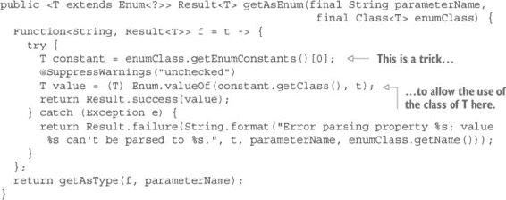

给定以下属性

```
type=SERIAL
```

以及以下`enum`，

```
public enum Type {
  SERIAL,
  PARALLEL
}
```

你现在可以使用以下代码读取属性：

```
Result<Type> type = propertyReader.getAsEnum("type", Type.class);
```

#### 15.2.6\. 读取任意类型的属性

到目前为止，你一直是以字符串、原始数据类型（`int`、`double`、`boolean`等）或`enum`的形式读取属性。读取属性为任意对象可能也很有趣。为此，你必须在属性文件中以某种序列化的形式编写对象属性，然后加载这些属性并反序列化它们。

你可以使用`getAsType`方法以任何类型读取属性。例如，你可以读取以下属性以获取一个`Person`：

```
person=id:3,firstName:Jane,lastName:Doe
```

你只需要提供一个从`String`到`Result<Person>`的函数。这个函数应该能够从字符串`id:3,firstName:Jane,lastName:Doe`中创建一个`Person`对象。

为了简化其使用，你可以创建一个`getAsPerson`方法。但由于它是类型特定的，你不应该将其放在`PropertyReader`内部。可以添加一个静态工厂方法到`Person`类中，该方法接受一个`PropertyReader`和属性名作为参数。

实现它的方法有多种。一种方法是将属性作为列表获取，然后分割每个元素，将键/值对放入映射中。然后就可以很容易地从映射中创建一个`Person`对象。另一种方法是创建一个第二`PropertyReader`，在将逗号替换为换行符后从字符串中读取。以下列表显示了具有从属性字符串构建实例的两个特定方法的`Person`类。

##### 列表 15.3\. 允许你以对象或对象列表读取属性的方法

```
public class Person {
  ...
  public static Result<Person> getAsPerson(String propertyName,
                                 PropertyReader propertyReader) {
    Result<String> rString =
               propertyReader.getAsPropertyString(propertyName);
    Result<PropertyReader> rPropReader =
               rString.map(PropertyReader::stringPropertyReader);
    return rPropReader.flatMap(Person::readPerson);
  }

  public static Result<List<Person>> getAsPersonList(String propertyName,
                                         PropertyReader propertyReader) {
    Result<List<String>> rList =
                          propertyReader.getAsStringList(propertyName);
    return rList.flatMap(list -> List.sequence(list.map(s ->
        readPerson(PropertyReader.stringPropertyReader(PropertyReader
                                               .toPropertyString(s))))));
  }

  private static Result<Person> readPerson(PropertyReader propReader) {
    return propReader.getAsInteger("id")
        .flatMap(id -> propReader.getAsString("firstName")
            .flatMap(firstName -> propReader.getAsString("lastName")
                .map(lastName -> Person.apply(id, firstName, lastName))));
  }
}
```

`getAsPersonList`方法允许你以如下方式读取向量属性：

```
employees:\
  id:3;firstName:Jane;lastName:Doe,\
  id:5;firstName:Paul;lastName:Smith,\
  id:8;firstName:Mary;lastName:Winston
```

这些方法需要在`PropertyReader`类中进行一些修改。

##### 列表 15.4\. 添加到`PropertyReader`类的静态工厂方法

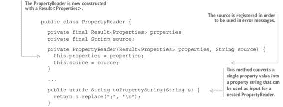

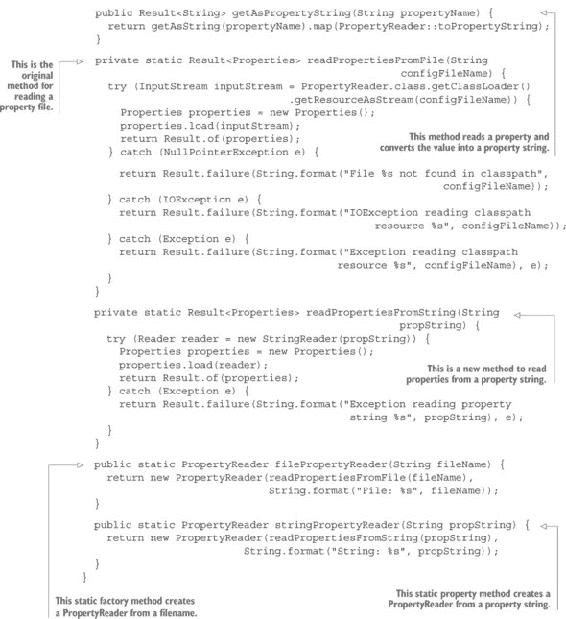

当然，同样的操作也可以应用于 XML 属性文件（Java 默认处理此类文件）或其他格式，例如 JSON 或 YAML。

### 15.3\. 将命令式程序转换为：XML 读取器

为任何任务编写新的函数式程序都是令人兴奋的，但通常你没有时间这样做。通常，你会在自己的代码中使用现有的命令式程序。每次你想使用 Java 库时都是这种情况。当然，你可能更喜欢从头开始构建一个完全新的、100% 函数式解决方案。但你必须现实。你通常没有时间或预算这样做，你将不得不使用现有的非函数式库。

如你很快会发现，一旦你熟悉了函数式技术，回到旧的命令式编码风格就真的很痛苦。通常的解决方案是在这些命令式库周围构建一个薄薄的函数式包装器。作为一个例子，我们将检查一个非常常见的用于读取 XML 文件的库，JDOM 2.0.6。这是此任务最常用的 Java 库。

你将从 列表 15.5 中的示例程序开始。此程序来自众多提供有关如何使用 JDOM 的教程的网站之一（[`mng.bz/4p3x`](http://mng.bz/4p3x)）。我选择这个示例是因为它最小化且易于融入本书中。

##### 列表 15.5\. 使用 JDOM 读取 XML 数据：命令式版本

```
import org.jdom2.Document;
import org.jdom2.Element;
import org.jdom2.JDOMException;
import org.jdom2.input.SAXBuilder;
import java.io.File;
import java.io.IOException;
import java.util.List;

public class ReadXmlFile {

  public static void main(String[] args) {
    SAXBuilder builder = new SAXBuilder();
    File xmlFile = new File("path_to_file");
    try {
      Document document = (Document) builder.build(xmlFile);
      Element rootNode = document.getRootElement();
      List list = rootNode.getChildren("staff");
      for (int i = 0; i < list.size(); i++) {
        Element node = (Element) list.get(i);
        System.out.println("First Name : " +
                                    node.getChildText("firstname"));
        System.out.println("\tLast Name : " +
                                    node.getChildText("lastname"));
        System.out.println("\tNick Name : " +
                                    node.getChildText("email"));
        System.out.println("\tSalary : " + node.getChildText("salary"));
      }
    } catch (IOException io) {
      System.out.println(io.getMessage());
    } catch (JDOMException jdomex) {
      System.out.println(jdomex.getMessage());
    }
  }
}
```

与此示例一起使用的数据文件如下所示。

##### 列表 15.6\. 需要读取的 XML 文件

```
<?xml version="1.0"?>
<company>
  <staff>
    <firstname>Paul</firstname>
    <lastname>Smith</lastname>
    <email>paul.smith@acme.com</email>
    <salary>100000</salary>
  </staff>
  <staff>
    <firstname>Mary</firstname>
    <lastname>Colson</lastname>
    <email>mary.colson@acme.com</email>
    <salary>200000</salary>
  </staff>
</company>
```

首先，你将看看通过以函数式方式重写此示例可以获得哪些好处。你可能遇到的第一问题是程序没有任何部分可以重用。当然，这只是一个示例，但即使是作为一个示例，它也应该以可重用的方式编写，至少应该可测试。在这里，测试程序的唯一方法是查看控制台，它将显示预期的结果或错误消息。正如你将看到的，它甚至可能显示错误的结果。

#### 15.3.1\. 列出必要的函数

要使此程序更具函数性，你应该首先列出你需要的基本函数，将它们编写为自主的、可重用的和可测试的单位，然后通过组合这些函数来编写示例。以下是程序的主要功能：

1.  读取文件并将内容作为 XML 字符串返回。

1.  将 XML 字符串转换为元素列表。

1.  将元素列表转换为这些元素的字符串表示列表。

你还需要一个效果来将字符串列表显示到计算机屏幕上。

| |
| --- |

##### 注意

此程序主要功能的描述仅适用于可以完全加载到内存中的小文件。

| |
| --- |

你需要的第一个函数可以按以下方法实现：

```
public static Result<String> readFile2String(String path)
```

此方法不会抛出任何异常，但返回一个 `Result<String>`。

第二个方法将 XML 字符串转换为元素列表，因此它需要知道根 XML 元素的名字。它将具有以下签名：

```
private static Result<List<Element>> readDocument(String rootElementName,
                                                         String stringDoc)
```

你需要的第三个函数将接收一个元素列表作为其参数，并返回这些元素的字符串表示形式列表。这将通过以下签名的方法实现：

```
private static List<String> toStringList(List<Element> list, String format)
```

最终，你需要对数据进行应用效果，因此你必须将其定义为具有以下签名的方法：

```
private static <T> void processList(List<T> list)
```

这种在函数中的分解看起来与你在命令式编程中能做的事情没有太大区别。毕竟，将命令式程序分解为具有单一职责的方法也是一种良好的实践。然而，实际上它比看起来要不同。请注意，`readDocument`方法将其第一个参数作为一个字符串，这个字符串是由可能（在命令式世界中）抛出异常的方法返回的。因此，你必须处理额外的函数：

```
private static Result<String> getRootElementName()
```

同样，文件路径可以通过相同类型的函数返回：

```
private static Result<String> getXmlFilePath()
```

需要注意的重要事项是，这些函数的参数类型和返回类型不匹配！这是这些函数的命令式版本可能不完整的一个明确表述，这意味着它们可能会抛出异常。抛出异常的方法不容易组合。相比之下，你的函数可以完美地组合。

#### 15.3.2\. 组合函数并应用效果

虽然参数和返回类型不匹配，但你的函数可以很容易地使用理解模式进行组合：

```
final static String format = "First Name : %s\n" +
      "\tLast Name : %s\n" +
      "\tEmail : %s\n" +
      "\tSalary : %s";
...
final Result<String> path = getXmlFilePath();
final Result<String> rDoc = path.flatMap(ReadXmlFile::readFile2String);
final Result<String> rRoot = getRootElementName();
final Result<List<String>> result = rDoc.flatMap(doc -> rRoot
    .flatMap(rootElementName -> readDocument(rootElementName, doc))
    .map(list -> toStringList(list, format)));
```

要显示结果，你只需应用相应的效果：

```
result.forEachOrException(ReadXmlFile::processList)
      .forEach(Throwable::printStackTrace);
```

你的程序的功能版本更加简洁，并且可以完全测试——或者在你实现了所有必要的函数之后，它将可以完全测试。

#### 15.3.3\. 实现函数

你的程序相对优雅，但你仍然需要实现你正在使用的函数和效果，以便使其工作。好消息是每个函数都非常简单，并且可以轻松测试。

首先，你需要实现`getXmlFilePath`和`getRootElementName`函数。在我们的例子中，这些是将在实际应用中替换的常量：

```
private static Result<String> getXmlFilePath() {
  return Result.of("<path_to_file>");
}

private static Result<String> getRootElementName() {
  return Result.of("staff");
}
```

然后，你必须实现`readFile2String`方法。以下是一种可能的实现方式：

```
public static Result<String> readFile2String(String path) {
  try {
    return Result.success(new String(Files.readAllBytes(Paths.get(path))));
  } catch (IOException e) {
    return Result.failure(String.format("IO error while reading file %s",
                                                                 path), e);
  } catch (Exception e) {
    return Result.failure(String.format("Unexpected error while reading
                                                     file %s", path), e);
  }
}
```

注意，你分别捕获`IOException`和`Exception`。这不是强制性的，但它允许你提供更好的错误消息。无论如何，你必须始终捕获`Exception`。（例如，你可能会在这里遇到`SecurityException`。）

接下来，你需要实现`readDocument`方法。该方法接受一个包含 XML 数据的 XML 字符串和根元素的名字作为参数：


你首先捕获 `IOException`（由于你正在读取字符串，所以不太可能抛出）和 `JDOMException`，这两个都是检查异常，并返回带有相应错误信息的失败。但通过查看 JDOM 代码（没有人应该在查看实现之前调用库方法），你会发现代码可能会抛出 `IllegalStateException` 或 `NullPointerException`。又一次，你必须捕获 `Exception`。

`toStringList` 方法简单地将列表映射到负责转换的函数：

```
private static List<String> toStringList(List<Element> list,
                                               String format) {
  return list.map(e -> processElement(e, format));
}
private static String processElement(Element element, String format) {
  return String.format(format, element.getChildText("firstname"),
      element.getChildText("lastname"),
      element.getChildText("email"),
      element.getChildText("salary"));
}
```

最后，你需要实现将应用于结果的效果：

```
private static <T> void processList(List<T> list) {
  list.forEach(System.out::println);
}
```

#### 15.3.4\. 使程序更加功能化

你的程序现在更加模块化和可测试，其部分是可重用的。但你还可以做得更好。你仍然在使用四个非功能性元素：文件路径、根元素名称、将元素转换为字符串的格式以及应用于结果的效果。为了使你的程序完全功能化，你应该将这些元素作为程序参数。

`processElement` 方法也使用了以元素名形式的具体数据，这些元素名对应于用于显示它们的格式字符串的参数。你可以用格式字符串和参数列表的 `Tuple` 替换格式参数。这样，`processElement` 方法将变成以下形式：

```
private static List<String> toStringList(List<Element> list,
                                     Tuple<String, List<String>> format) {
  return list.map(e -> processElement(e, format));
}

private static String processElement(Element element, Tuple<String,
                                                   List<String>> format) {
  String formatString = format._1;
  List<String> parameters = format._2.map(element::getChildText);
  return String.format(formatString, parameters.toJavaList().toArray());
}
```

现在程序可以是一个纯函数，接受四个参数，并返回一个新的（非功能性的）可执行程序作为其结果。这个版本的程序在下面的列表中展示。

##### 列表 15.7\. 完全功能化的 XML 读取器程序

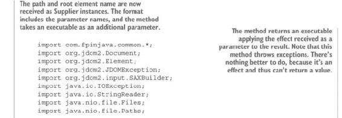

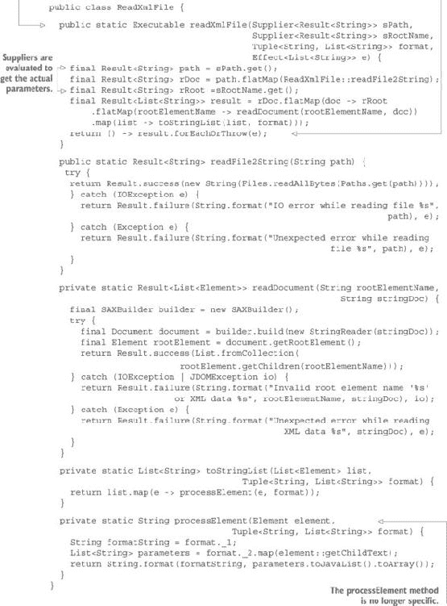

在这一点上，这个程序可以用下面的列表中所示的客户端代码进行测试。

##### 列表 15.8\. 测试 XML 读取器的客户端程序

```
public class Test {

  private final static Tuple<String, List<String>> format =
      new Tuple<>("First Name : %s\n" +
          "\tLast Name : %s\n" +
          "\tEmail : %s\n" +
          "\tSalary : %s", List.list("firstname", "lastname", "email", "salary"));

  public static void main(String... args) {
    Executable program = ReadXmlFile.readXmlFile(Test::getXmlFilePath,
                           Test::getRootElementName, format, Test::processList);
    program.exec();
  }

  private static Result<String> getXmlFilePath() {
    return Result.of("file.xml"); // <- adjust path
  }

  private static Result<String> getRootElementName() {
    return Result.of("staff");
  }

  private static <T> void processList(List<T> list) {
    list.forEach(System.out::println);
  }
}
```

这个程序并不理想，因为你没有处理可能由无效元素名引起的潜在错误。例如，如果你使用了一个错误的元素名，你可能会得到以下结果：

```
First Name : null
  Last Name : Smith
  email : paul.smith@acme.com
  Salary : 100000
First Name : null
  Last Name : Colson
  email : mary.colson@acme.com
  Salary : 200000
```

你可以通过看到所有名字都是 `null` 来猜测错误是什么，但最好是将`null`这个词替换成一个包含错误元素名的显式消息。一个更重要的问题是，如果你在列表中忘记了一个元素名，你将因为以下代码而从 `String.format` 方法得到一个异常：

```
List<String> parameters = format._2.map(element::getChildText);
return String.format(formatString, parameters.toJavaList().toArray());
```

在这段代码中，参数数组将只有三个元素，而不是预期的四个。但要从异常跟踪中找到错误的来源将非常困难。

实际上，问题的真正原因是，你已经从`ReadXmlFile`类中提取了所有特定数据，例如根元素名称、文件路径和要应用的效果，但`processElement`方法仍然是针对客户端业务用例特定的。`ReadXmlFile`类只允许你读取根元素的直接子元素，收集它们的一些直接子元素值（那些名称与格式一起传递的）。

第三个问题是`readXmlFile`方法接受两个相同类型的参数。如果参数被交换，这将成为一个错误源，编译器不会检测到。

#### 15.3.5\. 解决参数类型问题

第三个问题通过使用第三章中描述的值类型技术非常容易解决。你不需要使用`Result<String>`参数，你可以使用`Result<FilePath>`和`Result<ElementName>`。`FilePath`和`ElementName`只是字符串值的值类：

```
public class FilePath {

  public final Result<String> value;

  private FilePath(Result<String> value) {
    this.value = value;
  }
  public static FilePath apply(String value) {
    return new FilePath(Result.of(FilePath::isValidPath, value,
                                        "Invalid file path: " + value));
  }

  private static boolean isValidPath(String path) {
    // Replace with validation code
    return true;
  }
}
```

`ElementName`类也是类似的。当然，如果你想进行一些验证，你必须添加验证代码。最简单的方法是检查值是否与正则表达式匹配。要使用这些新类，`readXmlFile`方法可以修改如下：

```
public static Executable readXmlFile(Supplier<FilePath> sPath,
                                     Supplier<ElementName> sRootName,
                                     Tuple<String, List<String>> format,
                                     Effect<List<String>> e) {
  final Result<String> path = sPath.get().value;
  final Result<String> rDoc = path.flatMap(ReadXmlFile::readFile2String);
  final Result<String> rRoot =sRootName.get().value;
```

如你所见，更改是最小的。注意，如果你认为在值类型类中使用公共属性不合适，你可以使用 getter 而不是公共属性。

客户端类也必须进行修改：

```
private static FilePath getXmlFilePath() {
  return FilePath.apply("<path_to_file>");
}

private static ElementName getRootElementName() {
  return ElementName.apply("staff");
}
```

这些更改后，现在不可能在不被编译器警告的情况下交换参数的顺序。

#### 15.3.6\. 将元素处理函数作为参数

剩下的两个问题可以通过一个更改来解决：将元素处理函数作为参数传递给`readXmlFile`方法。这样，这个方法将只有一个任务：读取文件中的第一级元素列表，将它们应用于可配置的函数，并返回结果。主要区别是，该方法将不再生成字符串列表并应用字符串效果。

你需要使方法通用。这意味着只有以下更改：

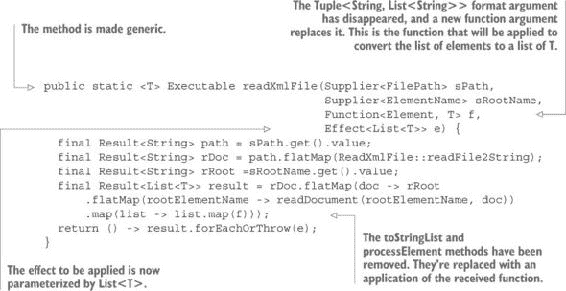

客户端程序现在可以相应地进行修改。这让你摆脱了使用`Tuple`技巧来传递格式字符串和参数名称列表的需求：

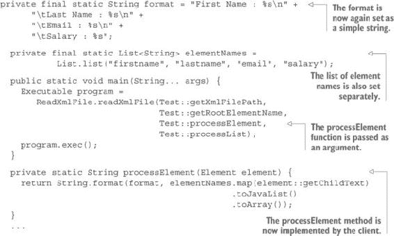

注意，`processList`效果没有改变。现在，客户端需要提供一个函数来转换一个元素，以及应用于此元素的效果。

#### 15.3.7\. 处理元素名称上的错误

现在，您面临的问题是读取元素时发生错误。传递给`readXmlFile`方法的函数返回一个原始类型，这意味着它应该是一个全函数，但它不是。在我们的初始示例中，这是因为错误产生了“null”字符串。现在您正在使用从`Element`到`T`的函数，您可以使用`Result<String>`作为`T`的实现，但这不太实用，因为您最终会得到一个`List<Result<T>>`，您必须将其转换为`Result<List<T>>`。这不是什么大问题，但这一点绝对应该被抽象化。

解决方案是使用从`Element`到`Result<T>`的函数，并使用`List.sequence`方法将结果转换为`Result<List<T>>`。以下是新方法：

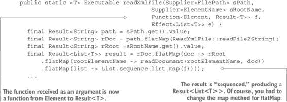

需要进行的唯一额外更改是处理在过程元素方法中可能发生的错误。最佳方法是检查 JDOM 中`getChildText`方法的代码。此方法实现如下：

```
/**
 * Returns the textual content of the named child element, or null if
 * there's no such child. This method is a convenience because calling
 * <code>getChild().getText()</code> can throw a NullPointerException.
 *
 * @param cname the name of the child
 * @return text   content for the named child, or null if no such child
 */
public String getChildText(final String cname) {
  final Element child = getChild(cname);
  if (child == null) {
    return null;
  }
  return child.getText();
}
```

如您所见（当您继续检查`getChild`方法的代码时），此方法不会抛出任何异常，但如果元素不存在，它将返回`null`。因此，您可以修改您的`processElement`方法：

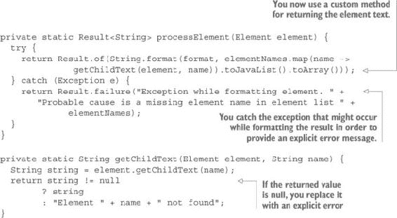

现在，大多数潜在的错误都以功能方式处理。然而，请注意，并非所有错误都可以以功能方式处理。正如我之前所说，传递给`readXmlFile`方法的效应抛出的异常不能以这种方式处理。这些是由方法返回的程序抛出的异常。当方法返回程序时，它尚未执行。这些异常必须在执行结果程序时捕获：

```
public static void main(String... args) {
  Executable program = ReadXmlFile.readXmlFile(Test::getXmlFilePath,
                                               Test::getRootElementName,
                                               Test::processElement,
                                               Test::processList);
  try {
    program.exec();
  } catch (Exception e) {
    System.out.println(e.getMessage());
  }
}
```

您可以在本书附带的代码中找到完整的示例（[`github.com/fpinjava/fpinjava`](http://github.com/fpinjava/fpinjava)）。

### 15.4. 摘要

+   将值放入`Result`上下文是断言的功能等价。

+   可以使用`Result`上下文安全地读取属性文件。

+   功能性属性读取可让您免于处理转换错误。

+   属性可以以抽象方式读取为任何类型、`enum`或集合。

+   可以在遗留命令式库周围构建功能包装器。
