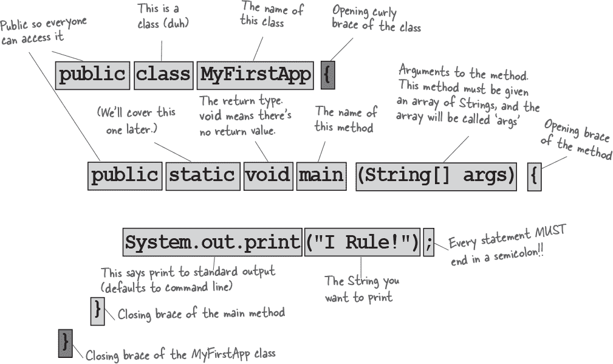
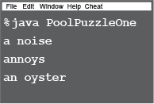

# 第一章：打破表面：深入了解：快速入门


**Java 带你去新的地方。**从它谦逊的版本 1.02 发布到公众以来，Java 以其友好的语法、面向对象的特性、内存管理，以及最重要的——可移植性的承诺，吸引了程序员们。**一次编写，到处运行**的诱惑力太过强大。程序员们追随着这种承诺疯狂前行，抗击错误、限制，还有，哦对了，那个慢如蜗牛的事实。但那是很久以前的事了。如果你刚开始接触 Java，**你很幸运**。我们中的一些人不得不在雪地里徒步走五英里，双脚光着（上坡），才能使最微不足道的应用程序运行起来。但是，*你*，为什么，*你*可以骑着今天更**流畅、更快速、更易读易写**的 Java。

# Java 的工作方式

**目标是编写一个应用程序（在这个例子中是一个互动派对邀请），并使它能够在你的朋友所拥有的任何设备上运行。**


# 你在 Java 中会做什么

**你将输入源代码文件，使用 javac 编译器编译它，然后在 Java 虚拟机上运行编译后的字节码。**


###### 注意

（注意：这**不**是教程……片刻后你将开始编写真正的代码，但现在，我们只是希望你能对所有内容如何结合有所感觉。

换句话说，这页上的代码并不完全真实；不要试图编译它。）

# Java 的简史

Java 最初发布（有人说是“逃逸”）于 1996 年 1 月 23 日。它已经有超过 25 年的历史了！在前 25 年里，Java 语言不断发展，Java API 也显著增长。据我们最好的估计，过去 25 年里编写了超过 17 万亿行的 Java 代码。在编程过程中，你肯定会遇到一些相当古老的 Java 代码，也会碰到一些更新的代码。Java 以其向后兼容性而闻名，所以旧代码可以在新的 JVM 上完全正常运行。

在本书中，我们通常会从使用较旧的编码风格开始（记住，在“现实世界”中你可能会遇到这样的代码），然后我们会介绍新的编码风格。

同样地，我们有时会展示 Java API 中的旧类，然后再展示更新的替代方案。


## 速度和内存使用

当 Java 刚发布时，它很慢。但很快，HotSpot VM 和其他性能增强工具应运而生。虽然 Java 不是市面上最快的语言，但它被认为是一种非常快的语言——几乎和像 C 和 Rust 这样的语言一样快，比大多数其他语言都***快得多***。

Java 有一个神奇的超级能力——JVM。Java 虚拟机可以在代码*运行时*优化你的代码，因此可以创建非常快速的应用程序，而无需编写专门的高性能代码。

但是——完全披露——与 C 和 Rust 相比，Java 使用了大量内存。

**问：Java 版本的命名约定很令人困惑。有 JDK 1.0，1.2，1.3，1.4，然后跳到 J2SE 5.0，然后变成 Java 6，Java 7，上次我查看时，Java 已经到了 Java 18。发生了什么？**

**答：过去 25 年来，版本号变化很大！我们可以忽略字母（J2SE/SE），因为现在基本上不再使用。数字稍微复杂一些。

从技术上讲，Java SE 5.0 实际上是 Java 1.5。对于 6（1.6）、7（1.7）和 8（1.8）也是如此。理论上，Java 仍然是 1.x 版本，因为新版本向后兼容，一直回溯到 1.0。

然而，版本号与每个人使用的名称不同有点令人困惑，因此从 Java 9 开始的官方版本号只是数字，没有“1”前缀；即，Java 9 实际上是版本 9，而不是版本 1.9。

在本书中，我们将使用常见的约定 1.0–1.4，然后从 5 开始，我们将去掉“1”前缀。

自 2017 年 9 月发布 Java 9 以来，每隔六个月就会发布一个 Java 版本，每个版本都有一个新的“主要”版本号，所以我们从 9 迅速跃升到 18！

# Java 中的代码结构


**在源文件中，放置一个类。**

**在一个类中，放置方法。**

**在一个方法中，放置语句。**

## 源文件中应该放什么？

源代码文件（扩展名为*.java*）通常包含一个类定义。***类***代表程序的一部分，尽管一个非常小的应用程序可能只需要一个类。类必须放在一对大括号内。


## 类中应该放什么？

一个类有一个或多个***方法***。在 Dog 类中，***bark***方法将包含狗应该吠叫的指令。您的方法必须在一个类内部声明（换句话说，在类的大括号内部）。


## 方法中应该放什么？

在方法的大括号内，编写指示该方法如何执行的指令。方法*代码*基本上是一组语句，目前您可以将方法视为一种函数或过程。


# 类的解剖

当 JVM 开始运行时，它会在命令行中给出的类中查找。然后它开始寻找一个特别编写的方法，看起来像：

```
  public static void main (String[] args) {
     // your code goes here
  }
```

接下来，JVM 运行主方法的大括号{ }之间的所有内容。每个 Java 应用程序至少必须有一个**类**，至少必须有一个**main**方法（不是每个*类*一个 main；只是每个*应用程序*一个 main）。



现在不用担心记住任何东西...本章只是为了让您入门。

# 编写带有`main()`的类

在 Java 中，所有内容都放在一个**类**中。您将键入源代码文件（扩展名为*.java*），然后将其编译为一个新的类文件（扩展名为*.class*）。当您运行程序时，实际上是在运行一个类。

运行程序意味着告诉 Java 虚拟机（JVM）“加载 `**MyFirstApp**` 类，然后开始执行它的 `**main()**` 方法。一直运行，直到 main 中的所有代码都执行完毕。”

在 第二章 中，《前往对象之城》，我们将深入讨论整个 *类* 的事情，但目前，你需要问的唯一问题是，***我如何编写 Java 代码以便运行？*** 一切都始于 **main()**。

**main()** 方法是你的程序开始运行的地方。

无论你的程序有多大（换句话说，你的程序使用了多少 *类*），都必须有一个 **main()** 方法来启动整个过程。


今晚的讲座：**编译器与 JVM 就“谁更重要？”展开争斗**。

| Java 虚拟机 | 编译器 |
| --- | --- |
| 什么，你在开玩笑？ ***HELLO***。我就是 Java。我才是真正让程序运行起来的人。编译器只是给你一个文件。仅此而已。你可以打印出来用作壁纸、点燃火柴、铺鸟笼，反正这个文件不会做任何事情，除非我在那里运行它。 |  |
|  | 我不喜欢那种语气。 |
| 还有一件事，编译器没有幽默感。不过，如果你整天都在检查瑕疵一点点的语法错误…… |  |
|  | 不好意思，但没有 *我*，你到底要运行什么？Java 被设计为使用字节码编译器是有原因的。如果 Java 是一种纯解释语言，在运行时虚拟机必须从文本编辑器源代码直接翻译，那么 Java 程序将运行得极其缓慢。 |
| 我并不是说你完全没用。但真的，你到底做了什么？说真的。我完全不知道。程序员可以手写字节码，我也能接受。伙计，你可能很快就失业了。 |  |
|  | 不好意思，但那是相当无知（更不用说 *傲慢* 了）的观点。虽然 *理论上* —— *理论上* 你可以运行任何正确格式的字节码，即使它不是由 Java 编译器生成的，但实际上这是荒谬的。手写字节码的程序员就像画度假照片一样，而不是拍照片 —— 当然，这是一门艺术，但大多数人更喜欢用他们的时间做其他事情。如果你能*不*称呼我为“伙计”，我会很感激的。 |
| （关于幽默感的事情我就此结束。）但你还是没有回答我的问题，你到底*能*做什么？ |  |
|  | 记住，Java 是一种强类型语言，这意味着我不能允许变量保存错误类型的数据。这是一个关键的安全功能，我能够在它们传递给你之前阻止绝大多数违规行为。而且我也—— |
| 但有些问题仍然存在！我可以抛出 ClassCastException，有时人们会试图将错误类型的东西放入声明为保存其他内容的数组中，还有... |  |
|  | 对不起，我还没说完呢。是的，运行时可能会出现一些数据类型异常，但其中一些必须允许以支持 Java 的另一个重要功能——动态绑定。在运行时，Java 程序可以包含原始程序员甚至*不知道*的新对象，因此我必须允许一定的灵活性。但我的工作是阻止任何在运行时永远不可能成功的事情。通常情况下，我可以判断某些事情是否会失败，例如，如果程序员意外地尝试将 Button 对象用作 Socket 连接，我会检测到并保护他们免受在运行时造成伤害。 |
| 好的。当然。但是安全性呢？看看我做的所有安全措施，而你只是在检查*分号*？哦哦大的安全风险！多亏有你啊！ |  |
|  | 对不起，但正如他们所说的，我是第一道防线。正如我之前描述的数据类型违规可能会在程序中造成严重后果。我也是防止访问违规的人，例如试图调用私有方法或更改从安全角度上讲绝不能更改的方法的人。我阻止人们触及他们不应看到的代码，包括试图访问另一个类的关键数据的代码。要描述我的工作的重要性可能需要数小时，甚至数天。 |
| 无论如何，我也必须做同样的事情，*仅仅*是为了确保在运行之前没有人偷偷改变了字节码。 |  |
|  | 当然，但正如我之前所说，如果我没有防止可能的问题中的 99%，你们会完全停摆。看起来我们时间不多了，所以我们得以后再聊这个问题。 |
| 哦，你可以指望它。*伙计*。 |  |

# 主方法中可以说些什么？

一旦进入 main（或*任何*方法），就开始有趣了。你可以说大多数编程语言中正常说的话来***让计算机做些什么***。

你的代码可以告诉 JVM：


 **做一些事情**

**语句:** 声明、赋值、方法调用等。

```
int x = 3;
String name = "Dirk";
x = x * 17;
System.out.print("x is " + x);
double d = Math.random();
// this is a comment
```

 **一遍又一遍地做某事**

**循环:** *for* 和 *while*

```
while (x > 12) {
  x = x - 1;
}

for (int i = 0; i < 10; i = i + 1) {
  System.out.print("i is now " + i);
}
```

 **在这种条件下做一些事情**

**分支:** *if/else* 测试

```
if (x == 10) {
  System.out.print("x must be 10");
} else {
  System.out.print("x isn't 10");
}
if ((x < 3) && (name.equals("Dirk"))) {
  System.out.println("Gently");
}
System.out.print("this line runs no matter what");
```


# 循环和循环...

Java 有很多循环结构：while、do-while 和*for*，最古老的是*for*。你将在本书的后面章节中详细了解循环。现在让我们从 while 开始。

语法（更不用说逻辑）是如此简单，你可能已经睡着了。只要某个条件为真，你就在循环*块*内执行所有操作。循环块由一对花括号界定，因此你想重复的任何内容都必须在该块内。

循环的关键在于*条件测试*。在 Java 中，条件测试是一个产生布尔值的表达式，换句话说，它要么是***true***，要么是***false***。

如果你说类似于，“当*冰淇淋在浴缸中为真*时，继续舀取”，你有一个明确的布尔测试。浴缸里要么*有*冰淇淋，要么*没有*。但如果你说，“当*鲍勃*继续舀取时”，你就没有真正的测试。要使其工作，你需要将其更改为类似于，“当鲍勃打呼噜时…”或“当鲍勃*不*穿格子衬衫时…”

## 简单的布尔测试

你可以通过检查变量的值来进行简单的布尔测试，使用如下比较运算符：

**<** （小于）

**>** （大于）

**==**（相等）（是的，这是*两个*等号）

注意*赋值*运算符（单个等号）和*等于*运算符（两个等号）之间的区别。许多程序员在想要输入`==`时不小心输入了`=`。（但不包括你。）

```
int x = 4; // assign 4 to x
while (x > 3) {
  // loop code will run because
  // x is greater than 3
  x = x - 1; // or we’d loop forever
}
int z = 27; //
while (z == 17) {
  // loop code will not run because
  // z is not equal to 17
}
```

## while 循环的示例


# 条件分支

在 Java 中，*if*测试基本上与*while*循环中的布尔测试相同——只不过你会说，“***当***还有巧克力时…”而不是“***如果***还有巧克力…”


上述代码只有当条件（*x*等于 3）为真时才执行打印“x 必须是 3”的行。不管条件是否为真，“这将无论如何运行”都会运行。因此，根据*x*的值，要么打印一条语句，要么打印两条语句。

但是，我们可以在条件中添加*else*，这样我们可以说类似于，“*如果*还有巧克力，继续编码，*否则*（否则）获取更多巧克力，然后继续…”


# 编写一个严肃的业务应用程序


让我们把你新学到的 Java 技能用于实际。我们需要一个包含*main()*、*int*和*String*变量、一个*while*循环和一个*if*测试的类。稍加改进，你将很快能够构建业务后端。但是在查看本页上的代码之前，想一想如何编写经典的儿童最爱，“10 个绿色瓶子”。

```
public class BottleSong {
  public static void main(String[] args) {
    int bottlesNum = 10;
    String word = "bottles";

    while (bottlesNum > 0) {

      if (bottlesNum == 1) {
        word = "bottle"; // singular, as in ONE bottle.
      }

      System.out.println(bottlesNum + " green " + word + ", hanging on the wall");
      System.out.println(bottlesNum + " green " + word + ", hanging on the wall");
      System.out.println("And if one green bottle should accidentally fall,");
      bottlesNum = bottlesNum - 1;

      if  (bottlesNum > 0) {
         System.out.println("There'll be " + bottlesNum +
                            " green " + word + ", hanging on the wall");
      } else {
        System.out.println("There'll be no green bottles, hanging on the wall");
      } // end else
    } // end while loop
  } // end main method
} // end class
```

我们的代码还有一个小缺陷。它编译和运行，但输出并不完全完美。看看你能否发现这个缺陷并修复它。

# 周一早晨，鲍勃的启用 Java 的房子


周一早上 8:30，鲍勃的闹钟响了，就像每个工作日一样。但鲍勃度过了疯狂的周末，伸手按下了贪睡按钮。那时动作开始了，启用 Java 的设备开始运行…


首先，闹钟向咖啡机发送消息“嘿，那个极客又睡过头了，咖啡延迟 12 分钟。”

咖啡机向 Motorola^(TM)烤面包机发送消息，“别烤面包了，鲍勃在睡觉。”

闹钟然后向鲍勃的安卓手机发送消息，“给鲍勃 9 点打电话，告诉他我们有点晚了。”


最后，闹钟向山姆（山姆是狗）的无线项圈发送消息，带着太熟悉的信号，意味着“拿报纸，但别指望散步。”


几分钟后，闹钟再次响起。鲍勃再次按下了贪睡按钮，家用电器开始交谈。最后，闹钟第三次响起。但就在鲍勃伸手按贪睡按钮时，时钟向山姆的项圈发送了“跳起来并吠叫”的信号。震惊地完全清醒，鲍勃起床了，感激他的 Java 技能和即兴的网购增强了他生活中的日常例行事务。

***他的吐司被烤了。***

***他的咖啡冒着热气。***

***他的报纸在等待着。***


又是一个美好的***Java 智能家居***的早晨。


好吧，瓶子歌曲并不是*真正*的严肃商业应用。还需要一些实际的东西来展示给老板吗？看看词组生成器的代码。

###### 注意

注意：当你将这些内容输入编辑器时，让代码自己换行！在输入字符串（在“引号”之间的内容）时，永远不要按回车键，否则它无法编译。因此，你在本页看到的连字符是真实的，你可以输入它们，但在关闭字符串之后才按回车键。

```
public class PhraseOMatic {
  public static void main (String[] args) {

     // make three sets of words to choose from. Add your own!
    String[] wordListOne = {"agnostic", "opinionated",
   "voice activated", "haptically driven", "extensible",
   "reactive", "agent based", "functional", "AI enabled",
   "strongly typed"};

     String[] wordListTwo = {"loosely coupled", "six sigma",
   "asynchronous", "event driven", "pub-sub", "IoT", "cloud
   native", "service oriented", "containerized", "serverless",
   "microservices", "distributed ledger"};

     String[] wordListThree = {"framework", "library",
    "DSL", "REST API", "repository", "pipeline", "service
    mesh", "architecture", "perspective", "design",
    "orientation"};

     // find out how many words are in each list
    int oneLength = wordListOne.length;
    int twoLength = wordListTwo.length;
    int threeLength = wordListThree.length;

     // generate three random numbers
    java.util.Random randomGenerator = new java.util.Random();
    int rand1 = randomGenerator.nextInt(oneLength);
    int rand2 = randomGenerator.nextInt(twoLength);
    int rand3 = randomGenerator.nextInt(threeLength);

     // now build a phrase
    String phrase = wordListOne[rand1] + " " +
    wordListTwo[rand2] + " " + wordListThree[rand3];

     // print out the phrase
    System.out.println("What we need is a " + phrase);
  }
}
```

# 词组生成器

## 工作原理

简而言之，该程序制作了三个单词列表，然后随机从每个列表中选择一个单词，并打印出结果。如果你不完全理解每一行发生了什么，不要担心。天哪，你还有整本书要读，所以放松点。这只是一个从 30,000 英尺外部瞄准杠杆范式的快速浏览。

**1.** 第一步是创建三个 String 数组——这些容器将保存所有单词。声明和创建数组很容易；这里是一个小的例子：

```
 String[] pets = {"Fido", "Zeus", "Bin"};
```

每个单词都用引号括起来（因为所有好的字符串都必须如此），并用逗号分隔。

**2.** 对于三个列表（数组）中的每一个，目标是选择一个随机单词，因此我们必须知道每个列表中有多少单词。如果列表中有 14 个单词，那么我们需要一个介于 0 和 13 之间的随机数（Java 数组是从零开始的，因此第一个单词位于位置 0，第二个单词位于位置 1，最后一个单词在一个 14 元素数组中的位置为 13）。非常方便的是，Java 数组很乐意告诉你它的长度。你只需要问。在宠物数组中，我们会说：

```
 int x = pets.length;
```

而**x**现在将保存值 3。

**3.** 我们需要三个随机数。Java 提供了几种生成随机数的方式，包括 java.util.Random（稍后我们会看到为什么这个类名前面加了 java.util）。`**nextInt()**`方法返回一个介于 0 和我们指定的某个数之间的随机数，*不包括*我们给定的数。因此，我们将给它列表中的元素个数（数组长度）。然后将每个结果分配给一个新变量。我们也可以要求一个介于 0 和 5 之间的随机数，不包括 5：

```
 int x = randomGenerator.nextInt(5);
```

**4.** 现在我们来构建这个短语，从每个列表中选择一个单词并将它们组合在一起（同时在单词之间插入空格）。我们使用“`+`”运算符，它 *连接*（我们更喜欢更技术性的 *组合*）String 对象。要从数组中获取元素，您需要使用该数组的索引号（位置）来指定您想要的东西：

```
 String s = pets[0]; // s is now the String "Fido"
 s = s + " " + "is a dog"; // s is now "Fido is a dog"
```

**5.** 最后，我们将短语打印到命令行，然后...voil...！*我们在市场营销中*。

# 练习


## 码头磁铁


冰箱上混乱地放置了一个工作中的 Java 程序。你能重新排列这些代码片段，使其成为一个产生下面列出的输出的工作 Java 程序吗？有些花括号掉在了地板上，它们太小了，无法捡起，所以你可以随意添加多少个！


**Output:**


 **答案在“练习解答”中。**

## 成为编译器


**每个 Java 文件都代表一个完整的源文件。你的任务是扮演编译器，确定这些文件是否会编译。如果它们不能编译，你会如何修复？**

 **答案在“练习解答”中。**

**A**

```
class Exercise1a {
  public static void main(String[] args) {
    int x = 1;
    while (x < 10) {
      if (x > 3) {
        System.out.println("big x");
      }
    }
  }
}
```

**B**

```
public static void main(String [] args) {
  int x = 5;
  while ( x > 1 ) {
    x = x - 1;
    if ( x < 3) {
      System.out.println("small x");
    }
  }
}
```

**C**

```
class Exercise1c {
  int x = 5;
  while (x > 1) {
    x = x - 1;
    if (x < 3) {
      System.out.println("small x");
    }
  }
}
```


## JavaCross

让你的右脑也有事情做。

这是您的标准填字游戏，但几乎所有的解答单词都来自第一章。为了保持清醒，我们还添加了一些来自高科技世界的（非 Java）单词。


**Across**

4\. 命令行调用者

6\. 再次回来？

8\. 无法双向运行

9\. 笔记本电脑电源的缩写

12\. 数字变量类型

13\. 芯片的缩写

14\. 说一些话

18\. 相当一群角色

19\. 宣布一个新类或方法

21\. 提示作用何在？

**Down**

1\. 不是整数（或 ______ 你的船）

2\. 空手而回

3\. 公开房屋

5\. '东西'持有者

7\. 直到态度改善

10\. 源代码消费者

11\. 无法确定

13\. 程序员和运营部门

15\. 令人震惊的修改器

16\. 只需要一个

17\. 如何完成任务

20\. 字节码消费者

 **答案在“JavaCross”中。**

## 混合信息


下面列出了一个简短的 Java 程序。程序中缺少一个代码块。你的挑战是**将候选代码块**（左侧）**与插入后的输出**进行匹配。不会使用所有输出行，某些输出行可能会重复使用。用线条连接代码块与它们匹配的命令行输出。


###### 注意

将每个候选者与可能的输出之一匹配

 **Answers in “Mixed Messages”。**


## Pool Puzzle


你的***工作***是从池中提取代码片段并将它们放入代码中的空行。每个片段只能使用一次，你不需要使用所有的片段。你的***目标***是创建一个能够编译、运行并输出所列结果的类。别被愚弄了——这比看起来要难。

 **Answers in “Pool Puzzle”。**

**输出**


###### 注意

**注意：每个池中的片段只能使用一次！**

```
class PoolPuzzleOne {
  public static void main(String [] args) {
    int x = 0;

    while ( __________ ) {

       _____________________________
       if ( x < 1 ) {
         ___________________________
       }
       _____________________________

       if ( __________ ) {
         ____________________________

         ___________
       }
       if ( x == 1 ) {

        ____________________________
       }
       if ( ___________ ) {

         ____________________________
       }
       System.out.println();

       ____________
    }
  }
}
```


# 练习解答


## 磨砺你的铅笔

（来自“there are no Dumb Questions”）

```
public class DooBee {
  public static void main(String[] args) {
    int x = 1;
    while (x < 3) {
      System.out.print("Doo");
      System.out.print("Bee");
      x = x + 1;
    }
    if (x == 3) {
      System.out.print("Do");
    }
  }
}
```

## Code Magnets

（来自“Code Magnets”）

```
class Shuffle1 {
  public static void main(String[] args) {

    int x = 3;
    while (x > 0) {

      if (x > 2) {
        System.out.print("a");
      }

      x = x - 1;
      System.out.print("-");

      if (x == 2) {
       System.out.print("b c");
      }

      if (x == 1) {
        System.out.print("d");
        x = x - 1;
      }
    }
  }
}
```


## BE the Compiler

（来自“BE the Compiler”）

**A**


**B**


**C**


## Pool Puzzle

（来自“Pool Puzzle”）


```
class PoolPuzzleOne {
  public static void main(String [] args) {
    int x = 0;

  while ( x < 4 ) {

    System.out.print("a");
    if ( x < 1 ) {
       System.out.print(" ");
    }
    System.out.print("n");

    if ( x > 1 ) {
       System.out.print(" oyster");
       x = x + 2;
    }
    if ( x == 1 ) {
       System.out.print("noys");
    }
    if ( x < 1 ) {
       System.out.print("oise");
   }
   System.out.println();

   x = x + 1;
   }
 }
}
```



## JavaCross

（来自“JavaCross”）


## Mixed Messages

（来自“Mixed Messages”）


