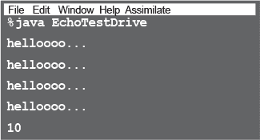

# 第二章：去 Objectville 旅行：类和对象


**我听说过会有对象。** 在第一章中，我们把所有的代码都放在了 main()方法里。那并不完全是面向对象的。事实上，那根本不是面向对象。好吧，我们确实使用了一些对象，比如短语生成器中的字符串数组，但我们并没有真正开发出自己的对象类型。所以现在我们必须离开那个过程式的世界，摆脱 main()，开始创造一些属于我们自己的对象。我们将看看是什么让 Java 中的面向对象开发如此有趣。我们将看看类和对象的区别。我们将看看对象如何能够改变你的生活（至少是你编程生活的一部分。对于你的时尚品味我们就没有什么办法了）。警告：一旦你到达对象之城，你可能再也不想回去了。给我们寄张明信片吧。

# 椅子战争

## （或者说，对象如何改变你的生活）


**从前**在一个软件公司里，两个程序员拿到了同样的规格说明书，并被告知“开始吧”。一个非常讨厌的项目经理强迫这两位程序员竞争，承诺谁先交付就能得到一把 Aeron™椅子和一个可调节高度的站立式桌子，就像硅谷的技术人员一样。劳拉，程序式程序员，和布拉德，面向对象开发者，都知道这将是小菜一碟。

坐在她的（不可调节的）桌子前，劳拉自言自语道，“这个程序需要*做*什么？我们需要哪些***过程***？” 她自问自答，“**rotate**和**playSound**。” 于是她着手构建这些过程。毕竟，一个程序不就是一堆过程吗？

布拉德与此同时在咖啡店里踱步，心里想着，“这个程序中有哪些***要素***...主要的*参与者*是谁？” 他首先想到了**形状**。当然，还有其他他考虑到的东西，比如用户、声音和点击事件。但是他已经有了这些部分的代码库，所以他把注意力集中在构建形状上。继续阅读，看看布拉德和劳拉是如何构建他们的程序的，并且回答你燃起的问题的答案，“那么，谁得到了 Aeron 和桌子？”


## 在劳拉的桌子上

就像以前做了无数次一样，劳拉开始编写她的**重要程序**。她很快就写出了**rotate**和**playSound**。

```
  rotate(shapeNum) {
    // make the shape rotate 360°
  }
  playSound(shapeNum) {
    // use shapeNum to lookup which
    // AIF sound to play, and play it
  }
```

## 在咖啡店里的布拉德的笔记本电脑前

布拉德为每种形状写了一个***类***。


### 劳拉觉得她已经做得很好了。她几乎可以感受到 Aeron 的铁框椅在她下面……

### 但等等！规格发生了变化。

“好吧，*严格来说*劳拉，你是第一个，”经理说，“但是我们只需要在程序中增加一件小事情。对像你们这样的优秀程序员来说，这不是问题。”

*“如果我每次听到这种话都能得到一角钱，我早就富了，”* Laura 想着，知道规格变更没问题是一个幻想。*“然而 Brad 看起来却奇怪地宁静。怎么回事？”* 尽管如此，Laura 仍然坚持她的核心信念，即 OO 的方式虽然可爱，但速度慢。如果你想改变她的想法，你得从她冰冷，死去的，腕管综合征的手中夺走。


## Laura 的办公桌回来了。

旋转过程仍然可以工作；代码使用查找表将 shapeNum 匹配到实际形状图形。但是***playSound 将不得不改变***。

```
   playSound(shapeNum) {
     // if the shape is not an amoeba,
       // use shapeNum to lookup which
       // AIF sound to play, and play it
     // else
       // play amoeba .mp3 sound
  }
```

事实证明这并不是什么大不了的事情，但是***她依然觉得触碰之前测试过的代码有些不安***。*作为*一个人，*她*应该知道，无论项目经理说什么，***规格总是会变***。

## 在 Brad 的便携式电脑上，在海滩上

Brad 笑了笑，啜饮着他的水果冰沙，*编写了一个新类*。有时，他最喜欢的是 OO 的一点就是他不必再触碰他已经测试和交付过的代码。"灵活性，可扩展性，..." 他沉思着，回想起 OO 的好处。


### Laura 在 Brad 之前仅仅几分钟递交了。

（哈！那些 OO 废话也就到此为止了。）但是当那位真正让人讨厌的项目经理带着失望的口吻说道：“哦，不，*这*不是分子应该旋转的方式…”时，Laura 脸上的笑容消失了。

结果，两个程序员的旋转代码都写成了这样：

**1\. 确定围绕形状的矩形。**

**2\. 计算该矩形的中心，并围绕该点旋转形状。**


但是分子形状应该围绕一个*端点*旋转，就像时钟的指针一样。

“我完蛋了，” Laura 想着，想象着烤焦的 Wonderbread™。“虽然，嗯嗯嗯。我可以在旋转过程中再添加一个 if/else，然后仅仅为分子硬编码旋转点代码。那可能不会造成什么破坏。” 但是她脑后的小声音说，“大错特错。你真的认为规格不会再次变化？”


## Laura 的办公桌回来了。

她觉得她最好为旋转过程添加旋转点参数。***很多代码都受到了影响***。测试，重新编译，再从头来过。过去工作正常的事情，现在却不行了。

```
  rotate(shapeNum, xPt, yPt) {
    // if the shape is not an amoeba,
      // calculate the center point
      // based on a rectangle,
      // then rotate
    // else
      // use the xPt and yPt as
      // the rotation point offset
      // and then rotate
  }
```

## 在 Brad 的便携式电脑上，在 Telluride 蓝草音乐节的草坪椅上

Brad 只在分子类中修改了旋转**方法**，但从未触碰过经过测试、工作并编译过的其他部分的代码。为了给分子添加一个旋转点，他添加了一个**属性**，所有的分子都将拥有这个属性。他修改，测试并在一个 Bela Fleck 的表演期间通过免费的音乐节 WiFi 交付了修订后的程序。


## 所以，OO 男孩 Brad 得到了椅子和办公桌，对吧？


***不要着急***。Laura 发现了 Brad 方法中的一个缺陷。而且，由于她确信如果她得到椅子和桌子，她也将是下一个晋升的候选人，所以她必须扭转这种局面。

**LAURA:** 你这里有重复的代码！旋转过程在所有四个 Shape 事物中都有。

**BRAD:** 这是一个***方法***，不是*过程*。它们是***类***，不是*事物*。

**LAURA:** 随便吧。这是一个愚蠢的设计。你必须维护*四个*不同的旋转“方法”。这怎么可能是好的？

**BRAD:** 哦，我猜你没看到最终设计。让我向你展示面向对象的**继承**是如何工作的，Laura。


你可以理解为，“Square 继承自 Shape”，“Circle 继承自 Shape”，以此类推。我从其他形状中移除了 rotate() 和 playSound()，所以现在只需维护一个副本。

Shape 类被称为其他四个类的**超类**。其他四个类是 Shape 的**子类**。子类继承超类的方法。换句话说，*如果 Shape 类具有某些功能，那么子类就会自动获得相同的功能*。

## 变形虫的 rotate() 怎么办？

**LAURA:** 这不就是问题所在吗？那个变形虫形状有完全不同的旋转和播放声音的过程？

**BRAD:** **方法。**

**LAURA:** 随便吧。如果 Amoeba 从 Shape 类“继承”其功能，它怎么可能做出不同的事情？

**BRAD:** 那是最后一步。Amoeba 类**覆盖**了 Shape 类的方法。然后在运行时，JVM 知道当有人告诉 Amoeba 旋转时应该运行哪个 rotate() 方法。


**LAURA:** 如何“告诉”变形虫做某事？难道你不必调用过程，对不起——*方法*，然后告诉它*要*旋转的东西吗？

**BRAD:** 这就是面向对象的很酷的地方。当需要例如让三角形旋转时，程序调用（调用）*三角形对象*上的 rotate() 方法。程序的其余部分实际上并不知道或关心 *三角形是如何做到的*。而当你需要向程序中添加新内容时，只需为新对象类型编写一个新类，这样**新对象将拥有它们自己的行为**。


## 悬念让我无法忍受。谁得到了椅子和桌子？


**来自二楼的 Amy。**

（众所周知，项目经理把规范交给了*三个*程序员。Amy 因为她在不与同事争论的情况下继续进行面向对象编程而更快地完成了项目）。

## 当你设计一个类时，考虑将从该类类型创建的对象。考虑：

+   对象所知道的事情

+   对象所做的事情


### 对象关于自身*知道*的事情称为

+   实例变量

### 对象可以做的事情被称为

+   方法


对象了解自身的***内容***称为**实例变量**。它们表示对象的状态（数据），并且可以为该类型的每个对象具有唯一值。

**将实例视为另一种称呼对象。**

对象能够***做***的事情称为**方法**。当你设计一个类时，你会考虑对象需要了解的数据，并设计操作该数据的方法。对象通常具有读取或写入实例变量值的方法。例如，闹钟对象具有一个实例变量来存储闹钟时间，以及两个用于获取和设置闹钟时间的方法。

因此，对象具有实例变量和方法，但这些实例变量和方法作为类的一部分进行设计。

# 类和对象之间有什么区别？


## 类不是对象（但它们用于构建对象）


**类是对象的*蓝图***。它告诉虚拟机*如何*创建该特定类型的对象。从该类创建的每个对象可以具有自己的实例变量值。例如，您可以使用 Button 类制作多个不同的按钮，每个按钮可能具有自己的颜色、大小、形状、标签等。这些不同的按钮中的每一个都将是一个按钮*对象*。

# 制作你的第一个对象

那么创建和使用对象需要什么？你需要*两个*类。一个类用于你想要使用的对象类型（狗、闹钟、电视等），另一个类用于*测试*你的新类。*测试器*类是你放置 main 方法的地方，在 main()方法中，你创建和访问你的新类类型的对象。测试器类只有一个任务：尝试你的新对象的方法和变量。

从本书的这一点开始，你将在许多示例中看到两个类。其中一个将是*真正*的类——我们真正想要使用其对象的类，另一个类将是*测试器*类，我们称之为*<WhateverYourClassNameIs>* `**TestDrive**`。例如，如果我们创建了一个`**Bungee**`类，我们也需要一个`**BungeeTestDrive**`类。只有*<SomeClassName>* `**TestDrive**`类会有一个 main()方法，它的唯一目的是创建你的新类（非测试器类）的对象，并使用点运算符（.）访问新对象的方法和变量。以下示例将清楚地展示这一切。不，*真的*。


如果你已经掌握了一些面向对象的知识，你会知道我们没有使用封装。我们将在第四章《对象的行为》中讨论这一点。

# 制作和测试电影对象


```
class Movie {
  String title;
  String genre;
  int rating;

  void playIt() {
    System.out.println("Playing the movie");
  }
}

public class MovieTestDrive {
  public static void main(String[] args) {
    Movie one = new Movie();
    one.title = "Gone with the Stock";
    one.genre = "Tragic";
    one.rating = -2;
    Movie two = new Movie();
    two.title = "Lost in Cubicle Space";
    two.genre = "Comedy";
    two.rating = 5;
    two.playIt();
    Movie three = new Movie();
    three.title = "Byte Club";
    three.genre = "Tragic but ultimately uplifting";
    three.rating = 127;
  }
}
```

# 快！离开主方法！

只要你在 main()方法中，你就不是真正的 Objectville。测试程序在 main 方法中运行是可以的，但在真正的面向对象应用程序中，你需要对象之间的交互，而不是一个静态的 main()方法创建和测试对象。

## main 方法的两种用途：

+   为了**测试**你的真实类

+   以**启动/开始**你的**Java 应用程序**

一个真正的 Java 应用程序只是对象与其他对象的交流。在这种情况下，“交流”意味着对象相互调用方法。在前一页和第四章中，我们讨论了如何使用一个独立的 TestDrive 类中的 main()方法来创建和测试另一个类的方法和变量。在第六章中，我们讨论了如何使用一个带有 main()方法的类来启动一个*真正的*Java 应用程序（通过创建对象，然后释放这些对象与其他对象交互等）。

作为一个“窥视”，这是一个真正的 Java 应用程序可能的行为示例。因为我们仍然处于学习 Java 的最初阶段，所以我们使用了一个小工具包，因此你可能会觉得这个程序有些笨拙和低效。你可以考虑如何改进它，在后面的章节中我们会具体讨论这个问题。如果有些代码让你感到困惑，不要担心；这个示例的关键是对象之间的交互。

## 猜谜游戏

**总结：**

猜谜游戏包括一个游戏对象和三个玩家对象。游戏生成一个介于 0 和 9 之间的随机数，三个玩家对象尝试猜测它。（我们并没有说这是一个非常*激动人心*的游戏。）

**类：**

```
  GuessGame.class   Player.class   GameLauncher.class
```

**逻辑：**

1\. GameLauncher 类是应用程序启动的地方；它有 main()方法。

2\. 在 main()方法中创建了一个 GuessGame 对象，并调用了它的 startGame()方法。

3\. GuessGame 对象的 startGame()方法是整个游戏进行的地方。它创建三个玩家，然后“想出”一个随机数（玩家要猜测的目标）。然后它要求每个玩家猜测，检查结果，并打印出关于获胜玩家的信息或要求他们再次猜测。


# 运行猜谜游戏

**输出（每次运行时都会有所不同）**


# 练习


## 成为编译器


**这一页上的每个 Java 文件都代表一个完整的源文件。你的任务是扮演编译器，确定这些文件是否会编译通过。如果它们不能编译，你会如何修复它们？如果可以编译，它们的输出会是什么？**

**A**

```
class StreamingSong {

  String title;
  String artist;
  int duration;

  void play() {
    System.out.println("Playing song");
  }

  void printDetails() {
    System.out.println("This is " + title +
                       " by " + artist);
  }
}

class StreamingSongTestDrive {
  public static void main(String[] args) {

    song.artist = "The Beatles";
    song.title = "Come Together";
    song.play();
    song.printDetails();
  }
}
```

**B**

```
class Episode {

  int seriesNumber;
  int episodeNumber;

  void skipIntro() {
    System.out.println("Skipping intro...");
  }

  void skipToNext() {
    System.out.println("Loading next episode...");
  }
}

class EpisodeTestDrive {
  public static void main(String[] args) {

    Episode episode = new Episode();
    episode.seriesNumber = 4;
    episode.play();
    episode.skipIntro();
  }
}
```

 **答案见“BE the Compiler”。**

## 代码磁铁


一个 Java 程序在冰箱上被弄得一团糟。你能重组代码片段，使其成为一个可以编译和运行，并且产生下面列出的输出的工作 Java 程序吗？一些花括号掉到了地板上，它们太小了，没法捡起来，所以你可以自由地添加需要的花括号。

 **答案见 “代码磁铁”.**


## 池子谜题


你的 ***任务*** 是从池中取出代码片段，放置到代码的空白行中。你**可以**多次使用同一个片段，并且不需要使用所有的片段。你的 ***目标*** 是创建能够编译和运行，并且产生下面列出的输出的类。本书中的一些练习和谜题可能有多个正确答案。如果你找到了另一个正确答案，请给自己加分！

**输出**


**奖励问题！**

如果输出的最后一行是 **24** 而不是 **10**，你将如何完成这个谜题？


###### 注意

**注：可以多次使用池中的每个片段！**


 **答案见 “谜题解决方案”.**


## 我是谁？


一群穿着全副武装的 Java 组件正在玩一个派对游戏，“我是谁？”他们给你一个线索，你根据他们说的话猜猜他们是谁。假设他们总是诚实地说出自己的情况。如果他们碰巧说的话对多个人都适用，你可以选择所有适用于这句话的人。在句子旁边的空白处填上一个或多个与句子相对应的名字。第一个给你提示了。

**今晚的参与者：**

**类 方法 对象 实例变量**

| **我是从 .java 文件编译而来。** | **class** |
| --- | --- |
| **我的实例变量值可以与我的朋友的值不同。** | ________________________________ |
| **我像一个模板一样表现。** | ________________________________ |
| **我喜欢做事情。** | ________________________________ |
| **我可以有很多方法。** | ________________________________ |
| **我代表“状态”。** | ________________________________ |
| **我有行为。** | ________________________________ |
| **我位于对象中。** | ________________________________ |
| **我存在于堆上。** | ________________________________ |
| **我用来创建对象实例。** | ________________________________ |
| **我的状态可以改变。** | ________________________________ |
| **我声明方法。** | ________________________________ |
| **我可以在运行时改变。** | ________________________________ |

 **答案见 “我是谁？”.**

# 练习解决方案


## 代码磁铁

(来自“代码磁铁”)

```
class DrumKit {
  boolean topHat = true;
  boolean snare = true;

  void playTopHat() {
    System.out.println("ding ding da-ding");
  }

  void playSnare() {
    System.out.println("bang bang ba-bang");
  }
}

class DrumKitTestDrive {
  public static void main(String[] args) {
    DrumKit d = new DrumKit();
    d.playSnare();
    d.snare = false;
    d.playTopHat();
    if (d.snare == true) {
      d.playSnare();
    }
  }
}
```


## 成为编译器

(来自“成为编译器”)

**A**


**B**


## 拼图解答


### 游泳池谜题

(来自“游泳池谜题”)

```
public class EchoTestDrive {
  public static void main(String[]
args) {
    Echo  e1 = new Echo();
    Echo e2 = new Echo(); // correct answer
      - or -
    Echo e2 = e1;  // bonus "24" answer
    int x = 0;
    while (x < 4) {
      e1.hello();
      e1.count = e1.count + 1;
      if (x == 3) {
        e2.count = e2.count + 1;
      }
      if (x > 0) {
        e2.count = e2.count + e1.count;
      }
      x = x + 1;
    }
    System.out.println(e2.count);
  }
}
------------------------------------------
class Echo {
  int count = 0;

  void hello() {
    System.out.println("helloooo... ");
  }
}
```



## 我是谁？

(来自“我是谁？”)

| **我从 .java 文件编译而来。** | 类 |
| --- | --- |
| **我的实例变量值可以与我的伙伴的值不同。** | 对象 |
| **我表现为模板。** | 类 |
| **我喜欢做事情。** | 对象，方法 |
| **我可以有很多方法。** | 类，对象 |
| **我代表“状态”。** | 实例变量 |
| **我有行为。** | 对象，类 |
| **我位于对象中。** | 方法，实例变量 |
| **我存在于堆中。** | 对象 |
| **我用于创建对象实例。** | 类 |
| **我的状态可以改变。** | 对象，实例变量 |
| **我声明方法。** | 类 |
| **我可以在运行时改变。** | 对象，实例变量 |

###### 注意

注意：类和对象都被认为有状态和行为。它们在类中定义，但是对象也被认为“拥有”它们。现在我们不关心它们技术上属于哪里。
