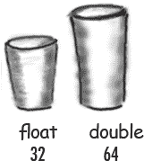

# 第三章：了解你的变量：原始类型和引用


变量可以存储两种类型的东西：原始类型和引用。到目前为止，你已经在两个地方使用变量——作为对象**状态**（实例变量）和作为**局部**变量（在*方法*中声明的变量）。稍后，我们将使用变量作为**参数**（由调用代码发送给方法的值），以及作为**返回类型**（发送回方法调用者的值）。你已经看到变量声明为简单的**原始**整数值（类型`int`）。你已经看到变量声明为更复杂的东西，比如一个 String 或一个数组。但**生活肯定还有更多**，不仅仅是整数、字符串和数组。如果你有一个 PetOwner 对象，其中有一个 Dog 实例变量呢？或者一个 Car 有一个 Engine？在本章中，我们将揭开 Java 类型的神秘之处（比如原始类型和引用之间的区别），看看你可以*声明*为变量的内容，你可以*放入*变量的内容，以及你可以*对*变量做什么。最后，我们将看到在可回收堆上生活是*真正*的样子。

# 声明一个变量


**Java 关心类型。**它不会让你做一些奇怪和危险的事情，比如把长颈鹿引用塞进兔子变量中——当有人试图要求所谓的*兔子*去`hop()`时会发生什么？它也不会让你把浮点数放入整数变量中，除非你*告诉编译器*你知道可能会失去精度（比如，小数点后的一切）。

编译器可以发现大多数问题：

```
Rabbit hopper = new Giraffe();
```

不要指望它能编译。*幸好*。

要使所有这些类型安全起作用，你必须声明变量的类型。它是一个整数吗？一只狗？一个单个字符？变量有两种类型：***原始***和***对象引用***。原始类型保存基本值（想想：简单的位模式），包括整数、布尔值和浮点数。对象引用保存，嗯，*对象*的*引用*（哎呀，这难道不是解释清楚了吗）。

我们先看原始类型，然后再讨论对象引用的真正含义。但无论类型如何，你必须遵循两个声明规则：

除了类型，变量需要一个名称，这样你可以在代码中使用该名称。

* * *

**变量必须有一个类型**

* * *

除了类型，变量需要一个名称，这样你可以在代码中使用该名称。

* * *

**变量必须有一个名称**

* * *


注意：当你看到类似于：“一个**类型**为 X 的对象”这样的陈述时，将*类型*和*类*视为同义词。（我们将在后面的章节中进一步细化这一点。）

# “我想要一杯双份摩卡，不，把它变成一个整数。”

当你想到 Java 变量时，想象杯子。咖啡杯，茶杯，能装下很多你喜欢的饮料的巨大杯子，电影院里装爆米花的大杯子，带有美妙触感把手的杯子，以及你学会永远不能把金属装饰放进微波炉的杯子。

**一个变量只是一个杯子。一个容器。它 *容纳* 一些东西。**

它有一个大小和一个类型。在这一章中，我们首先看看**原始类型**的变量（杯子），稍后我们将看看持有*对象引用*的杯子。请跟随我们继续使用整个杯子类比——尽管现在它很简单，但当讨论变得更复杂时，它会给我们提供一个共同的看待事物的方式。这很快就会发生。

基本数据类型就像咖啡店里的杯子一样。如果你去过星巴克，你就知道我们在这里说什么。它们有不同的大小，并且每个都有一个名称，如“short”、“tall”，以及，“我想要一个‘grande’摩卡半加因为加了奶油。”

在柜台上展示的杯子可能会让你可以适当地下订单：


而在 Java 中，基本数据类型有不同的大小，这些大小有名称。当你在 Java 中声明任何变量时，必须使用特定的类型进行声明。这里的四个容器是 Java 中的四种整数基本类型。


每个杯子都包含一个值，所以对于 Java 的基本数据类型，与其说，“我想要一杯高法式浓缩”，不如对编译器说，“我想要一个带有数字 90 的 int 变量”。除了一个微小的区别……在 Java 中，你还需要给你的杯子起个 *名字*。所以实际上是，“请给我一个 int，值为 2486，并且给这个变量起名为 ***height***。” 每个基本数据类型变量都有固定数量的位（杯子大小）。Java 中六种数值基本类型的大小如下所示：



## 原始类型

| 类型 | 位深度 | 值范围 |
| --- | --- | --- |

**布尔和 char**

| boolean | (特定于 JVM) | ***true*** 或 ***false*** |
| --- | --- | --- |
| char 16 | 位 | 0 到 65535 |

**数值（所有都是有符号的）**

***整数***

| byte | 8 位 | -128 到 127 |
| --- | --- | --- |
| short | 16 位 | -32768 到 32767 |
| int | 32 位 | -2147483648 到 2147483647 |
| long | 64 位 | -huge 到 huge |

***浮点数***

| float | 32 位 | 变化 |
| --- | --- | --- |
| double | 64 位 | 变化 |

* * *

**具有赋值的原始声明：**


# 你真的不想把那个……

**确保值能够适合变量。**


你不能把一个大的值放进一个小杯子里。

好吧，可以，但会有一些损失。你会得到一些，正如我们所说的，*溢出*。如果编译器能够从你的代码中判断出某些东西不适合放在你正在使用的容器（变量/杯子）中，它会尽力帮助防止这种情况。

例如，你不能把一个 int 的东西倒进一个 byte 大小的容器中，如下所示：

```
int x = 24;
byte b = x;
//won’t work!!
```

为什么这不起作用，你会问？毕竟，*x*的值是 24，而 24 绝对小得足以放入一个字节中。*你*知道，*我们*也知道，但编译器关心的只是你试图把大东西放到小东西里，并且可能溢出。不要指望编译器知道*x*的值，即使你在代码中能看到它的确切值。

-   **你可以通过多种方式给变量赋值，包括：**

+   在等号后面输入一个*文字*值（x=*12*，isGood = ***true***，等等）

+   将一个变量的值赋给另一个变量（x = y）

+   使用结合两者的表达式（x = y + ***43***）

在下面的例子中，文字值以***粗体斜体***显示：

| int size = ***32***; | 声明一个名为*size*的整数，将其赋值为*32*。 |
| --- | --- |
| `char initial = ***'j';***` | 声明一个名为*initial*的字符，将其赋值为*‘j’*。 |
| `double d = ***456.709;***` | 声明一个名为*d*的双精度数，将其赋值为*456.709*。 |
| `boolean isLearning;` | 声明一个名为*isCrazy*的布尔型（未赋值） |
| `isLearning = ***true;***` | 将值*true*赋给之前声明的*isCrazy* |
| `int y = x + ***456***;` | 声明一个名为*y*的整数，将其赋值为当前*x*的值加*456*。 |

# 远离关键字！


你知道你的变量需要一个名称和一个类型。

你已经了解了基本类型。

***那么你可以用什么作为名称呢？*** 规则很简单。你可以根据以下规则为类、方法或变量命名（实际规则略微灵活，但这些规则能保证你的安全）：

+   **它必须以字母、下划线（_）或美元符号（$）开头。你不能以数字开头。**

+   -   **在第一个字符之后，你也可以使用数字。只是别以数字开头。**

+   **它可以是任何你喜欢的东西，只要遵守这两条规则，只要不是 Java 的保留字。**

保留字是编译器识别的关键字（和其他东西）。如果你真的想搞乱编译器，那就*试*着用保留字作为名称。

你已经看到了一些保留字：


但还有很多我们还没有讨论过的。即使你不需要知道它们的含义，你仍然需要知道自己不能自行使用它们。***绝对不要——****任何情况下*——***试图现在就记住这些***。为了在你的脑袋中为它们腾出空间，你可能得把其他东西忘了。比如你停车的地方。别担心，到这本书结束时，你会对它们大部分了如指掌的。


# 此表格保留

| _ | 捕获 | 双精度 | 浮点 | 整数 | 私有 | 超级 | 真 |
| --- | --- | --- | --- | --- | --- | --- | --- |
| 抽象 | 字符 | 否则 | 为 | 接口 | 受保护 | 开关 | 尝试 |
| 断言 | 类 | 枚举 | 跳转到 | 长 | 公共 | 同步 | 空 |
| 布尔 | 常量 | 扩展 | 如果 | 本地 | 返回 | 这 | 易挥发性 |
| break | continue | false | implements | new | short | throw | while |
| byte | default | final | import | null | static | throws |  |
| case | do | finally | instanceof | package | strictfp | transient |  |

Java 的关键字、保留字和特殊标识符。如果你用这些作为名称，编译器可能会非常，*非常*不高兴。

# 控制你的 Dog 对象


你知道如何声明一个原始变量并给它赋值。但是现在怎么处理非原始变量呢？换句话说，*对象呢？*

* * *

+   实际上并不存在对象变量。

+   只有一个对象引用变量。

+   一个对象引用变量保存代表*访问*对象的位。

+   它不保存对象本身，而是保存类似指针或地址的东西。不过，在 Java 中，我们并不真正知道*引用变量*里面是什么。我们*知道*它代表一个且仅一个对象。而 JVM 知道如何使用引用来访问对象。

* * *

你不能把一个对象塞进一个变量里。我们经常这样想...我们会说，“我把 String 传递给 System.out.println()方法。”或者，“该方法返回一个 Dog”，或者，“我把一个新的 Foo 对象放入名为 myFoo 的变量中。”

但事实并非如此。并不存在可以随着对象大小增长的巨大可扩展杯子。对象只存在于一个地方——可垃圾回收的堆中！（你将在本章后面了解更多。）

虽然原始变量充满了代表变量实际***值***的位，但对象引用变量充满了代表***访问对象的方式***的位。

你可以在引用变量上使用点运算符（.）来表示，“使用点之前的东西*获取*点之后的东西。”例如：

```
myDog.bark();
```

意思是，“使用变量 myDog 引用的对象来调用 bark()方法。”当你在对象引用变量上使用点运算符时，可以将其视为按下该对象的遥控器上的按钮。


# 一个对象引用只是另一个变量值

**放入杯子里的东西。**

**只是这一次，这个值是一个遥控器。**

* * *

**原始变量**

```
byte x = 7;
```

代表 7 的位进入变量（00000111）。


* * *

**引用变量**

```
Dog myDog = new Dog();
```

代表访问 Dog 对象的位进入变量。

***Dog 对象本身并不进入变量！***


我们不关心引用变量中有多少个 1 和 0。这取决于每个 JVM 和月相。

**对象声明、创建和赋值的 3 个步骤**


 **声明一个引用变量**


```
Dog myDog = new Dog();
```

告诉 JVM 为一个引用变量分配空间，并将该变量命名为*myDog*。这个引用变量永远是 Dog 类型。换句话说，这是一个有按钮可以控制一只狗的遥控器，但不能是猫、按钮或插座。

 **创建一个对象**


```
Dog myDog = new Dog();
```

告诉 JVM 在堆上为一个新的狗对象分配空间（我们会在第九章详细学习这个过程，*对象的生与死*）。

 **链接对象和引用**


```
Dog myDog = new Dog();
```

分配一个新的狗给引用变量`myDog`。换句话说，***编程这个遥控器***。

# Java 暴露


**本周的采访：对象引用**

**HeadFirst:** 那么告诉我们，作为一个对象引用，生活是什么样子的？

**Reference:** 相当简单，实际上。我是一个遥控器，可以被编程来控制不同的对象。

**HeadFirst:** 你是说在运行时即使你在引用不同的对象？比如，你可以先引用一个狗，然后五分钟后引用一个车吗？

**Reference:** 当然不行。一旦我声明了，就是这样了。如果我是一个狗的遥控器，那么我永远不能指向（哦，不好意思，我们不应该说*指向*），我的意思是，*引用*除了狗以外的任何东西。

**HeadFirst:** 这意味着你只能参考一个狗吗？

**Reference:** 不是的。我可以参考一个狗，然后五分钟后参考另一个*不同*的狗。只要它是狗，我就可以被重定向（就像重新编程你的遥控器换一个不同的电视）。除非...不，算了。

**HeadFirst:** 不，告诉我。你刚才想说什么？

**Reference:** 我觉得现在你不想深入讨论这个，但我简单告诉你——如果我被标记为*final*，那么一旦我被分配了一个狗，我就永远不能被重新编程为其他东西，只能永远是*那个*狗。换句话说，没有其他对象可以分配给我。

**HeadFirst:** 你说得对，现在我们不想谈论这个。好的，除非你是*final*，那么你可以先引用一个狗，然后后来引用一个不同的狗。你能否完全不引用任何东西？是不是可能什么都不被编程？

**Reference:** 是的，但是谈到这个让我感到不安。

**HeadFirst:** 为什么会这样？

**Reference:** 因为这意味着我是`null`，而这让我感到不安。

**HeadFirst:** 你是说，因为这样你就没有价值了？

**参考：** 哦，`null` *是*一个值。我仍然是一个遥控器，但这就像你带回了一个新的通用遥控器，却没有电视。我没有被程序化去控制任何东西。他们可以整天按我的按钮，但什么好事都不会发生。我感觉如此……无用。浪费位。虽然不是那么多位，但仍然如此。而且这不是最糟糕的部分。如果我是对特定对象唯一的引用，然后我被设置为`null`（去程序化），这意味着现在*没有人*能够访问我曾经引用的那个对象。

**HeadFirst:** 这是不好的因为……

**参考：** 你必须*问*吗？在这里，我已经与这个对象建立了关系，一种亲密的连接，然后这种联系突然残酷地被切断了。我再也见不到那个对象，因为现在它有资格进行[制作人，请奏悲伤的音乐]*垃圾回收*。哭泣。但程序员是否曾经考虑过*那*？哭泣。为什么，*为什么*我不能成为原始类型？*我讨厌成为一个引用。* 责任，所有破碎的附件……

## 垃圾收集堆上的生活


```
Book b = new Book();
Book c = new Book();
```

声明两个 Book 引用变量。创建两个新的 Book 对象。将 Book 对象分配给引用变量。

这两个 Book 对象现在存活在堆上。

参考文献：2

对象：2

* * *


* * *

```
Book d = c;
```

声明一个新的 Book 引用变量。而不是创建一个新的第三个 Book 对象，将变量***c***的值分配给变量***d***。但这是什么意思？这就像说“拿 c 中的位，复制它们，然后把那个副本放入 d 中。”

**变量*c*和*d*都指向同一个对象。**

**变量*c*和*d*持有同一个值的两个不同副本。两个遥控器程序控制同一台电视。**

参考文献：3

对象：2

* * *


```
c = b;
```

将变量*b*的值分配给变量*c*。到现在为止，你知道这意味着什么。变量*b*内的位被复制，然后这个新的副本被放入变量*c*中。

**b 和 c 都指向同一个对象。**

**变量*c*不再引用其旧的 Book 对象。**

参考文献：3

对象：2

## 生命与死亡在堆上


```
Book b = new Book();
Book c = new Book();
```

声明两个 Book 引用变量。创建两个新的 Book 对象。

这两个 Book 对象现在存活在堆上。

活跃引用：2

可达对象：2

* * *


```
b = c;
```

将变量***c***的值分配给变量***b***。变量***c***内的位被复制，然后这个新的副本被放入变量***b***中。两个变量持有相同的值。

**b 和 c 都指向同一个对象。对象 1 被抛弃，可以进行垃圾回收（GC）。**

活跃引用：2

可达对象：1

被抛弃的对象：1

变量*b*引用的第一个对象，对象 1，再没有引用。它是*不可达*的。


* * *

```
c = null;
```

将值 `null` 赋给变量 ***c***。这使得 ***c*** 成为一个*null 引用*，意味着它不引用任何东西。但它仍然是一个引用变量，另一个 Book 对象仍然可以分配给它。

**对象 2 仍然有一个活动引用（b），只要它有引用，对象就不会被垃圾回收。**

活动引用：1

*null* 引用：1

可达对象：1

废弃对象：1

# 数组就像一个杯盘

Java 标准库包含许多复杂的数据结构，包括映射、树和集合（请参见附录 B），但在您只想要一个快速、有序、高效的事物列表时，数组是非常好的选择。通过使用索引位置，数组使您能够快速随机访问任何元素。

数组中的每个元素都只是一个变量。换句话说，八种原始变量类型中的一种（考虑：大毛狗）或引用变量。您可以将该类型的 *变量* 中的任何内容分配给该类型的 *数组元素*。因此，在 int 类型的数组（int[]）中，每个元素可以保存一个 int。在 Dog 数组（Dog[]）中，每个元素可以保存……一个 Dog 吗？不，记住引用变量只保存一个引用（一个遥控器），而不是对象本身。因此，在 Dog 数组中，每个元素可以保存指向 Dog 的*遥控器*。当然，我们仍然需要创建 Dog 对象……您将在下一页看到所有这些内容。

确保在图片中注意一件重要的事情——***数组是一个对象，即使它是一个原始类型的数组。***

 声明一个 int 数组变量。数组变量是数组对象的遥控器。

```
int[] nums;
```

 创建一个长度为 7 的新 int 数组，并将其分配给先前声明的 `int[]` 变量 `nums`

```
nums = new int[7];
```

 为数组中的每个元素赋予一些整数值。记住，整数数组中的元素只是整数 *变量*。


无论它们声明为持有原始类型还是对象引用，数组始终是对象。


# 数组也是对象

您可以有一个声明为*持有*基本值的数组对象。换句话说，数组对象可以有*原始类型* 的 *元素*，但数组本身永远不是原始类型。**无论数组包含什么，数组本身始终是一个对象！**

# 制作一组 Dogs

 声明一个 Dog 数组变量

```
Dog[] pets;
```

 创建一个长度为 7 的新 Dog 数组，并将其分配给先前声明的 `Dog[]` 变量 `pets`

```
pets = new Dog[7];
```

**什么是缺失的？**


**Dogs！我们有一个 Dog 引用数组，但没有实际的 Dog *对象*！**

* * *

 创建新的 Dog 对象，并将它们分配给数组元素。

记住，Dog 数组中的元素只是 Dog 引用 *变量*。我们仍然需要 Dogs！

```
pets[0] = new Dog();
pets[1] = new Dog();
```


# 控制你的狗（使用引用变量）


```
Dog fido = new Dog();
fido.name = "Fido";
```

我们创建了一个狗对象，并使用字符串点运算符在引用变量***fido***上访问名称变量。

我们可以使用***fido***引用来让狗叫()或吃()或追猫()。


```
fido.bark();

fido.chaseCat();
```

# 如果狗在一个狗数组中会发生什么？

我们知道可以使用点运算符访问狗的实例变量和方法，但是在什么上面呢？

当狗在数组中时，我们没有实际的变量名（比如***fido***）。相反，我们使用数组表示法，并在数组中特定索引（位置）上的对象上按下遥控器按钮（点运算符）：

```
Dog[] myDogs = new Dog[3];

myDogs[0] = new Dog();

myDogs[0].name = "Fido";

myDogs[0].bark();
```

*是的，我们知道我们这里没有展示封装，但我们试图保持简单。暂时而言。我们将在第四章中进行封装。

# 一个狗的例子


**输出**


# 练习


## 成为编译器


**这页上的每个 Java 文件代表一个完整的源文件。你的任务是扮演编译器的角色，确定这些文件是否会编译和运行而不出现异常。如果不能，你将如何修复它们？**

**A**

```
class Books {
  String title;
  String author;
}

class BooksTestDrive {
  public static void main(String[] args) {
    Books[] myBooks = new Books[3];
    int x = 0;
    myBooks[0].title = "The Grapes of Java";
    myBooks[1].title = "The Java Gatsby";
    myBooks[2].title = "The Java Cookbook";
    myBooks[0].author = "bob";
    myBooks[1].author = "sue";
    myBooks[2].author = "ian";

    while (x < 3) {
      System.out.print(myBooks[x].title);
      System.out.print(" by ");
      System.out.println(myBooks[x].author);
      x = x + 1;
    }
  }
}
```

**B**

```
class Hobbits {
  String name;

  public static void main(String[] args) {
    Hobbits[] h = new Hobbits[3];
    int z = 0;

    while (z < 4) {
      z = z + 1;
      h[z] = new Hobbits();
      h[z].name = "bilbo";
      if (z == 1) {
        h[z].name = "frodo";
      }
      if (z == 2) {
        h[z].name = "sam";
      }
      System.out.print(h[z].name + " is a ");
      System.out.println("good Hobbit name");
    }
  }
}
```

 **答案在“练习解答”。**

## 代码磁铁


一个工作的 Java 程序在冰箱上搅乱了。你能重构代码片段，使其成为一个能产生以下输出的工作的 Java 程序吗？一些花括号掉到地板上了，太小了，没法捡起来，所以你可以随意添加你需要的数量！


 **答案在“代码磁铁”。**

## 池谜题


你的***工作***是从池中取出代码片段，并将它们放入代码的空白行中。你**可以**多次使用相同的片段，并且你不需要使用所有的片段。你的***目标***是制作一个能编译和运行并产生列出的输出的类。

**输出**


**额外问题！**

为了额外的奖励分数，使用池中的片段填补上面缺失的输出。


**注意：池中的每个片段都可以多次使用！**


 **答案在“池谜题”。**

## 一堆麻烦


右侧列出了一个简短的 Java 程序。当达到“//做一些事情”时，一些对象和一些引用变量将被创建。你的任务是确定哪些引用变量指向哪些对象。并非所有引用变量都会被使用，有些对象可能会被多次引用。画线连接引用变量与其匹配的对象。

***提示:*** 除非你比我们聪明得多，否则你可能需要画出“垃圾回收堆上的生活”这一章中的图表–本章的 60 页。使用铅笔，这样你就可以画出然后擦除参考链接（从参考遥控器指向对象的箭头）。


| 引用变量: | HeapQuiz 对象: |
| --- | --- |
|  |  |

###### 注意

**将每个引用变量与匹配的对象进行匹配。**

**你可能不需要使用每个参考。**

 **答案在“一堆麻烦”中。**

## 被盗参考案


那是一个漆黑而风雨交加的夜晚。Tawny 悠然走进程序员的牛棚，就像她拥有这个地方一样。她知道所有程序员仍在努力工作，她需要帮助。她需要在关键类中添加一个新方法，该类将被加载到客户的新秘密 Java 手机中。手机内存中的堆空间很紧张，每个人都知道。牛棚里通常喧闹的嗡嗡声突然安静下来，当 Tawny 缓缓走向白板时。她草草勾画了新方法功能的简要概述，然后缓慢地扫视了房间。“好了，伙计们，现在是紧要关头，”她轻声说道。“谁能创建出最节省内存的版本这个方法，明天就跟我一起去客户的发布派对上，帮我安装新软件。”

## 五分钟推理


第二天早上，Tawny 滑入牛棚。“女士们先生们，”她微笑着说，“飞机几个小时后就要起飞了，让我看看你们有什么！” Bob 第一个上场；当他开始在白板上勾画设计时，Tawny 说，“Bob，让我们直奔主题，告诉我你是如何处理更新联系对象列表的。” Bob 迅速在白板上画了一段代码片段：

```
    Contact [] contacts = new Contact[10];
    while (x < 10 ) {   // make 10 contact objects
      contacts[x] = new Contact();
      x = x + 1;
    }
    // do complicated Contact list updating with contacts
```

“Tawny，我知道我们的内存很紧张，但你的规格书说我们必须能够访问所有十个可允许的联系人的个人信息；这是我能想到的最好的方案，”Bob 说。接下来是 Kate，已经想象着派对上的椰子鸡尾酒，“Bob，”她说，“你的解决方案有点笨拙，你不觉得吗？” Kate 咧嘴笑道，“看看这个宝贝”：

```
    Contact contactRef;
    while ( x < 10 ) {   // make 10 contact objects
      contactRef = new Contact();
      x = x + 1;
    }
    // do complicated Contact list updating with contactRef
```

“我节省了一堆值得记忆的引用变量，Bob-o-rino，所以收起你的防晒霜吧，”Kate 嘲笑道。“不要那么快，Kate！”Tawny 说，“你节省了一点内存，但 Bob 跟我走。”

***为什么 Tawny 在 Kate 的方法使用更少内存时选择了 Bob 的方法？***

 **答案在 “五分钟推理” 中。**

# 练习解答


## 锻炼你的铅笔

(来源于 “锻炼你的铅笔”)


## 代码磁铁

(来源于 “代码磁铁”)

```
class TestArrays {
  public static void main(String[] args) {
    int[] index = new int[4];
    index[0] = 1;
    index[1] = 3;
    index[2] = 0;
    index[3] = 2;
    String[] islands = new String[4];
    islands[0] = "Bermuda";
    islands[1] = "Fiji";
    islands[2] = "Azores";
    islands[3] = "Cozumel";
    int y = 0;
    int ref;
    while (y < 4) {
      ref = index[y];
      System.out.print("island = ");
      System.out.println(islands[ref]);
      y = y + 1;
    }
  }
}
```


## 成为编译器

(来源于 “成为编译器”)

**A**


**B**


## 拼图解答


### 池谜题

(来源于 “池谜题”)

```
class Triangle {
  double area;
  int height;
  int length;

  public static void main(String[] args) {
    int x = 0;
    Triangle[] ta = new Triangle[4];
    while (x < 4) {
      ta[x] = new Triangle();
      ta[x].height = (x + 1) * 2;
      ta[x].length = x + 4;
      ta[x].setArea();
      System.out.print("triangle " + x + 
                       ", area");
      System.out.println(" = " + ta[x].area);
      x = x + 1;
    }
    int y = x;
    x = 27;
    Triangle t5 = ta[2];
    ta[2].area = 343;
    System.out.print("y = " + y);
    System.out.println(", t5 area = " + 
                       t5.area);
  }

  void setArea() {
    area = (height * length) / 2;
  }
}
```


## 五分钟推理

(来源于 “五分钟推理”)

**被偷窃的引用案件**

Tawny 发现 Kate 的方法有一个严重缺陷。虽然她没有像 Bob 那样使用许多引用变量，但无法访问她方法创建的除最后一个 Contact 对象以外的任何对象。每次循环结束时，她都会将一个新对象赋给唯一的引用变量，因此之前引用的对象会被遗弃在堆中——*无法访问*。由于无法访问创建的十个对象中的九个，Kate 的方法变得毫无用处。

（这款软件大获成功，客户给了 Tawny 和 Bob 额外的一周夏威夷的时间。我们想告诉你，通过完成这本书，你也会得到这样的好处。）

## 一堆麻烦

(来源于 “一堆麻烦”)

| **引用变量:** | **堆谜题对象:** |
| --- | --- |
|  |
