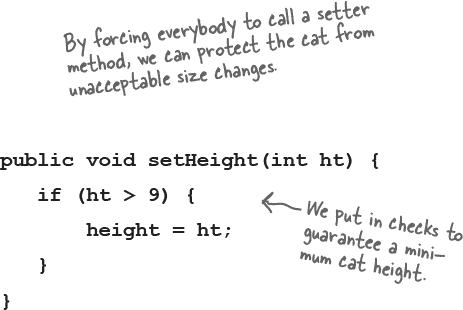
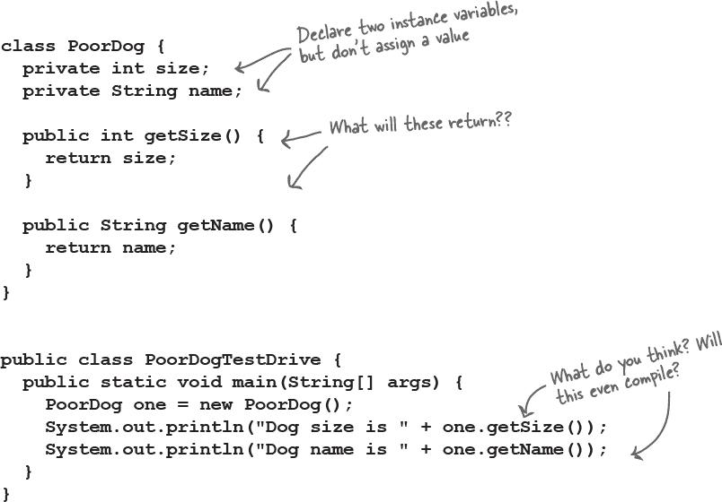
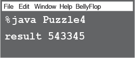

# 第四章：对象的行为：方法使用实例变量


**状态影响行为，行为影响状态**。我们知道对象具有**状态**和**行为**，由**实例变量**和**方法**表示。但直到现在，我们还没有探讨状态和行为之间的*关系*。我们已经知道类的每个实例（特定类型的每个对象）可以为其实例变量拥有自己独特的值。狗 A 可以有一个名为“Fido”的*名字*，体重为 70 磅。狗 B 是“Killer”，体重为 9 磅。如果狗类有一个叫做 makeNoise()的方法，那么你认为一只 70 磅的狗会比那只小 9 磅的狗叫得更深吗？（假设那烦人的尖叫声可以被视为*叫声*。）幸运的是，这就是对象的全部意义——它具有*行为*，可以作用于其*状态*。换句话说，***方法使用实例变量值***。比如，“如果狗的体重小于 14 磅，则发出尖叫声，否则...”或“增加体重 5 磅。”***让我们去改变一些状态吧。***

# 记住：一个类描述了一个对象知道什么和做什么


**一个类是对象的蓝图。**当你编写一个类时，你描述的是 JVM 应该如何制造该类型的对象。你已经知道该类型的每个对象可以有不同的*实例变量*值。但方法呢？

## 该类型的每个对象的方法行为都可能不同吗？


嗯...***有点像。****

特定类的每个实例具有相同的方法，但这些方法可以根据实例变量的值*表现*不同。

Song 类有两个实例变量，*title*和*artist*。当你在一个实例上调用 play()方法时，它将播放由*title*和*artist*实例变量值表示的歌曲。因此，如果你在一个实例上调用 play()方法，你将听到卡贝洛的“Havana”，而另一个实例则播放特拉维斯的“Sing”。但方法的代码是相同的。

```
void play() {
    soundPlayer.playSound(title, artist);
}
```

```
Song song1 = new Song();
song1.setArtist("Travis");
song1.setTitle("Sing");
Song song2 = new Song();
song2.setArtist("Sex Pistols");
song2.setTitle("My Way");
```

# 大小影响叫声

小狗的叫声不同于大狗的叫声。


Dog 类有一个实例变量*size*，bark()方法使用它来决定发出什么样的叫声。


```
class Dog {
  int size;
  String name;

  void bark() {
    if (size > 60) {
      System.out.println("Wooof! Wooof!");
    } else if (size > 14) {
      System.out.println("Ruff!  Ruff!");
    } else {
      System.out.println("Yip! Yip!");
    }
  }
}
```

* * *

```
class DogTestDrive {

  public static void main(String[] args) {
    Dog one = new Dog();
    one.size = 70;
    Dog two = new Dog();
    two.size = 8;
    Dog three = new Dog();
    three.size = 35;

    one.bark();
    two.bark();
    three.bark();
  }
}
```


# 你可以把东西送给一个方法

正如你从任何编程语言中期望的那样，你可以将值传递给你的方法。例如，你可能想通过调用一个 Dog 对象的方法告诉它叫多少次：

```
d.bark(3);
```

根据你的编程背景和个人偏好，*你*可能会使用术语*参数*或者*参数*来表示传递给方法的值。尽管有*正式的计算机科学*区别，穿实验室白大褂的人（几乎肯定不会读这本书）可能会用，但我们在这本书中有更重要的事情要做。所以*你*可以随意称呼它们（参数、甜甜圈、毛球等等），但我们按照这样做：

**调用者传递参数。方法接收参数。**

参数是你传递给方法的东西。一个***参数***（像 2、Foo 或指向狗的引用）被面朝下地投入到...等等...***参数***中。而参数只不过是一个本地变量。一个带有类型和名称的变量，可以在方法体内使用。

但是这里的重点是：**如果一个方法接收一个参数，你*必须*在调用时传递一个值。**而且那个值必须是适当类型的值。


# 你可以从一个方法中得到东西

方法也可以*返回*值。每个方法都声明了一个返回类型，但到目前为止，我们所有的方法都是使用**void**返回类型，这意味着它们不返回任何内容。

```
void go() {
}
```


但是我们可以声明一个方法，向调用者返回特定类型的值，比如：

```
int giveSecret() {
  return 42;
}
```

如果你声明一个方法返回一个值，你*必须*返回与声明类型*兼容*的值！（或者与声明类型*兼容*的值。在我们讨论第七章和第八章时，我们会更详细地讨论多态性。）

**无论你说你会返回什么，你*一定*要返回！**

编译器不会让你返回错误类型的东西。


# 你可以将多个东西发送到一个方法

方法可以有多个参数。在声明它们时用逗号分隔，在传递它们时也用逗号分隔。最重要的是，如果一个方法有参数，你*必须*传递正确类型和顺序的参数。

## 调用一个有两个参数的方法，并向其发送两个参数


## 你可以将变量传递给一个方法，只要变量类型与参数类型匹配。


# Java 是按值传递的。这意味着按照拷贝传递。


# 提醒：Java 关心类型！


**当返回类型声明为兔子时，你不能返回长颈鹿。参数也是一样。你不能将长颈鹿传递给需要兔子的方法。**

# 你可以用参数和返回类型做一些很酷的事情


现在我们已经看到了参数和返回类型的工作原理，是时候将它们用于正途了：让我们创建**Getters**和**Setters**。如果你喜欢正式些，也许你更愿意称它们为*Accessors*和*Mutators*。但这样会浪费很多好音节。而且，Getters 和 Setters 符合常见的 Java 命名约定，所以我们就这样称呼它们。

Getters 和 Setters 让你可以*获取和设置东西*。通常是实例变量的值。Getter 的唯一目的是作为返回值将那个特定 Getter 应该获取的内容的值返回。到现在为止，Setter 生来就为了有机会接受一个参数值并将其用于*设置*实例变量的值。


```
class ElectricGuitar {
  String brand;
  int numOfPickups;
  boolean rockStarUsesIt;

  String getBrand() {
    return brand;
  }

  void setBrand(String aBrand) {
    brand = aBrand;
  }

  int getNumOfPickups() {
    return numOfPickups;
  }

  void setNumOfPickups(int num) {
    numOfPickups = num;
  }

  boolean getRockStarUsesIt() {
    return rockStarUsesIt;
  }

  void setRockStarUsesIt(boolean yesOrNo) {
    rockStarUsesIt = yesOrNo;
  }
}
```

# 封装

## 做或者冒着被羞辱和嘲笑的风险。


直到这个最重要的时刻，我们一直在犯着最严重的面向对象的错误（我们不是说像没有“B”在 BYOB 这样的小违规）。不，我们说的是带着大写“F”的 Faux Pas。还有“P”。

我们的可耻过失？

曝露我们的数据！

在这里，我们就像漫不经心一样，毫不在乎地把我们的数据留给*任何人*看，甚至触摸。

你可能已经经历过那种略显不安的感觉，即离开你的实例变量暴露在外的感觉。

暴露意味着可通过点操作符访问，就像：

```
 theCat.height = 27;
```

想想这个使用我们的遥控器直接改变 Cat 对象的大小实例变量的想法。在错误的人手中，引用变量（遥控器）是一种非常危险的武器。因为有什么能阻止：


这将是一个坏事。我们需要为所有的实例变量构建 setter 方法，并找到一种方法来强制其他代码调用 setter 而不是直接访问数据。



## 隐藏数据

是的，从一个请求坏数据的实现到一个保护你的数据*和*保护你后续修改实现权利的实现，是如此简单。

好吧，那么如何*隐藏*数据？通过**`public`**和**`private`**访问修饰符。你对**`public`**很熟悉——我们在每个主方法中都使用它。

这里有一个封装的*入门*法则（所有关于法则的免责声明都有效）：将你的实例变量标记为***private***，并提供***public***的 getters 和 setters 来进行访问控制。当你在 Java 中拥有更多的设计和编码技巧时，你可能会以稍有不同的方式进行，但现在，这种方法会保护你的安全。

**“不幸的是，比尔忘记封装他的 Cat 类，结果得到了一只扁平的猫。”**

（在饮水机旁听到）

# Java 暴露


**本周的采访：一个对象公开谈论封装。**

**HeadFirst:** 封装有什么了不起的地方？

**Object:** 好的，你知道那个梦境吗，你在给 500 人讲话，突然意识到你*赤裸*了？

**HeadFirst:** 是的，我们听说过那个。它和那个关于普拉提机的故事差不多……不，我们不谈这个。好了，所以你感觉很裸露。但除了有点暴露外，还有什么危险吗？

**Object:** 有危险吗？有*危险*吗？[开始笑] 嘿，你们其他实例都听到了吗，“有危险吗？”他问？[笑倒在地上]

**HeadFirst:** 这有什么好笑的？似乎是个合理的问题。

**Object:** 好的，我来解释一下。它是[再次爆笑，无法控制]

**HeadFirst:** 我能给你什么吗？水？

**Object:** 哎呀！哦天啊。不用了，真的。我会认真的。深呼吸。好了，继续吧。

**HeadFirst:** 那么封装能保护你免受什么？

**Object:** 封装在我的实例变量周围放了一个力场，所以没有人可以将它们设置为，比如说，不*合适*的东西。

**HeadFirst:** 能举个例子吗？

**Object:** 很高兴为你解释。大多数实例变量的值都编码有关它们边界的某些假设。比如，想想如果允许负数会破坏什么。办公室的浴室数量。飞机的速度。生日。杠铃的重量。电话号码。微波炉功率。

**HeadFirst:** 我明白你的意思了。那么封装如何让你设定边界？

**Object:** 强制其他代码通过 setter 方法。这样，setter 方法可以验证参数并决定是否可行。也许方法会拒绝它并什么也不做，或者可能会抛出异常（比如如果是信用卡申请中的空社会安全号码），或者方法可能会将发送的参数四舍五入到最接受的值。关键在于，在 setter 方法中可以做任何你想做的事情，而如果你的实例变量是公共的，你什么也做不了。

**HeadFirst:** 但有时我看到 setter 方法只是简单地设置值而没有检查任何东西。如果你有一个实例变量没有边界，那么这个 setter 方法会不会造成不必要的开销？会有性能损失吗？

**Object:** setters（以及 getters）的关键在于***你随时可以改变主意，而不会破坏其他人的代码！*** 想象一下，如果你公司里一半的人都在使用你的类和公共实例变量，突然有一天你突然意识到，“哎呀——对这个值我没考虑到的地方，我得改成 setter 方法了。” 你会破坏所有人的代码。封装的酷之处在于*你可以改变主意*。没人会受伤。直接使用变量的性能收益微乎其微，几乎——*或者说从未*——值得。

# 封装 GoodDog 类


# 数组中的对象如何表现？

就像任何其他对象一样。唯一的区别在于*获得*它们的方式。换句话说，如何获得遥控器。让我们尝试在数组中调用 Dog 对象的方法。

+    声明并创建一个 Dog 数组以保存七个 Dog 引用。

    ```
    Dog[] pets;
    pets = new Dog[7];
    ```

    

    * * *

+    创建两个新的 Dog 对象，并将它们分配给数组的前两个元素。

    ```
    pets[0] = new Dog();
    pets[1] = new Dog();
    ```

+    在两个 Dog 对象上调用方法。

    ```
    pets[0].setSize(30);
    int x = pets[0].getSize();
    pets[1].setSize(8);
    ```

    

# 声明和初始化实例变量

你已经知道变量声明至少需要一个名称和类型：

```
int size;
String name;
```

你知道你可以在同一时间初始化（赋值给）变量：

```
int size = 420;
String name = "Donny";
```

但是当你不初始化实例变量时，调用 getter 方法会发生什么？换句话说，在初始化之前实例变量的*值*是多少？



你不必初始化实例变量，因为它们总是有一个默认值。数字类型的基本类型（包括 char）得到 0，布尔类型得到 false，对象引用变量得到 null。

（记住，null 只是意味着一个没有控制/未编程到任何东西的遥控器。一个引用，但没有实际对象。）

# 实例变量与局部变量的区别

+    **实例**变量声明在类内部但不在方法内部。

    ```
    class Horse {
      private double height = 15.2;
      private String breed;
      // more code...
    }
    ```

+    **局部**变量在方法内声明。

    

+    **局部**变量必须在使用之前初始化！

    

**局部变量不会有默认值！如果在变量初始化之前尝试使用局部变量，编译器会报错。**

# 比较变量（基本类型或引用类型）

有时候你想知道两个*基本类型*是否相同；例如，你可能想检查一个 int 结果与某个预期的整数值是否相等。这很简单：只需使用 == 运算符。有时候你想知道两个引用变量是否引用堆上的同一个对象；例如，这个 Dog 对象是否确实是我最初创建的那个 Dog 对象？这也很简单：只需使用 == 运算符。但有时候你想知道两个*对象*是否相等。为此，你需要使用 .equals() 方法。

对象的相等概念取决于对象的类型。例如，如果两个不同的 String 对象具有相同的字符（比如，“my name”），它们在语义上是等价的，不管它们是否是堆上的两个不同对象。但是对于狗呢？如果两只狗的大小和体重相同，你是否希望将它们视为相等？可能不。因此，两个不同对象是否应被视为相等取决于该特定对象类型的逻辑。我们将在后面的章节中再次探讨对象的相等概念，但现在我们需要明白，== 运算符仅用于比较两个变量的比特位。无论这些比特位代表什么，它们要么相同，要么不同。

**用 == 运算符来比较两个原始类型**

== 运算符可以用来比较任何类型的两个变量，它简单地比较比特位。

if (a == b) {...} 检查 a 和 b 的比特位，并在比特模式相同时返回 true（尽管左端所有额外的零无关紧要）。

```
   int a = 3;
   byte b = 3;
   if (a == b) { // true }
```


**用 == 来比较两个原始类型或者查看两个引用是否指向同一个对象。**

**用 equals() 方法来检查两个不同的对象是否相等。**

**（例如，两个不同的 String 对象，它们都包含字符“Fred”）**

**用 == 运算符来查看两个引用是否相同（这意味着它们在堆上引用同一个对象）**

记住，== 运算符只关心变量中的比特模式。无论变量是引用还是原始类型，规则都是一样的。因此，如果两个引用变量指向同一个对象，== 运算符返回 true！在这种情况下，我们不知道比特模式是什么（因为它依赖于 JVM 并对我们隐藏），但我们知道，无论它看起来如何，对于指向单个对象的两个引用，它将是相同的。


```
Foo a = new Foo();
Foo b = new Foo();
Foo c = a;
if (a == b) { } // false
if (a == c) { } // true
if (b == c) { } // false
```


# 练习


## 成为编译器


**此页面上的每个 Java 文件都代表一个完整的源文件。你的任务是扮演编译器，确定这些文件是否会编译。如果它们不能编译，你将如何修复它们？如果它们可以编译，它们的输出将会是什么？**

**A**

```
class XCopy {

  public static void main(String[] args) {
    int orig = 42;
    XCopy x = new XCopy();
    int y = x.go(orig);
    System.out.println(orig + " " + y);
  }

  int go(int arg) {
    arg = arg * 2;
    return arg;
  }
}
```

**B**

```
class Clock {
  String time;

  void setTime(String t) {
    time = t;
  }

  void getTime() {
    return time;
  }
}

class ClockTestDrive {
  public static void main(String[] args) {
    Clock c = new Clock();

    c.setTime("1245");
    String tod = c.getTime();
    System.out.println("time: "+tod);
  }
}
```

 **答案在“BE the Compiler”中。**

一群穿着全套服装的 Java 组件正在玩一个派对游戏，“我是谁？” 他们给你一个提示，你根据他们说的内容来猜他们是谁。假设他们总是对自己说实话。如果他们碰巧说了一些对多个参与者都可能是真实的话，那么请写下所有这些话对应的参与者名字。在每个句子旁边填上一个或多个参与者的名字。

## 谁是我？


**今晚的参与者：**

**实例变量，参数，返回，getter，setter，封装，公共，私有，按值传递，方法**

| **一个类可以有任意数量的这些。** | __________________________________ |
| --- | --- |
| **一个方法只能有一个这样的。** | __________________________________ |
| **这可以被隐式提升。** | __________________________________ |
| **我更喜欢我的实例变量是私有的。** | __________________________________ |
| **它实际上意味着“制作一个副本”。** | __________________________________ |
| **只有 setter 应该更新这些。** | __________________________________ |
| **一个方法可以有很多这样的。** | __________________________________ |
| **根据定义，我会返回一些东西。** | __________________________________ |
| **不应该与实例变量一起使用。** | __________________________________ |
| **我可以有很多参数。** | __________________________________ |
| **根据定义，我接受一个参数。** | __________________________________ |
| **这些有助于创建封装。** | __________________________________ |
| **我总是独自飞行。** | __________________________________ |

 **答案在“我是谁？”。**

## 混合信息


右侧列出了一个简短的 Java 程序。程序中有两个代码块缺失。你的挑战是**将候选代码块**（下方）**与插入后看到的输出**进行匹配。

并非所有输出行都会被使用，有些输出行可能会被多次使用。画线连接候选代码块与它们匹配的命令行输出。


 **答案在“混合信息”。**

## 池谜题


你的***工作***是从代码池中提取代码片段并将它们放入代码中的空白行中。你不能多次使用相同的代码片段，也不需要使用所有的代码片段。你的***目标***是创建一个能够编译、运行并产生列出的输出的类。

 **答案在“池谜题”。**

**输出**


```
public class Puzzle4 {
  public static void main(String [] args) {
    ___________________________________
    int number = 1;
    int i = 0;
    while (i < 6) {
      ___________________________
      ___________________________
      number = number * 10;
      _________________
    }

    int result = 0;
    i = 6;
    while (i > 0) {
      _________________
      result = result + ___________________
    }
    System.out.println("result " + result);
  }
}

class ___________ {
  int intValue;
  ________  ______ doStuff(int _________) {
    if (intValue > 100) {
      return _________________________
    } else {
      return _________________________
    }
  }
}
```

###### 注意

**注意：每个代码片段只能使用一次！**


**刺激城市的快速时光**


## 五分钟的谜题

当 Buchanan 粗鲁地从后面抓住 Jai 的胳膊时，Jai 呆住了。Jai 知道 Buchanan 既愚蠢又丑陋，他不想让这个大个子受惊。Buchanan 命令 Jai 进入他老板 Leveler 的办公室，但 Jai 最近没有做错什么，所以他觉得与 Leveler 聊聊应该不会太坏。他最近在西区卖了很多神经兴奋剂，他觉得 Leveler 会很高兴。黑市的兴奋剂不是最好的赚钱方式，但它们相当无害。他见过的大多数兴奋剂君子过一段时间就戒掉了，回归正常生活，也许只是比以前少了点专注力。

Leveler 的“办公室”看起来像是一个陈旧的滑板车，但是当 Buchanan 把他推进去后，Jai 发现它被改装过，提供了所有地方老大 Leveler 可能期望的额外速度和装甲。“Jai，我的孩子，” Leveler 嘶嘶地说，“很高兴再次见到你。” “彼此彼此……” Jai 感受到 Leveler 问候背后的恶意，说道，“我们应该已经不欠不欠了，Leveler，我错过了什么吗？” “哈！你看起来很不错，Jai。你的销量不错，但我最近经历了，咱们说，一点‘漏洞’，” Leveler 说道。

Jai 不由自主地皱了皱眉头；他曾经是一位顶级的街头黑客。每当有人找出如何突破街头插孔的安全措施时，不良注意就会转向 Jai。“绝对不可能是我，老兄，” Jai 说道，“不值得冒险。我已经退出黑客界，我只是转移我的东西，管好自己的事。” “是啊，是啊，” Leveler 笑了笑，“我相信你这一次没事，但在这件事上我会损失很多，直到这个新的街头黑客被拒之门外！” “好吧，祝你好运，Leveler。也许你可以就把我丢在这儿，我再为你多运输几‘单位’，然后今天就收工了。” Jai 说道。


“对不起，Jai，这并不那么容易。” Leveler 暗示道。“Buchanan 告诉我，你对 Java NE 37.3.2 相当了解。” “神经版？没错，我有点玩过。” Jai 回答道，感到有点不安。“神经版是我让刺激物瘾君子们知道下一个投放点的方式。” Leveler 解释道。“问题是，有些刺激物瘾君子竟然保持清醒长到足够搞懂如何入侵我的仓储数据库。” “我需要像你这样思维敏捷的人，Jai，来看看我的 StimDrop Java NE 类；方法、实例变量，整个大餐，看看他们是如何进来的。应该……” “喂！” Buchanan 叫道，“我可不希望像 Jai 这样的垃圾黑客到我的代码里窥探！” “冷静点大哥，” Jai 看到机会，“我相信你对你的访问权限做得很好……” “别告诉我，比特位狗！” Buchanan 咆哮道，“我把那些君子级的方法全部设为公开，以便他们能访问投放点数据，但所有关键的仓储方法我都标记为私有的。外面没人能访问那些方法，伙计，没人！”

“我想我能找到你的漏洞，Leveler。我们把 Buchanan 放在拐角处，然后绕街区巡游怎么样？” Jai 建议道。Buchanan 握紧拳头朝 Jai 走去，但 Leveler 的麻痹器已经在 Buchanan 的脖子上，“放开吧，Buchanan，”Leveler 嘲笑道，“把手放在我能看到的地方，走到外面。我想 Jai 和我有一些计划要制定。”

***Jai 怀疑什么？***

***他会完整地从 Leveler 的滑板车中走出来吗？***

 **“五分钟谜题”中的答案。**

# 练习解答


## 磨砺你的铅笔

（来自“磨砺你的铅笔”）


## 成为编译器

（来自“成为编译器”）

‘XCopy’类编译并运行正常！输出结果为：‘42 84’。记住，Java 是按值传递的（也就是按拷贝传递），变量‘orig’不会被 go( )方法改变。


## 我是谁？

（来自“我是谁？”）

| **一个类可以有任意数量的这些。** | **实例变量，getter，setter，方法** |
| --- | --- |
| **一个方法只能有一个这个。** | **返回** |
| **这个可以被隐式提升。** | **返回，参数** |
| **我更喜欢我的实例变量是私有的。** | **封装** |
| **它实际上意味着“制作一份拷贝”。** | **按值传递** |
| **只有 setter 应该更新这些。** | **实例变量** |
| **一个方法可以有很多这些。** | **参数** |
| **根据定义，我会返回一些东西。** | **getter** |
| **不应该与实例变量一起使用。** | **public** |
| **我可以有很多参数。** | **方法** |
| **根据定义，我接受一个参数。** | **setter** |
| **这些有助于创建封装。** | **getter, setter, public, private** |
| **我总是独自飞行。** | **返回** |

## 谜题解答

### 游泳池谜题

（来自“游泳池谜题”）

```
public class Puzzle4 {
  public static void main(String[] args) {
    Value[] values = new Value[6];
    int number = 1;
    int i = 0;
    while (i < 6) {
      values[i] = new Value();
      values[i].intValue = number;
      number = number * 10;
      i = i + 1;
    }

    int result = 0;
    i = 6;
    while (i > 0) {
      i = i - 1;
      result = result + values[i].doStuff(i);
    }
    System.out.println("result " + result);
  }
}

class Value {
  int intValue;
  public int doStuff(int factor) {
    if (intValue > 100) {
      return intValue * factor;
    } else {
      return intValue * (5 - factor);
    }
  }
}
```

**输出**



## 五分钟谜题

（来自“五分钟谜题”）

**Jai 怀疑什么？**

Jai 知道 Buchanan 不是最聪明的人。当 Jai 听到 Buchanan 谈论他的代码时，Buchanan 从未提到他的实例变量。Jai 怀疑，虽然 Buchanan 确实正确处理了他的方法，但他没有将他的实例变量标记为`private`。这个疏忽很容易让 Leveler 损失成千上万。

## 混合信息

（来自“混合信息”）


