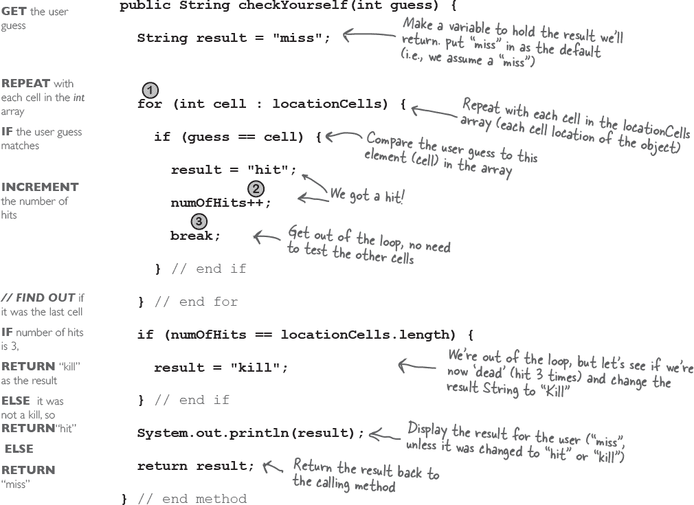
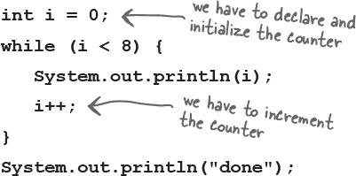
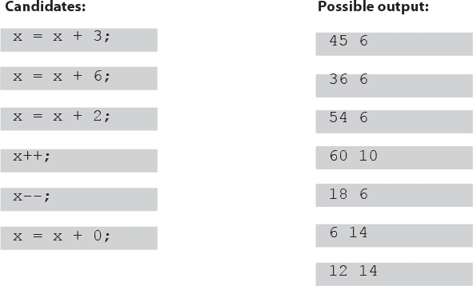
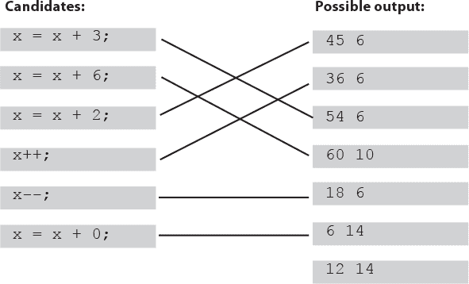

# 第五章：超强方法：编写一个程序


**让我们为我们的方法加点力气。** 我们尝试了变量，玩了一些对象，并写了一些代码。但我们还不够强大。我们需要更多的工具。像**运算符**。我们需要更多的运算符，这样我们可以做一些比如说*吠*更有趣的事情。还有**循环**。我们需要循环，但这种弱弱的*while*循环是怎么回事？如果我们真的认真的话，我们需要***for***循环。也许学习**生成随机数**也会有用。还有为什么我们不通过*构建*一个真实的东西来学习所有这些，看看从头编写（和测试）程序是什么感觉。**也许是一个游戏**，像战舰。这是一个需要大力完成的任务，所以需要*两*章来完成。我们将在本章中构建一个简单版本，然后在第六章中构建一个更强大的豪华版本。

# 让我们来建立一个类似战舰游戏的游戏：“击沉一个创业公司”

这是你对抗计算机的游戏，但与真正的战舰游戏不同，你不需要放置自己的船只。相反，你的任务是在尽可能少的猜测中击沉计算机的船只。

哦，我们不是在击沉船只。我们要消灭不明智的硅谷创业公司（从而建立业务相关性，以便你可以报销这本书的费用）。

**目标：** 在尽可能少的猜测中击沉所有计算机的创业公司。根据你的表现，你将得到一个评级或等级。

**设置：** 游戏程序启动时，计算机在**虚拟的 7 x 7 网格**上放置了三个创业公司。完成后，游戏会询问你的第一个猜测。

**游戏玩法：** 我们还没有学会构建 GUI，所以这个版本在命令行上运行。计算机会提示你输入一个猜测（一个单元格），你将在命令行上输入“A3”，“C5”等）。作为对你猜测的回应，你会在命令行上看到一个结果，要么是“命中”，“错过”，或“你击沉了 poniez”（或者是今天幸运的创业公司名称）。当你将所有三个创业公司送上天堂的 404 时，游戏将打印出你的评级。


**你将要建立击沉一个创业公司的游戏，拥有一个 7 x 7 的网格和三个创业公司。每个创业公司占据三个单元格。**

**游戏互动的一部分**


# 首先，一个高级设计。

我们知道我们将需要类和方法，但它们应该是什么？为了回答这个问题，我们需要更多关于游戏应该做什么的信息。

首先，我们需要弄清楚游戏的一般流程。这里是基本想法：


###### 图 5-1\. 哇。一个真正的流程图。

+    用户开始游戏。

    +    游戏创建三个创业公司。

    +    游戏将三个创业公司放置在虚拟网格上。

+    游戏开始。

    重复以下步骤，直到没有更多的创业公司：

    

+    游戏结束。

    基于猜测次数给用户评级。

现在我们对程序需要做的事情有了一个概念。下一步是弄清楚我们需要哪种**对象**来完成工作。记住，首先要像 Brad 一样思考，而不是像 Laura（我们在第二章中遇到的 *A Trip to Objectville*）；首先专注于程序中的***事物***而不是***过程***。

# “简单启动游戏”是一个更温和的介绍

看起来我们至少需要两个类，一个是游戏类，一个是启动类。但在构建完整的***击沉一家初创公司***游戏之前，我们将从简化版本***简单启动游戏***开始。我们将在*本*章节构建简单版本，然后在*下*一章节构建豪华版本。

这个游戏中一切都更简单。不使用 2D 网格，我们只隐藏启动在单个*行*中。而不是*三*个启动，我们使用*一个*。

尽管目标相同，但游戏仍需要创建一个启动实例，将其放置在行中的某个位置，获取用户输入，当所有启动单元格都被击中时，游戏结束。这个简化版本的游戏为我们构建完整游戏奠定了良好的基础。如果我们能够使这个小版本工作，稍后可以将其扩展到更复杂的版本。

在这个简单版本中，游戏类没有实例变量，所有游戏代码都在 main()方法中。换句话说，当程序启动并且 main()开始运行时，它将创建一个且唯一的启动实例，为其选择一个位置（在单个虚拟七单元格行上的三个连续单元格），询问用户进行猜测，检查猜测并重复，直到所有三个单元格都被击中。

记住虚拟行是...*虚拟的*。换句话说，它在程序中不存在。只要游戏和用户都知道启动隐藏在七个可能单元格（从零开始）中的三个连续单元格中，行本身就不需要在代码中表示。您可能会想要构建一个包含七个整数的数组，然后将启动分配给数组中的三个元素，但您不需要这样做。我们只需要一个数组，其中包含启动占据的三个单元格。


+    **游戏开始** 并创建一个启动，将其放置在七个单元格中的一个单行上的三个单元格上。

    而不是“A2”，“C4”等等，位置只是整数（例如：1,2,3 是图片中的单元格位置）：

    

+    **游戏开始。** 提示用户进行猜测；然后检查是否击中任何启动的三个单元格。如果击中，增加 numOfHits 变量。

+    **游戏完成**当所有三个单元都被击中时（numOfHits 变量的值为 3），并告诉用户击沉 Startup 花了多少次猜测。

**完整的游戏交互**


# 开发一个类

作为程序员，您可能有一套编写代码的方法论/过程/方法。我们也是如此。我们的顺序旨在帮助您看到（和学习）我们在编写类的过程中的思维方式。在真实世界中，这不一定是我们（或*您*）编写代码的方式。当然，在真实世界中，您将遵循个人喜好、项目或雇主指定的方法。但是，我们可以做几乎任何我们想做的事情。当我们创建一个“学习体验”的 Java 类时，我们通常是这样做的：

+    弄清楚这个类应该*做*什么。

+    列出实例变量和方法。

+    为方法编写**准备代码**。（您很快就会看到这一点。）

+    为方法编写**测试代码**。

+    **实现**这个类。

+    **测试**方法。

+    根据需要**调试**和**重新实现**。

+    表达感激之情，因为我们不必在真实的用户上测试我们所谓的*学习体验*应用程序。


## 我们为每个类写三件事：


此条显示在下一组页面上，告诉您正在处理的部分。例如，如果您在页面顶部看到这张图片，那么意味着您正在处理 SimpleStartup 类的准备代码。


**准备代码**

一种伪代码形式，帮助您专注于逻辑，而不用担心语法。

**测试代码**

一个类或方法将测试真实代码并验证它是否做正确的事情。

**真实代码**

类的实际实现。这是我们编写真正的 Java 代码的地方。


阅读这个例子后，您将会理解到准备代码（我们版本的伪代码）是如何工作的概念。它在真实的 Java 代码和类的简单英文描述之间处于中间状态。大多数准备代码包括三个部分：实例变量声明，方法声明，方法逻辑。准备代码最重要的部分是方法逻辑，因为它定义了需要发生的事情，这些事情在我们实际编写方法代码时会被翻译成如何发生。


# 编写方法实现

**现在让我们写真正的方法代码并让这个程序正常工作。**


在我们开始编写方法之前，让我们回顾一下并编写一些代码来*测试*这些方法。是的，在有任何需要测试的东西之前，我们先编写测试代码！

先写测试代码的概念是测试驱动开发（TDD）的实践之一，它可以让您更轻松（更快地）编写代码。我们不一定建议您使用 TDD，但我们确实喜欢先写测试的部分。而 TDD 听起来就很酷。

# 为 SimpleStartup 类编写测试代码

我们需要编写测试代码，可以创建 SimpleStartup 对象并运行其方法。对于 SimpleStartup 类，我们真正关心的只有 *checkYourself()* 方法，尽管我们 *将* 不得不实现 *setLocationCells()* 方法以确保 *checkYourself()* 方法正确运行。

仔细看看下面为 *checkYourself()* 方法准备的准备代码（*setLocationCells()* 方法是一个简单的 setter 方法，所以我们不担心，但在一个“真实”的应用程序中，我们可能需要一个更健壮的“setter”方法来测试）。

然后问自己，“如果 checkYourself() 方法被实现了，我能写什么测试代码来证明该方法工作正常？”

## 根据这些准备代码：

```
METHOD String checkYourself(int userGuess)
 GET the user guess as an int parameter
 REPEAT with each of the location cells in the int array
   // *COMPARE* the user guess to the location cell
   IF the user guess matches
      INCREMENT the number of hits
      *// FIND OUT* if it was the last location cell:
      IF number of hits is 3, RETURN “Kill” as the result
      ELSE it was not a kill, so RETURN “Hit”
      END IF
   ELSE the user guess did not match, so RETURN “Miss”
   END IF
  END REPEAT
END METHOD
```

## 这里是我们应该测试的内容：

1.  实例化一个 SimpleStartup 对象。

1.  分配一个位置（一个包含 3 个整数的数组，如 {2, 3, 4}）。

1.  创建一个整数表示用户的猜测（2、0 等）。

1.  调用 checkYourself() 方法并传递一个虚假的用户猜测。

1.  打印结果以查看是否正确（“通过”或“失败”）。

# 测试 SimpleStartup 类的代码


 **请解决。**

# checkYourself() 方法

从准备代码到 Java 代码没有完美的映射；我们会做一些调整。准备代码让我们更清楚代码需要做什么，现在我们必须弄清楚如何编写可以执行 *how* 的 Java 代码。

在心里想想你可能想要（或需要）改进的代码部分。数字  是你以前没见过的东西（语法和语言特性）。它们在对面页面有解释。



# 只是新的东西

我们以前没见过的东西都在这一页上。别担心！本章后面还有更多细节。这些内容足以让你开始。


# SimpleStartup 和 SimpleStartupTestDrive 的最终代码

```
public class SimpleStartupTestDrive {
  public static void main(String[] args) {
    SimpleStartup dot = new SimpleStartup();
    int[] locations = {2, 3, 4};
    dot.setLocationCells(locations);
    int userGuess = 2;
    String result = dot.checkYourself(userGuess);
    String testResult = "failed";
    if (result.equals("hit")) {
      testResult = "passed";
    }
    System.out.println(testResult);
  }
}
```

* * *

```
class SimpleStartup {
  private int[] locationCells;
  private int numOfHits = 0;

  public void setLocationCells(int[] locs) {
    locationCells = locs;
  }

  public String checkYourself(int guess) {
    String result = "miss";
    for (int cell : locationCells) {
      if (guess == cell) {
        result = "hit";
        numOfHits++;
        break;
      } // end if
    } // end for
    if (numOfHits ==
        locationCells.length) {
      result = "kill";
    } // end if
    System.out.println(result);
    return result;
  } // end method
} // close class
```

这里潜藏着一个小 bug。它可以编译和运行，但...现在不用担心，但稍后我们 *将* 不得不面对它。

# SimpleStartupGame 类的准备代码，所有操作都在 main() 中完成。

有一些事情你必须相信。例如，我们有一行准备代码说“从命令行获取用户输入。”让我告诉你，这比我们现在想要从头开始实现的要多一点。但幸运的是，我们正在使用 OO。这意味着你可以请求*其他*类/对象为你做一些事情，而不用担心***它是如何***做到的。当你编写准备代码时，你应该假设*某种方式*你将能够做任何你需要做的事情，这样你就可以将所有的脑力投入到解决逻辑问题上。

```
*public static void main (String [] args)*
   DECLARE an int variable to hold the number of user guesses, named numOfGuesses, and set it to 0
   MAKE a new SimpleStartup instance
   COMPUTE a random number between 0 and 4 that will be the starting location cell position
   MAKE an int array with 3 ints using the randomly generated number, that number incremented by 1, and that number incremented by 2 (example: 3,4,5)
   INVOKE the setLocationCells() method on the SimpleStartup instance
   DECLARE a boolean variable representing the state of the game, named *isAlive.* SET it to true

   WHILE the Startup is still alive (isAlive == true):
     GET user input from the command line
     *// CHECK* the user guess
     INVOKE the *checkYourself()* method on the SimpleStartup instance
     INCREMENT *numOfGuesses* variable
     ***// CHECK*** for Startup death
    IF result is “kill”
          SET isAlive to false (which means we won’t enter the loop again)
          PRINT the number of user guesses
    END IF
   END WHILE
END METHOD
```


# 游戏的 main()方法

就像你对 SimpleStartup 类所做的那样，考虑一下你可能想要（或需要）改进的代码部分。编号的东西是我们想要指出的内容。它们在对面的页面上有解释。哦，如果你想知道为什么我们跳过了这个类的测试代码阶段，我们不需要为游戏编写测试类。它只有一个方法，那么在你的测试代码中你会做什么？创建一个单独的类来调用这个类的 main()吗？我们没费心，我们只需运行这个来测试它。


# random()和 getUserInput()

这页上有两件需要更详细解释的事情。这只是一个快速的查看，以便让你继续前进；有关 GameHelper 类的更多细节在本章末尾。 


# 最后一个类：GameHelper

**我们制作了*Startup*类。**

**我们制作了*game*类。**

**剩下的只有*helper*类**—具有 getUserInput()方法的类。获取命令行输入的代码超出了我们现在想要解释的范围。这会引出最好留到以后讨论的话题。（以后，即第十六章，*保存对象*。）

只需*复制*下面的代码并将其编译成一个名为 GameHelper 的类。将所有三个类文件（SimpleStartup、SimpleStartupGame、GameHelper）放入同一个目录，并将其设置为工作目录。


```
import java.util.Scanner;

public class GameHelper {
  public int getUserInput(String prompt) {
    System.out.print(prompt + ": ");
    Scanner scanner = new Scanner(System.in);
    return scanner.nextInt();
  }
}
```


*我们知道你有多喜欢打字，但在那些你更愿意做其他事情的罕见时刻，我们已经将 Ready-Bake Code 提供在*[`oreil.ly/hfJava_3e_examples`](https://oreil.ly/hfJava_3e_examples)*上。*

# 让我们玩吧

当我们运行它并输入数字 1,2,3,4,5,6 时会发生什么。看起来不错。

**一个完整的游戏交互**

（你的情况可能有所不同）


# 这是什么？一个 bug？

## 哇！

当我们输入 1,1,1 时会发生什么。

**另一个游戏交互**（天啊）


# 更多关于 for 循环的内容

我们已经涵盖了*本*章节的所有游戏代码（但我们将在下一章节中继续完成游戏的高级版本）。我们不想用一些细节和背景信息打断你的工作，所以我们把它放在这里。我们将从 for 循环的细节开始，如果你在另一种编程语言中看到了这种语法，只需浏览一下最后几页...

## 常规（非增强型）for 循环


**用简单的英语说：** “重复 100 次。”

**编译器如何看待它：**

+   创建一个变量 *i* 并将其设置为 0。

+   当 *i* 小于 100 时重复。

+   在每次循环迭代结束时，将 *i* 加 1。

**第一部分：*初始化***

使用此部分声明和初始化一个变量，在循环体内使用。你通常会将此变量用作计数器。实际上，你可以在这里初始化多个变量，但更常见的是使用单个变量。

**第二部分：*布尔测试***

这是条件测试的地方。无论里面放了什么，它*必须*解析为布尔值（你知道的，***true*** 或 ***false***）。你可以有一个测试，比如 (x >= 4)，或者甚至可以调用一个返回布尔值的方法。

**第三部分：*迭代表达式***

在此部分，放入你希望每次循环都发生的一个或多个事情。请记住，这些内容发生在每次循环的*末尾*。

**重复 100 次：**

# 循环的步骤

```
for (int i = 0; i < 8; i++) {
   System.out.println(i);
}
System.out.println("done");
```


## for 和 while 的区别

*while* 循环只有布尔测试；它没有内置的初始化或迭代表达式。当你不知道要循环多少次，只想在某些条件为真时继续时，*while* 循环很好用。但如果你*知道*要循环多少次（例如，数组的长度，7 次等），用 *for* 循环更清晰。以下是上面的循环使用 *while* 重写的示例：



**输出：**


# 增强型 for 循环

Java 语言在 Java 5 中添加了另一种称为*增强型 for* 的 *for* 循环。这使得在数组或其他类型的集合中迭代所有元素更加简单（下一章节将介绍*其他*类型的集合）。增强型 for 循环仅仅提供了一个更简单的方式来遍历集合中的所有元素。我们也会在下一章中看到增强型 for 循环，当我们讨论不是数组的集合时。


**用简单的英语说：** “对于 nameArray 中的每个元素，将该元素赋给 'name' 变量，并运行循环体。”

**编译器如何看待它：**

+   创建一个名为 *name* 的 String 变量并将其设置为 null。

+   将 *nameArray* 中的第一个值分配给 name。

+   运行循环体（由花括号限定的代码块）。

+   将 *nameArray* 中的下一个值分配给 name。

+   当数组中仍然有元素时重复。

###### 注意

注意：根据他们过去使用的编程语言不同，有些人称增强型 for 循环为“for each”或“for in”循环，因为这就是它的读法：“for EACH thing IN the collection…”

**第一部分：*迭代变量声明***

使用此部分来声明和初始化一个变量，在循环体内使用。每次循环迭代时，这个变量将保存来自集合的不同元素。这个变量的类型必须与数组中的元素兼容！例如，你不能声明一个*int*类型的迭代变量并用于*String[]数组*。

**第二部分：*实际集合***

这必须是一个数组或其他集合的引用。同样，暂时不用担心*其他*非数组类型的集合——你将在下一章中看到它们。

# 原始数据类型的类型转换

在我们结束本章之前，我们想解决一个悬而未决的问题。当我们使用 Math.random()时，我们必须将结果转换为 int。将一个数值类型转换为另一个可以改变值本身。理解这些规则非常重要，这样你就不会对此感到意外。


在第三章，*了解你的变量*中，我们讨论了各种原始数据类型的大小以及你不能直接将大数据放入小数据中的问题：

```
    long y = 42;
    int x = y;       // won’t compile
```

long 比 int 大，编译器不能确定 long 的值可能是多少。它可能已经与其他 long 一起参加聚会，并且具有非常大的值。为了强制编译器将较大的原始变量值装入较小的原始变量中，你可以使用类型转换操作符。它看起来像这样：

```
    long y = 42;     // so far so good
    int x = (int) y; // x = 42 cool!
```

加入类型转换会告诉编译器将 y 的值截断为 int 大小，并将 x 设置为剩余的值。如果 y 的值大于 x 的最大值，那么剩下的将是一个奇怪（但可计算的*）数字：

```
    long y = 40002;       // 40002 exceeds the 16-bit limit of a short
    short x = (short) y;  // x now equals -25534!
```

不过，重点是编译器允许你这样做。假设你有一个浮点数，你只想获取它的整数（int）部分：

```
    float f = 3.14f;
    int x = (int) f;   //  x will equal 3
```

别想把任何东西转换成布尔型或反之——赶紧离开。

**它涉及符号位、二进制、“二进制补码”和其他极客技术。*

# 练习


## BE the JVM


**本页面上的 Java 文件表示一个完整的源文件。你的任务是扮演 JVM 并确定程序运行时的输出结果。**

```
class Output {
  public static void main(String[] args) {
    Output output = new Output();
    output.go();
  }

  void go() {
    int value = 7;
    for (int i = 1; i < 8; i++) {
      value++;
      if (i > 4) {
        System.out.print(++value + " ");
      }
      if (value > 14) {
        System.out.println(" i = " + i);
        break;
      }
    }
  }
}
```


**-或-**


**-或-**


 **答案在“Be the JVM”中。**

## 代码磁铁


一个工作中的 Java 程序被混在冰箱上。你能重组这些代码片段，使其成为一个能够产生下面列出的输出的工作中的 Java 程序吗？一些大括号掉到了地板上，而它们太小了，没法捡起来，所以随意添加你需要的大括号！


 **答案在“代码磁铁”中。**

## JavaCross


如何通过填字游戏学习 Java？嗯，所有的单词**都**与 Java 相关。此外，提示提供了隐喻、双关语等，这些心理转折直接刻印在你的大脑中，通向 Java 知识的替代路径！

**横向**

1\. 构建的花哨计算机术语

4\. 多部分循环

6\. 先测试

7\. 32 位

10\. 方法的答案

11\. 准备代码般

13\. Change

15\. 大工具包

17\. 一个数组单元

18\. 实例或本地

20\. 自动工具包

22\. 看起来像原始类型，但是..

25\. 无法转换

26\. 数学方法

28\. 迭代我

29\. 早退

**向下**

2\. 增量类型

3\. 类的主力工作

5\. Pre 是一种 _____

6\. For 循环的迭代 ______

7\. 确定第一个值

8\. While 或 For

9\. 更新实例变量

12\. 走向发射

14\. 一个周期

16\. 健谈的包

19\. 方法信使（简称）

21\. 好像

23\. 在之后添加

24\. Pi 之家

26\. 编译并 ____

27\. ++ 数量

 **答案在“JavaCross”中。**

## 混合信息


下面列出了一个简短的 Java 程序。程序中有一个代码块缺失。你的挑战是**将候选代码块**（左侧）**与插入后看到的输出匹配**。不会使用所有输出行，某些输出行可能会重复使用。用线条连接候选代码块和它们匹配的命令行输出。

 **答案在“混合信息”中。**



将每个候选项与可能的输出匹配

# 练习解决方案


## 成为 JVM

(来自“成为 JVM”)

```
class Output {

  public static void main(String[] args) {
    Output output = new Output();
    output.go();
  }

void go() {
  int value = 7;
  for (int i = 1; i < 8; i++) {
    value++;
    if (i > 4) {
      System.out.print(++value + " ");
    }
    if (value > 14) {
      System.out.println(" i = " + i);
      break;
    }
   }
  }
}
```

###### 注意

**你记得考虑 break 语句了吗？它如何影响输出？**


## 代码磁铁

(来自“代码磁铁”)

```
class MultiFor {

  public static void main(String[] args) {
    for (int i = 0; i < 4; i++) {

     for (int j = 4; j > 2; j--) {
       System.out.println(i + " " + j);
     }

     if (i == 1) {
       i++;
     }
   }
  }
}
```

###### 注意

**如果这段代码块在‘j’循环之前会发生什么？**


## 谜题解决方案


## JavaCross

(来自“JavaCross”)


## 混合信息

(来自“混合信息”)


