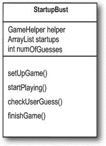
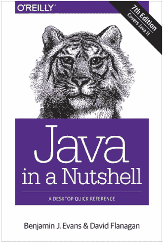

# 第六章：使用 Java 库：了解 Java API


**Java 自带数百个预先构建的类。** 如果你知道如何在 Java 库中找到所需的内容，就无需重复造轮子，这就是**Java API**的用途。 *你有更重要的事情要做*。 如果你要编写代码，最好只编写对你的应用程序真正定制的部分。 你知道每天下午 5 点准时下班的程序员吗？那些早上 10 点才露面的？他们在使用 Java API。 大约再过八页，你也将会如此。 Java 核心库是一个巨大的类堆积，等待你像积木一样使用，从中组合出自己的程序。 本书中使用的现成 Java 代码不需要从头开始创建，但你仍然需要输入它。 Java API 充满了你甚至不需要*输入*的代码。 你只需学会如何使用它。

# 在我们的上一章中，我们给你留下了一个悬念：一个错误

## 应该是什么样子的

当我们运行它并输入数字 1, 2, 3, 4, 5, 6 时会发生什么。看起来不错。

**完整的游戏交互**（结果可能有所不同）


## 这个 bug 的外观

当我们输入 2, 2, 2 时会发生什么

**另一种游戏交互方式**（哎呀）


**在当前版本中，一旦你击中，你可以简单地再重复两次来击毁目标！**

# 那么到底发生了什么？


# 我们如何修复它？

我们需要一种方法来知道单元格是否已经被命中。让我们先看看我们目前所知道的...

我们有一个虚拟的七个单元格的行，并且一个启动程序将占据该行的三个连续单元格中的某个位置。 这个虚拟行显示一个在单元格位置 4、5 和 6 放置的启动程序。


启动程序有一个实例变量 —— 一个 int 数组 —— 用于保存该启动程序对象的单元格位置。


# 选项一太笨重了

选项一似乎比你预期的要多些工作。这意味着每当用户进行一次命中时，你都必须更改第二个数组（命中单元格数组）的状态，噢——但首先你必须检查命中单元格数组，看看那个单元格是否已经被命中过。它可以工作，但肯定还有更好的方法...

# 选项二稍微好一些，但仍然相当笨重

选项二比选项一少一些笨重，但效率不是很高。 即使一个或多个位置已经无效（因为它们已经被“击中”并有一个 -1 的值），你仍然必须循环遍历数组中的所有三个插槽（索引位置）。必须有更好的方法...

| 用于 checkYourself() 方法的原始准备代码： | 如果我们能把它改成： |
| --- | --- |
|  |


# 醒来，闻闻图书馆的味道

**仿佛魔术一般，真的有这样的事情。**

**但它不是一个*数组*，而是*一个 ArrayList。***

**核心 Java 库中的一个类（API）。**

Java 平台标准版（Java SE）附带数百个预构建的类。就像我们的 Ready-Bake Code 一样。不同之处在于这些内置类已经编译过了。

***这意味着不需要打字。***

只需使用它们。


# 一些你可以用 ArrayList 做的事情


# Java 暴露


**本周的采访对象：ArrayList，关于数组**

**HeadFirst：** 所以，ArrayList 就像数组，对吧？

**ArrayList：** 在他们的梦中！***我***是一个*对象*，非常感谢。

**HeadFirst：** 如果我没有弄错，数组也是对象。它们和其他对象一样都存放在堆上。

**ArrayList：** 当然，数组放在堆上，***嗯***，但是数组仍然是一个想成为 ArrayList 的东西。一个冒充者。对象有状态*和*行为，对吧？这一点我们很清楚。但是你真的尝试过在数组上调用方法吗？

**HeadFirst：** 既然你提到了，我不能说我试过。但是我要调用什么方法呢？我只关心在数组中放入东西和取出东西时调用的方法。而且我可以在想要放入和取出数组时使用数组语法。

**ArrayList：** 是这样吗？你的意思是你真的从数组中*移除*了某些东西吗？（天哪，他们是在哪里培训你们的？）

**HeadFirst：** 当然我从数组中取出东西。我说 Dog d = dogArray[1]，然后我从数组中的索引 1 处得到 Dog 对象。

**ArrayList：** 好吧，我会尽量说得慢些，这样你就能跟上了。你*并没有*，我重申*没有*，从数组中移除那只 Dog。你所做的只是复制了*对 Dog 的引用*，并将其赋给另一个 Dog 变量。

**HeadFirst：** 哦，我明白你的意思了。不，我确实没有从数组中移除 Dog 对象。它仍然在那里。但我可以将其引用设置为 null，我猜。

**ArrayList：** 但我是一个一流的对象，所以我有方法，我实际上可以做事情，比如从自己身上移除 Dog 的引用，而不只是将其设置为 null。而且我可以*动态*地改变我的大小（查一下）。试试看如何让一个*数组*做到这一点！

**HeadFirst：** 哎呀，真不想提起这个，但谣言说你只不过是一个被夸大但效率低下的数组。实际上，你只是数组的包装器，为像我自己这样的人添加了额外的方法，比如调整大小，我本来要自己写。而且说到这里，*你甚至不能容纳原始类型*！这不是一个很大的限制吗？

**ArrayList:** 我简直*不敢相信*你相信这种城市传说。不，我*不仅仅*是一个效率低下的数组。我承认可能有*极其*罕见的情况，数组在某些特定事情上可能会稍微，我重申，*稍微*快一点点。但是放弃所有这些*强大*功能来换取*微小*的性能提升值得吗？再看看这些*灵活性*。至于基本类型，*当然*可以将基本类型放入 ArrayList 中，只要它被包装在基本类型包装类中（在 第十章 中会有更多介绍）。如果你使用的是 Java 5 或以上版本，这个包装（以及再次取出基本类型时的解包）会自动发生。好吧，我*承认*，是的，如果你使用的是基本类型的 ArrayList，可能使用数组会更快，因为涉及到所有的包装和解包，但是还是...这些*天*谁真的还使用基本类型？

哦，看看时间！*我要迟到上普拉提课了。* 我们下次再做。

# 解决方案

## 磨练你的铅笔

(来自 “磨练你的铅笔”)


使用 ArrayList 时，你在操作一个类型为 ArrayList 的对象，所以你只是在一个普通的对象上调用普通的老方法，使用普通的点运算符。

对于 *数组*，你使用 *特殊的数组语法*（例如 myList[0] = foo），这种语法除了数组之外你不会在其他地方使用。尽管数组是一个对象，它生活在自己的特殊世界中，你不能对其调用任何方法，尽管可以访问它唯一的实例变量 *length*。

# 将 ArrayList 与普通数组进行比较

+    **一个普通的数组在创建时必须知道其大小。**

    但是对于 ArrayList，你只需创建一个类型为 ArrayList 的对象。每次都是如此。它永远不需要知道它应该有多大，因为它会随着对象的添加或删除而增长或缩小。

    

+    **要将对象放入普通数组中，必须将其分配给特定位置。**

    （索引从 0 到数组长度减 1。）

    

    如果索引超出数组的边界（例如数组声明大小为 2，现在尝试对索引 3 赋值），它会在运行时崩溃。

    使用 ArrayList，你可以使用 *add(anInt, anObject)* 方法指定索引，或者只需不断使用 *add(anObject)*，ArrayList 会自动增长以腾出空间来存放新元素。

    

+    **数组使用 Java 中其他地方不使用的数组语法。**

    但是 ArrayList 是普通的 Java 对象，因此它们没有特殊的语法。

    

+    **ArrayList 是参数化的。**

    我们刚刚说过，与数组不同，ArrayList 没有特殊的语法。但是它们确实使用了一些特殊的东西——***参数化类型***。

    

使用 <TypeGoesHere> 语法，我们可以声明并创建一个 ArrayList，它知道（并限制）可以保存的对象类型。我们将在第十一章的*数据结构*中详细讨论 ArrayLists 中参数化类型的细节，所以现在不要太过深思熟虑看到尖括号<>语法时，只需知道这是一种强制编译器只允许 ArrayList 中特定类型对象的方法即可。

**Java 5 中添加了参数化类型，这是很久以前的事情，你几乎肯定在使用支持它们的版本！**


# 让我们修复启动代码

记住，这就是有错误版本的样子：


# 新的改进的 Startup 类


# 让我们构建真正的游戏：“击沉一个启动”

我们一直在工作的是“简化”版本，但现在让我们构建真正的版本。我们将不再使用单行，而是使用一个网格。而不是一个启动，我们将使用三个。

**目标：** 以尽可能少的猜测数击沉计算机的所有启动。根据您的表现，您将获得一个评级水平。

**设置：** 当游戏程序启动时，计算机会将三个启动随机放置在 **虚拟的 7 x 7 网格** 上。完成后，游戏会询问您的第一个猜测。

**如何游戏：** 我们还没有学习如何构建 GUI，因此这个版本在命令行上工作。计算机将提示您输入一个猜测（一个单元格），您将在命令行中输入它（如“A3”，“C5”等）。作为对您的猜测的响应，您将在命令行看到一个结果，要么是“命中”，要么是“未命中”，要么是“您击沉了 poniez”（或者今天的幸运启动）。当您把所有三个启动送上天堂大 404 时，游戏将打印出您的评级结束。


**您将要建立的是“击沉一个启动”的游戏，使用 7 x 7 的网格和三个启动。每个启动占据三个单元格。**

**游戏互动的一部分**


# 需要做出什么改变？

我们需要更改三个类：启动类（现在称为 Startup 而不是 SimpleStartup）、游戏类（StartupBust）和游戏助手类（我们现在不担心）。

+    **Startup 类**

    +   **添加一个 *名称* 变量** 来保存启动的名称（“poniez”，“cabista”等），这样每个启动在被击败时都可以打印出其名称（请参见对面屏幕上的输出）。

+    **StartupBust 类（游戏）**

    +   **创建 *三个* 启动而不是一个。**

    +   **给这三个启动每个一个 *名称*。** 在每个启动实例上调用一个 setter 方法，以便启动可以将名称分配给其名称实例变量。

    +   **将启动放在网格上，而不仅仅是一行，对所有三个启动都是如此。**

        如果我们要随机放置 Startups，那么现在这一步比以前复杂得多。因为我们不想搞砸数学，所以我们将为给 Startups 分配位置的算法放入 GameHelper（即食代码）类中。

    +   **检查每个用户猜测*与所有三个 Startups*，而不仅仅是一个。**

    +   **继续玩游戏**（即接受用户的猜测并与剩余的 Startups 进行检查）***直到没有更多的活跃 Startups 为止。***

    +   **退出主程序。** 我们保留了主程序中的简单代码，只是为了…保持简单。但这不是我们想要的*真正*游戏。

**3 个类：**


**5 个对象：**


# StartupBust 游戏中的参与者及其活动时机

+   

    

+   

    

+   

    

+   

    

+   

    

+   

    

# 准备好实际的 StartupBust 类的代码



StartupBust 类有三个主要任务：设置游戏，玩游戏直到所有 Startups 死亡，并结束游戏。尽管我们可以直接将这三个任务映射为三个方法，但我们将中间任务（玩游戏）分成*两*个方法，以保持粒度较小。较小的方法（意味着更小的功能块）有助于我们更轻松地测试、调试和修改代码。

**变量声明**

**声明**并实例化*GameHelper*实例变量，命名为*helper*。

**声明**并实例化一个*ArrayList*来保存 Startup 的列表（最初为三个）。命名为*startups*。

**声明**一个 int 变量来保存用户猜测的次数（这样我们可以在游戏结束时给用户一个得分）。将其命名为*numOfGuesses*并将其设置为 0。

* * *

**方法声明**

**声明**一个*setUpGame()*方法来创建并初始化具有名称和位置的 Startup 对象。向用户显示简要说明。

**声明**一个*startPlaying()*方法，询问玩家猜测并调用 checkUserGuess()方法，直到所有 Startup 对象从游戏中移除。

**声明**一个*checkUserGuess()*方法，该方法循环遍历所有剩余的 Startup 对象，并调用每个 Startup 对象的 checkYourself()方法。

**声明**一个*finishGame()*方法，根据用户击沉所有 Startup 对象所需的猜测次数打印用户表现的消息。

* * *

**方法实现**

**方法：*void setUpGame()***

// 创建三个 Startup 对象并为它们命名

**创建**三个 Startup 对象。

**设置**每个 Startup 的名称。

**添加**Startups 到*startups*（ArrayList）中。

**对于*startups*列表中的每个 Startup 对象重复以下操作：**

**调用**helper 对象上的*placeStartup()*方法，以获取随机选择的

在 7 X 7 的网格上，为该 Startup 设置位置（垂直或水平三个单元格）。

根据*placeStartup()*调用的结果为每个 Startup 设置位置。

结束重复

结束方法

**方法：*void startPlaying()***

在任何 Startups 存在时**重复**。

通过调用助手*getUserInput()*方法**获取**用户输入。

通过*checkUserGuess()*方法**评估**用户的猜测。

结束重复

结束方法

**方法：*void checkUserGuess(String userGuess)***

// 查找是否有任何 Startup 上的击中（和击毁）

在*numOfGuesses*变量中**增加**用户猜测的次数。

将本地*result*变量（一个*String*）设置为“miss”，假设用户的猜测会失败。

在*startups*列表中**重复**每个 Startup 对象。

通过调用 Startup 对象的*checkYourself()*方法**评估**用户的猜测。

根据情况将结果变量设置为“hit”或“kill”。

**如果**结果是“kill”，则从*startups*列表中**移除**该 Startup。

结束重复

**显示**结果值给用户。

结束方法

**方法：*void finishGame()***

**显示**一个通用的“游戏结束”消息，然后：

**如果**用户猜测的次数很少，

**显示**祝贺消息。

**否则**

**显示**一个侮辱性的消息。

结束如果

结束方法

 **由您解决。**


# Startup 类的最终版本


# 超级强大的布尔表达式

到目前为止，当我们在循环或*if*测试中使用布尔表达式时，它们通常很简单。在接下来要看到的一些现成的代码中，我们将使用更强大的布尔表达式，尽管我们知道您不会偷看，但现在正是讨论如何激活您的表达式的好时机。

**“与”和“或”运算符** `( &&, || )`

假设你正在编写一个 chooseCamera()方法，其中有很多关于选择相机的规则。也许你可以选择价格在$50 到$1000 之间的相机，但在某些情况下，你想更精确地限制价格范围。你想表达的可能是：

“如果价格范围在$300 ***到*** $400 之间，则选择 X。”

```
if (price >= 300 && price < 400) {
  camera = "X";
}
```

假设在十个可用的相机品牌中，你有一些逻辑只适用于列表中的*少数*品牌：

```
if (brand.equals("A") || brand.equals("B")) {
  // do stuff for only brand A or brand B
}
```

布尔表达式可能会变得非常庞大和复杂：

```
if ((zoomType.equals("optical") &&
     (zoomDegree >= 3 && zoomDegree <= 8)) ||
   (zoomType.equals("digital") &&
    (zoomDegree >= 5 && zoomDegree <= 12))) {
   // do appropriate zoom stuff
}
```

如果你想*真正*技术性地去探讨，你可能会对这些运算符的优先级感到疑惑。与其成为优先级神秘世界的专家，我们建议您***使用括号***来使您的代码更清晰。

**不等于（!=和!）**

假设你有这样一个逻辑：“在十种可用的相机型号中，某个特定的事情对除了一种之外的所有相机型号都*成立*。”

```
if (model != 2000) {
  //  do non-model 2000 stuff
}
```

或者用于比较对象如字符串...

```
if (!brand.equals("X")) {
 // do non-brand X stuff
}
```

**短路操作符（&&，||）**

到目前为止，我们所看过的操作符 && 和 || 被称为***短路***操作符。对于 &&，只有在 && 的两边都为真时，表达式才为真。所以，如果 JVM 发现 && 表达式的左侧为假，它就会立即停止！甚至不去看右侧。

类似地，对于 ||，如果*任一*侧为真，表达式就为真，所以如果 JVM 发现左侧为真，它就宣布整个语句为真，并且不会去检查右侧。

为什么这很重要？假设您有一个引用变量，但不确定它是否已分配给一个对象。如果您尝试使用这个空引用变量调用方法（即未分配对象），您将会得到一个 NullPointerException。所以，请尝试这样做：

```
if (refVar != null &&
    refVar.isValidType()) {
  // do ‘got a valid type’ stuff
}
```

**非短路操作符（ &，| ）**

在布尔表达式中使用时，& 和 | 操作符的作用类似于它们的 && 和 || 对应物，但它们强制 JVM 始终检查表达式*两*边。通常情况下，& 和 | 用于另一个上下文，用于位操作。

# 现成代码


这是游戏的辅助类。除了用户输入方法（提示用户并从命令行读取输入）之外，辅助类的大服务是为 StartupBust 创建单元位置。我们尽量保持它相对较小，这样您就不必输入太多内容。请记住，在您拥有*这个*类之前，您将无法编译 StartupBust 游戏类。


# 使用库（Java API）

在 ArrayList 的帮助下，您成功完成了 StartupBust 游戏的全部过程。现在，正如承诺的那样，是时候学习如何在 Java 库中操作了。

**在 Java API 中，类被分组到包中。**


**要使用 API 中的类，您必须知道类属于哪个包。**

Java 库中的每个类都属于一个包。包有一个名称，例如`**javax.swing**`（包含一些即将学习的 Swing GUI 类的包）。ArrayList 位于名为`**java.util**`的包中，这个包意外地包含了一堆*实用*类。您将在附录 B 中学到更多关于包的内容，包括如何将*您自己*的类放入*您自己*的包中。不过，目前我们只是希望*使用*Java 提供的一些类。

在您自己的代码中使用 API 中的类很简单。您只需将这个类视为您自己编写的一样……就像您已经编译了它，它就坐在那里，等待您使用。只有一个很大的不同：在您的代码中的某处，您必须指示您要使用的库类的*完整*名称，这意味着包名 + 类名。

即使你不知道，***你已经在使用来自包的类。*** System（System.out.println）、String 和 Math（Math.random()）都属于`**java.lang**`包。

# 你必须知道你想在代码中使用的类的完整名称。

ArrayList 不是 ArrayList 的*全名*，就像 Kathy 不是全名（除非像麦当娜或雪儿那样，但我们不去那里）。ArrayList 的全名实际上是：


**你必须告诉 Java 你想使用哪个 ArrayList。你有两个选择：**

+    **导入**

    在你的源代码文件顶部放置一个导入语句：

    ```
    import java.util.ArrayList;
    public class MyClass {... }
    ```

    **或者**

+    **类型**

    在你的代码中到处输入完整的名称。每次使用它。*无处不在*你使用它。

    当你声明和/或实例化它时：

    ```
    java.util.ArrayList<Dog> list = new java.util.ArrayList<Dog>();
    ```

    当你将其用作参数类型时：

    ```
    public void go(java.util.ArrayList<Dog> list) { }
    ```

    当你将其用作返回类型时：

    ```
    public java.util.ArrayList<Dog> foo() {...}
    ```

    **除非该类在 java.lang 包中。*

**再说一次，如果你还没有完全掌握：**


*“知道有 java.util 包中的 ArrayList 很好。但是自己，我怎么可能找出这一点呢？”*

- 朱莉娅，31 岁，手模特


# 如何发现 API

**你想知道的两件事情：**

+    **图书馆中有哪些功能？（哪些类？）**

+    **你如何使用这些功能？（一旦找到一个类，你如何知道它能做什么？）**

+    **浏览一本书**

    

+    **使用 HTML API 文档**

    

***[`docs.oracle.com/en/java/javase/17/docs/api/index.html`](https://docs.oracle.com/en/java/javase/17/docs/api/index.html)***

#  浏览一本书


翻阅参考书是发现 Java 库中内容的好方法。通过浏览页面，你可以轻松地找到看起来有用的包或类。


#  使用 HTML API 文档

Java 自带了一个名为 Java API 的绝妙在线文档集。你（或你的 IDE）也可以下载这些文档以备不时之需，以防你的互联网连接在最糟糕的时刻失效。

API 文档是获取有关包中内容更多细节的最佳参考，并且包括包中的类和接口提供的方法和功能。

文档的外观取决于你使用的 Java 版本。确保你查看的是你 Java 版本的文档！

**Java 8 及更早版本**

***[`docs.oracle.com/javase/8/docs/api/index.html`](https://docs.oracle.com/javase/8/docs/api/index.html)***


你可以浏览这些文档：

+   **自上而下：** 从左上角的列表中找到你感兴趣的包，并深入研究。

+   **以类为首：** 在左下方的列表中找到你想要了解更多的类，并点击它。

主面板会展示你正在查看的内容的详细信息。如果你选择了一个包，它会给出关于该包的摘要信息以及类和接口的列表。

如果你选择一个类，它会显示该类的描述以及所有方法的详细信息，包括它们的功能和使用方法。

**Java 9 及更高版本**

Java 9 引入了 Java 模块系统，我们在本书中不会涉及。但你需要了解的是，为了理解文档，JDK 现在被划分为 *模块*。这些模块将相关的包组合在一起。这样做可以更轻松地找到你感兴趣的类，因为它们按功能分组。到目前为止，我们在本书中讨论过的所有类都在 **java.base** 模块中；这包括核心 Java 包如 java.lang 和 java.util。


你可以浏览这些文档：

+   **自顶向下：** 找到一个看起来涵盖你想要的功能的模块，查看其包，并从包中的类中进一步深入。

+   **搜索：** 使用右上角的搜索功能直接跳转到你想了解的方法、类、包或模块。


# 使用类文档

无论你使用的是哪个版本的 Java 文档，它们都有类似的布局来显示关于特定类的信息。这里有详细的细节信息。

假设你正在浏览参考书，并找到了一个名为 ArrayList 的类，在 java.util 包中。书上介绍了一些信息，足够让你知道这正是你想要使用的，但你仍然需要了解更多关于方法的信息。在参考书中，你会找到 indexOf() 方法。但如果你只知道有一个叫做 indexOf() 的方法，它接受一个对象并返回该对象的索引（一个 int 值），那么你仍然需要知道一个关键信息：如果该对象不在 ArrayList 中会发生什么？仅仅看方法签名是无法告诉你这个问题的。但 API 文档会告诉你（大部分情况下）。API 文档告诉你，如果对象参数不在 ArrayList 中，indexOf() 方法会返回 -1。所以现在我们知道，它既可以用作检查对象是否在 ArrayList 中的方法，也可以同时获取其索引（如果对象存在的话）。但如果没有 API 文档，我们可能会认为 indexOf() 方法会在对象不在 ArrayList 中时出现错误。


**在 第十一章 和 第十二章 中，你会看到我们如何使用 API 文档来学习如何使用 Java 库。**

# 练习


## 代码磁铁


你能重新构建代码片段以创建一个能生成以下输出的工作 Java 程序吗？ **注意：** 要完成这个练习，你需要一条新的信息——如果你查看 ArrayList 的 API，你会发现第二个接受两个参数的 add 方法：

**add(int index, Object o)**

它让你指定向 ArrayList *中* 放置正在添加的对象的位置。


 **答案在“Code Magnets”.**

## JavaCross


这个填字游戏如何帮助你学习 Java？嗯，所有的词都**与** Java 相关（除了一个误导性的）。

**提示：** 当你怀疑时，记住 ArrayList。


**横向**

1\. 我不能表现得像

6\. 或者，在法庭上

7\. 它在哪，宝贝

9\. 叉子的起源

12\. 增长一个 ArrayList

13\. 完全巨大

14\. 值复制

16\. 不是一个对象

17\. 一个增强版的数组

19\. 范围

21\. 19 的对应物

22\. 西班牙极客小吃（注：这与 Java 没有关系。）

23\. 给懒惰的手指

24\. 包的漫游地

**下降**

2\. Java 行动的地方

3\. 可寻址的单位

4\. 第二小的

5\. 分数默认

8\. 图书馆的最伟大

10\. 必须是低密度的

11\. 他就在那里

15\. 如同

16\. 匮乏方法

18\. 购物和数组有什么共同点

20\. 图书馆的缩写

21\. 事物循环

**更多提示：**

横向

1\. 8 种类

7\. 想想 ArrayList

16\. 常见的原始类型

21\. 数组的范围

22\. 不是关于 Java 的——西班牙开胃小吃

下降

2\. 可重写的是什么？

3\. 想想 ArrayList

4\. & 10\. 原始类型

16\. 想想 ArrayList

18\. 他在制造一个 ______

 **答案在“JavaCross”.**

# 练习解决方案


## Code Magnets

(来自“Code Magnets”)

```
import java.util.ArrayList;

public class ArrayListMagnet {
  public static void main(String[] args) {
    ArrayList<String> a = new ArrayList<String>();
    a.add(0, "zero");
    a.add(1, "one");
    a.add(2, "two");
    a.add(3, "three");
    printList(a);

    if (a.contains("three")) {
      a.add("four");
    }
    a.remove(2);
    printList(a);

    if (a.indexOf("four") != 4) {
      a.add(4, "4.2");
    }
    printList(a);

    if (a.contains("two")) {
      a.add("2.2");
    }
    printList(a);
  }

  public static void printList(ArrayList<String> list) {
    for (String element : list) {
      System.out.print(element + "  ");
    }
    System.out.println();
  }
}
```

## JavaCross

(来自“JavaCross”)


