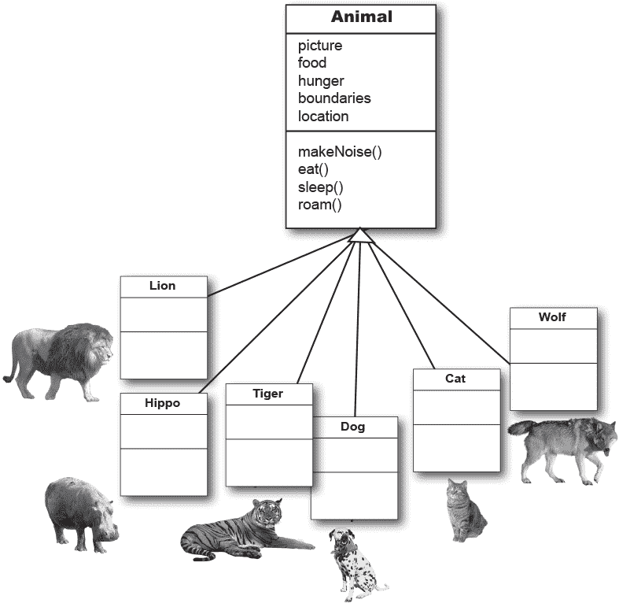
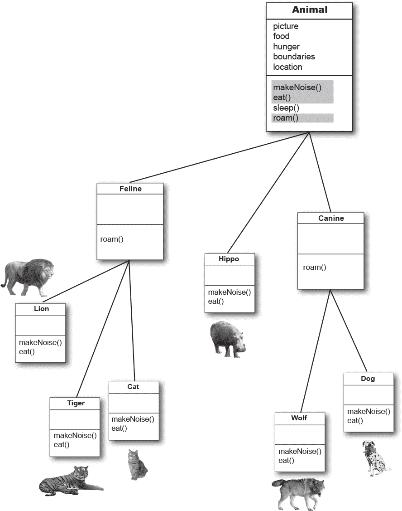
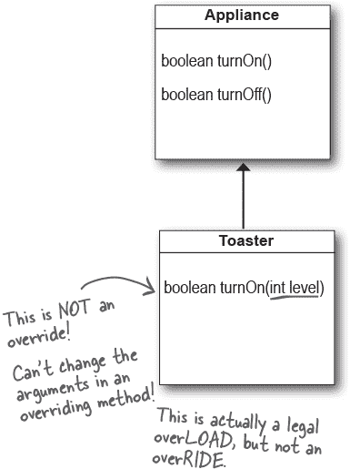

# 第七章：在 Objectville 中过上更好的生活：继承和多态


**为未来规划您的程序。** 如果有一种方法可以编写 Java 代码，让您可以更多地度假，那对您来说价值多少？如果您可以编写其他人*可以轻松扩展*的代码呢？如果您可以编写灵活的代码，以应对那些令人讨厌的临时规范更改，这是否是您感兴趣的？那么今天是您的幸运日。只需轻松的三次 60 分钟的时间投入，您就可以拥有这一切。当您加入多态计划时，您将学会 5 步更好的类设计，3 个多态技巧，8 种编写灵活代码的方法，如果您现在行动——还有一个额外的关于利用继承的 4 个技巧的奖励课程。不要拖延，这么好的优惠将为您提供您应得的设计自由和编程灵活性。快速，简单，现在就可以获得。今天开始，我们将为您额外增加一个抽象层次！

# 椅子之战重温……

***还记得在第二章里，当劳拉（过程式程序员）和布拉德（面向对象开发者）为 Aeron 椅子争斗的时候吗？让我们回顾一下那个故事的几个片段，复习继承的基础知识。***

-   **LAURA:** 你有重复的代码！旋转过程在所有四个形状中都有。这是一个愚蠢的设计。你必须维护四个不同的旋转“方法”。这样的设计怎么能好？

**BRAD:** 哦，我猜你还没看到最终的设计。让我展示一下面向对象的**继承**是如何工作的，劳拉。


你可以把它理解为**“Square 继承自 Shape”，“Circle 继承自 Shape”**等等。我从其他形状中移除了 rotate()和 playSound()，现在只需维护一个副本。

Shape 类被称为其他四个类的**超类**。其他四个是 Shape 的**子类**。子类继承超类的方法。换句话说，*如果 Shape 类具有功能，则子类自动获取相同的功能。*

# 阿米巴的 rotate()呢？


**LAURA:** 这不正是问题的关键吗——阿米巴形状有完全不同的 rotate 和 playSound 过程？

如果阿米巴从 Shape 类*继承*其功能，它如何执行不同的操作呢？

**BRAD:** 这是最后一步。Amoeba 类***覆盖***了 Shape 类需要特定的阿米巴行为的任何方法。然后在运行时，JVM 知道当有人告诉 Amoeba 旋转时应该运行哪个 rotate()方法。


# 理解继承

当您使用继承进行设计时，您将通用代码放入一个类中，然后告诉其他更具体的类通用（更抽象）类是它们的超类。当一个类从另一个类继承时，**子类从超类继承。**

在 Java 中，我们说子类 *extends* 父类。继承关系意味着子类继承了父类的成员，包括实例变量和方法。例如，如果 PantherMan 是 SuperHero 的子类，PantherMan 类自动继承了所有超级英雄共有的实例变量和方法，包括 `suit, tights, specialPower, useSpecialPower()` 等等。但是 PantherMan 子类可以添加自己的新方法和实例变量，并且可以覆盖它从父类 SuperHero 继承的方法。


FriedEggMan 不需要任何独特的行为，因此他不会覆盖任何方法。SuperHero 类中的方法和实例变量已经足够了。然而，PantherMan 对他的服装和特殊能力有特定的要求，因此在 PantherMan 类中 `useSpecialPower()` 和 `putOnSuit()` 都被覆盖了。

**实例变量不会被覆盖**，因为它们没有这个必要。它们不定义任何特殊行为，所以子类可以为继承的实例变量赋予任何值。PantherMan 可以将他继承的`tights`设为紫色，而 FriedEggMan 则将其设为白色。

# 一个继承的例子：


```
public class Doctor {

  boolean worksAtHospital;

  void treatPatient() {

    // perform a checkup
  }
}
```

* * *

```
public class FamilyDoctor extends Doctor {

  boolean makesHouseCalls;

  void giveAdvice() {
    // give homespun advice
  }
}
```

* * *

```
public class Surgeon extends Doctor {

  void treatPatient() {
    // perform surgery
  }

  void makeIncision() {
    // make incision (yikes!)
  }
}
```

# 让我们为动物模拟程序设计继承树

想象一下，你被要求设计一个模拟程序，让用户将各种不同的动物扔到环境中看看会发生什么。我们现在不必编写这个程序；我们主要关心的是设计。

我们已经得到了将在程序中出现的*一些*动物的列表，但不是全部。我们知道每种动物将由一个对象表示，并且这些对象将在环境中移动，执行每个特定类型被编程执行的操作。

***而且我们希望其他程序员能够随时向程序中添加新类型的动物。***

首先，我们必须找出所有动物共有的抽象特征，并将这些特征构建到一个所有动物类都可以扩展的类中。

+    寻找具有共同属性和行为的对象。

    **这六种类型有什么共同点？这可以帮助您抽象出行为。 （步骤 2）**

    **这些类型有什么共同点？这有助于定义继承树关系（步骤 4-5）**

    

# 使用继承来避免在子类中重复编写代码

我们有五个***实例变量：***

***picture*** – 表示这种动物的 JPEG 文件名。

***food*** – 这种动物食用的食物类型。目前只能有两个值：*meat* 或 *grass*。

***hunger*** – 表示动物饥饿水平的整数。它会根据动物吃饭的时间（和数量）而变化。

***boundaries*** – 表示动物将漫游的“空间”的高度和宽度的值（例如 640 x 480）。

***location*** – 动物在空间中所处位置的 X 和 Y 坐标。

我们有四个***方法:***

***makeNoise()*** – 动物应该发出噪音时的行为。

***eat()*** – 动物遇到其首选食物源（*肉*或*草*）时的行为。

***sleep()*** – 动物被认为处于睡眠状态时的行为。

***roam()*** – 动物不吃或睡觉时的行为（可能只是四处游荡等待碰到食物源或边界）。

+    设计一个代表共同状态和行为的类。

**这些对象都是动物，因此我们将创建一个名为 Animal 的共同超类。**

**我们将放入所有动物可能需要的方法和实例变量。**



# 所有动物都吃同样的方式吗？

假设我们都同意一件事：实例变量将适用于*所有*动物类型。狮子会有自己的 picture、food（我们考虑*肉*）、hunger、boundaries 和 location 的值。河马将有不同的*值*作为他的实例变量，但他仍将拥有其他动物类型拥有的相同变量。狗、老虎等也是如此。但是*行为*呢？

## 我们应该重写哪些方法？

狮子和狗发出相同的**声音**吗？猫和河马是一样**吃**东西吗？也许在*你*的版本中是这样，但在我们的版本中，进食和发出声音是特定于动物类型的。我们无法想出如何编写这些方法，以使它们适用于任何动物。好吧，这不是真的。例如，我们可以编写 makeNoise()方法，使其只是播放由该类型的实例变量定义的声音文件，但这并不是非常专业化。有些动物在不同情况下可能会发出不同的声音（比如吃东西时一个声音，遇到敌人时另一个声音等）。

因此，就像变形虫重写 Shape 类的 rotate()方法以获得更多变形虫特定（换句话说，*独特*）的行为一样，我们将不得不为我们的动物子类做同样的事情。

+    决定子类是否需要特定于该特定子类类型的行为（方法实现）。

    **查看 Animal 类后，我们决定应该由各个子类重写 eat()和 makeNoise()。**


# 寻找更多的继承机会

类层次结构开始形成。我们让每个子类重写*makeNoise()*和*eat()*方法，以便狗的吠声不会被误认为是猫的喵声（对双方都是相当侮辱）。河马也不会像狮子一样吃东西。

但也许我们还可以做得更多。我们必须查看 Animal 的子类，并看看是否可以以某种方式将两个或更多子类分组，并为只属于*那个*新组的代码提供。

+    寻找更多使用抽象的机会，通过找到两个或更多*子类*可能需要共同行为的地方。

    **我们查看我们的类并看到 Wolf 和 Dog 可能有一些共同的行为，同样适用于 Lion、Tiger 和 Cat。**


+    完成类层次结构

    由于动物已经有了组织层次（整个界、门、纲的事情），我们可以使用最合适的级别来进行类设计。我们将使用生物学上的“家族”来组织动物，创建一个 Feline 类和一个 Canine 类。

    **我们决定犬科动物可以使用一个通用的 roam()方法，因为它们倾向于成群结队移动。我们也看到猫科动物可以使用一个通用的 roam()方法，因为它们倾向于避开同类。我们将让河马继续使用其继承的 roam()方法——从 Animal 类那里继承的通用方法。**

    **所以我们现在完成了设计；我们将在本章稍后回到它。**



# 调用哪个方法？

Wolf 类有四个方法。一个继承自 Animal，一个继承自 Canine（实际上是 Animal 类中一个方法的重写版本），以及两个在 Wolf 类中重写的方法。当你创建一个 Wolf 对象并将其分配给一个变量时，你可以在该引用变量上使用点运算符来调用所有四个方法。但是哪个*版本*的这些方法会被调用？


当你在对象引用上调用一个方法时，你实际上是调用该对象类型的最具体版本的方法。

换句话说，***最低的那个获胜！***

“最低”指继承树上的最底层。Canine 低于 Animal，Wolf 低于 Canine，因此在对 Wolf 对象的引用上调用方法时，JVM 首先在 Wolf 类中查找。如果 JVM 在 Wolf 类中找不到方法的版本，它会沿着继承层次向上查找，直到找到匹配的方法。

# 设计一个继承树


# 使用 IS-A 和 HAS-A


记住，当一个类继承另一个类时，我们说子类*扩展*了超类。当你想知道一个东西是否应该扩展另一个东西时，请应用 IS-A 测试。

Triangle IS-A Shape，是的，这可以。

Cat IS-A Feline，这也行。

Surgeon IS-A Doctor，仍然适用。

Tub extends Bathroom，听起来合理。

*直到应用 IS-A 测试。*

要知道你是否设计了正确的类型，请问：“说类型 X 是类型 Y 有意义吗？”如果不是，你就知道设计有问题了，所以如果我们应用 IS-A 测试，浴缸是浴室显然是不对的。

如果我们反过来，让浴室扩展浴缸呢？那也不行，浴室是浴缸不行。

浴缸和浴室*是*相关的，但不是通过继承。浴缸和浴室通过 HAS-A 关系连接。说“浴室有一个浴缸”有意义吗？如果是，那么意味着浴室有一个浴缸的实例变量。换句话说，浴室对浴缸有一个*引用*，但浴室不*扩展*浴缸，反之亦然。


浴室有一个浴缸，浴缸有泡泡。

但没有人从其他人那里继承（扩展）。

# 但等等！还有更多！

IS-A 测试在继承树的*任何地方*都适用。如果你的继承树设计良好，当你询问*任何*子类是否是*任何*其超类型时，IS-A 测试应该是有意义的。

**如果 B 类扩展 A 类，则 B 类是 A 类。**

**这在继承树的任何地方都是正确的。如果类 C 扩展类 B，那么类 C 对于类 B *和* 类 A 都通过了 IS-A 测试。**

犬科动物扩展动物

狼扩展犬科动物

狼扩展动物

犬科动物是动物

狼是一种犬科动物

狼是动物


有了像这里显示的继承树，你总是可以说“狼扩展动物”或“狼是动物”。如果动物是狼的超类的超类，这并没有任何区别。事实上，**只要动物在狼的继承层次结构的某处之上，狼是动物就总是正确的。**

动物继承树的结构向世界表明：

“狼是犬科动物，所以狼可以做任何犬科动物可以做的事情。而且狼是动物，所以狼可以做任何动物可以做的事情。”

狼是否覆盖了动物或犬科动物中的某些方法并不重要。对于其他代码的世界来说，狼可以执行这四种方法。他们如何执行这些方法或这些方法在哪个类中被覆盖都不重要。狼可以叫声、吃饭、睡觉和漫步，因为狼扩展自动物类。

# 你如何知道你的继承是正确的？

到目前为止，我们所涵盖的内容显然还不足，但我们将在下一章中查看更多的面向对象问题（在那里我们最终会对本章的一些设计工作进行精炼和改进）。

然而，现在一个很好的指导原则是使用 IS-A 测试。如果“X 是 Y”有意义，那么这两个类（X 和 Y）很可能应该在同一个继承层次结构中。它们很可能具有相同或重叠的行为。

**请记住，继承的 IS-A 关系只能在*一个*方向上工作！**

三角形是一种形状有意义，所以你可以让三角形扩展形状。

但反过来——形状 IS-A 三角形——是*不*有意义的，所以形状不应扩展三角形。请记住，IS-A 关系意味着如果 X 是 Y 的一种，则 X 可以做任何 Y 可以做的事情（可能更多）。

 **你来解决。**

*提示：应用 IS-A 测试*

**谁得到保时捷，谁得到瓷器？（如何知道一个子类可以从其超类继承什么）**


子类继承超类的成员。成员包括实例变量和方法，尽管在本书的后面我们将会看到其他继承的成员。超类可以选择是否希望子类继承特定成员，这取决于特定成员的访问级别。

在本书中，我们将涵盖四种访问级别。从最严格到最宽松，这四种访问级别分别是：


**访问级别控制*谁看见什么***，对于拥有设计良好、健壮的 Java 代码至关重要。目前我们将只关注公共和私有两种。对于这两者的规则很简单：

```
public members *are* inherited
private members are *not* inherited
```

当子类继承一个成员时，就***好像子类自己定义了该成员***。在形状的例子中，正方形继承了`rotate()`和`playSound()`方法，对于外部世界（其他代码），正方形类简单地具有`rotate()`和`playSound()`方法。

一个类的成员包括在类中定义的变量和方法以及从超类继承的任何内容。

###### 注意

注意：获取有关默认和受保护内容的更多详细信息，请参阅附录 B。

# 在设计时使用继承，您是在使用还是滥用？

尽管这些规则背后的一些原因直到本书的后面才会被揭示，但现在，简单地*了解*一些规则将有助于您构建更好的继承设计。

**请**在一个类*是*超类的更具体类型时使用继承。例如：柳树是树的更具体类型，因此柳树*扩展*树是有意义的。

**请**在您有应该被多个相同类型的类共享的行为（实现的代码）时考虑继承。例如：正方形、圆形和三角形都需要旋转和播放声音，因此将这些功能放在一个超类形状（Shape）中可能是有意义的，也更容易维护和扩展。但是，请注意，虽然继承是面向对象编程的关键特性之一，但并不一定是实现行为重用的最佳方法。它可以让您入门，并且通常是正确的设计选择，但是设计模式将帮助您看到其他更微妙和灵活的选项。如果您不了解设计模式，那么这本书的一个好的后续阅读选择将是*《Head First Design Patterns》*。

**不要**仅仅为了从另一个类中重用代码而使用继承，如果超类和子类之间的关系违反了上述两条规则中的任何一条。例如，想象一下，在 Animal 类中编写了特殊的打印代码，现在需要在 Potato 类中使用打印代码。你可能会考虑让 Potato 扩展 Animal 以便 Potato 继承打印代码。这毫无意义！Potato *不是* Animal！（因此，打印代码应该在一个 Printer 类中，所有可打印对象都可以通过 HAS-A 关系利用它。）

**不要**在子类和超类不通过 IS-A 测试时使用继承。始终要问自己子类是否是超类的更具体类型。例如：Tea IS-A Beverage 是有意义的。Beverage IS-A Tea 是没有意义的。

# 那么，所有这些继承到底带来了什么好处？

通过使用继承进行设计，你可以获得很多面向对象的好处。通过将一组类共有的行为抽象出来，放入一个超类中，你可以消除重复的代码。这样，当你需要修改时，只需更新一个地方，*这种变更会神奇地反映在继承了该行为的所有类中。*好吧，并没有魔法，但确实很简单：做出改变，然后重新编译该类。就是这样。**你不必触及子类！**

**只需交付新变更的超类，所有扩展它的类将自动使用新版本。**

Java 程序无非就是一堆类，因此在使用新版本的超类时，不需要重新编译子类。只要超类不会对子类造成*破坏*，一切都好。（我们将在本书的后面讨论在这个上下文中“破坏”一词的含义。现在，可以将其理解为修改了超类中某个方法的参数、返回类型、方法名等，而子类依赖于这些内容。）

+    **你避免了重复代码。**

    将共有代码放在一个地方，并让子类从超类中继承该代码。当你想要改变这种行为时，你只需在一个地方进行修改，所有其他人（即所有子类）都会看到这一变更。

+    **你为一组类定义了一个通用协议。**

    

# 继承能确保所有归于某个特定超类型的类都具有超类型拥有的所有方法*

**换句话说，你为通过继承关联的一组类定义了一个通用协议。**

当你在超类中定义可以被子类继承的方法时，你在向其他代码宣告一种协议，说：“我的所有子类型（即子类）都可以做这些事情，使用这些看起来像这样的方法…”

换句话说，你建立了一个*协议*。

类 Animal 为所有 Animal 子类型建立了一个通用协议：


要记住，当我们说任何 Animal 时，我们指的是 Animal *及其任何从 Animal 继承的类*。这也意味着，*任何一个在继承层次结构中 Animal 上方的类*。

但我们甚至还没有到真正酷的部分，因为我们把最好的一部分——*多态性*——留到了最后。

当你为一组类定义一个超类型时，*该超类型的任何子类都可以替换为预期的超类型*。

嗯，什么？

别担心，我们还远没有解释完。再过两页，你就会成为专家。

**我关心的原因是...**

你可以利用多态性。

**对我很重要的原因是...**

你可以使用声明为超类型的引用来引用子类对象。

**对我来说意味着...**

你可以编写非常灵活的代码。更清洁的代码（更高效、更简单）。不仅更容易*开发*，而且在编写代码时从未想象过的方式中，也更容易*扩展*。

这意味着你可以在你的同事更新程序时去度假，而且你的同事甚至可能不需要你的源代码。

你将在下一页看到它是如何工作的。

我们不知道你，但就个人而言，我们觉得整个热带假期的事情尤其具有动力。


* 当我们说“所有方法”时，我们指的是“所有可继承方法”，目前实际上意味着“所有*公共*方法”，尽管稍后我们会进一步细化这个定义。

**要看看多态性是如何工作的，我们必须退后一步，看看我们通常如何声明一个引用并创建一个对象...**

**对象声明和赋值的三个步骤**


+    **声明一个引用变量**

    ```
    Dog myDog = new Dog();
    ```

    告诉 JVM 为一个引用变量分配空间。该引用变量永远是 Dog 类型。换句话说，一个遥控器，上面有控制 Dog 的按钮，但没有控制 Cat、Button 或 Socket 的按钮。

    

+    **创建一个对象**

    ```
    Dog myDog = new Dog();
    ```

    告诉 JVM 在可回收堆上为一个新的 Dog 对象分配空间。

    

+    **链接对象和引用**

    ```
    Dog myDog = new Dog();
    ```

    将新的 Dog 分配给引用变量 myDog。换句话说，***编程遥控器。***

    

**重要的是，引用类型和对象类型是相同的。**

**在这个例子中，两者都是 Dog。**


**但是在多态性中，引用类型和对象类型可以是*不同的*。**

```
Animal myDog = new Dog();
```


**使用多态性时，引用类型可以是实际对象类型的超类。**


当您声明一个引用变量时，通过“IS-A”测试与引用类型相同的任何对象都可以分配给该变量。换句话说，任何*扩展*声明的引用变量类型的对象都可以*分配*给引用变量。***这使您能够做像制作多态数组这样的事情。***

**好的，好的，也许一个例子会有所帮助。**


**但等等！还有更多！**

**你可以有多态参数和返回类型。**

如果您可以声明一个超类型的引用变量，比如 Animal，并将一个子类对象，比如 Dog，分配给它，请想想当引用是方法的参数时可能如何工作...


**通过多态性，您可以编写在引入新的子类类型到程序时无需更改的代码。**

记得那个 Vet 类吗？如果你使用声明为类型*Animal*的参数编写该 Vet 类，你的代码可以处理任何 Animal 的*子类*。这意味着，如果其他人想利用你的 Vet 类，他们只需确保*他们*的新 Animal 类型扩展了 Animal 类。即使 Vet 类在编写时对将要处理的新 Animal 子类型一无所知，Vet 方法仍将正常工作。

# 保持合约：覆盖规则

当您从超类覆盖方法时，您同意履行合约。合约即说，“我不带参数，返回一个布尔值。”换句话说，您覆盖的方法的参数和返回类型必须在外部世界看起来*完全*像超类中被覆盖的方法。

**方法 *就是* 合约。**

如果多态性要起作用，Appliance 中 Toaster 覆盖方法的版本必须在运行时起作用。请记住，编译器查看引用类型来决定是否可以在该引用上调用特定方法。


使用对 Toaster 的 Appliance 引用时，编译器仅关心类*Appliance*是否具有您在 Appliance 引用上调用的方法。但在运行时，JVM 并不关注**引用**类型（*Appliance*），而是堆上实际的*Toaster* **对象**。

因此，如果编译器已经批准了方法调用，它能够工作的唯一方式是覆盖方法具有相同的参数和返回类型。否则，具有 Appliance 引用的人将调用 turnOn()作为无参方法，即使 Toaster 中有一个接受 int 参数的版本。在运行时调用哪个方法？是 Appliance 中的方法。换句话说，***Toaster 中的 turnOn(int level)方法不是覆盖！***



+    **参数必须相同，返回类型必须兼容。**

    超类的合同定义了其他代码如何使用方法。无论超类接受什么样的参数，覆盖方法的子类必须使用相同的参数。并且无论超类声明什么返回类型，覆盖方法必须声明相同类型或子类类型。记住，子类对象保证能够执行其超类声明的任何操作，因此可以安全地返回子类，而超类预期返回的是安全的。

+    **方法不能更少可访问。**

    这意味着访问级别必须相同，或者更友好。例如，你不能覆盖一个公共方法并将其变为私有。如果在运行时调用的代码突然因为覆盖版本在运行时是私有的而被 JVM 关闭，那会是多么震惊的事情！

    到目前为止，我们学习了两种访问级别：私有和公共。另外两种在附录 B 中。关于与异常处理相关的重写还有另一条规则，但我们将等到第 13 章—— *风险行为* 中再讨论。

    

# 对方法进行重载

方法重载只不过是具有相同名称但不同参数列表的两个方法。没有重载方法涉及多态性！

重载让你可以创建多个版本的方法，具有不同的参数列表，为调用者提供方便。例如，如果你有一个仅接受 int 的方法，调用代码必须在调用你的方法之前将 double 转换为 int。但如果你重载该方法并提供另一个接受 double 的版本，那么你为调用者简化了操作。当我们在第 9 章—— *对象的生死：构造函数* 中查看构造函数时，你会看到更多这样的情况。

由于重载方法并不试图满足其超类定义的多态性约定，重载方法具有更大的灵活性。

重载方法只是一个具有相同方法名称的不同方法。它与继承和多态无关。重载的方法不同于重写的方法。

+    **返回类型可以不同。**

    你不能只改变返回类型。

+    **你不能只改变返回类型。**

    如果只有返回类型不同，则这不是有效的重*载* —— 编译器会假定你试图重写该方法。即使 *那* 也不合法，除非返回类型是超类声明的返回类型的子类型。要重载一个方法，你必须改变参数列表，尽管你 *可以* 将返回类型更改为任何类型。

+    **你 *可以* 在任何方向上变化访问级别。**

    你可以自由地使用一个更为严格的方法重载一个方法。这无关紧要，因为新方法无需履行重载方法的约定。

    **合法的方法重载示例：**

    ```
    public class Overloads {
      String uniqueID;

      public int addNums(int a, int b) {
        return a + b;
      }

      public double addNums(double a, double b) {
        return a + b;
      }

      public void setUniqueID(String theID) {
        // lots of validation code, and then:
        uniqueID = theID;
      }

      public void setUniqueID(int ssNumber) {
        String numString = "" + ssNumber;
        setUniqueID(numString);
      }
    }
    ```

# 练习


## Mixed Messages


下面列出了一个简短的 Java 程序。程序中有一个代码块缺失！你的挑战是将候选的代码块（在左侧）与插入后看到的匹配命令行输出进行配对。并非所有输出行都会被使用，有些输出行可能会被多次使用。画线连接代码块与匹配的命令行输出。

**程序：**


**代码候选人：**


**输出：**

```
A’s m1, A’s m2, C’s m3, 6

B’s m1, A’s m2, A’s m3,

A’s m1, B’s m2, A’s m3,

B’s m1, A’s m2, C’s m3, 13

B’s m1, C’s m2, A’s m3,

B’s m1, A’s m2, C’s m3, 6

A’s m1, A’s m2, C’s m3, 13
```

 **在 “Mixed Messages” 中的答案。**

## BE the Compiler

****如果将右侧列出的 A-B 方法对插入到左侧的类中，则会编译并产生显示的输出。 （将 A 方法插入到 Monster 类中，将 B 方法插入到 Vampire 类中。）**

```
public class MonsterTestDrive {

  public static void main(String[] args) {
    Monster[] monsters = new Monster[3];
    monsters[0] = new Vampire();
    monsters[1] = new Dragon();
    monsters[2] = new Monster();
    for (int i = 0; i < monsters.length; i++) {
      monsters[i].frighten(i);
    }
  }
}

class Monster {
  
}

class Vampire extends Monster {
  
}

class Dragon extends Monster {
  boolean frighten(int degree) {
    System.out.println("breathe fire");
    return true;
  }
}
```


 **在 “BE the Compiler” 中的答案。**

** **# 练习解决方案


## BE the Compiler

(来自 “BE the Compiler”)

集合 1 **将** 可以工作。

集合 2 **不会** 编译，因为 Vampire 的返回类型是 int。

Vampire 的 frighten() 方法（B）不是 Monster 的 frighten() 方法的合法重写或重载。仅更改返回类型是不足以使其成为有效重载的，因为 int 类型与 boolean 类型不兼容。请记住，如果只更改返回类型，则必须将其更改为与超类版本兼容的返回类型，那么它就是一个重写。

集合 3 和 4 **将** 编译但会产生：

`arrrgh`

`breathe fire`

`arrrgh`

记住，Vampire 类没有重写 Monster 类的 frighten() 方法。（Vampire 类中集合 4 的 frighten() 方法使用的是 byte，而不是 int。）

**代码候选人：**


## Mixed Messages

(来自 “Mixed Messages”)


## Pool Puzzle

(来自 “Pool Puzzle”)


```
public class Rowboat extends Boat {
   public void rowTheBoat() {
      System.out.print("stroke natasha");
   }
}
public class Boat {
   private int length ;
   public void setLength ( int len ) {
         length = len;
   }
   public int getLength() {
      return length ;
   }
   public void move() {
      System.out.print("drift ");
   }
}

public class TestBoats {
   public static void main(String[] args){
      Boat b1 = new Boat();
      Sailboat b2 = new Sailboat();
      Rowboat b3 = new Rowboat();
      b2.setLength(32);
      b1.move();
      b3.move();
      b2.move();
   }
}
public class Sailboat extends Boat {
   public void move() {
      System.out.print("hoist sail ");
   }
}
```

**输出：**

**
