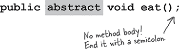
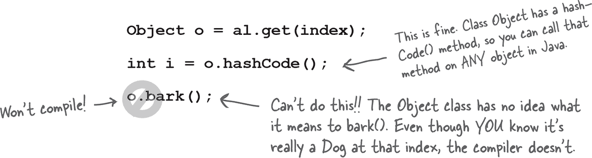

# 第八章：严肃的多态性：接口和抽象类


**继承仅仅是开始。** 要利用多态性，我们需要接口（而不是 GUI 类型）。我们需要超越简单的继承，达到只有通过设计和编码接口规范才能达到的灵活性和可扩展性的水平。Java 的一些最酷的部分甚至没有接口是不可能实现的，所以即使你自己不设计它们，你仍然必须使用它们。但你会 *想要* 设计它们。你会 *需要* 设计它们。***你***会想知道你以前怎么活过的。什么是接口？它是一个 100%抽象的类。什么是抽象类？它是一个不能被实例化的类。这对你有什么好处？你马上就会看到。但是如果你想一想上一章的结尾，以及我们如何使用多态参数，使得单个 Vet 方法可以接受所有类型的 Animal 子类，那只是揭开表面。接口是多态性中的***poly***。抽象类中的***ab***。Java 中的***咖啡因***。

# 我们在设计这个时有没有遗漏什么？


类结构并不算太糟糕。我们设计它以使重复代码最小化，并重写了我们认为应该具有特定子类实现的方法。从多态的角度来看，我们使其变得灵活，因为我们可以用 Animal 参数（和数组声明）设计使用 Animal 的程序，以便在运行时可以传入和使用任何 Animal 子类型—***包括我们在编写代码时从未想象过的那些***。我们将所有动物的共同协议（我们希望全世界都知道的四种方法）放在 Animal 超类中，我们准备开始制作新的 Lion、Tiger 和 Hippo。

**我们知道我们可以说：**

```
Wolf aWolf = new Wolf();
```


**而我们知道我们可以说：**

```
Animal aHippo = new Hippo();
```


**但事情变得奇怪的地方在这里：**

```
Animal anim = new Animal();
```


**一个新的 Animal()对象 *是* 什么样子？**


**实例变量的值是什么？**

**有些类根本不应该被实例化！**

创建一个 Wolf 对象或 Hippo 对象或 Tiger 对象是有意义的，但是究竟*什么是*Animal 对象？它是什么形状？什么颜色、大小、几条腿……

尝试创建 Animal 类型的对象就像是**噩梦般的星际迷航™传输事故**。在“我要上去”的过程中，缓冲区发生了不良反应。

但是我们如何处理这个问题呢？我们 *需要* 一个 Animal 类，用于继承和多态。但我们希望程序员只实例化类 Animal 的较少抽象的*子类*，而不是 Animal 本身。我们希望 Tiger 对象和 Lion 对象，***而不是 Animal 对象***。

幸运的是，有一种简单的方法可以阻止一个类被实例化。换句话说，阻止任何人对该类型使用“`**new**`”。通过将类标记为`**abstract**`，编译器将阻止任何地方的代码创建该类型的实例。

你仍然可以将该抽象类型用作引用类型。事实上，这是你首次创建抽象类的一个重要原因（将其用作多态参数或返回类型，或者创建一个多态数组）。

在设计类的继承结构时，你必须决定哪些类是*抽象的*，哪些是*具体的*。具体类是那些具体到可以实例化的类。*具体*类意味着可以创建该类型的对象。

将一个类声明为抽象很容易——在类声明前加上关键字`**abstract**`：

```
abstract class Canine extends Animal {
   public void roam() { }
}
```

# 编译器不允许你实例化一个抽象类。

抽象类意味着任何人都无法创建该类的新实例。你仍然可以将该抽象类用作声明的引用类型，以实现多态，但你不必担心有人创建该类型的对象。编译器*保证*这一点。


**抽象类**在没有被***扩展***的情况下几乎没有用途、价值或生存的目的。

使用抽象类时，是你的抽象类的**子类的实例**在运行时执行工作。

*但也有例外情况——抽象类可以拥有静态成员（见第十章）。*

# 抽象 vs. 具体


非抽象的类称为*具体*类。在动物继承树中，如果我们将 Animal、Canine 和 Feline 设为抽象类，则 Hippo、Wolf、Dog、Tiger、Lion 和 Cat 将作为具体的子类。

翻阅 Java API，你会发现很多抽象类，特别是在 GUI 库中。GUI 组件是什么样子？Component 类是与 GUI 相关的类的超类，用于按钮、文本区域、滚动条、对话框等。你不会实例化一个通用的*Component*并将其放在屏幕上；你会创建一个 JButton。换句话说，你只实例化 Component 的一个*具体子类*，但从不实例化 Component 本身。

# 抽象方法


除了类外，你也可以将*方法*标记为抽象。抽象类意味着该类必须*扩展*；抽象方法意味着该方法必须*重写*。你可能会决定某些（或全部）抽象类中的行为在没有更具体的子类实现时没有任何意义。换句话说，你不能想象出任何通用的方法实现对子类可能有用。一个通用的 eat()方法会是什么样子？

**抽象方法没有方法体！**

因为你已经决定在抽象方法中没有任何有意义的代码，所以你不会加入方法体。所以没有花括号——声明只以分号结束。



**如果你声明了一个抽象*方法*，你*必须*将*类*标记为抽象。你不能在非抽象类中拥有抽象方法。**

如果你在一个类中放入了一个抽象方法，那么你必须将这个类标记为抽象。但是你*可以*在抽象类中混合使用抽象和非抽象方法。

# 你*必须*实现所有抽象方法


***实现*一个抽象方法就像*重写*一个方法一样。**

抽象方法没有方法体；它们存在只为了多态性。这意味着继承树中的第一个具体类必须实现*所有*抽象方法。

然而，你可以通过自己成为抽象来推卸责任。例如，如果 Animal 和 Canine 都是抽象的，并且都有抽象方法，类 Canine 就不必实现 Animal 的抽象方法。但是一旦我们到达第一个具体的子类，比如 Dog，那么这个子类必须实现 Animal 和 Canine 的*所有*抽象方法。

但请记住，抽象类既可以有抽象方法，也可以有*非*抽象方法，因此 Canine 可以实现 Animal 的抽象方法，这样 Dog 就不需要实现它。但是如果 Canine 对 Animal 的抽象方法一言不发，Dog 就必须实现 Animal 的所有抽象方法。

当我们说“你必须实现抽象方法”，这意味着你*必须提供一个方法体*。这意味着你必须在你的类中创建一个与抽象方法具有相同方法签名（名称和参数）且返回类型与声明的返回类型兼容的非抽象方法。你要在方法中放*什么*是由你决定的。Java 只关心的是这个方法*存在*，在你的具体子类中。

# 多态的实现

假设我们想写一个*自己*的列表类，这个类将保存 Dog 对象，但是暂且假设我们不知道 ArrayList 类。首先，我们只给它一个 add()方法。我们将使用一个简单的 Dog 数组（Dog[]）来保存添加的 Dog 对象，并将其长度设置为 5。当我们达到 5 个 Dog 对象的限制时，你仍然可以调用 add()方法，但它不会做任何事情。如果我们*还没有*达到限制，add()方法会将 Dog 放入数组中的下一个可用索引位置，然后增加该索引（nextIndex）。

**构建我们自己的针对 Dog 的特定列表**

**（也许是世界上最糟糕的尝试之一，从头开始制作我们自己的 ArrayList 类。）**


# 哎呀，现在我们还需要保存 Cats

我们在这里有几个选择：

1\. 创建一个单独的类 MyCatList，用来保存 Cat 对象。相当笨重。

2\. 创建一个单一的类 DogAndCatList，将两个不同的数组作为实例变量，并且有两个不同的 add()方法：addCat(Cat c)和 addDog(Dog d)。另一个笨拙的解决方案。

3\. 创建一个异构的 AnimalList 类，接受*任何*动物子类（因为我们知道如果规格变更以添加猫，迟早还会添加*其他*种类的动物）。我们最喜欢这个选项，所以让我们更改我们的类，使其更通用，接受动物而不仅仅是狗。我们已经突出显示了关键更改（逻辑当然是一样的，但代码中的类型从 Dog 到 Animal 的变化）。

**构建我们自己的动物特定列表**


# 那么非动物类呢？为什么不创建一个足够通用以接受任何东西的类？


你知道这将引向何方。我们想要改变数组的类型，还有 add()方法的参数，改成某种比 Animal 更上层、更通用、更抽象的东西。但是我们该如何做呢？我们没有 Animal 的超类。

但是话又说回来，也许我们有……

**Java 中的每个类都扩展自类 Object。**

Object 类是所有类的母类；它是*一切*的超类。

即使你利用多态性，你仍然必须创建一个带有接受和返回*你的*多态类型的方法的类。如果在 Java 中没有一种通用的超类，Java 的开发人员就无法创建可以接受*你*自定义类型的方法的类……*在编写库类时他们根本不知道这些类型*。

所以从一开始你就在为类 Object 的子类编写代码，而你甚至都不知道。***你编写的每个类都扩展自 Object，*** 而无需你说它。但你可以把你编写的类想象成是这样的：

```
  public class Dog extends Object { }
```

等等，但是 Dog *已经*扩展了某个东西，*Canine*。没问题。编译器将会使*Canine*扩展 Object。虽然*Canine*扩展了 Animal。那也没问题，编译器会直接使 Animal 扩展 Object。

**任何没有*显式*扩展其他类的类，默认都会扩展 Object。**

所以，由于 Dog 扩展了 Canine，它并没有*直接*扩展 Object（尽管它间接扩展了它），Canine 也是如此，但是 Animal *确实*直接扩展了 Object。

# 那么这个超级超级超级大类 Object 里面都有什么？


如果你是 Java，你希望*每个*对象具有什么行为呢？嗯……让我们看看……要不要一个方法来判断一个对象是否等于另一个对象？还要不要一个方法来告诉你该对象的实际类类型？或许还要一个方法，为对象生成一个哈希码，这样你就可以在哈希表中使用该对象（稍后我们会讨论 Java 的哈希表）。哦，这里还有一个好方法——一个方法，打印出该对象的字符串消息。

你猜怎么着？就像魔术一样，Object 类确实拥有这四种方法。不过，这还不是全部，但我们确实关心这些。

 **equals(Object o)**


 **getClass()**


 **hashCode()**


 **toString()**


# 使用类型为 Object 的多态引用是有代价的…

在你忙着为所有的超灵活的参数和返回类型使用类型 Object 之前，你需要考虑一个小问题：使用类型 Object 作为引用可能会带来一些问题。记住，我们不是在讨论如何制作类型 Object 的实例；我们讨论的是制作某些其他类型的实例，但使用类型 Object 的引用。

当你把一个对象放入 ArrayList**<Dog>** 中时，它以 Dog 形式放进去，并以 Dog 形式出来：


但是当你将其声明为 ArrayList**<Object>** 时会发生什么？如果你想制作一个可以真正接受任何类型对象的 ArrayList，你可以这样声明：


但是当你试图获取 Dog 对象并将其分配给 Dog 引用时会发生什么？


***无论实际对象是什么，或者当你将对象添加到列表时引用类型是什么，所有东西都会作为类型为 Object 的引用从 ArrayList<Object> 中出来。***


# 当一只狗不像一只狗时

把一切都当作 Object 处理的问题在于，对象们 *似乎* 失去了它们的真正本质（尽管不是永久性的）。*狗似乎失去了它的狗性*。让我们看看当我们把一个 Dog 对象传递给一个方法，该方法返回相同 Dog 对象的引用，但声明返回类型为 Object 而不是 Dog 时会发生什么。


# 对象不会吠


现在我们知道，当一个对象被引用为类型 Object 的变量时，它不能被分配给声明为实际对象类型的变量。我们知道，当返回类型或参数声明为类型 Object 时，这种情况可能发生，例如当对象被放入类型为 Object 的 ArrayList 中时，使用 ArrayList<Object>。但这会带来什么后果呢？当我们试图在一个被编译器认为是 Object 的 Dog 上调用 Dog 方法时会发生什么呢？



###### 注意

**编译器根据 *引用* 类型来决定是否可以调用方法，而不是实际对象类型。**

即使你*知道*对象是有能力的（“...但它真的*是*一只狗，诚实的...”），编译器只能将其视为一个通用的`Object`。对于编译器来说，你放了一个按钮对象出来。或者一个微波炉对象。或者一些其他完全不知道如何吠叫的东西。

编译器检查*引用*类型的类，而不是*对象*类型，以确定是否可以使用该引用调用方法。


# 激发你内在的`Object`

一个对象包含从其每个超类继承的*所有*内容。这意味着*每个*对象——无论其实际的类类型如何——也是`Object`类的一个实例。这意味着在 Java 中，任何对象不仅可以被视为一只狗、按钮或雪板，还可以被视为一个`Object`。当你说`**new Snowboard()**`时，你在堆上得到一个单独的对象——一个`Snowboard`对象——但是该`Snowboard`包裹着代表其内部核心的`Object`（大写“O”）部分。


# *多态*意味着“多种形式”。

**你可以将`Snowboard`视为`Snowboard`或`Object`。**

如果一个引用就像一个遥控器，那么随着你沿着继承树向下移动，遥控器会拥有越来越多的按钮。类型为`Object`的遥控器（引用）只有几个按钮——类`Object`的暴露方法的按钮。但是类型为`Snowboard`的遥控器包括来自类`Object`的所有按钮，以及类`Snowboard`的任何新按钮（用于新方法）。类别越具体，按钮可能越多。

当然，这并非总是如此；子类可能并不添加任何新方法，而只是重写其超类的方法。关键点在于，即使对象的类型是`Snowboard`，指向该`Snowboard`对象的`Object`*引用*也无法看到`Snowboard`特定的方法。


## 将对象引用强制转换回其*真实*类型。


它仍然是一只狗*对象*，但是如果你想调用`Dog`特定的方法，你需要声明为`Dog`类型的*引用*。如果你确信对象确实是一只狗，你可以通过复制对象引用，并强制将该副本放入`Dog`引用变量中，使用强制转换`(Dog)`来创建一个新的*Dog*引用。你可以使用新的*Dog*引用调用*Dog*方法。


*如果你不确定它是一只狗，可以使用`instanceof`运算符进行检查。因为如果你在强制转换时出错，运行时将抛出`ClassCastException`并彻底停止。*

```
   if (o instanceof Dog) {
      Dog d = (Dog) o;
   }
```

**所以现在你已经看到 Java 在引用变量的类中多么关心方法。**

**你只能在对象上调用方法，如果引用变量的类具有该方法。**

**将你类中的公共方法视为你的合同，向外界承诺你能做的事情。**


当你编写一个类时，你几乎总是向外部代码*公开*一些方法。*公开*方法意味着你使方法*可访问*，通常通过将其标记为 public。

想象这样的场景：你正在为一个小型企业会计程序编写代码。为 Simon's Surf Shop 定制的应用程序。作为一个良好的重用者，你找到了一个 Account 类，看起来完全符合你的需求，至少根据它的文档来看是这样的。每个账户实例代表店铺中一个客户的账户。所以你在忙着调用 Account 对象的*credit()*和*debit()*方法时，突然意识到你需要获取账户的余额。没问题——应该有一个*getBalance()*方法可以满足你的需求。


除了……当你调用*getBalance()*方法时，整个事情在运行时崩溃了。忘掉文档吧，这个类根本没有那个方法。哎呀！

但这不会发生在你身上，因为每当你在引用上使用点运算符（a.doStuff()），编译器都会查看*引用*类型（变量"a"声明的类型）并检查该类以保证该方法存在，并且确实接受你传递的参数并返回你期望得到的类型的值。

**请记住，编译器检查的是*引用*变量的类，而不是引用另一端的*对象*的类。**

# 如果你需要更改合同怎么办？

好吧，假装你是一只狗。你的 Dog 类并不是*唯一*定义你是谁的合同。记住，你从所有超类继承了可访问（通常意味着*public*）的方法。

确实，你的 Dog 类定义了一个合同。

但不是*所有*你的合同。

**类*Canine*中的所有内容都是你合同的一部分。**

**类*Animal*中的所有内容都是你合同的一部分。**

**类*Object*中的所有内容都是你合同的一部分。**

根据 IS-A 测试，你*是*每一个这些东西——Canine、Animal 和 Object。

但如果设计你的类的人心中有一个动物仿真程序，现在他想要使用你（Dog 类）来做一个关于动物对象的科学展示教程。

没关系，你很可能对此是可重用的。

但是如果后来他想要把你用在 PetShop 程序中呢？*你没有任何**Pet**行为。* 宠物需要像*beFriendly()*和*play()*这样的方法。

现在假装你是 Dog 类的程序员。没问题，对吧？只需向 Dog 类添加更多方法。通过*添加*方法，你不会破坏其他人可能在 Dog 对象上调用的*现有*方法。

你能看到这种方法的任何缺点吗（在 Dog 类中添加 Pet 方法）？

# 让我们探索一些设计选项，以重用一些我们现有类在 PetShop 程序中

在接下来的几页中，我们将探讨一些可能性。我们暂时不担心 Java 是否实际*能够*实现我们想要的功能。我们会在明确了一些权衡之后再解决这个问题。

**所以我们真正需要的是：**

+    一种让宠物类中*只有*宠物行为的方法

+    一种保证所有宠物类都定义了相同方法（同名、同参数、同返回类型，没有缺失方法等）的方式，而不必交叉双手，希望所有程序员都能做对

+    一种利用多态性的方式，使得所有宠物都能调用它们的宠物方法，而不需要为每个宠物类使用参数、返回类型和数组。

**看起来我们需要顶层的两个超类。**


“两个超类”的方法也有一个问题……

**这就是“多重继承”，它可能是一件真正糟糕的事情。**

也就是说，如果在 Java 中有可能实现的话。

但它并不是这样，因为多重继承有一个称为死亡之钻石的问题。

**死亡之钻石**


一种允许死亡之钻石的语言可能会导致一些复杂的问题，因为你必须有特殊的规则来处理潜在的歧义。而额外的规则意味着你不仅要*学习*这些规则，还要注意这些“特殊情况”。Java 本应是*简单*的，具有一致的规则，不会在某些场景下出现问题。因此，Java（不像 C++）保护你免受需要考虑死亡之钻石的困扰。但这又把我们带回到最初的问题！*我们如何处理动物/宠物这件事？*

# 接口来拯救！

Java 为你提供了一个解决方案。一个*接口*。不是*GUI*界面，也不是像“这是 Button 类 API 的公共接口”中的接口的通用用法，而是 Java 的*关键字*`interface`。

Java 接口通过提供多态的*好处*来解决多重继承问题，而不会引入死亡之钻石（DDD）的痛苦和困扰。

接口绕过 DDD 的方式非常简单：***将所有方法都定义为抽象方法！*** 这样子类***必须***实现这些方法（记住，抽象方法*必须*由第一个具体的子类实现），因此在运行时，JVM 不会困惑于调用*哪一个*继承版本。


**Java 接口就像一个 100%纯抽象类。**

###### 注意

接口中的所有方法都是抽象的，因此任何 IS-A Pet 的类都必须实现（即覆盖）Pet 的方法。

**定义接口的方法：**


**实现接口：**


# 制作并实现 Pet 接口


**来自*不同*继承树的类可以实现相同的接口。**


当你将一个*类*用作多态类型（例如一个 Animal 类型的数组或一个接受 Canine 参数的方法），你可以放入该类型的对象必须来自相同的继承树。但不仅仅是继承树的任何地方；这些对象必须来自于一个是多态类型的子类。一个 Canine 类型的参数可以接受一个 Wolf 和一个 Dog，但不能接受一个 Cat 或者 Hippo。

但是当你将一个***接口***用作多态类型（例如一个 Pets 数组），对象可以来自继承树*任何地方*。唯一的要求是这些对象来自一个实现了接口的类。允许来自不同继承树的类实现共同的接口，在 Java API 中至关重要。需要一个对象能够将其状态保存到文件吗？实现 Serializable 接口。需要对象在单独的线程中运行其方法吗？实现 Runnable 接口。你明白了吧。稍后的章节中你将了解更多关于 Serializable 和 Runnable 的内容，但是现在要记住，来自继承树*任何地方*的类可能需要实现这些接口。几乎*任何*类都可能希望成为可保存或可运行的对象。

**更好的是，一个类可以实现*多个*接口！**

一个 Dog 对象通过继承是一个 Canine，是一个 Animal，是一个 Object。但是通过接口实现，一个 Dog 是一个 Pet，并且 Dog 可能实现其他接口。你可以说：

```
public class Dog extends Animal implements
Pet, Saveable, Paintable { ... }
```


**如何判断是应该创建一个类、一个子类、一个*抽象*类还是一个接口？**

+   当你的新类对于任何其他类型都不能通过 IS-A 测试时（除了 Object 之外），才创建一个不扩展任何东西的类。

+   当你需要创建一个***更具体***版本的类并且需要重写或添加新行为时，才创建一个子类（换句话说，*扩展*一个类）。

+   当你想为一组子类定义一个***模板***，并且这些子类至少有*一些*实现代码可以共用时，使用一个抽象类。当你希望确保没有人可以创建该类型的对象时，将类声明为抽象类。

+   当你想定义其他类可以扮演的一个***角色***时，使用一个接口，无论这些类在继承树的哪个位置。

# 调用一个方法的超类版本

# 练习


现在是展示你艺术能力的机会。在左边，你会找到一些类和接口声明的集合。你的任务是在右边绘制相应的类图。我们已经为你做了第一个。使用虚线表示“实现”关系，实线表示“继承”关系。


 **“What’s the Picture ?”中的答案。**


在左侧，你将找到一组类图。你的任务是将它们转换为有效的 Java 声明。我们已经为你完成了第 1 个（它很难）。


 **答案在 “声明是什么？” 中。**


## 池谜题


你的***工作***是从池中获取代码片段，并将它们放入代码和输出的空白行中。你**可以**多次使用同一片段，而且不需要使用所有片段。你的***目标***是创建一组可以编译运行并产生列出输出的类。


 **答案在 “池谜题” 中。**

# 练习解答


## 这是什么图？

(来自 “练习”)


## 声明是什么？

(来自 “图 ”)

**2.** 公共抽象类 Top { }

公共类 Tip 扩展自 Top { }

**3.** 公共抽象类 Fee { }

公共抽象类 Fi 扩展自 Fee { }

**4.** 公共接口 Foo { }

公共类 Bar 实现 Foo { }

公共类 Baz 扩展自 Bar { }

**5.** 公共接口 Zeta { }

公共类 Alpha 实现 Zeta { }

公共接口 Beta { }

公共类 Delta 扩展自 Alpha 并实现 Beta { }

**关键**


## 池谜题

(来自 “池谜题”)


```
interface Nose {
    public int iMethod() ;
}

abstract class Picasso implements Nose {
  public int iMethod() {
    return 7;
  }
}

class Clowns extends Picasso { }

class Acts extends Picasso {
  public int iMethod() {
   return 5;
 }
}
```

```
public class Of76 extends Clowns {
  public static void main(String[] args) {
    Nose[] i = new Nose [3] ;
    i[0] = new Acts() ;
    i[1] = new Clowns() ;
    i[2] = new Of76() ;
    for (int x = 0; x < 3; x++) {
      System.out.println(i[x].iMethod()
             + " " + i[x].getClass());
    }
  }
}
```

**输出**


