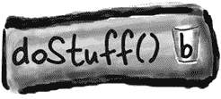
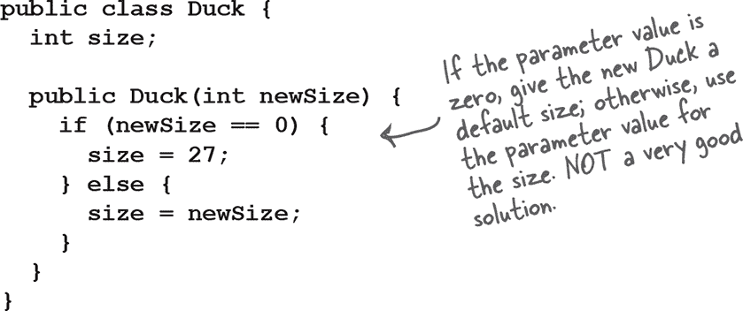
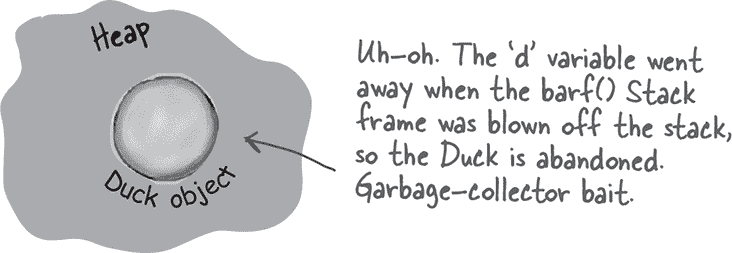

# 第九章：对象的生命周期：构造函数和垃圾回收


**对象诞生和对象死亡。** 你负责对象的生命周期。你决定何时以及如何 **构造** 它。你决定何时 **销毁** 它。但实际上你并不会 *销毁* 对象，你只是 *放弃* 它。一旦被放弃，无情的 **垃圾收集器（gc）** 可以将其蒸发，回收该对象占用的内存。如果你要写 Java，你就要创建对象。迟早会有一些对象需要放弃，否则会面临内存不足的风险。在本章中，我们将讨论对象的创建方式，它们在存活期间的存储位置，以及如何有效地保留或放弃它们。这意味着我们将讨论堆、栈、作用域、构造函数、超类构造函数、空引用等等。警告：本章包含关于对象死亡的内容，可能会让一些人感到不适。最好不要太过于依赖对象。

# 栈和堆：事物存放的位置

在我们理解创建对象时真正发生的事情之前，我们需要稍微退后一步。我们需要更多地了解在 Java 中所有东西存放的位置（以及存放多久）。这意味着我们需要更多地了解内存的两个区域——栈和堆。当 JVM 启动时，它从底层操作系统获取一块内存，并用它来运行您的 Java 程序。有多少内存，以及您是否可以调整它，取决于您运行的 JVM 版本（和平台）。但通常情况下，您 *不会* 对此有任何发言权。而对于良好的编程而言，您可能并不关心这些（稍后我们会详细讨论）。

在 Java 中，我们（程序员）关心对象存放的内存区域（堆）以及方法调用和局部变量存放的内存区域（栈）。

我们知道所有 *对象* 都存放在可垃圾回收的堆上，但我们还没有看到 *变量* 存放的位置。变量存放的位置取决于它是何种 *类型* 的变量。这里的“种类”并不是指 *类型*（即基本类型或对象引用），而是指我们现在关心的两种变量类型，即 *实例* 变量和 *局部* 变量。局部变量也被称为 *栈* 变量，这对于它们存放的位置提供了一个重要线索。

**栈（The Stack）**

方法调用和局部变量的存储位置


**堆（The Heap）**

所有 ***对象*** 存放的位置


# 方法被堆叠


当你调用一个方法时，该方法会放置在调用栈的顶部。实际推入栈顶的新事物是栈 *帧*，它保存方法的状态，包括正在执行的代码行以及所有局部变量的值。

栈顶的方法始终是该栈的当前运行方法（目前假设只有一个栈，在第十四章 *一个非常生动的故事：获取 GUI* 中，我们会添加更多栈）。方法一直保持在栈上，直到方法遇到其结束大括号（这表示方法已完成）。如果方法 `foo()` 调用方法 `bar()`，则方法 `bar()` 叠加在方法 `foo()` 之上。

有两个方法的调用栈

**栈顶的方法始终是当前正在执行的方法。**

```
public void doStuff() {
  boolean b = true;
  go(4);
}

public void go(int x) {
  int z = x + 24;
  crazy();
  // imagine more code here
}

public void crazy() {
  char c = 'a';
}
```

## 栈的场景

左侧的代码片段（我们不关心类的其余部分）包含三个方法。第一个方法（`doStuff()`）调用第二个方法（`go()`），第二个方法调用第三个方法（`crazy()`）。每个方法在方法体内声明了一个本地变量（*b*、*z* 和 *c*），方法 `go()` 还声明了一个参数变量（这意味着 `go()` 有两个本地变量，*x* 和 *z*）。

+    另一个类的代码调用 `**doStuff(),**` `**doStuff()**` 进入栈顶的栈帧。名为 **“b”** 的布尔变量放在 `**doStuff()**` 的栈帧上。

    

+    `**doStuff()**` 调用 `**go()**`，`**go()**` 被 *推送* 到栈顶。变量“`**x**`” 和 “`**z**`” 在 `**go()**` 的栈帧中。

    

+    `go()` 调用 `crazy()`，`crazy()` 现在位于栈顶，带有变量 `“c”` 在栈帧中。

    

+    `crazy()` 完成，并且它的栈帧被 *弹出*。执行返回到 `**go()**` 方法，并在调用 **`crazy().`** 后继续执行。

    

# 那么，关于是对象的本地变量呢？

记住，非原始变量保存的是对象的引用，而不是对象本身。你已经知道对象存储在哪里——堆上。它们的声明或创建地点并不重要。***如果本地变量是对象的引用，只有变量（引用/遥控器）放在栈上。***


# 如果本地变量存在于栈上，那实例变量存在于哪里呢？

当你说 new CellPhone()，Java 必须在堆上为该 CellPhone 分配空间。但是要分配多少空间呢？足够容纳对象，也就是足够容纳对象的所有实例变量。没错，实例变量存在于堆内，*在* 它们所属的对象内部。

记住，对象的实例变量的值存储在对象内部。如果实例变量都是原始类型，Java 根据原始类型分配实例变量的空间。int 需要 32 位，long 需要 64 位，依此类推。Java 并不关心原始变量内部的值；int 变量的位大小始终相同（32 位），无论 int 的值是 32000000 还是 32。

但是如果实例变量是*对象*呢？如果 CellPhone HAS-A Antenna 呢？换句话说，CellPhone 有一个类型为 Antenna 的引用变量。

当新对象具有引用对象而不是基本类型的实例变量时，真正的问题是：这个对象是否需要为其所有引用的对象预留空间？答案是，*并非完全需要*。无论如何，Java 都必须为实例变量的值预留空间。但请记住，引用变量的值并不是整个*对象*，而仅仅是*对象*的*遥控器*。因此，如果 CellPhone 有一个声明为非基本类型 Antenna 的实例变量，Java 只会在 CellPhone 对象内部为 Antenna 的*遥控器*（即引用变量）预留空间，而不是 Antenna *对象*本身。

那么，Antenna *对象*何时在堆上获得空间呢？首先，我们必须弄清楚 Antenna 对象本身是*何时*创建的。这取决于实例变量的声明。如果实例变量已声明但未分配对象，则只会创建引用变量（遥控器）的空间。

```
private Antenna ant;
```

直到引用变量被分配了一个新的 Antenna 对象之前，堆上都没有实际的 Antenna 对象。

```
private Antenna ant = new Antenna();
```


具有两个基本类型实例变量的对象。变量的空间位于对象内部。


具有一个非基本类型实例变量的对象——指向 Antenna 对象的引用，但实际上没有 Antenna 对象。如果声明变量但未使用实际的 Antenna 对象进行初始化，就会得到这种情况。

```
public class CellPhone {
  private Antenna ant;
}
```


具有一个非基本类型实例变量的对象，Antenna 变量被分配了一个新的 Antenna 对象。

```
public class CellPhone {
  private Antenna ant = new Antenna();
}
```

# 对象创建的奇迹

现在您知道变量和对象的存放位置，我们可以深入探讨对象创建的神秘世界了。记住对象声明和赋值的三个步骤：声明一个引用变量，创建一个对象，然后将对象赋给引用。

但直到现在，第二步——奇迹发生并且新对象“诞生”的地方——一直是一个大谜。准备好了解对象生命周期的事实。*希望您不会心慌*。

**让我们回顾对象声明、创建和赋值的三个步骤：**


**我们在调用名为 Duck() 的方法吗？因为看起来*确实*是这样。**


**No.**

**我们正在调用 Duck *构造函数。***

构造函数确实看起来很像方法，但它不是方法。它包含在您说 `new` 时运行的代码。换句话说，*实例化对象时运行的代码*。

调用构造函数的唯一方式是使用关键字`new`后跟类名。JVM 找到该类并调用该类中的构造函数。（好吧，严格来说这不是*唯一*的调用构造函数的方式。但这是从*构造函数外部*调用的唯一方式。你*可以*在另一个构造函数中调用构造函数，但有限制，我们稍后在本章中会详细讨论。）

**但构造函数在哪里？**

**如果我们没写，谁写了呢？**

你可以为你的类编写一个构造函数（我们即将做到这一点），但如果你不这样做，***编译器会为你编写一个！***

这是编译器默认构造函数的样子：

```
public Duck() {

}
```

**注意到了什么缺失的东西吗？这与方法有什么不同？**


# 构造一个鸭子


构造函数的关键特性是它在对象可以被分配给一个引用之前运行*。这意味着你有机会介入并做一些准备工作，使对象准备好使用。换句话说，在任何人能够使用对象的远程控制之前，对象有机会帮助自己构造。在我们的鸭子构造函数中，我们没有做任何有用的事情，只是演示事件序列。

**构造函数让你有机会介入`new.`的中间过程。**


 **由你来解决。**

# 初始化新鸭子的状态

大多数人使用构造函数来初始化对象的状态。换句话说，为对象的实例变量创建并赋值。

```
public Duck() {
   size = 34;
}
```

当鸭子类的*开发者*知道鸭子对象应该有多大时，这一切都很好。但是如果我们希望使用鸭子的程序员来决定特定鸭子的大小怎么办呢？

想象一下鸭子有一个大小实例变量，你希望使用你的鸭子类的程序员设置新鸭子的大小。你怎么做？

好吧，你可以在类中添加一个 setSize()设置器方法。但是这会暂时让鸭子没有大小*，并迫使鸭子用户编写*两个*语句——一个用于创建鸭子，一个用于调用 setSize()方法。下面的代码使用一个设置器方法来设置新鸭子的初始大小。


*实例变量确实有默认值。对于数值原始类型是 0 或 0.0，对于布尔值是 false，对于引用类型是 null。

# 使用构造函数初始化重要的鸭子状态*


如果一个对象在其状态（实例变量）的一个或多个部分被初始化之前不应该被使用，那么在你完成初始化之前不要让任何人获取鸭子对象！让某人调用 setSize()方法后，该新鸭子对象才可以使用，通常风险太大了。鸭子用户甚至*知道*他需要在创建新鸭子后调用设置器方法吗？

将初始化代码放入构造函数是最佳位置。你只需要创建一个带参数的构造函数。


*并非所有的鸭子状态都不重要。

# 让制作鸭子变得简单

## 确保你有一个无参数构造函数

如果鸭子构造函数需要参数会发生什么？想想看。在前一页上，只有*一个*鸭子构造函数——它接受一个整数参数作为鸭子的大小。这可能不是一个大问题，但它确实使得程序员更难以创建一个新的鸭子对象，特别是如果程序员不*知道*鸭子的大小应该是多少。有没有一个默认大小对于鸭子会有帮助，这样如果用户不知道一个合适的大小，他们仍然可以制作一个正常工作的鸭子？

***想象一下，你希望鸭子的用户有两种制作鸭子的选项——一种是他们提供鸭子大小（作为构造函数参数），另一种是他们不指定大小，因此获得你的默认鸭子大小。***

你不能只用一个构造函数来干净利落地做这件事。记住，如果一个方法（或构造函数——规则相同）有参数，当你调用该方法或构造函数时，*必须*传递适当的参数。你不能只是说，“如果有人不向构造函数传递任何内容，则使用默认大小”，因为他们甚至在不向构造函数调用发送整数参数的情况下都无法编译。你*可以*做一些笨拙的事情，比如这样：



但这意味着制作一个新的鸭子对象的程序员必须*知道*传递“0”是获得默认鸭子大小的协议。相当丑陋。如果另一个程序员不知道呢？或者如果他们真的*想*要一个零大小的鸭子？（假设允许零大小的鸭子。如果你不想要零大小的鸭子对象，请在构造函数中放置验证代码来防止这种情况。）关键是，可能并不总是可能区分真正的“我想要大小为零”构造函数参数和“我发送零，所以你给我默认大小，不管那是多少”的构造函数参数。

# 编译器总是会为你创建无参数构造函数吗？不！


你可能会认为，如果你只写一个带参数的构造函数，编译器会看到你没有无参数构造函数，然后为你添加一个。但事实并非如此。编译器只有在你完全不说构造函数时才会参与构造函数的创建。

**如果你编写一个带参数的构造函数，而你*仍然*想要一个无参数构造函数，你将不得不自己构建无参数构造函数！**

一旦提供构造函数，任何类型的构造函数，编译器就会退后一步，说：“好的，看起来你负责构造函数了。”

**如果在一个类中有多个构造函数，则这些构造函数必须具有不同的参数列表。**

参数列表包括参数的顺序和类型。只要它们不同，你可以有多个构造函数。方法也可以这样做，但我们将在另一章节中讨论。

**重载的构造函数意味着你的类中有多个构造函数。**

**为了编译，每个构造函数的参数列表必须*不同*！**

下面的类是合法的，因为五个构造函数具有不同的参数列表。例如，如果你有两个只接受 int 的构造函数，那么该类将无法编译。不管你给参数变量取什么名字，都不算。重要的是变量的*类型*（int、Dog 等）和*顺序*。*可以*有两个具有相同类型的构造函数，***只要顺序不同***。接受 String 后跟 int 的构造函数与接受 int 后跟 String 的构造函数不同。


# 纳米评论：关于构造函数需要记住的四件事

+    构造函数是当有人在类类型上说 `new` 时运行的代码：

    ```
    Duck d = new Duck();
    ```

+    构造函数必须与类名相同，并且没有**返回类型**：

    ```
    public Duck(int size) { }
    ```

+    如果你的类中没有放置构造函数，编译器会放置一个默认构造函数。默认构造函数始终是无参构造函数。

    ```
    public Duck() { }
    ```

+    你的类中可以有多个构造函数，只要参数列表不同。在类中有多个构造函数意味着你有重载的构造函数。

    ```
    public Duck() { }

    public Duck(int size) { }

    public Duck(String name) { }

    public Duck(String name, int size) { }
    ```

*完成所有的 Brain Power 练习已被证明能增加 42%的神经元大小。而且你知道他们说，“大脑神经元…”*

# 等一下... 我们从未讨论过超类和继承以及它们如何与构造函数配合。

看这里就有趣了。还记得在上一章中我们看过的 Snowboard 对象环绕内核表示 Snowboard 类的 Object 部分吗？关键在于每个对象不仅持有*自己*声明的实例变量，还有*来自其超类的所有变量*（至少是类 Object，因为*每个*类都扩展自 Object）。

因此，当创建对象（因为有人使用 `new`；除了有人在类类型上说 `**new**` 之外，没有***其他方式***创建对象），对象会获得来自整个继承树的*所有*实例变量的空间。稍微思考一下... 超类可能有封装私有变量的 setter 方法。但是这个变量必须存在*某处*。当创建对象时，几乎就像*多个*对象被实体化了——被 new 的对象和每个超类的一个对象。不过从概念上讲，更好的想法是像下面的图片一样，创建的对象有*层次*来表示每个超类。


# 超类构造函数在对象生命周期中的角色


***对象继承树中的所有构造函数在创建新对象时必须运行。***

让这一切都沉淀下来。

这意味着每个超类都有构造函数（因为每个类都有构造函数），并且在创建子类对象时，层次结构中的每个构造函数都会运行。

说`**new**`是一件大事。它启动整个构造函数链反应。是的，即使抽象类也有构造函数。尽管你永远不能对抽象类说 new，但抽象类仍然是超类，因此在创建具体子类的实例时运行其构造函数。

超类构造函数运行以构建对象的超类部分。请记住，子类可能会继承依赖于超类状态的方法（换句话说，超类中实例变量的值）。为了使对象完全形成，它自身的所有超类部分*必须*完全形成，这就是为什么必须运行超类构造函数的原因。继承树中每个类的所有实例变量都必须声明和初始化。即使 Animal 有 Hippo 不继承的实例变量（例如，如果变量是私有的），Hippo 仍然依赖于 Animal 方法*使用*这些变量。

当一个构造函数运行时，它立即调用它的超类构造函数，一直向上链，直到达到 Object 类的构造函数。

在接下来的几页中，您将了解如何调用超类构造函数以及如何自己调用它们。您还将了解如果您的超类构造函数有参数该怎么办！

**一个新的 Hippo 对象也是一个 Animal 和一个 Object。如果你想创建一个 Hippo，你也必须创建 Hippo 的 Animal 和 Object 部分。**

**这一切都发生在一个称为构造函数链的过程中。**

# 制作一个 Hippo 也意味着制作 Animal 和 Object 的部分...


鉴于上述代码中的类层次结构，我们可以逐步了解创建新 Hippo 对象的过程。

+    另一个类中的代码调用新的 `**Hippo()**`，并且 `**Hippo()**` 构造函数进入堆栈顶部的堆栈帧。

    

+    `**Hippo()**` 调用超类构造函数，将 `**Animal()**` 构造函数推入堆栈顶部。

    

+    `**Animal()**` 调用超类构造函数，将 `**Object()**` 构造函数推入堆栈顶部，因为 Object 是 Animal 的超类。

    

+    `**Object()**` 完成，并弹出其堆栈帧。执行返回到 `**Animal()**` 构造函数，并从 Animal 调用其超类构造函数后的下一行继续执行。

    

第一个是 A. Hippo()构造函数首先被调用，但 Animal 构造函数先完成。

# *如何*调用超类构造函数？

你可能会认为，在鸭子构造函数中的某个地方，如果 Duck 扩展自 Animal，你会调用 Animal()。但事实并非如此：


唯一调用超类构造函数的方法是通过***super().*** 是的，***super()*** 调用***超类构造函数***。

机会有多大？


在你的构造函数中调用 super()会把超类构造函数放在 Stack 的顶部。你觉得那个超类构造函数做什么？*调用它的超类构造函数*。如此循环，直到 Object 构造函数位于 Stack 的顶部。一旦 Object()完成，它就会从 Stack 中弹出，下一个位于 Stack 顶部的东西（调用 Object()的子类构造函数）现在位于顶部。*那*构造函数完成，如此循环，直到原始构造函数位于 Stack 的顶部，现在它可以完成了。

# 孩子可以在父母之前存在吗？


如果你把超类看作是子类的父类，你就能弄清楚哪个必须先存在。***对象的超类部分必须在子类部分之前完全形成（完全构建）***。记住，子类对象可能依赖于它从超类继承的东西，因此重要的是这些继承的东西已经完成。没有别的办法。超类构造函数必须在其子类构造函数之前完成。

再看一下“制作河马意味着制作动物和对象部分……”系列中的 Stack，你会发现，虽然 Hippo 构造函数是第一个被调用的（它是 Stack 上的第一件事），但它是最后一个完成的！每个子类构造函数立即调用它自己的超类构造函数，直到对象构造函数位于 Stack 的顶部。然后 Object 的构造函数完成，我们反弹回 Animal 的构造函数。只有 Animal 的构造函数完成后，我们才最终回到完成 Hippo 构造函数的其余部分。因此：

**调用 super()必须是每个构造函数中的*第一*条语句！***

*There’s an exception to this rule; you’ll learn it in “调用另一个重载构造函数”.

# 带参数的超类构造函数

如果超类构造函数有参数怎么办？你可以在 super()调用中传递参数吗？当然可以。如果不能的话，你将永远无法扩展一个没有无参构造函数的类。想象一下这种情况：所有动物都有一个名字。在 Animal 类中有一个 getName()方法返回名字实例变量的值。这个实例变量标记为私有，但是子类（在这种情况下是 Hippo）继承了 getName()方法。所以问题来了：Hippo 通过继承有了 getName()方法，但没有名字实例变量。Hippo 必须依赖于他自己 Animal 部分来保持名字实例变量，并且在有人调用 Hippo 对象的 getName()时返回它。但是... Animal 部分如何得到名字呢？Hippo 唯一对 Animal 部分的引用就是通过 super()，所以这是 Hippo 将自己的名字发送到 Animal 部分的地方，以便 Animal 部分可以将其存储在私有的名字实例变量中。


# 从另一个重载的构造函数中调用一个构造函数


如果你有多个重载的构造函数，除了处理不同参数类型外，它们都做同样的事情，你肯定不希望在每个构造函数中重复代码（维护起来很痛苦等等），所以你想把大部分构造函数代码（包括调用 super()）放在只有一个重载构造函数中。你希望首先调用的任何构造函数都调用真正的构造函数，让真正的构造函数完成构造工作。很简单：只需说*this()*。或*this(aString)*。或*this(27, x)*。换句话说，只需想象关键字*this*是**当前对象的引用**。

你只能在构造函数中使用*this()*，并且它必须是构造函数中的第一个语句！

但这是一个问题，不是吗？早些时候我们说过 super()必须是构造函数中的第一个语句。好吧，这意味着你有选择的余地。

**每个构造函数都可以调用 super()或 this()，但绝不可以两者都有！**

你需要根据你拥有的值、需要设置的值以及这个类或超类中提供的构造函数来选择调用哪个构造函数。


# 现在我们知道一个对象是如何诞生的，但一个对象的**寿命**有多长呢？

一个*对象*的生命周期完全取决于引用指向它的生命周期。如果引用被认为是“活着的”，那么对象仍然存活在堆上。如果引用死亡（我们马上会看到这意味着什么），对象将会死亡。

**所以如果一个对象的生命周期取决于引用变量的生命周期，那么一个*变量*的生命周期有多长呢？**

这取决于变量是*局部*变量还是*实例*变量。下面的代码展示了局部变量的生命周期。在这个例子中，变量是一个基本类型，但无论是基本类型还是引用类型，变量的生命周期都是相同的。


**局部变量的生命周期和作用域之间的区别：**

**生命周期**

一个局部变量只要其栈帧存在于栈上就会存活。换句话说，*直到方法完成*。

**作用域**

局部变量只在声明它的方法内部作用域中。当其方法调用另一个方法时，变量是存活的，但直到其方法恢复执行前都不在作用域内。***只有在变量在作用域内时才能使用。***

让我们来看一下当某个东西调用`doStuff()`方法时栈上发生了什么。


 ***doStuff()* 进入栈。变量“b”仍然存活且在作用域内。**


 ***go()* 压入栈顶。“x”和“z”存活并且在作用域内，“b”存活但不在作用域内。**


 ***crazy()* 被推入栈中，此时“c”存活并且在作用域内。其他三个变量存活但超出作用域。**


 ***crazy()* 完成并从栈中弹出，所以‘c’超出作用域并且失效。当`go()`在离开时恢复执行时，“x”和“x”仍然存活并且重新进入作用域。变量“b”仍然存活但超出作用域（直到`go()`完成）。**

在局部变量存活期间，其状态会持续存在。例如，只要`doStuff()`方法在栈上，变量“b”就保持其值不变。但是只有在该局部变量的方法实际运行时才能使用该局部变量。换句话说，你只能在该局部变量的方法实际运行时使用局部变量（而不是等待更高的栈帧完成）。

# 那么引用变量呢？

对于基本类型和引用类型，规则都是一样的。只有在作用域内，引用变量才能被使用，这意味着你不能使用对象的遥控器，除非你有一个在作用域内的引用变量。*真正的*问题是：

**“变量生命周期如何影响对象生命周期？”**

只要有活跃的引用指向对象，对象就会存活。如果引用变量超出作用域但对象仍存活，则它所*指向*的对象仍然存活在堆上。然后你必须问……“当方法结束时，保存引用的栈帧被弹出栈时会发生什么？”

如果这是对象的*唯一*活跃引用，那么对象现在被遗弃在堆上。引用变量随着栈帧的销毁而消失，因此被遗弃的对象*正式*成为垃圾。关键是要知道对象何时变得***可供垃圾收集***。

一旦对象符合垃圾收集的条件（GC），你就不必担心回收该对象使用的内存。如果你的程序内存不足，GC 将销毁一些或全部符合条件的对象，以防止内存耗尽。你仍然可能会耗尽内存，但是*不会*在所有符合条件的对象被清理之前。

**一个对象的生命没有价值，没有意义，没有意义，除非有人持有它的引用。**

**如果你不能到达它，就不能要求它做任何事情，它只是一大堆浪费的位。**

**但是如果一个对象是不可达的，垃圾收集器会找出来。迟早，那个对象就要下岗了。**

**杀手对象 #1**

**引用超出范围，永久性地。**


```
public class StackRef {
  public void foof() {
     barf();
  }

  public void barf() {
     Duck d = new Duck();
 }
}
```


+    ***foof()* 被推入堆栈；没有变量被声明。**

    

+    **2 *barf()* 被推入堆栈，声明一个引用变量，并创建一个分配给该引用的新对象。对象在堆上创建，并且引用是活动的且在范围内。**

    

+    **3 *barf()* 完成并弹出堆栈。它的框架消失了，所以“d”现在死了并消失了。执行返回到 foof()，但 foof()不能使用“d”。**

    

**杀手对象 #2**

**将引用分配给另一个对象**


```
public class ReRef {
  Duck d = new Duck();

  public void go() {
    d = new Duck();
 }
}
```


**杀手对象 #3**

**显式地将引用设置为 null**


```
public class ReRef {
  Duck d = new Duck();

  public void go() {
    d = null;
  }
}
```


# 练习


## 成为垃圾收集器


**如果在左边的类的点 A 处添加右边代码中的哪一行，将会使得恰好一个额外的对象可以被垃圾收集器收集？（假设点 A（//调用更多方法）将长时间执行，给垃圾收集器足够的时间来完成其工作。）**

```
public class GC {
 public static GC doStuff() {
   GC newGC = new GC();
   doStuff2(newGC);
   return newGC;
}

public static void main(String[] args) {
  GC gc1;
  GC gc2 = new GC();
  GC gc3 = new GC();
  GC gc4 = gc3;
  gc1 = doStuff();

  // call more methods
}

public static void doStuff2(GC copyGC) {
  GC localGC = copyGC;
 }
}
```

 **答案在 “成为垃圾收集器”。**

**1** `copyGC = null;`

**2** `gc2 = null;`

**3** `newGC = gc3;`

**4** `gc1 = null;**

**5** `newGC = null;`

**6** `gc4 = null;`

**7** `gc3 = gc2;**

**8** `gc1 = gc4;**

**9** `gc3 = null;`

## 流行的对象

在这段代码示例中，创建了几个新对象。你的挑战是找出“最流行”的对象，即引用变量最多的对象。然后列出该对象的总引用数及其引用变量！我们先指出一个新对象及其引用变量。

祝你好运！

 **Answers in “Popular Objects”.**


“我们已经运行了模拟四次，主模块的温度始终在正常值向冷端漂移，”Sarah 气愤地说道。“上周我们安装了新的温度机器人。散热机器人的读数，设计用于冷却生活区，似乎在规格内，因此我们将分析重点放在保温机器人身上，这些机器人有助于加热生活区。” Tom 叹了口气，起初，纳米技术似乎真的能让他们提前完成进度。现在，距离发射只剩五周时间，一些轨道飞行器的关键生命支持系统仍然未能通过模拟测试。

“你在模拟什么比率？”Tom 问道。

## Five-Minute Mystery


“如果我看到你的意思，我们已经考虑过了，”Sarah 回答说。“任务控制不会在关键系统超出规范时签署。我们必须以 2:1 的比例运行 v3 散热机器人的模拟单元，”Sarah 继续说道。“总体而言，保温机器人与散热机器人的比例应该是 4:3。”

“功耗怎么样，Sarah？”Tom 问道。Sarah 暂停了一下，“嗯，还有一件事，功耗比预期高。我们有一个团队正在追踪这个问题，但由于纳米技术是无线的，隔离散热机器人和保温机器人的功耗一直很困难。”Sarah 继续说道，“总体功耗比例设计为 3:2，散热器从无线网格中提取更多功率。”

“好的，Sarah，”Tom 说。“让我们来看看一些模拟初始化代码。我们必须找出这个问题，尽快解决！”

```
import java.util.ArrayList;

class V2Radiator {
  V2Radiator(ArrayList<SimUnit> list) {
    for (int x = 0; x < 5; x++) {
      list.add(new SimUnit("V2Radiator"));
    }
  }
}

class V3Radiator extends V2Radiator {
  V3Radiator(ArrayList<SimUnit> lglist) {
    super(lglist);
    for (int g = 0; g < 10; g++) {
      lglist.add(new SimUnit("V3Radiator"));
    }
  }
}

class RetentionBot {
  RetentionBot(ArrayList<SimUnit> rlist) {
    rlist.add(new SimUnit("Retention"));
  }
}
import java.util.ArrayList;

public class TestLifeSupportSim {
  public static void main(String[] args) {
    ArrayList<SimUnit> aList = new ArrayList<SimUnit>();
    V2Radiator v2 = new V2Radiator(aList);
    V3Radiator v3 = new V3Radiator(aList);
    for (int z = 0; z < 20; z++) {
      RetentionBot ret = new RetentionBot(aList);
    }
  }
}

class SimUnit {
  String botType;

  SimUnit(String type) {
    botType = type;
  }

  int powerUse() {
    if ("Retention".equals(botType)) {
      return 2;
    } else {
      return 4;
    }
  }
}
```

Tom 快速查看了代码，嘴角露出了一丝微笑。“我想我找到问题了，Sarah，而且我打赌我也知道你的功率使用读数偏差百分比是多少！”

***Tom 怀疑什么？他如何猜测电力读数错误？你能添加几行代码来帮助调试这个程序吗？***

 **Answers in “Five-Minute Mystery”.**

# Exercise Solutions


## Be the Garbage Collector

(from “Exercise”)


## Popular Objects

(from “Popular Objects”)

或许很容易想到 honeyPot 变量首先引用的是 Honey 对象，它是这个类中“最受欢迎”的对象。但也许更难看到，所有指向 Honey 对象的变量都指向***同一个对象！*** 在 main( ) 方法完成之前，对该对象有总共 12 个活动引用。*kit.honeyPot* 变量在一段时间内是有效的，但是在结尾处 kit 被置空。由于 *raccoon.rk* 仍然引用 Kit 对象，*raccoon.kit.honeyPot*（虽然从未显式声明）引用的是同一个对象！


## 五分钟之谜

(来自“五分钟之谜”)


Tom 注意到 V2Radiator 类的构造函数使用了 ArrayList。这意味着每次调用 V3Radiator 构造函数时，它在 super() 调用中传递了一个 ArrayList 给 V2Radiator 构造函数。这意味着额外创建了五个 V2Radiator SimUnits。如果 Tom 是对的，总功耗应该是 120，而不是 Sarah 预期的 100。

由于所有的 Bot 类都创建 SimUnits，编写一个 SimUnit 类的构造函数，并在每次创建 SimUnit 时打印一行，将很快凸显出问题所在！
