# 第十章：数字很重要：数字和静态


**做数学计算。** 但与其说数字只涉及基本算术，不如说有更多内容。您可能希望获取数字的绝对值，或四舍五入一个数字，或找到两个数字中较大的那个。您可能希望以确切的两位小数打印数字，或者您可能希望将逗号插入大数以使其更易于阅读。还有将字符串解析为数字？或者将数字转换为字符串？总有一天，您会想要将一堆数字放入仅接受对象的集合中，例如 ArrayList。您很幸运。Java 和 Java API 充满了方便的数字调整功能和方法，准备好且易于使用。但其中大多数都是**静态的**，所以我们将从学习变量或方法为静态的含义开始，包括 Java 中的常量，也称为静态*final*变量。

# MATH 方法：这是您能接近*全局*方法的方式

Java 中没有全局*任何东西*。但是想象一下：如果您有一个方法，其行为不依赖于实例变量的值。例如，考虑 Math 类中的 round()方法。它每次都做同样的事情——将浮点数（方法的参数）四舍五入为最接近的整数。每一次都是如此。如果您有 10000 个 Math 类的实例，并运行 round(42.2)方法，则会得到整数值 42。换句话说，该方法作用于参数，但从不受实例变量状态的影响。唯一改变 round()方法运行方式的是传递给方法的参数！

将 Math 类的实例化仅仅为了运行 round()方法看起来是对堆空间的浪费，对吗？那么其他像 min()这样的 Math 方法呢？该方法接受两个数值原始类型参数，并返回较小的那个。或者 max()方法。或者 abs()方法，该方法返回数的绝对值。

***这些方法从不使用实例变量的值***。事实上，Math 类根本没有*任何*实例变量。因此，通过创建 Math 类的实例无济于事。所以你猜怎么着？实际上，你不能。

**如果您试图创建 Math 类的实例：**

```
Math mathObject = new Math();
```

**您将获得此错误：**


###### 注意

Math 类中的方法不使用任何实例变量的值。并且因为这些方法是“静态”的，您不需要 Math 的实例。只需要 Math 类即可。


# 常规（非静态）和静态方法之间的区别

Java 是面向对象的，但偶尔会有特例，通常是实用方法（如 Math 方法），其中没有必要创建类的实例。关键字**`static`**允许方法在***没有类的任何实例的情况下运行***。静态方法意味着“行为不依赖于实例变量，因此不需要实例/对象。只需要类。”

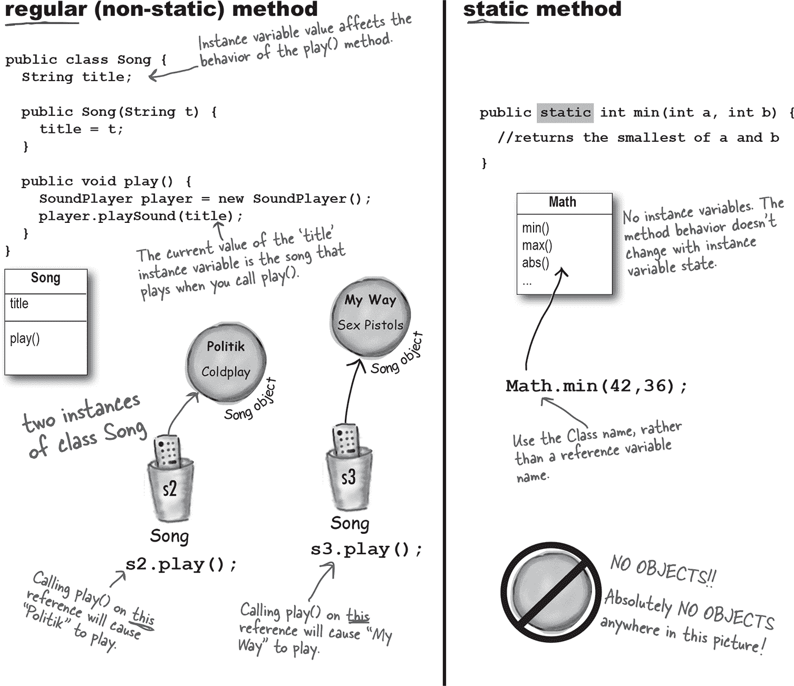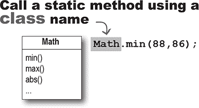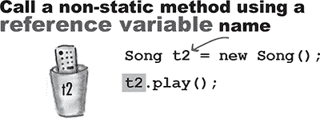

# 什么是具有静态方法的类

通常（尽管并非总是如此），具有静态方法的类不打算被实例化。在第八章《严肃的多态性》中，我们讨论了抽象类，并且标记一个类为**`abstract`**会使任何人无法在该类类型上使用“new”。换句话说，***无法实例化抽象类。***

但是你可以通过将构造函数标记为**`private`**来限制其他代码实例化一个*非*抽象类。记住，标记为私有的*方法*意味着只有类内的代码才能调用该方法。标记为私有的*构造函数*基本上意味着相同的事情——只有类内的代码才能调用构造函数。从*外部*类中不能使用“new”。这就是例如 Math 类的工作原理。构造函数是私有的；你不能创建 Math 的新实例。编译器知道你的代码不能访问那个私有构造函数。

这*并不*意味着具有一个或多个静态方法的类永远不应该被实例化。事实上，你将 main()方法放在的每个类中都是有一个静态方法的类！

通常，你会创建一个 main()方法，以便可以启动或测试另一个类，几乎总是通过在 main 中实例化一个类，然后调用该新实例的方法。

因此，你可以自由地在一个类中组合静态和非静态方法，尽管即使有一个单独的非静态方法，也必须有*某种*方法来创建类的实例。获取新对象的唯一方法是通过“new”或反序列化（或称为 Java 反射 API 的东西，我们不深入讨论）。没有其他方式。但*谁*说 new 可能是一个有趣的问题，我们稍后在本章中会详细讨论。

# 静态方法也不能使用非静态（实例）变量！

静态方法在不知道静态方法类的任何特定实例的情况下运行。正如你在前几页看到的，可能甚至*没有*那个类的任何实例。由于静态方法是使用*类*（***Math***.random()）而不是*实例引用*（***t2***.play()）来调用的，静态方法不能引用类的任何实例变量。静态方法不知道使用哪个实例的变量值。

**如果你尝试编译这段代码：**

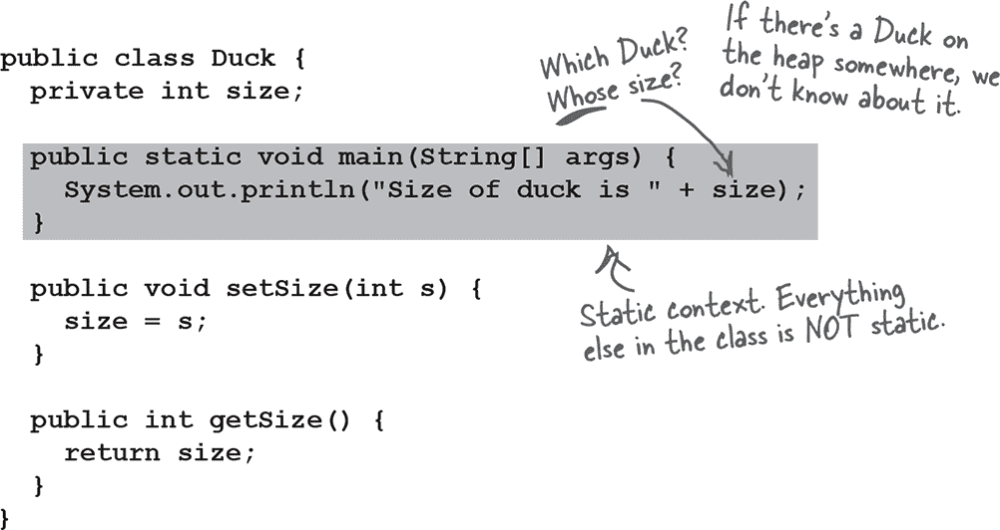

**你将会得到这个错误：**

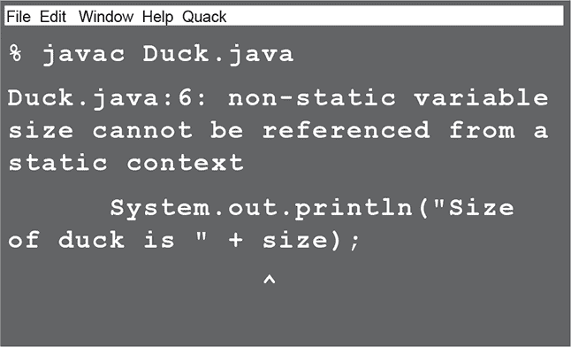

###### 注意

如果你尝试在静态方法内部使用实例变量，编译器会认为：“我不知道你在说哪个对象的实例变量！”如果堆上有十个 Duck 对象，静态方法对任何一个都不了解。

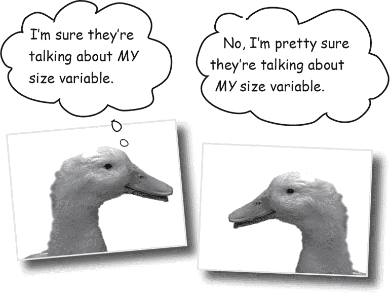

# 静态方法也不能使用非静态方法！

非静态方法通常用实例变量状态来影响方法的行为。***它们通常使用实例变量状态来影响方法的行为。*** 一个 `getName()` 方法返回 `name` 变量的值。谁的名字？调用 `getName()` 方法的对象的名字。

**这不会编译：**

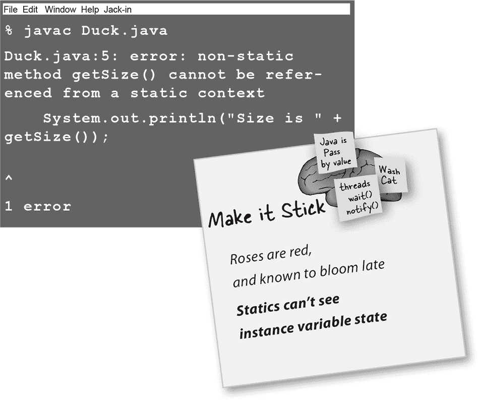

# 静态变量：对于类的所有实例都是相同的值

假设你想在程序运行时计算创建的 Duck 实例数。你会怎么做？也许是一个在构造函数中递增的实例变量？

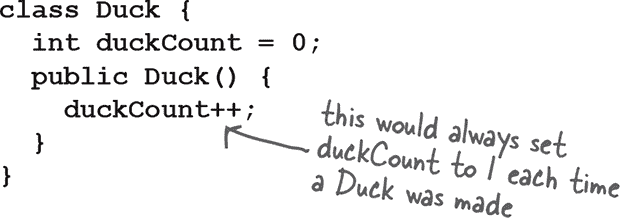

不，那行不通，因为`duckCount`是一个实例变量，并且每个鸭子的初始值都是 0。你可以尝试在其他类中调用一个方法，但那样有些笨拙。你需要一个只有一个副本的类变量，而所有实例共享这一个副本。

这就是静态变量能带给你的东西：一个所有类实例共享的值。换句话说，一个*类*只有一个值，而不是一个*实例*一个值。

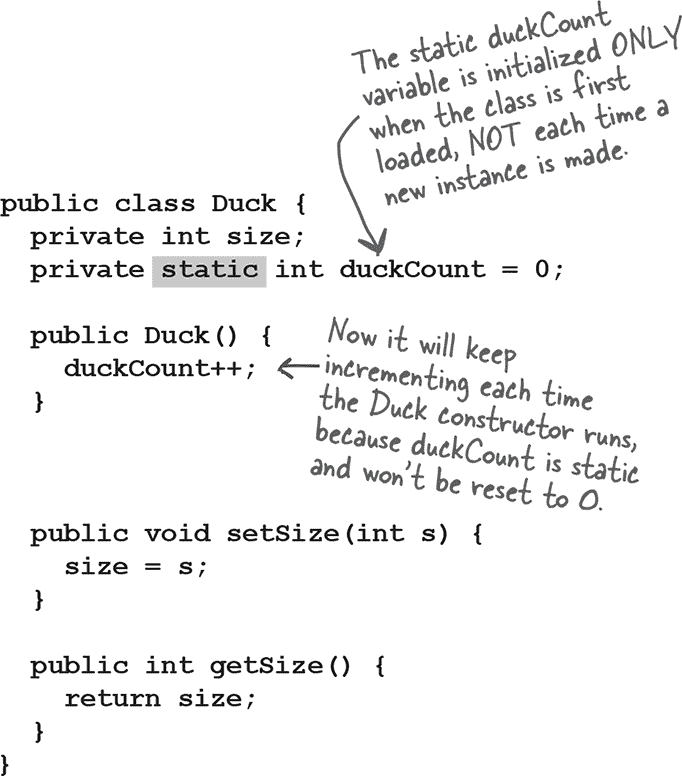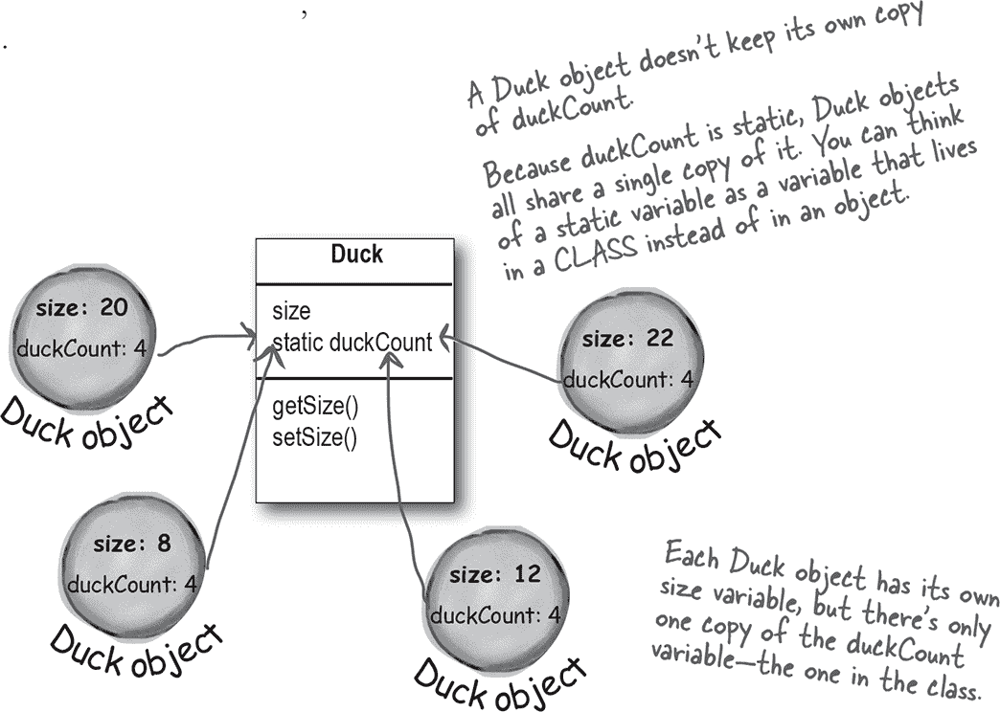

**静态变量是共享的。**

**同一个类的所有实例共享静态变量的单个副本。**

实例变量：每个**实例**一个

静态变量：每个**类**一个

## 初始化静态变量

当*加载类*时，静态变量会被初始化。JVM 决定何时加载类。通常，JVM 加载一个类是因为有人试图首次创建该类的一个新实例，或使用该类的静态方法或变量。作为程序员，你也可以选择告诉 JVM 加载一个类，但你不太可能需要这样做。在几乎所有情况下，最好让 JVM 决定何时*加载*类。

并且静态初始化有两个保证：

+   类中的静态变量在该类的任何*对象*创建之前初始化。

+   类中的静态变量在类的任何*静态方法*运行之前初始化。

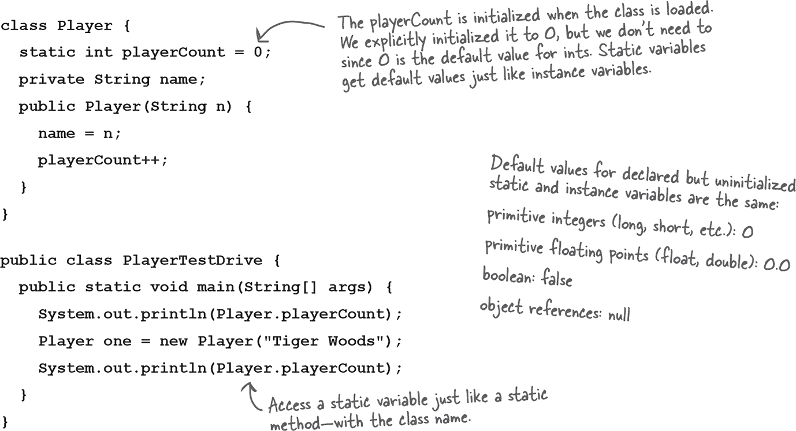

如果你不显式初始化一个静态变量（在声明时给它赋值），它会得到一个默认值，所以 int 变量会被初始化为零，这意味着我们不需要显式地说 `playerCount = 0`。声明但不初始化静态变量意味着静态变量会得到该变量类型的默认值，就像实例变量在声明时得到默认值一样。

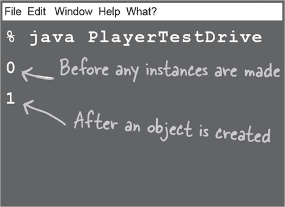

# `static final` 变量是常量

被标记为**`final`**的变量意味着一旦初始化就不能更改。换句话说，静态 final 变量的值在类加载时会保持不变。在 API 中查找 `Math.PI`，你会发现：

```
public static final double PI = 3.141592653589793;
```

变量被标记为**`public`**，以便任何代码都可以访问它。

变量被标记为**`static`**，因此你不需要 Math 类的实例（记住，你是不允许创建的）。

变量被标记为**`final`**，因为在 Java 看来 PI 不会改变。

没有其他方法可以将变量指定为常量，但有一种命名约定可以帮助你识别常量。***常量变量通常全大写！***

**初始化一个*final*静态变量：**

+    **在你声明它的时候：**

    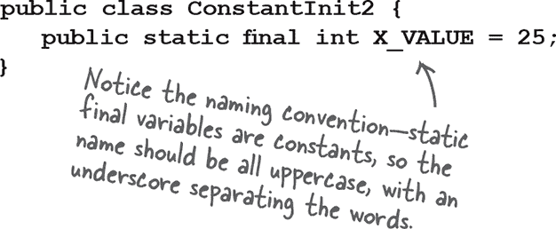

    **或**

+    **在静态初始化器中：**

    

**如果你没有在这两个地方给最终变量赋值：**

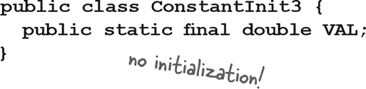

**编译器将捕获它：**

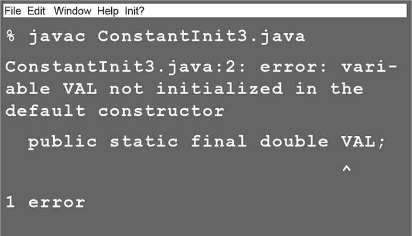

# final 不仅适用于静态变量...

你可以使用关键字**`final`**来修改非静态变量，包括实例变量、局部变量，甚至方法参数。在每种情况下，它的意思是一样的：该值无法被改变。但你也可以使用 final 来阻止某人重写一个方法或创建一个子类。

**非静态最终变量**

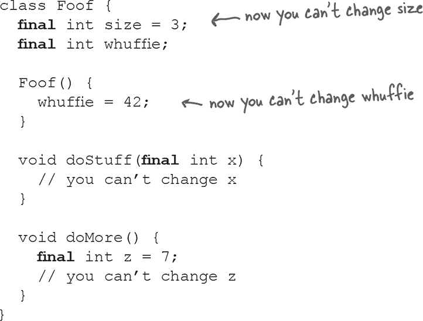

**最终方法**

```
class Poof {
  final void calcWhuffie() {
    // important things
    // that must never be overridden
  }
}
```

**最终类**

```
final class MyMostPerfectClass {
   // cannot be extended
}
```

> **最终变量意味着你不能改变它的值。**
> 
> **最终方法意味着你无法重写这个方法。**
> 
> **最终类意味着你不能扩展这个类（即不能创建一个子类）。**


 答案在“磨尖你的铅笔”中。

# Math 方法

现在我们知道静态方法是如何工作的，让我们来看看 Math 类中的一些静态方法。这并不是全部，只是一些亮点。查阅你的 API 以获取包括 cos()、sin()、tan()、ceil()、floor()和 asin()在内的其余方法。


**Math.abs()**

返回一个 double，该值是参数的绝对值。该方法是重载的，因此如果传入 int，它返回 int；传入 double，它返回 double。

```
int x = Math.abs(-240);      // returns 240
double d = Math.abs(240.45); // returns 240.45
```

**Math.random()**

返回一个介于（包括）0.0 到（但不包括）1.0 之间的 double。

```
double r1 = Math.random();
int r2 = (int) (Math.random() * 5);
```

###### 注意

到目前为止，我们一直在使用这种方法，但也有 java.util.Random，它更好用一些。

**Math.round()**

返回一个四舍五入到最接近整数值的 int 或 long（取决于参数是 float 还是 double）。

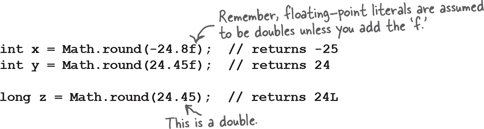

**Math.min()**

返回两个参数中的最小值。该方法被重载以接受 int、long、float 或 double。

```
int x = Math.min(24,240);               // returns 24
double y = Math.min(90876.5, 90876.49); // returns 90876.49
```

**Math.max()**

返回两个参数中的最大值。该方法被重载以接受 int、long、float 或 double。

```
int x = Math.max(24,240);               // returns 240
double y = Math.max(90876.5, 90876.49); // returns 90876.5
```

**Math.sqrt()**

返回参数的正平方根。该方法接受一个 double，当然你可以传入任何适合 double 类型的内容。

```
double x = Math.sqrt(9);    //return 3
double y = Math.sqrt(42.0); // returns 6.48074069840786
```

# 包装一个基本类型

有时你希望将一个基本类型视为对象。例如，像 ArrayList 这样的集合只能与对象一起使用：


每种原始类型都有一个包装类，由于这些包装类位于 java.lang 包中，您不需要导入它们。您可以通过每个包装类的命名来识别它们，每个包装类的命名都是以它包装的原始类型命名的，但是第一个字母大写以遵循类命名约定。

哦对了，因为绝对没有人能确切知道的原因，API 设计者决定不将原始类型的名称*完全*映射到类类型。您会明白我们的意思：

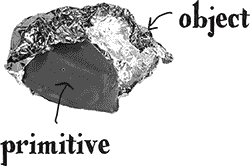

###### 注意

当您需要像对象一样对待原始类型时，请将其包装起来。


注意：顶部的图片是包装在箔纸中的巧克力。懂了吗？包装器？有些人认为它看起来像烤土豆，但那也可以。


# Java 将为您自动装箱原始类型

在“古老的时代”（Java 5 之前），我们必须手动包装和解包原始类型。幸运的是，现在这一切都*自动*完成了。

让我们看看当我们想要创建一个 ArrayList 来保存整数时会发生什么。

**一个包含原始整数的 ArrayList**


# 自动装箱几乎在所有地方都起作用

自动装箱不仅让您可以进行明显的包装和解包以在集合中使用原始类型...它还允许您在几乎任何期望使用其中一个的地方使用原始类型或其包装器类型。想想看！

**自动装箱的乐趣**

| **方法参数** 如果方法接受一个包装器类型，您可以传递一个包装器的引用或匹配类型的原始值。当然反过来也成立——如果方法接受一个原始类型，您可以传递一个兼容的原始值或该原始类型的包装器的引用。 |  |
| --- | --- |
| **返回值** 如果方法声明了原始返回类型，您可以返回与之兼容的原始值或该原始类型的包装器的引用。如果方法声明了包装器返回类型，您可以返回与之匹配的包装器类型的引用或匹配类型的原始值。 |  |
| **布尔表达式** 任何需要布尔值的地方，您都可以使用一个计算结果为布尔值的表达式（例如 4 > 2），一个原始布尔值，或者一个 Boolean 包装器的引用。 | 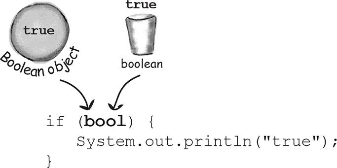 |

| **数字操作** 这可能是最奇怪的一点——是的，您可以在期望原始类型的操作中使用包装器类型作为操作数。这意味着您可以对一个 Integer 对象的引用应用增量运算符！

但不用担心——这只是一个编译器技巧。语言没有修改使运算符在对象上工作；编译器只是在操作之前将对象转换为其原始类型。尽管看起来确实很奇怪。

Integer i = new Integer(42); i++;

这意味着您也可以做一些事情，比如：

Integer j = new Integer(5); Integer k = j + 3; |  |

| **赋值** 你可以把一个包装类或原始类型赋给一个声明为匹配的包装类或原始类型的变量。例如，一个原始 int 变量可以赋给一个 Integer 引用变量，反之亦然——可以把一个 Integer 对象的引用赋给一个声明为 int 原始类型的变量。 | 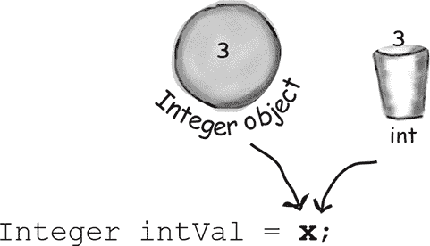 |
| --- | --- |

 **由你来解决。**

# 但等等！还有更多！包装类也有静态实用方法！

除了像普通类一样运行外，包装类还有许多非常有用的静态方法。

例如，*parse*方法接受一个字符串并返回一个原始值。

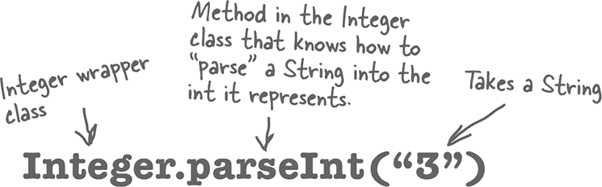

**把一个字符串转换成原始值很容易：**

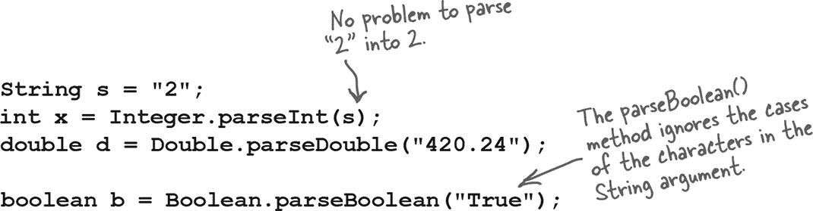

**但如果你尝试这样做：**


**你将会得到一个运行时异常：**


**每个解析字符串的方法或构造函数都可能抛出 NumberFormatException**。这是一个运行时异常，所以你不必处理或声明它。但你可能会想要处理它。

（我们将在第十三章讨论异常，*风险行为*。）

# 现在反过来...把原始数值转换成字符串

你可能想把一个数字转换成字符串，比如当你想向用户显示这个数字或将它放入消息中时。有几种方法可以把一个数字转换成字符串。最简单的方法是简单地将数字与现有字符串连接起来。


# 数字格式化

在 Java 中，格式化数字和日期不必与 I/O 耦合。想想看。向用户显示数字的最典型方式之一是通过 GUI。你把字符串放入一个滚动文本区域，或者可能是一个表格。如果格式化仅仅内建到打印语句中，你永远不能把一个数字格式化成一个漂亮的字符串以显示在 GUI 中。

Java API 提供了强大灵活的格式化功能，使用 java.util 中的 Formatter 类。但通常你不需要自己创建和调用 Formatter 类上的方法，因为 Java API 在一些 I/O 类（包括 printf()）和 String 类中提供了便利方法。所以只需调用一个静态的 String.format()方法，并传入要格式化的内容以及格式化指令就可以了。

当然，你需要知道如何提供格式化指令，这需要一点努力，除非你熟悉 C/C++中的***printf()***函数。幸运的是，即使你*不*了解 printf()，你也可以简单地按照本章展示的最基本的东西的配方。但如果你想要混搭以获取*任何*你想要的东西，你*会*想要学习如何格式化。

我们从一个基本示例开始，然后看看它是如何工作的。（注意：我们将在第十六章，*保存对象*中再次讨论格式化。）

**通过下划线使大数字更易读，一个快速的绕路**

在我们深入讨论数字格式化之前，让我们进行一个小而有用的绕路。有时候，你会想要声明带有大初始值的变量。让我们看看分配相同大值（十亿）给长整型变量的三个声明：


**为数字添加逗号格式**


# 格式化解析...

在最基本的级别上，格式化包括两个主要部分（还有更多，但我们将从这里开始，以保持更清晰）：

+    **格式化说明**

    你使用特殊的格式说明符来描述参数应该如何格式化。

+    **要格式化的参数。**

    虽然可能有多个参数，但我们将从一个开始。参数类型不能仅仅是*任何东西*……它必须是能够使用格式指示中的格式说明符进行格式化的东西。例如，如果你的格式说明指定*浮点数*，你不能传入一只狗，甚至是看起来像浮点数的字符串。

    

**这些说明实际上说了什么？**

“取此方法的第二个参数，并将其格式化为**十**进制整数，并插入**逗号**。”

**他们是怎么说的？**

在下一页中，我们将更详细地查看语法“%，d”实际上意味着什么，但首先，任何时候在格式字符串（始终是 format()方法的第一个参数）中看到百分号（%）时，请认为它代表一个变量，而这个变量是方法的另一个参数。百分号后面的其余字符描述了参数的格式化说明。

###### 注意

注意：如果你已经了解了来自 C/C++的 printf()，可能只需略过接下来的几页。否则，请仔细阅读！

# 百分号（%）表示：“在这里插入参数”（并使用这些说明进行格式化）

format()方法的第一个参数称为格式字符串，实际上它可以包含你只想原样打印的字符，而无需额外的格式化。不过，当你看到%符号时，认为百分号代表方法的另一个参数。

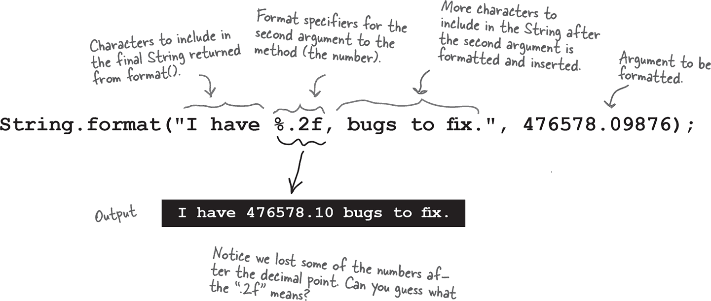

“%”符号告诉格式化程序在此处插入方法的另一个参数（format()的第二个参数，即数字），并使用在百分号后的“.2f”字符进行格式化。然后将格式字符串的其余部分“bugs to fix”添加到最终输出。

**添加逗号**


# 格式字符串使用其自己的小语言语法

显然，你不能在“%”符号后面随便放什么东西。紧随百分号后的语法遵循非常具体的规则，并描述了在结果（格式化）字符串中插入的参数如何格式化。

你已经看过一些例子了：

**%,d** 表示“插入逗号并将数字格式化为十进制整数。”

和

**%.2f** 表示“将数字格式化为具有两位小数的浮点数。”

和

**%,.2f** 表示“插入逗号并将数字格式化为具有两位小数的浮点数。”

实际上问题是：“我怎么知道在百分号后面放什么才能让它做我想要的事情？”这包括知道符号（如“d”表示十进制和“f”表示浮点数）以及必须在百分号后放置说明的顺序。例如，如果你在“d”后面放逗号，像“%d,” 而不是“%,d”，它是行不通的！

或者呢？你认为这会做什么：

```
String.format("I have %.2f, bugs to fix.", 476578.09876);
```

（我们将在下一页回答这个问题。）

# 格式说明符

百分号后的一切，直到并包括类型指示符（如“d”或“f”），都是格式化说明的一部分。在类型指示符之后，格式化程序假定下一组字符应该是输出字符串的一部分，直到或除非它遇到另一个百分号（%）符号。嗯...这可能吗？你能有多个格式化参数变量吗？暂时把这个想法放一放；我们几分钟后再来讨论。现在，让我们看看格式说明符的语法——在百分号（%）后面的描述如何格式化参数。

**格式说明符最多可以有五个不同的部分（不包括“%”）。方括号 [ ] 中的所有内容都是可选的，因此只有百分号（%）和类型是必需的。但是顺序也是强制的，因此您使用的任何部分必须按照这个顺序排列。**

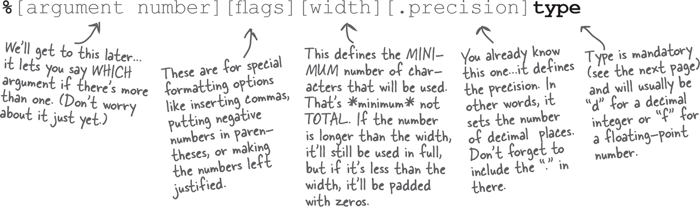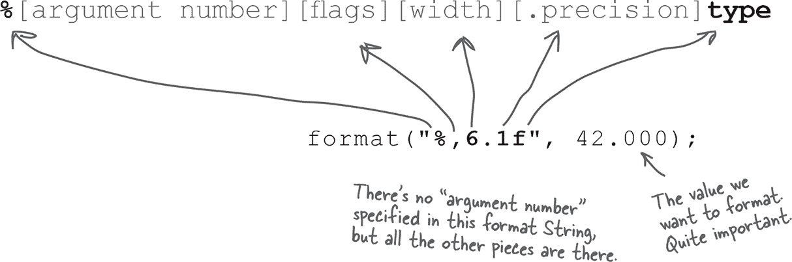

# 唯一必需的说明符是 TYPE

虽然类型是唯一必需的说明符，但要记住，如果你确实添加了其他内容，类型必须始终放在最后！有十多种不同的类型修饰符（不包括日期和时间；它们有自己的一套），但大多数时候你可能会使用 %d（十进制）或 %f（浮点数）。通常你会将 %f 与精度指示器组合，以设置你想要的输出中的小数位数。

**TYPE 是强制的，其他都是可选的。**


###### 注意

在你的格式指令中必须包含一个类型，如果除了类型还指定其他内容，则类型必须始终放在最后。大多数情况下，你可能会使用“d”表示十进制或“f”表示浮点数来格式化数字。

参数必须是 byte、short、char 或 int（包括基本类型和包装类型）。

# 如果我有多个参数会发生什么？

想象一下你想要一个看起来像这样的字符串：

“排名是***20,456,654***，总数是***100,567,890.24***。”

但数字是来自变量。你怎么办？在格式字符串（第一个参数）后面简单地添加*两个*参数，这意味着你的 format() 调用将有三个参数而不是两个。在这个第一个参数（格式字符串）中，你将有两个不同的格式化指定符（两个以“%”开头的东西）。第一个格式化指定符将插入方法的第二个参数，而第二个格式化指定符将插入方法的第三个参数。换句话说，格式字符串中的变量插入使用其他参数传递给 format() 方法的顺序。

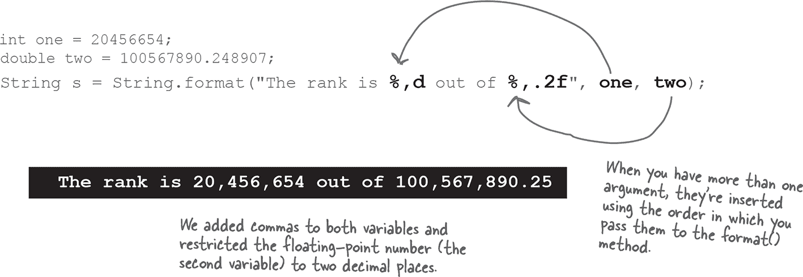

当我们讨论日期格式化时，你会看到，你可能确实想要对同一个参数应用不同的格式化指定符。在看到*日期*格式化（与我们之前做的*数字*格式化不同）是如何工作之前，这可能很难想象。只需知道一分钟后，你将看到如何更具体地指定哪些格式化指定符应用于哪些参数。

# 只剩最后一件事……静态导入

静态导入实际上是一种真正的利弊并存。有些人喜欢这个想法，有些人讨厌。静态导入的存在是为了让你的代码稍微变短一些。静态导入的缺点是，如果不小心使用，它们会使你的代码更难阅读。

基本思想是，每当你使用静态类、静态变量或枚举（稍后详细介绍），你都可以导入它们，节省一些输入。

**没有静态导入：**

```
class NoStatic {

  public static void main(String[] args) {

    **System**.out.println("sqrt " + **Math**.sqrt(2.0));

    **System**.out.println("tan " + **Math**.tan(60));
  }
}
```

**使用静态导入的相同代码：**


###### 注意

谨慎使用：静态导入可能会使你的代码变得难以理解。在使用静态导入后，一定要重新阅读你的代码并思考：“六个月后我还能理解这个吗？”

# Fireside Chats


今晚的讨论主题：**实例变量针对静态变量出手**

| 实例变量 | 静态变量 |
| --- | --- |
| 我甚至不知道我们为什么要这样做。每个人都知道静态变量只用于常量。那有多少常量？我觉得整个 API 只有四个？而且也没人真正用它们。 |  |
|  | 你真应该核实你的事实。你上次查看 API 是什么时候？它简直是静态变量的天下！甚至还有专门用来保存常量值的整个类。例如，有一个叫做 SwingConstants 的类，里面全是这些东西。 |
| 说得太对了。是啊，你可以再说一遍。好吧，Swing 库中确实有一些，但每个人都知道 Swing 只是一个特例。 |  |
|  | 这可能是一个特殊情况，但确实非常重要！那么 Color 类呢？如果你要记住 RGB 值来制作标准颜色，那真是太麻烦了！但是 Color 类已经为蓝色、紫色、白色、红色等定义了常量。非常方便。 |
| 好吧，但除了一些 GUI 的东西，给我举个任何人实际会用到的静态变量的例子。在现实世界中。 |  |
|  | 那 System.out 怎么样？System.out 中的 out 是 System 类的静态变量。你个人不会创建 System 的新实例；你只需请求 System 类的 out 变量。 |
| 好吧，那是另一种特殊情况。反正除了调试，也没人会用到它。 |  |
|  | 哦，调试不重要吗？而且还有一件事你可能从未想过——静态变量更高效。每个类只需要一个，而不是每个实例一个。这可能节省大量内存！ |
| 嗯，你难道忘了什么吗？ |  |
|  | 什么？ |
| 静态变量是完全不符合面向对象的最糟糕的东西！天哪，干嘛不退后一步，重新学习一些过程化编程呢。 |  |
|  | 你说什么*非*-面向对象？ |
| 你就像一个全局变量，任何值得拥有贴满贴纸的笔记本电脑的程序员都知道，通常这不是一个好事情。 |  |
|  | 我不是全局变量。根本就不存在这种东西。我生活在一个类中！这非常符合面向对象，你知道，一个类。我不是仅仅坐在某个地方；我是对象状态的自然组成部分；唯一的区别是我被所有类的实例共享。非常高效。 |
| 是的，你生活在一个类中，但他们不会称之为*类*-导向编程。那只是愚蠢。你是个遗留物。帮助老程序员们跨入 Java 的工具。 |  |
|  | 好了，就在那停下。那绝对不是真的。某些静态变量对系统至关重要。即使那些并非必不可少的也确实非常方便。 |
| 好吧，确实偶尔这样做有意义，但让我告诉你，滥用静态变量（和方法）是一个不成熟的面向对象程序员的标志。设计者应该考虑*对象*状态，而不是*类*状态。 |  |
|  | 你为什么这么说？静态方法有什么问题？ |
| 静态方法是所有最糟糕的东西，因为这通常意味着程序员在考虑程序化，而不是根据对象独特的对象状态进行操作。 |  |
|  | 当然，我知道对象应该是面向对象设计的重点，但只因为有些不明事理的程序员存在...不要因婴儿般的字节码而弃之不顾。静态变量确实有其使用的时机和场合，而且当你需要它时，没有什么能代替它。 |
| 是啊，你需要告诉自己什么。 |  |

# 练习


## 做成编译器


**本页上的 Java 文件代表一个完整的程序。你的任务是扮演编译器，确定这个文件是否会编译。如果不能编译，你如何修复它？当它运行时，它的输出是什么？**

```
class StaticSuper {
  static {
    System.out.println("super static block");
  }

  StaticSuper () {
    System.out.println("super constructor");
  }
}

public class StaticTests extends StaticSuper {
  static int rand;

  static {
    rand = (int) (Math.random() * 6);
    System.out.println("static block " + rand);
  }

  StaticTests() {
    System.out.println("constructor");
  }

  public static void main(String[] args) {
    System.out.println("in main");
    StaticTests st = new StaticTests();
  }
}
```

哪一个是输出？

**可能的输出**


**可能的输出**


 **答案在“BE the compiler”中。**

本章探讨了 Java 静态世界的奇妙之处。你的任务是判断以下每个陈述是真还是假。

## 真还是假


1.  要使用 Math 类，第一步是创建它的一个实例。

1.  你可以用关键字**`static`**标记一个构造方法。

1.  静态方法无法访问“this”对象的实例变量状态。

1.  使用引用变量调用静态方法是个好习惯。

1.  静态变量可以用来计算类的实例数。

1.  构造函数在静态变量初始化之前被调用。

1.  MAX_SIZE 是一个静态 final 变量的好名称。

1.  静态初始化块在类的构造函数运行之前运行。

1.  如果一个类被标记为 final，它的所有方法必须被标记为 final。

1.  仅当其类被扩展时，最终方法才能被覆盖。

1.  布尔原语没有包装类。

1.  当你想把原始类型像对象一样对待时，使用包装器是个好方法。

1.  parseXxx 方法总是返回一个字符串。

1.  （与 I/O 无关的）格式化类位于 java.format 包中。

 **答案在“True or False”中。**

# 练习解答

## 磨你的铅笔

（来自“Sharpen your pencil”）


1、4、5 和 6 是合法的。

2 无法编译，因为静态方法引用了非静态实例变量。

3 无法编译，因为实例变量是 final 的，但尚未初始化。

## BE the compiler

（来自“BE the compiler”）

```
StaticSuper () {
  System.out.println(
    "super constructor");
}
```

StaticSuper 是一个构造函数，必须在其签名中有( )。请注意，如下面的输出所示，两个类的静态块都在任何构造函数运行之前运行。


## 真还是假

（来自“True or False”）

|

1.  要使用 Math 类，第一步是创建它的一个实例。

| **错误** |
| --- |

|

1.  你可以用关键字“static”标记一个构造函数。

| **错误** |
| --- |

|

1.  静态方法无法访问对象的实例变量。

| **正确** |
| --- |

|

1.  使用引用变量调用静态方法是一个好习惯。

| **错误** |
| --- |

|

1.  静态变量可以用来计算类的实例数。

| **正确** |
| --- |

|

1.  构造函数在静态变量初始化之前被调用。

| **错误** |
| --- |

|

1.  MAX_SIZE 是一个静态 final 变量的好名称。

| **正确** |
| --- |

|

1.  静态初始化块在类的构造函数运行之前运行。

| **正确** |
| --- |

|

1.  如果一个类被标记为 final，那么它的所有方法都必须被标记为 final。

| **假** |
| --- |

|

1.  只有在其类被扩展时，最终方法才能被覆盖。

| **假** |
| --- |

|

1.  布尔原始类型没有包装类。

| **假** |
| --- |

|

1.  当你想要将原始类型像对象一样对待时，会使用包装器。

| **真** |
| --- |

|

1.  解析 Xxx 方法总是返回一个字符串。

| **假** |
| --- |

|

1.  格式化类（与 I/O 分离）位于 java.format 包中。

| **假** |
| --- |
