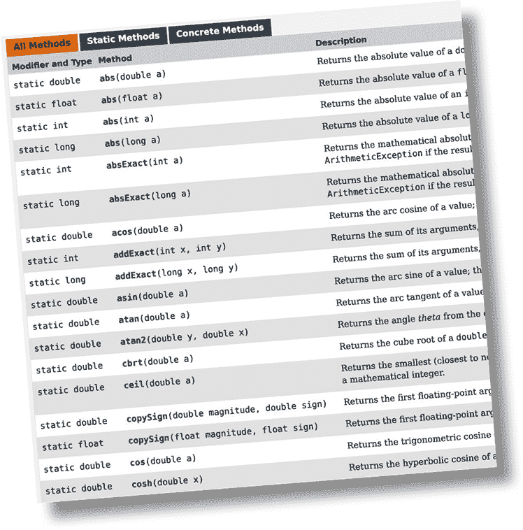
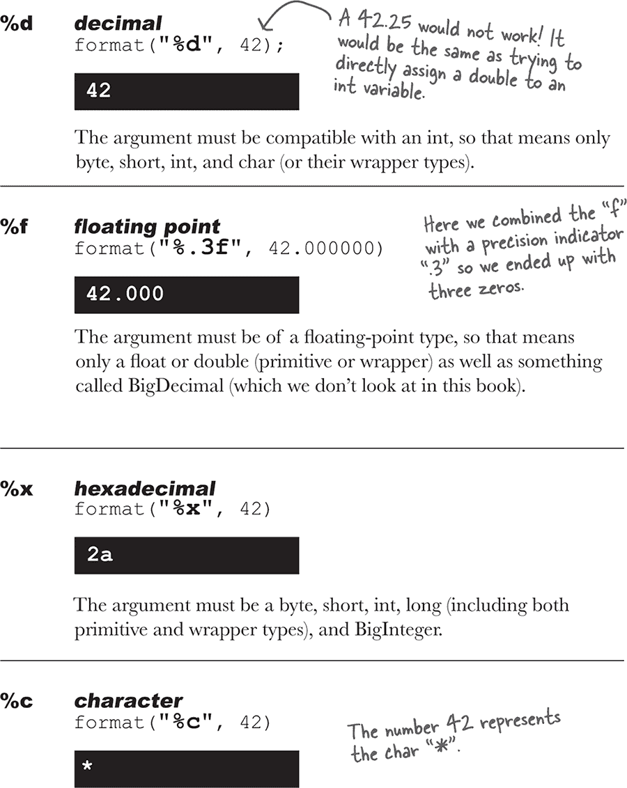

# 第十章：数字很重要：数字和静态方法


**做数学运算。** 但与仅仅进行基本算术运算不同，使用数字还有更多的技巧。你可能想要获取一个数的绝对值，或者四舍五入一个数，或者找出两个数中较大的那个。你可能希望你的数字打印时保留两位小数，或者你可能想在大数字中插入逗号以便更易于阅读。还有将字符串解析为数字呢？或者将数字转换为字符串？总有一天你会想把一堆数字放进像只接受对象的 ArrayList 这样的集合中。你真是幸运。Java 和 Java API 中充满了方便的数字调整功能和方法，可以随时使用，而且使用起来非常简单。但大多数方法都是**静态的**，因此我们将从学习变量或方法被声明为静态的含义开始，包括 Java 中的常量，也称为静态*final*变量。

# MATH 方法：你能接触到的最接近*全局*方法

除了在 Java 中没有全局的*任何东西*。但是想想这个：如果你有一个方法，其行为不依赖于实例变量值。例如 Math 类中的 round()方法。每次都会执行相同的操作——将浮点数（作为方法参数）四舍五入到最接近的整数。每次都是这样。如果你有 10,000 个 Math 类的实例，并且运行 round(42.2)方法，你会得到一个整数值 42。换句话说，该方法作用于参数，但不受实例变量状态的影响！唯一改变 round()方法运行方式的是传递给方法的参数！

将类 Math 的实例化仅仅为了运行 round()方法看起来是在浪费堆空间。那么其他的 Math 方法呢，比如 min()，它接受两个数值型参数并返回较小的那个呢？或者 max()？或者 abs()，它返回一个数的绝对值。

***这些方法从不使用实例变量值***。事实上，Math 类*没有*任何实例变量。因此创建 Math 类的实例没有任何意义。因此，你不必这样做。事实上，你也做不到。

**如果你尝试创建 Math 类的实例：**

```
ArrayList<String> songs = new ArrayList<String>();
```

**你会得到这个错误：**


###### 注意

Math 类中的方法不使用任何实例变量值。由于这些方法是“静态”的，你不需要创建 Math 类的实例。你只需要 Math 类本身。


# 静态方法与常规（非静态）方法的区别

Java 是面向对象的，但偶尔你会遇到一个特殊情况，通常是一个实用方法（如 Math 方法），在这种情况下，没有必要创建类的实例。关键字**`static`**允许一个方法在***没有类的实例***的情况下运行。静态方法意味着“行为不依赖于实例变量，因此不需要实例/对象。只需要类本身。”


# 拥有具有静态方法的类意味着什么

通常（虽然不总是），一个具有静态方法的类并不意味着要被实例化。在第八章《严肃的多态性》中，我们谈到了抽象类，并且如何通过标记带有**`abstract`**修饰符的类，使得任何人都无法对该类类型说“new”。换句话说，***无法实例化抽象类***。

但是你可以通过将构造函数标记为**`private`**来限制其他代码实例化*非*抽象类。请记住，标记为 private 的*方法*意味着只有类内部的代码可以调用该方法。标记为 private 的*构造函数*基本上意味着相同的事情——只有类内部的代码可以调用构造函数。从*外部*类中没有人可以说“new”。这就是 Math 类的工作方式，例如。构造函数是私有的；你不能创建 Math 的新实例。编译器知道你的代码无法访问那个私有构造函数。

这并不意味着一个具有一个或多个静态方法的类永远不应该被实例化。事实上，你在其中放置了一个 main()方法的每个类都是一个具有静态方法的类！

通常，你会创建一个 main()方法，以便你可以启动或测试另一个类，几乎总是通过在 main 中实例化一个类，然后调用该新实例上的方法。

所以你可以自由地在一个类中组合静态方法和非静态方法，尽管即使一个非静态方法也意味着必须有某种方法来创建类的实例。获取新对象的唯一方法是通过“new”或反序列化（或称为 Java 反射 API 的某些东西，我们不深入讨论）。没有其他方法。但是到底*谁*说 new 可能是一个有趣的问题，我们稍后在本章会稍作讨论。

# 静态方法不能使用非静态（实例）变量！

静态方法在不知道静态方法的类的任何特定实例的情况下运行。正如你在前几页上看到的那样，可能甚至没有*任何*该类的实例。由于静态方法是使用*类*（***Math***.random()）而不是*实例引用*（***t2***.play()）调用的，静态方法不能引用类的任何实例变量。静态方法不知道要使用哪个实例的变量值。

**如果你试图编译这段代码：**


**你会得到这个错误：**


###### 注意

如果你试图在静态方法内部使用实例变量，编译器会认为：“我不知道你在说哪个对象的实例变量！”如果你在堆上有十个 Duck 对象，静态方法对它们一无所知。


# 静态方法也不能使用非静态方法！

非静态方法通常做什么？***它们通常使用实例变量状态来影响方法的行为。*** 一个 getName()方法返回 name 变量的值。谁的名字？用来调用 getName()方法的对象的名字。

**这段代码不会编译：**


# 静态变量：所有类实例的值都相同

想象一下，你想在程序运行时计算创建了多少个 Duck 实例。你会怎么做？也许是在构造函数中递增的实例变量？


不，这行不通，因为 duckCount 是一个实例变量，并且每个 Duck 的起始值都是 0。你可以尝试在其他类中调用一个方法，但那样太笨拙了。你需要一个类，只有一个变量的副本，并且所有实例共享这个副本。

这就是静态变量带给你的：一个所有类实例共享的值。换句话说，每个*类*有一个值，而不是每个*实例*有一个。


**静态变量是共享的。**

**同一个类的所有实例共享静态变量的单个副本。**

实例变量：每个**实例**有一个

静态变量：每个**类**有一个

## 初始化静态变量

当*加载*一个类时，静态变量被初始化。JVM 决定何时加载类。通常，JVM 加载一个类是因为有人试图首次创建类的新实例或使用类的静态方法或变量。作为程序员，你也可以选择告诉 JVM 加载一个类，但你不太可能需要这样做。在几乎所有情况下，最好让 JVM 决定何时*加载*类。

静态初始化有两个保证：

+   类中的静态变量在可以创建该类的*对象*之前初始化。

+   类中的静态变量在任何*静态方法*运行之前初始化。


如果你不显式初始化静态变量（在声明时给它赋值），它会得到一个默认值，所以 int 变量会初始化为零，这意味着我们不需要显式地写 playerCount = 0。声明但不初始化静态变量意味着静态变量会得到该变量类型的默认值，就像实例变量在声明时会得到默认值一样。


# 静态 final 变量是常量

变量标记为**`final`**意味着——一旦初始化，它永远不会改变。换句话说，静态 final 变量的值会在类加载期间保持不变。在 API 中查找 Math.PI，你会发现：

```
    new ArrayList<Song>()
    ```

变量标记为**`public`**，以便任何代码都可以访问它。

变量标记为**`static`**以便你不需要类 Math 的实例（记住，你不能创建它）。

变量标记为**`final`**因为在 Java 看来 PI 不会改变。

没有其他方法来指定变量为常量，但有一个命名约定可以帮助你识别。***常量变量名通常全大写！***

**初始化一个*最终*静态变量：**

+    **在你声明它的时候：**

    

    **或**

+    **在静态初始化器中：**

    

**如果你在这两个地方之一不给 final 变量赋值：**


**编译器将会捕获它：**


# final 不仅仅适用于静态变量...

你可以使用关键字**`final`**来修改非静态变量，包括实例变量、局部变量，甚至方法参数。在每种情况下，它的含义是一样的：值不能被改变。但你也可以使用 final 来阻止别人重写方法或创建子类。

**非静态最终变量**


**final method**

```
    List**<Song>**songList =
           new ArrayList**<Song>()**
    ```

**最终类**

```
    void foo(List**<Song>** list)

    x.foo(songList)
    ```

> **一个最终变量表示你不能改变它的值。**
> 
> **一个最终方法表示你不能覆盖这个方法。**
> 
> **一个最终类表示你不能扩展这个类（例如，你不能创建一个子类）。**


 **在 “磨刀” 中的答案。**

# Math 方法

现在我们知道了静态方法如何工作，让我们来看看 Math 类中的一些静态方法。这不是全部，只是一些亮点。查看你的 API 获取其余方法，包括 cos()，sin()，tan()，ceil()，floor()和 asin()。



**Math.abs()**

返回参数的绝对值。该方法重载，因此如果传入 int，则返回 int。传入 double，则返回 double。

```
**public class ArrayList**<String> **extends AbstractList**<String>**... {**

     **public boolean add(**String **o)**
     **// more code**
**}**
```

**Math.random()**

返回一个介于 0.0 到 1.0 之间（包括 0.0 但不包括 1.0）的 double 值。

```
**public**<T extends Animal> **void takeThing(ArrayList**<T> **list)**
```

###### 注意

到目前为止，我们一直在使用这个方法，但也有 java.util.Random，用起来更方便一些。

**Math.round()**

返回 int 或 long（取决于参数是 float 还是 double）的四舍五入最接近的整数值。


**Math.min()**

返回两个参数中的最小值。该方法重载以接受 int、long、float 或 double。

```
**public void takeThing(ArrayList**<Animal> **list)**
```

**Math.max()**

返回两个参数中的最大值。该方法重载以接受 int、long、float 或 double。

```
**public final class** String
    implements **java.io.Serializable,** Comparable<String>, **CharSequence {**
```

**Math.sqrt()**

返回参数的正平方根。该方法接受一个 double，但当然你可以传入任何适合 double 的值。

```
Comparator,
Comparable,
compareTo( ),
compare( ),
yes,
no
```

# 包装原始类型

有时候你希望像对象一样处理原始类型。例如，像 ArrayList 这样的集合只能使用对象：


每个原始类型都有一个包装类，由于包装类位于 java.lang 包中，你不需要导入它们。你可以识别包装类，因为每个包装类都以包装的原始类型命名，但首字母大写以遵循类命名约定。

哦对了，由于绝对没有人确定的原因，API 设计者决定不将原始类型的名称*完全*映射到类类型。你会明白我们的意思：


###### 注意

当你需要将原始类型视为对象时，进行包装。


注意：顶部的图片是一个包装在箔纸中的巧克力。明白了吗？包装？有些人认为它看起来像一个烤土豆，但那也可以。


# Java 会为你自动装箱原始类型

在古老的日子里（Java 5 之前），我们必须手动包装和解包原始类型。幸运的是，现在这一切都被*自动*完成了。

让我们看看当我们想要创建一个用于保存整数的 ArrayList 时会发生什么。

**一个包含原始整数的 ArrayList**


# 自动装箱几乎在任何地方都适用

自动装箱让你不仅可以做显而易见的包装和解包以在集合中使用原始类型...它还让你在任何需要原始类型或其包装类型的地方都可以使用其中之一。想想看！

**玩转自动装箱**

| **方法参数** 如果一个方法接受一个包装类型，你可以传递一个包装类型的引用或匹配类型的原始类型。当然反之亦然——如果一个方法接受一个原始类型，你可以传递一个兼容的原始类型或该原始类型的包装类型的引用。 |  |
| --- | --- |
| **返回值** 如果一个方法声明一个原始返回类型，你可以返回一个兼容的原始类型或该原始类型的包装类型的引用。如果一个方法声明一个包装返回类型，你可以返回一个包装类型的引用或匹配类型的原始类型。 |  |
| **布尔表达式** 任何需要布尔值的地方，你可以使用一个求值为布尔值的表达式（4 > 2），一个原始布尔值，或一个 Boolean 包装类型的引用。 |  |

| **数字运算** 这可能是最奇怪的一点—是的，你可以在期望原始类型的操作中使用包装类型作为操作数。这意味着你可以对一个 Integer 对象的引用应用递增运算符！

但别担心—这只是一个编译器技巧。语言并没有被修改以使运算符在对象上起作用；编译器只是在操作之前将对象转换为其原始类型。尽管看起来很奇怪。

Integer i = new Integer(42); i++;

这意味着你也可以做一些事情：

Integer j = new Integer(5); Integer k = j + 3; |  |

| **赋值** 你可以将包装类或基本类型分配给声明为匹配包装类或基本类型的变量。例如，原始 int 变量可以分配给 Integer 引用变量，反之亦然——可以将指向 Integer 对象的引用分配给声明为 int 基本类型的变量。 |  |
| --- | --- |

 **这是你要解决的问题。**

# 但等等！还有更多！包装类还有静态实用方法！

除了像普通类一样运行外，包装类还有一堆非常有用的静态方法。

例如，*parse*方法接受一个字符串，并返回一个原始值。


**将字符串转换为原始值很简单：**


**但如果你试图这样做：**


**你将会得到一个运行时异常：**


**每个解析字符串的方法或构造函数都可能抛出 NumberFormatException****。这是一个运行时异常，所以你不需要处理或声明它。但你可能希望这样做。**

（我们将在第十三章中讨论异常，*风险行为*。）

# 现在反过来…将原始数转换为字符串

例如，当你想要向用户显示这个数字或将其放入消息中时，可能会想要将数字转换为字符串。有几种方法可以将数字转换为字符串。最简单的方法是将数字简单地串联到现有字符串中。


# 数字格式化

在 Java 中，格式化数字和日期并不一定要与 I/O 耦合在一起。想想看。向用户显示数字的最典型方式之一是通过 GUI。你将字符串放入滚动文本区域，或者可能是一个表格。如果格式化只内置在打印语句中，你将永远无法将数字格式化为漂亮的字符串以在 GUI 中显示。

Java API 提供了强大而灵活的格式化功能，使用 java.util 中的 Formatter 类。但通常你不需要自己创建和调用 Formatter 类中的方法，因为 Java API 在一些 I/O 类（包括 printf()）和 String 类中提供了方便的方法。因此，只需调用一个静态的 String.format()方法，并传递你想要格式化的内容以及格式化指令，就可以轻松搞定。

当然，你确实需要知道如何提供格式化指令，这需要一点努力，除非你熟悉 C/C++中的***printf()***函数。幸运的是，即使你*不*知道 printf()，你也可以简单地遵循我们在本章中展示的最基本的事物的配方。但如果你想要混搭以获得*任何*你想要的东西，你*肯定*会想学会如何进行格式化。

我们从一个基本示例开始，然后看看它是如何工作的。（注意：我们将在第十六章中再次讨论格式化。）

**使用下划线使大数字更易读，一个快速的绕道**

在我们深入讨论格式化数字之前，让我们进行一个小而有用的绕道。有时您可能希望声明具有大初始值的变量。让我们看看三个声明，它们将相同的大值，十亿，分配给长整型原语：


**格式化数字以使用逗号**


# 格式化解析...

在最基本的级别上，格式化包含两个主要部分（还有更多，但我们将从这里开始以保持简洁）：

+    **格式化说明**

    使用特殊的格式说明符来描述参数应该如何格式化。

+    **要格式化的参数。**

    虽然可能会有多个参数，但我们将从一个开始。参数类型不能只是*任意的*…它必须是可以使用格式说明符进行格式化的内容。例如，如果你的格式化说明指定了*浮点数*，你不能传入一只狗，甚至是看起来像浮点数的字符串。

    

**这些说明实际上是在说什么？**

“将此方法的第二个参数作为**十进制整数（d）**格式化，并插入**逗号**。”

**他们是怎么说的？**

在下一页中，我们将更详细地看一下“%,d”语法实际上意味着什么，但首先，任何时候在格式字符串中看到百分号（%）时（这总是 format() 方法的第一个参数），将其视为表示变量，并且该变量是方法的另一个参数。百分号后面的其余字符描述了参数的格式化说明。

###### 注意

注意：如果你已经了解来自 C/C++ 的 printf()，可能只需快速浏览接下来的几页。否则，请仔细阅读！

# 百分号（%）表示，“在这里插入参数”（并使用这些说明格式化它）

format() 方法的第一个参数称为格式字符串，实际上它可以包含你希望原样打印的字符，无需额外格式化。但当你看到 % 符号时，将百分号视为一个变量，表示方法的另一个参数。


“%”符号告诉格式化程序在此处插入其他方法参数（format()的第二个参数，即数字），并使用百分号后的“.2f”字符格式化它。然后将格式字符串的其余部分“bugs to fix”添加到最终输出。

**添加逗号**


# 格式字符串使用自己的小语言语法。

显然你不能在“%”符号后面随便放东西。百分号后面的内容遵循非常具体的规则，描述如何格式化在结果（格式化后）字符串中插入的参数。

你已经看到一些例子：

**%,d** 表示“插入逗号并将数字格式化为十进制整数。”

和

**%.2f** 表示“将数字格式化为带有两位小数的浮点数。”

和

**%,.2f** 表示“插入逗号并将数字格式化为带有两位小数的浮点数。”

实际上问题是：“我怎么知道在百分号后面放什么才能让它按照我想要的方式工作？”这包括知道符号（比如“d”表示十进制，“f”表示浮点数）以及按照百分号后面必须放置指令的顺序。例如，如果你在“d”后面放逗号，像“%d,”而不是“%,d”，它就不会起作用！

或者呢？你认为这会做什么：

```
Collections.sort(myArrayList);
```

（我们将在下一页回答这个问题。）

# 格式说明符

百分号后面直到包括类型指示符（比如“d”或“f”）都是格式化指令的一部分。在类型指示符之后，格式化程序会假定下一组字符应该是输出字符串的一部分，直到或除非它遇到另一个百分号（%）符号。嗯...这甚至可能吗？你可以有多个格式化参数变量吗？暂时搁置这个想法；我们几分钟后会回到这个问题。现在，让我们看看格式说明符的语法——百分号（%）后面的内容，描述参数应该如何格式化。

**格式说明符最多可以有五个不同的部分（不包括“%”）。下面方括号中的所有内容都是可选的，所以只有百分号（%）和类型是必需的。但是顺序也是强制的，所以任何你使用的部分必须按照这个顺序。**


# 唯一必需的说明符是类型

虽然类型是唯一必需的说明符，但要记住，如果你确实放入其他内容，类型必须始终放在最后！有超过十几种不同的类型修饰符（不包括日期和时间；它们有自己的一套），但大多数情况下你可能会使用%d（十进制）或%f（浮点数）。通常你会将%f 与精度指示器结合使用，以设置输出中所需的小数位数。

**类型是必需的，其他所有内容都是可选的。**



###### 注意

你必须在格式说明中包含一个类型，如果你指定除了类型之外的东西，类型必须始终放在最后。大多数情况下，你可能会使用“d”表示十进制或“f”表示浮点数来格式化数字。

参数必须是字节、短整型、字符或整型（包括基本类型和包装类型）。

# 如果我有多个参数会发生什么？

想象一下你想要一个看起来像这样的字符串：

“排名是 ***20,456,654*** 在 ***100,567,890.24*** 之中。”

但是这些数字来自变量。您该怎么办？您只需在格式字符串（第一个参数）之后添加*两个*参数，这意味着您对 format() 的调用将有三个参数而不是两个。并且在第一个参数（格式字符串）内部，您将有两个不同的格式规范（以“%”开头的两个东西）。第一个格式规范将插入方法的第二个参数，第二个格式规范将插入方法的第三个参数。换句话说，在格式字符串中的变量插入使用传递给 format() 方法的其他参数的顺序。


当我们讨论日期格式化时，您会看到，您实际上可能希望对同一参数应用不同的格式化规范。在我们一直在做的*数字*格式化之外，*日期*格式化可能很难想象。只要知道，在一分钟内，您将看到如何更具体地指定哪些格式规范适用于哪些参数。

# 再说一件事……静态导入

静态导入真是一件利弊参半的事情。有些人喜欢这个想法，有些人讨厌它。静态导入的存在是为了让您的代码变短一点。如果您不喜欢打字或讨厌长行代码，您可能会喜欢这个功能。静态导入的缺点是，如果您不小心使用它们，它可能会使您的代码难以阅读。

基本思想是，每当您使用静态类、静态变量或枚举（稍后会详细介绍）时，您都可以导入它们，节省一些输入时间。

**没有静态导入：**

```
Collections.sort(myArrayList, myCompare);
myArrayList.sort(myCompare);
```

**相同代码，使用静态导入：**


###### 注意

使用时要小心：静态导入可能会使您的代码变得难以阅读。在使用静态导入后，始终重新阅读您的代码并思考：“我在六个月后还能理解这个吗？”

# 炉边谈话


今晚的演讲：**一个实例变量对静态变量进行便宜攻击**

| 实例变量 | 静态变量 |
| --- | --- |
| 我甚至不知道我们为什么要这样做。每个人都知道静态变量只用于常量。那么其中有多少个？我觉得整个 API 只有，什么，四个？而且也不像有人会用它们。 |  |
|  | 您真的应该查查您的事实。您上次查看 API 是什么时候？它充满了静态变量！甚至有整个类专门用来保存常量值。例如，有一个叫 SwingConstants 的类，里面全都是它们。 |
| 充满了。是的，你可以再说一遍。好吧，Swing 库中有几个，但是每个人都知道 Swing 只是一个特殊情况。 |  |
|  | 这可能是一个特例，但它确实非常重要！还有颜色类呢？如果你必须记住 RGB 值才能生成标准颜色，那该有多麻烦！但颜色类已经为蓝色、紫色、白色、红色等定义了常量。非常方便。 |
| 好吧，除了一些 GUI 的东西，给我举一个在真实世界中真正有人会使用的静态变量的例子。 |  |
|  | 那 System.out 怎么说？System.out 中的 out 是 System 类的静态变量。你个人不会创建 System 的新实例；你只需请求 System 类的其 out 变量。 |
| 好吧，这又是另一种特例。反正除了调试，也没人用它。 |  |
|  | 哦，像调试不重要似的？而且也有一件事可能从没进过你狭隘的脑海——承认吧，静态变量更高效。一个类只需一个，而不是每个实例一个。这可能带来巨大的内存节省！ |
| 呃，你不是忘了什么吗？ |  |
|  | 什么？ |
| 静态变量是非常不面向对象的！！天呐，我们干嘛不一下子退回到过程化编程呢。 |  |
|  | 你说的是什么 *非*面向对象吗？ |
| 你就像一个全局变量，任何值得贴了贴纸的笔记本电脑的程序员都知道，那通常是件坏事。 |  |
|  | 我可不是全局变量。根本不存在这种东西。我生活在一个类里！这相当面向对象，一个**类**。我并不是悬浮在空间中的某个东西；我是对象状态的自然组成部分；唯一的区别是我被所有类的实例共享。非常高效。 |
| 是的，你确实生活在一个类里，但他们并不称其为 *类*-导向编程。那简直愚蠢。你就是个遗物，帮助老手们迈向 Java 的东西。 |  |
|  | 好了好了，停下来。那绝对不对。有些静态变量对系统至关重要。而即使那些不是必不可少的，确实非常方便。 |
| 好吧，确实，偶尔使用静态方法是有道理的，但让我告诉你，滥用静态变量（和方法）是一个不成熟的面向对象程序员的标志。设计者应该思考*对象*状态，而不是*类*状态。 |  |
|  | 你为什么这么说？静态方法有什么问题？ |
| 静态方法是最糟糕的东西，因为通常意味着程序员在考虑过程化而不是基于对象状态的事物行为。 |  |
|  | 当然，我知道对象应该是面向对象设计的重点，但只因为有些无知的程序员……别因噎废食。静态变量有时是必需的，当你需要它时，没有什么比它更好的了。 |
| 对啊，你自己怎么说都行。 |  |

# 练习


## 做个编译器


**此页面上的 Java 文件代表一个完整的程序。您的任务是扮演编译器，判断这个文件是否能编译。如果不能，如何修复？当它运行时，输出是什么？**

```
songList.sort(new Comparator<SongV3>() {
  public int compare(SongV3 one, SongV3 two) {
    return one.getTitle().compareTo(two.getTitle());
  }
});
```

下面哪个是输出结果？

**可能的输出**


**可能的输出**


 **答案在 “BE the compiler”。**

本章探讨了 Java 中美妙而静态的世界。您的任务是判断以下每个语句是否为真或假。

## 真或假


1.  要使用 Math 类，第一步是实例化它。

1.  你可以用关键字“`static`”标记一个构造方法。

1.  静态方法无法访问“this”对象的实例变量状态。

1.  调用静态方法时使用引用变量是一种良好的实践。

1.  静态变量可以用来计算类的实例数量。

1.  构造方法在静态变量初始化之前被调用。

1.  MAX_SIZE 是一个静态 final 变量的良好命名。

1.  静态初始化块在类的构造方法运行之前执行。

1.  如果一个类被标记为 final，则其所有方法必须被标记为 final。

1.  一个 final 方法只有在其类被扩展时才能被重写。

1.  布尔原始类型没有包装类。

1.  当你想把原始类型作为对象处理时，可以使用包装类。

1.  parseXxx 方法总是返回一个字符串。

1.  格式化类（与 I/O 解耦）位于 java.format 包中。

 **答案在 “真或假”。**

# 练习解答

## 磨尖你的铅笔

（来源于 “磨尖你的铅笔”）


1, 4, 5 和 6 是合法的。

2 不会编译，因为静态方法引用了非静态实例变量。

3 不会编译，因为实例变量是 final 的但尚未初始化。

## BE the compiler

（来源于 “BE the compiler”）

```
songList.sort(titleCompare);
```

StaticSuper 是一个构造方法，必须在其签名中加入 ()。请注意，如下面的输出所示，两个类的静态块在任何构造方法运行之前运行。


## 真或假

（来源于 “真或假”）

|

1.  要使用 Math 类，第一步是实例化它。

| **False** |
| --- |

|

1.  你可以用关键字“`static`”标记一个构造方法。

| **False** |
| --- |

|

1.  静态方法无法访问对象的实例变量。

| **True** |
| --- |

|

1.  调用静态方法时使用引用变量是一种良好的实践。

| **False** |
| --- |

|

1.  静态变量可以用来计算类的实例数量。

| **True** |
| --- |

|

1.  构造方法在静态变量初始化之前被调用。

| **False** |
| --- |

|

1.  MAX_SIZE 是一个静态 final 变量的良好命名。

| **True** |
| --- |

|

1.  静态初始化块在类的构造方法运行之前执行。

| **True** |
| --- |

|

1.  如果一个类被标记为 final，那么它的所有方法必须被标记为 final。

| **错误** |
| --- |

|

1.  仅当它的类被扩展时，才能重写 final 方法。

| **错误** |
| --- |

|

1.  布尔原始类型没有包装类。

| **错误** |
| --- |

|

1.  当你想将原始类型像对象一样对待时，使用包装器。

| **正确** |
| --- |

|

1.  `parseXxx` 方法始终返回一个字符串。

| **错误** |
| --- |

|

1.  格式化类（与 I/O 解耦）位于 java.format 包中。

| **错误** |
| --- |
