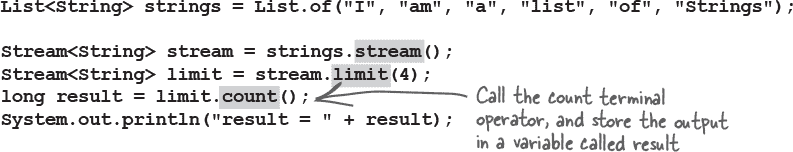
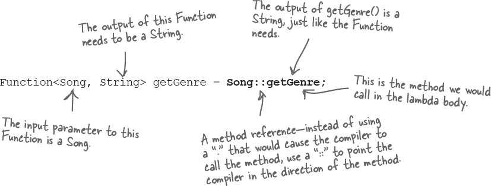
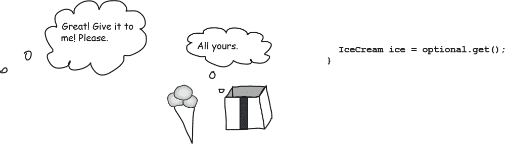
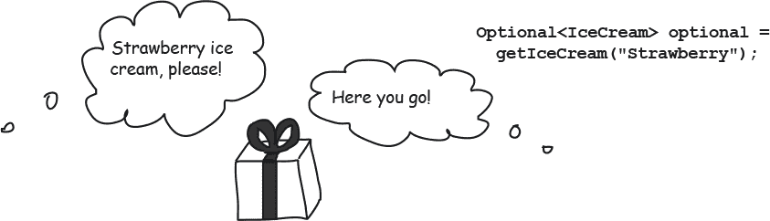
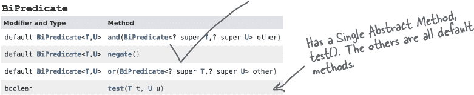

# 第十二章：Lambda 和 Stream：什么是，而不是如何：Lambda 和 Stream


**如果……你不需要告诉计算机如何做某事呢？** 编程涉及很多告诉计算机如何做某事的事情：**当** 这是真的 **时** 做这件事；**对于** 所有这些项目 **如果** 它看起来像这样 **然后** 做这个；等等。

我们还看到，我们不必完全依赖自己来完成所有事情。JDK 包含库代码，例如我们在上一章中看到的 Collections API，我们可以使用它来代替从头开始编写所有内容。这个库代码不仅仅局限于将数据放入集合中；还有一些方法可以为我们做一些常见的任务，因此我们只需告诉它们 **我们想要什么**，而不是 **如何** 做到这一点。

在本章中，我们将看一下流 API。您将看到当您使用流时，Lambda 表达式可以帮助您，您将学习如何使用流 API 来查询和转换集合中的数据。

# 告诉计算机你想要什么

想象一下你有一个颜色列表，你想打印出所有的颜色。你可以使用 for 循环来做到这一点。


但是在列表中对每个项目执行某些操作是一种非常普遍的需求。因此，我们可以从 Iterable 接口中调用 **`forEach`** 方法，而不是每次都创建一个 for 循环来执行“对于”列表中的每个项目的操作。请记住，List 实现了 Iterable 接口，因此它具有来自 Iterable 接口的所有方法。


###### 注意

**列表的 forEach 方法采用了 Lambda 表达式，我们在前一章中第一次看到它。这是一种方法，让您将行为（“按照这些说明执行”）传递给方法，而不是传递包含数据的对象（“这里有一个对象供您使用”）。**

# Fireside Chats


今晚的讲话：**for 循环和 forEach 方法在“哪个更好？”的问题上进行了激烈的辩论。**

| forEach() | for loop |
| --- | --- |
| 我是默认的！for 循环如此重要，以至于许多编程语言都有我。这是程序员学习的第一件事之一！如果有人需要循环一定次数来做某事，他们会拿出他们信赖的 for 循环。 |  |
|  | Pff。拜托。你太老了；这就是为什么你出现在所有的编程语言中。但事物在变化，语言在进化。有一种更好的方式。一种更现代的方式。我。 |
| 当然，时尚在变化。但有时它只是一时的风尚；事物也会过时。像我这样的经典将永远易于阅读和编写，即使是非 Java 程序员也是如此。 |  |
|  | 但看看开发者为了编写你需要做多少工作！他们必须控制何时开始、递增和停止循环，以及编写需要在循环内运行的代码。各种问题都可能出现！如果他们使用我，他们只需要考虑每个项目需要发生什么，不必担心如何循环来找到每个项目。 |
| 太多工作了？哈！开发者不怕一点点语法来清楚地指定要做什么和如何做。至少通过我的代码，读者可以清楚地看到发生了什么。 |  |
|  | 伙计，他们不应该*必须*看到发生了什么。我的方法名清楚地告诉他们我做了什么——“对于每个”元素，我将应用他们指定的逻辑。任务完成。 |
| 嗯，我更快。众所周知的。 |  |
|  | 实际上，在底层我也在使用自己的 for 循环，但如果以后有更快的方法被发明出来，我可以使用那个，开发者不必改动一行代码就可以获得更快的代码。事实上，我们现在已经没时间了，所以... |
| 我说过你很快就会消失的。 |  |

# 当 for 循环出现问题时

使用 **`forEach`** 而不是 for 循环意味着少打一点字，专注于告诉编译器*你想要做什么*，而不是*如何做*。让库来处理这样的常规代码还有另一个好处——可以减少意外错误。

## 混合信息


下面列出了一个简短的 Java 程序。程序中缺少一个代码块。我们期望程序的输出应该是“1 2 3 4 5”，但有时候要正确编写一个 for 循环并不容易。

你的挑战是**将候选代码块**（在左侧）**与插入后看到的输出进行匹配**。不是所有的输出行都会被使用，有些输出行可能会被多次使用。


 **答案在 “混合信息” 中。**

# 常见代码中的小错误可能很难发现

前面练习中的 for 循环看起来都很相似，乍一看它们似乎都会按顺序打印出 List 中的所有值。编译器错误可能最容易发现，因为你的 IDE 或编译器会告诉你代码有问题，异常（我们将在第十三章 *风险行为* 中看到）也可能指向代码中的问题。但通过查看代码来发现输出不正确的代码可能更加棘手。

使用像 **`forEach`** 这样的方法可以处理“样板代码”，即像 for 循环这样的重复且常见的代码。使用 forEach，只需传入我们想要执行的内容，可以减少代码中的意外错误。


**是的，绝对是的，事实上，Java 8 版本专门为此引入了整个 API。**

Java 8 引入了*流 API*，这是一组新的方法，可以用于许多类，包括我们在上一章中看过的 Collections 类。

流 API 不仅仅是一堆有用的方法，而且是一种稍微不同的工作方式。它让我们建立起一整套需求，如果你喜欢的话，可以把它看作是我们想要了解我们数据的一种配方。

# 常见操作的构建块

我们搜索集合的方式，以及我们想要从这些集合中输出的信息类型，即使在包含不同类型对象的不同类型集合上，也可能非常相似。

想象一下你可能想要对一个集合做的事情：“给我只满足某些条件的项目”，“使用这些步骤更改所有项目”，“删除所有重复项”，以及我们在上一章中讨论的示例：“以这种方式对元素进行排序。”

进一步推测每个集合操作都可以有一个告诉我们将会发生什么的名称并不是太难。

# 引入流 API

流 API 是一组我们可以在集合上执行的操作，因此当我们在代码中阅读这些操作时，我们可以理解我们试图对集合数据做什么。如果你在前一页的“谁做什么？”练习中取得了成功（完整答案在本章末尾），你应该已经看到操作的名称描述了它们的功能。


###### 注意

**流和 Lambda 表达式是在 Java 8 中引入的。**

# 开始使用流

在我们详细讨论流 API 是什么，它做什么以及如何使用它之前，我们将为您提供一些非常基本的工具来开始实验。

要使用流方法，我们需要一个流对象（显然）。如果我们有一个像 List 这样的集合，它不实现 Stream。然而，Collection 接口有一个名为**`stream`**的方法，它为 Collection 返回一个流对象。


现在我们可以调用流 API 的方法了。例如，我们可以使用**limit**来指定我们希望最多有四个元素。


如果我们尝试打印调用 limit()的结果会发生什么？

```
System.out.println("limit = " + limit);
```


像 Java 中的每样东西一样，例子中的流变量是对象。但流***不***包含集合中的元素。它更像是执行集合数据操作的一组指令。

###### 注意

返回另一个流的流方法称为中间操作。这些是要做的事情的指令，但它们本身并不执行操作。


# 流就像菜谱：直到有人真正开始烹饪它们之前，什么也不会发生。

一本书中的食谱只告诉某人*如何*烹饪或烘焙某物。打开食谱并不会自动呈现给您一块新鲜出炉的巧克力蛋糕。您需要根据食谱收集配料，并且严格按照指示来达到您想要的结果。


集合不是配料，而且限于四个条目的列表不是巧克力蛋糕（遗憾的是）。但是，为了获得您想要的结果，您确实需要调用流的“执行”方法之一。这些“执行”方法称为**终端操作**，这些方法将实际返回给您某些东西。


# 从流中获取结果

是的，我们向你介绍了很多新词：*流*；*中间操作*；*终端操作*...而且我们还没有告诉你流能做什么！

为了开始感受一下我们可以用流做什么，我们将展示一个简单使用流 API 的代码。之后，我们会退后一步，更多地了解我们在这里看到的内容。



这样做是有效的，但并不是很有用。流最常见的用途之一是将结果放入另一种类型的集合中。这个方法的 API 文档可能会因为所有泛型类型而显得令人生畏，但最简单的情况是直接的：


最后，我们得到了一个看起来像我们预期的结果：我们有一个字符串列表，并要求将该列表限制为前四个项目，然后将这四个项目收集到一个新列表中。

# 流操作是建造块

我们编写了大量代码，仅仅是为了输出列表中的前四个元素。我们还引入了许多新术语：流、中间操作和终端操作。让我们把这一切整合起来：你从三种不同类型的建造块创建一个**流** **管道**。

+    从**源**集合获取流。

    

+    在流上调用零个或多个**中间操作**。

    

+    使用**终端操作**输出结果。

    

要使用流 API，您至少需要***第一个***和***最后一个***拼图块。然而，您无需将每个步骤分配给自己的变量（就像我们在上一页所做的那样）。事实上，这些操作是设计为**链式调用**的，因此您可以在前一阶段之后立即调用下一阶段，而不必将每个阶段放在自己的变量中。

在上一页，流的所有建造块都被突出显示（流、限制、计数、收集）。我们可以拿这些建造块并以这种方式重写限制和收集操作：


# 建造块可以堆叠和组合

每个中间操作作用于一个流并返回一个流。这意味着在调用终端操作输出结果之前，可以堆叠任意数量的这些操作。


###### 注意

**源、中间操作和终端操作共同形成一个流管道。这个管道代表对原始集合的查询。**

这就是 Streams API 真正有用的地方。在前面的例子中，我们需要三个构建块（流、限制、收集）来创建原始列表的较短版本，这可能对于一个简单的操作来说显得有些繁琐。

但是，为了执行更复杂的操作，我们可以将多个操作堆叠在一个单独的**流管道**中。

例如，我们可以在应用限制之前对流中的元素进行排序：


# 定制构建块

我们可以堆叠操作以在集合上创建更高级的查询。我们也可以定制这些块的功能。例如，我们通过传入要返回的最大项目数（四个）来定制了**`limit`**方法。

如果我们不想使用自然顺序来对字符串进行排序，我们可以定义一种特定的排序方式。可以为**`sorted`**方法设置排序标准（记住，在前一章中我们对 Lou 的歌曲列表进行了类似的操作）。


# 逐步创建复杂的管道

每次你向管道中添加新操作，都会改变管道的输出。每个操作告诉 Streams API *你想要做什么*。

```
List<String> result = strings.stream()
                             .sorted((s1, s2) -> s1.compareToIgnoreCase(s2))
                             .skip(2)
                             .limit(4)
                             .collect(Collectors.toList());
```


# 是的，因为 Streams 是惰性的

这并不意味着它们慢或没用！这意味着每个中间操作只是关于如何操作的指令；它本身不执行指令。中间操作是*惰性评估*的。

终端操作负责查看整个指令列表，管道中所有中间操作，然后一次性运行整个集合。终端操作是*急切*的；它们在调用时立即运行。

这意味着理论上可以以最高效的方式运行组合的指令。不必为每个中间操作逐个迭代原始集合，可能只需一次通过数据即可完成所有操作。


# 终端操作完成所有工作

由于中间操作是*惰性*的，完全取决于终端操作来执行所有工作。

+    尽可能高效地执行所有中间操作。理想情况下，只需一次通过原始数据。

+    计算由终端操作定义的结果。例如，这可以是一组值、单个值或布尔值（true/false）。

+    返回结果。

# 收集到列表

现在我们更了解终端操作中发生的事情，让我们更仔细地看一下“魔法咒语”，它返回一系列结果的列表。


# 使用流的指南

就像任何拼图或游戏一样，获取流构建块正常工作的规则很重要。

+    **至少需要第一个和最后一个片段才能创建流水线。**

    没有**`stream`****`()`**部分，你根本得不到流，没有终端操作，你也得不到任何结果。

    

+    **你不能重复使用流（Streams）。**

    存储表示查询的流可能看起来很有用，并且可以在多个位置重复使用它，不论是因为查询本身有用还是因为您想在其上构建并添加到它。但是一旦在流上调用了终端操作，您就不能重用流的任何部分；您必须创建一个新的流。一旦流水线执行完毕，该流将关闭，无法在另一个流水线中使用，即使您在变量中存储了其部分以便在其他地方重用。如果尝试以任何方式重用流，将会引发异常。

    ```
    Stream<String> limit = strings.stream()
                                  .limit(4);
    List<String> result = limit.collect(Collectors.toList());
    List<String> result2 = limit.collect(Collectors.toList());
    ```

    

+    **在流操作期间无法更改基础集合。**

    如果你这样做，你会看到奇怪的结果或异常。想想看——如果有人问你购物清单上有什么，同时另一个人正在上面乱涂乱画，你也会给出令人困惑的答案。

    


## 正确！流操作不会改变原始集合。

流 API 是查询集合的一种方式，但它**不会改变**集合本身。您可以使用流 API 查看集合中的内容并根据内容返回结果，但原始集合将保持不变。

实际上这非常有帮助。这意味着您可以查询集合并从程序的任何位置输出结果，并且确保原始集合中的数据是安全的；它不会被任何这些查询“变异”。

您可以通过打印原始集合内容来看到此操作的效果，此前使用流 API 查询过该集合。


# 练习


## Code Magnets


一个 Java 程序在冰箱上弄乱了。你能把这些代码片段重新排列，以使其成为一个能够产生下面列出的输出的工作 Java 程序吗？


 **答案见“代码磁铁”**。

# 你好，Lambda，我的（不那么）老朋友

到目前为止，Lambda 表达式已经在流示例中频繁出现，可以肯定在本章结束之前，你会看到更多的 Lambda 表达式。

更好地理解 lambda 表达式将使您更容易使用 Streams API，因此让我们更仔细地看一下 lambda 表达式。

## 传递行为

如果您编写了一个**`forEach`**方法，它可能看起来像这样：


在“?????”的位置上，你会放什么？它需要以某种方式**成为**将要放入那个漂亮的空白方块中的代码块。

然后，你希望调用该方法的人能够说：


现在，我们需要用某种符号替换*做这个*，以表示此代码不是直接运行，而是需要传递到方法中。我们可以使用，噢，让我们看看... “**`->`**”作为这个符号。

然后我们需要一种方式来表示“看，这段代码需要在其他地方的值上运行”。我们可以将代码需要的东西放在“做这个”符号的左侧....


### Lambda 表达式是对象，通过调用它们的 Single Abstract Method 来运行它们

请记住，Java 中的所有东西都是对象（嗯，除了原始类型），Lambda 也不例外。

###### 注意

**lambda 表达式实现了 Functional Interface。**

这意味着对 lambda 表达式的引用将是一个 Functional Interface。因此，如果您希望您的方法接受 lambda 表达式，您需要有一个参数，其类型是 Functional Interface。该 Functional Interface 需要是您的 lambda 正确“形状”的。

回到我们想象中的**`forEach`**示例；我们的参数需要实现一个 Functional Interface。我们还需要以某种方式调用那个 lambda 表达式，将列表元素传递进去。

请记住，Functional Interface 具有一个 Single Abstract Method（SAM）。当我们想要运行 lambda 代码时，就会调用这个方法，无论它的名称是什么。


###### 注意

**Lambda 并非魔法；它们只是像其他所有东西一样的类。**

# Lambda 表达式的形状

我们已经看到了两个实现 Comparator 接口的 lambda 表达式：在前一章节中用于对 Lou 的歌曲进行排序的示例，以及我们传递给**`sorted`****`()`**流操作中的 lambda 表达式，见“定制构建块”。将此最后一个示例与 Comparator 功能接口并排查看。


你可能想知道 lambda 表达式中的 **return** 关键字在哪里。简短的答案是：你不需要它。更长的答案是，如果 lambda 表达式是单行的，并且函数接口的方法签名需要返回一个值，编译器会假设你的一行代码将生成要返回的值。

如果你想要添加 lambda 表达式可以拥有的所有部分，lambda 表达式也可以这样写：

```
(String s1, String s2) -> {
  return s1.compareToIgnoreCase(s2);
}
```

# lambda 表达式的解剖

如果你仔细观察实现 `Comparator<String>` 的 lambda 表达式的扩展版本，你会发现它与标准 Java 方法并没有太大的区别。


lambda 的形状（其参数、返回类型以及可以合理预期的操作）由它实现的函数接口决定。

# 多样化是生活的调味品


Lambda 表达式可以有各种形状和大小，并且仍然符合我们看到的相同基本规则。

## 一个 lambda 可能有多行。

lambda 表达式实际上是一个方法，可以像任何其他方法一样有多行。多行 lambda 表达式必须放在花括号内。然后，就像任何其他方法代码一样，每行必须以分号结尾，如果方法应返回某些内容，则 lambda 主体必须包含像任何普通方法一样的“return”关键字。


## 单行 lambda 不需要仪式

如果你的 lambda 表达式只有一行，编译器更容易猜出发生了什么。因此，我们可以省略许多“样板”语法。如果我们将最后一个示例中的 lambda 表达式缩减为一行，它看起来像这样：


这是相同的函数接口（Comparator）执行相同的操作。无论你使用多行 lambda 还是单行 lambda 完全取决于你。这可能取决于 lambda 表达式中的逻辑有多复杂，以及你认为它有多容易阅读——有时更长的代码可以更具描述性。

后面，我们将看到处理长的 lambda 表达式的另一种方法。

## 一个 lambda 可能不返回任何内容

函数接口的方法可能声明为 void；即，它不返回任何内容。在这些情况下，lambda 内部的代码会被简单地执行，你不需要从 lambda 主体返回任何值。

这适用于 **`forEach`** 方法中的 lambda 表达式。


## 一个 lambda 可能有零个、一个或多个参数。

Lambda 表达式需要的参数数量取决于功能接口方法所需的参数数量。参数类型（例如，“String”这个名字）通常不是必需的，但如果您认为这样做可以更容易理解代码，可以添加它们。如果编译器无法自动确定您的 lambda 实现哪个功能接口，可能需要添加类型。


# 如何判断方法是否接受 lambda 表达式？

到目前为止，您已经看到 lambda 表达式是功能接口的实现——即，一个具有单个抽象方法的接口。这意味着 lambda 表达式的类型就是这个接口。

继续并创建一个 lambda 表达式。不像我们迄今为止一直做的那样将其传递给某些方法，而是将其分配给一个变量。您会发现它可以像 Java 中的任何其他对象一样处理，因为 Java 中的一切都是对象。变量的类型就是功能接口。

```
Comparator<String> comparator = (s1, s2) -> s1.compareToIgnoreCase(s2);

Runnable runnable = () -> System.out.println("Hello!");

Consumer<String> consumer = str -> System.out.println(str);
```

这如何帮助我们看到方法是否接受 lambda 表达式？嗯，方法的参数类型将是一个功能接口。看一些来自 Streams API 的例子：


# 练习


## BE the Compiler, advanced


**您的任务是扮演编译器，确定这些语句中哪些会编译通过。但本章节未涵盖其中的一些代码，因此您需要根据所学内容找出答案，将“规则”应用到这些新情况中。**

**功能接口的签名在右边，方便您查看。**


**如果语句能够编译，请勾选复选框。**

|  | `**Runnable r = () -> System.out.println("Hi!");**` |
| --- | --- |
|  | `**Consumer<String> c = s -> System.out.println(s);**` |
|  | `**Supplier<String> s = () -> System.out.println("Some string");**` |
|  | `**Consumer<String> c = (s1, s2) -> System.out.println(s1 + s2);**` |
|  | `**Runnable r = (String str) -> System.out.println(str);**` |
|  | `**Function<String, Integer> f = s -> s.length();**` |
|  | `**Supplier<String> s = () -> "Some string";**` |
|  | `**Consumer<String> c = s -> "String" + s;**` |
|  | `**Function<String, Integer> f = (int i) -> "i = " + i;**` |
|  | `**Supplier<String> s = s -> "Some string: " + s;**` |
|  | `**Function<String, Integer> f = (String s) -> s.length();**` |

 **答案在 “BE the Compiler” 中。**

# 发现功能接口

到目前为止，我们已经看到了标有**`@FunctionalInterface`** *注解*的功能接口（我们将在附录 B 中讨论注解），这方便地告诉我们这个接口有一个单一抽象方法，并且可以用 lambda 表达式实现。

并非所有的功能接口都以这种方式标记，特别是在旧代码中，因此学会如何自行识别功能接口是很有用的。


**不要那么快！**

最初，接口中允许的方法只有**抽象**方法，需要任何实现这个接口的类来*重写*。但是自 Java 8 起，接口还可以包含**`default`**和**`static`**方法。

你在第十章——*数字至关重要*中看到了静态方法，后面这章节也会再次看到它们。这些方法不需要属于一个实例，并且通常被用作辅助方法。

默认方法略有不同。还记得第八章*严肃的多态性——接口和抽象*中的抽象类吗？它们有需要被重写的抽象方法，并且有带有方法体的标准方法。在接口上，默认方法的工作方式有点像抽象类中的标准方法——它们有一个方法体，并且会被子类继承。

默认方法和静态方法都有一个方法体，有定义的行为。在接口中，任何不定义为**`default`**或**`static`**的方法都是必须被重写的抽象方法。

# 野生的功能接口

现在我们知道接口可以有**非**抽象方法，我们可以看到识别只有一个抽象方法的接口有点技巧。看看我们的老朋友 Comparator。它有**很多**方法！但是它仍然是一个 SAM 类型；它只有一个单一抽象方法。它是一个我们可以用 lambda 表达式实现的功能接口。


# Lou 回来了！

Lou 已经在他上一章的新点唱机管理软件上运行了一段时间，并且他希望更多地了解餐馆点唱机上播放的歌曲。现在他有了数据，他想要切割和重新整合它，就像他处理他著名的特色煎蛋卷的配料一样！

他在思考有各种关于播放的歌曲可以学到的信息，比如：

+   哪五首歌曲播放次数最多？

+   播放的是哪些类型的流派？

+   是否有不同艺术家演唱的同名歌曲？

我们可以编写一个 for 循环来查看我们的歌曲数据，使用 if 语句进行检查，并且可能将歌曲、标题或艺术家放入不同的集合中，以找到这些问题的答案。

###### 注意

**但是现在我们知道了 Streams API，我们知道有一个更简单的方法....**

下一页的代码是您的**模拟**代码；调用**`Songs.getSongs()`**将给您一个 Song 对象的 List，您可以假设它看起来与 Lou 的点唱机上的真实数据一样。

# 练习


在下一页上键入 Ready-Bake Code，包括填写 Song 类的其余部分。完成后，创建一个主方法，打印出所有的歌曲。

你期望输出看起来像什么？

# Ready-Bake Code


这是一个更新的“模拟”方法。它将返回一些测试数据，我们可以用来尝试 Lou 想要为点唱机系统创建的一些报告。还有一个更新的 Song 类。

```
class Songs {
  public List<Song> getSongs() {
    return List.of(
      new Song("$10", "Hitchhiker", "Electronic", 2016, 183),
      new Song("Havana", "Camila Cabello", "R&B", 2017, 324),
      new Song("Cassidy", "Grateful Dead", "Rock", 1972, 123),
      new Song("50 ways", "Paul Simon", "Soft Rock", 1975, 199),
      new Song("Hurt", "Nine Inch Nails", "Industrial Rock", 1995, 257),
      new Song("Silence", "Delerium", "Electronic", 1999, 134),
      new Song("Hurt", "Johnny Cash", "Soft Rock", 2002, 392),
      new Song("Watercolour", "Pendulum", "Electronic", 2010, 155),
      new Song("The Outsider", "A Perfect Circle", "Alternative Rock", 2004, 312),
      new Song("With a Little Help from My Friends", "The Beatles", "Rock", 1967, 168),
      new Song("Come Together", "The Beatles", "Blues rock", 1968, 173),
      new Song("Come Together", "Ike & Tina Turner", "Rock", 1970, 165),
      new Song("With a Little Help from My Friends", "Joe Cocker", "Rock", 1968, 46),
      new Song("Immigrant Song", "Karen O", "Industrial Rock", 2011, 12),
      new Song("Breathe", "The Prodigy", "Electronic", 1996, 337),
      new Song("What's Going On", "Gaye", "R&B", 1971, 420),
      new Song("Hallucinate", "Dua Lipa", "Pop", 2020, 75),
      new Song("Walk Me Home", "P!nk", "Pop", 2019, 459),
      new Song("I am not a woman, I'm a god", "Halsey", "Alternative Rock", 2021, 384),
      new Song("Pasos de cero", "Pablo Alborán", "Latin", 2014, 117),
      new Song("Smooth", "Santana", "Latin", 1999, 244),
      new Song("Immigrant song", "Led Zeppelin", "Rock", 1970, 484));
  }
}
public class Song {
  private final String title;
  private final String artist;
  private final String genre;
  private final int year;
  private final int timesPlayed;
  // Practice for you! Create a constructor, all the getters and a toString()
}
```

# Lou 的挑战 #1：找到所有的“摇滚”歌曲

更新的歌曲列表中包含歌曲的*流派*。Lou 注意到餐馆的客户似乎更喜欢摇滚音乐的变体，他想看到所有属于“摇滚”某种流派的歌曲的列表。

这是 Streams 章节，所以解决方案显然涉及 Streams API。记住，我们可以组合三种类型的片段来形成解决方案。


幸运的是，有关如何基于 Lou 给我们的要求创建 Streams API 调用的提示：他希望**`filter`**仅保留特定流派的歌曲，并将它们**`collect`**到一个新的 List 中。


# 过滤流以保留某些元素

看看如何在歌曲列表上进行过滤操作。


# 让我们摇滚吧！

因此，添加一个**`filter`**操作会过滤掉我们不想要的元素，并且流会继续保留满足我们条件的元素。使用 lambda 表达式来指定我们希望在流中保留哪些元素并不奇怪。

filter 方法接受一个**`Predicate`**。

考虑到 lambda 表达式的形状，我们应该能够找出如何编写一个实现 Predicate 的 lambda 表达式。


当我们将其插入到流操作中时，我们将知道单参数的类型，因为 lambda 的输入类型将由流中的类型决定。


# 在过滤器上聪明应用

**`filter`**方法具有简单的真或假返回值，可以包含复杂的逻辑来过滤流中的元素。让我们将我们的过滤器进一步扩展，并实际执行 Lou 要求的操作：

*他想看到所有属于* ***某种摇滚流派*** *的歌曲列表。*

他不仅想看到被分类为“摇滚”的歌曲，还想看到任何类似摇滚的流派。我们应该搜索任何流派中含有“Rock”这个词的流派。

有一个 String 中的方法可以帮助我们，它叫做**`contains`**。


# Lou 的挑战 #2：列出所有的流派

现在 Lou 察觉到餐馆里的顾客们听的音乐流派比他想象的要复杂。他想要一个已播放歌曲流派的列表。

到目前为止，我们的所有流都返回了它们开始的相同类型。前面的示例是 Strings 流，并返回了 Strings 列表。Lou 之前的挑战是从歌曲列表开始，最终得到了一个（较小的）歌曲列表。

现在 Lou 想要一个流派的列表，这意味着我们需要想办法将流中的歌曲元素转换为流派（String）元素。这正是**`map`**的用途。map 操作指定了如何从一种类型映射到另一种类型。


# 从一种类型映射到另一种类型

map 方法接受一个**`Function`**。泛型定义有些模糊，这使得理解起来有些棘手，但 Function 只做一件事：它接受一个类型的东西并返回一个不同类型的东西。对于不同类型的映射需要的确切内容因类型而异。


让我们看看在流式管道中使用**`map`**时的效果。


map 的 lambda 表达式类似于 filter 的 lambda 表达式；它接受一个歌曲并将其转换为其他对象。不返回布尔值，而是返回其他对象，在本例中是包含歌曲流派的 String。


# 移除重复项

我们已经得到了测试数据中所有流派的列表，但 Lou 可能不想浏览所有这些重复的流派。**`map`**操作本身将导致输出列表的大小与输入列表相同。由于流操作设计为可以堆叠在一起，也许我们可以使用另一个操作来仅获取流中每个元素的一个？


# 每种流派只有一个

我们所需做的就是在流式管道中添加一个 distinct 操作，这样我们就能获得每种流派的唯一一种。


# 继续构建！

流式管道可以有任意数量的中间操作。Streams API 的强大之处在于我们可以使用易于理解的构建模块来构建复杂的查询。库会尽可能以高效的方式运行这些操作。例如，我们可以通过使用映射操作和多个过滤器来创建一个查询，该查询返回所有翻唱了特定歌曲的艺术家列表，但排除了原创艺术家。

```
String songTitle = "With a Little Help from My Friends";
List<String> result = allSongs.stream()
                              .filter(song -> song.getTitle().equals(songTitle))
                              .map(song -> song.getArtist())
                              .filter(artist -> !artist.equals("The Beatles"))
                              .collect(Collectors.toList());
```

# 有时甚至不需要 lambda 表达式

有些 lambda 表达式做的事情非常简单和可预测，考虑到参数的类型或函数接口的形状。再次看看**`map`**操作的 lambda 表达式。

```
Function<Song, String> getGenre = song -> song.getGenre();
```

###### 注意

**方法引用可以替换 lambda 表达式，但你不一定非要使用它们。**

**有时方法引用使代码更易于理解。**

而不是详细说明整个操作，您可以使用**方法引用**指向我们想要执行操作的方法，让编译器处理。



方法引用可以替换多种不同情况下的 lambda 表达式。一般来说，如果方法引用使代码更易读，则我们可能会使用方法引用。

以我们的老朋友 Comparator 为例。Comparator 接口上有许多辅助方法，与方法引用结合使用时，可以让您查看用于排序的值及其排序方向。而不是这样做，按照从最旧到最新的顺序排序歌曲：

```
List<Song> result = allSongs.stream()
                            .sorted((o1, o2) -> o1.getYear() - o2.getYear())
                            .collect(toList());
```

使用与 Comparator 的**`static`**辅助方法结合的方法引用来说明比较应该是什么：

```
List<Song> result = allSongs.stream()
                            .sorted(Comparator.comparingInt(Song::getYear))
                            .collect(toList());
```

# 以不同的方式收集结果

虽然**`Collectors.toList`**是最常用的收集器，但还有其他有用的收集器。例如，为了解决最后的挑战，我们可以将结果收集到不允许重复的 Set 中，而不是使用**`distinct`**。使用此方法的优点是，任何使用结果的其他东西都知道，因为它是一个 Set，*根据定义*不会有重复项。


**Collectors.toList 和 Collectors.toUnmodifiableList**

你已经见过**`toList`**。或者，您可以使用**`Collectors.toUnmodifableList`**获得无法更改的列表（无法添加、替换或删除元素）。这仅适用于 Java 10 及以上版本。


**Collectors.toSet 和 Collectors.toUnmodifiableSet**

使用这些方法将结果放入 Set，而不是 List。请记住，Set 不能包含重复项，并且通常不排序。如果您使用的是 Java 10 或更高版本，则可以使用**`Collectors.toUnmodifiableSet`**确保您的结果不受任何其他东西的更改。


**Collectors.toMap 和 Collectors.toUnmodifiableMap**

您可以将流收集到键/值对的 Map 中。您需要提供一些函数告诉收集器什么将是键和什么将是值。您可以使用**`Collectors.toUnmodifiableMap`**创建无法更改的 Map，从 Java 10 开始。


**Collectors.joining**

您可以从流中创建一个 String 结果。它将所有流元素连接成一个单独的 String。您可以选择定义*分隔符*，用于分隔每个元素。如果要将流转换为逗号分隔值（CSV）的字符串，这非常有用。

# 但等等，还有更多！

收集结果并不是唯一的游戏方式；**`collect`**只是众多终端操作之一。

## 检查某事是否存在

您可以使用返回布尔值的终端操作来查找流中的特定内容。例如，我们可以查看在餐馆是否播放了任何 R&B 歌曲。


## 查找特定的事物

终端操作返回一个**`Optional`**值，它在流中寻找特定的内容。例如，我们可以找到 1995 年发布的第一首播放的歌曲。


## 统计项目数。

有一个计数操作可以用来查找流中元素的数量。例如，我们可以找到唯一艺术家的数量。

```
long result =
    songs.stream()
         .map(Song::getArtist)
         .distinct()
         .count();
```

###### 注意

**还有更多的终端操作，其中一些取决于你正在处理的 Stream 类型。**

**记住，API 文档可以帮助你确定是否有内置操作可以完成你想要的操作。**


## 好吧，有些操作可能返回一些东西，或者根本不返回任何东西。

在现实生活中，方法*可能*返回值，也*可能*不返回值，这似乎有点奇怪，但这种情况经常发生。

想象你站在一个冰淇淋摊前，你要求草莓冰淇淋。


简单吧？但如果他们没有草莓呢？冰淇淋人可能会告诉你“我们没有那种口味。”


接下来就取决于你接下来要做什么——也许是点巧克力，找另一个冰淇淋店，或者只是回家发牢骚，抱怨缺乏冰淇淋。

想象在 Java 世界中尝试做这件事。在第一个例子中，你得到一个冰淇淋实例。在第二个例子中，你得到...一个字符串消息？但是消息不能放入一个冰淇淋形状的变量中。一个 null？但 null 到底意味着什么？


# Optional 是一个包装器。

自从 Java 8 以来，方法声明*有时可能不返回结果*的常规方式是返回一个**Optional**。这是一个包装对象，所以你可以询问：“我得到了结果吗？还是它是空的？”然后你可以决定接下来要做什么。



## 是的，但现在我们有了一种方法来询问是否有结果。

Optional 为我们提供了一种方法来了解并处理那些你没有得到冰淇淋的时候。



在过去，方法可能会为这种情况抛出异常，或者返回“null”，或者返回特殊类型的“未找到”冰淇淋实例。从方法返回*Optional*可以非常清楚地表明，调用方法的任何内容***需要***首先检查是否有结果，然后***再***根据需要做出自己的决定。

# 不要忘记与 Optional 包装器交流。

关于 Optional 结果的重要一点是**它们可能为空**。如果你不首先检查是否有值存在而结果为空，则会抛出异常。


## 意外的咖啡。


Alex 正在为她的超级聪明（由 Java 驱动）咖啡机编程，以便在一天中的不同时间给她最适合的咖啡类型。

## 五分钟之谜


下午，Alex 希望咖啡机为她提供最弱的咖啡（她已经有足够的咖啡让她整夜不眠；她不需要咖啡因增加她的问题！）。作为一名经验丰富的软件开发人员，她知道 Streams API 会在正确的时间给她最好的咖啡流。

咖啡会自动按照从最弱到最强的自然顺序进行排序，所以她给了咖啡机这些指令：

```
Optional<String> afternoonCoffee = coffees.stream()
                                          .map(Coffee::getName)
                                          .sorted()
                                          .findFirst();
```

第二天，她要求下午喝咖啡。令她恐惧的是，咖啡机给她提供了一杯美式咖啡，而不是她期望的低因咖啡。

“我不能喝那个！！我会整夜担心我的最新软件项目！”

***发生了什么？为什么咖啡机给 Alex 一杯美式咖啡？***

 **答案在“Five-Minute Mystery”中。**

## 池谜题


你的***工作***是从池中获取代码片段，并将它们放入代码中的空白行中。你不能***多次***使用相同的片段，也不需要使用所有的片段。你的***目标***是创建一个能够编译、运行并产生列出的输出的类。

**输出**


**注意：池中的每个元素只能使用一次！**


```
public class StreamPuzzle {
  public static void main(String[] args) {
    SongSearch songSearch = _____________;
    songSearch.___________;
    __________.search("The Beatles");
    ________________________________;
  }
}
class _____________ {
  private final List<Song> songs = 
      new JukeboxData.Songs().getSongs();

  void printTopFiveSongs() {
    List<String> topFive = songs.stream()
                         .______________
                         .______________
                         .______________
                         .collect(_________);
    System.out.println(topFive);
  }
  void search(String artist) {
    ________ = songs.stream()
                    ._______________
                    ._______________;
    if (_______________) {
      System.out.println(______________);
    } else {
      System.out.println(______________);
    }
  }
}
```

 **答案在“Pool Puzzle”中。**

## 混合信息

(来自“When for loops go wrong”)


## 谁做了什么？

(来自“WHO DOES WHAT?”)


# 练习解决方案

## 代码磁铁

(来自“Code Magnets”)


```
import java.util.*;
import java.util.stream.*;

public class CoffeeOrder {
  public static void main(String[] args) {
    List<String> coffees = List.of("Cappuccino",
            "Americano", "Espresso", "Cortado", "Mocha",
            "Cappuccino", "Flat White", "Latte");

    List<String> coffeesEndingInO = coffees.stream()
                                           .filter(s -> s.endsWith("o"))
                                           .sorted()
                                           .distinct()
                                           .collect(Collectors.toList());
    System.out.println(coffeesEndingInO);
  }
}
```


## 成为编译器

(来自“BE the Compiler, advanced”)


## 磨尖你的铅笔

(来自“磨尖你的铅笔”)



## 五分钟之谜

(来自“Five-Minute Mystery”)


Alex 没有注意流操作的顺序。她首先将咖啡对象映射到一个字符串流，然后对其进行排序。字符串在字母表中自然有序，所以当咖啡机为 Alex 的下午咖啡获取这些结果中的“第一个”时，它正在冲泡一杯新鲜的“美式咖啡”。

如果 Alex 想按强度对咖啡进行排序，从最弱（5 分之 1）开始，她需要先对咖啡流进行排序，然后再将其映射为一个字符串名称，

```
afternoonCoffee = coffees.stream()
                         .sorted()
                         .map(Coffee::getName)
                         .findFirst();
```

然后咖啡机会给她冲一杯低因咖啡而不是美式咖啡。

## 泳池难题

(from “泳池难题”)


```
public class StreamPuzzle {
  public static void main(String[] args) {
    SongSearch songSearch = new SongSearch();
    songSearch.printTopFiveSongs();
    songSearch.search("The Beatles");
    songSearch.search("The Beach Boys");
  }
}
class SongSearch {
  private final List<Song> songs = 
      new JukeboxData.Songs().getSongs();

  void printTopFiveSongs() {
    List<String> topFive = songs.stream()
                         .sorted(Comparator.comparingInt(Song::getTimesPlayed))
                         .map(song -> song.getTitle())
                         .limit(5)
                         .collect(Collectors.toList());
    System.out.println(topFive);
  }
  void search(String artist) {
    Optional<Song> result = songs.stream()
                    .filter(song -> song.getArtist().equals(artist))
                    .findFirst();
    if (result.isPresent()) {
      System.out.println(result.get().getTitle());
    } else {
      System.out.println("No songs found by: " + artist);
    }
  }
}
```
