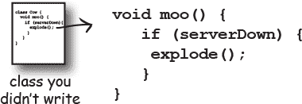
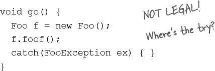

# 第十三章：冒险行为：异常处理


**事情总会发生。文件不在那里。服务器挂了。** 不管你是多么优秀的程序员，你也不能控制一切。事情可能会出错。*非常*出错。当你编写一个风险方法时，你需要代码来处理可能发生的坏事。但你如何*知道*一个方法是有风险的？你应该把代码放在哪里来*处理*这个***特殊***情况？到目前为止，在这本书中，我们并没有*真正*冒过任何风险。在运行时，我们当然会遇到问题，但问题大多是我们自己代码的缺陷。漏洞。我们应该在开发时修复这些漏洞。不，我们这里讨论的问题处理代码是针对那些你不能保证在运行时能正常工作的代码。那些期望文件在正确的目录中，服务器正在运行或线程保持休眠的代码。我们现在必须要做这件事。因为在*这*章，我们将构建一个使用有风险的 JavaSound API 的东西。我们将构建一个 MIDI 音乐播放器。

# 让我们制造一个音乐机器

在接下来的三章中，我们将构建几个不同的音频应用程序，包括一个 BeatBox 鼓机。事实上，在这本书完成之前，我们将有一个多人版本，这样你就可以将你的鼓循环发送给另一个玩家，有点像通过社交媒体分享。你将编写整个程序，尽管你可以选择使用 GUI 部分的现成代码。好吧，并不是每个 IT 部门都在寻找一个新的 BeatBox 服务器，但我们这样做是为了更多地了解 Java。构建 BeatBox 只是在我们学习 Java 的同时享受乐趣的一种方式。

## 完成的 BeatBox 看起来像这样：


注意每个 16 拍的框中的勾选标记。例如，在第 1 拍（16 拍中的第 1 拍）上，Bass 鼓和 Maracas 会播放，在第 2 拍上什么都没有，在第 3 拍上 Maracas 和 Closed Hi-Hat 会...你明白了。当你点击开始时，它会循环播放你的模式，直到你点击停止。随时，你可以通过发送到 BeatBox 服务器来“捕捉”你自己的任何模式（这意味着其他玩家可以听到它）。你还可以通过点击与之相关的消息来加载任何传入的模式。

# 我们将从基础知识开始。

显然，在完成整个程序之前，我们有几件事情要学习，包括如何构建 GUI，如何通过网络*连接*到另一台机器，以及一些 I/O，这样我们就可以向其他机器*发送*一些东西。

哦对了，还有 JavaSound API。*这*就是我们在本章将要开始的地方。现在，你可以忘掉 GUI，忘掉网络和 I/O，只专注于让你的计算机发出一些通过 MIDI 生成的声音。如果你对 MIDI 一无所知，或者对阅读或制作音乐一无所知也不必担心。这里包含了你需要学习的一切。你几乎能闻到唱片合约的味道了。

## JavaSound API

JavaSound 是添加到 Java 中的一组类和接口，早在 1.3 版中就有了。这些不是特殊的附加组件；它们是标准 Java SE 类库的一部分。JavaSound 分为两部分：MIDI 和 Sampled。我们在本书中只使用 MIDI。MIDI 代表音乐乐器数字接口，是一种用于使不同类型的电子声音设备进行通信的标准协议。但对于我们的 BeatBox 应用程序，你可以将 MIDI 视为*一种乐谱*，你将其输入到某种设备中，如高科技的“自动钢琴”。换句话说，MIDI 数据实际上不包括任何*声音*，但它包括 MIDI 读取乐器可以播放的*指令*。或者用另一个类比，你可以将 MIDI 文件视为 HTML 文档，而呈现 MIDI 文件的乐器（即*播放*它）就像网络浏览器。

MIDI 数据告诉你*做*什么（演奏中央 C，以及如何用力击打它，以及保持多久等），但它根本不涉及你听到的实际*声音*。 MIDI 不知道如何制作长笛、钢琴或吉米·亨德里克斯吉他的声音。对于实际的声音，我们需要一个能够读取和播放 MIDI 文件的乐器（MIDI 设备）。但该设备通常更像是一整个乐队或交响乐团的乐器。而且该乐器可能是一个物理设备，比如键盘，或者甚至是完全建立在计算机中的软件乐器。

对于我们的 BeatBox，我们只使用 Java 提供的内置软件乐器。它被称为*合成器*（有些人将其称为*软件合成器*），因为它*创建*声音。你*听到*的声音。


# 首先我们需要一个 Sequencer

在我们能播放任何声音之前，我们需要一个 Sequencer 对象。Sequencer 是将所有 MIDI 数据发送到正确乐器的对象。它是*播放*音乐的东西。Sequencer 可以做很多不同的事情，但在本书中，我们严格将其用作播放设备。它就像一个流媒体音乐的设备，但带有一些附加功能。Sequencer 类位于 javax.sound.midi 包中。因此，让我们首先确保我们可以创建（或获取）一个 Sequencer 对象。


## 出了点问题！


# 当你想调用的方法（可能在你没有编写的类中）存在风险时会发生什么？

+    **假设你想调用一个你没有编写的类中的方法。**

    

+    **该方法执行一些有风险的操作，可能在运行时不起作用。**

    

+    **你需要*知道*你调用的方法是有风险的。**

    

+    **然后你编写代码来处理如果*发生*失败的情况。你需要做好准备，以防万一。**

    

# Java 中的方法使用*异常*告诉调用代码，“发生了一些糟糕的事情。我失败了。”

Java 的异常处理机制是一种清晰明了的处理运行时“异常情况”的方式；它让你把所有的错误处理代码放在一个易于阅读的地方。它基于你调用的方法*告诉你*它有风险（即该方法*可能*生成异常），这样你就可以编写代码来处理这种可能性。如果你*知道*在调用特定方法时可能会抛出异常，你就可以为引起异常的问题做好准备，甚至*恢复*。

那么，一个方法如何告诉你它可能抛出异常呢？你会在风险方法声明中找到一个`**throws**`子句。

**`getSequencer()`**方法有风险。它可能在运行时失败。因此，当你调用它时，必须“声明”你承担的风险。


###### 注意

**在运行时可能失败的风险方法使用“throws SomeKindOfException”在它们的方法声明中声明可能发生的异常。**

# 编译器需要知道你知道自己在调用一个有风险的方法


如果你用一个叫做**try/catch**的东西包裹了风险代码，编译器就会放松。

一个 try/catch 块告诉编译器，你*知道*在你调用的方法中可能会发生异常，而且你已经准备好处理它。编译器不关心你*如何*处理它；它只关心你说你正在处理它。


# 一个异常是一个对象……类型为 Exception

这很幸运，因为如果异常是 Broccoli 类型的话，记住它将会更困难。

从多态性（第七章 和 第八章）中记住，Exception 类型的对象*可以*是任何 Exception 的*子类*的实例。

因为*Exception*是一个对象，你*捕获*的是一个对象。在以下代码中，**`catch`** 参数声明为 Exception 类型，参数引用变量是*ex*。


你在 catch 块中写什么取决于抛出的异常。例如，如果服务器宕机，你可能会在 catch 块中尝试另一个服务器。如果文件不存在，你可能会请求用户帮助找到它。

# 如果是你的代码捕获了异常，那么是谁的代码抛出它呢？


你在编写 Java 代码时，会花费大量时间*处理*异常，而不是花在*创建*和*抛出*异常上。暂时来说，只需知道当你的代码*调用*一个风险方法时——一个声明异常的方法——就是这个风险方法*抛出*异常给*你*，调用者。

实际上，可能是你写了两个类。重要的不是谁写了代码...重要的是知道哪个方法*抛出*异常，哪个方法*捕获*异常。

当有人编写可能抛出异常的代码时，他们必须*声明*异常。

+    **危险、抛出异常的代码：**

    

+    **调用危险方法的你的代码：**

    

**编译器会检查所有情况，除了 RuntimeExceptions。**


**编译器保证：**

+    如果你在代码中*抛出*异常，你必须在方法声明中使用*throws*关键字声明它。

+    如果你*调用*一个抛出异常的方法（换句话说，声明会抛出异常的方法），你必须*确认*你意识到了异常的可能性。满足编译器的一种方式是将调用包装在 try/catch 中。（本章稍后会再看到第二种方式。）

 **你需要解决的问题。**

# try/catch 块中的流程控制

当你调用一个危险的方法时，会发生两种情况之一。危险的方法要么成功，try 块完成，要么危险的方法抛出异常返回到调用方法。

**如果尝试成功**

**（doRiskyThing()不会抛出异常）**


**如果 try 失败**

**(因为 doRiskyThing()确实会抛出异常)**


# 最终：放置那些无论如何都要执行的代码


如果你尝试烹饪某物，你首先要打开烤箱。

如果你尝试的事情是一个彻底的**失败，*你必须关闭烤箱。***

如果你尝试的事情**成功，*你必须关闭烤箱。***

***无论如何都必须关闭烤箱！***

**finally 块是你放置必须无论异常与否都要运行的代码的地方。**

```
try {
  turnOvenOn();
  x.bake();
} catch (BakingException e) {
  e.printStackTrace();
} finally {
  turnOvenOff();
}
```

没有 finally，你必须在*try*和*catch*中都放置 turnOvenOff()，因为***无论如何都必须关闭烤箱。*** 一个 finally 块让你把所有重要的清理代码放在*一个*地方，而不是像这样重复：

```
try {
  turnOvenOn();
  x.bake();
  turnOvenOff();
} catch (BakingException e) {
  e.printStackTrace();
  turnOvenOff();
}
```

**如果 try 块失败（有异常），** 流程控制立即移动到 catch 块。当 catch 块完成后，finally 块运行。当 finally 块完成后，方法的其余部分继续执行。

**如果 try 块成功（*没有*异常），** 流程控制跳过 catch 块，移动到 finally 块。当 finally 块完成后，方法的其余部分继续执行。

**如果 try 或 catch 块有 return 语句，finally 仍然会运行！** 流程跳转到 finally，然后返回到 return 处。


# 流程控制

 **你需要解决的问题。**

**看左边的代码。你认为这个程序的输出是什么？如果程序的第三行改为** `String test = "yes";` **会是什么？假设 ScaryException 扩展自 Exception。**


当 `test = "no"` 时：开始尝试 - 开始冒险 - 结束冒险 - 结束尝试 - 最后 - 主体结束

当 `test = "yes"` 时：开始尝试 - 开始冒险 - 可怕的异常 - 最后 - 主体结束

# 我们有没有提到方法可能会抛出多个异常？

如果方法确实需要，它可以抛出多个异常。但方法的声明必须声明*所有*它可能抛出的已检查异常（尽管如果两个或更多异常有一个共同的超类，方法可以只声明超类）。

## 捕获多个异常

编译器将确保你已处理调用方法抛出的*所有*已检查异常。将 *catch* 块堆叠在 *try* 下，一个接一个。有时候，堆叠 catch 块的顺序很重要，但我们稍后再讨论这一点。


# 异常是多态的

请记住，异常是对象。除了它是*可以抛出的东西*外，没有什么特别的。因此，就像所有良好的对象一样，异常可以多态地引用。例如，LingerieException *对象*可以分配给 ClothingException *引用*。PantsException 可以分配给 Exception 引用。你明白了吧。对于异常来说，方法不必显式声明它可能抛出的每个可能异常；它可以声明异常的超类。对于 catch 块也是一样—只要你有的 catch（或多个 catch）可以处理抛出的任何异常，你就不必为每个可能的异常编写 catch。


+    **你可以使用抛出的异常的超类来声明异常。**

    

+    **你可以使用抛出的异常的超类来捕获异常。**

    

**仅仅因为你能用一个大的超级多态 catch 捕获所有东西，并不总是意味着你应该这样做。**

你*可以*编写异常处理代码，只指定一个 catch 块，在 catch 子句中使用 Exception 超类，这样你就能捕获*任何*可能抛出的异常。


**为需要单独处理的每个异常编写不同的 catch 块。**

例如，如果你的代码对 T 恤异常（或从中恢复）的处理方式与对内衣异常不同，那么为每个异常编写一个 catch 块。但如果你对待所有其他类型的服装异常的方式相同，那么添加一个 ClothingException catch 来处理其余异常。


# 多个 catch 块必须从小到大排序


在继承树越高的地方，捕获“篮子”越大。当你向下移动到更多专门的异常类时，捕获“篮子”就越小。这就是简单的多态性。

一个 ShirtException 捕获足够大，可以捕获 TeeShirtException 或 DressShirtException（以及任何继承 ShirtException 的未来子类）。一个 ClothingException 更大（也就是说，可以引用更多使用 ClothingException 类型的事物）。它可以捕获 ClothingException 类型的异常（呃），以及任何 ClothingException 的子类：PantsException、UniformException、LingerieException 和 ShirtException。所有捕获参数的“母亲”是 **Exception** 类型；它会捕获 *任何* 异常，包括运行时（未检查）异常，所以你可能不会在测试之外使用它。

# 你不能把更大的篮子放在小篮子上面


嗯，你 *可以*，但它不会编译通过。捕获块不像重载的方法那样选择最佳匹配项。对于捕获块，JVM 简单地从第一个开始，并沿着继承树向下工作，直到找到足够广泛的捕获（换句话说，在继承树上足够高），以处理异常。如果你的第一个捕获块是 `**catch(Exception ex)**`，编译器知道没有添加其他捕获块的必要——它们永远不会被执行到。


###### 注意

兄弟节点（在层次树中同一级别的异常，如 PantsException 和 LingerieException）可以以任何顺序排列，因为它们不能捕获彼此的异常。

你可以把 ShirtException 放在 LingerieException 上面，没人会介意。因为即使 ShirtException 是更大（更广泛）的类型，因为它可以捕获其他类（它自己的子类），但 ShirtException 不能捕获 LingerieException，所以没有问题。

 **“磨砺你的铅笔”中的两个答案都在 “Sharpen your pencil” 中。**

# 当你不想处理异常时……


**如果你不想处理一个异常，你可以** **规避** **它通过** **声明** **它。**

当你调用一个危险的方法时，编译器需要你承认它。大多数时候，这意味着将危险调用包装在 try/catch 中。但你还有另一种选择：简单地规避它，并让调用你的方法捕获异常。

这很容易——你只需要 *声明* *你* 抛出异常。即使从技术上讲，*你* 不是在抛出异常，也没关系。你仍然是让异常直接通过的人。

但是如果你回避了一个异常，那么你没有一个 try/catch，那么当危险方法（doLaundry()）*确实*抛出异常时会发生什么？

当一个方法抛出异常时，该方法会立即从堆栈中弹出，并且异常被抛到堆栈中下一个方法——*调用者*。但如果*调用者*是个*避开者*，那么它就没有捕捉到异常，因此*调用者*也会立即从堆栈中弹出，异常继续被抛到下一个方法，依此类推...这将在稍后详细说明。


# 避开（通过声明）只是暂时推迟了问题的解决

**Sooner or later, *somebody* has to deal with it. But what if main() ducks the exception?**


+    doLaundry() 抛出 ClothingException

    

    ```
    main() calls foo()

    foo() calls doLaundry()

    doLaundry() is
    running and throws a
    ClothingException
    ```

+    foo() 避开异常

    

    ```
    doLaundry() pops off the
    stack immediately, and
    the exception is thrown
    back to foo().

    But foo() doesn’t have a
    try/catch, so...
    ```

+    main() 避开异常

    

    ```
    foo() pops off the
    stack, and the excep-
    tion is thrown back
    to main(). But main()
    doesn’t have a try/
    catch, so the excep-
    tion is thrown back to…
    who? What? There’s
    nobody left but the
    JVM, and it’s thinking,
    “Don’t expect ME to
    get you out of this.”
    ```

+    JVM 关闭

 我们用 T 恤来代表一个服装异常。我们知道，我们知道...你可能更喜欢蓝色牛仔裤。

**Handle or Declare。这是法律。**

**现在我们已经看到了调用风险（抛出异常）方法时满足编译器的两种方式。**

+    **HANDLE**

    

+    **DECLARE（避开它）**

    声明你的方法抛出与你调用的危险方法相同的异常。

    

    但现在这意味着调用 foo() 方法的任何人都必须遵循 Handle or Declare 法则。如果 foo() 避开异常（通过声明它），而 main() 调用了 foo()，那么 main() 就必须处理这个异常。

    

# 回到我们的音乐代码...

现在你已经完全忘记了，我们在本章开始时首次看了一些 JavaSound 代码。我们创建了一个 Sequencer 对象，但它无法编译，因为方法 Midi.getSequencer() 声明了一个受检异常（MidiUnavailableException）。但现在我们可以通过包裹在 try/catch 中来修复这个问题。


## 异常规则

+    **在 try 后面没有 catch 或 finally 是不允许的。**

    

+    **你不能在 try 和 catch 之间插入代码。**

    

+    **一个 try 后面必须跟着 catch 或 finally。**

    

+    **一个只有 finally 而没有 catch 的 try 仍然必须声明异常。**

    

# Code Kitchen


> **你不一定非得自己做，但如果你这么做会更有趣。**
> 
> **本章的剩余内容是可选的；你可以为所有音乐应用使用现成的代码。**
> 
> **但如果你想更多地了解 JavaSound，请翻到下一页。**

# 发出实际声音

还记得章节开头我们讨论过 MIDI 数据保存了*什么*要播放（以及*如何*播放），并且我们也说过 MIDI 数据实际上并不会*产生任何你听到的声音*。要从扬声器中发出声音，MIDI 数据必须通过某种 MIDI 设备发送，该设备将 MIDI 指令渲染成声音，通过触发硬件乐器或“虚拟”乐器（软件合成器）。在本书中，我们只使用软件设备，以下是在 JavaSound 中的工作原理：

**你需要四件事情：**


**而你需要五个步骤：**

+    获取一个`**Sequencer**`并打开它

    ```
    Sequencer player = MidiSystem.getSequencer();
    player.open();
    ```

+    创建一个新的`**Sequence**`

    ```
    Sequence seq = new Sequence(timing,4);
    ```

+    从序列中获取一个新的`**Track**`

    ```
    Track t = seq.createTrack();
    ```

+    用`**MidiEvents**`填充轨道，并将序列给 Sequencer

    ```
    t.add(myMidiEvent1);
    player.setSequence(seq);
    ```


# 版本 1：你的第一个音乐播放器应用程序

输入代码并运行。你会听到有人在钢琴上弹奏单音！（好吧，也许不是某*个*人，而是某*物*。）


# 制作 MidiEvent（歌曲数据）

MidiEvent 是歌曲的一部分指令。一系列 MidiEvents 有点像乐谱或自动钢琴卷。我们关心的大多数 MidiEvents 描述的是要做的***事情***以及***何时***去做。时间的概念很重要，因为在音乐中，时间至关重要。这个音符跟随那个音符，依此类推。由于 MidiEvents 非常详细，你必须说明何时*开始*播放音符（NOTE ON 事件）以及何时*停止*播放音符（NOTE OFF 事件）。因此，你可以想象在“停止播放音符 G”（NOTE OFF 消息）*之前*触发“开始播放音符 G”（NOTE ON）消息是行不通的。

MIDI 指令实际上放入一个 Message 对象；而 MidiEvent 是消息和消息“触发”的时间点的组合。换句话说，消息可能是“开始播放中音 Do”，而 MidiEvent 则是“在第四拍触发此消息”。

因此我们总是需要一个消息和一个 MidiEvent。

消息说*做什么*，而 MidiEvent 则说*什么时候*去做。

###### 注意

**一个 MidiEvent 告诉你要做什么，以及什么时候去做。**

**每个指令必须包含其时机。**

**换句话说，在哪个拍子发生那件事。**

+    制作一个**消息**

    `ShortMessage msg = new ShortMessage();`

+    将**指令**放入消息中

    

+    使用消息创建一个新的**MidiEvent**

    

+    将 MidiEvent 添加到**轨道**中

    

# MIDI 消息：MidiEvent 的核心

MIDI 消息包含事件的一部分，说明要做的动作。它是你希望序列器执行的实际指令。指令的第一个参数始终是消息的类型。你传递给其它三个参数的值取决于消息的类型。例如，类型为 144 的消息意味着“NOTE ON”（音符开启）。但是为了执行 NOTE ON，序列器需要知道一些信息。想象一下序列器说：“好的，我将播放一个音符，但是在*哪个通道*？换句话说，你要我演奏鼓还是钢琴？还有*哪个音符*？中音 C？D#？还有，在*哪个速度*下我应该演奏这个音符？

要创建一个 MIDI 消息，创建一个 ShortMessage 实例并调用 setMessage()，传入消息的四个参数。但请记住，消息只说明要做*什么*，所以你仍然需要将消息装入一个事件中，以便确定消息“触发”的*时间*。

## 消息的解剖

`setMessage()` 的第一个参数始终表示“类型”消息，而其它三个参数根据消息类型表示不同的内容。

###### 注意

**消息说明要做什么；MidiEvent 说明何时执行。**


+    **消息类型**

    

+    **通道**

    把通道想象成乐队中的音乐家。通道 1 是音乐家 1（键盘手），通道 9 是鼓手，等等。

+    **要演奏的音符**

    从低音到高音，数字从 0 到 127。

    

+    **速度**

    你按键时的速度和力度是多少？0 表示非常轻柔，你可能听不到任何声音，但 100 是一个很好的默认值。

    

# 改变消息

现在你了解了一个 MIDI 消息的组成，可以开始进行实验了。你可以改变播放的音符，音符持续的时间，增加更多的音符，甚至改变乐器。

+    **改变音符**

    尝试在音符开启和音符关闭的消息中使用介于 0 到 127 之间的数字。

    ```
    msg.setMessage(144, 1, `**20**`, 100);
    ```

    

+    **改变音符的持续时间**

    改变音符关闭事件（不是*消息*），使其发生在较早或较晚的节拍。

    ```
    msg.setMessage(128, 1, 44, 100);
    MidiEvent noteOff = new MidiEvent(b, **3** );
    ```

    

+    **改变乐器**

    在播放音符的消息之前添加一个新消息，将通道 1 的乐器设置为除默认钢琴外的其他乐器。改变乐器的消息是“192”，第三个参数代表实际乐器（尝试一个介于 0 到 127 之间的数字）。

    

# 版本 2：使用命令行参数来尝试不同的声音

这个版本仍然只播放单个音符，但你可以使用命令行参数来改变乐器和音符。通过传入两个从 0 到 127 的整数值来进行实验。第一个整数设置乐器，第二个整数设置要播放的音符。


## 我们将如何通过 CodeKitchens 的其余部分实现目标

| **第十七章: 目标** 当我们完成时，我们将拥有一个既是工作的 BeatBox，又是 Drum Chat 客户端的 BeatBox。我们需要学习关于 GUI（包括事件处理）、I/O、网络和线程的知识。接下来的三章（第十四章、第十五章和第十六章）将带我们达到目标。 |  |
| --- | --- |
| **第十四章: MIDI 事件** 这个 CodeKitchen 让我们构建一个小型“音乐视频”（有点牵强地称之为音乐视频……），它按照 MIDI 音乐的节奏绘制随机矩形。我们将学习如何构建和播放大量的 MIDI 事件（而不仅仅是当前章节中的一两个）。 |  |
| **第十五章: 独立 BeatBox** 现在我们将实际构建真正的 BeatBox，包括 GUI。但它的功能有限——一旦更改模式，之前的模式就会丢失。没有保存和恢复功能，并且它不与网络通信。（但您仍然可以使用它来提高鼓模式技能。） |  |
| **第十六章: 保存和恢复** 您已经创建了完美的模式，现在可以将其保存到文件中，并在需要时重新加载。这让我们准备好进入最终版本（第十五章），在这一版本中，我们不再将模式写入文件，而是将其发送到聊天服务器。 |  |

# 练习


本章探讨了异常的精彩世界。您的任务是判断以下与异常相关的语句是真还是假。

## 真或假


1.  try 块必须跟随 catch 块和 finally 块。

1.  如果编写可能引起编译检查异常的方法，则必须将该风险代码包装在 try/catch 块中。

1.  catch 块可以是多态的。

1.  只有“经过编译检查”的异常可以被捕获。

1.  如果定义了 try/catch 块，则匹配的 finally 块是可选的。

1.  如果定义了 try 块，可以将其与匹配的 catch 块或 finally 块或两者配对使用。

1.  如果您编写一个声明可能抛出经过编译检查的异常的方法，则必须将抛出异常的代码包装在 try/catch 块中。

1.  您的程序中的 main()方法必须处理传递给它的所有未处理异常。

1.  一个单独的 try 块可以有多个不同的 catch 块。

1.  一个方法只能抛出一种类型的异常。

1.  无论是否抛出异常，finally 块都会运行。

1.  finally 块可以在没有 try 块的情况下存在。

1.  一个 try 块可以单独存在，没有 catch 块或 finally 块。

1.  处理异常有时被称为“躲避”。

1.  捕获块的顺序永远不重要。

1.  一个带有 try 块和 finally 块的方法可以选择声明一个已检查的异常。

1.  必须处理或声明运行时异常。

 **答案在“真或假”。**

## 代码磁铁


一个工作中的 Java 程序被弄乱在冰箱上。你能重新构建所有的代码片段，使其成为一个能够输出下列内容的工作中的 Java 程序吗？一些花括号掉到了地板上，它们太小了，无法捡起来，所以随意添加你需要的数量！


 **答案在“代码磁铁”。**

## JavaCross

 **答案在“JavaCross”。**


你知道该怎么做！

**横向**

1\. 给予价值

4\. 飞到顶部

6\. 所有这些和更多！

8\. 开始

10\. 家谱

13\. 不躲避

15\. 问题对象

18\. Java 的‘49’之一

20\. 类层次结构

21\. 太热而无法处理

24\. 常见的原始类型

25\. 代码配方

27\. 不守规矩的方法动作

28\. 这里没有毕加索

29\. 启动一系列事件

**向下**

2\. 当前可用

3\. 模板的创建

4\. 不要让孩子看到

5\. 大部分静态 API 类

7\. 不是关于行为的

9\. 模板

11\. 把另一个推出生产线

12\. Javac 看到了它的来临

14\. 尝试风险

16\. 自动获取

17\. 改变方法

19\. 宣布一只鸭子

22\. 处理它

23\. 创造坏消息

26\. 我的角色之一

**更多提示：**

**横向**

6\. 一个 Java 子类

8\. 开始一个方法

13\. 而不是声明

20\. 也是一种集合类型

21\. 嘎嘎叫

27\. 开始一个问题

28\. 不是抽象的

**向下**

2\. 或者漱口水

3\. 对 ______（不是例子）

5\. 数字……

9\. 只有公共或默认

16\. _____ 家族财富

17\. 不是‘getter’

## 磨笔刀

(from “磨笔刀”)


# 练习解决方案


## 真或假

(from “真或假”)

1.  False, 要么这个要么那个。

1.  False, 你可以声明异常。

1.  True.

1.  False, 运行时异常可以被捕获。

1.  True.

1.  True, 两者都可以接受。

1.  False, 声明足够了。

1.  False, but if it doesn’t, the JVM may shut down.

1.  True.

1.  False.

1.  True. 它经常用于清理部分完成的任务。

1.  False.

1.  False.

1.  False, 躲避与声明是同义词。

1.  False, 最广泛的异常必须由最后的 catch 块捕获。

1.  False, 如果没有 catch 块，你必须声明。

1.  False.

## 代码磁铁

(from “代码磁铁”)

```
class MyEx extends Exception { }

public class ExTestDrive {
  public static void main(String[] args) {
    String test = args[0];
    try {
      System.out.print("t");
      doRisky(test);
      System.out.print("o");
    } catch (MyEx e) {
      System.out.print("a");
    } finally {
      System.out.print("w");
    }
    System.out.println("s");
  }

  static void doRisky(String t) throws MyEx {
    System.out.print("h");

    if ("yes".equals(t)) {
      throw new MyEx();
    }

    System.out.print("r");
  }
}
```


## JavaCross

(from “JavaCross”)


