# 第十四章：一个非常图形化的故事：获取 GUI


**面对现实吧，你需要制作 GUI**。如果你正在构建其他人会使用的应用程序，你*需要*一个图形界面。如果你为自己构建程序，你*想要*一个图形界面。即使你相信你未来的生活将全都花在编写服务器端代码上，其中客户端用户界面是一个网页，早晚你也会需要编写工具，并且你会想要一个图形界面。当然，命令行应用程序很复古，但并不是一种好方式。它们弱小、缺乏灵活性，并且不友好。我们将花费两章的时间来学习 GUI，并在此过程中学习关键的 Java 语言特性，包括**事件处理**、**内部类**和**Lambda 表达式**。在本章中，我们将在屏幕上放置一个按钮，并使其在点击时执行某些操作。我们将在屏幕上绘制，显示 JPEG 图像，甚至进行一些（简陋的）动画。

# 一切从一个窗口开始

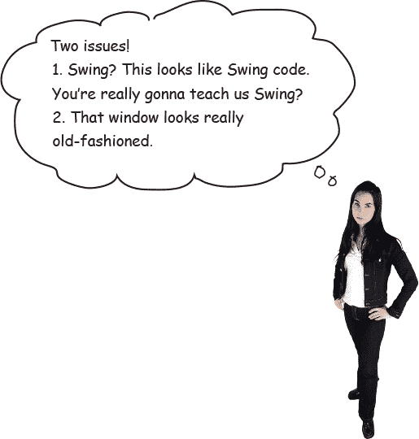

**她问了几个非常好的问题。** 几页之后我们将通过一个特别的“无愚蠢问题”的部分来回答这些问题。

JFrame 是代表屏幕上窗口的对象。在这里你可以放置所有的界面元素，如按钮、复选框、文本字段等。它可以拥有一个真正的菜单栏，其中包含菜单项。而且它有所有的窗口图标，无论你使用的是哪个平台，包括最小化、最大化和关闭窗口的按钮。

在不同平台上，JFrame 的外观各不相同。这是旧版 Mac OS X 上的 JFrame：

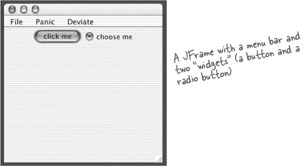

## 在窗口中放置小部件

一旦你有了一个 JFrame，你可以通过将它们添加到 JFrame 中来将事物（“小部件”）放入其中。你可以在 javax.swing 包中找到许多 Swing 组件。最常见的包括 JButton、JRadioButton、JCheckBox、JLabel、JList、JScrollPane、JSlider、JTextArea、JTextField 和 JTable。大多数都很简单易用，但有些（如 JTable）可能会复杂一些。

**制作 GUI 很容易：**

+    制作一个框架（JFrame）

    `**JFrame frame = new JFrame();**`

+    制作一个小部件（按钮、文本字段等）

    `**JButton button = new JButton("click me");**`

+    将小部件添加到框架中

    `**frame.getContentPane().add(button);**`

    ###### 注意

    你不直接向框架添加东西。把框架想象成窗口周围的装饰框，把东西添加到窗口窗格中。

+    显示它（给它一个尺寸并使其可见）

    ```
    frame.setSize(300,300);
    frame.setVisible(true);
    ```

# 你的第一个 GUI：一个按钮在框架上


**让我们看看运行时会发生什么：**

`%java SimpleGui1`


###### 注意

**哇！那是一个非常大的按钮。**

按钮填满了框架中所有可用的空间。稍后我们将学习如何控制按钮在框架中的位置（及大小）。

# 但是当我点击它时什么也没发生...

那不完全正确。当您按下按钮时，它会显示“按下”或“按下”的外观（这取决于平台的外观和感觉，但它总是*做某事*来显示它正在被按下）。

真正的问题是，“我怎样才能让按钮在用户点击时执行特定的操作？”

**我们需要两件事：**

+    当用户点击时调用的***方法***（按钮点击后希望发生的事情）。

+    一种***知道***何时触发那个方法的方法。换句话说，一种知道用户何时点击按钮的方法！

# 获取用户事件

想象一下，当用户按下按钮时，按钮上的文本从*click me*变为*I’ve been clicked*。首先，我们可以编写一个方法来改变按钮的文本（快速浏览 API 会显示给你这个方法）：

```
public void changeIt() {
  button.setText("I’ve been clicked!");
}
```

但*现在*呢？我们怎么*知道*这个方法应该运行？***我们怎么知道按钮被点击了？***

在 Java 中，获取和处理用户事件的过程称为*事件处理*。在 Java 中有许多不同的事件类型，尽管大多数涉及 GUI 用户操作。如果用户点击按钮，那就是一个事件。一个事件表明“用户希望这个按钮的操作发生。”如果是“减慢速度”按钮，用户希望减慢音乐速度的操作发生。如果是聊天客户端上的发送按钮，用户希望发送消息的操作发生。所以最直接的事件就是用户点击按钮，表示他们希望发生某个动作。

对于按钮来说，通常不关心按钮被按下和释放等中间事件。你想对按钮说的是：“我不在乎用户如何玩弄按钮，他们按住鼠标多久，他们多少次改变主意然后再放开，等等。***告诉我当用户认真对待按钮时！***换句话说，除非用户点击按钮表示他想要按钮做它所说要做的事情，否则不要叫我！”

**首先，按钮需要知道我们关心它。**


**其次，按钮需要一种方法在按钮点击事件发生时回调我们。**

**如果您关心按钮的事件，**实现一个接口**来表明：“我正在**监听**你的事件。”**

**监听器接口**是**监听器**（您）与**事件源**（按钮）之间的桥梁。

Swing GUI 组件是事件源。在 Java 术语中，事件源是一个能将用户动作（点击鼠标，键入键盘，关闭窗口）转换为事件的对象。就像 Java 中的几乎所有东西一样，事件被表示为对象。某个事件类的对象。如果你浏览 API 中的 java.awt.event 包，你会看到一堆事件类（很容易发现——它们的名字都带有***Event***）。你会找到 MouseEvent，KeyEvent，WindowEvent，ActionEvent 等几个事件类。

事件***源***（如按钮）在用户执行重要操作（如*点击*按钮）时创建一个***事件对象***。大多数你编写的代码（以及本书中的所有代码）将*接收*事件而不是*创建*事件。换句话说，你将大部分时间作为事件*监听器*而不是事件*源*。

每种事件类型都有一个匹配的监听器接口。如果你想要 MouseEvents，就实现 MouseListener 接口。想要 WindowEvents？就实现 WindowListener 接口。你明白了吧。并且记住你的接口规则——要实现一个接口，你要*声明*你实现了它（类 Dog 实现 Pet），这意味着你必须为接口中的每个方法*编写实现方法*。

一些接口有多个方法，因为事件本身具有不同的类型。例如，如果你实现了 MouseListener，你可以获取鼠标按下（mousePressed）、鼠标释放（mouseReleased）、鼠标移动（mouseMoved）等事件。每个鼠标事件在接口中都有一个单独的方法，尽管它们都接收一个 MouseEvent 对象。如果你实现了 MouseListener，当用户（你猜对了）按下鼠标时会调用 mousePressed()方法。当用户松开鼠标时，会调用 mouseReleased()方法。因此，对于鼠标事件来说，只有一个事件*对象*，即 MouseEvent，但有几种不同的事件*方法*，代表不同类型的鼠标事件。

###### 注意

**当你实现一个监听器接口时，你给按钮一个回调的方法。接口是声明回调方法的地方。**

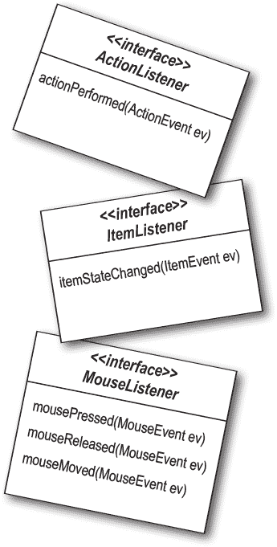

**监听器和源如何通信：**


**听者**

如果你的类想知道按钮的 ActionEvents，你就实现 ActionListener 接口。按钮需要知道你感兴趣，所以你通过调用它的 addActionListener(this)并传递一个 ActionListener 的引用来注册。在我们的第一个例子中，*你*就是 ActionListener，所以你传递*this*，但更常见的是创建一个专门的类来监听事件。按钮需要一种方式在事件发生时调用你，所以它调用监听器接口中的方法。作为 ActionListener，你*必须*实现接口的唯一方法 actionPerformed()。编译器会保证这一点。

**事件源**

按钮是 ActionEvents 的源，因此它必须知道哪些对象是感兴趣的监听器。按钮有一个 addActionListener()方法，让感兴趣的对象（监听器）有一种方式*告诉*按钮它们感兴趣。

当按钮的 addActionListener()方法运行时（因为一个潜在的监听器调用了它），按钮接受参数（监听器对象的引用）并将其存储在列表中。当用户点击按钮时，按钮通过调用列表中每个监听器的 actionPerformed()方法来“触发”事件。

**获取按钮的 ActionEvent**

+    实现 ActionListener 接口

+    向按钮注册（告诉它你想要监听事件）

+    定义事件处理方法（实现 ActionListener 接口的 actionPerformed()方法）


# 监听器、来源和事件

在你辉煌的 Java 职业生涯中，*你*不会是事件的*源*。

(无论你如何自视你是社交宇宙的中心。)

适应它。***你的工作是成为一个好的倾听者。***

(如果你真诚地去做，*可以*改善你的社交生活。)


 **你来解决。**

# 返回到图形...

现在我们对事件的工作原理有了一点了解（稍后会学到更多），让我们回到屏幕上放东西。我们会花几分钟玩一些有趣的图形方式，然后回到事件处理。

**三种在 GUI 上放置东西的方法:**

+    在框架上放置小部件

    添加按钮、菜单、单选按钮等等。

    `**frame.getContentPane().add(myButton);**`

    javax.swing 包含十多种小部件类型。

    

+    在小部件上绘制 2D 图形

    使用图形对象来绘制形状。

    `**graphics.fillOval(70,70,100,100);**`

    你可以画的不仅仅是方框和圆形；Java2D API 充满了有趣和复杂的图形方法。

    

+    在小部件上放置 JPEG

    你可以在小部件上放置自己的图像。

    `**graphics.drawImage(myPic,10,10,this);**`

    

# 制作自己的绘图小部件

如果你想把自己的图形放在屏幕上，最好的方法是制作一个可绘制的小部件。你把那个小部件放在框架上，就像按钮或任何其他小部件一样，但当它显示时，它将有你的图像。你甚至可以让这些图像动起来，作为动画，或者每次点击按钮时改变屏幕上的颜色。

这很容易。

**制作 JPanel 的子类，并重写一个方法，paintComponent()。**

所有的图形代码都放在 paintComponent()方法里。把 paintComponent()方法想象成系统调用的方法，“嘿小部件，是时候画你自己了。”如果你想画一个圆，paintComponent()方法将有画圆的代码。当显示包含你的绘图面板的框架时，会调用 paintComponent()，你的圆就会出现。如果用户最小化窗口，JVM 知道框架需要“修复”，因此当它被还原时，会再次调用 paintComponent()。每当 JVM 认为显示需要刷新时，都会调用你的 paintComponent()方法。

还有一件事，***你永远不会自己调用这个方法！***这个方法的参数（一个 Graphics 对象）是实际的绘图画布，它被贴到*真实*显示器上。你无法自己获取它；它必须由系统传递给你。然而，你后来会看到，你可以要求系统刷新显示（repaint()），最终导致 paintComponent() 被调用。

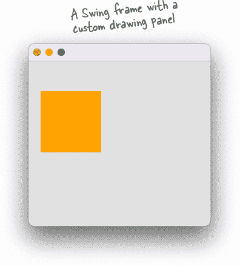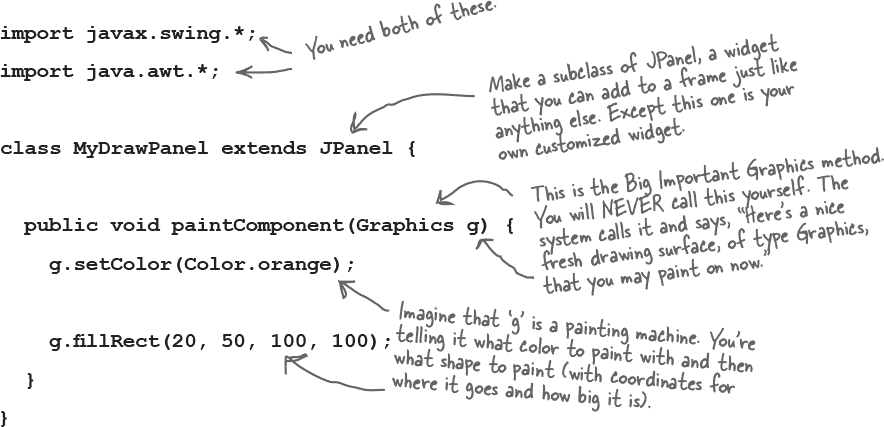

# 在 paintComponent() 中的有趣事物

让我们看看在 paintComponent() 中还可以做些什么。不过，最有趣的是当你开始自己尝试实验。试着玩玩数字，并查看 Graphics 类的 API（稍后我们将看到除了 Graphics 类中的内容外，*还有*更多你可以做的）。

**显示 JPEG**


**在黑色背景上随机绘制一个彩色圆圈**

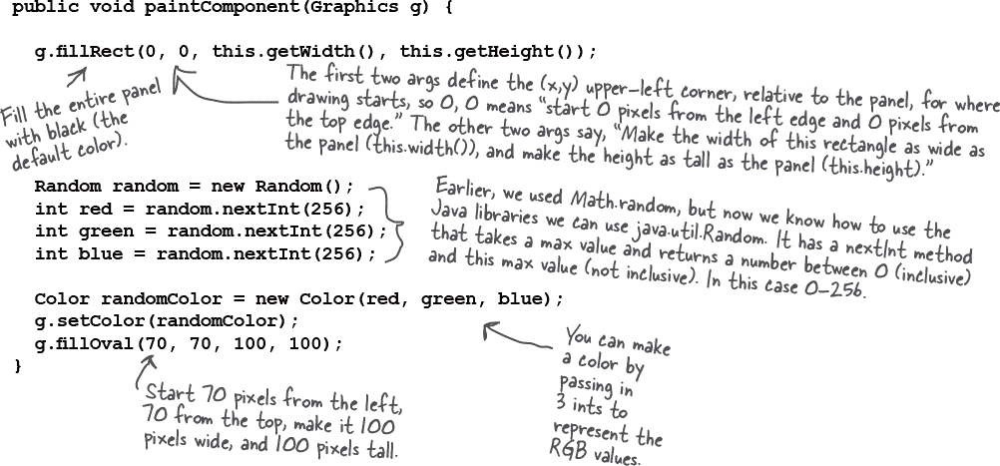

# 每一个优秀的 Graphics 参考背后都是一个 Graphics2D 对象

paintComponent() 的参数声明为 Graphics 类型（java.awt.Graphics）。

**`public void paintComponent(Graphics g) { }`**

所以参数“g”是一个 Graphics 对象。这意味着它 *可能* 是 Graphics 的 *子类*（因为多态性）。而事实上，它 *就是*。

***“g”参数引用的对象实际上是 Graphics2D 类的一个实例。***

你为什么要在意呢？因为有些事情你可以通过 Graphics2D 引用做，而用 Graphics 引用是做不到的。Graphics2D 对象比 Graphics 对象能做更多的事情，它确实是在 Graphics 引用背后潜伏的 Graphics2D 对象。

记住你的多态性。编译器根据引用类型决定你可以调用哪些方法，而不是对象类型。如果你有一个由 Animal 引用变量引用的 Dog 对象：

`**Animal a = new Dog();**`

你不能说：

`**a.bark();**`

即使你知道背后真的是一只狗。编译器看到“a”，看到它是 Animal 类型，发现 Animal 类中没有 bark() 方法的远程控制按钮。但你仍然可以通过以下方式将对象还原为它真正*是*的 Dog：

```
Dog d = (Dog) a;
d.bark();
```

所以，关于 Graphics 对象的底线是这样的：

**如果你需要使用 Graphics2D 类的方法，你不能直接使用 paintComponent 参数（“g”）的方法。但是你可以使用新的 Graphics2D 变量进行强制转换：**

`**Graphics2D g2d = (Graphics2D) g;**`

# 因为生命太短暂了，当有一个渐变混合在等着你时，你就不会只用单色来绘制圆圈了


**项目符号**

# 我们可以获取事件。我们可以绘制图形。但是当我们获取事件时，我们可以绘制图形吗？

让我们将事件连接到绘图面板的变化上。每次点击按钮时，我们将使圆圈更换颜色。程序的流程如下：

+    框架建立了两个小部件（您的绘图面板和一个按钮）。创建了监听器并将其注册到按钮上。然后显示框架，它只等待用户点击。

    

+    用户单击按钮，按钮创建事件对象并调用监听器的事件处理程序。

    

+    事件处理程序在框架上调用 repaint()。系统在绘图面板上调用 paintComponent()。

+    瞧！因为 paintComponent() 再次运行，一个新的颜色被绘制，填充了圆形。

    


# GUI 布局：在一个框架上放置多个小部件

我们将在*下一*章节中讨论 GUI 布局，但我们在这里快速进行一次课程，让您开始。默认情况下，框架有五个区域可以添加。您可以仅向框架的每个区域添加*一*个事物，但不要惊慌！那个事物可能是一个面板，包含三个其他事物，包括一个面板，再加上两个事物...你明白了吧。事实上，当我们使用以下内容将按钮添加到框架时，我们是“作弊”的：


**每次单击按钮时，圆圈的颜色都会改变。**

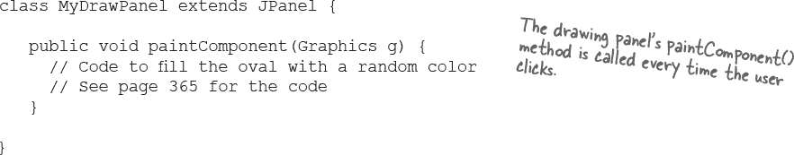

# 让我们用两个按钮再试一次

南侧按钮将像现在一样起作用，只需在框架上调用 repaint。第二个按钮（我们将放在东侧区域）将更改标签上的文本。（标签只是屏幕上的文本。）

# 现在我们需要四个小部件

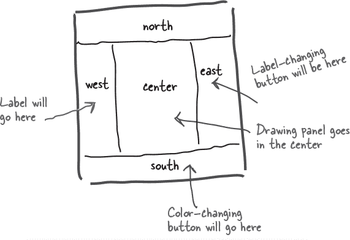

# 而且我们需要获取两个事件

啊哦。

这甚至可能吗？当你只有 *一个* actionPerformed() 方法时如何获得 *两个* 事件？


## 如何在每个按钮都需要执行不同操作时获取两个不同按钮的操作事件？

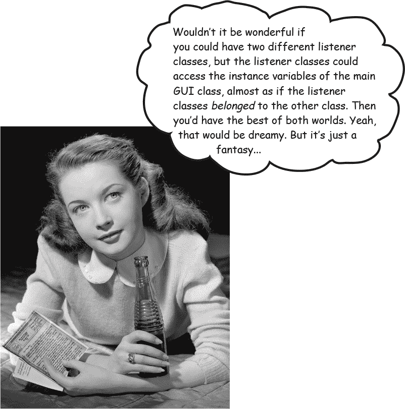

# 内部类来拯救！

您*可以*在一个类中嵌套另一个类。这很容易。只需确保内部类的定义在外部类的花括号内部。

**简单内部类：**

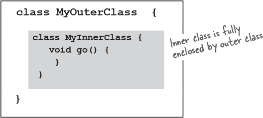

内部类获得了特别许可，可以使用外部类的东西。*即使是私有的东西也一样。*内部类可以像在内部类中定义变量和方法一样使用外部类的私有变量和方法。这就是内部类如此方便的地方——它们具有大多数普通类的优点，但具有特殊的访问权限。

**内部类使用外部类变量**

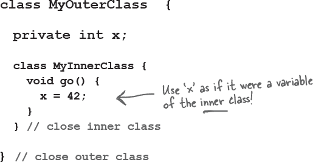

# 内部类实例必须与外部类实例绑定

记住，当我们讨论内部 *类* 访问外部类的某物时，我们实际上在讨论内部类的一个 *实例* 访问外部类的一个 *实例*。但是 *哪个* 实例呢？

*内部类的* 任意 *实例都可以访问* 外部类的 *任意* 实例的方法和变量吗？ **不！**

*一个 **内部** 对象必须与堆上特定的 **外部** 对象相关联。*


+    实例化外部类的一个实例

    

+    通过外部类的实例实例化内部类。

    

+    外部和内部对象现在紧密联系在一起。

    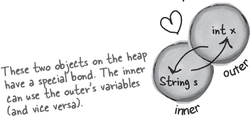

* 有一个例外情况，即一个非常特殊的情况——在静态方法内定义的内部类。但是我们不会讨论那里，你可能在整个 Java 生涯中从未遇到过这种情况。

# 如何创建内部类的实例

如果您在外部类的代码*内部*实例化内部类，则内部对象将与运行该方法的实例“绑定”。例如，如果方法内的代码实例化内部类，则内部对象将绑定到运行该方法的实例。

在外部类中的代码可以实例化其自己的内部类，就像实例化任何其他类一样... **`new MyInner()`**。

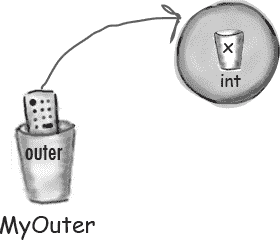

**现在我们可以让这两个按钮的代码工作**

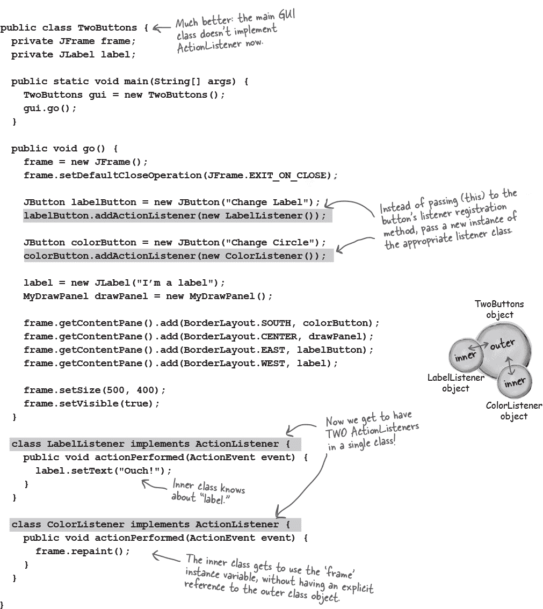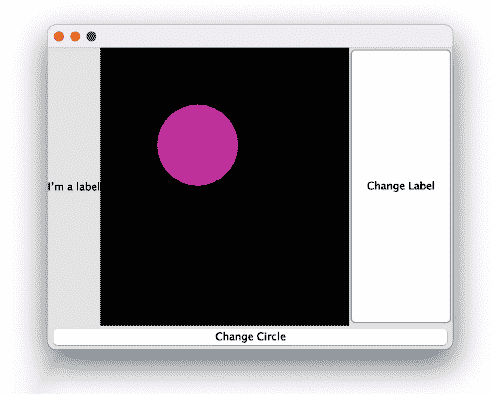

## Java 暴露


**本周的访谈：内部类的实例**

**HeadFirst:** 什么使内部类如此重要？

**内部对象：** 我从哪里开始呢？我们为你提供了在类中多次实现同一个接口的机会。请记住，在普通的 Java 类中，你不能多次实现方法。但是使用*内部*类，每个内部类都可以实现*相同*的接口，因此你可以拥有所有这些*不同*的接口方法实现。

**HeadFirst:** *你为什么会想要* 两次 *实现相同的方法呢？*

**内部对象：** *让我们重新审视 GUI 事件处理程序。考虑一下...如果你希望* 三个 *按钮分别具有不同的事件行为，那么使用* 三个 *内部类，所有这些类都实现 ActionListener——这意味着每个类都可以实现其自己的 actionPerformed 方法。

**HeadFirst:** 那么事件处理程序是使用内部类的唯一原因吗？

**内部对象：** *哦，天哪不。事件处理程序只是一个明显的例子。每当你需要一个单独的类但又希望该类表现得像是* 另一个 *类的一部分时，内部类是最好的——有时* 唯一 *的方法。*

**HeadFirst:** *我还是感到困惑。如果你希望内部类* 表现 *得像属于外部类一样，为什么一开始不直接将内部类代码* 放在 *外部类中呢？为什么不在一开始就将内部类代码放在外部类中呢？*

**Inner object:** *我刚刚* 给了 *你一个场景，你需要一个接口的多个实现。但即使在不使用接口的情况下，你可能需要两个不同的* 类，因为这些类代表两种不同的* 事物。这是良好的面向对象。

**HeadFirst:** *哇，慢着。我以为面向对象设计的一个重要部分是关于重用和维护。你知道，如果你有两个独立的类，它们可以分别修改和独立使用，而不是把所有东西都塞进一个类里面啰啰嗦嗦地。但是用* 内部 *类，最后你还是只跟一个* 真正的类 打交道，对吧？外围类是唯一可重用且与其他所有人分开的类。内部类并不是特别可重用。实际上，我听说它们被称为“无重用——一次又一次无用”。

**Inner object:** 是的，内部类确实不太* 可重用，有时甚至根本不能重用，因为它与外部类的实例变量和方法紧密相关。但是——

**HeadFirst:** —这只证明了我的观点！如果它们不可重用，为什么要费心去做一个单独的类呢？我是说，除了接口问题之外，这听起来像是一个变通方法。

**Inner object:** 正如我所说的，你需要考虑 IS-A 和多态性。

**HeadFirst:** 好吧。我在考虑它们是因为……

**Inner object:** *因为外部和内部类可能需要传递* 不同 *的 IS-A 测试！让我们从多态 GUI 监听器的示例开始。按钮的监听器注册方法的声明参数类型是什么？换句话说，如果你去 API 检查，你必须传递什么* 东西（类或接口类型） *到 addActionListener()方法中？

**HeadFirst:** 你必须传递一个监听器。实现特定监听器接口的东西，这种情况下是 ActionListener。是的，我们知道这些。你的观点是什么？

**Inner object:** *我的观点是，从多态的角度来看，你有一个只接受特定* 类型 *的方法。一些通过 ActionListener 的 IS-A 测试。但是——这里的大问题是——如果你的类需要成为一个类类型的 IS-A 而不是一个接口呢？

**HeadFirst:** *你为什么不让你的类* 扩展 *你需要成为其一部分的类呢？这不是子类化工作的全部意义吗？如果 B 是 A 的子类，那么无论何处期望 A，都可以使用 B。整个将 Dog 传递到 Animal 声明类型的事情。

**Inner object:** 是的！对了！那么现在如果你需要通过两个不同的类的 IS-A 测试呢？那些类不在同一继承层次结构中怎么办？

**HeadFirst:** *哦，好吧，你只需……嗯，我想我明白了。你可以始终* 实现 *多个接口，但在* 类 *类型方面，你只能* 扩展 *一个* 类。在类类型方面，你只能成为一种 IS-A。

**Inner object:** *干得好！是的，你不能同时是狗和按钮。但如果你是一只需要偶尔充当按钮的狗（为了将自己传递给需要按钮的方法），那么狗类（继承自动物，因此无法扩展按钮）可以有一个内部类来代表狗充当按钮，通过扩展按钮，因此在需要按钮的任何地方，狗可以传递它的内部按钮而不是它自己。换句话说，不是说 x.takeButton(this)，而是狗对象调用 x.takeButton(new MyInnerButton())。*

**HeadFirst:** 我能得到一个清晰的例子吗？

**Inner object:** 记得我们使用的绘图面板，我们在那里创建了自己的 JPanel 子类吗？现在，那个类是一个单独的非内部类。这没问题，因为该类不需要特殊访问主 GUI 实例变量。但如果需要呢？如果我们在面板上做动画，并且它的坐标来自主应用程序（比如，基于用户在 GUI 其他地方的操作）。在这种情况下，如果将绘图面板设为内部类，那么绘图面板类就可以成为 JPanel 的子类，而外部类仍然可以是其他类的子类。

**HeadFirst:** 是的，我明白了！而且绘图面板本身不够可重用，无法成为一个单独的类，因为它实际上绘制的内容特定于这个 GUI 应用程序。

**Inner object:** 是的！你搞懂了！

**HeadFirst:** *很好。那么我们可以继续讨论* 你 和外部实例之间的*关系的本质。

**Inner object:** 你们这些人怎么了？在多态这样严肃的话题中，八卦不够多吗？

**HeadFirst:** 嘿，你不知道公众为了一些好的旧小报狗脏料愿意付出多少钱。所以，有人创造了你，你立刻与外部对象绑定了，对吗？

**Inner object:** 是的，没错。

**HeadFirst:** 外部对象呢？它能与其他任何内部对象关联吗？

**Inner object:** *所以现在我们明白了。这是你*真正*想要的。是的，是的。我所谓的*伴侣*可以拥有任意多个内部对象。

**HeadFirst:** 这像是串行一夫一妻制吗？还是可以同时拥有所有这些？

**Inner object:** 同时完成了。满意了吗？

**HeadFirst:** *嗯，这确实有道理。而且别忘了，正是* 你 赞美了“同一接口的多种实现”。所以如果外部类有三个按钮，它就需要三个不同的内部类（因此三个不同的内部类对象）来处理事件，这很合理。

**Inner objects:** 你说对了！

**HeadFirst:** 再问一个问题。我听说当 lambda 表达式出现时，你几乎失业了？

**内部对象：** 哎呀，这真的很痛！好吧，完全披露，有很多情况下，lambda 是执行我所做的事情更易于阅读、更简洁的方式。但是内部类已经存在很长时间了，您肯定会在旧代码中遇到我们。另外，那些讨厌的 lambda 并不是所有事情都做得更好。

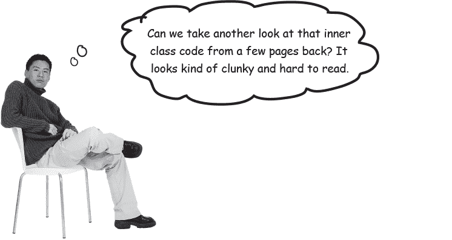

# Lambdas to the rescue! (again)

他并没有错！解释两行代码中突出显示的一种方法可能是：

“当 `labelButton` 的 *ActionListener 得到一个事件*时，`setText("Ouch");`”

这两个想法不仅在代码中彼此分开，而且内部类需要五行代码来调用 setText 方法。当然，我们对 labelButton 代码说的一切也适用于 colorButton 代码。

还记得几页前我们说过为了实现 ActionListener 接口，你需要为其 actionPerformed 方法提供代码吗？嗯...这有点耳熟吗？

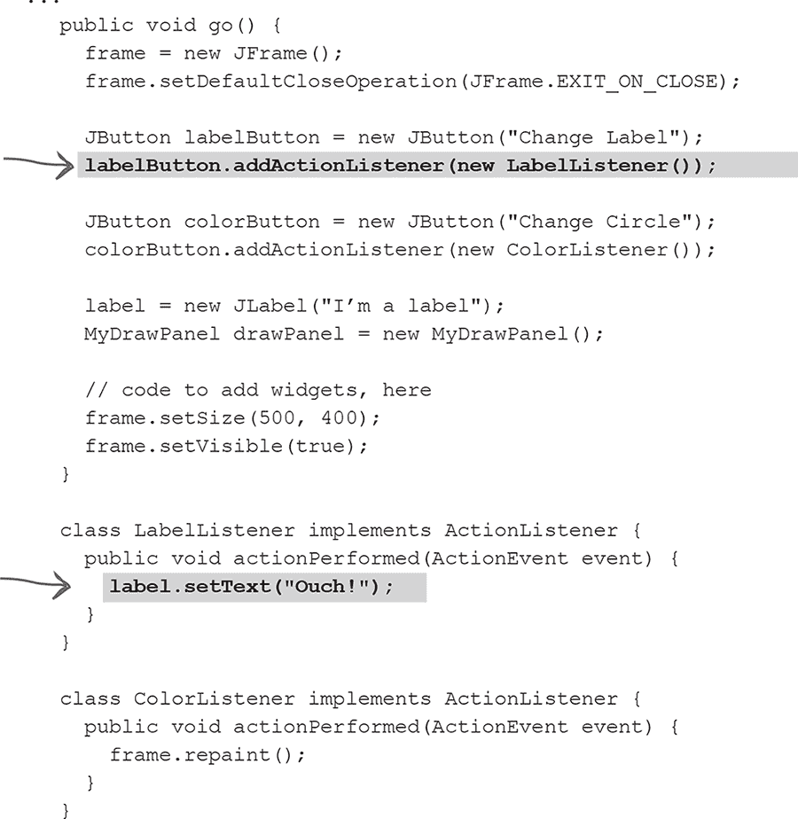

# ActionListener 是一个功能接口

**请记住，lambda 为功能接口的*唯一*抽象方法提供了实现。**

由于 ActionListener 是一个功能接口，您可以用 lambda 表达式替换我们在前一页看到的内部类。

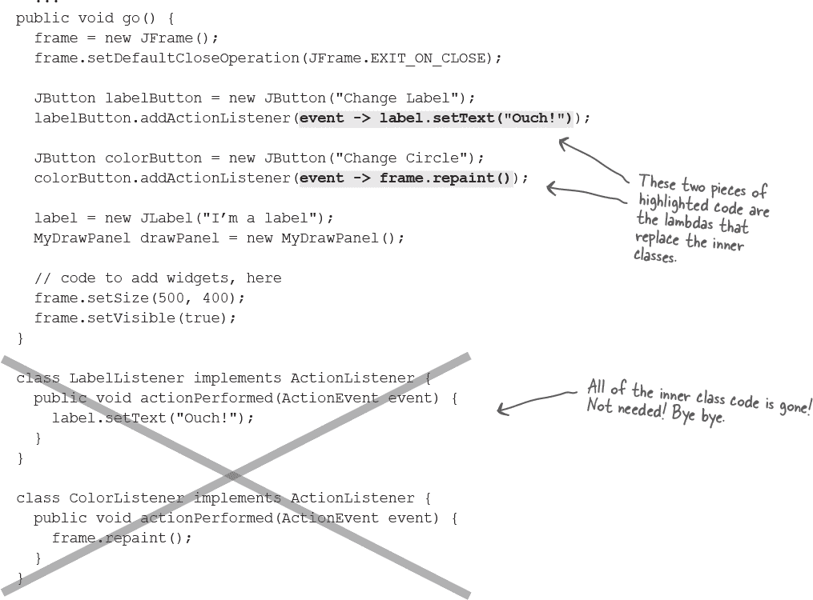

# Lambdas, clearer and more concise

嗯，也许现在还不完全是这样，但是一旦您习惯阅读 lambda 表达式，我们相信您会同意它们使您的代码更清晰。

# Using an inner class for animation

我们看到为什么内部类在事件监听器中很方便，因为您可以多次实现相同的事件处理方法。但现在我们将看看当内部类用作外部类不继承的东西的子类时，内部类有多有用。换句话说，当外部类和内部类在不同的继承树中时！

我们的目标是创建一个简单的动画，其中圆圈从屏幕的左上角向右下角移动。


**简单动画的工作原理**

+    在特定的 x 和 y 坐标处绘制对象。

    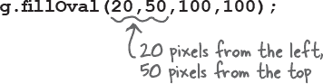

+    在不同的 x 和 y 坐标处重新绘制对象。

    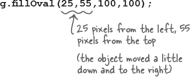

+    在动画应该继续的时间内，通过更改 x 和 y 的值重复上一步骤。

**我们真正想要的是像这样的东西...**

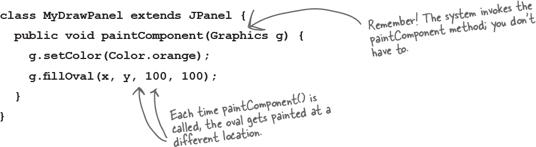

**完整的简单动画代码**


**成功了吗？**

您可能没有得到您预期的流畅动画。

我们做错了什么？

在 paintComponent() 方法中有一个小缺陷。

**我们需要擦除已经存在的内容！否则可能会留下轨迹。**

要修复它，我们只需在每次绘制圆之前用背景颜色填充整个面板。下面的代码在方法开头添加了两行：一行是将颜色设置为白色（绘图面板的背景颜色），另一行是用该颜色填充整个面板矩形。简而言之，下面的代码用英语表示，“填充一个从 x 和 y 为 0 开始的矩形（距左侧和顶部各 0 像素）并使其宽度和高度与面板当前的宽度和高度相同。


 **由你来解决。**

# 代码厨房


> **让我们制作一个音乐视频。我们将使用由 Java 生成的随着音乐节拍保持时间的随机图形。**
> 
> **在这个过程中，我们将注册（并监听）一种新的非 GUI 事件，由音乐本身触发。**

###### 注意

请记住，这部分都是可选的。但我们认为这对你有好处。而且你会喜欢它的。你可以用它来给人留下深刻印象。

（好吧，当然，这可能只对那些很容易感动的人有效，但还是....）

# 监听非 GUI 事件

好吧，也许不是一个音乐视频，但我们*将*制作一个程序，在音乐的节拍下在屏幕上绘制随机图形。简而言之，该程序监听音乐的节拍，并在每个节拍时绘制一个随机图形矩形。

这给我们带来了一些新问题。到目前为止，我们只监听了 GUI 事件，但现在我们需要监听特定类型的 MIDI 事件。事实证明，监听非 GUI 事件就像监听 GUI 事件一样：你实现一个监听器接口，将监听器注册到事件源，然后坐下来等待事件源调用你的事件处理方法（在监听器接口中定义的方法）。

监听音乐节拍的最简单方法是注册并监听实际的 MIDI 事件，这样每当序列器收到事件时，我们的代码也会收到，并且可以绘制图形。但是...有一个问题。实际上是一个 bug，它不允许我们监听*我们*制作的 MIDI 事件（NOTE ON 的事件）。

因此，我们必须做一些变通。我们可以监听另一种类型的 MIDI 事件，称为控制器事件。我们的解决方案是注册 ControllerEvents，然后确保对于每个 NOTE ON 事件，在相同的“节拍”上触发一个匹配的 ControllerEvent。我们如何确保 ControllerEvent 在同一时间被触发？我们将其添加到轨道中，就像其他事件一样！换句话说，我们的音乐序列如下：

节拍 1 - 音符开启，控制器事件

节拍 2 - 音符关闭

节拍 3 - 音符开启，控制器事件

节拍 4 - 音符关闭

等等。

不过，在我们深入全面的程序之前，让我们让制作和添加 MIDI 消息/事件变得更容易，因为在*这个*程序中，我们将制作很多这样的事件。

**音乐艺术程序需要做的事情：**

+    制作一系列 MIDI 消息/事件来在钢琴（或您选择的乐器）上播放随机音符。

+    注册一个事件的监听器。

+    启动序列播放器。

+    每当监听器的事件处理方法被调用时，在绘图面板上绘制一个随机矩形，并调用 repaint。

**我们将分三个迭代来构建它：**

+    第一版：简化了制作和添加 MIDI 事件的代码，因为我们将会制作很多这样的事件。

+    第二版：注册并监听事件，但不包含图形。每个节拍在命令行打印一个消息。

+    第三版：真正的交易。在第二版中添加图形。

# 一种更简单的制作消息/事件的方法

现在，制作并添加消息和事件到轨道是件麻烦事。对于每条消息，我们必须创建消息实例（在本例中为 ShortMessage），调用 setMessage()，为消息创建一个 MidiEvent，并将事件添加到轨道中。在上一章的代码中，我们为每条消息执行了这些步骤。这意味着为了播放一个音符而停止播放，我们需要八行代码！四行用于添加 NOTE ON 事件，四行用于添加 NOTE OFF 事件。

```
ShortMessage msg1 = new ShortMessage();
msg1.setMessage(NOTE_ON, 1, 44, 100);
MidiEvent noteOn = new MidiEvent(msg1, 1);
track.add(noteOn);

ShortMessage msg2 = new ShortMessage();
msg2.setMessage(NOTE_OFF, 1, 44, 100);
MidiEvent noteOff = new MidiEvent(msg2, 16);
track.add(noteOff);
```

**每个事件都必须发生的事情：**

+    创建一个消息实例

    `**ShortMessage msg = new ShortMessage();**`

+    使用 setMessage() 调用消息

    `**msg.setMessage(NOTE_ON, 1, instrument, 0);**`

+    为消息创建一个 MidiEvent 实例

    `**MidiEvent noteOn = new MidiEvent(msg, 1);**`

+    将事件添加到轨道

    `**track.add(noteOn);**`

**让我们建立一个静态实用方法来创建消息并返回 MidiEvent**


# 第一版：使用新的静态 makeEvent() 方法

这段代码没有事件处理或图形，只是一系列沿着音阶上升的 15 个音符。这段代码的目的仅仅是学习如何使用我们的新的 makeEvent() 方法。下面两个版本的代码要小得多，也简单得多，多亏了这个方法。


# 第二版：注册并获取 ControllerEvents


###### 注意

**与上一个版本不同的代码用灰色突出显示（我们将代码从 main() 方法移到了自己的 go() 方法中）。**

# 第三版：与音乐同时绘制图形

这个最终版本在第二版的基础上增加了 GUI 部分。我们建立了一个框架并向其添加了绘图面板，每当我们收到一个事件时，我们就会绘制一个新的矩形并重新绘制屏幕。与第二版唯一的其他变化是音符是随机播放的，而不是简单地上升音阶。

代码中最重要的更改（除了构建一个简单的 GUI 之外）是，我们使绘图面板实现 ControllerEventListener，而不是程序本身。因此，当绘图面板（一个内部类）收到事件时，它知道如何通过绘制矩形来照顾自己。

此版本的完整代码在下一页。

**绘图面板内部类：**


 **由您来解决。**

```
import javax.sound.midi.*;
import javax.swing.*;
import java.awt.*;
import java.util.Random;

import static javax.sound.midi.ShortMessage.*;

public class MiniMusicPlayer3 {
  private MyDrawPanel panel;
  private Random random = new Random();

  public static void main(String[] args) {
    MiniMusicPlayer3 mini = new MiniMusicPlayer3();
    mini.go();
  }

  public void setUpGui() {
    JFrame frame = new JFrame("My First Music Video");
    panel = new MyDrawPanel();
    frame.setContentPane(panel);
    frame.setBounds(30, 30, 300, 300);
    frame.setVisible(true);
  }

  public void go() {
    setUpGui();

    try {
      Sequencer sequencer = MidiSystem.getSequencer();
      sequencer.open();
      sequencer.addControllerEventListener(panel, new int[]{127});
      Sequence seq = new Sequence(Sequence.PPQ, 4);
      Track track = seq.createTrack();

      int note;
      for (int i = 0; i < 60; i += 4) {
        note = random.nextInt(50) + 1;
        track.add(makeEvent(NOTE_ON, 1, note, 100, i));
        track.add(makeEvent(CONTROL_CHANGE, 1, 127, 0, i));
        track.add(makeEvent(NOTE_OFF, 1, note, 100, i + 2));
      }

      sequencer.setSequence(seq);
      sequencer.start();
      sequencer.setTempoInBPM(120);
    } catch (Exception ex) {
      ex.printStackTrace();
    }
  }
public static MidiEvent makeEvent(int cmd, int chnl, int one, int two, int tick) {
    MidiEvent event = null;
    try {
      ShortMessage msg = new ShortMessage();
      msg.setMessage(cmd, chnl, one, two);
      event = new MidiEvent(msg, tick);
    } catch (Exception e) {
      e.printStackTrace();
    }
    return event;
}

class MyDrawPanel extends JPanel implements ControllerEventListener {
    private boolean msg = false;

    public void controlChange(ShortMessage event) {
      msg = true;
      repaint();
    }

    public void paintComponent(Graphics g) {
      if (msg) {
        int r = random.nextInt(250);
        int gr = random.nextInt(250);
        int b = random.nextInt(250);

        g.setColor(new Color(r, gr, b));

        int height = random.nextInt(120) + 10;
        int width = random.nextInt(120) + 10;

        int xPos = random.nextInt(40) + 10;
        int yPos = random.nextInt(40) + 10;

        g.fillRect(xPos, yPos, width, height);
        msg = false;
      }
    }
  }

}
```

# 练习


一群 Java 高手，穿着全副武装，正在玩“我是谁？”派对游戏。他们给了你一个线索，你根据他们说的话来猜他们是谁。假设他们总是说实话。如果他们碰巧说的话对多个人都成立，那么请将适用的人名填入句子旁边的空白处。

## 我是谁？


**今晚的参与者：**

**本章中任何迷人的个性可能都会出现！**

| **我把整个 GUI 都握在手中。** | ______________________ |
| --- | --- |
| **每种事件类型都有一个。** | ______________________ |
| **侦听器的关键方法。** | ______________________ |
| **这个方法使 JFrame 得到大小。** | ______________________ |
| **你在这个方法中添加代码，但从未调用它。** | ______________________ |
| **当用户实际做某事时，这是一个 _____.** | ______________________ |
| **大多数都是事件源。** | ______________________ |
| **我把数据带回给侦听器。** | ______________________ |
| **addXxxListener( )方法表示对象是一个 _____.** | ______________________ |
| **监听器如何注册。** | ______________________ |
| **所有图形代码都放入的方法。** | ______________________ |
| **我通常绑定到一个实例。** | ______________________ |
| **(Graphics g) 中的“g”实际上是属于这个类。** | ______________________ |
| **使 JFrame 得到大小的方法。** | ______________________ |
| **大多数交换机居住的包。** | ______________________ |

 **答案在“我是谁？”中。**

## BE the Compiler


###### 注意

此页面上的 Java 文件代表一个完整的源文件。您的任务是扮演编译器，确定这个文件是否会编译。如果不能编译，您将如何修复它？如果能编译，它会做什么？

```
import javax.swing.*;
import java.awt.*;
import java.awt.event.*;

class InnerButton {
  private JButton button;

  public static void main(String[] args) {
    InnerButton gui = new InnerButton();
    gui.go();
  }

  public void go() {
    JFrame frame = new JFrame();
    frame.setDefaultCloseOperation(
            JFrame.EXIT_ON_CLOSE);

    button = new JButton("A");
    button.addActionListener();

    frame.getContentPane().add(
            BorderLayout.SOUTH, button);
    frame.setSize(200, 100);
    frame.setVisible(true);
  }

  class ButtonListener extends ActionListener {
    public void actionPerformed(ActionEvent e) {
      if (button.getText().equals("A")) {
        button.setText("B");
      } else {
        button.setText("A");
      }
    }
  }
}
```

 **答案在“BE the Compiler”中。**

## 池谜题


您的***工作***是从池中获取代码片段并将它们放入代码中的空白行。您可以多次使用相同的片段，但不需要使用所有片段。您的***目标***是创建一个可以编译、运行并生成所列输出的类。

**输出**

令人惊奇的、收缩的、蓝色矩形。这个程序将生成一个蓝色的矩形，它会收缩、收缩，最终消失在白色的背景中。


**注意：每个片段可以多次使用！**

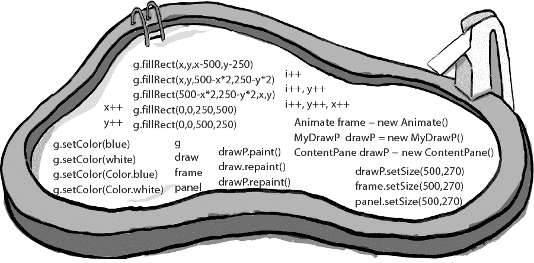

```
import javax.swing.*;
import java.awt.*;
import java.util.concurrent.TimeUnit;
public class Animate {
    int x = 1;
    int y = 1;
    public static void main(String[] args) {
       Animate gui = new Animate ();
       gui.go();
   }
   public void go() {
       JFrame _________ = new JFrame();
       frame.setDefaultCloseOperation(
                     JFrame.EXIT_ON_CLOSE);
       ______________________________________;      
       _________.getContentPane().add(drawP);
       __________________________;
       _________.setVisible(true);
       for (int i=0; i<124; _______________) {
       _____________________;
       _____________________;
       try {
        TimeUnit.MILLISECONDS.sleep(50);
       } catch(Exception ex) { }
       }
   }
   class MyDrawP extends JPanel {
       public void paintComponent (Graphics
                                  _________) {
          __________________________________;
          __________________________________;
          __________________________________;
          __________________________________;
       }
   }
}
```

 **答案在“Pool Puzzle”中。**

# 练习解答


## 我是谁？

（来自“Exercise”）

| **我把整个 GUI 掌握在手中。** | JFrame |
| --- | --- |
| **每种事件类型都有一个。** | 侦听器接口 |
| **侦听器的关键方法。** | actionPerformed( ) |
| **这个方法为 JFrame 设置其大小。** | setSize( ) |
| **你在这个方法中添加代码但从未调用它。** | paintComponent( ) |
| **当用户实际执行操作时，它是一个 ____。** | 事件 |
| **这些大多数是事件源。** | Swing 组件 |
| **我将数据返回给侦听器。** | 事件对象 |
| **一个 addXxxListener( )方法表示对象是一个 ___。** | event source |
| **侦听器如何注册。** | addXxxListener( ) |
| **所有图形代码都在这个方法中。** | paintComponent( ) |
| **我通常绑定到一个实例。** | 内部类 |
| **在（Graphics g）中，“g”实际上是这个类的一部分。** | Graphics2D |
| **触发 paintComponent( )方法的方法。** | repaint( ) |
| **大多数 Swingers 居住的包。** | javax.swing |

## BE the Compiler

（来自“BE the Compiler”）

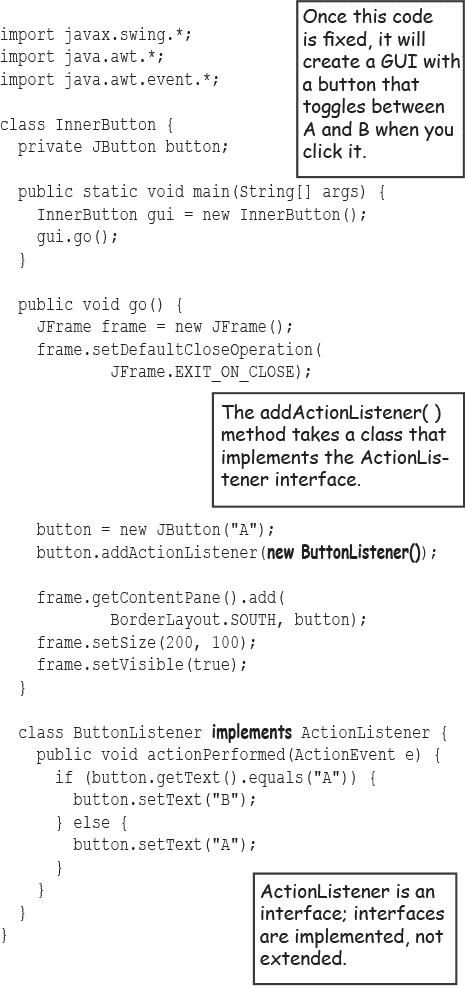

## Pool Puzzle

（来自“Pool Puzzle”）


```
import javax.swing.*;
import java.awt.*;
import java.util.concurrent.TimeUnit;

public class Animate {
  int x = 1;
  int y = 1;
  public static void main(String[] args) {
    Animate gui = new Animate ();
    gui.go();
  }
  public void go() {
    JFrame frame = new JFrame();
    frame.setDefaultCloseOperation(
            JFrame.EXIT_ON_CLOSE);
    MyDrawP drawP = new MyDrawP();      
    frame.getContentPane().add(drawP);
    frame.setSize(500, 270);
    frame.setVisible(true);
    for (int i = 0; i < 124; i++,y++,x++ ) {
      x++;
      drawP.repaint();
      try {
        TimeUnit.MILLISECONDS.sleep(50);
      } catch(Exception ex) { }
    }
  }
  class MyDrawP extends JPanel {
    public void paintComponent(Graphics g ) {
      g.setColor(Color.white);
      g.fillRect(0, 0, 500, 250);
      g.setColor(Color.blue);
      g.fillRect(x, y, 500-x*2, 250-y*2);
    }
  }
}
```

令人惊奇的、收缩的、蓝色矩形。


