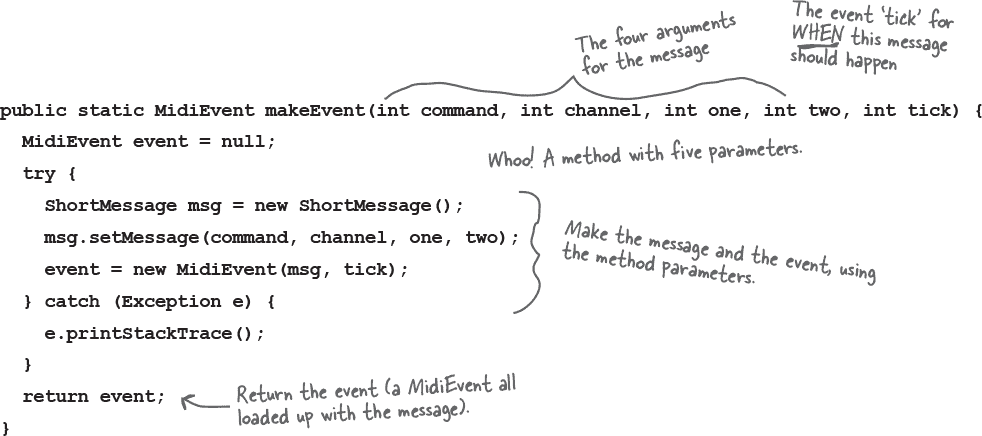

# 第十四章：一个非常图形化的故事：获取 Gui


**面对现实吧，你需要制作 GUI**。如果你正在构建其他人将使用的应用程序，你*需要*一个图形界面。如果你正在为自己构建程序，你*想要*一个图形界面。即使你相信你的余生都将花在编写服务器端代码上，其中客户端用户界面是一个网页，迟早你也会需要编写工具，并且你会想要一个图形界面。当然，命令行应用程序是复古的，但不是以一种好的方式。它们是薄弱的、不灵活的和不友好的。我们将花两章的时间来研究 GUI，并学习关键的 Java 语言特性，包括**事件处理**、**内部类**和**lambda**。在本章中，我们将在屏幕上放置一个按钮，并在点击时使其执行某些操作。我们将在屏幕上绘制，显示 JPEG 图像，甚至进行一些（粗糙的）动画。

# 一切都始于一个窗口


**她问了几个非常好的问题**。在接下来的几页中，我们将用一个特别的“无愚蠢问题”来回答这些问题。

JFrame 是代表屏幕上窗口的对象。在其中放置所有的界面元素，如按钮、复选框、文本字段等。它可以有一个真正的菜单栏，其中包含菜单项。并且它具有所有平台的窗口图标，用于最小化、最大化和关闭窗口。

JFrame 在你所在的平台上看起来会有所不同。这是一个在旧 Mac OS X 上的 JFrame：


## 将小部件放入窗口中

一旦你有了一个 JFrame，你可以通过将它们添加到 JFrame 中来将东西（“小部件”）放入其中。有很多 Swing 组件可以添加；在 javax.swing 包中查找它们。最常见的包括 JButton、JRadioButton、JCheckBox、JLabel、JList、JScrollPane、JSlider、JTextArea、JTextField 和 JTable。大多数都很简单易用，但有些（如 JTable）可能会有点复杂。

**制作 GUI 很容易：**

+    制作一个框架（JFrame）

    `**JFrame frame = new JFrame();**`

+    制作一个小部件（按钮、文本字段等）

    `**JButton button = new JButton("点击我");**`

+    将小部件添加到框架中

    `**frame.getContentPane().add(button);**`

    ###### 注意

    你不直接向框架添加东西。把框架看作窗口周围的装饰，然后将东西添加到窗格中。

+    显示它（给它一个大小并使其可见）

    ```
    frame.setSize(300,300);
    frame.setVisible(true);
    ```

# 你的第一个 GUI：一个在框架上的按钮


**让我们看看运行时会发生什么：**

`%java SimpleGui1`


###### 注意

**哇！那是一个非常大的按钮。**

按钮填充了框架中所有可用的空间。稍后我们将学习如何控制按钮在框架中的位置（以及大小）。

# 但是当我点击它时什么都不会发生...

这并不完全正确。当您按下按钮时，它会显示“按下”或“推入”的外观（这取决于平台的外观和感觉，但它总是会*做一些事情*来显示正在被按下）。

真正的问题是：“当用户点击按钮时，我如何让按钮执行特定的操作？”

**我们需要两件事：**

+    用户点击时调用的***方法***（按钮点击后要发生的事情）。

+    一种***知道***何时触发该方法的方法。换句话说，一种知道用户何时点击按钮的方法！

# 获取用户事件

假设您希望用户按下按钮时将按钮上的文本从*click me*更改为*I’ve been clicked*。首先，我们可以编写一个更改按钮文本的方法（通过 API 快速查看该方法）：

```
JPanel panelA = new JPanel();
JPanel panelB = new JPanel();
panelB.add(new JButton("button 1"));
panelB.add(new JButton("button 2"));
panelB.add(new JButton("button 3"));
panelA.add(panelB);
```

但是*现在*呢？我们如何*知道*何时运行这个方法？***当按钮被点击时我们怎么知道？***

在 Java 中，获取和处理用户事件的过程称为*事件处理*。在 Java 中有许多不同的事件类型，尽管大多数涉及 GUI 用户操作。如果用户点击按钮，那就是一个事件。一个事件表明“用户希望执行此按钮的操作。”如果它是“减慢速度”按钮，则用户希望执行减慢音乐节奏的操作。如果是聊天客户端上的发送按钮，则用户希望执行发送我的消息的操作。因此，最简单的事件是用户点击按钮，表示他们希望执行某个操作。

对于按钮，通常不关心任何中间事件，如按钮正在被按下和按钮正在被释放。你想要对按钮说的是：“我不在乎用户如何与按钮交互，他们在上面按住鼠标多久，他们在放手之前改变主意的次数等等。***告诉我只有当用户认真对待时才调用我！***换句话说，除非用户点击表明他想要该死的按钮执行其所说的操作，否则不要调用我！”

**首先，按钮需要知道我们关心。**


**其次，按钮需要在按钮点击事件发生时回调我们。**

**如果你关心按钮的事件，**实现一个接口**，说：“我**监听**你的事件。”**

**监听器接口**是**监听器**（你）和**事件源**（按钮）之间的桥梁。

Swing GUI 组件是事件源。在 Java 术语中，事件源是一个可以将用户动作（点击鼠标，键入键，关闭窗口）转换为事件的对象。就像 Java 中的几乎所有其他内容一样，事件表示为对象。某个事件类的对象。如果您在 API 中的 java.awt.event 包中扫描，您会看到一堆事件类（很容易发现它们都有***Event***在名称中）。您会找到 MouseEvent，KeyEvent，WindowEvent，ActionEvent 等几个事件类。

事件***源***（比如按钮）在用户执行重要操作时（比如*点击*按钮）创建一个***事件对象***。大多数你编写的代码（以及本书中的所有代码）都会*接收*事件，而不是*创建*事件。换句话说，你会大部分时间作为事件*监听器*而不是事件*源*。

每种事件类型都有一个相应的监听器接口。如果你想要 MouseEvents，实现 MouseListener 接口。想要 WindowEvents？实现 WindowListener。你明白了。记住接口的规则——实现接口时，你*声明*你实现它（类 Dog 实现 Pet），这意味着你必须*编写实现方法*来处理接口中的每个方法。

有些接口有多个方法，因为事件本身具有不同的类型。例如，如果你实现了 MouseListener，你可以获取鼠标按下、鼠标释放、鼠标移动等事件。每一个鼠标事件在接口中都有一个单独的方法，即使它们都接收一个 MouseEvent。如果你实现了 MouseListener，当用户按下鼠标时会调用 mousePressed()方法。当用户松开鼠标时会调用 mouseReleased()方法。因此，对于鼠标事件，只有一个事件*对象*，即 MouseEvent，但是有几种不同的事件*方法*，代表不同的鼠标事件*类型*。

###### 注意

**当你实现一个监听器接口时，你为按钮提供了一种回调你的方法。接口是声明回调方法的地方。**


**监听器和源如何通信：**


**监听器**

如果你的类想要知道按钮的 ActionEvents，你需要实现 ActionListener 接口。按钮需要知道你感兴趣，所以你通过调用它的 addActionListener(this)并传递一个 ActionListener 引用来注册。在我们的第一个例子中，*你*是 ActionListener，所以你传递了*this*，但更常见的是创建一个专门的类来监听事件。按钮需要一种方法在事件发生时回调你，所以它调用监听器接口中的方法。作为 ActionListener，你*必须*实现接口中的唯一方法 actionPerformed()。编译器保证了这一点。

**事件源**

按钮是 ActionEvents 的源，因此它必须知道哪些对象是感兴趣的监听器。按钮有一个 addActionListener()方法，为感兴趣的对象（监听器）提供一种*告知*按钮它们感兴趣的方式。

当按钮的 addActionListener()运行时（因为潜在的监听器调用了它），按钮将参数（指向监听器对象的引用）存储在列表中。当用户点击按钮时，按钮通过调用列表中每个监听器的 actionPerformed()方法来“触发”事件。

**获取按钮的 ActionEvent**

+    实现 ActionListener 接口

+    注册按钮（告诉它你要监听事件）

+    定义事件处理方法（实现 ActionListener 接口中的 actionPerformed()方法）


# 监听器、源和事件

在你辉煌的 Java 职业生涯中，*你*不会是事件的*源头*。

（无论你多么幻想自己是你社交宇宙的中心。）

习惯它。 ***你的工作是成为一个好的倾听者。***

（如果你真诚地去做，*确实*能改善你的社交生活。）


 **由你解决。**

# 回到图形处理...

现在我们已经了解了一些事件如何工作的知识（稍后我们会学到更多），让我们回到屏幕上放东西的问题上。我们会花几分钟玩一些有趣的图形方式，然后再回到事件处理。

**三种方法将事物放在你的 GUI 上：**

+    **将小部件放在框架上**

    添加按钮、菜单、单选按钮等。

    `**frame.getContentPane().add(myButton);**`

    javax.swing 包有十几种小部件类型。

    

+    **在小部件上绘制 2D 图形**

    使用图形对象绘制形状。

    `**graphics.fillOval(70,70,100,100);**`

    你可以画出比盒子和圆圈更多的东西；Java2D API 充满了有趣和复杂的图形方法。

    

+    **在小部件上放置 JPEG**

    你可以把自己的图像放在一个小部件上。

    `**graphics.drawImage(myPic,10,10,this);**`

    

# 制作你自己的绘图小部件

如果你想在屏幕上放置自己的图形，最好的办法是制作一个可绘制的小部件。你把那个小部件放在框架上，就像按钮或任何其他小部件一样，但是当它显示出来时，它将有你的图像。你甚至可以让这些图像动起来，作为动画，或者每次点击按钮时改变屏幕上的颜色。

这简直就是小菜一碟。

**创建 JPanel 的子类并覆盖一个方法，paintComponent()。**

所有你的图形代码都放在 paintComponent()方法里。把 paintComponent()方法想象成系统调用的方法，“嘿小部件，该你画自己了。”如果你想画一个圆，paintComponent()方法会有画圆的代码。当显示包含你的绘图面板的框架时，就会调用 paintComponent()，你的圆就会出现。如果用户最小化窗口，JVM 知道当它最小化后需要“修复”，所以当它被还原时再次调用 paintComponent()。任何时候 JVM 认为显示需要刷新时，都会调用你的 paintComponent()方法。

还有一件事，***你永远不会自己调用这个方法！*** 这个方法的参数（一个 Graphics 对象）是实际的绘图画布，最终被打印到*真正的*显示器上。你不能自己得到它；它必须由系统交给你。稍后你会看到，你*可以*要求系统刷新显示（repaint()），这最终会导致调用 paintComponent()。


# 在 paintComponent()中有趣的事情

让我们看看在 paintComponent()中还可以做些什么。不过，最有趣的是当你开始自己尝试时。试着改变一些数字，并查看 Graphics 类的 API（稍后我们会看到除了 Graphics 类中的内容外，还有更多你可以做的）。

**显示 JPEG 图像**


**在黑色背景上绘制一个随机颜色的圆**


# 在每个良好的 Graphics 引用的背后都是一个 Graphics2D 对象

paintComponent()的参数声明为 Graphics 类型（java.awt.Graphics）。

**`public void paintComponent(Graphics g) { }`**

因此，“g”参数是一个 Graphics 对象。这意味着它*可能*是 Graphics 的*子类*（因为多态性）。事实上，它*是*。

***“g”参数引用的对象实际上是*** Graphics2D ***类的一个实例。***

为什么你会在乎？因为 Graphics2D 引用可以做的事情比 Graphics 引用多。Graphics2D 对象可以做的比 Graphics 对象多，实际上 Graphics 引用背后隐藏的是 Graphics2D 对象。

记住你的多态性。编译器根据引用类型而不是对象类型决定你可以调用哪些方法。如果你有一个 Animal 引用变量引用的 Dog 对象：

`**Animal a = new Dog();**`

你不能说：

`**a.bark();**`

尽管你知道背后真的是一只狗。编译器看到“a”，看到它是 Animal 类型，发现 Animal 类中没有 bark()的遥控按钮。但你仍然可以通过以下方式将对象还原为它真正*是*的 Dog：

```
public void go() {
  JFrame frame = new JFrame();
  JButton button = new JButton("There is no spoon...");
  frame.getContentPane().add(BorderLayout.NORTH, button);
  frame.setSize(200, 200);
  frame.setVisible(true);
}
```

所以，关于 Graphics 对象的底线是：

**如果你需要使用 Graphics2D 类的方法，你不能直接从方法中使用 paintComponent 参数（“g”）。但是你可以用一个新的 Graphics2D 变量来*转换*它：**

`**Graphics2D g2d = (Graphics2D) g;**`

# 因为人生苦短，当有一个渐变混合在等着你时，你就不必把圆圈画成一个实心颜色了。


**项目符号**

# 我们可以得到一个事件。我们可以绘制图形。但是我们能否在*得到*事件时绘制图形呢？

让我们将一个事件连接到我们绘图面板上的变化。每次单击按钮时，我们将使圆圈更改颜色。程序的流程如下：

+    框架使用两个小部件构建（您的绘图面板和一个按钮）。监听器创建并注册到按钮上。然后显示框架，它只是等待用户点击。

    

+    用户点击按钮，按钮创建一个事件对象并调用监听器的事件处理程序。

    

+    事件处理程序在框架上调用`repaint()`。系统在绘图面板上调用`paintComponent()`。

+    哇！由于再次运行`paintComponent()`，一个新的颜色被绘制在圆圈中。

    


# GUI 布局：在框架上放置多个小部件

我们将在*下一*章节中介绍 GUI 布局，但我们将在这里进行快速学习以帮助您入门。默认情况下，一个框架有五个可以添加的区域。您只能向框架的每个区域添加*一*个东西，但不要惊慌！这个东西可能是一个面板，它包含三个其他东西，包括一个面板，其中包含两个更多的东西和...你明白了。事实上，当我们使用以下方式将按钮添加到框架时，我们是在“作弊”：


**每次点击按钮时，圆圈的颜色都会改变。**


# 让我们用两个按钮试试

南侧按钮将继续如现在一样运行，只需在框架上调用`repaint`。第二个按钮（我们将其放在东侧区域）将更改标签上的文本。（标签只是屏幕上的文本。）

# 所以现在我们需要四个小部件


# 我们需要得到两个事件

啊哦。

这种可能吗？当你只有一个`actionPerformed()`方法时，如何得到*两个*事件？


## 当每个按钮需要执行不同操作时，如何获取两个不同按钮的操作事件？


# 内部类来拯救！

您*可以*在一个类中嵌套另一个类。这很容易。只需确保内部类的定义在外部类的大括号*内部*。

**简单的内部类：**


内部类可以特别使用外部类的东西。*甚至是私有的东西。* 内部类可以像在内部类中定义了这些私有变量和方法一样使用外部类的私有变量和方法。这就是内部类如此方便的地方——它们具有普通类的大部分优点，但具有特殊的访问权限。

**使用外部类变量的内部类**


# 内部类实例必须与外部类实例绑定*

记住，当我们讨论内部*类*访问外部类的东西时，我们实际上是在讨论内部类的*实例*访问外部类的*实例*中的东西。但是*哪个*实例？

*任何*内部类的任意实例都可以访问*任何*外部类的方法和变量吗？**不！**

*一个**内部**对象必须与堆上的一个特定**外部**对象绑定。*


+    创建外部类的一个实例

    

+    通过外部类的实例来创建内部类的一个实例。

    

+    外部对象和内部对象现在紧密相连。

    

*有一个例外情况，对于一个非常特殊的情况——在静态方法内定义的内部类。但我们不会涉及到这一点，你可能在整个 Java 生涯中都不会遇到这种情况。

# 如何创建内部类的一个实例

如果你在外部类的代码*内部*实例化一个内部类，那么内部对象将与外部类的实例“绑定”。例如，如果方法内的代码实例化内部类，内部对象将与正在运行方法的实例绑定。

外部类中的代码可以实例化自己的内部类，就像实例化任何其他类一样...**`new MyInner()`**。


**现在我们可以让两个按钮的代码运行起来**


## Java 揭秘


**本周的访谈：内部类的实例**

**HeadFirst:** 什么使内部类如此重要？

**内部对象:** 我从哪里开始？我们给你一个机会在一个类中多次实现相同的接口。记住，在普通的 Java 类中，你不能多次实现一个方法。但是使用*内部*类，每个内部类都可以实现*相同*的接口，因此你可以有所有这些*不同*的实现方式的相同接口方法。

**HeadFirst:** *你为什么要*想要实现同一个方法两次？

**内部对象:** *让我们重新思考 GUI 事件处理程序。想想看...如果你想要*三个*按钮每个都有不同的事件行为，那么使用*三个*实现 ActionListener 的内部类，这意味着每个类都可以实现自己的 actionPerformed 方法。

**HeadFirst:** 那么事件处理程序是使用内部类的唯一原因吗？

**内部对象:** *哦，天啊。事件处理程序只是一个明显的例子。每当你需要一个独立的类但仍希望该类表现得好像是*另一个*类的一部分时，内部类是最好的——有时是*唯一*的方法。

**HeadFirst:** *我还是很困惑。如果你希望内部类*表现得*像属于外部类一样，为什么一开始就有一个单独的类呢？为什么内部类的代码不直接放在外部类中呢？

**Inner object:** *我刚刚*给了*你一个场景，在那里你需要多个接口的实现。但即使你不使用接口，你可能也需要两个不同*的类*，因为这些类代表两个不同的*事物。这是良好的 OO 设计。

**HeadFirst:** *哇。等一下。我以为 OO 设计的一个重要部分是关于重用和维护的。你知道的，如果你有两个单独的类，它们可以各自修改和独立使用，而不是把所有东西都塞进一个类里面，等等。但是对于一个*内部*类来说，你最终仍然只是在处理一个*真实的类，对吗？外部类是唯一可以重用并与其他人分离的类。内部类并不完全可重用。事实上，我听说过它们被称为“无法重用——一遍又一遍”。

**Inner object:** 是的，内部类确实不*像*可重用，有时甚至完全不可重用，因为它与外部类的实例变量和方法紧密联系。但是—

**HeadFirst:** —这只是证明了我的观点！如果它们不可重用，为什么还要费劲去做一个单独的类？我是说，除了接口问题之外，这听起来像是一个变通方法。

**Inner object:** 正如我之前所说，你需要考虑 IS-A 和多态性。

**HeadFirst:** 好的。我之所以考虑它们是因为...

**Inner object:** *因为外部和内部类可能需要通过*不同*的 IS-A 测试！让我们从多态 GUI 监听器的例子开始。按钮的监听器注册方法的声明参数类型是什么？换句话说，如果你去 API 检查，你必须传递给 addActionListener()方法什么样的*东西（类或接口类型）？

**HeadFirst:** 你必须传递一个监听器。某个实现特定监听器接口的东西，这种情况下是 ActionListener。是的，我们知道这些。你的观点是什么？

**Inner object:** *我的观点是，从多态的角度看，你有一个方法只接受一个特定的*类型*。需要通过 ActionListener 的 IS-A 测试。但是——这里有一个重要的问题——如果你的类需要成为某个*类*类型的 IS-A，而不是一个接口呢？

**HeadFirst:** *你会让你的类*扩展*你需要成为一部分的类吗？这不就是子类化的全部意义吗？如果 B 是 A 的子类，那么任何需要 A 的地方都可以使用 B。这就是传递一个 Dog 到期望 Animal 的地方的整个过程。

**Inner object:** 是的！ Bingo！那么现在如果你需要通过两个不同类的 IS-A 测试会发生什么？那些类不在同一个继承层次结构中？

**HeadFirst:** *哦，好吧，你只是...嗯。我想我明白了。你总是可以*实现*多个接口，但你只能*扩展*一个*类。当涉及到*类类型*时，你只能成为一种 IS-A。

**内部对象：** *干得漂亮！是的，你不能同时是狗和按钮。但如果你是一个需要有时表现为按钮的狗（为了把自己传递给需要按钮的方法），那么狗类（继承了 Animal 所以不能继承 Button）可以有一个* 内部类，代表狗的按钮行为，继承按钮，这样在需要按钮的地方，狗可以传递他的内部按钮而不是他自己。换句话说，不是说 x.takeButton(this)，而是狗对象调用 x.takeButton(new MyInnerButton())。

**HeadFirst：** 能给我一个清晰的例子吗？

**内部对象：** 记得我们用过的绘图面板吗？我们在那里创建了自己的 JPanel 子类？现在，那个类是一个独立的非内部类。这没问题，因为这个类不需要特殊访问主 GUI 的实例变量。但如果需要呢？如果我们在面板上做动画，它的坐标是从主应用程序获取的（比如基于用户在 GUI 其他地方的操作）。在这种情况下，如果把绘图面板设为内部类，绘图面板类就可以成为 JPanel 的子类，而外部类仍然可以自由地成为其他类的子类。

**HeadFirst：** 是的，我明白了！而且绘图面板本身不够可重用，不能作为一个独立的类，因为它实际上所绘制的内容是特定于这个 GUI 应用程序的。

**内部对象：** 是的！你懂了！

**HeadFirst：** *好的。那么我们可以继续谈谈* 你与外部实例的关系的本质。

**内部对象：** 你们这些人怎么了？在像多态这样严肃的话题上，八卦还不够吗？

**HeadFirst：** 嘿，你不知道公众愿意为一些老旧小报八卦消息支付多少钱。那么，有人创建了你，然后你立即与外部对象绑定，对吗？

**内部对象：** 是的，就是这样。

**HeadFirst：** 外部对象呢？它可以与其他内部对象关联吗？

**内部对象：** *现在我们知道了。这才是你真正想要的。是的，是的。我的所谓“伴侣”可以有多少个内部对象都行。*

**HeadFirst：** 那是类似于连续一夫一妻制吗？还是可以同时拥有所有这些？

**内部对象：** 全部同时存在。满意了吧？

**HeadFirst：** *嗯，这确实有道理。别忘了，是* 你在赞扬“同一个接口的多个实现”。所以如果外部类有三个按钮，它需要三个不同的内部类（因此三个不同的内部类对象）来处理事件。

**内部对象们：** 你懂了！

**HeadFirst：** 再问一个问题。我听说，当 Lambda 出现时，你差点失业了？

**内部对象：**哎呀，这真的很痛！好吧，完全披露，有很多情况下 lambda 是一个更容易阅读、更简洁的方式来做我所做的事情。但内部类已经存在很长时间了，你肯定会在旧代码中遇到我们。而且，这些讨厌的 lambda 并不是在所有方面都更好。


# Lambda 再次拯救！

他说得没错！解释两行代码中的内容的一种方式可能是：

“当`labelButton`的*ActionListener 收到事件*时，`setText("Ouch");`”

这两个想法在代码中是分开的，内部类需要五行代码来调用`setText`方法。当然，我们对`labelButton`代码说的一切也适用于`colorButton`代码。

还记得前几页我们说过为了实现 ActionListener 接口，你需要为其`actionPerformed`方法提供代码吗？嗯...这是不是让你想起了什么？


# ActionListener 是一个函数式接口

**记住，lambda 为函数式接口的*唯一*抽象方法提供了实现。**

由于 ActionListener 是一个函数式接口，你可以用 lambda 表达式替换我们在前一页看到的内部类。


# Lambda，更清晰更简洁

嗯，也许现在还不完全明白，但一旦你习惯阅读 lambda，我们相信你会同意它们让你的代码更清晰。

# 使用内部类进行动画

我们看到为什么内部类对于事件监听器很方便，因为你可以多次实现相同的事件处理方法。但现在我们将看看当内部类被用作外部类不扩展的东西的子类时，内部类是多么有用。换句话说，当外部类和内部类在不同的继承树中时！

我们的目标是制作一个简单的动画，圆圈从屏幕的左上角向右下角移动。


**简单动画的工作原理**

+    在特定的 x 和 y 坐标处绘制一个对象。

    

+    在不同的 x 和 y 坐标处重新绘制对象。

    

+    重复上一步，改变 x 和 y 的值，直到动画应该继续。

**我们真正想要的是这样的东西...**


**完整的简单动画代码**


**它起作用了吗？**

你可能没有得到你期望的平滑动画。

我们做错了什么？

在`paintComponent()`方法中有一个小缺陷。

**我们需要擦除已经存在的内容！否则可能会留下痕迹。**

要修复它，我们只需在每次绘制圆之前用背景色填充整个面板。下面的代码在方法开头添加了两行：一行将颜色设置为白色（绘图面板的背景色），另一行用该颜色填充整个面板矩形。用英语说，下面的代码表示：“在 x 和 y 处填充一个矩形（从左侧和顶部各 0 像素）并使其宽度和高度与当前面板一样。”


 **由你来解决。**

# 代码厨房


> **让我们制作一个音乐视频。我们将使用与音乐节拍同步的 Java 生成的随机图形。**
> 
> **在此过程中，我们将注册（并监听）一个由音乐本身触发的新类型的非 GUI 事件。**

###### 注意

请记住，这部分是可选的。但我们认为这对你有好处。而且你会喜欢它的。你可以用它来给人留下深刻的印象。

（好吧，当然，它可能只对那些很容易被打动的人有效，但是....）

# 监听非 GUI 事件

OK，也许不是一个音乐视频，但我们*确实*会制作一个程序，在音乐的节拍下在屏幕上绘制随机图形。简而言之，程序监听音乐的节拍，并在每个节拍时绘制一个随机的矩形图形。

这给我们带来了一些新问题。到目前为止，我们只听取了 GUI 事件，但现在我们需要监听特定类型的 MIDI 事件。事实证明，监听非 GUI 事件就像监听 GUI 事件一样：您实现一个监听器接口，将监听器注册到事件源，然后坐等事件源调用您的事件处理方法（监听器接口中定义的方法）。

监听音乐节拍的最简单方法是注册和监听实际的 MIDI 事件，以便每当序列器获得事件时，我们的代码也会得到它，并且可以绘制图形。但是...有一个问题。实际上是一个 bug，它让我们无法监听我们制作的 MIDI 事件（NOTE ON 的那些事件）。

因此，我们需要做一些变通。还有另一种类型的 MIDI 事件我们可以监听，称为 ControllerEvent。我们的解决方案是注册 ControllerEvents，然后确保每个 NOTE ON 事件都有一个在同一“节拍”触发的 ControllerEvent。我们如何确保 ControllerEvent 在同一时间被触发呢？我们像其他事件一样将其添加到轨道中！换句话说，我们的音乐序列是这样的：

BEAT 1 - NOTE ON, CONTROLLER EVENT

BEAT 2 - NOTE OFF

BEAT 3 - NOTE ON, CONTROLLER EVENT

BEAT 4 - NOTE OFF

等等。

在我们深入全面程序之前，让我们让制作和添加 MIDI 消息/事件变得更加容易，因为在*这个*程序中，我们会制作很多这样的事件。

**音乐艺术程序需要做的事情：**

+    制作一系列 MIDI 消息/事件，以在钢琴（或您选择的其他乐器）上播放随机音符。

+    为事件注册监听器。

+    开始播放定序器。

+    每次调用监听器的事件处理程序方法时，在绘图面板上绘制一个随机矩形，并调用 repaint。

**我们将分三个迭代来构建它：**

+    第一版本：简化制作和添加 MIDI 事件的代码，因为我们将会制作很多这样的事件。

+    第二版本：注册并监听事件，但没有图形界面。每拍节拍都在命令行打印一条消息。

+    第三版本：真实操作。将图形添加到第二版本。

# 制作消息/事件的更简单方法

现在，制作并添加轨道上的消息和事件非常繁琐。对于每条消息，我们必须创建消息实例（在本例中为 ShortMessage），调用 setMessage()，创建消息的 MidiEvent，并将事件添加到轨道中。在上一章节的代码中，我们对每条消息进行了详细步骤。这意味着仅仅为了播放音符并停止播放，需要写八行代码！四行用于添加 NOTE ON 事件，另外四行用于添加 NOTE OFF 事件。

```
public void go() {
  JFrame frame = new JFrame();

  JButton east = new JButton("East");
  JButton west = new JButton("West");
  JButton north = new JButton("North");
  JButton south = new JButton("South");
  JButton center = new JButton("Center");

  frame.getContentPane().add(BorderLayout.EAST, east);
  frame.getContentPane().add(BorderLayout.WEST, west);
  frame.getContentPane().add(BorderLayout.NORTH, north);
  frame.getContentPane().add(BorderLayout.SOUTH, south);
  frame.getContentPane().add(BorderLayout.CENTER, center);

  frame.setSize(300, 300);
  frame.setVisible(true);
}
```

**每个事件都必须发生的事情：**

+    制作消息实例

    `**ShortMessage msg = new ShortMessage();**`

+    使用指令调用 setMessage()

    `**msg.setMessage(NOTE_ON, 1, instrument, 0);**`

+    为消息创建一个 MidiEvent 实例

    `**MidiEvent noteOn = new MidiEvent(msg, 1);**`

+    将事件添加到轨道上

    `**track.add(noteOn);**`

**让我们建立一个静态的实用方法来制作消息并返回 MidiEvent**



# 第一版本：使用新的静态 makeEvent()方法

这里没有事件处理或图形，只是一个顺序的 15 个音符，沿着音阶上升。这段代码的目的只是学习如何使用我们的新 makeEvent()方法。由于这个方法，接下来两个版本的代码变得更加简洁和简单。


# 第二版本：注册并获取 ControllerEvents


###### 注意

**与上一个版本不同的代码以灰色突出显示（并且我们已将代码从 main()方法移到了独立的 go()方法中）。**

# 第三版本：与音乐同步绘制图形

这最终版本在第二版本的基础上添加了 GUI 部分。我们建立一个框架并向其添加绘图面板，每次获得事件时，我们绘制一个新的矩形并重新绘制屏幕。与第二版本唯一的变化是音符随机播放，而不是简单地按音阶移动。

代码的最重要变化（除了构建一个简单的 GUI 之外）是，我们使绘图面板实现 ControllerEventListener，而不是程序本身。因此，当绘图面板（一个内部类）接收到事件时，它知道如何通过绘制矩形来自我照顾。

此版本的完整代码在下一页。

**绘图面板内部类:**


 **由你来解决。**

```
    field.selectAll();
    ```

# 练习


一群 Java 高手，穿着整装，正在玩“我是谁？”的派对游戏。他们给了你一个线索，你根据他们说的话来猜他们是谁。假设他们关于自己总是说实话。如果他们碰巧说的话对于多个人可能都是真实的，那么请写下所有适用的人名，并在句子旁边的空白处填写一个或多个参与者的名字。

## 我是谁？


**今晚的参与者：**

**本章节中任何迷人的个性可能都会出现！**

| **我拿到整个 GUI 了，就在我手中。** | ______________________ |
| --- | --- |
| **每种事件类型都有一个这样的东西。** | ______________________ |
| **监听器的关键方法。** | ______________________ |
| **此方法使 JFrame 获得其大小。** | ______________________ |
| **你向这个方法添加代码，但从不调用它。** | ______________________ |
| **当用户真正做某事时，它是一个 _____ 。** | ______________________ |
| **这些大多数是事件源。** | ______________________ |
| **我将数据返回给监听器。** | ______________________ |
| **addXxxListener( ) 方法说对象是一个 _____ 。** | ______________________ |
| **监听器如何注册。** | ______________________ |
| **所有图形代码都放在这个方法中。** | ______________________ |
| **我通常绑定到一个实例。** | ______________________ |
| **(Graphics g) 中的“g”实际上属于此类。** | ______________________ |
| **导致 paintComponent( ) 方法启动的方法。** | ______________________ |
| **大多数 Swingers 居住的包。** | ______________________ |

 **答案在“Who am I?”中。**

## 成为编译器


###### 注意

此页面上的 Java 文件表示完整的源文件。您的任务是扮演编译器，并确定此文件是否会编译。如果不能编译，您将如何修复它；如果能够编译，它将执行什么操作？

```
    field.requestFocus();
    ```

 **答案在“成为编译器”中。**

## Pool Puzzle


你的***任务***是从池中获取代码片段，并将它们放入代码中的空白行。您**可以**多次使用相同的片段，并且不需要使用所有片段。您的***目标***是创建一个能够编译、运行并生成列出的输出的类。

**输出**

令人惊奇的、缩小的、蓝色矩形。这个程序将产生一个蓝色矩形，它会不断缩小并消失在白色的领域中。


**注意：池中的每个片段可以使用多次！**


```
    public void itemStateChanged(ItemEvent e) {
      String onOrOff = "off";
      if (check.isSelected()) {
        onOrOff = "on";
      }
      System.out.println("Check box is " + onOrOff);
    }
    ```

 **“游泳池谜题”的答案。**

# 练习解决方案


## 我是谁？

(来自“练习”)

| **我手中拿着整个 GUI。** | JFrame |
| --- | --- |
| **每种事件类型都有一个。** | 监听器接口 |
| **监听器的关键方法。** | actionPerformed( ) |
| **这个方法给 JFrame 设置大小。** | setSize( ) |
| **你向这个方法添加代码，但从未调用它。** | paintComponent( ) |
| **当用户实际执行操作时，它是一个 ____ 。** | 事件 |
| **大多数这些都是事件源。** | Swing 组件 |
| **我将数据传递回监听器。** | 事件对象 |
| **addXxxListener( ) 方法表示一个对象是 ___ 。** | 事件源 |
| **监听器如何注册。** | addXxxListener( ) |
| **所有图形代码都放在这个方法中。** | paintComponent( ) |
| **我通常绑定到一个实例。** | 内部类 |
| **(Graphics g) 中的“g”实际上是这个类的。** | Graphics2D |
| **使 paintComponent( ) 开始运行的方法。** | repaint( ) |
| **大多数 Swingers 驻留的包。** | javax.swing |

## 成为编译器

(来自“成为编译器”)


## 游泳池谜题

(来自“游泳池谜题”)


```
    check.setSelected(true);
    check.setSelected(false);
    ```

令人惊奇的、缩小的、蓝色矩形。


