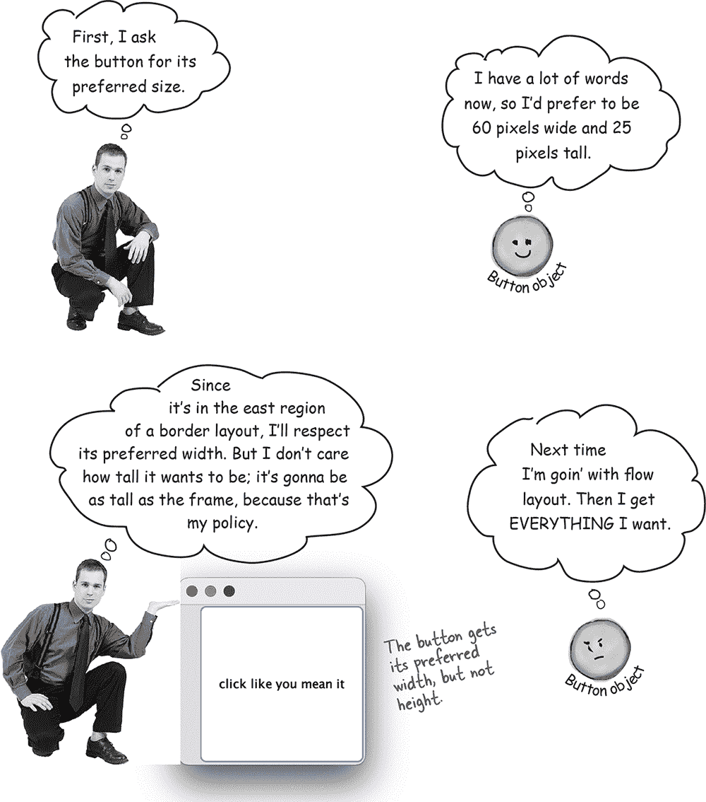
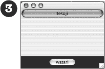

# 第十五章：提高你的 Swing：使用 Swing


**Swing 很简单。** 除非你真的*在意*东西在屏幕上的位置。`Swing` 代码看起来*简单*，但编译、运行并查看后，你会觉得，“嘿，*那*不应该放*在那里*”。使编码*容易*的东西也是使控制*困难*的东西——**布局管理器**。布局管理器对象控制 Java GUI 中小部件的大小和位置。它们代表你做了大量的工作，但你并不总是喜欢结果。你想要两个按钮大小相同，但它们不是。你想要的文本框长度是三英寸，但它是九英寸。或者是一个。而且*在*标签*下*方而不是*在*旁边。但稍加努力，你可以让布局管理器顺从你的意愿。学习一点 `Swing` 将为你未来大部分 GUI 编程提供一个快速入门。想写一个 Android 应用程序？通过这一章的学习将给你一个快速入门。

# `Swing` 组件

***组件*** 是我们称之为*部件*的更正式术语。*你*放在 GUI 中的东西。*用户看到并与之交互的东西*。文本框，按钮，可滚动列表，单选按钮等都是组件。事实上，它们都扩展自 `**javax.swing.JComponent**`。

## 组件可以嵌套

在 `Swing` 中，几乎*所有*组件都能容纳其他组件。换句话说，*你可以把几乎任何东西放到其他东西里*。但大多数情况下，你会将*用户交互*组件（如按钮和列表）添加到*背景*组件（通常称为容器）中，如框架和面板中。虽然*可能*将一个面板放在按钮内部，但这相当奇怪，不会使你获得任何用户友好性奖项。

除了 `JFrame` 外，*交互* 组件和*背景* 组件之间的区别是人为的。例如，`JPanel` 通常用作组合其他组件的背景，但即使是 `JPanel` 也可以是交互式的。就像其他组件一样，你可以注册 `JPanel` 的事件，包括鼠标点击和按键。

###### 注意

**窗体是 `Swing` 组件。几乎所有可以放在 GUI 中的东西都是 `javax.swing.JComponent` 的扩展。**

**制作 GUI 的四个步骤（复习）**

+    制作一个窗口（一个 JFrame）

    `**JFrame frame = new JFrame();**`

+    制作一个组件（按钮，文本框等）

    `**JButton button = new JButton("点击我");**`

+    将组件添加到窗体中

    `**frame.getContentPane().add(BorderLayout.EAST, button);**`

+    显示它（给它一个大小并使其可见）

    ```
import java.io.*;
import java.util.Arrays;

public class GameCharacter implements Serializable {
  private final int power;
  private final String type;
  private final String[] weapons;

  public GameCharacter(int power, String type, String[] weapons) {
    this.power = power;
    this.type = type;
    this.weapons = weapons;
  }

  public int getPower() {
    return power;
  }

  public String getType() {
    return type;
  }

  public String getWeapons() {
    return Arrays.toString(weapons);
  }
}
```

| 把交互式组件放入： | 放入背景组件中： |
| --- | --- |
|  |  |

# 布局管理器


布局管理器是与特定组件关联的 Java 对象，几乎总是一个*background*组件。布局管理器控制包含在其关联组件内的组件。换句话说，如果一个框架持有一个面板，面板持有一个按钮，那么面板的布局管理器控制按钮的大小和位置，而框架的布局管理器控制面板的大小和位置。另一方面，按钮不需要布局管理器，因为按钮不持有其他组件。

如果一个面板持有五个东西，那么这五个东西的大小和位置都由面板的布局管理器控制。如果这五个东西反过来持有其他东西（例如，如果这五个东西中的任何一个是面板或其他容器，持有其他东西），那么这些其他东西将根据持有它们的东西的布局管理器进行放置。

当我们说*hold*时，我们实际上指的是*add*，例如，面板*hold*一个按钮，因为按钮是通过以下方式*add*到面板上的：

`**myPanel.add(button);**`

布局管理器有几种类型，并且每个 background 组件可以有自己的布局管理器。布局管理器在构建布局时有自己的策略要遵循。例如，一个布局管理器可能要求面板中的所有组件必须是相同大小，排列在网格中，而另一个布局管理器则允许每个组件选择自己的大小，但垂直堆叠。以下是嵌套布局的示例：

```
    public class Dog {

      **static final long serialVersionUID =**
                    **-5849794470654667210L;**

      private String name;
      private int size;
      // method code here
    }
    ```


# 布局管理器如何决定？

不同的布局管理器在排列组件时有不同的策略（例如，按网格排列，使它们全部相同大小，垂直堆叠等），但正在布局的组件至少在某种程度上有所发言权。总体而言，布置 background 组件的过程大致如下：


**布局场景**

+    制作一个面板并添加三个按钮到面板上。

+    面板的布局管理器询问每个按钮希望有多大。

+    面板的布局管理器根据其布局策略决定是否应该遵循所有、部分或不遵循按钮的偏好。

+    将面板添加到框架中。

+    框架的布局管理器询问面板希望有多大。

+    框架的布局管理器使用其布局策略来决定是否应该尊重面板的所有、部分或不尊重偏好。

## 不同的布局管理器有不同的策略。

一些布局管理器尊重组件希望的大小。如果按钮希望是 30 像素乘以 50 像素，布局管理器就为该按钮分配这个大小。其他布局管理器只尊重部分组件的首选大小。如果按钮希望是 30 像素乘以 50 像素，那么它将是 30 像素乘以按钮背景 *面板* 的宽度。还有一些布局管理器只尊重正在布置的组件中*最大*的组件的首选大小，而该面板中的其余组件都被设置为相同的大小。在某些情况下，布局管理器的工作可能变得非常复杂，但大多数情况下，一旦你了解了该布局管理器的策略，你就可以预测布局管理器可能会做什么。

# 大三种布局管理器：border、flow 和 box

**BorderLayout**

BorderLayout 管理器将背景组件分为五个区域。您只能向由 BorderLayout 管理器控制的背景添加一个组件。由此管理器布局的组件通常不会以它们的首选大小呈现。**BorderLayout 是窗体的默认布局管理器！**


**FlowLayout**

FlowLayout 管理器有点像文字处理器，但用组件代替文字。每个组件都是它希望的大小，并且它们按添加顺序从左到右布局，类似于打开“自动换行”。因此，当一个组件水平放不下时，它会移到布局中的下一“行”。**FlowLayout 是面板的默认布局管理器！**


**BoxLayout**

BoxLayout 管理器类似于 FlowLayout，每个组件都可以拥有自己的大小，并按添加的顺序放置这些组件。但与 FlowLayout 不同的是，BoxLayout 管理器可以垂直堆叠组件（或者水平排列它们，但通常我们只关心垂直排列）。它类似于 FlowLayout，但是不像自动进行“组件换行”，你可以插入一种“组件换行键”，**强制**组件换到新行。


> **BorderLayout 关心五个区域：东、西、北、南和中心**


**让我们在东部区域添加一个按钮：**


**看看当我们给按钮增加更多字符时会发生什么……**



**让我们在北部区域尝试一个按钮**

```
    File dir = new File("Chapter7");
    dir.mkdir();
    ```


**现在让我们让按钮要求更高**

我们如何做到这一点？按钮已经尽可能宽——与窗口一样宽。但我们可以尝试通过增加字体大小来使其更高。


> **但是在中心区域会发生什么？**

**中心区域获得剩余的内容！**

（除了稍后我们将讨论的一个特殊情况）

```
    if (dir.isDirectory()) {
      String[] dirContents = dir.list();
      for (String dirContent : dirContents) {
        System.out.println(dirContent);
      }
    }
    ```


> **FlowLayout 关心组件的流动：从左到右，从上到下，按添加顺序。**


**让我们在东部区域添加一个面板：**

JPanel 的布局管理器默认为 FlowLayout。当我们将面板添加到框架时，面板的大小和位置仍受 BorderLayout 管理器控制。但是在面板内部的任何内容（换句话说，通过调用 `**panel.add(aComponent)**` 将组件添加到面板）则受面板的 FlowLayout 管理器控制。我们将从在框架的东区域放置一个空面板开始，然后在接下来的页面上添加内容。


**让我们向面板添加一个按钮**


**如果我们在面板上添加两个按钮会发生什么？**


> **BoxLayout 来解救！**
> 
> 它保持组件堆叠，即使有空间可以将它们并排放置。**


> **与 FlowLayout 不同，BoxLayout 可以强制“换行”，即使水平空间足够，也可以使组件换行到下一行。**

但是现在您必须将面板的布局管理器从默认的 FlowLayout 更改为 BoxLayout。


# 与 Swing 组件一起玩耍

您已经了解了布局管理器的基础知识，现在让我们尝试几个最常见的组件：文本字段、滚动文本区域、复选框和列表。我们不会展示每个组件的整个 API，只是一些重点，让您可以开始。如果您想了解更多信息，请阅读《*Java Swing*》（https://www.oreilly.com/library/view/java-swing-2nd/0596004087/）由 Dave Wood、Marc Loy 和 Robert Eckstein 编写。


**如何使用它**

+    从中获取文本

    `System.out.println(field.getText());`

+    在其中放置文本

    

+    选择/突出显示字段中的文本

    ```
    boolean isDeleted = f.delete();
    ```

+    将光标放回字段中（这样用户可以直接开始输入）

    ```
public class QuizCardPlayer {

  public void go() {
    // build and display gui
  }

  private void nextCard() {
    // if this is a question, show the answer, otherwise show
    // next question set a flag for whether we’re viewing a
    // question or answer
  }

  private void open() {
    // bring up a file dialog box
    // let the user navigate to and choose a card set to open
  }

  private void loadFile(File file) {
    // must build an ArrayList of cards, by reading them from
    // a text file called from the OpenMenuListener event handler,
    // reads the file one line at a time and tells the makeCard()
    // method to make a new card out of the line (one line in the
    // file holds both the question and answer, separated by a “/”)
  }

  private void makeCard(String lineToParse) {
    // called by the loadFile method, takes a line from the text file
    // and parses into two pieces—question and answer—and creates a
    // new QuizCard and adds it to the ArrayList called CardList
  }
}
```

**JTextArea**

与 JTextField 不同，JTextArea 可以有多行文本。要使其正常工作，需要进行一些配置，因为它不会默认包含滚动条或自动换行。要使 JTextArea 滚动，您必须将其放入 JScrollPane 中。JScrollPane 是一个真正喜欢滚动的对象，它将处理文本区域的滚动需求。


**JTextArea 示例**


**构造函数**

`JCheckBox check = new JCheckBox("Goes to 11");`

**如何使用它**

+    监听项目事件（当选中或取消选中时）

    `check.addItemListener(this);`

+    处理事件（并找出是否已选中）

    ```
java.nio.file
java.nio.file.attribute
```

+    在代码中选择或取消选择它

    ```
private void saveFile(File file) {
  BufferedWriter writer = null;
  try {
    writer = new BufferedWriter(new FileWriter(file));

    for (QuizCard card : cardList) {
      writer.write(card.getQuestion() + "/");
      writer.write(card.getAnswer() + "\n");
    }

  } catch (IOException e) {
    System.out.println("Couldn't write the cardList out: " + e.getMessage());
  } finally {
    try {
      writer.close();
    } catch (Exception e) {
      System.out.println("Couldn't close writer: " + e.getMessage());
    }
  }
}
```


###### 注意

*JList 构造函数接受任何对象类型的数组。它们不一定是字符串，但列表中会显示字符串表示。*

**构造函数**


###### 注意

这与 JTextArea 类似 —— 你创建一个 JScrollPane（并将列表放入其中），然后将滚动窗格（而不是列表）添加到面板上。

**如何使用**

+    使其拥有垂直滚动条

    ```
private void saveFile(File file) {
  **try (BufferedWriter writer =**           
        **new BufferedWriter(new FileWriter(file))) {**

    for (QuizCard card : cardList) {
      writer.write(card.getQuestion() + "/");
      writer.write(card.getAnswer() + "\n");
    }

  } catch (IOException e) {
    System.out.println("Couldn't write the cardList out: " + e.getMessage());
  }
}
```

+    设置在滚动前显示的行数

    ```
try (BufferedWriter writer =
       new BufferedWriter(new FileWriter(file))) {
```

+    限制用户一次只能选择一项

    ```
FileReader fileReader = new FileReader();
BufferedReader reader = new BufferedReader(fileReader);
```

+    注册列表选择事件

    ```
FileOutputStream f = new FileOutputStream("Foo.ser");
ObjectOutputStream os = new ObjectOutputStream(f);
```

+    处理事件（找出列表中选中的项目）

    

# Code Kitchen


**这部分是可选内容。我们正在制作完整的 BeatBox，包括 GUI 界面等等。在 第十六章，保存对象，我们将学习如何保存和恢复鼓点模式。最后，在 第十七章，建立连接，我们将把 BeatBox 变成一个可用的聊天客户端。**

# 制作 BeatBox

这是此版本 BeatBox 的完整代码清单，包含启动、停止和更改节奏的按钮。代码清单完整且有注释，但这是概述：

+    构建一个 GUI，其中包含 256 个复选框（JCheckBox），初始状态未选中，16 个标签（JLabel）用于显示乐器名称，以及四个按钮。

+    为每个四个按钮注册一个 ActionListener。我们不需要为单独的复选框注册监听器，因为我们不试图动态更改模式声音（即，用户勾选复选框后立即更改）。相反，我们等待用户点击“开始”按钮，然后遍历所有 256 个复选框以获取它们的状态，并创建一个 MIDI 轨道。

+    设置 MIDI 系统（这是你以前做过的），包括获取 Sequencer，创建 Sequence 和 Track。我们使用了 sequencer 的 setLoopCount() 方法来指定序列循环的次数。我们还使用了序列的 tempo factor 来调整节奏，从而在循环的每次迭代中保持新的节奏。

+    当用户点击“开始”时，真正的操作开始。用于“开始”按钮的事件处理方法调用 buildTrackAndStart() 方法。在该方法中，我们遍历所有 256 个复选框（按行，每次一个乐器，跨越所有 16 拍），获取它们的状态，然后使用这些信息构建一个 MIDI 轨道（使用我们在前一章节中使用过的便捷方法 makeEvent()）。一旦轨道构建完成，我们启动 Sequencer，它会持续播放（因为我们正在循环播放），直到用户点击“停止”。


# Exercise


## 哪个代码适用于哪个布局？

下面的六个屏幕中有五个是根据对面页面上的代码片段制作的。将这五个代码片段与它们产生的布局进行匹配。


** 在“GUI-Cross”中找到答案。**

## 代码片段

```
BufferedReader reader = new BufferedReader(new FileReader(file));
String line;
while ((line = reader.readLine()) != null) {
  makeCard(line);
}
```

* * *

```
FileOutputStream f = new FileOutputStream("Game.ser");
ObjectInputStream is = new ObjectInputStream(f);
GameCharacter oneAgain = (GameCharacter) is.readObject();
```

* * *

```
import java.io.*;

class DungeonGame implements Serializable {
  public int x = 3;
  transient long y = 4;
  private short z = 5;

  int getX() {
    return x;
  }
  long getY() {
    return y;
  }
  short getZ() {
    return z;
  }
}

class DungeonTest {
  public static void main(String[] args) {
    DungeonGame d = new DungeonGame();
    System.out.println(d.getX() + d.getY() + d.getZ());
    try {
      FileOutputStream fos = new FileOutputStream("dg.ser");
      ObjectOutputStream oos = new ObjectOutputStream(fos);
      oos.writeObject(d);
      oos.close();

      FileInputStream fis = new FileInputStream("dg.ser");
      ObjectInputStream ois = new ObjectInputStream(fis);
      d = (DungeonGame) ois.readObject();
      ois.close();
    } catch (Exception e) {
      e.printStackTrace();
    }
    System.out.println(d.getX() + d.getY() + d.getZ());
  }
}
```

* * *

[PRE15]

* * *

[PRE16]

## GUI-Cross


你可以做到。

**横向**

1\. 艺术家的沙盒

4\. 边框的万能

5\. Java 外观

9\. 通用服务员

11\. 一个事件

12\. 应用小部件

15\. JPanel 的默认

16\. 多态测试

17\. 摇摆，宝贝

21\. 有很多话要说

23\. 选择多个

25\. 按钮的伙伴

26\. actionPerformed 的主页

**纵向**

2\. Swing 的父亲

3\. 框架的范围

5\. 帮助的主页

6\. 比文本更有趣

7\. 组件俚语

8\. 罗穆林指令

9\. 排列

10\. 边框的顶部

13\. 管理员的规则

14\. 源代码的行为

15\. 默认边框

18\. 用户的行为

19\. 内部的挤压

20\. 后台小部件

22\. 经典的 Mac 外观

24\. 边框的右侧

** 在“GUI-Cross”中找到答案。**

# 练习解决方案


## 哪个代码适用于哪个布局？

(来自“哪个代码适用于哪个布局？”)

|  | 

[PRE17]

|

|  | 

[PRE18]

|

|  | 

[PRE19]

|

|  | 

[PRE20]

|

|  | 

[PRE21]

|

## GUI-Cross

(来自“GUI-Cross”)


