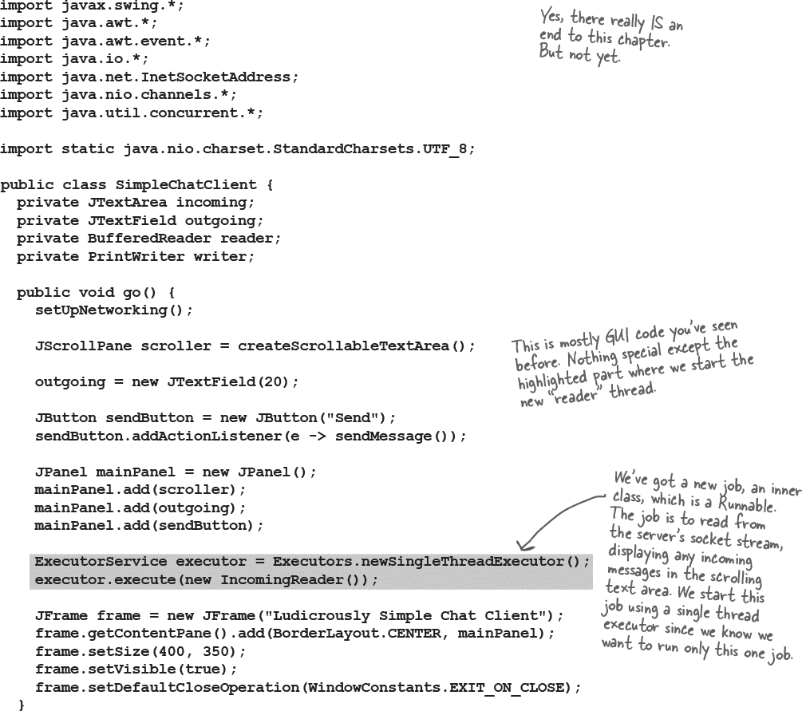

# 第十七章：建立连接：网络和线程


**与外界建立连接。** 你的 Java 程序可以与另一台机器上的程序交流。这很容易。所有底层网络细节都由内置的 Java 库处理。Java 的一个重要优点是，在网络上发送和接收数据可以仅仅是 I/O，只是在 I/O 链的末端有一个稍微不同的连接而已。在本章中，我们将用*通道*连接到外部世界。我们将创建*客户端*通道。我们将创建*服务器*通道。我们将创建*客户端*和*服务器*，并使它们互相交流。我们还需要学习如何同时做多件事情。在本章完成之前，你将拥有一个完全功能的多线程聊天客户端。我们刚刚说过*多线程*吗？是的，现在你*将*学会如何在与 Bob 交谈的同时听 Suzy 的秘密。

# 实时 BeatBox 聊天


你正在做一款电脑游戏。你和你的团队为游戏的每个部分做声音设计。使用 BeatBox 的“聊天”版本，你的团队可以协作——你可以发送一个节奏模式以及你的聊天消息，BeatBox 聊天中的每个人都可以得到它。所以你不仅可以*阅读*其他参与者的消息；你还可以通过点击传入消息区域中的消息，加载和*播放*一个节奏模式。

在本章中，我们将学习如何制作类似于这样的聊天客户端。我们甚至将学习一点关于制作聊天*服务器*。我们将把完整的 BeatBox 聊天留给代码工作坊，但在本章中，你*将*编写一个非常简单的聊天客户端和非常简单的聊天服务器，用于发送和接收文本消息。

**聊天程序概述**

###### 注意

每个客户端都必须了解服务器。

服务器必须了解所有客户端。


**工作原理：**

+    客户端连接到服务器

    

+    服务器建立连接，并将客户端加入参与者列表。

    

+    另一个客户端连接

    

+    客户端 A 向聊天服务发送消息

    

+    服务器将消息分发给所有参与者（包括原始发送者）

    

# 连接、发送和接收

我们需要学习的三件事来使客户端工作：

1.  如何在客户端和服务器之间建立初始**连接**。

1.  如何从服务器**接收**消息*的方式

1.  如何**发送**消息*到*服务器

为了使这些事情起作用，需要进行许多底层工作。但我们很幸运，因为 Java API 使得这对程序员来说非常简单。在本章中，你会看到比网络和 I/O 代码更多的 GUI 代码。

这还不是全部。

在这个简单的聊天客户端中，隐藏着我们在本书中迄今为止还没有面对过的问题：同时做两件事情。建立连接是一次性操作（要么成功要么失败）。但之后，聊天参与者希望**发送出去的消息**和**同时**从其他参与者（通过服务器）*接收传入的消息*。嗯...这需要花点时间思考，但我们将在几页内解决这个问题。

+    **连接**

    客户端**连接到服务器**

    

+    **接收**

    客户端**从服务器读取消息**

    

+    **发送**

    客户端**向服务器写入**消息

    

# 1. 连接

要与另一台机器通信，我们需要一个代表两台机器之间的网络连接的对象。我们可以打开一个 java.nio.channels.SocketChannel 来得到这个连接对象。

什么是连接？是两台机器之间的*关系*，两个**软件组件了解对方**的方式。最重要的是，这两个软件组件知道如何*相互通信*。换句话说，如何向*彼此发送*位。

幸运的是，我们不必关心低级细节，因为它们在“网络堆栈”的更低层次上处理。如果你不知道“网络堆栈”是什么，不用担心。这只是一种查看信息（位）必须通过的层次的方式，从运行在某个操作系统上的 JVM 中的 Java 程序，到物理硬件（例如以太网电缆），再返回到另一台机器。

你需要担心的部分是高级的。你只需要为服务器的地址创建一个对象，然后打开一个通道到该服务器。准备好了吗？

###### 注意

要建立连接，您需要了解服务器的两件事情：它在哪里以及它运行在哪个端口上。

换句话说，

###### 注意

**IP 地址和 TCP 端口号。**


###### 注意

连接意味着两台机器彼此了解，包括网络位置（IP 地址）和 TCP 端口。

> **TCP 端口只是一个数字...一个 16 位数，用于标识服务器上特定的程序**

你的互联网 Web（HTTP）服务器运行在 80 端口。这是一个标准。如果你有 Telnet 服务器，它运行在 23 端口。FTP？20。POP3 邮件服务器？110。SMTP？25。时间服务器位于 37 端口。把端口号想象成唯一的标识符。它们代表了与服务器上运行的特定软件的逻辑连接。就是这样。你不能转动你的硬件盒子然后找到一个 TCP 端口。首先，服务器上有 65536 个端口（0-65535）。所以显然它们不代表插入物理设备的地方。它们只是代表一个应用程序的数字。

常见服务器应用程序的众所周知的 TCP 端口号:


没有端口号，服务器将无法知道客户端想连接到哪个应用程序。由于每个应用程序可能有自己独特的协议，如果没有这些标识符，你会遇到什么麻烦呢？例如，如果你的网络浏览器着陆在了 POP3 邮件服务器而不是 HTTP 服务器上会怎么样？邮件服务器将不知道如何解析 HTTP 请求！即使知道了，POP3 服务器也不知道如何处理 HTTP 请求。

当你编写一个服务器程序时，你将包含告诉程序要在哪个端口号上运行的代码（稍后在本章的 Java 部分中将会看到如何做到这一点）。在我们在本章中编写的聊天程序中，我们选择了 5000。仅仅是因为我们想要这样做。还因为它符合的标准是必须是一个在 1024 到 65535 之间的数字。为什么是 1024？因为 0 到 1023 是为像我们刚刚谈到的那些众所周知的服务而保留的。

如果你正在编写要在公司网络上运行的服务（服务器程序），你应该与系统管理员核实哪些端口已经被占用。例如，你的系统管理员可能会告诉你，你不能使用低于 3000 的端口号。无论如何，如果你重视自己的生命安全，你不会随意分配端口号。除非是你的*家庭*网络。在这种情况下，你只需要与你的*孩子*核实。

###### 注意

TCP 端口号从 0 到 1023 是为众所周知的服务保留的。不要用它们来运行你自己的服务器程序！*

我们正在编写的聊天服务器使用 5000 端口。我们只是选择了一个在 1024 到 65535 之间的数字。

*嗯，也许*你*能*用其中一个，但是你工作的系统管理员会给你写一封措辞强烈的邮件，并抄送给你的老板。


# 2\. 接收

要通过远程连接进行通信，你可以使用正常的 I/O 流，就像我们在上一章节中使用的那样。Java 中最酷的功能之一是，大多数的 I/O 工作都不关心你的高级链流实际连接到了什么。换句话说，你可以像从文件中读取时那样使用**BufferedReader**；不同之处在于底层连接流连接到了一个*Channel*而不是一个*File*！


## 使用 BufferedReader 从网络读取


# 3\. 发送

在前一章中，我们使用了 BufferedWriter。在这里我们有一个选择，但当你一次写入一个 String 时，**PrintWriter**是一个标准选择。你会认出 PrintWriter 中的两个关键方法，print()和 println()！就像我们熟悉的 System.out 一样。

## 使用 PrintWriter 写入网络


# 有多种方法建立连接


如果你查看与远程机器通信的实际代码，可能会看到许多不同的建立连接和读写远程计算机的方法。

你使用哪种方法取决于许多因素，包括（但不限于）你使用的 Java 版本以及应用程序的需求（例如，同时连接的客户端数量，发送消息的大小，消息的频率等）。其中一种最简单的方法是使用**java.net.Socket**而不是 Channel。

## 使用 Socket

你可以从 Socket 获取*InputStream*或*OutputStream*，并且以非常类似于我们已经看到的方式读取和写入。


###### 注意

java.net.Socket 类在所有 Java 版本中都可用。

它通过我们已经用于文件 I/O 的 I/O 流支持简单的网络 I/O。


**随着我们成为一个日益连接的世界，Java 已经进化到提供更多与远程机器通信的方式。**

记住 Channels 在 java.**nio**.channels 包中？java.nio 包（NIO）在 Java 1.4 中引入，Java 7 中进行了更多的变更和添加（有时称为 NIO.2）。

当你处理大量网络连接或大量数据通过这些连接时，使用 Channels 和 NIO 可以获得更好的性能。

**在这一章中，我们使用 Channels 提供与使用 Sockets 获取相同基本连接功能。然而，如果我们的应用程序需要与繁忙的网络连接（或大量连接）很好地配合工作，我们可以不同配置我们的 Channels，并充分利用它们，这样我们的程序能更好地处理高网络 I/O 负载。**

我们选择教你使用*Channels*来开始网络 I/O 的**最简单方式**，这样如果你需要升级到使用更高级特性，就不会是一个很大的跨越。

如果你确实想要了解更多关于 NIO 的知识，可以阅读 Ron Hitchens 的*Java NIO*和 Jeff Friesen 的*Java I/O, NIO and NIO.2*。

# DailyAdviceClient

在我们开始构建 Chat 应用之前，让我们从一些小的东西开始。Advice Guy 是一个服务器程序，提供实用的灵感提示，帮助你度过编码的漫长时光。

我们正在为 Advice Guy 程序构建一个客户端，每次连接时从服务器获取一条消息。

你在等什么？没有这个应用，你可能错过了什么*机会*。


###### 图 17-1\. 顾问人物

+    **连接**

    客户端连接到服务器

    

+    **读取**

    客户端为通道获取了一个 Reader，并从服务器读取了一条消息

    

# DailyAdviceClient 代码

这个程序创建了一个 SocketChannel，创建了一个 BufferedReader（通过通道的 Reader 帮助），并从服务器应用程序（在 5000 端口上运行的任何内容）读取一行。


# 编写一个简单的服务器应用程序

那么，编写服务器应用程序需要什么？只需要几个通道。是的，几个通道，即两个。一个 ServerSocketChannel，用于等待客户端请求（当客户端连接时），以及一个用于与客户端通信的 SocketChannel。如果有多个客户端，我们将需要多个通道，但我们稍后再讨论这个问题。

**工作原理：**

+    服务器应用程序创建了一个 ServerSocketChannel，并将其绑定到特定端口

    ```
    ServerSocketChannel serverChannel = ServerSocketChannel.open();
    serverChannel.bind(new InetSocketAddress(5000));
    ```

    这将使服务器应用程序开始监听传入端口 5000 的客户端请求。

    

+    客户端创建了一个连接到服务器应用程序的 SocketChannel

    `**SocketChannel svr = SocketChannel.open(new InetSocketAddress("190.165.1.103", 5000));**`

    客户端知道 IP 地址和端口号（由配置服务器应用程序的人员发布或提供给他们）。

    

+    服务器创建了一个新的 SocketChannel 来与该客户端通信

    `**SocketChannel clientChannel = serverChannel.accept();**`

    accept() 方法在等待客户端连接时会阻塞（即仅等待）。当客户端最终连接时，该方法将返回一个 SocketChannel，该通道知道如何与该客户端通信。

    ServerSocketChannel 可以回到等待其他客户端连接的状态。服务器只有一个 ServerSocketChannel，并为每个客户端创建一个 SocketChannel。

    

# DailyAdviceServer 代码

这个程序创建了一个 ServerSocketChannel，并等待客户端请求。当它收到客户端请求（即客户端创建了一个新的 SocketChannel 到这个服务器），服务器将创建一个新的 SocketChannel 到该客户端。服务器创建了一个 PrintWriter（使用从 SocketChannel 创建的 Writer）并向客户端发送一条消息。


是的，没错，**服务器在完成当前客户端请求之前无法接受来自其他客户端的请求。** 在此期间，它将进入无限循环的下一次迭代中，并在 accept()调用处等待，直到有新请求到来。然后，它将创建一个 SocketChannel 来向新客户端发送数据，并重新启动整个过程。

要使其能够同时处理多个客户端，我们需要使用单独的线程。

我们将每个新客户端的 SocketChannel 交给一个新的线程，每个线程可以独立工作。

我们就要学习如何做到这一点了！

# 编写聊天客户端

我们将分两个阶段编写聊天客户端应用程序。首先，我们将制作一个仅发送消息但不读取其他参与者消息的版本（这对整个聊天室概念来说是一个令人兴奋和神秘的转折）。

然后我们将全面展示如何制作一个既发送*又*接收聊天消息的版本。

**第一个版本：仅发送**


**代码大纲**

这是聊天客户端需要提供的主要功能概述。完整代码在下一页。

```
public class SimpleChatClientA {
  private JTextField outgoing;
  private PrintWriter writer;

  public void go() {
     // call the setUpNetworking() method     
     // make gui and register a listener with the send button
  }

  private void setUpNetworking() {
    // open a SocketChannel to the server
    // make a PrintWriter and assign to writer instance variable
  } 

  private void sendMessage() {
    // get the text from the text field and
    // send it to the server using the writer (a PrintWriter)
  }
}
```


# 非常，非常简单的聊天服务器


你可以使用这个服务器代码来运行所有版本的聊天客户端。这里适用于所有可能的免责声明。为了使代码保持精简，我们删除了许多使其成为真正服务器所需的部分。换句话说，它可以工作，但至少有一百种方法可以使其崩溃。如果你在完成本书后想要真正提升你的技能，就回来把这个服务器代码变得更加健壮。

完成本章后，你应该能够自己注释此代码。如果*你*能弄清楚发生了什么，那你就会更好地理解它，而不是我们向你解释。但另一方面，这是现成的代码，所以你真的不必完全理解它。它在这里只是为了支持聊天客户端的两个版本。

```
import java.io.*;
import java.net.InetSocketAddress;
import java.nio.channels.*;
import java.util.*;
import java.util.concurrent.*;

import static java.nio.charset.StandardCharsets.UTF_8;

public class SimpleChatServer {
  private final List<PrintWriter> clientWriters = new ArrayList<>();

  public static void main(String[] args) {
    new SimpleChatServer().go();
  }

  public void go() {
    ExecutorService threadPool = Executors.newCachedThreadPool();
    try {
      ServerSocketChannel serverSocketChannel = ServerSocketChannel.open();
      serverSocketChannel.bind(new InetSocketAddress(5000));

      while (serverSocketChannel.isOpen()) {
        SocketChannel clientSocket = serverSocketChannel.accept();
        PrintWriter writer = new PrintWriter(Channels.newWriter(clientSocket, UTF_8));
        clientWriters.add(writer);
        threadPool.submit(new ClientHandler(clientSocket));
        System.out.println("got a connection");
      }
    } catch (IOException ex) {
      ex.printStackTrace();
    }
  }

  private void tellEveryone(String message) {
    for (PrintWriter writer : clientWriters) {
      writer.println(message);
      writer.flush();
    }
  }

  public class ClientHandler implements Runnable {
    BufferedReader reader;
    SocketChannel socket;

    public ClientHandler(SocketChannel clientSocket) {
      socket = clientSocket;
      reader = new BufferedReader(Channels.newReader(socket, UTF_8));
    }

    public void run() {
      String message;
      try {
        while ((message = reader.readLine()) != null) {
          System.out.println("read " + message);
          tellEveryone(message);
      }
    } catch (IOException ex) {
      ex.printStackTrace();
    }
  }
 }
}
```


**第二个版本：发送和接收**


**重要问题：*如何*从服务器接收消息？**

应该很简单；当你设置网络时，也要创建一个 Reader。然后使用`**readLine**`读取消息。

**更重要的问题：*何时*会收到服务器的消息？**

仔细考虑一下。有什么选项？

+    **选项一：每次用户发送消息时从服务器中读取内容。**

    **优点：** 可行，非常简单。

    **缺点：** 愚蠢。为什么选择如此任意的时间来检查消息？如果用户是潜水者并且不发送任何内容会怎么样？

+    **选项二：每 20 秒轮询服务器。**

    **优点：** 可行，并且解决了潜水者问题。

    **缺点：** 服务器如何知道你看过什么，还有什么没看过？服务器必须存储消息，而不是每次接收到消息就执行分发和忘记。而且为什么是 20 秒？这样的延迟会影响可用性，但是当你减少延迟时，你会不必要地增加对服务器的访问。低效。

+    **选项三：一旦从服务器发送，立即读取消息。**

    **优点：** 最高效，最好的可用性。

    **缺点：** 如何同时做两件事？把这段代码放在哪里？你需要一个循环，总是等待从服务器读取。但是这应该放在哪里？一旦启动 GUI，除非 GUI 组件触发事件，否则什么也不会发生。


###### 注意

在 Java 中，你确实可以一边走一边嚼口香糖。

**你现在已经知道我们选择了第三个选项**

我们希望有些东西可以持续运行，不断地从服务器检查消息，但*不会打断用户与 GUI 交互的能力*！因此，当用户愉快地输入新消息或浏览传入消息时，我们希望*在幕后*不断读取来自服务器的新输入。

这意味着我们最终需要一个新的线程。一个新的、独立的栈。

我们希望在只发送版本（第一版）中所做的一切都能以同样的方式工作，同时运行一个新的*进程*，该进程并行地从服务器读取信息并在传入文本区域中显示。

嗯，并不完全是这样。每个新的 Java 线程实际上不是在操作系统上运行的单独进程。但它几乎*感觉*像是。

在我们探索它是如何工作的时候，我们将暂时离开聊天应用程序一会儿。然后我们会回来，在本章的最后将其添加到我们的聊天客户端中。

**Java 中的多线程**

Java 在语言结构中直接支持多线程。而且创建新的执行线程非常简单：

```
Thread t = new Thread();
t.start();
```

就是这样。通过创建一个新的 Thread *对象*，你启动了一个单独的*执行线程*，它有自己的调用栈。

***除了一个问题。***

那个线程实际上什么都不做，所以线程在出生的瞬间就“死”了。当一个线程死亡时，它的新栈也会再次消失。故事结束。

所以我们缺少一个关键组成部分——线程的 *任务*。换句话说，我们需要在单独的线程中运行你希望运行的代码。

在 Java 中的多线程意味着我们必须看看 *线程* 和 *线程运行的任务*。事实上，**在 Java 中运行多个任务的方式不止一种**，不仅仅是 java.lang 包中的 Thread *类*。（记住，java.lang 是你免费隐式导入的包，它包含语言最基础的类，包括 String 和 System。）

# Java 有多个线程，但只有一个 Thread 类。

我们可以用小写字母“thread”来讨论*线程*，用大写字母“Thread”来讨论**Thread**。当你看到*thread*时，我们指的是一个独立的执行线程，换句话说，是一个独立的调用堆栈。当你看到**Thread**时，请考虑 Java 的命名约定。在 Java 中，以大写字母开头的是什么？类和接口。在这种情况下，**Thread**是 java.lang 包中的一个类。**Thread**对象表示一个*执行线程*。在旧版本的 Java 中，每次想启动新的*执行线程*时，都必须创建**Thread**类的一个实例。Java 随着时间的推移发生了变化，现在直接使用**Thread**类并非唯一的方法。随着我们继续学习本章的内容，我们将更详细地了解这一点。

###### 注意

**线程是一个独立的“执行线程”，一个单独的调用堆栈。**

**Thread 是表示线程的 Java 类。**

**在 Java 中不仅使用 Thread 类来实现多线程。**

| **线程** | **Thread** |
| --- | --- |
|  |  |
| *线程*（小写“t”）是一个独立的执行线程。这意味着一个单独的调用堆栈。每个 Java 应用程序都启动一个主线程 - 将 main()方法放在堆栈底部的线程。JVM 负责启动主线程（以及其他线程，如选择，包括垃圾收集线程）。作为程序员，你可以编写代码启动自己的其他线程。 | `**Thread**`（大写“T”）是表示一个执行线程的类。它有启动线程、将一个线程与另一个线程连接、使线程休眠等方法。 |

# 什么是拥有多个调用堆栈的含义？

有了多个调用堆栈，你可以同时发生多件事情。如果你在多处理器系统上运行（像大多数现代计算机和手机一样），实际上可以同时做多件事情。使用 Java 线程，即使你不在多处理器系统上运行或者运行的进程比可用核心多，看起来也可以*同时*做多件事情。换句话说，执行可以在不同的堆栈之间迅速切换，以至于你感觉所有的堆栈都在同时执行。请记住，Java 只是在底层操作系统上运行的一个进程。因此，首先，Java *本身*必须是操作系统上“当前正在执行的进程”。但是一旦 Java 获得执行的机会，JVM *运行*什么？哪些字节码执行？无论当前运行堆栈的顶部是什么！在 100 毫秒内，当前执行的代码可能会切换到*不同*的方法，位于*不同*的堆栈上。

一个线程必须做的事情之一是跟踪当前在线程堆栈上执行的语句（属于哪个方法）。

它可能看起来像这样：


# 要创建一个新的调用堆栈，你需要一个要运行的任务


###### 注意

**`Runnable` 对于线程来说就像工人的工作一样。`Runnable` 是线程应该运行的工作。**

**一个 `Runnable` 持有的方法是放在新调用栈底部的方法：`run()`。**

要启动一个新的调用栈，线程需要一个工作——线程启动时要运行的工作。这个工作实际上是新线程栈中的第一个方法，它必须始终是一个看起来像这样的方法：

```
public void run() {
  // code that will be run by the new thread
}
```

线程如何知道将方法放在栈的底部？因为 `Runnable` 定义了一个约定。因为 `Runnable` 是一个接口。线程的任务可以在实现 `Runnable` 接口的任何类中定义，或者是一个符合 `run` 方法形状的 lambda 表达式。

一旦你有了一个 `Runnable` 类或 lambda 表达式，你可以告诉 JVM 在一个单独的线程中运行这段代码；你正在给线程分配它的工作。

###### 注意

`Runnable` 接口仅定义了一个方法，`public void run()`。因为它只有一个方法，所以它是一个 SAM 类型，也是一个函数式接口，如果你想要的话，可以使用 lambda 表达式代替创建实现 `Runnable` 接口的整个类。

# 要为你的线程创建一个工作，实现 `Runnable` 接口。


# 如何**不**运行 `Runnable`

或许会有诱惑去创建 `Runnable` 的新实例并调用 `run` 方法，但这**不足以创建新的调用栈**。

```
class RunTester {
  public static void main(String[] args) {
    MyRunnable runnable = new MyRunnable();
    runnable.run();
    System.out.println(Thread.currentThread().getName() +
                       ": back in main");
    Thread.dumpStack();
  }
}
```

###### 注意

这样做**不会**达到我们想要的效果！

**`run()` 方法是直接从 `main()` 方法中调用的，因此它是主线程调用栈的一部分。**


# 我们过去如何启动新线程

启动一个新线程的最简单方法是使用我们之前提到的 `Thread` 类。这个方法从 Java 的最开始就存在了，但**不再建议使用**。我们在这里展示它是因为：a）它很简单，b）你会在现实世界中看到它。稍后我们会讨论为什么它可能不是最佳的方法。


# 更好的替代方案：根本不管理线程

创建和启动新线程能够让你对那个线程有很多控制，但缺点是你*必须*对它进行控制。你必须追踪所有线程，并确保它们在结束时关闭。有没有更好的方法来启动、停止甚至重用线程，以至于你不必再控制它们呢？

让我们来介绍一个在 `java.util.concurrent` 中的接口，**`ExecutorService`**。这个接口的实现将*执行*工作（`Runnable`）。在幕后，`ExecutorService` 将创建、重用和终止线程来运行这些工作。

###### 注意

静态工厂方法可以代替构造函数。

工厂方法返回我们需要的接口的确切实现。我们不需要知道具体的类或如何创建它们。

**`java.util.concurrent.Executors`** 类有*工厂方法*来创建我们需要的 `ExecutorService` 实例。

自从 Java 5 以来，执行器一直存在，因此即使您使用的是相当旧的 Java 版本，也应该可以使用。如今基本上不需要直接使用 Thread。

# 运行一个任务

对于我们即将开始的简单案例，我们将只想运行一个任务以及我们的主类。这里有一个*单线程执行器*可以用来实现这一点。


## 新线程的三种状态

无论您是创建一个新的 Thread 并传递给它一个 Runnable，还是使用执行器执行该 Runnable，作业仍将在一个 Thread 上运行。线程在其生命周期中将会经历许多不同的状态，了解这些状态及其之间的转换有助于我们更好地理解多线程编程。


> **但这还不是全部。一旦线程变为可运行，它可以在可运行、运行和另一个状态之间来回移动：*暂时不可运行*。**

**典型的可运行/运行循环**

通常情况下，线程在可运行状态和运行状态之间来回移动，作为 JVM 线程调度器选择要运行的线程，然后将其剔除以便另一个线程有机会运行。


**一个线程可以暂时不可运行**

线程调度器可以将正在运行的线程移动到阻塞状态，原因有多种。例如，线程可能正在执行读取输入流的代码，但没有可读取的数据。调度器会将线程移出运行状态，直到某些数据可用。或者执行的代码可能已经告诉线程将自己置于休眠状态（sleep()）。或者线程可能正在等待，因为它试图调用对象的方法，而该对象被“锁定”。在这种情况下，线程无法继续，直到持有锁的线程释放它。

所有这些条件（及更多）都会导致线程暂时不可运行。


# 线程调度器

线程调度器决定了谁从可运行状态转为运行状态，以及在何时（以及在什么情况下）线程离开运行状态。调度器决定谁运行、运行多久，以及当它决定将它们从当前运行状态中剔除时线程去哪里。


您无法控制调度器。没有 API 可以调用调度器上的方法。最重要的是，调度安排没有任何保证！（虽然有一些*几乎*保证，但即使这些也有些模糊。）

关键在于：***不要将程序的正确性建立在调度程序以特定方式工作上！*** 不同的 JVM 具有不同的调度程序实现，即使在同一台机器上运行相同的程序也可能得到不同的结果。新手 Java 程序员常犯的最严重的错误之一是在单台机器上测试他们的多线程程序，并假设线程调度程序无论程序在何处运行时都会始终工作。

那么这对于“编写一次，随处运行”意味着什么？这意味着为了编写独立于平台的 Java 代码，您的多线程程序必须无论*线程调度程序*如何工作都能正常工作。这意味着您不能依赖于例如调度程序确保所有线程在运行状态下都能良好、完全公平和平等地轮流运行。虽然今天这种情况可能性极小，但您的程序可能最终在具有说：“好的，线程五，轮到你了，只要你完成 run()方法，你可以一直留在这里”的调度程序的 JVM 上运行。

###### 注意

**线程调度程序决定谁运行和谁不运行。它通常让线程轮流运行，很好地。但这并不能保证。它可能让一个线程尽情运行，而其他线程“挨饿”。**

**线程调度程序的不可预测性的一个例子...**


## 我们是如何得到不同的结果的？

多线程程序*不是确定性的*；它们每次运行时都不会以相同的方式运行。线程调度程序可以每次以不同的方式调度每个线程。

**有时它会像这样运行：**


**有时它会像这样运行：**


###### 注意

**即使新线程很小，如果它只有一行代码要运行，就像我们的 lambda 表达式一样，它仍然可能会被线程调度程序中断。**

# 使线程进入睡眠


帮助您的线程轮流运行的一种方法是定期让它们进入睡眠状态。您只需调用静态的 sleep()方法，将要使线程进入睡眠状态的时间量以毫秒为单位传递给它即可。

例如：

```
Thread.sleep(2000);
```

将一个线程击倒，使其离开运行状态，并将其保持在不可运行状态至少两秒钟。线程*不能*再次成为运行线程，直到至少两秒钟已经过去。

有点不幸的是，sleep 方法会抛出一个 InterruptedException，这是一个受检异常，因此所有对 sleep 的调用都必须包装在 try/catch 中（或者声明）。因此，sleep 调用实际上看起来像这样：

```
try {
  Thread.sleep(2000);
} catch(InterruptedException ex) {
    ex.printStackTrace();
}
```

现在你知道你的线程在指定的持续时间之前不会唤醒，但是它是否可能会在“定时器”到期后一段时间内唤醒？实际上是可以的。线程不会自动在指定的时间唤醒并成为当前运行的线程。当线程唤醒时，线程再次受线程调度器控制；因此，无法保证线程停止活动的时间。

###### 注意

**让一个线程睡眠给其他线程运行的机会。**

**当线程唤醒时，它总是回到可运行状态并等待线程调度器再次选择它来运行。**

# 使用 sleep 使我们的程序更可预测

记住我们早些时候的例子，每次运行时都给出不同的结果？回头看代码和示例输出。有时主线程必须等到新线程完成（并打印“top o' the stack”），而其他时候新线程在完成之前就会返回可运行状态，允许主线程回来并打印“back in main”。我们如何解决这个问题？停下来，回答这个问题：“你可以在哪里放一个 sleep()调用，以确保“back in main”总是在“top o' the stack”之前打印？”


# 强制线程睡眠也有缺点。

+    **程序必须至少等待那么长时间。**

    如果我们让线程睡眠两秒钟，线程将在那段时间内无法运行。当它唤醒时，它不会自动成为当前运行的线程。当线程唤醒时，线程再次受线程调度器控制。我们的应用程序将至少停留这两秒钟，可能更长。这听起来可能不是什么大问题，但想象一下一个充满这些故意减慢应用程序速度的暂停的大型程序。

+    **你怎么知道另一个任务会在那个时间内完成？**

    我们让新线程睡眠两秒钟，假设主线程将成为运行线程，并在那段时间内完成其工作。但是如果主线程花费更长时间来完成呢？如果另一个线程运行了一个更长的任务，而不是它呢？人们处理这个问题的一种方法是设置比预期作业时间长得多的睡眠时间，但这样一来，我们的第一个问题就变得更加严重了。


**更好的选择：等待最佳时机。**

在我们的例子中，我们真正想要的是在我们的主线程中等待特定事件发生后才继续我们的新线程。Java 支持多种不同的机制来实现这一点，如 Future、CyclicBarrier、Semaphore 和 CountDownLatch。

###### 注意

**为了协调在多个线程上发生的事件，一个线程可能需要等待另一个线程发送的特定信号，然后才能继续。**

# 倒数直到准备好

当发生重要事件时，您可以使线程*倒数*。一个线程（或多个线程）可以等待所有这些事件完成后再继续。您可能正在倒数，直到最少数量的客户端连接，或者一些服务已启动。

这就是`**java.util.concurrent.CountDownLatch**`的用途。您设置一个要从中倒数的数字。然后任何线程可以在发生相关事件时告诉 latch 倒数。

在我们的例子中，我们只有一件事要计数——我们的新线程应该等到主线程打印“back in main”后才能继续。

###### 注意

**CountDownLatch 是一个屏障同步器。屏障是允许线程协调的机制。**

**其他示例包括 CyclicBarrier 和 Phaser。**


代码与执行 sleep 操作的代码非常相似；主要区别在于主方法中的 latch.countDown。尽管性能差异显著。与必须等待*至少*两秒以确保主线程已打印其消息不同，新线程仅等到主方法打印其“back in main”消息。

要了解这可能对实际系统性能的影响，当此 latch 代码在 MacBook 上运行 100 次时，它大约需要 50 毫秒才能完成*所有*一百次运行，并且输出每次都是正确的顺序。如果仅运行 sleep()版本一次需要超过 2 秒（2000 毫秒），想象一下运行 100 次需要多长时间*....。

# 创建并启动两个线程（或更多！）

如果我们想要启动多个作业以及我们的主线程，会发生什么？显然，如果我们想运行多个线程，我们不能使用 Executors.newSingleThreadExecutor()。还有什么其他选择？


###### 注意

**这些 ExecutorServices 使用某种形式的线程池。这是一组 Thread 实例，可用于（并且可以重复使用）执行作业。**

**池中有多少线程以及如果要运行的作业多于可用的线程数，取决于 ExecutorService 的实现。**

# 线程池

使用资源池，特别是像线程或数据库连接这样昂贵的资源，在应用程序代码中是一种常见模式。


创建新的 ExecutorService 时，其线程池可以从一开始就启动一些线程，或者线程池可能为空。

您可以使用 Executors 类的 helper 方法之一创建带有线程池的 ExecutorService。

```
ExecutorService threadPool =
    Executors.newCachedThreadPool();
```

* * *


您可以使用池中的线程来运行作业，将作业交给 ExecutorService。ExecutorService 然后可以找出是否有空闲的线程来运行作业。

```
threadPool.execute(() -> run("Job 1"));
```

这意味着 ExecutorService 可以**重复使用**线程；它不仅仅是创建和销毁它们。

* * *


当您给 ExecutorService 更多作业运行时，它*可能*会创建并启动新的线程来处理作业。如果作业数量超过线程数量，它*可能*会将作业存储在队列中。

ExecutorService 如何处理额外的作业取决于它的设置方式。

```
threadPool.execute(() -> run("Job 324"));
```

ExecutorService 也可能会**终止**一些空闲一段时间的线程。这有助于最小化应用程序需要的硬件资源（CPU、内存）数量。

# 运行多个线程

下面的示例运行两个作业，并使用固定大小的线程池创建两个线程来运行这些作业。每个线程都有相同的作业：在循环中运行，每次迭代时打印当前运行线程的名称。


# 发生什么了？

线程会轮流进行吗？您会看到线程名称交替吗？它们会多久切换一次？每次迭代后？五次迭代后？


您已经知道答案：*我们不知道！* 这取决于调度程序。在您的操作系统、特定的 JVM 和 CPU 上，您可能会得到非常不同的结果。

在现代多核系统上运行此示例，这两个作业可能会并行运行，但不能保证它们将以相同的时间完成或以相同的速率输出值。

# 线程池的关闭时间

您可能已经注意到我们的示例在主方法的末尾有一个`**threadPool.shutdown**()`。虽然线程池会处理我们的各个线程，但我们确实需要成为负责任的成年人，并在完成后关闭线程池。这样，线程池可以清空其作业队列并关闭所有线程以释放系统资源。

ExecutorService 有两种关闭方法。您可以使用任一方法，但为了安全起见，我们建议两者都使用：

+    **ExecutorService.shutdown()**

    调用 shutdown()礼貌地要求 ExecutorService 整理好一切，这样每个人都可以回家。

    所有当前运行作业的线程都可以完成这些作业，并且队列中等待的任何作业也将被完成。ExecutorService 还将拒绝任何新作业。

    如果您需要等到所有这些事情都完成，可以使用`**awaitTermination**`来等待直到它完成。您可以给 awaitTermination 一个最长等待时间，以等待所有事情结束，因此 awaitTermination 将等待，直到 ExecutorService 完成所有工作或达到超时时间为止。

+    **ExecutorService.shutdownNow()**

    大家都出来！当调用这个方法时，ExecutorService 将尝试停止任何正在运行的线程，不会运行任何等待中的作业，绝对不会让任何人进入线程池。

    如果您需要停止所有事情，请使用此功能。这有时在首先调用 shutdown()后使用，以便给作业完成的机会，然后再完全切断它们。


# 嗯，是的。有一个黑暗面。多线程可能导致并发“问题”。

并发问题导致竞态条件。竞态条件导致数据损坏。数据损坏带来恐惧……你知道剩下的。

一切归结为一个潜在的致命场景：两个或更多线程可以访问单个对象的*数据*。换句话说，执行在两个不同堆栈上的方法都在调用同一个堆上单个对象的获取器或设置器。

这完全是一个“左手不知道右手在做什么”的事情。两个线程，毫不在意地轻松地执行它们的方法，每个线程都认为自己是唯一真正的线程。是唯一重要的线程。毕竟，当一个线程不在运行时，并且在可运行（或阻塞）时，它实际上是昏迷的。当它再次成为当前运行的线程时，它不知道它曾经停止过。

# 练习


## Who Am I?

(来自“练习”)


一堆 Java 和网络术语，穿着全套服装，正在玩一个派对游戏，“我是谁？”他们会给你一个线索 —— 你尝试根据他们说的来猜测他们是谁。假设他们总是对自己说实话。如果他们碰巧说出对多位参与者都可能成立的话，那么请把这些可能性填写到句子旁边的空白处，附上一个或多个参与者的名字。

**今晚的参与者：**

**InetSocketAddress、SocketChannel、IP 地址、主机名、端口、Socket、ServerSocketChannel、Thread、线程池、Executors、ExecutorService、CountDownLatch、Runnable、InterruptedException、Thread.sleep()**

| **我需要被关闭，否则我可能会永远存在** | ______________________________________________ |
| --- | --- |
| **我让你可以与远程机器通信** | ______________________________________________ |
| **我可能会被 sleep() 和 await() 所抛出** | ______________________________________________ |
| **如果你想重用线程，你应该使用我** | ______________________________________________ |
| **如果你想连接到另一台机器，你需要知道我** | ______________________________________________ |
| **我就像在机器上运行的一个独立进程** | ______________________________________________ |
| **我可以给你所需的 ExecutorService** | ______________________________________________ |
| **如果你想让客户端连接到我，你需要我之一** | ______________________________________________ |
| **我可以帮助您使您的多线程代码更可预测** | ______________________________________________ |
| **我代表一个要运行的作业** | ______________________________________________ |
| **我存储服务器的 IP 地址和端口** | ______________________________________________ |

 **答案在 “我是谁？”。**

# 新的改进版 SimpleChatClient

在本章的开始，我们建立了 SimpleChatClient，它可以向服务器发送出站消息，但不能接收任何消息。记得吗？这就是我们首次讨论线程主题的原因，因为我们需要一种方法同时执行两个任务：与 GUI 交互发送消息到服务器，并同时读取服务器的传入消息，将其显示在滚动文本区域中。

这是新改进的聊天客户端，可以发送和接收消息，多亏了多线程的强大支持！请记住，你需要先运行聊天服务器才能运行此代码。



# 练习


## 代码磁铁


一个工作的 Java 程序在冰箱上被打乱了（见下一页）。你能否重组下一页的代码片段，使其成为一个能够产生下面输出的工作 Java 程序？

要使其正常工作，你需要先运行来自“真的，真的简单的聊天服务器”的`**SimpleChatServer**`。


 **答案在“代码磁铁”中。**


# 练习解答


## 我是谁？

| 如果不关闭我，我可能会永远存在 | *ExecutorService* |
| --- | --- |
| 我让你与远程机器通信 | *SocketChannel, Socket* |
| sleep() 和 await() 可能会抛出我 | *InterruptedException* |
| 如果你想重复使用线程，你应该使用我 | *线程池，ExecutorService* |
| 如果你想连接到另一台机器，你需要知道我 | *IP 地址，主机名，端口* |
| 我就像是在机器上运行的一个单独进程 | *线程* |
| 我可以给你所需的 ExecutorService | *Executors* |
| 如果你想让客户端连接到我，你需要一个我 | *ServerSocketChannel* |
| 我可以帮助你使多线程代码更可预测 | *Thread.sleep()，CountDownLatch* |
| 我代表一个要运行的作业 | *Runnable* |
| 我存储服务器的 IP 地址和端口 | *InetSocketAddress* |

## 代码磁铁

(来源于“代码磁铁”)


## 代码厨房


> **现在你已经看到如何构建聊天客户端，我们有 BeatBox 的最终版本！**
> 
> **它连接到一个简单的 MusicServer，使你能够与其他客户端发送和接收节奏模式。**
> 
> **代码非常长，所以完整列表实际上在附录 A 中。**
