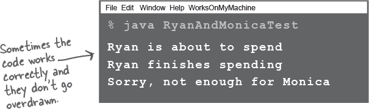

# 第十八章：处理并发问题：竞态条件和不可变数据


**同时做两件或更多事情很难。**编写多线程代码很容易。编写按照预期工作的多线程代码可能更难。在这最后一章，我们将向您展示两个或更多线程同时工作时可能出现的问题。您将了解到一些位于 java.util.concurrent 中的工具，这些工具可以帮助您编写正确工作的多线程代码。您将学习如何创建不可变对象（不会改变的对象），这些对象对多个线程使用是安全的。到本章结束时，您将掌握多种处理并发的工具。

# 这可能会出什么问题呢？

在上一章的结尾，我们暗示在处理多线程代码时可能并非一帆风顺。事实上，我们甚至直言不讳地说：

###### 注意

“这归结为一个潜在的致命场景：两个或更多线程可以访问单个对象的数据。”


**婚姻有危机。**


**这对夫妇还能挽救吗？**

***接下来，在一个非常特别的史蒂夫博士秀***

[第 42 集节目录音]

欢迎收看史蒂夫博士秀。

今天我们的故事围绕着导致夫妻分手的顶级原因之一——财务问题。

今天的问题对：赖恩和莫妮卡，共享一个银行账户。但如果我们找不到解决方案，这个情况就将不会长久。问题是？经典的“两个人——一个银行账户”。

这是莫妮卡对我描述的情况：

“赖恩和我都同意不要透支支票账户。所以程序是，谁想花钱*必须*在提取现金或刷卡之前检查账户余额。这一切看起来是那么简单。但突然间我们开始收到透支费用！

我以为这是不可能的；我以为我们的程序是安全的。但后来*这*发生了：

赖恩的在线购物车里装了总值为$50 的商品。他查看账户余额，发现是$100。没问题。所以他开始结账程序。


就在这时，*我*介入了；当赖恩在填写运输细节时，*我*想花费$100。我查看了余额，它是$100（因为赖恩还没有点击“支付”按钮），所以我认为，没问题。所以我花了这笔钱，再次没有问题。但随后赖恩终于支付了，我们突然透支了！他不知道我同时在花钱，所以他只是继续完成了他的交易而没有再次检查余额。你必须帮助我们，史蒂夫博士！”

是否有解决方案？他们是否注定要分开？我们不能帮助他们摆脱网购成瘾，但我们能确保其中一个人在另一个人购物时不能开始消费吗？

让我们在商业广告中思考一下这个问题。

# Ryan 和 Monica 的问题，以代码形式

以下示例显示了当*两个*线程（Ryan 和 Monica）共享*一个*对象（银行账户）时可能发生的情况。

代码有两个类，BankAccount 和 RyanAndMonicaJob。还有一个 RyanAndMonicaTest 类，其中包含一个主方法用于运行所有内容。RyanAndMonicaJob 类实现了 Runnable 接口，表示 Ryan 和 Monica 都会进行的行为——检查余额和花钱。

RyanAndMonicaJob 类有共享的 BankAccount 实例变量、人员姓名和他们想要花费的金额。代码运行方式如下：


+    **创建共享银行账户的实例**

    创建一个新的会正确设置所有默认值。

    ```
    BankAccount account = new BankAccount();
    ```

+    **为每个人创建一个 RyanAndMonicaJob 实例**

    我们需要为每个人创建一个作业。我们还需要让他们能够访问 BankAccount 并告诉他们要花多少钱。

    ```
    RyanAndMonicaJob ryan = new RyanAndMonicaJob("Ryan", account, 50);
    RyanAndMonicaJob monica = new RyanAndMonicaJob("Monica", account, 100);
    ```

+    **创建一个 ExecutorService 并给它这两个作业**

    由于我们知道有两个作业，一个是为 Ryan，一个是为 Monica，我们可以创建一个包含两个线程的固定大小线程池。

    ```
    ExecutorService executor = Executors.newFixedThreadPool(2);
    executor.execute(ryan);
    executor.execute(monica);
    ```

+    **观察两个作业同时运行**

    一个线程代表 Ryan，另一个代表 Monica。两个线程在花钱之前都会检查余额。请记住，当多个线程同时运行时，不能假设你的线程是唯一修改共享对象（例如 BankAccount）的线程。即使与共享对象相关的代码只有两行，并且它们紧挨着。

    ```
    if (account.getBalance() >= amount) {
      account.spend(amount);
    } else {
      System.out.println("Sorry, not enough money");
    }
    ```

**在 goShopping() 方法中，要像 Ryan 和 Monica 一样——检查余额，如果有足够的钱，就花钱。**

**这应该防止账户透支。**

**但是...如果 Ryan 和 Monica 同时花钱，银行账户里的钱可能在另一个人花之前就被花完了！**

# Ryan 和 Monica 的示例


###### 注

此代码不确定性；它并不总是每次都产生相同的结果。您可能需要运行几次才能看到问题。

这在多线程代码中很常见，因为它依赖于哪些线程首先启动以及每个线程何时获得 CPU 核心的时间。



**在进行提款之前，goShopping() 方法总是检查余额，但我们还是透支了。**

**这是一个场景：**

Ryan 检查余额，看到有足够的钱，然后去结账。

与此同时，Monica 检查余额。她也看到有足够的钱。她不知道 Ryan 即将付款。

Ryan 完成了他的购买。

Monica 完成了她的购买。大问题！在她检查余额并花钱之间，Ryan 已经花了钱！

**Monica 对账户的检查无效，因为 Ryan 已经检查过，并且还在进行购买中。**

在 Ryan 完成之前，Monica 必须停止访问账户，反之亦然。

**他们需要一个账户访问锁！**

**这把锁的工作方式是这样的：**

+    银行账户交易（检查余额和取款）关联了一个锁。只有一把钥匙，它会一直与锁在一起，直到有人想要访问账户。

    

    **当没有人使用账户时，银行账户交易处于解锁状态。**

+    当 Ryan 想要访问银行账户（检查余额和取款）时，他锁上了锁并把钥匙放在口袋里。现在没有其他人可以访问该账户，因为钥匙不在了。

    

    **当 Ryan 想要访问账户时，他会锁上锁并带走钥匙。**

+    **Ryan 在完成交易之前将钥匙放在口袋里。** 由于他独有这把钥匙，Monica 在 Ryan 解锁账户并归还钥匙之前无法访问该账户。

    现在，即使 Ryan 在检查余额后分心了，他也有保证在花费资金时余额仍然相同，因为他在做其他事情时保持了钥匙！

    

    **当 Ryan 完成后，他会解锁锁并归还钥匙。现在钥匙可以供 Monica（或再次是 Ryan）访问账户。**

# 我们需要将余额检查和支出资金作为一个原子事务来执行


我们需要确保一旦一个线程启动购物交易，*它必须被允许完成*，然后其他线程才能改变银行账户。

换句话说，我们需要确保一旦一个线程检查了账户余额，该线程就有保证可以在任何其他线程检查账户余额之前花费资金！

使用**`synchronized`**关键字来锁定一个方法或对象，以便只有一个线程可以同时使用它。

这就是如何保护银行账户！我们可以在执行银行交易的方法中锁定银行账户。这样，一个线程可以完成整个交易，从头到尾，即使该线程被线程调度程序挂起，或者另一个线程正试图在完全相同的时间做出更改。

在接下来的几页中，我们将看看我们可以锁定的不同事物。以 Ryan 和 Monica 的例子来说，很简单——我们希望将我们的购物交易包裹在一个锁定银行账户的块中：


> **`synchronized`** 关键字意味着线程需要一个钥匙才能访问同步代码。
> 
> **为了保护您的*数据*（如银行账户），同步处理操作该数据的代码。**


###### 注意

（对于精通物理学的读者的说明：是的，在这里使用“原子”一词的惯例并不反映整个亚原子粒子的事物。在涉及线程或事务的上下文中，听到“原子”一词时，请思考牛顿，而不是爱因斯坦。嘿，这不是我们的惯例。如果我们负责的话，我们将把海森堡的不确定性原理应用于与线程相关的几乎所有事物。）

# 使用对象的锁


每个对象都有一个锁。大部分时间，锁是未锁定的，你可以想象一个虚拟的钥匙就在旁边。只有当对象有一个**同步块**（就像在最后一页）或者类有**同步方法**时，对象锁才会起作用。如果一个方法在方法声明中有`synchronized`关键字，那么这个方法就是同步方法。

当一个对象有一个或多个同步方法时，***只有当线程能获取到对象锁的钥匙时，线程才能进入同步方法！***

锁不是按*方法*而是按*对象*来分配的。如果一个对象有两个同步方法，那么这不仅意味着两个线程不能进入同一个方法。它意味着不能有两个线程同时进入该对象的*任何*同步方法。例如，如果一个对象上有两个同步方法`method1()`和`method2()`，如果一个线程在`method1()`中，那么第二个线程不仅不能进入`method1()`，显然，它*也不能进入 method2()*，或者该对象上的任何其他同步方法。

想想看。如果你有多种可能作用于对象实例变量的方法，那么所有这些方法都需要用`synchronized`来保护。

同步的目标是保护关键数据。但请记住，你不锁定数据本身；而是同步访问那些*访问*该数据的方法。

那么当一个线程在执行其调用堆栈时（从`run()`方法开始），突然遇到一个同步方法会发生什么呢？线程意识到在进入方法之前需要该对象的钥匙。它查找钥匙（这一切都由 JVM 处理；Java 中没有用于访问对象锁的 API），如果钥匙可用，线程就会抢占钥匙并进入方法。

从那时起，线程紧紧抓住这个钥匙，好像线程的生命依赖于它一样。直到线程完成同步方法或块之前，线程都不会放弃这个钥匙。因此，在线程持有该钥匙时，其他线程无法进入该对象的*任何*同步方法，因为该对象的唯一钥匙不可用。


###### 注意

每个 Java 对象都有一个锁。一个锁只有一个钥匙。

大部分时间，锁是未锁定的，也没人在乎。

但是如果一个对象有同步方法，只有当对象的锁的钥匙可用时，线程才能进入其中一个同步方法。换句话说，只有另一个线程还没有抢占该对象锁的钥匙时，线程才能进入。

# 使用同步方法

我们能同步`goShopping()`方法来修复 Ryan 和 Monica 的问题吗？

```
private synchronized void goShopping(int amount) {
  if (account.getBalance() >= amount) {
    System.out.println(name + " is about to spend");
    account.spend(amount);
    System.out.println(name + " finishes spending");
  } else {
    System.out.println("Sorry, not enough for " + name);
  }
}
```

**它不起作用！**


`synchronized` 关键字锁定一个对象。`goShopping()` 方法在 `RyanAndMonicaJob` 中。同步实例方法意味着“锁定 *这个* `RyanAndMonicaJob` 实例”。然而，`RyanAndMonicaJob` 有*两个*实例；一个是“ryan”，另一个是“monica”。如果“ryan”被锁定，“monica”仍然可以对银行账户进行更改；她不关心“ryan”作业是否被锁定。

需要锁定的对象，这两个线程正在争夺的对象，是`BankAccount`。在`RyanAndMonicaJob`的方法上放置`synchronized`（并锁定一个`RyanAndMonicaJob`实例）并不能解决任何问题。

# 锁定正确的对象很重要

由于是共享`BankAccount`对象，你可以说应该由`BankAccount`来负责确保多个线程安全使用。`BankAccount`上的`spend()`方法可以确保有足够的钱*并且*在单个事务中进行借记。


# 令人恐惧的“丢失更新”问题

这是另一个经典的并发问题。有时你会听到它们被称为“竞争条件”，其中两个或更多线程同时更改同一数据。它与 Ryan 和 Monica 的故事密切相关，所以我们将使用这个例子来说明更多的问题。

丢失更新围绕一个过程：

步骤 1：获取账户中的余额

```
int i = balance;
```

步骤 2：将 1 添加到该余额


即使我们使用更常见的语法`balance++`，也不能保证编译后的字节码是一个“原子过程”。实际上，它可能不是—它实际上是多个操作：读取当前值，然后将该值加一并将其设置回原始变量。

在“丢失更新”问题中，我们有许多线程试图增加余额。先看看代码，然后我们再看看真正的问题：


# 让我们运行这段代码...


**我们丢失了线程 A 最后的更新！线程 B 之前已经对余额的值进行了“读取”，当 B 醒来时，它就像从未错过一拍一样继续进行。**

# 使`increment()`方法成为原子操作。同步它！


对 `increment()` 方法进行同步解决了“丢失更新”问题，因为它将方法中的步骤（读取余额和增加余额）作为一个不可分割的单元。


**一旦线程进入方法，我们必须确保方法中的所有步骤（作为一个原子过程）在任何其他线程可以进入该方法之前完成。**

+    线程 A 运行一段时间

    +   尝试进入`increment()`方法。

    +   方法是同步的，所以**获取这个对象的关键**

    +   读取余额：0

    +   将余额的值设置为 0 + 1。

    +   现在余额是 1

    +   **归还关键**（它完成了 increment() 方法）。

    +   重新进入 increment() 方法并**获取关键**。

    +   读取余额：1

        *[现在线程 A 被发送回可运行状态，但由于尚未完成同步方法，线程 A 仍然持有关键]*

        

+    选择运行线程 B。

    +   尝试进入 increment() 方法。该方法是同步的，因此我们需要获取关键。

        **关键不可用。**

        *[现在线程 B 被发送到“对象锁不可用”的休息室]*

        

+    线程 A 再次运行，从上次停下的地方继续（请记住，它仍然持有关键）。

    +   设置余额值为 1 + 1。

    +   现在余额为 2

        **归还关键。**

        *[现在线程 A 被发送回可运行状态，但由于已完成 increment() 方法，线程不再持有关键]*

        

+    选择运行线程 B。

    

    +   尝试进入 increment() 方法。该方法是同步的，因此我们需要获取关键。

        这次，关键**可用**；拿到关键。

        读取余额：2

        *[继续运行……]*

# 死锁，同步的致命副作用

同步使 Ryan 和 Monica 避免同时使用他们的银行账户，并且使我们免于丢失更新。但我们还提到不应该同步所有内容的一个重要原因是同步会减慢程序速度。

还有一个重要的考虑因素：我们在使用同步代码时需要小心，因为没有什么能像线程死锁那样让你的程序陷入困境。线程死锁发生在两个线程都持有另一个线程想要的关键时。这种情况没有出路，所以这两个线程将简单地坐下并等待。而等待。

如果你熟悉数据库或其他应用服务器，你可能会意识到这个问题；数据库经常有类似同步的锁定机制。但是真正的事务管理系统有时可以处理死锁。例如，它可能会假设当两个事务花费太长时间完成时可能发生死锁。但与 Java 不同，应用服务器可以执行“事务回滚”，将回滚事务的状态返回到事务（原子部分）开始之前的状态。

Java 没有处理死锁的机制。它甚至*不知道*发生了死锁。因此，你需要仔细设计。我们不会在这一页上详细讨论死锁以外的更多细节，所以如果你发现自己编写多线程代码，可能需要学习 Brian Goetz 等人的《Java 并发编程实践》，它详细讨论了你可能面临的各种并发问题（如死锁），以及解决这些问题的方法。

**导致死锁只需要两个对象和两个线程。**


**一个简单的死锁场景：**


# 并不总是需要使用同步

由于同步可能会带来一些成本（如性能和潜在死锁），你应该了解其他管理多线程共享数据的方式。java.util.concurrent 包提供了许多类和工具来处理多线程代码。

## 原子变量

如果共享数据是 int、long 或 boolean，我们可能可以用原子变量来替换它们。这些类提供了原子方法，即可以安全地由一个线程使用，而不必担心另一个线程同时更改对象的值。

有几种类型的原子变量，例如**AtomicInteger**、**AtomicLong**、**AtomicBoolean**和**AtomicReference**。

我们可以使用 AtomicInteger 来解决我们的丢失更新问题，而不是同步增量方法。


当你使用它们的比较和交换（CAS）操作时，原子变量变得更加有趣。CAS 是另一种对值进行原子更改的方法。你可以通过使用**`compareAndSet`**方法在原子变量上使用 CAS。是的，这是一个略有不同的名称！编程总是最难解决的问题，名字是如此。

compareAndSet 方法接受一个值，这是你期望的原子变量的值，将其与当前值进行比较，如果匹配，则操作将完成。

实际上，我们可以使用这种方法来解决 Ryan 和 Monica 的问题，而不是用**`synchronized`**锁定整个银行账户。

# 使用原子变量的比较和交换

我们如何利用原子变量和 CAS（通过**`compareAndSet`**）来解决 Ryan 和 Monica 的问题？

由于 Ryan 和 Monica 都试图访问一个 int 值，即账户余额，我们可以使用 AtomicInteger 来存储该余额。然后，当有人想花钱时，我们可以使用**`compareAndSet`**来更新余额。


用通俗的语言说：

> **“只有在当前余额与预期余额相同时，才将余额设置为此新值，并告诉我余额是否实际变动了。”**

比较和交换使用*乐观锁定*。乐观锁定意味着你不会阻止所有线程访问对象；你尝试进行更改，但接受更改***可能不会发生***的事实。如果操作失败，你可以决定该怎么办。你可以决定再试一次，或者发送一条消息告诉用户它没能成功。

这可能比简单地锁定对象中的所有其他线程更麻烦，但它可能比锁定所有内容更快。例如，当多个写操作同时发生的机会非常低或者当你有很多线程在读取而写入操作较少时，你可能不想在每次写入时付出锁定的代价。

> 当你使用 CAS 操作时，你必须处理操作不成功的情况。

# Ryan 和 Monica，原子化进行

让我们在 Ryan 和 Monica 的银行账户中看到整个过程的实际应用。我们将把余额放在 AtomicInteger 中，并使用 compareAndSet 来对余额进行*原子*更改。


###### 注意

java.util.concurrent 提供了许多有用的类和工具，用于处理多线程代码。看看那里有什么！


**如果要在线程之间共享对象并且不希望线程更改其数据，请使对象不可变。**

要确信*另一个*线程不会更改数据的最佳方法是使对象中的数据无法更改。当对象的数据不能更改时，我们称其为**不可变对象**。

# 编写不可变数据类


# 使用不可变对象

能够在共享对象上更改数据并假设所有其他线程能够看到这些更改是非常方便的。

然而，我们也看到，虽然这很*方便*，但并不是很*安全*。

另一方面，当线程使用不能更改的对象时，可以对该对象中的数据做出假设；例如，一旦线程从对象中读取了一个值，它就知道数据不会更改。

我们不需要使用同步或其他机制来控制谁更改数据，因为它无法更改。


**使用不可变对象意味着以不同的方式思考。**

我们不再修改*同一个*对象，而是用新对象*替换*旧对象。新对象具有更新后的值，需要使用新对象的线程才能获取新值。

旧对象会发生什么？如果它仍然被某些东西使用（有时使用旧数据是完全有效的），它将继续存在于堆上。如果不再使用，它将被垃圾收集，我们就不必再担心它了。

# 更改不可变数据

想象一个具有客户的系统，每个客户对象都有一个地址，表示客户的街道地址。如果客户的地址是不可变对象（所有字段都是 final 的，数据不能更改），那么当客户搬家时，如何更改客户的地址？

+    **客户引用指向包含客户街道地址数据的原始地址对象。**

    

+    **当客户搬家时，将创建一个全新的地址对象，其中包含客户的新街道地址。**

    

+    **客户对象对其地址的引用被更改为指向新的地址对象。**

    


绝对正确。如果您的系统中有数据发生变化，这些变化确实必须发生在某个地方。从这次讨论中带走的关键思想是，您应用程序中的不是所有类都必须具有数据变化。事实上，我们建议尽量减少变化的地方。这样，您就不必考虑多个线程同时进行更改的情况。

有许多有效处理不可变数据类的技术；我们在这里只是浅尝辄止。有趣的是，Java 16 引入了*记录*，这些是语言直接提供的不可变数据类。

###### 注意

在可能的情况下使用不可变数据类。

限制数据可以被多个线程更改的地方数量。

# 共享数据的更多问题


我们快到了，我们保证！只剩下最后一件事要看一看。

到目前为止，我们已经看到许多线程写入相同数据可能会出现的各种问题。这也适用于集合中的数据。

即使只有一个线程在修改数据，如果有大量线程**读取**相同的数据，我们甚至可能遇到问题。

此代码只有一个线程向集合写入，但有两个线程在读取它。


# 从一个正在改变的数据结构中读取会导致异常

在最后一页运行代码有时会抛出异常。到目前为止，您知道这类问题在很大程度上取决于硬件、操作系统和 JVM 的心血来潮。


###### 注意

如果一个集合在一个线程修改时，另一个线程正在读取该集合，可能会得到`ConcurrentModificationException`异常。

# 使用线程安全的数据结构

显然，如果有多个线程同时读取正在改变的数据，那么老式的`ArrayList`显然不适合。幸运的是，我们有其他选择。我们需要一个线程安全的数据结构，一个可以被多个线程同时写入和读取的数据结构。

`java.util.concurrent`包中有许多线程安全的数据结构，我们将看看**`CopyOnWriteArrayList`**如何解决这个特定的问题。

当你有一个列表被**大量读取但很少改变**时，`CopyOnWriteArrayList`是一个合理的选择。稍后我们会看到为什么。


# `CopyOnWriteArrayList`

`CopyOnWriteArrayList`利用不可变性提供了在其他线程写入时对读取线程安全的访问。

它是如何工作的？好吧，它做的就是字面意思：当一个线程在写入列表时，它实际上是在写入列表的*副本*。当更改完成后，新副本替换原始副本。同时，任何在更改前读取列表的线程都可以愉快（并安全地！）地读取原始副本。

+    **CopyOnWriteArrayList 的一个实例包含一个有序的数据集，就像一个数组。**

    

+    当线程 A 读取 CopyOnWriteArrayList 时，它会获得一个迭代器，允许它在那个时间点读取列表数据的**快照**。

    

+    线程 B 通过添加新元素将数据写入 CopyOnWriteArrayList，而 CopyOnWriteArray 在进行任何更改之前创建列表数据的**副本**。对于任何读取或写入线程来说，这是不可见的。

    

+    当线程 B 对“列表”进行更改时，实际上是在更改此副本。它非常高兴知道正在进行更改。像线程 A 这样的读取线程根本不受影响；它们正在迭代原始数据的快照。

    

+    一旦线程 B 完成其更新，原始数据将被新数据替换。

    如果线程 A 仍在读取，则安全地读取旧数据。如果在更改后其他任何线程开始读取，则它们获取新数据。

    

###### 注意

在早期版本的 Java 中，线程安全集合通过锁定来保证安全，例如 java.util.Vector。

Java 5 引入了 java.util.concurrent 中的并发数据结构。这些数据结构不使用锁。

# 练习


## BE the JVM


**此页面上的 Java 文件表示一个完整的源文件。您的任务是扮演 JVM，并确定程序运行时的输出。**

**您如何修复它，确保每次输出都是正确的？**

 **答案在 “BE the JVM” 中。**

```
import java.util.*;
import java.util.concurrent.*;

public class TwoThreadsWriting {
  public static void main(String[] args) {
    ExecutorService threadPool = Executors.newFixedThreadPool(2);
    Data data = new Data();
    threadPool.execute(() -> addLetterToData('a', data));
    threadPool.execute(() -> addLetterToData('A', data));
    threadPool.shutdown();
  }

  private static void addLetterToData(char letter, Data data) {
    for (int i = 0; i < 26; i++) {
      data.addLetter(letter++);
      try {
        Thread.sleep(50);
      } catch (InterruptedException ignored) {}
    }
    System.out.println(Thread.currentThread().getName() + data.getLetters());
    System.out.println(Thread.currentThread().getName()
                               + " size = " + data.getLetters().size());
  }
}

final class Data {
  private final List<String> letters = new ArrayList<>();

  public List<String> getLetters() {return letters;}

  public void addLetter(char letter) {
    letters.add(String.valueOf(letter));
  }
}
```

### 在气闸口险些碰撞


当莎拉加入机载开发团队的设计审查会议时，她凝视着印度洋上升起的日出。尽管飞船的会议室非常令人幽闭恐惧，但看到地球上日夜交替的蓝白新月充满了莎拉敬畏和感激之情。

## 五分钟的谜团


今天早晨的会议集中讨论轨道飞行器气闸的控制系统。随着最终的建设阶段接近尾声，太空行走的次数预计会大幅增加，船舱气闸的进出交通量也非常高。“早上好，莎拉，”汤姆说，“你的时机太完美了；我们刚开始详细设计审查。”

“正如大家所知道的，”Tom 说，“每个气闸都配备了宇航员专用的 GUI 终端，内外各一。每当宇航员进出轨道飞行器时，他们都会使用这些终端来启动气闸序列。” Sarah 点头并问道：“Tom，你能告诉我们进入和退出的方法序列是什么吗？” Tom 站起身飘到白板前说：“首先，这是退出序列方法的伪代码。” Tom 迅速在白板上写了下来。

```
orbiterAirlockExitSequence()

  verifyPortalStatus();

  pressurizeAirlock();

  openInnerHatch();

  confirmAirlockOccupied();

  closeInnerHatch();

  decompressAirlock();

  openOuterHatch();

  confirmAirlockVacated();

  closeOuterHatch();
```

“为了确保序列不被中断，我们已经同步了`orbiterAirlockExitSequence()`方法调用的所有方法，” Tom 解释道。“我们不希望看到一个返回的宇航员无意中撞到他的同伴没穿空间裤子！”

当 Tom 抹去白板时，大家都笑了，但 Sarah 觉得有些不对劲，当 Tom 开始在白板上写入进入序列的伪代码时，这终于让她恍然大悟。“等一下，Tom！” Sarah 喊道，“我觉得我们在退出序列设计上有一个大缺陷。

让我们回头再看看；这可能非常关键！”

***为什么 Sarah 停止了会议？她怀疑什么？***

 **答案在“Five-Minute Mystery”中。**

# 练习解答


## BE the JVM

(来源于“BE the JVM”)

答案是输出不会每次都相同。理论上，人们可能期望大小始终为 52（字母表中的 2 × 26 个字母），但实际上这是一个丢失更新的问题之一。


可以用两种不同的方式解决；两种方式都是有效的。

**同步写入方法**


**使用线程安全的集合**


###### 注意

使用任一解决方案，您不必两者都做！！

使用线程安全的集合，您不必同步写入方法。

## 五分钟谜题

(来源于“BE the JVM”)


**Sarah 知道什么？**

Sarah 意识到，为了确保整个退出序列能够无中断地运行，`orbiterAirlockExitSequence()`方法需要进行同步。按照现有设计，一个返回的宇航员可能会中断退出序列！退出序列线程不应该在底层方法调用的任何一点上被中断，但它可以在这些调用之间被中断。Sarah 知道整个序列应该作为一个原子单元运行，并且如果`orbiterAirlockExitSequence()`方法被同步，它就不能在任何时候被中断。
