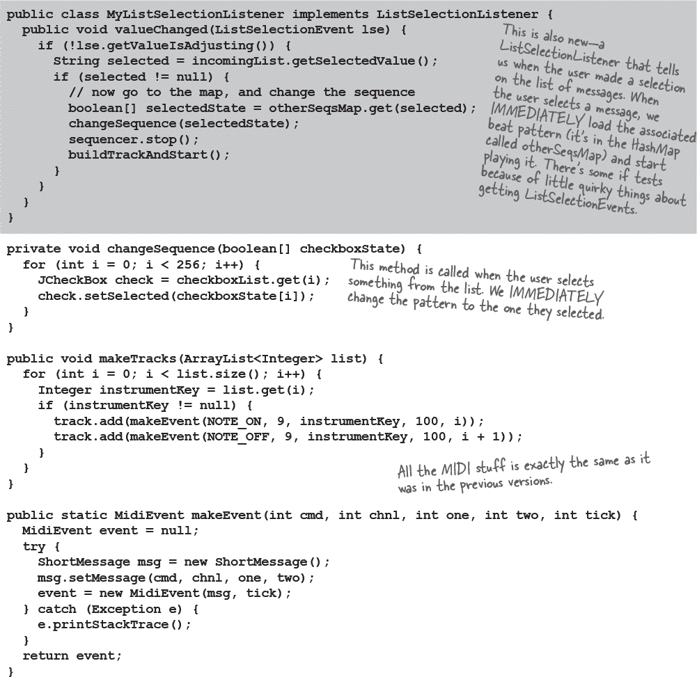

# 附录 A. 最终代码厨房

###### 注意

**最后，完整版的 BeatBox！**

**它连接到一个简单的 MusicServer，以便您可以与其他客户端发送和接收节拍模式。**

# 最终的 BeatBox 客户端程序

大部分代码与前几章节的代码厨房中的代码相同，因此我们不再重复注释整段代码。新添加的部分包括：

GUI：为显示传入消息的文本区域（实际上是一个滚动列表）和文本字段添加了两个新组件。

网络：与本章节中的 SimpleChatClient 类似，BeatBox 现在连接到服务器并获取输入输出流。

多线程：与 SimpleChatClient 类似，我们启动一个“读取器”任务，持续监视服务器发来的消息。但不同之处在于，接收到的消息包括两个对象：字符串消息和序列化数组（用于保存所有复选框的状态）。

所有代码都可以在*[`oreil.ly/hfJava_3e_examples`](https://oreil.ly/hfJava_3e_examples)*找到。

# 最终的 BeatBox 服务器程序

大部分代码与我们在第十七章中创建的 SimpleChatServer 相同，*建立连接*。事实上，唯一的区别在于此服务器接收并重新发送两个序列化对象，而不是一个纯字符串（尽管其中一个序列化对象恰好是一个字符串）。

