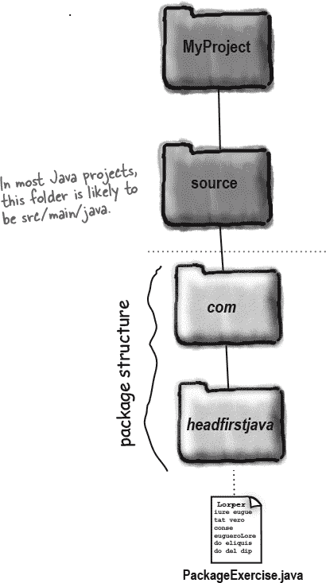
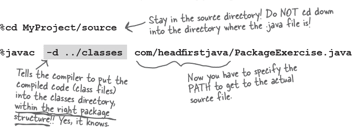
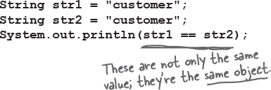

# 附录 B. 没有包含在本书其余部分中的前十个主题……


我们涵盖了很多内容，你几乎完成了这本书的阅读。我们会想念你，但在让你进入 Java 世界之前，我们感觉不合适没有为你做更多准备。我们不可能将你需要知道的所有内容都放入这个相对较小的附录中。事实上，我们*确实*曾经包括了关于 Java 的所有内容（其他章节未涵盖的部分），将字体大小缩小到 .00003，一切都合适，但没人能读懂它。所以，我们把大部分内容扔掉了，但保留了这个前十个主题附录中的最佳部分。是的，有超过十个真正有用的事情你仍然需要知道。

这*真的是*本书的结尾。除了索引（必读！）。

# #11 JShell（Java REPL）

**Java 9+**

## 你为什么在意？

REPL（读取评估打印循环）允许你运行代码片段，而不需要完整的应用程序或框架。这是尝试新功能、实验新想法并获得即时反馈的好方法。我们将其放在本附录的开头，以便你可以使用 JShell 尝试一些我们将在接下来的页面中讨论的功能。

### 启动 REPL

JShell 是 JDK 的一部分的命令行工具。如果 JAVA_HOME/bin 在系统路径中，你可以直接从命令行输入 “jshell”（有关入门的详细信息，请参阅 Oracle 的介绍 JShell (*[`oreil.ly/Ei3Df`](https://oreil.ly/Ei3Df)*)）。


JShell 仅在**JDK 9 及更高版本**中可用，但好消息是，即使在旧版 Java 上运行代码和应用程序，你仍然可以从更高版本使用 JShell，因为它完全独立于你的 “JAVA_HOME” 或 IDE 的 Java 版本。只需直接从你想要使用的任何 Java 版本的 *bin* 目录运行即可。

### 运行 Java 代码不需要类

在提示符下尝试一些 Java 代码：


注意：

+   不需要类

+   不需要 *public static main* 方法

+   行末不需要分号

直接开始输入 Java 代码！

### 不仅仅是代码行数

你可以定义变量和方法：


它支持*前向引用*，因此你可以草拟代码的结构，而不必立即定义一切。


### 代码建议

如果在输入时按 Tab 键，将会获得代码建议。你还可以使用上下箭头来循环浏览你到目前为止输入的行。


### 命令

JShell 中有许多有用的命令，这些命令不是 Java 的一部分。例如，输入 **`/vars`** 查看你声明的所有变量。输入 **`/exit`** 来退出。使用 **`/help`** 查看命令列表和获取更多信息。

Oracle 有一个非常有用的 JShell 用户指南（*[`oreil.ly/Ei3Df`](https://oreil.ly/Ei3Df)*），还展示了如何使用 JShell 创建和运行脚本。

# #10 包

## 包可以防止类名冲突

虽然包不仅仅是为了防止名称冲突，但这是一个关键特性。如果面向对象的一部分目的是编写可重用的组件，开发人员需要能够从各种来源拼凑组件，并从中构建出新的东西。你的组件必须能够“与他人合作”，包括那些你没写过甚至不知道的组件。

还记得很久以前在第六章，*使用 Java 库*，当我们讨论包名如何像类的全名，技术上称为*完全限定名*吗？List 实际上是**`java.util.List`**，GUI List 实际上是**`java.awt.List`**，而 Socket 实际上是**`java.net.Socket`**。哎哟，一个例子，说明包名如何帮助防止名称冲突——有一个 List 是数据结构，另一个 List 是 GUI 元素，我们可以用包名来区分它们。

注意这些类的“名字”都以*java*开头。换句话说，它们的完全限定名的第一部分是“java”；当你考虑包结构时，请考虑一个层次结构，并相应地组织你的类。


**这张图片对你来说是什么样子？它看起来不就像一个目录层次结构吗？**

## 防止包名称冲突

标准的包命名约定是用你的反向域名作为每个类的前缀。请记住，域名是唯一的。两个不同的人可以被命名为巴斯洛缪·辛普森，但是两个不同的域名不能被命名为*[doh.com](http://doh.com)*。


当你查看*[`oreil.ly/hfJava_3e_examples`](https://oreil.ly/hfJava_3e_examples)*的代码示例时，你会看到我们已经把类分别放在每一章的包中，以明确区分这些例子。

###### 注意

**包可以防止名称冲突，但前提是你选择一个保证唯一的包名。最好的方法是用你的反向域名作为包名的前缀。**


### 要把你的类放入一个包中：

+    **选择一个包名**

    我们使用**`com.headfirstjava`**作为示例。类名是 PackageExercise，所以现在这个类的完全限定名是**`com.headfirstjava.PackageExercise`**。

+    **在你的类中放置一个包语句**

    这必须是源代码文件中的第一条语句，在任何导入语句之上。每个源代码文件中只能有一个包语句，所以**`所有类都必须在同一个包中`**。当然，这包括内部类。

+    **建立匹配的目录结构**

    仅仅在代码中放置一个包语句来***声明***你的类在一个包中是不够的。只有当你把类放在匹配的目录结构中时，你的类才*真正*属于一个包。因此，如果完全限定的类名是 com.headfirstjava.PackageExercise，你*必须*把 PackageExercise 源代码放在一个名为**`headfirstjava`**的目录中，该目录***必须***位于名为**`com`**的目录中。



### 关于目录的一点说明

在现实世界中，源文件和类文件通常保存在不同的目录中——你不希望将源代码复制到它正在运行的地方（客户的计算机或云端），只需复制类文件。

Java 项目最常见的结构是基于 Maven 的*约定：

`**MyProject/src/main/java**` 应用程序源代码

`**MyProject/src/test/java**` 测试源代码

类文件被放置在其他地方。真实的企业系统通常使用像 Maven 或 Gradle 这样的构建工具来编译和构建应用程序（我们的示例代码使用 Gradle）。每个构建工具将类文件放入不同的文件夹中：

|  | Maven | Gradle |
| --- | --- | --- |
| 应用程序类 | MyProject/target/classes | MyProject/out/production/classes |
| 测试类 | MyProject/target/test-classes | MyProject/out/test/classes |

*Maven 和 Gradle 是 Java 项目中最常见的构建工具。

## 编译和运行带有包的代码

我们不需要使用构建工具来分离我们的类和源文件。通过使用`**-d**`标志，*你*可以决定编译后的类文件落在哪个**`目录`**，而不是接受类文件默认落在与源代码相同的目录中。

使用`**-d**`标志进行编译不仅可以让你将编译后的类文件发送到源文件所在的目录之外的目录中，而且还知道将类放入正确的包目录结构中。而且，使用-d 进行编译告诉编译器如果目录不存在就*构建*这些目录。

> **`-d`标志告诉编译器，“将类放入其包目录结构中，使用`-d`后面指定的类作为根目录。但是...如果目录不存在，首先创建它们，*然后*将类放在正确的位置！”**

### 使用`-d`（目录）标志进行编译



要编译 com.headfirstjava 包中的所有.java 文件，请使用：


### 运行你的代码


# #9 字符串和包装类的不可变性

我们在第十八章中讨论了不可变性，并且我们将在本附录的最后一项中提到不可变性。本节专门讨论两个重要的 Java 类型中的不可变性：字符串和包装类。

## 为什么你要在意字符串是不可变的？

出于安全目的和节省内存的考虑（无论您是在手机、物联网设备还是云上运行，内存都很重要），Java 中的字符串是不可变的。这意味着当您说：

```
String s = "0";
for (int i = 1; i < 10; i++) {
   s = s + i;
}
```

实际发生的是您正在创建十个字符串对象（值为“0,” “01,” “012,” 到“0123456789”）。最终，*s*引用的是值为“0123456789”的字符串，但在此时存在*十个不同*的字符串！

类似地，如果您对字符串使用方法来“更改”字符串对象，则根本不会更改该对象；它会创建一个新的：


### 这如何节省内存？

每当您创建一个新的字符串时，JVM 将其放入称为“字符串池”的特殊内存部分（听起来很清爽，不是吗？）。如果池中已经有一个具有相同值的字符串，则 JVM *不会创建副本*；它会将您的引用变量引用到*现有*条目。因此，您不会有 500 个“customer”单词的对象（例如），而是对单个“customer”字符串对象的 500 个引用。



### 不可变性使得重用成为可能

JVM 可以做到这一点，因为字符串是**`immutable`**的；一个引用变量不能在另一个引用变量正在引用的同一字符串下更改字符串的值。

### 未使用的字符串会发生什么？

我们的第一个示例创建了许多未使用的中间字符串（“01,” “012,”等）。这些放在字符串池中，位于堆上，因此可以进行垃圾回收（参见第九章）。未使用的字符串最终将被垃圾回收。

但是，如果您必须进行大量的字符串操作（如连接等），可以通过使用*StringBuilder*来避免创建不必要的字符串：

```
StringBuilder s = new StringBuilder("0");
for (int i = 1; i < 10; i++) {
  s.append(i);
}
String finalString = s.toString();
```

这样，单个*可变* StringBuilder 每次都会更新以表示中间状态，而不是创建十个*不可变*字符串实例并丢弃九个中间字符串。

## 你为什么关心包装器是不可变的？

在第十章中，我们讨论了包装类的两个主要用途：

+   将原始类型包装起来，使其可以像对象一样操作。

+   使用静态实用方法（例如 Integer.parseInt()）。

记住，当您创建像这样的包装对象时很重要：

```
Integer iWrap = new Integer(42);
```

该包装对象到此为止。它的值将*永远*是 42。***包装对象没有设置方法***。当然，您可以将*iWrap*指向*另一个*包装对象，但这样就会有*两个*对象。创建包装对象后，无法更改该对象的*值*！

# #8 访问级别和访问修饰符（谁看到什么）

Java 有四个访问级别和三个访问修饰符。之所以只有三个修饰符，是因为默认情况下（当您不使用任何访问修饰符时），其中一个是四个访问级别之一。

**访问级别**（按照从最不限制到最限制的顺序）


**访问修饰符**

```
public
protected
private
```

大多数情况下，你只会使用公共（public）和私有（private）访问级别。

**public**

使用 public 用于你向其他代码公开的类、常量（静态常量变量）和方法（例如 getter 和 setter），以及大多数构造方法。

**private**

对于几乎所有实例变量和不希望外部代码调用的方法（换句话说，被类的公共方法使用的方法），使用 private。

虽然你可能不经常使用其他两种（protected 和 default），但你仍需要了解它们的作用，因为你会在其他代码中看到它们。

**default 和 protected**

**default**

保护（protected）和默认（default）访问级别都与包相关联。默认访问很简单——意味着只有 *同一个包内* 的代码可以访问具有默认访问权限的代码。因此，默认类（即没有显式声明为 *public* 的类）只能由与默认类同一包中的类访问。

但是真正*访问*一个类是什么意思呢？没有访问权限的代码甚至不允许*考虑*这个类。通过考虑，我们的意思是在代码中*使用*这个类。例如，如果你没有对一个类的访问权限，因为有访问限制，你就不能实例化这个类，甚至不能将它作为变量、参数或返回值的类型声明。你根本无法在你的代码中输入它！如果你这样做，编译器会报错。

想一想其含义——一个默认类有公共方法意味着这些公共方法实际上并不是公共的。如果你看不到这个类，你就不能访问这个方法。

为什么有人想要限制对同一包内代码的访问呢？通常，包被设计为一组共同工作的类的集合。因此，在同一个包内的类需要访问彼此的代码可能是有道理的，而作为包，只有少数类和方法向外部公开（即包之外的代码）。

好的，这就是 default。它很简单——如果某物有默认访问权限（记住，意味着没有显式的访问修饰符！），只有与默认 *thing*（类、变量、方法、内部类）相同包中的代码可以访问该 *thing*。

那么保护访问到底有什么作用呢？

**protected**

保护访问几乎与默认访问相同，只有一个例外：它允许子类*继承*受保护的东西，*即使这些子类位于扩展其超类的包之外*。就是这样。这就是保护访问带给你的一切——让你的子类可以在超类包之外，但仍*继承*类的片段，包括方法和构造方法。

许多开发人员发现很少有理由使用受保护的访问级别，但在某些设计中会使用它，并且有一天你可能会发现它正是你所需要的。关于受保护的一个有趣之处是——与其他访问级别不同——受保护的访问仅适用于*继承*。如果一个子类在包外有一个对超类实例（具有受保护方法的超类，例如）的*引用*，那么子类不能使用该超类引用访问受保护的方法！子类访问该方法的唯一方式是*继承*它。换句话说，包外的子类没有*访问*受保护的方法；它只是通过继承*拥有*该方法。

###### 注意

为其他开发者编写库的经验丰富的开发人员会发现默认和受保护的访问级别非常有帮助。

这些访问级别可以将库的内部与其他开发人员将从其代码中调用的 API 分开。

# #7 可变参数

我们在第十章 *数字的重要性*中简要看到了可变参数，当我们查看 String.format()方法时。你也在第十一章 *数据结构*中看到了它们，当我们查看*集合的便捷工厂方法*时。可变参数让一个方法接受任意数量的相同类型的参数。

## 你为什么在乎？

你可能不会写很多（甚至一个！）带有可变参数的方法。但你可能会使用它们，传入可变参数，因为 Java 库确实提供了一些有用的方法，比如我们刚提到的那些方法，可以接受任意数量的参数。

### 我怎样才能知道一个方法是否接受可变参数？

让我们看一下 String.format()的 API 文档：

```
static String format(String format, Object... args)
```

三个点(...)表示这个方法在字符串参数之后接受任意数量的对象，**`包括零个`**。例如：


接受可变参数的方法通常不在乎有多少个参数；这并不重要。例如考虑 List.of()。它不在乎你想要在列表中有多少项；它只会将所有参数添加到新列表中。

### 创建一个接受可变参数的方法

通常你会调用一个接受可变参数的方法，而不是创建它，但我们还是来看一下。如果你想定义自己的方法，例如，打印传入的所有内容，你可以这样做：

```
void printAllObjects(Object... elements) {
  for (Object element : elements) {
    System.out.println(element);
  }
}
```

参数*elements*并不神奇；实际上它只是一个对象数组。因此，你可以像创建方法签名为以下方式那样迭代它：

```
void printAllObjects(Object[] elements) {
```

不同的是调用代码。你不需要创建要传入的对象数组，而是可以方便地传入任意数量的参数。

### 规则

+   一个方法只能有一个可变参数。

+   可变参数必须是最后一个参数。

# #6 注解

## 你为什么在乎？

我们在第十二章中简要提到了注解，*Lambda 和 Stream：What, Not How*，当时我们说可以用 lambda 表达式实现的接口可能会用“@FunctionalInterface”注解标记。

向代码添加注解可以添加额外的行为，或者注解可以是一种友好于编译器的文档；也就是说，您只是用一些额外信息标记代码，这些信息可以选择性地被编译器使用。

您肯定会在现实世界中看到并很可能使用注解。

### 您会在哪里看到注解？

您会在使用 Java EE/Jakarta EE、Spring/Spring Boot、Hibernate 和 Jackson 等库和框架的代码中看到注解，这些在 Java 世界中用于构建大型和小型应用程序的库和框架非常常用。


您肯定会在测试代码中看到注解。回顾第五章，*Extra-Strength Methods*，我们介绍了测试代码的概念，但我们还没有展示使其更容易的框架。最常见的是 JUnit。如果您查看*[`oreil.ly/hfJava_3e_examples`](https://oreil.ly/hfJava_3e_examples)*中的代码示例，您会看到“test”文件夹中有一些示例测试类。


###### 注意

注解可以应用于类和方法，变量（局部和实例）和参数，甚至代码中的其他一些位置。

### 注解可以有元素

一些注解包含元素，类似于带有名称的参数。

```
@Table(name="cust")
public class Customer {
```

如果注解只有一个元素，则不需要给出名称。

```
@Disabled("This test isn't finished")
void thisTestIsForIgnoring() {
```

正如您在前面的示例中看到的，对于没有元素的注解，您不需要添加括号。

您可以向您正在注解的类、方法或变量添加多个注解。

### 它们的作用是什么？

嗯，这取决于！有些可以用作一种编译器安全文档。如果您向具有多个抽象方法的接口添加@FunctionalInterface，您将收到编译器错误。

其他注解（如@NotNull）可以被您的 IDE 或分析工具使用，以查看您的代码是否正确。

许多库提供了注解，供您使用来标记代码的部分，以便框架知道如何处理您的代码。例如，@Test 注解标记了需要由 JUnit 作为单独测试运行的方法；@SpringBootApplication 标记了具有*main*方法的类，这是 Spring Boot 应用程序的入口点；@Entity 标记了 Java 类作为需要由 Hibernate 保存到数据库的数据对象。

一些注解在您的代码之上提供行为。例如，Lombok 可以使用注解生成通用代码：在类的顶部添加@Data，Lombok 将生成构造函数、getter 和（如果需要）setter，以及 hashCode、toString 和 equals 方法。

# #5 Lambda 和 Map

**Java 8+**

## 你为什么要在意呢？

Java 8 著名地向 Java 添加了 lambda 和 streams，但不太为人所知的是 java.util.Map 也添加了一些以 lambda 表达式作为参数的新方法。这些方法使得在 Map 上执行常见操作变得更加容易，这将节省您的时间和精力。

### 如果键没有值，则创建一个新值

想象一下，你想追踪客户在你的网站上做了什么，你可以使用一个 Actions 对象来实现这一点。你可能有一个从 String 用户名到 Actions 的 Map。当客户执行一些你想要添加到他们的 Actions 对象中的操作时，你要么：

+   为这个客户创建一个新的 Actions 对象并将其添加到 Map 中

+   获取此客户的现有 Actions 对象

非常常见的是使用*if*语句和*null*检查来执行此操作（Java 8 之前）：


这不是很多代码，但这是一个一再使用的模式。如果你使用的是 Java 8 或更高版本，你根本不需要这样做。使用**computeIfAbsent**，并给它一个 lambda 表达式，说明如果给定键没有条目时应该“计算”进 Map 的值：


### 只有在它已经存在时才更新值

可能还有其他情况，当你只想在 Map 中存在时更新值。例如，你可能有一个计数的 Map，比如指标，你只想更新你关心的指标。你不想向 Map 中添加任意新的指标。在 Java 8 之前，你可能会使用*contains*，*get*和*put*的组合来检查 Map 是否有这个指标的值，如果有的话就更新它。


Java 8 添加了**computeIfPresent**，它接受你要查找的键和一个 lambda 表达式，你可以用它来描述如何计算 Map 的更新值。使用这个，上面的代码可以简化为：


### 其他方法

在 Map 上还有其他更高级的方法，当你想“添加一个新值或对现有值进行操作”（甚至删除一个值）时会很有用，比如*merge*和*compute*。还有*replaceAll*，你可以给它一个 lambda 表达式，计算 Map 中所有值的新值（例如，如果需要，我们可以使用这个来增加我们之前示例中的所有指标）。而且，像所有的集合一样，它有一个*forEach*，让我们可以迭代 Map 中的所有键/值对。

Java 库不断发展，所以即使你认为你已经很了解一些你经常使用的东西，比如 List 或 Map，时刻关注可能让你的生活更轻松的变化也是值得的。

记住，Java API 文档（*[`oreil.ly/ln5xn`](https://oreil.ly/ln5xn)*）是一个很好的起点，如果你想查看一个类上有哪些方法以及它们的作用。

# #4 并行流

**Java 8+**

回到 第十二章 *Lambda 和 Streams：What, Not How* 中，我们详细讨论了 Streams API。我们没有看到 Streams 的一个非常有趣的特性，即可以利用现代多核、多 CPU 硬件并行运行流操作。现在让我们来看看这个。

到目前为止，我们已经使用 Streams API 有效地“查询”我们的数据结构。现在，想象这些数据结构可能变得非常大。我们是真的非常大。就像来自数据库的所有数据，或者来自社交媒体 API 的实时数据流。我们*可以*逐一处理每个项目，以**`串行`**的方式，直到得到我们想要的结果。或者，我们可以将工作分解为多个操作，并在不同的 CPU 上**`并行`**运行它们。在 第十七章 和 第十八章 中，您可能会被诱惑去编写一个多线程应用程序来完成这项工作，但*您并不需要*！

## 转向并行

您可以简单地告诉 Streams API 您希望您的流管道在多个 CPU 核心上运行。有两种方法可以做到这一点。

1.  **启动 parallelStream**

    

1.  **将 parallel() 添加到流管道**

    ```
    List<Song> songs = getSongs();
    Stream<Song> par = songs.stream()
                            .parallel();
    ```

两者都执行相同的操作，您可以选择您喜欢的任何一种方法。

## 好了现在怎么办？

现在，只需像在 第十二章 中那样编写一个流管道，添加所需的操作，并以终结符结束。Java 库将负责找出：

+   如何将数据分割以在多个 CPU 核心上运行流管道

+   运行多少个并行操作

+   如何合并多个操作的结果

## 多线程已经处理

在背后，parallel streams 使用 [Fork-Join 框架](https://docs.oracle.com/javase/tutorial/essential/concurrency/forkjoin.html)（本书未涉及；参见 *[`oreil.ly/XJ6eH`](https://oreil.ly/XJ6eH)*），这是另一种类型的线程池（我们在 第十七章 *建立连接* 中有所涉及）。使用 parallel streams 时，线程数量与应用程序运行的核心数量相等。有方法可以更改此设置，但建议除非你*真的*知道自己在做什么，否则应坚持使用默认设置。

## 不要到处都使用 parallel！

在你急于使所有流调用并行化之前，请**等待**！记得我们在第十八章中提到过，*处理并发问题*，多线程编程很难，因为你选择的解决方案很大程度上取决于你的应用程序、数据和环境？同样适用于使用并行流。并行处理并利用多个 CPU 核心***不是***免费的，也***不***自动意味着你的应用程序会运行得更快。

并行运行流管道是有成本的。数据需要分割，操作需要在各个数据片段上独立线程运行，然后在最后需要以某种方式组合每个独立并行操作的结果以得出最终结果。所有这些都会增加时间成本。

如果进入流管道的数据是一个简单的集合，就像我们在第十二章中看到的例子一样（事实上，在大多数地方使用流的情况下），使用串行流几乎肯定会更快。是的，你没看错：对于大多数普通用例，你***不***想并行处理。

并行流在以下情况下可以提高性能：

+   输入集合非常大（至少考虑数十万个元素）

+   流管道正在执行复杂且长时间运行的操作。

+   数据/操作的分解（拆分）和结果的合并并不太昂贵。

在使用之前，你应该测量并行和非并行的性能差异。如果想了解更多，Richard Warburton 的《Java 8 Lambdas》书中有一节关于数据并行性的优秀内容。

# #3 枚举（也称为枚举类型或枚举）

我们已经讨论了 API 中定义的常量，例如`**JFrame.EXIT_ON_CLOSE**`。你也可以通过将变量标记为`**static final**`来创建自己的常量。但有时你会想要创建一组常量值来表示变量的***唯一***有效值。这组有效值通常称为枚举。完整的枚举在 Java 5 中引入。

## 乐队中有谁？

假设你正在为你最喜欢的乐队创建一个网站，并且你希望确保所有的评论都指向特定的乐队成员。

## 伪造“枚举”的旧方法：


这种技术的好消息是确实使代码更易读。另一个好消息是，你永远不能改变你创建的伪枚举的值；`KEVIN`将永远是`1`。坏消息是，没有简单或良好的方法来确保`selectedBandMember`的值始终是`1, 2`或`3`。如果某些难以找到的代码片段将`selectedBandMember`设置为`812`，你的代码很可能会崩溃。

###### 注意

这是伪造枚举的老方法，但你仍然会在现实生活中看到这样的代码（例如，旧的 Java 库，如 AWT）。

不过，如果你能控制代码，尝试使用枚举而不是像这样的常量。看看下一页……

让我们看看乐队成员在“真正”的枚举中会是什么样子。虽然这是一个非常基本的枚举，但大多数枚举通常都很简单。

### 一个官方的“enum”


### 你的枚举扩展了 java.lang.Enum

当你创建一个枚举时，你正在创建一个新类，并且***你隐式地扩展*** `***java.lang.Enum***`。你可以将枚举声明为独立的类，在自己的源文件中，或者作为另一个类的成员。

### 使用枚举进行“if”和“switch”操作

使用我们刚创作的枚举，我们可以在代码中使用 `if` 或 `switch` 语句进行分支。还请注意，我们可以使用 `==` 或 `.equals()` 方法比较枚举实例。通常认为 `==` 是更好的风格。


你可以向你的枚举添加很多东西，比如构造函数、方法、变量，以及称为常量特定类体的东西。它们并不常见，但你可能会遇到它们。

答案：

金·鲍勃

香蕉！

# #2 本地变量类型推断（var）

**Java 10+**

如果你使用 Java 10 或更高版本，可以在声明*本地*变量（即方法内的变量，**不是**方法参数或实例变量）时使用 **`var`**。


这是另一个*类型推断*的例子，编译器可以利用它已知的类型信息来减少你的编写工作。编译器知道 *name* 是一个字符串，因为它在等号的右侧被声明为字符串。


## 类型推断，不是动态类型

当你使用 *var* 声明变量时，***它仍然有一个类型***。这不是在 Java 中添加动态或可选类型的一种方式（它不像 Groovy 的 *def*）。这只是避免两次写入类型的一种方式。

当你声明变量时，确实必须以某种方式告诉编译器它的类型。你不能稍后再赋值。所以，你***不能***这样做：


因为编译器不知道 *name* 的类型。

这也意味着你不能稍后更改它的类型：


## 必须有人读你的代码

使用 *var* 确实可以使代码更简洁，而且 IDE 可以准确告诉你变量的类型，因此你可能会倾向于在所有地方都使用 var。

然而，阅读你的代码的人可能没有使用 IDE 或者与你对代码的理解相同。

我们在这本书中没有使用 var（即使这样会更容易地将代码放在页面上），因为我们想要向你明确地说明代码在做什么。

## 提示：更好的变量名会更有用

如果在代码中看不到类型信息，具有描述性的变量名和方法名对读者会特别有帮助。


## Tip: 变量将会是具体类型

在第十一章中，我们开始“面向接口编程”，即将变量声明为接口类型，而不是实现类型：

```
List<String> list = new ArrayList<>();
```

如果你正在使用 var，就不能这样做。类型将是右侧的类型：


## Tip: 不要在 diamond operator 中使用 var

看看最后一个例子。我们首先将 list 声明为 List<String>，然后在右侧使用了 diamond operator (<>)。编译器从左侧知道列表元素的类型是 String。

如果像第二个例子中使用 var，编译器将不再具有这些信息。如果你希望列表仍然是一个 String 的列表，你需要在右侧声明；否则，它将包含 Objects。


阅读来自 OpenJDK 开发者的所有风格指南（*[`oreil.ly/eVfSd`](https://oreil.ly/eVfSd)*）。

# #1 Records

## 你为什么关心？

一个“简单”的 Java 数据对象通常并不简单。即使是一个只有几个字段的数据类（有时因历史原因称为 Java Bean），它需要的代码比你想象的要多得多。

### Java 16 之前的 Java 数据类

想象一个基本的 Customer 类，有一个名字和一个 ID：

```
public final class Customer {
  private final int id;
  private final String name;

  public Customer(int id, String name) {
    this.id = id;
    this.name = name;
  }

  public int getId() {
    return id;
  }

  public String getName() {
    return name;
  }

  public boolean equals(Object o) { }

  public int hashCode() { }

  public String toString() { }
}
```

我们省略了 equals、hashCode 和 toString 方法的细节，但如果你要在任何集合中使用这个对象，你可能想要实现这些方法。我们还省略了“setters”；这是一个带有 final 字段的不可变对象，但在某些情况下，你可能也需要 setters。

这是一大段代码！这是一个只有两个字段的简单类，包括实现在内，总共有 41 行代码！

### 如果有一种特殊的语法用于数据类会怎样？

猜猜看？如果你使用的是**Java 16**或更高版本，就有了！你不再创建一个*class*，而是创建一个*record*。


就是这样。这就是你用来取代“旧”的 Customer 数据类 42 行代码所需要做的一切。

像这样的一个 record 具有实例变量、构造函数、访问方法以及 equals、hashCode 和 toString 方法。

### 使用 record

当你使用已经定义好的 record 时，它看起来和如果 record 类是一个标准数据类时完全一样：


输出看起来像：


### Goodbye “get”

你注意到了什么？Records 不使用经典的“get”前缀来读取实例变量的方法（因此我们小心地称它们为“accessors”，而不是“getters”）。它们只是使用记录组件的名称作为方法名。

### 你可以重写构造函数

默认情况下提供了构造函数、访问方法以及 equals、hashCode 和 toString 方法，但如果需要特定行为，你仍然可以重写它们。

大多数情况下，你可能不需要。但如果你想，在创建记录时添加验证，可以通过覆盖构造函数来实现。

```
public record Customer(int id, String name) {
  public Customer(int id, String name) {
    if (id < 0) {
      throw new ValidationException();
    }
    this.id = id;
    this.name = name;
  }
}
```

实际上，这比上面的例子更简单。上面的例子是一个***规范构造函数***，即我们在所有地方都在使用的常规构造函数。但记录还有一个***紧凑构造函数***。这个紧凑构造函数假定所有正常的事情都已处理好（按正确顺序有正确数量的参数，并且所有参数都分配给实例变量），让你只定义其他重要的部分，比如验证：


当你调用 Customer 的构造函数时，仍然需要传递一个 ID 和一个名称，并且它们仍然会分配给实例变量（这些都由记录头定义）。要向构造函数添加验证，只需使用紧凑形式，让编译器处理所有其他事情。


### 你可以覆盖或添加方法。

你可以覆盖任何方法并添加自己的（公共、默认或私有）方法。如果你正在将现有数据类迁移到使用记录，则可能希望保留旧的 equals、hashCode 和 toString 方法。


你可以创建受保护的方法；编译器不会阻止你，但这没有意义——记录始终是*final*类，不能被子类化。

### 记录是不可变的。

在第十八章中，我们讨论了使数据对象*不可变*。不可变对象在并发应用中使用更安全，因为你知道不可能有多个线程改变数据。

如果你知道数据类不能改变，那么在应用程序中更容易理解发生的事情，所以即使在非多线程应用程序中，你也可能会发现使用不可变数据对象。在附录中的第九部分，我们看到不可变字符串如何节省内存。

记录是不可变的。创建记录对象后，无法更改记录对象中的值；没有“setter”方法，也没有更改实例变量的方法。你不能直接从记录外部访问它们，只能通过访问器方法读取它们。

如果你试图从记录内部更改其中一个实例变量，编译器会抛出异常。记录的实例变量是*final*的。

了解更多关于 Oracle 记录类的信息（*[`oreil.ly/D7fh3`](https://oreil.ly/D7fh3)*）。在那里，你也可以阅读关于 Java 17 中其他新语言特性的信息，例如模式匹配、封闭类、开关表达式以及非常有用的文本块，这些我们没有时间涵盖。
