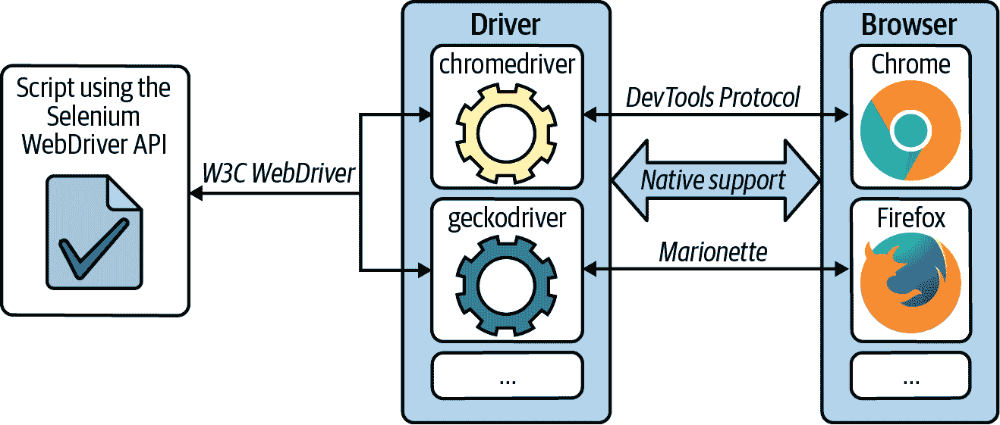
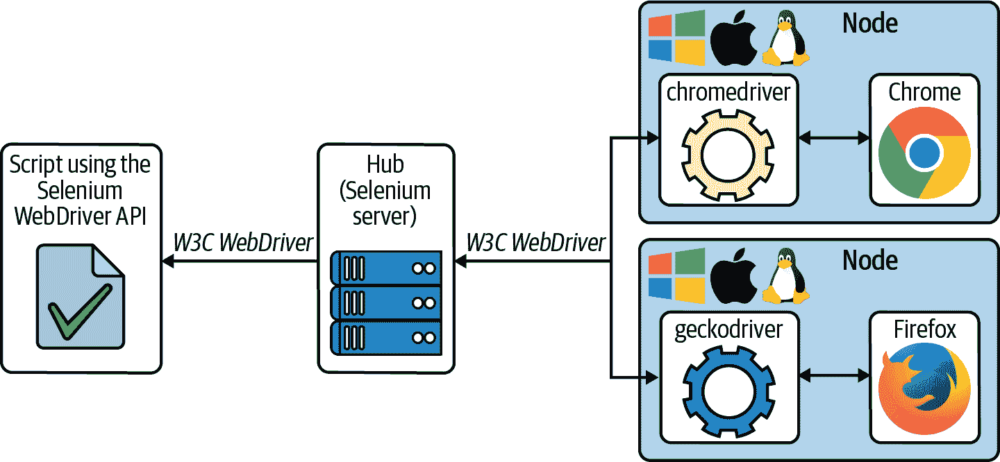
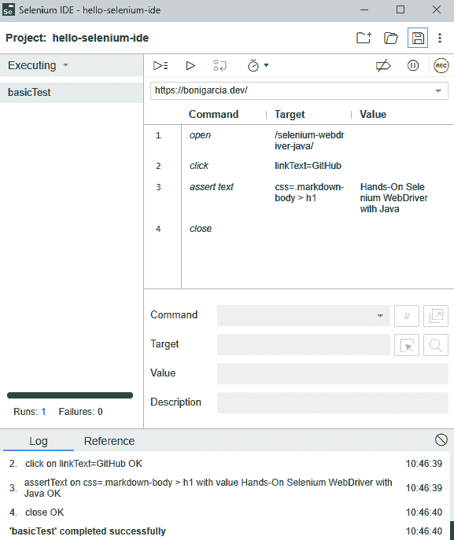
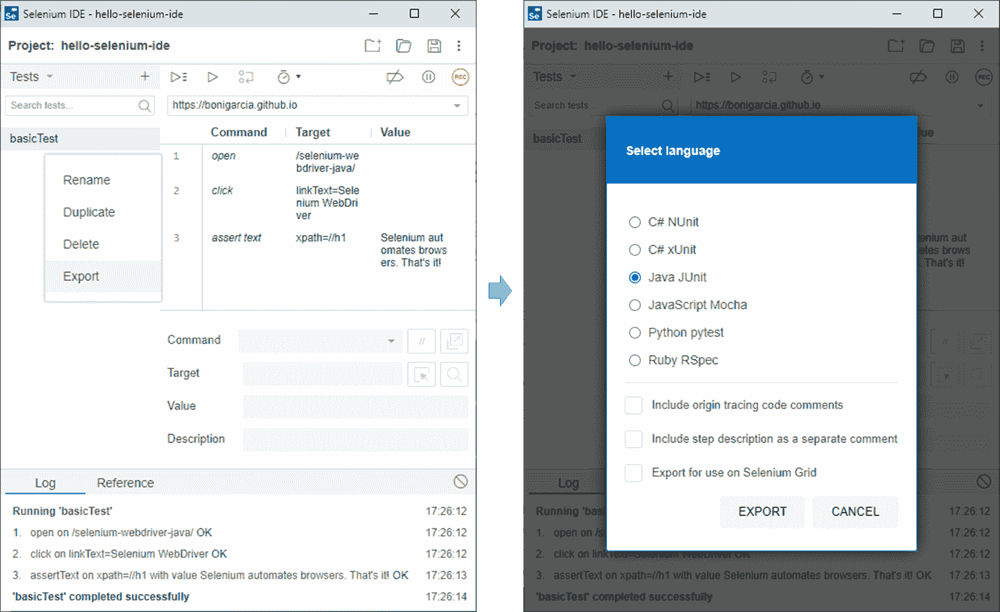
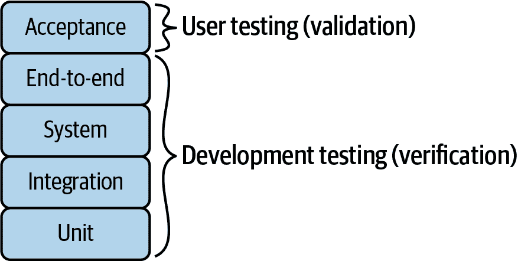
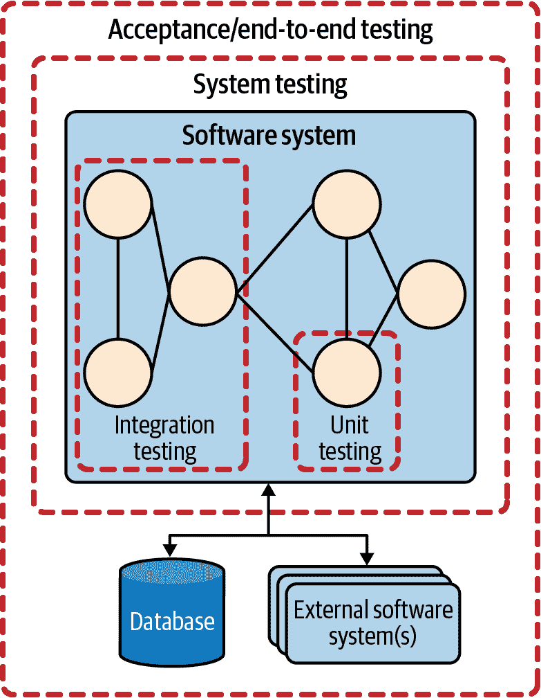
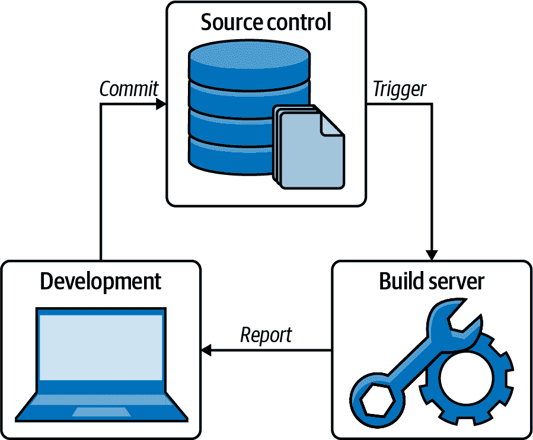
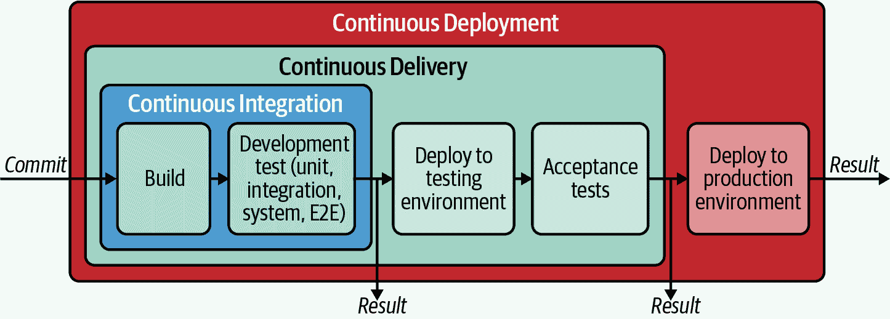
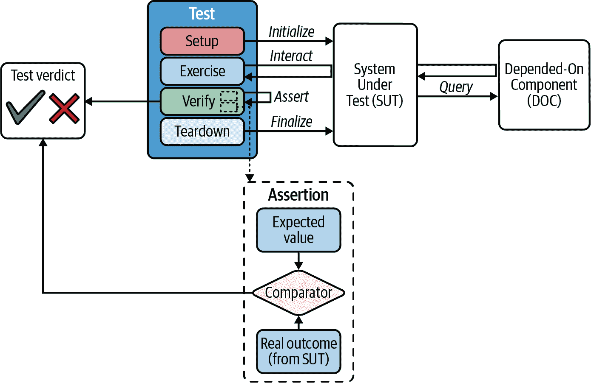

# 第一章：Selenium 入门

[*Selenium*](https://www.selenium.dev) 是一个由一组库和工具组成的开源套件，允许自动化 web 浏览器。我们可以将 Selenium 视为一个以三个核心组件为中心的项目：WebDriver、Grid 和 IDE（集成开发环境）。Selenium WebDriver 是一个允许以编程方式驱动浏览器的库。因此，我们可以使用 Selenium WebDriver 自动化地浏览网站并与网页交互（例如点击链接、填写表单等），就像真实用户一样。 Selenium WebDriver 的主要用途是自动化测试 web 应用程序。 Selenium 的其他用途包括自动化基于 web 的管理任务或网络抓取（自动化的 web 数据提取）。

本章全面介绍了 Selenium 的核心组件：WebDriver、Grid 和 IDE。然后，它回顾了 Selenium 生态系统，即其周围的其他工具和技术。最后，它分析了与 Selenium 相关的软件测试基础。

# Selenium 核心组件

Jason Huggins 和 Paul Hammant 在 Thoughtworks 工作期间于 2004 年创建了 Selenium。他们选择了“Selenium”这个名字作为 Hewlett-Packard 开发的现有测试框架“Mercury”的对应物。这个名称很重要，因为化学元素硒以减少汞的毒性而闻名。

Selenium 的最初版本（今天称为 *Selenium Core*）是一个 JavaScript 库，模拟用户在 web 应用程序中的操作。 Selenium Core 解释所谓的 *Selenese* 命令来执行这些任务。这些命令被编码为由三部分组成的 HTML 表：*command*（在 web 浏览器中执行的操作，如打开 URL 或点击链接）、*target*（标识 web 元素的定位器，如给定组件的属性）和 *value*（可选数据，如输入到 web 表单字段的文本）。

Huggins 和 Hammant 在 Selenium Core 中增加了一个脚本层，创建了一个名为 *Selenium Remote Control*（RC）的新项目。Selenium RC 遵循客户端-服务器架构。客户端使用绑定语言（如 Java 或 JavaScript）通过 HTTP 发送 Selenese 命令到一个名为 *Selenium RC Server* 的中间代理。这个服务器根据需求启动 Web 浏览器，在网站中注入 Selenium Core 库，并将来自客户端的请求代理到 Selenium Core。此外，Selenium RC Server 将目标网站伪装成注入的 Selenium Core 库的相同本地 URL，以避免同源策略的问题。这种方法在当时是浏览器自动化的一个变革，但它有显著的限制。首先，由于 JavaScript 是支持自动化的基础技术，一些动作是不允许的，因为 JavaScript 不允许它们 - 例如，上传和下载文件或处理弹出窗口和对话框等。此外，Selenium RC 引入了相当大的开销，影响了其性能。

与此同时，Simon Stewart 在 2007 年创建了项目 *WebDriver*。从功能角度来看，WebDriver 和 Selenium RC 是等效的，即两个项目都允许程序员使用编程语言模拟 Web 用户。然而，WebDriver 使用每个浏览器的原生支持来执行自动化，因此，其功能和性能远远优于 RC。2009 年，在 Jason Huggins 和 Simon Stewart 在 Google 测试自动化大会上的会议之后，他们决定将 Selenium 和 WebDriver 合并成一个单一项目。这个新项目被称为 *Selenium WebDriver* 或 Selenium 2。这个新项目使用了基于 HTTP 的通信协议，结合了浏览器上的原生自动化支持。这种方法仍然是 Selenium 3（2016 年发布）和 Selenium 4（2021 年发布）的基础。现在我们将 Selenium RC 和 Core 称为“Selenium 1”，并且鼓励使用 Selenium WebDriver。本书重点介绍迄今为止最新版本的 Selenium WebDriver，即版本 4。

###### 提示

附录 A 总结了随 Selenium 4 发布的新特性。本附录还包含了从 Selenium 3 升级到 4 的迁移指南。

今天，Selenium 是一个知名的自动化套件，由三个子项目组成：WebDriver、Grid 和 IDE。以下小节介绍了每个子项目的主要特点。

## Selenium WebDriver

Selenium WebDriver 是一个允许自动控制网页浏览器的库。出于这个目的，它提供了不同语言绑定的跨平台 API。Selenium WebDriver 官方支持的编程语言包括 Java、JavaScript、Python、Ruby 和 C#。在内部，Selenium WebDriver 使用每个浏览器实现的本机支持来进行自动化过程。因此，我们需要在使用 Selenium WebDriver API 的脚本和浏览器之间放置一个称为 *driver* 的组件。表格 1-1 总结了 Selenium WebDriver 官方支持的浏览器和驱动程序。

###### 注意

术语 *Selenium* 广泛用于指代用于浏览器自动化的库。由于这个术语也是总体项目的名称，我在本书中使用 *Selenium* 来标识由三个组件组成的浏览器自动化套件，即 Selenium WebDriver（库）、Selenium Grid（基础设施）和 Selenium IDE（工具）。

表格 1-1\. Selenium WebDriver 支持的浏览器和驱动程序

| 浏览器 | 驱动程序 | 操作系统 | 维护者 | 下载 |
| --- | --- | --- | --- | --- |
| Chrome/Chromium | chromedriver | Windows/macOS/Linux | Google | [*https://chromedriver.chromium.org*](https://chromedriver.chromium.org) |
| Edge | msedgedriver | Windows/macOS/Linux | 微软 | [*https://developer.microsoft.com/en-us/microsoft-edge/tools/webdriver*](https://developer.microsoft.com/en-us/microsoft-edge/tools/webdriver) |
| Firefox | geckodriver | Windows/macOS/Linux | Mozilla | [*https://github.com/mozilla/geckodriver*](https://github.com/mozilla/geckodriver) |
| Opera | operadriver | Windows/macOS/Linux | Opera Software AS | [*https://github.com/operasoftware/operachromiumdriver*](https://github.com/operasoftware/operachromiumdriver) |
| Internet Explorer | IEDriverServer | Windows | Selenium 项目 | [*https://www.selenium.dev/downloads*](https://www.selenium.dev/downloads) |
| Safari | safaridriver | macOS | Apple | 内建 |

驱动程序（例如 chromedriver、geckodriver 等）是平台相关的二进制文件，用于接收来自 WebDriver 脚本的命令，并将其转换为特定于某种浏览器的语言。在 Selenium WebDriver 的首个发布版（即 Selenium 2）中，这些命令（也称为 *Selenium 协议*）是通过 HTTP（即所谓的 *JSON Wire Protocol*）传输的 JSON 消息。如今，这种通信（仍然是 JSON over HTTP）遵循一个名为 [*W3C WebDriver*](https://www.w3.org/TR/webdriver) 的标准规范。截至 Selenium 4，该规范是首选的 Selenium 协议。

图 1-1 总结了我们迄今所见的 Selenium WebDriver 的基本架构。可以看到，这个架构有三层。首先，我们有一个使用 Selenium WebDriver API 的脚本（Java、JavaScript、Python、Ruby 或 C#）。这个脚本将 W3C WebDriver 命令发送到第二层，其中包含驱动程序。本图展示了使用 chromedriver（控制 Chrome）和 geckodriver（控制 Firefox）的具体情况。最后，第三层包含了 Web 浏览器。在 Chrome 的情况下，本机浏览器遵循 [*DevTools Protocol*](https://chromedevtools.github.io/devtools-protocol)。DevTools 是针对基于 Blink 渲染引擎的浏览器（如 Chrome、Chromium、Edge 或 Opera）的一组开发者工具。DevTools Protocol 基于 JSON-RPC 消息，并允许检查、调试和分析这些浏览器。在 Firefox 中，本机自动化支持使用 [*Marionette*](https://firefox-source-docs.mozilla.org/testing/marionette) 协议。Marionette 是一个基于 JSON 的远程协议，允许对基于 Gecko 引擎的 Web 浏览器（如 Firefox）进行仪器化和控制。

###### 图 1-1\. Selenium WebDriver 架构

总体来说，Selenium WebDriver 允许以编程方式控制网页浏览器，如同用户一样操作。为此，Selenium WebDriver API 提供了广泛的功能，用于浏览网页、与网页元素交互或模拟用户操作等。目标应用程序是基于 web 的，如静态网站、动态 Web 应用程序、单页面应用程序（SPA）、具有 Web 界面的复杂企业系统等。

## Selenium Grid

Selenium 家族的第二个项目是 *Selenium Grid*。Philippe Hanrigou 在 2008 年开始开发该项目。Selenium Grid 是一组网络主机，为 Selenium WebDriver 提供浏览器基础设施。这种基础设施使得可以在多个操作系统上（并行）执行 Selenium WebDriver 脚本，使用不同类型和版本的远程浏览器。

图 1-2 展示了 Selenium Grid 的基本架构。可以看到，一组节点提供了 Selenium 脚本使用的浏览器。这些节点可以使用不同的操作系统（如我们在 表 1-1 中看到的）以及安装了各种浏览器。这个 Grid 的中心入口点是 *Hub*（也称为 *Selenium 服务器*）。这个服务器端组件负责跟踪节点并代理 Selenium 脚本的请求。与 Selenium WebDriver 类似，W3C WebDriver 规范是这些脚本与 Hub 之间通信的标准协议。

###### 图 1-2\. Selenium Grid 汇集节点架构

Grid 中的中心-节点架构自 Selenium 2 版本以来就已经可用。这种架构在 Selenium 3 和 4 中也存在。然而，如果向中心发送的请求数量很大，这种集中式架构可能会导致性能瓶颈。Selenium 4 提供了完全分布式的 Selenium Grid 变体，以避免这个问题。此架构实现了先进的负载均衡机制，以避免任何组件的过载。

###### Tip

第 6 章描述了如何按照经典方法设置 Selenium Grid（基于中心和一组节点）。本章还涵盖了*独立*模式（即在同一台机器上托管中心和节点）以及完全分布式架构。

## Selenium IDE

[Selenium IDE](https://www.selenium.dev/selenium-ide) 是 Selenium 套件的最后一个核心组件。Shinya Kasatani 在 2006 年创建了这个项目。Selenium IDE 是一个实现所谓的*记录和回放*（R&P）自动化技术的工具。顾名思义，这项技术分为两步。首先，在 Selenium IDE 中，*记录*部分捕捉用户与浏览器的交互，将这些动作编码为 Selenium 命令。其次，使用生成的 Selenium 脚本自动执行浏览器会话（*回放*）。

Selenium IDE 的早期版本是一个嵌入 Selenium Core 来录制、编辑和回放 Selenium 脚本的 Firefox 插件。这些早期版本是 XPI 模块（即用于创建 Mozilla 扩展的技术）。从 2017 年发布的版本 55 开始，Firefox 将对插件的支持迁移到[W3C 浏览器扩展规范](https://browserext.github.io/browserext)。因此，Selenium IDE 被停用，并且一段时间内无法使用。Selenium 团队根据浏览器扩展建议重新编写了 Selenium IDE，以解决这个问题。由此，我们现在可以在 Chrome、Edge 和 Firefox 等多个浏览器中使用 Selenium IDE。

图 1-3 展示了新版 Selenium IDE GUI（图形用户界面）。

使用此 GUI，用户可以记录与浏览器的交互并编辑和执行生成的脚本。Selenium IDE 将每个交互编码为不同部分：命令（即在浏览器中执行的动作）、目标（即 Web 元素的定位器）和值（即处理的数据）。我们还可以选择包括命令的描述。图 1-3 展示了这些步骤的一个记录示例：

1.  打开网站（[*https://bonigarcia.dev/selenium-webdriver-java*](https://bonigarcia.dev/selenium-webdriver-java)）。在本书的其余部分中，我们将使用此网站作为实践站点。

1.  点击带有“GitHub”文本的链接。结果，导航移动到示例存储库源代码。

1.  断言网页上存在书名（*Hands-On Selenium WebDriver with Java*）。

1.  关闭浏览器。

###### 图 1-3\. Selenium IDE 显示了录制脚本的示例

一旦我们在 Selenium IDE 中创建了脚本，我们就可以将此脚本导出为 Selenium WebDriver 测试。例如，图 1-4 展示了如何将所示示例转换为 JUnit 测试用例。最后，我们可以将项目保存在本地计算机上。此示例的结果项目可在 [示例 GitHub 存储库](https://github.com/bonigarcia/selenium-webdriver-java/tree/master/selenium-ide) 中找到。

###### 注

在撰写本文时，Selenium 项目正在将 Selenium IDE 移植到 [Electron](https://www.electronjs.org)。Electron 是一个基于 Chromium 和 Node.js 的开源框架，允许进行桌面应用程序开发。

###### 图 1-4\. 将 Selenium IDE 脚本导出为 JUnit 测试用例

# Selenium 生态系统

软件生态系统是与共同技术背景支持下的共享市场进行交互的元素的集合。在 Selenium 的情况下，其生态系统涉及官方核心项目和其他相关项目、库和参与者。本节将审查 Selenium 生态系统，分为以下几类：语言绑定、驱动程序管理器、框架、浏览器基础设施和社区。

## 语言绑定

正如我们所知，Selenium 项目为 Selenium WebDriver 维护了各种语言绑定：Java、JavaScript、Python、Ruby 和 C#。然而，也有其他语言可用。表 1-2 总结了社区维护的 Selenium WebDriver 的这些语言绑定。

表 1-2\. Selenium WebDriver 的非官方语言绑定

| 名称 | 语言 | 许可证 | 维护者 | 网站 |
| --- | --- | --- | --- | --- |
| hs-webdriver | Haskell | BSD-3-Clause | Adam Curtis | [*https://github.com/kallisti-dev/hs-webdriver*](https://github.com/kallisti-dev/hs-webdriver) |
| php-webdriver | PHP | MIT | Facebook、社区 | [*https://github.com/php-webdriver/php-webdriver*](https://github.com/php-webdriver/php-webdriver) |
| RSelenium | R | AGPLv3 | rOpenSci | [*https://github.com/ropensci/RSelenium*](https://github.com/ropensci/RSelenium) |
| Selenium | Go | MIT | Miki Tebeka | [*https://github.com/tebeka/selenium*](https://github.com/tebeka/selenium) |
| Selenium-Remote-Driver | Perl | Apache 2.0 | George S. Baugh | [*https://github.com/teodesian/Selenium-Remote-Driver*](https://github.com/teodesian/Selenium-Remote-Driver) |
| webdriver.dart | Dart | Apache 2.0 | Google | [*https://github.com/google/webdriver.dart*](https://github.com/google/webdriver.dart) |
| wd | JavaScript | Apache 2.0 | Adam Christian | [*https://github.com/admc/wd*](https://github.com/admc/wd) |

## 驱动程序管理器

驱动程序是使用 Selenium WebDriver 原生控制网络浏览器所必需的组件（参见 Figure 1-1）。因此，在使用 Selenium WebDriver API 之前，我们需要管理这些驱动程序。*驱动程序管理*是指下载、设置和维护适合特定浏览器的正确驱动程序的过程。驱动程序管理过程中的常见步骤包括：

1\. 下载

每个浏览器都有自己的驱动程序。例如，我们使用 chromedriver 来控制 Chrome 或 geckodriver 来控制 Firefox（参见 Table 1-1）。驱动程序是特定于平台的二进制文件。因此，我们需要为特定操作系统（通常是 Windows、macOS 或 Linux）下载适当的驱动程序。此外，我们需要考虑驱动程序的版本，因为驱动程序发布与特定浏览器版本（或范围）兼容。例如，要使用 Chrome 91.x，我们需要下载 chromedriver 91.0.4472.19\. 我们通常可以在驱动程序文档或发布说明中找到浏览器驱动程序的兼容性信息。

2\. 设置

一旦我们有了合适的驱动程序，我们需要在我们的 Selenium WebDriver 脚本中使其可用。

3\. 维护

现代网络浏览器（例如 Chrome，Firefox 或 Edge）会自动静默升级，无需提示用户。因此，关于 Selenium WebDriver，我们需要及时维护浏览器驱动程序版本的兼容性，以适应这些所谓的*evergreen*浏览器。

正如您所见，驱动程序的维护过程可能耗时。此外，它可能会给 Selenium WebDriver 用户带来问题（例如，由于自动浏览器升级后的浏览器驱动程序不兼容而导致的测试失败）。因此，所谓的*驱动程序管理器*旨在在一定程度上自动化驱动程序管理过程。Table 1-3 总结了不同语言绑定的可用驱动程序管理器。

Table 1-3\. Selenium WebDriver 的驱动程序管理器

| Name | Language | License | Maintainer | Website |
| --- | --- | --- | --- | --- |
| WebDriverManager | Java | Apache 2.0 | Boni García | [*https://github.com/bonigarcia/webdrivermanager*](https://github.com/bonigarcia/webdrivermanager) |
| webdriver-manager | JavaScript | MIT | Google | [*https://www.npmjs.com/package/webdriver-manager*](https://www.npmjs.com/package/webdriver-manager) |
| webdriver-manager | Python | Apache 2.0 | Serhii Pirohov | [*https://pypi.org/project/webdriver-manager*](https://pypi.org/project/webdriver-manager) |
| WebDriverManager.Net | C# | MIT | Aliaksandr Rasolka | [*https://github.com/rosolko/WebDriverManager.Net*](https://github.com/rosolko/WebDriverManager.Net) |
| webdrivers | Ruby | MIT | Titus Fortner | [*https://github.com/titusfortner/webdrivers*](https://github.com/titusfortner/webdrivers) |

###### 提示

在本书中，我推荐使用 WebDriverManager，因为它自动化了整个驱动程序维护过程（即下载、设置和维护）。有关自动化和手动驱动程序管理的更多信息，请参见 附录 B。

## 定位器工具

Selenium WebDriver API 提供了不同的定位 Web 元素的方法（参见 第三章）：通过属性（id、name 或 class）、通过链接文本（完整或部分）、通过标签名、通过 CSS（层叠样式表）选择器或通过 XML Path Language（XPath）。具体的工具可以帮助识别和生成这些定位器。表格 1-4 展示了其中一些工具。

表格 1-4\. 定位器工具概述

| 名称 | 类型 | 许可证 | 维护者 | 网站 |
| --- | --- | --- | --- | --- |
| Chrome DevTools | 内置浏览器工具 | 专有免费软件，基于开源 | Google | [*https://developer.chrome.com/docs/devtools*](https://developer.chrome.com/docs/devtools) |
| Firefox Developer Tools | 内置浏览器工具 | MPL 2.0 | Mozilla | [*https://developer.mozilla.org/en-US/docs/Tools*](https://developer.mozilla.org/en-US/docs/Tools) |
| Cropath | 浏览器扩展 | 免费软件 | AutonomIQ | [*https://autonomiq.io/deviq-chropath.html*](https://autonomiq.io/deviq-chropath.html) |
| SelectorsHub | 浏览器扩展 | 免费软件 | Sanjay Kumar | [*https://selectorshub.com*](https://selectorshub.com) |
| POM Builder | 浏览器扩展 | 免费软件 | LogiGear Corporation | [*https://pombuilder.com*](https://pombuilder.com) |

## 框架

在软件工程中，*框架*是一组用作软件开发的概念和技术基础和支持的库和工具。Selenium 是包装、增强或补充其默认功能的框架的基础。表格 1-5 包含了基于 Selenium 的这些框架和库。

表格 1-5\. 基于 Selenium 的测试框架和库

| 名称 | 语言 | 描述 | 许可证 | 维护者 | 网站 |
| --- | --- | --- | --- | --- | --- |
| CodeceptJS | JavaScript | 将浏览器交互建模为用户视角的简单步骤的多后端测试框架 | MIT | Michael Bodnarchuk | [*https://codecept.io*](https://codecept.io) |
| FluentSelenium | Java | Selenium WebDriver 的流畅 API | Apache 2.0 | Paul Hammant | [*https://github.com/SeleniumHQ/fluent-selenium*](https://github.com/SeleniumHQ/fluent-selenium) |
| FluentLenium | Java | 网站和移动自动化框架，用于创建可读性强、可重用的 WebDriver 测试 | Apache 2.0 | FluentLenium 团队 | [*https://fluentlenium.com*](https://fluentlenium.com) |
| Healenium | Java | 使用机器学习算法分析 Web 和移动 Web 元素，改善 Selenium 测试稳定性的库 | Apache 2.0 | Anna Chernyshova 和 Dmitriy Gumeniuk | [*https://healenium.io*](https://healenium.io) |
| Helium | Python | 基于 Selenium WebDriver 的高级 API | MIT | Michael Herrmann | [*https://github.com/mherrmann/selenium-python-helium*](https://github.com/mherrmann/selenium-python-helium) |
| QAF (QMetry Automation Framework) | Java | 用于 Web 和移动应用程序的测试自动化平台 | MIT | Chirag Jayswal | [*https://qmetry.github.io/qaf*](https://qmetry.github.io/qaf) |
| Lightning | Java | 轻量级的 Selenium WebDriver Java 客户端 | Apache 2.0 | FluentLenium | [*https://github.com/aerokube/lightning-java*](https://github.com/aerokube/lightning-java) |
| Nerodia | Python | Watir Ruby gem 的 Python 移植版 | MIT | Lucas Tierney | [*https://nerodia.readthedocs.io*](https://nerodia.readthedocs.io) |
| Robot Framework | Python, Java, .NET 等 | 基于可读测试用例的通用自动化框架 | Apache 2.0 | Robot Framework Foundation | [*https://robotframework.org*](https://robotframework.org) |
| Selenide 团队 | Java | Selenium WebDriver 的流畅、简洁 API | MIT | Selenide 团队 | [*https://selenide.org*](https://selenide.org) |
| SeleniumBase | Python | 基于 WebDriver 和 pytest 的浏览器自动化框架 | MIT | Michael Mintz | [*https://seleniumbase.io*](https://seleniumbase.io) |
| Watir (Web Application Testing in Ruby) | Ruby | 基于 WebDriver 的 Ruby gem 库，用于自动化 Web 浏览器 | MIT | Titus Fortner | [*http://watir.com*](http://watir.com) |
| WebDriverIO | JavaScript | 基于 WebDriver 和 Appium 的测试自动化框架 | MIT | Christian Bromann | [*https://webdriver.io*](https://webdriver.io) |
| Nightwatch.js | JavaScript | 基于 W3C WebDriver 的集成端到端测试框架 | MIT | Andrei Rusu | [*https://nightwatchjs.org*](https://nightwatchjs.org) |
| Applitools | Java, JavaScript, C#, Ruby, PHP, Python | 用于视觉用户界面回归和 A/B 测试的测试自动化框架。它为 Selenium、Appium 等提供 SDK | 商业 | Applitools 团队 | [*https://applitools.com*](https://applitools.com) |
| Katalon Studio | Java, Groovy | 利用 Selenium WebDriver、Appium 和云提供商的测试自动化平台 | 商业 | Katalon 团队 | [*https://www.katalon.com*](https://www.katalon.com) |
| TestProject | Java, C#, Python | 构建在 Selenium 和 Appium 之上的 Web 和移动应用测试自动化平台 | 商业 | TestProject 团队 | [*https://testproject.io*](https://testproject.io) |

## 浏览器基础设施

我们可以使用 Selenium WebDriver 来控制安装在运行 WebDriver 脚本的机器上的本地浏览器。此外，Selenium WebDriver 还可以驱动远程 Web 浏览器（即在其他主机上执行的浏览器）。在这种情况下，我们可以使用 Selenium Grid 来支持远程浏览器基础设施。然而，这种基础设施的创建和维护可能具有挑战性。

或者，我们可以使用 *云服务提供商* 来外包支持浏览器基础设施的责任。在 Selenium 生态系统中，云服务提供商是为自动化测试提供托管服务的公司或产品。这些公司通常为 Web 和移动测试提供商业解决方案。云服务提供商的用户可以请求各种类型、版本和操作系统的按需浏览器。此外，这些提供商通常还提供其他服务，以简化测试和监控活动，例如访问会话录像或分析能力等。目前 Selenium 最相关的云服务提供商包括 [Sauce Labs](https://saucelabs.com)、[BrowserStack](https://www.browserstack.com)、[LambdaTest](https://www.lambdatest.com)、[CrossBrowserTesting](https://crossbrowsertesting.com)、[Moon Cloud](https://aerokube.com/moon-cloud)、[TestingBot](https://testingbot.com)、[Perfecto](https://www.perfecto.io) 和 [Testinium](https://testinium.com)。

另一个我们可以使用来支持 Selenium 浏览器基础设施的解决方案是 [*Docker*](https://www.docker.com)。Docker 是一种开源软件技术，允许用户将应用程序打包和运行为轻量级、可移植的容器。Docker 平台有两个主要组件：*Docker 引擎*，用于创建和运行容器，以及 [*Docker Hub*](https://hub.docker.com)，用于分发 Docker 镜像的云服务。在 Selenium 领域，我们可以使用 Docker 来打包和执行容器化的浏览器。表 1-6 总结了在 Selenium 生态系统中使用 Docker 的相关项目。

表 1-6\. Selenium 的 Docker 资源

| 名称 | 描述 | 许可证 | 维护者 | 网站 |
| --- | --- | --- | --- | --- |
| docker-selenium | Selenium Grid 的官方 Docker 镜像 | Apache 2.0 | Selenium 项目 | [*https://github.com/seleniumhq/docker-selenium*](https://github.com/seleniumhq/docker-selenium) |
| Selenoid | 用 Go 语言轻量级实现的 Selenium Hub，在 Docker 中运行浏览器（镜像可在 Docker Hub 上找到） | Apache 2.0 | Aerokube | [*https://aerokube.com/selenoid*](https://aerokube.com/selenoid) |
| Moon | 使用 Docker 和 Kubernetes 的企业级 Selenium 集群 | 商业 | Aerokube | [*https://aerokube.com/moon*](https://aerokube.com/moon) |
| Callisto | 开源的 Kubernetes 本地实现的 Selenium Grid | MIT | Aerokube | [*https://github.com/wrike/callisto*](https://github.com/wrike/callisto) |

## 社区

由于软件开发的协作性质，需要许多参与者的组织和互动。在开源领域，我们可以通过社区的相关性来衡量项目的成功。Selenium 得到了全球许多不同参与者的大力支持。表 1-7 总结了几个分组资源，包括官方文档、开发、支持和活动。

表 1-7\. Selenium 社区资源

| 类别 | 描述 | 网站 |
| --- | --- | --- |
| 官方文档 | 用户指南 | [*https://www.selenium.dev/documentation*](https://www.selenium.dev/documentation) |
| 博客 | [*https://www.selenium.dev/blog*](https://www.selenium.dev/blog) |
| Wiki | [*https://github.com/seleniumhq/selenium/wiki*](https://github.com/seleniumhq/selenium/wiki) |
| 生态系统 | [*https://www.selenium.dev/ecosystem*](https://www.selenium.dev/ecosystem) |
| 开发 | 源代码 | [*https://github.com/seleniumhq/selenium*](https://github.com/seleniumhq/selenium) |
| 问题 | [*https://github.com/seleniumhq/selenium/issues*](https://github.com/seleniumhq/selenium/issues) |
| 治理 | [*https://www.selenium.dev/project*](https://www.selenium.dev/project) |
| 支持 | 用户组 | [*https://groups.google.com/group/selenium-users*](https://groups.google.com/group/selenium-users) |
| Slack | [*https://seleniumhq.slack.com*](https://seleniumhq.slack.com) |
| IRC | [*https://webchat.freenode.net/#selenium*](https://webchat.freenode.net/#selenium) |
| StackOverflow | [*https://stackoverflow.com/questions/tagged/selenium*](https://stackoverflow.com/questions/tagged/selenium) |
| Reddit | [*https://www.reddit.com/r/selenium*](https://www.reddit.com/r/selenium) |
| 活动 | 会议 | [*https://www.selenium.dev/categories/conference*](https://www.selenium.dev/categories/conference) |
| Meetups | [*https://www.meetup.com/topics/selenium*](https://www.meetup.com/topics/selenium) |

# 软件测试基础

软件测试（或简称*测试*）包括对称为*被测系统*（SUT）的软件的动态评估，通过一组有限的测试用例（或简称*测试*）对其进行评估，并对其做出裁决。测试意味着使用特定的输入值执行 SUT，以评估结果或期望行为。

乍一看，我们可以区分软件测试的两个单独类别：手动和自动化。一方面，在*手动测试*中，一个人（通常是软件工程师或最终用户）评估 SUT。另一方面，在*自动化测试*中，我们使用特定的软件工具开发测试并控制它们对 SUT 的执行。自动化测试允许在 SUT 中早期检测缺陷（通常称为*错误*），同时提供大量额外的好处（例如成本节省、快速反馈、测试覆盖率或可重复使用性等）。在某些情况下，手动测试也可以是一种有价值的方法，例如*探索性测试*（即人工测试人员自由地调查和评估 SUT）。

###### 注意

此部分提供的众多测试形式没有统一的分类标准。这些概念正如软件工程一样，处于持续演变和辩论之中。可以将其视为适用于大量项目的提议。

## 测试级别

根据 SUT 的规模不同，我们可以定义不同的*测试级别*。这些级别确定了软件团队在测试工作中划分的几个类别。在本书中，我提出使用堆叠布局来表示不同的级别（见图 1-5）。这个结构的较低级别代表了用于验证软件小片段（称为*单元*）的测试。随着堆栈的上升，我们在其中找到其他层级（例如*集成*、*系统*等），其中 SUT 集成了越来越多的组件。

###### 图 1-5\. 不同测试级别的堆栈表示

此堆栈的最低级别是*单元测试*。在这个级别，我们评估软件的各个单元。一个单元是特定的可观察行为元素。例如，单元通常是面向对象编程中的方法或类，以及函数式编程中的函数。单元测试旨在验证每个单元的预期行为。由于每个测试在隔离环境中执行少量代码，自动化单元测试通常运行非常快速。为了实现这种隔离，我们可以使用*测试替身*，即替换给定单元的依赖组件的软件片段。例如，在面向对象编程中，一种流行的测试替身类型是*模拟对象*。模拟对象使用一些程序化的行为来模仿实际对象。

图 1-5 中的下一个级别是*集成测试*。在这个级别，不同的单元组合在一起以创建复合组件。集成测试旨在评估涉及单元之间的交互并暴露其接口中的缺陷。

然后，在*系统测试*和*端到端*（E2E）级别，我们测试整个软件系统。我们需要部署系统测试对象（SUT）并验证其高级功能来执行这些级别的测试。系统/端到端测试与集成测试的区别在于前者涉及所有系统组件和最终用户（通常是模拟的）。换句话说，系统和端到端测试通过用户界面（UI）评估 SUT。该 UI 可以是图形化的（GUI）或非图形化的（例如基于文本或其他类型）。

图 1-6 展示了系统测试与端到端测试之间的区别。如您所见，端到端测试涉及软件系统及其依赖子系统（例如数据库或外部服务）。而系统测试仅包括软件系统，这些外部依赖通常是模拟的。

###### 图 1-6\. 测试不同级别的基于组件的表示

*验收测试*是所呈现堆栈的顶层。在这个级别，最终用户参与测试过程。验收测试的目标是决定软件系统是否符合最终用户的期望。如图 1-6 所示，与端到端测试类似，验收测试验证整个系统及其依赖项。因此，验收测试也使用 UI 来执行 SUT 验证。

###### 提示

Selenium WebDriver 的主要目的是实施端到端测试。尽管如此，我们可以使用 WebDriver 来进行系统测试，当模拟网站调用的后端时。此外，我们可以将 Selenium WebDriver 与行为驱动开发（BDD）工具结合使用，以实施验收测试（请参阅第九章）。

## 测试类型

根据设计测试用例的策略，我们可以实施不同类型的测试。两种主要的测试类型是：

*功能测试*（也称为行为或*闭箱测试*）

评估软件片段是否符合预期行为（即其功能需求）。

*结构测试*（也称为*透明箱测试*）

确定程序代码结构是否存在错误。为此，测试人员应了解软件片段的内部逻辑。

这些测试类型的区别在于，功能测试是基于责任的，而结构测试是基于实现的。这两种类型可以在任何测试级别（单元、集成、系统、端到端或验收）进行。然而，结构测试通常在单元或集成级别进行，因为这些级别能够更直接地控制代码执行流程。

###### 警告

*黑盒测试*和*白盒测试*分别是功能测试和结构测试的另外两个名称。然而，由于科技行业正努力采用更具包容性的术语，而非潜在有害的语言，因此不推荐使用这些称号。

功能测试有不同的类型。例如：

*UI 测试*（当 UI 是图形界面时称为*GUI 测试*）

评估应用的视觉元素是否符合预期功能。请注意，UI 测试与系统和端到端测试级别不同，因为前者测试界面本身，而后者通过 UI 评估整个系统。

*负面测试*

在意外条件下评估 SUT（例如预期异常）。此术语是常规功能测试（有时称为*正面测试*）的对应项，其中我们评估 SUT 是否按预期行为（即其*快乐路径*）。

*跨浏览器测试*

这是针对 Web 应用的。它旨在验证不同 Web 浏览器（类型、版本或操作系统）中的网站和应用的兼容性。

第三种杂项测试类型，*非功能测试*，包括评估软件系统的质量属性（即其非功能需求）的测试策略。非功能测试的常见方法包括但不限于：

*性能测试*

评估软件系统的不同指标，例如响应时间、稳定性、可靠性或可扩展性。性能测试的目标不是查找错误，而是查找系统瓶颈。性能测试有两种常见的子类型：

*负载测试*

通过模拟多个并发用户增加系统的使用量，以验证其是否可以在定义的边界内运行。

*压力测试*

超越系统的操作能力来进行系统练习，以确定系统崩溃的实际极限。

*安全测试*

试图评估安全性关注点，例如机密性（信息保护披露）、认证（确保用户身份）或授权（确定用户权利和特权）等。

*可用性测试*

评估软件应用的用户友好程度。这种评估也称为用户体验（UX）测试。可用性测试的一个子类型是：

*A/B 测试*

比较同一应用的不同变体，以确定哪一个对其最终用户更有效。

*可访问性测试*

评估系统是否可供残障人士使用。

###### 提示

我们主要使用 Selenium WebDriver 来实施功能测试（即与 Web 应用程序 UI 进行交互，以评估应用程序行为）。不太可能使用 WebDriver 来实施结构测试。此外，虽然这不是其主要用途，但我们可以使用 WebDriver 来实施非功能性测试，例如负载、安全性、可访问性或本地化（评估特定区域设置）测试（参见 第九章）。

## 测试方法论

*软件开发生命周期* 是在软件工程中创建软件系统所需的活动、动作和任务的集合。软件工程师在整体开发生命周期中设计和实施测试用例的时刻取决于具体的开发过程（例如迭代式、瀑布式或敏捷式等）。最相关的两种测试方法是：

测试驱动开发（TDD）

TDD 是一种方法论，我们在实际软件设计和实施之前设计和实施测试。在 21 世纪初期，随着极限编程（XP）等敏捷软件开发方法的兴起，TDD 受到欢迎。在 TDD 中，开发人员首先为给定特性编写（最初失败的）自动化测试。然后，开发人员创建一段代码来通过该测试。最后，开发人员重构代码以实现或改善可读性和可维护性。

测试末位开发（TLD）

TLD 是一种方法论，我们在实施 SUT 后设计和实施测试。这种做法在传统的软件开发流程中很典型，如瀑布式（顺序式）、增量式（多瀑布式）、螺旋式（风险导向的多瀑布式）或 Rational Unified Process (RUP)。

另一种相关的测试方法是 *行为驱动开发*（BDD）。BDD 是从 TDD 演变而来的一种测试实践，因此我们在软件开发生命周期的早期阶段设计测试。为此，最终用户与开发团队进行对话（通常是项目负责人、经理或分析师）。这些对话正式化了对期望行为和软件系统的共同理解。因此，我们根据一个或多个 *场景* 创建验收测试，遵循 *给定-当-则* 的结构：

给定

场景开始时的初始背景

当

触发场景的事件

那么

预期结果

###### 提示

TLD 是一种常见的实践，用于实现 Selenium WebDriver。换句话说，开发人员/测试人员在 SUT 可用之前不实施 WebDriver 测试。然而，也可以采用不同的方法。例如，使用 WebDriver 结合 Cucumber 时，BDD 是一种常见的方法（参见 第九章）。

与测试方法论领域密切相关的是*持续集成*（CI）的概念。CI 是一种软件开发实践，软件项目的成员持续构建、测试和集成他们的工作。Grady Booch 于 1991 年首次提出了 CI 这个术语。现在它是创建软件的一种流行策略。

如图 1-7 所示，CI 有三个独立的阶段。首先，我们使用一个*源代码存储库*，这是一个存储和共享软件项目源代码的托管设施。我们通常使用*版本控制系统*（VCS）来管理此存储库。VCS 是一个跟踪源代码、谁做了每个更改以及何时做的工具（有时称为*补丁*）。

###### 图 1-7\. CI 通用流程

*Git*，最初由 Linus Torvalds 开发，是当今首选的版本控制系统。其他选择包括*并发版本系统*（CVS）或 Subversion（SVN）。在 Git 之上，一些*代码托管平台*（例如 GitHub、GitLab 或 Bitbucket）提供了协作云存储库托管服务，用于开发、共享和维护软件。

开发者在本地环境中同步一个本地存储库（或简称*repo*）的副本。然后，他们使用该本地副本进行编码工作，将新的更改提交到远程存储库（通常是每天）。CI 的基本思想是每次提交都会触发对新更改的软件构建和测试。用于评估补丁是否破坏构建的测试套件称为*回归测试*。回归套件可以包含不同类型的测试，包括单元测试、集成测试、端到端测试等。

当测试数量过大而无法进行回归测试时，我们通常只选择整个套件中的一部分相关测试。有不同的策略来选择这些测试，例如*冒烟测试*（即确保关键功能的测试）或*合理性测试*（即评估基本功能的测试）。最后，我们可以将完整的套件作为计划任务执行（通常是每夜）。

我们需要使用一个名为*构建服务器*的服务器端基础设施来实现 CI 流水线。当回归测试失败时，构建服务器通常会向原始开发者报告问题。表 1-8 提供了几个构建服务器的摘要。

表 1-8\. 构建服务器

| 名称 | 描述 | 许可证 | 维护者 | 网站 |
| --- | --- | --- | --- | --- |
| Bamboo | 与 Jira（问题跟踪器）和 Bitbucket 轻松使用 | 商业版 | Atlassian | [*https://www.atlassian.com/software/bamboo*](https://www.atlassian.com/software/bamboo) |
| GitHub Actions | GitHub 中集成的构建服务器 | 公共存储库免费 | 微软 | [*https://github.com/features/actions*](https://github.com/features/actions) |
| GitLab CI/CD | GitLab 中集成的构建服务器 | 公共存储库免费 | GitLab | [*https://docs.gitlab.com/ee/ci*](https://docs.gitlab.com/ee/ci) |
| Jenkins | 开源自动化服务器 | MIT | Jenkins 团队 | [*https://www.jenkins.io*](https://www.jenkins.io) |

###### 提示

我使用一个 GitHub 存储库（[*https://github.com/bonigarcia/selenium-webdriver-java*](https://github.com/bonigarcia/selenium-webdriver-java)）来发布和维护本书中提供的测试示例。GitHub Actions 是此存储库的构建服务器（见第二章）。

我们可以通过两种方式扩展典型的 CI 流水线（见图 1-8）：

持续交付（CD）

在 CI 之后，构建服务器将发布版本部署到一个暂存环境（即用于测试目的的生产环境副本），并执行自动化验收测试（如果有）。

持续部署

构建服务器将软件发布到生产环境作为最后一步。

###### 图 1-8\. 持续集成、交付和部署流水线

靠近 CI，术语 DevOps（开发与运维）已经获得了推广。DevOps 是一种软件方法论，促进了软件项目中不同团队（包括开发者、测试人员、质量保证、运维等）之间的沟通和协作，以高效开发和交付软件。

## 测试自动化工具

我们需要使用一些工具来有效地实施、执行和控制自动化测试。其中最相关的测试工具类别之一是*单元测试框架*。单元测试家族的原始框架（也称为*xUnit*）是 SmalltalkUnit（或 SUnit）。SUnit 是由 Kent Beck 于 1999 年为 Smalltalk 语言创建的单元测试框架。Erich Gamma 将 SUnit 移植到 Java，创建了 JUnit。从那时起，JUnit 变得非常流行，激发了其他单元测试框架的开发。表 1-9 总结了不同语言中最相关的单元测试框架。

表 1-9\. 单元测试框架

| 名称 | 语言 | 描述 | 许可证 | 维护者 | 网站 |
| --- | --- | --- | --- | --- | --- |
| JUnit | Java | xUnit 家族的参考实现 | EPL | JUnit 团队 | [*https://junit.org*](https://junit.org) |
| TestNG | Java | 受 JUnit 和 NUnit 启发，包括额外功能 | Apache 2.0 | Cedric Beust | [*https://testng.org*](https://testng.org) |
| Mocha | JavaScript | 用于 Node.js 和浏览器的测试框架 | MIT | OpenJS Foundation | [*https://mochajs.org*](https://mochajs.org) |
| Jest | JavaScript | 着重于 Web 应用程序的简易性 | MIT | Facebiij | [*https://jestjs.io*](https://jestjs.io) |
| Karma | JavaScript | 允许在 Web 浏览器中执行 JavaScript 测试 | MIT | Karma 团队 | [*https://karma-runner.github.io*](https://karma-runner.github.io) |
| NUnit | .Net | 适用于所有.Net 语言（C#、Visual Basic 和 F#）的单元测试框架 | MIT | .NET Foundation | [*https://nunit.org*](https://nunit.org) |
| unittest | Python | Python 2.1 起作为标准库包含的单元测试框架 | PSF 许可证 | Python 软件基金会 | [*https://docs.python.org/library/unittest.html*](https://docs.python.org/library/unittest.html) |
| minitest | Ruby | Ruby 的完整测试工具套件 | MIT | Seattle Ruby Brigade | [*https://github.com/settlers/minitest*](https://github.com/settlers/minitest) |

xUnit 家族的一个重要共同特征是测试结构，由四个阶段组成（见 图 1-9）：

设置

测试用例初始化 SUT 以展示预期行为。

练习

测试用例与 SUT 交互。因此，测试从 SUT 获取结果。

验证

测试用例决定从 SUT 获取的结果是否符合预期。为此，测试包含一个或多个断言。*断言*（或谓词）是检查预期条件是否为真的布尔值函数。执行断言生成测试结论（通常是通过或失败）。

拆卸

测试用例将 SUT 恢复到初始状态。

###### 图 1-9\. 单元测试通用结构

###### 提示

我们可以与其他库或实用工具结合使用单元测试框架来实现任何测试类型。例如，如 第二章 所述，我们使用 JUnit 和 TestNG 嵌入调用 Selenium WebDriver API，为 Web 应用实现端到端测试。

设置和拆卸阶段在单元测试用例中是可选的。虽然它不是严格强制的，但强烈建议进行验证。即使单元测试框架包括实现断言的能力，通常也会集成第三方 *断言库*。这些库旨在通过提供丰富的流畅断言集来改善测试代码的可读性。此外，这些库还提供增强的错误消息，帮助测试人员理解失败的原因。Java 的一些最相关的断言库总结在 表 1-10 中。

表 1-10\. Java 的断言库

| 名称 | 描述 | 许可证 | 维护者 | 网站 |
| --- | --- | --- | --- | --- |
| AssertJ | Java 的流畅断言库 | Apache 2.0 | AssertJ 团队 | [*https://assertj.github.io/doc*](https://assertj.github.io/doc) |
| Hamcrest | 创建灵活断言的 Java 匹配器库 | BSD | Hamcrest 团队 | [*http://hamcrest.org*](http://hamcrest.org) |
| Truth | 用于 Java 和 Android 的流畅断言 | Apache 2.0 | Google | [*https://truth.dev*](https://truth.dev) |

如图 1-9 所示（见 图 1-9），SUT 通常可以查询另一个组件，称为 *依赖组件*（DOC）。在某些情况下（例如单元或系统测试级别），我们可能希望将 SUT 与 DOC（们）隔离开来。我们可以找到各种模拟库来实现这种隔离。

表 1-11 显示了 Java 的一些模拟库的综合摘要。

表 1-11\. Java 的模拟库

| 名称 | 级别 | 描述 | 许可证 | 维护人员 | 网站 |
| --- | --- | --- | --- | --- | --- |
| EasyMock | 单元 | 允许使用 Java 注释对对象进行单元测试的模拟对象 | Apache | EasyMock 团队 | [*https://easymock.org*](https://easymock.org) |
| Mockito | 单元 | 用于模拟创建和验证的 Java 模拟库 | MIT | Mockito 团队 | [*https://site.mockito.org*](https://site.mockito.org) |
| JMockit | 集成 | 允许 Java EE 和基于 Spring 的应用进行容器外集成测试 | 开源 | JMockit 团队 | [*https://jmockit.github.io*](https://jmockit.github.io) |
| MockServer | 系统 | 用于通过 HTTP 或 HTTPS 与 Java 客户端集成的任何系统的模拟库 | Apache 2.0 | James Bloom | [*https://www.mock-server.com*](https://www.mock-server.com) |
| WireMock | 系统 | 用于模拟基于 HTTP 的服务的工具 | Apache 2.0 | Tom Akehurst | [*https://wiremock.org*](https://wiremock.org) |

我们在本节分析的最后一类测试工具是 BDD，这是一种创建验收测试的开发过程。实现这种方法有很多替代方案。例如，表 1-12 显示了相关 BDD 框架的简要摘要。

表 1-12\. BDD 框架

| 名称 | 语言 | 描述 | 许可证 | 维护人员 | 网站 |
| --- | --- | --- | --- | --- | --- |
| Cucumber | Ruby, Java, JavaScript, Python | 用于创建遵循 BDD 方法的自动验收测试的测试框架 | MIT | SmartBear Software | [*https://cucumber.io*](https://cucumber.io) |
| FitNesse | Java | 独立的协作 wiki 和验收测试框架 | CPL | FitNesse 团队 | [*http://fitnesse.org*](http://fitnesse.org) |
| JBehave | Java, Groovy, Kotlin, Ruby, Scala | 适用于所有 JVM 语言的 BDD 框架 | BSD-3-Clause | JBehave 团队 | [*https://jbehave.org*](https://jbehave.org) |
| Jasmine | JavaScript | 用于 JavaScript 的 BDD 框架 | MIT | Jasmine 团队 | [*https://jasmine.github.io*](https://jasmine.github.io) |
| Capybara | Ruby | 模拟用户故事场景的基于 Web 的验收测试框架 | MIT | Thomas Walpole | [*https://teamcapybara.github.io/capybara*](https://teamcapybara.github.io/capybara) |
| Serenity BDD | Java, Javascript | 自动验收测试库 | Apache 2.0 | Serenity BDD 团队 | [*https://serenity-bdd.info*](https://serenity-bdd.info) |

# 总结与展望

自 2004 年起，Selenium 已经发展了很长一段路程。许多从业者认为它是开发 Web 应用端到端测试的事实标准解决方案，并被全球数千个项目使用。在本章中，您已经看到了 Selenium 项目的基础（由 WebDriver、Grid 和 IDE 组成）。此外，Selenium 拥有一个丰富的生态系统和活跃的社区。WebDriver 是 Selenium 项目的核心，它是一个提供 API 以编程方式控制不同 Web 浏览器（例如 Chrome、Firefox、Edge 等）的库。Table 1-13 包含了 Selenium WebDriver 的主要和次要用途的全面概述。

表 1-13\. Selenium WebDriver 的主要和次要用途

|  | 主要 | 次要（其他用途） |
| --- | --- |
| 目的 | 自动化测试 | Web 页面抓取、基于 Web 的管理任务 |
| 测试级别 | 端到端测试 | 系统测试（模拟后端调用）验收测试（例如与 Cucumber 一起使用） |

| 测试类型 | 功能测试（确保预期行为）跨浏览器测试（不同 Web 浏览器的兼容性） |

回归测试（确保每次提交后的构建在 CI 中） | 非功能性测试（例如负载、安全性、可访问性或本地化） |

| 测试方法论 | TLD（在系统可用时实施测试） | BDD（在早期开发阶段定义用户场景） |
| --- | --- | --- |

在接下来的章节中，您将了解如何使用 Maven 或 Gradle 作为构建工具设置 Java 项目。该项目将包含用于 Web 应用的端到端测试，使用 JUnit 和 TestNG 作为单元测试框架，并调用 Selenium WebDriver API。此外，您将学习如何使用基本测试案例（Selenium WebDriver 版本的经典*hello world*）来控制不同的 Web 浏览器（例如 Chrome、Firefox 或 Edge）。
