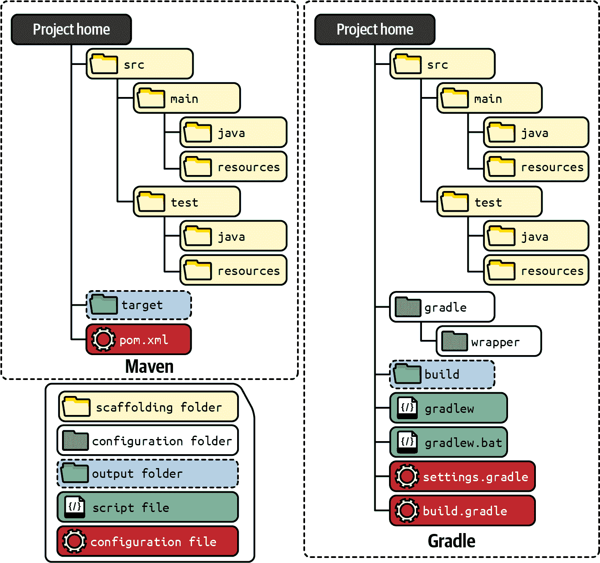
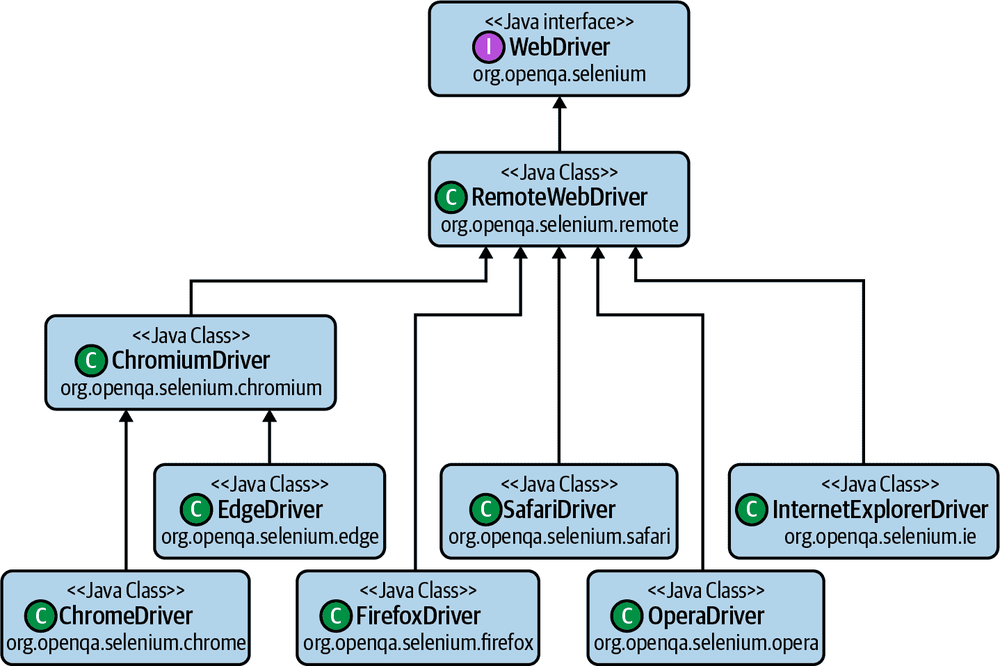
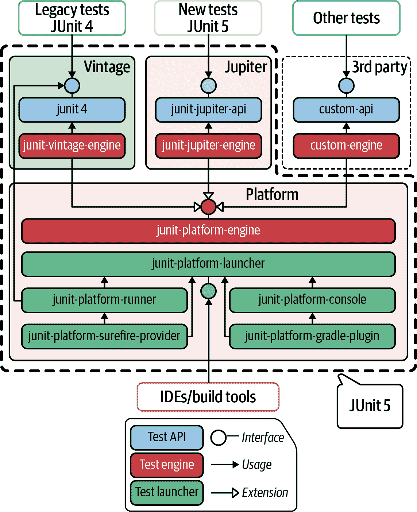
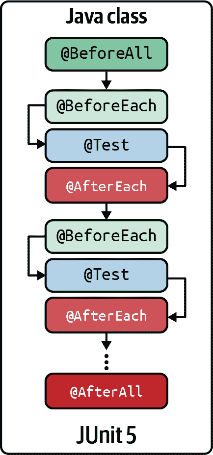
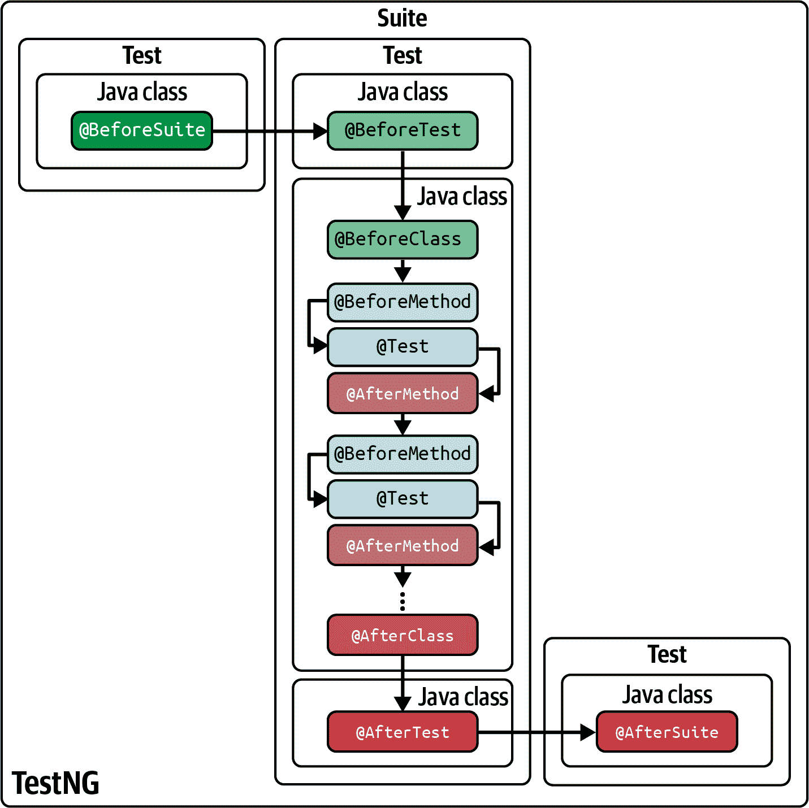
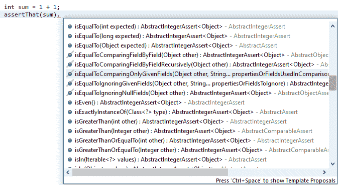
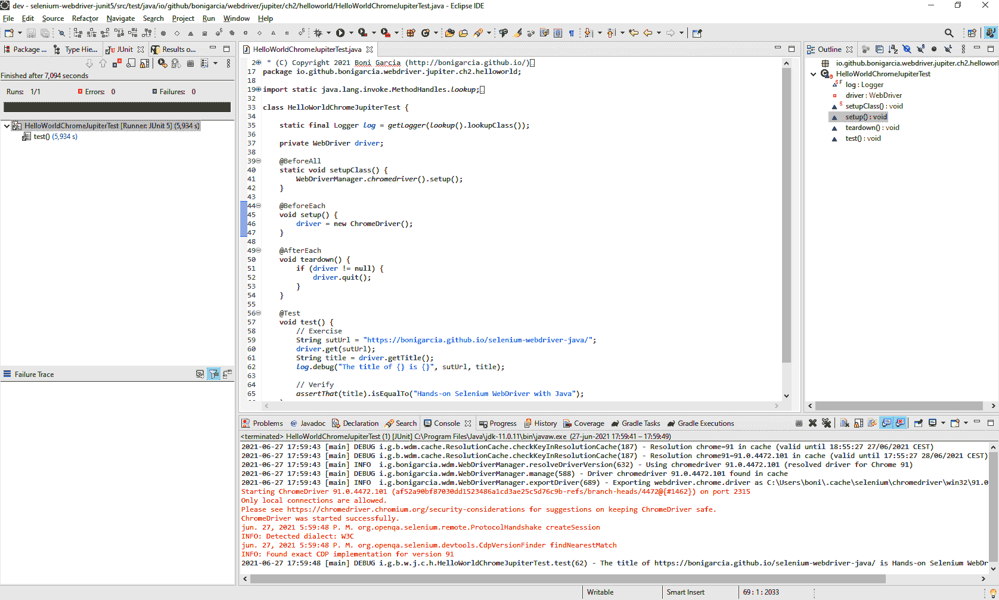
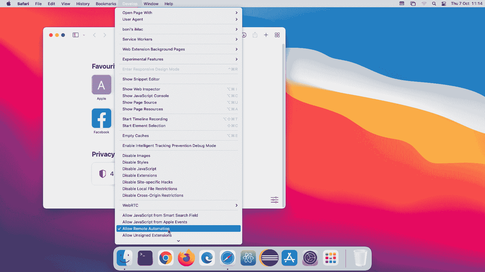

# 第二章。测试准备

这一章旨在使用 Selenium WebDriver 和 Java 语言实现你的第一个端到端测试。为此，我们首先回顾了技术要求，包括先前的知识、硬件和软件。其次，本章概述了设置包含 Selenium WebDriver 测试的 Java 项目的概述。您可以使用类似 Maven 或 Gradle 的构建工具来简化项目设置。最后，您将学习使用 Selenium WebDriver 实现基本的端到端测试，即*hello world*测试。我们将使用不同的 Web 浏览器（如 Chrome、Edge 或 Firefox）和单元测试框架（JUnit 和 TestNG）以多种风格实现此测试。请记住，本书中的每个代码示例都可以在[开源 GitHub 存储库](https://github.com/bonigarcia/selenium-webdriver-java)中找到。因此，您可以重用此存储库的内容和配置作为自己测试的基础。

# 要求

使用 Java 启动 Selenium WebDriver 的第一个要求是理解 Java 语言和面向对象编程。不必成为专家，但需要基本的知识。然后，您可以在任何主流操作系统上使用 Selenium WebDriver：Windows、Linux 或 macOS。因此，您可以选择您喜欢的计算机类型。原则上，在内存、CPU、硬盘等方面对硬件没有特定要求，因此任何中档计算机都可以胜任。

## Java 虚拟机

接下来，您需要在计算机上安装 Java 虚拟机（JVM）。有两种类型的 JVM 分发版。第一种选择是 Java 运行时环境（JRE），其中包括 JVM 和 Java 标准 API。第二种选择是 Java 开发工具包（JDK），它是 JRE 加上 Java 的软件开发工具包（例如`javac`编译器和其他工具）。由于我们是在 Java 中开发，我建议使用 JDK（尽管一些集成开发环境也包含了 Java 的 SDK）。对于 Java 版本，我建议至少使用 JDK 8，因为它是在我写作时期通常受到许多 Java 项目支持的长期支持版本。

## 文本编辑器或集成开发环境（IDE）

要编写我们的 Java 测试，我们需要一个文本编辑器或 IDE。IDE 提供了优秀的开发体验，因为它们具有完整的环境（用于编码、运行、调试、自动完成等）。尽管如此，你可以使用任何你喜欢的文本编辑器，结合命令行工具（用于运行、调试等）来获得类似的实践。总体而言，选择使用哪种工具取决于个人偏好。一些流行的文本编辑器的替代方案包括 [Sublime Text](https://www.sublimetext.com)、[Atom](https://atom.io)、[Notepad++](https://notepad-plus-plus.org) 或 [Vim](https://www.vim.org) 等。IDE 包括 [Eclipse](https://www.eclipse.org)、[IntelliJ IDEA](https://www.jetbrains.com/idea)、[NetBeans](https://netbeans.apache.org) 或 [Visual Studio Code](https://code.visualstudio.com)。

## 浏览器和驱动程序

使用 Selenium WebDriver 进行自动化的一个最初的方法是使用本地浏览器。我考虑在本书中使用以下浏览器：Chrome、Edge 和 Firefox。我称它们为 *主要浏览器*，原因有几点。首先，它们在全球范围内非常流行，因为我们使用 Selenium WebDriver 测试 Web 应用程序时，希望使用与潜在用户相同的浏览器。其次，这些浏览器是 *常绿* 的（即它们自动升级）。第三，这些浏览器适用于主要操作系统：Windows、Linux 和 macOS（不像 Safari，它也是一款流行的浏览器，但仅在 macOS 上可用）。最后，这些浏览器在 GitHub 仓库使用的持续集成（CI）环境中可用（即 GitHub Actions）。

控制 web 浏览器使用 Selenium WebDriver 的最后要求是驱动程序二进制文件：chromedriver（用于 Chrome）、msedgedriver（用于 Edge）和 geckodriver（用于 Firefox）。如 第一章 所述，驱动程序管理涉及三个步骤：下载、设置和维护。为了避免该章节中解释的潜在问题，我强烈建议使用 [WebDriverManager](https://bonigarcia.dev/webdrivermanager) 自动化此过程。

###### 提示

附录 B 提供了由 WebDriverManager 执行的自动驱动程序管理过程的详细信息。此外，以防出于某些原因你需要手动执行驱动程序管理，本附录也解释了如何进行。

## 构建工具

另一个重要组成部分是 *构建工具*。构建工具是用于从源代码自动创建可执行应用程序的软件实用程序。这些工具在依赖管理、编译、打包、测试执行和部署方面简化了项目管理。总体而言，构建工具是自动化软件项目开发的便捷方式，无论是在构建服务器（如 GitHub Actions）还是开发者机器上。因此，我强烈建议使用构建工具来设置项目。本书中涵盖的替代方案包括：

[Maven](https://maven.apache.org)

一个由 Apache 软件基金会维护的开源构建自动化工具。它主要用于 Java 项目，尽管也支持其他语言，如 C#、Ruby 或 Scala。

[Gradle](https://gradle.org)

另一个用于软件开发的开源构建自动化工具。它支持 Java 和其他语言，如 Kotlin、Groovy、Scala、C/C++ 或 JavaScript。

推荐的版本是 Maven 3+ 和 Gradle 6+。为了完整起见，在示例仓库中我同时使用了两种构建工具。再次强调，最终选择使用哪一种取决于你的偏好。

###### 注意

如果打算使用 IDE 进行开发和运行测试，那么构建工具并非必需。不过，我建议你至少在计算机上安装其中一种工具，以复制通常在构建服务器上使用的环境（例如 Jenkins、GitHub Actions 等）。

## 可选软件

除了已经解释的软件外，还有一些其他程序可以帮助你更好地利用本书。首先，你可以使用 [Git](https://git-scm.com) 进行源代码管理。由于本书中的测试示例可在 GitHub 上获得，你可以使用 Git 进行分支（或克隆）和更新此仓库。

第二个可选工具是 [Docker](https://www.docker.com)。在本书中，我展示了如何使用 Docker 来执行容器化的浏览器（见 第六章）。因此，我强烈建议你在计算机上安装 *Docker Engine*（适用于 Linux、macOS 和 Windows 10）。

最后，如果需要，你可以使用不同的网页浏览器。除了主流浏览器（Chrome、Edge 和 Firefox）外，还可以使用其他浏览器与 Selenium WebDriver 结合使用，如 macOS 中的 [Safari](https://www.apple.com/safari)，或任何操作系统中的 [Opera](https://www.opera.com)，[Chromium](https://www.chromium.org)，以及 [HtmlUnit](https://htmlunit.sourceforge.io)（一个无界面浏览器，即无 GUI 浏览器）。

# 项目设置

你可以在 [GitHub 仓库](https://github.com/bonigarcia/selenium-webdriver-java) 中找到本书的所有代码示例。该仓库是开源的，使用 Apache 2.0 许可发布。该仓库有多个目的。首先，将所有示例集中在一个站点中非常方便。其次，你可以使用它的设置（Maven 或 Gradle）作为你项目的骨架。

###### 提示

下面的子节描述了创建包含 Selenium WebDriver 测试的 Java 项目的一般要求。附录 C 提供了关于示例仓库配置的低级细节。

## 项目布局

*项目布局*是用于存储软件项目的不同资产（例如源代码、二进制文件、静态资源等）的目录结构。Maven 和 Gradle 在 Java 项目中使用等效的布局。我们可以使用这一布局在两种构建工具中执行示例仓库，多亏了这一点。

如图 Figure 2-1 所示，以下一组文件夹（称为*脚手架文件夹*）在两个构建工具中完全相同：

`src/main/java`

应用程序源代码（即 Java 文件）

`src/main/resources`

应用程序资源文件（即属性、配置文件等）

`src/test/java`

测试源代码（即用于测试的 Java 文件）

`src/test/resources`

测试资源文件（即用于测试的附加资产）



###### 图 2-1\. Maven 和 Gradle 中的项目布局

项目布局的其余部分在两个构建工具中不同。第一个区别是配置文件。一方面，该文件在 Maven 中是唯一的，称为`pom.xml`（项目对象模型）。另一方面，在 Gradle 中有两个文件用于配置，称为`settings.gradle`和`build.gradle`。Maven 和 Gradle 之间的第二个区别是输出文件夹。在两种情况下，构建工具都创建了此文件夹以保存生成的构建（即编译后的类、生成的打包文件等）。该文件夹在 Maven 中称为`target`，在 Gradle 中称为`build`。最后，Gradle 包含一组文件夹和文件，用于所谓的 Gradle *包装器*。这个包装器是一个脚本文件（对 Unix-like 系统称为`gradlew`，对 Windows 系统称为`gradlew.bat`），提供以下好处：

+   在本地机器上构建项目而无需安装 Gradle

+   需要使用给定版本（可以与本地安装的 Gradle 实例不同）

+   通过更改包装器工件（在`gradle/wrapper`文件夹中）轻松升级到新版本

从版本 4 开始，Maven 采用了使用`mvnw`脚本的包装概念。

###### 注意

本书范围不包括解释 Maven 和 Gradle 提供的所有功能。然而，您可以在附录 C 中找到有关它们的构建生命周期和典型命令的更多信息。如需进一步了解，请阅读官方的[Maven](https://maven.apache.org/guides)和[Gradle](https://docs.gradle.org)文档。

## 依赖项

软件项目的依赖项是所需的库或插件。构建工具除了其他功能外，还能够自动管理项目依赖关系。为此，我们需要在项目配置文件中指定这些依赖关系的*坐标*（请参阅 Maven 和 Gradle 的具体子部分以获取详细信息）。Java 项目的坐标是一组三个标签，唯一标识该项目（例如，库、插件等），即：

`groupId`

创建项目的组织、公司、个人等。

`artifactId`

用于标识项目的唯一名称。

`version`

项目的特定版本。默认情况下，建议您使用每个发布的最新版本。

本节解释了我在示例库中使用的 Java 依赖项。首先，当然，我们需要 Selenium WebDriver 来进行浏览器自动化。这个依赖项是唯一强制性的。然后，我建议使用额外的依赖项用于自动化驱动程序管理实用程序、单元测试框架、流畅断言和日志记录。本节的其余部分解释了每个实用程序的动机和基本使用方法。

### Selenium WebDriver

Selenium WebDriver 最相关的概念之一是 `WebDriver` 层次结构，它是一组用于控制不同网页浏览器的类集合。正如您在图 2-2 中所见，该层次结构遵循面向对象的编程范式。在顶部，我们找到 `WebDriver` 接口，它是整个结构的父接口。层次结构的下部对应于驱动单个浏览器的 Java 类。例如，我们需要使用 `ChromeDriver` 类的实例来控制本地的 Chrome 浏览器。表 2-1 展示了 `WebDriver` 层次结构主要类及其对应的目标浏览器的全面摘要。

表 2-1\. `WebDriver` 层次结构描述

| 包 | 类 | 浏览器 |
| --- | --- | --- |

|

```java
org.openqa.selenium.chrome
```

|

```java
ChromeDriver
```

| Chrome |
| --- |

|

```java
org.openqa.selenium.edge
```

|

```java
EdgeDriver
```

| Edge |
| --- |

|

```java
org.openqa.selenium.firefox
```

|

```java
FirefoxDriver
```

| Firefox |
| --- |

|

```java
org.openqa.selenium.safari
```

|

```java
SafariDriver
```

| Safari |
| --- |

|

```java
org.openqa.selenium.opera
```

|

```java
OperaDriver
```

| Opera |
| --- |

|

```java
org.openqa.selenium.ie
```

|

```java
InternetExplorerDriver
```

| Internet Explorer |
| --- |

|

```java
org.openqa.selenium.remote
```

|

```java
RemoteWebDriver
```

| 远程浏览器（参见第六章） |
| --- |



###### 图 2-2\. `WebDriver` 对象的层次结构

### 自动化驱动程序管理

在实例化 `WebDriver` 层次结构对象之前，解析相应的驱动程序是强制性的。例如，要使用 `ChromeDriver` 控制 Chrome，我们首先需要在本地机器上安装这个浏览器。其次，我们需要管理 chromedriver。为了避免手动驱动程序管理可能出现的问题（参见第一章），建议完全自动化驱动程序管理过程（下载、设置和维护）。关于 Java，推荐实现是 [WebDriverManager](https://bonigarcia.dev/webdrivermanager)，这是一个 Selenium WebDriver 辅助库，允许自动化驱动程序管理。本节解释了如何将 WebDriverManager 作为 Java 依赖项使用。

一旦我们的项目解析了 WebDriverManager 的依赖项（请参见附录 C 获取配置详细信息），我们就可以使用 WebDriverManager API 来管理驱动程序。该 API 提供了一组单例（称为*管理器*），用于下载、设置和维护驱动程序。这些单例可通过 `WebDriverManager` 类访问。例如，我们需要调用 `chromedriver()` 方法来管理 Chrome 所需的驱动程序，即 chromedriver，如下所示：

```java
WebDriverManager.chromedriver().setup();
WebDriver driver = new ChromeDriver();
```

表格 2-2 总结了所有支持的浏览器的基本 WebDriverManager 调用。除了这些基本调用（即方法 `setup()`）外，WebDriverManager 还公开了一个流畅的 API 用于高级配置。有关 WebDriverManager 方法论、配置能力及其他用途的更多详细信息，请参阅 附录 B，例如作为一个命令行接口工具（从 shell 中）、作为服务器（使用类似 REST 的 API）、作为代理（使用 Java 仪器化）或作为 Docker 容器。

表格 2-2\. WebDriverManager 基本调用

| WebDriverManager 基本调用 | 浏览器 | 驱动程序 |
| --- | --- | --- |

|

```java
WebDriverManager.chromedriver().setup();
```

| Chrome | chromedriver |
| --- | --- |

|

```java
WebDriverManager.edgedriver().setup();
```

| Edge | msedgedriver |
| --- | --- |

|

```java
WebDriverManager.firefoxdriver().setup();
```

| Firefox | geckodriver |
| --- | --- |

|

```java
WebDriverManager.operadriver().setup();
```

| Opera | operadriver |
| --- | --- |

|

```java
WebDriverManager.chromiumdriver().setup();
```

| Chromium | chromedriver |
| --- | --- |

|

```java
WebDriverManager.iedriver().setup();
```

| Internet Explorer | IEDriverServer |
| --- | --- |

### 单元测试框架

如 第 1 章 中所解释的，单元测试框架是创建不同类型测试的基础。本书将教您如何使用 Selenium WebDriver 为 Web 应用程序实现端到端测试。因此，我建议将 Selenium WebDriver 调用嵌入到使用特定单元测试框架创建的测试中。我推荐的备选方案之一是：JUnit 4、JUnit 5（单独或与 Selenium-Jupiter 结合，后者是 Selenium WebDriver 的扩展）或 TestNG。以下子章节提供了有关这些替代方案的更多详细信息。我的建议是专注于您喜欢的单元测试框架和构建工具，以继续练习本书其余部分中呈现的示例。

#### JUnit 4

JUnit 是由 Erich Gamma 和 Kent Beck 于 1999 年创建的 Java 单元测试框架。它被认为是在 Java 中开发测试的事实标准框架。在 JUnit 中，*测试* 是一个用于测试的 Java 类中的方法。在 JUnit 4 中，Java 注解是开发 JUnit 测试的构建块。JUnit 4 的基本注解是 `@Test`，因为它允许标识包含测试逻辑的方法（即用于执行和验证软件的代码）。此外，还有其他注解用于标识用于设置（即测试前发生的事情）和拆卸（即测试后发生的事情）的方法。

+   `@BeforeClass` 在所有测试之前执行一次。

+   `@Before` 在每个测试之前执行。

+   `@After` 在每个测试之后执行。

+   `@BeforeClass` 在所有测试之前执行一次。

图 2-3 展示了 JUnit 4 的基本测试生命周期的图形表示。


###### 图 2-3\. JUnit 4 测试生命周期

#### JUnit 5

由于 JUnit 4 存在一些限制（如单体架构或不可能组合 JUnit 运行器），JUnit 团队在 2017 年发布了一个新的主要版本（即 JUnit 5）。JUnit 在版本 5 中进行了完全重新设计，采用了由三个组件组成的模块化架构（见 Figure 2-4）。第一个组件是 JUnit *Platform*，是整个框架的基础。JUnit Platform 的目标是双重的：

+   它通过 *test launcher* API 允许在 JVM 中发现和执行测试（顺序或并行）。这个 API 通常被构建工具和 IDE 等程序化客户端使用。

+   它定义了在 JUnit 平台上运行测试的 *test engine* API。这个 API 通常被提供测试模型的框架所使用。



###### Figure 2-4\. JUnit 5 架构

多亏了测试引擎 API，第三方测试框架可以在 JUnit 5 之上执行测试。一些已实现用于 JUnit 5 的测试引擎的现有测试框架的示例包括 [TestNG](https://github.com/junit-team/testng-engine)、[Cucumber](https://github.com/cucumber/cucumber-jvm) 或 [Spock](https://github.com/spockframework/spock)。此外，JUnit 5 还提供了测试引擎 API 的两个开箱即用的实现。这些引擎是 JUnit 5 架构的其余两个组件，即

Vintage

提供与传统 JUnit 测试（即版本 3 和 4）的向后兼容的测试引擎。

Jupiter

提供一个新的编程和扩展模型的测试引擎

Jupiter 是 JUnit 5 的一个重要组成部分，它提供了全新的 API，使用强大的编程模型来开发测试。这个编程模型的一些特性包括参数化测试、并行执行、标记和过滤、有序测试、重复和嵌套测试，以及丰富的禁用（忽略）测试的能力。

与 JUnit 4 类似，Jupiter 也使用 Java 注解来声明测试用例。例如，用于标识带有测试逻辑方法的注解仍然是 `@Test`。在 Jupiter 中，其他基本测试生命周期注解的名称与 JUnit 4 有些不同：`@BeforeAll`、`@BeforeEach`、`@AfterEach` 和 `@AfterAll`。如你所见在 Figure 2-5 中，这些注解每一个都遵循了 JUnit 4 相同的工作流程。



###### Figure 2-5\. JUnit 5 测试生命周期

因此，使用 Selenium WebDriver 和 WebDriverManager 的 Jupiter 测试结构在 JUnit 4 和 JUnit 5 中非常相似。除了设置和拆卸注解名称的变化外，在 Jupiter 编程模型中，测试方法（及其生命周期）不需要在 JUnit 4 中是 `public` 的。

###### Tip

本书将教会你如何使用 Selenium WebDriver 进行端到端测试的 Jupiter 基础知识。请查看下一节中关于基于 JUnit 5 的完整测试的*hello world*示例。详细信息请查看 [JUnit 5 文档](https://junit.org/junit5/docs/current/user-guide)。

#### JUnit 5 与 Selenium-Jupiter

Jupiter 的扩展模型允许向默认编程模型添加自定义功能。为此，Jupiter 提供了一个 API，开发人员可以扩展（使用称为*扩展点*的接口）以提供自定义功能。这些扩展点的类别包括：

测试生命周期回调

在测试生命周期的不同时刻包含自定义逻辑

参数解析

实现依赖注入（例如，在测试方法或构造函数中注入参数）

测试模板

根据给定的上下文重复测试

条件测试执行

根据自定义条件启用或禁用测试

异常处理

在测试及其生命周期中管理 Java 异常

测试实例

创建和处理测试类实例

拦截调用

拦截调用测试代码（并决定这些调用是否继续）

作为 Jupiter 开发者，你可以实现自定义扩展或使用现有的扩展。表 2-3 展示了一些 Jupiter 扩展的示例。

表 2-3\. Jupiter 扩展

| 名称 | 描述 | 许可证 | 维护者 | 网站 |
| --- | --- | --- | --- | --- |
| JUnit Pioneer | Jupiter 的扩展包 | EPL 2.0 | JUnit Pioneer 团队 | [*https://junit-pioneer.org*](https://junit-pioneer.org) |
| rerunner-jupiter | 用于重新运行失败的 Jupiter 测试的扩展 | Apache 2.0 | Artem Sokovets | [*https://github.com/artsok/rerunner-jupiter*](https://github.com/artsok/rerunner-jupiter) |
| MockitoExtension | Jupiter 扩展，用于初始化模拟对象和处理存根 | MIT | Mockito 团队 | [*https://github.com/mockito/mockito*](https://github.com/mockito/mockito) |
| QuickPerf | 用于评估一些性能相关属性的库 | Apache 2.0 | QuickPerf 团队 | [*https://github.com/quick-perf/quickperf*](https://github.com/quick-perf/quickperf) |
| Selenium-Jupiter | Selenium WebDriver 的 Jupiter 扩展 | Apache 2.0 | Boni García | [*https://bonigarcia.dev/selenium-jupiter*](https://bonigarcia.dev/selenium-jupiter) |
| SpringExtension | Spring 框架的 Jupiter 扩展 | Apache 2.0 | Pivotal Software | [*https://spring.io/projects/spring-framework*](https://spring.io/projects/spring-framework) |

在本书的背景下，Selenium-Jupiter 是一个非常有吸引力的选择，因为它可以无缝地在 Jupiter 测试中使用 Selenium WebDriver。Selenium-Jupiter 的基础如下（请参见下一节关于基于 Selenium-Jupiter 的*hello world*测试）：

减少测试用例中的样板代码

由于 Jupiter 编程模型提供的参数解析功能，Selenium-Jupiter 允许声明 `WebDriver` 层次结构的对象（例如，`ChromeDriver`、`FirefoxDriver` 等）以控制来自测试的 Web 浏览器作为构造函数或测试参数。

通过 WebDriverManager 自动化驱动程序管理

由于扩展模型提供的测试生命周期回调，对于 Selenium-Jupiter 用户来说，使用 WebDriverManager 是完全透明的。

高级端到端测试功能

例如，这包括与 Docker 的无缝集成、测试模板（用于跨浏览器测试）或故障排除和监控功能（例如，会话录制或可配置截图）。

#### TestNG

本书中我使用的最后一个单元测试框架是 TestNG。 TestNG 提供的一些更显著的特性包括并行测试执行、测试优先级、使用自定义注解进行数据驱动测试以及创建详细的 HTML 报告。

与 JUnit 4 和 Jupiter 一样，TestNG 也使用 Java 注解声明测试及其生命周期（即每个测试之前和之后发生的事情）。 再次，注解 `@Test` 用于指定测试方法。 然后，它提供了注解 `@BeforeClass` 和 `@BeforeMethod` 来指定测试设置，并使用 `@AfterMethod` 和 `@AfterClass` 进行拆卸（参见 图 2-6）。 另外，TestNG 允许使用以下术语对包含在 Java 类中的测试进行分组：

+   *Suite* 包含一个或多个 *tests*。

+   *Test* 包含一个或多个 *classes*。

+   *Class* 是一个带有测试方法的 Java 类，例如，用 `@Test` 注解。

按照这种表示法，并如 图 2-6 所示，TestNG 提供了额外的注解来在套件和测试之前和之后执行自定义逻辑。



###### 图 2-6\. TestNG 测试生命周期

### 流畅断言

如 第一章 中介绍的，有不同的断言库。 这些库通常提供丰富的流畅断言和全面的错误消息。 在这些备选方案中，我在示例库中使用 [AssertJ](https://joel-costigliola.github.io/assertj) 库。 原因有两个。 首先，我们可以选择在 IDE 中使用静态方法 `assertThat` 后（通常在静态方法后按 Ctrl + 空格可用）快速断言数据的可用方法。 图 2-7 显示了使用 IDE（本例中为 Eclipse）检查此方法的示例。



###### 图 2-7\. 使用 Eclipse 手动检查 AssertJ 中可用的断言方法

与其他选项相比，AssertJ 的第二个优势是它允许使用点符号进行断言链。 由此，我们可以连接几个条件以创建更可读的断言，例如：

```java
assertThat(1 + 1).isGreaterThan(1).isLessThan(3);
```

### 记录

最后，我建议使用日志记录库来跟踪您的 Java 代码。如您所知，日志记录是程序员在软件执行时跟踪事件的一种简单方式。通常通过将文本消息写入文件或标准输出来执行日志记录，并且它允许您跟踪程序并诊断问题。今天，使用特定库来有效进行日志记录是很普遍的。这些库提供不同的好处，例如消息的粒度级别（例如调试，警告或错误），时间戳或配置能力。

# Hello World

我们已经准备好将本章中解释的所有部分结合起来，实现我们的第一个端到端测试。正如您可能知道的那样，一个*hello world*程序是许多编程语言用来说明基本语法的简单代码片段。示例 2-1 展示了 Selenium WebDriver 版本的这个经典*hello world*。

###### 提示

以下示例使用 JUnit 5 作为单元测试框架来嵌入调用 Selenium WebDriver 的代码。请记住，您可以在[示例存储库](https://github.com/bonigarcia/selenium-webdriver-java)中找到其他版本（即 JUnit 4，带有 Selenium-Jupiter 的 JUnit 5 和 TestNG）。

##### 示例 2-1。使用 Chrome 和 JUnit 5 的 Hello World

```java
class HelloWorldChromeJupiterTest {

    static final Logger log = getLogger(lookup().lookupClass());

    private WebDriver driver; 

    @BeforeAll
    static void setupClass() {
        WebDriverManager.chromedriver().setup(); 
    }

    @BeforeEach
    void setup() {
        driver = new ChromeDriver(); 
    }

    @Test
    void test() {
        // Exercise
        String sutUrl = "https://bonigarcia.dev/selenium-webdriver-java/";
        driver.get(sutUrl); 
        String title = driver.getTitle(); 
        log.debug("The title of {} is {}", sutUrl, title); 

        // Verify
        assertThat(title).isEqualTo("Hands-On Selenium WebDriver with Java"); 
    }

    @AfterEach
    void teardown() {
        driver.quit(); 
    }

}
```


我们使用`WebDriver`接口声明 Java 属性。我们在测试中使用这个变量来控制 Selenium WebDriver 的 Web 浏览器。


在这个类的所有测试的设置中（即仅执行一次），我们调用 WebDriverManager 来管理所需的驱动程序。在这个例子中，因为我们使用 Chrome 作为浏览器，所以我们需要解决 chromedriver。


在测试设置中（每个测试方法执行一次），我们实例化`WebDriver`对象来控制 Chrome。换句话说，我们创建了一个`ChromeDriver`类型的对象。


测试逻辑通过`driver`变量使用 Selenium WebDriver API。首先，测试执行 System Under Test（SUT）。为此，我们使用我们的`webdriver`变量的`get()`方法打开[练习站点](https://bonigarcia.dev/selenium-webdriver-java)（在本例中代表 Chrome 浏览器）。


我们使用`getTitle()`方法获取网页标题。


出于调试目的，我们使用`DEBUG`级别记录该标题。


测试的最后部分包含一个 AssertJ 断言。在这种情况下，我们验证网页标题是否符合预期。


在每个测试结束时，我们需要关闭浏览器。为此，我们可以调用`driver`对象的`quit()`方法（有关如何关闭`WebDriver`对象的更多信息，请参见第三章）。

你可以以不同的方式执行此测试。我建议获取示例仓库的本地副本。你可以使用 GitHub 网站下载源代码的完整副本。或者，你可以使用 Git 在 shell 中克隆存储库，如下所示：

```java
git clone https://github.com/bonigarcia/selenium-webdriver-java
```

接下来，你可以使用 Maven 或 Gradle（如附录 C 中所述）在 shell 中运行测试。此外，你还可以将克隆的 Maven/Gradle 项目导入到 IDE 中。IDE 提供了内置功能，可以从其 GUI 中执行测试。例如，图 2-8 展示了在 Eclipse 中执行前一个*hello world*测试的屏幕截图（在此情况下，使用命令 Run → Run As → JUnit Test）。请注意，在集成控制台（图片底部）中，第一行跟踪是由 WebDriverManager 解析的驱动器分辨率。然后，浏览器通过 chromedriver 启动，最后，我们可以看到测试跟踪（具体来说，是网页标题）。



###### 图 2-8\. 在 Eclipse 中执行 Selenium WebDriver 的*hello world*的屏幕截图

使用 JUnit 4 和 TestNG 的*hello world*版本几乎与 JUnit 5 相同，但使用不同的测试生命周期注解（例如，JUnit 4 的`@Before`代替 JUnit 5 的`@BeforeEach`等）。关于 JUnit 5 加 Selenium-Jupiter，代码更加紧凑。示例 2-2 展示了这个*hello world*版本。正如你所看到的，无需声明设置和拆卸。我们只需要将想要的`WebDriver`对象声明为测试参数（在本例中为 FirefoxDriver），Selenium-Jupiter 会处理驱动程序管理（也包括 WebDriverManager）、对象实例化和浏览器处理。

##### 示例 2-2\. 使用 Firefox 和 Selenium-Jupiter 的 Hello world

```java
@ExtendWith(SeleniumJupiter.class)
class HelloWorldFirefoxSelJupTest {

    @Test
    void test(FirefoxDriver driver) {
        // Same test logic than other "hello world" tests
    }

}
```

## 使用其他浏览器

除了本书中称为*主要*浏览器（即 Chrome、Edge 和 Firefox）之外，示例仓库还包含使用其他浏览器的*hello world*测试：Opera、Chromium、Safari 和 HtmlUnitDriver（用于 HtmlUnit 无头浏览器的 Selenium WebDriver 兼容驱动程序）。这些测试包含在此存储库的`helloworld_otherbrowsers`包中，与原始的*hello world*版本略有不同。例如，示例 2-3 展示了使用 Opera 的 JUnit 5 类设置的*hello world*测试。由于这个浏览器可能在运行测试的机器上不可用（例如，在 GitHub Actions 中不可用 Opera），我使用*假设*在运行时有条件地禁用测试。

##### 示例 2-3\. 使用 Opera 和 JUnit 5 的类设置

```java
@BeforeAll
static void setupClass() {
    Optional<Path> browserPath = WebDriverManager.operadriver()
            .getBrowserPath(); 
    assumeThat(browserPath).isPresent(); 
    WebDriverManager.operadriver().setup();
}
```


我们使用 WebDriverManager 来定位浏览器路径。


如果此路径不存在，则假设系统中未安装浏览器，因此测试被跳过（使用 AssertJ 假设）。

通常情况下，您可以在示例存储库中使用其他单元测试框架找到此测试。JUnit 5 和 TestNG 版本使用与前面代码片段相同的等效测试设置。然而，使用 JUnit 5 和 Selenium-Jupiter 时有所不同。正如您在 示例 2-4 中所见，Selenium-Jupiter 通过使用自定义注解（称为 `EnabledIfBrowserAvailable`）简化了依赖于浏览器可用性（本例中为 Safari）的测试假设逻辑。

##### 示例 2-4\. 使用 Safari 和 JUnit 5 加上 Selenium-Jupiter 的 Hello World

```java
@EnabledIfBrowserAvailable(SAFARI)
@ExtendWith(SeleniumJupiter.class)
class HelloWorldSafariSelJupTest {

    @Test
    void test(SafariDriver driver) {
        // Same test logic than other "hello world" tests
    }

}
```

要使用 Selenium WebDriver 控制 Safari，我们需要手动配置 Safari 以授权远程自动化。为此，首先通过单击 Safari 菜单选项 Safari → 首选项 → 高级选项卡来显示开发菜单。然后，启用“显示开发菜单”复选框。之后，“开发”菜单应该会显示出来。最后，单击“允许远程自动化”选项（参见 图 2-9）。



###### 图 2-9\. 在 macOS 上启用 Safari 远程自动化

# 总结与展望

本章提供了使用 Selenium WebDriver 和 Java 开发 Web 应用端到端测试的基础知识。您需要做出的第一个重要决定是决定在哪个单元测试框架中嵌入 Selenium WebDriver 调用以实现这些测试。为了多样性和完整性，本书提出了四个选项：JUnit 4、JUnit 5、JUnit 5 加上 Selenium-Jupiter 和 TestNG。它们在基本的 Selenium WebDriver 测试方面都是等效的。对于更高级的用法，第八章 将涵盖每个测试框架的特定功能，这些功能可能对 WebDriver 测试（例如，用于跨浏览器测试的参数化测试）很重要。另一个您应该考虑的决定是选择构建工具。在本书中，我提出了两个选项：Maven 和 Gradle。再次强调，对于标准的开发实践，这两者都是类似的。

本书的第二部分专注于 Selenium WebDriver API，并将在下一部分开始介绍。要开始学习，请参阅 第三章，该章节涵盖了 Selenium WebDriver API 的基本概念，包括 WebDriver 对象、Web 元素定位、用户模拟操作（键盘和鼠标动作）以及等待策略。和往常一样，本章将通过 GitHub 托管的代码示例进行指导。
