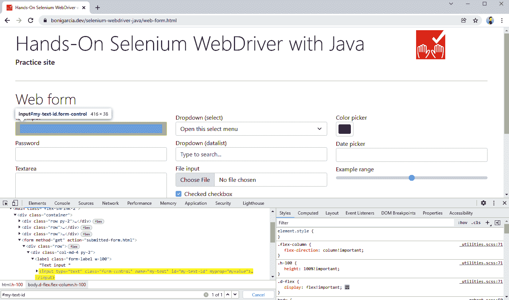
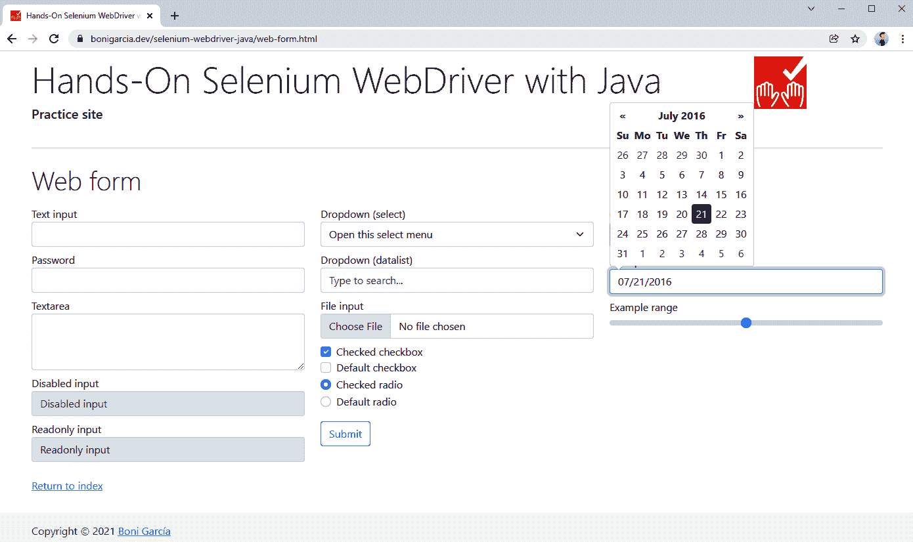

# 第三章：WebDriver 基础知识

本章介绍了 Selenium WebDriver API 的基本方面。为此，我们首先回顾了创建`WebDriver`层次结构实例的不同方法（例如，`ChromeDriver`，`EdgeDriver`，`FirefoxDriver`等）。此外，我们还探讨了这些对象中可用的主要方法。其中，在网页中定位不同元素至关重要。因此，您将了解可能的定位器，即在网页中查找元素的策略（在 Selenium WebDriver API 中称为`WebElement`），例如按标签名称，链接文本，HTML 属性（标识符，名称或类），CSS 选择器或 XPath。本章还涵盖了 Selenium WebDriver API 的另一个关键方面，即模拟用户操作（即使用键盘和鼠标自动与网页进行交互）。本章的最后部分介绍了等待网页元素的能力。由于 Web 应用程序的动态和异步性质，此功能至关重要。

# 基本 WebDriver 使用

本节涵盖了与`WebDriver`对象相关的三个基本方面。首先，我们回顾了创建它们的不同方法。其次，我们研究了它们的基本操作。最后，我们分析了处理这些对象的不同方式（通常在测试结束时，用于关闭浏览器）。

## WebDriver 创建

正如在第二章中介绍的，要在 Java 中使用 Selenium WebDriver 控制浏览器，第一步是创建`WebDriver`实例。因此，在使用 Chrome 时，我们需要创建一个`ChromeDriver`对象，在 Edge 时需要使用`EdgeDriver`，在 Firefox 时需要使用`FirefoxDriver`等等。创建这些类型实例的基本方法是在 Java 中使用`new`运算符。例如，我们可以按照以下方式创建一个`ChromeDriver`对象：

```java
WebDriver driver = new ChromeDriver();
```

使用`new`运算符创建`WebDriver`实例是完全正确的，您可以在测试中使用它。然而，值得审查其他可能性，因为根据创建这些对象的特定用例，这些替代方案可能提供额外的好处。这些替代方案是 WebDriver 和 WebDriverManager 构建器。

### WebDriver 构建器

Selenium WebDriver API 提供了一个遵循*构建者模式*的内置方法，用于创建`WebDriver`实例。通过`RemoteWebDriver`类的静态方法`builder()`可以访问此功能，并提供一个流畅的 API 来创建`WebDriver`对象。表 3-1 介绍了此构建器的可用方法。示例 3-1 展示了使用 WebDriver 构建器的测试框架。

表 3-1. WebDriver 构建器方法

| 方法 | 描述 |
| --- | --- |

|

```java
oneOf(Capabilities options)
```

| 特定于浏览器的功能 |
| --- |

|

```java
addAlternative(Capabilities options)
```

| 可选的特定于浏览器的功能（参见第五章） |
| --- |

|

```java
addMetadata(String key, Object value)
```

| 添加自定义元数据，通常用于在云提供商中请求额外功能（请参阅第六章） |
| --- |

|

```java
setCapability(String capabilityName,
    Object value)
```

| 各个浏览器特定的能力（见第五章） |
| --- |

|

```java
address(String uri)
address(URL url)
address(URI uri)
```

| 设置远程服务器的地址（见第六章） |
| --- |

|

```java
config(ClientConfig config)
```

| 在使用远程服务器时的特定配置，如连接超时或代理设置 |
| --- |

|

```java
withDriverService(DriverService service)
```

| 本地驱动器的特定配置（例如，chromedriver 的文件位置、使用的端口、超时或参数） |
| --- |

|

```java
build()
```

| 建造者模式中的最后一个方法，用于创建`WebDriver`实例 |
| --- |

###### Tip

第五章解释了关于*浏览器特定能力*（例如`ChromeOptions`）的详细信息。在这一点上，我们仅使用这些类来选择浏览器类型（例如，Chrome 的`ChromeOptions`，Edge 的`EdgeOptions`，或 Firefox 的`FirefoxOptions`）。

##### 示例 3-1\. 使用 WebDriver 建造者建立的测试框架

```java
class WebDriverBuilderJupiterTest {

    WebDriver driver;

    @BeforeAll
    static void setupClass() {
        WebDriverManager.chromedriver().setup(); 
    }

    @BeforeEach
    void setup() {
        driver = RemoteWebDriver.builder().oneOf(new ChromeOptions()).build(); 
    }

    @AfterEach
    void teardown() {
        driver.quit();
    }

    @Test
    void test() {
        // TODO: use variable "driver" to call the Selenium WebDriver API
    }

}
```


通常，在实际`WebDriver`实例化之前，我们使用 WebDriverManager 解析所需的驱动程序（例如此示例中的 chromedriver）。


我们使用 WebDriver 建造者创建`WebDriver`实例。由于在这个测试中我们想要使用 Chrome，因此我们使用一个`ChromeOptions`对象作为 capabilities 参数（使用`oneOf()`方法）。

从功能角度来看，这个例子与第二章中呈现的常规*hello world*测试的工作方式相同。然而，WebDriver 建造者 API 可以轻松地允许指定不同的行为。考虑以下代码片段作为示例。此代码更改设置方法并创建一个`SafariDriver`实例。假设在这种情况下（通常情况下，当测试未在 macOS 上执行时，因此系统中不可用 Safari 时），我们使用 Chrome 作为替代浏览器。

```java
@BeforeEach
void setup() {
    driver = RemoteWebDriver.builder().oneOf(new SafariOptions())
            .addAlternative(new ChromeOptions()).build();
}
```

### WebDriverManager 建造者

另一个创建`WebDriver`对象的可能性是使用 WebDriverManager。除了解决驱动程序外，从版本 5 开始，WebDriverManager 还提供了`WebDriver`建造者实用程序。示例 3-2 展示了使用这个建造者的测试框架。

##### 示例 3-2\. 使用 WebDriverManager 建立的测试框架

```java
class WdmBuilderJupiterTest {

    WebDriver driver;

    @BeforeEach
    void setup() {
        driver = WebDriverManager.chromedriver().create(); 
    }

    @AfterEach
    void teardown() {
        driver.quit();
    }

    @Test
    void test() {
        // TODO: use variable "driver" to call the Selenium WebDriver API
    }

}
```


WebDriverManager 解决所需的驱动程序（在本例中为 chromedriver）并在单行代码中创建正确的`WebDriver`类型的实例（在本例中为`ChromeDriver`）。

此方法具有不同的优势。首先，它可以减少冗长的测试，因为驱动程序的分辨率和`WebDriver`的实例化是同时进行的。其次，它允许通过选择特定的管理器（如`chromedriver()`、`firefoxdriver()`等）简单地指定浏览器类型（即 Chrome、Firefox 等）。此外，我们可以轻松地参数化选择管理器以创建跨浏览器测试（详见第八章）。最后，WebDriverManager 允许您指定特定于浏览器的功能（详见第五章），并轻松地在 Docker 容器中使用浏览器（详见第六章）。

WebDriverManager 通过这种方法保留了创建的`WebDriver`对象的引用。此外，它启动了一个关闭挂钩以监视`WebDriver`实例的正确处置。如果在 JVM 关闭时仍然有活动的`WebDriver`会话，WebDriverManager 会退出这些浏览器。您可以通过在示例中删除`teardown()`方法来尝试此功能。

###### 注意

虽然 WebDriverManager 会自动退出`WebDriver`对象，但我建议您在每个测试中显式执行此操作。否则，在执行测试套件的典型情况下，所有浏览器将保持打开状态，直到测试套件执行结束。

## WebDriver 方法

`WebDriver`接口提供了一组方法，这些方法是 Selenium WebDriver API 的基础。表 3-2 总结了这些方法。示例 3-3 展示了使用其中多个方法进行基本测试的示例。

表 3-2\. WebDriver 方法

| 方法 | 返回 | 描述 |
| --- | --- | --- |

|

```java
get(String url)
```

|

```java
void
```

| 在当前浏览器中加载一个网页。 |
| --- |

|

```java
getCurrentUrl()
```

|

```java
String
```

| 获取当前浏览器中加载的 URL。 |
| --- |

|

```java
getTitle()
```

|

```java
String
```

| 获取当前网页的标题（`<title>` HTML 标签）。 |
| --- |

|

```java
findElement(By by)
```

|

```java
WebElement
```

| 在当前网页中使用给定的定位器查找第一个`WebElement`。换句话说，如果有多个元素匹配定位器，则返回第一个元素（在文档对象模型[DOM]中）（详见“定位 WebElement”获取更多详细信息）。 |
| --- |

|

```java
findElements(By by)
```

|

```java
List<WebElement>
```

| 在当前网页中使用给定的定位器查找每个`WebElement`（另请参见“定位 WebElement”）。 |
| --- |

|

```java
getPageSource()
```

|

```java
String
```

| 获取当前网页的 HTML 源代码。 |
| --- |

|

```java
navigate()
```

|

```java
Navigation
```

| 访问浏览器历史记录并导航至指定的网址（详见第四章）。 |
| --- |

|

```java
getWindowHandle()
```

|

```java
String
```

| 获取当前浏览器中打开窗口的*窗口句柄*，即唯一标识符（另请参见第四章）。 |
| --- |

|

```java
getWindowHandles()
```

|

```java
Set<String>
```

| 获取当前浏览器中当前打开的窗口句柄集合（另请参见第四章）。 |
| --- |

|

```java
switchTo()
```

|

```java
TargetLocator
```

| 选择当前浏览器中的帧或窗口（另请参见第四章）。 |
| --- |

|

```java
manage()
```

|

```java
Options
```

| 用于管理浏览器不同方面的通用实用程序（例如，浏览器大小和位置、Cookie、超时或日志）。 |
| --- |

|

```java
close()
```

|

```java
void
```

| 关闭当前窗口，如果没有更多窗口打开，则退出浏览器。 |
| --- |

|

```java
quit()
```

|

```java
void
```

| 关闭所有窗口并退出浏览器。 |
| --- |

###### 提示

从现在开始，我仅展示示例逻辑。这些测试使用在测试之前创建的`WebDriver`对象（在设置方法中），并在测试之后关闭（在拆卸方法中）。作为约定，本书中展示的是 JUnit 5 测试（尽管您也可以在示例存储库中找到 JUnit 4、Selenium-Jupiter 和 TestNG 的示例）。

##### 示例 3-3\. 测试使用 Selenium WebDriver API 的几种基本方法

```java
@Test
void testBasicMethods() {
    String sutUrl = "https://bonigarcia.dev/selenium-webdriver-java/";
    driver.get(sutUrl); 

    assertThat(driver.getTitle())
            .isEqualTo("Hands-On Selenium WebDriver with Java"); 
    assertThat(driver.getCurrentUrl()).isEqualTo(sutUrl); 
    assertThat(driver.getPageSource()).containsIgnoringCase("</html>"); 
}
```


我们打开实践网站。


我们验证页面标题是否符合预期。


我们确认当前的网址仍然相同。


我们检查页面的源 HTML 是否包含特定标记。

## 会话标识符

每次我们实例化一个`WebDriver`对象时，底层驱动程序（例如，chromedriver、geckodriver 等）会创建一个称为*sessionId*的唯一标识符来跟踪浏览器会话。我们可以在测试中使用这个值来唯一标识浏览器会话。为此，我们需要在驱动程序对象中调用`getSessionId()`方法。注意，这个方法在表格 3-2 中不可用，因为它属于`RemoteWebDriver`类。在实际应用中，我们用于控制浏览器的类型（例如`ChromeDriver`、`FirefoxDriver`等）都继承自该类。因此，我们只需将`WebDriver`对象转换为`RemoteWebDriver`来调用`getSessionId()`方法。示例 3-4 展示了使用它的基本测试。

##### 示例 3-4\. 测试读取 sessionId

```java
@Test
void testSessionId() {
    driver.get("https://bonigarcia.dev/selenium-webdriver-java/");

    SessionId sessionId = ((RemoteWebDriver) driver).getSessionId(); 
    assertThat(sessionId).isNotNull(); 
    log.debug("The sessionId is {}", sessionId.toString()); 
}
```


我们将驱动程序对象转换为`RemoteWebDriver`并读取其 sessionId。


我们验证 sessionId 具有某些值。


我们在标准输出上记录 sessionId。

## WebDriver 释放

正如你在表格 3-2 中所看到的，有两种方法来处理`WebDriver`对象，分别是`close()`和`quit()`。作为一般规则，我在示例中使用`quit()`，因为这个方法会关闭浏览器和所有相关的窗口。另一方面，`close()`方法仅终止当前窗口。因此，我仅在同一浏览器中处理不同窗口（或标签页）时，并且希望关闭一些窗口（或标签页）而仍然使用其他窗口（或标签页）时使用`close()`。

# 定位 WebElements

Selenium WebDriver API 最重要的一个方面之一是能够与网页的不同元素进行交互。这些元素通过 Selenium WebDriver 使用 `WebElement` 接口进行处理，它是 HTML 元素的抽象表示。正如在 表格 3-2 中介绍的，有两种方法可以定位给定网页中的 `WebElement`。首先，`findElement()` 方法返回文档对象模型（DOM）中给定节点的第一个匹配项（如果有）。其次，`findElements()` 方法返回 DOM 节点列表。这两种方法都接受一个参数 `By`，指定定位策略。

## 文档对象模型（DOM）

DOM 是一个跨平台接口，允许以树结构表示 XML 类似文档（例如基于 HTML 的网页）。示例 3-5 展示了一个简单的网页；内存中对应的 DOM 树结构在 图 3-1 中表示。正如你所见，每个 HTML 标签（例如 `<html>`、`<head>`、`<body>`、`<a>` 等）在树中产生一个节点（或元素）。然后，每个标准 HTML 属性（例如 `charset`、`href` 等）在结果树中产生一个等效的 DOM *属性*。此外，HTML 标签的文本内容在生成的树中也可用。像 JavaScript 这样的语言使用 DOM 方法访问和修改树结构。多亏了这一点，网页可以根据用户事件动态更改其布局和内容。

##### 示例 3-5\. 基本网页

```java
<!DOCTYPE html>
<html>
<head>
  <meta charset="utf-8">
  <title>DOM example</title>
</head>
<body>
  <h1>Heading text</h1>
  <a href="#">Link text</a>
</body>
</html>
```


###### 图 3-1\. 从 示例 3-5 生成的 DOM 结构

## WebElement 方法

表格 3-3 包含了 `WebElement` 类中可用方法的摘要。你将在本节的后续部分找到每个方法的示例。

表格 3-3\. WebElement 方法

| 方法 | 返回 | 描述 |
| --- | --- | --- |

|

```java
click()
```

|

```java
void
```

| 执行鼠标点击（即左键单击）当前元素。 |
| --- |

|

```java
submit()
```

|

```java
void
```

| 发送网页表单（当前元素为表单时）。 |
| --- |

|

```java
sendKeys(CharSequence... keys)
```

|

```java
void
```

| 模拟使用键盘输入（例如在输入文本元素中）。 |
| --- |

|

```java
clear()
```

|

```java
void
```

| 重置输入文本元素的值。 |
| --- |

|

```java
getTagName()
```

|

```java
String
```

| 获取元素的标签名称。 |
| --- |

|

```java
getDomProperty(String name)
```

|

```java
String
```

| 获取 DOM 属性的值。 |
| --- |

|

```java
getDomAttribute(String name)
```

|

```java
String
```

| 获取元素在其 HTML 标记中声明的属性值。 |
| --- |

|

```java
getAttribute(String name)
```

|

```java
String
```

| 获取给定 HTML 属性（例如 `class`）的值作为 `String`。更准确地说，此方法尝试获取具有给定名称的 DOM 属性的有意义值（如果存在）。例如，对于布尔属性（例如 `readonly`），如果存在则返回 `true`，否则返回 `null`。 |
| --- |

|

```java
getAriaRole()
```

|

```java
String
```

| 获取元素在 [W3C WAI-ARIA](https://www.w3.org/TR/wai-aria) 规范中定义的角色。 |
| --- |

|

```java
getAccessibleName()
```

|

```java
String
```

| 获取由 WAI-ARIA 定义的元素可访问名称。 |
| --- |

|

```java
isSelected()
```

|

```java
boolean
```

| 判断复选框、选择框中的选项或单选按钮是否已选中。 |
| --- |

|

```java
isEnabled()
```

|

```java
boolean
```

| 判断元素是否启用（例如表单字段）。 |
| --- |

|

```java
isDisplayed()
```

|

```java
boolean
```

| 判断元素是否可见。 |
| --- |

|

```java
getText()
```

|

```java
String
```

| 获取元素的可见文本，包括其子元素（如果有）。 |
| --- |

|

```java
getLocation()
```

|

```java
Point
```

| 获取呈现元素左上角的位置（*x* 和 *y* 坐标）。 |
| --- |

|

```java
getSize()
```

|

```java
Dimension
```

| 获取呈现元素的宽度和高度。 |
| --- |

|

```java
getRect()
```

|

```java
Rectangle
```

| 获取呈现元素的位置和大小。 |
| --- |

|

```java
getCssValue(String propName)
```

|

```java
String
```

| 获取元素的 CSS 属性值。 |
| --- |

|

```java
getShadowRoot()
```

|

```java
SearchContext
```

| 获取影子根以在影子树中进行搜索（参见“影子 DOM”）。 |
| --- |

|

```java
findElements(By by)
```

|

```java
List<WebElement>
```

| 查找当前元素中匹配定位器的所有子元素。 |
| --- |

|

```java
findElement(By by)
```

|

```java
WebElement
```

| 查找当前元素中匹配定位器的第一个子元素。 |
| --- |

## 定位策略

Selenium WebDriver 提供了八种基本的定位策略，总结在表 3-4 中。 此外，如下一节所述，还有其他高级定位策略，即复合定位器和相对定位器。

我们使用 Selenium WebDriver API 中的类`By`指定基本定位器。 下面的子节展示了所有这些策略的示例。 我们使用[实践网页表单](https://bonigarcia.dev/selenium-webdriver-java/web-form.html)来达到这个目的。 图 3-2 显示了此表单的截图。

表 3-4\. Selenium WebDriver 中定位策略的摘要

| 定位器 | 根据定位器查找元素 |
| --- | --- |
| 标签名 | HTML 标签的名称（例如 `a`、`p`、`div`、`img` 等）。 |
| 链接文本 | 链接显示的确切文本值（即 `a` HTML 标签）。 |
| 部分链接文本 | 链接中包含的文本（即 `a` HTML 标签）。 |
| 名称 | 属性`name`的值。 |
| Id | 属性`id`的值。 |
| 类名 | 属性`class`的值。 |
| CSS 选择器 | 遵循[W3C Selectors](https://www.w3.org/TR/selectors)建议的模式。 CSS 模式的原始目的是选择网页中的元素以应用 CSS 样式。 Selenium WebDriver 允许重用这些 CSS 选择器来查找并与网页元素交互。 |
| XPath | 使用[XPath](https://www.w3.org/TR/xpath)（XML Path Language）语言进行查询。XPath 是 W3C 标准的查询语言，用于从类似 XML 的文档（如网页）中选择节点。 |


###### Figure 3-2\. 在定位器示例中使用的实践网页表单

### 通过 HTML 标签名定位

在查找网页元素的最基本策略之一是通过标签名。 示例 3-6 展示了使用此策略的测试。 此测试定位了实践网页表单中可用的文本区域，其 HTML 标记如下：

```java
<textarea class="form-control" id="my-textarea" rows="3"></textarea>
```

##### 示例 3-6\. 使用标签名定位策略的测试

```java
@Test
void testByTagName() {
    driver.get(
            "https://bonigarcia.dev/selenium-webdriver-java/web-form.html");

    WebElement textarea = driver.findElement(By.tagName("textarea")); 
    assertThat(textarea.getDomAttribute("rows")).isEqualTo("3"); 
}
```


我们使用定位器 `By.tagName("textarea")` 来找到此元素。 在这种情况下，由于这是网页上唯一声明的文本区域，我们可以确信 `findElement()` 方法将找到此元素。


我们确保属性`rows`的值与 HTML 标记中定义的相同。

### 通过 HTML 属性（名称、标识符、类名）定位

另一个直接的定位策略是通过 HTML 属性来找到 Web 元素，例如名称（name）、标识符（id）或类名（class）。考虑练习表单中提供的以下输入文本。请注意，它包括标准属性`class`、`name`、`id`和非标准属性`myprop`（用于说明`WebDriver`方法之间的差异）。示例 3-7 展示了使用此策略的测试。

```java
<input type="text" class="form-control" name="my-text" id="my-text-id"
    myprop="myvalue">
```

##### 示例 3-7\. 使用 HTML 属性（名称、标识符和类名）定位的测试

```java
@Test
void testByHtmlAttributes() {
    driver.get(
            "https://bonigarcia.dev/selenium-webdriver-java/web-form.html");

    // By name
    WebElement textByName = driver.findElement(By.name("my-text")); 
    assertThat(textByName.isEnabled()).isTrue(); 

    // By id
    WebElement textById = driver.findElement(By.id("my-text-id")); 
    assertThat(textById.getAttribute("type")).isEqualTo("text"); 
    assertThat(textById.getDomAttribute("type")).isEqualTo("text");
    assertThat(textById.getDomProperty("type")).isEqualTo("text");

    assertThat(textById.getAttribute("myprop")).isEqualTo("myvalue"); 
    assertThat(textById.getDomAttribute("myprop")).isEqualTo("myvalue");
    assertThat(textById.getDomProperty("myprop")).isNull();

    // By class name
    List<WebElement> byClassName = driver
            .findElements(By.className("form-control")); 
    assertThat(byClassName.size()).isPositive(); 
    assertThat(byClassName.get(0).getAttribute("name")).isEqualTo("my-text"); 
}
```


我们通过名称定位文本输入。


我们断言该元素已启用（即用户可以在其中输入）。


我们通过标识符找到相同的文本输入元素。


这个断言（以及接下来的两个）返回相同的值，因为属性`type`是标准的，并且如前所述，它在 DOM 中变为一个*属性*。


这个断言（以及接下来的两个）返回不同的值，因为属性`myprop`不是标准的，因此在 DOM 中不可用。


我们通过类名定位一个元素列表。


我们验证列表有多于一个元素。


我们检查通过类名找到的第一个元素与之前定位的输入文本相同。

### 通过链接文本定位

最后一个基本的定位器是通过链接文本。这个策略有两个方面：精确定位和部分文本出现定位。我们使用练习表单中的一个链接来说明在以下 HTML 标记中使用此定位器。然后，示例 3-8 展示了使用这些定位器的测试。

```java
<a href="./index.html">Return to index</a>
```

##### 示例 3-8\. 使用链接文本定位器的测试

```java
@Test
void testByLinkText() {
    driver.get(
            "https://bonigarcia.dev/selenium-webdriver-java/web-form.html");

    WebElement linkByText = driver
            .findElement(By.linkText("Return to index")); 
    assertThat(linkByText.getTagName()).isEqualTo("a"); 
    assertThat(linkByText.getCssValue("cursor")).isEqualTo("pointer"); 

    WebElement linkByPartialText = driver
            .findElement(By.partialLinkText("index")); 
    assertThat(linkByPartialText.getLocation())
            .isEqualTo(linkByText.getLocation()); 
    assertThat(linkByPartialText.getRect()).isEqualTo(linkByText.getRect());
}
```


我们通过完整的链接文本来定位元素。


我们检查其标签名称为`a`。


我们检查其 CSS 属性`cursor`是否为`pointer`（即通常用于可点击元素的样式）。


我们通过部分链接文本找到一个元素。这个链接与步骤 1 中的相同。


我们验证两个元素共享相同的位置和大小。

### 通过 CSS 选择器定位

到目前为止，我们看到的策略易于应用，但也有一些局限性。首先，通过标签名定位可能有些棘手，因为同一标签在网页上可能出现多次。接下来，通过 HTML 属性（如 name、id 或 class）查找元素是一种有限的方法，因为这些属性并非始终可用。此外，id 可能会在不同会话之间自动生成并且不稳定。最后，通过链接文本定位仅限于链接。为了克服这些限制，Selenium WebDriver 提供了两种强大的定位策略：CSS 选择器和 XPath。

创建 CSS 选择器有很多可能性。表 3-5 显示了基本 CSS 选择器的综合总结。

表 3-5\. 基本 CSS 选择器

| Category | Syntax | Description | Example | Example explanation |
| --- | --- | --- | --- | --- |
| Universal | `*` | 选择所有元素 | `*` | 匹配所有元素 |
| Type | `elementName` | 选择所有具有给定标签名的元素 | `input` | 匹配所有 `<input>` 元素 |
| Class | `.classname` | 选择具有给定 `class` 属性的元素 | `.form-control` | 匹配所有类为 `form-control` 的元素 |
| Id | `#id` | 选择具有给定`id`属性的元素 | `#my-text-id` | 匹配所有 id 为`my-text-id`的元素 |
| Attribute | `[attr]` | 选择具有给定属性的元素 | `[target]` | 匹配所有具有 `target` 属性的元素 |
|  | `[attr=value]` | 选择具有给定属性和值的元素 | `[target=_blank]` | 匹配所有具有 `target="_blank"` 属性的元素 |
|  | `[attr~=value]` | 选择具有包含某个文本值的给定属性的元素 | `[title~=hands]` | 匹配所有`title`属性包含单词 `hands` 的元素 |
|  | `[attr&#124;=value]` | 选择具有等于或以某个值开始的给定属性的元素 | `[lang&#124;=en]` | 匹配所有等于或以 `en` 开头的元素 |
|  | `[attr^=value]` | 选择以某个值开头的给定属性的元素 | `a[href^="https"]` | 匹配所有`href`属性以 `https` 开头的链接 |
|  | `[attr$=value]` | 选择以某个值结尾的给定属性的元素 | `a[href$=".pdf"]` | 匹配所有`href`属性以 `.pdf` 结尾的链接 |
|  | `[attr*=value]` | 选择具有包含某些字符串的给定属性值的元素 | `a[href*="github"]` | 匹配所有`href`属性包含`github`的链接 |

下面的 HTML 摘录显示了实践中的隐藏输入文本，然后，示例 3-9 展示了使用 CSS 选择器定位此元素的可能方法。此定位器的优势在于即使在 HTML 标记中更改 `name` 属性，选择器仍然有效。

```java
<input type="hidden" name="my-hidden">
```

##### 示例 3-9\. 使用基本的 CSS 选择器进行测试

```java
    @Test
    void testByCssSelectorBasic() {
        driver.get(
                "https://bonigarcia.dev/selenium-webdriver-java/web-form.html");

        WebElement hidden = driver
                .findElement(By.cssSelector("input[type=hidden]")); 
        assertThat(hidden.isDisplayed()).isFalse(); 
    }
```


我们使用 CSS 选择器来定位隐藏的输入。


我们检查隐藏字段是否可见。

有很多可能性来创建高级 CSS 选择器。表格 3-6 显示了一些摘要信息。CSS 选择器的完整参考资料可在官方[W3C 推荐](https://www.w3.org/TR/selectors)中找到。

表格 3-6\. 高级 CSS 选择器

| 类别 | 语法 | 描述 | 示例 | 示例解释 |
| --- | --- | --- | --- | --- |
| 分组 | `,` | 将两个（或多个）选择器分组 | `div, span` | 匹配 `<span>` 和 `<div>` 元素 |
| 组合器 | `(空格)` | 选择作为后代的元素 | `div span` | 匹配所有在 `<div>` 内的 `<span>` 元素 |
|  | `A > B` | 选择作为另一个元素的直接子元素 | `ul > li` | 匹配直接嵌套在 `<ul>` 内的所有 `<li>` 元素 |
|  | `A ~ B` | 选择共享同一父级的元素（即*兄弟*），并且第二个元素跟随第一个（不一定是立即的） | `p ~ span` | 匹配所有跟随 `<p>` 的 `<span>` 元素（无论是否立即） |
|  | `A + B` | 兄弟元素，并且第二个元素紧跟在第一个后面 | `h2 + p` | 匹配紧跟在 `<h2>` 后面的所有 `<p>` 元素。 |
| 伪类 | `:` | 选择 CSS 的伪类（即所选元素的特殊状态） | `a:visited` | 匹配所有已访问链接 |
|  | `:nth-child(n)` | 根据在组中的位置选择元素（从开头开始） | `p:nth-child(2)` | 匹配每第二个 `<p>` 子元素 |
|  | `:not(selector)` | 选择不匹配给定选择器的元素 | `:not(p)` | 匹配除 `<p>` 外的所有元素 |
|  | `:nth-last-child(n)` | 根据在组中的位置选择元素（从结尾开始） | `p:nth-last-child(2)` | 匹配每第二个 `<p>` 子元素（从最后一个子元素开始计数） |
|  | `::` | 选择 CSS 的伪元素（即所选元素的特定部分） | `p::first-line` | 匹配所有 `<p>` 元素的第一行 |

考虑以下 HTML 片段（通常包含在实践网页表单中）。正如您所见，有几个复选框：其中一个被选中，另一个未选中。我们可以使用 Selenium WebDriver API 和 CSS 选择器确定哪个元素被选中。为此，示例 3-10 使用 CSS 伪类。

```java
<input class="form-check-input" type="checkbox" name="my-check" id="my-check-1"
        checked>
<input class="form-check-input" type="checkbox" name="my-check" id="my-check-2">
```

##### 示例 3-10\. 使用 CSS 选择器进行高级定位测试

```java
@Test
void testByCssSelectorAdvanced() {
    driver.get(
            "https://bonigarcia.dev/selenium-webdriver-java/web-form.html");

    WebElement checkbox1 = driver
            .findElement(By.cssSelector("[type=checkbox]:checked")); 
    assertThat(checkbox1.getAttribute("id")).isEqualTo("my-checkbox-1"); 
    assertThat(checkbox1.isSelected()).isTrue(); 

    WebElement checkbox2 = driver
            .findElement(By.cssSelector("[type=checkbox]:not(:checked)")); 
    assertThat(checkbox2.getAttribute("id")).isEqualTo("my-checkbox-2"); 
    assertThat(checkbox2.isSelected()).isFalse(); 
}
```


我们使用伪类 *checked* 来定位已点击的复选框。


我们检查元素 ID 是否符合预期。


我们确认所选项已被选中。


我们使用伪类 *checked* 和操作符 *not* 来定位默认复选框。


我们检查元素 ID 是否符合预期。


我们确认所选项未选中。

### 定位 XPath

XPath（XML 路径语言）是导航到类 XML 文档（如 HTML 页面）DOM 的强大方式。它包括两百多个内置函数，用于创建选择节点的高级查询。有两种类型的 XPath 查询。首先，*绝对* 查询使用斜杠符号（`/`）从根节点遍历 DOM。例如，考虑 示例 3-5 中的基本 HTML 页面，要使用此方法选择此页面中存在的链接元素，我们需要以下 XPath 查询：

```java
/html/body/a
```

绝对 XPath 查询很容易创建，但它们有一个显著的不便之处：页面布局的任何最小更改都会导致使用此策略构建的定位器失败。因此，通常建议避免使用绝对 XPath。相反，*相对* 查询更加方便。

相对 XPath 查询的一般语法如下：

```java
//tagname[@attribute='value']
```

示例 3-11 展示了使用 XPath 定位器选择实践网络中的隐藏字段的测试。

##### 示例 3-11\. 使用基本的 XPath 定位器进行测试

```java
@Test
void testByXPathBasic() {
    driver.get(
            "https://bonigarcia.dev/selenium-webdriver-java/web-form.html");

    WebElement hidden = driver
            .findElement(By.xpath("//input[@type='hidden']")); 
    assertThat(hidden.isDisplayed()).isFalse(); 
}
```


我们在实践网络中定位隐藏字段。


我们确认此元素对用户不可见。

XPath 的真正威力来自其内置函数。 表 3-7 包含了一些最相关的 XPath 函数。您可以在 [W3C XPath 推荐标准](https://www.w3.org/TR/xpath) 中找到完整的 XPath 参考资料。

表 3-7\. 相关 XPath 内置函数摘要

| 类别 | 语法 | 描述 | 示例 | 示例说明 |
| --- | --- | --- | --- | --- |
| 属性 | `contains(@attr, 'string')` | 检查属性是否包含字符串 | `//a[contains(@href, 'github')]` | 匹配 `href` 包含 `github` 的链接 |
| `starts-with(@attr, 'string')` | 检查属性是否以字符串开头 | `//a[starts-with(@href, 'https')]` | 匹配所有使用 HTTPS 的链接 |
| `ends-with(@attr, 'string')` | 检查属性是否以字符串结尾 | `//a[ends-with(@href, *https*)]` | 匹配所有指向 PDF 文档的链接 |
| 文本 | `text()='string'` | 根据文本内容定位元素 | `//*[text()=*click*]` | 匹配所有文本为 `click` 的元素 |
| 子节点 | `[index]` | 定位子元素 | `//div/*[0]` | `<div>` 的第一个子元素 |
| 布尔 | `or` | 逻辑运算符 *or* | `//@type='submit' or @type='reset']` | 匹配提交和清除表单的按钮 |
|  | `and` | 逻辑运算符 *and* | `//@type='submit' and @id ='my-button']` | 匹配具有给定 id 的提交按钮 |
|  | `not()` | 逻辑运算符 *not* | `//@type='submit' and not(@id ='my-button')]` | 匹配与给定 id 不同的提交按钮 |
| 轴（用于定位相对节点） | `following::item` | 在当前节点之后的节点 | `//*[@type='text']//following::input` | 匹配第一个文本输入框后的所有输入框 |
|  | `descendant::item` | 选择当前节点的后代元素（子元素等） | `//*[@id='my-id']//descendant::a` | 匹配给定父节点下的所有后代链接 |
|  | `ancestor::item` | 选择当前节点的祖先元素（父元素等） | `//input[@id='my-id']//ancestor::label` | 匹配给定输入文本的所有前置标签 |
|  | `child::item` | 选择当前节点的子元素 | `//*[@id='my-id']//child::li` | 匹配给定节点下的所有列表元素 |
|  | `preceding::item` | 选择当前节点之前的所有节点 | `//*[@id='my-id']//preceding::input` | 匹配给定节点之前的所有`input`元素 |
|  | `following-sibling::item` | 选择当前节点之后的下一个节点 | `//*[@id='my-id']//following-sibling::input` | 匹配给定节点之后的下一个输入元素 |
|  | `parent::item` | 选择当前节点的父节点 | `//*[@id='my-id']//parent::div` | 匹配给定节点的父`div`元素 |

示例 3-12 展示了如何在练习网页表单中使用 XPath 定位器来操作单选按钮。这些单选按钮的 HTML 标记如下：

```java
<input class="form-check-input" type="radio" name="my-radio" id="my-radio-1"
        checked>
<input class="form-check-input" type="radio" name="my-radio" id="my-radio-2">
```

##### 示例 3-12\. 使用高级 XPath 定位器进行测试

```java
@Test
void testByXPathAdvanced() {
    driver.get(
            "https://bonigarcia.dev/selenium-webdriver-java/web-form.html");

    WebElement radio1 = driver
            .findElement(By.xpath("//*[@type='radio' and @checked]")); 
    assertThat(radio1.getAttribute("id")).isEqualTo("my-radio-1"); 
    assertThat(radio1.isSelected()).isTrue(); 

    WebElement radio2 = driver
            .findElement(By.xpath("//*[@type='radio' and not(@checked)]")); 
    assertThat(radio2.getAttribute("id")).isEqualTo("my-radio-2"); 
    assertThat(radio2.isSelected()).isFalse(); 
}
```


我们使用 XPath 来定位已选中的单选按钮。


我们检查元素 ID 是否符合预期。


我们确认所选项已被选中。


我们使用 XPath 来定位未选中的单选按钮。


我们检查元素 ID 是否符合预期。


我们确认所选项未被选中。

###### 提示

“你应该使用什么策略？”对比了 CSS 选择器和 XPath，并提供了选择定位策略的一些提示。

## 在网页上查找定位器

如第 1-4 表所示，在第 1 章中，我们可以使用不同的工具来帮助生成我们 WebDriver 测试的定位器。本节展示了如何使用主流浏览器内置开发者工具的主要功能，例如基于 Chromium 的浏览器（如 Chrome 和 Edge）的[Chrome DevTools](https://developer.chrome.com/docs/devtools)，以及 Firefox 的[Firefox Developer Tools](https://developer.mozilla.org/en-US/docs/Tools)。

您可以通过右键单击要测试的网页界面部分，然后选择*检查*选项来打开这两个开发者工具。图 3-3 展示了 Chrome DevTools 的屏幕截图，通常位于浏览器底部（您可以根据需要移动它）。

开发者工具提供了在 Web 页面中定位元素的不同方式。首先，我们使用元素选择器，点击位于开发者工具面板左上角的图标（箭头覆盖一个方框）。然后，我们可以将鼠标移到页面上以突出显示每个 Web 元素，并在元素面板中检查它们的标记、属性等。


###### 图 3-3\. 在导航练习网站时使用 Chrome DevTools

在同一视图中，我们可以通过右键单击元素并选择菜单选项“复制”，来使用工具复制其完整的 CSS 或 XPath 选择器。这种机制允许快速生成定位器的第一种方法，尽管我不建议直接使用这些定位器，因为它们往往比较脆弱（即与当前页面布局紧密相关）且难以阅读。

要创建稳健的 CSS 或 XPath 定位器，我们需要考虑我们正在处理的 Web 页面的特定特征，并根据这些知识创建自定义选择器。同样，开发者工具可以帮助我们完成这项任务。我们可以按下组合键 Ctrl + F 在 Chrome DevTools 中搜索字符串、CSS 选择器或 XPath。图 3-4 展示了此功能的实际示例。

请注意，我们正在使用练习的 Web 表单，并键入字符串 `#my-text-id`，它对应使用 CSS 选择器定位的元素。 DevTools 找到页面上的 Web 元素并将其高亮显示。



###### 图 3-4\. 在 Chrome DevTools 中搜索 CSS 选择器

我们可以在 Firefox 中采用类似的方法。我们需要使用控制台面板并键入 `$$("css-selector")` 以搜索 CSS 选择器或 `$x("xpath-query")` 以进行 XPath 查询。图 3-5 展示了如何通过 id 使用 CSS 选择器和 XPath 查询来定位练习 Web 表单的第一个输入文本元素。


###### 图 3-5\. 在 Firefox 开发者工具中搜索 CSS 选择器和 XPath

## 复合定位器

Selenium WebDriver API 拥有多个支持类，可以组合我们看到的不同定位器类型。这些类包括：

`ByIdOrName(String idOrName)`

它首先按 id 寻找，如果不可用，则按名称寻找。

`ByChained(By... bys)`

它按顺序寻找元素（即第二个应该出现在第一个内部，依此类推）。

`ByAll(By... bys)`

它按照一系列定位策略匹配元素（对这些定位器采用 *与* 逻辑条件）。

示例 3-13 展示了使用 `ByIdOrName` 的测试。该测试查找练习 Web 表单中可用的文件选择字段。请注意，该字段指定了 `name` 属性（但没有 `id`）。

```java
<input class="form-control" type="file" name="my-file">
```

##### 示例 3-13\. 使用 id 或名称复合定位器的测试

```java
@Test
void testByIdOrName() {
    driver.get(
            "https://bonigarcia.dev/selenium-webdriver-java/web-form.html");

    WebElement fileElement = driver.findElement(new ByIdOrName("my-file")); 
    assertThat(fileElement.getAttribute("id")).isBlank(); 
    assertThat(fileElement.getAttribute("name")).isNotBlank(); 
}
```


我们使用 id 或名称来定位。


我们检查元素是否具有属性`name`。


我们验证了同一元素中缺少属性`name`。

示例 3-14 展示了两个测试案例，说明了`ByChained`和`ByAll`复合定位器之间的差异。这两个定位器再次使用了实践网页表单。如果您检查其源代码，您将注意到在`<form>`内有三个单独的`<div class="row">`。

##### 示例 3-14\. 使用链式定位器和全部复合定位器的测试

```java
@Test
void testByChained() {
    driver.get(
            "https://bonigarcia.dev/selenium-webdriver-java/web-form.html");

    List<WebElement> rowsInForm = driver.findElements(
            new ByChained(By.tagName("form"), By.className("row"))); 
    assertThat(rowsInForm.size()).isEqualTo(1); 
}

@Test
void testByAll() {
    driver.get(
            "https://bonigarcia.dev/selenium-webdriver-java/web-form.html");

    List<WebElement> rowsInForm = driver.findElements(
            new ByAll(By.tagName("form"), By.className("row"))); 
    assertThat(rowsInForm.size()).isEqualTo(5); 
}
```


我们使用`ByChained`定位器。


我们找到一个元素，因为在表单内仅有一个`row`元素。


我们使用`ByAll`定位器。


我们找到了五个元素，因为定位器匹配了页面上一个`<form>`元素和四个`<div class="row">`元素。

## 相对定位器

Selenium WebDriver 版本 4 引入了一种新的在网页中查找元素的方法：*相对定位器*。这些新的定位器旨在找到相对于另一个已知元素的网页元素。这一功能基于 CSS *盒模型*。该模型确定网页文档中的每个元素都使用矩形框进行呈现。图 3-6 展示了在实践表单中给定网页元素的盒模型示例。


###### 图 3-6\. 展示网页元素盒模型的实践表单

利用这种盒模型，在 Selenium WebDriver API 中可用的相对定位器允许根据另一个网页元素的位置来查找元素。为此，首先我们需要使用标准的定位策略（例如按 id、名称、属性等）定位到该网页元素。然后，我们需要使用类`RelativeLocator`的静态方法`with`指定相对于原始网页元素的定位器类型。结果，我们得到一个`RelativeBy`对象，它扩展了标准定位策略中使用的抽象类`By`。`RelativeBy`对象提供以下方法来执行相对定位：

`above()`

找到位于原始元素顶部的元素。

`below()`

找到位于原始元素下方的元素。

`near()`

找到位于原始元素附近的元素。默认距离用于判断元素是否靠近另一个元素是一百像素。此定位器可以重载以指定另一个距离。

`toLeftOf()`

找到位于原始元素左侧的元素。

`toRightOf()`

找到位于原始元素右侧的元素。

示例 3-15 展示了使用相对定位器进行基本测试的案例。再次使用示例网页表单来说明这一特性。

##### 示例 3-15\. 使用相对定位器进行测试

```java
@Test
void testRelativeLocators() {
    driver.get(
            "https://bonigarcia.dev/selenium-webdriver-java/web-form.html");

    WebElement link = driver.findElement(By.linkText("Return to index")); 
    RelativeBy relativeBy = RelativeLocator.with(By.tagName("input")); 
    WebElement readOnly = driver.findElement(relativeBy.above(link)); 
    assertThat(readOnly.getAttribute("name")).isEqualTo("my-readonly"); 
}
```


我们定位文本为`Return to index`的链接。


我们指定相对定位器类型，将会是标签名为`input`的元素。


我们使用相对定位器来查找位于原始网页元素（即链接）上方的 Web 元素（应该是一个`input`字段）。


我们验证上面的参考链接是否是一个只读字段（参见图 3-2 以进行双重检查）。

###### 警告

相对定位器可以帮助根据其他元素的相对位置找到元素。但另一方面，这种策略对页面布局非常敏感。例如，在响应式页面中使用相对定位器时需要特别小心，因为布局可能会根据视口的大小而变化。

### 一个具有挑战性的例子

到目前为止，我们看到的例子都相当简单。现在让我们来看一个更复杂的使用情况。练习网页中的一个非默认元素是*日期选择器*。顾名思义，该元素提供了一个方便的方法来使用 web GUI 选择日期。由于练习站点使用的 CSS 框架是[Bootstrap](https://getbootstrap.com)，我使用[bootstrap-datepicker](https://github.com/uxsolutions/bootstrap-datepicker)实现了日期选择器。此日期选择器附加到一个输入字段上。当用户点击此字段时，一个日历会出现在网页上（参见图 3-7）。用户可以通过导航到不同的天、月和年来选择给定日期。



###### 图 3-7\. 练习网页表单中的日期选择器

我们希望使用 Selenium WebDriver 实现一个自动化测试，通过与日期选择器 GUI 交互选择当前天和月，但选择前一年。示例 3-16 展示了实现结果。

###### 提示

要跟随此示例，建议您在浏览器中打开练习网页表单（在代码示例中的 URL），并使用开发者工具检查日期选择器选择器的内部元素，注意使用的不同选择器策略。

##### 示例 3-16\. 与日期选择器交互的测试

```java
@Test
void testDatePicker() {
    driver.get(
            "https://bonigarcia.dev/selenium-webdriver-java/web-form.html");

    // Get the current date from the system clock 
    LocalDate today = LocalDate.now();
    int currentYear = today.getYear();
    int currentDay = today.getDayOfMonth();

    // Click on the date picker to open the calendar 
    WebElement datePicker = driver.findElement(By.name("my-date"));
    datePicker.click();

    // Click on the current month by searching by text 
    WebElement monthElement = driver.findElement(By.xpath(
            String.format("//th[contains(text(),'%d')]", currentYear)));
    monthElement.click();

    // Click on the left arrow using relative locators 
    WebElement arrowLeft = driver.findElement(
            RelativeLocator.with(By.tagName("th")).toRightOf(monthElement));
    arrowLeft.click();

    // Click on the current month of that year 
    WebElement monthPastYear = driver.findElement(RelativeLocator
            .with(By.cssSelector("span[class$=focused]")).below(arrowLeft));
    monthPastYear.click();

    // Click on the present day in that month 
    WebElement dayElement = driver.findElement(By.xpath(String.format(
            "//td[@class='day' and contains(text(),'%d')]", currentDay)));
    dayElement.click();

    // Get the final date on the input text 
    String oneYearBack = datePicker.getAttribute("value");
    log.debug("Final date in date picker: {}", oneYearBack);

    // Assert that the expected date is equal to the one selected in the
    // date picker 
    LocalDate previousYear = today.minusYears(1);
    DateTimeFormatter dateFormat = DateTimeFormatter
            .ofPattern("MM/dd/yyyy");
    String expectedDate = previousYear.format(dateFormat);
    log.debug("Expected date: {}", expectedDate);

    assertThat(oneYearBack).isEqualTo(expectedDate);
}
```


从系统时钟获取当前日期。我们使用标准的`java.time` API 来完成此操作。


点击日期选择器以打开日历。我们使用名称定位器（`By.name("my-date")`）。


通过搜索文本点击当前月份。我们使用 XPath 查询来定位此定位器。完成此步骤后，日期选择器 GUI 中会显示年份的其余月份。


使用相对定位器点击左箭头（即月份元素的右侧）。完成此步骤后，日历将移到前一年。


点击该年份中的当前月份。在这里，我们使用了 CSS 选择器。


点击该月份中的当前日期。在这一步中，我们使用 XPath 查询。点击后，日期被选中，并且其值出现在输入文本中。


获取输入文本中的最终日期。在这里，我们使用基本的属性定位器。


断言预期日期是否等于日期选择器中选择的日期。我们使用标准的 Java 计算预期日期，并像往常一样使用 AssertJ 进行断言。

## 您应该使用什么策略？

在本节中，我们回顾了 Selenium WebDriver API 允许在网页中定位元素的不同方法。这个主题是使用 Selenium WebDriver 进行浏览器自动化中最基本的例程之一。也许你正在问自己：*我应该使用哪种最佳策略？* 正如小说和电影《我，机器人》中的人物 Alfred Lanning 博士所说：“侦探，那才是正确的问题。” 在我看来，这是一个困难的问题，没有简单的答案。换句话说，对这个问题的答案可能是“取决于情况”。本节提供了几个提示，以便为常见用例识别合适的定位器策略。首先，表 3-8 比较了不同的定位策略。

表 3-8\. 不同定位策略的优缺点和典型用例

| 定位器 | 优点 | 缺点 | 典型用例 |
| --- | --- | --- | --- |
| 通过属性（id、name、class） | 使用简单 | 这些属性并不总是可用 | 定义这些属性的元素是不可变的（即，不会动态变化） |
| 通过链接文本（完全或部分） | 使用简单 | 仅适用于链接 | 适用于文本链接 |
| 通过标签名 | 使用简单 | 当页面上标签重复出现时，难以选择特定的一个元素 | 当标签是唯一的，或者结果 DOM 节点有固定的位置时 |
| 通过 CSS 选择器或 XPath | 功能强大 | 编写健壮的选择器不容易 | 用于复杂的定位器 |
| 复合定位器 | 轻松组合现有的定位器 | 限于特定情况 | 当查找 id 或 name（`ByIdOrName`）时，查找嵌套元素（`ByChained`）时，以及同时使用多种策略（`ByAll`）时 |
| 相对定位器 | 人类语言方法 | 需要与其他定位器结合使用 | 基于已知元素的相对位置（上方、下方、附近等）查找元素 |

如您在此表中所见，CSS 选择器和 XPath 共享相同的优点、缺点和用例。这是否意味着这些策略相同？答案是否定的。两者都非常强大，并允许创建复杂的定位器。然而，它们之间存在着明显的区别。表 3-9 总结了这些差异。

表 3-9\. XPath 和 CSS 选择器之间的一些差异

| XPath | CSS 选择器 |
| --- | --- |
| XPath 允许双向定位，即遍历可以从父级到子级，反之亦然 | CSS 允许单向定位，即遍历只能从父级到子级 |
| XPath 在性能上较慢 | CSS 比 XPath 更快 |
| XPath 允许使用 `text()` 函数识别屏幕上的可见文本 | CSS 不允许按其文本内容定位元素 |

为了更好地说明 XPath 和 CSS 选择器之间的区别，表 3-10 比较了使用这两种策略的特定定位器。

表 3-10\. 比较 XPath 和 CSS 选择器的示例

| 定位器 | XPath | CSS 选择器 |
| --- | --- | --- |
| 所有元素 | `//*` | `*` |
| 所有 `<div>` 元素 | `//div` | `div` |
| 通过 id 定位元素 | `//*[@id='my-id']` | `#my-id` |
| 类名定位 | `//*[contains(@class='my-class')]` | `.my-class` |
| 带有属性的元素 | `//*[@attr]` | `*[attr]` |
| 在 `<div>` 中查找文本 | `//div[text()='search-string']` | 不可行 |
| `<div>` 的第一个子元素 | `//div/*[1]` | `div>*:first-child` |
| 所有带有链接子元素的 `<div>` | `//div[a]` | 不可行 |
| `<div>` 下一个元素 | `//div/following-sibling::*[1]` | `div + *` |
| `<div>` 的前一个元素 | `//div/preceding-sibling::*[1]` | 不可行 |

总之，我们可以看到 XPath 提供了最通用的策略。然而，在某些情况下，CSS 选择器提供了更友好的语法（例如，通过 id 或类定位）和更好的通用性能。

# 键盘操作

如表 3-3 所介绍的，`WebDriver` 对象中的两个主要方法允许模拟键盘用户操作：`sendKeys()` 和 `clear()`。示例 3-17 展示了使用这些方法的测试。

##### 示例 3-17\. 模拟键盘事件测试

```java
@Test
void testSendKeys() {
    driver.get(
            "https://bonigarcia.dev/selenium-webdriver-java/web-form.html");

    WebElement inputText = driver.findElement(By.name("my-text")); 
    String textValue = "Hello World!";
    inputText.sendKeys(textValue); 
    assertThat(inputText.getAttribute("value")).isEqualTo(textValue); 

    inputText.clear(); 
    assertThat(inputText.getAttribute("value")).isEmpty(); 
}
```


我们使用实践网页表单来定位名为 `my-text` 的输入文本。


我们使用 `sendKeys()` 方法模拟键盘输入。


我们评估输入值是否符合预期。


我们使用 `clear()` 来重置它的内容。


我们评估输入值是否为空。

## 文件上传

在通过 Selenium WebDriver 与网页交互时，有几种用例需要模拟键盘动作。第一个是文件上传。用于 Web 应用程序上传文件的标准机制是使用带有`type="file"`的`<input>`元素。例如，实践网页表单包含其中一个这样的元素：

```java
<input class="form-control" type="file" name="my-file">
```

Selenium WebDriver API 不提供处理文件输入的机制。相反，我们应将用于上传文件的输入元素视为常规文本输入，因此需要模拟用户键入。特别是，我们需要输入要上传的绝对文件路径。示例 3-18 说明了如何操作。

##### 示例 3-18\. 测试上传文件

```java
@Test
void testUploadFile() throws IOException {
    String initUrl = "https://bonigarcia.dev/selenium-webdriver-java/web-form.html";
    driver.get(initUrl);

    WebElement inputFile = driver.findElement(By.name("my-file")); 

    Path tempFile = Files.createTempFile("tempfiles", ".tmp"); 
    String filename = tempFile.toAbsolutePath().toString();
    log.debug("Using temporal file {} in file uploading", filename);
    inputFile.sendKeys(filename); 

    driver.findElement(By.tagName("form")).submit(); 
    assertThat(driver.getCurrentUrl()).isNotEqualTo(initUrl); 
}
```


我们使用按名称策略定位输入字段。


我们使用标准 Java 创建临时文件。


我们向输入字段键入其绝对路径。


我们提交表单。


我们验证结果页面（在`action`表单属性中定义）与初始网页不同。

###### 提示

发送到输入文件的文件路径应对应于运行测试的机器上的现有存档。否则，测试将因`InvalidArgumentException`异常而失败。有关异常的更多详细信息，请参阅“WebDriver 异常”中的第五章。

当向远程浏览器上传文件（如第六章中所述）时，我们需要明确从本地文件系统加载文件。以下一行展示了如何指定本地文件检测器。

```java
((RemoteWebDriver) driver).setFileDetector(new LocalFileDetector());
```

## 范围滑块

类似的情况发生在`<input type="range">`表单字段上。这些元素允许用户使用图形滑块选择一个范围内的数字。你可以在实践的网页表单中找到一个例子：

```java
<input type="range" class="form-range" name="my-range" min="0" max="10" step="1"
        value="5">
```

再次说明，Selenium WebDriver API 不提供处理这些字段的特定实用程序。我们可以通过模拟键盘动作与 Selenium WebDriver 互动来操作它们。示例 3-19 展示了与这些字段的测试交互。

##### 示例 3-19\. 使用表单滑块选择数字

```java
@Test
void testSlider() {
    driver.get(
            "https://bonigarcia.dev/selenium-webdriver-java/web-form.html");

    WebElement slider = driver.findElement(By.name("my-range"));
    String initValue = slider.getAttribute("value");
    log.debug("The initial value of the slider is {}", initValue);

    for (int i = 0; i < 5; i++) {
        slider.sendKeys(Keys.ARROW_RIGHT); 
    }

    String endValue = slider.getAttribute("value");
    log.debug("The final value of the slider is {}", endValue);
    assertThat(initValue).isNotEqualTo(endValue); 
}
```


我们向实践网页表单中的范围字段发送键盘按键。我们使用 Selenium WebDriver API 中可用的`Keys`类来处理特殊键盘字符。特别是，我们向滑块发送右箭头键，结果它向右移动（即增加了范围内选择的数字）。


我们断言结果选择的值与原始位置的值不同。

# 鼠标操作

除了键盘外，与 Web 应用程序交互的另一个主要输入设备是计算机鼠标。首先，单击（也称为左键单击或简称为*单击*）通过 Selenium WebDriver API 使用`click()`方法来模拟，这是 Selenium WebDriver 中每个`WebElement`可用的方法之一。本节展示了使用此功能的两种典型用例：网页导航和与 Web 表单中的复选框和单选按钮的交互。

Selenium WebDriver 还允许使用称为`Actions`的辅助类来模拟其他常见的鼠标操作，如右键单击（也称为*上下文单击*）、双击、光标移动、拖放或悬停。最后，通过执行 JavaScript，可以在 WebDriver 中实现滚动。我将在“执行 JavaScript”中详细解释这一功能。

## 网页导航

示例 3-20 展示了使用 Selenium WebDriver 实现自动化网页导航的测试。该测试使用 XPath 定位链接并点击它们，调用`click()`方法。最后，它读取 Web 页面`body`的文本内容，并验证其包含预期字符串。

##### 示例 3-20\. 通过点击链接进行导航测试

```java
@Test
void testNavigation() {
    driver.get("https://bonigarcia.dev/selenium-webdriver-java/");

    driver.findElement(By.xpath("//a[text()='Navigation']")).click();
    driver.findElement(By.xpath("//a[text()='Next']")).click();
    driver.findElement(By.xpath("//a[text()='3']")).click();
    driver.findElement(By.xpath("//a[text()='2']")).click();
    driver.findElement(By.xpath("//a[text()='Previous']")).click();

    String bodyText = driver.findElement(By.tagName("body")).getText();
    assertThat(bodyText).contains("Lorem ipsum");
}
```

## 复选框和单选按钮

示例 3-21 展示了使用`click()`方法操作复选框和单选按钮的另一种基本用法。为了验证点击操作后这些元素的预期状态，我们使用基于`isSelected()`方法的断言。

##### 示例 3-21\. 测试与复选框和单选按钮的交互

```java
@Test
void testNavigation() {
    driver.get(
            "https://bonigarcia.dev/selenium-webdriver-java/web-form.html");

    WebElement checkbox2 = driver.findElement(By.id("my-checkbox-2"));
    checkbox2.click();
    assertThat(checkbox2.isSelected()).isTrue();

    WebElement radio2 = driver.findElement(By.id("my-radio-2"));
    radio2.click();
    assertThat(radio2.isSelected()).isTrue();
}
```

# 用户手势

Selenium WebDriver 提供了`Actions`类，这是一个强大的资产，用于自动化不同的用户操作，包括键盘和鼠标。该类遵循*构建者*模式。通过这种方式，您可以链式调用多个方法（即不同的操作），并在最后调用`build()`来执行所有操作。表 3-11 总结了该类中可用的公共方法。我们将通过下面的子节示例来回顾这些方法。

表 3-11\. Actions 方法

| 方法 | 描述 |
| --- | --- |

|

```java
keyDown(CharSequence key)
keyDown(WebElement target,
    CharSequence key)
```

| 在当前位置（或给定元素）发送单个按键（可以使用`Keys`类来输入特殊字符）。按键保持按下状态，直到调用`keyUp()`为止。 |
| --- |

|

```java
keyUp(CharSequence key)
keyUp(WebElement target,
    CharSequence key)
```

| 释放之前按下的按键`keyDown()`。 |
| --- |

|

```java
sendKeys(CharSequence... keys)
sendKeys(WebElement target,
    CharSequence... keys)
```

| 在当前位置（或给定元素）发送按键序列。该方法与`WebElement#sendKeys(CharSequence...)`不同之处在于：1）修饰键（例如`Keys.CONTROL`、`Keys.SHIFT`）不会被显式释放。2）没有重新聚焦到元素，因此`Keys.TAB`应该能够正常工作。 |
| --- |

|

```java
clickAndHold()
clickAndHold(WebElement target)
```

| 在不释放当前位置（或给定元素的中心）的情况下点击。 |
| --- |

|

```java
release()
release(WebElement target)
```

| 释放之前按下的左键鼠标按钮`clickAndHold()`。 |
| --- |

|

```java
click()
click(WebElement target)
```

| 点击当前位置（或给定元素）。 |
| --- |

|

```java
doubleClick()
doubleClick(WebElement target)
```

| 双击当前位置（或元素）。 |
| --- |

|

```java
contextClick()
contextClick(WebElement target)
```

| 右键单击当前位置（或元素）。 |
| --- |

|

```java
moveToElement(WebElement target)
moveToElement(WebElement target,
    int xOffset, int yOffset)
```

| 将鼠标光标移动到中间（或移动到给定偏移量）的元素上。 |
| --- |

|

```java
moveByOffset(int xOffset,
    int yOffset)
```

| 将鼠标从当前位置（默认为`0,0`）按给定偏移量移动。 |
| --- |

|

```java
dragAndDrop(WebElement source,
    WebElement target)
dragAndDropBy(WebElement source,
    int xOffset, int yOffset)
dragAndDropBy(WebElement source,
    int xOffset, int yOffset)
```

| 此操作包括三个步骤：1）在源元素位置的中间（或按给定偏移量移动）点击并保持。2）将鼠标移动到目标元素位置。3）释放鼠标点击。 |
| --- |

|

```java
pause(long pause)
pause(Duration duration)
```

| 在操作链中执行暂停（以毫秒或使用 Java `Duration`）。 |
| --- |

|

```java
build()
```

| 生成包含所有先前操作的组合动作。 |
| --- |

|

```java
perform()
```

| 执行组合动作。 |
| --- |

## 右键单击和双击

您可以在练习网站上找到一个使用三个下拉菜单的演示页面（参见 Figure 3-8）。在此页面上，单击其按钮时会出现第一个下拉菜单，第二个使用右键单击，第三个需要双击。Example 3-22 展示了使用此页面模拟用户手势的测试，通过 WebDriver 类的`Actions`。


###### 图 3-8\. 带有下拉菜单的实践网页

##### 示例 3-22\. 使用上下文和双击进行测试

```java
@Test
void testContextAndDoubleClick() {
    driver.get(
            "https://bonigarcia.dev/selenium-webdriver-java/dropdown-menu.html");
    Actions actions = new Actions(driver);

    WebElement dropdown2 = driver.findElement(By.id("my-dropdown-2"));
    actions.contextClick(dropdown2).build().perform(); 
    WebElement contextMenu2 = driver.findElement(By.id("context-menu-2"));
    assertThat(contextMenu2.isDisplayed()).isTrue(); 

    WebElement dropdown3 = driver.findElement(By.id("my-dropdown-3"));
    actions.doubleClick(dropdown3).build().perform(); 
    WebElement contextMenu3 = driver.findElement(By.id("context-menu-3"));
    assertThat(contextMenu3.isDisplayed()).isTrue(); 
}
```


我们在中间下拉菜单中使用`contextClick()`。


确认中间菜单显示正确。


在右侧下拉菜单中使用`doubleClick()`。


确认右侧菜单显示正确。

## 鼠标悬停

第二个使用`Actions`处理的示例展示了一个实现了鼠标悬停的示例网页。该页面显示四个图像，当鼠标指针悬停在图像上时，每个图像下方显示一个文本标签。Example 3-23 包含一个使用此页面的测试。当鼠标悬停在第一张图片上时，Figure 3-9 展示了此页面。

##### 示例 3-23\. 使用鼠标悬停进行测试

```java
@Test
void testMouseOver() {
    driver.get(
            "https://bonigarcia.dev/selenium-webdriver-java/mouse-over.html");
    Actions actions = new Actions(driver);

    List<String> imageList = Arrays.asList("compass", "calendar", "award",
            "landscape");
    for (String imageName : imageList) { 
        String xpath = String.format("//img[@src='img/%s.png']", imageName);
        WebElement image = driver.findElement(By.xpath(xpath)); 
        actions.moveToElement(image).build().perform(); 

        WebElement caption = driver.findElement(
                RelativeLocator.with(By.tagName("div")).near(image)); 

        assertThat(caption.getText()).containsIgnoringCase(imageName); 
    }
}
```


我们遍历一个字符串列表，定位页面上的四个图像。


我们使用 XPath 来查找每个``网页元素。


我们使用`moveToElement()`将鼠标指针移动到每个图像的中间。


我们使用相对定位器来查找显示的标签。


使用断言来验证文本是否符合预期。


###### 图 3-9\. 带有鼠标悬停图像的实践网页

## 拖放

Example 3-24 演示了拖放的使用。此测试使用图示网页中的实践，显示在 Figure 3-10 中。

##### 示例 3-24\. 使用拖放进行测试

```java
@Test
void testDragAndDrop() {
    driver.get(
            "https://bonigarcia.dev/selenium-webdriver-java/drag-and-drop.html");
    Actions actions = new Actions(driver);

    WebElement draggable = driver.findElement(By.id("draggable")); 
    int offset = 100;
    Point initLocation = draggable.getLocation();
    actions.dragAndDropBy(draggable, offset, 0)
            .dragAndDropBy(draggable, 0, offset)
            .dragAndDropBy(draggable, -offset, 0)
            .dragAndDropBy(draggable, 0, -offset).build().perform(); 
    assertThat(initLocation).isEqualTo(draggable.getLocation()); 

    WebElement target = driver.findElement(By.id("target")); 
    actions.dragAndDrop(draggable, target).build().perform(); 
    assertThat(target.getLocation()).isEqualTo(draggable.getLocation()); 
}
```


我们定位*可拖动*元素。


我们使用 `dragAndDropBy()` 将该元素向右、向下、向左和向上各移动固定数量的像素（`100`）四次。


我们断言元素位置与开始时相同。


我们找到第二个元素（这次不可拖动）。


我们使用 `dragAndDrop()` 将可拖动的元素移动到第二个元素。


我们断言两个元素的位置相同。


###### 图 3-10\. 带有可拖动元素的练习网页

## 点击并保持

下面的示例展示了复杂的用户手势，包括点击并保持。为此，我们练习使用 图 3-11 中的网页。


###### 图 3-11\. 带有可绘制画布的练习网页

该页面使用名为 [Signature Pad](https://github.com/szimek/signature_pad) 的开源 JavaScript 库，使用鼠标在 HTML 画布上绘制签名。示例 3-25 展示了使用它的测试。

##### 示例 3-25\. 测试在画布上画一个圆

```java
@Test
void testClickAndHold() {
    driver.get(
            "https://bonigarcia.dev/selenium-webdriver-java/draw-in-canvas.html");
    Actions actions = new Actions(driver);

    WebElement canvas = driver.findElement(By.tagName("canvas")); 
    actions.moveToElement(canvas).clickAndHold(); 

    int numPoints = 10;
    int radius = 30;
    for (int i = 0; i <= numPoints; i++) { 
        double angle = Math.toRadians(360 * i / numPoints);
        double x = Math.sin(angle) * radius;
        double y = Math.cos(angle) * radius;
        actions.moveByOffset((int) x, (int) y); 
    }

    actions.release(canvas).build().perform(); 
}
```


我们通过标签名称定位画布。


我们将鼠标移动到此元素上，然后将动作 `clickAndHold()`（用于在画布上绘制）添加到动作流程中。


我们使用固定数量的点进行迭代，使用等式来找到圆周上的点。


我们使用周长点（`x` 和 `y`）通过偏移量来移动鼠标（`moveByOffset()`）。由于点击是从前一步持续的，所以结果的复合动作将在按住点击按钮的同时移动鼠标。


我们释放点击，构建动作并执行整个链。结果，画布上应该出现一个圆。

## 复制和粘贴

这个最后一个用户手势的示例自动化了一个广泛存在的用户动作：使用键盘进行复制和粘贴。在这里，我们使用可用于练习网站上的网络表单。示例 3-26 展示了一个模拟复制和粘贴的测试。

##### 示例 3-26\. 测试模仿复制和粘贴

```java
@Test
void testCopyAndPaste() {
    driver.get(
            "https://bonigarcia.dev/selenium-webdriver-java/web-form.html");
    Actions actions = new Actions(driver);

    WebElement inputText = driver.findElement(By.name("my-text")); 
    WebElement textarea = driver.findElement(By.name("my-textarea"));

    Keys modifier = SystemUtils.IS_OS_MAC ? Keys.COMMAND : Keys.CONTROL; 
    actions.sendKeys(inputText, "hello world").keyDown(modifier)
            .sendKeys(inputText, "a").sendKeys(inputText, "c")
            .sendKeys(textarea, "v").build().perform(); 

    assertThat(inputText.getAttribute("value"))
            .isEqualTo(textarea.getAttribute("value")); 
}
```


我们定位两个网页元素：一个输入文本和一个文本区域。


为了复制（在 Windows 和 Linux 中）或复制（在 macOS 中）使用组合 Ctrl + C，我们使用了在 Maven/Gradle 项目中以传递方式使用的开源库[Apache Commons IO](https://commons.apache.org/proper/commons-io)中可用的`SystemUtils`类。


我们实现了包括以下步骤的操作链：

1.  将字符序列`hello world`发送到输入文本。

1.  按下修饰键（Ctrl 或 Cmd，取决于操作系统）。请记住，此键将保持按下状态，直到我们明确释放它。

1.  我们发送键`a`到输入文本。由于修饰符处于活动状态，因此产生的组合是 Ctrl + A（或 Cmd + A），结果是选择输入文本中的所有文本。

1.  我们发送键`c`到输入文本。同样，由于修饰符处于活动状态，组合是 Ctrl + C（或 Cmd + C），并且输入文本被复制到剪贴板中。

1.  我们向文本区域发送键`v`。这意味着发送 Ctrl + V（或 Cmd + V），并将剪贴板内容粘贴到文本区域中。


我们断言两个元素的内容（输入文本和文本区域）在文本结束时是相同的。

# 等待策略

Web 应用程序是客户端-服务器分布式服务，其中客户端是 Web 浏览器，而 Web 服务器通常是远程主机。中间网络延迟可能会影响 WebDriver 测试的可靠性。例如，在高延迟网络或服务器过载的情况下，缓慢的响应可能会对 WebDriver 测试的预期条件产生负面影响。此外，现代 Web 应用程序倾向于是动态和异步的。如今，JavaScript 允许使用回调、Promise 或 async/await 等不阻塞（即异步）操作。此外，我们还可以通过异步方式从其他服务器检索数据，例如使用 AJAX（异步 JavaScript 和 XML）或 REST（表述性状态转移）服务。

总之，在我们的 WebDriver 测试中，有机制暂停并等待特定条件是非常重要的。因此，Selenium WebDriver API 提供了不同的等待机制。三种主要的等待策略是*隐式*、*显式* 和 *流畅* 等待。以下子节将解释并展示示例。

###### 警告

在 Java 中等待时，您可能考虑在代码中包含`Thread.sleep()`命令。一方面，这是一个简单的解决方案，但另一方面，它被认为是一种*坏味道*（即一种弱信号），可能会导致测试不可靠（因为延迟条件可能会改变）。总的来说，我强烈建议您不要使用它。而是考虑使用前述的等待策略。

## 隐式等待

Selenium WebDriver 提供的第一个等待策略称为*隐式*。此机制允许在查找元素时指定等待时间。默认情况下，此等待时间为零秒（即根本不等待）。但是当我们定义了隐式等待值时，Selenium WebDriver 会在尝试查找元素时轮询 DOM，等待指定的时间。轮询时间特定于驱动程序的实现，并且通常少于 500 毫秒。如果元素在经过的时间内出现，则脚本继续执行。否则，它会抛出异常。

示例 3-27 展示了这种策略。此测试使用一个练习页面（参见图 3-12），动态加载几张图片到 DOM 中。由于这些图片在页面加载之前不可用，我们需要等待这些图片可用。


###### 图 3-12\. 练习网页加载图片

##### 示例 3-27\. 在“加载图片”页面使用隐式等待的测试

```java
@Test
void testImplicitWait() {
    driver.get(
            "https://bonigarcia.dev/selenium-webdriver-java/loading-images.html");
    driver.manage().timeouts().implicitlyWait(Duration.ofSeconds(10)); 

    WebElement landscape = driver.findElement(By.id("landscape")); 
    assertThat(landscape.getAttribute("src"))
            .containsIgnoringCase("landscape");
}
```


在与元素交互之前，我们指定了一个隐式等待策略。在这种情况下，我们设置了一个 10 秒的超时时间。


在接下来的调用中，我们像往常一样使用 Selenium WebDriver API。

###### 提示

您可以尝试将测试中的隐式等待移除（步骤 1）。如果这样做，您会注意到测试由于`NoSuchElementException`在步骤 2 中失败。

虽然被 Selenium WebDriver API 支持，但隐式等待有一些不便之处需要知道。首先，隐式等待仅在查找元素时有效。其次，我们无法定制其行为，因为其实现是特定于驱动程序的。最后，由于隐式等待是全局应用的，通常检查网页元素的缺失会增加整个脚本的执行时间。因此，在大多数情况下，隐式等待通常被认为是不良实践，推荐使用显式和流畅等待代替。

## 显式等待

第二种等待策略称为*显式*，允许在特定条件发生之前最多暂停测试执行的一定时间。为了使用这种策略，我们需要创建一个`WebDriverWait`的实例，使用`WebDriver`对象作为第一个构造器参数，并使用`Duration`的实例作为第二个参数（用于指定超时时间）。

Selenium WebDriver 提供了一个全面的预期条件集合，使用`ExpectedConditions`类。这些条件非常易读，无需进一步解释即可理解其目的。我建议您在喜爱的 IDE 中使用自动完成功能来发现所有可能性。例如，图 3-13 展示了 Eclipse 中这个列表。


###### 图 3-13\. Eclipse 中的 ExpectedConditions 类的自动完成

示例 3-28 展示了使用显式等待的测试。在这个示例中，我们使用`presenceofElementLocated`条件来等待直到练习网页上的一个图像可用。

##### 示例 3-28\. 在“加载图像”页面使用显式等待进行测试

```java
@Test
void testExplicitWait() {
    driver.get(
            "https://bonigarcia.dev/selenium-webdriver-java/loading-images.html");
    WebDriverWait wait = new WebDriverWait(driver, Duration.ofSeconds(10)); 

    WebElement landscape = wait.until(ExpectedConditions
            .presenceOfElementLocated(By.id("landscape"))); 
    assertThat(landscape.getAttribute("src"))
            .containsIgnoringCase("landscape");
}
```


我们创建`wait`实例。在本例中，选择的超时时间为 10 秒。


我们通过在`WebDriverWait`对象中调用`until()`方法显式等待给定条件的出现（在本例中是特定元素的存在）。为了使语句更易读，您还可以静态导入这个预期条件（`presenceOfElementLocated`）。在本书中，我决定保留这些条件中的类名（`ExpectedConditions`），以便在 IDE 中使用自动完成功能时更容易理解，如前面所述。

示例 3-29 展示了另一个使用显式等待的测试。这个测试使用了另一个名为“慢速计算器”的练习网页，其中包含一个基本计算器的 GUI，调整为等待可配置时间以获取基本算术运算的结果（默认情况下为五秒）。图 3-14 展示了此页面的屏幕截图。

##### 示例 3-29\. 在“慢速计算器”页面使用显式等待进行测试

```java
@Test
void testSlowCalculator() {
    driver.get(
            "https://bonigarcia.dev/selenium-webdriver-java/slow-calculator.html");

    // 1 + 3
    driver.findElement(By.xpath("//span[text()='1']")).click(); 
    driver.findElement(By.xpath("//span[text()='+']")).click();
    driver.findElement(By.xpath("//span[text()='3']")).click();
    driver.findElement(By.xpath("//span[text()='=']")).click();

    // ... should be 4, wait for it
    WebDriverWait wait = new WebDriverWait(driver, Duration.ofSeconds(10));
    wait.until(ExpectedConditions.textToBe(By.className("screen"), "4")); 
}
```


我们使用 XPath 定位器来点击对应于操作 1 + 3 的按钮。


由于测试应该等到结果准备就绪，我们显式等待这一点。在这种情况下，条件是具有类名`screen`的元素的文本等于 4。


###### 图 3-14\. “慢速计算器”演示的实践网页

## 流畅等待

最后一种策略是*流畅*等待。这种机制是显式等待的一种泛化。换句话说，我们使用流畅等待来暂停测试，直到满足某些条件，而且流畅等待还提供了精细的配置能力。表 3-12 总结了`FluentWait`中可用的方法。顾名思义，这个类提供了流畅的 API，因此我们可以在同一行中链式调用多个调用。示例 3-30 展示了使用流畅等待的测试。

表 3-12\. 流畅等待方法

| 方法 | 描述 |
| --- | --- |

|

```java
withTimeout(Duration timeout)
```

| 使用 Java `Duration` 设置超时 |
| --- |

|

```java
pollingEvery(Duration interval)
```

| 条件评估频率（默认为五百毫秒） |
| --- |

|

```java
withMessage(String message)
withMessage(Supplier<String> messageSupplier)
```

| 自定义错误消息 |
| --- |

|

```java
ignoring(Class<? extends Throwable> exceptionType)
ignoring(Class<? extends Throwable> firstType,
    Class<? extends Throwable> secondType)
ignoreAll(Collection<Class<? extends Throwable>>
    types)
```

| 在等待条件时忽略特定异常 |
| --- |

|

```java
until(Function<? super T, V> isTrue)
```

| 预期条件 |
| --- |

##### 示例 3-30\. 使用流畅等待进行测试

```java
@Test
void testFluentWait() {
    driver.get(
            "https://bonigarcia.dev/selenium-webdriver-java/loading-images.html");
    Wait<WebDriver> wait = new FluentWait<>(driver)
            .withTimeout(Duration.ofSeconds(10))
            .pollingEvery(Duration.ofSeconds(1))
            .ignoring(NoSuchElementException.class); 

    WebElement landscape = wait.until(ExpectedConditions
            .presenceOfElementLocated(By.id("landscape")));
    assertThat(landscape.getAttribute("src"))
            .containsIgnoringCase("landscape");
}
```


如您所见，这个测试与示例 3-28 非常相似，但使用`FluentWait`实例，我们可以指定额外的特性。在这种情况下，我们将轮询时间更改为一秒。

###### 小贴士

`WebDriverWait`类（在上一小节中介绍）扩展了通用类`FluentWait`。因此，你可以在显式等待中使用 Table 3-12 中展示的所有方法。

# 概述与展望

本章介绍了 Selenium WebDriver API 的基础知识。首先，你学习了如何创建和关闭`WebDriver`实例。这些对象代表了通过 Selenium WebDriver 控制的浏览器。因此，我们使用`ChromeDriver`实例来操作 Chrome 浏览器，`FirefoxDriver`实例来操作 Firefox 浏览器，依此类推。其次，你学习了`WebElement`，这是一个代表不同网页元素（如链接、图像、表单字段等）的类。Selenium WebDriver 提供了多种定位网页元素的策略：通过 HTML 属性（id、name 或 class）、标签名、链接文本（完整或部分）、CSS 选择器和 XPath。我们还探讨了 Selenium WebDriver 4 的全新定位策略，称为相对定位器。然后，我们涵盖了模拟用户操作，包括键盘和鼠标的使用。你可以使用这些操作进行简单的动作（如点击链接、填写文本输入等）或复杂的用户手势（如拖放、点击悬停等）。最后，我们研究了在 Selenium WebDriver 测试中等待的能力。由于当前网络应用的分布式、动态和异步特性，这一功能至关重要。在 Selenium WebDriver 中有三种主要的等待策略：隐式等待（指定等待元素的一般超时时间）、显式等待（暂停测试执行直到满足给定条件）、以及流畅等待（显式等待的扩展，具有更精细的设置）。

下一章将继续深入探讨 Selenium WebDriver API。特别是，第四章 将回顾在不同浏览器（Chrome、Edge、Firefox 等）中的互操作特性。在这些特性中，你将了解如何执行 JavaScript、指定事件监听器、配置页面和脚本加载的超时时间、管理浏览器历史、生成屏幕截图、操作 cookies、操作下拉列表（即 selects 和 data lists）、处理窗口目标（即标签、框架和 iframe）和对话框（即警报、提示、确认和模态弹出）、使用 Web 存储，以及理解 WebDriver 异常。
