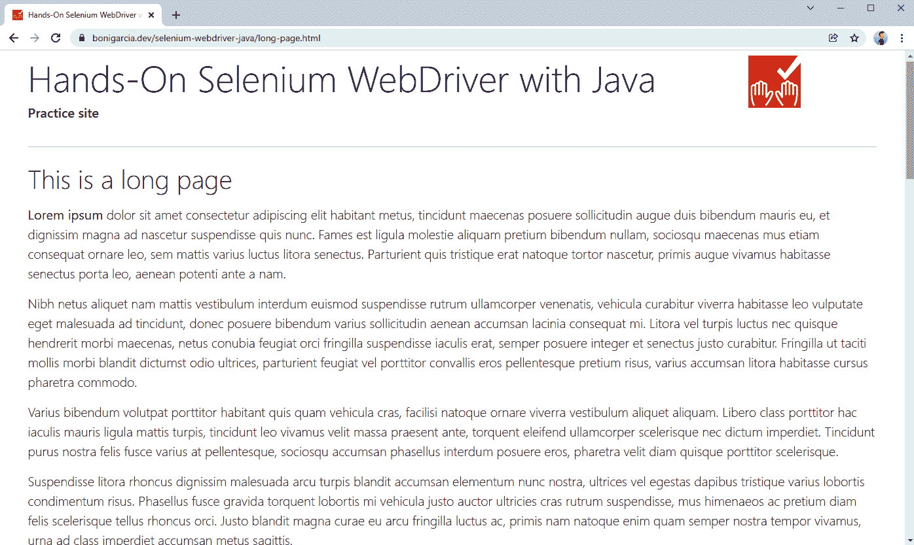
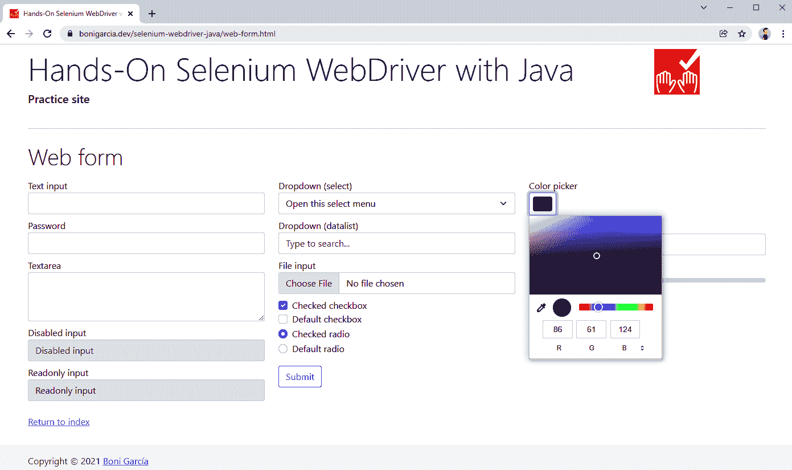
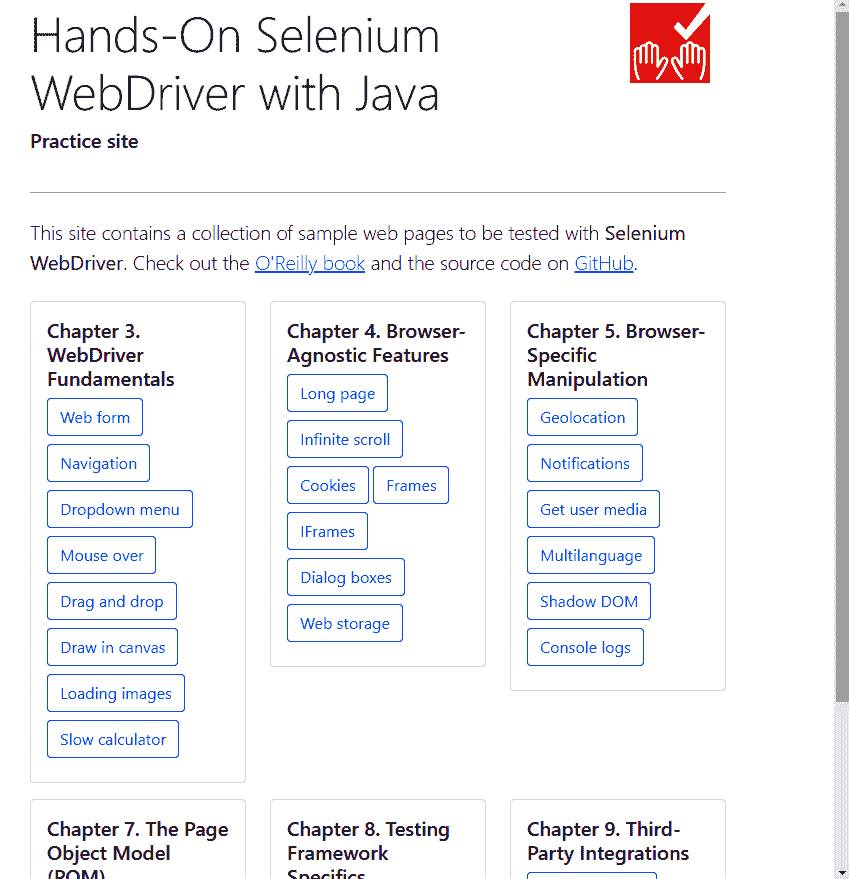
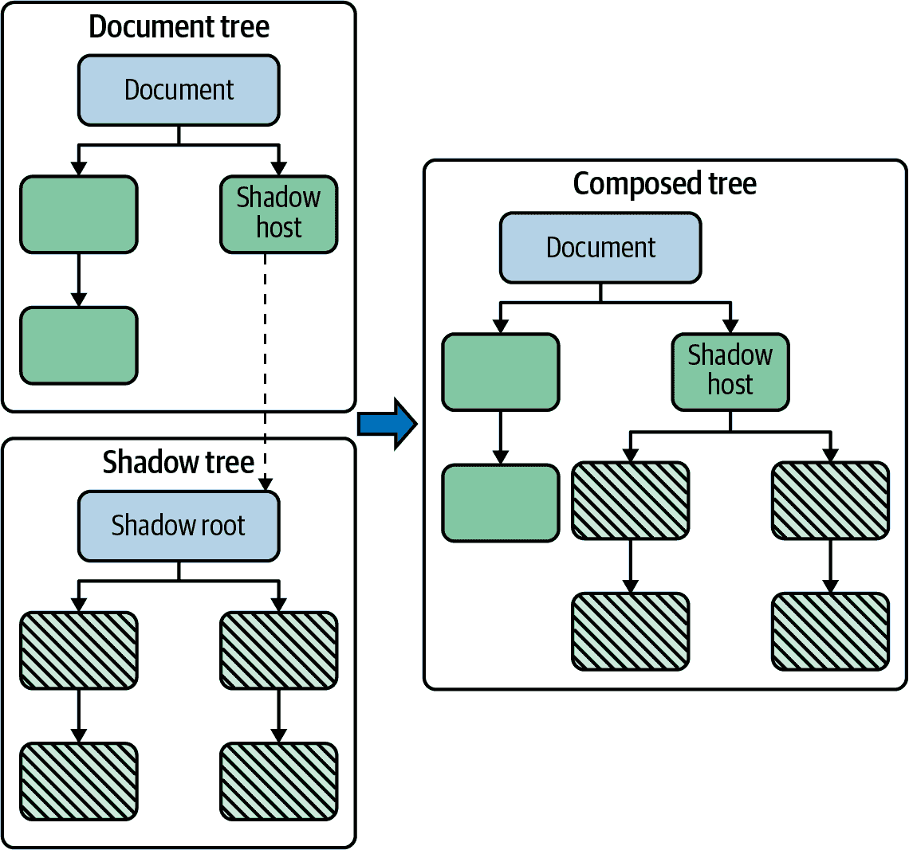
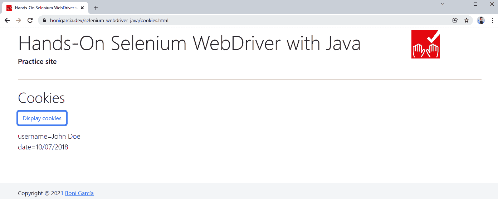
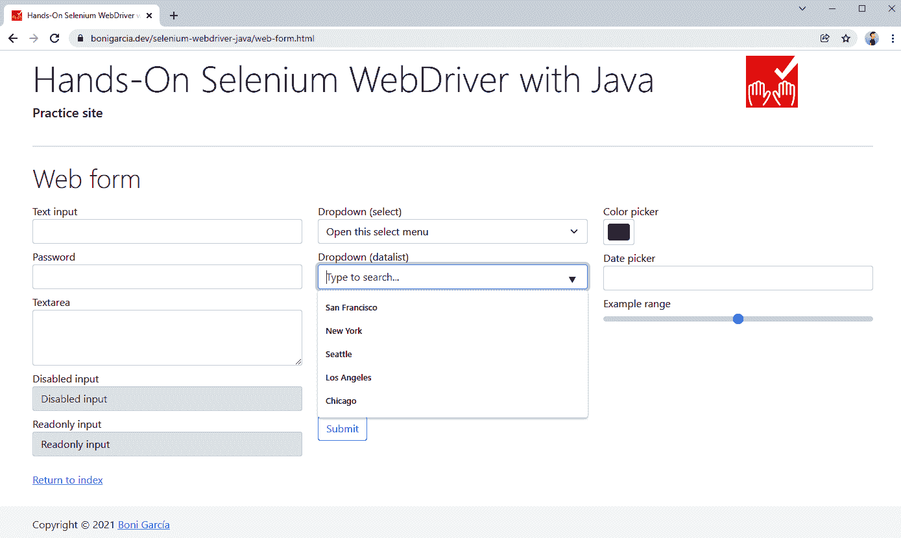
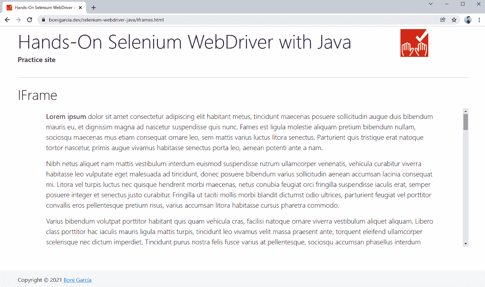
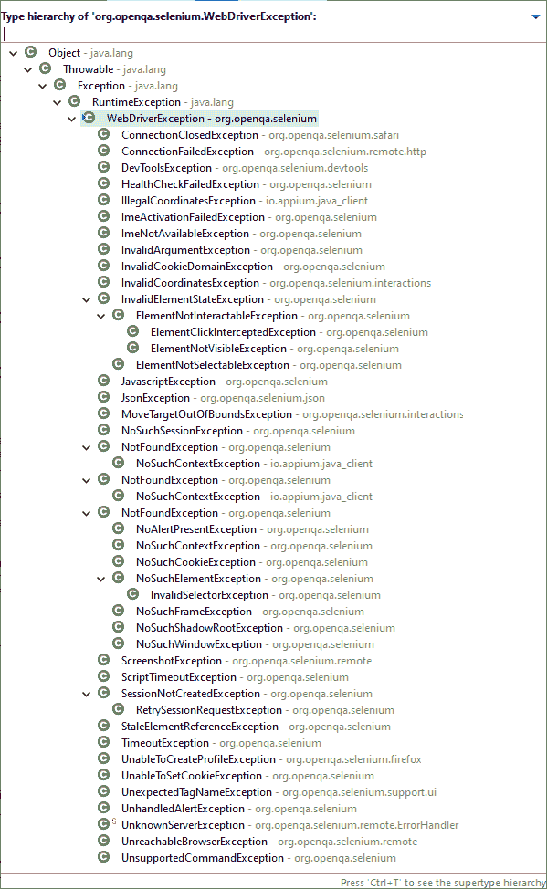

# 第四章：浏览器无关特性

本章回顾了 Selenium WebDriver 中在不同 Web 浏览器中可互操作的特性。在此组中，一个相关的多功能特性是执行 JavaScript。此外，Selenium WebDriver API 允许配置页面和脚本加载的超时时间。另一个方便的功能是对浏览器屏幕进行截图，或仅截取给定元素对应的部分。然后，我们可以使用 WebDriver 管理受控浏览器的不同方面，如浏览器大小和位置、历史记录或 cookies。然后，WebDriver 提供了各种资产来控制特定的 Web 元素，如下拉列表（即 HTML 选择字段和数据列表）、导航目标（即窗口、选项卡、框架和 iframe）或对话框（即警报、提示、确认和模态对话框）。最后，我们学习如何使用 Web 存储处理本地和会话数据，实现事件侦听器，并使用 Selenium WebDriver API 提供的异常。

# 执行 JavaScript

JavaScript 是一种高级编程语言，被所有主要浏览器支持。我们可以在 Web 应用程序的客户端使用 JavaScript 进行各种操作，如 DOM 操作、用户交互、处理来自远程服务器的请求-响应或与正则表达式工作等。对于测试自动化而言，幸运的是 Selenium WebDriver 允许注入和执行任意 JavaScript 片段。为此，Selenium WebDriver API 提供了 `JavascriptExecutor` 接口。表格 4-1 介绍了此接口中可用的公共方法，分为同步、固定和异步脚本三类。随后的小节提供了更多详细信息，并通过不同示例展示了它们的使用。

表格 4-1\. JavascriptExecutor 方法

| 分类 | 方法 | 返回 | 描述 |
| --- | --- | --- | --- |
| 同步脚本 |

```java
executeScript(
    String script,
    Object... args)
```

|

```java
Object
```

| 在当前页面上执行 JavaScript 代码。 |
| --- |
| 固定脚本 |

```java
pin(String
    script)
```

|

```java
ScriptKey
```

| 将 JavaScript 片段附加到 WebDriver 会话中。*固定* 脚本可在 WebDriver 会话处于活动状态时多次使用。 |
| --- |

|

```java
unpin(ScriptKey
    key)
```

|

```java
void
```

| 分离先前固定的脚本与 WebDriver 会话。 |
| --- |

|

```java
getPinnedScripts()
```

|

```java
Set<ScriptKey>
```

| 收集所有固定脚本（每个脚本由唯一的 `ScriptKey` 标识）。 |
| --- |

|

```java
executeScript(
    ScriptKey key,
    Object... args)
```

|

```java
Object
```

| 调用先前固定的脚本（使用其 `ScriptKey` 标识）。 |
| --- |
| 异步脚本 |

```java
executeAsyncScript(
    String script,
    Object... args)
```

|

```java
Object
```

| 在当前页面上执行 JavaScript 代码（通常是异步操作）。与 `executeScript()` 的区别在于，使用 `executeAsyncScript()` 执行的脚本必须显式地通过调用回调函数来标识其终止。按照惯例，此回调函数作为其最后一个参数注入到脚本中。 |
| --- |

任何从`RemoteWebDriver`类继承的驱动对象也实现了`JavascriptExecutor`接口。因此，当使用以`WebDriver`接口声明的主要浏览器（例如`ChromeDriver`，`FirefoxDriver`等）时，可以像以下片段中显示的方式将其转换为`JavascriptExecutor`。然后，我们可以使用执行器（在示例中使用变量`js`）来调用 Table 4-1 中介绍的方法。

```java
WebDriver driver = new ChromeDriver();
JavascriptExecutor js = (JavascriptExecutor) driver;
```

## 同步脚本

`JavascriptExecutor`对象的`executeScript()`方法允许在 WebDriver 会话的当前网页上下文中执行一段 JavaScript 代码。该方法的调用（在 Java 中）会阻塞控制流，直到脚本终止。因此，我们通常用这个方法来执行在测试网页中执行同步脚本。`executeScript()`方法允许两个参数：

`String script`

必需的要执行的 JavaScript 片段。此代码作为匿名函数（即没有名称的 JavaScript 函数）在当前页面的主体中执行。

`Object... args`

可选参数脚本。这些参数必须是以下类型之一：数字，布尔值，字符串，`WebElement`，或者这些类型的`List`（否则，WebDriver 会抛出异常）。这些参数在注入的脚本中可以使用内置的 JavaScript 变量`arguments`。

当脚本返回某个值（即代码包含`return`语句）时，Selenium WebDriver 的`executeScript()`方法也会在 Java 中返回一个值（否则，`executeScript()`返回`null`）。可能的返回类型包括：

`WebElement`

当返回 HTML 元素时

`Double`

对于小数

`Long`

对于非十进制数

`Boolean`

对于布尔值

`List<Object>`

对于数组

`Map<String, Object>`

对于键-值集合

`String`

对于所有其他情况

需要使用 Selenium WebDriver 执行 JavaScript 的情况非常多样化。以下各小节将回顾两种情况，其中 Selenium WebDriver 没有提供内置功能，而需要使用 JavaScript 来自动化：滚动网页和处理 Web 表单中的颜色选择器。

### 滚动

正如在 Chapter 3 中解释的那样，Selenium WebDriver 允许模拟不同的鼠标操作，包括单击、右键单击或双击等。然而，使用 Selenium WebDriver API 无法向上或向下滚动网页。相反，我们可以通过执行简单的 JavaScript 代码轻松实现此自动化。Example 4-1 展示了在练习网页中使用实际网页的基本示例（请查看测试方法的第一行中此页面的 URL）。

##### 示例 4-1\. 测试执行 JavaScript 来向下滚动像素量

```java
@Test
void testScrollBy() {
    driver.get(
            "https://bonigarcia.dev/selenium-webdriver-java/long-page.html"); 
    JavascriptExecutor js = (JavascriptExecutor) driver; 

    String script = "window.scrollBy(0, 1000);";
    js.executeScript(script); 
}
```


打开一个包含非常长文本的练习网页（请参见 Figure 4-1）。


将`driver`对象转换为`JavascriptExecutor`。我们将使用变量`js`在浏览器中执行 JavaScript。


执行一段 JavaScript 代码。在这种情况下，我们调用 JavaScript 函数`scrollBy()`来按给定的数量（在本例中为 1,000 像素）向下滚动文档。请注意，此片段不使用`return`，因此在 Java 逻辑中我们不会接收任何返回的对象。此外，我们也没有向脚本传递任何参数。



###### 图 4-1\. 具有长内容的实践网页

Example 4-2 展示了另一个使用滚动和同样的网页示例的测试。这次，我们不是移动固定数量的像素，而是将文档滚动到网页中的最后一个段落。

##### Example 4-2\. 测试执行 JavaScript 以滚动到给定元素

```java
@Test
void testScrollIntoView() {
    driver.get(
            "https://bonigarcia.dev/selenium-webdriver-java/long-page.html");
    JavascriptExecutor js = (JavascriptExecutor) driver;
    driver.manage().timeouts().implicitlyWait(Duration.ofSeconds(10)); 

    WebElement lastElememt = driver
            .findElement(By.cssSelector("p:last-child")); 
    String script = "arguments[0].scrollIntoView();"; 
    js.executeScript(script, lastElememt); 
}
```


为了使此测试更加健壮，我们指定了一个隐式超时时间。否则，在执行后续命令时，如果页面没有完全加载，测试可能会失败。


我们使用 CSS 选择器找到网页中的最后一个段落。


我们定义要注入页面的脚本。请注意，此脚本不返回任何值，但作为新颖之处，它使用第一个函数参数调用 JavaScript 函数`scrollIntoView()`。


我们执行先前的脚本，将定位的`WebElement`作为参数传递。此元素将是脚本的第一个参数（即`arguments[0]`）。

最后一个滚动示例是*无限滚动*。当用户滚动到网页底部时，这种技术可以动态加载更多内容。自动化这种网页是一个有教育意义的用例，因为它涉及到 Selenium WebDriver API 的不同方面。例如，您可以使用类似的方法使用 Selenium WebDriver 爬取网页。Example 4-3 展示了使用无限滚动页面的测试。

##### Example 4-3\. 在无限滚动页面中执行 JavaScript 的测试

```java
@Test
void testInfiniteScroll() {
    driver.get(
            "https://bonigarcia.dev/selenium-webdriver-java/infinite-scroll.html");
    JavascriptExecutor js = (JavascriptExecutor) driver;
    WebDriverWait wait = new WebDriverWait(driver, Duration.ofSeconds(10)); 

    By pLocator = By.tagName("p");
    List<WebElement> paragraphs = wait.until(
            ExpectedConditions.numberOfElementsToBeMoreThan(pLocator, 0));
    int initParagraphsNumber = paragraphs.size(); 

    WebElement lastParagraph = driver.findElement(
            By.xpath(String.format("//p[%d]", initParagraphsNumber))); 
    String script = "arguments[0].scrollIntoView();";
    js.executeScript(script, lastParagraph); 

    wait.until(ExpectedConditions.numberOfElementsToBeMoreThan(pLocator,
            initParagraphsNumber)); 
}
```


我们定义了一个显式等待，因为我们需要暂停测试直到新内容加载完成。


我们找到页面上段落的初始数量。


我们定位页面的最后一个段落。


我们滚动到这个元素中。


我们等待直到页面上有更多的段落可用。

### 颜色选择器

HTML 中的*颜色选择器*是一种输入类型，允许用户通过点击和拖动光标来选择颜色。实践中的 Web 表单包含了这种元素（参见 图 4-2）。



###### 图 4-2\. 实践中的颜色选择器

以下代码显示了颜色选择器的 HTML 标记。注意它设置了一个初始颜色值（否则，默认颜色是黑色）。

```java
<input type="color" class="form-control form-control-color" name="my-colors"
        value="#563d7c">
```

示例 4-4 展示了如何与这个颜色选择器交互。因为 Selenium WebDriver API 不提供控制颜色选择器的任何方法，所以我们使用 JavaScript。此外，这个测试还展示了在 Selenium WebDriver API 中可用的支持类 `Color` 来处理颜色的使用。

##### 示例 4-4\. 执行 JavaScript 与颜色选择器交互的测试

```java
@Test
void testColorPicker() {
    driver.get(
            "https://bonigarcia.dev/selenium-webdriver-java/web-form.html");
    JavascriptExecutor js = (JavascriptExecutor) driver;

    WebElement colorPicker = driver.findElement(By.name("my-colors")); 
    String initColor = colorPicker.getAttribute("value"); 
    log.debug("The initial color is {}", initColor);

    Color red = new Color(255, 0, 0, 1); 
    String script = String.format(
            "arguments[0].setAttribute('value', '%s');", red.asHex());
    js.executeScript(script, colorPicker); 

    String finalColor = colorPicker.getAttribute("value"); 
    log.debug("The final color is {}", finalColor);
    assertThat(finalColor).isNotEqualTo(initColor); 
    assertThat(Color.fromString(finalColor)).isEqualTo(red);
}
```


我们通过名称定位颜色选择器。


我们读取颜色选择器的初始值（应该是 `#563d7c`）。


我们定义了一个颜色，使用以下 RGBA 组件：红色=255（最大值），绿色=0（最小值），蓝色=0（最小值），alpha=1（最大值，即完全不透明）。


我们使用 JavaScript 来改变颜色选择器中选择的值。或者，我们可以调用语句 `colorPicker.sendKeys(red.asHex());` 来改变选择的颜色。


我们读取颜色选择器的结果值（应该是 `#ff0000`）。


我们断言颜色与初始值不同，但是符合预期。

## 固定脚本

Selenium WebDriver API 允许您在 Selenium WebDriver 4 中*固定*脚本。这个功能允许将 JavaScript 片段附加到 WebDriver 会话，并为每个片段分配一个唯一的键，并在需要时（甚至在不同的网页上）执行这些片段。示例 4-5 展示了使用*固定*脚本的测试。

##### 示例 4-5\. 作为固定脚本执行 JavaScript 的测试

```java
@Test
void testPinnedScripts() {
    String initPage = "https://bonigarcia.dev/selenium-webdriver-java/";
    driver.get(initPage);
    JavascriptExecutor js = (JavascriptExecutor) driver;

    ScriptKey linkKey = js
            .pin("return document.getElementsByTagName('a')[2];"); 
    ScriptKey firstArgKey = js.pin("return arguments[0];"); 

    Set<ScriptKey> pinnedScripts = js.getPinnedScripts(); 
    assertThat(pinnedScripts).hasSize(2); 

    WebElement formLink = (WebElement) js.executeScript(linkKey); 
    formLink.click(); 
    assertThat(driver.getCurrentUrl()).isNotEqualTo(initPage); 

    String message = "Hello world!";
    String executeScript = (String) js.executeScript(firstArgKey, message); 
    assertThat(executeScript).isEqualTo(message); 

    js.unpin(linkKey); 
    assertThat(js.getPinnedScripts()).hasSize(1); 
}
```


我们附加了一个 JavaScript 片段来定位网页中的一个元素。请注意，我们可以使用标准的 WebDriver API 做同样的事情。然而，出于演示目的，我们使用了这种方法。


我们附加了另一段 JavaScript，它返回我们传递给它的第一个参数。


我们读取了一组固定脚本。


我们断言固定脚本的数量与预期相同（即`2`）。


我们执行第一个固定脚本。结果，我们在 Java 中作为 `WebElement` 得到网页中的第三个链接。


我们点击此链接，应对应实践网页链接。结果，浏览器应该导航到该页面。


我们断言当前 URL 与初始 URL 不同。


我们执行第二个固定脚本。注意，尽管页面在浏览器中已更改（因为脚本附加到会话而不是单个页面），但仍可以运行固定脚本。


我们断言返回的消息符合预期。


我们取消固定其中一个脚本。


我们验证固定脚本的数量符合预期（即此时为 `1`）。

## 异步脚本

`JavascriptExecutor` 接口的 `executeAsyncScript()` 方法允许使用 Selenium WebDriver 在网页上下文中执行 JavaScript 脚本。与之前解释的 `executeScript()` 类似，`executeAsyncScript()` 执行提供的 JavaScript 代码在当前页面的匿名函数中。该函数的执行会阻塞 Selenium WebDriver 的控制流。不同之处在于，在 `executeAsyncScript()` 中，我们必须通过调用 *done* 回调显式地标记脚本终止。该回调作为相应匿名函数的最后一个参数注入到执行的脚本中（即 `arguments[arguments.length - 1]`）。示例 4-6 展示了使用这种机制的测试。

##### 示例 4-6\. 测试执行异步 JavaScript

```java
@Test
void testAsyncScript() {
    driver.get("https://bonigarcia.dev/selenium-webdriver-java/");
    JavascriptExecutor js = (JavascriptExecutor) driver;

    Duration pause = Duration.ofSeconds(2); 
    String script = "const callback = arguments[arguments.length - 1];"
            + "window.setTimeout(callback, " + pause.toMillis() + ");"; 

    long initMillis = System.currentTimeMillis(); 
    js.executeAsyncScript(script); 
    Duration elapsed = Duration
            .ofMillis(System.currentTimeMillis() - initMillis); 
    log.debug("The script took {} ms to be executed", elapsed.toMillis());
    assertThat(elapsed).isGreaterThanOrEqualTo(pause); 
}
```


我们定义一个暂停时间为 `2` 秒。


我们定义要执行的脚本。在第一行中，我们为回调定义一个常量（即最后一个脚本参数）。然后，我们使用 JavaScript 函数 `window.setTimeout()` 来暂停给定时间的脚本执行。


我们获取当前系统时间（以毫秒为单位）。


我们执行脚本。如果一切正常，测试执行会在这一行中阻塞 second 秒（如步骤 1 中定义）。


我们计算执行前一行所需的时间。


我们断言经过的时间符合预期（通常高于定义的暂停时间几毫秒）。

###### 提示

您可以找到一个额外的示例，执行 “Notifications” 上的异步脚本。

# 超时

Selenium WebDriver 允许指定三种类型的超时。我们可以通过在 Selenium WebDriver API 中调用 `manage().timeouts()` 方法来使用它们。第一个超时是隐式等待，已在“隐式等待”（作为等待策略的一部分）中解释过。其他选项是页面加载和脚本加载超时，稍后进行解释。

## 页面加载超时

*页面加载超时* 提供了中断导航尝试的时间限制。换句话说，此超时限制了加载网页的时间。当超过此超时（默认值为 30 秒）时，将抛出异常。示例 4-7 展示了此超时的示例。正如您所见，此代码片段是 SUT 中的一个虚拟实现的*负面*测试。换句话说，它检查 SUT 中的意外条件。

##### 示例 4-7\. 使用页面加载超时的测试

```java
@Test
void testPageLoadTimeout() {
    driver.manage().timeouts().pageLoadTimeout(Duration.ofMillis(1)); 

    assertThatThrownBy(() -> driver
            .get("https://bonigarcia.dev/selenium-webdriver-java/"))
                    .isInstanceOf(TimeoutException.class); 
}
```


我们指定了最小可能的页面加载超时，即一毫秒。


我们加载一个网页。这个调用（实现为 Java lambda）将失败，因为不可能在少于一毫秒的时间内加载该网页。因此，预期在 lambda 中抛出 `TimeoutException` 异常，使用 AssertJ 方法 `assertThatThrownBy`。

###### 注意

您可以通过删除超时声明（即第一步）来测试它。如果这样做，测试将失败，因为预期会抛出异常，但未抛出。

## 脚本加载超时

*脚本加载超时* 提供了中断正在评估的脚本的时间限制。此超时的默认值为三百秒。示例 4-8 展示了使用脚本加载超时的测试。

##### 示例 4-8\. 使用脚本加载超时的测试

```java
@Test
void testScriptTimeout() {
    driver.get("https://bonigarcia.dev/selenium-webdriver-java/");
    JavascriptExecutor js = (JavascriptExecutor) driver;
    driver.manage().timeouts().scriptTimeout(Duration.ofSeconds(3)); 

    assertThatThrownBy(() -> {
        long waitMillis = Duration.ofSeconds(5).toMillis();
        String script = "const callback = arguments[arguments.length - 1];"
                + "window.setTimeout(callback, " + waitMillis + ");"; 
        js.executeAsyncScript(script);
    }).isInstanceOf(ScriptTimeoutException.class); 
}
```


我们定义了三秒的脚本超时。这意味着超过此时间的脚本将抛出异常。


我们执行一个异步脚本，暂停执行五秒钟。


脚本执行时间大于配置的脚本超时，导致 `ScriptTimeoutException`。同样，此示例是一个*负面*测试，即预期此异常。

# 截图

Selenium WebDriver 主要用于执行 Web 应用程序的端到端功能测试。换句话说，我们使用它与用户界面交互（即使用 Web 浏览器）来验证 Web 应用程序的行为是否符合预期。这种方法非常方便地自动化高级用户场景，但也存在不同的困难。端到端测试的主要挑战之一是诊断测试失败的根本原因。假设失败是合理的（即不是由于实现不良的测试引起的），根本原因可能多种多样：客户端（例如，不正确的 JavaScript 逻辑）、服务器端（例如，内部异常）或与其他组件的集成（例如，对数据库的访问不足），等等。在 Selenium WebDriver 中用于失败分析的最普遍机制之一是进行浏览器截图。本节介绍了 Selenium WebDriver API 提供的机制。

###### 提示

“失败分析”回顾了确定测试何时失败以及执行不同失败分析技术（如截图、录制和日志收集）的框架特定技术。

Selenium WebDriver 提供了接口`TakesScreenshot`来进行浏览器截图。从`RemoteWebDriver`继承的任何驱动程序对象（参见图 2-2）也实现了此接口。因此，我们可以将一个实例化了其中一个主要浏览器（例如`ChromeDriver`、`FirefoxDriver`等）的`WebDriver`对象进行强制类型转换，如下所示：

```java
WebDriver driver = new ChromeDriver();
TakesScreenshot ts = (TakesScreenshot) driver;
```

接口`TakesScreenshot`仅提供一个名为`getScreenshotAs(OutputType<X> target)`的方法来进行截图。参数`OutputType<X> target`确定截图类型和返回值。表 4-2 展示了此参数的可用替代方案。

表 4-2\. OutputType 参数

| 参数 | 描述 | 返回 | 示例 |
| --- | --- | --- | --- |

|

```java
OutputType.FILE
```

| 将截图保存为 PNG 文件（位于临时系统目录中） |
| --- |

```java
File
```

|

```java
File screenshot =
    ts.getScreenshotAs(
    OutputType.FILE);
```

|

|

```java
OutputType.BASE64
```

| 将截图保存为 Base64 格式（即编码为 ASCII 字符串） |
| --- |

```java
String
```

|

```java
String screenshot =
    ts.getScreenshotAs(
    OutputType.BASE64);
```

|

|

```java
OutputType.BYTES
```

| 将截图保存为原始字节数组 |
| --- |

```java
byte[]
```

|

```java
byte[] screenshot =
    ts.getScreenshotAs(
    OutputType.BYTES);
```

|

###### 提示

方法`getScreenshotAs()`允许对浏览器视窗进行截图。此外，Selenium WebDriver 4 还允许使用不同的机制创建全页截图（参见“全页截图”）。

示例 4-9 展示了一个以 PNG 格式进行浏览器截图的测试。示例 4-10 展示了另一个以 Base64 字符串创建截图的测试。生成的截图显示在图 4-3 中。

##### 示例 4-9\. 将浏览器截图保存为 PNG 文件

```java
@Test
void testScreenshotPng() throws IOException {
    driver.get("https://bonigarcia.dev/selenium-webdriver-java/");
    TakesScreenshot ts = (TakesScreenshot) driver;

    File screenshot = ts.getScreenshotAs(OutputType.FILE); 
    log.debug("Screenshot created on {}", screenshot);

    Path destination = Paths.get("screenshot.png"); 
    Files.move(screenshot.toPath(), destination, REPLACE_EXISTING); 
    log.debug("Screenshot moved to {}", destination);

    assertThat(destination).exists(); 
}
```


我们将浏览器屏幕保存为 PNG 文件。


默认情况下，此文件位于临时文件夹中，因此我们将其移动到名为`screenshot.png`的新文件（位于根项目文件夹中）。


我们使用标准的 Java 将截图文件移动到新位置。


我们使用断言来验证目标文件是否存在。



###### Figure 4-3\. 练习网站首页的浏览器截图

##### Example 4-10\. 测试制作 Base64 格式的截图

```java
@Test
void testScreenshotBase64() {
    driver.get("https://bonigarcia.dev/selenium-webdriver-java/");
    TakesScreenshot ts = (TakesScreenshot) driver;

    String screenshot = ts.getScreenshotAs(OutputType.BASE64); 
    log.debug("Screenshot in base64 "
          + "(you can copy and paste it into a browser navigation bar to watch it)\n"
          + "data:image/png;base64,{}", screenshot); 
    assertThat(screenshot).isNotEmpty(); 
}
```


我们将浏览器屏幕制作成 Base64 格式。


我们在 Base64 字符串前追加前缀`data:image/png;base64,`并将其记录在标准输出中。您可以将生成的字符串复制粘贴到浏览器导航栏中以显示图片。


我们断言截图字符串具有内容。

###### 注意

将截图记录为 Base64 格式，正如前面示例中所述，在没有文件系统访问权限的 CI 服务器（例如 GitHub Actions）中运行测试时，这非常有用。

## WebElement 截图

`WebElement`接口扩展了`TakesScreenshot`接口。这样，可以对给定的网页元素的可见内容进行部分截图（参见 Example 4-11）。请注意，此测试与使用 PNG 文件的上一个测试非常相似，但在本例中，我们直接使用网页元素调用`getScreenshotAs()`方法。Figure 4-4 展示了生成的截图。

##### Example 4-11\. 测试制作部分 PNG 文件截图

```java
@Test
void testWebElementScreenshot() throws IOException {
    driver.get(
            "https://bonigarcia.dev/selenium-webdriver-java/web-form.html");

    WebElement form = driver.findElement(By.tagName("form"));
    File screenshot = form.getScreenshotAs(OutputType.FILE);
    Path destination = Paths.get("webelement-screenshot.png");
    Files.move(screenshot.toPath(), destination, REPLACE_EXISTING);

    assertThat(destination).exists();
}
```


###### Figure 4-4\. 练习网页表单的部分截图

# 窗口大小和位置

Selenium WebDriver API 允许轻松地使用`Window`接口来操作浏览器的大小和位置。可以通过驱动器对象访问这种类型，使用以下语句。Table 4-3 显示了此接口中可用的方法。接着，Example 4-12 展示了关于此功能的基本测试。

```java
Window window = driver.manage().window();
```

表 4-3\. 窗口方法

| 方法 | 返回 | 描述 |
| --- | --- | --- |

|

```java
getSize()
```

|

```java
Dimension
```

| 获取当前窗口大小。返回的是外部窗口尺寸，而不仅仅是*视口*（即网页的对终端用户可见的可见区域）。 |
| --- |

|

```java
setSize(Dimension
    targetSize)
```

|

```java
void
```

| 更改当前窗口大小（再次指的是其外部尺寸，而不是视口）。 |
| --- |

|

```java
getPosition()
```

|

```java
Point
```

| 获取当前窗口位置（相对于屏幕左上角）。 |
| --- |

|

```java
setPosition(Point
    targetPosition)
```

|

```java
void
```

| 更改当前窗口位置（再次相对于屏幕左上角）。 |
| --- |

|

```java
maximize()
```

|

```java
void
```

| 最大化当前窗口。 |
| --- |

|

```java
minimize()
```

|

```java
void
```

| 最小化当前窗口。 |
| --- |

|

```java
fullscreen()
```

|

```java
void
```

| 全屏当前窗口。 |
| --- |

##### Example 4-12\. 测试读取和更改浏览器大小和位置

```java
@Test
void testWindow() {
    driver.get("https://bonigarcia.dev/selenium-webdriver-java/");
    Window window = driver.manage().window();

    Point initialPosition = window.getPosition(); 
    Dimension initialSize = window.getSize(); 
    log.debug("Initial window: position {} -- size {}", initialPosition,
            initialSize);

    window.maximize(); 

    Point maximizedPosition = window.getPosition();
    Dimension maximizedSize = window.getSize();
    log.debug("Maximized window: position {} -- size {}", maximizedPosition,
            maximizedSize);

    assertThat(initialPosition).isNotEqualTo(maximizedPosition); 
    assertThat(initialSize).isNotEqualTo(maximizedSize);
}
```


我们读取窗口位置。


我们读取窗口大小。


我们将浏览器窗口最大化。


我们验证最大化的位置（以及下一行中的大小）与原始窗口不同。

# 浏览器历史

Selenium WebDriver 允许通过 `Navigation` 接口操纵浏览器历史。以下语句说明了如何从 `WebDriver` 对象中访问此接口。使用此接口非常简单。表 4-4 显示了其公共方法，示例 4-13 展示了一个基本示例。请注意，此测试使用这些方法导航到不同的网页，并在测试结束时验证网页 URL 是否符合预期。

```java
Navigation navigation = driver.navigate();
```

表 4-4\. 导航方法

| 方法 | 返回 | 描述 |
| --- | --- | --- |

|

```java
back()
```

|

```java
void
```

| 在浏览器历史中后退 |
| --- |

|

```java
forward()
```

|

```java
void
```

| 在浏览器历史中前进 |
| --- |

|

```java
to(String url)
to(URL url)
```

|

```java
void
```

| 在当前窗口中加载新的网页 |
| --- |

|

```java
refresh()
```

|

```java
void
```

| 刷新当前页面 |
| --- |

##### 示例 4-13\. 使用导航方法进行测试

```java
@Test
void testHistory() {
    String baseUrl = "https://bonigarcia.dev/selenium-webdriver-java/";
    String firstPage = baseUrl + "navigation1.html";
    String secondPage = baseUrl + "navigation2.html";
    String thirdPage = baseUrl + "navigation3.html";

    driver.get(firstPage);

    driver.navigate().to(secondPage);
    driver.navigate().to(thirdPage);
    driver.navigate().back();
    driver.navigate().forward();
    driver.navigate().refresh();

    assertThat(driver.getCurrentUrl()).isEqualTo(thirdPage);
}
```

# 阴影 DOM

正如“文档对象模型（DOM）”中介绍的那样，DOM 是一个编程接口，允许我们使用树结构来表示和操作网页。*阴影 DOM* 是这个编程接口的一个特性，它允许在常规 DOM 树内创建作用域子树。阴影 DOM 允许封装 DOM 子树的一个组（称为*阴影树*，如图 4-5 中所示），可以指定与原始 DOM 不同的 CSS 样式。阴影树附加到的常规 DOM 中的节点称为*阴影宿主*。阴影树的根节点称为*阴影根*。如图 4-5 所示，阴影树被展平到原始 DOM 中，形成一个单一的组合树，以在浏览器中呈现。



###### 图 4-5\. 阴影 DOM 的示意图

###### 注意

阴影 DOM 是标准套件的一部分（与 HTML 模板或自定义元素一起），它允许实现[web 组件](https://github.com/WICG/webcomponents)（即用于 Web 应用程序的可重用自定义元素）。

阴影 DOM 允许创建自包含组件。换句话说，阴影树与原始 DOM 隔离开来。这个特性对于网页设计和组合非常有用，但对于使用 Selenium WebDriver 进行自动化测试可能具有挑战性（因为常规的定位策略无法在阴影树内找到网页元素）。幸运的是，Selenium WebDriver 4 提供了一个 `WebElement` 方法，允许访问阴影 DOM。示例 4-14 演示了这个用法。

##### 示例 4-14\. 测试读取阴影 DOM

```java
@Test
void testShadowDom() {
    driver.get(
            "https://bonigarcia.dev/selenium-webdriver-java/shadow-dom.html"); 

    WebElement content = driver.findElement(By.id("content")); 
    SearchContext shadowRoot = content.getShadowRoot(); 
    WebElement textElement = shadowRoot.findElement(By.cssSelector("p")); 
    assertThat(textElement.getText()).contains("Hello Shadow DOM"); 
}
```


我们打开包含影子树的实践网页。 您可以检查此页面的源代码，以检查用于创建影子树的 JavaScript 方法。


我们定位影子主机元素。


我们从主机元素获取影子根。 结果，我们得到一个 `SearchContext` 的实例，它是由 `WebDriver` 和 `WebElement` 实现的接口，允许我们使用 `findElement()` 和 `find​Ele⁠ments()` 方法查找元素。


我们在影子树中找到第一个段落元素。


我们验证影子元素的文本内容是否符合预期。

###### 警告

此 W3C WebDriver 规范的功能在撰写本文时较新，因此可能尚未在所有驱动程序中实现（例如，chromedriver、geckodriver）。 例如，它从 Chrome 和 Edge 的 96 版本开始可用。

# Cookies

HTTP 1.x 是一种无状态协议，这意味着服务器不跟踪用户状态。 换句话说，Web 服务器不会跨不同请求记住用户。 Cookie 机制是 HTTP 的一个扩展，它允许通过从服务器发送小段文本（称为*cookie*）来跟踪用户。 这些 Cookie 必须由客户端发送回来，这样，服务器就记住了它们的客户端。 Cookie 允许您维护 Web 会话或在网站上个性化用户体验，等等。

Web 浏览器允许手动管理浏览器 Cookie。 Selenium WebDriver 可以通过编程方式实现等效操作。 Selenium WebDriver API 提供了 表 4-5 中显示的方法来完成此操作。 它们可通过 `WebDriver` 对象的 `manage()` 函数访问。 

表 4-5\. Cookie 管理方法

| 方法 | 返回 | 描述 |
| --- | --- | --- |

|

```java
addCookie(Cookie cookie)
```

|

```java
void
```

| 添加新 Cookie |
| --- |

|

```java
deleteCookieNamed(String name)
```

|

```java
void
```

| 通过名称删除现有的 Cookie |
| --- |

|

```java
deleteCookie(Cookie cookie)
```

|

```java
void
```

| 通过实例删除现有的 Cookie |
| --- |

|

```java
deleteAllCookies()
```

|

```java
void
```

| 删除所有 Cookie |
| --- |

|

```java
getCookies()
```

|

```java
Set<Cookie>
```

| 获取所有 Cookie |
| --- |

|

```java
getCookieNamed(String name)
```

|

```java
Cookie
```

| 通过名称获取 Cookie |
| --- |

正如此表所示，`Cookie` 类在 Java 中提供了对单个 Cookie 的抽象。 表 4-6 总结了此类中可用的方法。 此外，此类具有几个构造函数，它们按位置接受以下参数：

`String name`

Cookie 名称（必需）

`String value`

Cookie 值（必需）

`String domain`

Cookie 可见的域（可选）

`String path`

Cookie 可见的路径（可选）

`Date expiry`

Cookie 过期日期（可选）

`boolean isSecure`

Cookie 是否需要安全连接（可选）

`boolean isHttpOnly`

此 Cookie 是否为 HTTP-only Cookie，即 Cookie 不可通过客户端脚本访问（可选）

`String sameSite`

该 cookie 是否为同站点 cookie，即限定为第一方或同站点上下文（可选）

表 4-6\. Cookie 方法

| 方法 | 返回 | 描述 |
| --- | --- | --- |

|

```java
getName()
```

|

```java
String
```

| 读取 cookie 名称 |
| --- |

|

```java
getValue()
```

|

```java
String
```

| 读取 cookie 值 |
| --- |

|

```java
getDomain()
```

|

```java
String
```

| 读取 cookie 域名 |
| --- |

|

```java
getPath()
```

|

```java
String
```

| 读取 cookie 路径 |
| --- |

|

```java
isSecure()
```

|

```java
boolean
```

| 读取 cookie 是否需要安全连接 |
| --- |

|

```java
isHttpOnly()
```

|

```java
boolean
```

| 读取 cookie 是否为 HTTP-only |
| --- |

|

```java
getExpiry()
```

|

```java
Date
```

| 读取 cookie 过期日期 |
| --- |

|

```java
getSameSite()
```

|

```java
String
```

| 读取 cookie 同站点上下文 |
| --- |

|

```java
validate()
```

|

```java
void
```

| 检查 cookie 的不同字段，并在遇到任何问题时抛出 `IllegalArgumentException` |
| --- |

|

```java
toJson()
```

|

```java
Map<String, Object>
```

| 将 cookie 值映射为键值对 |
| --- |

下面的示例展示了使用 Selenium WebDriver API 管理网页 cookie 的不同测试。这些示例使用一个练习网页，在 GUI 上显示网站的 cookie（见 图 4-6）：

+   示例 4-15 展示了如何读取网站现有的 cookie。

+   示例 4-16 展示了如何添加新的 cookie。

+   示例 4-17 解释了如何编辑现有 cookie。

+   示例 4-18 演示了如何删除 cookie。



###### 图 4-6\. 网页 cookie 的练习页面

##### 示例 4-15\. 测试读取现有 cookie

```java
@Test
void testReadCookies() {
    driver.get(
            "https://bonigarcia.dev/selenium-webdriver-java/cookies.html");

    Options options = driver.manage(); 
    Set<Cookie> cookies = options.getCookies(); 
    assertThat(cookies).hasSize(2);

    Cookie username = options.getCookieNamed("username"); 
    assertThat(username.getValue()).isEqualTo("John Doe"); 
    assertThat(username.getPath()).isEqualTo("/");

    driver.findElement(By.id("refresh-cookies")).click(); 
}
```


我们获取用于管理 cookie 的 `Options` 对象。


我们读取此页面上所有可用的 cookie。应该包含两个 cookie。


我们读取名称为 `username` 的 cookie。


之前的 cookie 值应为 `John Doe`。


最后一条语句不影响测试。我们调用此命令来检查浏览器 GUI 中的 cookie。

##### 示例 4-16\. 测试添加新 cookie

```java
@Test
void testAddCookies() {
    driver.get(
            "https://bonigarcia.dev/selenium-webdriver-java/cookies.html");

    Options options = driver.manage();
    Cookie newCookie = new Cookie("new-cookie-key", "new-cookie-value"); 
    options.addCookie(newCookie); 
    String readValue = options.getCookieNamed(newCookie.getName())
            .getValue(); 
    assertThat(newCookie.getValue()).isEqualTo(readValue); 

    driver.findElement(By.id("refresh-cookies")).click();
}
```


我们创建了一个新的 cookie。


我们将 cookie 添加到当前页面。


我们读取刚刚添加的 cookie 的值。


我们验证该值是否符合预期。

##### 示例 4-17\. 测试编辑现有 cookie

```java
@Test
void testEditCookie() {
    driver.get(
            "https://bonigarcia.dev/selenium-webdriver-java/cookies.html");

    Options options = driver.manage();
    Cookie username = options.getCookieNamed("username"); 
    Cookie editedCookie = new Cookie(username.getName(), "new-value"); 
    options.addCookie(editedCookie); 

    Cookie readCookie = options.getCookieNamed(username.getName()); 
    assertThat(editedCookie).isEqualTo(readCookie); 

    driver.findElement(By.id("refresh-cookies")).click();
}
```


我们读取一个已存在的 cookie。


我们创建一个新的 cookie，并重用之前的 cookie 名称。


我们向网页添加新的 cookie。


我们读取刚刚添加的 cookie。


我们验证 cookie 已正确编辑。

##### 示例 4-18\. 测试删除现有的 cookie

```java
@Test
void testDeleteCookies() {
    driver.get(
            "https://bonigarcia.dev/selenium-webdriver-java/cookies.html");

    Options options = driver.manage();
    Set<Cookie> cookies = options.getCookies(); 
    Cookie username = options.getCookieNamed("username"); 
    options.deleteCookie(username); 

    assertThat(options.getCookies()).hasSize(cookies.size() - 1); 

    driver.findElement(By.id("refresh-cookies")).click();
}
```


我们读取所有的 cookie。


读取名为`username`的 cookie。


删除先前的 cookie。


我们验证 cookie 的大小是否符合预期。

# 下拉列表

网页表单中典型的元素是下拉列表。这些字段允许用户在选项列表中选择一个或多个元素。用于呈现这些字段的经典 HTML 标签是`<select>`和`<option>`。通常，实践中的网页表单包含其中一个元素（见图 4-7），其 HTML 定义如下：

```java
<select class="form-select" name="my-select">
  <option selected>Open this select menu</option>
  <option value="1">One</option>
  <option value="2">Two</option>
  <option value="3">Three</option>
</select>
```


###### 图 4-7\. 实践网页表单中的选择字段

这些元素在网页表单中分布广泛。因此，Selenium WebDriver 提供了一个名为`Select`的辅助类，用于简化它们的操作。这个类封装了一个选择`WebElement`，并提供了各种功能。表 4-7 总结了`Select`类中的公共方法。之后，示例 4-19 展示了使用这个类的基本测试。

表 4-7\. 选择方法

| 方法 | 返回 | 描述 |
| --- | --- | --- |

|

```java
Select(WebElement element)
```

|

```java
Select
```

| 使用`WebElement`作为参数的构造函数（必须是`<select>`元素），否则会抛出`UnexpectedTagNameException` |
| --- |

|

```java
getWrappedElement()
```

|

```java
WebElement
```

| 获取包装的`WebElement`（即构造函数中使用的那个） |
| --- |

|

```java
isMultiple()
```

|

```java
boolean
```

| 选择元素是否支持选择多个选项 |
| --- |

|

```java
getOptions()
```

|

```java
List<WebElement>
```

| 读取属于选择元素的所有选项 |
| --- |

|

```java
getAllSelectedOptions()
```

|

```java
List<WebElement>
```

| 读取所有选定的选项 |
| --- |

|

```java
getFirstSelectedOption()
```

|

```java
WebElement
```

| 读取第一个选定选项 |
| --- |

|

```java
selectByVisibleText(String text)
```

|

```java
void
```

| 取消选择所有与给定显示文本匹配的选项 |
| --- |

|

```java
selectByIndex(int index)
```

|

```java
void
```

| 根据索引号选择一个选项 |
| --- |

|

```java
selectByValue(String value)
```

|

```java
void
```

| 根据值属性选择选项 |
| --- |

|

```java
deselectAll()
```

|

```java
void
```

| 取消选择所有选项 |
| --- |

|

```java
deselectByValue(String value)
```

|

```java
void
```

| 根据值属性取消选择选项 |
| --- |

|

```java
deselectByIndex(int index)
```

|

```java
void
```

| 根据索引号取消选择 |
| --- |

|

```java
deselectByVisibleText(String text)
```

|

```java
void
```

| 取消选择与给定显示文本匹配的选项 |
| --- |

##### Example 4-19\. 测试与选择字段交互

```java
@Test
void test() {
    driver.get(
            "https://bonigarcia.dev/selenium-webdriver-java/web-form.html");

    Select select = new Select(driver.findElement(By.name("my-select"))); 
    String optionLabel = "Three";
    select.selectByVisibleText(optionLabel); 

    assertThat(select.getFirstSelectedOption().getText())
            .isEqualTo(optionLabel); 
}
```


我们通过名称找到选择元素，并使用生成的`WebElement`实例化一个`Select`对象。


我们使用按文本策略选择其中一个可用的选项。


我们验证选定的选项文本是否符合预期。

## 数据列表元素

在 HTML 中实现下拉列表的另一种方法是使用*数据列表*。虽然数据列表在图形上与选择元素非常相似，但它们之间有明显区别。一方面，选择字段显示选项列表，用户选择其中一个（或多个）可用选项。另一方面，数据列表显示与输入表单（文本）字段关联的建议选项列表，用户可以自由选择其中一个建议值或输入自定义值。实践中的网页表单包含了其中一个数据列表。您可以在以下代码片段中找到其标记，以及 图 4-8 中的截图。

```java
<input class="form-control" list="my-options" name="my-datalist"
        placeholder="Type to search...">
<datalist id="my-options">
  <option value="San Francisco">
  <option value="New York">
  <option value="Seattle">
  <option value="Los Angeles">
  <option value="Chicago">
</datalist>
```



###### 图 4-8\. 实践中的数据列表字段

Selenium WebDriver 不提供自定义辅助类来操作数据列表。相反，我们需要像操作标准输入文本一样与它们交互，唯一的区别是点击输入字段时会显示它们的选项。示例 4-20 展示了说明此功能的测试。

##### 示例 4-20\. 与数据列表字段交互的测试

```java
@Test
void testDatalist() {
    driver.get(
            "https://bonigarcia.dev/selenium-webdriver-java/web-form.html");

    WebElement datalist = driver.findElement(By.name("my-datalist")); 
    datalist.click(); 

    WebElement option = driver
            .findElement(By.xpath("//datalist/option[2]")); 
    String optionValue = option.getAttribute("value"); 
    datalist.sendKeys(optionValue); 

    assertThat(optionValue).isEqualTo("New York"); 
}
```


我们定位用于数据列表的输入字段。


我们点击它以显示其选项。


我们找到第二个选项。


我们读取定位选项的值。


我们在输入字段中键入该值。


我们断言选项的值符合预期。

# 导航目标

当使用浏览器导航网页时，默认情况下，我们使用导航栏中的 URL 对应的单个页面。然后，我们可以在新的浏览器标签中打开另一个页面。当链接定义属性`target`时，可以显式打开这第二个标签，或者用户可以通过按住修改键 Ctrl（或 macOS 中的 Cmd）并与鼠标点击网页链接一起强制导航到新标签。另一种可能性是在新窗口中打开网页。为此，网页通常使用 JavaScript 命令`window.open(url)`。同时，显示不同页面的另一种方式是使用*frames*和*iframes*。框架是定义特定区域（在*frameset*集合中）的 HTML 元素类型，用于显示网页的区域。iframe 是另一个 HTML 元素，允许将 HTML 页面嵌入当前页面。

###### 警告

不建议使用框架，因为这些元素有许多缺点，例如性能和可访问性问题。出于兼容性考虑，我解释了如何在 Selenium WebDriver 中使用它们。尽管如此，我强烈建议在全新的网页应用程序中避免使用框架。

Selenium WebDriver API 提供 `TargetLocator` 接口，用于处理先前提到的目标（例如标签页、窗口、框架和 iframes）。这个接口允许改变 `WebDriver` 对象未来命令的焦点（例如切换到新标签页、窗口等）。可以通过在 `WebDriver` 对象上调用 `switchTo()` 方法访问这个接口。Table 4-8 描述了它的公共方法。

Table 4-8\. TargetLocator 方法

| 方法 | 返回值 | 描述 |
| --- | --- | --- |

|

```java
frame(int index)
```

|

```java
WebDriver
```

| 通过索引号切换焦点到一个框架（或 iframe）。 |
| --- |

|

```java
frame(String
    nameOrId)
```

|

```java
WebDriver
```

| 通过名称或 id 切换焦点到一个框架（或 iframe）。 |
| --- |

|

```java
frame(WebElement
    frameElement)
```

|

```java
WebDriver
```

| 通过先前作为 WebElement 定位的方式切换焦点到一个框架（或 iframe）。 |
| --- |

|

```java
parentFrame()
```

|

```java
WebDriver
```

| 切换焦点到父上下文。 |
| --- |

|

```java
window(String
    nameOrHandle)
```

|

```java
WebDriver
```

| 切换焦点到另一个窗口，通过名称或 *句柄*。窗口句柄是一个十六进制字符串，唯一标识窗口或标签页。 |
| --- |

|

```java
newWindow(WindowType
    typeHint)
```

|

```java
WebDriver
```

| 创建一个新的浏览器窗口（使用 `WindowType.WINDOW`）或标签页（使用 `WindowType.TAB`），并将焦点切换到它。 |
| --- |

|

```java
defaultContent()
```

|

```java
WebDriver
```

| 选择主文档（在使用 iframes 时）或页面上的第一个框架（在使用 frameset 时）。 |
| --- |

|

```java
activeElement()
```

|

```java
WebElement
```

| 获取当前选中的元素。 |
| --- |

|

```java
alert()
```

|

```java
Alert
```

| 切换焦点到窗口警告框（详见 “Dialog Boxes”）。 |
| --- |

## 标签页和窗口

Example 4-21 展示了一个测试，我们在其中打开一个新标签页以导航到第二个网页。Example 4-22 展示了一个类似的情况，但是打开了一个新窗口以访问第二个网页。请注意，这些例子之间的区别仅在于参数 `WindowType.TAB` 和 `WindowType.WINDOW`。

##### Example 4-21\. 测试打开一个新标签页

```java
@Test
void testNewTab() {
    driver.get("https://bonigarcia.dev/selenium-webdriver-java/"); 
    String initHandle = driver.getWindowHandle(); 

    driver.switchTo().newWindow(WindowType.TAB); 
    driver.get(
            "https://bonigarcia.dev/selenium-webdriver-java/web-form.html"); 
    assertThat(driver.getWindowHandles().size()).isEqualTo(2); 

    driver.switchTo().window(initHandle); 
    driver.close(); 
    assertThat(driver.getWindowHandles().size()).isEqualTo(1); 
}
```


我们导航到一个网页。


我们获取当前窗口句柄。


我们打开一个新标签页并将焦点切换到它。


我们打开另一个网页（因为焦点在第二个标签页上，所以页面在第二个标签页中打开）。


我们验证此时窗口句柄的数量为 2。


我们将焦点切回初始窗口（使用它的句柄）。


我们仅关闭当前窗口，第二个标签页保持打开状态。


我们验证此时窗口句柄的数量现在是 1。

##### Example 4-22\. 测试打开一个新窗口

```java
@Test
void testNewWindow() {
    driver.get("https://bonigarcia.dev/selenium-webdriver-java/");
    String initHandle = driver.getWindowHandle();

    driver.switchTo().newWindow(WindowType.WINDOW); 
    driver.get(
            "https://bonigarcia.dev/selenium-webdriver-java/web-form.html");
    assertThat(driver.getWindowHandles().size()).isEqualTo(2);

    driver.switchTo().window(initHandle);
    driver.close();
    assertThat(driver.getWindowHandles().size()).isEqualTo(1);
}
```


在这个例子中，这一行不同。在这种情况下，我们打开一个新窗口（而不是标签页），并将焦点放在它上面。

## 框架和 iframes

示例 4-23 显示了一个测试，其中被测试的网页包含一个 iframe。示例 4-24 显示了相同的情况，但使用了框架集。

##### 示例 4-23\. 处理 iframes 的测试

```java
@Test
void testIFrames() {
    driver.get(
            "https://bonigarcia.dev/selenium-webdriver-java/iframes.html"); 

    WebDriverWait wait = new WebDriverWait(driver, Duration.ofSeconds(10));
    wait.until(ExpectedConditions
            .frameToBeAvailableAndSwitchToIt("my-iframe")); 

    By pName = By.tagName("p");
    wait.until(ExpectedConditions.numberOfElementsToBeMoreThan(pName, 0)); 
    List<WebElement> paragraphs = driver.findElements(pName);
    assertThat(paragraphs).hasSize(20); 
}
```


我们打开一个包含 iframe 的网页（见 图 4-9）。


我们使用显式等待来等待框架并切换到它。


我们使用另一个显式等待来暂停，直到 iframe 中包含的段落可用。


我们断言段落的数量与预期相同。



###### 图 4-9\. 使用 iframe 的练习网页

##### 示例 4-24\. 框架处理测试

```java
@Test
void testFrames() {
    driver.get(
            "https://bonigarcia.dev/selenium-webdriver-java/frames.html"); 

    WebDriverWait wait = new WebDriverWait(driver, Duration.ofSeconds(10));
    String frameName = "frame-body";
    wait.until(ExpectedConditions
            .presenceOfElementLocated(By.name(frameName))); 
    driver.switchTo().frame(frameName); 

    By pName = By.tagName("p");
    wait.until(ExpectedConditions.numberOfElementsToBeMoreThan(pName, 0));
    List<WebElement> paragraphs = driver.findElements(pName);
    assertThat(paragraphs).hasSize(20);
}
```


我们打开一个包含框架集的网页（见 图 4-10）。


我们等待框架可用。注意，示例 4-23 中的步骤 2 和 3 等同于此步骤。


我们将焦点切换到这个框架。


###### 图 4-10\. 使用框架的练习网页

# 对话框

JavaScript 提供了不同的对话框（有时称为 *弹出窗口*）与用户交互，包括：

警告

要显示一个消息并等待用户按下 OK 按钮（对话框中的唯一选择）。例如，以下代码将打开一个对话框，显示“你好，世界！”并等待用户按下 OK 按钮。

```java
alert("Hello world!");
```

确认

要显示一个带有问题和两个按钮（确定和取消）的对话框。例如，以下代码将打开一个对话框，显示消息“这正确吗？”并提示用户单击确定或取消。

```java
let correct = confirm("Is this correct?");
```

提示

要显示一个带有文本消息、输入文本字段和 OK 和 Cancel 按钮的对话框。例如，以下代码显示了一个弹出窗口，显示“请输入您的姓名”，用户可以在其中输入，以及两个按钮（确定和取消）。

```java
let username = prompt("Please enter your name");
```

此外，CSS 允许实现另一种称为 *模态窗口* 的对话框。此对话框会禁用主窗口（但保持可见性），同时覆盖一个子弹出窗口，通常显示消息和一些按钮。你可以在包含所有这些对话框（警告、确认、提示和模态）的练习网页上找到一个示例页面。图 4-11 显示了此页面的截图，模态对话框处于活动状态。


###### 图 4-11\. 包含对话框（警告、确认、提示和模态）的练习网页

## 警告、确认和提示

Selenium WebDriver API 提供了`Alert`接口来操作 JavaScript 对话框（如警告、确认和提示框）。表 4-9 描述了此接口提供的方法。接下来，示例 4-25 展示了与警告交互的基本测试。

表 4-9\. 警告方法

| 方法 | 返回 | 描述 |
| --- | --- | --- |

|

```java
accept()
```

|

```java
void
```

| 单击确定 |
| --- |

|

```java
getText()
```

|

```java
String
```

| 读取对话框消息 |
| --- |

|

```java
dismiss()
```

|

```java
void
```

| 单击取消（在警告中不可用） |
| --- |

|

```java
sendKeys(String text)
```

|

```java
void
```

| 在输入文本框中输入一些字符串（仅适用于提示） |
| --- |

##### 示例 4-25\. 测试处理警告对话框

```java
@Test
void testAlert() {
    driver.get(
            "https://bonigarcia.dev/selenium-webdriver-java/dialog-boxes.html"); 
    WebDriverWait wait = new WebDriverWait(driver, Duration.ofSeconds(5));

    driver.findElement(By.id("my-alert")).click(); 
    wait.until(ExpectedConditions.alertIsPresent()); 
    Alert alert = driver.switchTo().alert(); 
    assertThat(alert.getText()).isEqualTo("Hello world!"); 
    alert.accept(); 
}
```


我们打开启动对话框的练习网页。


我们单击左侧按钮启动 JavaScript 警告。


我们等待警告对话框显示在屏幕上。


我们切换焦点到警告弹出窗口。


我们验证警告文本是否符合预期。


我们点击警告对话框的确定按钮。

我们可以用一个显式等待语句来替换步骤 3 和 4，如下所示（您可以在示例库中同一类中的第二个测试中找到它）：

```java
Alert alert = wait.until(ExpectedConditions.alertIsPresent());
```

下一个测试（示例 4-26）说明了如何处理确认对话框。请注意，这个示例与前一个示例非常相似，但在这种情况下，我们可以调用`dismiss()`方法单击确认对话框上的取消按钮。最后，示例 4-27 展示了如何处理提示对话框。在这种情况下，我们可以在输入文本框中输入字符串。

##### 示例 4-26\. 测试处理确认对话框

```java
@Test
void testConfirm() {
    driver.get(
            "https://bonigarcia.dev/selenium-webdriver-java/dialog-boxes.html");
    WebDriverWait wait = new WebDriverWait(driver, Duration.ofSeconds(5));

    driver.findElement(By.id("my-confirm")).click();
    wait.until(ExpectedConditions.alertIsPresent());
    Alert confirm = driver.switchTo().alert();
    assertThat(confirm.getText()).isEqualTo("Is this correct?");
    confirm.dismiss();
}
```

##### 示例 4-27\. 测试处理提示对话框

```java
@Test
void testPrompt() {
    driver.get(
            "https://bonigarcia.dev/selenium-webdriver-java/dialog-boxes.html");
    WebDriverWait wait = new WebDriverWait(driver, Duration.ofSeconds(5));

    driver.findElement(By.id("my-prompt")).click();
    wait.until(ExpectedConditions.alertIsPresent());
    Alert prompt = driver.switchTo().alert();
    prompt.sendKeys("John Doe");
    assertThat(prompt.getText()).isEqualTo("Please enter your name");
    prompt.accept();
}
```

## 模态窗口

模态窗口是由基本的 CSS 和 HTML 构建的对话框。因此，Selenium WebDriver 不提供任何特定于操作它们的工具。相反，我们使用标准的 WebDriver API（定位器、等待等）与模态窗口进行交互。示例 4-28 展示了使用包含对话框的练习网页的基本测试。

##### 示例 4-28\. 测试处理模态对话框

```java
@Test
void testModal() {
    driver.get(
            "https://bonigarcia.dev/selenium-webdriver-java/dialog-boxes.html");
    WebDriverWait wait = new WebDriverWait(driver, Duration.ofSeconds(5));

    driver.findElement(By.id("my-modal")).click();
    WebElement close = driver
            .findElement(By.xpath("//button[text() = 'Close']"));
    assertThat(close.getTagName()).isEqualTo("button");
    wait.until(ExpectedConditions.elementToBeClickable(close));
    close.click();
}
```

# Web 存储

[Web Storage API](https://html.spec.whatwg.org/multipage/webstorage.html) 允许 Web 应用在客户端文件系统中本地存储数据。此 API 提供两个 JavaScript 对象：

`window.localStorage`

永久存储数据

`window.sessionStorage`

在会话期间存储数据（当浏览器选项卡关闭时，数据将被删除）

Selenium WebDriver 为操作 Web Storage API 提供了 `WebStorage` 接口。由 Selenium WebDriver 支持的大多数 `WebDriver` 类型都继承了此接口：`ChromeDriver`、`EdgeDriver`、`FirefoxDriver`、`OperaDriver` 和 `SafariDriver`。这样，我们可以在这些浏览器中使用此功能。Example 4-29 在 Chrome 中展示了这一用法。此测试使用了本地存储和会话存储两种类型的 Web Storage。

##### Example 4-29\. 使用 Web Storage 的测试

```java
@Test
void testWebStorage() {
    driver.get(
            "https://bonigarcia.dev/selenium-webdriver-java/web-storage.html");
    WebStorage webStorage = (WebStorage) driver; 

    LocalStorage localStorage = webStorage.getLocalStorage();
    log.debug("Local storage elements: {}", localStorage.size()); 

    SessionStorage sessionStorage = webStorage.getSessionStorage();
    sessionStorage.keySet()
            .forEach(key -> log.debug("Session storage: {}={}", key,
                    sessionStorage.getItem(key))); 
    assertThat(sessionStorage.size()).isEqualTo(2);

    sessionStorage.setItem("new element", "new value");
    assertThat(sessionStorage.size()).isEqualTo(3); 

    driver.findElement(By.id("display-session")).click();
}
```


我们将驱动对象转换为 `WebStorage`。


我们记录本地存储元素的数量。


我们记录会话存储（它应该包含两个元素）。


添加新元素后，会话存储中应该有三个元素。

# 事件监听器

Selenium WebDriver API 允许创建*监听器*，通知发生在 `WebDriver` 及其派生对象中的事件。在之前的 Selenium WebDriver 版本中，可以通过 `EventFiringWebDriver` 类访问此功能。随着 Selenium WebDriver 4 的推出，该类已被弃用，现在应改用以下内容：

`EventFiringDecorator`

用于 `WebDriver` 及其派生对象（例如 `WebElement`、`TargetLocator` 等）的包装类。它允许注册一个或多个监听器（即 `WebDriverListener` 实例）。

`WebDriverListener`

应实现注册在装饰器中的监听器的接口。它支持三种类型的事件：

*Before* 事件

在某个事件开始前插入的逻辑

*After* 事件

在某个事件终止后插入的逻辑

*Error* 事件

在抛出异常之前插入的逻辑

要实现事件监听器，首先我们应创建一个监听器类。换句话说，我们需要创建一个实现 `WebDriverListener` 的类。此接口使用 `default` 关键字定义了所有方法，因此可选择性地重写这些方法。得益于这个特性（从 Java 8 开始提供），我们的类只需实现我们需要的方法即可。有许多监听器方法可用，例如 `afterGet()`（在调用 `get()` 方法后执行）、`beforeQuit()`（在调用 `quit()` 方法前执行），等等。建议使用您喜欢的 IDE 查看可以重写/实现的可能方法。Figure 4-12 在 Eclipse 中展示了执行此操作的向导。


###### Figure 4-12\. Eclipse 中的 WebDriverListener 方法

一旦我们实现了我们的监听器，我们需要创建装饰类。有两种方法可以做到这一点。如果我们想要装饰一个 `WebDriver` 对象，我们可以创建一个 `EventFiringDecorator` 实例（将监听器作为参数传递给构造函数），然后调用 `decorate()` 方法来传递 `WebDriver` 对象。例如：

```java
WebDriver decoratedDriver = new EventFiringDecorator(myListener)
        .decorate(originalDriver);
```

第二种方法是装饰 Selenium WebDriver API 的其他对象，即 `WebElement`、`TargetLocator`、`Navigation`、`Options`、`Timeouts`、`Window`、`Alert` 或 `VirtualAuthenticator`。在这种情况下，我们需要在 `EventFiringDecorator` 对象中调用 `createDecorated()` 方法以获得一个 `Decorated<T>` 泛型类。以下片段展示了使用 `WebElement` 作为参数的示例：

```java
Decorated<WebElement> decoratedWebElement = new EventFiringDecorator(
        listener).createDecorated(myWebElement);
```

让我们看一个完成的示例。首先，示例 4-30 展示了实现 `WebDriverListener` 接口的类。请注意，此类实现了两个方法：`afterGet()` 和 `beforeQuit()`。这两个方法都调用 `takeScreenshot()` 来获取浏览器截图。总之，我们在加载网页后（通常在测试开始时）和退出之前（通常在测试结束时）收集浏览器截图。接下来，示例 4-31 展示了使用此监听器的测试。

##### 示例 4-30\. 实现 `afterGet()` 和 `beforeQuit()` 方法的事件监听器

```java
public class MyEventListener implements WebDriverListener {

    static final Logger log = getLogger(lookup().lookupClass());

    @Override
    public void afterGet(WebDriver driver, String url) { 
        WebDriverListener.super.afterGet(driver, url);
        takeScreenshot(driver);
    }

    @Override
    public void beforeQuit(WebDriver driver) { 
        takeScreenshot(driver);
    }

    private void takeScreenshot(WebDriver driver) {
        TakesScreenshot ts = (TakesScreenshot) driver;
        File screenshot = ts.getScreenshotAs(OutputType.FILE);
        SessionId sessionId = ((RemoteWebDriver) driver).getSessionId();
        Date today = new Date();
        SimpleDateFormat dateFormat = new SimpleDateFormat(
                "yyyy.MM.dd_HH.mm.ss.SSS");
        String screenshotFileName = String.format("%s-%s.png",
                dateFormat.format(today), sessionId.toString());
        Path destination = Paths.get(screenshotFileName); 

        try {
            Files.move(screenshot.toPath(), destination);
        } catch (IOException e) {
            log.error("Exception moving screenshot from {} to {}", screenshot,
                    destination, e);
        }
    }

}
```


我们重写此方法以在使用 `WebDriver` 对象加载网页后执行自定义逻辑 *后*。


我们重写此方法以在退出 `WebDriver` 对象之前执行自定义逻辑 *之前*。


我们为 PNG 截图使用唯一的名称。为此，我们获取系统日期（日期和时间）加上会话标识符。

##### 示例 4-31\. 使用 `EventFiringDecorator` 和前一个监听器进行测试

```java
class EventListenerJupiterTest {

    WebDriver driver;

    @BeforeEach
    void setup() {
        MyEventListener listener = new MyEventListener();
        WebDriver originalDriver = WebDriverManager.chromedriver().create();
        driver = new EventFiringDecorator(listener).decorate(originalDriver); 
    }

    @AfterEach
    void teardown() {
        driver.quit();
    }

    @Test
    void testEventListener() {
        driver.get("https://bonigarcia.dev/selenium-webdriver-java/");
        assertThat(driver.getTitle())
                .isEqualTo("Hands-On Selenium WebDriver with Java");
        driver.findElement(By.linkText("Web form")).click(); 
    }

}
```


我们使用 `MyEventListener` 实例创建装饰后的 `WebDriver` 对象。我们使用生成的 `driver` 在 `@Test` 逻辑中控制浏览器。


我们单击网页链接以更改页面。监听器中获取的两个结果截图应不同。

# WebDriver 异常

WebDriver API 提供的所有异常都继承自 `WebDriverException` 类，且为 *unchecked* 异常（如果您对此术语不熟悉，请参阅以下边栏）。图 4-13 展示了 Selenium WebDriver 4 中的这些异常。正如此图所示，有许多不同的异常类型。表 4-10 总结了一些最常见的原因。



###### 图 4-13\. Selenium WebDriver 异常

表 4-10\. 常见 WebDriver 异常及其常见原因

| 异常 | 描述 | 常见原因 |
| --- | --- | --- |

|

```java
NoSuchElementException
```

| Web 元素不可用 |
| --- |

+   定位策略无效

+   元素尚未渲染（可能需要等待它）

|

|

```java
NoAlertPresentException
```

| 对话框（警报、提示或确认框）不可用 | 尝试执行无法使用的对话框操作（例如 `accept()` 或 `dismiss()`） |
| --- | --- |

|

```java
NoSuchWindowException
```

| 窗口或标签不可用 | 尝试切换到不可用的窗口或标签 |
| --- | --- |

|

```java
NoSuchFrameException
```

| 框架或 iframe 不可用 | 尝试切换到不可用的框架或 iframe |
| --- | --- |

|

```java
InvalidArgumentException
```

| 调用 Selenium WebDriver API 某些方法时参数不正确 |
| --- |

+   导航方法中的错误 URL

+   上传文件时路径不存在

+   JavaScript 脚本中的错误参数类型

|

|

```java
StaleElementReferenceException
```

| 元素已经 *过时*，即不再出现在页面上 | 当尝试与先前定位的元素交互时，DOM 被更新 |
| --- | --- |

|

```java
UnreachableBrowserException
```

| 与浏览器通信问题 |
| --- |

+   无法建立与远程浏览器的连接

+   WebDriver 会话中浏览器在中途崩溃

|

|

```java
TimeoutException
```

| 页面加载超时 | 某些网页加载时间超过预期 |
| --- | --- |

|

```java
ScriptTimeoutException
```

| 脚本加载超时 | 某些脚本执行时间超过预期 |
| --- | --- |

|

```java
ElementNotVisibleException
ElementNotSelectableException
ElementClickInterceptedException
```

| 元素在 DOM 中但不可见/可选择/可点击 |
| --- |

+   等待直到元素显示/可选择/可点击不足（或不存在）

+   页面布局（可能由视口变化引起）导致该元素覆盖我们尝试与之交互的元素

|

# 概述与展望

本章全面回顾了在不同 Web 浏览器中可互操作的 WebDriver API 特性。您在其中了解了如何使用 Selenium WebDriver 执行 JavaScript，包括同步、固定（即附加到 WebDriver 会话）和异步脚本。然后，您学习了超时的使用，用于指定页面加载和脚本执行的时间限制间隔。此外，您还看到了如何管理多个浏览器方面，如大小和位置、导航历史、阴影 DOM 和 cookies。接下来，您了解了如何与特定的 Web 元素交互，如下拉列表（选择框和数据列表）、导航目标（窗口、标签、框架和 iframe）和对话框（警报、提示、确认框和模态框）。最后，我们回顾了在 Selenium WebDriver 4 中实现 Web 存储和事件监听器的机制以及最相关的 WebDriver 异常（及其常见原因）。

下一章继续揭示 Selenium WebDriver API 的特性。该章节详细解释了针对特定浏览器（例如 Chrome、Firefox 等）的特定方面，包括浏览器功能（例如 `ChromeOptions`、`FirefoxOptions` 等）、Chrome DevTools Protocol（CDP）、网络拦截、地理位置模拟坐标、WebDriver 双向协议（BiDi）、认证机制或打印网页为 PDF 等功能。
