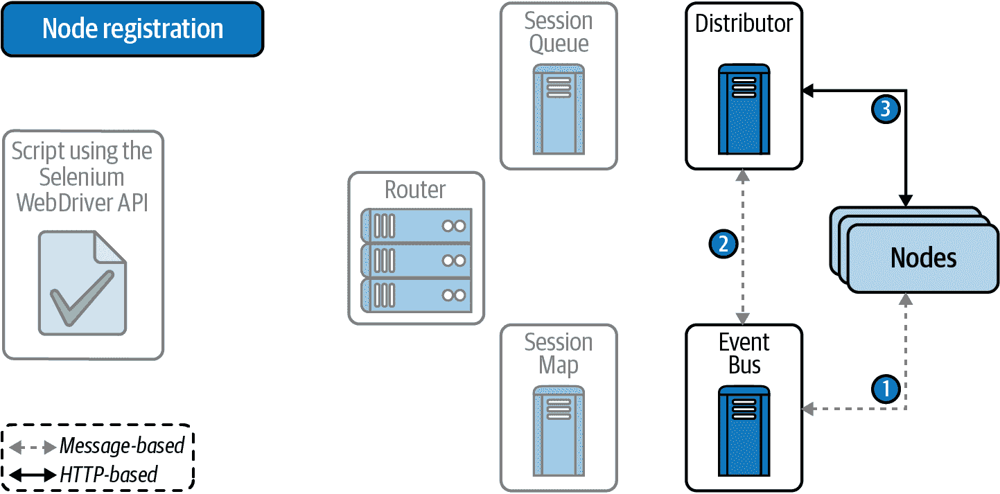

# 第六章：远程 WebDriver

到目前为止，本书中解释的示例都是在执行测试的机器上使用本地安装的 web 浏览器。本章涵盖了 Selenium WebDriver API 的另一个重要特性，即使用远程浏览器的能力（即安装在其他主机上）。首先，我们回顾了允许在 Selenium WebDriver 中使用远程浏览器的架构。其次，我们研究了 Selenium Grid，这是一个为 Selenium WebDriver 测试提供远程浏览器的网络基础设施。第三，我们分析了一些最重要的云提供商，即提供自动化测试托管服务的公司。最后，我们探讨了如何使用 Docker 来支持 Selenium 的浏览器基础设施。

# Selenium WebDriver 架构

如第一章中介绍的，Selenium WebDriver 是一个允许以编程方式控制 web 浏览器的库。自动化基于每个浏览器的本机功能。因此，我们需要在脚本（通常是测试）使用 Selenium WebDriver API 和浏览器之间放置一个称为 *driver* 的二进制文件。本书中到目前为止看到的示例使用本地浏览器，即在执行使用 Selenium WebDriver API 的测试的同一台机器上安装的浏览器。图 6-1 说明了这种方法。在这种情况下，当使用 Selenium WebDriver API 的 Java 语言绑定时，我们需要创建 `ChromeDriver` 实例来控制 Chrome，`FirefoxDriver` 来控制 Firefox 等。


###### 图 6-1\. 使用本地浏览器的 Selenium WebDriver 架构

支持此过程的通信协议称为 W3C WebDriver。这一标准协议基于 HTTP 上的 JSON 消息。多亏了这一点，Selenium WebDriver 架构可以分布到不同的互联计算机（*主机*）。图 6-2 显示了远程架构的示意图。


###### 图 6-2\. 使用远程浏览器的 Selenium WebDriver 架构

在这种情况下，Selenium WebDriver API 将 W3C WebDriver 消息发送到通常称为 *Selenium Server* 的服务器端组件。该服务器充当客户端请求到其他提供发生自动化的 web 浏览器的主机的代理。这种远程架构简化了跨浏览器测试（即在多种浏览器类型、版本或操作系统中验证 web 应用程序）和并行测试执行。

# 创建 RemoteWebDriver 对象

Selenium WebDriver API 提供了 `RemoteWebDriver` 类来控制远程浏览器。正如图 2-2 所示，该类是驱动本地浏览器的其他 `WebDriver` 类的父类（即 `ChromeDriver`、`FirefoxDriver` 等）。通过这种方式，您可以像我们在本书中之前学习的那样使用 `RemoteWebDriver` 对象。

## RemoteWebDriver 构造函数

实例化`RemoteWebDriver`对象的方法有多种。最常见的方法是通过传递两个参数调用其构造函数：Selenium 服务器的 URL 和所需的能力。正如图 5-1 所示，这些能力是从`Capabilities`接口继承的对象（例如`ChromeOptions`，`Firefox​Op⁠tions`等）。示例 6-1 展示了一个测试设置。您可以在本书的[代码库](https://github.com/bonigarcia/selenium-webdriver-java)中找到完整的测试。

###### 注意

还有第二种`RemoteWebDriver`构造函数，只接受一个参数用于指定的能力。在这种情况下，Selenium 服务器的 URL 是从 Java 系统属性`webdriver.remote.server`中读取的。您可以在示例库中找到此功能的示例。

##### 示例 6-1\. 使用构造函数实例化 RemoteWebDriver 对象

```java
@BeforeEach
void setup() throws MalformedURLException {
    URL seleniumServerUrl = new URL("http://localhost:4444/"); 
    assumeThat(isOnline(seleniumServerUrl)).isTrue(); 

    ChromeOptions options = new ChromeOptions(); 
    driver = new RemoteWebDriver(seleniumServerUrl, options); 
}
```


我们创建一个 Java `URL` 对象，其地址为 Selenium 服务器地址。


我们假设此 URL 是在线的。为此，我们通过在 WebDriverManager 上调用静态方法`isOnline`来创建 AssertJ 假设。因此，当 Selenium 服务器脱机时，测试会被跳过。


我们实例化一个`ChromeOptions`对象来指定所需的能力。


我们使用 Selenium 服务器 URL 和 Chrome 选项作为参数调用`RemoteWebDriver`构造函数。

在前面的例子中，我们使用一个没有特别设置的`ChromeOptions`对象来指定所需的能力。换句话说，我们请求使用远程 Chrome 浏览器的默认行为。尽管如此，我们可以使用这个对象来配置特定的能力（例如无头浏览器、页面加载策略、设备仿真等），如第五章中所述。此外，由于能力内部使用键-值对来封装特定的浏览器方面，我们可以通过调用方法`options.setCapability(key, value);`来管理各个能力。Selenium WebDriver API 提供了`CapabilityType`类来指定这些能力的键。该类有一组公共属性，可以作为`setCapability()`方法中的`key`使用。表 6-1 展示了其中一些属性。

表 6-1\. CapabilityType 属性

| 属性 | 能力名称 | 描述 |
| --- | --- | --- |

|

```java
BROWSER_NAME
```

|

```java
browserName
```

| 浏览器名称（例如`chrome`，`firefox`或`msedge`） |
| --- |

|

```java
PLATFORM_NAME
```

|

```java
platformName
```

| 平台名称（例如`WINDOWS`，`LINUX`，`MAC`，`ANDROID`，`IOS`等） |
| --- |

|

```java
BROWSER_VERSION
```

|

```java
browserVersion
```

| 浏览器版本 |
| --- |

|

```java
SUPPORTS_JAVASCRIPT
```

|

```java
javascriptEnabled
```

| 启用或禁用 JavaScript 执行 |
| --- |

|

```java
PAGE_LOAD_STRATEGY
```

|

```java
pageLoadStrategy
```

| 页面加载策略（`normal`，`eager`或`none`） |
| --- |

在 `RemoteWebDriver` 对象中指定所需功能的另一种方法是使用 `DesiredCapabilities` 的实例。表 6-2 总结了这些对象提供的方法。

表 6-2\. DesiredCapabilities 方法

| 方法 | 返回 | 描述 |
| --- | --- | --- |

|

```java
setBrowserName(String browserName)
```

|

```java
void
```

| 指定浏览器名称 |
| --- |

|

```java
setVersion(String version)
```

|

```java
void
```

| 指定浏览器版本 |
| --- |

|

```java
setPlatform(Platform platform)
```

|

```java
void
```

| 指定平台名称 |
| --- |

|

```java
setJavascriptEnabled(boolean
    javascriptEnabled)
```

|

```java
void
```

| 启用或禁用 JavaScript 执行 |
| --- |

|

```java
setAcceptInsecureCerts(boolean
    acceptInsecureCerts)
```

|

```java
void
```

| 启用或禁用加载不安全页面 |
| --- |

|

```java
acceptInsecureCerts()
```

|

```java
void
```

| 启用加载不安全页面 |
| --- |

|

```java
merge(Capabilities
    extraCapabilities)
```

|

```java
DesiredCapabilities
```

| 与另一个功能对象合并 |
| --- |

###### 注意

由于 Selenium WebDriver 4 仍然支持 `DesiredCapabilities`，因为有很多现有的代码依赖于此功能。尽管如此，指定功能的推荐方式是使用特定于浏览器的选项（例如 `ChromeOptions`、`FirefoxOptions` 等）。

## RemoteWebDriver 构建器

创建 `RemoteWebDriver` 对象的第二种方式是使用 Selenium WebDriver API 中提供的内置构建器。示例 6-2 演示了如何使用 Edge 作为远程浏览器。

##### 示例 6-2\. 使用构建器实例化 RemoteWebDriver 对象

```java
@BeforeEach
void setup() throws MalformedURLException {
    URL seleniumServerUrl = new URL("http://localhost:4444/");
    assumeThat(isOnline(seleniumServerUrl)).isTrue();

    driver = RemoteWebDriver.builder().oneOf(new EdgeOptions())
            .address(seleniumServerUrl).build();
}
```

## WebDriverManager 构建器

另外，我们还可以使用 WebDriverManager 来创建 `RemoteWebDriver` 的实例。为此，我们需要调用给定管理器的 `remoteAddress()` 方法以传递 Selenium 服务器 URL。示例 6-3 展示了使用此功能和 Firefox 作为远程浏览器的测试设置。

##### 示例 6-3\. 使用 WebDriverManager 实例化 RemoteWebDriver 对象

```java
@BeforeEach
void setup() throws MalformedURLException {
    URL seleniumServerUrl = new URL("http://localhost:4444/");
    assumeThat(isOnline(seleniumServerUrl)).isTrue();

    driver = WebDriverManager.firefoxdriver()
            .remoteAddress(seleniumServerUrl).create();
}
```

## Selenium-Jupiter

通常情况下，Selenium-Jupiter 使用 Jupiter 提供的参数解析功能。这样，就远程浏览器而言，您需要使用类型 `RemoteWebDriver` 声明测试（或构造函数）参数。然后，以下 Selenium-Jupiter 注解允许配置远程浏览器：

`@DriverUrl`

用于标识 Selenium 服务器 URL 的注解。另外，注解 `@EnabledIfDriverUrlOnline` 允许指定此 URL，并在该 URL 无响应时禁用测试。

`@DriverCapabilities`

用于配置所需功能的注解。

示例 6-4 展示了使用本地 Selenium 服务器提供的远程 Chrome 的 Selenium-Jupiter 测试。当 URL `http://localhost:4444/` 离线时，此测试将被跳过。

##### 示例 6-4\. 在 Selenium-Jupiter 测试中使用 RemoteWebDriver 对象

```java
@EnabledIfDriverUrlOnline("http://localhost:4444/")
@ExtendWith(SeleniumJupiter.class)
class RemoteChromeSelJupTest {

    @DriverCapabilities
    ChromeOptions options = new ChromeOptions();

    @Test
    void testRemote(RemoteWebDriver driver) {
        driver.get("https://bonigarcia.dev/selenium-webdriver-java/");
        assertThat(driver.getTitle()).contains("Selenium WebDriver");
    }

}
```

###### 注意

从功能角度来看，本节中描述的 `RemoteWebDriver` 实例化模式是等效的。换句话说，这些对象的工作方式相同。它们之间的区别在于提供的 *语法糖*（即，样式和表现力）。

# Selenium Grid

如在 第一章 中介绍的，Selenium Grid 是 Selenium 套件的一个子项目，允许创建一个通过 W3C WebDriver 协议访问的远程浏览器的网络基础设施。 Selenium Grid 允许在不同的机器和不同的浏览器上并行运行测试。为此，Selenium Grid 提供了一个 Selenium 服务器，您可以使用 `RemoteWebDriver` 的实例进行控制。有三种运行 Selenium Grid 的方式：

独立运行

单个主机充当 Selenium 服务器，并在此模式下提供浏览器。它提供了一种在远程浏览器中运行 Selenium WebDriver 测试的简单方法。

Hub-nodes

独立模式的一个潜在问题是可伸缩性（因为 Selenium 服务器和浏览器在同一个主机上执行）。因此，hub-nodes 架构定义了两种组件类型来解决这个问题。首先，一个主机充当 *hub*（或 Selenium 服务器）。然后，在 hub 中注册一个或多个主机作为 *node*，提供浏览器以便使用 Selenium WebDriver 控制。这种架构在 第一章 中引入（参见 图 1-2）。

完全分布式

独立模式和 hub-nodes 方法是集中式架构，当请求增加时可能会降低性能。截至 Selenium 4，Selenium Grid 提供了一个完全分布式模式，实现了负载均衡机制以解决这个瓶颈。

下面的子章节提供了关于这些模式的更多详细信息，并解释了如何设置每种方法。

## 独立运行

独立模式是 Selenium Grid 基础架构的最简单方法。我们可以使用 shell 和 Java 代码执行此模式。

### 从 shell 开始

首先，我们可以使用 shell 和 Selenium Grid 二进制发行版来启动它。 Selenium Grid 是用 Java 开发的，每个发布版都作为一个自包含的 JAR 文件提供，包含了所有的依赖项（也称为 *uber-JAR* 或 *fat-JAR*）。您可以从[Selenium 下载页面](https://www.selenium.dev/downloads)下载这个 fat-JAR。

在独立模式下，Selenium 服务器会自动检测系统中可用的驱动程序（例如 chromedriver、geckodriver 等）。为此，它会在 `PATH` 环境变量中查找这些驱动程序。通常情况下，我们可以手动管理这些驱动程序管理器。然而，建议使用 WebDriverManager 自动解析这些驱动程序。因此，正如在 附录 B 中解释的那样，WebDriverManager 可以用作 CLI 工具。WebDriverManager CLI 以 fat-JAR 的形式分发，并可在 [GitHub](https://github.com/bonigarcia/webdrivermanager/releases) 上下载。

为了说明这一点，示例 6-5 显示了在具有 WebDriverManager CLI 的 Linux 机器上解决 chromedriver 和 geckodriver 所需的 shell 命令。然后，我们使用 Selenium Grid 的 fat-JAR 来启动独立网格。请注意，这些命令是在相同的文件夹中执行的。这样，通过 WebDriverManager 下载的驱动程序可供 Selenium Grid 使用。

##### 示例 6-5\. 使用 WebDriverManager CLI 解决驱动程序并使用 shell 启动独立模式的 Selenium Grid 的命令

```java
boni@linux:~/grid$ java -jar webdrivermanager-5.0.3-fat.jar resolveDriverFor chrome 
[INFO] Using WebDriverManager to resolve chrome
[DEBUG] Detecting chrome version using online commands.properties
[DEBUG] Running command on the shell: [google-chrome, --version]
[DEBUG] Result: Version=94.0.4606.71
[DEBUG] Latest version of chromedriver according to
    https://chromedriver.storage.googleapis.com/LATEST_RELEASE_94 is 94.0.4606.61
[INFO] Using chromedriver 94.0.4606.61 (resolved driver for Chrome 94)
[INFO] Reading https://chromedriver.storage.googleapis.com/ to seek
    chromedriver
[DEBUG] Driver to be downloaded chromedriver 94.0.4606.61
[INFO] Downloading https://chromedriver.storage.googleapis.com/94.0.4606.61/
    chromedriver_linux64.zip
[INFO] Extracting driver from compressed file chromedriver_linux64.zip
[INFO] Driver location: /home/boni/grid/chromedriver

boni@linux:~/grid$ java -jar webdrivermanager-5.0.3-fat.jar resolveDriverFor firefox 
[INFO] Using WebDriverManager to resolve firefox
[DEBUG] Detecting firefox version using online commands.properties
[DEBUG] Running command on the shell: [firefox, -v]
[DEBUG] Result: Version=92.0.0.7916
[DEBUG] Getting driver version for firefox92 from online versions.properties
[INFO] Using geckodriver 0.30.0 (resolved driver for Firefox 92)
[INFO] Reading https://api.github.com/repos/mozilla/geckodriver/releases to
    seek geckodriver
[DEBUG] Driver to be downloaded geckodriver 0.30.0
[INFO] Downloading https://github.com/mozilla/geckodriver/releases/download/
    v0.30.0/geckodriver-v0.30.0-linux64.tar.gz
[INFO] Extracting driver from compressed file geckodriver-v0.30.0-linux64.tar.gz
[INFO] Driver location: /home/boni/grid/geckodriver

boni@linux:~/grid$ java -jar selenium-server-4.0.0.jar standalone 
INFO [LogManager$RootLogger.log] - Using the system default encoding
INFO [OpenTelemetryTracer.createTracer] - Using OpenTelemetry for tracing
INFO [NodeOptions.getSessionFactories] - Detected 8 available processors
INFO [NodeOptions.discoverDrivers] - Discovered 2 driver(s)
INFO [NodeOptions.report] - Adding Chrome for {"browserName": "chrome"} 8 times
INFO [NodeOptions.report] - Adding Firefox for {"browserName": "firefox"} 8 times
INFO [Node.<init>] - Binding additional locator mechanisms: name, id, relative
INFO [LocalDistributor.add] - Added node 41045bd8-ec7e-43c9-84bd-f63f7aca59ed
    at http://192.168.56.1:4444\. Health check every 120s
INFO [GridModel.setAvailability] - Switching node 41045bd8-ec7e-43c9-84bd-
    f63f7aca59ed (uri: http://192.168.56.1:4444) from DOWN to UP
INFO [Standalone.execute] - Started Selenium Standalone 4.0.0 (revision
    3a21814679): http://192.168.56.1:4444
```


我们使用 WebDriverManager CLI 来解决 chromedriver。


我们使用 WebDriverManager CLI 来解决 geckodriver（Firefox 所需的驱动程序）。


我们在包含 chromedriver 和 geckodriver 的同一文件夹中以独立模式启动 Selenium Grid。

执行这些命令后，独立的 Selenium 服务器将监听本地主机的端口 `4444` 上的传入 HTTP 请求。因此，我们可以使用该 URL（例如，如果测试在同一主机上执行，则为 `http://localhost:4444/`）和所需的能力（在本例中为 Chrome 或 Firefox）创建 `RemoteWebDriver` 的实例。例如，如下所示：

```java
WebDriver driver = new RemoteWebDriver("http://localhost:4444/",
        new ChromeOptions());
```

###### 注意

在 Selenium Grid 3 中，默认的 Selenium 服务器 URL 是 `http://localhost:4444/wd/hub`。在 Selenium Grid 4 中，尽管此 URL 也应该有效，但不再需要路径 `/wd/hub`。

Selenium Grid 提供的另一个有用功能是其*网页控制台*。该控制台是通过 Selenium 服务器 URL 访问的 Web UI，允许监视网格中注册的可用浏览器和正在执行的会话。

图 6-3 显示了先前独立网格控制台的屏幕截图。请注意，在此情况下，独立的 Selenium 服务器可以为 Chrome 和 Firefox 提供最多八个并发会话（与运行网格的机器上可用处理器数量相同）。


###### 图 6-3\. Selenium Grid 控制台

### 从 Java 代码

启动 Selenium Grid 的另一种方法是使用 Java。除了 fat-JAR 外，Selenium Grid 还使用 `org.seleniumhq.selenium` 作为 `groupId` 和 `selenium-grid` 作为 `artifactId` 在 Maven 中央仓库发布。因此，我们需要在项目设置（Maven 或 Gradle）中解析其坐标，以在我们的 Java 项目中使用它（有关配置详细信息，请参见 附录 B）。示例 6-6 演示了如何从 Java 测试用例中启动独立模式的 Selenium Grid。

##### 示例 6-6\. 在独立模式下启动 Selenium Grid 的测试

```java
static URL seleniumServerUrl;

@BeforeAll
static void setupAll() throws MalformedURLException {
    int port = PortProber.findFreePort(); 
    WebDriverManager.chromedriver().setup(); 
    Main.main(
            new String[] { "standalone", "--port", String.valueOf(port) }); 

    seleniumServerUrl = new URL(
            String.format("http://localhost:%d/", port)); 
}

@BeforeEach
void setup() {
    driver = new RemoteWebDriver(seleniumServerUrl, new ChromeOptions()); 
}
```


我们在本地主机上找到一个空闲端口。为此，我们使用 Selenium WebDriver API 中可用的 `PortProber` 类。


我们使用 WebDriverManager 来解决 chromedriver，因为要启动的独立网格将为 Chrome 浏览器提供服务。


我们以独立模式启动 Selenium Grid，调用其`main`方法。


我们使用之前选择的端口创建一个 Java `URL`。


我们创建一个`RemoteWebDriver`的实例。像往常一样，我们在测试逻辑中使用这个对象来调用 Selenium WebDriver API 并控制浏览器（查看示例库以获取整个类的示例）。

## Hub-nodes

Selenium Grid 的经典架构包括两种类型的主机：hub（即 Selenium 服务器）和一组节点。与独立模式类似，我们可以使用 Selenium Grid 的 fat-JAR 在 shell 中启动此模式。首先，在一个主机上启动 hub。然后，在同一主机或不同主机上注册一个或多个节点。示例 6-7 展示了如何在 Windows 控制台中执行这些命令。

##### 示例 6-7\. 使用 shell 启动 hub-nodes 模式的 Selenium Grid 命令

```java
C:\grid>java -jar selenium-server-4.0.0.jar hub 
INFO [LogManager$RootLogger.log] - Using the system default encoding
INFO [OpenTelemetryTracer.createTracer] - Using OpenTelemetry for tracing
INFO [BoundZmqEventBus.<init>] - XPUB binding to [binding to tcp://*:4442,
    advertising as tcp://192.168.56.1:4442], XSUB binding to [binding to
    tcp://*:4443, advertising as tcp://192.168.56.1:4443]
INFO [UnboundZmqEventBus.<init>] - Connecting to tcp://192.168.56.1:4442 and
    tcp://192.168.56.1:4443
INFO [UnboundZmqEventBus.<init>] - Sockets created
INFO [UnboundZmqEventBus.<init>] - Event bus ready
INFO [Hub.execute] - Started Selenium Hub 4.0.0 (revision 3a21814679):
    http://192.168.56.1:4444
INFO [Node.<init>] - Binding additional locator mechanisms: relative, name, id
INFO [LocalDistributor.add] - Added node 98c35075-e5f0-4168-be97-c277e4f40d8d
    at http://192.168.56.1:5555\. Health check every 120s
INFO [GridModel.setAvailability] - Switching node 98c35075-e5f0-4168-be97-
    c277e4f40d8d (uri: http://192.168.56.1:5555) from DOWN to UP

C:\grid>java -jar selenium-server-4.0.0.jar node 
INFO [LogManager$RootLogger.log] - Using the system default encoding
INFO [OpenTelemetryTracer.createTracer] - Using OpenTelemetry for tracing
INFO [UnboundZmqEventBus.<init>] - Connecting to tcp://*:4442 and tcp://*:4443
INFO [UnboundZmqEventBus.<init>] - Sockets created
INFO [UnboundZmqEventBus.<init>] - Event bus ready
INFO [NodeServer.createHandlers] - Reporting self as: http://192.168.56.1:5555
INFO [NodeOptions.getSessionFactories] - Detected 8 available processors
INFO [NodeOptions.discoverDrivers] - Discovered 2 driver(s)
INFO [NodeOptions.report] - Adding Chrome for {"browserName": "chrome"} 8 times
INFO [NodeOptions.report] - Adding Firefox for {"browserName": "firefox"} 8
    times
INFO [Node.<init>] - Binding additional locator mechanisms: relative, name, id
INFO [NodeServer$1.start] - Starting registration process for node id
    98c35075-e5f0-4168-be97-c277e4f40d8d
INFO [NodeServer.execute] - Started Selenium node 4.0.0 (revision
    3a21814679): http://192.168.56.1:5555
INFO [NodeServer$1.lambda$start$1] - Sending registration event...
INFO [NodeServer.lambda$createHandlers$2] - Node has been added
```


我们启动 hub。默认情况下，此服务器在端口 4444 上监听 W3C WebDriver HTTP 请求，并在端口 4442 和 4443 上监听 TCP 端口以注册节点。


在第二个控制台中，我们注册节点（们）。在这个示例中，此命令在与 hub 相同的主机上执行。此外，假定所需的驱动程序（例如 chromedriver 和 geckodriver）已经解决（就像在示例 6-5 中一样）。要从另一个主机启动节点，我们需要调用以下命令：

```java
java -jar selenium-server-4.0.0.jar node --hub http://<hub>:4444
```

###### 注意

与独立模式相同，您可以使用 Java 代码启动 hub-nodes 网格。为此，您需要更改参数以调用 Selenium Grid 的主类，遵循 hub 和节点的 CLI 命令的相同语法。

## 完全分布式

从版本 4 开始，我们可以按照完全分布式的架构执行 Selenium Grid 基础架构。此方法的决定性方面是可伸缩性。专门的节点在此模式下处理不同的自动化和基础设施管理方面。这些节点包括：

路由器

作为 Grid 的单一入口点的节点。此组件监听来自 Selenium 脚本的 W3C WebDriver 命令。

会话队列

存储新会话请求的节点。这些传入会话等待由*分发器*读取。

分发器

节点了解所有节点及其能力。它定期向*会话队列*请求新的会话请求。

事件总线

在 Grid 架构的多个成员之间提供基于消息的通信渠道的组件。这种通信在图 6-4 和 6-5 中用虚线表示。

会话映射

它维护 WebDriver 会话和执行会话的节点之间的关系。

节点（们）

提供基于 Selenium WebDriver 进行自动化的网络浏览器的主机及其对应的驱动程序。

###### 注意

在中心节点架构中，中心节点汇聚了完全分布模式下的路由器、会话队列、分发器、事件总线和会话映射的责任。

下面的小节详细介绍了完全分布式 Selenium Grid 中最相关的流程：节点注册、新会话以及其他 WebDriver 命令。

### 节点注册

操作分布式 Selenium Grid 所需的第一个过程是注册一个或多个节点。为此，节点需要在分发器中注册其能力。图 6-4 说明了此过程，包括三个步骤：

1.  节点通过事件总线发送消息以宣布其能力。

1.  此消息到达分发器，后者存储节点与能力之间的关系。

1.  分发器通过与源节点交换 HTTP 消息（实线）来确保节点存在。



###### 图 6-4\. Selenium Grid 分布式架构中的节点注册

### 新会话

在某个时刻，一个脚本（通常是一个测试用例）会尝试自动启动一个新的会话来驱动浏览器。图 6-5 描述了在完全分布式 Selenium Grid 中执行此过程所需的通信，即：

1.  使用 Selenium WebDriver API 的脚本/测试向路由器发送请求以创建新会话（即通过编程方式驱动浏览器）。

1.  路由器在会话队列中创建一个新条目以存储此新的会话请求。

1.  分发器定期询问会话队列是否有新的会话请求。

1.  一旦分发器发现新的会话请求，它会检查是否有节点能够支持此会话。如果会话是可能的（即分发器中之前注册的节点提供了所需的能力），分发器将与节点创建一个新会话。

1.  分发器向会话映射发送 HTTP 消息以存储新会话。会话映射存储一个唯一的会话标识符（*session id*），该标识符唯一地关联执行浏览器会话的节点。


###### 图 6-5\. Selenium Grid 分布式架构中的新会话

### WebDriver 命令

一旦会话建立，Selenium WebDriver API 脚本将继续发送 W3C WebDriver 命令以控制远程节点中的网络浏览器。图 6-6 显示了在分布式 Selenium Grid 基础设施中执行这些通信步骤：

1.  脚本/测试使用 W3C WebDriver 命令来驱动浏览器（例如打开网页、与网页元素交互等）当前会话中。

1.  对同一浏览器会话的进一步请求使用相同的会话 ID。路由器通过读取会话映射来识别浏览器会话是否活动。

1.  路由器直接将同一会话的后续命令转发到分配的节点。


###### 图 6-6\. 在 Selenium Grid 分布式架构中的 WebDriver 命令

### 设置分布式网格

像独立模式和中心节点模式一样，我们可以使用 Selenium Grid 分发（作为一个 fat-JAR 或常规 Java 依赖项）来启动完全分布式的架构。示例 6-8 显示了使用命令行执行此操作所需的 shell 命令。

##### 示例 6-8\. 使用 shell 启动分布式模式下的 Selenium Grid 的命令

```java
C:\grid>java -jar selenium-server-4.0.0.jar event-bus 
INFO [BoundZmqEventBus.<init>] - XPUB binding to [binding to tcp://*:4442,
    advertising as tcp://192.168.56.1:4442], XSUB binding to [binding to
    tcp://*:4443, advertising as tcp://192.168.56.1:4443]
...

C:\grid>java -jar selenium-server-4.0.0.jar sessions 
...
INFO [SessionMapServer.execute] - Started Selenium SessionMap 4.0.0 (revision
    5fe1af712f): http://192.168.56.1:5556

C:\grid>java -jar selenium-server-4.0.0.jar sessionqueue 
...
INFO [NewSessionQueueServer.execute] - Started Selenium SessionQueue 4.0.0
    (revision 5fe1af712f): http://192.168.56.1:5559

C:\grid>java -jar selenium-server-4.0.0.jar distributor --sessions
    http://<session_map>:5556 --sessionqueue http://<session_queue>:5559 --bind-bus
    false 
...
INFO [DistributorServer.execute] - Started Selenium Distributor 4.0.0 (revision
    5fe1af712f): http://192.168.56.1:5553

C:\grid>java -jar selenium-server-4.0.0.jar router --sessions
    http://<session_map>:5556 --distributor http://<distributor_address>:5553
    --sessionqueue http://>session_queue>:5559 
...
INFO [RouterServer.execute] - Started Selenium Router 4.0.0 (revision
    5fe1af712f): http://192.168.56.1:4444

C:\grid>java -jar selenium-server-4.0.0.jar node --publish-events
    tcp://<event_bus>:4442 --subscribe-events tcp://<event_bus>:4443 
...
INFO [NodeOptions.discoverDrivers] - Discovered 2 driver(s)
...
INFO [NodeServer$1.lambda$start$1] - Sending registration event...
INFO [NodeServer.lambda$createHandlers$2] - Node has been added
```


我们启动事件总线。默认情况下，事件总线监听 TCP 端口 4442 和 4443。


我们启动会话映射。默认情况下，此组件在端口 5556 上侦听传入的 HTTP 消息。


我们启动会话队列。默认情况下，此队列在端口 5559 上侦听 HTTP。


我们启动分发器。为此，我们需要指定会话映射和会话队列地址。此外，由于我们已经独立启动了事件总线，我们将 `--bind-bus` 标志设置为 `false`。默认情况下，分发器使用端口 5553 进行 HTTP 通信。


我们启动路由器。我们需要指定会话映射、会话队列和分发器的 URL。


我们启动节点。我们需要指定事件总线用于发布-订阅消息的端口。此外，在此示例中，相同文件夹中有几个驱动程序（chomedriver 和 geckodriver）可供使用。

## 可观测性

在软件工程中，*可观测性* 是根据软件系统的外部输出或信号确定其当前状态的一种度量。通过这种方式，可观测性允许利用其外部指标了解系统的内部状态。可观测性对于维护复杂的软件系统和确定任何问题的根本原因可能至关重要。为此目的，可观测性的三个支柱是：

指标

随时间变化的系统性能指标，例如响应时间、每秒事务数或内存使用量等等

日志

系统在运行代码时生成的文本行（通常带有时间戳）

跟踪

描述因果关系的分布式事件（例如选择的日志），其特征是给定操作在软件系统中的请求流

Selenium Grid 4 提供了不同的功能来测量观测性。首先，Selenium Grid 允许使用[OpenTelemetry](https://opentelemetry.io) API 进行跟踪。其次，Selenium Grid 提供了一个 GraphQL 端点来针对网格运行查询。

### 使用 OpenTelemetry 进行跟踪

*跟踪* 是基于软件系统的日志和度量标准的重要观测测量方式。Selenium Grid 通过两种方式公开跟踪。首先，我们可以在 Shell 中执行网格时检查日志跟踪。默认情况下，显示`INFO`级别的日志。我们可以使用 Shell 命令中的参数 `--log-level` 来更改级别，例如：

```java
java -jar selenium-server-4.0.0.jar standalone --log-level FINE
```

此外，Selenium Grid 支持通过 OpenTelemetry API 进行*分布式跟踪*。此功能允许跟踪通过 Selenium Grid 基础设施传递的命令。分布式跟踪需要按照以下顺序进行两项活动：

1\. 代码仪器化

Selenium Grid 允许使用 OpenTelemetry API 导出跟踪信息。

2\. 数据收集

例如，我们可以使用[Jaeger](https://www.jaegertracing.io)，一个开源的分布式跟踪平台，它与 OpenTelemetry 提供无缝集成。它允许查询、可视化和收集跟踪数据。

以下命令展示了如何设置 Selenium Grid 以将数据导出到 Jaeger。首先，我们需要一个运行中的 Jaeger 后端。为此，我们可以从[Jaeger 下载页面](https://www.jaegertracing.io/download)下载可执行二进制文件。或者，我们可以使用 Docker 启动服务器，如下所示：

```java
docker run --rm -it --name jaeger \
  -p 16686:16686 \ 
  -p 14250:14250 \ 
  jaegertracing/all-in-one:1.27
```


我们将使用 URL `http://localhost:16686` 来访问 Jaeger UI。


我们将使用 URL `http://localhost:14250` 来收集数据（由 Selenium Grid 导出）。

接着，我们按如下方式启动 Selenium Grid：

```java
java -Dotel.traces.exporter=jaeger \
  -Dotel.exporter.jaeger.endpoint=http://localhost:14250 \ 
  -Dotel.resource.attributes=service.name=selenium-standalone \ 
  -jar selenium-server-4.0.0.jar \
  --ext $(cs fetch -p \ 
     io.opentelemetry:opentelemetry-exporter-jaeger:1.6.0 \
     io.grpc:grpc-netty:1.41.0) \
  standalone
```


我们使用 Jaeger 端点来导出跟踪数据。


我们指定服务名称为`selenium-standalone`。我们将在 Jaeger UI 中查找此名称，以可视化收集的数据（见图 6-7）。


我们使用[Coursier](https://get-coursier.io)来下载并生成两个所需依赖项（`opentelemetry-exporter-jaeger` 和 `grpc-netty`）的类路径。


###### 图 6-7\. Jaeger UI 显示从 Selenium Grid 收集的数据

### GraphQL 查询

[GraphQL](https://graphql.org) 是一个用于 API 的开源数据查询和操作语言。GraphQL 定义了一种从在线服务请求数据的语法。Selenium Grid 4 提供了一个 GraphQL 端点（`http://localhost:4444/graphql`）。通过 shell 使用 [curl](https://curl.se) 对此端点进行 GraphQL 查询是一个简单的方法。例如，假设我们在本地主机上运行了一个 Selenium Grid，我们可以向 GraphQL 端点发送以下命令来获取网格中的最大会话数和当前会话数：

```java
curl -X POST -H "Content-Type: application/json" --data \
    '{"query": "{ grid {maxSession, sessionCount } }"}' -s \
    http://localhost:4444/graphql
```

## 配置

您可以在其官方[文档](https://www.selenium.dev/documentation/grid)中找到有关 Selenium Grid 的更多详细信息。对于高级配置，有两种方式可以为 Selenium Grid 指定自定义设置：

使用 Selenium Grid 不同方面的 CLI 选项

这些选项的一些示例是 `--port` 用于更改 Selenium Server 监听的默认端口（默认为 4444），或者 `--session-timeout`，即在没有活动时终止节点的超时时间（默认为三百秒）。

使用 [TOML](https://toml.io) 文件

TOML（Tom’s Obvious Minimal Language）是一种设计成易于阅读的配置格式。与 CLI 选项一样，这些文件允许使用 TOML 表示法配置 Selenium Grid 参数。

# 云提供商

正如在第一章中介绍的，Selenium 生态系统中的*云提供商*是为自动化的 Web 和移动测试提供托管服务（通常是商业服务）的公司。云提供商通常提供的服务包括：

浏览器作为服务

可以请求由提供商托管的按需网页浏览器。这些浏览器通常是不同类型、版本和操作系统的。此功能通常用于跨浏览器的自动化或实时测试。

分析能力

为了监控和调试自动化测试。为此，云提供商通常支持会话录制或丰富的错误报告功能。

移动测试

可以请求在不同平台上仿真（和真实的）移动设备，例如 Android 和 iOS。

视觉测试

自动检查 UI 并确保最终用户拥有正确的视觉体验。

目前 Selenium 的云提供商示例包括 [Sauce Labs](https://saucelabs.com), [BrowserStack](https://www.browserstack.com), [LambdaTest](https://www.lambdatest.com), [CrossBrowserTesting](https://crossbrowsertesting.com), [Moon Cloud](https://aerokube.com/moon-cloud), [TestingBot](https://testingbot.com), [Perfecto](https://www.perfecto.io) 或 [Testinium](https://testinium.com)。所有这些公司都提供具有不同定价计划的特定服务。它们的共同点是每个云提供商维护一个 Selenium Server 终端节点，我们可以在 `RemoteWebDriver` 测试中使用。示例 6-9（见 saucelabs_setup）说明了如何使用其中之一（具体来说，是 Sauce Labs）创建 `WebDriver` 对象。您可以在 [示例存储库](https://github.com/bonigarcia/selenium-webdriver-java) 中找到其他云提供商（BrowserStack、LambdaTest、CrossBrowserTesting、Perfecto 和 Testinium）的等效测试。这些测试允许使用由云提供商管理的远程浏览器。

##### 示例 6-9\. 使用 Sauce Labs 的测试设置

```java
@BeforeEach
void setup() throws MalformedURLException {
    String username = System.getProperty("sauceLabsUsername"); 
    String accessKey = System.getProperty("sauceLabsAccessKey");
    assumeThat(username).isNotEmpty(); 
    assumeThat(accessKey).isNotEmpty();

    MutableCapabilities capabilities = new MutableCapabilities();
    capabilities.setCapability("username", username); 
    capabilities.setCapability("access_key", accessKey);
    capabilities.setCapability("name", "My SauceLabs test"); 
    capabilities.setCapability("browserVersion", "latest"); 

    ChromeOptions options = new ChromeOptions();
    options.setCapability("sauce:options", capabilities); 
    URL remoteUrl = new URL(
            "https://ondemand.eu-central-1.saucelabs.com:443/wd/hub"); 

    driver = new RemoteWebDriver(remoteUrl, options); 
}
```


要使用 Sauce Labs，我们需要一个有效的账户。换句话说，我们需要以用户名和访问密钥的形式拥有凭据。为了避免在测试逻辑中硬编码这些凭据，我在这个测试中使用了 Java 系统属性。这些属性可以在执行命令时指定（例如，`mvn test -DsauceLabsUsername=myname -DsauceLabsAccessKey=mykey`）。指定这些数据的另一种方式是使用环境变量（例如，`String username = Sys⁠tem.getenv("SAU⁠CE⁠LABS_USERNAME");`）。


当用户名或密钥不可用时，我们跳过此测试（使用假设）。


我们需要将用户名和密钥作为 Selenium 的能力包含在内。


我们可以指定一个自定义标签来在 Sauce Labs 仪表板中标识此测试（参见图 6-8）。


我们使用给定浏览器的最新版本（如下一行所指定的 Chrome）。


我们在 Sauce Labs 云中使用一个名为`​​sauce:options`的自定义标签来选择所需的能力。


我们将 Sauce Labs 的公共终端点用作远程 URL。Sauce Labs 在不同地区提供终端点。在此示例中，我使用的是 EU Central 数据中心。其他可能的包括 [US West](https://ondemand.us-west-1.saucelabs.com/wd/hub)、[US East](https://ondemand.us-east-1.saucelabs.com/wd/hub) 或 [Asia-Pacific Southeast](https://ondemand.apac-southeast-1.saucelabs.com)。


我们使用 URL 和能力来创建 `RemoteWebDriver` 的实例。


###### 图 6-8\. Sauce Labs 仪表板显示的自动化测试结果

# Docker 容器中的浏览器

[Docker](https://www.docker.com) 是一个开源平台，允许创建、部署和运行轻量级、便携式容器化应用程序。Docker 平台由两个主要组件组成：

+   [Docker 引擎](https://docs.docker.com/engine)，一个允许在主机中创建和运行容器的应用程序。Docker 引擎是一个客户端-服务器应用程序，由三个元素组成：

    +   作为守护进程实现的服务器（`dockerd`）

    +   应用程序客户端用于指导守护程序的 REST API

    +   一个 CLI 工具（`docker` 命令）

+   [Docker Hub](https://hub.docker.com)，用于分发容器的云服务。

在 Selenium 中，Docker 可以是支持基于 Selenium WebDriver 的自动化测试所需的浏览器基础设施的相关技术。以下子章节解释了在 Docker 容器中执行浏览器的替代方案。

## Selenium Grid 的 Docker 镜像

Selenium 套件的官方子项目是[docker-selenium](https://github.com/SeleniumHQ/docker-selenium)。该项目维护了不同 Selenium Grid 组件（如独立、中心、节点、路由器、分发器、会话队列等）和 Web 浏览器（Chrome、Firefox 和 Edge）的 Docker 镜像。这些 Docker 镜像是开源的，并在[Docker Hub](https://hub.docker.com/u/selenium)上发布。使用这些镜像的简单方法是通过 shell（使用 `docker` 命令）启动它们，并使用`RemoteWebDriver`的实例来驱动*dockerized*浏览器。以下子章节解释了如何执行这些操作。

###### 注意

此节中展示的命令和测试假设您的系统中已安装了 Docker。换句话说，您需要在您的机器上安装 Docker 引擎，以便正确执行这些示例。

### 独立模式

我们可以在 Docker Hub 中找到独立浏览器（Chrome、Firefox 和 Edge）的 Selenium 镜像。以下命令展示了如何在 Docker 中使用 shell 启动 Chrome。

```java
docker run -d -p 4444:4444 --shm-size="2g" selenium/standalone-chrome:latest
```

此命令启动 Docker 镜像 `selenium/standalone-chrome:latest`，即 Docker Hub 中可用的最新版本的 Chrome。或者，我们可以使用固定的 Chrome 版本（例如 `selenium/standalone-chrome:94.0`）。使用 `-d` 标志以分离模式启动 Docker 容器（使用共享内存 2 GB `--shm-size="2g"`）。这个数值已知可用，但根据您的资源或特定需求，您可以更改它。最后，将容器的内部端口 `4444` 映射到执行命令的主机的同一端口（`-p 4444:4444`）。然后，我们可以使用以下 Java 命令来实例化一个使用这个 dockerized Chrome 的 `WebDriver` 对象：

```java
WebDriver driver = new RemoteWebDriver("http://localhost:4444/",
        new ChromeOptions());
```

此外，当使用 Selenium Grid 时，我们可以使用 Docker 容器注册节点。以下命令展示了如何使用 Docker 中的 Firefox 启动独立模式的 Selenium Grid：

```java
java -jar selenium-server-4.0.0.jar node -D selenium/standalone-firefox:latest
        '{"browserName": “firefox"}'
```

### 中心节点

我们可以轻松地使用官方 Selenium Docker 镜像在中心节点模式下启动 Selenium Grid。以下命令展示了如何在 shell 中执行此操作。

```java
docker network create grid 

docker run -d -p 4442-4444:4442-4444 --net grid \
    --name selenium-hub selenium/hub:4.0.0 

docker run -d --net grid -e SE_EVENT_BUS_HOST=selenium-hub --shm-size="2g" \
    -e SE_EVENT_BUS_PUBLISH_PORT=4442  -e SE_EVENT_BUS_SUBSCRIBE_PORT=4443 \
    selenium/node-chrome:4.0.0 

docker network rm grid 
```


首先，我们创建一个名为 `grid` 的 Docker 网络。该网络允许 hub 和节点之间使用它们的主机名进行通信（例如，`selenium-hub`）。


我们启动 Selenium Hub。我们需要映射端口 4444（用于 Selenium 服务器 URL）和 4442-4443（用于注册节点）。


我们注册节点。在此命令中，我们使用 Chrome (`selenium/node-chrome`)。其他浏览器可以使用其他 Docker 镜像（例如，`selenium/node-firefox` 或 `selenium/node-edge`）在 hub 中注册。


如果不再需要，我们可以在最后删除 `grid` 网络。

### 更多功能

项目 `docker-selenium` 提供了各种功能。我建议您查看其 [README](https://github.com/SeleniumHQ/docker-selenium) 以获取更多详细信息。以下是这些功能的摘要：

Docker Compose 脚本

这些脚本可以轻松启动 Selenium Grid hub-nodes 和完全分布模式。

视频录制

我们可以使用另一个 Docker 容器记录节点中浏览器的桌面会话。

动态网格

这使我们能够按需启动 Docker 容器。

部署到 Kubernetes

[Kubernetes](https://kubernetes.io) 是一个开源的容器编排系统，自动化容器化应用程序的部署和管理。我们可以使用 Kubernetes 来部署 Selenium Docker 容器。

高级容器配置

这可以用来指定 Selenium 或 Java 自定义配置，例如。

访问远程会话

这可以通过使用虚拟网络计算（VNC）（一种图形桌面共享系统）和 [noVNC](https://novnc.com)（一个开源的基于 web 的 VNC 客户端）来实现。

## Selenoid

[Selenoid](https://aerokube.com/selenoid) 是 Selenium Hub 的一个开源 Golang 实现。Selenoid 可以被视为基于 Docker 提供浏览器基础设施的轻量级 Selenium 服务器。Selenoid 团队还维护着 Selenoid 使用的 Docker 镜像。这些镜像包括多个 web 浏览器和 Android 设备，例如 Chrome、Firefox、Edge、Opera、Safari（WebKit 引擎）或 Chrome Mobile。

有不同的方式来使用 Selenoid 及其 Docker 镜像。一个简单的方法是使用项目提供的配置管理器（一个名为 `cm` 的二进制文件）。以下代码段显示了如何启动 Selenoid 及其 UI（一个基于 web 的仪表板，用于监控 Selenoid）：

```java
./cm selenoid start 
./cm selenoid-ui start 
```


我们启动 Selenoid。配置管理器下载 Selenoid 的 Docker 镜像和几个浏览器的最新两个版本（Chrome、Firefox 和 Opera）。一旦启动，Selenoid 会监听 Selenium WebDriver 请求的 URL `http://localhost:4444/wd/hub`。


可选地，我们可以启动 Selenoid UI。此 UI 是一个 Web 应用程序，可通过 URL `http://localhost:8080/` 访问。图 6-9 显示了执行 Selenium WebDriver 测试期间此 UI 的屏幕截图。示例 6-10 显示了使用 Selenoid 服务的 Chrome 浏览器的测试设置。


###### 图 6-9\. 使用 VNC 运行测试时的 Selenoid UI

##### 示例 6-10\. 使用构造函数实例化 RemoteWebDriver 对象

```java
@BeforeEach
void setup() throws MalformedURLException {
    URL seleniumServerUrl = new URL("http://localhost:4444/wd/hub");
    assumeThat(isOnline(seleniumServerUrl)).isTrue();

    ChromeOptions options = new ChromeOptions();
    Map<String, Object> selenoidOptions = new HashMap<>();
    selenoidOptions.put("enableVNC", true); 
    options.setCapability("selenoid:options", selenoidOptions); 
    driver = new RemoteWebDriver(seleniumServerUrl, options);
}
```


`enableVNC` 功能是 Selenoid 特有的，允许我们启动带有 VNC 支持的 dockerized 浏览器（这样，我们可以在 Selenoid UI 中可视化浏览器会话，如 图 6-9 所示）。


由于此功能是特定供应商的，设置此功能的 W3C WebDriver 兼容方式是使用自定义命名空间（在本例中为 `selenoid:options`）。

### 更多功能

Selenoid 提供不同的功能和配置能力。您可以查看其 [文档](https://aerokube.com/selenoid/latest) 了解更多详情。这些功能包括视频录制、自定义配置、日志管理或访问浏览器开发者工具等。

## WebDriverManager

截至版本 5，WebDriverManager 允许在 Docker 容器中轻松使用网页浏览器。为此，每个管理器（例如，`chromedriver()`、`firefoxdriver()` 等）都提供了 `browserInDocker()` 方法。当调用 `create()` 方法时，WebDriverManager 内部会拉取 Docker 镜像并运行容器，在需要时创建一个 `RemoteWebDriver` 实例。WebDriverManager 使用由 Selenoid 团队维护的 Docker 镜像。通过 WebDriverManager，你可以直接使用 Chrome（桌面版和移动版）、Firefox、Edge、Opera 和 Safari 作为 Docker 容器。示例 6-11 展示了使用此功能进行基本测试的情况。

##### 示例 6-11\. 使用 WebDriverManager 和 Docker 中的 Chrome 进行完整测试

```java
class DockerChromeJupiterTest {

    WebDriver driver;

    WebDriverManager wdm = WebDriverManager.chromedriver().browserInDocker(); 

    @BeforeEach
    void setupTest() {
        assumeThat(isDockerAvailable()).isTrue(); 
        driver = wdm.create(); 
    }

    @AfterEach
    void teardown() {
        wdm.quit(); 
    }

    @Test
    void testDockerChrome() {
        driver.get("https://bonigarcia.dev/selenium-webdriver-java/");
        assertThat(driver.getTitle()).contains("Selenium WebDriver");
    }

}
```


我们获取 Chrome 的管理器实例（`chromedriver()`）。然后，使用 WebDriverManager 流畅的 API，我们指定使用该实例创建的未来 `WebDriver` 对象（称为 `wmd`）将使用 Docker 执行相应的浏览器（在本例中为 Chrome）。


我们假设运行此测试的机器上有 Docker 引擎。为此，我们通过调用 WebDriverManager 的静态方法 `isDockerAvailable` 创建一个 AssertJ 断言。这样，当 Docker 不可用时，测试将被跳过。


在测试设置中，我们创建 `WebDriver` 实例。在内部，WebDriverManager 将连接到 Docker Hub，以发现可用作 Docker 镜像的最新版本的 Chrome。然后将该镜像拉取到本地机器，执行 Docker 容器，并将相应的 `RemoteWebDriver` 实例返回给测试逻辑。


WebDriverManager 允许通过 `quit()` 方法退出先前创建的 `WebDriver` 实例。这个方法的效果与直接退出实例相同（在这种情况下是 `driver.quit()`），并且使用的 Docker 容器会优雅地终止。

WebDriverManager 提供了一个流畅的 API 来配置 dockerized Web 浏览器的不同方面。以下代码片段展示了几个可能性。通常情况下，您可以在[本书的示例仓库](https://github.com/bonigarcia/selenium-webdriver-java)中找到使用这些功能的完整测试。

```java
WebDriverManager wdm = WebDriverManager.firefoxdriver().browserInDocker(); 

WebDriverManager wdm = WebDriverManager.chromedriver().browserInDocker()
        .browserVersion("beta"); 

WebDriverManager wdm = WebDriverManager.chromedriver().browserInDocker()
        .enableVnc(); 

WebDriverManager wdm = WebDriverManager.chromedriver().browserInDocker()
        .enableRecording(); 
```


我们选择一个指定的管理器来使用相应的 dockerized 浏览器（在本例中是 Firefox）。除了 Chrome 和 Firefox 外，其他可选项还包括 Edge、Opera、Safari 和 Chrome Mobile。


默认情况下，WebDriverManager 在 Docker Hub 上使用最新版本的 dockerized 浏览器。尽管如此，我们可以强制使用指定的版本（例如，`94.0`）。此外，还可以使用不同的通配符来指定以下版本：

`latest`

使用最新版本（默认选项）。

`latest-N`

要使用稳定发布的先前版本。例如，如果我们指定 `latest-1`（即最新版本减一），则使用稳定发布之前的版本。

`beta`

使用 beta 版本。此版本仅适用于 Chrome 和 Firefox，使用由 [Twilio](https://hub.docker.com/r/twilio/selenoid) 维护的 Aerokube Docker 镜像分支。

`dev`

使用开发版本（同样适用于 Chrome 和 Firefox）。


使用 VNC 或 noVNC 连接到远程桌面会话。默认情况下，WebDriverManager 在日志跟踪中打印 noVNC URL。此外，可以通过调用 `wdm.getDockerNoVncUrl()` 方法访问此 URL。Figure 6-10 展示了一个允许观看和与 noVNC 远程会话进行交互的 Web 浏览器。


在测试结束时启用会话录制。您可以在项目根目录中找到录制文件（MP4 格式）。


###### 图 6-10\. 使用 WebDriverManager 启动的 dockerized 浏览器的 noVNC 远程桌面

### 更多功能

正如其[文档](https://bonigarcia.dev/webdrivermanager)所述，您可以通过多种方式配置 WebDriverManager。例如，您可以指定 docker 化浏览器的细粒度方面，如时区、网络、共享内存、卷、环境变量、屏幕分辨率或录制输出等。此外，WebDriverManager 可以用作 Selenium 服务器。该服务器使用从 Docker Hub 拉取的容器映像来支持浏览器基础设施。

## Selenium-Jupiter

Selenium-Jupiter 在 Docker 容器中使用 WebDriverManager 来管理和处理 Web 浏览器。对于 docker 化的浏览器，Selenium-Jupiter 提供了注解`@DockerBrowser`。您可以在测试方法中使用这个注解，配合`WebDriver`或`RemoteWebDriver`参数使用。示例 6-12 演示了这个特性。在这个示例中，我们在 Docker 中使用 Chrome。

##### 示例 6-12\. 使用 Selenium-Jupiter 和 Docker 中的 Chrome 完成测试

```java
@EnabledIfDockerAvailable 
@ExtendWith(SeleniumJupiter.class)
class DockerChromeSelJupTest {

    @Test
    void testDockerChrome(@DockerBrowser(type = CHROME) WebDriver driver) {
        driver.get("https://bonigarcia.dev/selenium-webdriver-java/");
        assertThat(driver.getTitle()).contains("Selenium WebDriver");
    }

}
```


我们用 Selenium-Jupiter 的注解`@EnabledIf​Dock⁠erAvailable`装饰测试类。此注解在运行测试的机器上未安装 Docker 时会禁用测试。

注解`@DockerBrowser`允许设置不同的方面和功能。下面的代码片段展示了其中一些。

```java
@DockerBrowser(type = FIREFOX) 

@DockerBrowser(type = CHROME, version = "beta") 

@DockerBrowser(type = CHROME, vnc = true) 

@DockerBrowser(type = CHROME, recording = true) 
```


我们可以使用`type`属性来更改浏览器。接受的值包括`CHROME`、`FIREFOX`、`OPERA`、`EDGE`、`SAFARI`和`CHROME_MOBILE`。


我们可以使用`version`属性更改浏览器版本。与 WebDriverManager 类似，Selenium-Jupiter 允许指定固定版本值（例如`94.0`），并使用通配符`latest`和`latest-N`，以及`beta`和`dev`用于 Chrome 和 Firefox。


我们通过`vnc`属性启用对远程桌面会话的访问，使用 VNC 和 noVNC。


我们使用`recording`属性启用会话录制。

您可以在其[文档](https://bonigarcia.dev/selenium-jupiter)中找到有关 Selenium-Jupiter 更多详细信息、示例和配置能力。

# 总结与展望

Selenium WebDriver 允许控制远程 Web 浏览器。这一特性是可行的，因为底层通信协议（W3C WebDriver）基于 HTTP 上的 JSON 消息。这样，Selenium WebDriver 架构的组件（如 Selenium Server、节点或客户端脚本）可以分布式部署（即在不同的主机上执行）。要在 Java 中使用这一特性，我们需要创建一个 `RemoteWebDriver` 实例，通常传递两个参数：Selenium Server 的 URL 和所需的能力。我们可以使用 Selenium Grid 启动 Selenium Server 基础设施（独立模式、集线器-节点模式或完全分布式模式）。另外，我们还可以使用云服务提供商提供的托管服务（例如 Sauce Labs、BrowserStack、LambdaTest 或 CrossBrowserTesting 等）。最后，我们可以使用 Docker 支持容器化的 Web 浏览器基础设施。

本章结束了本书的第二部分，其中您发现了 Selenium WebDriver API 的主要特性。本书的下一部分涵盖了使用 Selenium WebDriver API 开发端到端测试的不同方面，从页面对象模型（POM）开始，这是一种广泛使用的设计模式，用于增强测试维护和减少 Selenium WebDriver 中的代码重复。
