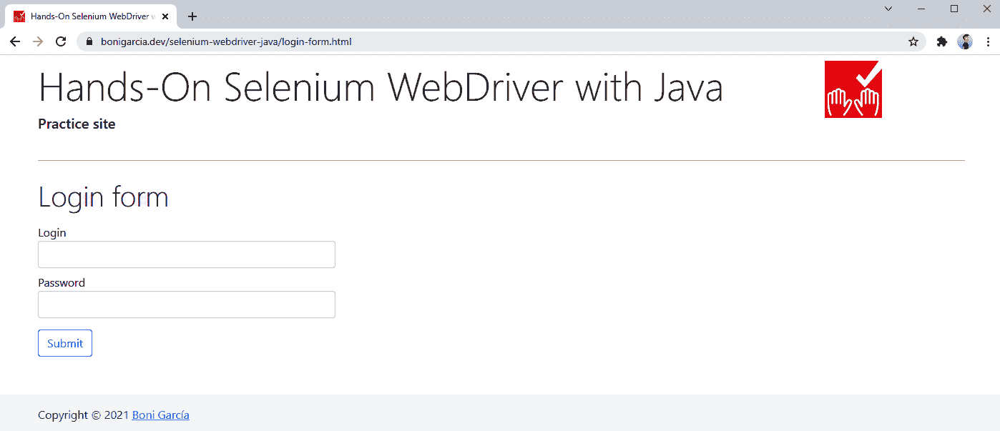

# 第七章：页面对象模型（POM）

*设计模式* 是软件工程中解决重复问题的可重用解决方案。本章介绍了页面对象模型（Page Object Model，POM），这是一种常用的设计模式，用于开发 Selenium WebDriver 测试。使用 POM 有不同的好处，例如提高可重用性和避免代码重复。POM 基于为单个存储库建模 SUT UI 的 *页面类*，稍后从测试逻辑中使用。

# 动机

使用 Selenium WebDriver 开发端到端测试的一些最大挑战是 *可维护性* 和 *不可靠性*。关于前者，问题可能发生在 SUT 的开发或演变过程中。对 UI 进行的更改可能导致现有的端到端测试失败。在具有大量测试用例且存在代码重复的大型测试套件中修复这些测试的维护成本可能是相关的（例如，在不同测试中重复使用相同的定位器时）。

关于不可靠性（即 flakiness），当测试在相同条件下（测试逻辑、输入数据、设置等）周期性地既通过又失败时，测试就是 *flaky* 的。在 Selenium WebDriver 测试中，测试不可靠性的两个主要原因是什么？首先，问题的根源可能是 SUT。例如，服务器端逻辑中的错误（例如，竞争条件）可能会在端到端测试中暴露出不稳定的行为。在这种情况下，开发人员和测试人员应该共同努力检测和解决问题，通常是修复服务器端错误。其次，问题可能出现在测试本身。这是测试人员应该避免的不良情况。有不同的策略可以预防 Selenium WebDriver 测试中的不可靠性，例如实施强大的定位器策略（以避免由于响应性或视口更改而导致的脆弱测试）或使用等待策略（以处理 Web 应用程序的分布式和异步特性，如 “等待策略” 中所解释的）。

利用像 POM 这样的设计模式可以帮助减少代码重复并增强可维护性问题。此外，我们可以使用 POM 来包含可重用的强大定位和等待策略。以下部分描述了如何执行 POM 设计模式。

###### 注意

POM 设计模式本身并不严格是测试不可靠性的解决方案。然而，如下文所述，它使得能够封装可重用的代码，从而防止测试的不可靠性。

# POM 设计模式

POM 设计模式的原则是将处理 UI 元素的逻辑与测试逻辑分离在单独的类（称为 *页面类*）中。换句话说，我们按照面向对象的范式对 SUT 的外观和行为进行建模，即 *页面对象*。然后，这些页面对象由 Selenium WebDriver 测试使用。

让我们看一个简单的例子来说明 POM。考虑包含登录表单的图 7-1，这个页面通常包含在练习站点上。示例 7-1 展示了使用*普通* Selenium WebDriver 的测试用例。在编程中，我们使用“普通”一词来指代未经定制的原始形式技术。在这种情况下，我们使用标准的 Selenium WebDriver API，本书的第二部分有详细解释。



###### 图 7-1\. 带有登录表单的练习网页

##### 示例 7-1\. 使用普通 Selenium WebDriver 实现成功登录的测试

```java
@Test
void testVanillaBasicLogin() {
    driver.get(
            "https://bonigarcia.dev/selenium-webdriver-java/login-form.html");

    driver.findElement(By.id("username")).sendKeys("user"); 
    driver.findElement(By.id("password")).sendKeys("user"); 
    driver.findElement(By.cssSelector("button")).click(); 

    assertThat(driver.findElement(By.id("success")).isDisplayed()).isTrue(); 
}
```


我们在网页表单中将单词`user`输入为用户名。


我们在网页表单中将相同的单词输入为密码。


我们点击提交按钮。


我们验证成功框是否显示。

这个测试是完全正确的，但是如果我们使用相同的网页实现额外的测试，可能会出现潜在的问题。例如，示例 7-2 展示了另一个使用普通 Selenium WebDriver 实现的测试用例，用于使用相同的网页表单执行负面测试（登录失败）。这个测试再次是正确的，但是与 示例 7-1 一起，我们重复了大部分定位网页元素的逻辑，只是使用了不同的输入数据和预期结果。这种做法违反了软件设计中最重要的原则之一：不要重复自己（DRY）。这是有问题的，因为在不同的地方使用相同的代码会使可维护性变得更加困难。

##### 示例 7-2\. 使用普通 Selenium WebDriver 实现失败登录的测试

```java
@Test
void testVanillaBasicLoginFailure() {
    driver.get(
            "https://bonigarcia.dev/selenium-webdriver-java/login-form.html");

    driver.findElement(By.id("username")).sendKeys("bad-user");
    driver.findElement(By.id("password")).sendKeys("bad-password");
    driver.findElement(By.cssSelector("button")).click();

    assertThat(driver.findElement(By.id("invalid")).isDisplayed()).isTrue();
}
```

## 页面对象

页面对象类允许将专注于 UI 的代码（如定位器和页面布局）与测试逻辑分离。我们可以将页面类视为一个单一的存储库，封装了被测试应用程序提供的操作或服务。这些类在不同的测试用例中作为*页面对象*实例化。我们可以使用这些对象中公开的方法来实现端到端测试，同时避免代码重复。

下面是使用页面对象的基本示例。在下面的示例中，我们重构了上一节中解释的测试（即使用登录表单），使用页面对象而不是普通的 Selenium WebDriver。第一步是创建一个 Java 类来模拟登录页面。示例 7-3 展示了这个页面类的一个非常基本的实现。

##### 示例 7-3\. 基本页面类，用于模拟练习登录表单

```java
public class BasicLoginPage {

    WebDriver driver; 

    By usernameInput = By.id("username"); 
    By passwordInput = By.id("password");
    By submitButton = By.cssSelector("button");
    By successBox = By.id("success");

    public BasicLoginPage(WebDriver driver) { 
        this.driver = driver;

        driver.get(
                "https://bonigarcia.dev/selenium-webdriver-java/login-form.html");
    }

    public void with(String username, String password) { 
        driver.findElement(usernameInput).sendKeys(username);
        driver.findElement(passwordInput).sendKeys(password);
        driver.findElement(submitButton).click();
    }

    public boolean successBoxPresent() { 
        return driver.findElement(successBox).isDisplayed();
    }

}
```


我们声明了一个`WebDriver`类属性。这个变量用于在页面对象中实现与网页的交互。


我们将所有必需的定位器声明为额外的属性。在这种情况下，我们定位用户名和密码的文本输入框、提交按钮以及成功框。


此页面类定义的构造函数接受`WebDriver`对象。我们使用构造函数加载测试中的页面。


我们声明一个方法来模拟进行登录所需的交互，即输入用户名和密码，然后点击提交按钮。


声明另一个方法来检查成功框是否可见。

现在，我们可以在测试用例中使用这个页面类。示例 7-4 展示了如何使用。请注意，在每个测试之前，像往常一样创建`WebDriver`实例，并在每个测试结束后退出它。我们将这个驱动程序作为页面类构造函数的参数使用。

##### 示例 7-4\. 使用基本页面类实现成功的登录

```java
class BasicLoginJupiterTest {

    WebDriver driver;
    BasicLoginPage login; 

    @BeforeEach
    void setup() {
        driver = WebDriverManager.chromedriver().create();
        login = new BasicLoginPage(driver); 
    }

    @AfterEach
    void teardown() {
        driver.quit();
    }

    @Test
    void testBasicLoginSuccess() {
        login.with("user", "user"); 
        assertThat(login.successBoxPresent()).isTrue(); 
    }

}
```


我们在测试类中将页面类声明为一个属性。


我们创建页面对象，传递`WebDriver`实例。


我们调用页面类定义的方法`with`来执行登录操作。


我们使用页面对象提供的方法验证结果网页上的成功框是否可用。

这种方法是改进测试可维护性的一个方便的起点，因为现在登录网页相关的所有逻辑都集中在一个可重用的类中。然而，页面类中的代码仍然很脆弱。例如，假设我们需要为登录页面实现一个负面测试，即使用错误的凭据进行登录尝试。给定页面类的当前实现，示例 7-5 似乎是一个合理的方法。然而，如果你运行这个测试，你会发现由于`NoSuchElementException`异常而导致测试失败。下一节将解释如何通过创建更健壮的页面对象来解决这个潜在问题。

##### 示例 7-5\. 使用基本页面类实现失败的登录

```java
@Test
void testBasicLoginFailure() {
    login.with("bad-user", "bad-password");
    assertThat(login.successBoxPresent()).isFalse();
}
```

## 健壮的页面对象

前文提到的示例提升了代码可维护性，因为页面操作封装在一个单独的类中，而不是散布在整个测试套件中。话虽如此，有多种方法可以增强之前的页面类实现。首先，我们的系统可能有多个网页，而不仅仅是一个。因此，一个常见的策略是采用面向对象的方法，创建一个*基础页面*类，封装所有页面类的通用逻辑。示例 7-6 展示了一个实现页面类典型基础的 Java 类。

##### 示例 7-6\. 页面类的基础类示例

```java
public class BasePage {

    static final Logger log = getLogger(lookup().lookupClass());

    WebDriver driver;
    WebDriverWait wait;
    int timeoutSec = 5; // wait timeout (5 seconds by default) 
    public BasePage(WebDriver driver) {
        this.driver = driver;
        wait = new WebDriverWait(driver, Duration.ofSeconds(timeoutSec)); 
    }

    public void setTimeoutSec(int timeoutSec) { 
        this.timeoutSec = timeoutSec;
    }

    public void visit(String url) { 
        driver.get(url);
    }

    public WebElement find(By element) {
        return driver.findElement(element);
    }

    public void click(By element) {
        find(element).click();
    }

    public void type(By element, String text) {
        find(element).sendKeys(text);
    }

    public boolean isDisplayed(By locator) { 
        try {
            wait.until(ExpectedConditions.visibilityOfElementLocated(locator));
        } catch (TimeoutException e) {
            log.warn("Timeout of {} wait for {}", timeoutSec, locator);
            return false;
        }
        return true;
    }

}
```


我们在基础类中定义了一个显式等待（`WebDriverWait`）属性。我们在构造函数中使用默认的超时值（例如本例中的五秒）实例化此属性。


我们创建了一个 setter 方法来更改等待超时的默认值。例如，根据系统响应时间，我们可能需要调整此超时。


我们创建了几个常用方法，页面类可以重用，例如`visit()`（打开网页）、`find()`（定位网页元素）或`type()`（向可写元素发送数据，例如输入字段）。


我们实现了一个方法来检查网页元素是否显示。请注意，此方法隐藏了等待此元素的复杂性，返回一个简单的布尔值，测试可以使用该值。

我们使用之前的基础类作为特定页面类的父类。例如，示例 7-7 展示了一个 Java 类，它扩展了这个基础类以实现页面类，使用练习站点中的登录示例页面。

##### 示例 7-7\. 使用前述基础类的登录页面类

```java
public class LoginPage extends BasePage {

    By usernameInput = By.id("username"); 
    By passwordInput = By.id("password");
    By submitButton = By.cssSelector("button");
    By successBox = By.id("success");

    public LoginPage(WebDriver driver, int timeoutSec) { 
        this(driver);
        setTimeoutSec(timeoutSec);
    }

    public LoginPage(WebDriver driver) { 
        super(driver);
        visit("https://bonigarcia.dev/selenium-webdriver-java/login-form.html");
    }

    public void with(String username, String password) { 
        type(usernameInput, username);
        type(passwordInput, password);
        click(submitButton);
    }

    public boolean successBoxPresent() { 
        return isDisplayed(successBox);
    }

}
```


我们将页面定位器定义为类属性。


我们定义了一个构造函数，带有两个参数：`WebDriver`对象和超时值（以秒为单位）。


我们定义另一个构造函数，用于打开测试中的网页。


我们包括了一个方法，使用用户名和密码作为凭证进行登录。此方法使用了父类中定义的`type()`和`click()`方法。


我们还包括了另一个方法来检查成功框是否可见（使用基础类中定义的`isDisplayed()`方法）。

最后，我们可以使用页面类来实现一个 Selenium WebDriver 测试。示例 7-8 展示了使用 JUnit 5 进行的测试（通常情况下，你可以在 [示例库](https://github.com/bonigarcia/selenium-webdriver-java) 中找到 JUnit 4、TestNG 和 Selenium-Jupiter 版本）。

##### 示例 7-8\. 使用页面类实现成功和失败登录的测试

```java
class LoginJupiterTest {

    WebDriver driver;
    LoginPage login;

    @BeforeEach
    void setup() {
        driver = WebDriverManager.chromedriver().create();
        login = new LoginPage(driver); 
    }

    @AfterEach
    void teardown() {
        driver.quit();
    }

    @Test
    void testLoginSuccess() {
        login.with("user", "user");
        assertThat(login.successBoxPresent()).isTrue();
    }

    @Test
    void testLoginFailure() {
        login.with("bad-user", "bad-password");
        assertThat(login.successBoxPresent()).isFalse(); 
    }

}
```


我们在每个测试之前实例化页面对象。


由于页面类逻辑健壮，我们可以调用 `successBoxPresent()` 来实现一个负面测试。此方法在内部实现了对网页元素的显式等待，当成功框未显示时最终返回 `false`。

# 创建一个领域特定语言（DSL）

在我们模拟 SUT 的过程中，我们可以通过使用页面类创建一个完整的领域特定语言（DSL）。在计算中，DSL 是针对特定领域的专门语言。当使用 POM 和 Selenium WebDriver 时，我们可以将 DSL 视为封装所有 SUT 操作和服务的方法在页面类提供的简单易读的 API 中。这些类封装了与 SUT 交互的所有调用 Selenium WebDriver API 的操作。

在前面章节展示的示例继续进行，示例 7-9 展示了一个基于 DSL 方法的登录页面基础页面类。这个基础类与 示例 7-6 非常相似，但在这种情况下，该类还封装了创建 `WebDriver` 实例所需的逻辑。

##### 示例 7-9\. 遵循 DSL 方法的基础类示例

```java
public class ExtendedBasePage {

    static final Logger log = getLogger(lookup().lookupClass());

    WebDriver driver;
    WebDriverWait wait;
    int timeoutSec = 5; // wait timeout (5 seconds by default) 
    public ExtendedBasePage(String browser) { 
        driver = WebDriverManager.getInstance(browser).create(); 
        wait = new WebDriverWait(driver, Duration.ofSeconds(timeoutSec));
    }

    public void setTimeoutSec(int timeoutSec) {
        this.timeoutSec = timeoutSec;
    }

    public void quit() { 
        if (driver != null) {
            driver.quit();
        }
    }

    // Rest of common methods: quit(), visit(URL url), find(By element), etc. 
}
```


我们在基础构造函数中声明了一个 `String` 参数。这个字符串将是测试中指定的浏览器名称。


我们使用 WebDriverManager 解析所需的驱动程序并创建 `WebDriver` 实例。如 “通用管理器” 所述，WebDriverManager 允许通过调用 `getInstance()` 方法使用参数化管理器。在这种情况下，我们使用浏览器名称（例如 `chrome,` `firefox,` 等）来选择管理器。


我们还封装了一个用于结束会话和关闭浏览器的方法。

示例 7-10 展示了扩展此基类的页面类。如你所见，与 示例 7-7 的唯一区别是，此页面类在构造函数中使用了一个字符串参数（浏览器名称）。

##### 示例 7-10\. 遵循 DSL 方法的登录页面类

```java
public class ExtendedLoginPage extends ExtendedBasePage {

    By usernameInput = By.id("username");
    By passwordInput = By.id("password");
    By submitButton = By.cssSelector("button");
    By successBox = By.id("success");

    public ExtendedLoginPage(String browser, int timeoutSec) {
        this(browser);
        setTimeoutSec(timeoutSec);
    }

    public ExtendedLoginPage(String browser) {
        super(browser);
        visit("https://bonigarcia.dev/selenium-webdriver-java/login-form.html");
    }

    public void with(String username, String password) {
        type(usernameInput, username);
        type(passwordInput, password);
        click(submitButton);
    }

    public boolean successBoxPresent() {
        return isDisplayed(successBox);
    }

}
```

最后，示例 7-11 展示了结果测试。请注意，此测试不包含任何对 Selenium WebDriver 或 WebDriverManager 的单个调用。页面类封装了与浏览器交互的所有低级细节，并公开了测试中使用的高级可读 API。

##### 示例 7-11\. 使用 POM 并遵循 DSL 方法的测试用例

```java
class ExtendedLoginJupiterTest {

    ExtendedLoginPage login;

    @BeforeEach
    void setup() {
        login = new ExtendedLoginPage("chrome"); 
    }

    @AfterEach
    void teardown() {
        login.quit(); 
    }

    @Test
    void testLoginSuccess() {
        login.with("user", "user");
        assertThat(login.successBoxPresent()).isTrue();
    }

    @Test
    void testLoginFailure() {
        login.with("bad-user", "bad-password");
        assertThat(login.successBoxPresent()).isFalse();
    }

}
```


我们实例化页面对象，只需指定要使用的浏览器类型（在本例中为`chrome`）。


每次测试后，我们通常会终止浏览器会话，但这次是使用页面对象提供的一个方法。

# 页面工厂

Page Factory 是 Selenium WebDriver API 提供的几个支持类的名称，以便于实现页面对象类。其中最相关的支持类包括：

`FindBy`

在属性级别使用的注解，用于识别页面中的网页元素。

`FindAll`

允许组合不同`@FindBy`定位器的注解。

`PageFactory`

用于使用`@FindBy`（和`@FindAll`）初始化之前声明的所有网页元素的类。

`CacheLookup`

使用`@FindBy`注解来定位网页元素的一个缺点是，每次使用定位器时，驱动程序都会尝试在当前页面上找到它。这个特性在动态网页应用程序中非常有用。但是，在静态网页应用程序中缓存网页元素将是有帮助的。因此，`@CacheLookup`注解允许在定位到网页元素后对其进行缓存，提高生成测试的性能。

示例 7-12 展示了一个使用这些 Selenium WebDriver 支持类的页面类。您可以在存储库对象中找到使用这个页面类的结果测试。这个测试等同于示例 7-11，但使用`FactoryLoginPage`而不是`ExtendedLoginPage`与登录页面进行交互。

##### 示例 7-12\. 使用 Selenium WebDriver 提供的 Page Factory 的类

```java
public class FactoryLoginPage extends ExtendedBasePage {

    @FindBy(id = "username")
    @CacheLookup
    WebElement usernameInput; 

    @FindBy(id = "password")
    @CacheLookup
    WebElement passwordInput;

    @FindBy(css = "button")
    @CacheLookup
    WebElement submitButton;

    @FindBy(id = "success")
    @CacheLookup
    WebElement successBox;

    public FactoryLoginPage(String browser, int timeoutSec) {
        this(browser);
        setTimeoutSec(timeoutSec);
    }

    public FactoryLoginPage(String browser) {
        super(browser);
        PageFactory.initElements(driver, this); 
        visit("https://bonigarcia.dev/selenium-webdriver-java/login-form.html");
    }

    // Same logic to the page class without using the page factory 
}
```


我们使用`WebElement`类型声明页面上的网页元素，并用两个注解修饰：

`@FindBy`

以指定的定位器（例如`id`和`css`）来说明。

`@CacheLookup`

用于缓存网页元素位置结果（因为网页是静态的，在不同调用中其内容不会改变）。


我们调用`initElements`方法，使用`WebDriver`实例来定位网页元素。

###### 警告

当使用 Selenium WebDriver 测试的网页是静态的时，只建议使用 Page Factory 方法。当使用动态网页时，此方法可能会导致不良影响，如过时的网页元素（即旧的或不再可用的元素）。

# 摘要与展望

本章详细介绍了在 Selenium WebDriver 测试中使用的页面对象模型（Page Object Model，POM）。POM 是一种设计模式，通过它我们将与网页交互的逻辑和测试代码分开。这样，*页面类* 包含了与网页定位和页面布局相关的逻辑，而测试类则确定如何执行和验证系统的被测单元（SUT）。POM 模式提升了基于 Selenium WebDriver 的测试套件的可维护性，因为页面类存储在一个单一的库中，模拟了 SUT。这个库稍后可以在不同的测试用例中使用。我们可以通过适当的定位和等待策略创建健壮的网页。

下一章介绍了使用的单元测试框架（JUnit、TestNG 和 Selenium-Jupiter）的具体方面，以改进 Selenium WebDriver 的整体测试流程。这些特性允许创建参数化测试（用于跨浏览器测试）、对测试进行分类（用于测试过滤）、对测试进行排序和重试，或者并行执行测试。
