# 第十章：超越 Selenium

本章通过介绍几种与 Selenium 互补的技术来结束本书。首先，我们分析了移动应用程序的基础并介绍了 Appium，这是一个流行的用于移动测试的测试框架。然后，您将学习如何使用名为 REST Assured 的开源 Java 库测试 REST（表现状态转移）服务。最后，您将介绍用于实施 Web 应用程序端到端测试的 Selenium WebDriver 的替代工具，即：Cypress、WebDriverIO、TestCafe、Puppeteer 和 Playwright。

# 移动应用程序

移动应用程序（通常称为移动应用程序或简称为应用程序）是专为运行在移动设备上设计的软件应用程序，例如智能手机、平板电脑或可穿戴设备。移动设备的两个主要操作系统为：

[安卓](https://www.android.com)

基于修改版 Linux 的开源（Apache 2.0 许可）移动操作系统。最初由名为 Android 的初创公司开发，于 2005 年被 Google 收购。

[iOS](https://www.apple.com/ios)

由苹果专门为其硬件（例如 iPhone、iPad 或 Watch）创建的专有移动操作系统。

对移动应用程序进行分类的一种常见方式如下：

本地应用程序

针对特定移动操作系统（例如 Android 或 iOS）开发的移动应用程序。

基于 Web 的应用程序

在移动浏览器（例如 Chrome、Safari 或 Firefox Mobile）中渲染的 Web 应用程序。这些应用程序通常设计为 *响应式*（即可适应不同的屏幕大小和视口）。

混合应用程序

使用客户端 Web 标准（即 HTML、CSS 和 JavaScript）开发的移动应用程序，并使用称为 *webview* 的本地容器部署到移动设备上。支持混合应用程序开发的框架示例包括 [Ionic](https://ionicframework.com)、[React Native](https://reactnative.dev) 或 [Flutter](https://flutter.dev)。

渐进式 Web 应用程序（PWA）

使用现代 Web 标准 API 构建的 Web 应用程序（用于可安装性、响应性等），旨在在多个平台上运行，包括桌面和移动设备。

## 移动测试

测试是移动应用程序开发中的重要流程。移动测试涉及诸如硬件兼容性、网络连接性或操作系统特定性等不同挑战。执行移动测试的不同方法包括：

使用桌面浏览器进行移动仿真

我们可以使用 Selenium WebDriver 进行此类移动测试。为此，您可以使用特定于浏览器的功能（如“设备仿真”中所述），或者使用基于 Chromium 的浏览器中的 CDP（如“设备仿真”中所述）。

使用虚拟设备

有两种类型的虚拟移动设备：

模拟器

桌面应用程序，虚拟化移动设备的所有方面，包括硬件和操作系统。

模拟器

模仿移动操作系统某些功能的桌面应用程序。它们主要用于 iOS，因为 Android 设备很容易模拟。

使用真实设备

使用实际设备及其在真实条件下的本机 Android 或 iOS API。

## Appium

[Appium](https://appium.io) 是一个用于移动应用的开源测试自动化框架。Appium 提供了一个跨平台的 API，允许在虚拟或真实设备上测试 iOS 和 Android 的本地、混合和移动 Web 应用程序。此外，Appium 还能够在 Windows 和 macOS 上对桌面应用程序进行自动化测试。

Appium 的故事始于 2011 年，当时 Dan Cuellar 创建了一个名为 iOSAuto 的用于 C# 开发的 iOS 应用程序自动化工具。他在 2012 年的伦敦 SeleniumConf 上遇到了 Selenium 的共同创始人 Jason Huggins。Jason 通过添加一个 Web 服务器，并使用基于 HTTP 的 WebDriver wire 协议，使 iOSAuto 兼容任何 Selenium WebDriver 客户端。他们将项目更名为 Appium（*适用于应用程序的 Selenium*）。2013 年 1 月，Sauce Labs 决定支持 Appium 并提供更多开发者力量。新团队使用 Node.js 重写了 Appium，因为它是服务器端的知名高效框架。

如 图 10-1 所示，Appium 遵循客户端-服务器架构。Appium 是一个 Web 服务器，暴露了一个 REST API，用于在移动或桌面应用上执行自动化会话。因此，Appium 服务器接收来自客户端的传入请求，在目标设备/应用上执行这些命令，并以 HTTP 响应形式返回代表命令执行结果的信息。Appium 客户端库使用移动 JSON Wire Protocol（作为原始 WebDriver 协议的官方扩展草案）。Appium 服务器及其客户端还使用 W3C WebDriver 规范。Appium 项目和社区维护了不同的 Appium 客户端库。表 10-1 总结了这些官方维护的和社区维护的库。

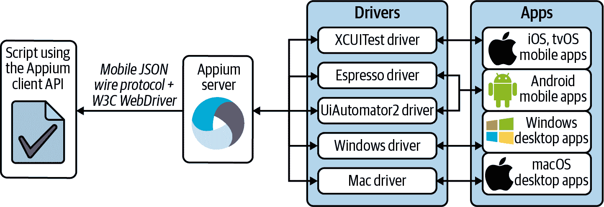

###### 图 10-1\. Appium 架构

表格 10-1\. Appium 客户端库

| 名称 | 语言 | 许可证 | 维护者 | 网站 |
| --- | --- | --- | --- | --- |
| Appium java-client | Java | Apache 2.0 | Appium 团队 | [*https://github.com/appium/java-client*](https://github.com/appium/java-client) |
| Appium ruby_lib | Ruby | Apache 2.0 | Appium 团队 | [*https://github.com/appium/ruby_lib*](https://github.com/appium/ruby_lib) |
| Appium Python 客户端 | Python | Apache 2.0 | Appium 团队 | [*https://github.com/appium/python-client*](https://github.com/appium/python-client) |
| appium-dotnet-driver | C# | Apache 2.0 | Appium 团队 | [*https://github.com/appium/appium-dotnet-driver*](https://github.com/appium/appium-dotnet-driver) |
| WebdriverIO | JavaScript（Node.js） | MIT | WebdriverIO 团队 | [*https://webdriver.io*](https://webdriver.io) |
| web2driver | JavaScript（浏览器） | Apache 2.0 | HeadSpin | [*https://github.com/projectxyzio/web2driver*](https://github.com/projectxyzio/web2driver) |
| RobotFramework 的 Appium 库 | Python | Apache 2.0 | Serhat Bolsu | [*https://github.com/serhatbolsu/robotframework-appiumlibrary*](https://github.com/serhatbolsu/robotframework-appiumlibrary) |

在 Appium 中，对特定平台的自动化支持是由 Appium 行话中称为 *driver* 的组件提供的。这些驱动程序在版本 1 中与 Appium 服务器紧密耦合。然而，在本文撰写时的最新版本 Appium 2 中，这些驱动程序与 Appium 服务器分开（参见 图 10-1）并单独安装。

Appium 驱动程序表格 10-2

| 名称 | 目标 | 描述 | 存储库 |
| --- | --- | --- | --- |
| XCUITest 驱动程序 | iOS 和 tvOS 应用程序 | 利用 Apple 的 XCUITest 库实现自动化 | [*https://github.com/appium/appium-xcuitest-driver*](https://github.com/appium/appium-xcuitest-driver) |
| Espresso 驱动程序 | Android 应用程序 | 通过 Espresso（Android 的测试框架）实现自动化 | [*https://github.com/appium/appium-espresso-driver*](https://github.com/appium/appium-espresso-driver) |
| UiAutomator2 驱动程序 | Android 应用程序 | 利用 Google UiAutomator2 技术在 Android 设备或模拟器上实现自动化 | [*https://github.com/appium/appium-uiautomator2-driver*](https://github.com/appium/appium-uiautomator2-driver) |
| Windows 驱动程序 | Windows 桌面应用程序 | 使用 WinAppDriver，Windows 桌面应用程序的 WebDriver 服务器 | [*https://github.com/appium/appium-windows-driver*](https://github.com/appium/appium-windows-driver) |
| Mac 驱动程序 | macOS 桌面应用程序 | 使用 Apple 的 XCTest 框架自动化 macOS 应用程序 | [*https://github.com/appium/appium-mac2-driver*](https://github.com/appium/appium-mac2-driver) |

### 一个基本的 Appium 测试

本节介绍了使用 Appium 服务器 2 和 Appium Java 客户端的基本测试用例。为了简单起见，我使用了 UiAutomator2 驱动程序和一个模拟的 Android 设备。SUT 将是一个 Web 应用程序，具体来说，是本书中始终使用的练习站点。对 Appium Java 客户端的调用嵌入在其他示例中使用的不同单元测试框架中（即 JUnit 4 和 5、TestNG 和 Selenium-Jupiter）。如往常一样，您可以在示例存储库中找到完整的源代码。运行此测试的要求如下：

1.  安装 Appium 服务器 2。

1.  安装 UiAutomator2 驱动程序。

1.  安装 Android SDK（即 Android 的官方软件开发工具包）。您可以通过在计算机上安装[Android Studio](https://developer.android.com/studio)来轻松安装此 SDK。

1.  使用 Android Studio 中的 AVD 管理器创建 Android 虚拟设备（AVD）。图 10-2 显示了打开此工具的菜单选项，图 10-3 显示了测试中使用的虚拟设备（使用 Android API 级别 30 的 Nexus 5 手机）。

1.  启动虚拟设备和 Appium 服务器。

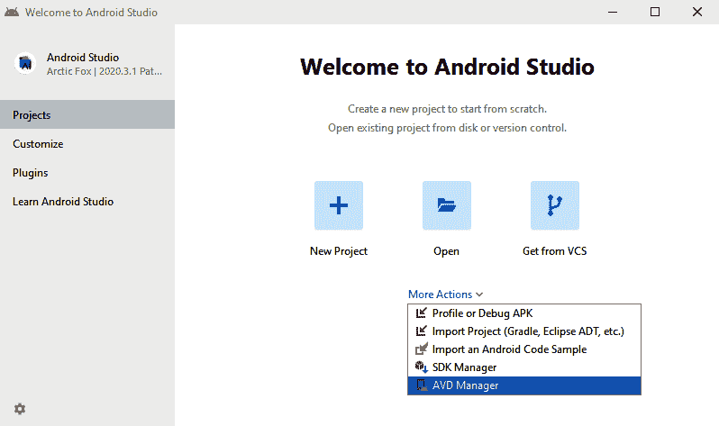

###### 图 10-2\. Android Studio

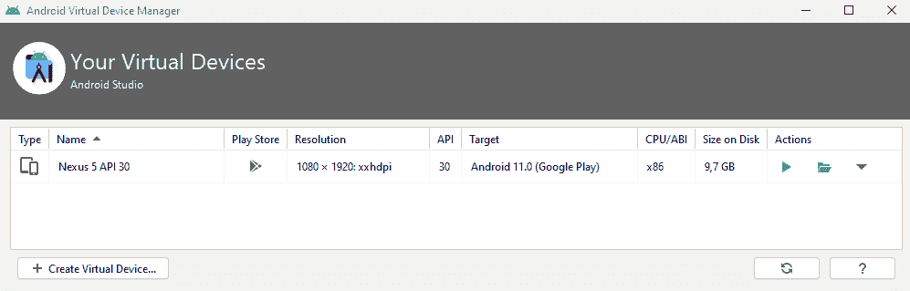

###### 图 10-3\. AVD 管理器

如前所述，Appium 服务器是一个 Node.js 应用程序。因此，您需要在系统中安装 Node.js 才能运行 Appium。以下命令概述了如何安装 Appium 服务器 2 和 UiAutomator2 驱动程序，以及如何启动 Appium 服务器：

```java
npm install -g appium@next 
appium driver install uiautomator2 
appium --allow-insecure chromedriver_autodownload 
```


我们使用 npm（Node.js 的默认软件包管理器）安装 Appium 2。


我们使用 Appium 安装 UiAutomator2 驱动程序。


我们启动 Appium 服务器（默认情况下，它监听端口 4723）。我们包含一个标志，让 Appium 管理所需的浏览器驱动程序（例如，chromedriver）以自动化 Web 应用程序（就像在 Selenium WebDriver 中一样）。

示例 10-1 展示了使用 Appium Java 客户端进行完整测试的示例。正如你所见，这个测试与本书中解释的常规 Selenium WebDriver 测试非常相似。在这种情况下的主要区别是，我们使用了 `AppiumDriver` 的一个实例，这是 Appium Java 客户端提供的一个类。该类扩展了 Selenium WebDriver API 的 `RemoteWebDriver` 类。因此，我们可以利用 Selenium WebDriver API 来测试移动设备上的 Web 应用程序。图 10-4 展示了在此测试期间的模拟移动设备（Nexus 5）。

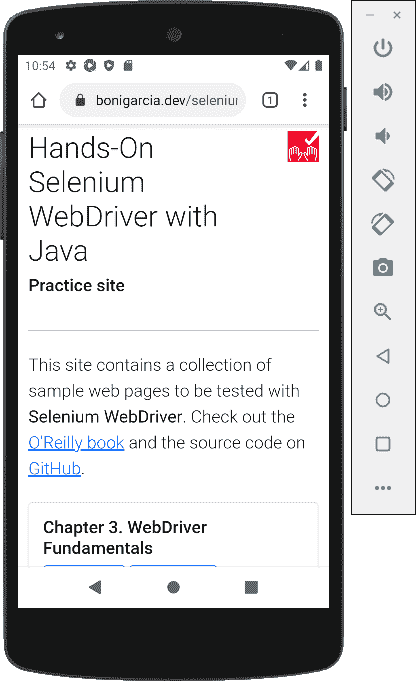

###### 图 10-4\. Android 设备

##### 示例 10-1\. 使用 Appium Java 客户端进行测试

```java
class AppiumJupiterTest {

    WebDriver driver;

    @BeforeEach
    void setup() throws MalformedURLException {
        URL appiumServerUrl = new URL("http://localhost:4723"); 
        assumeThat(isOnline(new URL(appiumServerUrl, "/status"))).isTrue(); 

        ChromeOptions options = new ChromeOptions(); 
        options.setCapability(MobileCapabilityType.PLATFORM_NAME, "Android"); 
        options.setCapability(MobileCapabilityType.DEVICE_NAME,
                "Nexus 5 API 30"); 
        options.setCapability(MobileCapabilityType.AUTOMATION_NAME,
                "UiAutomator2"); 

        driver = new AppiumDriver(appiumServerUrl, options); 
    }

    @AfterEach
    void teardown() {
        if (driver != null) {
            driver.quit();
        }
    }

    @Test
    void testAppium() {
        driver.get("https://bonigarcia.dev/selenium-webdriver-java/"); 
        assertThat(driver.getTitle()).contains("Selenium WebDriver");
    }

}
```


我们指定了 Appium 服务器 URL。


我们假设使用 Appium 服务器 URL 的端点 `/status`。如果此 URL 不在线，则跳过测试。


我们使用 Chrome 选项来指定功能。


使用 Appium 时的第一个强制性功能是平台名称（在本例中为 `Android`）。


以下是设备名称。此名称必须与 AVD 管理器中定义的名称匹配（参见 图 10-3）。


最后一个强制性功能是驱动程序名称（在本例中为 `UiAutomator2`）。


我们使用 Appium 服务器 URL 和浏览器选项创建了一个 `AppiumDriver` 的实例。


我们像往常一样使用 `driver` 对象来执行 SUT。

# REST 服务

REST（表现状态转移）是一种用于设计分布式服务的架构风格。Roy Fielding 在他的 2000 年博士论文中创造了这个术语。REST 是在 HTTP 协议之上创建 Web 服务的流行方式。

REST 遵循客户端-服务器架构。服务器处理一组*资源*，监听客户端发出的传入请求。这些资源是 REST 服务的构建块，并定义了传输的信息类型。每个资源都有唯一的标识。在 HTTP 中，我们使用 URL（也称为*端点*）来访问单个资源。每个资源都有一个表示形式，即资源当前状态的机器可读说明。我们使用数据交换格式来定义表示，如 JSON、YAML 或 XML。REST 服务公开一组对资源执行的*操作*，例如 CRUD（创建、检索、更新和删除）。我们可以使用 HTTP 方法（也称为*动词*）来映射 REST 操作。表 10-3 总结了用于创建 REST 服务的 HTTP 方法。最后，我们可以使用 HTTP 状态码来识别与 REST 操作相关联的响应。表 10-4 总结了在 REST 中使用的典型 HTTP 状态码。图 10-5 显示了一个示例 REST 服务的请求和响应序列，该服务使用了不同的 HTTP 方法和响应代码。

表 10-3\. 用于创建 REST 服务的 HTTP 方法

| HTTP 方法 | 描述 |
| --- | --- |
| `GET` | 读取资源 |
| `POST` | 将新资源发送到服务器 |
| `PUT` | 更新资源 |
| `DELETE` | 删除资源 |
| `PATCH` | 部分更新资源 |
| `HEAD` | 询问给定资源是否存在，而不返回其任何表示形式 |
| `OPTIONS` | 检索给定资源的可用动词 |

表 10-4\. 用于创建 REST 服务的 HTTP 状态码

| 状态码 | 描述 |
| --- | --- |
| `200 OK` | 请求成功，返回请求的内容（例如在 `GET` 请求中）。 |
| `201 Created` | 已创建资源（例如在 `POST` 或 `PUT` 请求中）。 |
| `204 No content` | 操作成功，但未返回内容。此状态码在不需要响应主体的操作中很有用（例如在 DELETE 请求中）。 |
| `301 Moved permanently` | 资源已移动到另一个位置。 |
| `400 Bad request` | 请求存在问题（例如，缺少参数）。 |
| `401 Unauthorized` | 请求的资源对于发出请求的用户不可访问。 |
| `403 Forbidden` | 资源不可访问，但与 `401` 不同，身份验证不会影响响应。 |
| `404 Not found` | 提供的端点未标识任何资源。 |
| `405 Method not allowed` | 不允许使用的动词（例如在只读资源中使用 `PUT`）。 |
| `500 Internal server error` | 服务器端发生一般性意外情况。 |

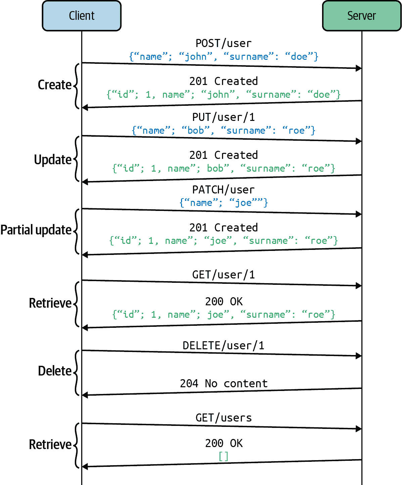

###### Figure 10-5\. REST 服务示例

## REST Assured

REST API 是无处不在的。通常情况下，强烈建议为验证这些服务实现自动化测试，例如使用 [REST Assured](https://rest-assured.io)。REST Assured 是一个流行的开源（Apache 2.0 许可）Java 库，用于测试 REST 服务。它提供了一个流畅的 API 用于测试和验证 REST 服务。使用 REST Assured 创建可读断言的便捷方法是生成 POJOs（Plain Old Java Objects），将 REST 响应（例如 JSON 格式）映射为 Java 类。然后，我们可以使用像 AssertJ 这样的库，通过这些 POJOs 的访问器（即 getter 方法）来验证预期条件。示例 Example 10-2 展示了使用这种方法的测试用例。示例 Example 10-3 包含了此测试中使用的 POJO。

##### Example 10-2\. 使用 REST Assured 进行测试

```java
class RestJupiterTest {

    @Test
    void testRest() {
        HttpBinGet get = RestAssured.get("https://httpbin.org/get").then()
                .assertThat().statusCode(200).extract().as(HttpBinGet.class); 

        assertThat(get.getHeaders()).containsKey("Accept-Encoding"); 
        assertThat(get.getOrigin()).isNotBlank(); 
    }

}
```


我们使用 REST Assured 使用 `GET` HTTP 方法请求在线公共 REST 服务。此行还验证了预期的状态码（`200`），并将响应有效负载（以 JSON 形式）转换为 Java 类（如示例 Example 10-3 所示）。


我们断言头部列表（使用相应的访问器方法）包含给定的键值对。


我们断言原点不为空。

##### Example 10-3\. 用于测试 REST 服务的 POJO 类

```java
public class HttpBinGet {

    public Map<String, String> args; 
    public Map<String, String> headers;
    public String origin;
    public String url;

    // Getters and setters 

}
```


此 POJO 定义了一组属性，用于将 JSON 响应有效载荷映射到 Java 中。


我们为每个类属性定义访问器（getter）和修改器（setter）。现代 IDE 允许从类属性自动生成这些方法。

# Selenium 的替代方案

Selenium 目前是实现端到端测试的领先技术。尽管如此，它并非唯一的可用选择。本节提供了其他框架和库的概述，这些框架和库同样允许为 Web 应用程序实现端到端测试。此外，以下小节还审视了每个这些替代方案的主要优缺点。在我看来，Selenium 仍然是端到端测试的参考解决方案，因为它是为促进 Web 标准（即 W3C WebDriver 和 WebDriver BiDi）而构建，以支持自动化过程，从而确保跨浏览器兼容性。

## Cypress

[Cypress](https://www.cypress.io) 是一个 JavaScript 端到端自动化测试框架。如 Figure 10-6 所示，Cypress 架构包括一个 Node.js 进程以及在浏览器中执行的 *Test Runner* 工具。

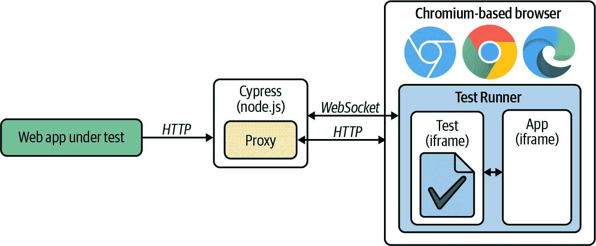

###### Figure 10-6\. Cypress 架构

测试运行器是一个交互式的 Web 应用，它包含基于 [Mocha](https://mochajs.org)（一个 JavaScript 单元测试框架）的测试和被测试的 Web 应用作为两个 iframe。测试代码和应用程序代码在同一个浏览器标签页中运行（即在同一个 JavaScript 循环中）。Node.js 进程使用 WebSocket 与测试运行器进行通信。最后，Node.js 进程是测试运行器和被测试的 Web 应用之间 HTTP 流量的代理。

Cypress 测试运行器是开源的，根据 MIT 许可证授权。Cypress 团队还提供商业支持以获取高级功能。其中之一是 Cypress Dashboard，一个云管理的 Web 应用，用于跟踪在测试运行器中执行的测试。表格 10-5 总结了 Cypress 的一些最相关的优缺点。

表格 10-5\. Cypress 的优缺点

| 优点 | 缺点 |
| --- | --- |

|

+   自动等待和快速执行，因为测试和应用程序在同一个浏览器中运行。

+   实时重载（测试运行器自动跟踪测试中的变化）

|

+   仅支持一些浏览器：Firefox 和基于 Chromium 的浏览器（包括 Chrome、Edge 和 Electron），但不支持其他浏览器如 Safari 或 Opera。

+   由于应用程序在浏览器 iframe 中执行，某些操作是不允许的（例如驱动不同的浏览器或多个标签页）。

|

以下命令展示如何在本地安装 Cypress 并执行它。执行完这些命令后，你会看到 Cypress 的 GUI（类似于 图 10-7）。你可以使用这个 GUI 来执行 Cypress 的测试。

```java
npm install cypress 
npx cypress open 
```


我们可以使用 `npm`（Node.js 中的默认包管理器）来安装 Cypress。


我们可以使用 `npx`（一个 `npm` 包运行器）来运行 Cypress 进程。

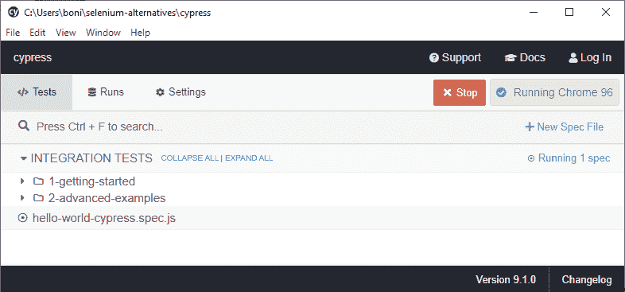

###### 图 10-7\. Cypress GUI

在 Cypress GUI 中，默认情况下可以在 `1-getting-started` 和 `2-advanced-examples` 文件夹中找到入门测试示例。此外，我们可以使用 New Spec File 按钮创建新的测试。例如，示例 10-4 展示了使用 Cypress 的全新基础测试（即 Cypress 中的 *hello world*）。这个测试被称为 `hello-world-cypress.spec.js`（默认在 Mocha 测试中使用 `.spec.js` 扩展名），并存储在 Cypress 安装路径的 `cypress/integration` 中。图 10-8 展示了在执行此测试时的 Cypress 测试运行器的截图。

##### 示例 10-4\. 使用 Cypress 进行的 Hello world 测试

```java
describe('Hello World with Cypress', () => {
   it('Login in the practice site', () => {
      cy.visit('https://bonigarcia.dev/selenium-webdriver-java/login-form.html') 

      cy.get('#username').type('user') 
      cy.get('#password').type('user')
      cy.contains('Submit').click() 
      cy.contains('Login successful') 

      cy.screenshot("hello-world-cypress") 
  })
})
```


我们在实践站点中打开登录页面。


我们输入正确的凭据（用户名和密码）。


我们点击提交按钮。


我们验证结果页面包含成功登录的消息。


我们进行浏览器截图。

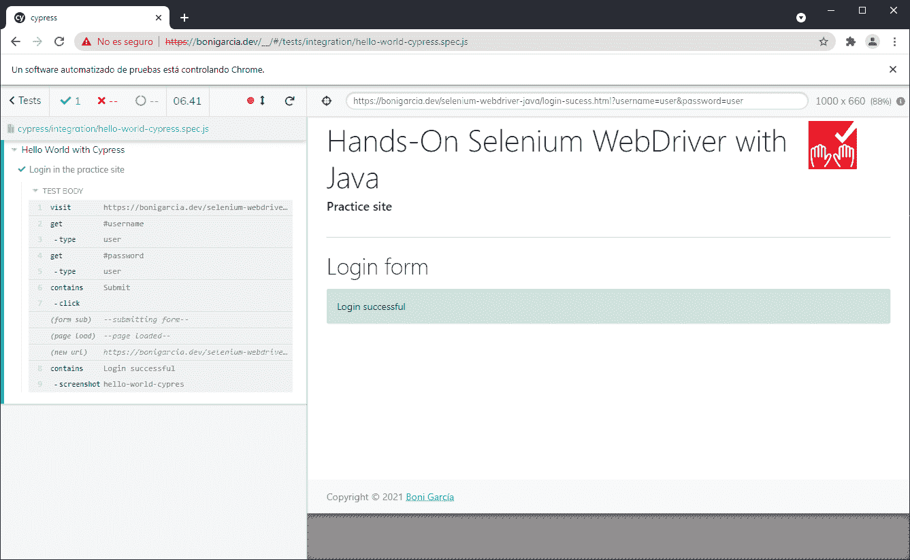

###### 图 10-8\. Cypress 测试运行器

## WebDriverIO

[WebDriverIO](https://webdriver.io)是用于 Web 和移动应用程序的自动化测试框架。它完全开源（MIT 许可证），基于诸如 W3C WebDriver 协议之类的 Web 标准。图 10-9 展示了它的架构。WebDriverIO 是用 JavaScript 编写的，运行在 Node.js 上。它使用几个*服务*来支持自动化：chromedriver（用于本地 Chrome 浏览器）、Selenium Server（用于其他浏览器）、Appium Server（用于移动设备）、Chrome DevTools（用于使用 CDP 的基于 Chromium 的本地浏览器）以及云提供商（如 Sauce Labs、BrowserStack 或 TestingBot）。这些服务操作相应的浏览器和移动设备。表 10-6 总结了 WebDriverIO 的一些优缺点。

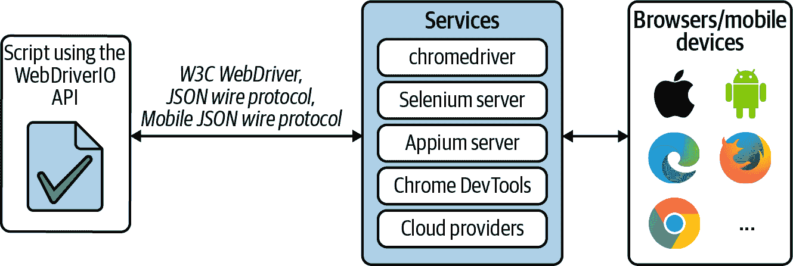

###### 图 10-9\. WebDriverIO 架构

表格 10-6\. WebDriverIO 的优缺点

| 优点 | 缺点 |
| --- | --- |

|

+   支持多个浏览器和移动设备

+   适用于不同的测试和报告框架

+   基于 Web 标准

|

+   仅支持 JavaScript

|

下面的`npm`命令在本地安装 WebDriverIO。此安装程序显示一个命令行向导，询问几个选项，例如服务（chomedriver、Selenium Server、Appium Server、CDP 或云提供商）、测试框架（Mocha、Jasmine 或 Cucumber）或报告工具（JUnit 或 Allure 等）：

```java
npm init wdio .
```

当前命令完成后，我们可以创建自定义测试。例如，示例 10-5 展示了一个基本的使用 Mocha 的 WebDriverIO 测试。我们将此测试放在项目脚手架的`test`文件夹下，并通过以下命令运行它：

```java
npx wdio run ./wdio.conf.js
```

##### 示例 10-5\. 使用 WebDriverIO 的 Hello world 测试

```java
describe('Hello World with WebDriverIO', () => {
   it('Login in the practice site', async () => {
      await browser.url(
            `https://bonigarcia.dev/selenium-webdriver-java/login-form.html`);

      await $('#username').setValue('user');
      await $('#password').setValue('user');
      await $('button[type="submit"]').click();
      await expect($('#success')).toHaveTextContaining('Login successful');
      await browser.saveScreenshot('hello-world-webdriverio.png');
    });
});
```

## TestCafe

[TestCafe](https://testcafe.io)是一个开源的跨浏览器自动化测试工具（MIT 许可证）。TestCafe 的核心思想是避免使用外部驱动程序来支持自动化过程，而是使用混合的客户端-服务器架构模拟用户操作（参见图 10-10）。服务器端采用 Node.js 实现，并包含一个*代理*，用于拦截与测试中的 Web 应用程序的 HTTP 流量。TestCafe 测试也是作为 Node.js 脚本编写并在服务器端执行的。在浏览器中测试页上运行模拟用户活动的*自动化脚本*在客户端上运行。表 10-7 总结了 TestCafe 的一些优势和局限性。

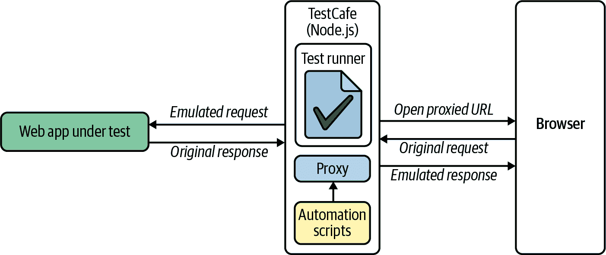

###### 图 10-10\. TestCafe 架构

表格 10-7\. TestCafe 优缺点

| 优点 | 缺点 |
| --- | --- |

|

+   完全跨浏览器支持（由于 TestCafe 仅启动浏览器，因此可以自动化任何浏览器）

|

+   仅支持 JavaScript 和 TypeScript

+   由于 JavaScript 的限制，某些操作无法自动化

|

我们可以使用 `npm` 轻松安装 TestCafe。然后，我们可以使用 TestCafe CLI 工具从命令行运行 TestCafe 脚本。以下代码段说明了如何操作：

```java
npm install -g testcafe 
testcafe chrome helloworld-testcafe.js 
```


我们全局安装 TestCafe。


我们启动一个使用 Chrome 作为浏览器的 TestCafe 基本脚本（示例 10-6）。

##### 示例 10-6\. 使用 TestCafe 的 Hello world 测试

```java
import { Selector } from 'testcafe';

fixture`Hello World with TestCafe`
   .page`https://bonigarcia.dev/selenium-webdriver-java/login-form.html`;
test('Login in the practice site', async t => {
   await t
      .typeText('#username', 'user')
      .typeText('#password', 'user')
      .click('button[type="submit"]')
      .expect(Selector('#success').innerText).eql('Login successful')
      .takeScreenshot();
});
```

## Puppeteer

[Puppeteer](https://pptr.dev) 是一个开源（MIT 许可）的 Node.js 库，提供了一个高级 API 来通过 DevTools 协议控制基于 Chromium 的浏览器。Puppeteer 由 Google 的 Chrome DevTools 团队维护。图 10-11 展示了 Puppeteer 的架构。表 10-8 展示了 Puppeteer 的主要优缺点。

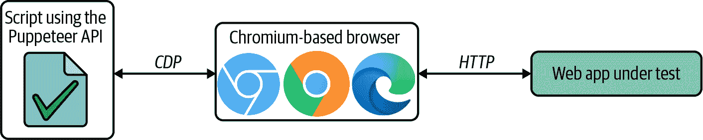

###### 图 10-11\. Puppeteer 架构

表格 10-8\. Puppeteer 的优缺点

| 优点 | 缺点 |
| --- | --- |

|

+   快速执行和全面的自动化能力（由于使用 CDP 与浏览器直接通信）

|

+   仅支持有限的跨浏览器（仅基于 Chromium 的浏览器，尽管在撰写时有试验性的 Firefox 支持）

+   仅支持 JavaScript 和 TypeScript

|

我们可以使用 `npm` 安装 Puppeteer。然后，我们需要使用 Node.js 运行 Puppeteer 测试（例如，示例 10-7）。以下代码段显示了这些命令：

```java
npm install puppeteer
node helloword-puppeteer.js
```

##### 示例 10-7\. 使用 Puppeteer 的 Hello world 测试

```java
const puppeteer = require('puppeteer');

(async () => {
   const browser = await puppeteer.launch(); 
   const page = await browser.newPage();

   await page.goto('https://bonigarcia.dev/selenium-webdriver-java/login-form.html');
   await page.type('#username', 'user');
   await page.type('#password', 'user');
   await page.click('button[type="submit"]');
   await page.waitForXPath('//*[contains(text(), "Login successful")]');
   await page.screenshot({ path: 'helloword-puppeteer.png' });

   await browser.close();
})();
```


Puppeteer 默认以无头模式运行浏览器。可以通过将此语句更改为以下内容来配置为使用非无头浏览器：

```java
const browser = await puppeteer.launch({ headless: false });
```

## Playwright

[Playwright](https://playwright.dev) 是由微软支持的开源（Apache 2.0 许可）的浏览器自动化库。Playwright 最初是一个 Node.js 库。除了 JavaScript，它现在还支持其他编程语言，包括 Python、Java 和 .NET C#。

Playwright 支持三种类型的 Web 引擎：Chromium、Firefox 和 WebKit（即 Safari 使用的 Web 浏览器引擎）。支持这些引擎的想法是它们涵盖了大部分的浏览器市场。因此，Playwright 团队维护了这些浏览器的补丁版本，以公开必要的功能来实现自动化。这些补丁版本提供了一个事件驱动的架构，以访问不同的内部浏览器进程（例如，渲染、网络、浏览器或服务工作进程）。图 10-12 说明了这种架构。表 10-9 包含了 Playwright 的一些最重要的优缺点。

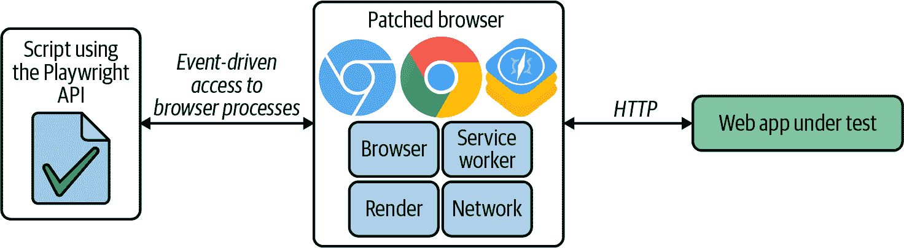

###### 图 10-12\. Playwright 架构

表格 10-9\. Playwright 的优缺点

| 优点 | 缺点 |
| --- | --- |

|

+   自动等待元素准备就绪

+   多语言 API

+   通过记录浏览器中的用户操作来提供测试生成器

+   允许浏览器会话记录

+   拦截网络流量以进行存根和模拟

|

+   使用修补过的浏览器版本而不是实际发布版本

|

要使用 Playwright，我们首先需要安装修补过的浏览器二进制文件。我们可以使用 `npm` 来实现这一目标。以下命令将下载适用于运行此命令的操作系统（支持 Windows、Linux 和 macOS）的 Chromium、Firefox 和 WebKit 的正确浏览器二进制文件：

```java
npm install -D playwright
```

然后，我们可以使用一个支持的 API 实现 Playwright 脚本。例如，当使用 JavaScript API 时，我们可以使用第三方测试运行器（例如 Jest、Jasmine、Mocha 等），或者使用 Playwright 测试（即由 Playwright 团队提供的测试运行器）。要使用后者，我们需要按照以下方式安装它：

```java
npm install -D @playwright/test
```

示例 10-8 包含一个基本的 Playwright JavaScript 测试，可以使用 Playwright 运行器执行。这个命令假设这个测试（称为 `helloworld-playwright.spec.mjs`）位于 `tests` 目录下。我们可以像下面的片段所示调用 Playwright 运行器来运行这个测试。这个命令默认以无头模式运行 Playwright 测试。要在非无头模式下运行浏览器，您需要在命令的末尾包含 `--headed` 标志：

```java
npx playwright test
```

##### 示例 10-8\. 使用 Playwright 进行的 Hello world 测试

```java
const { test, expect } = require('@playwright/test');

test('Hello World with Playwright', async ({ page }) => {
   await page.goto('https://bonigarcia.dev/selenium-webdriver-java/login-form.html');

   await page.type('#username', 'user');
   await page.type('#password', 'user');
   await page.click('button[type="submit"]');
   await expect(page.locator('#success')).toHaveText('Login successful');

   await page.screenshot({ path: 'helloworld-playwright.png' });
});
```

# 摘要和最终说明

Web 开发是一个涉及许多不同技术的异构学科，例如客户端、服务器端或者与外部服务集成等。因此，本章介绍了两种对 Selenium 有帮助的补充技术，用于测试 Web 应用程序：Appium（用于移动应用程序的开源测试自动化框架）和 REST Assured（用于测试 REST 服务的开源 Java 库）。您还学习了用于实现 Web 应用程序端到端测试的替代工具的基础知识，包括 Cypress、WebDriverIO、TestCafe、Puppeteer 和 Playwright。虽然这些替代方案与 Selenium 相比具有显著的优势（例如自动等待），但在我看来，由于 Selenium 是基于 Web 标准构建的（例如 W3C WebDriver 和 WebDriver BiDi），因此提供了更全面的自动化模型。此外，Selenium 项目还积极参与这些规范的开发。

本章节总结了你通过使用 Selenium 开发端到端测试的旅程。下一步是将本书中提供的所有知识付诸实践到你的项目中。这样，你可以为你的团队、项目、公司等构建定制的自动化框架。你需要做出许多决策，比如项目设置（如 Maven、Gradle）、单元测试框架（如 JUnit、TestNG）、浏览器基础设施（如 Docker、云服务提供商）以及与第三方工具的集成。为了应对所有这些复杂性，作为最后一句话，我建议你在本书中提供的示例中进行实践。换句话说：克隆仓库，运行测试，并编辑代码以满足你的需求。书籍发布后，我会维护 GitHub 仓库。还要记住：这是一个开源软件项目，所以如果你想做出贡献，随时可以提交 pull request 来改进它。
