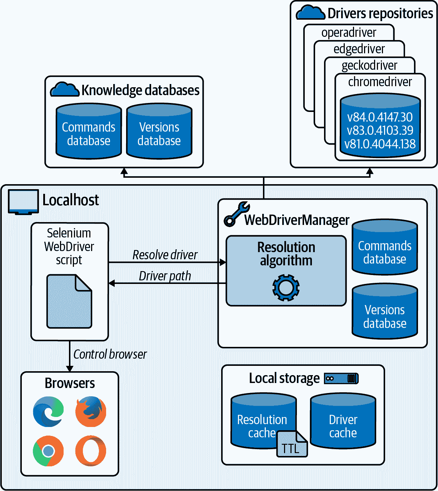
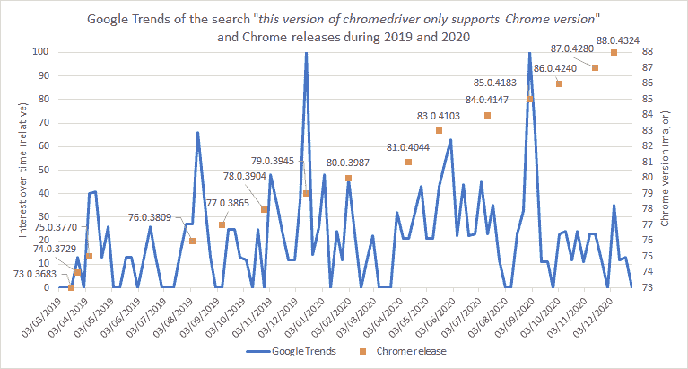

# 附录 B. 驱动程序管理

正如在第一章讨论的那样，驱动程序管理涉及三个步骤：下载、设置和维护。手动驱动程序管理在努力方面昂贵，并且在可维护性方面可能存在问题。因此，在本书的所有示例中，我使用 WebDriverManager 来以自动化和自动维护的方式执行这个过程。为了完整起见，本附录还描述了手动驱动程序管理中涉及的步骤（下载、设置和维护）。

# WebDriverManager：自动化驱动程序管理

[WebDriverManager](https://bonigarcia.dev/webdrivermanager) 是一个开源的 Java 库，用于自动管理 Selenium WebDriver 所需的驱动程序（例如 chromedriver、geckodriver、msedgedriver 等）。WebDriverManager 为不同的浏览器提供一组*管理器*，包括 Chrome、Firefox、Edge、Opera、Chromium 和 Internet Explorer。

WebDriverManager 在内部执行一个*解析算法*来管理每个浏览器所需的驱动程序。该算法旨在自动发现、下载、设置和维护这些驱动程序。

图 B-1 在 WebDriverManager 实现的方法论背景下代表了这个算法。对于每个管理器（例如，`chromedriver()`，`firefoxdriver()`等），解析算法的工作原理如下：

1.  WebDriverManager 尝试查找安装在本地计算机上的浏览器版本（例如 Chrome）。为此，它使用一个名为*命令数据库*的内部知识数据库。该数据库包含一组 Shell 命令（在不同操作系统上），允许发现浏览器版本（例如，在 Linux 上使用`google-chrome --version`）。

1.  使用找到的主要浏览器版本（例如，Chrome 89），WebDriverManager 确定正确的驱动程序版本（例如，chromedriver 89.0.4389.23）。我称这个过程为*版本解析*。为了简化这个过程，几个驱动程序维护者（例如 chromedriver 和 msedgedriver）在其在线存储库中发布特定的驱动程序版本信息，使用简单的文本文件（例如，*https://chromedriver.storage.googleapis.com/LATEST_RELEASE_89*）。不幸的是，对于 geckodriver 或 operadriver 等其他驱动程序，这些信息是不可用的。因此，WebDriverManager 使用另一个内部知识数据库（称为*版本数据库*）来保持浏览器版本和驱动程序之间的关联。这两个版本和命令数据库通过存储在 GitHub 上的在线主参考进行值的同步。

1.  WebDriverManager 下载特定的驱动程序，适用于本地操作系统（Windows、Linux 或 macOS），并将其存储在本地文件系统中的*驱动程序缓存*中（默认情况下在路径`~/.cache/selenium`）。

1.  最后，WebDriverManager 使用适当的 Java 系统属性（例如，`webdriver.chrome.driver`）导出已下载的驱动程序路径。

出于性能和可维护性考虑，WebDriverManager 在内部使用*解析缓存*。该缓存（默认情况下存储为属性文件）保持了解决驱动程序版本之间的关系。此关系遵循*存活时间*（TTL）方法有效。默认情况下，驱动程序的 TTL 为一天（例如 chromedriver 89.0.4389.23），浏览器的 TTL 为一小时（例如 Chrome 89）。解析算法在后续调用中使用缓存文件来解决驱动程序（通常在 Selenium WebDriver 测试套件中发生）。然后，当 TTL 过期时，解析算法尝试解析新的驱动程序发布。最后，当检测到不同的浏览器版本时，WebDriverManager 会下载新的驱动程序（如果需要）。通过此过程，即使对于常青树浏览器，也可以确保浏览器和驱动程序的版本兼容性。



###### 图 B-1. WebDriverManager 方法论

## 通用管理器

除了特定于浏览器的管理器（例如`chromedriver()`、`firefoxdriver()`等），WebDriverManager 还提供了*通用*管理器，即可以参数化为充当特定管理器（例如 Chrome、Firefox 等）的管理器。通过 WebDriverManager API 的`getInstance()`方法可以使用此功能。有多种调用此方法的选项：

`getInstance(Class<? extends WebDriver> webDriverClass)`

其中`webDriverClass`是`WebDriver`层次结构的类，如`ChromeDriver.class`、`FirefoxDriver.class`等。

`getInstance(DriverManagerType driverManagerType)`

其中`driverManagerType`是由 WebDriverManager 提供的枚举，用于识别可用的管理器。该枚举的可能值为`CHROME`、`FIREFOX`、`EDGE`、`OPERA`、`CHROMIUM`、`IEXPLORER`和`SAFARI`。

`getInstance(String browserName)`

其中`browserName`是不区分大小写的浏览器名称字符串。可能的值包括`Chrome`、`Firefox`、`Edge`、`Opera`、`Chromium`、`IExplorer`和`Safari`。

`getInstance()`

当未指定参数时，将使用配置键`wdm.defaultBrowser`来选择管理器（默认为 Chrome）。

## 高级配置

WebDriverManager 提供了不同的配置方式。首先，您可以通过每个管理器使用其 Java API。此 API 允许连接多个方法以指定自定义选项或首选项。您可以在其[文档](https://bonigarcia.dev/webdrivermanager)中找到 WebDriverManager API 的完整描述。例如，以下命令显示如何为网络连接设置代理：

```java
WebDriverManager.chromedriver().proxy("server:port").setup();
```

配置 WebDriverManager 的第二种方式是使用 Java 系统属性。每个 WebDriverManager API 方法都有一个相应的配置键。例如，API 方法 `cachePath()`（用于指定驱动程序缓存文件夹）的工作方式与配置键 `wdm.cachePath` 相同。例如，可以通过命令行传递这些类型的配置键：

```java
mvn test -Dwdm.cachePath=/custom/path/to/driver/cache
```

最后，您还可以使用环境变量来配置 WebDriverManager。变量名称派生自每个配置键（例如，`wdm.cachePath`），将其转换为大写，并用下划线替换符号 `.`（例如，`WDM_CACHEPATH`）。此机制可以方便地在操作系统级别配置全局参数。

## 其他用途

除了作为 Java 依赖项外，WebDriverManager 还可以以其他方式使用，即：

作为命令行界面（CLI）工具

此模式允许您解析驱动程序（例如，chromedriver、geckodriver）。此外，此模式还允许您在 Docker 容器中执行浏览器，并通过远程桌面会话与其交互。

作为服务器

WebDriverManager 服务器基于 HTTP，并提供两种类型的服务。首先，它公开了一个简单的类似 REST 的 API 来解析驱动程序。其次，它作为常规 Selenium 服务器运行，因此您可以与不同于 Java 的语言绑定一起使用它。

作为 Java 代理

在这种情况下，并使用 JVM 插装 API，WebDriverManager 使用 Java 插装 API 检查在 JVM 中创建的对象。当实例化 WebDriver 对象（`ChromeDriver`、`FirefoxDriver` 等）时，将使用所需的管理器来解析其驱动程序（`chromedriver`、`geckodriver` 等）。由于此方法，您可以从测试中移除 WebDriverManager 的调用。

# 手动驱动管理

本节描述了如何手动实现驱动程序管理过程（下载、设置和维护）。

### 下载

驱动管理的第一步是下载适当的驱动程序。表 B-1 显示了获取主要浏览器驱动程序的网站。您需要为您计划使用的浏览器找到正确的驱动程序版本和平台（Windows、Linux、macOS）。关于版本，Chrome 和 Edge（但不幸的是，不包括 Firefox）的维护者遵循相同的驱动程序和浏览器版本号方案，以简化此过程。例如，如果您使用 Chrome 或 Edge 91.x，您还需要使用 chromedriver 和 msedgedriver 91.x。您可以在网站提供的文档中找到具体的驱动程序版本。例如，要使用 Chrome 91，您需要下载 ChromeDriver 91.0.4472.19。

表 B-1\. 设置驱动程序的 Java 系统属性

| 浏览器 | 驱动程序 | 下载网站 |
| --- | --- | --- |
| Chrome/Chromium | chromedriver | [*https://chromedriver.chromium.org/downloads*](https://chromedriver.chromium.org/downloads) |
| Edge | msedgedriver | [*https://developer.microsoft.com/en-us/microsoft-edge/tools/webdriver*](https://developer.microsoft.com/en-us/microsoft-edge/tools/webdriver) |
| Firefox | geckodriver | [*https://github.com/mozilla/geckodriver/releases*](https://github.com/mozilla/geckodriver/releases) |

### 设置

当您为 WebDriver 脚本准备好所需的驱动程序后，需要正确设置它们。有两种方法可以进行此过程。第一种方法是将驱动程序位置（完整路径或包含驱动程序的父文件夹）添加到您的`PATH`环境变量中（*env*）。`PATH`环境变量在类 Unix 系统（如 Linux 和 macOS）和 Windows 操作系统中是标准的。该环境变量允许指定操作系统定位可执行程序的一组文件夹。我们配置`PATH`（以及其他环境变量）的方式取决于具体的操作系统。例如，在 Windows 系统中，可以通过其 GUI 进行配置（控制面板 → 系统 → 高级 → 环境变量）。在类 Unix 系统中，我们可以使用命令行来执行此过程，例如使用以下命令（或等效命令）：

```java
export PATH=$PATH:/path/to/drivers >> ~/.profile
```

设置驱动程序的第二种方法是使用*Java 系统属性*，这些属性是以名称/值形式传递给 JVM 的配置属性。表 B-2 总结了 Selenium WebDriver 中主要驱动程序的名称。这些属性的值是给定驱动程序的完整路径（例如`/path/to/drivers/chromedriver`）。

表 B-2\. 设置驱动程序的 Java 系统属性

| Browser | Driver | Java 系统属性名称 |
| --- | --- | --- |
| Chrome/Chromium | chromedriver | `webdriver.chrome.driver` |
| Edge | msedgedriver | `webdriver.edge.driver` |
| Firefox | geckodriver | `webdriver.gecko.driver` |

配置这些属性有两种方法：命令行（使用`-Dname=value`语法传递系统属性）或 Java 代码。例如，示例 B-1 展示了使用 Maven 和 Gradle 命令来执行给定项目的所有测试，并传递属性以设置 Chrome、Edge 和 Firefox 的驱动程序的方法。然后，示例 B-2 展示了如何进行相同的配置，但这次使用 Java 语言。

##### 示例 B-1\. Maven 和 Gradle 命令以在命令行中配置系统属性

```java
mvn test -Dwebdriver.chrome.driver=/path/to/drivers/chromedriver
mvn test -Dwebdriver.edge.driver=/path/to/drivers/msedgedriver
mvn test -Dwebdriver.gecko.driver=/path/to/drivers/geckodriver

gradle test -Dwebdriver.chrome.driver=/path/to/drivers/chromedriver
gradle test -Dwebdriver.edge.driver=/path/to/drivers/msedgedriver
gradle test -Dwebdriver.gecko.driver=/path/to/drivers/geckodriver
```

##### 示例 B-2\. Java 命令以配置系统属性

```java
System.setProperty("webdriver.chrome.driver", "/path/to/drivers/chromedriver");
System.setProperty("webdriver.edge.driver", "/path/to/drivers/msedgedriver");
System.setProperty("webdriver.gecko.driver", "/path/to/drivers/geckodriver");
```

### 维护

最后但同样重要的是，驱动程序管理的最后一步是维护这些驱动程序。由于 Chrome、Edge 或 Firefox 等持续更新的浏览器会自动进行升级，因此这种维护是必要的。尽管从用户角度来看自动升级很吸引人，但对于手动管理驱动程序的 Selenium WebDriver 脚本来说，这种自动化升级会带来问题。在这种情况下，驱动程序和浏览器的兼容性长期无法保证。

特定的驱动程序（例如，chromedriver 版本 84.0.4147.30）通常与特定的浏览器版本兼容（例如，Chrome 84）。但是，由于自动升级，这种兼容性并不保证。因此，基于这种驱动程序的 Selenium WebDriver 脚本可能会停止工作（即测试被称为失败）。在实践中，当由于驱动程序与浏览器不兼容而导致测试失败时，Selenium WebDriver 开发人员经常会遇到这个问题。例如，在使用 Chrome 作为浏览器时，由于驱动程序不兼容而导致的测试失败会报告以下错误消息：“this version of chromedriver only supports Chrome version N”（其中 N 是特定版本 chromedriver 支持的最新 Chrome 版本）。为了说明这个问题，图 B-2 显示了这个错误消息在 2019 年和 2020 年期间在 Google 上的全球搜索兴趣，以及该时期不同 Chrome 版本的发布日期。正如您所见，关于这个错误消息的兴趣随时间变化与某些 Chrome 版本的发布相关联。



###### 图 B-2\. “this version of chromedriver only supports chrome version” 在 Google 趋势中的全球相对搜索兴趣随时间变化的图表，以及 2019 年和 2020 年 Chrome 的发布日期

# 摘要

Selenium WebDriver 是一个允许你以编程方式控制 web 浏览器的库。自动化基于每个浏览器的本地能力。因此，我们需要在使用 Selenium WebDriver API 的脚本/测试和浏览器之间放置一个依赖于平台的二进制文件，称为*驱动程序*。一些驱动程序的例子包括 chromedriver（用于 Chrome）、geckodriver（用于 Firefox）和 msedgedriver（用于 Edge）。本附录介绍了驱动程序管理过程。此过程包括三个步骤（下载、设置和维护），可以手动或自动完成。默认情况下，我建议您使用自动化驱动程序管理方法。为此，Java 中的参考工具是 WebDriverManager。
