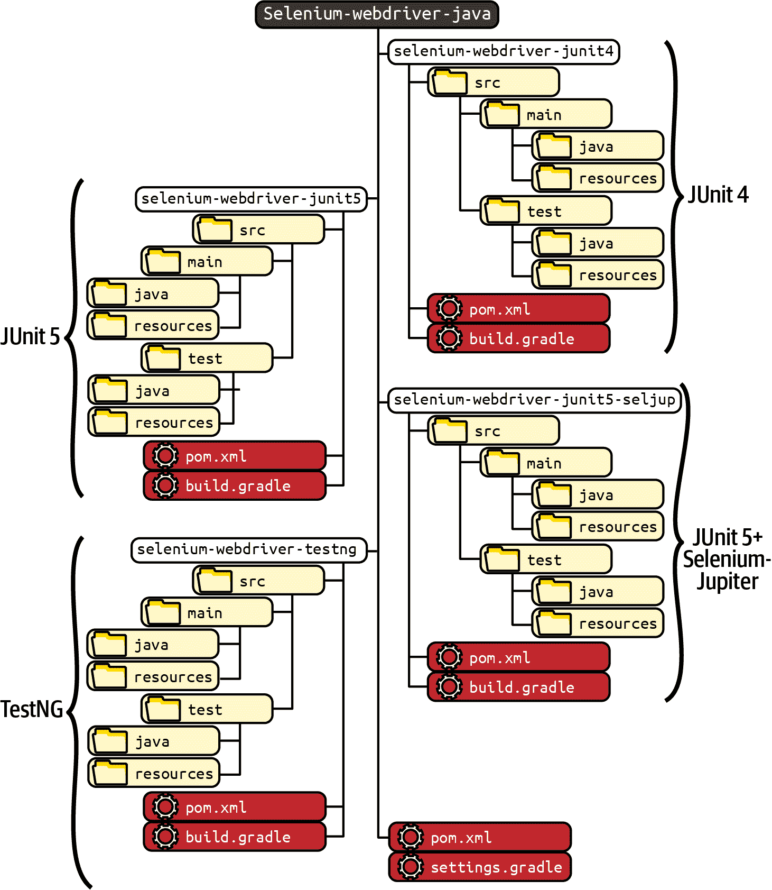
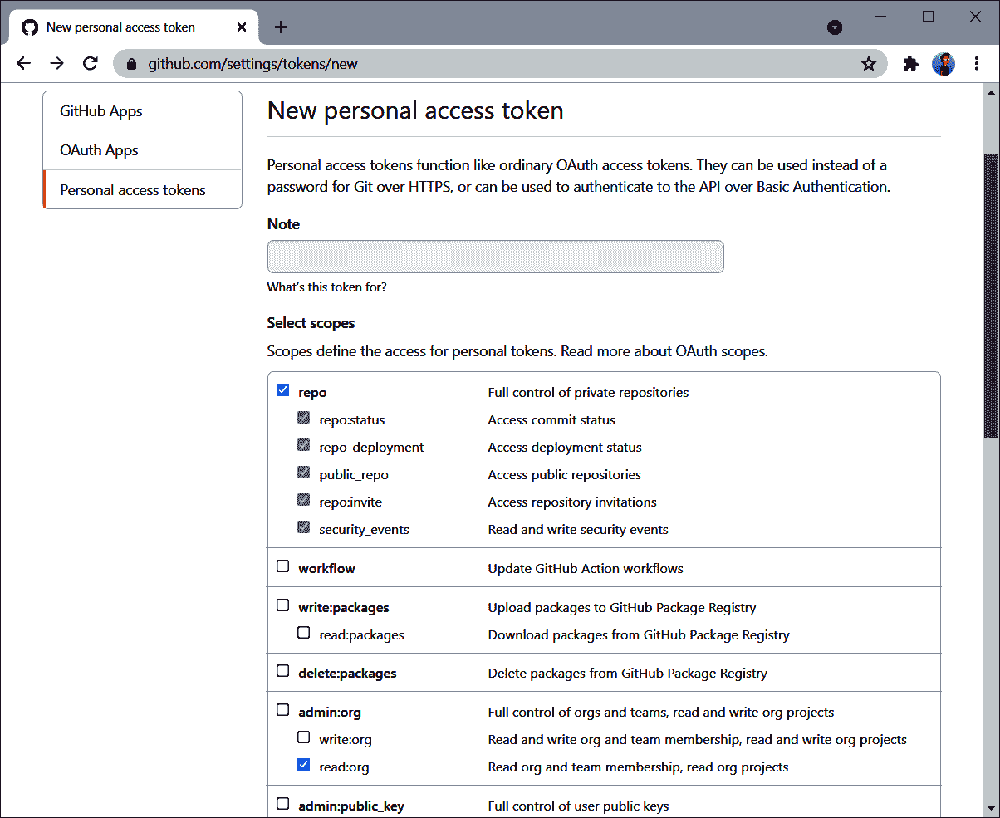

# 附录 C. 示例仓库设置

[示例仓库](https://github.com/bonigarcia/selenium-webdriver-java) 是本书的重要组成部分，因为它包含了所有涵盖的示例以及 Maven 和 Gradle 的完整配置。此外，此仓库使用 GitHub 提供的多项服务，如：

[GitHub Pages](https://pages.github.com)

一个允许从 GitHub 仓库直接配置公共网站的服务。我使用一个简单的网站链接到示例仓库，展示用作 Selenium WebDriver 测试示例中 SUT 的网页：[*https://bonigarcia.dev/selenium-webdriver-java*](https://bonigarcia.dev/selenium-webdriver-java)。正如您所见，它包含了使用 [Bootstrap](https://getbootstrap.com) 作为 CSS 框架的不同 HTML 页面。

[GitHub Actions](https://github.com/features/actions)

用于 GitHub 仓库的 CI/CD 构建服务器。我使用此服务在每次新提交时构建和测试整个仓库。您可以在本节末尾看到有关工作流配置的详细信息。

[Dependabot](https://github.com/dependabot)

一个自动更新项目依赖的机器人。当此机器人检测到任何 Maven 和 Gradle 依赖的新版本（有关更多详情，请参见下一小节）时，它将创建相应的拉取请求。

在本附录的其余部分，您将找到示例仓库的配置详细信息。此配置包括 Maven 和 Gradle 依赖声明以及其他方面，并且对于使用 Selenium WebDriver 的标准项目应该是足够的。此外，本附录的最后部分解释了如何配置日志库、Dependabot 和 GitHub Actions（以 CI 方法构建和测试项目）。

# 项目布局

图 C-1 显示了示例仓库布局的示意图。



###### 图 C-1\. 示例仓库布局（托管在 GitHub 上）

由于我为每个示例提供了四种风格（JUnit 4、JUnit 5、JUnit 5 加 Selenium-Jupiter 和 TestNG），因此 Maven 和 Gradle 中的配置基于 *多项目*。这样，示例仓库就有四个模块，每个测试框架一个：`selenium-webdriver-junit4`、`selenium-webdriver-junit5`、`selenium-webdriver-junit5-seljup` 和 `selenium-webdriver-testng`。在 Maven 中，多项目设置位于根文件夹中的 `pom.xml` 中，在 Gradle 中则位于 `settings.gradle` 文件中。

如你所见，在图 C-1 中，每个模块都有相同的结构。你可以在`src/test/java`文件夹中找到测试源代码。我使用 Java 包将示例按章节分开（例如，`io.github.bonigarcia.webdriver.jupiter.ch02.helloworld`）。接下来，每个项目都需要自己的 Logback 配置文件。我使用通用配置文件（即`logback.xml`），放置在`src/main/resources`文件夹下。我遵循这种约定，因为通常也会将日志记录用于应用程序，并且如果你计划重用这个项目结构，这是标准做法。最后，在每个子项目的根目录下，你可以找到用于 Maven（`pom.xml`）和 Gradle（`build.gradle`）的特定配置文件。你可以在这些文件中找到依赖项的声明，如下一节所述。

# Maven

Maven 中的核心概念之一是*构建生命周期*，这是指构建和分发特定项目的过程。在 Maven 中有三个标准的构建生命周期：`default`（用于项目部署），`clean`（用于项目清理）和`site`（用于文档）。这些构建生命周期包含一系列*构建阶段*，每个阶段代表生命周期中的一个阶段。`default`生命周期的主要阶段包括：

`validate`

确保项目正确并且所有必要信息都可用。

`compile`

编译源代码。

`test`

使用单元测试框架执行测试。

`package`

将编译后的代码打包成可分发的格式，如 Java ARchive（JAR）文件。

`verify`

执行进一步的测试（通常是集成或其他高级测试）。

`install`

将包安装到本地仓库。

`deploy`

将包安装到远程仓库或服务器。

我们可以使用 Shell 来调用 Maven，使用命令`mvn`。例如，以下命令调用`clean`生命周期（即清理`target`文件夹及其所有内容），然后按顺序调用`default`生命周期的所有阶段直到`package`（即`validate`，`compile`，`test`，最后是`package`）：

```java
mvn clean package
```

Maven 中的另一个核心元素是*插件*的概念。插件是一个内置的工件，用于执行上述阶段。在本书中，我们特别关注测试。因此，我们着重介绍`test`和`verify`阶段及其对应的插件：`maven-surefire-plugin`和`maven-failsafe-plugin`。表 C-1 总结了这两个插件之间的主要差异。

表 C-1\. Surefire 和 Failsafe Maven 插件之间的差异

|  | `maven-surefire-plugin` | `maven-failsafe-plugin` |
| --- | --- | --- |
| 描述 | 在打包前执行测试的 Maven 插件 | 在打包后执行测试的 Maven 插件 |
| 经典用法 | 单元测试 | 集成（和其他高级）测试 |
| 基本命令 | `mvn test` | `mvn verify` |
| 类型 | 默认插件（即，我们可以在 `pom.xml` 中不声明而使用） | 非默认插件（即，我们需要在 `pom.xml` 中声明才能使用） |
| 使用的版本 | Maven 内部定义的版本 | 最新可用版本 |

| 测试名称模式 | `**/Test*.java` `**/*Test.java`

`**/*Tests.java`

`**/*TestCase.java` | `**/IT*.java` `**/*IT.java`

`**/*ITCase.java` |

为简单起见，我在示例库中仅使用 `maven-surefire-plugin` 执行测试。尽管这些测试不是单元测试（事实上，它们是端到端测试），但使用 `maven-surefire-plugin` 运行它们不成问题（即，在编译后和打包前）。表 C-2 总结了使用此插件从 shell 中运行测试的基本命令。

表 C-2\. 使用 `maven-surefire-plugin` 运行测试的基本命令

| 命令 | 描述 |
| --- | --- |
| `mvn test` | 运行项目中的所有测试 |
| `mvn test -Dtest=MyClass` | 运行单个类中的所有测试 |
| `mvn test -Dtest=MyClass#myMethod` | 运行单个类中的单个测试 |

但是，如果您想要使用 `maven-failsafe-plugin` 执行测试，您需要在 `pom.xml` 文件中使用 示例 C-1 中展示的设置。最后，您可以使用命令 `mvn verify` 运行测试（即，在打包后运行测试）。

##### 示例 C-1\. 使用 `maven-failsafe-plugin` 执行测试所需的 Maven 配置

```java
<build>
    <plugins>
        <plugin>
            <groupId>org.apache.maven.plugins</groupId>
            <artifactId>maven-failsafe-plugin</artifactId>
            <executions>
                <execution>
                    <goals>
                        <goal>integration-test</goal>
                        <goal>verify</goal>
                    </goals>
                </execution>
            </executions>
        </plugin>
    </plugins>
</build>
```

## 公共设置

示例 C-2 包含示例库中 Maven 配置的公共部分。

##### 示例 C-2\. 示例库中的常见 Maven 依赖项

```java
<properties>
    <java.version>1.8</java.version> 
    <maven.compiler.target>${java.version}</maven.compiler.target>
    <maven.compiler.source>${java.version}</maven.compiler.source>
</properties>

<dependencies> 
    <dependency>
        <groupId>org.slf4j</groupId>
        <artifactId>slf4j-api</artifactId>
        <version>${slf4j.version}</version>
    </dependency>
    <dependency>
        <groupId>ch.qos.logback</groupId>
        <artifactId>logback-classic</artifactId>
        <version>${logback.version}</version>
    </dependency>

    <dependency>
        <groupId>org.seleniumhq.selenium</groupId>
        <artifactId>selenium-java</artifactId>
        <version>${selenium.version}</version>
        <scope>test</scope>
    </dependency>
    <dependency>
        <groupId>org.assertj</groupId>
        <artifactId>assertj-core</artifactId>
        <version>${assertj.version}</version>
        <scope>test</scope>
    </dependency>
    <dependency>
        <groupId>io.github.bonigarcia</groupId>
        <artifactId>webdrivermanager</artifactId>
        <version>${wdm.version}</version>
        <scope>test</scope>
    </dependency>
</dependencies>

<build>
    <plugins>
        <plugin> 
            <groupId>org.apache.maven.plugins</groupId>
            <artifactId>maven-surefire-plugin</artifactId>
            <version>${maven-surefire-plugin.version}</version>
        </plugin>
    </plugins>
</build>
```


在本项目中我们使用 Java 8。


我们指定了常见的依赖项。一方面，我们声明 Selenium WebDriver、AssertJ 和 WebDriverManager，并将其范围设置为 `test`。这样，我们只能从测试逻辑中（即位于 `src/test/java` 文件夹下的 Java 类）使用这些依赖项。另一方面，缺少 Simple Logging Facade for Java (SLF4J) 和 Logback 的范围，默认情况下 Maven 使用 `compile`。这意味着我们可以从应用程序和测试逻辑中使用这些依赖项。最后，请注意我们使用 Maven 属性来声明依赖项的版本（例如 `${selenium.version}`）。您可以在在线库中找到确切的版本。


我们需要声明特定版本的 `maven-surefire-plugin`。如 表 C-1 所述，此插件的版本由 Maven 内部定义。但为了充分利用此插件，我们需要指定一个更新的版本。

## JUnit 4

在一个使用 JUnit 4 作为单元测试框架的 Maven 项目中，我们还需要声明以下依赖：

```java
<dependency>
    <groupId>junit</groupId>
    <artifactId>junit</artifactId>
    <version>${junit4.version}</version>
    <scope>test</scope>
</dependency>
```

## JUnit 5

虽然 JUnit 5 是一个模块化框架，但我们可以在 Maven 项目中声明单个依赖项来使用 Jupiter 编程模型。如下片段所示，这个构件被称为`junit-jupiter`，并且它传递地拉取以下 JUnit 5 的构件：

`junit-jupiter-api`

用于开发测试

`junit-jupiter-engine`

用于在 JUnit 平台中执行测试

`junit-jupiter-params`

用于开发参数化测试（参见第八章）

```java
<dependencies>
    <dependency>
        <groupId>org.junit.jupiter</groupId>
        <artifactId>junit-jupiter</artifactId>
        <version>${junit5.version}</version>
        <scope>test</scope>
    </dependency>
</dependencies>
```

## Selenium-Jupiter

当与 Selenium-Jupiter 一起使用 Jupiter 时，除了以前的构件（`junit-jupiter`和`maven-surefire-plugin`），我们还需要包含 Selenium-Jupiter 的坐标（请参见下一个代码示例）。在这种情况下，我们可以移除 WebDriverManager 的坐标，因为 Selenium-Jupiter 会传递地拉取它。

```java
<dependency>
    <groupId>io.github.bonigarcia</groupId>
    <artifactId>selenium-jupiter</artifactId>
    <version>${selenium-jupiter.version}</version>
    <scope>test</scope>
</dependency>
```

## TestNG

最后，在我们的`pom.xml`中包含 TestNG 所需的坐标是：

```java
<dependency>
    <groupId>org.testng</groupId>
    <artifactId>testng</artifactId>
    <version>${testng.version}</version>
    <scope>test</scope>
</dependency>
```

虽然在示例仓库中没有使用，但 TestNG 测试也可以在 JUnit 平台上执行。如果要启用此模式，需要在项目设置中添加 JUnit 平台的 TestNG 引擎。有关此信息，请参阅[TestNG 引擎页面](https://github.com/junit-team/testng-engine)。

## 其他依赖项

本书解释了与 Selenium WebDriver 结合使用的其他依赖项。表 C-3 总结了这些依赖项及其所在的章节。

表 C-3\. 示例仓库中用于第三方集成的依赖项

| Dependency | Chapter | `groupId` | `artifactId` |
| --- | --- | --- | --- |
| HtmlUnitDriver | 第一章 | `org.seleniumhq.selenium` | `htmlunit-driver` |
| Selenium Grid | 第六章 | `org.seleniumhq.selenium` | `selenium-grid` |
| rerunner-jupiter | 第八章 | `io.github.artsok` | `rerunner-jupiter` |
| JUnit 平台启动器 | 第八章 | `org.junit.platform` | `junit-platform-launcher` |
| Awaitility | 第九章 | `org.awaitility` | `awaitility` |
| BrowserMob | 第九章 | `net.lightbody.bmp` | `browsermob-core` |
| OWASP ZAP 客户端 API | 第九章 | `org.zaproxy` | `zap-clientapi` |
| Axe Selenium 集成 | 第九章 | `com.deque.html.axe-core` | `selenium` |
| Selenide | 第九章 | `com.codeborne` | `selenide` |
| JavaFaker | 第九章 | `com.github.javafaker` | `javafaker` |
| Extent Reports | 第九章 | `com.aventstack` | `extentreports` |

| Allure | 第九章 | `io.qameta.allure` | `io.qameta.allure` `allure-junit5`

`allure-testng` |

| Cucumber Java | 第九章 | `io.cucumber` | `cucumber-java` |
| --- | --- | --- | --- |

| Cucumber JUnit 4, 5 或 TestNG | 第九章 | `io.cucumber` | `cucumber-junit` `cucumber-junit-platform-engine`

`cucumber-testng` |

| Spring-Boot Web | 第九章 | `org.springframework.boot` | `spring-boot-starter-web` |
| --- | --- | --- | --- |
| Spring-Boot 测试 | 第九章 | `org.springframework.boot` | `spring-boot-starter-test` |
| Appium Java 客户端 | 第十章 | `io.appium` | `java-client` |
| REST Assured | 第十章 | `io.rest-assured` | `rest-assured` |

此外，使用一些这些第三方依赖项需要插件声明进行一些额外设置。以下代码片段显示了这个新的设置。

```java
<build>
    <plugins>
        <plugin>
            <groupId>org.apache.maven.plugins</groupId>
            <artifactId>maven-surefire-plugin</artifactId>
            <version>${maven-surefire-plugin.version}</version>
            <!-- The following setup is required only when using Allure --> 
            <configuration>
                <properties>
                    <property>
                        <name>listener</name>
                        <value>io.qameta.allure.junit4.AllureJunit4</value> 
                    </property>
                </properties>
            </configuration>
            <!-- /Allure -->
        </plugin>
        <plugin> 
            <groupId>io.qameta.allure</groupId>
            <artifactId>allure-maven</artifactId>
            <version>${allure-maven.version}</version>
        </plugin>
        <plugin> 
            <groupId>org.springframework.boot</groupId>
            <artifactId>spring-boot-maven-plugin</artifactId>
            <version>${spring-boot.version}</version>
        </plugin>
    </plugins>
</build>
```


如果您计划使用 Allure 生成测试报告，则需要从这一行到 `<!-- /Allure -->` 进行设置。如果不使用它，可以安全地从项目中删除它。


不同单元测试框架的监听器类有所不同：

+   `io.qameta.allure.junit4.AllureJunit4` 适用于 JUnit 4

+   `io.qameta.allure.junit5.AllureJunit5` 适用于 JUnit 5（以及 JUnit 5 加 Selenium-Jupiter）

+   TestNG 不需要监听器


除了监听器外，使用此报告工具还需要 Allure 插件。


在使用 Spring-Boot 时建议使用 Spring-Boot 插件。

# Gradle

每个 Gradle 项目由多个 *任务* 组成。每个任务代表构建中的一个原子工作单元。在 Java 项目中，任务的典型示例包括：

`compileJava`

编译应用程序逻辑（即位于文件夹 `src/main/java` 的 Java 类）。

`processResources`

复制应用程序资源（即位于文件夹 `src/main/resources` 的文件）到输出文件夹（`build`）。

`compileTestJava`

编译测试逻辑（即位于文件夹 `src/test/java` 的 Java 类）。

`processTestResources`

复制测试资源（即位于文件夹 `src/test/resources` 的文件）到输出文件夹中。

`test`

使用 JUnit 或 TestNG 运行测试。表 C-4 总结了在 shell 中运行 Gradle 测试的常见命令。

`clean`

删除项目输出文件夹及其内容。

表 C-4\. 使用 Gradle 运行测试的基本命令

| 命令 | 描述 |
| --- | --- |
| `gradle test` | 运行项目中的所有测试 |
| `gradle test --rerun-tasks` | 运行项目中的所有测试（即使一切都是最新的） |
| `gradle test --tests MyClass` | 运行单个类中的所有测试 |
| `gradle test --tests MyClass.MyMethod` | 运行单个类中的单个测试 |

示例 C-3 包含示例存储库所有子项目的通用配置。接下来我将解释这个片段的相关部分。

##### 示例 C-3\. Gradle 项目的通用设置

```java
plugins {
    id "java" 
}

compileTestJava { 
    sourceCompatibility = 1.8
    targetCompatibility = 1.8
    options.compilerArgs += "-parameters"
}

test {
    testLogging { 
        events "passed", "skipped", "failed"
        showStandardStreams = true
    }

    systemProperties System.properties 

    if (project.hasProperty("excludeTests")) { 
        "$excludeTests".split(",").each { excludeTests ->
            exclude excludeTests
        }
    }

    if (project.hasProperty("parallel")) { 
        maxParallelForks = Runtime.runtime.availableProcessors()
    }

    ext.failedTests = [] 

    tasks.withType(Test) {
        afterTest { TestDescriptor descriptor, TestResult result ->
            if(result.resultType ==
                  org.gradle.api.tasks.testing.TestResult.ResultType.FAILURE) {
                failedTests << ["${descriptor.className}::${descriptor.name}"]
            }
        }
    }

    gradle.buildFinished {
        if(!failedTests.empty){
            println "Failed test(s) for ${project.name}:"
            failedTests.each { failedTest ->
                println failedTest
            }
        }
    }
}

repositories {
    mavenCentral() 
}

dependencies { 
    implementation("org.slf4j:slf4j-api:${slf4jVersion}")
    implementation("ch.qos.logback:logback-classic:${logbackVersion}")

    testImplementation("org.seleniumhq.selenium:selenium-java:${seleniumVersion}")
    testImplementation("org.assertj:assertj-core:${assertjVersion}")
    testImplementation("io.github.bonigarcia:webdrivermanager:${wdmVersion}")
}
```


由于我们正在实现一个 Java 项目，因此需要声明 [`java` 插件](https://docs.gradle.org/current/userguide/java_plugin.html)。


用于编译测试时，我们使用 Java 8。


虽然不是强制的，但我们强制将测试日志写入标准输出。


这允许在命令行中传递 Java 系统属性（如 示例 B-1 中所述）。


此子句允许在命令行中使用属性 `excludeTests` 来排除一些测试。例如，以下命令排除以 Docker 开头的测试：`gradle test -PexcludeTests=**/Docker*`


这些行允许使用命令 `gradle test -Pparallel` 来并行运行测试。


下列子句将失败的测试汇总到 `failedTests` 属性，并在测试套件执行结束时将此信息显示在标准输出中。


我们使用 [Maven 中央仓库](https://search.maven.org) 来获取依赖项。


常用依赖项包括 Selenium WebDriver、AssertJ、WebDriverManager（用于测试）、SLF4J 和 Logback（整个项目）。

## JUnit 4

JUnit 4 的具体设置如下：

```java
test {
    useJUnit() { 
        if (project.hasProperty("groups")) {
            includeCategories "$groups"
        }
        if (project.hasProperty("excludedGroups")) {
            excludeCategories "$excludedGroups"
        }
    }
}

dependencies { 
    testImplementation("junit:junit:${junit4Version}")
}
```


我们使用额外的配置来允许使用类名进行测试筛选（参见 “分类和筛选测试”）。


我们包含了 JUnit 4 依赖。

## JUnit 5

在使用 JUnit 5 时，我们需要指定 `junit-jupiter` 构件（就像 Maven 中依赖于 `junit-jupiter-api` `junit-jupiter-engine` 和 `junit-jupiter-params`）。此外，我们需要使用 `test` 任务设置中的 `useJUnitPlatform()` 子句来选择使用 JUnit 平台执行。

```java
test {
    useJUnitPlatform() {
        if (project.hasProperty("groups")) {
            includeTags "$groups"
        }
        if (project.hasProperty("excludedGroups")) {
            excludeTags "$excludedGroups"
        }
    }
}

dependencies {
    testImplementation("org.junit.jupiter:junit-jupiter:${junit5Version}")
}
```

## Selenium-Jupiter

如果使用 Selenium-Jupiter，除了之前配置 JUnit 5 的设置外，还需要包含以下依赖项。在这种情况下，我们可以移除 WebDriverManager，因为它被 Selenium-Jupiter 传递性地引入。

```java
dependencies {
    testImplementation("io.github.bonigarcia:selenium-jupiter:${selJupVersion}")
}
```

## TestNG

最后，为了将 TestNG 作为单元测试框架使用，我们需要包含以下设置：

```java
test {
    useTestNG() {
        if (project.hasProperty("groups")) { 
            includeGroups "$groups"
        }
        if (project.hasProperty("excludedGroups")) {
            excludeGroups "$excludedGroups"
        }
    }

    scanForTestClasses = false 
}

dependencies { 
    testImplementation("org.testng:testng:${testNgVersion}")
}
```


我们包含这些语句以允许按类名进行筛选。


这个属性需要设置为 false，以匹配筛选过程中的包含和排除模式。


我们包含了 TestNG 依赖。

## 其他依赖项

我们需要在 Gradle 设置中添加额外的依赖项，以使用第三方库。表 C-3（在前一节中）总结了这些依赖项的坐标及其所述章节。此外，还需要在 Gradle 设置中使用一些额外的插件（用于使用 Allure 和 Spring-Boot，分别）。要使用 Allure，还需要定义一个额外的仓库，如下所示：

```java
plugins {
    id "io.qameta.allure"
    id "org.springframework.boot"
}

repositories {
    maven {
       url "https://plugins.gradle.org/m2/"
    }
}
```

# 日志记录

我在示例库中使用了两个日志库：

[Logback](https://logback.qos.ch)

这是实际的日志记录框架（也称为*记录器*）。Logback 被许多重要的 Java 项目使用，例如 Spring Framework 和 Groovy 等。

[Simple Logging Facade for Java (SLF4J)](https://www.slf4j.org)

这是一个基于外观设计模式的流行实用工具，用于解耦底层记录器。它支持主要的日志框架（例如 Logback、Log4j 或 SimpleLogger 等）。正如在表 C-5 中总结的那样，SLF4J 根据消息的严重性定义了五个日志级别。

表 C-5. SLF4J 中的日志级别

| 日志级别 | 描述 |
| --- | --- |
| `ERROR` | 用于报告应用程序中的缺陷。 |
| `WARN` | 发生了一些意外情况，但不影响预期的应用行为。 |
| `INFO` | 提供信息的消息，例如应用程序进入了特定状态等。 |
| `DEBUG` | 用于诊断和故障排除的信息。 |
| `TRACE` | 最精细的信息。我们仅在需要完全了解应用程序发生情况的特殊情况下使用此级别。 |

通常情况下，要使用这些库，我们需要解决相应的依赖关系（详见 Maven 和 Gradle 的下一节）。然后，我们需要正确配置 Logback。为此，我们需要在项目类路径中包含一个 XML 配置文件。如果我们正在为整个项目配置日志记录（即应用程序加测试逻辑），则此文件的名称应为 `logback.xml`。在这种情况下，它应该在应用程序资源中可用，通常位于 `src/main/resources` 文件夹下（有关项目布局的更多信息，请参见下一节）。如果我们仅用于测试日志记录，配置文件的名称为 `logback-test.xml`，存储在测试资源中（例如位于 `src/test/resources` 文件夹下）。

在这两种情况下的语法（`logback.xml`和`logback-test.xml`）是相同的。示例 C-4 展示了配置文件的示例。这个 XML 文件设置了每条日志行的模式，由时间戳、线程名称、跟踪级别、源（包、类名和代码行）和消息组成。在这个示例中，`INFO`是默认的日志级别。这样，每个这个级别或更严重的追踪（即`WARN`、`ERROR`和`FATAL`）都会显示，但不包括以下级别（即`DEBUG`和`TRACE`）。此外，来自包`io.github.bonigarcia`的追踪（用于测试示例、WebDriverManager 和 Selenium-Jupiter）为`DEBUG`。

##### C-4\. Logback 配置文件

```java
<?xml version="1.0" encoding="UTF-8"?>
<configuration>
   <appender name="STDOUT" class="ch.qos.logback.core.ConsoleAppender">
      <encoder>
         <pattern>%d{yyyy-MM-dd HH:mm:ss} [%thread] %-5level %logger{36}.%M\(%line\)
                  - %msg%n</pattern>
      </encoder>
   </appender>

   <logger name="io.github.bonigarcia" level="DEBUG" />

   <root level="INFO">
      <appender-ref ref="STDOUT" />
   </root>

</configuration>
```

最后一步是在我们的 Java 类中使用变量记录日志。为此，我们可以使用示例 C-5 中的代码。这段代码通过`lookup()`方法提供了一种方便的方式来获取当前类的反射信息。然后，我们声明记录日志的变量（在这个示例中称为`log`），并使用 SLF4J 的`getLogger()`方法。最后，我们可以在这个类的任何方法中使用变量`log`记录不同级别的消息。

##### C-5\. 记录消息的示例

```java
static final Logger log = getLogger(lookup().lookupClass());

log.info("This is an informative message");
log.debug("This is a debugging message");
```

# GitHub Actions

我使用 GitHub Actions 作为[示例仓库](https://github.com/bonigarcia/selenium-webdriver-java/actions)的 CI 服务器。这样，每次我向仓库提交新更改时，GitHub Actions 都会构建项目并执行所有测试。示例 C-6 展示了执行此过程的配置。

##### C-6\. GitHub Actions 工作流配置

```java
name: build

on: 
  push:
    branches: [ master ]
  pull_request:
    branches: [ master ]

env: 
  DISPLAY: :99
  WDM_GITHUBTOKEN: ${{ secrets.WDM_GITHUBTOKEN }}

jobs:
  tests: 
    runs-on: ${{ matrix.os }}
    strategy:
      matrix:
        os: [ ubuntu-latest, windows-latest, macos-latest ]
        java: [ 8 ]

    steps: 
    - name: Checkout GitHub repo
      uses: actions/checkout@v2
    - name: Set up Java
      uses: actions/setup-java@v2
      with:
        distribution: 'temurin'
        java-version: ${{ matrix.java }}
    - name: Start Xvfb
      run: Xvfb :99 &
    - name: Test with Maven
      run: mvn -B test
    - name: Test with Gradle
      run: ./gradlew test
```


触发工作流的事件是`push`（仓库中的新提交）和`pull_request`（其他开发人员提出的提交）。


需要两个环境变量：

`DISPLAY`

默认情况下，由 Selenium WebDriver 控制的浏览器需要在带有图形用户界面的操作系统中执行。另一方面，GitHub Actions 中提供的 Linux 发行版是*无头*的（即没有图形用户界面）。因此，我们使用 Xvfb（X 虚拟帧缓冲）在这些 Linux 发行版上运行 WebDriver 测试。Xvfb 是 Unix-like 系统的内存中显示服务器，需要在 Linux（X11）中声明带有屏幕号的环境变量`DISPLAY`。

`WDM_GITHUBTOKEN`

GitHub 托管 Selenium WebDriver 需要的一些驱动程序（如 geckodriver 或 operadriver）。当外部客户端（如 WebDriverManager）连续向 GitHub 发送多个请求时，GitHub 最终会返回 HTTP 错误响应（403，禁止），原因是其速率限制。WebDriverManager 可以使用*个人访问令牌*进行身份验证请求，以避免此问题。图 C-2 展示了授予此令牌的权限在示例仓库中。总之，此环境变量导出了此令牌的值。我将此令牌的实际值保存为 GitHub 仓库的机密。


为了完整起见，我在三种不同的操作系统中执行工作流程：Ubuntu（即 Linux）、Windows 和 macOS，所有操作系统均使用 Java 8。


工作流程包括五个步骤：

1.  检出仓库。

1.  使用[Eclipse Adoptium](https://adoptium.net)设置 Java 8。

1.  启动 X 虚拟帧缓冲区。

1.  使用 Maven 运行所有测试。

1.  使用 Gradle 运行所有测试。



###### 图 C-2\. GitHub 仓库示例中使用的个人访问令牌的权限

# Dependabot

要配置 Dependabot，我们需要在仓库的 `.github` 文件夹中包含名为 `dependabot.yml` 的文件。示例 C-7 展示了示例仓库中的内容。

##### 示例 C-7\. Dependabot 配置

```java
version: 2
updates:
- package-ecosystem: maven 
  directory: "/"
  schedule:
    interval: daily
    time: '06:00'
  open-pull-requests-limit: 99

- package-ecosystem: gradle 
  directory: "/"
  schedule:
    interval: daily
    time: '06:00'
  open-pull-requests-limit: 99

- package-ecosystem: github-actions 
  directory: "/"
  schedule:
    interval: daily
    time: '06:00'
  open-pull-requests-limit: 99
```


我们每天检查 Maven 依赖项的更新情况。


我们每天检查 Gradle 依赖项的更新情况。


我们每天检查 GitHub Actions 设置的更新情况。

# 摘要

本书中所有示例都可在公共[GitHub 仓库](https://github.com/bonigarcia/selenium-webdriver-java)中找到。本附录展示了构建工具（Maven 和 Gradle）、依赖项（Selenium WebDriver、JUnit、TestNG、Selenium-Jupiter、WebDriverManager 等）、日志记录（Logback 和 SLF4J）以及其他服务（GitHub Actions、GitHub Pages 和 Dependabot）的详细配置。
