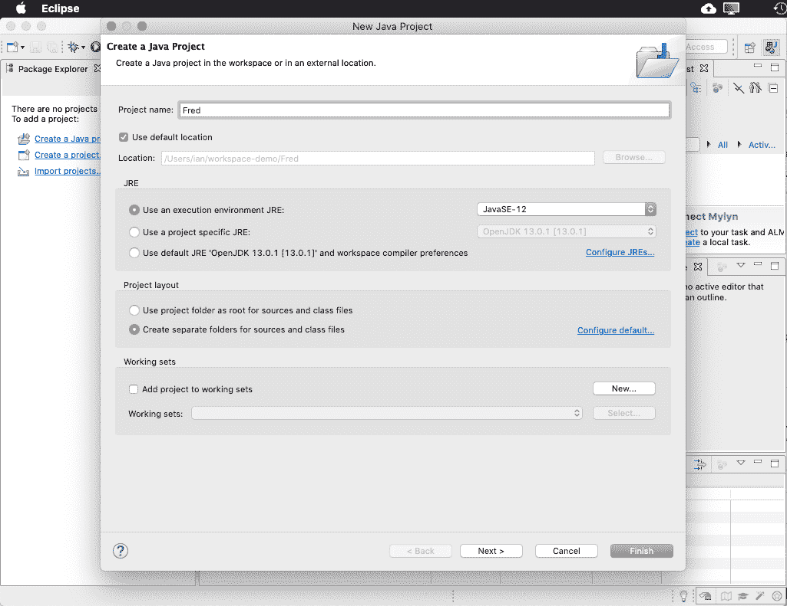
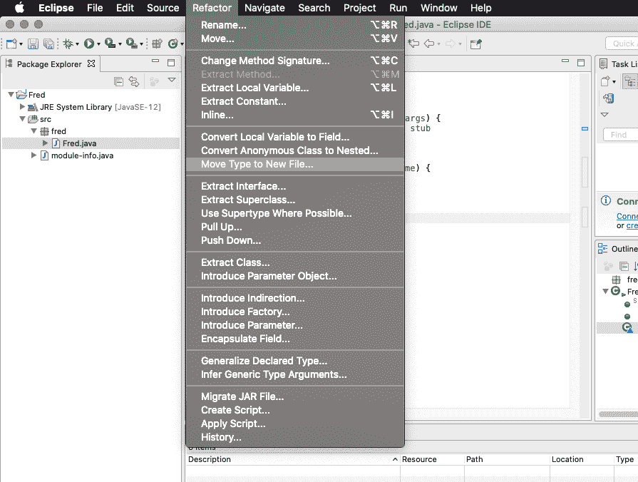
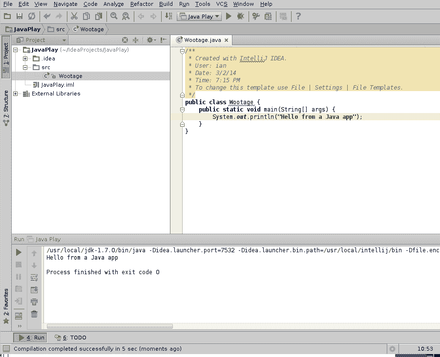
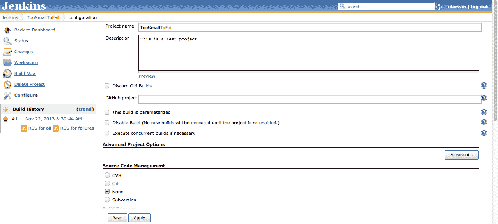
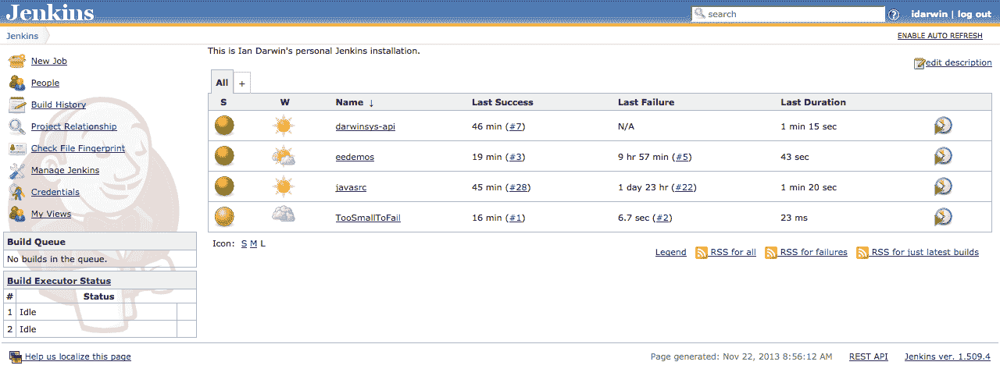

# 第一章. 入门：编译和运行 Java

# 1.0 引言

本章涵盖了一些入门级的任务，你需要知道如何在开始之前做这些事情。据说你必须先爬行，然后才能行走，再之后才能骑自行车。在本书中尝试任何东西之前，你需要能够编译和运行你的 Java 代码，因此我从这里开始，展示了几种方法来实现：JDK 方法、集成开发环境（IDE）方法以及构建工具（Ant、Maven 等）方法。另一个人们遇到的问题是正确设置`CLASSPATH`，所以接下来处理这个问题。之后是关于弃用警告的信息，因为你在维护旧 Java 代码时可能会遇到它们。本章以关于条件编译、单元测试、断言和调试的一般信息结束。

如果你还没有安装 Java，你需要下载它。请注意，有几种不同的下载选项。直到 Java 8，JRE（Java 运行环境）是面向最终用户的一个较小的下载包。由于现在桌面 Java 的使用远不如从前，JRE 已被淘汰，取而代之的是`jlink`，用于创建自定义下载（参见 Recipe 15.8）。JDK 或 Java SDK 下载是完整的开发环境，如果你打算开发 Java 软件，这是你需要的。

当前 Java 版本的标准下载可在[Oracle 网站](http://www.oracle.com/technetwork/java/javase/downloads/index.html)找到。

有时你可以在[*http://jdk.java.net*](http://jdk.java.net)找到下一个主要 Java 版本的预发布版本。整个 JDK 作为一个开源项目进行维护，OpenJDK 源代码树用于构建商业和支持的 Oracle JDK（经过修改和增加）。

如果你已经对你的集成开发环境（IDE）满意，你可能希望跳过这部分或全部内容。这里的内容确保每个人在继续之前都能够编译和调试他们的程序。

# 1.1 编译和运行 Java：标准 JDK

## 问题

你需要编译和运行你的 Java 程序。

## 解决方案

这是你的计算机操作系统影响 Java 可移植性的少数几个领域之一，因此让我们先解决这些问题。

### JDK

使用命令行 Java 开发工具包（JDK）可能是跟进 Java 最新改进的最佳方式。假设你已经在标准位置安装了标准 JDK 并且将其位置设置在你的`PATH`中，你应该可以运行命令行 JDK 工具。使用命令 *javac* 进行编译和 *java* 运行你的程序（在 Windows 上还有 *javaw* 用于无控制台窗口运行程序），如下所示：

```java
C:\javasrc>javac HelloWorld.java

C:\javasrc>java HelloWorld
Hello, World

C:\javasrc>
```

如果程序引用其他类，这些类的源代码在同一目录中可用且没有编译过的 *.class* 文件，*javac* 将自动为您编译它们。从 Java 11 开始，对于不需要任何这种共同编译的简单程序，您可以通过简单地将 Java 源文件传递给 *java* 命令来合并这两个操作：

```java
	$ java HelloWorld.java
	Hello, Java
	$

```

正如你从编译器的（缺少）输出中可以看到的，*javac* 和 *java* 编译工作采用了 Unix 的“没有消息就是好消息”的哲学：如果程序能够按照你的要求执行，它就不应该烦扰你告诉它已经完成了。

还有一个可选设置叫做 `CLASSPATH`，在 Recipe 1.5 中讨论，它控制 Java 查找类的位置。如果设置了 `CLASSPATH`，*javac* 和 *java* 都会使用它。在旧版本的 Java 中，即使是从当前目录运行一个简单程序，你也必须将 `CLASSPATH` 设置为包含“.”；但在当前的 Java 实现中，这已经不再需要。

Sun/Oracle 的 *javac* 编译器是官方的参考实现。还有几个替代的开源命令行编译器，包括[Jikes](http://sourceforge.net/projects/jikes)和[Kaffe](http://github.com/kaffe/kaffe)，但它们大多数情况下已经不再积极维护。

也有一些 Java 运行时的克隆品，包括[Apache Harmony](http://harmony.apache.org)，[Japhar](http://www.hungry.com/old-hungry/products/japhar)，IBM Jikes Runtime（与 Jikes 相同的站点），甚至[ JNode](http://www.jnode.org)，一个完整的、独立的用 Java 编写的操作系统；但自从 Sun/Oracle 的 JVM 开源（GPL）以来，大多数这些项目已经停止维护。Apache 于 2011 年 11 月退役了 Harmony。

### macOS

JDK 纯命令行。在键盘与可视化之间的另一端，我们有苹果 Macintosh。有关 Mac 用户界面有很多好评，我不想卷入那场辩论。macOS（OS 版本 10.x）建立在 BSD Unix（和“Mach”）基础上。因此，它既有常规的命令行（Terminal 应用程序，隐藏在 */Applications/Utilities* 下），也有传统的 Unix 命令行工具和图形化的 Mac 工具。如果你使用 macOS，你可以使用命令行 JDK 工具或任何现代构建工具。编译后的类可以使用在 Recipe 15.6 中讨论的 Jar 打包工具打包为可点击的应用程序。Mac 粉丝可以使用在 Recipe 1.3 中讨论的许多完整 IDE 工具之一。苹果提供 XCode 作为其 IDE，但原装状态下它对 Java 并不友好。

# 1.2 编译和运行 Java：GraalVM 提升性能

## 问题

你听说过 Graal 是 Oracle 推出的比标准 JDK 更快的 JVM，你想试一试。Graal 承诺提供更好的性能，并且支持混合编程语言以及将你的 Java 代码预编译为特定平台的可执行形式。

## 解决方案

下载并安装 GraalVM。

## 讨论

GraalVM 自称为“一个通用的虚拟机，用于运行 JavaScript、Python、Ruby、R，基于 JVM 的语言如 Java、Scala、Clojure、Kotlin，以及基于 LLVM 的语言，如 C 和 C++。”

注意，Graal 正在快速变化。虽然此处的步骤反映了出版时（2019 年末）的最新信息，但到你准备安装时，可能已经有了更新版本和功能上的变化。

我们编写时，GraalVM 基于 OpenJDK 11，这意味着你可以使用模块和其他 Java 9、10 和 11 特性，但不支持 Java 12、13 或 14 的功能。你可以在后续版本上构建自己的 Graal，因为 [完整的源代码位于 GitHub 上](https://github.com/oracle/graal)。

查看 [GraalVM 网站](https://www.graalvm.org) 获取更多关于 GraalVM 的信息。还可以参考由 Chris Thalinger（他在 JVM 领域工作了十五年）所做的 [这个演示](https://www.infoq.com/presentations/graal-jvm-jit)。

[从下载页面开始](https://www.graalvm.org/downloads)。你需要在社区版和企业版之间做出选择。为避免任何许可问题，此处的步骤从社区版开始。你可以在 Linux、macOS 和 Windows 上下载 tarball。目前还没有正式的安装程序。要安装它，请打开终端窗口并尝试以下操作（选择的目录适用于 macOS）：

```java
$ cd /Library/Java/JavaVirtualMachines
$ tar xzvf ~/Downloads/graalvm-ce-NNN-VVV.tar.gz # replace with actual version
$ cd
$ /usr/libexec/java_home -V # macOS only
11.0.2, x86_64:    "OpenJDK 11.0.2"
    /Library/Java/JavaVirtualMachines/jdk-11.0.2.jdk/Contents/Home
1.8.0_221, x86_64:    "GraalVM CE 19.2.0.1"
    /Library/Java/JavaVirtualMachines/graalvm-ce-19.2.0.1/Contents/Home
$
```

在其他系统上，安装应放在合适的位置。在大多数 Linux 版本上，安装 JDK 后，可以使用标准的 Linux [*alternatives* 命令](https://access.redhat.com/documentation/en-US/JBoss_Communications_Platform/5.1/html/Platform_Installation_Guide/sect-Setting_the_Default_JDK.html) 来设置为默认。在 MacOS 上，*java_home* 命令的输出确认你已安装了 GraalVM，但它还不是你的默认 JVM。要做到这一点，你需要设置你的 `PATH`：

```java
export JAVA_HOME=<where you installed GraalVM>/Contents/Home
export PATH=$JAVA_HOME/bin:$PATH
```

确保在行末包含 `:$PATH` ——没有空格——否则你所有的标准命令行工具都将消失（如果你犯了这个错误，只需退出并重新登录即可恢复你的路径）。我建议你在确定你的设置是正确的之前不要更新登录脚本。

现在你应该正在运行 Graal 版本的 Java。你应该看到以下内容：

```java
$ java -version
openjdk version "1.8.0_222"
OpenJDK Runtime Environment (build
  1.8.0_222-20190711112007.graal.jdk8u-src-tar-gz-b08)
OpenJDK 64-Bit GraalVM CE 19.2.0.1 (build 25.222-b08-jvmci-19.2-b02, mixed mode)
```

输出可能不同，但只要显示“GraalVM”，你就没错。

Graal 包含许多有用的工具，包括 *native-image*，在某些情况下可以将类文件转换为运行平台的二进制可执行文件，优化启动速度并减少运行单个应用程序所需的下载大小。*native-image* 工具必须单独下载，使用 `gu install native-image`。

我们将在 第 18.4 节 中探索运行一些非 Java 语言。

# 1.3 使用 IDE 进行编译、运行和测试

## 问题

对于各种开发任务使用多个工具非常繁琐。

## 解决方案

使用集成开发环境（IDE），它结合了编辑、测试、编译、运行、调试和包管理功能。

## 讨论

许多程序员发现使用一些单独的工具——文本编辑器、编译器和运行程序，更不用说调试器——是太多了。一个 IDE *整合* 所有这些功能到一个带有图形用户界面的单一工具集中。许多 IDE 都可用，并且较好的 IDE 是具有自己编译器和虚拟机的完全集成工具。类浏览器和其他 IDE 功能完善了这些工具的易用性特性。今天，大多数开发者使用 IDE 因为它们提升了生产力。尽管我最初是一个命令行爱好者，但我发现 IDE 的以下功能使我更加高效：

代码完成:: *Ian’s Rule* 是我从不输入已知于 IDE 的任何名称的超过三个字符；让计算机完成打字工作！增量编译功能:: 在键入时即时通知和报告编译错误，而不是等到完成输入后再检查。重构:: 在不手动编辑数十个单独文件的情况下，进行深远但保留行为的更改的能力。

除此之外，我不打算讨论 IDE 与命令行处理的优缺点；在不同的时间和项目中，我都会使用两种模式。我只是打算展示使用几个基于 Java 的 IDE 的几个示例。

三个最流行的 Java 集成开发环境（IDE），可在所有主流计算平台和一些小众平台上运行，分别是 *Eclipse*、*NetBeans* 和 *IntelliJ IDEA*。Eclipse 是最广泛使用的，但其他两个在一些开发者心目中各有特殊地位。如果你开发 Android 应用，ADT 传统上是为 Eclipse 开发的，但现在已过渡到 IntelliJ 作为 Android Studio 的基础，后者是 Android 的标准 IDE，也是 Google 的另一个移动平台 [Flutter](https://flutter.io) 的基础。这三个 IDE 都是基于插件的，提供了大量可选的第三方插件，用于增强 IDE 的功能，例如支持其他编程语言、框架和文件类型。虽然下面的段落展示了如何使用 Eclipse 创建和运行程序，但 IntelliJ IDEA 和 NetBeans IDE 都提供了类似的功能。

Eclipse 是最流行的跨平台开源 Java IDE 之一，最初由 IBM 开发，现由[Eclipse Foundation](http://eclipse.org)管理，这是许多软件项目的家园，包括[Jakarta](https://projects.eclipse.org/projects/ee4j.jakartaee-platform)，即 Java 企业版的后继者。Eclipse 平台还作为其他工具的基础，如 SpringSource Tool Suite (STS)和 IBM 的 Rational Application Developer (RAD)。所有的 IDE 在起步时基本都为你提供相同的功能。例如，图 1-1 展示了如何开始一个新项目。



###### 图 1-1\. 使用 Eclipse 新建 Java 类向导开始一个新项目

Eclipse 新建 Java 类向导如图 1-2 所示，展示了创建新类的过程。


###### 图 1-2\. 使用 Eclipse 新建 Java 类向导创建新类

Eclipse 和现代所有 IDE 一样，具备多项重构能力，如图 1-3 所示。



###### 图 1-3\. Eclipse 中的重构操作

当然，所有的 IDE 都允许你运行和/或调试你的应用程序。图 1-4 展示了运行一个应用程序的过程；为了多样性和中立性，此处展示使用的是 IntelliJ IDEA。

macOS 包含了 Apple 的开发工具，主要 IDE 是 Xcode。不幸的是，当前版本的 Xcode 实际上并不支持 Java 开发，所以我无法推荐它用于我们的目的；它主要用于构建非可移植（仅限 iOS 或仅限 OS X）的应用程序，使用 Swift 或 Objective-C 编程语言。因此，即使你使用 OS X，如果要进行 Java 开发，你应该使用三大 Java IDE 之一。

最近，Microsoft VSCode（原属于 Visual Studio 的一部分）在 Java 领域引起了一些关注，但它并不是一个专门针对 Java 的 IDE。如果你喜欢，可以试试看。

如何选择一个 IDE 呢？也许会由你的组织决定，或者由你的开发团队中的多数人投票决定。考虑到 Eclipse、NetBeans 和 IntelliJ 这三个主要的 IDE 都可以免费下载并且是 100%开源的，为什么不都试试看，看哪一个最适合你的开发需求呢？不管你用什么平台开发 Java，只要有 Java 运行时，你都可以有很多 IDE 可供选择。



###### 图 1-4\. IntelliJ 程序输出

## 参见

每个 IDE 的网站都会维护一个更新的资源列表，包括书籍。查看表 1-1 获取每个 IDE 的网站信息。

表 1-1\. 三大 Java IDE 及其网站

| 产品名称 | 项目 URL | 备注 |
| --- | --- | --- |
| Eclipse | [*https://eclipse.org/*](https://eclipse.org/) | STS、RAD 的基础 |
| IntelliJ Idea | [*https://jetbrains.com/idea/*](https://jetbrains.com/idea/) | Android Studio 的基础 |
| Netbeans | [*https://netbeans.apache.org*](https://netbeans.apache.org) | 可在 JavaSE 支持的任何地方运行 |

这些主要的集成开发环境是可扩展的；查阅它们的文档以获取可用的许多插件列表。其中大多数允许您在 IDE 内查找和安装插件。对于 Eclipse，请使用 Eclipse Marketplace，在帮助菜单的底部附近。作为最后的手段，如果您需要/想要编写一个扩展 IDE 功能的插件，您也可以使用 Java 进行操作。

对于 Eclipse，我在[*https://darwinsys.com/java*](https://darwinsys.com/java)上有一些有用的信息。该网站包含了一些快捷方式列表，以帮助开发者提高生产效率。

# 1.4 使用 JShell 探索 Java

## 问题

您希望快速尝试 Java 表达式和 API，而不必每次创建一个包含`public class X { public static void main(String[] args) { … }`的文件。

## 解决方案

使用 JShell，Java 的 REPL（读取-求值-打印-循环）解释器。

## 讨论

从 Java 11 开始，`JShell`被包括为 Java 的标准部分。它允许您输入 Java 语句并对其进行评估，而无需创建类和主程序。您可以用它进行快速计算，尝试 API 以查看其工作原理，或几乎任何其他用途；如果找到您喜欢的表达式，您可以将其复制到常规 Java 源文件中，并使其永久化。JShell 还可以用作 Java 的脚本语言，但启动 JVM 的开销意味着它不如 awk、Perl 或 Python 那样快速进行脚本编写。

REPL 程序非常方便，而且它们并不是一个新的想法（上世纪 50 年代的 LISP 语言已经包括了它们）。您可以将命令行解释器（CLI）（例如 UNIX/Linux 上的 Bash 或 Ksh shell，或 Microsoft Windows 上的 Command.com 和 PowerShell）视为系统整体的 REPL。许多解释性语言如 Ruby 和 Python 也可以用作 REPL。Java 最终有了自己的 REPL，*JShell*。这里有一个使用它的示例：

```java
$ jshell
|  Welcome to JShell -- Version 11.0.2
|  For an introduction type: /help intro

jshell> "Hello"
$1 ==> "Hello"

jshell> System.out.println("Hello");
Hello

jshell> System.out.println($1)
Hello

jshell> "Hello" + sqrt(57)
|  Error:
|  cannot find symbol
|    symbol:   method sqrt(int)
|  "Hello" + sqrt(57)
|            ^--^

jshell> "Hello" + Math.sqrt(57)
$2 ==> "Hello7.54983443527075"

jshell> String.format("Hello %6.3f", Math.sqrt(57)
   ...> )
$3 ==> "Hello  7.550"

jshell> String x = Math.sqrt(22/7) + " " + Math.PI +
   ...> " and the end."
x ==> "1.7320508075688772 3.141592653589793 and the end."

jshell>
```

您可以在这里看到一些明显的特性和优点：

+   表达式的值会被打印出来，无需每次调用`System.out.println`，但如果您愿意，也可以调用它。

+   未分配给变量的值会被分配合成标识符，如`$1`，可以在后续语句中使用。

+   语句末尾的分号是可选的（除非您在一行上键入多个语句）。

+   如果出现错误，您将立即收到一条有帮助的消息。

+   您可以像在 shell 文件名补全中一样使用单个制表符完成。

+   你只需双击标签，就可以获得有关已知类或方法的 Javadoc 文档的相关部分。

+   如果省略了闭引号、括号或其他标点符号，JShell 将等待您，显示一个继续提示 (`…`)。

+   如果确实出现错误，您可以使用“shell 历史”（即向上箭头）来调出语句，以便修复它。

JShell 在原型化 Java 代码时也很有用。例如，我想要一个健康主题的计时器，提醒你每半小时起来活动一下：

```java
$ jshell
|  Welcome to JShell -- Version 11.0.2
|  For an introduction type: /help intro

jshell> while (true) { sleep (30*60); JOptionPane.showMessageDialog(null,
  "Move it"); }
|  Error:
|  cannot find symbol
|    symbol:   method sleep(int)
|  while (true) { sleep (30*60); JOptionPane.showMessageDialog(null, "Move it");}
|                 ^---^
|  Error:
|  cannot find symbol
|    symbol:   variable JOptionPane
|  while (true) { sleep (30*60); JOptionPane.showMessageDialog(null, "Move it");}
|                                ^---------^

jshell> import javax.swing.*;

jshell> while (true) { Thread.sleep (30*60); JOptionPane.showMessageDialog(null,
"Move it"); }

jshell> while (true) { Thread.sleep (30*60 * 1000);
  JOptionPane.showMessageDialog(null, "Move it"); }

jshell> ^D
```

然后我将最终的工作版本放入了一个名为*MoveTimer.java*的 Java 文件中，围绕主要代码行加了一个`class`语句和一个`main()`方法，告诉 IDE 重新格式化整个内容，并将其保存到了我的*darwinsys-api*存储库中。

那就开始尝试使用 JShell 吧。阅读内置的入门教程以获取更多细节！当你找到喜欢的东西时，要么使用`/save`，要么将其复制粘贴到 Java 程序中并保存。

在[OpenJDK JShell 教程](https://cr.openjdk.java.net/~rfield/tutorial/JShellTutorial.html)中了解更多关于 JShell 的内容。

# 1.5 有效使用 CLASSPATH

## 问题

你需要将类文件放在一个共同的目录中，否则你将要与`CLASSPATH`抗争。

## 解决方案

将`CLASSPATH`设置为包含你想要的类的目录和/或 JAR 文件的列表。

## 讨论

`CLASSPATH`是一个包含在任意数量的目录、JAR 文件或 ZIP 文件中的类文件列表。就像你的系统用于查找程序的`PATH`一样，Java 运行时使用`CLASSPATH`来查找类。即使当你键入像*java HelloWorld*这样简单的命令时，Java 解释器也会在你的`CLASSPATH`中的每个命名位置查找，直到找到匹配项。让我们通过一个例子来进行说明。

`CLASSPATH`可以像设置其他环境变量（比如你的`PATH`环境变量）一样设置为一个环境变量。然而，通常最好为给定的命令在命令行上指定`CLASSPATH`：

```java
C:\> java -classpath c:\ian\classes MyProg
```

假设你的`CLASSPATH`设置为 Windows 上的*C:\classes;.*，或 Unix 或 Mac 上的*~/classes:.*。假设你刚刚在默认目录（也就是当前目录）中编译了一个名为*HelloWorld.java*（没有包声明）的源文件，生成了*HelloWorld.class*并尝试运行它。在 Unix 上，如果你运行了一个内核跟踪工具（`trace`、`strace`、`truss`或`ktrace`），你可能会看到 Java 程序`open`、`stat`或`access`以下文件：

+   JDK 目录中的一些文件

+   然后是~*/classes/HelloWorld.class*，它可能找不到

+   最后是*./HelloWorld.class*，它会找到、打开并读入内存

含糊的“JDK 目录中的一些文件”是与发行版相关的。你不应该去碰 JDK 文件，但如果你好奇的话，你可以在系统属性中找到它们（参见食谱 2.2）。以前有一个名为`sun.boot.class.path`的变量，但现在找不到了。让我们寻找任何名称中包含`boot`的属性：

```java
jshell> System.getProperties().forEach((k,v) -> {
 ... if (((String)k).contains("boot")) System.out.println(k + "->" +v);})
sun.boot.library.path->/usr/local/jdk-11/lib
```

我和其他人建议不要将 `CLASSPATH` 设置为环境变量的原因是，我们不喜欢意外。很容易将一个 JAR 添加到你的 `CLASSPATH`，然后忘记你已经这样做了；程序可能会在你这里工作，但由于他们不知道你的隐藏依赖，对你的同事来说却无法工作。如果你在 `CLASSPATH` 中添加新版本而不删除旧版本，可能会遇到冲突问题。

还要注意，提供 `-classpath` 参数会导致 `CLASSPATH` 环境变量被忽略。

如果你仍然希望将 `CLASSPATH` 设置为环境变量，那是可以的。假设你还安装了包含本书程序支持类的 JAR 文件 *darwinsys-api.jar*（如果你下载的实际文件名包含版本号）。你可以将 `CLASSPATH` 设置为在 Windows 上是 *C:\classes;C:\classes\darwinsys-api.jar;.*，在 Unix 上是 *~/classes:~/classes/darwinsys-api.jar:.*。

注意，你确实需要显式列出 JAR 文件的完整名称。与单个类文件不同，将 JAR 文件放入列在 `CLASSPATH` 中的目录中并不会使其可用。

某些专业程序（如运行 `Servlet` 容器的 Web 服务器）可能不会完全像显示的那样使用 `bootpath` 或 `CLASSPATH`；这些应用服务器通常提供自己的 `ClassLoader`（参见 Recipe 17.5 获取有关类加载器的信息）。例如，EE Web 容器会将您的 Web 应用的 `CLASSPATH` 设置为包括目录 *WEB-INF/classes* 和 *WEB-INF/lib* 下找到的所有 JAR 文件。

如何将类文件轻松生成到你的 `CLASSPATH` 目录中？*javac* 命令有一个 `-d` dir 选项，用于指定编译器输出的位置。例如，使用 `-d` 将 *HelloWorld* 类文件放入我的 *$HOME/classes* 目录中，只需输入以下内容（请注意，从这里开始，我将使用包名加类名，像一个好孩子）：

```java
javac -d $HOME/classes HelloWorld.java
java -cp $HOME/classes starting.HelloWorld
Hello, world!

```

只要这个目录保持在我的 `CLASSPATH` 中，无论当前目录如何，我都可以访问类文件。这是使用 `CLASSPATH` 的主要好处之一。

虽然这些示例显示了使用 `-classpath` 的 `java` 的显式用法，但通常更方便（且可重现）使用构建工具如 Maven（参见 Recipe 1.7）或 Gradle，它们会自动为编译和执行提供 `CLASSPATH`。

请注意，Java 9 及更高版本还有一个模块路径（环境变量 `MODULEPATH`，命令行参数 `--module-path entry[:,…]`），其语法与类路径相同。模块路径包含已模块化的代码；Java 模块系统在 Recipe 2.5 和 Recipe 15.9 中有所讨论。

# 1.6 下载和使用代码示例

## 问题

你想试试我的示例代码和/或使用我的实用类。

## 解决方案

下载最新的书籍源文件存档，解压缩并运行 Maven（参见配方 1.7）编译文件。

## 讨论

本书示例中使用的源代码包含在自 1995 年以来持续开发的几个源代码库中。这些列在表 1-2 中。

Table 1-2\. 主要源代码库

| 仓库名称 | GitHub 网址 | 包描述 | 大约大小 |
| --- | --- | --- | --- |
| *javasrc* | [*http://github.com/IanDarwin/javasrc*](http://github.com/IanDarwin/javasrc) | Java 代码示例/演示 | 1,400 类 |
| *darwinsys-api* | [*http://github.com/Iandarwin/darwinsys-api*](http://github.com/Iandarwin/darwinsys-api) | 已发布的 API | 200 类 |

您可以从表 1-2 中显示的 GitHub 网址下载这些仓库。GitHub 允许您下载整个仓库当前状态的 ZIP 文件，以及在 Web 界面上查看单个文件。使用 *git clone* 而不是作为存档进行下载更为推荐，因为您可以随时使用简单的 *git pull* 命令进行更新。鉴于这个代码库为当前 Java 版本的发布进行了大量更新，您肯定会发现书籍出版后有所变化。

如果您不熟悉 Git，请参阅 “CVS, Subversion, Git, Oh My!”。

### javasrc

这是最大的仓库，主要包含用于展示特定功能或 API 的代码。文件按主题组织成子目录，其中许多与书籍章节大致对应，例如 *strings* 示例目录（第 3 章），*regex* 正则表达式目录（第 4 章），*numbers* 数字目录（第 5 章）等等。存档还包含按名称和按章节索引的文件，因此您可以轻松找到所需的文件。

*javasrc* 库进一步分解为十几个 Maven 模块（在表 1-3 中显示），这样你就不需要一直将所有依赖项放在 `CLASSPATH` 上。

Table 1-3\. JavaSrc Maven 模块

| 目录/模块名称 | 描述 |
| --- | --- |
| *pom.xml* | Maven *parent pom* |
| *Rdemo-web* | 使用 Web 框架的 R 演示 |
| *desktop* | AWT 和 Swing 相关内容（不再包含在*Java Cookbook*中） |
| *ee* | 企业相关内容（不再包含在*Java Cookbook*中） |
| *graal* | GraalVM 演示 |
| *jlink* | JLink 演示 |
| *json* | JSON 处理 |
| *main* | 包含大多数文件，即不需要因为 `CLASSPATH` 或其他问题而放在其他模块中的文件 |
| *restdemo* | REST 服务演示 |
| *spark* | Apache Spark 演示 |
| *testing* | 测试代码 |
| *unsafe* | `Unsafe` 类演示 |
| *xml* | XML 相关内容（不再包含在*Java Cookbook*中） |

### darwinsys-api

我收集了一些有用的内容，部分是通过将一些可重复使用的类从 *javasrc* 移到我的 API 中实现的，我在自己的 Java 项目中使用它。我在本书中使用它的示例代码，并将其导入到许多其他示例中。因此，如果你打算单独下载和编译示例，你应该先下载文件 *darwinsys-api-1.*x*.jar*（*x* 的最新值）并将其包含在你的 `CLASSPATH` 中。请注意，如果你打算使用 Eclipse 或 Maven 构建 *javasrc* 代码，可以跳过此下载，因为顶级 Maven 脚本开始时包含了此 API 的 JAR 文件。

*darwinsys-api* 的编译 JAR 文件可在 [Maven Central](http://search.maven.org) 获取；搜索 *darwinsys* 即可找到。当前的 Maven 构件如下：

```java
<dependency>
   <groupId>com.darwinsys</groupId>
   <artifactId>darwinsys-api</artifactId>
   <version>1.1.3</version>
</dependency>
```

这个 API 包含大约两打 `com.darwinsys` 包，如 表 1-4 所示。其结构模糊地类似于标准 Java API；这是有意为之。这些包目前包括约 200 个类和接口。其中大多数都有 javadoc 文档，可与源码一起下载查看。

表 1-4\. com.darwinsys 包

| 包名称 | 包描述 |
| --- | --- |
| `com.darwinsys.csv` | 处理逗号分隔值文件的类 |
| `com.darwinsys.database` | 通用数据库操作类 |
| `com.darwinsys.diff` | 比较工具 |
| `com.darwinsys.genericui` | 通用 GUI 组件 |
| `com.darwinsys.geo` | 国家代码、省/州等相关类 |
| `com.darwinsys.graphics` | 图形处理 |
| `com.darwinsys.html` | 处理 HTML 的类（目前只有一个） |
| `com.darwinsys.io` | 使用 Java 底层 I/O 类的输入输出操作类 |
| `com.darwinsys.jsptags` | Java EE JSP 标签 |
| `com.darwinsys.lang` | 处理 Java 标准特性的类 |
| `com.darwinsys.locks` | 悲观锁定 API |
| `com.darwinsys.mail` | 邮件处理类，主要是发送邮件的便捷类 |
| `com.darwinsys.model` | 样例数据模型 |
| `com.darwinsys.net` | 网络操作 |
| `com.darwinsys.preso` | 演示文稿 |
| `com.darwinsys.reflection` | 反射相关 |
| `com.darwinsys.regex` | 正则表达式工具：包含 REDemo 程序和一个 Grep 变种 |
| `com.darwinsys.security` | 安全相关 |
| `com.darwinsys.servlet` | Servlet API 辅助类 |
| `com.darwinsys.sql` | 处理 SQL 数据库的类 |
| `com.darwinsys.swingui` | 辅助构建和使用 Swing GUI 的类 |
| `com.darwinsys.swingui.layout` | 几个有趣的 LayoutManager 实现 |
| `com.darwinsys.testdata` | 测试数据生成器 |
| `com.darwinsys.testing` | 测试工具 |
| `com.darwinsys.unix` | Unix 辅助工具 |
| `com.darwinsys.util` | 几个杂项实用类 |
| `com.darwinsys.xml` | XML 工具 |

这本书中许多示例都使用这些类；只需查找以以下内容开头的文件即可：

```java
package com.darwinsys;
```

您还会发现许多其他示例引用了来自`com.darwinsys`包的导入。

### 一般注意事项

您最好使用*git clone*下载两个 Git 项目的副本，然后每隔几个月使用*git pull*获取更新。或者，您可以从本书的[目录页面](http://shop.oreilly.com/product/0636920026518.do)下载两个库的单个交集子集，该子集几乎完全由实际在书中使用的文件组成。此存档是从格式化时动态包含到书中的源文件创建的，因此它应该完全反映您在书中看到的示例。但它不会包括三个单独存档中的那么多示例，也不能保证由于缺少依赖关系而编译所有内容，也不会经常更新。但是，如果您只想将片段复制到正在进行的项目中，这可能是您要获取的内容。您可以从我自己的[本书网站](http://javacook.darwinsys.com)找到所有这些文件的链接；只需跟随下载链接即可。

这两个单独的存储库包含多个独立项目，支持在 Eclipse（Recipe 1.3）和 Maven（Recipe 1.7）中构建。请注意，第一次在特定项目上调用 Maven 时，它会自动获取大量的先决条件库，因此请确保您在高速互联网链接上线。因此，Maven 将在构建之前确保安装所有先决条件。如果选择逐个构建各部分，请查看*pom.xml*文件中的依赖列表。如果您使用的工具不是 Eclipse 或包含在下载中的 Maven，则很遗憾我无法帮助您。

如果您使用的 Java 版本早于 Java 12，则有几个文件无法编译。您可以为已知无法编译的文件创建排除元素。

我在这两个项目中的所有代码都是根据最不限制性的仅信用许可证——两条款 BSD 许可证发布的。如果您发现它有用，请将其合并到您自己的软件中。无需写信询问我的许可；只需使用它，并署名。如果您因此变得富裕，请给我寄些钱。

###### 提示

大多数命令行示例都涉及源文件，假设您在*src/main/java*目录中，并且可运行的类，假设您在（或已添加到您的`CLASSPATH`中）构建目录（例如，通常是*target/classes*）。每个示例都不会提到这一点，因为这样做会浪费很多纸张。

### Caveat lector

这些仓库从 1995 年开始开发。这意味着你会发现一些不是最新的代码，或者不再反映最佳实践。这并不奇怪：如果其中任何部分不活跃地维护，任何代码库都会变旧。因此，在此时，我引用 Culture Club 的歌曲“Do You Really Want to Hurt Me”：“给我时间意识到我的错误。”当这本书中的建议与您在仓库中发现的某些代码不一致时，请记住这一点。极限编程的一个实践是持续重构，即随时改进代码库的任何部分。如果在线源目录中的代码与书中的不同，请不要感到惊讶；我几乎每个月都会对代码进行一些改进，并且结果经常被提交和推送。所以如果书中打印的内容与您从 GitHub 获取的内容有所不同，请高兴，而不是难过，因为您将受益于前瞻性。此外，人们可以通过拉取请求轻松在 GitHub 上做出贡献；这就是它变得有趣的地方。如果您发现错误或改进，请向我发送拉取请求！[本书页面](http://shop.oreilly.com/product/0636920304371.do)上的综合档案不会经常更新。

# 1.7 使用 Apache Maven 自动处理依赖关系、编译、测试和部署

## 问题

您希望有一个自动执行所有操作的工具：下载您的依赖项，编译您的代码，编译和运行您的测试，打包应用程序，并安装或部署它。

## 解决方案

使用 Apache Maven。

## 讨论

Maven 是一个以 Java 为中心的构建工具，它包括一个复杂的、分布式的依赖管理系统，同时也提供了构建应用程序包（如 JAR、WAR 和 EAR 文件）和将其部署到各种不同目标的规则。而老的构建工具关注于*如何*构建，Maven 文件关注于*做什么*，指定你想要做什么。

Maven 由一个名为 *pom.xml*（项目对象模型）的文件控制。一个示例 *pom.xml* 可能如下所示：

```java
<project xmlns="http://maven.apache.org/POM/4.0.0"
  xmlns:xsi="http://www.w3.org/2001/XMLSchema-instance"
  xsi:schemaLocation="http://maven.apache.org/POM/4.0.0
 http://maven.apache.org/xsd/maven-4.0.0.xsd">
  <modelVersion>4.0.0</modelVersion>

  <groupId>com.example</groupId>
  <artifactId>my-se-project</artifactId>
  <version>1.0-SNAPSHOT</version>
  <packaging>jar</packaging>

  <name>my-se-project</name>
  <url>http://com.example/</url>

  <properties>
    <project.build.sourceEncoding>UTF-8</project.build.sourceEncoding>
  </properties>

  <dependencies>
    <dependency>
      <groupId>junit</groupId>
      <artifactId>junit</artifactId>
      <version>4.8.1</version>
      <scope>test</scope>
    </dependency>
  </dependencies>
</project>
```

这指定了一个名为 *my-se-project*（标准版项目）的项目，将打包成一个 JAR 文件；它依赖于 JUnit 4.x 框架进行单元测试（参见 Recipe 1.10），但仅需要在编译和运行测试时。如果我在具有此 POM 文件的目录中键入 *mvn install*，Maven 将确保我有给定版本的 JUnit 的副本（以及任何 JUnit 依赖的内容）。然后，它将编译所有内容（为编译器设置 CLASSPATH 和其他选项），运行所有单元测试，如果所有测试通过，则为程序生成一个 JAR 文件。然后，它将安装它在我的个人 Maven 仓库（位于 *~/.m2/repository*），以便其他 Maven 项目可以依赖于我的新项目的 JAR 文件。请注意，我不需要告诉 Maven 源文件的位置，也不需要告诉它如何编译它们——这一切都由合理的默认值处理，基于良好定义的项目结构。程序源代码预期在 *src/main/java* 中找到，测试在 *src/test/java* 中找到；如果是 Web 应用程序，则默认情况下 Web 根目录预期在 *src/main/webapp* 中。当然，您可以覆盖这些设置。

注意，即使前面的配置文件也不必手工编写；Maven 的原型生成规则允许它构建几百种项目类型的初始版本。下面是文件的创建方式：

```java
$ mvn archetype:generate \
    -DarchetypeGroupId=org.apache.maven.archetypes \
    -DarchetypeArtifactId=maven-archetype-quickstart \
    -DgroupId=com.example -DartifactId=my-se-project

[INFO] Scanning for projects...
Downloading: http://repo1.maven.org/maven2/org/apache/maven/plugins/
    maven-deploy-plugin/2.5/maven-deploy-plugin-2.5.pom
[several dozen or hundred lines of downloading POM files and Jar files...]
[INFO] Generating project in Interactive mode
[INFO] Archetype [org.apache.maven.archetypes:maven-archetype-quickstart:1.1]
    found in catalog remote
[INFO] Using property: groupId = com.example
[INFO] Using property: artifactId = my-se-project
Define value for property 'version':  1.0-SNAPSHOT: :
[INFO] Using property: package = com.example
Confirm properties configuration:
groupId: com.example
artifactId: my-se-project
version: 1.0-SNAPSHOT
package: com.example
 Y: : y
[INFO] ------------------------------------------------------------------------
[INFO] Using following parameters for creating project from Old (1.x) Archetype:
    maven-archetype-quickstart:1.1
[INFO] ------------------------------------------------------------------------
[INFO] Parameter: groupId, Value: com.example
[INFO] Parameter: packageName, Value: com.example
[INFO] Parameter: package, Value: com.example
[INFO] Parameter: artifactId, Value: my-se-project
[INFO] Parameter: basedir, Value: /private/tmp
[INFO] Parameter: version, Value: 1.0-SNAPSHOT
[INFO] project created from Old (1.x) Archetype in dir: /private/tmp/
    my-se-project
[INFO] ------------------------------------------------------------------------
[INFO] BUILD SUCCESS
[INFO] ------------------------------------------------------------------------
[INFO] Total time: 6:38.051s
[INFO] Finished at: Sun Jan 06 19:19:18 EST 2013
[INFO] Final Memory: 7M/81M
[INFO] ------------------------------------------------------------------------
```

或者，您可以执行 *mvn archetype:generate*，并从一个相当长的选择列表中选择默认选项。默认选项是一个快速启动的 Java 原型，可以轻松入门。

IDE（参见 Recipe 1.3）支持 Maven。例如，如果您使用 Eclipse，M2Eclipse（m2e）是一个 Eclipse 插件，可以根据 POM 文件构建您的 Eclipse 项目依赖项；该插件默认随当前 Java 开发者版的 Eclipse 发货。它也适用于一些旧版本；请参阅 [Eclipse 网站](http://eclipse.org/m2e) 获取插件详细信息。

POM 文件可以重新定义任何标准目标。常见的 Maven 目标（默认预定义为执行合理的操作）包括以下内容：

clean

移除所有生成的构件

compile

编译所有源文件

test

编译并运行所有单元测试

package

构建包

install

将 *pom.xml* 和包安装到您本地的 Maven 仓库，以供其他项目使用

deploy

尝试安装包（例如，在应用服务器上）

大多数步骤都会隐式地调用前面的步骤。例如，`package` 将编译任何缺失的 *.class* 文件，并在此次运行中运行测试（如果尚未完成）。

POM 文件中有一个可选的 `distributionManagement` 元素或命令行上的 `-DaltDeploymentRepository`，用于指定备用的部署位置。 应用服务器供应商提供了特定于应用服务器的目标；例如，使用 WildFly 应用服务器（十多年前称为 JBoss AS），您可以按照其文档安装一些额外的插件，然后使用该应用服务器进行部署。

```java
mvn wildfly:deploy
```

而不是常规部署。由于我经常使用这个 Maven 咒语，我有一个 shell 别名或批处理文件 `mwd` 来自动化甚至那个。

### Maven 的优缺点

Maven 可以处理复杂的项目并且非常可配置。 我使用 Maven 构建 *darwinsys-api* 和 *javasrc* 项目，并让其处理找到的依赖关系，使项目源代码的下载变小（实际上，将下载开销移到项目本身的服务器上）。 Maven 的唯一真正缺点是需要一段时间来完全掌握它，并且当出现问题时很难进行诊断。 当事情失败时，一个好的网络搜索引擎是您的朋友。

我担心的一个问题是，黑客可能会访问项目的站点并修改或安装 POM 的新版本。 Maven 会自动获取更新的 POM 版本。 但是，在下载过程中它确实使用哈希签名来验证文件未被篡改，并且所有要上传的文件必须使用 PGP/GPG 签名，因此攻击者必须同时破坏上传帐户和签名密钥。 虽然我并不知道这种情况曾经发生过。

## 参见

在[*http://maven.apache.org*](http://maven.apache.org)开始。

# 1.8 使用 Gradle 自动化依赖项、编译、测试和部署

## 问题

您希望一个构建工具不要求您在配置文件中使用大量的 XML。

## 解决方案

使用 Gradle 的简单构建文件格式和按约定的配置，可以实现更短的构建文件和快速的构建。

## 讨论

Gradle 是构建工具（Make、Ant 和 Maven）的最新继任者。 Gradle 自称为“企业自动化工具”，并与其他构建工具和 IDE 集成。

与其他基于 Java 的工具不同，Gradle 不使用 XML 作为其脚本语言，而是使用基于 JVM 和基于 Java 的脚本语言[Groovy](http://groovy.codehaus.org)的领域特定语言（DSL）。

你可以通过从[Gradle 网站](http://gradle.org)下载并解压 ZIP 文件，将其 *bin* 子目录添加到路径中来安装 Gradle。

然后，您可以开始使用 Gradle。 假设您使用标准的源目录（*src/main/java*、*src/main/test*），该目录被 Maven 和 Gradle 等工具共享，在 Example 1-1 中的示例 *build.gradle* 文件将构建您的应用程序并运行单元测试。

##### 示例 1-1\. 示例 build.gradle 文件

```java
# Simple Gradle Build for the Java-based DataVis project
apply plugin: 'java'
# Set up mappings for Eclipse project too
apply plugin: 'eclipse'

# The version of Java to use
sourceCompatibility = 11
# The version of my project
version = '1.0.3'
# Configure JAR file packaging
jar {
    manifest {
        attributes 'Main-class': 'com.somedomainnamehere.data.DataVis',
        'Implementation-Version': version
    }
}

# optional feature: like -Dtesting=true but only when running tests ("test task")
test {
    systemProperties 'testing': 'true'
}
```

您可以通过添加以下行到您的*build.gradle*文件中，来启动行业在 Maven 基础设施上的巨大投资：

```java
# Tell Gradle to look in Maven Central
repositories {
    mavenCentral()
}

# We need darwinsys-api for compiling as well as JUnit for testing
dependencies {
    compile group: 'com.darwinsys', name: 'darwinsys-api', version: '1.0.3+'
    testCompile group: 'junit', name: 'junit', version: '4.+'
}
```

## 参见

Gradle 中还有更多功能。从[Gradle 的网站](http://www.gradle.org)开始，查看[文档](http://www.gradle.org/docs)。

# 1.9 处理废弃警告

## 问题

您的代码曾经可以干净地编译，但现在出现了废弃警告。

## 解决方案

您可能已经忽略了。要么带着这些警告——危险地——生活，要么修改您的代码以消除它们。

## 讨论

每个新版本的 Java 都包含大量强大的新功能，但代价是：在这些新功能的演变过程中，Java 的维护者们发现了一些旧功能存在问题，因此不应再使用，因为它们无法真正修复。例如，在第一个主要修订版中，他们意识到`java.util.Date`类在国际化方面存在严重的限制。因此，`Date`类的许多方法和构造函数都被标记为“不推荐使用”。根据*美国传统词典*的定义，废弃（deprecate）意味着“表示不赞成；谴责”。因此，Java 的开发者们不赞成旧的做法。尝试编译以下代码：

```java
import java.util.Date;

/** Demonstrate deprecation warning */
public class Deprec {

    public static void main(String[] av) {

        // Create a Date object for May 5, 1986
        @SuppressWarnings("deprecation")
        // EXPECT DEPRECATION WARNING without @SuppressWarnings
        Date d = new Date(86, 04, 05);
        System.out.println("Date is " + d);
    }
}
```

发生了什么？当我编译它时（在添加`@SuppressWarnings()`注解之前），我得到了这个警告：

```java
C:\javasrc>javac Deprec.java
Note: Deprec.java uses or overrides a deprecated API.  Recompile with
"-deprecation" for details.
1 warning
C:\javasrc>
```

因此，我们遵循指示。有关详细信息，请使用`-deprecation`重新编译以查看其他细节：

```java
C:\javasrc>javac -deprecation Deprec.java
Deprec.java:10: warning: constructor Date(int,int,int) in class java.util.Date
has been deprecated
                Date d = new Date(86, 04, 05);          // May 5, 1986
                         ^
1 warning

C:\javasrc>
```

警告很简单：接受三个整数参数的`Date`构造函数已被废弃。如何修复它？答案通常是查阅该类的 javadoc 文档。`Date`页面的介绍部分如下：

> `Date`类表示时间的特定时刻，精确到毫秒。
> 
> 在 JDK 1.1 之前，`Date`类具有两个额外的功能。它允许将日期解释为年、月、日、小时、分钟和秒的值。它还允许格式化和解析日期字符串。不幸的是，这些功能的 API 不适合国际化。从 JDK 1.1 开始，应使用`Calendar`类在日期和时间字段之间进行转换，并使用`DateFormat`类格式化和解析日期字符串。`Date`中对应的方法已被废弃。

更具体地说，在描述接受三个整数参数的构造函数时，`Date`的 javadoc 如下所示：

> `Date(int year, int month, int date)`
> 
> 废弃。自 JDK 版本 1.1 起，被`Calendar.set(year + 1900, month, date)`或`GregorianCalendar(year + 1900, month, date)`所取代。

当然，旧的`Date`类已被`LocalDate`和`LocalDateTime`所取代（参见第六章），因此您只会在遗留代码中看到这个特定的例子，但处理废弃警告的原则很重要，因为许多 Java 的新版本都会对以前“可用”的 API 部分添加废弃警告。

一般来说，当某些东西被弃用时，你不应该在任何新代码中使用它；而在维护代码时，应努力消除弃用警告。

除了`Date`（Java 8 包含一个全新的日期/时间 API；参见第六章）之外，在标准 API 中被弃用警告的主要领域是古老的事件处理和一些方法（其中一些很重要）在`Thread`类中。

当你想出更好的方法来做事情时，你也可以弃用自己的代码。在你希望弃用的类或方法之前立即放置一个`@Deprecated`注解和/或在 javadoc 注释中使用一个`@deprecated`标签（参见 Recipe 15.2）。javadoc 注释允许你解释弃用，而注解对于一些工具更容易识别，因为它在运行时存在（所以你可以使用反射；参见第十七章）。

## 参见

许多其他工具对你的 Java 代码执行额外的检查。请参阅我的[Java 程序检查](https://cjp.darwinsys.com/)网站。

# 1.10 使用单元测试维护代码正确性：JUnit

## 问题

你不想调试你的代码。

## 解决方案

使用单元测试在开发每个类时验证它。

## 讨论

停止使用调试器是耗时的，而在发布的代码中找到错误则更糟糕！最好事先*测试*。单元测试方法论已经存在很长时间了；这是一种可靠的方法，可以将代码分成小块进行测试。通常，在像 Java 这样的面向对象语言中，单元测试是应用于单个类的，与系统或集成测试相反，在系统或集成测试中会测试完整的切片甚至整个应用程序。

我长期以来一直是这种非常基本的测试方法的支持者。确实，被称为[极限编程](http://www.extremeprogramming.org)（简称 XP）的软件方法论的开发者倡导*测试驱动开发*（TDD）：在编写代码之前编写单元测试。他们还主张几乎每次构建应用程序时都运行测试。他们提出了一个很好的问题：*如果你没有测试，你怎么知道你的代码（还）能工作？*这个单元测试倡导者群体有一些著名的领导者，包括因*设计模式*而著名的 Erich Gamma 和因*eXtreme Programming*而著名的 Kent Beck（都是 Addison-Wesley 的作者）。我绝对支持他们对单元测试的倡导。

实际上，我的许多类过去都附带“内置”单元测试。那些不是其自身主程序的类通常会包含一个 `main` 方法，该方法仅测试或至少练习类的功能。令我惊讶的是，在遇到 XP 之前，我经常认为我经常这样做，但实际检查了两个项目后发现，只有大约三分之一的类有测试用例，无论是内部还是外部。显然需要的是一种统一的方法论。这由 JUnit 提供。

JUnit 是一个以 Java 为中心的提供测试用例的方法论，可以免费下载。它是一个非常简单但有用的测试工具。它易于使用 — 您只需编写一个测试类，其中包含一系列方法，并用 `@Test` 注解它们（较旧的 JUnit 3.8 要求测试方法的名称以 `test` 开头）。JUnit 使用内省（参见 Chapter 17）查找所有这些方法，然后为您运行它们。JUnit 的扩展处理各种任务，如负载测试和测试企业组件；JUnit 网站提供了这些扩展的链接。所有现代 IDE 都提供内置支持来生成和运行 JUnit 测试。

如何开始使用 JUnit？只需编写一个测试就可以了。这里我已经写了一个简单的测试我的 `Person` 类，并将它放在一个名为 `PersonTest` 的类中（请注意显而易见的命名模式）：

```java
public class PersonTest {

    @Test
    public void testNameConcat() {
        Person p = new Person("Ian", "Darwin");
        String f = p.getFullName();
        assertEquals("Name concatenation", "Ian Darwin", f);
    }
}
```

JUnit 4 已经存在很长时间并且运行良好。JUnit 5 只有几年历史并且有一些改进。像这样的简单测试 `PersonTest` 类在 JUnit 4 或 5 中是相同的（但导入不同）。使用额外功能，如设置方法在每个测试之前运行，需要在 JUnit 4 和 5 之间使用不同的注解。

要显示手动运行 `PersonTest`，我编译测试并调用命令行测试工具 `TestRunner`：

```java
$ javac PersonTest.java
$ java -classpath .:junit4.x.x.jar junit.textui.TestRunner testing.PersonTest
.
Time: 0.188

OK (1 tests)

$
```

在实际应用中，以这种方式运行测试非常繁琐，因此我只是将测试放在标准目录结构中（即 *src/test/java/*），与被测试的代码包相同，并运行 Maven（参见 Recipe 1.7），它会自动编译和运行所有单元测试，并在任何测试失败时中止构建，*每次尝试构建、打包或部署应用时*。Gradle 也会这样做。

所有现代 IDE 都提供内置支持来运行 JUnit 测试；在 Eclipse 中，您可以在 Package Explorer 中右键单击项目，然后选择 Run As→Unit Test，它会找到并运行整个项目中的所有 JUnit 测试。`MoreUnit` 插件（在 Eclipse Marketplace 免费提供）旨在简化测试的创建和运行。

*Hamcrest matchers* 允许您编写更具表达力的测试，但需要额外下载。在 JUnit 4 中内置了支持它们的 `assertThat` 静态方法，但您需要从 [Hamcrest](http://hamcrest.org) 下载匹配器或通过 Maven 构件获取。

这里是使用 Hamcrest 匹配器的一个例子：

```java
public class HamcrestDemo {

    @Test
    public void testNameConcat() {
        Person p = new Person("Ian", "Darwin");
        String f = p.getFullName();
        assertThat(f, containsString("Ian"));
        assertThat(f, equalTo("Ian Darwin"));
        assertThat(f, not(containsString("/"))); // contrived, to show syntax
    }
}
```

## 参见

JUnit 本身提供了大量的文档；可以从之前列出的网站下载。

Java 的另一个备选单元测试框架是*TestNG*；它通过采用诸如 Java 注解等功能而获得了一些早期的吸引力，但自从 JUnit 跟随注解程序后，它仍然是 Java 单元测试的主要包。

另一个感兴趣的包是[AssertJ](https://assertj.github.io/doc)，它似乎提供了与 JUnit 结合使用的 Hamcrest 相似的功能强大的能力。

最后，人们经常需要创建替代对象来供被测试的类使用（被测试类的依赖项）。虽然你可以手工编写这些，但通常我鼓励使用诸如[Mockito](https://site.mockito.org)这样的包，它可以动态生成*模拟对象*，让这些模拟对象提供固定的返回值，验证依赖项是否被正确调用等功能。

记住：*尽早、经常地进行测试！*

# 1.11 使用持续集成维护你的代码

## 问题

你希望确保整个代码库定期编译并通过其测试。

## 解决方案

使用像 Jenkins/Hudson 这样的持续集成服务器。

## 讨论

如果你之前没有使用过持续集成（Continuous Integration，CI），你会想知道在没有它的情况下是如何运作的。CI 简单来说就是让项目中的所有开发者定期地*集成*（比如提交）他们的变更到项目源代码的一个单一主副本中，然后构建和测试项目，确保它仍然能正常工作并通过其测试。这可能是每天几次，或者每几天一次，但不应该更频繁，否则集成可能会遇到更大的障碍，因为多个开发者可能已修改了同一文件。

但并不只是大型项目从 CI 中受益。即使在一个人的项目中，拥有一个可以点击的单一按钮来检出所有最新版本的东西，编译它，链接或打包它，运行所有自动化测试，并给出红色或绿色的通过/失败指示器也是非常棒的。更好的是，它可以每天自动执行，甚至在每次提交到主分支时都可以自动执行。

不仅仅是基于代码的项目从 CI 中受益。如果你有多个小型网站，将它们全部纳入 CI 控制是朝着围绕网站部署和管理开发自动化、DevOps 文化的几个重要步骤之一。

如果你对 CI 的概念还很陌生，我无法做得比恳请你阅读马丁·福勒（Martin Fowler）的深思熟虑的（正如他一直以来所做的）[关于这个主题的论文](http://martinfowler.com/articles/continuousIntegration.html)更好了。其中一个关键点是自动化代码的*管理*以及构建项目所需的所有其他工件，并自动化*构建*实际过程，可能使用本章前面讨论过的其中一个构建工具。¹

在 CI 服务器中有许多免费和商业选择。在开源世界中，[CruiseControl](http://cruisecontrol.sourceforge.net) 和 Jenkins/Hudson² 是你自己部署的最知名的 CI 服务器之一。还有托管解决方案，如 [Travis CI](https://travis-ci.com)，[TeamCity](https://www.jetbrains.com/teamcity)，或 [CircleCI](https://circleci.com)。这些托管解决方案消除了设置和运行自己的 CI 服务器的需要。它们也倾向于在你的存储库中有其配置（如 *travis.yml* 等），因此向它们部署变得更加简单。

Jenkins 作为一个 Web 应用程序运行，可以在 Jakarta EE 服务器内或者作为独立的 Web 服务器运行。一旦它启动了，你可以使用任何标准的 Web 浏览器作为其用户界面。安装和启动 Jenkins 可以像解压分发文件和调用如下所示那样简单：

```java
java -jar jenkins.war
```

这将启动自己的一个小型 Web 服务器。如果你这样做，请确保配置安全性，如果你的机器可以从互联网访问到！

许多人发现将 Jenkins 运行在一个完整功能的 Java EE 或 Java Web 服务器中更安全；从 Tomcat 到 JBoss 再到 WebSphere 或 Weblogic，都可以完成这项工作并让你施加额外的安全约束。

一旦 Jenkins 启动并运行，并且你已经启用了安全性并且以具有足够权限的帐户登录，你可以创建*任务*。一个任务通常对应一个项目，无论是源代码检出（一个源代码检出）还是结果（一个 *.war* 文件，一个可执行文件，一个库，一个任何东西）。设置一个项目就像在仪表板左上角点击“新建任务”按钮那样简单，如 图 1-6 所示。

你可以填写前几个信息：项目的名称和简要描述。请注意，每个输入字段旁边都有一个问号图标，这将在你填写时给你提示。不要害怕偷看这些提示！ 图 1-7 显示了设置新任务的前几个步骤。

在表单的接下来几个部分中，Jenkins 使用动态 HTML 来根据你选择的内容显示输入字段。我的演示项目“TooSmallToFail”开始时没有源代码管理（SCM）仓库，但你的真实项目可能已经在 Git、Subversion 或其他 SCM 中。如果你的 SCM 没有在列表中，不要担心；有数百个插件可以处理几乎任何 SCM。一旦选择了你的 SCM，你将会进入到提取项目源代码的参数设置页面，使用文本字段请求 SCM 需要的具体信息：Git 的 URL，CVS 的 CVSROOT 等等。


###### 图 1-6\. Jenkins 仪表板



###### 图 1-7\. 在 Jenkins 中创建一个新任务

您还需要告诉 Jenkins *何时* 和 *如何* 构建（以及打包、测试、部署…）您的项目。对于*何时*，您有几种选择，例如在另一个 Jenkins 项目之后构建，根据类似 cron 的定时表定期构建，或者根据轮询 SCM 以查看是否有任何更改（使用相同的 cron 样式调度程序）。如果您的项目位于 GitHub（而不仅仅是本地 Git 服务器）或其他某些 SCM 上，则可以在有人将更改推送到存储库时构建项目。这完全取决于找到合适的插件并按照其文档进行操作。

接下来是*how*，即构建过程。同样，在 Jenkins 中包含了几种构建类型，并且还有许多插件可供选择：我使用过 Apache Maven、Gradle、传统的 Unix `make`工具，甚至是 shell 或命令行。与之前一样，一旦选择了工具，将会显示特定于所选工具的文本字段。在玩具示例中，`TooSmallToFail`，我只是使用 shell 命令*/bin/false*（这在任何 Unix 或 Linux 系统上都应该存在），以确保项目实际上无法构建，这样您就可以看到其表现如何。

您可以拥有零个或多个构建步骤；只需不断点击添加按钮并添加额外的步骤，如图 1-8 所示。


###### 图 1-8\. 在 Jenkins 中配置 SCM 并添加构建步骤

一旦您认为已输入所有必要信息，请点击页面底部的保存按钮，您将返回到项目的主页面。在这里，您可以点击最左边的有趣的小“立即构建”图标来启动构建。或者，如果您设置了构建触发器，您可以等待它们启动；但再次，您是否宁愿立即知道是否做得恰到好处？图 1-9 显示构建正在开始。

如果作业未能构建，您将看到一个红色的球而不是绿色的。实际上，默认情况下，成功的构建显示为蓝色球（日本交通灯中的*go*灯泡是蓝色而不是绿色，Kohsuke 居住的地方），但大多数人在日本以外地区更喜欢绿色来表示成功，因此可选的 Green Balls 插件通常是新安装中首先添加的插件之一。

除了红色或绿色的球，您还会看到一个天气报告，从晴朗（最近几次构建成功）到多云、雨天或暴风雨（最近没有构建成功）不等。

点击失败的项目链接，然后点击控制台输出的链接，找出问题所在。通常的工作流程是对项目进行更改，将其提交/推送到源代码库，并再次运行 Jenkins 构建。



###### 图 1-9\. 在 Jenkins 中添加新作业后

Jenkins 有*数百*个可选插件。为了让您的生活更轻松，几乎所有这些插件都可以通过点击“管理 Jenkins”链接，然后转到“管理插件”来安装。可用选项卡列出了来自 Jenkins.org 的所有可用插件；您只需勾选您想要的插件旁边的复选框，然后点击应用。您也可以在那里找到更新。如果您的插件添加或升级需要重新启动，则会看到一个黄色球和相关的字样；否则，您应该看到一个表示插件成功的绿色（或蓝色）球。您还可以直接在网上查看插件列表：[链接](https://wiki.jenkins-ci.org/display/JENKINS/Plugins)。

我提到过 Jenkins 最初以 Hudson 的名字开始。Hudson 项目仍然存在，并托管在 Eclipse 网站上。据我上次检查，两个项目都保持了插件的兼容性，因此一个项目中的许多或大多数插件可以与另一个项目一起使用。事实上，最受欢迎的插件在两个项目的可用选项卡中都有，并且关于 Jenkins 的这个配方所说的大部分内容同样适用于 Hudson。如果您使用不同的 CI 系统，则需要检查该系统的文档，但概念和好处将是相似的。

# 1.12 获取可读的堆栈跟踪

## 问题

在运行时，您会得到一个异常堆栈跟踪，但其中大部分重要部分没有行号。

## 解决方案

确保已启用调试编译。

## 讨论

当 Java 程序引发异常时，异常会沿调用堆栈传播，直到找到一个匹配的 `catch` 子句。如果找不到，则调用了您的 `main()` 方法的 Java 解释程序会捕获异常并打印堆栈跟踪，显示从程序顶部到引发异常的地方的所有方法调用。您可以在任何 `catch` 子句中打印此跟踪：`Throwable` 类有几个名为 `printStackTrace()` 的方法重载。

跟踪包含行号仅在编译时包含。在使用 *javac* 时，这是默认设置。如果添加了 `-g` 选项，*javac* 还将在编译代码中包含局部变量名称和其他信息，这将使得在崩溃事件中获得更好的调试信息。

# 1.13 查找更多 Java 源代码

## 问题

你想构建一个大型应用程序，需要尽量减少编码，避免“自行发明”综合症。

## 解决方案

使用源码，卢克。有数千个 Java 应用程序、框架和库可供使用。

## 讨论

Java 源代码随处可见。如前所述，本书的所有代码示例都可以下载：参见 Recipe 1.6。

另一个有价值的资源是 Java API 的源代码。你可能没有意识到，但 Java API 所有公共部分的源代码都包含在每个 Java 开发工具包的发布版中。想知道`java.util.ArrayList`是如何工作的？你有源代码。在制作`JTable`行为时遇到问题？标准 JDK 包含所有公共类的源代码！寻找一个名为*src.zip*或*src.jar*的文件；有些版本会解压缩它，有些不会。

如果这还不够，你可以免费通过互联网获取整个 JDK 的源代码，可以通过[*openjdk.java.net*](http://hg.openjdk.java.net/jdk/jdk)的 Mercurial 源代码库管理员或[AdoptOpenJDK 在*github.com*](https://github.com/AdoptOpenJDK/openjdk-jdk)的 Git 镜像。这包括公共和非公共 API 部分的源代码，以及编译器（用 Java 编写）和大量用 C/C++编写的代码（运行时本身和与本机库的接口）。例如，`java.io.Reader`有一个名为`read()`的方法，它从文件或网络连接读取数据字节。这个方法的每个操作系统版本都有用 C 语言编写，因为它调用 Unix、Windows、macOS 或其他操作系统的`read()`系统调用。JDK 源代码包括所有这些东西的源代码。

# 1.14 寻找可运行的 Java 库

## 问题

你希望重用已发布的库，而不是重新发明手头问题的众所周知的解决方案。

## 解决方案

利用互联网寻找可重用的软件。

## 讨论

尽管本书的大部分内容都是关于编写 Java 代码，但本节是关于*不*编写代码，而是使用他人编写的代码。有数百个优秀的框架可用于增强你的 Java 应用程序——为什么要重新发明轮子，当你可以买一个完美圆的？许多这些框架已经存在多年，并通过用户的反馈变得非常成熟。

什么是库和框架之间的区别？有时候这个区分有些模糊，但总体来说，框架是一个带有你需要填充的空白的程序，而库是你调用的代码。这大致相当于通过购买一个几乎完整但没有引擎的汽车来建造汽车，与购买所有零件并自己将它们螺栓在一起建造汽车的区别。

在考虑使用第三方框架时，有许多选择和需要考虑的问题。其中一个是成本，涉及开源与闭源的问题。大多数开源工具可以免费下载和使用，要么没有任何条件，要么有你必须遵守的条件。在这里没有足够的空间来讨论这些许可问题，因此我会推荐你阅读《[理解开源和自由软件许可证](http://shop.oreilly.com/product/9780596005818.do)》（O’Reilly）。

大量开源软件以编译库的形式在 Maven 中央仓库上提供，详见 “Maven Central: Mapping the World of Java Software”。

以下是列出的一些知名的 Java 开源框架和库，详见 Table 1-5。这些站点上的大多数项目都经过了社区审查，即经过某种形式的社区过程评判和认可。

Table 1-5\. Java 可信赖的开源集合

| 组织 | URL | 备注 |
| --- | --- | --- |
| Apache 软件基金会 | [*http://projects.apache.org*](http://projects.apache.org) | 不仅仅是一个网页服务器！ |
| Eclipse 软件基金会 | [*https://eclipse.org/projects*](https://eclipse.org/projects) | IDE 的家园，也是 Jakarta EE 的主场 |
| Spring 框架 | [*http://spring.io/projects*](http://spring.io/projects) | 包含数十个框架：Spring IOC（DI 工厂）、Spring MVC（Web）、等等 |
| JBoss 社区 | [*https://redhatofficial.github.io/*](https://redhatofficial.github.io/) | 列出了他们的数个项目，以及他们当前使用和/或支持的许多开源项目。 |
| Codehaus |  —  | 见脚注^(a) |
| ^(a) Codehaus 几年前已经下线。截至 2019 年，该域名归 Apache 软件基金会所有，但不再响应浏览器请求。GitHub 上仍有 [Codehaus 的帐户](https://github.com/codehaus)，其中包含一些此前在 Codehaus 上的项目，有些活跃，有些不活跃。详见 [本文](https://www.javaworld.com/article/2892227/codehaus-the-once-great-house-of-code-has-fallen.html) 了解 Codehaus 的历史。 |

此外，还有各种开源代码库，这些库未经过审查，任何注册用户都可以在那里创建项目，无论现有社区的大小如何（如果有的话）。成功的站点积累了太多的项目，无法在单个页面列出它们 —— 您必须搜索。大多数并非专门针对 Java。Table 1-6 展示了一些开源代码库。

Table 1-6\. 开源代码库

| 名称 | URL | 备注 |
| --- | --- | --- |
| Sourceforge.net | [*https://sourceforge.net/*](https://sourceforge.net/) | 最古老之一 |
| GitHub | [*http://github.com/*](http://github.com/) | “社交编码”；目前可能是使用最广泛的，现在由微软拥有 |
| Bitbucket | [*https://bitbucket.org/*](https://bitbucket.org/) | 公共和私有仓库；免费和付费计划 |
| GitLab | [*https://gitlab.org/*](https://gitlab.org/) | 公共和私有仓库；免费和付费计划 |
| Maven 中央仓库 | [*https://search.maven.org/*](https://search.maven.org/) | 每个项目均有编译 jar、源码 jar 和 javadoc jar |

我并不是要贬低这些代码库 —— 实际上，本书的演示程序集合托管在 GitHub 上。我只是在说，你必须知道自己在寻找什么，并在决定使用框架之前要多加小心。它周围是否有一个社区，或者它是否是一条死胡同？

我维护着一个小的 [Java 网站](https://darwinsys.com/java)，可能会对你有所帮助。它包括了 Java 资源列表以及与本书相关的资料。

对于 Java 企业或 Web 层，有两个主要框架也提供了依赖注入：第一个是 JavaServer Faces (JSF) 和 CDI，第二个是 Spring 框架的 SpringMVC 包。JSF 和内置的 CDI（上下文和依赖注入）提供了 DI 以及一些额外的上下文，比如一个非常有用的 Web 对话上下文，它在多个网页交互中保存对象。Spring 框架提供了依赖注入和 SpringMVC Web 层辅助类。Table 1-7 显示了一些 Web 层资源。Spring MVC 和 JSF 远非唯一的 Web 框架；Table 1-7 中的列表包括许多其他框架，它们可能更适合你的应用程序。你必须决定！

表 1-7\. Web 层资源

| 名称 | URL | 注释 |
| --- | --- | --- |
| Ian’s List of 100 Java Web Frameworks | [*http://darwinsys.com/jwf/*](http://darwinsys.com/jwf/) |  |
| JSF | [*http://www.oracle.com/technetwork/java/javaee/overview/*](http://www.oracle.com/technetwork/java/javaee/overview/) | 用于网页的 Java EE 标准技术 |

因为 JSF 是一个基于组件的框架，有许多附加组件可以使你的基于 JSF 的网站比默认的 JSF 组件更加功能强大（和更好看）。Table 1-8 显示了一些 JSF 的附加库。

表 1-8\. JSF 附加库

| 名称 | URL | 注释 |
| --- | --- | --- |
| BootsFaces | [*https://bootsfaces.net/*](https://bootsfaces.net/) | 将 BootStrap 与 JSF 结合 |
| ButterFaces | [*http://butterfaces.org/*](http://butterfaces.org/) | 丰富的组件库 |
| ICEfaces | [*http://icefaces.org/*](http://icefaces.org/) | 丰富的组件库 |
| OpenFaces | [*http://openfaces.org/*](http://openfaces.org/) | 丰富的组件库 |
| PrimeFaces | [*http://primefaces.org/*](http://primefaces.org/) | 丰富的组件库 |
| RichFaces | [*http://richfaces.org/*](http://richfaces.org/) | 丰富的组件；不再维护 |
| Apache DeltaSpike | [*http://deltaspike.apache.org/*](http://deltaspike.apache.org/) | JSF 的众多代码附加功能 |
| JSFUnit | [*http://www.jboss.org/jsfunit/*](http://www.jboss.org/jsfunit/) | JSF 的 JUnit 测试 |
| OmniFaces | [*http://omnifaces.org/*](http://omnifaces.org/) | JSF 实用工具附加 |

现在几乎每件事情都有框架和库。如果我的列表不能带你找到你需要的东西，网上搜索可能会有所帮助。尽量不要重复发明轮子！

就像所有免费软件一样，请确保您理解各种许可方案的后果。例如，GPL 下的代码会自动将 GPL 转移到使用其中任何一小部分的代码上。请咨询律师。结果可能有所不同。尽管存在这些警告，源代码对于想要深入了解 Java 的人来说是一种无价的资源。

¹ 如果部署或构建包括“让史密斯在他的桌面上处理文件 X 并复制到服务器”的步骤，那么您可能还不太理解自动化测试的概念。

² [Jenkins](http://jenkins-ci.org) 和 [Hudson](https://www.eclipse.org/hudson) 最初是 Hudson，由小林克树在 Sun Microsystems 工作时编写的。后来发生了文化冲突，导致 Jenkins 从 Hudson 中分离出来，创建了项目的一个新分支。小林克树现在致力于后来被称为 Jenkins 的部分。我会一直使用 Jenkins 这个名字，因为这是我使用的名字，而且每次都说“Jenkins/Hudson”太长了。但几乎这里的所有内容也适用于 Hudson。
