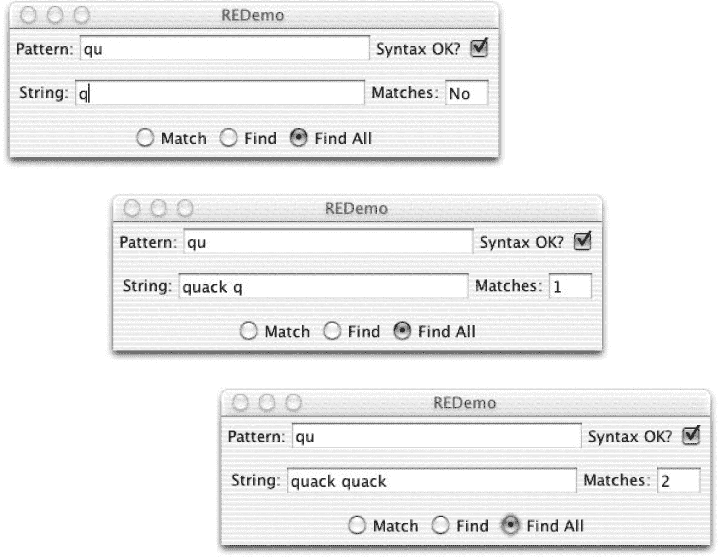
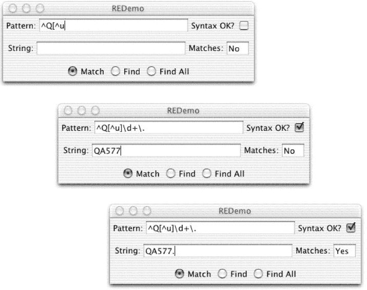
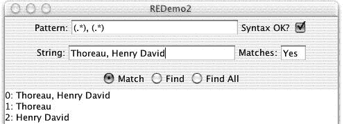

# 第四章：使用正则表达式进行模式匹配

# 4.0 简介

假设你已经在互联网上几年了，并且一直在保留所有通讯记录，以防万一您（或您的律师或检察官）需要一份副本。结果是您有一个专门用于保存邮件的 5 GB 磁盘分区。让我们进一步假设您记得在其中的某个位置有一封来自某个名叫 Angie 或 Anjie 的人的电子邮件。还是说是 Angy？但您不记得您如何称呼它或者您将其存储在何处。显然，您得去找它。

但是当你们中的一些人试图在文字处理器中打开所有 15,000,000 个文档时，我只需用一个简单的命令找到它。任何提供正则表达式支持的系统都允许我以几种方式搜索模式。最简单易懂的是：

```java
Angie|Anjie|Angy
```

您可能猜到这意味着只需搜索任何变体。更简洁的形式（更多思考，更少打字）是：

```java
An[^ dn]
```

语法将在我们进行本章讨论时变得清晰。简而言之，“A”和“n”会自动匹配它们自己，实际上找到以“An”开头的单词，而神秘的`[^ dn]`要求“An”后面跟着一个不是（*^*在这里的意思是*not*）空格的字符（以消除在句子开头非常常见的英语单词“an”）或“d”（以消除常见词“and”）或“n”（以消除“Anne”、“Announcing”等）。您的文字处理器是否已经跳过了它的闪屏页面？好吧，这没关系，因为我已经找到了丢失的文件。要找到答案，我只需输入这个命令：

```java
grep 'An[^ dn]' *
```

*正则表达式*，或称为*regexes*，提供了一种简洁而精确的模式规范，用于在文本中匹配。一种好的理解正则表达式的方式是它是用于在字符串中匹配字符模式的一种小语言。正则表达式 API 是用于匹配正则表达式的[解释器](https://en.wikipedia.org/wiki/Interpreter_(computing))。

另一个正则表达式强大之处的例子是考虑大规模更新数百个文件的问题。当我开始学习 Java 时，声明数组引用的语法是`baseType arrayVariableName[]`。例如，一个带有数组参数的方法，例如每个程序的主方法，通常是这样写的：

```java
public static void main(String args[]) {
```

但随着时间的推移，Java 语言的管理者们认识到将其写为`baseType[] arrayVariableName`会更好，就像这样：

```java
public static void main(String[] args) {
```

这是更好的 Java 风格，因为它将类型的“数组性”与类型本身关联起来，而不是与局部参数名关联，并且编译器仍然接受这两种模式。我希望将所有以旧方式编写的`main`更改为新方式。我使用了模式*`main(String [a-z]`*，通过之前描述的*grep*实用程序查找所有包含旧式主体声明（即`main(String`后跟一个空格和一个名称字符而不是一个开方括号）的文件名。然后，我在一个小的 shell 脚本中使用另一个基于正则表达式的 Unix 工具流编辑器*sed*来更改这些文件中所有出现的内容，从*`main(String *([a-z][a-z]*)[]`*到*`main(String[] $1`*（此处使用的正则表达式语法在本章后面讨论）。同样，基于正则表达式的方法比交互式地进行操作快得多，即使使用像`vi`或`emacs`这样的强大编辑器，更不用说尝试使用图形化的文字处理器了。

历史上，随着正则表达式被越来越多的工具和编程语言所采纳，其语法也发生了变化，因此先前示例中的确切语法并不完全适用于 Java，但它确实传达了正则表达式机制的简洁性和强大性。^(1)

第三个例子是解析 Apache Web 服务器日志文件，其中一些字段用引号分隔，另一些用方括号分隔，还有些用空格分隔。在任何语言中编写解析代码都很混乱，但是一个精心设计的正则表达式可以在一次操作中将行分解为所有组成部分（此示例在配方 4.10 中开发）。

Java 开发人员也可以获得同样的时间节省。正则表达式支持已经在标准 Java 运行时中存在多年，并且得到了很好的集成（例如，标准类`java.lang.String`和新 I/O 包中都有正则表达式方法）。Java 还有一些其他正则表达式包，偶尔可能会遇到使用它们的代码，但几乎所有本世纪的代码都可以预期使用内置包。Java 正则表达式的语法本身在配方 4.1 中讨论，使用正则表达式的 Java API 的语法在配方 4.2 中描述。其余的配方展示了 Java 中正则表达式技术的一些应用。

## 参见

*[精通正则表达式](http://shop.oreilly.com/product/9780596528126.do)* 由 Jeffrey Friedl（O’Reilly）是正则表达式所有细节的权威指南。Unix 和 Perl 的大多数入门书籍都包含对正则表达式的讨论；*[Unix 权威指南](http://shop.oreilly.com/product/9780596003302.do)* 由 Mike Loukides、Tim O’Reilly、Jerry Peek 和 Shelley Powers（O’Reilly）专门有一章介绍正则表达式。

# 4.1 正则表达式语法

## 问题

您需要学习 Java 正则表达式的语法。

## 解决方案

参考 Table 4-1 获取正则表达式字符列表。

## 讨论

这些模式字符允许您指定具有相当强大的正则表达式。在构建模式时，您可以使用任何普通文本和元字符或特殊字符的组合，在 Table 4-1 中。这些可以以任何合理的组合方式使用。例如，`a+` 表示字母 `a` 的任意次数，从一次到百万次或无限多次。模式 `Mrs?`\. 匹配 `Mr.` 或 `Mrs.` 而 `.*` 表示任意字符，任意次数，类似于大多数命令行解释器对单独的 `\*` 的含义。模式 `\d+` 表示任意数量的数字。`\d{2,3}` 表示二位或三位数字。

Table 4-1\. 正则表达式元字符语法

| 子表达式 | 匹配 | 注释 |
| --- | --- | --- |
| **通用** |  |  |
| `\^` | 行/字符串的起始位置 |  |
| `$` | 行/字符串的结束位置 |  |
| `\b` | 单词边界 |  |
| `\B` | 非单词边界 |  |
| `\A` | 整个字符串的开始 |  |
| `\z` | 整个字符串的结束 |  |
| `\Z` | 整个字符串的结束（除了允许的最终行终止符） | 参见 Recipe 4.9 |
| . | 任一字符（不包括行终止符） |  |
| `[…]` | “字符类”；包含列出的任一字符 |  |
| `[\^…]` | 不包含列出的任一字符 | 参见 Recipe 4.2 |
| **替代和分组** |  |  |
| `(…)` | 分组（捕获组） | 参见 Recipe 4.3 |
| `&#124;` | 替代 |  |
| `(?`:_`re`_ `)` | 非捕获括号 |  |
| `\G` | 前一次匹配的结束 |  |
| +\+*`n`* | 回溯引用到捕获组编号 *`n`* |  |
| **普通（贪婪）量词** |  |  |
| `{` *`m`*,*`n`* `}` | 从 *`m`* 到 *`n`* 次重复的量词 | 参见 Recipe 4.4 |
| `{` *`m`* `,}` | 至少 *`m`* 次重复的量词 |  |
| `{` *`m`* `}` | 正好 *`m`* 次重复的量词 | 参见 Recipe 4.10 |
| `{`,*`n`* `}` | 0 到 *`n`* 次重复的量词 |  |
| `\*` | 0 或多次重复的量词 | 等同于 `{0,}` |
| `+` | 1 次或更多次重复的量词 | 等同于 `{1,}`；参见 Recipe 4.2 |
| `?` | 0 或 1 次重复的量词（即，确切出现一次，或者根本不出现） | 等同于 `{0,1}` |
| **懒惰（非贪婪）量词** |  |  |
| `{` *`m`*,*`n`* `}?` | 懒惰量词，从 *`m`* 到 *`n`* 次重复 |  |
| `{` *`m`*,}?` | 懒惰量词，至少 *`m`* 次重复 |  |
| `{`,*`n`* `}?` | 懒惰量词，从 0 到 *`n`* 次重复 |  |
| `\*?` | 懒惰量词：0 或多次 |  |
| `+?` | 懒惰量词：1 次或更多次 | 参见 Recipe 4.10 |
| `??` | 懒惰量词：0 或 1 次 |  |
| **占有型（非常贪婪）量词** |  |  |
| `{` *`m`*,*`n`* `}+` | 从*m*到*n*次重复的占有量词 |  |
| `{` *`m`* `,}+` | 至少*m*次重复的占有量词 |  |
| `{`,*`n`* `}+` | 0 到*n*次重复的占有量词 |  |
| `\*+` | 占有量词：0 或更多 |  |
| `++` | 占有量词：1 次或更多 |  |
| `?+` | 占有量词：0 或 1 次 |  |
| **转义和速记** |  |  |
| `\` | 转义（引号）字符：关闭大多数元字符；将后续字母转换为元字符 |  |
| `\Q` | 转义（引用）直到`\E`的所有字符 |  |
| `\E` | 结束以`\Q`开始的引用 |  |
| `\t` | 制表符 |  |
| `\r` | 回车（换行回车）字符 |  |
| `\n` | 换行符 | 参见 Recipe 4.9 |
| `\f` | 换页符 |  |
| `\w` | 单词中的字符 | 使用`\w+`表示一个单词；参见 Recipe 4.10 |
| `\W` | 非单词字符 |  |
| `\d` | 数字字符 | 使用`\d+`表示整数；参见 Recipe 4.2 |
| `\D` | 非数字字符 |  |
| `\s` | 空白字符 | 空格、制表符等，由`java.lang.Character.isWhitespace()`确定 |
| `\S` | 非空白字符 | 参见 Recipe 4.10 |
| **Unicode 区块（代表性样本）** |  |  |
| `\p{InGreek}` | 希腊区块中的字符 | （简单区块） |
| `\P{InGreek}` | 不在希腊区块中的任何字符 |  |
| `\p{Lu}` | 大写字母 | （简单类别） |
| `\p{Sc}` | 货币符号 |  |
| **POSIX 风格的字符类（仅适用于 US-ASCII）** |  |  |
| `\p{Alnum}` | 字母数字字符 | `[A-Za-z0-9]` |
| `\p{Alpha}` | 字母字符 | `[A-Za-z]` |
| `\p{ASCII}` | 任何 ASCII 字符 | `[\x00-\x7F]` |
| `\p{Blank}` | 空格和制表符字符 |  |
| `\p{Space}` | 空格字符 | `[ \t\n\x0B\f\r]` |
| `\p{Cntrl}` | 控制字符 | `[\x00-\x1F\x7F]` |
| `\p{Digit}` | 数字字符 | `[0-9]` |
| `\p{Graph}` | 可打印且可见字符（非空格或控制字符） |  |
| `\p{Print}` | 可打印字符 | 与`\p{Graph}`相同 |
| `\p{Punct}` | 标点字符 | `!"#$%&'()\*+,-./:;<=>?@[]\^_`{&#124;}\~` |
| `\p{Lower}` | 小写字符 | `[a-z]` |
| `\p{Upper}` | 大写字符 | `[A-Z]` |
| `\p{XDigit}` | 十六进制数字字符 | `[0-9a-fA-F]` |

正则表达式尽可能在字符串中匹配任何位置。紧随贪婪量词（在传统 Unix 正则表达式中唯一存在的类型）的模式尽可能多地消耗（匹配），而不会影响接下来的子表达式。紧随占有量词的模式尽可能多地匹配，而不考虑接下来的子表达式。紧随懒惰量词的模式尽可能少地消耗字符，以便仍然能够匹配。

此外，与其他一些语言中的正则表达式包不同，Java 正则表达式包从一开始就被设计用来处理 Unicode 字符。标准的 Java 转义序列`\u+nnnn`用于在模式中指定 Unicode 字符。我们使用`java.lang.Character`的方法来确定 Unicode 字符的属性，例如给定字符是否为空格。再次注意，如果这是在编译中的 Java 字符串中，则必须加倍反斜杠，因为编译器否则会将其解析为“反斜杠-u”后跟一些数字。

为了帮助您了解正则表达式的工作原理，我提供了一个名为 REDemo 的小程序。^(2) REDemo 的代码太长了，无法包含在本书中；您可以在 *darwinsys-api* 仓库的 *regex* 目录中找到 *REDemo.java*，您可以运行它来探索正则表达式的工作原理。

在最上面的文本框中（参见 Figure 4-1），键入您要测试的正则表达式模式。请注意，当您键入每个字符时，都会检查正则表达式的语法；如果语法正确，您会看到其旁边有一个复选标记。然后，您可以选择匹配、查找或查找所有。匹配意味着整个字符串必须与正则表达式匹配，而查找意味着正则表达式必须在字符串中的某个位置找到（查找所有会计算找到的出现次数）。在下方，您键入要与正则表达式匹配的字符串。尽情实验。当您将正则表达式调整到想要的方式时，您可以将其粘贴到您的 Java 程序中。您需要转义（反斜杠）任何由 Java 编译器和 Java 正则表达式包同时特殊处理的字符，例如反斜杠本身、双引号等。一旦您获得想要的正则表达式，就有一个复制按钮（在这些截图中未显示）可将正则表达式导出到剪贴板上，根据您希望如何使用它进行反斜杠加倍或不加倍。

###### 提示

请记住，因为正则表达式是作为将由 Java 编译器编译的字符串输入的，通常需要两个级别的转义以处理任何特殊字符，包括反斜杠和双引号。例如，正则表达式（其中包含双引号）：

```java
"You said it\."
```

必须像这样键入才能成为有效的编译时 Java 语言 `String`：

```java
String pattern = "\"You said it\\.\""
```

在 Java 14+ 中，您也可以使用文本块来避免转义引号：

```java
String pattern = """
	"You said it\\.""""
```

我无法告诉你我有多少次犯了忘记在`\d+`、`\w+`及其类似形式中添加额外反斜杠的错误！

在 Figure 4-1 中，我在 `REDemo` 程序的 Pattern 框中键入了 `qu`，这是一个语法上有效的正则表达式模式：任何普通字符都是其自身的正则表达式，因此这将查找字母 `q` 后跟 `u`。在顶部版本中，我只键入了一个 `q` 到字符串中，这是不匹配的。在第二个版本中，我键入了 `quack` 和第二个 `quack` 的 `q`。因为我已经选择了查找所有，所以计数显示一个匹配项。当我键入第二个 `u` 时，计数将更新为两个，如第三个版本所示。

正则表达式不仅可以进行字符匹配。例如，两个字符的正则表达式 `^T` 将匹配行的开头 (`^`) 立即跟随一个大写字母 T —— 也就是说，任何以大写字母 T 开头的行都会匹配。无论行是否以“Tiny trumpets,” “Titanic tubas,” 或 “Triumphant twisted trombones” 开头，只要第一个位置有大写字母 T 即可。

但是，我们目前并没有取得很大进展。我们真的要投入所有这些精力来开发正则表达式技术，只是为了能够做到使用 `java.lang.String` 的 `startsWith()` 方法已经可以做到的事情吗？嗯，我能听到一些人开始有点不耐烦了。请坐好！如果你想要匹配不仅在第一个位置有字母 T，而且紧随其后立即有元音字母，并且后面有任意数量的单词中的字母，最后是一个感叹号呢？在 Java 中，你肯定可以通过检查 `startsWith("T")` 和 `charAt(1) == 'a' || charAt(1) == 'e'` 等来实现。是的，但是当你这样做的时候，你会写很多非常专门化的代码，这些代码在其他应用程序中无法使用。使用正则表达式，你只需给出模式 `^T[aeiou]\w*!`。也就是说，与之前一样的 `^` 和 `T`，后跟列出元音字母的字符类，然后是任意数量的单词字符 (`\w*`)，最后是感叹号。



###### 图 4-1\. REDemo with simple examples

“但等等，还有更多！” 我已故的伟大老板 [Yuri Rubinsky](https://en.wikipedia.org/wiki/Yuri_Rubinsky) 曾经说过。如果你想要能够在 *运行时* 更改你正在寻找的模式呢？还记得你刚刚编写的所有 Java 代码来匹配第一列的 `T`，加上一个元音字母，一些单词字符，以及一个感叹号吗？好吧，现在是时候将它们扔掉了。因为今天早上我们需要匹配 `Q`，后跟一个不是 `u` 的字母，然后是一些数字，最后是一个句点。当一些人开始编写一个新的函数来实现这个目标时，我们其他人只需漫步到 RegEx 酒吧和餐厅，向酒保点一杯 `^Q[^u]\d+\.` 就可以继续我们的工作了。

好的，如果您需要解释：`[^u]` 表示匹配任何一个不是字符 `u` 的字符。`\d+` 表示一个或多个数字。`+` 是一个量词，表示它后面的内容出现一次或多次，而 `\d` 表示任意一个数字。所以 `\d+` 表示一个、两个或更多位数的数字。最后，`\.`？嗯，`.` 本身是一个元字符。大多数单个元字符在前面加上转义字符就会被禁用。当然不是键盘上的 Esc 键。正则表达式的转义字符是反斜杠。在元字符（如`.`）前面加上这个转义字符会禁用它的特殊含义，因此我们寻找的是一个字面上的句点而不是任何字符。在前面加上几个选定的字母字符（例如 `n`、`r`、`t`、`s`、`w`）的转义字符会将它们转换为元字符。图 4-2 展示了 `^Q[^u]\d+\..` 正则表达式的应用。在第一帧中，我已经输入了正则表达式的一部分 `^Q[^u`。因为有一个未关闭的方括号，语法 OK 标志被关闭了；当我完成正则表达式时，它将被重新打开。在第二帧中，我已经完成了正则表达式的输入，并且我已经输入了数据字符串 `QA577`（您应该期望它匹配 `$$^Q[^u]\d+$$`，但不包括句点，因为我还没有输入它）。在第三帧中，我输入了句点，因此匹配标志设置为是。



###### 图 4-2\. REDemo 示例：“不跟随 u 的 Q”

因为在将正则表达式粘贴到 Java 代码中时需要转义反斜杠，所以当前版本的 `REDemo` 有一个 `复制模式` 按钮，它将正则表达式原样复制以供文档和 Unix 命令使用，并且有一个 `复制模式（反斜杠）` 按钮，它将正则表达式复制到剪贴板上并将反斜杠加倍，以便粘贴到 Java 字符串中。

到目前为止，您至少应该基本掌握了正则表达式在实践中的工作原理。本章的其余部分将提供更多示例，并解释一些更强大的主题，例如捕获组。至于正则表达式在理论上的工作原理——不同的正则表达式风格之间有很多理论细节和差异——对于感兴趣的读者，建议参考 *[Mastering Regular Expressions](http://shop.oreilly.com/product/9780596528126.do)*。同时，让我们开始学习如何编写使用正则表达式的 Java 程序的方法。

# 4.2 在 Java 中使用正则表达式：测试一个模式

## 问题

现在，您可以开始使用正则表达式处理来增强您的 Java 代码，测试给定模式是否可以在给定字符串中匹配。

## 解决方案

使用 Java 正则表达式包，`java.util.regex`。

## 讨论

好消息是，Java 的正则表达式 API 实际上非常易于使用。如果您只需要查找给定的正则表达式是否与字符串匹配，可以使用 `String` 类的便捷方法 `boolean matches()`，它接受一个以字符串形式表示的正则表达式模式作为其参数：

```java
if (inputString.matches(stringRegexPattern)) {
    // it matched... do something with it...
}
```

然而，这只是一个便利程序，而便利总是有代价的。如果正则表达式在程序中要使用一次或两次以上，构建并使用`Pattern`及其`Matcher`更有效率。一个完整的程序示例如下，构建`Pattern`并使用它进行`match`：

```java
public class RESimple {
    public static void main(String[] argv) {
        String pattern = "^Q[^u]\\d+\\.";
        String[] input = {
            "QA777\. is the next flight. It is on time.",
            "Quack, Quack, Quack!"
        };

        Pattern p = Pattern.compile(pattern);

        for (String in : input) {
            boolean found = p.matcher(in).lookingAt();

            System.out.println("'" + pattern + "'" +
            (found ? " matches '" : " doesn't match '") + in + "'");
        }
    }
}
```

`java.util.regex`包含两个类，`Pattern`和`Matcher`，提供了示例[Example 4-1](https://wiki.example.org/javacook-regex-EX-1)中显示的公共 API。

##### 示例 4-1. 正则表达式公共 API

```java
/**
 * The main public API of the java.util.regex package.
 */

package java.util.regex;

public final class Pattern {
    // Flags values ('or' together)
    public static final int
        UNIX_LINES, CASE_INSENSITIVE, COMMENTS, MULTILINE,
        DOTALL, UNICODE_CASE, CANON_EQ;
    // No public constructors; use these Factory methods
    public static Pattern compile(String patt);
    public static Pattern compile(String patt, int flags);
    // Method to get a Matcher for this Pattern
    public Matcher matcher(CharSequence input);
    // Information methods
    public String pattern();
    public int flags();
    // Convenience methods
    public static boolean matches(String pattern, CharSequence input);
    public String[] split(CharSequence input);
    public String[] split(CharSequence input, int max);
}

public final class Matcher {
    // Action: find or match methods
    public boolean matches();
    public boolean find();
    public boolean find(int start);
    public boolean lookingAt();
    // "Information about the previous match" methods
    public int start();
    public int start(int whichGroup);
    public int end();
    public int end(int whichGroup);
    public int groupCount();
    public String group();
    public String group(int whichGroup);
    // Reset methods
    public Matcher reset();
    public Matcher reset(CharSequence newInput);
    // Replacement methods
    public Matcher appendReplacement(StringBuffer where, String newText);
    public StringBuffer appendTail(StringBuffer where);
    public String replaceAll(String newText);
    public String replaceFirst(String newText);
    // information methods
    public Pattern pattern();
}

/* String, showing only the RE-related methods */
public final class String {
    public boolean matches(String regex);
    public String replaceFirst(String regex, String newStr);
    public String replaceAll(String regex, String newStr);
    public String[] split(String regex);
    public String[] split(String regex, int max);
}
```

此 API 足够大，需要一些解释。这些是生产程序中正则表达式匹配的常规步骤：

1.  通过调用静态方法`Pattern.compile()`来创建`Pattern`。

1.  对每个希望查找的`String`（或其他`CharSequence`），通过调用`pattern.matcher(CharSequence)`从模式中请求一个`Matcher`。

1.  调用（一次或多次）结果`Matcher`中的一个查找方法（稍后在本节中讨论）。

`java.lang.CharSequence`接口提供对包含字符集合的对象的简单只读访问。标准实现包括`String`、`StringBuffer`/`StringBuilder`（在[Chapter 3](https://wiki.example.org/ch03.html#javacook-strings)中描述）以及新的 I/O 类`java.nio.CharBuffer`。

当然，您可以以其他方式执行正则表达式匹配，例如使用`Pattern`中的便利方法或甚至在`java.lang.String`中，如下所示：

```java
public class StringConvenience {
    public static void main(String[] argv) {

        String pattern = ".*Q[^u]\\d+\\..*";
        String line = "Order QT300\. Now!";
        if (line.matches(pattern)) {
            System.out.println(line + " matches \"" + pattern + "\"");
        } else {
            System.out.println("NO MATCH");
        }
    }
}
```

但是，三步列表是匹配的标准模式。如果正则表达式仅在程序中使用一次，可能会使用`String`便利程序；如果正则表达式使用超过一次，则值得花时间编译它，因为编译版本运行更快。

此外，`Matcher`具有多个查找方法，提供比`String`便利程序`match()`更灵活的功能。这些是`Matcher`的方法：

`match()`

用于将整个字符串与模式进行比较；这与`java.lang.String`中的常规程序相同。因为它匹配整个`String`，所以我必须在模式之前和之后放置`.*`。

`lookingAt()`

仅用于匹配字符串的开头。

`find()`

用于在字符串中匹配模式（不一定在字符串的第一个字符处），从字符串的开头开始，或者如果先前调用该方法并成功，则从未由上一个匹配项匹配的第一个字符开始。

每种方法都返回`boolean`，其中`true`表示匹配，`false`表示不匹配。要检查给定字符串是否与给定模式匹配，只需输入如下内容：

```java
Matcher m = Pattern.compile(patt).matcher(line);
if (m.find( )) {
    System.out.println(line + " matches " + patt)
}
```

但您可能还想提取匹配的文本，这是下一个配方的主题。

以下示例涵盖了 Matcher API 的用法。最初，示例仅使用`String`类型的参数作为输入源。其他`CharSequence`类型的使用在[Recipe 4.5](https://wiki.example.org/javacook-regex-SECT-5)中介绍。

# 4.3 寻找匹配的文本

## 问题

您需要找到正则表达式匹配的文本。

## 解决方案

有时候你不仅需要知道正则表达式是否匹配了字符串。在编辑器和许多其他工具中，您需要知道确切匹配了哪些字符。请记住，对于像*的量词，匹配的文本长度可能与匹配它的模式长度没有关系。不要低估强大的`.*`，如果允许的话，它可以轻松匹配成千上万个字符。正如您在前面的示例中看到的，您可以仅通过使用`find()`或`matches()`来确定给定匹配是否成功。但在其他应用程序中，您可能需要获取模式匹配的字符。

在前述方法成功调用后，您可以使用`Matcher`上的这些信息方法获取有关匹配的信息：

`start(), end()`

返回字符串中匹配的起始和结束字符的字符位置。

`groupCount()`

返回括号分组（如果有的话）的数量；如果未使用任何组，则返回 0。

`group(int i)`

返回当前匹配的第*i*组匹配的字符，如果*i*大于等于零且小于等于`groupCount()`的返回值。组 0 是整个匹配，因此`group(0)`（或只是`group()`）返回匹配输入的整个部分。

括号或捕获组的概念是正则表达式处理的核心。正则表达式可以嵌套到任意复杂的级别。`group(int)`方法允许您检索匹配给定括号组的字符。如果您没有使用任何显式的括号，则可以将匹配的任何内容视为零级。Example 4-2 展示了*REMatch.java*的部分内容。

##### 示例 4-2\. main/src/main/java/regex/REMatch.java 的一部分

```java
public class REmatch {
    public static void main(String[] argv) {

        String patt = "Q[^u]\\d+\\.";
        Pattern r = Pattern.compile(patt);
        String line = "Order QT300\. Now!";
        Matcher m = r.matcher(line);
        if (m.find()) {
            System.out.println(patt + " matches \"" +
                m.group(0) +
                "\" in \"" + line + "\"");
        } else {
            System.out.println("NO MATCH");
        }
    }
}
```

运行时，这将打印：

```java
Q[\^u]\d+\. matches "QT300." in "Order QT300\. Now!"
```

通过选中`Match`按钮，REDemo 提供了给定正则表达式中所有捕获组的显示；其中一个示例显示在 Figure 4-3 中。



###### 图 4-3\. REDemo 的操作示例

还可以获取模式匹配的起始和结束索引以及文本的长度（请记住，例如此示例中的`\d+`等具有量词的术语可以匹配字符串中任意数量的字符）。可以与`String.substring()`方法结合使用，如下所示：

```java
        String patt = "Q[^u]\\d+\\.";
        Pattern r = Pattern.compile(patt);
        String line = "Order QT300\. Now!";
        Matcher m = r.matcher(line);
        if (m.find()) {
            System.out.println(patt + " matches \"" +
                line.substring(m.start(0), m.end(0)) +
                "\" in \"" + line + "\"");
        } else {
            System.out.println("NO MATCH");
        }
```

假设您需要从字符串中提取多个项目。如果输入为

```java
Smith, John
Adams, John Quincy
```

并且您希望退出

```java
John Smith
John Quincy Adams
```

只需使用以下内容：

```java
public class REmatchTwoFields {
    public static void main(String[] args) {
        String inputLine = "Adams, John Quincy";
        // Construct an RE with parens to "grab" both field1 and field2
        Pattern r = Pattern.compile("(.*), (.*)");
        Matcher m = r.matcher(inputLine);
        if (!m.matches())
            throw new IllegalArgumentException("Bad input");
        System.out.println(m.group(2) + ' ' + m.group(1));
    }
}
```

# 4.4 替换匹配的文本

## 问题

找到某个文本使用模式后，您希望用不同的文本替换该文本，而不干扰字符串的其余部分。

## 解决方案

正如我们在前面的示例中看到的，涉及量词的正则表达式模式可以匹配大量字符，而只需很少的元字符。我们需要一种方法来替换正则表达式匹配的文本，而不更改其前后的其他文本。我们可以手动使用 `String` 方法 `substring()` 来实现这一点。然而，由于这是一个如此常见的需求，Java 正则表达式 API 提供了一些替换方法。

## 讨论

`Matcher` 类提供了几种方法来仅替换匹配模式的文本。在所有这些方法中，你需要传入替换文本或“右侧”替换的内容（这个术语来自历史上的命令行文本编辑器的替换命令，左侧是模式，右侧是替换文本）。这些是替换方法：

`replaceAll(newString)`

替换了所有匹配的字符串

`replaceFirst(newString)`

与上例相同，但只替换第一个匹配项

`appendReplacement(StringBuffer, newString)`

复制直到第一个匹配项之前，再加上给定的 `newString`

`appendTail(StringBuffer)`

在最后一个匹配项后添加文本（通常用于 `appendReplacement` 后）

尽管它们的名称如此，`replace*` 方法的行为符合 `Strings` 的不可变性（参见 “Timeless, Immutable, and Unchangeable”）：它们创建一个执行替换的新 `String` 对象；它们不会（事实上，也不能）修改 `Matcher` 对象中引用的字符串。

Example 4-3 展示了这三种方法的使用。

##### 示例 4-3\. main/src/main/java/regex/ReplaceDemo.java

```java
/**
 * Quick demo of RE substitution: correct U.S. 'favor'
 * to Canadian/British 'favour', but not in "favorite"
 * @author Ian F. Darwin, http://www.darwinsys.com/
 */
public class ReplaceDemo {
    public static void main(String[] argv) {

        // Make an RE pattern to match as a word only (\b=word boundary)
        String patt = "\\bfavor\\b";

        // A test input
        String input = "Do me a favor? Fetch my favorite.";
        System.out.println("Input: " + input);

        // Run it from a RE instance and see that it works
        Pattern r = Pattern.compile(patt);
        Matcher m = r.matcher(input);
        System.out.println("ReplaceAll: " + m.replaceAll("favour"));

        // Show the appendReplacement method
        m.reset();
        StringBuffer sb = new StringBuffer();
        System.out.print("Append methods: ");
        while (m.find()) {
            // Copy to before first match,
            // plus the word "favor"
            m.appendReplacement(sb, "favour");
        }
        m.appendTail(sb);        // copy remainder
        System.out.println(sb.toString());
    }
}
```

当你运行它时，它确实按我们的预期执行：

```java
Input: Do me a favor? Fetch my favorite.
ReplaceAll: Do me a favour? Fetch my favorite.
Append methods: Do me a favour? Fetch my favorite.
```

`replaceAll()` 方法处理了在整个字符串中进行相同更改的情况。如果你想要将每个匹配的出现更改为不同的值，可以在循环中使用 `replaceFirst()`，如在 Example 4-4 中所示。在这里，我们遍历整个字符串，将每个 `cat` 或 `dog` 的出现转换为 `feline` 或 `canine`。这是一个简化的实例，它查找了 *bit.ly* URL，并将其替换为实际的 URL；其中 `computeReplacement` 方法使用了来自 Recipe 12.1 的网络客户端代码。

##### 示例 4-4\. main/src/main/java/regex/ReplaceMulti.java

```java
/**
 * To perform multiple distinct substitutions in the same String,
 * you need a loop, and must call reset() on the matcher.
 */
public class ReplaceMulti {
    public static void main(String[] args) {

        Pattern patt = Pattern.compile("cat|dog");
        String line = "The cat and the dog never got along well.";
        System.out.println("Input: " + line);
        Matcher matcher = patt.matcher(line);
        while (matcher.find()) {
            String found = matcher.group(0);
            String replacement = computeReplacement(found);
            line = matcher.replaceFirst(replacement);
            matcher.reset(line);
        }
        System.out.println("Final: " + line);
    }

    static String computeReplacement(String in) {
        switch(in) {
        case "cat": return "feline";
        case "dog": return "canine";
        default: return "animal";
        }
    }
}
```

如果你需要引用与正则表达式匹配的部分，可以在模式中用额外的括号标记它们，并在替换字符串中使用 `$1`、`$2` 等来引用匹配的部分。Example 4-5 就是使用这种方法来交换两个字段，即将形如 `Firstname Lastname` 的姓名转换为 `Lastname, FirstName`。

##### 示例 4-5\. main/src/main/java/regex/ReplaceDemo2.java

```java
public class ReplaceDemo2 {
    public static void main(String[] argv) {

        // Make an RE pattern
        String patt = "(\\w+)\\s+(\\w+)";

        // A test input
        String input = "Ian Darwin";
        System.out.println("Input: " + input);

        // Run it from a RE instance and see that it works
        Pattern r = Pattern.compile(patt);
        Matcher m = r.matcher(input);
        m.find();
        System.out.println("Replaced: " + m.replaceFirst("$2, $1"));

        // The short inline version:
        // System.out.println(input.replaceFirst("(\\w+)\\s+(\\w+)", "$2, $1"));
    }
}
```

# 4.5 打印模式的所有出现

## 问题

你需要在一个或多个文件或其他来源中查找所有匹配给定正则表达式的字符串。

## 解决方案

此示例逐行读取文件。每当找到匹配项时，我从`line`中提取并打印它。

这段代码从 Recipe 4.3 中获取了`group()`方法，从`CharacterIterator`接口中获取了`substring`方法，并从正则表达式中获取了`match()`方法，然后将它们组合在一起。我编写它来从给定文件中提取所有名称；在运行程序时，它会打印出`import`、`java`、`until`、`regex`等单词，每个单词独占一行：

```java
C:\> java ReaderIter.java ReaderIter.java
import
java
util
regex
import
java
io
Print
all
the
strings
that
match
given
pattern
from
file
public
...
C:\\>
```

我在这里中断了以节省纸张。这可以有两种写法：一种是逐行模式，如 Example 4-6 中所示，另一种是使用新 I/O 的更紧凑形式，如 Example 4-7 中所示（两个示例中使用的新 I/O 包在 Chapter 10 中描述）。

##### 示例 4-6\. main/src/main/java/regex/ReaderIter.java

```java
public class ReaderIter {
    public static void main(String[] args) throws IOException {
        // The RE pattern
        Pattern patt = Pattern.compile("[A-Za-z][a-z]+");
        // See the I/O chapter
        // For each line of input, try matching in it.
        Files.lines(Path.of(args[0])).forEach(line -> {
            // For each match in the line, extract and print it.
            Matcher m = patt.matcher(line);
            while (m.find()) {
                // Simplest method:
                // System.out.println(m.group(0));

                // Get the starting position of the text
                int start = m.start(0);
                // Get ending position
                int end = m.end(0);
                // Print whatever matched.
                // Use CharacterIterator.substring(offset, end);
                System.out.println(line.substring(start, end));
            }
        });
    }
}
```

##### 示例 4-7\. main/src/main/java/regex/GrepNIO.java

```java
public class GrepNIO {
    public static void main(String[] args) throws IOException {

        if (args.length < 2) {
            System.err.println("Usage: GrepNIO patt file [...]");
            System.exit(1);
        }

        Pattern p=Pattern.compile(args[0]);
        for (int i=1; i<args.length; i++)
            process(p, args[i]);
    }

    static void process(Pattern pattern, String fileName) throws IOException {

        // Get a FileChannel from the given file
        FileInputStream fis = new FileInputStream(fileName);
        FileChannel fc = fis.getChannel();

        // Map the file's content
        ByteBuffer buf = fc.map(FileChannel.MapMode.READ_ONLY, 0, fc.size());

        // Decode ByteBuffer into CharBuffer
        CharBuffer cbuf =
            Charset.forName("ISO-8859-1").newDecoder().decode(buf);

        Matcher m = pattern.matcher(cbuf);
        while (m.find()) {
            System.out.println(m.group(0));
        }
        fis.close();
    }
}
```

非阻塞 I/O（NIO）版本显示在 Example 4-7 中，它依赖于 NIO `Buffer`可以用作`CharSequence`的事实。这个程序更通用，因为它的模式参数来自命令行参数。如果以前一个程序的模式参数在命令行上调用，它将打印与前一个示例相同的输出：

```java
java regex.GrepNIO "[A-Za-z][a-z]+"  ReaderIter.java
```

你可能会考虑使用`\w+`作为模式；唯一的区别是，我的模式寻找格式良好的大写单词，而`\w+`会包括 Java 中心的奇怪用法，如`theVariableName`，其中大写字母位于非标准位置。

同样注意，NIO 版本可能更有效，因为它不会像`ReaderIter`那样在每行输入时将`Matcher`重置为新的输入源。

# 4.6 打印包含模式的行

## 问题

你需要查找一个或多个文件中与给定正则表达式匹配的行。

## 解决方案

编写一个简单的类似于*grep*的程序。

## 讨论

正如我之前提到的，一旦你有了一个正则表达式包，你就可以编写类似于*grep*的程序。我之前给出了 Unix 的*grep*程序的示例。*grep*被调用时带有一些可选参数，后面跟着一个必需的正则表达式模式，然后是任意数量的文件名。它打印包含该模式的任何行，与 Recipe 4.5 不同，后者只打印匹配的文本本身。这里是一个例子：

```java
grep "[dD]arwin" *.txt 
```

此代码搜索包含`darwin`或`Darwin`的行，它位于文件名以.txt 结尾的每个文件的每一行中。³ 第一个版本的执行此操作的程序的源是 Example 4-8，名为*Grep0*。它从标准输入读取行，并且不接受任何可选参数，但它处理`Pattern`类实现的完整一套正则表达式（因此与同名的 Unix 程序不完全相同）。我们尚未涵盖用于输入和输出的`java.io`包（请参见 Chapter 10），但我们在此处的使用足够简单，您可能可以直观理解它。在线源包括*Grep1*，它执行相同操作但结构更好（因此更长）。本章后面的 Recipe 4.11 介绍了一个名为*JGrep*的程序，该程序解析一组命令行选项。

##### 示例 4-8\. main/src/main/java/regex/Grep0.java

```java
public class Grep0 {
    public static void main(String[] args) throws IOException {
        BufferedReader is =
            new BufferedReader(new InputStreamReader(System.in));
        if (args.length != 1) {
            System.err.println("Usage: MatchLines pattern");
            System.exit(1);
        }
        Pattern patt = Pattern.compile(args[0]);
        Matcher matcher = patt.matcher("");
        String line = null;
        while ((line = is.readLine()) != null) {
            matcher.reset(line);
            if (matcher.find()) {
                System.out.println("MATCH: " + line);
            }
        }
    }
}
```

# 4.7 在正则表达式中控制大小写

## 问题

您希望无视大小写地查找文本。

## 解决方案

编译`Pattern`时，传入`Pattern.CASE_INSENSITIVE`作为`flags`参数，指示匹配应该是不区分大小写的（即应该忽略大小写的差异）。如果您的代码可能在不同的地区运行（参见 Recipe 3.12），那么应添加`Pattern.UNICODE_CASE`。如果没有这些标志，默认行为是普通的大小写敏感匹配行为。像这样将这些标志（和其他标志）传递给`Pattern.compile()`方法：

```java
// regex/CaseMatch.java
Pattern  reCaseInsens = Pattern.compile(pattern, Pattern.CASE_INSENSITIVE |
    Pattern.UNICODE_CASE);
reCaseInsens.matches(input);        // will match case-insensitively
```

在创建`Pattern`时必须传递此标志；因为`Pattern`对象是不可变的，一旦构建就无法更改。

此示例的完整源代码在线查看，文件名为*CaseMatch.java*。

# 4.8 匹配重音或复合字符

## 问题

您希望字符匹配无论以何种形式输入。

## 解决方案

使用`Pattern.CANON_EQ`作为规范相等性的`flags`参数来编译`Pattern`。

## 讨论

复合字符可以以多种形式输入。例如，考虑带有重音符号的字母`e`。这个字符可能以多种形式出现在 Unicode 文本中，例如单个字符`é`（Unicode 字符`\u00e9`）或两字符序列`e´`（e 后跟 Unicode 组合的重音符号`\u0301`）。为了允许您匹配这些字符，无论使用哪种可能的完全分解形式，正则表达式包中有一个*规范匹配*选项，它将任何形式视为等效。通过在`Pattern.compile()`的第二个参数中传递`CANON_EQ`来启用此选项。此程序展示了使用`CANON_EQ`来匹配多种形式的示例：

```java
public class CanonEqDemo {
    public static void main(String[] args) {
        String pattStr = "\u00e9gal"; // egal
        String[] input = {
                "\u00e9gal", // egal - this one had better match :-)
                "e\u0301gal", // e + "Combining acute accent"
                "e\u02cagal", // e + "modifier letter acute accent"
                "e'gal", // e + single quote
                "e\u00b4gal", // e + Latin-1 "acute"
        };
        Pattern pattern = Pattern.compile(pattStr, Pattern.CANON_EQ);
        for (int i = 0; i < input.length; i++) {
            if (pattern.matcher(input[i]).matches()) {
                System.out.println(
                    pattStr + " matches input " + input[i]);
            } else {
                System.out.println(
                    pattStr + " does not match input " + input[i]);
            }
        }
    }
}
```

此程序正确匹配组合重音符号并拒绝其他字符，其中一些不幸地看起来像打印机上的重音符号，但不被视为组合重音符号：

```java
égal matches input égal
égal matches input e?gal
égal does not match input e?gal
égal does not match input e'gal
égal does not match input e´gal
```

更多详情，请查看[字符图表](http://www.unicode.org)。

# 4.9 匹配文本中的换行符

## 问题

您需要在文本中匹配换行符。

## 解决方案

在您的正则表达式模式中使用`\n`或`\r`。还可以参考标志常量`Pattern.MULTILINE`，它使换行符作为行首和行尾（`\^`和`$`）匹配。

## 讨论

虽然 Unix 中的面向行的工具（如*sed*和*grep*）一次只匹配一行的正则表达式，但并非所有工具都是如此。贝尔实验室的*sam*文本编辑器是我知道的第一个允许多行正则表达式的交互式工具；Perl 脚本语言随后也跟进。在 Java API 中，默认情况下，换行符在正则表达式中没有特殊意义。`BufferedReader`方法`readLine()`通常会剥离掉它找到的任何换行符。如果您使用除`readLine()`之外的某些方法读取大量字符，可能会在文本字符串中有一些`\n`、`\r`或`\r\n`序列。通常情况下，这些都等同于`\n`。如果您只想匹配`\n`，请使用`Pattern.compile()`方法的`UNIX_LINES`标志。

在 Unix 中，`^`和`$`通常用于分别匹配行的开头和结尾。在此 API 中，正则表达式元字符`\^`和`$`会忽略换行符，并且只在整个字符串的开头和结尾匹配。然而，如果您向`Pattern.compile()`方法传递`MULTILINE`标志，这些表达式将在换行符的后面或前面匹配；`$`也会匹配字符串的最后。因为换行符只是普通字符，您可以用`.`或类似的表达式来匹配它；如果您想确切地知道它在哪里，模式中的`\n`或`\r`也可以匹配它。换句话说，对于此 API，换行符只是没有特殊意义的另一个字符。请参见侧边栏“Pattern.compile() Flags”。换行符匹配的示例显示在示例 4-9 中。

##### 示例 4-9\. main/src/main/java/regex/NLMatch.java

```java
public class NLMatch {
    public static void main(String[] argv) {

        String input = "I dream of engines\nmore engines, all day long";
        System.out.println("INPUT: " + input);
        System.out.println();

        String[] patt = {
            "engines.more engines",
            "ines\nmore",
            "engines$"
        };

        for (int i = 0; i < patt.length; i++) {
            System.out.println("PATTERN " + patt[i]);

            boolean found;
            Pattern p1l = Pattern.compile(patt[i]);
            found = p1l.matcher(input).find();
            System.out.println("DEFAULT match " + found);

            Pattern pml = Pattern.compile(patt[i],
                Pattern.DOTALL|Pattern.MULTILINE);
            found = pml.matcher(input).find();
            System.out.println("MultiLine match " + found);
            System.out.println();
        }
    }
}
```

如果您运行此代码，第一个模式（带有通配符字符`.`）总是匹配，而第二个模式（带有`$`）仅在设置了`MATCH_MULTILINE`时匹配：

```java
> java regex.NLMatch
INPUT: I dream of engines
more engines, all day long

PATTERN engines
more engines
DEFAULT match true
MULTILINE match: true

PATTERN engines$
DEFAULT match false
MULTILINE match: true
```

# 4.10 程序：解析 Apache 日志文件

Apache Web 服务器是世界上领先的 Web 服务器，几乎在 Web 的整个历史上都是如此。它是世界上最著名的开源项目之一，是 Apache 基金会孵化的第一个项目。Apache 这个名字通常被认为是对服务器起源的一个双关语；其开发人员从自由的 NCSA 服务器开始，并不断地对其进行改进或修补，直到它符合他们的要求。当它与原始版本有了足够的不同之后，就需要一个新的名字。因为它现在是一个“补丁”（patchy）的服务器，所以选择了 Apache 这个名字。官方对这个故事持否定态度，但这个故事非常有趣。实际上显示补丁性的一个地方是日志文件格式。请参考 Example 4-10。

##### Example 4-10\. Apache 日志文件摘录

```java
123.45.67.89 - - [27/Oct/2000:09:27:09 -0400] "GET /java/javaResources.html
HTTP/1.0" 200 10450 "-" "Mozilla/4.6 [en] (X11; U; OpenBSD 2.8 i386; Nav)"
```

显然，该文件格式设计用于人类检查，但不易于解析。问题在于使用了不同的分隔符：日期用方括号，请求行用引号，整个过程中还散布有空格。考虑尝试使用`StringTokenizer`；你可能能让它工作，但会花费大量时间摆弄它。实际上，不，你不会让它工作。然而，这个有些扭曲的正则表达式^(5)使得解析变得很容易（这是一个超大规模的单个正则表达式；我们不得不将其分成两行以适应书籍的边距）：

```java
\^([\d.]+) (\S+) (\S+) \[([\w:/]+\s[+\-]\d{4})\] "(.+?)" (\d{3}) (\d+)
  "([\^"]+)" "([\^"]+)"
```

如果你回顾一下 Table 4-1，并仔细查看这里使用的完整语法，你可能会觉得很有趣。特别注意在`\"(.+?)\`"中使用了非贪婪量词`+?`来匹配引号括起的字符串；你不能仅使用`.+`，因为那样会匹配太多（直到行尾的引号）。代码用于提取诸如 IP 地址、请求、引用 URL 和浏览器版本等各种字段，在 Example 4-11 中显示。

##### Example 4-11\. main/src/main/java/regex/LogRegExp.java

```java
public class LogRegExp {

    final static String logEntryPattern =
            "^([\\d.]+) (\\S+) (\\S+) \\[([\\w:/]+\\s[+-]\\d{4})\\] " +
            "\"(.+?)\" (\\d{3}) (\\d+) \"([^\"]+)\" \"([^\"]+)\"";

    public static void main(String argv[]) {

        System.out.println("RE Pattern:");
        System.out.println(logEntryPattern);

        System.out.println("Input line is:");
        String logEntryLine = LogParseInfo.LOG_ENTRY_LINE;
        System.out.println(logEntryLine);

        Pattern p = Pattern.compile(logEntryPattern);
        Matcher matcher = p.matcher(logEntryLine);
        if (!matcher.matches() ||
            LogParseInfo.MIN_FIELDS > matcher.groupCount()) {
            System.err.println("Bad log entry (or problem with regex):");
            System.err.println(logEntryLine);
            return;
        }
        System.out.println("IP Address: " + matcher.group(1));
        System.out.println("UserName: " + matcher.group(3));
        System.out.println("Date/Time: " + matcher.group(4));
        System.out.println("Request: " + matcher.group(5));
        System.out.println("Response: " + matcher.group(6));
        System.out.println("Bytes Sent: " + matcher.group(7));
        if (!matcher.group(8).equals("-"))
            System.out.println("Referer: " + matcher.group(8));
        System.out.println("User-Agent: " + matcher.group(9));
    }
}
```

`implements` 子句用于仅定义输入字符串的接口；它在演示中被用来比较正则表达式模式与使用`StringTokenizer`。两个版本的源代码都在本章节的在线资源中。对 Example 4-10 中的示例输入运行程序将得到以下输出：

```java
Using regex Pattern:
\^([\d.]+) (\S+) (\S+) \[([\w:/]+\s[+\-]\d{4})\] "(.+?)" (\d{3}) (\d+) "([\^"]+)"
"([\^"]+)"
Input line is:
123.45.67.89 - - [27/Oct/2000:09:27:09 -0400] "GET /java/javaResources.html
HTTP/1.0" 200 10450 "-" "Mozilla/4.6 [en] (X11; U; OpenBSD 2.8 i386; Nav)"
IP Address: 123.45.67.89
Date&Time: 27/Oct/2000:09:27:09 -0400
Request: GET /java/javaResources.html HTTP/1.0
Response: 200
Bytes Sent: 10450
Browser: Mozilla/4.6 [en] (X11; U; OpenBSD 2.8 i386; Nav)
```

程序成功地通过一次调用`matcher.matches()`成功解析了整个日志文件格式条目。

# 4.11 程序：完整的 Grep

现在我们已经看到正则表达式包如何工作，是时候编写 JGrep 了，这是一个完整的行匹配程序，并包含选项解析。Table 4-2 列出了 Unix 实现中 *grep* 可能包含的一些典型命令行选项。对于不熟悉 *grep* 的人来说，它是一个在文本文件中搜索正则表达式的命令行工具。标准 *grep* 家族中有三到四个程序，还有一个更新的替代 *ripgrep* 或 *rg*。这个程序是我对这类程序家族的补充。

Table 4-2\. Grep 命令行选项

| Option | 意义 |
| --- | --- |
| -c | 仅计数；不打印行，只计数 |
| -C | 上下文；打印与匹配行上下几行（在此版本中未实现；留给读者作为练习） |
| -f pattern | 从名为`-f`的文件中获取模式，而不是从命令行获取 |
| -h | 抑制在行前打印文件名 |
| -i | 忽略大小写 |
| -l | 仅列出文件名：不打印行，只打印它们所在的文件名 |
| -n | 在匹配行之前打印行号 |
| -s | 抑制打印某些错误消息 |
| -v | 反向：仅打印不匹配模式的行 |

Unix 世界提供了几个用于解析命令行参数的*getopt*库例程，因此我在 Java 中重新实现了这一过程。通常情况下，因为`main()`在静态上下文中运行而我们的应用程序主行没有运行，所以我们可能会传递大量信息到构造函数中。为了节省空间，此版本仅使用全局变量来跟踪从命令行获取的设置。与 Unix 的*grep*工具不同，这个工具尚不能处理组合选项，因此`-l -r -i`是可以的，但`-lri`将失败，这是由于使用的`GetOpt`解析器的限制。

该程序基本上只是读取行，匹配其中的模式，如果找到匹配（或者使用`-v`找不到），则打印该行（以及可选的其他一些东西）。话虽如此，代码显示在 Example 4-12 中。

##### Example 4-12\. darwinsys-api/src/main/java/regex/JGrep.java

```java
/** A command-line grep-like program. Accepts some command-line options,
 * and takes a pattern and a list of text files.
 * N.B. The current implementation of GetOpt does not allow combining short
 * arguments, so put spaces e.g., "JGrep -l -r -i pattern file..." is OK, but
 * "JGrep -lri pattern file..." will fail. Getopt will hopefully be fixed soon.
 */
public class JGrep {
    private static final String USAGE =
        "Usage: JGrep pattern [-chilrsnv][-f pattfile][filename...]";
    /** The pattern we're looking for */
    protected Pattern pattern;
    /** The matcher for this pattern */
    protected Matcher matcher;
    private boolean debug;
    /** Are we to only count lines, instead of printing? */
    protected static boolean countOnly = false;
    /** Are we to ignore case? */
    protected static boolean ignoreCase = false;
    /** Are we to suppress printing of filenames? */
    protected static boolean dontPrintFileName = false;
    /** Are we to only list names of files that match? */
    protected static boolean listOnly = false;
    /** Are we to print line numbers? */
    protected static boolean numbered = false;
    /** Are we to be silent about errors? */
    protected static boolean silent = false;
    /** Are we to print only lines that DONT match? */
    protected static boolean inVert = false;
    /** Are we to process arguments recursively if directories? */
    protected static boolean recursive = false;

    /** Construct a Grep object for the pattern, and run it
 * on all input files listed in args.
 * Be aware that a few of the command-line options are not
 * acted upon in this version - left as an exercise for the reader!
 * @param args args
 */
    public static void main(String[] args) {

        if (args.length < 1) {
            System.err.println(USAGE);
            System.exit(1);
        }
        String patt = null;

        GetOpt go = new GetOpt("cf:hilnrRsv");

        char c;
        while ((c = go.getopt(args)) != 0) {
            switch(c) {
                case 'c':
                    countOnly = true;
                    break;
                case 'f':    /* External file contains the pattern */
                    try (BufferedReader b =
                        new BufferedReader(new FileReader(go.optarg()))) {
                        patt = b.readLine();
                    } catch (IOException e) {
                        System.err.println(
                            "Can't read pattern file " + go.optarg());
                        System.exit(1);
                    }
                    break;
                case 'h':
                    dontPrintFileName = true;
                    break;
                case 'i':
                    ignoreCase = true;
                    break;
                case 'l':
                    listOnly = true;
                    break;
                case 'n':
                    numbered = true;
                    break;
                case 'r':
                case 'R':
                    recursive = true;
                    break;
                case 's':
                    silent = true;
                    break;
                case 'v':
                    inVert = true;
                    break;
                case '?':
                    System.err.println("Getopts was not happy!");
                    System.err.println(USAGE);
                    break;
            }
        }

        int ix = go.getOptInd();

        if (patt == null)
            patt = args[ix++];

        JGrep prog = null;
        try {
            prog = new JGrep(patt);
        } catch (PatternSyntaxException ex) {
            System.err.println("RE Syntax error in " + patt);
            return;
        }

        if (args.length == ix) {
            dontPrintFileName = true; // Don't print filenames if stdin
            if (recursive) {
                System.err.println("Warning: recursive search of stdin!");
            }
            prog.process(new InputStreamReader(System.in), null);
        } else {
            if (!dontPrintFileName)
                dontPrintFileName = ix == args.length - 1; // Nor if only one file
            if (recursive)
                dontPrintFileName = false;                // unless a directory!

            for (int i=ix; i<args.length; i++) { // note starting index
                try {
                    prog.process(new File(args[i]));
                } catch(Exception e) {
                    System.err.println(e);
                }
            }
        }
    }

    /**
 * Construct a JGrep object.
 * @param patt The regex to look for
 * @throws PatternSyntaxException if pattern is not a valid regex
 */
    public JGrep(String patt) throws PatternSyntaxException {
        if (debug) {
            System.err.printf("JGrep.JGrep(%s)%n", patt);
        }
        // compile the regular expression
        int caseMode = ignoreCase ?
            Pattern.UNICODE_CASE | Pattern.CASE_INSENSITIVE :
            0;
        pattern = Pattern.compile(patt, caseMode);
        matcher = pattern.matcher("");
    }

    /** Process one command line argument (file or directory)
 * @param file The input File
 * @throws FileNotFoundException If the file doesn't exist
 */
    public void process(File file) throws FileNotFoundException {
        if (!file.exists() || !file.canRead()) {
            throw new FileNotFoundException(
                "Can't read file " + file.getAbsolutePath());
        }
        if (file.isFile()) {
            process(new BufferedReader(new FileReader(file)),
                file.getAbsolutePath());
            return;
        }
        if (file.isDirectory()) {
            if (!recursive) {
                System.err.println(
                    "ERROR: -r not specified but directory given " +
                    file.getAbsolutePath());
                return;
            }
            for (File nf : file.listFiles()) {
                process(nf);    // "Recursion, n.: See Recursion."
            }
            return;
        }
        System.err.println(
            "WEIRDNESS: neither file nor directory: " + file.getAbsolutePath());
    }

    /** Do the work of scanning one file
 * @param    ifile    Reader    Reader object already open
 * @param    fileName String    Name of the input file
 */
    public void process(Reader ifile, String fileName) {

        String inputLine;
        int matches = 0;

        try (BufferedReader reader = new BufferedReader(ifile)) {

            while ((inputLine = reader.readLine()) != null) {
                matcher.reset(inputLine);
                if (matcher.find()) {
                    if (listOnly) {
                        // -l, print filename on first match, and we're done
                        System.out.println(fileName);
                        return;
                    }
                    if (countOnly) {
                        matches++;
                    } else {
                        if (!dontPrintFileName) {
                            System.out.print(fileName + ": ");
                        }
                        System.out.println(inputLine);
                    }
                } else if (inVert) {
                    System.out.println(inputLine);
                }
            }
            if (countOnly)
                System.out.println(matches + " matches in " + fileName);
        } catch (IOException e) {
            System.err.println(e);
        }
    }
}
```

^(1) 非 Unix 粉丝不必担心，在 Windows 系统上可以使用诸如*grep*之类的工具，使用几种不同的软件包。其中一个是开源软件包，交替称为 CygWin（源自 Cygnus Software）或[GnuWin32](http://sources.redhat.com/cygwin)。另一个是微软的*findstr*命令。或者，如果你的系统上没有*grep*，可以使用我在 Recipe 4.6 中展示的*Grep*程序。顺便说一句，*grep*的名字来自于古老的 Unix 行编辑器命令*g/RE/p*，即在编辑缓冲区中全局查找正则表达式并打印匹配行的命令——这正是*grep*程序对文件中的行所做的事情。

^(2) REDemo 受到（但未使用任何代码）现已退役的 Apache Jakarta 正则表达式包中提供的类似程序的启发。

^(3) 在 Unix 上，Shell 或命令行解释器在运行程序之前会将**.txt*扩展到所有匹配的文件名，但在没有足够活跃或聪明的 Shell 系统上，正常的 Java 解释器会为你完成这些工作。

^(4) 或者一些相关的 Unicode 字符，包括下一行（`\u0085`）、行分隔符（`\u2028`）和段落分隔符（`\u2029`）字符。

^(5) 你可能会认为这在正则表达式比赛中是某种复杂性世界纪录，但我相信它已经被超越了许多次。
