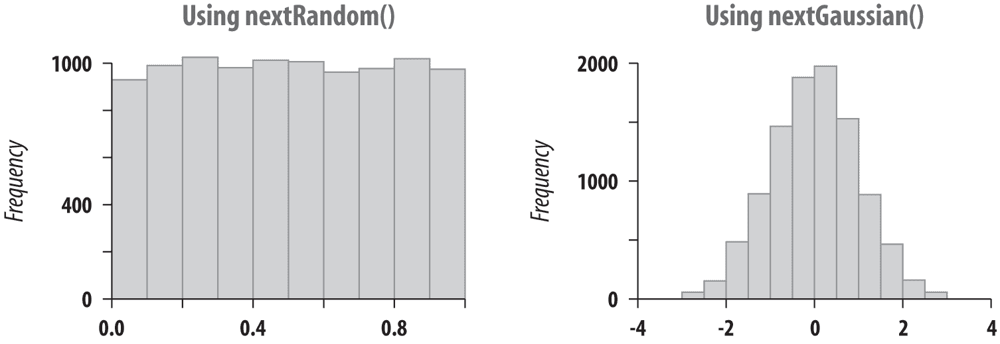

# 第五章。数字

# 5.0 简介

数字是几乎所有计算的基础。它们用于数组索引、温度、薪水、评分以及各种各样的事情。然而，它们并不像它们看起来那么简单。对于浮点数，精度有多精确？对于随机数，随机有多随机？对于应该包含数字的字符串，什么才算是数字？

Java 有几种内置的或 *原始* 类型可用于表示数字，总结在 Table 5-1 中，以及它们的 *包装*（对象）类型，以及一些不表示原始类型的数值类型。请注意，与诸如 C 或 Perl 等不指定数值类型的大小或精度的语言不同，Java —— 其目标是可移植性 —— 精确地指定了这些，并声明它们在所有平台上都是相同的。

表 5-1。数值类型

| 内置类型 | 对象包装器 | 内置大小（位） | 内容 |
| --- | --- | --- | --- |
| `byte` | `Byte` | 8 | 有符号整数 |
| `short` | `Short` | 16 | 有符号整数 |
| `int` | `Integer` | 32 | 有符号整数 |
| `long` | `Long` | 64 | 有符号整数 |
| `float` | `Float` | 32 | IEEE-754 浮点数 |
| `double` | `Double` | 64 | IEEE-754 浮点数 |
| `char` | `Character` | 16 | 无符号 Unicode 字符 |
| n/a | `BigInteger` | 无限制 | 任意大小的不可变整数值 |
| n/a | `BigDecimal` | 无限制 | 任意大小和精度的不可变浮点值 |

如你所见，Java 提供了几乎任何目的的数字类型。有四种大小的有符号整数，用于表示各种大小的整数。有两种大小的浮点数来近似实数。还有一种类型专门设计用于表示和允许对 Unicode 字符进行操作。这里讨论了原始数值类型。大数值类型在 Recipe 5.12 中描述。

当你从用户输入或文本文件中读取表示数字的字符串时，你需要将其转换为适当的类型。第二列中的对象包装类有几个函数，其中之一是提供此基本转换功能的—替换 C 程序员的 *atoi*/*atof* 函数系列和 *scanf* 的数值参数。

另一种方法是，你可以通过使用字符串连接来将任何数字（事实上，Java 中的任何东西）转换为字符串。如果你想对数字格式进行一点控制，Recipe 5.5 展示了如何使用一些对象包装器的转换例程。如果你想要完全控制，该配方还展示了使用 `NumberFormat` 及其相关类来提供完全控制格式的方法。

正如 *对象包装* 这个名字所暗示的，这些类也用于在 Java 对象中包装一个数字，因为标准 API 的许多部分都是以对象的形式定义的。稍后的 “解决方案” 展示了如何使用 `Integer` 对象将 `int` 的值保存到文件中，并稍后检索该值。

但我还没有提到浮点数的问题。实数，你可能记得，是带有小数部分的数字。实数有无限多个。计算机用来近似实数的浮点数并非与实数相同。浮点数的数量是有限的，`float` 有 2³² 个不同的位模式，`double` 有 2⁶⁴ 个。因此，大多数实数值与浮点数只有近似对应关系。打印实数 0.3 的结果是正确的，如下所示：

```java
// numbers/RealValues.java
System.out.println("The real value 0.3 is " + 0.3);
```

该代码的输出是：

```java
The real value 0.3 is 0.3
```

但是，如果将值用于计算，实际值与其浮点数近似值之间的差异可能会累积；这通常称为 *舍入误差*。继续前面的例子，实数 0.3 乘以 3 的结果是：

```java
The real 0.3 times 3 is 0.89999999999999991
```

惊讶吗？它不仅比你预期的偏了一点，而且在任何符合 Java 实现上都会得到相同的输出。我在不同的机器上运行过它，如 AMD/Intel PC 上的 OpenBSD、带有标准 JDK 的 Windows PC 和 macOS 上。始终得到相同的答案。

随机数又如何呢？它们有多随机？你可能听说过 *伪随机数生成器* 或 PRNG 这个术语。所有传统的随机数生成器，无论是用 Fortran、C 还是 Java 编写的，都生成伪随机数。也就是说，它们并非真正随机！真正的随机性只能来自专门构建的硬件：例如连接到模拟至数字转换器的布朗噪声的模拟源。¹ 如今的普通 PC 可能具有一些良好的熵源，甚至是硬件基础的随机源（尚未广泛使用或测试）。然而，对于大多数目的，伪随机数生成器已经足够好，因此我们使用它们。Java 在基础库 `java.lang.Math` 中提供了一个随机生成器和其他几个；我们将在 食谱 5.9 中详细讨论这些。

类 `java.lang.Math` 包含一个完整的数学库，包括三角函数、转换（包括度数到弧度和反向转换）、四舍五入、截断、平方根、最小值和最大值。所有这些功能都在这个类中。查看 `java.lang.Math` 的 javadoc 获取更多信息。

包 `java.math` 包含对 *大数* 的支持 —— 即大于普通内置长整数的数字。参见 食谱 5.12。

Java 通过确保程序的可靠性而闻名。您通常会在 Java API 中注意到这一点，常见的体现是需要捕获潜在异常，并在尝试存储可能不适合的值时进行 *强制转换* 或转换。我将展示这些的示例。

总体而言，Java 对数值数据的处理非常符合可移植性、可靠性和编程便利性的理念。

## 参见

[Java 语言规范](https://docs.oracle.com/javase/specs)，以及 `java.lang.Math` 的 javadoc 页面。

# 5.1 检查字符串是否为有效数字

## 问题

您需要检查给定的字符串是否包含有效的数字，如果是，则将其转换为二进制（内部）形式。

## 解决方案

要实现此目标，使用适当的包装类转换程序，并捕获 `NumberFormatException`。以下代码将字符串转换为 `double`：

```java
    public static void main(String[] argv) {
        String aNumber = argv[0];    // not argv[1]
        double result;
        try {
            result = Double.parseDouble(aNumber);
            System.out.println("Number is " + result);
        } catch(NumberFormatException exc) {
            System.out.println("Invalid number " + aNumber);
            return;
        }
    }
```

## 讨论

此代码允许您仅验证符合包装类设计者期望格式的数字。如果需要接受不同定义的数字，可以使用正则表达式（参见 第四章）进行判断。

有时您可能想知道给定的数字是整数还是浮点数。一种方法是检查输入中是否包含 .、`d`、`e` 或 `f` 字符；如果存在其中一个字符，则将数字转换为 `double`。否则，将其作为 `int` 转换：

```java
    /*
 * Process one String, returning it as a Number subclass
 */
    public static Number process(String s) {
        if (s.matches("[+-]*\\d*\\.\\d+[dDeEfF]*")) {
            try {
                double dValue = Double.parseDouble(s);
                System.out.println("It's a double: " + dValue);
                return Double.valueOf(dValue);
            } catch (NumberFormatException e) {
                System.out.println("Invalid double: " + s);
                return Double.NaN;
            }
        } else // did not contain . d e or f, so try as int.
            try {
                int iValue = Integer.parseInt(s);
                System.out.println("It's an int: " + iValue);
                return Integer.valueOf(iValue);
            } catch (NumberFormatException e2) {
                System.out.println("Not a number: " + s);
                return Double.NaN;
            }
    }
```

## 参见

`DecimalFormat` 类提供了更复杂的解析形式，详见 Recipe 5.5。

`Scanner` 类也存在；参见 Recipe 10.6。

# 5.2 将数字转换为对象和反之亦然

## 问题

您需要将数字转换为对象，以及对象转换为数字。

## 解决方案

使用本章开头列出的对象包装类，请参见 表格 5-1。

## 讨论

您经常有一个原始数字，需要将其传递给需要 `Object` 的方法，或者反之亦然。很久以前，您必须调用包装类的转换程序，但现在通常可以使用自动转换（称为 *自动装箱*/*自动拆箱*）。参见 示例 5-1 中的示例。

##### 示例 5-1\. main/src/main/java/structure/AutoboxDemo.java

```java
public class AutoboxDemo {

    /** Shows auto-boxing (in the call to foo(i), i is wrapped automatically)
     * and auto-unboxing (the return value is automatically unwrapped).
     */
    public static void main(String[] args) {
        int i = 42;
        int result = foo(i);            
        System.out.println(result);
    }

    public static Integer foo(Integer i) {
        System.out.println("Object = " + i);
        return Integer.valueOf(123);    
    }
}
```


自动装箱：`int 42` 被转换为 `Integer(42)`。还有自动拆箱：从 `foo()` 返回的 `Integer` 被自动拆箱以赋值给 `int result`。


没有自动装箱：`valueOf()` 返回 `Integer`。如果行中写成 `return Integer.intValueOf(123)`，那么这将是自动装箱的第二个示例，因为方法返回值是 `Integer`。

要显式地在 `int` 和 `Integer` 对象之间进行转换，或者反之亦然，可以使用包装类的方法：

```java
public class IntObject {
    public static void main(String[] args) {
        // int to Integer
        Integer i1 = Integer.valueOf(42);
        System.out.println(i1.toString());        // or just i1

        // Integer to int
        int i2 = i1.intValue();
        System.out.println(i2);
    }
}
```

# 5.3 在不使用浮点数的情况下取整数的分数

## 问题

您希望将整数乘以分数而不将分数转换为浮点数。

## 解决方案

将整数乘以分子然后除以分母。

仅当效率比清晰更重要时，才应使用此技术，因为它倾向于减弱代码的可读性—因此也降低了代码的可维护性。

## 讨论

因为整数和浮点数的存储方式不同，有时为了效率的目的，可能希望以整数乘以分数值而不将值转换为浮点数并返回，也不需要强制转换：

```java
public class FractMult {
    public static void main(String[] u) {

        double d1 = 0.666 * 5;  // fast but obscure and inaccurate: convert
        System.out.println(d1); // 2/3 to 0.666 in programmer's head

        double d2 = 2/3 * 5;    // wrong answer - 2/3 == 0, 0*5 = 0
        System.out.println(d2);

        double d3 = 2d/3d * 5;  // "normal"
        System.out.println(d3);

        double d4 = (2*5)/3d;   // one step done as integers, almost same answer
        System.out.println(d4);

        int i5 = 2*5/3;         // fast, approximate integer answer
        System.out.println(i5);
    }
}
```

运行代码如下：

```java
$ java numbers.FractMult
3.33
0.0
3.333333333333333
3.3333333333333335
3
$
```

如果不能保证通过分子的乘法不会溢出，应该注意可能发生的数值溢出，并避免此优化。

# 5.4 使用浮点数

## 问题

您希望能够比较和四舍五入浮点数。

## 解决方案

与 `INFINITY` 常量进行比较，并使用 `isNaN()` 检查是否为 `NaN`（非数值）。

用一个 epsilon 值比较浮点数值。

用 `Math.round()` 或自定义代码四舍五入浮点数值。

## 讨论

比较可能有些棘手：固定点操作可以做诸如除以零的事情，导致 Java 通过抛出异常来突然通知您。这是因为整数除以零被视为*逻辑错误*。

然而，浮点操作不会抛出异常，因为它们在（几乎）无限的值范围内定义。相反，如果您将正浮点数除以零，则会生成常量 `POSITIVE_INFINITY`；如果将负浮点值除以零，则会生成常量 `NEGATIVE_INFINITY`；如果以其他方式生成无效结果，则会生成 `NaN`。这三个公共常量的值在 `Float` 和 `Double` 包装类中都有定义。值 `NaN` 具有不同寻常的属性，即它不等于自身（即 `NaN` != `NaN`）。因此，将一个（可能可疑的）数字与 `NaN` 进行比较几乎没有意义，因为以下表达式永远不会为真：

```java
x == NaN
```

而应使用方法 `Float.isNaN(float)` 和 `Double.isNaN(double)`：

```java
    public static void main(String[] argv) {
        double d = 123;
        double e = 0;
        if (d/e == Double.POSITIVE_INFINITY)
            System.out.println("Check for POSITIVE_INFINITY works");
        double s = Math.sqrt(-1);
        if (s == Double.NaN)
            System.out.println("Comparison with NaN incorrectly returns true");
        if (Double.isNaN(s))
            System.out.println("Double.isNaN() correctly returns true");
    }
```

请注意，仅此本身并不足以确保浮点数计算具有足够的精度。例如，以下程序演示了一种构造的计算——海伦公式用于三角形的面积——分别使用 `float` 和 `double`。双精度值是正确的，但由于舍入误差，浮点值为零。这是因为在 Java 中，仅涉及 `float` 值的操作是以 32 位计算的。相关的语言如 C 在计算过程中会自动将这些值提升为 double，从而可以消除一些精度损失。让我们来看一下：

```java
public class Heron {
    public static void main(String[] args) {
        // Sides for triangle in float
        float af, bf, cf;
        float sf, areaf;

        // Ditto in double
        double ad, bd, cd;
        double sd, aread;

        // Area of triangle in float
        af = 12345679.0f;
        bf = 12345678.0f;
        cf = 1.01233995f;

        sf = (af+bf+cf)/2.0f;
        areaf = (float)Math.sqrt(sf * (sf - af) * (sf - bf) * (sf - cf));
        System.out.println("Single precision: " + areaf);

        // Area of triangle in double
        ad = 12345679.0;
        bd = 12345678.0;
        cd = 1.01233995;

        sd = (ad+bd+cd)/2.0d;
        aread = Math.sqrt(sd * (sd - ad) * (sd - bd) * (sd - cd));
        System.out.println("Double precision: " + aread);
    }
}
```

现在让我们运行它：

```java
$ java numbers.Heron
Single precision: 0.0
Double precision: 972730.0557076167

```

如果有疑问，使用 `double`！

为了确保在不同的 Java 实现上对非常大幅度的双精度计算保持一致，Java 提供了关键字 `strictfp`，它可以应用于类、接口或类中的方法。² 如果计算是 Strict-FP，那么如果计算会使 `Double.MAX_VALUE` 的值溢出（或者使值 `Double.MIN_VALUE` 的值下溢），它必须始终返回值 `INFINITY`。非 Strict-FP 计算（默认情况下）允许在更大范围内执行计算，并且可以返回在范围内的有效最终结果，即使中间产品超出范围。这非常神秘，仅影响接近双精度范围的计算。

### 比较浮点值

根据我们刚刚讨论的内容，你可能不会只是简单地比较两个浮点数或双精度数的相等性。你可能期望浮点包装类 `Float` 和 `Double` 重写 `equals()` 方法，它们确实如此。`equals()` 方法在这两个值在位上完全相同时返回 `true`（即这两个数相同或都是 `NaN`）。否则返回 `false`，包括传入的参数为 null，或者一个对象是 +0.0 而另一个是 -0.0。

我之前说过 `NaN != NaN`，但是如果使用 `equals()` 进行比较，结果是 true：

```java
jshell> Float f1 = Float.valueOf(Float.NaN)
f1 ==> NaN

jshell> Float f2 = Float.valueOf(Float.NaN)
f2 ==> NaN

jshell> f1 == f2 # Comparing object identities
$4 ==> false

jshell> f1.equals(f1) # bitwise comparison of values
$5 ==> true
```

如果这听起来有些奇怪，请记住，这种复杂性部分来自于在较不精确的浮点硬件中进行实数计算的性质。它也部分来自于 IEEE 标准 754 的细节，该标准指定了 Java 尝试遵循的浮点功能，以便即使在解释 Java 程序时也可以使用底层浮点处理器硬件。

要实际比较浮点数是否相等，通常希望在某个允许误差范围内进行比较；这个范围通常被称为容差或*epsilon*。示例 5-2 展示了一个你可以用来进行这种比较的 `equals()` 方法，以及对 `NaN` 值的比较。运行时，它打印出前两个数字在 epsilon 范围内相等：

```java
$ java numbers.FloatCmp
True within epsilon 1.0E-7
$
```

##### 示例 5-2\. main/src/main/java/numbers/FloatCmp.java

```java
public class FloatCmp {

    final static double EPSILON = 0.0000001;

    public static void main(String[] argv) {
        double da = 3 * .3333333333;
        double db = 0.99999992857;

        // Compare two numbers that are expected to be close.
        if (da == db) {
            System.out.println("Java considers " + da + "==" + db);
        // else compare with our own equals overload
        } else if (equals(da, db, 0.0000001)) {
            System.out.println("Equal within epsilon " + EPSILON);
        } else {
            System.out.println(da + " != " + db);
        }

        System.out.println("NaN prints as " + Double.NaN);

        // Show that comparing two NaNs is not a good idea:
        double nan1 = Double.NaN;
        double nan2 = Double.NaN;
        if (nan1 == nan2)
            System.out.println("Comparing two NaNs incorrectly returns true.");
        else
            System.out.println("Comparing two NaNs correctly reports false.");

        if (Double.valueOf(nan1).equals(Double.valueOf(nan2)))
            System.out.println("Double(NaN).equals(NaN) correctly returns true.");
        else
            System.out.println(
                "Double(NaN).equals(NaN) incorrectly returns false.");
    }

    /** Compare two doubles within a given epsilon */
    public static boolean equals(double a, double b, double eps) {
        if (a==b) return true;
        // If the difference is less than epsilon, treat as equal.
        return Math.abs(a - b) < eps;
    }

    /** Compare two doubles, using default epsilon */
    public static boolean equals(double a, double b) {
        return equals(a, b, EPSILON);
    }
}
```

注意，关于不正确返回的 `System.err` 消息，没有任何打印。这个带有 `NaN` 的例子的重点在于，在将值委托给 `Double.equals()` 之前，你应该始终确保这些值不是 `NaN`。

### 舍入

如果你简单地将浮点值强制转换为整数值，Java 会截断该值。像 3.999999 这样的值，被转换为 `int` 或 `long` 就变成了 3，而不是 4。要正确地四舍五入浮点数，请使用 `Math.round()`。它有两个重载：如果给它一个 `double`，你会得到一个 `long` 结果；如果给它一个 `float`，你会得到一个 `int`。

如果您不喜欢`round`使用的舍入规则怎么办？如果由于某种奇怪的原因，您想要将大于 0.54 的数字四舍五入而不是正常的 0.5，您可以编写自己版本的`round()`：

```java
public class Round {
    /** We round a number up if its fraction exceeds this threshold. */
    public static final double THRESHOLD = 0.54;

    /*
 * Round floating values to integers.
 * @return the closest int to the argument.
 * @param d A non-negative values to be rounded.
 */
    public static int round(double d) {
        return (int)Math.floor(d + 1.0 - THRESHOLD);
    }

    public static void main(String[] argv) {
        for (double d = 0.1; d<=1.0; d+=0.05) {
            System.out.println("My way:  " + d + "-> " + round(d));
            System.out.println("Math way:" + d + "-> " + Math.round(d));
        }
    }
}
```

另一方面，如果您只想显示一个比它通常更少精确度的数字，您可能希望使用一个`DecimalFormat`对象或一个`Formatter`对象，我们在 Recipe 5.5 中看看它。

# 5.5 格式化数字

## 问题

您需要格式化数字。

## 解决方案

使用`NumberFormat`子类。

最初 Java 并没有提供类似 C 语言的`printf/scanf`函数，因为它们往往以一种非常不灵活的方式混合了格式化和输入/输出。例如，使用`printf/scanf`的程序很难国际化。当然，由于广泛需求，Java 最终引入了`printf()`，现在和`String.format()`一起成为 Java 的标准；参见 Recipe 10.4。

Java 有一个完整的包`java.text`，提供了像您可以想象的任何一样通用和灵活的格式化例程。与`printf`类似，它有一个复杂的格式化语言，在 javadoc 页面中有描述。考虑长数字的呈现方式。在北美，一千零二十四点二五写作 1,024.25；在大多数欧洲地区，写作 1 024,25；而在世界其他地方，可能写作 1.024,25。更不用说货币和百分比的格式化了！试图自己跟踪这些将会迅速让普通的小软件店崩溃。

幸运的是，`java.text`包包括一个`Locale`类；此外，Java 运行时根据用户的环境自动设置默认的`Locale`对象（在 Macintosh 和 Windows 上是用户的偏好设置，在 Unix 上是用户的环境变量）。要在代码中提供非默认的语言环境，请参见 Recipe 3.12。为了提供针对数字、货币和百分比定制的格式化程序，`NumberFormat`类具有静态的*工厂方法*，通常返回一个已经实例化了正确模式的`DecimalFormat`。可以从工厂方法`NumberFormat.getInstance()`获取适合用户区域设置的`DecimalFormat`对象，并使用`set`方法进行操作。令人惊讶的是，方法`setMinimumIntegerDigits()`竟然是生成带有前导零的数字格式的简便方法。以下是一个例子：

```java
public class NumFormat2 {
    /** A number to format */
    public static final double data[] = {
        0, 1, 22d/7, 100.2345678
    };

    /** The main (and only) method in this class. */
    public static void main(String[] av) {
        // Get a format instance
        NumberFormat form = NumberFormat.getInstance();

        // Set it to look like 999.99[99]
        form.setMinimumIntegerDigits(3);
        form.setMinimumFractionDigits(2);
        form.setMaximumFractionDigits(4);

        // Now print using it
        for (int i=0; i<data.length; i++)
            System.out.println(data[i] + "\tformats as " +
                form.format(data[i]));
    }
}
```

这段代码使用`NumberFormat`实例`form`打印数组内容：

```java
$ java numbers.NumFormat2
0.0     formats as 000.00
1.0     formats as 001.00
3.142857142857143       formats as 003.1429
100.2345678     formats as 100.2346
$
```

您还可以使用特定模式构造或使用`applyPattern()`动态更改`DecimalFormat`。一些更常见的模式字符在 Table 5-2 中显示。

表 5-2\. DecimalFormat 模式字符

| 字符 | 含义 |
| --- | --- |
| `#` | 数字（不包含前导零） |
| `0` | 数字（包含前导零） |
| . | 区域特定的十进制分隔符（小数点） |
| , | 区域特定的分组分隔符（英文逗号） |
| `-` | 区域特定的负数指示符（减号） |
| `%` | 将值显示为百分比 |
| `;` | 分隔两种格式：第一种是正数，第二种是负数 |
| ' | 转义上述字符中的一个以使其显示 |
| 其他任何字符 | 仍然显示为它本身 |

`NumFormatDemo`程序使用一个`DecimalFormat`来仅打印带有两位小数的数字，并使用第二个根据默认区域设置格式化数字：

```java
    /** A number to format */
    public static final double intlNumber = 1024.25;
    /** Another number to format */
    public static final double ourNumber = 100.2345678;
        NumberFormat defForm = NumberFormat.getInstance();
        NumberFormat ourForm = new DecimalFormat("##0.##");
        // toPattern() will reveal the combination of #0., etc
        // that this particular Locale uses to format with!
        System.out.println("defForm's pattern is " +
            ((DecimalFormat)defForm).toPattern());
        System.out.println(intlNumber + " formats as " +
            defForm.format(intlNumber));
        System.out.println(ourNumber + " formats as " +
            ourForm.format(ourNumber));
        System.out.println(ourNumber + " formats as " +
            defForm.format(ourNumber) + " using the default format");
```

此程序打印给定的模式，然后使用几种格式化方法格式化同一个数字：

```java
$ java numbers.NumFormatDemo
defForm's pattern is #,##0.###
1024.25 formats as 1,024.25
100.2345678 formats as 100.23
100.2345678 formats as 100.235 using the default format
$
```

### 人类可读的数字格式化

要以 Linux/Unix 中称为“人类可读格式”打印数字（许多显示命令接受`a -h`参数以此格式），使用 Java 12 的`CompactNumberFormat`，如示例 5-3 中所示。

##### 示例 5-3\. nmain/src/main/java/numbers/CompactFormatDemo.java

```java
public class CompactFormatDemo {

    static final Number[] nums = {
        0, 1, 1.25, 1234, 12345, 123456.78, 123456789012L
    };
    static final String[] strs = {
        "1", "1.25", "1234", "12.345K", "1234556.78", "123456789012L"
    };

    public static void main(String[] args) throws ParseException {
        NumberFormat cnf = NumberFormat.getCompactNumberInstance();
        System.out.println("Formatting:");
        for (Number n : nums) {
            cnf.setParseIntegerOnly(false);
            cnf.setMinimumFractionDigits(2);
            System.out.println(n + ": " + cnf.format(n));
        }
        System.out.println("Parsing:");
        for (String s : strs) {
            System.out.println(s + ": " + cnf.parse(s));
        }
    }

}
```

### 罗马数字格式化

要处理罗马数字，使用我的`RomanNumberFormat`类，如此演示：

```java
        RomanNumberFormat nf = new RomanNumberFormat();
        int year = LocalDate.now().getYear();
        System.out.println(year + " -> " + nf.format(year));
```

在 2020 年运行`RomanNumberSimple`会产生以下输出：

```java
2020->MMXX
```

`RomanNumberFormat`类的源代码位于*src/main/java/numbers/RomanNumberFormat.java*。多个公共方法是必需的，因为我希望它是`Format`的子类，而`Format`是抽象的。这就解释了一些复杂性，比如有三种不同的格式化方法。

注意，`RomanNumberFormat.parseObject( )`方法也是必需的，但此版本的代码不实现解析。

## 参见

*[Java I/O](http://shop.oreilly.com/product/9780596527501.do)* 由 Elliotte Harold（O’Reilly）包含了一个关于`NumberFormat`的整章内容，并开发了`ExponentialNumberFormat`的子类。

# 5.6 将二进制、八进制、十进制和十六进制相互转换

## 问题

当你想要以一系列位的形式显示整数时——例如与某些硬件设备交互时——或以其他数制（二进制是基数 2，八进制是基数 8，十进制是 10，十六进制是 16）显示整数时，你想要将二进制数或十六进制值转换为整数。

## 解决方案

`java.lang.Integer`类提供了解决方案。大多数情况下，您可以使用`Integer.parseInt(String input, int radix)`将任何类型的数字转换为`Integer`，并使用`Integer.toString(int input, int radix)`完成反向操作。示例 5-4 展示了一些使用`Integer`类的示例。

##### 示例 5-4\. main/src/main/java/numbers/IntegerBinOctHexEtc.java

```java
        String input = "101010";
        for (int radix : new int[] { 2, 8, 10, 16, 36 }) {
            System.out.print(input + " in base " + radix + " is "
                    + Integer.valueOf(input, radix) + "; ");
            int i = 42;
            System.out.println(i + " formatted in base " + radix + " is "
                    + Integer.toString(i, radix));
        }
```

此程序将二进制字符串打印为各种数制中的整数，并将整数 42 在相同的数制中显示：

```java
$ java numbers.IntegerBinOctHexEtc
101010 in base 2 is 42; 42 formatted in base 2 is 101010
101010 in base 8 is 33288; 42 formatted in base 8 is 52
101010 in base 10 is 101010; 42 formatted in base 10 is 42
101010 in base 16 is 1052688; 42 formatted in base 16 is 2a
101010 in base 36 is 60512868; 42 formatted in base 36 is 16
$ 
```

## 讨论

也有专门的`toString(int)`版本，不需要指定基数，例如，`toBinaryString()`将整数转换为二进制，`toHexString()`转换为十六进制，`toOctalString()`等等。`Integer`类的 Javadoc 页面是你的好帮手。

`String`类本身包含一系列静态方法——`valueOf(int)`、`valueOf(double)`等等，它们还提供默认格式化。也就是说，它们将给定的数值格式化为字符串并返回。

# 5.7 操作整数序列

## 问题

你需要处理一系列整数。

## 解决方案

对于连续的集合，请使用`IntStream::range`和`rangeClosed`，或者旧的`for`循环。

对于不连续的数字范围，使用`java.util.BitSet`。

## 讨论

为了处理连续的整数集合，Java 提供了`IntStream`和`LongStream`类中的`range()` / `rangeClosed()`方法。它们接受起始和结束数字；`range()`排除结束数字，而`rangeClosed()`包含结束数字。你还可以使用传统的`for`循环迭代一系列数字。`for`循环的循环控制有三个部分：初始化、测试和更改。如果测试部分最初为 false，则循环永远不会执行，即使一次也不会执行。你可以使用 for-each 循环来迭代数组或集合的元素（参见第七章）。

示例 5-5 中的程序演示了这些技术。

##### 示例 5-5\. main/src/main/java/numbers/NumSeries.java

```java
public class NumSeries {
    public static void main(String[] args) {

        // For ordinal list of numbers n to m, use rangeClosed(start, endInclusive)
        IntStream.rangeClosed(1, 12).forEach(
            i -> System.out.println("Month # " + i));

        // Or, use a for loop starting at 1.
        for (int i = 1; i <= months.length; i++)
            System.out.println("Month # " + i);

        // Or a foreach loop
        for (String month : months) {
            System.out.println(month);
        }

        // When you want a set of array indices, use range(start, endExclusive)
        IntStream.range(0, months.length).forEach(
            i -> System.out.println("Month " + months[i]));

        // Or, use a for loop starting at 0.
        for (int i = 0; i < months.length; i++)
            System.out.println("Month " + months[i]);

        // For e.g., counting by 3 from 11 to 27, use a for loop
        for (int i = 11; i <= 27; i += 3) {
            System.out.println("i = " + i);
        }

        // A discontiguous set of integers, using a BitSet

        // Create a BitSet and turn on a couple of bits.
        BitSet b = new BitSet();
        b.set(0);    // January
        b.set(3);    // April
        b.set(8);    // September

        // Presumably this would be somewhere else in the code.
        for (int i = 0; i<months.length; i++) {
            if (b.get(i))
                System.out.println("Month " + months[i]);
        }

        // Same example but shorter:
        // a discontiguous set of integers, using an array
        int[] numbers = {0, 3, 8};

        // Presumably somewhere else in the code... Also a foreach loop
        for (int n : numbers) {
            System.out.println("Month: " + months[n]);
        }
    }
    /** Names of months. See Dates/Times chapter for a better way to get these */
    protected static String months[] = {
        "January", "February", "March", "April",
        "May", "June", "July", "August",
        "September", "October", "November", "December"
    };
}
```

# 5.8 使用正确的复数格式化

## 问题

你正在打印类似于`"We used " + n + " items"`的内容，但在英语中，“We used 1 items”是不符合语法的。你想要的是“We used 1 item。”

## 解决方案

使用`ChoiceFormat`或条件语句。

在字符串连接中使用 Java 的三元运算符（`cond ? trueval` : `falseval`）。在英语中，零和复数的名词都会附加“s”（“no books, one book, two books”），因此我们测试`n==1`：

```java
public class FormatPlurals {
    public static void main(String[] argv) {
        report(0);
        report(1);
        report(2);
    }

    /** report -- using conditional operator */
    public static void report(int n) {
        System.out.println("We used " + n + " item" + (n==1?"":"s"));
    }
}
```

它有效吗？

```java
$ java numbers.FormatPlurals
We used 0 items
We used 1 item
We used 2 items
$
```

最终的`println`语句与以下内容实际上等效：

```java
if (n==1)
    System.out.println("We used " + n + " item");
else
    System.out.println("We used " + n + " items");
```

这样写会更长，所以学会使用三元条件运算符是值得的。

对于这个问题，`ChoiceFormat`非常理想。实际上，它能做的远不止这些，但我只展示最简单的用法。我指定了值 0、1 和 2（或更多）以及对应于每个数字的要打印的字符串值。然后根据它们所属的范围来格式化数字：

```java
public class FormatPluralsChoice extends FormatPlurals {

    // ChoiceFormat to just give pluralized word
    static double[] limits = { 0, 1, 2 };
    static String[] formats = { "reviews", "review", "reviews"};
    static ChoiceFormat pluralizedFormat = new ChoiceFormat(limits, formats);

    // ChoiceFormat to give English text version, quantified
    static ChoiceFormat quantizedFormat = new ChoiceFormat(
        "0#no reviews|1#one review|1<many reviews");

    // Test data
    static int[] data = { -1, 0, 1, 2, 3 };

    public static void main(String[] argv) {
        System.out.println("Pluralized Format");
        for (int i : data) {
            System.out.println("Found " + i + " " + pluralizedFormat.format(i));
        }

        System.out.println("Quantized Format");
        for (int i : data) {
            System.out.println("Found " + quantizedFormat.format(i));
        }
    }
}
```

这与基本版本生成的输出相同。它略长一些，但更通用，更适合国际化。

## 另请参阅

除了使用`ChoiceFormat`，还可以通过`MessageFormat`达到相同的效果。文件*main/src/main/java/i18n/MessageFormatDemo.java*中有一个示例。

# 5.9 生成随机数

## 问题

你需要快速生成伪随机数。

## 解决方案

使用`java.lang.Math.random()`来生成随机数。不能保证它返回的随机值非常*好*，然而。像大多数仅软件实现一样，这些都是*伪随机数生成器*（PRNGs），意味着这些数字不是完全随机的，而是根据算法设计的。尽管如此，它们对于日常使用是足够的。这段代码演示了`random()`方法：

```java
// numbers/Random1.java
// java.lang.Math.random( ) is static, don't need any constructor calls
System.out.println("A random from java.lang.Math is " + Math.random( ));
```

注意这种方法只生成双精度浮点数。如果需要整数，请构造一个`java.util.Random`对象并调用其`nextInt()`方法；如果传递整数值，这将成为上限。这里我生成了从 1 到 10 的整数：

```java
public class RandomInt {
    public static void main(String[] a) {
        Random r = new Random();
        for (int i=0; i<1000; i++)
            // nextInt(10) goes from 0-9; add 1 for 1-10;
            System.out.println(1+r.nextInt(10));
    }
}
```

要查看我的`RandomInt`演示是否真的运行良好，我使用了 Unix 工具*sort*和*uniq*，它们一起给出每个值被选择多少次的计数。对于 1,000 个整数，每个值应该被选择大约 100 次。我运行了两次以更好地了解分布情况：

```java
$ java numbers.RandomInt | sort | uniq -c | sort -k 2 -n
  96 1
 107 2
 102 3
 122 4
  99 5
 105 6
  97 7
  96 8
  79 9
  97 10
$ java -cp build numbers.RandomInt | sort | uniq -c | sort -k 2 -n
  86 1
  88 2
 110 3
  97 4
  99 5
 109 6
  82 7
 116 8
  99 9
 114 10
$

```

下一步是通过统计程序运行这些数据，看看它们真的有多随机；我们将在一分钟内返回这个问题。

通常，要生成随机数，您需要构造一个`java.util.Random`对象（不只是任意的随机对象）并调用其`next*()`方法。这些方法包括`nextBoolean()`、`nextBytes()`（它用随机值填充给定的字节数组）、`nextDouble()`、`nextFloat()`、`nextInt()`和`nextLong()`。不要被`Float`、`Double`等的大写所迷惑。它们返回基本类型`boolean`、`float`、`double`等，而不是大写的包装对象。清楚了吗？也许一个例子会有所帮助：

```java
    // java.util.Random methods are non-static, so need to construct
    Random r = new Random();
    for (int i=0; i<10; i++)
    System.out.println("A double from java.util.Random is " + r.nextDouble());
    for (int i=0; i<10; i++)
    System.out.println("An integer from java.util.Random is " + r.nextInt());
```

可以提供一个固定值（*起始种子*）以生成可重复的值，例如用于测试。您还可以使用`java.util.Random nextGaussian()`方法，如下所示。`nextDouble()`方法试图在 0 到 1.0 之间提供一个平坦的分布，其中每个值被选择的机会相等。高斯或正态分布是一个从负无穷到正无穷的钟形曲线，大多数值围绕着零（0.0）。

```java
// numbers/Random3.java
Random r = new Random();
for (int i = 0; i < 10; i++)
    System.out.println("A gaussian random double is " + r.nextGaussian());
```

为了说明不同的分布，我首先使用`nextRandom()`生成了 10,000 个数字，然后使用`nextGaussian()`。这个代码在*Random4.java*中（这里未显示），是前几个程序的组合，并包含将结果打印到文件的代码。然后使用 R 统计包绘制了直方图（参见第十一章和[*http://www.r-project.org*](http://www.r-project.org)）。用于生成图表的 R 脚本*randomnesshistograms.r*位于*javasrc*下的*main/src/main/resources*中。结果显示在图 5-1 中。

看起来两个 PRNG 都在做它们的工作！



###### 图 5-1。平坦（左）和高斯（右）分布

## 参见

`java.util.Random`的 javadoc 文档，以及 Recipe 5.0 中关于伪随机性与真随机性的警告。

对于加密用途，请参阅`java.security.SecureRandom`类，它提供了具有密码强度的伪随机数生成器。

# 5.10 矩阵相乘

## 问题

您需要计算一对二维数组的乘积，这在数学和工程应用中很常见。

## 解决方案

使用以下代码作为模型。

## 讨论

在数值类型的数组中进行乘法运算是很直接的。在实际应用中，您可能会使用完整的包，比如[Efficient Java Matrix Library (EJML)](http://ejml.org/wiki/index.php?title=Main_Page)或 DeepLearning4Java 的[ND4J package](https://deeplearning4j.org/docs/latest/nd4j-overview)。然而，一个简单的实现可以展示所涉及的概念；示例 5-6 中的代码实现了矩阵乘法。

##### 示例 5-6\. Matrix.java

```java
public class Matrix {

    /* Matrix-multiply two arrays together.
 * The arrays MUST be rectangular.
 * @author Adapted from Tom Christiansen & Nathan Torkington's
 * implementation in their Perl Cookbook.
 */
    public static int[][] multiply(int[][] m1, int[][] m2) {
        int m1rows = m1.length;
        int m1cols = m1[0].length;
        int m2rows = m2.length;
        int m2cols = m2[0].length;
        if (m1cols != m2rows)
            throw new IllegalArgumentException(
                "matrices don't match: " + m1cols + " != " + m2rows);
        int[][] result = new int[m1rows][m2cols];

        // multiply
        for (int i=0; i<m1rows; i++) {
            for (int j=0; j<m2cols; j++) {
                for (int k=0; k<m1cols; k++) {
                    result[i][j] += m1[i][k] * m2[k][j];
                }
            }
        }

        return result;
    }

    /** Matrix print.
 */
    public static void mprint(int[][] a) {
        int rows = a.length;
        int cols = a[0].length;
        System.out.println("array["+rows+"]["+cols+"] = {");
        for (int i=0; i<rows; i++) {
            System.out.print("{");
            for (int j=0; j<cols; j++)
                System.out.print(" " + a[i][j] + ",");
            System.out.println("},");
        }
        System.out.println("};");
    }
}
```

这里有一个使用`Matrix`类来计算两个`int`数组乘积的程序：

```java
        int x[][] = {
            { 3, 2, 3 },
            { 5, 9, 8 },
        };
        int y[][] = {
            { 4, 7 },
            { 9, 3 },
            { 8, 1 },
        };
        int z[][] = Matrix.multiply(x, y);
        Matrix.mprint(x);
        Matrix.mprint(y);
        Matrix.mprint(z);
```

## 参见

查阅数值方法书籍以获取更多有关矩阵的操作；我们的一位评论员推荐系列书籍*《数值秘籍》*，可在[*http://nrbook.com*](http://nrbook.com)获取。 （请注意，该站点有链接到他们的新网站，[*https://numerical.recipes*](https://numerical.recipes)，但该站点需要 Adobe Flash，大多数浏览器由于安全原因不再支持。）书中的代码有多种语言的翻译版本，包括[Java](http://numerical.recipes/aboutJava.html)。价格因套餐而异。

商业软件包可以为您执行一些计算；例如，您可以查看[Rogue Wave Software](http://www.roguewave.com)提供的数值库。

# 5.11 使用复数

## 问题

您需要处理复数，这在数学、科学或工程应用中很常见。

## 解决方案

Java 没有提供专门支持处理复数的功能。你可以跟踪实部和虚部并自行计算，但这不是一个很好的解决方案。

当然，更好的解决方案是使用实现复数的类。我曾经写过这样的一个类，但现在我建议使用 Apache Commons Math 库。这个库的构建坐标是`org.apache.commons:commons-math3:3.6.1`（或更新版本）。首先，让我们看一个使用 Apache 库的例子：

```java
public class ComplexDemoACM {

    public static void main(String[] args) {
        Complex c = new Complex(3,  5);
        Complex d = new Complex(2, -2);
        System.out.println(c);
        System.out.println(c + ".getReal() = " + c.getReal());
        System.out.println(c + " + " + d + " = " + c.add(d));
        System.out.println(c + " + " + d + " = " + c.add(d));
        System.out.println(c + " * " + d + " = " + c.multiply(d));
        System.out.println(c.divide(d));
    }
}
```

运行这个演示程序会产生以下输出：

```java
(3.0, 5.0)
(3.0, 5.0).getReal() = 3.0
(3.0, 5.0) + (2.0, -2.0) = (5.0, 3.0)
(3.0, 5.0) + (2.0, -2.0) = (5.0, 3.0)
(3.0, 5.0) * (2.0, -2.0) = (16.0, 4.0)
(-0.5, 2.0)
```

示例 5-7 是我版本的`Complex`类的源代码，不需要过多解释。尽管 Apache 版本更加复杂，但我留下我的版本只是为了解释复数的基本操作。

为了保持 API 的通用性，我为每个 add、subtract 和 multiply 操作都提供了一个静态方法，用于两个复杂对象，以及一个非静态方法，将操作应用于给定对象和另一个对象。

##### 示例 5-7\. main/src/main/java/numbers/Complex.java

```java
public class Complex {
    /** The real part */
    private double r;
    /** The imaginary part */
    private double i;

    /** Construct a Complex */
    Complex(double rr, double ii) {
        r = rr;
        i = ii;
    }

    /** Display the current Complex as a String, for use in
 * println() and elsewhere.
 */
    public String toString() {
        StringBuilder sb = new StringBuilder().append(r);
        if (i>0)
            sb.append('+');    // else append(i) appends - sign
        return sb.append(i).append('i').toString();
    }

    /** Return just the Real part */
    public double getReal() {
        return r;
    }
    /** Return just the Real part */
    public double getImaginary() {
        return i;
    }
    /** Return the magnitude of a complex number */
    public double magnitude() {
        return Math.sqrt(r*r + i*i);
    }

    /** Add another Complex to this one
 */
    public Complex add(Complex other) {
        return add(this, other);
    }

    /** Add two Complexes
 */
    public static Complex add(Complex c1, Complex c2) {
        return new Complex(c1.r+c2.r, c1.i+c2.i);
    }

    /** Subtract another Complex from this one
 */
    public Complex subtract(Complex other) {
        return subtract(this, other);
    }

    /** Subtract two Complexes
 */
    public static Complex subtract(Complex c1, Complex c2) {
        return new Complex(c1.r-c2.r, c1.i-c2.i);
    }

    /** Multiply this Complex times another one
 */
    public Complex multiply(Complex other) {
        return multiply(this, other);
    }

    /** Multiply two Complexes
 */
    public static Complex multiply(Complex c1, Complex c2) {
        return new Complex(c1.r*c2.r - c1.i*c2.i, c1.r*c2.i + c1.i*c2.r);
    }

    /** Divide c1 by c2.
 * @author Gisbert Selke.
 */
    public static Complex divide(Complex c1, Complex c2) {
        return new Complex(
            (c1.r*c2.r+c1.i*c2.i)/(c2.r*c2.r+c2.i*c2.i),
            (c1.i*c2.r-c1.r*c2.i)/(c2.r*c2.r+c2.i*c2.i));
    }

    /* Compare this Complex number with another
 */
    public boolean equals(Object o) {
        if (o.getClass() != Complex.class) {
            throw new IllegalArgumentException(
                    "Complex.equals argument must be a Complex");
        }
        Complex other = (Complex)o;
        return r == other.r && i == other.i;
    }

    /* Generate a hashCode; not sure how well distributed these are.
 */
    public int hashCode() {
        return (int)(r) |  (int)i;
    }
}
```

# 5.12 处理非常大的数字

## 问题

您需要处理大于 `Long.MAX_VALUE` 的整数或大于 `Double.MAX_VALUE` 的浮点数值。

## 解决方案

在 `java.math` 包中使用 `BigInteger` 或 `BigDecimal` 值，如 示例 5-8 所示。

##### 示例 5-8\. main/src/main/java/numbers/BigNums.java

```java
        System.out.println("Here's Long.MAX_VALUE: " + Long.MAX_VALUE);
        BigInteger bInt = new BigInteger("3419229223372036854775807");
        System.out.println("Here's a bigger number: " + bInt);
        System.out.println("Here it is as a double: " + bInt.doubleValue());
```

注意构造函数将数字作为字符串。显然，您不能只键入数值数字，因为按定义，这些类设计用于表示超过 Java `long` 能容纳的数字。

## 讨论

`BigInteger` 和 `BigDecimal` 对象都是不可变的；也就是说，一旦构造完成，它们始终表示一个给定的数字。尽管如此，许多方法会返回原始对象的新对象，例如 `negate()` 方法，它返回给定 `BigInteger` 或 `BigDecimal` 的负数。还有许多方法对应于 Java 语言中基本类型 `int`/`long` 和 `float`/`double` 上定义的大多数内置运算符。除法方法需要指定舍入方法；有关详细信息，请参阅数值分析书籍。示例 5-9 是一个简单的基于堆栈的计算器，使用 `BigDecimal` 作为其数值数据类型。

##### 示例 5-9\. main/src/main/java/numbers/BigNumCalc.java

```java
public class BigNumCalc {

    /** an array of Objects, simulating user input */
    public static Object[] testInput = {
        new BigDecimal("3419229223372036854775807.23343"),
        new BigDecimal("2.0"),
        "*",
    };

    public static void main(String[] args) {
        BigNumCalc calc = new BigNumCalc();
        System.out.println(calc.calculate(testInput));
    }

    /**
 * Stack of numbers being used in the calculator.
 */
    Stack<BigDecimal> stack = new Stack<>();

    /**
 * Calculate a set of operands; the input is an Object array containing
 * either BigDecimal objects (which may be pushed onto the Stack) and
 * operators (which are operated on immediately).
 * @param input
 * @return
 */
    public BigDecimal calculate(Object[] input) {
        BigDecimal tmp;
        for (int i = 0; i < input.length; i++) {
            Object o = input[i];
            if (o instanceof BigDecimal) {
                stack.push((BigDecimal) o);
            } else if (o instanceof String) {
                switch (((String)o).charAt(0)) {
                // + and * are commutative, order doesn't matter
                case '+':
                    stack.push((stack.pop()).add(stack.pop()));
                    break;
                case '*':
                    stack.push((stack.pop()).multiply(stack.pop()));
                    break;
                // - and /, order *does* matter
                case '-':
                    tmp = (BigDecimal)stack.pop();
                    stack.push((stack.pop()).subtract(tmp));
                    break;
                case '/':
                    tmp = stack.pop();
                    stack.push((stack.pop()).divide(tmp,
                        BigDecimal.ROUND_HALF_UP));
                    break;
                default:
                    throw new IllegalStateException("Unknown OPERATOR popped");
                }
            } else {
                throw new IllegalArgumentException("Syntax error in input");
            }
        }
        return stack.pop();
    }
}
```

运行此程序将生成预期的（非常大的）值：

```java
> javac -d . numbers/BigNumCalc.java
> java numbers.BigNumCalc
6838458446744073709551614.466860
>
```

当前版本的输入是硬编码的，JUnit 测试程序也是如此，但在实际应用中，您可以使用正则表达式从输入流中提取单词或操作符（如 Recipe 4.5 中所述），或者可以使用简单计算器的 `StreamTokenizer` 方法（请参阅 Recipe 10.5）。数字堆栈是使用 `java.util.Stack` 维护的（请参阅 Recipe 7.16）。

`BigInteger` 主要用于加密和安全应用。其方法 `isProbablyPrime()` 可以为公钥密码生成素数对。`BigDecimal` 在计算宇宙大小时也可能很有用。

# 5.13 程序：TempConverter

示例 5-10 中显示的程序打印了华氏温度表（仍然在美国及其领土、利比里亚和一些加勒比国家的日常天气报告中使用），以及相应的摄氏温度（在全球科学界和其他地方的日常生活中使用）。

##### 示例 5-10\. main/src/main/java/numbers/TempConverter.java

```java
public class TempConverter {

    public static void main(String[] args) {
        TempConverter t = new TempConverter();
        t.start();
        t.data();
        t.end();
    }

    protected void start() {
    }

    protected void data() {
        for (int i=-40; i<=120; i+=10) {
            double c = fToC(i);
            print(i, c);
        }
    }

    public static double cToF(double deg) {
        return ( deg * 9 / 5) + 32;
    }

    public static double fToC(double deg) {
        return ( deg - 32 ) * ( 5d / 9 );
    }

    protected void print(double f, double c) {
        System.out.println(f + " " + c);
    }

    protected void end() {
    }
}
```

这有效，但这些数字打印时带有约 15 位（无用的）小数部分！此程序的第二个版本是第一个版本的子类，并使用`printf`（参见配方 10.4）控制转换后温度的格式（参见示例 5-11）。现在它看起来正常，假设您正在等宽字体中打印。

##### 示例 5-11\. main/src/main/java/numbers/TempConverter2.java

```java
public class TempConverter2 extends TempConverter {

    public static void main(String[] args) {
        TempConverter t = new TempConverter2();
        t.start();
        t.data();
        t.end();
    }

    @Override
    protected void print(double f, double c) {
        System.out.printf("%6.2f %6.2f%n", f, c);
    }

    @Override
    protected void start() {
        System.out.println("Fahr    Centigrade");
    }

    @Override
    protected void end() {
        System.out.println("-------------------");
    }
}
```

```java
C:\javasrc\numbers>java numbers.TempConverter2
Fahr    Centigrade
-40.00 -40.00
-30.00 -34.44
-20.00 -28.89
-10.00 -23.33
  0.00 -17.78
 10.00 -12.22
 20.00  -6.67
 30.00  -1.11
 40.00   4.44
 50.00  10.00
 60.00  15.56
 70.00  21.11
 80.00  26.67
 90.00  32.22
100.00  37.78
110.00  43.33
120.00  48.89

```

# 5.14 程序：数字回文

我的妻子贝蒂最近提醒我一个定理，我高中时肯定学过，但其名称我早已忘记：任何正整数都可以通过将其与其数字逆序构成的数相加来生成一个回文数。回文数是指在任何方向上都读取相同的序列，例如姓名“安娜”或短语“Madam, I’m Adam”（忽略空格和标点）。我们通常认为回文是由文本组成的，但这个概念也可以应用于数字：13,531 是一个回文数。例如，从数字 72 开始，加上其反向数字 27。这个加法的结果是 99，是一个（短）回文数。从 142 开始，加上 241，得到 383。有些数字需要多次尝试才能生成回文数。例如，1,951 + 1,591 得到 3,542，不是回文的。然而，第二轮，3,542 + 2,453 得到 5,995，是回文的。我儿子本杰明随意挑选了 17,892，需要 12 轮才能生成一个回文数，但最终还是成功了：

```java
C:\javasrc\numbers>java  numbers.Palindrome 72 142 1951 17892
Trying 72
72->99
Trying 142
142->383
Trying 1951
Trying 3542
1951->5995
Trying 17892
Trying 47763
Trying 84537
Trying 158085
Trying 738936
Trying 1378773
Trying 5157504
Trying 9215019
Trying 18320148
Trying 102422529
Trying 1027646730
Trying 1404113931
17892->2797227972

C:\javasrc\numbers>
```

如果对您来说这听起来像是递归的一个自然候选项，那么您是正确的。*递归*涉及将问题分解为简单且相同的步骤，可以由调用自身的函数实现，并提供终止的方式。如我们所示的`findPalindrome`方法的基本方法如下：

```java
long findPalindrome(long num) {
    if (isPalindrome(num))
        return num;
    return findPalindrome(num + reverseNumber(num));
}
```

也就是说，如果起始数字已经是回文数，返回它；否则，将它加到它的反向数字上，并再次尝试。此处显示的代码版本直接处理简单情况（例如单个数字始终是回文的）。我们不考虑负数，因为这些负数有一个位于末尾时会失去意义的字符，并且因此不严格是回文的。此外，某些数字的回文形式太长，无法适应 Java 的 64 位`long`整数。这会导致下溢，被捕获。因此，会报告“太大”的错误消息。³说了这么多，示例 5-12 展示了这段代码。

##### 示例 5-12\. main/src/main/java/numbers/Palindrome.java

```java
public class Palindrome {

    public static boolean verbose = true;

    public static void main(String[] argv) {
        for (String num : argv) {
            try {
                long l = Long.parseLong(num);
                if (l < 0) {
                    System.err.println(num + " -> TOO SMALL");
                    continue;
                }
                System.out.println(num + "->" + findPalindrome(l));
            } catch (NumberFormatException e) {
                System.err.println(num + "-> INVALID");
            } catch (IllegalStateException e) {
                System.err.println(num + "-> " + e);
            }
        }
    }

    /** find a palindromic number given a starting point, by
 * recursing until we get a number that is palindromic.
 */
    static long findPalindrome(long num) {
        if (num < 0)
            throw new IllegalStateException("negative");
        if (isPalindrome(num))
            return num;
        if (verbose)
             System.out.println("Trying " + num);
        return findPalindrome(num + reverseNumber(num));
    }

    /** The number of digits in Long.MAX_VALUE */
    protected static final int MAX_DIGITS = 19;

    // digits array is shared by isPalindrome and reverseNumber,
    // which cannot both be running at the same time.

    /* Statically allocated array to avoid new-ing each time. */
    static long[] digits = new long[MAX_DIGITS];

    /** Check if a number is palindromic. */
    static boolean isPalindrome(long num) {
        // Consider any single digit to be as palindromic as can be
        if (num >= 0 && num <= 9)
            return true;

        int nDigits = 0;
        while (num > 0) {
            digits[nDigits++] = num % 10;
            num /= 10;
        }
        for (int i=0; i<nDigits/2; i++)
            if (digits[i] != digits[nDigits - i - 1])
                return false;
        return true;
    }

    static long reverseNumber(long num) {
        int nDigits = 0;
        while (num > 0) {
            digits[nDigits++] = num % 10;
            num /= 10;
        }
        long ret = 0;
        for (int i=0; i<nDigits; i++) {
            ret *= 10;
            ret += digits[i];
        }
        return ret;
    }
}
```

虽然它不严格是一个数值解决方案，但丹尼尔·伊诺霍萨指出，您可以使用`StringBuilder`来执行反转部分，从而得到更短、更优雅的代码，只有稍微慢一点：

```java
    static boolean isPalindrome(long num) {
        long result = reverseNumber(num);
        return num == result;
    }

    private static long reverseNumber(long num) {
        StringBuilder stringBuilder = new StringBuilder();
        stringBuilder.append(num);
        return Long.parseLong(stringBuilder.reverse().toString());
    }
```

他的完整代码版本在文件*PalindromeViaStringBuilder.java*中。

## 参见

使用 Java 进行科学或大规模数值计算的人士可能希望关注即将推出的值类型，来自 [Java 的“Valhalla 项目”](https://wiki.openjdk.java.net/display/valhalla/Main)。另请参阅 2019 年的演示标题为 [“JVM 上的向量和数值计算”](https://www.youtube.com/watch?v=UlnoCj4B8pU)。

¹ 低成本的随机源，请查看现已停止运行的 [Lavarand](http://en.wikipedia.org/wiki/Lavarand)。该过程利用了 1970 年代的熔岩灯视频进行“硬件基础”的随机性提供。有趣！

² 请注意，完全由编译时常量组成的表达式，如 `Math.PI \* 2.1e17`，也被视为 Strict-FP。

³ 某些数值不适用；例如，Ashish Batia 报告说这个版本在数值 8,989 上会抛出异常（确实如此）。
