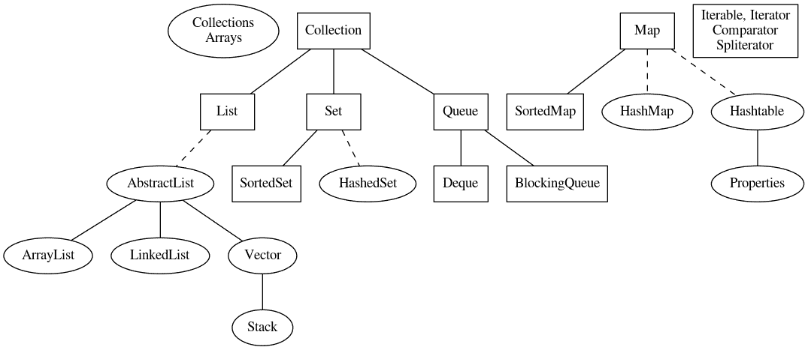
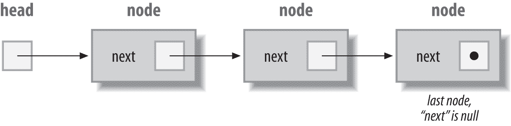
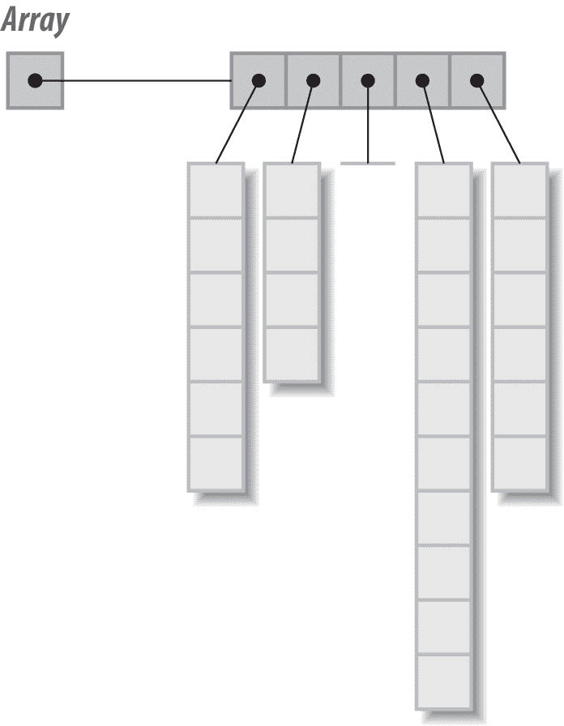

# 第七章 用 Java 结构化数据

# 7.0 引言

几乎每个超出“Hello, World”的应用程序都需要跟踪一些结构化数据。一个简单的数值问题可能只涉及三四个数字，但大多数应用程序有一组类似的数据项。基于 GUI 的应用程序可能需要跟踪多个对话框窗口。个人信息管理器（PIM）需要跟踪多个人的信息。操作系统需要跟踪谁有登录权限，当前谁已登录以及这些用户正在做什么。图书馆需要跟踪借出书籍的人以及归还日期。网络服务器可能需要跟踪其活跃客户端。这里出现了一个模式，围绕传统称为*数据* *结构化*的变体。

在运行程序的内存中存在数据结构；在磁盘文件中的数据中存在结构；以及存储在数据库中的信息也有结构。在本章中，我们集中讨论第一个方面：内存中的数据。我们将在第十章中讨论第二个方面；第三个方面不在本书的范围之内。

如果你需要考虑内存中的数据，你可能想把它比作存放在文件盒中的索引卡集合，或者像一场寻宝游戏，每一个线索都指向下一个。或者你可以把它想象成我的书桌——看似散乱，实际上是一个充满有意义信息的强大集合。每一个都是 Java 提供的数据结构化类型的好比喻。数组是一种固定长度的线性数据项集合，就像卡片文件盒：它只能容纳那么多，然后溢出。寻宝游戏就像一个称为*链表*的数据结构。Java 的第一个发布版本没有标准链表类，但你可以编写自己的传统数据结构类（现在仍然可以；你可以在食谱 7.8 看到 DIY 链表的实现）。复杂的集合代表了 Java 的`Collection`类。名为*Collections Framework Overview*的文档，分布在 Java 开发工具包文档中（并存储在文件*…/docs/guide/collections/overview.html* [在线链接](http://docs.oracle.com/javase/8/docs/technotes/guides/collections/index.html)），详细讨论了集合框架。Java 集合框架的框架方面在食谱 7.3 中总结。

警惕印刷问题。以常宽字体书写的`Arrays`指的是`java.util.Arrays`类；而在正常字体中，“arrays”仅仅是“array”的复数形式（并且会在句首大写）。此外，请注意，`HashMap`和`HashSet`遵循每个单词边界都有大写字母的规则，而旧的`Hashtable`不遵循这一规则（*t*不大写）。

多年来，`java.util`包已经成为一个大杂烩。除了在 Recipe 6.9 中涵盖的遗留日期/时间 API 外，`java.util`中还有几个其他类未在本章中涵盖。所有以`Abstract`开头的类实际上都是抽象的，我们将讨论它们的非抽象子类。`StringTokenizer`类在 Recipe 3.1 中有所涵盖。`BitSet`比本章讨论的某些类使用频率低，并且足够简单，可以自行学习。`BitSet`在内存中非常紧凑地存储位，但因为它早于 Collection API 并且没有进行后续更新，所以它没有实现任何标准的集合接口。还未在此处涵盖的是`EnumSet`和`EnumMap`，这些专门用于枚举的高效存储/检索。它们比`BitSet`更新，*确实*实现了现代集合接口。

我们从数据结构技术讨论开始，其中一个最古老的结构是数组。我们将讨论`java.util`集合框架的总体结构。然后我们将通过使用`java.util`中的类进行各种结构化技术的讨论。

# 7.1 使用数组进行数据结构化

## 问题

您需要跟踪一定量的信息并（通常）按顺序检索它。

## 解决方案

使用数组。

## 讨论

数组可以用来保存任何线性的数据集合。数组中的项必须是相同类型的。您可以创建任何原始类型或对象类型的数组。对于*原始类型的数组*（如`int`和`boolean`），数据存储在数组中。对于*对象数组*，存储的是引用，因此适用于引用变量和转型的常规规则。特别要注意的是，如果数组声明为`Object[]`，则可以在其中存储任何类型的对象引用，而无需转型，尽管在将`Object`引用取出并用作其原始类型时需要有效的转型。在 Recipe 7.17 中，我会稍微介绍二维数组；否则，您应该将此视为复习示例：

*main/src/main/java/lang/Array1.java*

```java
public class Array1  {
    @SuppressWarnings("unused")
    public static void main(String[] argv) {
        int[] monthLen1;            // declare a reference
        monthLen1 = new int[12];        // construct it
        int[] monthLen2 = new int[12];    // short form
        // even shorter is this initializer form:
        int[] monthLen3 = {
                31, 28, 31, 30,
                31, 30, 31, 31,
                30, 31, 30, 31,
        };

        final int MAX = 10;
        LocalDate[] days = new LocalDate[MAX];
        for (int i=0; i<MAX; i++) {
            days[i] = LocalDate.of(2022, 02, i + 1);
        }

        // Two-Dimensional Arrays
        // Want a 10-by-24 array
        int[][] me = new int[10][];
        for (int i=0; i<10; i++)
            me[i] = new int[24];

        // Remember that an array has a ".length" attribute
        System.out.println(me.length);
        System.out.println(me[0].length);

    }
}
```

Java 中的数组工作得很好。类型检查提供了合理的完整性，数组边界始终由运行时系统检查，进一步增加了可靠性。

唯一的问题是数组填满后如果仍有数据进来怎么办？请参见 Recipe 7.2。

# 7.2 调整数组大小

## 问题

数组已经填满，并且出现了`ArrayIndexOutOfBoundsException`。

## 解决方案

扩大数组大小，或者使用`ArrayList`。

## 讨论

一种方法是一开始就为数组分配一个合理大小；但是如果发现自己的数据超出了容量，就需要重新分配一个更大的数组，并将元素复制到其中。¹ 下面是实现此操作的代码：

*main/src/main/java/lang/Array2.java*

```java
public class Array2  {
    public final static int INITIAL = 10,   
        GROW_FACTOR = 2;                    

    public static void main(String[] argv) {
        int nDates = 0;
        LocalDateTime[] dates = new LocalDateTime[INITIAL];
        StructureDemo source = new StructureDemo(21);
        LocalDateTime c;
        while ((c=source.getDate()) != null) {

            // if (nDates >= dates.length) {
            //     throw new RuntimeException(
            //         "Too Many Dates! Simplify your life!!");
            // } 
            // better: reallocate, making data structure dynamic
            if (nDates >= dates.length) {
                LocalDateTime[] tmp =
                    new LocalDateTime[dates.length * GROW_FACTOR];
                System.arraycopy(dates, 0, tmp, 0, dates.length);
                dates = tmp;    // copies the array reference
                // old array will be garbage collected soon...
            }
            dates[nDates++] = c;
        }
        System.out.println("Final array size = " + dates.length);
    }
}
```


一个良好的猜测是必要的；了解你的数据！


增长因子是任意的；2 是一个好的值，但会继续呈指数倍增。你可能想使用像 1.5 这样的因子，这意味着在低端会有更多的分配，但增长不会那么爆炸性。你需要以某种方式管理这个！

这种技术对于简单或相对较小的线性数据集合来说效果还不错。对于结构更为复杂的数据，你可能希望使用更动态的方法，就像 Recipe 7.4 中描述的那样。

# 7.3 集合框架

## 问题

你在跟踪所有这些列表、集合和迭代器时遇到了困难。

## 解决方案

这有一个模式。参见 Figure 7-1 和 Table 7-1。

## Discussion

`List`、`Set`、`Map` 和 `Queue` 是集合框架的四种基本数据结构。`List` 和 `Set` 都是序列，区别在于 `List` 保留顺序并允许重复条目，而 `Set` 则不允许。`Map` 是一个键/值存储，也称为哈希、字典或关联存储。队列是，正如其名字所暗示的，你可以从一端推入，从另一端拉出的结构。

Table 7-1 显示了来自 `java.util` 包中一些重要的基于集合的类。由于空间限制，它故意不是 100% 完整的。

## 参见

`Collections`、`Arrays`、`List`、`Set` 及其实现类的 javadoc 文档提供了比这里提供的更多的细节。Table 7-1 可能会帮助你更好地吸收集合框架的规律性。

表 7-1\. Java 集合

| 接口 | 实现 |
| --- | --- |
| 可调整大小的数组 | 散列表 | 链表 | 平衡树 |
| --- | --- | --- | --- |
|  |
| `List` | `ArrayList, Vector` |  | `LinkedList` |  |
| `Set` |  | `HashSet` |  | `TreeSet` |
| `Map` |  | `HashMap, HashTable` |  | `TreeMap` |
| `Queue` | `Deque`、`BlockingQueue` 等 |  |  |  |

Figure 7-1 显示了几种类型之间的关系。



###### 图 7-1\. 集合框架：矩形为接口；椭圆形为类；实线表示继承；虚线代表 `implements`

`Queue` 及其子类型在 Chapter 16 中有所描述。

# 7.4 像数组一样，但更动态

## 问题

你不想担心存储重新分配（通常是因为你不知道传入数据集的大小）；你想要一个标准的类来为你处理它。你希望将数据存储在 第七章 中定义的任何 `Collection` 类中，具有类型安全性，而不必在从集合检索数据时编写 downcasts。

## 解决方案

使用`List`实现或其他`Collections`类，以及 Java 的泛型类型机制，声明`Collection`时加上*类型参数*以标识数据类型。类型参数名称在声明和实例化之后出现在尖括号中。

## 讨论

我们将讨论的第一个`Collections`类是`ArrayList`，它是来自`java.util`的标准类，封装了数组的功能，但允许它自动扩展。你可以不断地向其添加内容，每次添加的行为都是相同的。如果你非常仔细地观察，你可能会注意到在添加对象时偶尔会有一个短暂的额外暂停，这是因为`ArrayList`在重新分配和复制时发生了。但你无需去思考这些。

然而，由于`ArrayList`是一个类，并不是 Java 语法的一部分，所以你不能使用 Java 的数组语法；你必须使用方法来访问`ArrayList`的数据。它有添加对象、检索对象、查找对象以及告诉你`List`大小及其可以在不需重新分配的情况下变得多大的方法（注意，`ArrayList`类只是`List`接口的一种实现；稍后会详细介绍更多）。就像`java.util`中的其他集合类一样，`ArrayList`的存储和检索方法最初是定义为具有`java.lang.Object`的参数和返回值。由于`Object`是每个定义类型的祖先，你可以将任何类型的对象存储在`List`（或任何集合）中，并在检索时进行转换。如果你需要将少量的内建类型（如`int`和`float`）存储到包含其他数据的集合中，请使用适当的包装类（参见第五章的介绍）。要存储`boolean`，可以直接存储在`java.util.BitSet`中（请参阅在线文档），或者使用`Boolean`包装类存储在`List`中。

因为`Object`通常对于准确的工作来说太过于普遍，所有现代版本的 Java 都提供了*泛型*机制。如今，你可以在尖括号中声明一个类型参数，比如声明一个`ArrayList`（或其他集合），编译器会将参数和返回值视为该类型，确保错误类型的对象不会进入你的集合，并避免在检索对象时写转换语句。例如，这是如何声明一个用于保存`String`对象引用的`ArrayList`：

```java
List<String> myList = new ArrayList<>();
```

尽管你正在*定义*（构造）它作为`ArrayList`，但将变量声明为接口类型`List`是一个良好的实践。这样做可以更容易地从一个`List`实现切换到另一个，并且避免意外依赖于接口中不存在的实现特定方法（这也会使得更改实现更加困难）。

在定义部分的`<>`是旧版 Java 的遗留物，旧版 Java 需要在类型定义中重复，因此在示例中你会写`new ArrayList<String>()`。现在只需使用`<>`（如示例中所示），表示你希望类型从声明中复制。`<>`称为*钻石操作符*。

截至 Java 13，你可以通过使用新的`var`关键字（仅限局部变量）来简化：

```java
var myList = new ArrayList<String>();
```

Table 7-2 展示了`List`接口的一些最重要的方法，这些方法由`ArrayList`和其他`List`实现类实现。这意味着旧的`Vector`类和其他实现类也可以使用完全相同的方法。你只需更改构造函数调用中使用的名称。

表 7-2。`List<T>`的常见方法

| 方法签名 | 用法 |
| --- | --- |
| `add(T o)` | 在末尾添加给定元素 |
| `add(int i, T o)` | 在指定位置插入给定的元素 |
| `clear()` | 从`Collection`中删除所有元素引用 |
| `contains(T o)` | 如果`List`包含给定对象，则返回 true |
| `forEach(lambda)` | 对每个元素执行 lambda |
| `get(int i)` | 返回指定位置的对象引用 |
| `indexOf(T o)` | 返回找到给定对象的索引，如果未找到则返回-1 |
| `of(T t, …)` | 从多个对象创建列表 |
| `remove(T o), remove(int i)` | 通过引用或位置删除对象 |
| `toArray()` | 返回包含`Collection`中对象的数组 |

`ArrayListDemo`将数据存储在`ArrayList`中，并检索进行处理：

```java
public class ArrayListDemo {
    public static void main(String[] argv) {
        List<LocalDate> editions = new ArrayList<>();

        // Add lots of elements to the ArrayList...
        editions.add(LocalDate.of(2001, 06, 01));
        editions.add(LocalDate.of(2004, 06, 01));
        editions.add(LocalDate.of(2014, 06, 20));

        // Use old-style 'for' loop to get index number.
        System.out.println("Retrieving by index:");
        for (int i = 0; i<editions.size(); i++) {
            System.out.printf("Edition %d was %s\n", i + 1, editions.get(i));
        }
        // Use normal 'for' loop for simpler access
        System.out.println("Retrieving by Iterable:");
        for (LocalDate dt : editions) {
            System.out.println("Edition " + dt);
        }

    }
}
```

旧版的`Vector`和`Hashtable`类早于集合框架，因此它们提供了不同名称的额外方法：`Vector`提供了`addElement()`和`elementAt()`。你可能仍然会在遗留代码中遇到这些，但应该使用`Collection`的`add()`和`get()`方法。另一个区别是`Vector`的方法是同步的，这意味着它们可以安全地从多个线程访问（参见 Recipe 16.5）。不过，这也意味着更多的开销，因此对于单线程访问，使用`ArrayList`速度更快（请参阅 Recipe 7.19 中的计时结果）。

有各种转换方法。Table 7-2 提到`toArray()`，它会将`List`的内容暴露为数组。Java 9+中的`List`接口具有静态的`of()`方法，可以在数组和`List`之间进行转换。结合现代 Java 的可变参数特性，你可以通过一次调用`List.of()`来创建和填充一个列表，例如：

```java
List<String> firstNames = List.of("Robin", "Jaime", "Joey");
```

在旧应用程序和网络搜索中找到的遗留代码中，`Arrays.asList()`提供了这种功能，因此你可能会遇到类似以下的代码：

```java
List<String> lastNames = Arrays.asList("Smith", "Jones", "MacKenzie");
// or even
List<String> lastNames =
    Arrays.asList(new String[]{"Smith", "Jones", "MacKenzie"});
```

Java 随着时间的推移确实变得不那么冗长！

您仍然可以实例化诸如`ArrayList`之类的类而不使用特定类型。在这种情况下，您将得到一个编译器警告，并且类将像以往一样运行；也就是说，从`Collection`或`Iterator`返回的对象将是`java.lang.Object`类型，必须在调用任何类特定方法或在任何应用特定方法调用之前进行向下转型。

作为进一步的示例，考虑在第 7 章中提到的`Map`接口。`Map`在其`put()`方法中需要一个键和一个值。因此，`Map`具有两个参数化类型。要设置一个`Map`，其键是`Person`对象，值是`Address`对象（假设这两个类在您的应用程序中存在），可以像这样定义它：

```java
Map<Person, Address> addressMap = new HashMap<>();
```

这个`Map`期望其`put()`方法的键是`Person`，值是`Address`。`get()`方法返回一个`Address`对象，`keySet()`方法返回`Set<Person>`（即专门用于`Person`对象的`Set`）。当您想要从现有对象创建一个`Map`时，还有方便的例程。最有用的是与`List.of()`类似的几个重载版本的已经存在的`Map.of(key,value,key,value…)`，以及其他功能。

## 参见

尽管泛型避免了您必须编写向下转型，但转型仍然发生在运行时；它们只是由编译器提供的。编译器在编译这些新构造时使用的技术包括*擦除*和*桥接*，这些主题在《*Java 泛型与集合*》（http://shop.oreilly.com/product/9780596527754.do）中有讨论，作者是莫里斯·纳夫特林和菲利普·沃德勒。

# 7.5 在自己的类中使用泛型类型

## 问题

您希望使用泛型类型机制定义自己的容器类，以避免不必要的转型。

## 解决方案

使用`<` *`TypeName`* `>`定义一个类，其中声明了容器类型，使用`*TypeName*`来使用它。

## 讨论

考虑在示例 7-1 中的非常简单的`Stack`类。（我们在配方 7.16 中讨论了堆栈类的性质和用途。）

此版本已经参数化为接受一个名为`T`的类型。这种类型`T`将是`push()`方法参数的类型，`pop()`方法返回类型等。由于这个返回类型比原始集合的`Object`返回类型更具体，从`pop()`返回的值不需要进行向下转型。集合框架（`java.util`）中的所有容器都类似地进行了参数化。

##### 示例 7-1\. main/src/main/java/structure/MyStack.java

```java
public class MyStack<T> implements SimpleStack<T> {

    private int depth = 0;
    public static final int DEFAULT_INITIAL = 10;
    private T[] stack;

    public MyStack() {
        this(DEFAULT_INITIAL);
    }

    public MyStack(int howBig) {
        if (howBig <= 0) {
            throw new IllegalArgumentException(
            howBig + " must be positive, but was " + howBig);
        }
        stack = (T[])new Object[howBig];
    }

    @Override
    public boolean empty() {
        return depth == 0;
    }

    /** push - add an element onto the stack */
    @Override
    public void push(T obj) {
        // Could check capacity and expand
        stack[depth++] = obj;
    }

    /* pop - return and remove the top element */
    @Override
    public T pop() {
        --depth;
        T tmp = stack[depth];
        stack[depth] = null;
        return tmp;
    }

    /** peek - return the top element but don't remove it */
    @Override
    public T peek() {
        if (depth == 0) {
            return null;
        }
        return stack[depth-1];
    }

    public boolean hasNext() {
        return depth > 0;
    }

    public boolean hasRoom() {
        return depth < stack.length;
    }

    public int getStackDepth() {
        return depth;
    }
}
```

特定类型的关联是在实例化类时完成的。例如，要实例化一个专门用于持有`BankAccount`对象的`MyStack`，您只需要编写以下代码：

```java
MyStack<BankAccount> theAccounts = new MyStack<>( );
```

如果您不提供类型参数 `T`，则这个集合（如 `java.util` 中的集合）将表现得像在泛型集合出现之前的那些日子一样——接受任何类型的输入参数，从 getter 方法返回 `java.lang.Object`，并需要向下转型——作为它们默认的向后兼容行为。例子 7-2 展示了一个创建两个 `MyStack` 实例的程序，一个专门用于 `String`，另一个保持一般化。通用的那个，称为 `ms2`，加载了与 `ms1` 相同的两个 `String` 对象，但还包括一个 `Date` 对象。现在打印代码已经失效，因为它将抛出 `ClassCastException`：`Date` 不是 `String`。出于学术目的，我特别处理了这种情况：这说明了在使用非参数化容器类时可能遇到的错误类型。

##### 示例 7-2\. main/src/main/java/structure/MyStackDemo.java

```java
public class MyStackDemo {

    @SuppressWarnings({"rawtypes","unchecked"})
    public static void main(String[] args) {
        MyStack<String> ms1 = new MyStack<>();
        ms1.push("billg");
        ms1.push("scottm");

        while (ms1.hasNext()) {
            String name = ms1.pop();
            System.out.println(name);
        }

        // Old way of using Collections: not type safe.
        // DO NOT GENERICIZE THIS
        MyStack ms2 = new MyStack();
        ms2.push("billg");               // EXPECT WARNING
        ms2.push("scottm");              // EXPECT WARNING
        ms2.push(new java.util.Date());  // EXPECT WARNING

        // Show that it is broken
        try {
            String bad = (String)ms2.pop();
            System.err.println("Didn't get expected exception, popped " + bad);
        } catch (ClassCastException ex) {
            System.out.println("Did get expected exception.");
        }

        // Removed the brokenness, print rest of it.
        while (ms2.hasNext()) {
            String name = (String)ms2.pop();
            System.out.println(name);
        }
    }
}
```

由于这种潜在的错误可能性，编译器会警告您存在未检查的原始类型。与第 1.9 节讨论的弃用警告类似，默认情况下，*javac* 编译器不会详细打印这些警告（它们将出现在大多数集成开发环境中）。您可以使用相当冗长的选项 `-Xlint:unchecked` 请求它们：

```java
C:> javac -source 1.5 structure/MyStackDemo.java
Note: MyStackDemo.java uses unchecked or unsafe operations.
Note: Recompile with -Xlint:unchecked for details.
C:> javac -source 1.5 -Xlint:unchecked structure/MyStackDemo.java
MyStackDemo.java:14: warning: unchecked call to push(T) as a member of the raw
type MyStack
                ms2.push("billg");
                   ^
MyStackDemo.java:15: warning: unchecked call to push(T) as a member of the raw
type MyStack
                ms2.push("scottm");
                   ^
MyStackDemo.java:16: warning: unchecked call to push(T) as a member of the raw
type MyStack
                ms2.push(new java.util.Date( ));
                   ^
3 warnings
C:>
```

我在第 7.16 节中更详细地讨论了 `MyStack` 的开发和演变。

# 7.6 我应该如何迭代你？让我列举一下方法

## 问题

需要迭代一些结构化数据。

## 解决方案

Java 提供了许多迭代数据集合的方法。以下按照最新的顺序列出：

+   `Stream.forEach()` 方法（Java 8）

+   `Iterable.forEach()` 方法（Java 8）

+   Java “foreach” 循环（Java 5）

+   `java.util.Iterator`（Java 2）

+   三部分 `for` 循环

+   `while` 循环 * 枚举

选择一个并使用它。或者学习它们并保存！

## 讨论

这里对每种迭代方法都简要说明了一些词。请注意，前几种是最常见的。

### Stream.forEach 方法（Java 8）

作为 Java 函数式编程的一部分引入的 `Stream` 机制提供了两种最近的迭代方式之一，`Stream.forEach()`，在第 9.3 节中有讨论。现在，这里有一个快速的例子，使用 `BufferedReader` 的 `lines()` 方法返回一个 `Stream`：

```java
$ jshell
jshell> import java.io.*;
jshell> BufferedReader is =
  new BufferedReader(new FileReader("/home/ian/.profile"));
is ==> java.io.BufferedReader@58651fd0
jshell> is.lines().forEach(System.out::println)
... prints the lines of the file ...
```

### Iterable.forEach 方法（Java 8）

`Iterable.forEach()` 方法是最近新增的迭代技术之一，Java 8 中引入。该方法可以在任何 `Iterable` 上调用（不幸的是，数组类尚未实现 `Iterable`），接受一个实现了*函数接口* `java.util.function.Consumer` 的参数。关于函数接口的讨论见第九章，以下是一个例子：

```java
public class IterableForEach {

    public static void main(String[] args) {
        Collection<String> c =                    
                List.of("One", "Two", "Three");   
        c.forEach(s -> System.out.println(s));    
    }
}
```


声明一个 `Collection`（`Collection` 是 `Iterable`）。


使用 `Arrays.of()` 将数组或对象序列填充进去（参见 Recipe 7.4，了解任意参数列表如何成为数组）。


调用集合的 `forEach()` 方法，传递一个 lambda 表达式（参见第九章，了解 `s`→`System.out.println(s)` 如何映射到 `Consumer` 接口实现，而不需要显式导入该接口）。

这种迭代方式——有时被称为 *内部迭代*——颠覆了传统 `for` 循环的控制方式；集合负责迭代的时间和方式。

###### 提示

`Stream.forEach` 和 `Iterable.forEach()` 都接受一个类型为 `java.util.function.Consumer` 的参数，因此它们在语法上基本相同。这是有意为之。

### Java “foreach” 循环（Java 5）

这是 for-each 循环的语法：

```java
for (Type var : Iterable<Type>) {
	// do something with "var"
}
```

for-each 循环可能是现代 Java 代码中最常见的循环风格。`Iterable` 可以是数组或任何实现了 `Iterable` 的东西（包括 `Collection` 实现）。

本书中广泛采用这种风格。此外，许多第三方框架/库提供自己的类型来实现 `Iterable`，以便与 `for` 循环一起使用。

### java.util.Iterator（Java 2）

旧的 `Iterator` 接口有三种方法：

```java
public interface java.util.Iterator<E> {
  public abstract boolean hasNext();
  public abstract E next();
  public default void remove();
}
```

曾经常见的代码编写方式如下，您仍然可能在旧代码中找到：

```java
Iterator it = ...; // legacy code; might not even have type parameter
while (it.hasNext()) {
	(MyDataType) c = it.next();
	// Do something with c
}
```

如果在只读集合上调用 `remove()` 方法，则会抛出 `UnsupportedOperationException`。与 `Stream` 和默认方法结合使用，现在有第四种方法：

```java
public default void forEachRemaining(java.util.function.Consumer<? super E>);
```

### 三部分 for 循环

这是 Dennis Ritchie 在 1970 年代早期为 C 语言发明的传统 `for` 循环：

```java
for (init; test; change) {
	// do something
}
```

其最常见的形式是使用一个 `int` “索引变量”或“循环变量”：

```java
MyDataType[] data = ...
for (int i = 0; i < data.length; i++)
	MyDataType d = data[i];
	// do something with it
}
```

### while 循环

`while` 循环会在测试条件为真时执行其循环体。通常与 `Enumeration` 或 `Iterator` 结合使用，例如：

```java
Iterator<MyData> iterator = ...
while (iterator.hasNext()) {
	MyData md = iterator.next();
	//
}
```

### 枚举

`Enumeration` 类似于之前展示的 `Iterator`，但它缺少 `remove()` 方法，控制方法的名称更长，例如 `hasMore​Ele⁠ments()` 和 `nextElement()`。对于新代码，建议尽量避免实现 `Enumeration`。

# 7.7 使用 Set 避免重复

## 问题

您希望一个结构，可以避免存储重复项。

## 解决方案

使用 `Set` 实现而不是 `List`（例如 `Set<String> myNames = new HashSet<>()`）。

## 讨论

`Set` 接口类似于 `List` 接口，² 其方法包括 `add()`、`remove()`、`contains()`、`size()` 和 `isEmpty()`。不同之处在于它不保留顺序；相反，它强制唯一性——如果多次添加相同的项（根据其 `equals()` 方法），它将在集合中仅出现一次。因此，索引为基础的方法如 `add(int, Object)` 和 `get(int)` 在 `Set` 实现中是缺失的：你可能知道你添加了七个对象，但其中只有五个是唯一的，因此调用 `get()` 来检索第六个对象将会抛出 `ArrayIndexOutOfBoundsException` 异常！最好不要将 `Set` 视为具有索引的集合。

###### 警告

正如 Java 7 中的 `Set` 文档所述：“注意：如果将可变对象用作集合元素，则必须非常小心。如果以影响等式比较的方式更改对象的值，则集合的行为未指定。此禁止的特殊情况是，集合不能包含自身作为元素。”

此代码展示了向 `Set` 中添加重复条目的情况，它将只包含一个字符串 `"One"` 的副本：

```java
        Set<String> hashSet = new HashSet<>();
        hashSet.add("One");
        hashSet.add("Two");
        hashSet.add("One"); // DUPLICATE
        hashSet.add("Three");
        hashSet.forEach(s -> System.out.println(s));
```

不出所料，只打印了三个不同的值。

如果需要排序的 `Set`，实际上有一个 `SortedSet` 接口，其中最常见的实现是 `TreeSet`；查看 Recipe 7.12 中的 `TreeSet` 示例。

与 `List` 一样，`Set` 接口从 Java 9 开始提供了 `of` 方法：

```java
Set<Double> nums = Set.of(Math.PI, 22D/7, Math.E);
Set<String> firstNames = Set.of("Robin", "Jaime", "Joey");
```

# 7.8 在链表中结构化数据

## 问题

你的数据不适合在数组中使用。

## 解决方案

使用链表；Java 的 `LinkedList` 类非常适合。

## 讨论

任何参加过计算机科学 101（或任何计算机科学课程）的人都应该熟悉数据结构，如链表和二叉树。当你有一个不可预测的大量数据项，希望分配恰到好处的存储空间，并且希望按照创建顺序访问它们时，通常使用链表。图 7-2 是显示正常排列的图表。



###### 图 7-2\. 链表结构

当然，Collections API 提供了 `LinkedList` 类；这里是一个使用它的简单程序：

```java
public class LinkedListDemo {
    public static void main(String[] argv) {
        System.out.println("Here is a demo of Java's LinkedList class");
        LinkedList<String> l = new LinkedList<>();
        l.add(new Object().toString());
        l.add("Hello");
        l.add("end of the list");

        System.out.println("Here is a list of all the elements");
        l.forEach(o ->
            System.out.println("Next element: " + o));

        if (l.indexOf("Hello") < 0)
            System.err.println("Lookup does not work");
        else
            System.err.println("Lookup works");

        // Now, for added fun, let's walk the linked list backwards.
        ListIterator<String> li = l.listIterator();
        while (li.hasPrevious()) {
            System.out.println("Back to: " + li.previous());
        }
    }
}
```

此处使用的 `ListIterator` 是 `Iterator` 的子接口，如 Recipe 7.6 所述。

为了展示这种列表的工作方式，这里是显示简单链表实现的部分代码：

```java
public class LinkList<T> implements List<T> {

    /* A TNode stores one node or item in a Linked List */
    private static class TNode<T> {
        private TNode<T> next;
        private T data;
        TNode(T o, TNode<T> next) {
            data = o;
            this.next = next;
        }
        @Override
        public String toString() {
            return String.format("TNode: data='%s', next='%d'", data,
                    next == null ? 0 : next.hashCode());
        }
    }

    private boolean DIAGNOSTIC = false;

    /** The root or first TNode in the list; is a dummy pointer,
 * so its data will always be null. Simpler this way.
 */
    protected TNode<T> first;
    /**
 * For certain optimizations: A second ref to the last TNode in the list;
 * initially == first; always valid (never null), always has next == null.
 */
    protected TNode<T> last;

    /** Construct a LinkList: initialize the first and last nodes */
    public LinkList() {
        clear();
    }

    /** Construct a LinkList given another Collection.
 * This method is recommended by the general contract of List.
 */
    public LinkList(Collection<T> c) {
        this();
        addAll(c);
    }

    /** Set the List (back) to its initial state.
 * Any references held will be discarded.
 */
    @Override
    public void clear() {
        first = new TNode<T>(null, null);
        last = first;
    }

    /** Add one object to the end of the list. Update the "next"
 * reference in the previous end, to refer to the new node.
 * Update "last" to refer to the new node.
 */
    @Override
    public boolean add(T o) {
        last.next = new TNode<T>(o, null);
        last = last.next;
        return true;
    }

    @Override
    public void add(int where, T o) {
        TNode<T> t = first;
        for (int i=0; i<=where; i++) {
            t = t.next;
            if (t == null) {
                throw new IndexOutOfBoundsException(
                    "'add(n,T) went off end of list");
            }
            if (DIAGNOSTIC) {
                System.out.printf("in add(int,T): i = %d, t = %s%n", i, t);
            }
        }
        if (DIAGNOSTIC) {
            System.out.printf("in add(int,T): to insert before %s\n", t);
        }
        final TNode<T> nn = new TNode<>(o, t.next);
        t.next = nn;
        if (DIAGNOSTIC) {
            System.out.printf("add(%d,%s)\n", where, o);
            dump("add(int,T)");
        }
    }

    @Override
    public boolean addAll(Collection<? extends T> c) {
        c.forEach(o -> add((T) o));
        return false;
    }

    @Override
    public boolean addAll(int i, Collection<? extends T> c) {
        AtomicInteger j = new AtomicInteger(i);
        c.forEach(o -> { add(j.getAndIncrement(), o); });
        return true;
    }

    @Override
    public boolean contains(Object o) {
        TNode<T> t = first;
        while ((t = t.next) != null) {
            if (t.data.equals(o)) {
                return true;
            }
        }
        return false;
    }

    @Override
    public T get(int where) {
        TNode<T> t = first;
        int i=0;
        // If we get to the end of list before 'where', error out
        while (i++<=where) {
            if (t.next == null) {
                throw new IndexOutOfBoundsException();
            }
            t = t.next;
        }
        return t.data;
    }

    @Override
    public boolean isEmpty() {
        return first == last;
    }

    public Iterator<T> iterator() {
        return new Iterator<T>() {
            final int size = size();
            int n = 0;
            TNode<T> t = first;
            /**
 * Two cases in which next == null:
 * 1) The list is empty, we are at first
 * 2) The list is not empty, we are at last.
 */
            public boolean hasNext() {
                return n < size;
            }

            public T next() {
                if (t == first) {
                    t = t.next;
                }
                TNode<T> result = t;
                t = t.next;
                ++n;
                return result.data;
            }
            public void remove() {
                throw new UnsupportedOperationException("remove");
            }
        };
    }

    @Override
    public boolean remove(Object o) {
        TNode<T> p = first, prev = null;
        while (p != null) {
            if (p.data == o) {
                prev.next = p.next;
                return true;
            }
            prev = p; p = p.next;
        }
        return false;
    }

    @Override
    public T set(int i, T o) {
        TNode<T> tmp = find(i);
        tmp.data = o;
        return o;
    }

    @Override
    public int size() {
        TNode<T> t = first;
        int i;
        for (i=0; ; i++) {
            if (t == null)
                break;
            t = t.next;
        }
        return i - 1;    // subtract one for mandatory head node
    }

    @SuppressWarnings("unchecked")
    public T[] toArray(Object[] data) {
        // First is an empty anchor, start at its next
        TNode<T> p = first.next;
        for (int i = 0; p != null && i < data.length; i++) {
            data[i] = p.data;
            p = p.next;
        }
        return (T[]) data;
    }

    public Object[] toArray() {
        Object[] data = new Object[size()];
        return toArray(data);
    }
```

###### 警告

这只是展示链表实现可能的方式。不要使用此处显示的简单 `LinkList` 类；请使用真正的 `java.util.LinkedList`，如第一个示例中展示的那样。

# 7.9 使用 Hashtable 和 HashMap 进行映射

## 问题

你需要一个从一个数据项到另一个数据项的单向映射。

## 解决方案

使用 `HashMap`。

## 讨论

`HashMap` 提供了一种从一组对象引用到另一组对象引用的单向映射。它们完全是通用的。我用它们来映射从 Swing 按钮到按钮被按下时要打开的 URL，将名称映射到地址，以及在 Web 服务器中实现一个简单的内存缓存。您可以将任何东西映射到任何东西。在下面的示例中，我们将公司名称映射到地址；这里的地址是 `String` 对象，但在实际生活中它们可能是 `Address` 对象：

```java
public class HashMapDemo {

    public static void main(String[] argv) {

        // Construct and load the hash. This simulates loading a
        // database or reading from a file, or wherever the data is.

        Map<String,String> map = new HashMap<String,String>();

        // The hash maps from company name to address.
        // In real life this might map to an Address object...
        map.put("Adobe", "Mountain View, CA");
        map.put("IBM", "White Plains, NY");
        map.put("Learning Tree", "Los Angeles, CA");
        map.put("Microsoft", "Redmond, WA");
        map.put("Netscape", "Mountain View, CA");
        map.put("O'Reilly", "Sebastopol, CA");
        map.put("Sun", "Mountain View, CA");

        // Two versions of the "retrieval" phase.
        // Version 1: get one pair's value given its key
        // (presumably the key would really come from user input):
        String queryString = "O'Reilly";
        System.out.println("You asked about " + queryString + ".");
        String resultString = map.get(queryString);
        System.out.println("They are located in: " + resultString);
        System.out.println();

        // Version 2: get ALL the keys and values
        // (maybe to print a report, or to save to disk)
        for( String key : map.keySet()) {
            System.out.println("Key " + key +
                "; Value " + map.get(key));
        }

        // Version 3: Same but using a Map.Entry lambda
        map.entrySet().forEach(mE ->
            System.out.println("Key + " + mE.getKey()+
                "; Value " +mE.getValue()));
    }
}
```

对于这个版本，我们既使用了 `for` 循环，也使用了 `forEach()` 循环；后者使用 `entrySet()` 的返回值，即包含一个键和一个值的 `Map.Entry` 集合（在大型映射上可能更快，因为它避免了每次循环时重新进入映射获取值）。如果您在循环内或在另一个线程中修改列表（例如，删除元素），那么这些形式将会因为 `ConcurrentModificationException` 而失败。然后，您需要显式使用 `Iterator` 来控制循环：

```java
        // Version 2: get ALL the keys and values
        // with concurrent modification
        Iterator<String> it = map.keySet().iterator();
        while (it.hasNext()) {
            String key = it.next();
            if (key.equals("Sun") || key.equals("Netscape")) {
                it.remove();
                continue;
            }
            System.out.println("Company " + key + "; " +
                "Address " + map.get(key));
        }
```

一个更为实用的（参见第九章）编写移除操作的方法，不涉及显式循环，可以是这样的：

```java
        // Alternate to just do the removals, without explicit looping
        map.keySet().removeIf(key -> Set.of("Netscape", "Sun").contains(key));
        // or
        map .entrySet()
            .removeIf(entry -> Set.of("Netscape", "Sun")
            .contains(entry.getKey()));
        map.entrySet().forEach(System.out::println);
```

###### 提示

`HashMap` 方法不是同步的。旧的类似 `Hashtable` 的方法是同步的，适用于多线程。

# 7.10 在属性和偏好中存储字符串

## 问题

您需要存储的键和值都是字符串，可能会跨程序运行保持不变，例如程序定制。

## 解决方案

使用 `java.util.prefs.Preferences` 对象或 `java.util.Properties` 对象。

## 讨论

下面是基于用户环境的三种定制方法。Java 提供了 `Preferences` 和 `Properties` 用于跨平台定制。

### 偏好

`Preferences` 类 `java.util.prefs.Preferences` 提供了一种易于使用的机制，用于以系统相关方式存储用户定制（这可能意味着在 Unix 上是点文件，在 Mac 上是偏好文件，在 Windows 系统上是注册表）。该类提供了一组表示用户偏好的节点层次结构。数据以系统相关的存储格式存储，但也可以导出到或导入自 XML 格式。下面是 `Preferences` 的一个简单演示：

```java
public class PrefsDemo {

    public static void main(String[] args) throws Exception {

        // Set up the Preferences for this application, by class.
        Preferences prefs = Preferences.userNodeForPackage(PrefsDemo.class);

        // Retrieve some preferences previously stored, with defaults in case
        // this is the first run.
        String text    = prefs.get("textFontName", "lucida-bright");
        String display = prefs.get("displayFontName", "lucida-blackletter");
        System.out.println(text);
        System.out.println(display);

        // Assume the user chose new preference values: Store them back.
        prefs.put("textFontName", "times-roman");
        prefs.put("displayFontName", "helvetica");

        // Toss in a couple more values for the curious who want to look
        // at how Preferences values are actually stored.
        Preferences child = prefs.node("a/b");
        child.putInt("meaning", 42);
        child.putDouble("pi", Math.PI);

        // And dump the subtree from our first node on down, in XML.
        prefs.exportSubtree(System.out);
    }
}
```

当您第一次运行 `PrefsDemo` 程序时，当然，它找不到任何设置，所以对 `preferences.get()` 的调用将返回默认值：

```java
$ java -cp target/classes structure.PrefsDemo
lucida-bright
lucida-blackletter
<?xml version="1.0" encoding="UTF-8" standalone="no"?>
<!DOCTYPE preferences SYSTEM "http://java.sun.com/dtd/preferences.dtd">
<preferences EXTERNAL_XML_VERSION="1.0">
  <root type="user">
    <map/>
    <node name="structure">
      <map>
        <entry key="displayFontName" value="helvetica"/>
        <entry key="textFontName" value="times-roman"/>
      </map>
      <node name="a">
        <map/>
        <node name="b">
          <map>
            <entry key="meaning" value="42"/>
            <entry key="pi" value="3.141592653589793"/>
          </map>
        </node>
      </node>
    </node>
  </root>
</preferences>
```

在后续运行中，它会找到并返回用户提供的设置（我省略了第二次运行的 XML 输出，因为大部分 XML 输出是相同的）:

```java
> java structure.PrefsDemo
times-roman
helvetica
...
>
```

### 属性

`Properties`类类似于`HashMap`或`Hashtable`（它扩展了后者），但定义了专门用于字符串存储和检索以及加载/保存的方法。`Properties`对象在 Java 中被广泛使用，从设置平台字体名称到在国际化和本地化的一部分中将用户应用程序定制为不同的`Locale`设置。当存储在磁盘上时，`Properties`对象看起来就像一系列的`name=value`赋值，带有可选的注释。编辑`Properties`文件时会添加注释，`Properties`对象读取自身时会忽略注释，并且在要求`Properties`对象将自身保存到磁盘时会丢失注释。这里是一个可用于在基于 GUI 的程序中国际化菜单的`Properties`文件示例：

```java
# Default properties for MenuIntl
program.title=Demonstrate I18N (MenuIntl)
program.message=Welcome to an English-localized Java Program
#
# The File Menu
#
file.label=File Menu
file.new.label=New File
file.new.key=N
file.open.label=Open...
file.open.key=O
file.save.label=Save
file.save.key=S
file.exit.label=Exit
file.exit.key=Q
```

这里是另一个示例，显示了一些个性化属性：

```java
name=Ian Darwin
favorite_popsicle=cherry
favorite_rock group=Fleetwood Mac
favorite_programming_language=Java
pencil_color=green
```

可以从文件加载`Properties`对象。规则很灵活：可以在键名和其值后使用`=`、`:`或空格。在键中忽略非空格字符后的空格。反斜杠可用于续行或转义其他字符。注释行可以以`#`或`!`开头。因此，如果手工准备的`Properties`文件包含前述项目，则可能如下所示：

```java
# Here is a list of properties
! first, my name
name Ian Darwin
favorite_popsicle = cherry
favorite_rock\ group \
 Fleetwood Mac
favorite_programming_language=Java
pencil_color green
```

幸运的是，当`Properties`对象将自身写入文件时，它使用以下简单格式：

```java
key=value
```

这里是一个创建`Properties`对象并将其中列出的公司及其位置从[Recipe 7.9](https://javacookbook.example.org/structure/SECT-6)添加到其中的程序示例。然后从磁盘加载附加属性。为简化 I/O 处理，程序假定要加载的`Properties`文件包含在标准输入中，就像在 Unix 或 DOS 上使用命令行重定向一样：

```java
public class PropsCompanies {

    public static void main(String[] argv) throws java.io.IOException {

        Properties props = new Properties();

        // Get my data
        props.put("Adobe", "Mountain View, CA");
        props.put("IBM", "White Plains, NY");
        props.put("Learning Tree", "Los Angeles, CA");
        props.put("Microsoft", "Redmond, WA");
        props.put("Netscape", "Mountain View, CA");
        props.put("O'Reilly", "Sebastopol, CA");
        props.put("Sun", "Mountain View, CA");

        // Now load additional properties
        props.load(System.in);

        // List merged properties, using System.out
        props.list(System.out);
    }
}
```

将其运行为

```java
java structure.PropsCompanies < PropsDemo.out

```

将以下输出产生到文件*PropsDemo.out*中：

```java
-- listing properties --
Sony=Japan
Sun=Mountain View, CA
IBM=White Plains, NY
Netscape=Mountain View, CA
Nippon_Kogaku=Japan
Acorn=United Kingdom
Adobe=Mountain View, CA
Ericsson=Sweden
O'Reilly & Associates=Sebastopol, CA
Learning Tree=Los Angeles, CA
```

如果您在`HashMap`或`Properties`示例中没有注意到，这些示例中输出出现的顺序既不排序也不按我们放置它们的顺序。哈希类和`Properties`子类对检索对象的顺序不做任何声明。如果需要它们排序，请参阅[Recipe 7.11](https://javacookbook.example.org/structure/SECT-8)。

作为方便的快捷方式，我的`FileProperties`类包括一个接受文件名的构造函数：

```java
import com.darwinsys.util.FileProperties;
...
Properties p = new FileProperties("PropsDemo.out");
```

请注意，构造`FileProperties`对象会导致其被加载，因此构造函数可能抛出`IOException`类的已检查异常。

# 7.11 对集合进行排序

## 问题

您将数据以随机顺序放入集合中或使用不保留顺序的`Properties`对象，现在您希望对其进行排序。

## 解决方案

使用静态方法`Arrays.sort()`或`Collections.sort()`，可选提供`Comparator`。

## 讨论

如果你的数据在一个数组中，那么你可以使用`Arrays`实用类的静态`sort()`方法对其进行排序。如果它在一个`Collection`中，你可以使用`Collections`类的静态`sort()`方法。这里是一个字符串集合在`Array`中原地排序的示例：

```java
public class SortArray {
    public static void main(String[] unused) {
        String[] strings = {
            "painful",
            "mainly",
            "gaining",
            "raindrops"
        };
        Arrays.sort(strings);
        for (int i=0; i<strings.length; i++) {
            System.out.println(strings[i]);
        }
    }
}
```

如果默认排序顺序不是你想要的呢？那么，你可以创建一个实现了`Comparator<T>`接口的对象，并将其作为第二个参数传递给`sort`方法。幸运的是，对于除默认排序外最常见的排序，你不需要这样做：可以将`String.CASE_INSENSITIVE_ORDER`作为第二个参数传递。`String`类将其定义为一个`Comparator<String>`，按`compareToIgnoreCase`方法对`String`对象排序。但如果你需要更复杂的排序，可能需要编写一个`Comparator<T>`。在某些情况下，你可以使用`Comparator.comparing()`方法和`Comparator`的其他静态方法来创建自定义比较器，而不必创建一个类。假设出于某种奇怪的原因，你需要使用除了字符串的第一个字符之外的所有字符进行排序。可以编写以下`Comparator<String>`来实现：

```java
/** Comparator for comparing strings ignoring first character.
 */
public class SubstringComparator implements Comparator<String> {
    @Override
    public int compare(String s1, String s2) {
        s1 = s1.substring(1);
        s2 = s2.substring(1);
        return s1.compareTo(s2);
        // or, more concisely:
        // return s1.substring(1).compareTo(s2.substring(1));
    }
}
```

使用它只需要将其作为`sort()`的`Comparator`参数传递即可，如下所示：

```java
public class SubstringComparatorDemo {
    public static void main(String[] unused) {
        String[] strings = {
            "painful",
            "mainly",
            "gaining",
            "raindrops"
        };
        Arrays.sort(strings);
        dump(strings, "Using Default Sort");
        Arrays.sort(strings, new SubstringComparator());
        dump(strings, "Using SubstringComparator");

        // tag::functional[]
        System.out.println("Functional approach:");
        Arrays.stream(strings)
            .sorted(Comparator.comparing(s->s.substring(1)))
            .forEach(System.out::println);
        // end::functional[]
    }

    static void dump(String[] args, String title) {
        System.out.println(title);
        for (String s : args)
            System.out.println(s);
    }
}
```

再次，一个更为函数式的（见第九章）编写方式可能如下所示：

```java
        System.out.println("Functional approach:");
        Arrays.stream(strings)
            .sorted(Comparator.comparing(s->s.substring(1)))
            .forEach(System.out::println);
```

这是运行它的输出：

```java
$ java structure.SubstrCompDemo
Using Default Sort
gaining
mainly
painful
raindrops
Using SubstringComparator
raindrops
painful
gaining
mainly
```

这一切都应该如此。

另一方面，你可能正在编写一个类，并希望内置比较功能，这样就不必每次都记得传递`Comparator`。在这种情况下，你可以直接实现`java.lang.Comparable`接口，就像标准 API 中的许多类所做的那样。这些类包括`String`类；包装类`Byte`、`Character`、`Double`、`Float`、`Long`、`Short`和`Integer`；`java.math`中的`BigInteger`和`BigDecimal`；`java.time`中日期/时间 API 中的大多数对象；以及`java.text.CollationKey`。可以对这些类型的数组或`Collections`进行排序，而无需提供`Comparator`。实现`Comparable`接口的类被称为具有自然顺序。文档强烈建议类的自然顺序与其`equals()`方法一致。如果`e1.compareTo((Object)e2)`的布尔值与`e1.equals((Object)e2)`对于给定类的每个实例`e1`和`e2`具有相同的布尔值，则它与`equals()`一致。这意味着如果你实现了`Comparable`，你也应该实现`equals()`，并且`equals()`的逻辑应该与`compareTo()`方法的逻辑一致。如果你实现了`equals()`，顺便说一句，你也应该实现`hashCode()`（如在“hashCode() and equals()”中讨论的那样）。例如，这是一个假设调度程序中的约会类`Appt`的一部分。该类有一个`LocalDate`日期变量和一个`LocalTime`时间变量；后者可能为空（例如全天约会或待办事项），这会稍微复杂化`compareTo()`函数。

```java
// public class Appt implements Comparable {
    // Much code and variables omitted - see online version
    //-----------------------------------------------------------------
    //    METHODS - COMPARISON
    //-----------------------------------------------------------------
    /** compareTo method, from Comparable interface.
 * Compare this Appointment against another, for purposes of sorting.
 * <P>Only date and time, then text, participate, not repetition!
 * (Repetition has to do with recurring events, e.g.,
 *  "Meeting every Tuesday at 9").
 * This methods is consistent with equals().
 * @return -1 if this<a2, +1 if this>a2, else 0.
 */
    @Override
    public int compareTo(Appt a2) {
        // If dates not same, trigger on their comparison
        int dateComp = date.compareTo(a2.date);
        if (dateComp != 0)
            return dateComp;
        // Same date. If times not same, trigger on their comparison
        if (time != null && a2.time != null) {
            // Neither time is null
            int timeComp = time.compareTo(a2.time);
            if (timeComp != 0)
                return timeComp;
        } else /* At least one time is null */ {
            if (time == null && a2.time != null) {
                return -1; // All-day appts sort low to appear first
            } else if (time != null && a2.time == null)
                return +1;
                // else both have no time set, so carry on
        }
        // Same date & time, trigger on text
        return text.compareTo(a2.text);
    }

    @Override
    public int hashCode() {
        final int prime = 31;
        int result = 1;
        result = prime * result + ((date == null) ? 0 : date.hashCode());
        result = prime * result + ((text == null) ? 0 : text.hashCode());
        result = prime * result + ((time == null) ? 0 : time.hashCode());
        return result;
    }

    @Override
    public boolean equals(Object o2) {
        if (this == o2)
            return true;
        if (o2.getClass() != Appt.class)
            return false;
        Appt a2 = (Appt) o2;
        if (!date.equals(a2.date))
            return false;
        if (time != null && !time.equals(a2.time))
            return false;
        return text.equals(a2.text);
    }

    /** Return a String representation of this Appt.
 * Output is intended for debugging, not presentation!
 */
    @Override
    public String toString() {
        var sb = new StringBuilder();
        sb.append(date).append(' ');
        if (time != null) {
            sb.append(time.getHour())
            .append(':')
            .append(time.getMinute())
            .append(' ');
        } else {
            sb.append("(All day)").append(' ');
        }
        sb.append(text).toString();
        return sb.toString();
    }
```

如果你仍然困惑于`Comparable`和`Comparator`之间的区别，你可能并不孤单。表 7-3 总结了这两个比较接口。

表 7-3\. `Comparable` 与 `Comparator` 的比较

| 接口名称 | 描述 | 方法 |
| --- | --- | --- |
| `java.lang.Comparable<T>` | 为对象提供自然排序。写在正在排序其对象的类中。 | `int compareTo(T o);` |
| `java.util.Comparator<T>` | 提供对另一个类的对象进行排序的完全控制。独立的策略对象；传递给`sort()`方法或`Collection`构造函数。 | `int compare(T o1, T o2); boolean equals(T c2)` |

# 7.12 避免排序的冲动

## 问题

你的数据需要排序，但你不想停下来周期性地进行排序。

## 解决方案

并非所有需要排序的东西都需要显式的*排序*操作。只需始终保持数据有序即可。

## 讨论

通过确保数据始终按正确顺序排列，你可以避免显式排序操作的开销和经过时间，尽管这可能在总体上是否更快取决于你的数据以及你选择如何保持其排序。你可以通过手动方式或者使用`TreeSet`或者`TreeMap`来保持其排序。首先，这里有一些来自我在 Java 首次公开发布时编写的呼叫跟踪程序的代码（代码已稍作现代化处理！），用于跟踪我与之有长时间接触的人员。比转盘名片座机功能少得多，我的`CallTrack`程序维护了一个按姓和名排序的人员列表。它还包括每个人的城市、电话号码和电子邮件地址。这是围绕“新用户”按钮的事件处理的一小部分代码：

```java
public class CallTrack {

    /** The list of Person objects. */
    protected List<Person> usrList = new ArrayList<>();

    /** The scrolling list */
    protected java.awt.List visList = new java.awt.List();

    /** Add one (new) Person to the list, keeping the list sorted. */
    protected void add(Person p) {
        String lastName = p.getLastName();
        int i;
        // Find in "i" the position in the list where to insert this person
        for (i=0; i<usrList.size(); i++)
            if (lastName.compareTo((usrList.get(i)).getLastName()) <= 0)
                break; // If we don't break, OK, will insert at end of list.
        usrList.add(i, p);

        // Now insert them in the scrolling list, in the same position.
        visList.add(p.getFullName(), i);
        visList.select(i);      // ensure current
    }

}
```

此代码使用`String`类的`compareTo(String)`例程。

###### 警告

此代码使用线性搜索，对于原始应用程序来说是可以的，但在大型列表上可能变得非常缓慢（它是*O(n)*）。对于大型列表，你需要使用哈希或二进制搜索来查找放置值的位置。

如果我今天编写这段代码，我可能会使用`TreeSet`（保持对象顺序）或者`TreeMap`（保持键顺序并映射到值；键将是姓名，值将是`Person`对象）。两者都将对象插入树中的正确顺序，因此遍历树的`Iterator`始终按排序顺序返回对象。此外，它们还有诸如`headSet()`和`headMap()`等方法，返回同一类的新的`Set`或`Map`，其中包含在给定值之前的对象。类似地，`tailSet()`和`tailMap()`方法返回大于给定值的对象，而`subSet()`和`subMap()`返回一个范围。`first()`和`last()`方法从集合中获取明显的组件。以下程序使用`TreeSet`对一些姓名进行排序：

```java
        // A TreeSet keeps objects in sorted order. Use a Comparator
        // published by String for case-insensitive sorting order.
        TreeSet<String> theSet = new TreeSet<>(String.CASE_INSENSITIVE_ORDER);
        theSet.add("Gosling");
        theSet.add("da Vinci");
        theSet.add("van Gogh");
        theSet.add("Java To Go");
        theSet.add("Vanguard");
        theSet.add("Darwin");
        theSet.add("Darwin");    // TreeSet is Set, ignores duplicates.

        System.out.printf("Our set contains %d elements", theSet.size());

        // Since it is sorted we can easily get various subsets
        System.out.println("Lowest (alphabetically) is " + theSet.first());

        // Print how many elements are greater than "k"
        // Should be 2 - "van Gogh" and "Vanguard"
        System.out.println(theSet.tailSet("k").toArray().length +
            " elements higher than \"k\"");

        // Print the whole list in sorted order
        System.out.println("Sorted list:");
        theSet.forEach(name -> System.out.println(name));
```

最后需要注意的一点是，如果你有一个`Hashtable`或者`HashMap`，你可以将其转换为`TreeMap`，从而获得排序，并且只需将其传递给`TreeMap`构造函数：

```java
TreeMap sorted = new TreeMap(unsortedHashMap);
```

# 7.13 在集合中查找对象

## 问题

你需要查看给定的集合是否包含特定的值。

## 解决方案

询问集合是否包含给定值的对象。

## 讨论

如果你已经创建了一个集合的内容，你可能知道其中的内容和不在其中的内容。但是，如果集合是由大型应用程序的另一部分准备的，或者如果你只是将对象放入其中，现在需要查找是否找到了给定的值，则可以使用此方法。根据你使用的集合类别，有各种方法。可以使用表 7-4 中的方法。

表格 7-4\. 在集合中查找对象

| 方法 | 含义 | 实现类别 |
| --- | --- | --- |
| `binarySearch()` | 较快的搜索 | `Arrays`、`Collections` |
| `contains()` | 查找 | `ArrayList`、`HashSet`、`Hashtable`、`LinkList`、`Properties`、`Vector` |
| `containsKey()`、`containsValue()` | 检查集合是否包含对象作为`Key`或`Value` | `HashMap`、`Hashtable`、`Properties`、`TreeMap` |
| `indexOf()` | 返回对象被找到的位置 | `ArrayList`、`LinkedList`、`List`、`Stack`、`Vector` |
| `search()` | 查找 | `Stack` |

如果集合是一个集合（`List`、`Set`），那么以`contains`开头的方法将使用线性搜索；如果集合是散列的（`HashSet`、`HashMap`），那么它将非常快速。因此，你必须知道正在使用的实现方式，才能考虑性能问题，特别是当集合很大（或可能会增长）时。

下一个例子是一个小游戏：找到隐藏的数字（或者说是大海捞针）：要查找的数字存储在一个数组中。作为游戏来说，它相当无趣：计算机自己对弈，所以你可能知道谁会赢。我之所以这样写，是因为我想知道数据数组包含有效的数字。有趣的部分不是随机数的生成（见配方 5.9）。用于`Arrays.binarySearch()`的数组必须是排序的，但是因为我们刚刚用随机数填充了它，所以它最初并不是排序的。因此，我们在数组上调用`Arrays.sort()`。然后我们可以调用`Arrays.binarySearch()`，传入数组和要查找的值。如果你用一个数字运行程序，它会运行那么多次游戏，并报告整体表现如何。如果你不在乎，它只会玩一次游戏：

```java
public class ArrayHunt  {
    /** the maximum (and actual) number of random ints to allocate */
    protected final static int MAX    = 4000;
    /** the value to look for */
    protected final static int NEEDLE = 1999;
    int[] haystack;
    Random r;

    public static void main(String[] argv) {
        ArrayHunt h = new ArrayHunt();
        if (argv.length == 0)
            h.play();
        else {
            int won = 0;
            int games = Integer.parseInt(argv[0]);
            for (int i=0; i<games; i++)
                if (h.play())
                    ++won;
            System.out.println("Computer won " + won +
                " out of " + games + ".");
        }
    }

    /** Construct the hunting ground */
    public ArrayHunt() {
        haystack = new int[MAX];
        r = new Random();
    }

    /** Play one game. */
    public boolean play() {
        int i;

        // Fill the array with random data (hay?)
        for (i=0; i<MAX; i++) {
            haystack[i] = (int)(r.nextFloat() * MAX);
        }

        // Precondition for binary search is that data be sorted!
        Arrays.sort(haystack);

        // Look for needle in haystack
        i = Arrays.binarySearch(haystack, NEEDLE);

        if (i >= 0) {        // Found it, we win.
            System.out.println("Value " + NEEDLE +
                " occurs at haystack[" + i + "]");
            return true;
        } else {        // Not found, we lose.
            System.out.println("Value " + NEEDLE +
                " does not occur in haystack; nearest value is " +
                haystack[-(i+2)] + " (found at " + -(i+2) + ")");
            return false;
        }
    }
}
```

`Collections.binarySearch()`工作方式几乎完全相同，只是它查找`Collection`中的元素，该`Collection`必须是排序的（可能使用`Collections.sort`，如配方 7.11 中所述）。

# 7.14 将集合转换为数组

## 问题

你有一个`Collection`，但是你需要一个 Java 语言数组。

## 解决方案

使用`Collection`的`toArray()`方法。

## 讨论

如果你有一个`ArrayList`或其他`Collection`，并且你需要一个数组，你可以通过调用`Collection`的`toArray()`方法轻松获取它。如果不提供参数，你会得到一个`Object[]`类型的数组。你还可以选择提供一个数组参数，用于两个目的：

+   数组参数的类型决定了返回的数组类型。

+   如果数组足够大（你可以通过根据`Collection`的`size()`方法分配数组来保证它足够大），那么这个数组就会被填充并返回。如果数组不够大，那么会分配一个新数组。如果你提供了一个数组，并且`Collection`中的对象不能转换为该类型，那么你将会得到一个`ArrayStoreException`。

示例 7-3 展示了将`ArrayList`转换为`Object`类型数组的代码。

##### 示例 7-3\. main/src/main/java/structure/ToArray.java

```java
        List<String> list = new ArrayList<>();
        list.add("Blobbo");
        list.add("Cracked");
        list.add("Dumbo");

        // Convert a collection to Object[], which can store objects
        // of any type.
        Object[] ol = list.toArray();
        System.out.println("Array of Object has length " + ol.length);

        String[] sl = (String[]) list.toArray(new String[0]);
        System.out.println("Array of String has length " + sl.length);
```

# 7.15 使你的数据可迭代

## 问题

你已经编写了自己的数据结构，并希望发布数据以便在 for-each 循环中使用。

## 解决方案

使你的数据类实现 `Iterable` 接口：这个接口只有一个方法 `iterator()`。编写你自己的 `Iterator`。只需实现（或提供一个实现了）`Iterator` 接口的内部类即可。

## 讨论

要在现代的 Java for-each 循环中可用，你的数据类必须实现 `Iterable` 接口，这是一个简单的接口，有一个方法 `Iterator<T> iterator()`。无论你使用这个接口还是想直接使用老旧的 `Iterator` 接口，将程序中的数据以一种与存储无关的方式提供给代码的其他部分的方法是生成一个 `Iterator`。以下是一个简短的程序，根据请求构造一个 `Iterator` 来访问某些数据，此例中是数组中的数据。`Iterator` 接口只有三个方法 — `hasNext()`、`next()` 和 `remove()` — 在 示例 7-4 中有演示。

##### 示例 7-4\. main/src/main/java/structure//IterableDemo

```java
public class IterableDemo {

    /** Demo implements Iterable, meaning it must provide an Iterator,
 * and that it can be used in a foreach loop.
 */
    static class Demo implements Iterable<String> {

        // Simple demo: use array instead of inventing new data structure
        String[] data = { "One", "Two", "Three"};

        /** This is the Iterator that makes it all happen */
        class DemoIterator implements Iterator<String> {
            int i = 0;

            /**
 * Tell if there are any more elements.
 * @return true if next() will succeed, false otherwise
 */
            public boolean hasNext() {
                return i < data.length;
            }

            /** @return the next element from the data */
            public String next() {
                return data[i++];
            }

            /** Remove the object that next() just returned.
 * An Iterator is not required to support this interface, and we don't.
 * @throws UnsupportedOperationException unconditionally
 */
            public void remove() {
                throw new UnsupportedOperationException("remove");
            }
        }

        /** Method by which the Demo class makes its iterator available */
        public Iterator<String> iterator() {
            return new DemoIterator();
        }
    }

    public static void main(String[] args) {
        Demo demo = new Demo();
        for (String s : demo) {
            System.out.println(s);
        }
    }
}
```

`remove()` 方法的注释让我想起了一个有趣的点。这个接口引入了 `java.util` 尝试的一个 Java 实际上并没有的东西，即可选方法。因为没有语法支持，而且他们不想引入任何新的语法，Collections Framework 的开发者们决定使用现有的语法来实现。如果调用未实现的可选方法，它们将要求抛出 `UnsupportedOperationException` 异常。我的 `remove()` 方法正是这样做的。请注意，`UnsupportedOperationException` 是从 `RuntimeException` 派生的，因此不需要声明或捕获它。

这段代码很简单，但展示了语法并演示了 `Iterator` 接口的工作原理。在真实的代码中，`Iterator` 和数据通常是分开的对象（`Iterator` 可能是数据存储类的内部类）。此外，即使对于数组，你也不必编写这段代码；你可以直接构造一个 `ArrayList` 对象，将数组元素复制进去，并请求它提供 `Iterator`。然而，我认为展示这个 `Iterator` 内部工作原理的简单示例是值得的，这样你可以理解它的工作方式，以及在需要时如何为更复杂的数据结构提供 `Iterator`。

`Iterable` 接口只有一个非默认方法 `iterator()`，必须为给定类型的对象提供一个 `Iterator`。因为 `ArrayIterator` 类也实现了这一点，我们可以在 “foreach” 循环中使用 `ArrayIterator` 类型的对象，就像在 示例 7-5 中那样。

##### 示例 7-5\. *main/src/main/java/structure/ArrayIteratorDemo.java*

```java
package structure;

import com.darwinsys.util.ArrayIterator;

public class ArrayIteratorDemo {

    private final static String[] names = {
        "rose", "petunia", "tulip"
    };

    public static void main(String[] args) {
        ArrayIterator<String> arrayIterator = new ArrayIterator<>(names);

        System.out.println("Java 5, 6 way");
        for (String s : arrayIterator) {
            System.out.println(s);
        }

        System.out.println("Java 5, 6 ways");
        arrayIterator.forEach(s->System.out.println(s));
        arrayIterator.forEach(System.out::println);
    }
}
```

### Java 8 中的 Iterable.foreach

Java 8 为`Iterator`接口添加了`foreach`，这是一个*默认方法*（在 Recipe 9.0 中讨论），你不必编写它。因此，在迁移到 Java 8 后，我们可以使用最新风格的循环`Iterator.foreach(Consumer)`，结合 lambda 表达式（参见 Chapter 9）来打印每个元素（参见 Example 7-5）。

# 7.16 使用对象栈

## 问题

需要按照后进先出（LIFO）或最近添加的顺序处理数据。

## 解决方案

为创建一个栈编写你自己的代码很容易。或者，使用`java.util.Stack`。

## 讨论

需要快速将物品放入一个保持区，并以后进先出的顺序取出它们。这是一个常见的数据结构操作，通常用于颠倒对象的顺序。任何栈的基本操作包括`push()`（添加到栈）、`pop()`（从栈中移除）和`peek()`（查看顶部元素而不移除）。`ToyStack`在 Example 7-6 中是一个简单的类，用于堆叠原始类型`int`的值。我将在一页或两页中扩展它，以允许堆叠用户定义的对象。

##### Example 7-6\. main/src/main/java/structure/ToyStack.java

```java
public class ToyStack {

    /** The maximum stack depth */
    protected int MAX_DEPTH = 10;
    /** The current stack depth */
    protected int depth = 0;
    /* The actual stack */
    protected int[] stack = new int[MAX_DEPTH];

    /** push - add an element onto the stack */
    protected void push(int n) {
        stack[depth++] = n;
    }
    /** pop - return and remove the top element */
    protected int pop() {
        return stack[--depth];
    }
    /** peek - return the top element but don't remove it */
    protected int peek() {
        return stack[depth-1];
    }
}
```

如果你对栈的基本概念不熟悉，你应该先阅读这里的代码；如果你已经熟悉，可以跳过。

在工作中`ToyStack2`（未显示但在在线源代码中），我将其接口提取为`SimpleStack`，只列出操作。同时，我添加了`empty()`方法，以便与标准的`java.util.Stack`类兼容。更重要的是，我使其成为一个泛型类型，因此可以用于任何类型的值。这在`SimpleStack`中展示：

```java
public interface SimpleStack<T> {

    /** empty - return true if the stack is empty */
    abstract boolean empty();

    /** push - add an element onto the stack */
    abstract void push(T n);

    /** pop - return and remove the top element */
    abstract T pop();

    /** peek - return the top element but don't remove it */
    abstract T peek();
}
```

我接着又制作了另一个演示栈类`MyStack`，来实现这个新接口：

```java
public class MyStack<T> implements SimpleStack<T> {

    private int depth = 0;
    public static final int DEFAULT_INITIAL = 10;
    private T[] stack;

    public MyStack() {
        this(DEFAULT_INITIAL);
    }

    public MyStack(int howBig) {
        if (howBig <= 0) {
            throw new IllegalArgumentException(
            howBig + " must be positive, but was " + howBig);
        }
        stack = (T[])new Object[howBig];
    }

    @Override
    public boolean empty() {
        return depth == 0;
    }

    /** push - add an element onto the stack */
    @Override
    public void push(T obj) {
        // Could check capacity and expand
        stack[depth++] = obj;
    }

    /* pop - return and remove the top element */
    @Override
    public T pop() {
        --depth;
        T tmp = stack[depth];
        stack[depth] = null;
        return tmp;
    }

    /** peek - return the top element but don't remove it */
    @Override
    public T peek() {
        if (depth == 0) {
            return null;
        }
        return stack[depth-1];
    }

    public boolean hasNext() {
        return depth > 0;
    }

    public boolean hasRoom() {
        return depth < stack.length;
    }

    public int getStackDepth() {
        return depth;
    }
}
```

这个版本增加了许多错误检查（以及一个单元测试，在*src/test/java/structure*文件夹中），以及一些原始版本中没有的额外方法。一个例子是`hasRoom()`。不像完整的`java.util.Stack`，`MyStack`不会扩展超出其原始大小，因此我们需要一种方法来查看它是否已满，而不是抛出异常。

现在你已经看到栈是如何工作的，我建议使用提供的`java.util.Stack`而不是我的演示版本；它更加完整、经过了更多测试，并且被广泛使用。与主要的集合 API 组件`List`、`Set`和`Map`不同，`java.util.Stack`没有接口和实现类；它基于`Vector`，这是`List`的一种实现。真正的`java.util.Stack`与我的类似，但是有更多的方法和更大的灵活性。要查看它的运行方式，Recipe 5.12 提供了一个简单的基于栈的数值计算器。

# 7.17 多维结构

## 问题

您需要一个多维数组或`ArrayList`。

## 解决方案

没问题。Java 支持这一点。

## 讨论

如 Recipe 7.1 中提到的，Java 数组可以持有任何引用类型。因为数组是一个引用类型，所以您可以有数组的数组，或者换种说法，*多维*数组。此外，由于每个数组都有自己的长度属性，例如，二维数组的列不必都具有相同的长度（参见 Figure 7-3）。

这里是分配一对二维数组的代码，一个使用循环，另一个使用初始化程序。两者都有选择地打印：

```java
public class ArrayTwoDObjects {

    /** Return list of subscript names (unrealistic; just for demo). */
    public static String[][] getArrayInfo() {
        String info[][];
        info = new String[10][10];
        for (int i=0; i < info.length; i++) {
            for (int j = 0; j < info[i].length; j++) {
                info[i][j] = "String[" + i + "," + j + "]";
            }
        }
        return info;
    }

    /** Run the initialization method and print part of the results */
    public static void main(String[] args) {
        print("from getArrayInfo", getArrayInfo());
    }

    /** Print selected elements from the 2D array */
    public static void print(String tag, String[][] array) {
        System.out.println("Array " + tag + " is " + array.length + " x " +
            array[0].length);
        System.out.println("Array[0][0] = " + array[0][0]);
        System.out.println("Array[0][1] = " + array[0][1]);
        System.out.println("Array[1][0] = " + array[1][0]);
        System.out.println("Array[0][0] = " + array[0][0]);
        System.out.println("Array[1][1] = " + array[1][1]);
    }
}
```



###### 图 7-3\. 多维数组

运行它将产生以下输出：

```java
> java structure.ArrayTwoDObjects
Array from getArrayInfo is 10 x 10
Array[0][0] = String[0,0]
Array[0][1] = String[0,1]
Array[1][0] = String[1,0]
Array[0][0] = String[0,0]
Array[1][1] = String[1,1]
Array from getParameterInfo is 2 x 3
Array[0][0] = fontsize
Array[0][1] = 9-18
Array[1][0] = URL
Array[0][0] = fontsize
Array[1][1] = -
>
```

同样的逻辑可以应用于任何`Collections`。您可以有`ArrayList`的`ArrayList`，或者`Vector`的链表，或者您心之所欲的任何内容。

如 Figure 7-3 所示，数组不必是规则的（即二维数组的每列可以具有不同的高度）。这就是为什么在代码示例中我使用了`array[0].length`来获取第一列的长度的原因。

# 7.18 使用 Lombok 或记录简化数据对象

## 问题

您浪费时间编写数据类，这些类是普通的旧 Java 对象（POJO），具有诸如 setter 和 getter、`equals()`和`toString()`等样板代码。

## 解决方案

使用 Lombok 自动生成样板方法。在 Java 14+中，请使用新的`record`数据类型，该类型为您生成样板方法。

## 讨论

在 Java 刚出现时，在没有好的 IDE 的情况下，开发人员必须手工编写 getter 和 setter，或者复制粘贴修改。当时我研究了一个现有的大型代码库，发现了约 0.5%的失败率。setter 把值存储在错误的位置，或者 getter 检索了错误的值。假设随机分布，这意味着百分之一的 getter 调用会给出错误的答案！应用程序仍然工作，所以我必须假设那些错误的答案并不重要。

现在我们有了可以生成所有样板方法的 IDE，例如 setter/getter、equals、`toString()`等等。但是您仍然需要记住调用这些生成器。

### Lombok

Project Lombok 提供了一个解决方案。它读取您的*.class*文件，查找其自己的注解，当找到它们时，重写类文件以具有所选的方法。

要使用 Lombok，您需要将依赖项`org.projectlombok:lombok:1.18.4`（或更新版本）添加到您的构建脚本中。或者，如果您使用的是 IDE，请从[*https://projectlombok.org*](https://projectlombok.org)下载 Lombok JAR 文件，并按照那里的说明安装它。然后，您可以使用类似以下的注解来注释您的类：

```java
@Setters @Getters
```

Presto！不再忘记生成这些方法；Lombok 将为您完成这项工作。

其他注解包括以下内容：

```java
@ToString
@EqualsAndHashCode
@AllArgsConstructor
```

对于数据类，甚至还有`@Data`，它是`@ToString`、`@EqualsAndHashCode`、所有字段的`@Getter`，所有非 final 字段的`@Setter`以及`@RequiredArgsConstructor`的快捷方式！

### Java 14 `record`（预览）

新的`record`类型提供了另一种解决方案。`record`是用于数据类的类似类的构造，是类似于枚举和注解的受限类形式。您只需编写数据对象的名称及其字段，编译器将提供构造函数、getter、`hashCode()`、`equals()`和`toString()`：

```java
public record Person(String name, String emailAddress) { }
```

提供的构造函数与记录声明具有相同的签名。所有字段都隐式为 final，并且`record`提供了 getter 但不提供 setter。Getter 的名称与字段相同；它们不遵循 JavaBeans *getName()*模式。对于可靠的代码，不可变对象至关重要（参见食谱 9.0）。您可以提供其他成员，如额外的构造函数、静态字段以及静态或实例方法。记录不能是抽象的，也不能声明额外的实例字段。所有这些都与对象的状态如`record`头部声明的内容一致。在这里，我在 JShell 中创建了一个`Person`记录，并生成了一个实例：

```java
$ jshell --enable-preview
|  Welcome to JShell -- Version 14-ea
|  For an introduction type: /help intro

jshell> record Person(String name, String email) {}

jshell> var p = new Person("Covington Roderick Smythe", "roddy@smythe.tld")
p ==> Person[name=Covington Roderick Smythe, email=roddy@smythe.tld]

jshell> p.name()
$3 ==> "Covington Roderick Smythe"

jshell>
```

单行记录定义通常不需要单独的源文件。为了展示一个完整的示例，我将`Person`记录集成到一个名为`PersonRecordDemo`的新演示程序中。我们可以将其保存到一个文件中，用*javac*编译它，然后使用*javap*查看类的结构：

```java
$ javac --enable-preview -source 14 PersonRecordDemo.java
Note: PersonRecordDemo.java uses preview language features.
Note: Recompile with -Xlint:preview for details.
$ javap PersonRecordDemo'$'Person
Compiled from "PersonRecordDemo.java"
public final class PersonRecordDemo$Person extends java.lang.Record {
  public PersonRecordDemo$Person(java.lang.String, java.lang.String);
  public java.lang.String toString();
  public final int hashCode();
  public final boolean equals(java.lang.Object);
  public java.lang.String name();
  public java.lang.String email();
}
```

文件名中的*$*必须从 Unix shell 中转义。我们可以看到编译器已生成了构造函数、`toString()`、`hashCode()`和`equals()`，以及`name()`和`email()`的只读访问器。

###### 警告

从 Java 14 开始，`record`机制是一个预览功能，因此可能与此处描述的内容有所不同，甚至（虽然不太可能）在最终的 Java 14 版本或未来的 Java 版本中可能不会出现（尽管我们希望它会如预期那样在 Java 15 中以非预览形式出现）。如果您使用 Java 14，您需要在诸如*javap*、*javac*和*jshell*之类的命令上加上`--enable-preview`选项，以及在读取源文件的命令上加上`--source 14`选项。

## 参见

`record`机制的原始描述和理由在[Java Enhancement Proposal JEP-359](https://openjdk.java.net/jeps/359)中可以找到，位于 OpenJDK.net 上。

# 7.19 程序：时间比较

新开发人员有时会担心这些集合的开销，认为他们应该使用数组而不是数据结构。为了调查，我编写了一个程序，创建并访问了 25 万个对象，一次通过 Java 数组，再通过`ArrayList`。这比大多数程序使用的对象要多得多。首先是`Array`版本的代码：

```java
public class Array {
    public static final int MAX = 250000;
    public static void main(String[] args) {
        System.out.println(new Array().run());
    }
    public int run() {
        MutableInteger list[] = new MutableInteger[MAX];
        for (int i=0; i<list.length; i++) {
            list[i] = new MutableInteger(i);
        }
        int sum = 0;
        for (int i=0; i<list.length; i++) {
            sum += list[i].getValue();
        }
        return sum;
    }
}
```

这里是`ArrayList`版本的代码：

```java
public class ArrayLst {
    public static final int MAX = 250000;
    public static void main(String[] args) {
        System.out.println(new ArrayLst().run());
    }
    public int run() {
        ArrayList<MutableInteger> list = new ArrayList<>();
        for (int i=0; i<MAX; i++) {
            list.add(new MutableInteger(i));
        }
        int sum = 0;
        for (int i=0; i<MAX; i++) {
            sum += ((MutableInteger)list.get(i)).getValue();
        }
        return sum;
    }
}
```

基于`Vector`的版本`ArrayVec`与其相似到足以不需要大量重复其代码，这些代码可以在线查找到。

怎样计时呢？如同 Recipe 17.7 所述，如果可用，你可以使用操作系统的 *time* 命令，或者只需使用一点 Java 来计时你的主程序运行。为了可移植性，我选择在一台较老、较慢的机器上使用后者。其确切速度并不重要，因为重要的是仅比较在同一台机器上运行的该程序的不同版本。

最后（鼓声响起），结果如下：

```java
$ java performance.Time Array 
Starting class class Array
1185103928
runTime=4.310
$ java performance.Time ArrayLst
Starting class class ArrayLst
1185103928
runTime=5.626
$ java performance.Time ArrayVec
Starting class class ArrayVec
1185103928
runTime=6.699
$
```

注意，我忽略了一个经常引用的建议，即给出 `ArrayList` 大小的良好初始估计。我也以那种方式计时过；在这个例子中，它使总运行时间减少不到 4%。

底线是，`ArrayList` 的效率与数组相比并非完全糟糕。显然，调用“get”方法会有更多开销，而不是从数组中检索元素。实际执行一些计算的对象方法的开销可能会超过将对象存储在 `ArrayList` 而不是 `Array` 中的开销。除非你处理大量对象，否则可能不需要担心这个问题。`Vector` 稍慢一些，但仍然只有原始数组版本速度的三分之二左右。如果你关心时间，一旦知道 `ArrayList` 的最终大小，可以将 `ArrayList` 转换为数组（参见 Recipe 7.14）。

¹ 如果你愿意，可以使用 `for` 循环自己复制它，但是 `System.arrayCopy()` 可能会更快，因为它是用本地代码实现的。

² `List` 和 `Set` 都扩展自 `Collection`。
