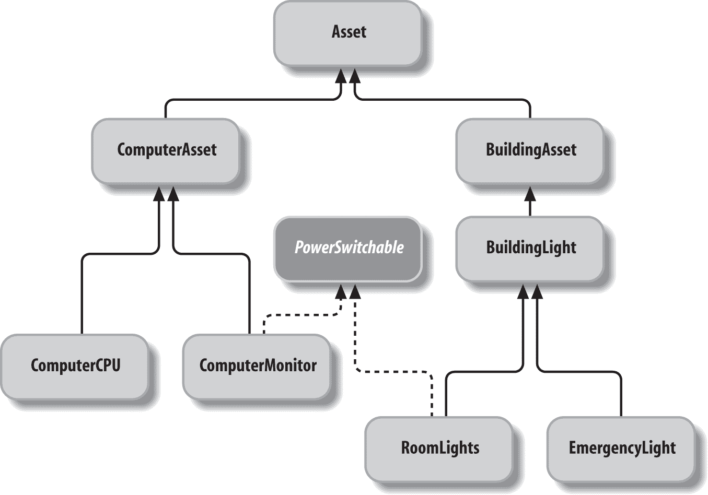

# 第八章：面向对象技术

# 8.0 引言

Java 是一种面向对象（OO）语言，传承自 Simula-67、SmallTalk 和 C++的传统。它借用了 C++的语法和 SmallTalk 的思想。Java API 是根据 OO 模型设计和构建的。设计模式（参见同名书籍），如工厂模式和委托模式，广泛应用；理解这些模式将帮助你更好地使用 API 并改进你自己类的设计。

## 建议或者口头禅

我可以给你很多短小的建议。学习 Java 基础时会出现一些反复出现的主题，我建议在学习更多 Java 时复习一下它们。

### 使用 API

我无法强调这一点的重要性。很多你需要做的事情已经被开发标准 Java 库（以及第三方库）的好人们做过了。随着每一个新版本的发布，这些事情也在不断增加。充分了解 API 是避免“重复造轮子”这种致命病的良好基础——也就是说，不要浪费时间去发明一个低劣的复制品，而那些一流产品早就为你准备好了。事实上，本书的部分使命就是防止你重新发明已经存在的东西。其中一个例子就是`java.util`中讨论的 Collections API，见第七章。Collections API 具有很高的通用性和规律性，所以通常没有必要发明你自己的数据结构代码。

### 规则的例外

有一个例外可以不使用 API 的规则：`java.lang.Object`中的`clone()`方法通常*不*应该使用。如果你需要复制一个对象，只需编写一个复制方法或者*复制构造函数*。Joshua Bloch 在《Effective Java》（Addison-Wesley 出版）中反对`clone()`方法的论点是有说服力的，任何专注于 Java 编程的人都应该阅读一下。顺便说一句，把整本书都读了吧。

另一个例外是`java.lang.Object()`中的`finalize()`方法。不要使用它。自 Java 9 起已经被弃用，因为不能保证它会被调用；但是因为它可能被调用，它会导致你的死对象无法被垃圾收集，从而导致内存泄漏。如果需要某种清理工作，你必须负责定义一个方法并在让该类的任何对象引用失效之前调用它。你可以称这样的方法为`cleanUp()`。对于应用级别的清理，请参考[*https://darwinsys.com/java/shutdownhook.html*](https://darwinsys.com/java/shutdownhook.html)。

### 泛化

在通用性（及由此带来的重用性）与应用特定性便利性之间存在一种权衡。如果您正在按照面向对象设计技术设计非常大的应用程序的一部分，您会考虑一组特定的用例。另一方面，如果您正在编写工具包样式的代码，您应该编写具有少量假设的类。使代码易于从各种程序中使用是编写可重用代码的途径。

### 阅读和编写 javadoc

您无疑已经在浏览器中查看了 Java 在线文档，部分原因是我告诉您要充分了解 API。您认为 Sun/Oracle 雇佣了数百万技术写作人员来生成所有这些文档吗？不。这些文档存在是因为 API 的开发者花时间编写了 javadoc 注释，您在代码中看到的那些有趣的`/**`注释。所以，再给您一个建议：使用 javadoc。标准 JDK 提供了一个良好的、标准的 API 文档化机制。并且在编写代码时就要使用它——不要认为您会在以后回来再写。这种明天永远不会来的想法。

详情请参见食谱 15.2 以获取有关使用 javadoc 的详细信息。

### 使用子类化和委托

使用子类化。但不要过度使用子类化。这不仅是避免代码重复的最佳方式之一，也是开发可工作软件的好方法。有关面向对象设计和编程的更多细节，请参阅任何一本优秀的书籍。

有几种替代方案。子类化的一个替代方案是委托。考虑“是一个”与“有一个”的区别。例如，不要通过子类化`NameAndAddress`来创建`BusinessPartner`和`Customer`，而是让`BusinessPartner`和`Customer`具有`NameAndAddress`的实例。这是一个更清晰的结构；仅仅因为合作伙伴有名称和地址而让`BusinessPartner` *是一个* `NameAndAddress`是没有意义的。委托还使得`Customer`能够更轻松地同时具有账单地址和送货地址。另一个替代方案是面向方面的编程（AOP），它允许您从类的外部附加额外的功能。Java EE 使用 EJB 拦截和 Spring Framework AOP 机制提供了 AOP。

### 使用设计模式

在序言中，我提到*设计模式*作为面向对象编程中非常重要的书籍之一。通常被称为“四人组”（GoF）书籍，因为它有四位作者，它提供了程序员经常重新发明的事物的强大目录。有些人认为 GoF 书籍的语调有些学术性；一本较为非正式的关于模式的介绍是 Bert Bates 等人的*Head First Design Patterns*（O’Reilly），它涵盖了与 GoF 书籍相同的两打模式。设计模式提供了问题及其解决方案的陈述，有点像本书，但通常在更高的抽象级别。它对于提供设计的标准词汇以及清楚解释基本模式如何工作及其如何实现同样重要。

表 8-1 展示了标准 API 中设计模式的一些示例用法。

表 8-1\. JavaSE API 中的设计模式

| 模式名称 | 意义 | Java API 中的示例 |
| --- | --- | --- |
| 命令 | 封装请求，允许请求队列，可撤销操作等 | `javax.swing.Action; javax.swing.undo.UndoableEdit` |
| 装饰器 | 一个类装饰另一个类 | Swing `Border`s |
| 工厂方法 | 一个类为您创建实例，由子类控制 | `getInstance`（在`Calendar`，`Format`，`Locale`中...）; `SocketFactory`; RMI `InitialContext` |
| 迭代器 | 遍历集合中的所有元素，每个元素仅访问一次 | `Iterator`; 旧的`Enumeration`; `java.sql.ResultSet` |
| 模型-视图-控制器 | 模型代表数据; 视图是用户看到的内容; 控制器响应用户请求 | `ActionListener`和其它类; `Observer/Observable`; 所有可见 Swing 组件内部使用 |
| 代理 | 一个对象代替另一个对象 | RMI，AOP，动态代理 |
| 单例 | 只允许一个实例存在 | `java.lang.Runtime, java.awt.Toolkit` |

我为*Oracle Java Magazine*写了关于[状态](https://blogs.oracle.com/javamagazine/the-state-pattern)，[代理](https://blogs.oracle.com/javamagazine/the-proxy-pattern)，[命令](https://blogs.oracle.com/javamagazine/the-command-pattern-in-depth)，[装饰器](https://blogs.oracle.com/javamagazine/the-decorator-pattern-in-depth)和[访问者](https://blogs.oracle.com/javamagazine/the-visitor-design-pattern-in-depth)模式的文章。

# 8.1 对象方法：使用 toString()格式化对象，使用 equals()比较

## 问题

你希望你的对象具有有用的默认格式，并且在放置在`Collections`类中时行为正常。

## 解决方案

从`java.lang.Object`继承了四个可重写方法；其中，`toString()`提供了默认格式化，而`equals()`和`hashCode()`提供了相等性测试和在`Map`实现中的高效使用。第四个`clone()`不建议一般使用。

## 讨论

### toString()

每当你将对象传递给`System.out.println()`或任何等效方法，或者将其涉及到字符串连接中时，Java 会自动调用它的`toString()`方法。Java 知道每个对象都有一个`toString()`方法，因为`java.lang.Object`有一个，并且所有类最终都是`Object`的子类。默认实现在`java.lang.Object`中既不漂亮也不有趣：它只打印类名，一个@符号和对象的`hashCode()`值。例如，如果你运行以下代码

```java
public class ToStringWithout {
    int x, y;

    /** Simple constructor */
    public ToStringWithout(int anX, int aY) {
        x = anX; y = aY;
    }

    /** Main just creates and prints an object */
    public static void main(String[] args) {
        System.out.println(new ToStringWithout(42, 86));
    }
}
```

你可能会看到这种无信息的输出：

```java
ToStringWithout@990c747b
```

要使其打印得更好，你应该提供一个`toString()`方法的实现，该方法打印类名和所有但最简单类中的一些重要状态。这为你在`println()`、调试器和任何将你的对象引用在`String`上下文中的地方提供了格式控制。下面是使用`toString()`方法重写的前一个程序：

```java
public class ToStringWith {
    int x, y;

    /** Simple constructor */
    public ToStringWith(int anX, int aY) {
        x = anX; y = aY;
    }

    @Override
    public String toString() {
        return "ToStringWith[" + x + "," + y + "]";
    }

    /** Main just creates and prints an object */
    public static void main(String[] args) {
        System.out.println(new ToStringWith(42, 86));
    }
}
```

此版本生成更有用的输出：

```java
ToStringWith[42,86]
```

此示例使用了`String`连接，但你可能还想使用`String.format()`或`StringBuilder`；请参见第三章。

### hashCode()和 equals()

要确保当任何客户端代码调用`equals()`或者这些对象被存储在`Map`或其他`Collection`类中时，你的类能够正常工作，请为你的类提供`equals()`和`hashCode()`方法。

如何确定相等性？对于算术或布尔操作数，答案很简单：使用等号操作符（`==`）进行测试。但是对于对象引用，Java 提供了`==`和继承自`java.lang.Object`的`equals()`方法。等号操作符可能会令人困惑，因为它只是比较两个对象引用，看它们是否引用同一个对象。这与比较对象本身的值不同。

继承的`equals()`方法并不像你想象的那样有用。有些人似乎开始他们作为 Java 开发者的生活时，认为默认的`equals()`可以神奇地进行详细的、逐字段甚至是二进制的对象比较。但是它*不会*比较字段！它只是做了可能的最简单的事情：返回两个对象之间`==`比较的值！所以，对于你编写的任何*值类*，你可能需要编写一个`equals`方法。¹ 注意，`Map`或哈希表（如`HashMap`）会使用`equals`和`hashCode`方法。因此，如果你认为可能有人会使用你的类创建实例并将它们放入`Map`，或者甚至比较你的对象，你应该为此（也为了自己！）实现`equals()`和`hashCode()`方法，并且要正确实现它们。

大多数 IDE 知道如何生成正确的`equals()`和`hashCode()`方法，但值得你了解它们的功能，以应对偶尔需要调整生成代码的情况。例如，Eclipse IDE（参见 Recipe 1.3）提供了一个`Source`菜单项`Generate hashCode() and equals()`；它只会同时生成两者，而不会让你单独生成`equals()`或`hashCode()`。

这是一个正确的`equals()`方法的规则：

它是自反的。

`x.equals(x)`必须为真。

它是对称的。

`x.equals(y)`必须为真当且仅当`y.equals(x)`也为真。

它是传递的。

如果`x.equals(y)`为真且`y.equals(z)`为真，则`x.equals(z)`必须也为真。

它是幂等的（可重复的）。

对`x.equals(y)`的多次调用返回相同的值（除非比较中使用的状态值已更改，例如通过调用设置方法）。

它是谨慎的。

`x.equals(null)`必须返回假，而不是意外抛出`NullPointerException`。

此外，要注意一个常见的错误：`equals()`的参数必须声明为`java.lang.Object`，而不是它所在的类；这是为了使多态性能够正确工作（某些类可能没有自己的`equals()`方法）。为了防止这种错误，通常会在`equals()`覆盖中添加`@Override`注解，如 Recipe 15.3 中所述。

这里是一个努力实现这些规则的类：

```java
public class EqualsDemo {
    private int int1;
    private SomeClass obj1;

    /** Constructor */
    public EqualsDemo(int i, SomeClass o) {
        int1 = i;
        if (o == null) {
            throw new IllegalArgumentException("Data Object may not be null");
        }
        obj1 = o;
    }

    /** Default Constructor */
    public EqualsDemo() {
        this(0, new SomeClass());
    }

    /** Demonstration "equals" method */
    @Override
    public boolean equals(Object o) {
        if (o == this)                    
            return true;

        if (o == null)                    
            return false;

        // Of the correct class?
        if (o.getClass() != EqualsDemo.class) 
            return false;

        EqualsDemo other = (EqualsDemo)o; // OK, cast to this class 
        // compare field-by-field 
        if (int1 != other.int1)           // compare primitives directly
            return false;
        if (!obj1.equals(other.obj1))     // compare objects using their equals
            return false;
        return true;
    }

    // ...
```


优化：如果是同一个对象，根据定义为真。


如果其他对象为空，则根据定义为假。


使用`!=`比较类描述符；见下一段。


优化：首先比较原始数据类型。可能值得，也可能不值得；可能更好的是按照最有可能不同的顺序排序——这取决于数据和使用情况。

另一个要避免的常见错误：注意使用类描述符相等性（即`o.getClass() != EqualsDemo.class`）来确保正确的类，而不是通过`instanceof`，有时会错误地这样做。`equals()`方法契约的自反要求几乎使得正确比较子类和超类几乎不可能，因此我们现在使用类相等性（详见 Chapter 17, *Reflection, or “A Class Named Class”*中关于类描述符的详细信息）。

这里是`EqualsDemo`类的基本 JUnit 测试（参见 Recipe 1.10）：

```java
/** Some JUnit test cases for EqualsDemo.
 * Writing a full set is left as "an exercise for the reader".
 */
public class EqualsDemoTest {

    /** an object being tested */
    EqualsDemo d1;
    /** another object being tested */
    EqualsDemo d2;

    /** Method to be invoked before each test method */
    @Before
    public void setUp() {
        d1 = new EqualsDemo();
        d2 = new EqualsDemo();
    }

    @Test
    public void testSymmetry() {
        assertTrue(d1.equals(d1));
    }

    @Test
    public void testSymmetric() {
        assertTrue(d1.equals(d2) && d2.equals(d1));
    }

    @Test
    public void testCaution() {
        assertFalse(d1.equals(null));
    }
}
```

通过所有这些测试，可能会出现什么问题？嗯，有些事情仍然需要注意。如果对象是`EqualsDemo`的*子类*怎么办？我们应该测试在这种情况下返回假。

还有什么问题？嗯，如果 `obj1` 或 `other.obj1` 是空的呢？你可能刚刚获得了一个漂亮的新 `NullPointerException`。因此，你还需要测试任何可能为空的值。良好的构造函数可以避免这些 `NullPointerException`，就像我在 `EqualsDemo` 中尝试做的那样，或者显式地测试它们。

最后，你不应该在不同时重写 `hashCode()` 的情况下重写 `equals()`，而且相同的字段必须参与两者的计算。

### hashCode()

`hashCode()` 方法应该返回一个 `int`，它应该唯一地标识其类中对象的任何一组值。

一个正确编写的 `hashCode()` 方法将遵循这些规则：

它是可重复的。

当调用多次时，`hashCode(x)` 必须返回相同的 `int`，除非调用了设置方法。

它与相等性一致

如果 `x.equals(y)`，那么 `x.hashCode()` 必须等于 `y.hashCode()`。

不同的对象应该产生不同的哈希码

如果 `!x.equals(y)`，则不要求 `x.hashCode()` != `y.hashCode()`，但这样做可能会提高哈希表的性能（即在调用 `equals()` 之前哈希可能会调用 `hashCode()`）。

标准 JDK 上的默认 `hashCode()` 返回一个机器地址，这符合第一个规则。遵循第二和第三规则部分取决于你的 `equals()` 方法。以下是一个打印少量对象哈希码的程序：

```java
public class PrintHashCodes {

    /** Some objects to hashCode() on */
    protected static Object[] data = {
        new PrintHashCodes(),
        new java.awt.Color(0x44, 0x88, 0xcc),
        new SomeClass()
    };

    public static void main(String[] args) {
        System.out.println("About to hashCode " + data.length + " objects.");
        for (int i=0; i<data.length; i++) {
            System.out.println(data[i].toString() + " --> " +
                data[i].hashCode());
        }
        System.out.println("All done.");
    }
}
```

它打印什么？

```java
> javac -d . oo/PrintHashCodes.java
> java oo.PrintHashCodes
About to hashCode 3 objects.
PrintHashCodes@982741a0 --> -1742257760
java.awt.Color[r=68,g=136,b=204] --> -12285748
SomeClass@860b41ad --> -2046082643
All done.
>
```

`Color` 对象的哈希码值很有趣。它实际上是这样计算的：

```java
alpha<<24 + r<<16 + g<<8 + b
```

在这个公式中，`r`、`g` 和 `b` 分别是红色、绿色和蓝色分量，而 `alpha` 是透明度。每个量都存储在一个 32 位整数的 8 位中。如果 alpha 值大于 128，则这个字中的高位—通过将字节移入字的符号位而被设置—导致当作有符号整数打印时整数值显得负数。哈希码值是 `int` 类型的，所以它们可以是负数。

## 克隆的困难和替代方案

`java.util.Observable` 类（设计用于在 AWT 或 Swing 应用程序中实现模型-视图-控制器模式）包含一个私有 `Vector`，但没有克隆方法来深度克隆它。因此，`Observable` 对象永远不能安全地被克隆！

关于 `clone()` 的这个问题以及其他几个问题——比如给定的 `clone()` 实现是深复制还是浅复制的不确定性——表明 `clone()` 可能没有想得那么周全。一个替代方案是简单地提供一个复制构造函数或类似的方法：

```java
public class CopyConstructorDemo {
    public static void main(String[] args) {
        CopyConstructorDemo object1 = new CopyConstructorDemo(123, "Hello");
        CopyConstructorDemo object2 = new CopyConstructorDemo(object1);
        if (!object1.equals(object2)) {
            System.out.println("Something is terribly wrong...");
        }
        System.out.println("All done.");
    }

    private int number;
    private String name;

    /** Default constructor */
    public CopyConstructorDemo()  {
    }

    /** Normal constructor */
    public CopyConstructorDemo(int number, String name)  {
        this.number = number;
        this.name = name;
    }

    /** Copy constructor */
    public CopyConstructorDemo(CopyConstructorDemo other)  {
        this.number = other.number;
        this.name = other.name;
    }
    // hashCode() and equals() not shown
```

# 8.2 使用内部类

## 问题

你需要编写一个私有类，或最多在另一个类中使用一个类。

## 解决方案

使用非公共类或内部类。

## 讨论

非公共类可以作为另一个类的源文件的一部分编写，但不能在该类内部。内部类是 Java 术语，用于定义在另一个类内部的类。内部类最初在早期的 Java 中因用于 GUI 应用程序的事件处理而流行，但其应用范围更广。

实际上可以在多种上下文中构造内部类。作为类的成员定义的内部类可以在该类的任何位置实例化。在方法内部定义的内部类只能在同一方法中稍后引用。内部类还可以是命名的或匿名的。命名的内部类具有依赖于编译器的完整名称；标准 JVM 使用类似 `MainClass$InnerClass` 的名称来表示生成的文件。类似地，匿名内部类具有依赖于编译器的名称；JVM 使用 `MainClass$1`、`MainClass$2` 等。

这些类不能在任何其他上下文中实例化；对 `OtherMainClass$InnerClass` 等的显式引用在编译时被捕获：

*main/src/main/java/oo/AllClasses.java*

```java
public class AllClasses {
    public class Data {    
        int x;
        int y;
    }
    public void getResults() {
        JButton b = new JButton("Press me");
        b.addActionListener(new ActionListener() { 
            public void actionPerformed(ActionEvent evt) {
                Data loc = new Data();
                loc.x = ((Component)evt.getSource()).getX();
                loc.x = ((Component)evt.getSource()).getY();
                System.out.println("Thanks for pressing me");
            }
        });
    }
}

/** Class contained in same file as AllClasses, but can be used
 * (with a warning) in other contexts.
 */
class AnotherClass {                    
    // methods and fields here...
    AnotherClass() {
        // Inner class from above cannot be used here, of course
        // Data d = new Data();    // EXPECT COMPILE ERROR
    }
}
```


这是一个内部类，在类 `AllClasses` 中可以随处使用。


这显示了匿名内部类语法，它使用 `new` 后跟类型，然后是 `(){`，一个类体，和 `}`。编译器将分配一个名称；该类将根据需要扩展或实现给定的类型。


这是一个非公共类；可以在主类和（带有警告）其他类中使用。

一个问题是内部类保留了对外部类的引用。如果您希望在内部类的生命周期比外部类长时避免内存泄漏，可以将内部类设为 `static`。

实现单方法接口的内部类可以使用 lambda 表达式编写得更加简洁（参见 第九章）。

# 8.3 通过接口提供回调

## 问题

您想提供回调，即使无关的类也可以调用回您的代码。

## 解决方案

使用 Java 接口是一种方式。

## 讨论

接口是类似于类的实体，只能包含抽象方法和 final 字段。正如我们所见，接口在 Java 中被广泛使用！在标准 API 中，以下是一些常用的接口：

+   `Runnable`, `Comparable` 和 `Cloneable`（在 `java.lang` 中）。

+   `List`、`Set`、`Map` 和 `Enumeration/Iterator`（在 Collections API 中；如您在 第七章 中所见）。

+   `ActionListener`、`WindowListener` 和 GUI 层中的其他接口。

+   `Driver`、`Connection`、`Statement` 和 JDBC 中的 `ResultSet`；请参见 [*https://darwinsys.com/javadatabase*](https://darwinsys.com/javadatabase)。

+   *远程接口* —— 客户端和服务器之间的接口被指定为 `Interface`（在 RMI、CORBA 和 EJB 中）。

假设我们正在生成一个建筑管理系统。为了节能，我们希望能够远程关闭（在夜间和周末）诸如室内灯光和计算机显示器这样大量消耗能源的设备。假设我们有某种远程控制技术。它可以是 BSR 的家庭灯光控制技术 X10 的商业版本，也可以是蓝牙或 802.11——这并不重要。重要的是我们必须非常小心地选择关闭的对象。如果我们自动关闭计算机处理器，这将引起极大的愤怒——人们经常在夜间保持运行状态。如果我们关闭建筑应急照明，这将涉及公共安全问题。²

所以我们提出了 Figure 8-1 中显示的设计。



###### Figure 8-1\. 建筑管理系统的类

这些数据类的代码没有显示（它非常琐碎），但它位于在线源码的*oo/interfaces*目录中。顶层类（例如`BuildingLight`和`Asset`）是抽象类。你无法实例化它们，因为它们没有任何具体功能。为了在编译时和运行时确保我们永远不能关闭应急照明，我们只需确保表示它的类`EmergencyLight`不实现`PowerSwitchable`接口。

注意，在这里我们无法直接使用直接继承。没有一个共同的祖先类同时包括既有`ComputerMonitor`和`RoomLights`，又没有包括`ComputerCPU`和`EmergencyLight`。使用接口在不相关的类中定义功能。

我们通过`BuildingManagement`类演示了它们的使用；这个类不是 Figure 8-1 所示层次结构的一部分，但它*使用*了来自该层次结构的一组`Asset`对象。

即使不能被关闭的项目也必须在数据库中，用于各种目的（审计、保险等）。在关闭物品的方法中，代码小心地检查数据库中的每个对象是否是`PowerSwitchable`接口的实例。如果是，则将对象转换为`PowerSwitchable`，以便调用其`powerDown()`方法。如果不是，则跳过该对象，从而防止关闭应急照明或关闭正在运行 SETI@Home、下载大型 MP3 播放列表或执行系统备份的机器的可能性。以下代码展示了这组类的实际应用：

```java
public class BuildingManagement {

    List<Asset> things = new ArrayList<>();

    /** Scenario: goodNight() is called from a timer Thread at 2200, or when
 * we get the "shutdown" command from the security guard.
 */
    public void goodNight() {
        things.forEach(obj -> {
            if (obj instanceof PowerSwitchable)
                ((PowerSwitchable)obj).powerDown();
            });
    }

    // tag::functional[]
    public void goodNightFunctional() {
        things.stream().filter(obj -> obj instanceof PowerSwitchable)
            .forEach(obj -> ((PowerSwitchable)obj).powerDown());
    }
    // end::functional[]

    // goodMorning() would be similar, but call each one's powerUp().

    /** Add a Asset to this building */
    public void add(Asset thing) {
        System.out.println("Adding " + thing);
        things.add(thing);
    }

    /** The main program */
    public static void main(String[] av) {
        BuildingManagement b1 = new BuildingManagement();
        b1.add(new RoomLights(101));    // control lights in room 101
        b1.add(new EmergencyLight(101));    // and emerg. lights.
        // add the computer on desk#4 in room 101
        b1.add(new ComputerCPU(10104));
        // and its monitor
        b1.add(new ComputerMonitor(10104));

        // time passes, and the sun sets...
        b1.goodNight();
    }
}
```

当您运行此程序时，它显示添加的所有项目，但只关闭了`PowerSwitchable`类型的项目：

```java
> java oo.interfaces.BuildingManagement
Adding RoomLights@2dc77f32
Adding EmergencyLight@2e3b7f32
Adding ComputerCPU@2e637f32
Adding ComputerMonitor@2f1f7f32
Dousing lights in room 101
Dousing monitor at desk 10104
>
```

# 8.4 多态性/抽象方法

## 问题

您希望每个子类都提供一个或多个方法的自己版本。

## 解决方案

在父类中将方法声明为抽象；这使得编译器确保每个子类都实现了它。

## 讨论

一个假设的绘图程序使用`Shape`的子类来绘制任何东西。`Shape`有一个名为`computeArea()`的抽象方法，用于计算给定形状的确切面积：

```java
public abstract class Shape {
    protected int x, y;
    public abstract double computeArea( );
}
```

例如，`Rectangle`子类具有一个`computeArea()`方法，将宽度乘以高度并返回结果：

```java
public class Rectangle extends Shape {
    double width, height;
    public double computeArea( ) {
        return width * height;
    }
}
```

`Circle`子类返回π*r*²：

```java
public class Circle extends Shape {
    double radius;
    public double computeArea( ) {
        return Math.PI * radius * radius;
    }
}
```

该系统具有很高的通用性。在主程序中，我们可以迭代一个`Shape`对象的集合，并且这里真正的美妙之处在于，可以在任何`Shape`子类对象上调用`computeArea()`，而不必担心它是什么形状。Java 的多态方法会自动调用对象最初构造时所属类中的正确`computeArea()`方法：

*main/src/main/java/oo//shapes/ShapeDriver.java*

```java
/** Part of a main program using Shape objects */
public class ShapeDriver {

    Collection<Shape> allShapes;    // created in a Constructor, not shown

    /** Iterate over all the Shapes, getting their areas;
 * this cannot use the Java 8 Collection.forEach because the
 * variable total would have to be final, which would defeat the purpose :-)
 */
    public double totalAreas() {
        double total = 0.0;
        for (Shape s : allShapes) {
            total += s.computeArea();
        }
        return total;
    }
```

多态对软件维护是一大利好：如果添加了一个新的子类，则主程序中的代码不会改变。此外，所有特定于多边形处理的代码都在一个地方：在`Polygon`类的源文件中。这比旧语言中使用结构中的类型字段配合分散在软件各处的 case 或 switch 语句要好得多。Java 通过多态使软件更可靠和可维护。

# 8.5 使用类型安全的枚举

## 问题

您需要在程序中管理一个离散值的小列表。

## 解决方案

使用 Java 的`enum`机制。

## 讨论

枚举意味着列出所有值。通常您知道变量中只需要一个小列表的可能值，例如一年中的月份、一副牌中的花色或等级，或者主要和次要颜色。C 编程语言提供了一个`enum`关键字：

```java
enum  { BLACK, RED, ORANGE} color;
```

在早期，Java 因缺乏枚举而受到批评，许多开发人员希望有枚举。许多人不得不开发自定义类来实现*类型安全的枚举模式*。

但是 C 枚举不是类型安全的；它们只是定义可以在任何整数上下文中使用的常量。例如，即使在带有`-Wall`（所有警告）的 gcc 3 上，此代码也可以编译而不会警告，而 C++编译器会捕获错误：³

```java
enum { BLACK, RED, ORANGE} color;
enum { READ, UNREAD } state;

/*ARGSUSED*/
int main(int argc, char *argv[]) {
        color = RED;
        color = READ; // In C this will compile, give bad results
        return 0;
}
```

要在 Java 中复制此错误，只需定义一系列`final int`值；它仍然不是类型安全的。类型安全意味着您不能意外地使用除给定枚举定义之外的值。关于类型安全枚举模式的权威声明可能是在 Joshua Bloch 的书《Effective Java》（Addison-Wesley）的第 21 项中定义的版本。所有现代 Java 版本都在语言中包含枚举；不再需要使用 Bloch 书中的代码。布洛赫是类型安全枚举规范（`enum`关键字）的作者之一，因此可以确信 Java 现在很好地实现了他的模式。这些枚举被实现为类，从类`java.lang.Enum`中（由编译器透明地子类化）继承。与 C 不同，也不同于一系列`final int`，Java 的类型安全枚举具有以下特点：

+   它们是可打印的（它们打印为名称，而不是底层的`int`实现）。

+   它们几乎和`int`常量一样快，但是代码更可读。

+   它们可以轻松地进行迭代。

+   他们为每个`enum`类型使用单独的命名空间，这意味着您不必为每个枚举常量添加某种常量名前缀，例如`ACCOUNT_SAVINGS`，`ACCOUNT_CHECKING`等。

枚举常量不会编译到客户端中，因此您可以自由地重新排序`enum`中的常量，而无需重新编译客户端类。然而，并不意味着您应该这样做；请考虑那些已经持久化了使用它们的对象的情况，以及设计数据库映射的人员使用了枚举的数值。重新排序就是个坏主意！

此外，`enum`类型也是一个类，因此它可以实现任意接口；您可以为`enum`类添加构造函数、字段和方法。

与布洛赫在书中的类型安全枚举模式相比：

+   Java 的`enum`使用起来更简单，更易读（书中的那些需要大量方法，使得编写它们变得麻烦）。

+   枚举可以在 switch 语句中使用。

因此，它们有许多好处，但几乎没有坑。

`enum`关键字在声明中与`class`关键字处于同一级别。也就是说，可以在其自己的文件中使用 public 或 default 访问权限声明`enum`，也可以像嵌套或内部类一样在类内部声明（参见 Recipe 8.2）。*Media.java*，在示例 8-1 中展示了一个展示类型安全`enum`定义的代码示例。

##### 示例 8-1\. structure/Media.java

```java
public enum Media {
    BOOK, MUSIC_CD, MUSIC_VINYL, MOVIE_VHS, MOVIE_DVD;
}
```

请注意，`enum`类*就是*一个类；查看*javap*对`Media`类的看法：

```java
C:> javap Media
Compiled from "Media.java"
public class Media extends java.lang.Enum{
    public static final Media BOOK;
    public static final Media MUSIC_CD;
    public static final Media MUSIC_VINYL;
    public static final Media MOVIE_VHS;
    public static final Media MOVIE_DVD;
    public static final Media[] values( );
    public static Media valueOf(java.lang.String);
    public Media(java.lang.String, int);
    public int compareTo(java.lang.Enum);
    public int compareTo(java.lang.Object);
    static {};
}
C:>
```

*Product.java*，在示例 8-2 中展示了一个使用`Media`枚举的代码示例。

##### 示例 8-2\. main/src/main/java/structure/Product.java

```java
public class Product {
    String title;
    String artist;
    Media  media;

    public Product(String artist, String title, Media media) {
        this.title = title;
        this.artist = artist;
        this.media = media;
    }

    @Override
    public String toString() {
        switch (media) {
        case BOOK:
            return title + " is a book";
        case MUSIC_CD:
            return title + " is a CD";
        case MUSIC_VINYL:
            return title + " is a relic of the age of vinyl";
        case MOVIE_VHS:
            return title + " is on old video tape";
        case MOVIE_DVD:
            return title + " is on DVD";
        default:
            return title + ": Unknown media " + media;
        }
    }
}
```

在示例 8-3，`MediaFancy`展示了如何向枚举类型添加操作（方法）；为该枚举类型的`Book`值重写了`toString()`方法。

##### 示例 8-3\. main/src/main/java/structure/MediaFancy.java

```java
/** An example of an enum with method overriding */
public enum MediaFancy {
    /** The enum constant for a book, with a method override */
    BOOK {
        public String toString() { return "Book"; }
    },
    /** The enum constant for a Music CD */
    MUSIC_CD,
    /** ... */
    MUSIC_VINYL,
    MOVIE_VHS,
    MOVIE_DVD;

    /** It is generally disparaged to have a main() in an enum;
 * please forgive this tiny demo class for doing so.
 */
    public static void main(String[] args) {
        MediaFancy[] data =  { BOOK, MOVIE_DVD, MUSIC_VINYL };
        for (MediaFancy mf : data) {
            System.out.println(mf);
        }
    }
}
```

运行`MediaFancy`程序会产生这样的输出：

```java
Book
MOVIE_DVD
MUSIC_VINYL
```

换句话说，`Book`的值以用户友好的方式打印，与其他值的默认打印方式相比。在实际生活中，您可能希望将此扩展到枚举中的所有值。

最后，`EnumList`在示例 8-4 中展示了如何列出给定枚举可以取的所有可能值；只需迭代枚举类继承的`values()`方法返回的数组即可。

##### 示例 8-4\. structure/EnumList.java

```java
public class EnumList {
    enum State {
        ON, OFF, UNKNOWN
    }
    public static void main(String[] args) {
        for (State i : State.values()) {
            System.out.println(i);
        }
    }
}
```

`EnumList`程序的输出当然是这样的：

```java
ON
OFF
UNKNOWN
```

# 8.6 使用`Optional`避免 NPEs

## 问题

你担心空引用会在代码中引发`NullPointerException`（NPE）。

## 解决方案

使用`java.util.Optional`。

## 讨论

发明了空指针概念的开发者，并且是我们学科的早期重要贡献者，已经将空引用描述为[“我的十亿美元错误”](https://en.wikipedia.org/wiki/Tony_Hoare)。然而，使用`null`在短期内不会消失。

我们可以做的是明确表示我们在某些情境中担心空指针。为此，Java 8 引入了`java.util.Optional`类。`Optional`是围绕可能为 null 的对象引用的对象包装器。`Optional`包装器有着悠久的历史；在 LLVM 的 ADT 中可以找到类似的构造，在那里它的`Optional`反过来描述为“在 OCaml 的*opt*变体精神中”。

`Optional`可以使用其中一个创建方法来创建：

`Optional.empty()`

返回一个空的可选值

`Optional.of(T obj)`

返回包含给定值的非空可选值

`Optional.ofNullable(T obj)`

返回一个空的可选值或者包含给定值的可选值

这个类的基本操作是根据它是满还是空来表现出不同的行为。`Optional`对象是不可变的，因此它们不能从一种状态转换到另一种状态。

最简单的用法是调用`isEmpty()`或其相反的`isPresent()`，并使用程序逻辑来以不同方式行事。这与使用`if`语句检查`null`并没有太大不同，但它将选择放在您面前，使您不太可能忘记检查：

```java
jshell> Optional<String> opt = Optional.of("What a day!");
opt ==> Optional[What a day!]

jshell> if (opt.isPresent()) {
   ...>     System.out.println("Value is " + opt.get());
   ...> } else {
   ...>     System.out.println("Value is not present.");
   ...> }
Value is What a day!
```

更好的形式将使用`orElse`方法：

```java
jshell> System.out.println("Value is " + opt.orElse("not present"));
Value is What a day!
```

一个有用的用例是将值传递到方法中。对象可以在传递给方法之前或之后包装在`Optional`中；当从一开始就没有使用`Optional`的代码迁移时，后者非常有用。示例 8-5 中的`Item`演示可能代表了部分发货跟踪程序、借阅图书馆管理器或任何具有时间相关数据可能缺失的内容。

##### 示例 8-5\. main/src/main/java/oo/OptionalDemo.java

```java
        List.of(
            new Item("Item 1", LocalDate.now().plusDays(7)),
            new Item("Item 2")).
                forEach(System.out::println);
    static class Item {
        String name;
        Optional<LocalDate> dueDate;
        Item(String name) {
            this(name, null);
        }
        Item(String name, LocalDate dueDate) {
            this.name = name;
            this.dueDate = Optional.ofNullable(dueDate);
        }

        public String toString() {
            return String.format("%s %s", name,
                dueDate.isPresent() ?
                    "Item is due on " + dueDate.get() :
                    "Sorry, do not know when item is due");
        }
    }
```

有抛出异常的方法，返回空等方法。还有与 Streams 机制交互的方法（见配方 9.3）。`Optional`的所有方法列表在[javadoc 页面的开头](https://docs.oracle.com/en/java/javase/13/docs/api/java.base/java/util/Optional.html)。

# 8.7 强制执行单例模式

## 问题

你想确保在给定的 Java 虚拟机中只有一个类的实例，或者至少在你的应用程序中只有一个类的实例。

## 解决方案

在类中实现单例模式有几种方法：

+   枚举实现

+   只有私有构造函数（或多个）和一个`getInstance()`方法

+   使用 Spring 或 CDI 等框架（配方 8.9）配置为提供普通类的单例式实例化

## 讨论

通常有用的是确保只创建一个类的实例，通常是通过单一点来处理对某些资源的所有请求。标准 API 中的单例示例是`java.lang.Runtime`：你无法创建`Runtime`的实例；你只需调用静态方法`Runtime.getRuntime()`来获取引用。单例模式也是一个可以轻松实现的设计模式的示例。在所有形式中，单例实现的要点是提供一个实例，其中某些方法可以运行，通常用于控制对某些资源的访问。

最简单的实现方法是使用 Java 的`enum`来提供单例性。`enum`机制已经保证了在给定的 JVM 上下文中每个枚举常量只存在一个实例，因此这种技术就利用了这一点，如示例 8-6 所示。

##### 示例 8-6\. main/src/main/java/oo/EnumSingleton.java

```java
public enum EnumSingleton {

    INSTANCE;

    // instance methods protected by singleton-ness would be here...

    /** A simple demo method */
    public String demoMethod() {
        return "demo";
    }
}
```

使用它很简单：

```java
        // Demonstrate the enum method:
        EnumSingleton.INSTANCE.demoMethod();
```

下一个最简单的实现包括一个私有构造函数和一个保存其结果的字段，以及一个静态访问器方法，名称类似`getInstance()`。

可以通过静态初始化块或更简单的初始化器来为私有字段赋值。然后，`getInstance()`方法（必须是公共的）简单地返回这个实例：

```java
public class Singleton {

    /**
 * Static Initializer is run before class is available to code, avoiding
 * broken anti-pattern of lazy initialization in instance method.
 * For more complicated construction, could use static block initializer.
 */
    private static Singleton instance = new Singleton();

    /** A private Constructor prevents any other class from instantiating. */
    private Singleton() {
        // nothing to do this time
    }

    /** Static 'instance' method */
    public static Singleton getInstance() {
        return instance;
    }

    // other methods protected by singleton-ness would be here...

    /** A simple demo method */
    public String demoMethod() {
        return "demo";
    }
}
```

请注意，在`getInstance()`方法中使用*延迟评估*（如*设计模式*中）在 Java 中并不是必要的，因为 Java 已经使用*延迟加载*。直到调用`getInstance()`时，你的`Singleton`类可能都不会被加载，所以尝试通过让`getInstance()`测试`singleton`变量是否为空并在那里创建单例来推迟`Singleton`的构建是没有意义的。

使用这个类同样简单：只需获取实例引用，然后调用其方法：

```java
        // Demonstrate the codeBased method:
        Singleton.getInstance().demoMethod();
```

一些评论员认为，基于代码的单例应该还提供一个`public final clone()`方法，只是抛出异常，以避免那些欺骗并`clone()`单例的子类。然而，很明显，只有私有构造函数的类不能被子类化，因此这种偏执似乎是没有必要的。

## 参见

`java.util`中的`Collections`类具有`singletonList()`、`singletonMap()`和`singletonSet()`方法，分别返回只包含传递给方法的一个对象的不可变`List`、`Map`或`Set`。当然，这并不会将对象转换为防止克隆该对象或构造其他实例的单例模式。

参见原著《*设计模式*》书第 127 页。

# 8.8 自定义异常

## 问题

您希望使用一个特定于应用程序的异常类或两个异常类。

## 解决方案

继续并对`Exception`或`RuntimeException`进行子类化。

## 讨论

理论上，您可以直接子类化`Throwable`，但这被认为是不礼貌的。通常情况下，您会子类化`Exception`（如果您想要一个受检异常）或`RuntimeException`（如果您想要一个未受检异常）。受检异常是应用程序开发人员需要通过在调用方法的`throws`子句中列出它们来捕获或向上抛出的异常。

在子类化任何一个异常时，通常至少应提供以下构造函数：

+   一个无参数构造函数

+   一个一个字符串参数的构造函数

+   一个两参数构造函数——一个字符串消息和一个`Throwable`原因

如果接收异常的代码对其执行堆栈跟踪操作，则会显示原因，带有“根本原因是”或类似的前缀。示例 8-7 展示了应用程序定义的异常`ChessMoveException`的这三个构造函数。

##### 示例 8-7\. main/src/main/java/oo/ChessMoveException.java

```java
/** A ChessMoveException is thrown  when the user makes an illegal move. */
public class ChessMoveException extends Exception {

    private static final long serialVersionUID = 802911736988179079L;

    public ChessMoveException () {
        super();
    }

    public ChessMoveException (String msg) {
        super(msg);
    }

    public ChessMoveException(String msg, Exception cause) {
        super(msg, cause);
    }
}
```

## 参见

`Exception`的 javadoc 文档列出了大量的子类；您可以首先查看那里是否有您可以使用的子类。

# 8.9 使用依赖注入

## 问题

您希望避免类之间的过度耦合，并且希望避免为对象创建/查找而专门编写的过多代码。

## 解决方案

使用依赖注入框架。

## 讨论

依赖注入框架允许您将对象传递给您的代码，而不是要求您显式地创建它们（这会将您的代码与实现类名绑定在一起，因为您正在调用构造函数）或查找它们（这可能需要使用可能繁琐的查找 API，如 JNDI，即 Java 命名和目录接口）。

三个最知名的依赖注入框架分别是 [Spring Framework](http://springframework.org)、[Java Enterprise Edition’s Context and Dependency Injection (CDI)](http://docs.oracle.com/javaee/6/tutorial/doc/giwhl.html) 和 [Google Guice](http://code.google.com/p/google-guice)。假设我们有三个类，`Model`、`View` 和 `Controller`，实现传统的 MVC 模式。考虑到我们可能希望对其中一些类的不同版本进行管理，尤其是 `View`，我们将为 Model 的简单版本（在 Example 8-8 中）和 View 的简单版本（在 Example 8-9 中）定义 Java 接口。

##### 示例 8-8\. MVC 模型接口

```java
public interface Model {
	String getMessage();
}
```

##### 示例 8-9\. main/src/main/java/di/View.java（MVC 视图接口）

```java
public interface View {

    void displayMessage();

}
```

这些的实现没有显示，因为它们非常简单，但是可以在线找到。在这个例子中，控制器是一个主程序，不需要接口。首先，让我们看一个 *不* 使用依赖注入的主程序版本。显然，View 需要 Model 来获取要显示的数据：

*main/src/main/java/di/ControllerTightlyCoupled.java*

```java
public class ControllerTightlyCoupled {

    public static void main(String[] args) {
        Model m = new SimpleModel();
        ConsoleViewer v = new ConsoleViewer();
        v.setModel(m);
        v.displayMessage();
    }
}
```

在这里我们有四个任务要完成：

1.  创建 Model。

1.  创建 View。

1.  将 Model 绑定到 View。

1.  要求视图显示一些数据。

现在使用依赖注入的版本：

*main/src/main/java/di/spring/MainAndController.java - Spring 控制器*

```java
public class MainAndController {

    public static void main(String[] args) {
        ApplicationContext ctx =
            new AnnotationConfigApplicationContext("di.spring");
        View v = ctx.getBean("myView", View.class);
        v.displayMessage();
        ((AbstractApplicationContext) ctx).close();
    }
}
```

在这个版本中，我们只有三个任务：

1.  设置 Spring 上下文，提供依赖注入框架。

1.  从上下文获取 View；它已经将 Model 设置到其中！

1.  要求视图显示一些数据。

此外，我们不依赖于接口的特定实现。

Spring 如何知道要向视图注入或提供一个 Model？它如何知道要为视图使用什么代码？可能会有多个视图接口的实现。当然，我们必须告诉它这些信息，我们将在这里使用注解来做到这一点：

```java
@Named("myView")
public class ConsoleViewer implements View {

    Model messageProvider;

    @Override
    public void displayMessage() {
        System.out.println(messageProvider.getMessage());
    }

    @Resource(name="myModel")
    public void setModel(Model messageProvider) {
        this.messageProvider = messageProvider;
    }

}
```

虽然 Spring 提供了自己的注解，但也会接受 Java 标准的 `@javax.annotation.Resource` 注解进行注入和 `@java.inject.Named` 来指定注入对象。

由于信息在网络上的持久性，如果你搜索 Spring 注入，你可能会找到大量引用旧版 Spring 2.x 配置方法的文章，即使用 XML 配置文件的方法。你仍然可以使用这种方法，但现代 Spring 实践通常是使用 Java 注解来配置依赖关系。

在 Java 企业版（EE）上下文和依赖注入（CDI）中也使用了注解。虽然这在 Web 应用程序中最为广泛使用，我们将重复使用相同的示例，使用 CDI 的开源 Weld 实现。CDI 比 Spring 的 DI 功能更强大；因为在 CDI 中，我们甚至不需要知道从哪个类注入资源，所以甚至不需要 Spring 示例中的接口！首先是控制器或主程序，它需要一些 Weld 特定的导入，因为 CDI 最初是为企业应用程序设计的：

```java
public class MainAndController {
    public static void main(String[] args) {
        final Instance<Object> weldInstance = new Weld().initialize().instance();
        weldInstance.select(ConsoleViewer.class).get().displayMessage();
    }
}
```

`View`接口被两个实现共享。`ConsoleViewer`的实现也类似，只是它不与模型耦合；它只是请求注入一个`String`。在这个简单的示例中，应用程序中只有一个`String`；在更大的应用程序中，您需要一个额外的注解来指定要注入的字符串。这里是 CDI 的`ConsoleViewer`：

```java
public class ConsoleViewer implements View {
    @Inject @MyModel
    private String message;

    @Override
    public void displayMessage() {
        System.out.println(message);
    }
}
```

注入的`String`来自哪里？仍然来自模型：

*main/src/main/java/di/cdi/ModelImpl.java*

```java
public class ModelImpl {

    public @Produces @MyModel String getMessage(InjectionPoint ip)
        throws IOException {

        ResourceBundle props = ResourceBundle.getBundle("messages");
        return props.getString(
            ip.getMember().getDeclaringClass().getSimpleName() + "." +
            ip.getMember().getName());
    }
}
```

## 另请参阅

Spring DI、Java EE CDI 和 Guice 都提供强大的*依赖注入*。Spring 的使用更广泛；Java EE 具有相同的功能，并且内置于每个 EE 容器中。这三种方法可以独立使用，也可以在 Web 应用程序中使用，只需进行轻微调整即可。在 EE 中，Spring 为 Web 应用程序提供了特别支持，在 EE 容器中，CDI 已经设置好，因此在 EE 应用程序中不需要`CDIMain`示例中的第一条语句。关于 Spring 有很多书籍。有一本书专门介绍了 Weld：*[JBoss Weld CDI for Java Platform](http://shop.oreilly.com/product/9781782160182.do)*，作者是 Ken Finnegan（O'Reilly）。

# 8.10 程序：绘图仪

不是因为它非常复杂，而是因为它很简单，这个程序作为我们在本章涵盖的一些内容的示例，同时，在它的子类中，它还提供了其他讨论的起点。这个类描述了一系列老式（即 20 世纪 70 年代和 80 年代常见的）钢笔绘图仪。钢笔绘图仪是一种将钢笔移动到纸张上并画图的设备。它可以抬起笔或放下笔，并且可以画线条、字母等。在激光打印机和喷墨打印机兴起之前，钢笔绘图仪是准备各种图表以及演示幻灯片的主要手段（这是在像 Harvard Presents 和 Microsoft PowerPoint 之类的程序兴起之前）。今天，几乎没有公司还在生产钢笔绘图仪，但我在这里使用它们是因为它们足够简单，可以从这个简短的描述中理解。今天的 3D 打印机可以被认为是钢笔绘图仪的一种复苏，只是增加了一个额外的运动轴。还有一个更高级的笔。

我将介绍一个高级类，抽象出由不同供应商制造的一系列这样的绘图机的关键特征。例如，它将用于分析或数据探索程序中，绘制显示数据关系的彩色图表。但我不希望我的主程序担心任何特定品牌的细节，所以我将其抽象为一个 `Plotter` 类，其源代码如下：

*main/src/main/java/plotter/Plotter.java*

```java
/**
 * Plotter abstract class. Must be subclassed
 * for X, DOS, Penman, HP plotter, etc.
 *
 * Coordinate space: X = 0 at left, increases to right.
 *        Y = 0 at top, increases downward (same as AWT).
 *
 * @author    Ian F. Darwin
 */
public abstract class Plotter {
    public final int MAXX = 800;
    public final int MAXY = 600;
    /** Current X co-ordinate (same reference frame as AWT!) */
    protected int curx;
    /** Current Y co-ordinate (same reference frame as AWT!) */
    protected int cury;
    /** The current state: up or down */
    protected boolean penUp;
    /** The current color */
    protected int penColor;

    Plotter() {
        penUp = true;
        curx = 0; cury = 0;
    }
    abstract void rmoveTo(int incrx, int incry);
    abstract void moveTo(int absx, int absy);
    abstract void penUp();
    abstract void penDown();
    abstract void penColor(int c);

    abstract void setFont(String fName, int fSize);
    abstract void drawString(String s);

    /* Concrete methods */

    /** Draw a box of width w and height h */
    public void drawBox(int w, int h) {
        penDown();
        rmoveTo(w, 0);
        rmoveTo(0, h);
        rmoveTo(-w, 0);
        rmoveTo(0, -h);
        penUp();
    }

    /** Draw a box given an AWT Dimension for its size */
    public void drawBox(java.awt.Dimension d) {
        drawBox(d.width, d.height);
    }

    /** Draw a box given an AWT Rectangle for its location and size */
    public void drawBox(java.awt.Rectangle r) {
        moveTo(r.x, r.y);
        drawBox(r.width, r.height);
    }

    /** Show the current location; useful for
 * testing, if nothing else.
 */
    public Point getLocation() {
        return new Point(curx, cury);
    }
}
```

注意抽象方法的多样性。与运动、笔控制或绘图相关的方法因实现运动方式在不同设备上的不同而被留在抽象状态。但是，绘制矩形的方法（`drawBox`）有一个默认实现，它简单地将当前选定的笔移动到上次移动到的位置，绘制四条边界，并抬起笔。更智能的绘图机的子类可能会重写这个方法，但是较低级的绘图机的子类可能会使用默认版本。这个方法还有两个重载的方便方法，用于客户端有 AWT 尺寸维度或 AWT 矩形位置和尺寸的情况。

要演示该程序的一个子类，请考虑以下简单的驱动程序。这旨在模拟更大的图形应用程序，如 gnuplot。`main` 开头附近的 `Class.forName()` 在 Recipe 17.2 中有讨论；暂时，你可以相信它只是创建给定子类的一个实例，我们将其存储在名为 `r` 的 `Plotter` 引用中，并用它来绘制图表：

*main/src/main/java/plotter/PlotDriver.java*

```java
public class PlotDriver {

    /** Construct a Plotter driver, and try it out. */
    public static void main(String[] argv) {
        Plotter r ;
        if (argv.length != 1) {
            System.err.println("Usage: PlotDriver driverclass");
            return;
        }
        try {
            Class<?> c = Class.forName(argv[0]);
            Object o = c.newInstance();
            if (!(o instanceof Plotter))
                throw new ClassNotFoundException("Not instanceof Plotter");
            r = (Plotter)o;
        } catch (ClassNotFoundException e) {
            System.err.println("Sorry, class " + argv[0] +
                    " not a plotter class");
            return;
        } catch (Exception e) {
            e.printStackTrace();
            return;
        }
        r.penDown();
        r.penColor(1);
        r.moveTo(200, 200);
        r.penColor(2);
        r.drawBox(123, 200);
        r.rmoveTo(10, 20);
        r.penColor(3);
        r.drawBox(123, 200);
        r.penUp();
        r.moveTo(300, 100);
        r.penDown();
        r.setFont("Helvetica", 14);
        r.drawString("Hello World");
        r.penColor(4);
        r.drawBox(10, 10);
    }
}
```

我们在接下来的章节中并不展示该 `Plotter` 类的任何实际子类，但在同一源文件夹中有一个 `PlotterAWT` 的概念验证，可以为 PostScript、PDF 或其他输出技术实现它。

¹ 值类主要用于保存状态而不是逻辑：`Person` 是一个值类，而 `java.lang.Math` 不是。许多类介于两者之间。

² 当然，这些灯可能没有远程断电功能。但计算机可能会有，用于维护目的。

³ 对于那些不太熟悉 C/C++ 的 Java 开发者来说，C 是旧的非面向对象语言；C++ 是 C 的面向对象衍生语言；Java 在某种程度上是 C++ 的便携式、更加类型安全的衍生语言。
