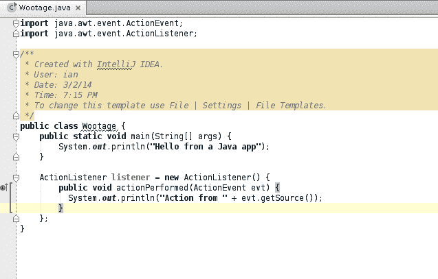
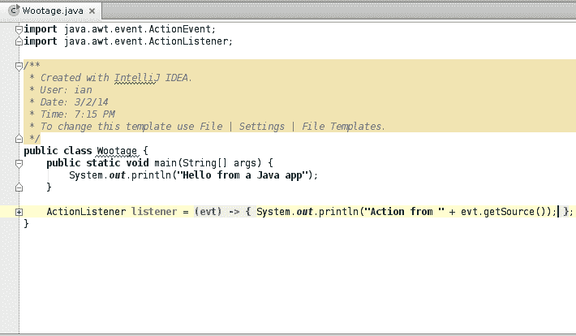

# 第九章\. 函数式编程技术：函数接口、流和并行集合

# 9.0 引言

Java 是一种面向对象（OO）语言。你知道这是什么。函数式编程（FP）近来引起了关注。关于 FP 的定义或许不如 FP 语言多，但也差不多。维基百科对函数式编程的定义如下（来源于[*https://en.wikipedia.org/wiki/Functional_programming*](https://en.wikipedia.org/wiki/Functional_programming)，2013 年 12 月访问）：

> 一种编程范式，一种构建计算机程序结构和元素的风格，将计算视为数学函数的评估，并避免状态和可变数据。函数式编程强调的是产生结果仅依赖于其输入而不依赖于程序状态的函数，即纯数学函数。这是一种声明式编程范式，意味着编程是通过表达式完成的。在函数式代码中，函数的输出值仅取决于作为函数输入的参数，因此对于相同参数 x 两次调用函数 f 将产生相同的结果 f(x)。消除副作用，即不依赖于函数输入的状态变化，可以大大增强理解和预测程序行为的能力，这是开发函数式编程的关键动机之一。

我们如何从 FP 范式中受益？一种方式是转向使用 FP 语言；一些主要的 FP 语言包括 Haskell^(1)、Idris、Ocaml、Erlang、Julia 和 LISP 家族。但大多数这些语言都要求放弃 Java 生态系统。你可以考虑使用[Scala](http://www.scala-lang.org)或[Clojure](http://clojure.org)，这些是基于 JVM 的语言，在面向对象语言的背景下提供函数式编程支持。还有[Kotlin](https://kotlinlang.org)，这是最新的类 Java 语言。

但这是《Java Cookbook》，因此可以想象，我们将尝试在保持 Java 语言的同时获得尽可能多的函数式编程好处。FP 的一些特征包括以下内容：

+   纯函数没有副作用，其结果仅取决于它们的输入，而不依赖于程序中其他地方的可变状态

+   一级函数（例如，函数作为数据）

+   不可变数据

+   广泛使用递归和惰性评估

*纯函数* 是完全自包含的；它们的操作仅取决于输入参数和内部逻辑，而不取决于程序其他部分的任何变量状态——事实上，没有全局变量，只有全局 *常量*。虽然这对于那些受过 Java 等命令式语言教育的人来说可能难以接受，但这确实使测试和确保程序正确性变得更加容易！这意味着，无论程序中发生了什么（即使是多个线程），像 `computeValue(27)` 这样的方法调用每次都会无条件地返回相同的值（当然，有一些例外情况，比如当前时间、随机种子等，这些是全局状态）。

我们在本章中将 *函数* 和 *方法* 这两个术语互换使用，虽然这不是严格正确的。函数式编程人员在数学函数的意义上使用术语 *函数*，而在 Java 中 *方法* 仅表示您可以调用的一些代码（Java 方法调用在面向对象的视角中也被称为向对象 *发送* 的 *消息*）。

*函数作为数据* 意味着你可以创建 *一个函数对象*，将其传递到另一个函数中，编写一个返回另一个函数的函数，等等——不需要特殊的语法，因为，嗯，函数 *就是* 数据。

Java 中的函数式编程方法之一是定义功能性接口。在 Java 中，*功能性接口* 是只有一个抽象方法的接口，例如广泛使用的 `Runnable`，其唯一方法是 `run()`，或常见的 Swing 动作处理程序 `ActionListener`，其唯一方法是 `actionPerformed(ActionEvent)`。实际上，也是 Java 8 中的新功能，接口可以具有使用 `default` 关键字注释的方法。接口中的 `default` 方法可用于实现接口的任何类中。这种方法不能依赖于特定类中的实例状态，因为它们在编译时无法引用它。

所以一个功能性接口更精确的定义是具有单一非默认方法的接口。如果你使用功能性接口，并且限制方法中的代码不依赖于任何非最终实例或类字段，则可以在 Java 中进行函数式编程；使用默认方法是实现这一目标的一种方法。本章的前几个示例讨论了功能性接口。

另一个 Java 实现功能性的方法是 lambda 表达式。Lambda 是功能性接口的表达式，它可以被用作数据（即，赋值、返回等）。现在只给出几个简短的例子：

```java
ActionListener x = e -> System.out.println("You activated " + e.getSource());
```

```java
public class RunnableLambda {

    public static void main(String[] args) {
        threadPool.submit(() -> System.out.println("Hello from a thread"));
```

在理论上，不可变数据很容易：只需有一个只有读取访问器（“get”方法）的类。例如，标准的 `String` 类是不可变的：诸如 `substring()` 或 `toUpperCase()` 的方法并不改变原始字符串，而是根据请求生成新的字符串对象。然而字符串是普遍使用的，也很有用。枚举类型也是隐式不可变的。在 Java 14 或 15 中有提议添加一种称为 `record` 的新型类似对象。`record` 是隐式不可变的；编译器为字段生成“get”方法（以及一个构造函数和三个通用的 `Object` 方法），但不生成“set”方法。

Java 8 中还有 `Stream` 类的概念。`Stream` 就像一个管道，你可以输入、扩展、收集——类似于 Unix 管道的概念和 Google 的分布式编程概念 MapReduce 的交叉，如 [Hadoop](http://hadoop.apache.org) 所示，但在单个 VM、单个程序中运行。`Stream` 可以是顺序的或并行的；后者设计用于利用硬件设计中发生的大规模并行性（特别是服务器，其中 12 核和 16 核处理器很流行）。我们在本章的多个示例中讨论 `Stream`。

如果你熟悉 Unix 的管道和过滤器，这种等价性对你来说就很容易理解；如果不熟悉，现在可以跳过它。Unix 命令是这样的：

```java
cat lines.txt | sort | uniq | wc -l
```

Java `Stream` 的等价物是这样的：

```java
jshell> long numberLines =
    new BufferedReader(
    new FileReader("lines.txt")).lines().sorted().distinct().count();
numberLines ==> 5
```

这些命令在 Example 9-1 中更符合 Java 的惯用语法。两种方法得到相同的答案。对于小输入，Unix 管道更快；但对于较大的数据量，尤其是并行化时，Java 的方法应该更快。

##### Example 9-1\. main/src/main/java/functional/UnixPipesFiltersReplacement.java

```java
        long numberLines = Files.lines(Path.of(("lines.txt")))
            .sorted()
            .distinct()
            .count();
        System.out.printf("lines.txt contains " + numberLines + " unique lines.");
```

与 `Stream` 相关的是 `Spliterator` 的概念，它是熟悉的 `Iterator` 的派生物（逻辑上而非继承上），但设计用于并行处理。大多数用户不需要开发自己的 `Spliterator`，并且通常不会直接调用其方法，因此我们不会详细讨论它们。

## 参见

要了解有关函数式编程的一般信息，请参阅 Neal Ford 的书 *[Functional Thinking](http://shop.oreilly.com/product/0636920029687.do)*（O’Reilly）。

还有一整本书专门讨论 lambda 表达式和相关工具，Richard Warburton 的 *[Java 8 Lambdas](http://shop.oreilly.com/product/0636920030713.do)*（O’Reilly）。

# 9.1 使用 Lambdas/Closures 替代内部类

## 问题

想要避免即使是匿名内部类风格所需的所有输入。

## 解决方案

使用 Java 的 lambda 表达式。

## 讨论

符号 lambda (λ) 是希腊字母表中的第 11 个字母，因此与西方社会一样古老。[Lambda 演算](http://en.wikipedia.org/wiki/Lambda_calculus)与我们的计算概念一样古老。在这个上下文中，Lambda 表达式是可以引用的小计算单位。它们是数据的函数。从这个意义上说，它们很像匿名内部类，但最好将它们视为*匿名方法*。它们主要用于替换内部类，用于*函数接口*——即一个只有一个抽象方法（函数）的接口。一个非常常见的例子是 AWT 的 `ActionListener` 接口，在 GUI 代码中广泛使用，其唯一方法如下：

```java
public void actionPerformed(ActionEvent);
```

使用 Lambda 现在是编写 GUI 动作监听器的首选方法。这里有一个单一的示例：

```java
quitButton.addActionListener(e -> shutDownApplication(0));
```

因为现在不是每个人都写 Swing GUI 应用程序，所以让我们从一个不需要 GUI 编程的示例开始。假设我们有一组已经从数据库加载到内存中的相机型号描述符对象，并且我们希望为它们编写一个通用的 API 来进行搜索，以供应用程序的其他部分使用。

第一个想法可能沿着以下思路：

```java
public interface CameraInfo {
    public List<Camera> findByMake();
    public List<Camera> findByModel();
    ...
}
```

也许您已经能够看出问题所在了。随着应用程序复杂度的增加，您还需要编写 `findByPrice()`、`findByMakeAndModel()`、`findByYearIntroduced()` 等等。

您可以考虑实现一个例如查询方法，其中您传入一个`Camera`对象，其所有非空字段都用于比较。但是，如何实现查找价格*低于$500*的可换镜头相机？^(2)

因此，更好的方法可能是使用回调函数来进行比较。然后，您可以提供一个匿名内部类来执行任何需要的搜索。您可能希望能够编写像这样的回调方法：

```java
public boolean choose(Camera c) {
    return c.isIlc() && c.getPrice() < 500;
}
```

因此，我们将把它构建成一个接口：^(3)

```java
/** An Acceptor accepts some elements from a Collection */
public interface CameraAcceptor {
    boolean choose(Camera c);
}
```

现在搜索应用程序提供了一个方法：

```java
public List<Camera> search(CameraAcceptor acc);
```

我们可以像这样调用这段代码：

```java
results = searchApp.search(new CameraAcceptor() {
    public boolean choose(Camera c) {
        return c.isIlc() && c.getPrice() < 500;
    }
}
```

或者，如果您不喜欢匿名内部类，您可能需要键入以下内容：

```java
class MyIlcPriceAcceptor implements CameraAcceptor {
    public boolean choose(Camera c) {
        return c.isIlc() && c.getPrice() < 500;
    }
}
CameraAcceptor myIlcPriceAcceptor = nwq MyIlcPriceAcceptor();
results = searchApp.search(myIlcPriceAcceptor);
```

这实际上是大量的打字，只是为了将一个方法打包发送到搜索引擎中。Java 对 Lambda 表达式或闭包的支持在专家们达成一致之前（字面上）已经争论了很多年。结果是令人惊讶地简单。Java Lambda 表达式的一种思考方式是，每一个都只是实现功能接口的方法。使用 Lambda 表达式，您可以将前述代码简化为：

```java
results = searchApp.search(c -> c.isIlc() && c.getPrice() < 500);
```

箭头符号 -> 表示要执行的代码。如果它是一个简单的表达式，如此处所示，您可以直接编写它。如果有条件逻辑或其他语句，则必须使用块，如在 Java 中通常做的那样。

在这里，我只是重新编写搜索示例以展示它作为一个代码块：

```java
results = searchApp.search(c -> {
    if (c.isIlc() && c.getPrice() < 500)
        return true;
    else
        return false;
});
```

括号内的第一个 `c` 对应于显式实现的 `choose()` 方法中的 `Camera c`：您可以省略类型，因为编译器已经知道它！如果方法有多个参数，您必须将它们括在括号中。假设我们有一个比较方法，它接受两个相机并返回一个定量值（哦，祝你试图让两个摄影师对*那个*算法达成一致好运！）：

```java
double goodness = searchApp.compare((c1, c2) -> {
    // write some amazing code here
});
```

这种 *lambda* 的概念似乎非常强大，确实如此！随着 Java 8 正成为计算主流，您将在 Java 中看到更多这样的内容。

直到这里，我们仍然需要为每种类型的方法编写一个接口，以便将其转换为 lambda 表达式。下一个示例展示了一些预定义接口，您可以使用它们进一步简化（或至少缩短）您的代码。

当然，还有许多现有的函数接口，例如来自 GUI 应用程序的 `ActionListener` 接口。有趣的是，IntelliJ IDE（参见 Recipe 1.3）会自动识别可由 lambda 替换的内部类定义，并在使用 *代码折叠*（IDE 功能，将整个方法定义表示为单行）时，将内部类替换为相应的 lambda！图 9-1 和 9-2 展示了此代码折叠前后的情况。



###### 图 9-1\. IntelliJ 展开的代码



###### 图 9-2\. IntelliJ 代码折叠

# 9.2 使用 Lambda 预定义接口而不是自己定义

## 问题

您希望使用现有的接口，而不是定义自己的接口，以便与 Lambda 一起使用。

## 解决方案

使用 Java 8 中来自`java.util.function`的 lambda 函数接口。

## 讨论

在 Recipe 9.1 中，我们使用了接口方法 `acceptCamera()`，该方法在 `CameraAcceptor` 接口中定义。接收器类型方法非常常见，因此包 `java.util.function` 包含了 `Predicate<T>` 接口，我们可以使用它来替代 `CameraAcceptor`。该接口只有一个方法 — `boolean test(T t)`：

```java
interface Predicate<T> {
    boolean test(T t);
}
```

此包包含大约 50 种最常用的功能接口，例如 `IntUnaryOperator`，它接受一个 `int` 参数并返回一个 `int` 值；`LongPredicate`，它接受一个 `long` 并返回 `boolean` 等等。

要使用 `Predicate` 接口，与任何泛型类型一样，我们为参数 `Camera` 提供了一个实际类型，得到了（在本例中）参数化类型 `Predicate<Camera>`，它如下所示（尽管我们不必将其写出来）：

```java
interface Predicate<Camera> {
    boolean test(Camera c);
}
```

因此，我们的搜索应用程序现在将更改为提供以下搜索方法：

```java
public List<Camera> search(Predicate p);
```

方便的是，这与我们自己的 `CameraAcceptor` 从 lambda 方法实现的角度来看具有相同的签名，因此我们的其余代码不需要更改！这仍然是对 `search()` 方法的有效调用：

```java
results = searchApp.search(c -> c.isIlc() && c.getPrice() < 500);
```

这是 `search` 方法的实现：

*main/src/main/java/functional/CameraSearchPredicate.java*

```java
    public List<Camera> search(Predicate<Camera> tester) {
        List<Camera> results = new ArrayList<>();
        privateListOfCameras.forEach(c -> {
            if (tester.test(c))
                results.add(c);
        });
        return results;
    }
```

假设我们只需要对每个元素执行一个操作，然后将其丢弃。经过反思，我们实际上不需要获取列表返回；我们只需依次获取匹配我们的 `Predicate` 的每个元素的钩子。

## 自定义功能接口

虽然 JDK 提供了一组良好的功能性接口，但可能会有需要创建自己的情况。这是一个功能性接口的简单示例：

```java
interface MyFunctionalInterface {
    int compute(int x);
}
```

`@FunctionalInterface` 注解告诉编译器确保给定的接口是功能性的并且保持这种状态。它的使用类似于 `@Override` （这两个注解都在 `java.lang` 中）。这是可选的。

`MyFunctionalInterface` 可用于处理整数数组，如下所示：

```java
public class ProcessIntsUsingFunctional {
    static int[] integers = {1, 2, 3};

    public static void main(String[] args) {
        int total = 0;
        for (int i : integers)
            total += process(i, x ->  x * x + 1);
        System.out.println("The total is " + total);
    }

    private static int process(int i, MyFunctionalInterface o) {
        return o.compute(i);
    }
}
```

如果 `compute` 是一个非功能接口——有多个抽象方法——那么你将无法以这种方式使用它。

当然，有时候你确实需要一个接口有多于一个方法。在这种情况下，可以通过使用 `default` 关键字标记除一个方法外的所有方法来保留功能性的幻觉（或效果）—非默认方法仍可在 lambda 中使用。默认方法具有方法体：

```java
public interface ThisIsStillFunctional {
    default int compute(int ix) { return ix * ix + 1 };
    int anotherMethod(int y);
}
```

只有默认方法可以包含可执行语句，并且每个功能接口只能有一个非默认方法。

顺便说一下，前面提到的 `MyFunctionalInterface` 完全可以被 `java.util.function.IntUnaryOperator` 替代，将方法名 `apply()` 改为 `applyAsInt()`。在 *javasrc* 仓库中有一个名为 `ProcessIntsIntUnaryOperator` 的 `ProcessInts` 程序版本。

接口中的默认方法可以用于生成 *mixin*，如 Recipe 9.7 所述。

# 9.3 简化流处理

## 问题

您希望通过类似管道的机制处理一些数据。

## 解决方案

使用 `Stream` 类及其操作。

## 讨论

*Streams* 是在 Java 8 中引入的一种新机制，允许集合通过类似管道的机制逐个发送其值，可以以不同方式进行处理，具有不同的并行程度。与 `Stream` 相关的方法有三种类型：

+   流生成方法（参见 Recipe 7.3）。

+   流传递方法，对流进行操作并返回对其的引用，以允许 *流畅编程*（链式方法调用）；例如 `distinct()`、`filter()`、`limit()`、`map()`、`peek()`、`sorted()` 和 `unsorted()`。

+   流终止方法，结束流操作；例如 `collect()`、`count()`、`findFirst()`、`max()`、`min()`、`reduce()` 和 `sum()`。

在 示例 9-2 中，我们有一个表示超级英雄的 `Hero` 对象列表。我们使用 `Stream` 机制来过滤出成年英雄，并计算他们的年龄总和。然后我们再次使用它来按字母顺序对英雄的名称进行排序。

在这两个操作中，我们从流生成器 (`Arrays.stream()`) 开始；我们通过几个步骤运行它，其中一个步骤涉及映射操作（不要与 `java.util.Map` 混淆！），导致不同的值在管道中传递。流通过终端操作完成。映射和过滤操作几乎总是由 lambda 表达式控制（在这种编程风格中使用内部类会太麻烦！）。

##### 示例 9-2\. main/src/main/java/functional/SimpleStreamDemo.java

```java
    static Hero[] heroes = {
        new Hero("Grelber", 21),
        new Hero("Roderick", 12),
        new Hero("Francisco", 35),
        new Hero("Superman", 65),
        new Hero("Jumbletron", 22),
        new Hero("Mavericks", 1),
        new Hero("Palladin", 50),
        new Hero("Athena", 50) };

    public static void main(String[] args) {

        long adultYearsExperience = Arrays.stream(heroes)
                .filter(b -> b.age >= 18)
                .mapToInt(b -> b.age).sum();
        System.out.println("We're in good hands! The adult superheros have " +
                adultYearsExperience + " years of experience");

        List<Object> sorted = Arrays.stream(heroes)
                .sorted((h1, h2) -> h1.name.compareTo(h2.name))
                .map(h -> h.name)
                .collect(Collectors.toList());
        System.out.println("Heroes by name: " + sorted);
    }
```

让我们运行一下，确保它能正常工作：

```java
We're in good hands! The adult superheroes have 243 years of experience
Heroes by name: [Athena, Francisco, Grelber, Jumbletron, Mavericks, Palladin,
                 Roderick, Superman]
```

查看 `java.util.stream.Stream` 接口的 javadoc，了解所有操作的完整列表。

# 9.4 使用收集器（Collectors）简化流。

## 问题

如果你构建的流（Streams）过于复杂或效率低下。

## 解决方案

使用 `Collector`。

## 讨论

示例 9-2 在第一半部分以调用 `collect()` 结束。`collect()` 的参数是 `Collector` 类型，本篇介绍将更详细地考虑这种类型。`Collector` 是经典的函数式编程语言称为 [*folds*](https://en.wikipedia.org/wiki/Fold_(higher-order_function)) 的一种形式。在函数式编程中，*fold* 也称为 reduce、accumulate、aggregate、compress 或 inject 操作。*Fold* 是一种终端操作，类似于将整个票据串折叠成一堆平整的操作（见 图 9-3）。票据串代表 `Stream`，折叠操作由一个函数表示，最终结果是折叠的全部结果。通常包括一个结合操作，类似于在折叠过程中对票据进行计数。


###### 图 9-3\. 折叠前、折叠中和折叠后的票据流：终端操作

注意，在 图 9-3 的第一个面板中，我们不知道 `Stream` 的长度，但我们预期它最终会终止。

在 Java 中，*Collector* 是指一个终端函数，用于分析/汇总 `Stream` 的内容。技术上讲，`Collector` 是一个接口，其实现由三（或四）个函数组成，这些函数共同工作将条目累积到集合、映射或其他可变结果容器中，并在最终结果上可选执行最终的转换。这些函数如下：

+   创建一个新的结果容器（`supplier()`）。

+   将新的数据元素添加到结果容器（`accumulator()`）中。

+   将两个结果 *容器* 合并为一个（`combiner()`）。

+   在结果容器上执行最终转换（可选的 `finisher()`）。

虽然你可以轻松地组合自己的`Collector`实现，但通常使用`Collectors`类中预定义的许多有用的`Collector`更为方便。以下是一些简单示例：

```java
int howMany = cameraList.stream().collect(Collectors.counting());
double howMuch = cameraList.filter(desiredFilter).
	collect(Collectors.summingDouble(Camera::getPrice);
```

在示例 9-3 中，我实现了经典的*单词频率统计*算法：获取文本文件，将其拆分为单个单词，计算每个单词的出现次数，并列出使用频率最高的*n*个单词，按出现频率降序排序。

在 Unix 术语中，这可以实现为（假设*n* = 20）：

```java
prep $file | sort | uniq -c | sort -nr | head -20
```

其中`prep`是一个使用 Unix 工具`tr`将行分成单词并将单词转换为小写的脚本。

##### 示例 9-3\. main/src/main/java/functional/WordFreq.java

```java
package functional;

import java.io.*;
import java.nio.file.*;
import java.util.*;
import java.util.stream.*;

/**
 * Implement word frequency count, in two statements
 */
public class WordFreq {
    public static void main(String[] args) throws IOException {

        // 1) Collect words with a mutable reduction into Map<String,Long>.
        Map<String,Long> map = Files.lines(Path.of(args[0]))
            .flatMap(s -> Stream.of(s.split(" +")))
            .collect(Collectors.groupingBy(
                String::toLowerCase, Collectors.counting()));

        // 2) Print results sorted numerically descending, limit 20
        map.entrySet().stream()
            .sorted(Map.Entry.<String,Long>comparingByValue() .reversed())
            .limit(20)
            .map(entry -> String.format("%4d %s", entry.getValue(), entry.getKey()))
            .forEach(System.out::println);
    }
}
```

有两个步骤。首先，创建单词及其频率的映射。其次，以相反的顺序排序这些，在第 20 个位置停止，并将它们整齐地格式化并打印出来。

第一部分使用来自第十章的`Files.lines()`来获取`String`的`Stream`，使用`Stream`方法`flatMap()`与`String`方法`split()`结合，根据一个或多个空格进行拆分为单个单词。然后使用`Collector`将结果收集到一个映射中。我最初使用的是自制的收集器：

```java
.collect(HashMap::new, (m,s)->m.put(s, m.getOrDefault(s,0)+1), HashMap::putAll);
```

这种形式的`collect()`接受三个参数：

+   一个`Supplier<R>`或工厂方法来创建一个空容器；在这里，我只是使用`HashMap`构造函数。

+   一个类型为`BiConsumer<R,? super T>`的累加器，将每个元素添加到映射中，在发现相同的单词时每次添加一个。

+   类型为`BiConsumer<R,R> combiner)`的组合器，用于组合所有使用的集合。

在并行流的情况下（参见示例 9.5），`Supplier`可能会被多次调用以创建多个容器，并且流的每个部分将由一个`Accumulator`处理到一个容器中。`Combiner`将在处理结束时将所有容器合并为一个。

然而，桑德·马克指出，使用现有的`Collectors`类的预定义`Collector` `groupingBy`更容易，将`toLowerCase()`调用和`collect()`调用与此结合：

```java
.collect(Collectors.groupingBy(String::toLowerCase, Collectors.counting()));
```

为了进一步简化代码，你可以将这两个语句合并成一个，通过以下方式：

+   从返回值和赋值`Map<String,Long> =`中移除

+   从`collect`调用的末尾去除分号

+   从`entrySet()`调用中移除`.map()`

那么，你可以说你在一个单独的 Java 语句中实现了一些有用的东西！

# 9.5 使用并行流和集合提高吞吐量

## 问题

你希望将`Stream`与并行性结合，并且仍然能够使用非线程安全的集合 API。

## 解决方案

使用并行流。

## 讨论

标准的集合类，如大多数`List`、`Set`和`Map`实现，对于更新而言是不线程安全的；如果在一个线程中向其中添加或删除对象，而另一个线程同时访问存储在集合中的对象，则会导致失败。多个线程从同一个集合中读取而不修改是可以的。我们在第十六章中讨论了多线程。

集合框架提供了*同步包装器*，这些包装器提供自动同步，但会增加线程竞争，从而降低并行性。为了实现高效的操作，*并行流*允许您安全地使用非线程安全的集合，只要您在操作集合时不修改它。

要使用并行流，只需请求集合，使用`parallelStream()`而不是我们在 Recipe 9.3 中使用的`stream()`方法。

例如，假设我们的相机业务起飞了，我们需要*快速*（而且比之前的代码更少）找到类型和价格范围内的相机：

```java
    public static void main(String[] args) {
        System.out.println("Search Results using For Loop");
        for (Object camera : privateListOfCameras.parallelStream(). 
                filter(c -> c.isIlc() && c.getPrice() < 500).       
                toArray()) {                                        
            System.out.println(camera);                             
        }

        System.out.println(
            "Search Results from shorter, more functional approach");
        privateListOfCameras.parallelStream().                      
                filter(c -> c.isIlc() && c.getPrice() < 500).
                forEach(System.out::println);
    }
```


从`Camera`对象的`List`创建并行流。流的最终结果将由 foreach 循环迭代。


使用相同的`Predicate` lambda 在价格上过滤相机，就像我们在 Recipe 9.1 中使用的一样。


通过将`Stream`转换为数组来终止它。


foreach 循环的主体：从`Stream`中打印一个`Camera`。


更简洁地编写搜索的方法。

###### 警告

只要没有线程在搜索进行时同时修改数据，这是可靠的。请查看第十六章中的线程交锁机制，了解如何确保这一点。

# 9.6 将现有代码作为方法引用使用函数式

## 问题

您有一个与函数接口匹配的现有代码，并且希望在不重命名方法以匹配接口名称的情况下使用它。

## 解决方案

使用函数引用，例如`MyClass::myFunc`或`someObj::someFunc`。

## 讨论

*引用*这个词在 Java 中几乎像*Session*这个词一样被过载。考虑以下情况：

+   普通对象通常通过引用访问。

+   诸如 `WeakReference` 的引用类型已定义了垃圾收集的语义。

+   现在，来点完全不同的东西，Java 8 允许您引用单个方法。

+   您甚至可以引用 Oracle 文档中称为“特定类型的任意对象的实例方法”。

新语法由对象或类名、两个冒号和可以在对象或类名上下文中调用的方法名组成（根据 Java 的常规规则，类名可以引用静态方法，实例可以引用实例方法）。要将构造函数引用为方法，可以使用`new`，例如`MyClass::new`。该引用创建了一个可以调用的 lambda，存储在函数接口类型的变量中，等等。

在示例 9-4 中，我们创建了一个 `Runnable` 引用，它保存的不是通常的 `run` 方法，而是一个具有相同类型和参数但名称为 `walk` 的方法。请注意，使用 `this` 作为方法引用的对象部分。然后，我们将此 `Runnable` 传递给 `Thread` 构造函数并启动线程，结果是 `walk` 被调用，而通常情况下会调用 `run`。

##### 示例 9-4\. main/src/main/java/functional/ReferencesDemo.java

```java
/** "Walk, don't run" */
public class ReferencesDemo {

    // Assume this is an existing method we don't want to rename
    public void walk() {
        System.out.println("ReferencesDemo.walk(): Stand-in run method called");
    }

    // This is our main processing method; it runs "walk" in a Thread
    public void doIt() {
        Runnable r = this::walk;
        new Thread(r).start();
    }

    // The usual simple main method to start things off
    public static void main(String[] args) {
        new ReferencesDemo().doIt();
    }
}
```

输出如下：

```java
ReferencesDemo.walk(): Stand-in run method called
```

示例 9-5 创建了一个`AutoCloseable`，以便在 try-with-resources 中使用。通常的`AutoCloseable`方法是`close()`，但我们的方法名为`cloz()`。`AutoCloseable`引用变量`autoCloseable`在`try`语句内创建，因此当主体完成时将调用其类似关闭的方法。在此示例中，我们位于静态`main`方法中，其中有一个对该类实例的引用`rnd2`，因此我们在引用`AutoCloseable`兼容方法时使用了它。

##### 示例 9-5\. main/src/main/java/functional/ReferencesDemo2.java

```java
public class ReferencesDemo2 {
    void cloz() {
        System.out.println("Stand-in close() method called");
    }

    public static void main(String[] args) throws Exception {
        ReferencesDemo2 rd2 = new ReferencesDemo2();

        // Use a method reference to assign the AutoCloseable interface
        // variable "ac" to the matching method signature "c" (obviously
        // short for close, but just to show the method name isn't what matters).
        try (AutoCloseable autoCloseable = rd2::cloz) {
            System.out.println("Some action happening here.");
        }
    }
}
```

输出如下：

```java
Some action happening here.
Stand-in close() method called
```

当然，您可以将其与您自己定义的函数接口一起使用，如“自定义函数接口”所述。您可能至少模糊意识到，任何普通的 Java 对象引用都可以传递给 `System.out.println()`，并且您将得到对所引用对象的某些描述。示例 9-6 探讨了这两个主题。我们定义了一个名为`FunInterface`的函数接口，其方法带有一堆参数（仅仅是为了避免它被误认为是任何现有的函数接口）。方法名为`process`，但如今您知道，名称并不重要；我们的实现方法名为`work`。`work`方法是静态的，因此即使方法名相同，我们也不能声明该类`implements FunInterface`（静态方法不能隐藏继承的实例方法），但我们仍然可以创建对`work`方法的 lambda 引用。然后我们将其打印出来，以展示它作为 Java 对象具有有效的结构。

##### 示例 9-6\. main/src/main/java/functional/ReferencesDemo3.java

```java
public class ReferencesDemo3 {

    interface FunInterface {
        void process(int i, String j, char c, double d);
    }

    public static void work(int i, String j, char c, double d){
        System.out.println("Moo");
    }

    public static void main(String[] args) {
        FunInterface sample = ReferencesDemo3::work;
        System.out.println("My process method is " + sample);
    }
}
```

这生成了以下输出：

```java
My process method is functional.ReferencesDemo3$$Lambda$1/713338599@4a574795
```

名称中的`Lambda$1`在结构上类似于匿名内部类中使用的`$1`。

第四种方式，“特定类型的任意对象的实例方法”，可能是 Java 8 中最神秘的东西。它允许您声明对实例方法的引用，但不指定哪个实例。因为没有特定的实例在脑海中，所以再次使用类名。这意味着您可以在给定类的任何实例上使用它！在示例 9-7 中，我们有一个要排序的`String`数组。因为该数组中的名称可以以小写字母开头，我们希望使用`String`方法`compareToIgnoreCase()`进行排序，这个方法很好地忽略了大小写差异。

因为我想展示几种不同的排序方式，所以我设置了两个数组引用，一个是原始的未排序数组，另一个是重新创建、排序并使用简单的转储例程打印的工作数组（未显示出来，它只是一个`for`循环打印传递的数组中的字符串）。

##### 示例 9-7\. main/src/main/java/functional/ReferencesDemo4.java

```java
import java.util.Arrays;
import java.util.Comparator;

public class ReferencesDemo4 {

    static final String[] unsortedNames = {
        "Gosling", "de Raadt", "Torvalds", "Ritchie", "Hopper"
    };

    public static void main(String[] args) {
        String[] names;

        // Sort using
        // "an Instance Method of an Arbitrary Object of a Particular Type"
        names = unsortedNames.clone();
        Arrays.sort(names, String::compareToIgnoreCase);                    
        dump(names);

        // Equivalent Lambda:
        names = unsortedNames.clone();
        Arrays.sort(names, (str1, str2) -> str1.compareToIgnoreCase(str2)); 
        dump(names);

        // Equivalent old way:
        names = unsortedNames.clone();
        Arrays.sort(names, new Comparator<String>() {                       
            @Override
            public int compare(String str1, String str2) {
                return str1.compareToIgnoreCase(str2);
            }
        });
        dump(names);

        // Simpest way, using existing comparator
        names = unsortedNames.clone();
        Arrays.sort(names, String.CASE_INSENSITIVE_ORDER);                  
        dump(names);
    }
```


使用“特定类型的任意对象的实例方法”，声明了对调用中任何`String`的`compareToIgnoreCase`方法的引用。


展示了等效的 Lambda 表达式。


展示了“你祖父母的 Java”处理事情的方式。


直接使用导出的`Comparator`，只是为了展示事情总有多种解决方法。

为了安全起见，我运行了演示，并获得了预期的输出：

```java
Amdahl, de Raadt, Gosling, Hopper, Ritchie, Turing
Amdahl, de Raadt, Gosling, Hopper, Ritchie, Turing
Amdahl, de Raadt, Gosling, Hopper, Ritchie, Turing
Amdahl, de Raadt, Gosling, Hopper, Ritchie, Turing
```

# 9.7 Java 混入：混合方法

## 问题

您已经听说过混入（mixins），并希望在 Java 中应用它们。

## 解决方案

使用静态导入。或者，声明一个或多个包含执行代码的默认方法的功能接口，并简单地实现它。

## 讨论

来自其他语言的开发人员有时会嘲笑 Java 无法处理混入，即从其他类中混入代码段的能力。

实现混入的一种方法是使用*静态导入*功能，该功能已经在语言中存在了十年。这经常在单元测试中执行（见食谱 1.10）。此方法的限制是，正如其名称所示，方法必须是静态方法，而不是实例方法。

较新的机制依赖于 Java 8 语言更改的一个有趣的副产品：现在可以将来自不相关位置的代码混入一个类中。Java 是否终于放弃了对多继承的坚决反对？当你第一次听到时可能会这样认为，但放松：你只能从多个接口中获取方法，而不能从多个类中获取。如果你不知道接口中可以定义方法（而不仅仅是声明），请参阅“子类、抽象类或接口？”。考虑以下示例：

*main/src/main/java/lang/MixinsDemo.java*

```java
interface Bar {
    default String filter(String s) {
        return "Filtered " + s;
    }
}

interface Foo {
    default String convolve(String s) {
        return "Convolved " + s;
    }
}

public class MixinsDemo implements Foo, Bar{

    public static void main(String[] args) {
        String input = args.length > 0 ? args[0] : "Hello";
        String output = new MixinsDemo().process(input);
        System.out.println(output);
    }

    private String process(String s) {
        return filter(convolve(s)); // methods mixed in!
    }
}
```

如果我们运行这个，我们将看到预期的结果：

```java
C:\javasrc>javac -d build lang/MixinsDemo.java
C:\javasrc>java -cp build lang.MixinsDemo
Filtered Convolved Hello

C:\javasrc>
```

Presto — Java 现在支持 mixin！

这意味着你应该疯狂地尝试在接口中构建带有代码的功能吗？不是的。请记住，这个机制被设计用来做以下几件事：

+   提供用于 lambda 计算的功能接口概念。

+   允许为接口添加新方法，而不必改动*旧的*实现。和 Java 多年来的许多改变一样，向后兼容性是一个重要驱动因素。

如果适度使用，功能接口可以提供一种通过代码混入来构建应用程序的能力，这种方式不同于直接继承、聚合或 AOP。如果过度使用，会使你的代码变得臃肿，让那些 Java 8 之前的开发者发疯，并导致混乱。

^(1) 使用 Haskell 编写了一个相当完整的 Twitter 克隆版本，代码只有几百行；请参阅[*https://github.com/Gabriel439/simple-twitter*](https://github.com/Gabriel439/simple-twitter)。

^(2) 如果你曾经需要在关系数据库中使用 Java Persistence API（JPA）存储数据，你应该考虑使用[Spring Data](https://spring.io/projects/spring-data)或[Apache DeltaSpike](http://deltaspike.apache.org)框架。这些框架允许你定义一个带有像`findCameraByInterchangeableTrueAndPriceLessThan(double price)`这样方法名的接口，并让框架为你实现这些方法。

^(3) 如果你对相机不感兴趣，那么“可换镜头相机（ILC）”的描述包括你在相机商店可能找到的两类产品：传统的单反相机（DSLR）和较新的“紧凑系统相机”，如尼康 1 和 Z 系列、索尼 ILCE（前身为 NEX）和佳能 EOS-M，这些都比旧款 DSLR 相机更小更轻。
