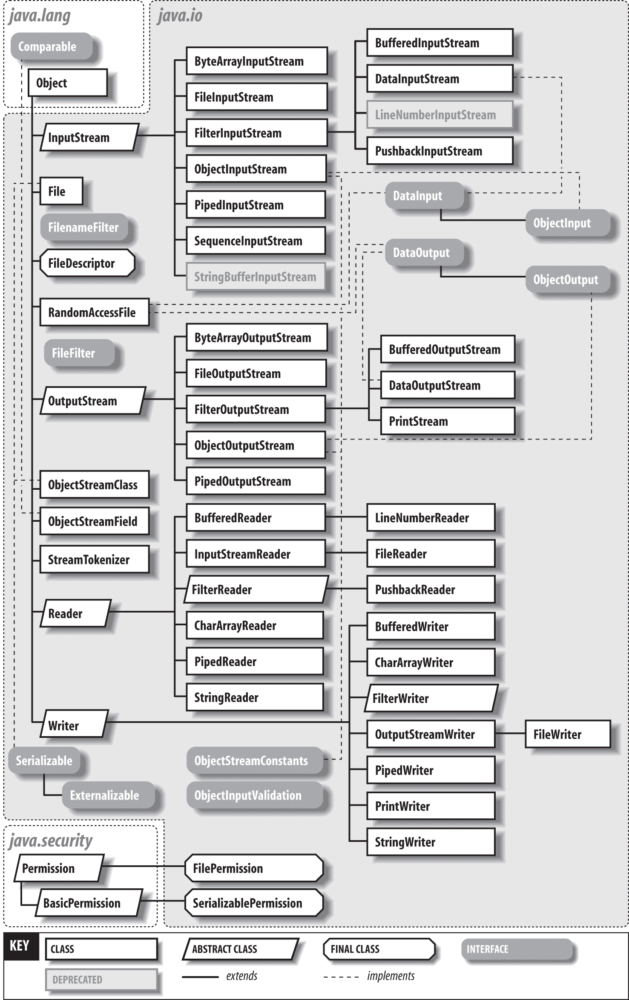
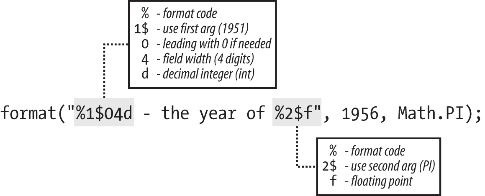

# 第十章。输入和输出：读取、写入和目录技巧

# 10.0 介绍

大多数程序都需要与外部世界进行交互，其中一种常见的方式是读取和写入文件。文件通常位于某种持久介质上，如磁盘驱动器；大部分时间，我们将忽略硬盘上文件（以及所有操作系统相关的文件系统类型）、USB 驱动器或 SD 卡、DVD-ROM 和其他存储设备之间的差异。就目前而言，它们只是文件。而且，与大多数其他语言和操作系统一样，Java 将读取和写入模型扩展到网络（套接字）通信，我们将在第 12 和 13 章中进行讨论。

Java 提供了许多用于输入和输出的类；它们在图 10-1 中进行了总结。本章涵盖了所有常规的输入/输出操作，如打开/关闭和读取/写入文件。假设文件位于某种文件存储或永久存储中。假定分布式文件系统（如 Apache Hadoop HDFS、Sun 的 Network File System（NFS，在 Unix 上很常见，并且可用于 Windows）、SMB（Windows 网络文件系统，通过开源的 Samba 程序可用于 Unix）、以及 FUSE（Filesystem in User SpacE，在大多数 Unix/Linux 系统上都有实现））与磁盘文件系统的工作方式相同，除非另有说明。

读取和写入的支持主要分为两个部分：

+   `InputStream`/`OutputStream`/`Reader`/`Writer` 类，这些是传统的读取/写入文件的方式，自 Java 1.0 和 1.1 以来基本未变。在现代 Java 中，提供了一个新类，`java.nio.file.Files`。

+   所有现代操作系统都提供了将文件组织成目录或文件夹的手段。本章涵盖了目录：如何创建它们，如何浏览它们。`Files`提供了大部分处理目录的支持，但它也引入了一些方便的例程，用于轻松读取、写入和复制文件，这些内容在本章中进行了讨论。这些通常比使用传统的 I/O 类更方便。我们在本章中都进行了介绍。

###### 警告

术语*流*有两种不同的用法。第一种是用于读取或写入的字节流，与第二种用法无关，后者用于现代 Java 中指的是协作方法之间的连接。我将尽量保持这些含义的准确性，只使用`InputStream`和/或`OutputStream`来表示前者，而使用`Stream`来表示后者。

为了让你能够控制读取和写入数据的格式，`Formatter` 和 `Scanner` 类提供了格式化和扫描操作。`Formatter` 允许执行许多格式化任务，可以输出到 `String` 或几乎任何输出目的地。`Scanner` 解析许多种类的对象，同样可以从 `String` 或几乎任何输入源获取。这些都非常强大；本章为每个类都提供了详细的说明。

本章的第二部分主要介绍了 `java.nio.file` 中的 `Files` 和 `Path` 类。这两个类提供了列出目录、获取文件状态、重命名和删除磁盘上的文件、创建目录以及执行其他文件系统操作的能力。它们还提供了逐行读取文件内容到 `Stream<String>` 的能力。这两个类共同主要替代了较旧的 `java.io.File` 类。它们在 Java 7 中引入，因此很少有新代码应该使用旧的 `File` 类。

注意，这个类的许多方法试图修改计算机上的永久文件存储或磁盘文件系统。当然，你可能没有权限以某种方式更改某些文件。这可以被 Java 虚拟机的 `SecurityManager` 检测到，如果你没有权限执行尝试的操作，它会抛出未检查的异常 `SecurityException`。但是如果安全管理器批准了操作，但运行程序的用户在目录上缺少权限，操作系统也可以检测到失败，例如返回一个指示（如 `false`）或一个受检异常 `IOException` 的实例。必须在调用任何尝试更改文件系统的方法的任何代码中捕获（或在 `throws` 子句中声明）此异常。

# 10.1 关于 InputStreams/OutputStreams 和 Readers/Writers

Java 提供了两组用于读取和写入的类。`java.io` 包中的 `InputStream`/`OutputStream` 部分（参见 图 10-1）用于读取或写入数据字节。早期的语言倾向于假设字节（一种机器特定的位集合，在现代计算机上通常是八位）与字符——字母、数字或其他语言元素——完全相同。然而，Java 设计用于国际化使用，八位并不足以处理世界各地使用的许多不同字符集。基于脚本的语言和象形文字语言如中文和日文，每种语言有超过 256 个字符，这是八位字节能表示的最大数量。这些多种字符编码集的统一称为 Unicode，Java 和 XML 都使用 Unicode 作为其字符集，允许你读写任何这些人类语言的文本。但是对于文本数据应该使用 `Reader` 和 `Writer`，而不是 `Stream`。

Unicode 本身并不能解决所有问题。在 Unicode 发明之前，许多人类语言已经在计算机上使用，它们并不都选择了与 Unicode 相同的表示形式。它们都有大量以特定非 Unicode 编码表示的文件。因此，在读写时需要一些例程来在 Java 虚拟机内部使用 Unicode `String` 对象和用户文件写入的特定外部表示之间进行转换。这些转换器被打包在一个强大的称为 `Reader` 和 `Writer` 的类集合中。在处理字符而不是字节时，应始终使用 `Reader` 和 `Writer` 而不是 `InputStream` 和 `OutputStream`。我们稍后在本章节将更详细地看到这种转换及如何指定转换。



###### 图 10-1\. java.io 类

## 参见

这里没有深入讨论 Java “新 I/O” 包中 `Channel` 类的读写能力。NIO 的这一部分比 `Files` 或输入/输出流更复杂，主要在大规模服务器端处理中获益。Recipe 4.5 提供了使用 NIO 的一个例子。Ron Hitchens 的书 *[Java NIO](http://shop.oreilly.com/product/9780596002886.do)* 对 NIO 包进行了全面覆盖（O’Reilly）。

另一个在此处未涵盖的主题是在读取或写入时与其他程序活动同时发生。这需要使用线程或单个程序内的多个控制流。多线程 I/O 在许多程序中是必需的：那些从缓慢设备（如磁带驱动器）读取的程序，那些从或向网络连接读取或写入的程序，以及那些具有 GUI 的程序。因此，在多线程应用程序的上下文中，这一主题受到了相当的关注，详见第十六章。

对于传统 I/O 主题，虽然有些过时，Elliotte Rusty Harold 的书 *[Java I/O](http://shop.oreilly.com/product/9780596527501.do)* 应被视为倒数第二的文档。倒数第一参考文献是 javadoc 文档，而最终的参考文献是，如果确实需要，Java API 的源代码。部分因为 javadoc 文档的质量，写作本章时我并未需要参考源代码。

# 10.2 读取文本文件

## 问题

Java 文档没有打开文件的方法。如何打开并读取文本文件，然后逐行处理，或者获取所有行的集合？

## 解决方案

使用 `Files::lines()` 方法，该方法返回一个 `Stream` 的 `String`。或者，使用 `Files.newBufferedReader()`、`Files.newBufferedWriter()`、`Files.newInputStream()` 和 `Files.newOutputStream()`。或者构造一个 `FileReader` 或 `FileInputStream`。一旦您拥有这些，构造一个 `BufferedReader`，并使用旧的 `$$while ((line == readLine()) != null)$$` 模式。

## 讨论

没有显式的打开操作，^(2) 或许是 Java API 面向对象设计的一种修辞华丽。

逐行处理文本文件的最快方法是使用 `Files.lines()`，该方法接受 `Path` 参数并返回一个功能性 `Stream<String>`，它将文件中的行输入其中：

```java
Files.lines(Path.of("myFile.txt")).forEach(System.out::println);
```

`Files` 类还有几个静态方法，可以打开文件并读取部分或全部内容：

`List<String> Files.readAllLines(Path)`

将整个文件读入 `List<String>`。

`byte[] Files.readAllBytes`

将整个文件读入字节数组。

存在一系列类似 `newReader()`、`newBufferedWriter()` 等方法，每个方法接受一个 `Path` 参数并返回相应的 `Reader/Writer` 或 `InputStream/OutputStream`。`Path` 是一个描述可能存在或不存在的抽象路径（文件名）的描述符。`FileReader`、`FileWriter`、`FileInputStream` 或 `FileOutputStream` 的显式构造函数接受文件名或包含路径的较旧 `File` 类的实例。这些操作对应于大多数其他语言 I/O 包中的“打开”操作。

在历史上，Java 曾要求使用代码模式 `while ((line == readLine()) != null` 从 `BufferedReader` 中读取行。当然，这仍然有效，并将在 JavaBean 西部设置到位的遥远未来继续有效。

示例 10-1 展示了从文件中读取行的每种方式的代码。

##### 示例 10-1\. main/src/main/java/io/ReadLines.java（从文件中读取行）

```java
        System.out.println("Using Path.lines()");
        Files.lines(Path.of(fileName)).forEach(System.out::println);

        System.out.println("Using Path.readAllLines()");
        List<String> lines = Files.readAllLines(Path.of(fileName));
        lines.forEach(System.out::println);

        System.out.println("Using BufferedReader.lines().forEach()");
        new BufferedReader(new FileReader(fileName)).lines().forEach(s -> {
            System.out.println(s);
        });

        System.out.println("The old-fashioned way");
        BufferedReader is = new BufferedReader(new FileReader(fileName));
        String line;
        while ((line = is.readLine()) != null) {
            System.out.println(line);
        }
```

大多数这些方法可以抛出检查异常 `IOException`，因此您必须在这些调用周围使用 `throws` 子句或 `try/catch`。

如果您创建了 `InputStream`、`OutputStream`、`Reader` 或 `Writer`，在完成后应该关闭它。这样可以避免内存泄漏，并且在写入的情况下确保所有缓冲数据实际写入磁盘。确保不会忘记这一点的一种方法是使用 try-with-resources 语法。这将 `Closeable` 资源的声明和定义放入 `try` 语句中：

```java
    static void oldWayShorter() throws IOException {
        try (BufferedReader is =
            new BufferedReader(new FileReader(INPUT_FILE_NAME));
            BufferedOutputStream bytesOut = new BufferedOutputStream(
              new FileOutputStream(OUTPUT_FILE_NAME.replace("\\.", "-1.")));) {

            // Read from is, write to bytesOut
            String line;
            while ((line = is.readLine()) != null) {
                line = doSomeProcessingOn(line);
                bytesOut.write(line.getBytes("UTF-8"));
                bytesOut.write('\n');
            }

        }
    }
```

`Files` 中的 `lines()` 和读取相关方法消除了关闭资源的需要，但没有消除处理 `IOException` 的需要；如果忘记了这些，编译器或 IDE 将提醒您。

传递给打开文件的 `Files` 方法的选项是可以选择的；这些选项在侧边栏 “理解 I/O 选项：StandardOpenOptions、FileAttribute、PosixFileAttribute 和更多” 中讨论过。

要在 Java 8+中将文件的整个内容读取为单个字符串，请使用`Files.readString()`：

```java
String input = Files.readString(Path.of(INPUT_FILE_NAME)));
```

在旧版本的 Java 中，使用我的`FileIO.readerToString()`方法。这将把整个命名文件读取为一个长字符串，每行之间用嵌入的换行符（*\n*）分隔。要读取二进制文件，请改用`Files.readAllBytes()`。

## 参见

有关[`File`](https://docs.oracle.com/javase/8/docs/api/java/nio/file/Files.html)和[`Path`](https://docs.oracle.com/javase/8/docs/api/java/nio/file/Path.html)的正式在线文档可供查阅。

# 10.3 从标准输入或控制台/控制终端读取

## 问题

您希望从程序的标准输入读取，或直接从程序的控制终端或控制台终端读取。

## 解决方案

对于标准输入，通过在`System.in`周围包装`BufferedInputStream()`来读取字节。对于读取文本，使用`InputStreamReader`和`BufferedReader`。对于控制台或控制终端，请使用 Java 的`System.console()`方法获取`Console`对象，并使用其方法。

## 讨论

有时确实需要从标准输入或控制台读取。一个原因是简单的测试程序通常是控制台驱动的。另一个原因是某些程序自然需要与用户进行大量交互，并且您希望比 GUI 更快（考虑交互式数学或统计探索程序）。另一个原因是将一个程序的输出直接传递到另一个程序的输入，这在 Unix 用户中非常常见，也在其他支持此操作的平台（例如 Windows）中非常有价值。

### 标准输入

大多数桌面平台支持*标准输入*（键盘、文件或另一个程序的输出）和*标准输出*（终端窗口、打印机、磁盘上的文件或另一个程序的输入）。大多数这种系统还支持标准错误输出，以便用户即使重定向了标准输出，也能看到错误消息。当这些平台上的程序启动时，这三个流被预分配给特定的平台相关句柄或*文件描述符*。其最终结果是，这些操作系统上的普通程序可以在不需要打开任何文件或进行任何其他特殊安排的情况下读取标准输入或将数据写入标准输出或标准错误流。

Java 延续了这一传统，并将其确立在`System`类中。静态变量`System.in`，`System.out`和`System.err`在程序执行之前与三个操作系统流相连接（应用程序可以重新分配这些；见 Recipe 10.10）。因此，要读取标准输入，只需引用变量`System.in`并调用其方法。例如，要从标准输入读取一个字节，可以调用`System.in`的 read 方法，该方法将字节以`int`变量返回：

```java
int b = System.in.read( );
```

但这足够吗？不，因为`read()`方法可能会抛出`IOException`。因此，您必须声明您的程序可能会抛出`IOException`：

```java
public static void main(String args[]) throws IOException {
...
}
```

或者您可以在`read()`方法周围放置一个`try`/`catch`块：

```java
        int b = 0;
        try {
            b = System.in.read();
            System.out.println("Read this data: " + (char)b);
        } catch (Exception e) {
            System.out.println("Caught " + e);
        }
```

在这种情况下，在`try`块内打印结果是有意义的，因为如果`read()`抛出`IOException`，则尝试打印读取的值是没有意义的。

那段代码可以让你从标准输入流中逐字节读取。但是大多数应用程序设计为处理更大的单元，如整数或文本行。要从标准输入中读取已知类型（如`int`）的值，可以使用`Scanner`类（详见 Recipe 10.6）：

```java
Scanner sc = Scanner.create(System.in);
int i = sc.nextInt();
```

要使用输入字符转换器读取文本字符，以便程序能够处理全球多种输入编码，可以使用`Reader`类。特定的子类允许您读取字符行是`BufferedReader`。但是有一个问题。记得我提到过两种输入类别，`Stream`和`Reader`吗？但我也说过`System.in`是一个`Stream`，而你需要一个`Reader`。如何从`Stream`获得`Reader`？有一个专门用于此目的的交叉类叫做`InputStreamReader`。只需将您的`Stream`（如`System.in`）传递给`InputStreamReader`构造函数，您就会得到一个`Reader`，然后将其传递给`BufferedReader`构造函数。在 Java 中写这个通常的习惯用法是嵌套构造函数调用：

```java
BufferedReader is = new BufferedReader(new InputStreamReader(System.in));
```

然后，您可以使用`readLine()`方法读取文本行。此方法不接受参数，并返回一个`String`，由`readLine()`为您准备，其中包含文件中下一行文本的字符（转换为 Unicode）。当没有更多文本行时，返回字面值`null`：

```java
public class CatStdin {

    public static void main(String[] av) {
        try (BufferedReader is =
                new BufferedReader(new InputStreamReader(System.in))) {
            String inputLine;

            while ((inputLine = is.readLine()) != null) {
                System.out.println(inputLine);
            }
        } catch (IOException e) {
            System.out.println("IOException: " + e);
        }
    }
}
```

要从标准输入读取单个`Integer`，请读取一行并使用`Integer.parseInt()`解析它。要逐行读取一系列整数，可以将这些与函数式风格结合起来，因为`BufferedReader`有一个生成`Stream<String>`的`lines()`方法：

```java
public class ReadStdinIntsFunctional {
    private static Stream<Integer> parseIntSafe(String s) {
        try {
            return Stream.of(Integer.parseInt(s));
        } catch (NumberFormatException e) {
            return Stream.empty();
        }
    }

    public static void main(String[] args) throws IOException {
        try (BufferedReader is =
                new BufferedReader(new InputStreamReader(System.in));) {
            is.lines()
                .flatMap(ReadStdinIntsFunctional::parseIntSafe)
                .forEach(System.out::println);
        }
    }
}
```

## 控制台（控制终端）

`Console`类用于直接从程序控制的终端读取。在大多数系统上，从*终端窗口*或*命令提示窗口*运行应用程序时，默认情况下，其控制台和标准输入都连接到终端。但是，标准输入可以通过大多数操作系统上的管道或重定向进行更改。如果您确实希望从用户所在位置读取，绕过任何间接操作，则`Console`类通常是您的好帮手。

您不能自己实例化`Console`；必须从`System`类的`console()`方法获取一个实例。然后，您可以调用诸如`readLine()`之类的方法，其行为基本与前面配方中使用的`BufferedReader`类中的同名方法相似。

以下代码显示了一个提示输入姓名并从控制台读取的示例：

*main/src/main/java/io/ConsoleRead.java*

```java
public class ConsoleRead {
    public static void main(String[] args) {
        String name = System.console().readLine("What is your name?");
        System.out.println("Hello, " + name.toUpperCase());
    }
}
```

一个复杂的情况是，如果控制台未连接，则 `System.console()` 方法可能返回 `null`。令人讨厌的是，一些 IDE，包括 Eclipse，在使用“Run As→Java Application”机制时无法设置控制终端。因此，生产质量的代码应始终在尝试使用控制台之前检查 `null`。如果失败了，请使用记录器或普通的 `System.out`。

`Console` 类非常有用的一个功能是在不回显密码的情况下读取密码。几十年来，这一直是命令行应用程序的标准功能，因为这是防止“窥视”的最明显方式——有人从你的肩膀上窥视你的密码。现在在 Java 中支持不回显密码读取：`Console` 类有一个 `readPassword()` 方法，它接受一个 `prompt` 参数，应该像这样使用：`cons.readPassword("Password:")`。此方法返回一个字节数组，可以直接在某些加密和安全 API 中使用，或者可以轻松地转换为 `String`。通常建议在使用后覆盖字节数组，以防止其他代码可以访问堆栈时发生安全泄漏，尽管当您构造了一个 `String` 时，这种好处可能会减少。在线代码中有一个示例，在 *io/ReadPassword.java* 中。

# 10.4 使用 Formatter 和 printf 打印

## 问题

你想要一种简单的方法来使用 `java.util.Formatter` 类的能力来进行简单的打印任务。

## 解决方案

使用 `Formatter` 来以精细的控制方式打印值。使用 `String.format()` 或 `PrintWriter.printf()` / `PrintStream.printf()`。

## 讨论

`Formatter` 类是模仿 C 语言的 `printf` 函数设计的。实际上，`PrintStream` 和 `PrintWriter` 都有名为 `printf()` 的便利函数，它们简单地委托给流或写入器的 `format()` 方法，后者使用默认的 `Formatter` 实例。然而，与 C 不同，Java 是一种强类型语言，因此无效的参数会抛出异常而不是生成无意义的结果。在 `PrintWriter/PrintStream` 中还有便利函数 `static String.format()` 和 `printf()`，用于在不显式创建 `Formatter` 的情况下格式化 `String`。

`java.util` 中的底层 `Formatter` 类可用于包含格式代码的 `String` 上。对于每个要格式化的项目，您都要放置一个格式代码。格式代码由一个百分号组成，可选地是一个参数编号后跟一个美元符号，可选地是一个字段宽度或精度，以及一个格式类型（例如，`d` 表示十进制整数，即没有小数点的整数，`f` 表示浮点数）。简单的用法可能如下所示：

```java
System.out.printf("%1$04d - the year of %2$f%n", 1956, Math.PI);
System.out.printf("%04d - the year of %f%n", 1956, Math.PI);
```

正如 图 10-2 所示，“%1$04d” 控制年份的格式化，而“%2$f” 控制 PI 的值的格式化。^(3)



###### 图 10-2\. 格式代码详解

许多格式代码可供选择；表 10-1 列出了一些较常见的代码。完整的描述请参考 `java.util.Formatter` 的 javadoc。

表 10-1\. 格式化器格式代码

| 代码 | 含义 |
| --- | --- |
| c | 字符（参数必须是包含有效字符值的 `char` 或整型类型）。 |
| d | “十进制整数”—以十进制（基数 10）打印的整数，没有小数点（参数必须是整型）。 |
| f | 带有小数部分的浮点值（必须是数字）；字段宽度后面可以跟小数点和小数位字段宽度；例如，7.2f。 |
| e | 科学计数法表示的浮点数值。 |
| g | 浮点值，根据大小选择 f 或 e。 |
| s | 通用格式；如果值为 null，则打印“null”；否则，如果 arg 实现了 `Formattable`，则按照 `arg.formatTo()` 格式化；否则按照 `arg.toString()` 格式化。 |
| t | 日期代码；后跟次要代码。常见的日期代码显示在 表 10-2 中。参数必须是 `long`、`Long`、`Calendar` 或 `Date`。 |
| n | 换行；插入特定于平台的换行字符。 |
| % | 插入字面上的 `%` 字符。 |

还要注意，你可以但并非必须在 `%` 和格式代码之间放置一个*参数顺序*数字。例如，在“%2$04d”中，“2$”表示格式化*第二个*参数，而不管参数的顺序如何。这在日期（见下面的示例，在其中需要格式化相同的 `Date` 或 `Calendar` 的几个不同部分）和国际化中特别有用，因为不同的语言可能要求句子中的单词以不同的顺序出现。

一些使用 `Formatter` 的示例显示在 示例 10-2 中。

##### 示例 10-2\. main/src/main/java/io/FormatterDemo.java

```java
public class FormatterDemo {
    public static void main(String[] args) {

        // The arguments to all these format methods consist of
        // a format code String and 1 or more arguments.
        // Each format code consists of the following:
        // % - code lead-in
        // N$ - OPTIONAL parameter number (1-based) after the format code
        // N - field width
        // L - format letter (d: decimal(int); f: float; s: general; many more)
        // For the full(!) story, see javadoc for java.util.Formatter.

        // Most general (cumbersome) way of proceding.
        Formatter fmtr = new Formatter();
        Object result = fmtr.format("%1$04d - the year of %2$f", 1956, Math.PI);
        System.out.println(result);
        fmtr.close();

        // Shorter way using static String.format(), default parameter numbering.
        Object stringResult = String.format("%04d - the year of %f", 1956, Math.PI);
        System.out.println(stringResult);

        // A shorter way using PrintStream/PrintWriter.format, more in line with
        // other languages. But this way you should provide the newline delimiter
        // using %n (rather than \n as that is platform-dependent!).
        System.out.printf("%04d - the year of %f%n", 1956, Math.PI);

        // Format doubles with more control
        System.out.printf("PI is approximately %4.2f%n", Math.PI);
    }
}
```

运行 `FormatterDemo` 会产生这样的结果：

```java
C:> javac FormatterDates.java
C:> java io.FormatterDates 
1956 - The year of 3.141593
1956 - The year of 3.141593
1956 - The year of 3.141593
PI is about 3.14
```

对于格式化日期和时间对象，可用的格式代码有很多——总共约有 40 个。日期和时间对象在 第六章 中讨论。表 10-3 显示了更常见的日期/时间格式代码。每个代码前必须带有一个 `t`，所以要将第一个参数格式化为年份，你会使用 `%1$tY`。

表 10-2\. 日期和时间的格式化代码

| 格式代码 | 含义 |
| --- | --- |
| Y | 年份（至少四位数字）。 |
| m | 月份，两位数字（前导零）。 |
| B | 本地化的月份名称（b 表示缩写）。 |
| d | 日期的日（两位数字，前导零）。 |
| e | 日期的日（一到两位数字）。 |
| A | 本地化的星期几（*a* 表示缩写）。 |
| H 或 I | 24 小时制（H）或 12 小时制（I）格式的小时（两位数，前导零） |
| M | 分钟（两位数） |
| S | 秒（两位数） |
| P/p | 区域设置特定的大写 AM 或 PM（如果是 P）或小写（如果是 p） |
| R 或 T | 24 小时制时间组合：%tH:%tM（如果是 R）或%tH:%tM:%tS（如果是 T） |
| D | 格式化为*`%tm/%td/%ty`*的日期 |

在我的观点中，直接将这些代码嵌入到您分发或提供为 Web 应用程序的应用程序中通常是一个坏主意，因为对它们的任何直接使用都假定您知道如何正确地按照全球所有地区的顺序打印这些字段。相信我，你不知道。我建议使用`DateTimeFormatter`来控制参数的顺序，而不是这些代码，`DateTimeFormatter`在配方 6.2 中有介绍。然而，对于快速而粗糙的工作，以及写入必须以给定格式存在的日志或数据文件，这些代码是可以的。

一些日期示例显示在示例 10-3 中。

##### 示例 10-3\. main/src/main/java/io/FormatterDates.java

```java
public class FormatterDates {
    public static void main(String[] args) {

        // Format number as dates e.g., 2020-06-28
        System.out.printf("%4d-%02d-%2d%n", 2020, 6, 28);

        // Format fields directly from a Date object: multiple fields from "1$"
        // (hard-coded formatting for Date not advisable; see I/O chapter)
        LocalDate today = LocalDate.now();
        // Print in a form like e.g., "July 4, 2020"
        System.out.printf("Today is %1$tB %1$td, %1$tY%n", today);
    }
}
```

运行这个`FormatterDates`类将产生以下输出：

```java
C:> java io.FormatterDates
2020-06-28
Today is January 01, 2020
```

# 10.5 使用`StreamTokenizer`扫描输入

## 问题

您需要以比`BufferedReader`类及其子类的`readLine()`方法更细粒度的分辨率扫描文件。

## 解决方案

使用`StreamTokenizer`、`readLine()`和`StringTokenizer`，`Scanner`类（见配方 10.6），正则表达式（第四章）或几种第三方解析器生成器之一。

## 讨论

虽然从理论上讲，您可以逐个字符读取文件并分析每个字符，但这是一个相当底层的方法。`Reader`类中的`read()`方法被定义为返回`int`，以便它可以使用古老的值`-1`（在 Unix *<stdio.h>*中定义为 EOF 多年来）来指示您已经读取到文件的末尾：

*main/src/main/java/io/ReadCharsOneAtATime.java*

```java
public class ReadCharsOneAtATime {

    void doFile(Reader is) throws IOException {
        int c;
        while ((c=is.read( )) != -1) {
            System.out.print((char)c);
        }
    }
}
```

注意将`c`转换为`char`；程序即使没有它也能编译通过，但由于`c`被声明为`int`，所以打印不正确。必须将变量`c`声明为`int`，以便能够将其与 EOF 值`-1`进行比较。例如，作为`int`处理的大写字母 A 对应的整数值为 65，而使用`(char)`打印字符`A`。

我们在配方 3.1 中广泛讨论了`StringTokenizer`类。`readLine()`和`StringTokenizer`的组合提供了一种简单的扫描文件的方法。假设您需要读取一个每行包含一个类似*user@host.domain*的名称的文件，并且您希望将行分成用户和主机地址。您可以使用这个：

```java
public class ScanStringTok {

    public static void main(String[] av) throws IOException {
        if (av.length == 0)
            System.err.printf("Usage: %s filename [...]%n",
                ScanStringTok.class.getSimpleName());
        else
            for (int i=0; i<av.length; i++)
                process(av[i]);
    }

    static void process(String fileName) {
        String s = null;
        try (BufferedReader is =
                new BufferedReader(new FileReader(fileName));) {
            while ((s = is.readLine()) != null) {
                StringTokenizer st = new StringTokenizer(s, "@", true);
                String user = (String)st.nextElement();
                st.nextElement();
                String host = (String)st.nextElement();
                System.out.println("User name: " + user +
                    "; host part: " + host);

                // Do something useful with the user and host parts...
            }
        } catch (NoSuchElementException ix) {
            System.err.println("Malformed input " + s);
        } catch (IOException e) {
            System.err.println(e);
        }
    }
}
```

`java.util`中的`StreamTokenizer`类提供了稍多的能力来扫描文件。它读取字符并将它们组装成单词或标记。它会将这些标记与描述其所找到的标记类型的类型代码一起返回给您。这些类型代码是四种预定义类型之一（`StringTokenizer.TT_WORD`、`TT_NUMBER`、`TT_EOF`，或`TT_EOL`用于行尾）。像`ordinaryCharacter()`这样的方法允许您指定如何分类字符，而像`slashSlashComment()`这样的方法允许您启用或禁用功能。

示例 10-4 展示了使用`StreamTokenizer`实现的简单即时模式基于堆栈的计算器：

```java
2 2 + =
4
22 7 / =
3.141592857
```

我会从`StreamTokenizer`流中读取标记。数字会被放入堆栈。四个运算符（`+`、`-`、`\*`和`/`）会立即对堆栈顶部的两个元素执行操作，并将结果放回到堆栈顶部。`=`运算符会导致顶部元素被打印出来，但仍然留在堆栈中，因此您可以这样说：

```java
4 5 * = 2 / =
20.0
10.0
```

##### 示例 10-4\. main/src/main/java/io/SimpleCalcStreamTok.java（使用 StreamTokenizer 的简单计算器）

```java
public class SimpleCalcStreamTok {
    /** The StreamTokenizer input */
    protected  StreamTokenizer tf;
    /** The output file */
    protected PrintWriter out = new PrintWriter(System.out, true);
    /** The variable name (not used in this version) */
    protected String variable;
    /** The operand stack */
    protected Stack<Double> s = new Stack<>();

    /* Driver - main program */
    public static void main(String[] av) throws IOException {
        if (av.length == 0)
            new SimpleCalcStreamTok(
                new InputStreamReader(System.in)).doCalc();
        else
            for (int i=0; i<av.length; i++)
                new SimpleCalcStreamTok(av[i]).doCalc();
    }

    /** Construct by filename */
    public SimpleCalcStreamTok(String fileName) throws IOException {
        this(new FileReader(fileName));
    }

    /** Construct from an existing Reader */
    public SimpleCalcStreamTok(Reader rdr) throws IOException {
        tf = new StreamTokenizer(rdr);
        // Control the input character set:
        tf.slashSlashComments(true);    // treat "//" as comments
        tf.ordinaryChar('-');        // used for subtraction
        tf.ordinaryChar('/');    // used for division
    }

    /** Construct from a Reader and a PrintWriter
 */
    public SimpleCalcStreamTok(Reader in, PrintWriter out) throws IOException {
        this(in);
        setOutput(out);
    }

    /**
 * Change the output destination.
 */
    public void setOutput(PrintWriter out) {
        this.out = out;
    }

    protected void doCalc() throws IOException {
        int iType;
        double tmp;

        while ((iType = tf.nextToken()) != StreamTokenizer.TT_EOF) {
            switch(iType) {
            case StreamTokenizer.TT_NUMBER: // Found a number, push value to stack
                push(tf.nval);
                break;
            case StreamTokenizer.TT_WORD:
                // Found a variable, save its name. Not used here.
                variable = tf.sval;
                break;
            case '+':
                // + operator is commutative.
                push(pop() + pop());
                break;
            case '-':
                // - operator: order matters.
                tmp = pop();
                push(pop() - tmp);
                break;
            case '*':
                // Multiply is commutative.
                push(pop() * pop());
                break;
            case '/':
                // Handle division carefully: order matters!
                tmp = pop();
                push(pop() / tmp);
                break;
            case '=':
                out.println(peek());
                break;
            default:
                out.println("What's this? iType = " + iType);
            }
        }
    }
    void push(double val) {
        s.push(Double.valueOf(val));
    }
    double pop() {
        return ((Double)s.pop()).doubleValue();
    }
    double peek() {
        return ((Double)s.peek()).doubleValue();
    }
    void clearStack() {
        s.removeAllElements();
    }
}
```

# 10.6 使用 Scanner 类扫描输入

## 问题

您希望扫描一个简单的输入文件，该文件包含已知格式的各种数字和字符串。

## 解决方案

使用`Scanner`的`next()`方法读取。

## 讨论

`Scanner`类允许您按标记读取输入源，类似于食谱 10.5 中描述的`StreamTokenizer`。在某些方面，`Scanner`更灵活（它允许您基于空格或正则表达式分割标记），但在其他方面则不然（您需要知道正在读取的标记类型）。这个类在某些方面与 C 语言的`scanf()`函数有些相似，但在`Scanner`中，您通过调用诸如`nextInt()`、`nextDouble()`等方法来指定输入标记类型。以下是一个简单的扫描示例：

```java
        String sampleDate = "25 Dec 1988";

        try (Scanner sDate = new Scanner(sampleDate)) {
            int dayOfMonth = sDate.nextInt();
            String month = sDate.next();
            int year = sDate.nextInt();
            System.out.printf("%d-%s-%02d%n", year, month, dayOfMonth);
        }
```

`Scanner`类能够识别 Java 的八种内置类型，还支持`BigInteger`和`BigDecimal`。它还可以将输入标记作为`String`返回，或者通过匹配正则表达式来返回（见第四章）。表 10-3 列出了“next”方法及其对应的“has”方法；“has”方法返回 true，如果相应的“next”方法将成功。没有`nextString()`方法；只需使用`next()`来获取下一个标记作为`String`。

表 10-3\. Scanner 方法

| 返回的类型 | “has”方法 | “next”方法 | 注释 |
| --- | --- | --- | --- |
| `String` | `hasNext()` | `next()` | 从此扫描器中获取下一个完整的标记 |
| `String` | `hasNext(Pattern)` | `next(Pattern)` | 返回与给定正则表达式（regex）匹配的下一个字符串 |
| `String` | `hasNext(String)` | `next(String)` | 返回与指定字符串构造的正则表达式模式匹配的下一个标记 |
| `BigDecimal` | `hasNextBigDecimal()` | `nextBigDecimal()` | 输入中的下一个标记作为 `BigDecimal` 类型 |
| `BigInteger` | `hasNextBigInteger()` | `nextBigInteger()` | 输入中的下一个标记作为 `BigInteger` 类型 |
| `boolean` | `hasNextBoolean()` | `nextBoolean()` | 输入中的下一个标记作为 `boolean` 类型 |
| `byte` | `hasNextByte()` | `nextByte()` | 输入中的下一个标记作为 `byte` 类型 |
| `double` | `hasNextDouble()` | `nextDouble()` | 输入中的下一个标记作为 `double` 类型 |
| `float` | `hasNextFloat()` | `nextFloat()` | 输入中的下一个标记作为 `float` 类型 |
| `int` | `hasNextInt()` | `nextInt()` | 输入中的下一个标记作为 `int` 类型 |
| `String` | N/A | `nextLine()` | 读取直到行尾，包括行尾标记 |
| `long` | `hasNextLong()` | `nextLong()` | 输入中的下一个标记作为 `long` 类型 |
| `short` | `hasNextShort()` | `nextShort()` | 输入中的下一个标记作为 `short` 类型 |

`Scanner` 类是使用输入源构造的，可以是 `InputStream`、`String` 或 `Readable`（`Readable` 是 `Reader` 及其所有子类实现的接口）。

使用 `Scanner` 类的一种方式是基于迭代器模式，使用 `while (scanner.hasNext())` 控制迭代。示例 10-5 展示了从 Recipe 10.5（简称）重写的简单计算器，以使用 `Scanner` 类。

##### 示例 10-5\. main/src/main/java/io/simpleCalcScanner.java（使用 java.util.Scanner 的简单计算器）

```java
public class SimpleCalcScanner {
    /** The Scanner */
    protected Scanner scan;

    /** The output */
    protected PrintWriter out = new PrintWriter(System.out, true);

    /** The variable name (not used in this version) */
    protected String variable;

    /** The operand stack; no operators are pushed,
 * so it can be a stack of Double
 */
    protected Stack<Double> s = new Stack<>();

    /* Driver - main program */
    public static void main(String[] args) throws IOException {
        if (args.length == 0)
            new SimpleCalcScanner(
                new InputStreamReader(System.in)).doCalc();
        else
            for (String arg : args) {
                new SimpleCalcScanner(arg).doCalc();
            }
    }

    /** Construct a SimpleCalcScanner by name */
    public SimpleCalcScanner(String fileName) throws IOException {
        this(new FileReader(fileName));
    }

    /** Construct a SimpleCalcScanner from an open Reader */
    public SimpleCalcScanner(Reader rdr) throws IOException {
        scan = new Scanner(rdr);
    }

    /** Construct a SimpleCalcScanner from a Reader and a PrintWriter */
    public SimpleCalcScanner(Reader rdr, PrintWriter pw) throws IOException {
        this(rdr);
        setWriter(pw);
    }

    /** Change the output to go to a new PrintWriter */
    public void setWriter(PrintWriter pw) {
        out = pw;
    }

    protected void doCalc() throws IOException {
        double tmp;

        while (scan.hasNext()) {
            if (scan.hasNextDouble()) {
                push(scan.nextDouble());
            } else {
                String token;
                switch(token = scan.next()) {
                case "+":
                    // Found + operator, perform it immediately.
                    push(pop() + pop());
                    break;
                case "-":
                    // Found - operator, perform it (order matters).
                    tmp = pop();
                    push(pop() - tmp);
                    break;
                case "*":
                    // Multiply is commutative.
                    push(pop() * pop());
                    break;
                case "/":
                    // Handle division carefully: order matters!
                    tmp = pop();
                    push(pop() / tmp);
                    break;
                case "=":
                    out.println(peek());
                    break;
                default:
                    out.println("What's this? " + token);
                    break;
                }
            }
        }
    }

    void push(double val) {
        s.push(Double.valueOf(val));
    }

    double pop() {
        return ((Double)s.pop()).doubleValue();
    }

    double peek() {
        return ((Double)s.peek()).doubleValue();
    }

    void clearStack() {
        s.removeAllElements();
    }
}
```

# 10.7 使用语法结构扫描输入

## 问题

您需要解析一个其结构可以描述为语法的文件（在计算机语言的意义上，而不是自然语言的意义上）。

## 解决方案

使用多个解析器生成器之一。

## 讨论

尽管 `StreamTokenizer` 类（参见 Recipe 10.5）和 `Scanner`（参见 Recipe 10.6）很有用，它们仅了解有限数量的标记，并且无法指定这些标记必须按特定顺序出现。要执行更高级的扫描，需要一些特殊用途的扫描工具。解析器生成器在计算机科学中有着悠久的历史。最著名的例子是 C 语言中的 `yacc`（Yet Another Compiler Compiler）和 `lex`，它们在 1970 年代的第七版 Unix 中发布，并在 *[lex & yacc](http://shop.oreilly.com/product/9781565920002.do)* 一书中由 Doug Brown 等人（O’Reilly 出版）讨论过，以及它们的开源克隆 *bison* 和 *flex*。这些工具允许您使用诸如正则表达式之类的模式语言指定输入的词法结构。例如，您可以说一个电子邮件地址由一系列字母数字字符组成，后跟一个 at 符号（@），后跟嵌入点的一系列字母数字字符，如下所示：

```java
name:  [A-Za-z0-9]+@[A-Za-z0-0.]
or
name: \w+#[\w.]
```

该工具然后编写代码来识别你描述的字符。这些工具还有语法规范，例如关键字`EMAIL`必须出现，后跟一个冒号，然后是先前定义的`name`标记。

Java 有几个好用的第三方解析器生成工具。它们根据复杂性、功能强大程度和易用性有很大的差异：

+   最著名和最复杂的之一是[ANTLR](http://www.antlr.org)。

+   JavaCC 是一个开源项目，位于[*https://javacc.org*](https://javacc.org)。

+   JParsec 允许你在纯 Java 中编写解析器，因此全部都是在编译时构建的（大多数其他工具需要单独的解析生成步骤，这会引起构建和调试问题）。JParsec 位于[GitHub](https://github.com/abailly/jparsec)上。*[JFlex](http://jflex.de)和[CUP](http://www2.cs.tum.edu/projects/cup)共同工作，就像最初的*yacc*和*lex*一样，作为语法解析器和词法分析器。

+   Parboiled 使用*Parsing Expression Grammar*（PEG）也在编译时构建解析器。更多信息请参见[GitHub](https://github.com/sirthias/parboiled)。* *Rats!*解析器生成器是纽约大学的[eXTensible Compiler Project](http://cs.nyu.edu/rgrimm/xtc)的一部分。

+   还有其他工具；维护在[Java Source](http://java-source.net/open-source/parser-generators)上的更完整的列表。

这些解析器生成器可以用来编写各种程序的语法，从简单的计算器（例如 Recipe 10.6 中的计算器）到 HTML 和 CORBA/IDL，再到完整的 Java 和 C/C++解析器。这些示例包含在下载中。不幸的是，解析器的学习曲线通常不允许在这里提供一个简单而全面的例子，更不用说智能地比较它们了。请参考每个发行版附带的文档和众多示例。

作为使用这些工具的替代方案，你可以简单地编写自己的递归下降解析器；一旦学会了如何做，你可能会发现这并不是真的那么困难，甚至可能比处理额外的解析器生成软件更少麻烦（显然这取决于所涉及语法的复杂性）。

Java 开发人员有多种选择，包括使用`StringTokenizer`进行逐行扫描、使用`StreamTokenizer`进行基于标记的扫描、使用`Scanner`类来扫描简单标记（参见 Recipe 10.6）、使用正则表达式（参见 Chapter 4）以及基于这里列出的解析工具的基于语法的扫描器的第三方解决方案。

# 10.8 复制文件

## 问题

你需要完整地复制一个文件。

## 解决方案

使用 Java 11 的`Files.copy()`方法之一。如果使用旧版本，请使用`Readers/Writer`或`InputStream/OutputStream`中的显式读取和写入方法。

## 讨论

`Files`类有几个重载的`copy`方法，可以快速完成这个需求：

```java
Path copy(Path, Path, CopyOption...) throws java.io.IOException;
long copy(InputStream, Path, CopyOption...) throws IOException;
long copy(Path, OutputStream) throws IOException;
```

例如：

```java
Path p = Paths.get("my_new_file");
InputStream is = // open some file for reading
long newFileSize = Files.copy(is, p);
```

很久以前，Java 的 I/O 设施并没有打包很多常见操作，比如复制一个文件到另一个文件或将文件读取到一个`String`中。所以那时我编写了自己的助手方法包。旧版 JDK 的用户可能希望使用我工具包`com.darwinsys.util`中的`FileIO`。这里有一个简单的演示程序，使用`FileIO`将源文件复制到备份文件：

*main/src/demo/java/io/FileIoDemo.java*

```java
package com.darwinsys.io;

import java.io.IOException;

public class FileIoDemo {
    public static void main(String[] av) {
        try {
            FileIO.copyFile("FileIO.java", "FileIO.bak");
            FileIO.copyFile("FileIO.class", "FileIO-class.bak");
        } catch (IOException e) {
            System.err.println(e);
        }
    }
}
```

我的`copyFile`方法有几种形式，取决于你是否有两个文件名，一个文件名和一个`PrintWriter`等等。`FileIO`本身的代码没有显示在这里，但可以在线上找到，在 darwinsys API 下载中。

# 10.9 重新分配标准流

## 问题

你需要重新分配一个或多个标准流`System.in`，`System.out`或`System.err`。

## 解决方案

根据需要构造一个适当的`InputStream`或`PrintStream`，并将其传递给`System`类中的适当设置方法。

## 讨论

能够重新分配这些流对应于 Unix（或 DOS 命令行）用户所考虑的 *重定向* 或 *管道*。这种机制通常用于使程序从文件中读取或写入内容，而无需显式打开文件并逐行更改读取、写入、打印等调用以引用不同的流对象。在 Unix 或 DOS 的命令行解释器中执行打开操作或在 Java 中调用的类中执行。

虽然你可以简单地将一个新的`PrintStream`赋给变量`System.out`，但最佳实践是使用定义的方法来替换它：

```java
        String LOGFILENAME = "error.log";
        System.setErr(new PrintStream(new FileOutputStream(LOGFILENAME)));
        System.out.println("Please look for errors in " + LOGFILENAME);
        // Now assume this is somebody else's code; you'll see it
        //   writing to stderr...
        int[] a = new int[5];
        a[10] = 0;    // here comes an ArrayIndexOutOfBoundsException
```

你使用的流可以是你打开的，如此处，也可以是你继承的：

```java
System.setErr(System.out);    // merge stderr and stdout to same output file.
```

它也可能是连接到或从另一个`Process`（参见 Recipe 18.1）的流，一个网络套接字，或一个 URL。任何提供流的东西都可以使用。

# 10.10 在写入时复制流；重新分配标准流

## 问题

你希望任何写入流的内容，比如标准输出`System.out`或标准错误`System.err`，既出现在那里，*也*被记录到文件中。

## 解决方案

子类化`PrintStream`并使其`write()`方法写入两个流。然后使用`system.setErr()`或`setOut()`来用一个`PrintStream`子类替换现有的标准流。

## 讨论

一些类是为了被子类化而设计的。在这里，我们只是子类化`PrintStream`并添加了一些功能：第二个`PrintStream`！我写了一个名为`TeePrintStream`的类，取名自古老的 Unix 命令 *tee*。那个命令允许你在两个程序之间的管道上复制或“tee off”（来自水管工的管道 tee，而不是高尔夫比赛或本地害虫）正在写入的数据的副本。

最初的 Unix *tee*命令用法如下：`|`字符创建了一个管道，其中一个程序的标准输出成为下一个程序的标准输入。这个经常使用的管道示例展示了有多少用户登录到 Unix 服务器：

```java
who | wc -l
```

运行*who*程序（该程序列出已登录系统的用户，每行一个用户，以及终端端口和登录时间），并将其输出发送到*wc*程序的标准输入，而不是终端。这里，*wc*被要求计算行数，而不是单词数，因此使用了`-l`选项。要将中间数据的副本*tee*到文件中，可以这样说：

```java
who | tee wholist | wc -l
```

创建包含数据的文件*wholist*。对于感兴趣的人，文件*wholist*可能看起来像这样：

```java
ian      ttyC0    Mar 14 09:59
ben      ttyC3    Mar 14 10:23
ian      ttyp4    Mar 14 13:46  (laptop.darwinsys.com)
```

因此，前面两个命令序列的输出将打印`3`。

`TeePrintStream`试图捕捉*tee*命令的精髓。可以像这样使用它：

```java
System.setErr(new TeePrintStream(System.err, "err.log"));
// ...lots of code that occasionally writes to System.err... Or might.
```

`System.setErr()`是指定将打印到`System.err`的文本输出目标的方法（还有`System.setOut()`和`System.setIn()`）。此代码导致打印到`System.err`的任何消息都打印到先前指定的位置（通常是终端，但可能是 IDE 中的文本窗口），以及文件*err.log*。

这种技术不仅限于三个标准流。可以将`TeePrintStream`传递给任何需要`PrintStream`的方法。或者，也可以适应于`BufferedInputStreams`、`PrintWriters`、`BufferedReaders`等。

示例 10-6 展示了`TeePrintStream`的源代码。

##### 示例 10-6\. main/src/main/java/io/TeePrintStream.java

```java
public class TeePrintStream extends PrintStream {
    /** The original/direct print stream */
    protected PrintStream parent;

    /** The filename we are tee-ing too, if known;
 * intended for use in future error reporting.
 */
    protected String fileName;

    /** The name for when the input filename is not known */
    private static final String UNKNOWN_NAME = "(opened Stream)";

    /** Construct a TeePrintStream given an existing PrintStream,
 * an opened OutputStream, and a boolean to control auto-flush.
 * This is the main constructor, to which others delegate via "this".
 */
    public TeePrintStream(PrintStream orig, OutputStream os, boolean flush)
    throws IOException {
        super(os, true);
        fileName = UNKNOWN_NAME;
        parent = orig;
    }

    /** Construct a TeePrintStream given an existing PrintStream and
 * an opened OutputStream.
 */
    public TeePrintStream(PrintStream orig, OutputStream os)
    throws IOException {
        this(orig, os, true);
    }

    /* Construct a TeePrintStream given an existing Stream and a filename.
 */
    public TeePrintStream(PrintStream os, String fn) throws IOException {
        this(os, fn, true);
    }

    /* Construct a TeePrintStream given an existing Stream, a filename,
 * and a boolean to control the flush operation.
 */
    public TeePrintStream(PrintStream orig, String fn, boolean flush)
    throws IOException {
        this(orig, new FileOutputStream(fn), flush);
        fileName = fn;
    }

    /** Return true if either stream has an error. */
    public boolean checkError() {
        return parent.checkError() || super.checkError();
    }

    /** override write(). This is the actual "tee" operation. */
    public void write(int x) {
        parent.write(x);    // "write once;
        super.write(x);        // write somewhere else."
    }

    /** override write(). This is the actual "tee" operation. */
    public void write(byte[] x, int o, int l) {
        parent.write(x, o, l);    // "write once;
        super.write(x, o, l);    // write somewhere else."
    }

    /** Close both streams. */
    public void close() {
        parent.close();
        super.close();
    }

    /** Flush both streams. */
    public void flush() {
        parent.flush();
        super.flush();
    }
}
```

值得一提的是，我*不*需要重写所有`print()`和`println()`的多态形式。因为这些方法最终都使用`write()`的形式之一，如果你重写`print`和`println`方法来进行*tee*，你可以得到多个额外的数据副本输出。

# 10.11 读取/写入不同字符集

## 问题

您需要使用特定编码读取或写入文本文件。

## 解决方案

当你构造一个`InputStreamReader`或`PrintWriter`时，通过指定转换器可以将文本转换为或从内部 Unicode 格式转换出来。

## 讨论

`InputStreamReader` 和 `OutputStreamWriter` 类是从字节导向的 `Stream` 到基于字符的 `Reader` 的桥梁。这些类读取或写入字节并根据指定的字符编码将其转换为字符，或者从字符转换为字节。在 Java 中使用的 UTF-16 字符集（`char` 和 `String` 类型）是一个 16 位字符集。但是，大多数字符集（如 ASCII、瑞典语、西班牙语、希腊语、土耳其语等）仅使用该字符集的一个小子集。事实上，许多欧洲语言字符集完全适合 8 位字符。即使是更大的字符集（基于脚本和象形文字的语言），其每个特定字符并不都使用相同的位值。因此，编码是 Java 字符与从特定国家或语言字符集中提取的字符的外部存储格式之间的映射。

为简化事务，`InputStreamReader` 和 `OutputStreamWriter` 构造函数是此转换中唯一可以指定编码名称的地方。如果不指定编码，将使用平台（或用户）的默认编码。`PrintWriters`、`BufferedReaders` 等都使用 `InputStreamReader` 或 `OutputStreamWriter` 类使用的编码。由于这些桥接类仅在其构造函数中接受 `Stream` 参数，所以如果要指定非默认转换器以读取或写入磁盘上的文件，必须从构造`FileReader` 或 `FileWriter` 开始，而不是从`FileInputStream` 或 `FileOutputStream` 开始！

```java
// io/UseConverters.java
BufferedReader fromKanji = new BufferedReader(
    new InputStreamReader(new FileInputStream("kanji.txt"), "EUC_JP"));
PrintWriter toSwedish = new PrinterWriter(
    new OutputStreamWriter(new FileOutputStream("sverige.txt"), "Cp278"));
```

并不是说从日语单个文件读取并以瑞典编码输出就一定有意义。首先，大多数字体并不包含两个字符集中的所有字符；而且，瑞典编码中的字符数肯定比日语编码少得多。此外，如果这是你想要的全部，你可以使用一个名字并不太合适的 JDK 工具 *native2ascii*（详见其文档）。支持的编码列表也在 JDK 文档中，位于 *docs/guide/internat/encoding.doc.html* 文件中。更详细的描述可见 *[Java I/O](http://shop.oreilly.com/product/9780596527501.do)* 的附录 B。

# 10.12 那些令人讨厌的换行字符

## 问题

您真的想知道换行字符。

## 解决方案

使用 `\r` 和 `\n` 以合适的组合。

## 讨论

如果使用 `readLine()` 方法以行模式读取文本（或包含 ASCII 字符的字节），您将永远看不到换行字符；如果使用带有 `println()` 方法的 `PrintWriter`，情况也是如此。因此，您无需费力弄清每行的 `\n`、`\r` 或 `\r\n` 的出现。

如果你需要那种详细程度的信息，你必须逐个字符或字节地读取，使用 `read()` 方法。我发现这种情况必要的唯一时间是在网络编程中，其中一些线路模式协议假定行尾是 `\r\n`。即使在这种情况下，你仍然可以在行模式下工作。在写入时，将 `\r\n` 传递给 `print()`（而不是 + 处理字符：

```java
outputSocket.print("HELO " + myName + "\r\n");
String response = inputSocket.readLine();
```

对于好奇的人，"hello" 的奇怪拼写用于 SMTP，即邮件发送协议，其中命令是四个字母。

# 10.13 注意依赖于平台的文件代码

## 问题

在之前的示例中警觉之后，你现在希望编写仅限于平台的独立代码。

## 解决方法

使用 `readLine()` 和 `println()`。避免单独使用 `\n`；如果必须使用，使用 `File.separator`。

## 讨论

如 Recipe 10.12 中提到的，如果你只使用 `readLine()` 和 `println()`，就不需要考虑行尾符号。但是一个特别的问题，尤其是对于以前编写过 C 语言及其相关语言的程序员来说，是在文本字符串中使用 `\n` 字符表示换行。这段代码特别让人不安的是它有时——通常在开发者自己的平台上——能够正常工作。但它可能某一天会在其他系统上失败：

```java
    String myName;
    public static void main(String[] argv) {
        BadNewline jack = new BadNewline("Jack Adolphus Schmidt, III");
        System.out.println(jack);
    }
    /**
 * DON'T DO THIS. THIS IS BAD CODE.
 */
    public String toString() {
        return "BadNewlineDemo@" + hashCode() + "\n" + myName;
    }

    // The obvious Constructor is not shown for brevity; it's in the code
```

真正的问题不是它在某些平台上失败，虽然如此。真正的问题在于它混合了格式化和输入/输出，或者试图这样做。不要在 `toString()` 中混合基于行的显示；避免 *多行字符串* ——从 `toString()` 或任何其他返回字符串的方法输出。如果你需要写多个字符串，那就明确表达你的意图：

```java
    String myName;
    public static void main(String[] argv) {
        GoodNewline jack = new GoodNewline("Jack Adolphus Schmidt, III");
        jack.print(System.out);
    }

    protected void print(PrintStream out) {
        out.println(toString());    // classname and hashcode
        out.println(myName);        // print name  on next line
    }
```

或者，如果你需要多行，你可以返回一个字符串数组或 `List`。

# 10.14 读取/写入二进制数据

## 问题

你需要读取或写入二进制数据，而不是文本。

## 解决方法

使用 `DataInputStream` 或 `DataOutputStream`。

## 讨论

`Stream` 类自 Java 诞生以来就存在，并且对于读写字节而非字符是最优的。它们的数据层，包括 `DataInputStream` 和 `DataOutputStream`，已配置为读写二进制值，包括 Java 的所有内置类型。假设你想要将一个二进制整数加上一个二进制浮点数值写入文件并稍后读取它。这段代码展示了写入部分：

```java
public class WriteBinary {
    public static void main(String[] argv) throws IOException {
        int i = 42;
        double d = Math.PI;
        String FILENAME = "binary.dat";
        DataOutputStream os = new DataOutputStream(
            new FileOutputStream(FILENAME));
        os.writeInt(i);
        os.writeDouble(d);
        os.close();
        System.out.println("Wrote " + i + ", " + d + " to file " + FILENAME);
    }
}
```

如果需要写入对象的所有字段，应该使用 Recipe 12.6 中描述的方法之一。

# 10.15 读取和写入 JAR 或 ZIP 存档

## 问题

你需要创建和/或从 JAR 存档或文件中提取，在由 PkZip 确定并由 Unix zip/unzip 和 WinZip 使用的众所周知的 ZIP 存档格式中。

## 解决方法

您可以使用 Java 开发工具包中的*jar*程序，因为其文件格式与 ZIP 格式相同，并添加了*META-INF*目录以包含附加的结构信息。但因为这是一本关于编程的书籍，您可能更感兴趣的是`ZipFile`和`ZipEntry`类及其提供访问权限的流类。

## 讨论

类`java.util.zip.ZipFile`本身不是一个 I/O 类，而是一个实用类，允许您读取或写入 JAR 或 ZIP 格式文件的内容。^(5) 创建时，它会创建一系列`ZipEntry`对象，每个条目代表存档中的一个条目。换句话说，`ZipFile`表示整个存档，而`ZipEntry`表示一个条目或存储（和压缩）在存档中的一个文件。`ZipEntry`具有诸如`getName()`（返回文件在放入存档之前的名称）和`getInputStream()`（提供`InputStream`，通过透明地将存档条目解压缩来过滤它）等方法。要创建`ZipFile`对象，您需要存档文件的名称或表示它的`File`对象：

```java
ZipFile zippy = new ZipFile(fileName);
```

要查看存档中是否存在给定文件，可以使用带有文件名的`getEntry()`方法。更常见的是，您可能希望处理所有条目；为此，请使用`ZipFile`对象获取存档中条目的枚举列表（如本处所示：Recipe 7.6）。  

```java
Enumeration all = zippy.entries( );
while (all.hasMoreElements( )) {
    ZipEntry entry = (ZipEntry)all.nextElement( );
    ...
}
```

然后，我们可以按需处理每个条目。一个简单的列出程序可能是这样的：

```java
if (entry.isDirectory( ))
    println("Directory: " + e.getName( ));
else
    println("File: " + e.getName( ));
```

更高级的版本将提取文件。例如，示例 10-7 中的程序默认列出文件，但是使用`-x`（提取）开关时，它实际上会从存档中提取文件。

##### 示例 10-7\. main/src/main/java/io/UnZip.java

```java
public class UnZip {
    /** Constants for mode listing or mode extracting. */
    public static enum Mode {
        LIST,
        EXTRACT;
    }
    /** Whether we are extracting or just printing TOC */
    protected Mode mode = Mode.LIST;

    /** The ZipFile that is used to read an archive */
    protected ZipFile zippy;

    /** The buffer for reading/writing the ZipFile data */
    protected byte[] b = new byte[8092];

    /** Simple main program, construct an UnZipper, process each
 * .ZIP file from argv[] through that object.
 */
    public static void main(String[] argv) {
        UnZip u = new UnZip();

        for (int i=0; i<argv.length; i++) {
            if ("-x".equals(argv[i])) {
                u.setMode(Mode.EXTRACT);
                continue;
            }
            String candidate = argv[i];
            // System.err.println("Trying path " + candidate);
            if (candidate.endsWith(".zip") ||
                candidate.endsWith(".jar"))
                    u.unZip(candidate);
            else System.err.println("Not a zip file? " + candidate);
        }
        System.err.println("All done!");
    }

    /** Set the Mode (list, extract). */
    protected void setMode(Mode m) {
        mode = m;
    }

    /** Cache of paths we've mkdir()ed. */
    protected SortedSet<String> dirsMade;

    /** For a given Zip file, process each entry. */
    public void unZip(String fileName) {
        dirsMade = new TreeSet<String>();
        try {
            zippy = new ZipFile(fileName);
            @SuppressWarnings("unchecked")
            Enumeration<ZipEntry> all = (Enumeration<ZipEntry>) zippy.entries();
            while (all.hasMoreElements()) {
                getFile((ZipEntry)all.nextElement());
            }
        } catch (IOException err) {
            System.err.println("IO Error: " + err);
            return;
        }
    }

    protected boolean warnedMkDir = false;

    /** Process one file from the zip, given its name.
 * Either print the name, or create the file on disk.
 */
    protected void getFile(ZipEntry e) throws IOException {
        String zipName = e.getName();
        switch (mode) {
        case EXTRACT:
            if (zipName.startsWith("/")) {
                if (!warnedMkDir)
                    System.out.println("Ignoring absolute paths");
                warnedMkDir = true;
                zipName = zipName.substring(1);
            }
            // if a directory, just return. We mkdir for every file,
            // since some widely used Zip creators don't put out
            // any directory entries, or put them in the wrong place.
            if (zipName.endsWith("/")) {
                return;
            }
            // Else must be a file; open the file for output
            // Get the directory part.
            int ix = zipName.lastIndexOf('/');
            if (ix > 0) {
                String dirName = zipName.substring(0, ix);
                if (!dirsMade.contains(dirName)) {
                    File d = new File(dirName);
                    // If it already exists as a dir, don't do anything
                    if (!(d.exists() && d.isDirectory())) {
                        // Try to create the directory, warn if it fails
                        System.out.println("Creating Directory: " + dirName);
                        if (!d.mkdirs()) {
                            System.err.println(
                            "Warning: unable to mkdir " + dirName);
                        }
                        dirsMade.add(dirName);
                    }
                }
            }
            System.err.println("Creating " + zipName);
            FileOutputStream os = new FileOutputStream(zipName);
            InputStream  is = zippy.getInputStream(e);
            int n = 0;
            while ((n = is.read(b)) >0)
                os.write(b, 0, n);
            is.close();
            os.close();
            break;
        case LIST:
            // Not extracting, just list
            if (e.isDirectory()) {
                System.out.println("Directory " + zipName);
            } else {
                System.out.println("File " + zipName);
            }
            break;
        default:
            throw new IllegalStateException("mode value (" + mode + ") bad");
        }
    }
}
```

## 参见

有时人们会将 ZIP 存档文件格式与同名的 gzip 压缩格式混淆。可以使用`java.io`中的`GZipInputStream`和`GZipOutputStream`类来读取或写入 gzip 压缩文件。

# 10.16 使用`getResource()`和`getResourceAsStream()`以文件系统中立的方式查找文件

## 问题

您希望加载对象或文件，而不需要引用它们在文件系统中的绝对位置。您可能出于以下原因之一希望这样做：

+   您位于服务器（Java EE）环境中。

+   您希望独立于文件路径。

+   您希望在单元测试中读取文件。

+   您期望用户将资源“放置在某个地方”，在`LASSPATH`（甚至可能在 JAR 文件内部）中。

## 解决方案

使用`getClass()`或`getClassLoader()`以及`getResource()`或`getResourceAsStream()`。

## 讨论

`getResource()` 方法有三种变体，其中一些存在于`Class`类（参见 Chapter 17）和`ClassLoader`类（参见 Recipe 17.5）中，具有完全相同的签名。`Class`中的方法委托给`ClassLoader`，因此它们之间几乎没有区别。方法总结如 Table 10-6 所示。

表 10-6\. `getResource*` 方法

| 方法签名 | 在 Class 中 | 在 ClassLoader 中 |
| --- | --- | --- |
| `public InputStream getResourceAsStream(String);` | Y | Y |
| `public URL getResource(String);` | Y | Y |
| `public Enumeration<URL> getResources(String) throws IOException;` | N | Y |

第一个方法旨在快速轻松地定位`CLASSPATH`上的资源或文件。使用`Class`版本，或者另一个带有标准`ClassLoader`实现的版本，资源可以是物理文件或 JAR 文件中的文件。如果你定义自己的类加载器，那么只要它可以表示为`InputStream`，你的想象力就是限制。这通常用于如下所示：

```java
InputStream is = getClass().getResourceAsStream("foo.properties");
// then do something with the InputStream...
```

第二种形式返回一个`URL`，可以以各种方式解释（参见 Recipe 12.1 中有关从 URL 读取的讨论）。

第三种形式，只能与`ClassLoader`实例一起使用，返回一个`Enumeration`对象，其中包含一系列`URL`对象。这意味着返回所有匹配给定字符串的资源；请记住，`CLASSPATH`可以由任意数量的目录和/或 JAR 文件组成，因此这将搜索所有这些目录。这对于查找一系列配置文件并合并它们可能很有用。或者查找是否在你的`CLASSPATH`上有多个具有相同名称的资源/文件。

注意资源名称可以是相对路径或绝对路径。假设你在使用 Maven（参见 Recipe 1.7），对于绝对路径，将文件放置在*src/main/resources/*目录中。对于相对路径，将文件放置在与源代码相同的目录中。在 IDE 中也适用相同的规则，假设你已经在 IDE 配置中将*src/main/java*和*src/main/resources*设置为源文件夹。这样做的目的是为了将资源文件复制到你的`CLASSPATH`文件夹中。例如，如果你有两个资源文件，*src/main/resources/one.txt*和*src/main/java/MyPackage/two.txt*，并且你的项目已配置如上所述，那么如果从`MyPackage`中的程序访问，这两行代码将起作用：

```java
Class<?> c = getClass();
InputStream isOne = getResourceAsStream("/one.txt");	// note leading slash
InputStream isTwo = getResourceAsStream("two.txt");	// without leading slash
```

###### 警告

无论哪种情况，如果`getResource()`和`getResourceAsStream()`找不到资源，它们都将返回`null`；你应该始终检查`null`以防止错误的部署。如果它找不到与之匹配的任何内容，`getResources()`将返回一个空的`Enumeration`。

如果文件路径在组件之间有斜杠（如 *package/subpackage*），则在 `getResource` 方法中将斜杠替换为句点。

# 10.17 获取文件信息：Files 和 Path

## 问题

你需要了解磁盘上给定文件的所有内容。

## 解决方案

使用 `java.nio.file.Files` 方法。

## 讨论

`java.nio.file.Files` 类的名称使用复数形式，既是为了区别于它所替代的遗留 `File` 类，也是为了提醒我们它有时会处理多个文件。 `Files` 类中有两种类型的静态方法，信息性方法和操作性方法。信息性方法（参见 表 10-7）仅提供有关单个文件的信息，例如 `boolean exists()` 或 `long size()`。操作性方法（参见 表 10-8）则可能会更改文件系统或打开文件以供读取或写入。每个操作性方法都可能抛出已检查的异常 `IOException`；只有少数信息性方法会抛出异常。

绝大多数这些方法都有 `java.nio.file.Path` 类型的参数。 `Path` 表示文件系统中的路径，即一组目录和可能的文件，例如 “C:\Users\user\Downloads” 或 “/home/ian/Downloads”。在创建 `Path` 表示它时，该路径在磁盘上可能存在，也可能不存在。 `Files` 类可以告诉您，由给定 `Path` 表示的文件是否存在，可以将该 `Path` 创建为文件或目录，并且可以更改相应文件的属性，甚至在存在时销毁它。 `Path` 对象可以使用 `Path.of(String name)` 轻松创建，该方法具有多个重载。

`Files` 和 `Path` 结合，几乎提供了编写完整的文件管理器应用所需的一切，更不用说更典型的需要文件信息和/或目录访问的应用程序。 `Files` 类具有一系列静态的 `boolean` 方法，提供基本信息。

表 10-7\. `java.nio.file.Files` 中的公共静态信息性方法

| 返回类型 | 方法 | 备注 |
| --- | --- | --- |
| boolean | exists(Path, LinkOption…); |  |
| Object | getAttribute(Path, String, LinkOption…); |  |
| <V extends FileAttributeView> V | getFileAttributeView(Path, Class<V>, LinkOption…); |  |
| FileTime | getLastModifiedTime(Path, LinkOption…); |  |
| UserPrincipal | getOwner(Path, LinkOption…); |  |
| Set<PosixFilePermission> | getPosixFilePermissions(Path, LinkOption…); |  |
| boolean | isDirectory(Path, LinkOption…); |  |
| boolean | isExecutable(Path); | 如果当前用户可执行 |
| boolean | isHidden(Path); | 如果是 Unix 上的“点文件”，或者某些操作系统上设置了“隐藏”属性 |
| boolean | isReadable(Path); | 如果当前用户可读 |
| boolean | isRegularFile(Path, LinkOption…); |  |
| boolean | isSameFile(Path, Path) throws IOException; | 需要处理文件系统的复杂性，如“..”，符号链接等 |
| boolean | isSymbolicLink(Path); |  |
| boolean | isWritable(Path); | 如果当前用户可写 |
| long | mismatch(Path, Path); |  |
| boolean | notExists(Path, LinkOption…); |  |
| String | probeContentType(Path) throws IOException; | 尝试返回数据的 MIME 类型 |
| Path | readSymbolicLink(Path) throws IOException; |  |
| long | size(Path); |  |

“当前用户”指的是当前 JVM 实例正在运行的账户。

这些方法大多数在 Example 10-8 中有演示。

##### Example 10-8\. main/src/main/java/io/FilesInfos.java

```java
        println("exists", Files.exists(Path.of("/")));
        println("isDirectory", Files.isDirectory(Path.of("/")));
        println("isExecutable", Files.isExecutable(Path.of("/bin/cat")));
        println("isHidden", Files.isHidden(Path.of("~/.profile")));
        println("isReadable", Files.isReadable(Path.of("lines.txt")));
        println("isRegularFile", Files.isRegularFile(Path.of("lines.txt")));
        println("isSameFile", Files.isSameFile(Path.of("lines.txt"),
            Path.of("../main/lines.txt")));
        println("isSymbolicLink", Files.isSymbolicLink(Path.of("/var")));
        println("isWritable", Files.isWritable(Path.of("/tmp")));
        println("isDirectory", Files.isDirectory(Path.of("/")));
        println("notexists",
            Files.notExists(Path.of("no_such_file_as_skjfsjljwerjwj")));
        println("probeContentType", Files.probeContentType(Path.of("lines.txt")));
        println("readSymbolicLink", Files.readSymbolicLink(Path.of("/var")));
        println("size", Files.size(Path.of("lines.txt")));
```

显然，所选路径在某种程度上是特定于系统的，但在我的 Unix 系统上运行时，`boolean` 方法都返回 `true`，而最后三个返回了这个：

```java
probeContentType returned text/plain
readSymbolicLink returned private/var
size returned 78
```

Table 10-8 显示了对文件系统实体进行更改的方法。

Table 10-8\. java.nio.file.Files 中的公共静态操作方法

| 返回类型 | 方法 |
| --- | --- |
| long | copy(InputStream, Path, CopyOption…); |
| long | copy(Path, OutputStream); |
| Path | copy(Path, Path, CopyOption…); |
| Path | createDirectories(Path, FileAttribute<?>…); |
| Path | createDirectory(Path, FileAttribute<?>…); |
| Path | createFile(Path, FileAttribute<?>…); |
| Path | createLink(Path, Path); |
| Path | createSymbolicLink(Path, Path, FileAttribute<?>…); |
| Path | createTempDirectory(Path, String, FileAttribute<?>…); |
| Path | createTempDirectory(String, FileAttribute<?>…); |
| Path | createTempFile(Path, String, String, FileAttribute<?>…); |
| Path | createTempFile(String, String, FileAttribute<?>…); |
| void | delete(Path); |
| boolean | deleteIfExists(Path); |
| Stream<Path> | find(Path, int, BiPredicate<Path, BasicFileAttributes>, FileVisitOption…); |
| Stream<String> | lines(Path); |
| Stream<String> | lines(Path, Charset); |
| Stream<Path> | list(Path); |
| 路径 | move(Path, Path, CopyOption…); |
| BufferedReader | newBufferedReader(Path); |
| BufferedReader | newBufferedReader(Path, Charset); |
| BufferedWriter | newBufferedWriter(Path, Charset, OpenOption…); |
| BufferedWriter | newBufferedWriter(Path, OpenOption…); |
| SeekableByteChannel | newByteChannel(Path, OpenOption…); |
| SeekableByteChannel | newByteChannel(Path, Set<? extends OpenOption>, FileAttribute<?>…); |
| DirectoryStream<Path> | newDirectoryStream(Path); |
| DirectoryStream<Path> | newDirectoryStream(Path, String); |
| InputStream | newInputStream(Path, OpenOption…); |
| OutputStream | newOutputStream(Path, OpenOption…); |
| byte[] | readAllBytes(Path); |
| List<String> | readAllLines(Path); |
| List<String> | readAllLines(Path, Charset); |
| <A extends BasicFileAttributes> A | readAttributes(Path, Class<A>, LinkOption…); |
| Map<String, Object> | readAttributes(Path, String, LinkOption…); |
| String | readString(Path); |
| String | readString(Path, Charset); |
| Path | setAttribute(Path, String, Object, LinkOption…); |
| Path | setLastModifiedTime(Path, FileTime); |
| Path | setOwner(Path, UserPrincipal); |
| Path | setPosixFilePermissions(Path, Set<PosixFilePermission>); |
| Path | write(Path, Iterable<? extends CharSequence>, Charset, OpenOption…); |
| Path | write(Path, Iterable<? extends CharSequence>, OpenOption…); |
| Path | write(Path, byte[], OpenOption…); |
| Path | writeString(Path, CharSequence, Charset, OpenOption…); |
| Path | writeString(Path, CharSequence, OpenOption…); |

`Path`是一个接口，其实现由名为`Filesystem`的提供者类提供。`Path`有许多方法，列在表格 10-9 中。

表格 10-9\. java.nio.file.Path 中的公共静态操作方法

| Access | 返回类型 | 方法 |
| --- | --- | --- |
| static | Path | of(String, String…); |
| static | Path | of(URI); |
| abstract | FileSystem | getFileSystem(); |
| abstract | boolean | isAbsolute(); |
| abstract | Path | getRoot(); |
| abstract | Path | getFileName(); |
| abstract | Path | getParent(); |
| abstract | int | getNameCount(); |
| abstract | Path | getName(int); |
| abstract | Path | subpath(int, int); |
| abstract | boolean | startsWith(Path); |
| default | boolean | startsWith(String); |
| abstract | boolean | endsWith(Path); |
| default | boolean | endsWith(String); |
| abstract | Path | normalize(); |
| abstract | Path | resolve(Path); |
| default | Path | resolve(String); |
| default | Path | resolveSibling(Path); |
| default | Path | resolveSibling(String); |
| abstract | Path | relativize(Path); |
| abstract | URI | toUri(); |
| abstract | Path | toAbsolutePath(); |
| abstract | Path | toRealPath(LinkOption…) throws IOException; |
| default | File | toFile(); |
| abstract | WatchKey | register(WatchService, WatchEvent$Kind<?>[], WatchEvent$Modifier…) throws IOException; |
| default | WatchKey | register(WatchService, WatchEvent$Kind<?>…) throws IOException; |
| default | Iterator<Path> | iterator(); |
| abstract | int | compareTo(Path); |
| abstract | boolean | equals(Object); |
| abstract | int | hashCode(); |
| abstract | String | toString(); |
| default | int | compareTo(Object); |

要查找有关一个文件的信息，您可以使用`Files`和`Path`中的信息方法，如示例 10-9 所示。

##### 示例 10-9\. main/src/main/java/dir_file/FileStatus.java（获取文件信息）

```java
public class FileStatus {
    public static void main(String[] argv) throws IOException {

        // Ensure that a filename (or something) was given in argv[0]
        if (argv.length == 0) {
            System.err.println("Usage: FileStatus filename");
            System.exit(1);
        }
        for (String a : argv) {
            status(a);
        }
    }

    public static void status(String fileName) throws IOException {
        System.out.println("---" + fileName + "---");

        // Construct a Path object for the given file.
        Path p = Path.of(fileName);

        // See if it actually exists
        if (!Files.exists(p)) {
            System.out.println("file not found");
            System.out.println();    // Blank line
            return;
        }
        // Print full name
        System.out.println("Canonical name " + p.normalize());
        // Print parent directory if possible
        Path parent = p.getParent();
        if (parent != null) {
            System.out.println("Parent directory: " + parent);
        }
        // Check if the file is readable
        if (Files.isReadable(p)) {
            System.out.println(fileName + " is readable.");
        }
        // Check if the file is writable
        if (Files.isWritable(p)) {
            System.out.println(fileName + " is writable.");
        }

        // See if file, directory, or other. If file, print size.
        if (Files.isRegularFile(p)) {
            // Report on the file's size and possibly its type
            System.out.printf("File size is %d bytes, content type %s\n",
                    Files.size(p),
                    Files.probeContentType(p));
        } else if (Files.isDirectory(p)) {
            System.out.println("It's a directory");
        } else {
            System.out.println("I dunno! Neither a file nor a directory!");
        }

        // Report on the modification time.
        final FileTime d = Files.getLastModifiedTime(p);
        System.out.println("Last modified " + d);

        System.out.println();    // blank line between entries
    }
```

当在 MS Windows 上运行时，使用所示的三个参数，会产生如下输出：

```java
C:\javasrc\dir_file>java dir_file.FileStatus   / /tmp/id /autoexec.bat
---/---
Canonical name C:\
File is readable.
File is writable.
Last modified 1970-01-01T00:00:00.00000Z
It's a directory

---/tmp/id---
file not found

---/autoexec.bat---
Canonical name C:\AUTOEXEC.BAT
Parent directory: \
File is readable.
File is writable.
Last modified 2019-10-13T12:43:05.123918Z
File size is 308 bytes.
```

正如你所见，所谓的*规范名称*不仅包括*C:\*的前导目录根，还将名称转换为大写。你可以看出我是在 Windows 上运行的。这个版本的 Windows 不保留目录的时间戳；值`0L`被解释为 1970 年 1 月 1 日（与自 Unix 以来的时间基准相同）。在 Unix 上，它的行为有所不同：

```java
$ java dir_file.FileStatus / /tmp/id /autoexec.bat
---/---
Canonical name /
File is readable.
It's a directory
Last modified 2019-12-16T01:14:05.226108Z

---/tmp/id---
Canonical name /tmp/id
Parent directory: /tmp
File is readable.
File is writable.
File size is 36768 bytes, content type null
Last modified 2019-12-21T18:46:27.402108Z

---/autoexec.bat---
file not found

$
```

典型的 Unix 系统没有*autoexec.bat*文件。Unix 文件名（像 Mac 上的那些）可以由大写和小写字符组成：输入什么就是什么。

### 旧版本兼容性

要在需要旧的`java.io.File`的旧代码中使用`Path`，简单地使用`File oldType = Path.toFile()`：

```java
jshell> Path p = Path.of("/");
p ==> /

jshell> File f = p.toFile();
f ==> /
```

要反向操作，`File`类已经加入了一个`toPath()`方法：

```java
jshell> File f = new File("/");
f ==> /

jshell> Path p = f.toPath();
p ==> /
```

# 10.18 创建新文件或目录

## 问题

你需要在磁盘上创建一个新文件，但不写入任何数据；在创建文件之前，你需要创建一个目录。

## 解决方案

对于空文件，使用`java.nio.file.Files`对象的`createFile(Path)`方法。使用`Files`类的`createDirectory()`或`createDirectories()`方法来创建目录。

## 讨论

### 文件

你可以通过构建`FileOutputStream`或`FileWriter`（参见 Recipe 12.6）轻松创建一个新文件。但是你还需要记得关闭它。有时候你希望文件存在，但并不想费力把任何东西放进去。例如，这可以作为一种简单的程序间通信形式使用：一个程序可以测试文件是否存在，并解释为另一个程序已达到某种状态。Example 10-10 是一段代码，简单地为你提供的每个名称创建一个空文件。

##### Example 10-10\. main/src/main/java/dir_file/Creat.java（在磁盘上创建文件）

```java
/** Create file(s) by name. Final "e" omitted in homage to UNIX system call. */
public class Creat {
    public static void main(String[] argv) throws IOException {

        // Ensure that a filename (or something) was given in argv[0]
        if (argv.length == 0) {
            throw new IllegalArgumentException("Usage: Creat filename [...]");
        }

        for (String arg : argv) {
            // Constructing a Path object doesn't affect the disk, but
            // the Files.createFile() method does.
            final Path p = Path.of(arg);
            final Path created = Files.createFile(p);
            System.out.println(created);
        }
    }
}
```

`java.nio.file.createFile()`有一个重载方法，接受第二个类型为`OpenOption`的参数。这是一个空接口，由`StandardOpenOption`枚举实现。这些选项在 Table 10-5 中列出。

### 目录

用于创建目录的两种方法中，`createDirectory()`只创建一个目录，而`createDirectories()`则创建所需的任何中间目录。例如，如果*/home/ian*存在且是一个目录，则调用

```java
shell> Files.createDirectory(Path.of("/Users/ian/abc"))
$11 ==> /Users/ian/abc
```

会成功（除非目录已存在），但调用

```java
jshell> Files.createDirectory(Path.of("/Users/ian/once/twice/again"))
```

将因为名为*once*的目录不存在而导致`java.nio.file.NoSuchFileException`异常。要创建这些目录路径，正如你现在可能期望的那样，请使用`createDirectories()`（复数形式）：

```java
jshell> Files.createDirectories(Path.of("/Users/ian/once/twice/again"))
$14 ==> /Users/ian/once/twice/again
```

这两种变体如果成功会返回一个引用新目录的`Path`对象，如果失败会抛出异常。注意，`createDirectories()`可能（但不太可能）在创建一些目录后失败；在这种情况下，新创建的目录会留在文件系统中。

# 10.19 更改文件名称或其他属性

## 问题

你需要在磁盘上更改文件的名称或其它某些属性，例如将文件设置为只读或更改其修改时间。

## 解决方案

要更改名称（或位置），请使用`java.nio.file.Files`的静态`move()`方法。对于其他属性，请使用`setLastModifiedTime()`来更改时间戳，或者使用几种其他设置器来更改模式或权限属性。

## 讨论

与 Unix 命令行类似，没有单独的重命名操作；移动方法提供了将文件放置在其他位置的所有功能，无论是在不同目录中的同名文件，同一目录中的不同名称文件，还是在不同磁盘或文件系统中的不同名称文件。因此，`Files.move()`方法需要两个`Path`对象，一个引用现有文件，另一个引用新名称。然后调用`Files.move()`方法，依次传递这两个路径对象，首先是现有的，然后是所需的名称。这比解释更容易看到，所以让我们开始吧：

```java
public class Rename {
    public static void main(String[] argv) throws IOException {

        // Construct the Path object. Does NOT create a file on disk!
        final Path p = Path.of("MyCoolDocument"); // The file we will rename

        // Setup for the demo: create a new "old" file
        final Path oldName = Files.exists(p) ? p : Files.createFile(p);

        // Rename the backup file to "mydoc.bak"
        // Renaming requires a Path object for the target.
        final Path newName = Path.of("mydoc.bak");
        Files.deleteIfExists(newName); // In case previous run left it there
        Path p2 = Files.move(oldName, newName);
        System.out.println(p + " renamed to " + p2);
    }
}
```

若要更改属性，有几种可用的方法，列在表 10-10 中。其中每个方法的返回值都是`boolean`类型，`true`表示成功。

表 10-10\. 文件属性设置器

| 方法签名 | 描述 |
| --- | --- |
| `setExecutable(boolean executable)` | 为此文件设置所有者的执行权限的便捷方法 |
| `setExecutable(boolean executable, boolean ownerOnly)` | 设置此文件的所有者或所有人的执行权限 |
| `setLastModified(long time)` | 设置此文件或目录的最后修改时间的方法 |
| `setReadable(boolean readable)` | 为此文件设置所有者的读取权限的便捷方法 |
| `setReadable(boolean readable, boolean ownerOnly)` | 设置此文件的所有者或所有人的读取权限 |
| `setReadOnly()` | 为`setReadable(false)`提供便捷方式 |
| `setWritable(boolean writable)` | 为此文件设置所有者的写入权限的便捷方法 |
| `setWritable(boolean writable, boolean ownerOnly)` | 设置此文件的所有者或所有人的写入权限 |

对于需要两个参数的方法，第一个参数启用或禁用与方法名匹配的给定文件上的功能，而第二个参数则控制操作是仅适用于所有者还是所有人。如果文件所在的文件系统不支持多用户权限，或者操作系统不支持该功能，则忽略第二个参数。本示例中描述的所有方法都在成功时返回`true`，否则返回`false`。

例如，`boolean setReadable(boolean readable, boolean ownerOnly)`允许您指定谁可以读取给定文件。`readable`参数是`true`或`false`，取决于您是否希望其可读。`ownerOnly`参数尝试将可读性选择扩展到多用户操作系统上的所有用户，并且如果不适用，则将其忽略。

`setLastModified()` 允许您操纵文件的修改时间。通常情况下，这不是一个好的操作，但在某些类型的备份/还原程序中很有用。此方法接受一个参数，即自 Unix 时间（1970 年 1 月 1 日）开始以来的毫秒数（而不是秒数）。您可以通过调用 `getLastModified()` 获取文件的原始值（参见 Recipe 10.17），或者通过调用 `ZonedDateTime` 的 `toInstant().getEpochSecond()` 方法获取特定日期的值（参见 Recipe 6.3），并乘以 1,000 将秒转换为毫秒。

我鼓励您使用 JShell 探索这些方法的操作（参见 Recipe 1.4）。我建议您在第二个窗口中运行 `ls -l` 或 `dir` 命令，以查看文件的影响。Example 10-11 展示了在 JShell 中探索这些方法的一些示例。

##### 示例 10-11\. 探索文件

```java
jshell> var f = File.createTempFile("foo", "bar");
f ==> /tmp/foo9391300789087780984bar

jshell> f.createNewFile();
$4 ==> false

jshell> f.setReadOnly();
$5 ==> true

jshell> f.canRead();
$6 ==> true

jshell> f.canWrite();
$7 ==> false

jshell> f.setReadable(true);
$8 ==> true

jshell> f.canWrite();
$9 ==> false

jshell> f.setReadable(false, false);
$10 ==> true

jshell> f.canWrite();
$11 ==> false
```

# 10.20 删除文件

## 问题

您需要从磁盘上删除一个或多个文件。

## 解决方案

使用 `java.nio.file.Files` 对象的 `delete(Path)` 或 `deleteIfExists(Path)` 方法。这些方法删除由 `Path` 参数引用的文件（当然要考虑权限）和目录（也要考虑权限和目录是否为空）。

## 讨论

这并不复杂。只需为要删除的文件构造一个 `Path` 对象，并调用静态的 `Files.delete()` 方法：

```java
public class Delete {
    public static void main(String[] argv) throws IOException {

        // Construct a File object for the backup created by editing
        // this source file. The file probably already exists.
        // Some text editors create backups by putting ~ at end of filename.
        File bkup = new File("Delete.java~");
        // Now, delete it:
        bkup.delete();
    }
}
```

请回忆一下本章开头关于权限的警告：如果您没有权限，则可能会得到 false 的返回值或者 `SecurityException`。还请注意，不同平台之间存在一些差异。某些 Windows 版本允许 Java 删除只读文件，但 Unix 不允许您删除没有对其所在目录具有写权限的文件。Unix 也不允许您删除非空目录（对于后者甚至还有一个异常 `DirectoryNotEmptyException`）。以下是带有成功或失败报告的 `Delete` 版本：

```java
public class Delete2 {

    static boolean hard = false; // True for delete, false for deleteIfExists

    public static void main(String[] argv) {
        for (String arg : argv) {
            if ("-h".equals(arg)) {
                hard = true;
                continue;
            }
            delete(arg);
        }
    }

    public static void delete(String fileName) {
        // Construct a File object for the file to be deleted.
        final Path target = Path.of(fileName);

        // Now, delete it:
        if (hard) {
            try {
                System.out.print("Using Files.delete(): ");
                Files.delete(target);
                System.err.println("** Deleted " + fileName + " **");
            } catch (IOException e) {
                System.out.println("Deleting " + fileName + " threw " + e);
            }
        } else {
            try {
                System.out.print("Using deleteIfExists(): ");
                if (Files.deleteIfExists(target)) {
                    System.out.println("** Deleted " + fileName + " **");
                } else {
                    System.out.println(
                        "Deleting " + fileName + " returned false.");
                }
            } catch (IOException e) {
                System.out.println("Deleting " + fileName + " threw " + e);
            }
        }
    }
}
```

`-h` 选项允许此程序在 `delete()` 和 `deleteIfExists()` 之间切换；您可以通过在存在、不存在和非空的情况下运行它，使用这两种方法来查看差异。在我的 Unix 系统上，输出看起来像这样：

```java
$ ls -ld ?
-rw-r--r--  1 ian  512   0 Dec 21 16:35 a
drwxr-xr-x  2 ian  512  64 Dec 21 16:35 b
drwxr-xr-x  3 ian  512  96 Dec 21 16:22 c
$ java -cp target/classes dir_file.Delete2 a b c d 
Using deleteIfExists(): ** Deleted a **
Using deleteIfExists(): ** Deleted b **
Using deleteIfExists(): Deleting c threw
  java.nio.file.DirectoryNotEmptyException: c
Using deleteIfExists(): Deleting d returned false.
# Here I put the files back the way they were, then run again with -h
$ java -cp target/classes dir_file.Delete2 -h a b c d
Using Files.delete(): ** Deleted a **
Using Files.delete(): ** Deleted b **
Using Files.delete(): Deleting c threw
  java.nio.file.DirectoryNotEmptyException: c
Using Files.delete(): Deleting d threw java.nio.file.NoSuchFileException: d
$ ls -l c
total 2
drwxr-xr-x  2 ian  ian  512 Oct  8 16:50 d
$ java dir_file.Delete2 c/d c
Using deleteIfExists(): ** Deleted c/d **
Using deleteIfExists(): ** Deleted c **
$ 
```

# 10.21 创建临时文件

## 问题

您需要创建一个具有唯一临时文件名的文件，和/或在程序完成时安排文件被删除。

## 解决方案

使用 `java.nio.file.Files` 的 `createTempFile()` 或 `createTempDirectory()` 方法。使用多种方法之一确保文件在退出时被删除。

## 讨论

`Files`类有用于创建临时文件和目录的静态方法。请注意，在这种情况下临时文件不会自动删除；它只是在该操作系统上设置为临时文件的目录中创建（例如，在 Unix 上是/tmp）。以下是创建临时文件和目录的方法：

Path createTempFile(Path dir, String prefix, String suffix, FileAttribute<?>… attrs)

在指定目录中创建一个新的空文件，使用给定的前缀和后缀字符串生成其名称

Path createTempFile(String prefix, String suffix, FileAttribute<?>… attrs)

在默认临时文件目录中创建一个空文件，使用给定的前缀和后缀生成其名称

Path createTempDirectory(Path dir, String prefix, FileAttribute<?>… attrs)

在指定目录中创建一个新目录，使用给定的前缀生成其名称

Path createTempDirectory(String prefix, FileAttribute<?>… attrs)

在默认临时文件目录中创建一个新目录，使用给定的前缀生成其名称

文件属性在侧边栏“理解 I/O 选项：StandardOpenOptions、FileAttribute、PosixFileAttribute 等”中讨论。

有多种方法可以自动安排文件被删除。其中一种方法是使用旧的`java.io.File`类，该类具有显式的`deleteOnExit()`方法。这会安排在程序退出时删除任何文件（无论如何创建）。在这里，我们安排在退出时删除一个程序的备份副本，同时创建一个临时文件并安排在退出时删除。两个文件在程序运行后都消失了：

```java
public class TempFiles {
    public static void main(String[] argv) throws IOException {

        // 1\. Making an existing file temporary
        // Construct a File object for the backup created by editing
        // this source file. The file probably already exists.
        // My editor creates backups by putting ~ at the end of the name.
        File bkup = new File("Rename.java~");
        // Arrange to have it deleted when the program ends.
        bkup.deleteOnExit();

        // 2\. Create a new temporary file.

        // Make a file object for foo.tmp, in the default temp directory
        Path tmp = Files.createTempFile("foo", "tmp");
        // Report on the filename that it made up for us.
        System.out.println("Your temp file is " + tmp.normalize());
        // Arrange for it to be deleted at exit.
        tmp.toFile().deleteOnExit();
        // Now do something with the temporary file, without having to
        // worry about deleting it later.
        writeDataInTemp(tmp);
    }

    public static void writeDataInTemp(Path tempFile) throws IOException {
        // This version is dummy. Use your imagination.
        Files.writeString(tempFile, "This is a temp file");
    }
}
```

在 Unix 系统上运行时，该程序看起来像这样，证明文件已创建但在 JVM 退出时被移除：

```java
$ java TempFiles.java
Your temp file is /tmp/foo8423321910215054689tmp
$ ls -l /tmp/foo8423321910215054689tmp
ls: /tmp/foo8423321910215054689tmp: No such file or directory
$
```

`createTempFile()`方法类似于`createNewFile()`（见食谱 10.18），它确实创建文件。同时要注意，如果 Java 虚拟机异常终止，删除可能不会发生。除了重命名文件或在程序退出之前关闭计算机等极端措施外，没有办法撤销`deleteOnExit()`的设置。

另一种安排文件在使用结束后被删除的方法是使用`DELETE_ON_CLOSE`选项创建文件（见表 10-5），这样在关闭文件时它将被删除。

第三种可能性的方法是使用[JVM 关闭挂钩](https://darwinsys.com/java/shutdownhook.html)。`DELETE_ON_CLOSE`可能是最佳选项，特别是在像大多数服务器端应用程序这样的长时间运行的应用程序中。在这些情况下，服务器可能运行数周、数月甚至数年。与此同时，所有临时文件将累积，并且 JVM 将累积一大堆延迟执行的工作列表，需要在关闭时执行。您可能会因为某些资源不足而耗尽磁盘空间或服务器内存。对于大多数这种长时间运行的应用程序，最好使用`DELETE_ON_CLOSE`或甚至显式的`delete()`操作。另一种选择是使用调度程序服务定期触发删除旧临时文件。

# 10.22 列出一个目录

## 问题

您需要列出目录中命名的文件系统条目。

## 解决方案

使用`java.nio.file.Files`的静态方法`Stream<Path> list(Path dir)`，传递代表目录的`Path`。

## 讨论

`java.nio.file.Files`类包含几种用于处理目录的方法。如果您只想列出目录的内容，请使用其`list(Path)`方法。例如，要列出当前目录中命名的文件系统实体，只需编写以下内容：

```java
Files.list(Path.of(".")).forEach(System.out::println);
```

这可以仅用以下代码成为一个完整的程序。注意，在许多系统上，`Path`对象按照它们在目录中出现的顺序返回，这并不是按照排序的顺序。在这个简单的例子中，我们使用`Stream.sorted()`方法按字母顺序排序条目：

```java
public class Ls {
    public static void main(String args[]) throws IOException {
        Files.list(Path.of("."))
            .sorted()
            .forEach(dir -> {
                System.out.println(dir);
            });
    }
}
```

当然，还有很多可以详细阐述的地方。您可以在页面上跨多列打印名称。或者甚至在页面下方，因为您在打印之前知道列表中的项目数。您可以省略带有前导点的文件名，就像 Unix 的*ls*程序一样。或者首先打印目录名；我曾经使用过一个名为*lc*的目录列表工具，发现它非常有用。

如果您希望递归处理目录，则不应检查每个条目以查看它是文件还是目录，并在目录上进行递归。相反，您应该使用 Recipe 10.26 中讨论的`walk()`或`walkFileTree()`方法之一；这些方法会为您处理递归。还有一组`Files.newDirectoryStream()`方法，带有过滤回调和其他参数，返回一个`DirectoryStream<Path>`。

# 10.23 获取目录根

## 问题

您想了解顶级目录，例如 Windows 上的*C:\*和*D:\*。

## 解决方案

使用静态方法`FileSystems.getDefault().getRootDirectories()`，它返回一个`Iterable`，其中包含每个根目录的`Path`对象。您可以打印它们或对它们进行其他操作。

## 讨论

操作系统在如何将多个磁盘驱动器或分区组织成文件系统方面存在差异。Microsoft Windows 采用低级设备导向的方法，其中每个磁盘驱动器都有一个名为*A:\*（如果你还有软盘的话！）的根目录，*C:\*用于第一个硬盘驱动器，其他字母用于 CD-ROM 和网络驱动器。这种方法要求你知道文件所在的物理设备。Unix、Linux 和 macOS 采用高级方法，只有一个根目录*/;*，不同的磁盘或分区被挂载或连接到一个统一的树中。这种方法有时要求你找出设备文件挂载的位置。也许两者都不容易，尽管 Unix 方法稍微更加一致一些。不管怎样，Java 使得你能够轻松获取根目录的列表。

静态方法`FileSystems.getDefault().getRootDirectories()`返回一个包含当前平台可用文件系统根目录的`Iterable<Path>`。下面是列出这些根目录的简短程序：

```java
FileSystems.getDefault().getRootDirectories().forEach(System.out::println);
```

```java
C:> java dir_file.DirRoots
A:\
C:\
D:\
C:>
```

正如你所看到的，该程序列出了我的软盘驱动器（尽管软盘驱动器空空如也，并且在我写这篇配方的时候，我把它留在了家里，我是在我的汽车中的停车场上的笔记本电脑上写的），硬盘驱动器和 CD-ROM 驱动器。

在 Unix 上只有一个根目录：

```java
$ java dir_file.DirRoots
/
$
```

根列表中遗漏的一件事是所谓的*UNC 文件名*。UNC 文件名在某些微软平台上用于引用未在特定驱动器上本地挂载的网络可用资源。如果你的系统仍然使用这些文件名，请注意它们不会显示在`listDirectoryRoots()`的输出中。

# 10.24 使用 FileWatcher 服务来获取有关文件更改的通知

## 问题

当你感兴趣的文件被其他应用程序更新时，你希望得到通知。

## 解决方案

使用`java.nio.file.FileWatchService`自动获取文件更改的通知，而不必定期检查文件。

## 讨论

大型应用程序通常希望在文件更改时得到通知，而无需定期查看它们。例如，Java 企业 Web 服务器希望在 Servlet 和其他组件更新时得到通知。IDE 想知道文件是否被外部编辑器或构建脚本修改。许多现代操作系统有这个能力已经有一段时间了，现在它在 Java 中也是可用的。

这些是使用`FileWatchService`的基本步骤：

1.  创建一个表示要监视的目录的`Path`对象。

1.  通过调用例如`FileSystems.getDefault().newWatchService()`来获取`WatchService`。

1.  创建一个`Kind`枚举数组来监视你想要观察的内容（在我们的示例中，我们观察文件的创建或修改）。

1.  注册`WatchService`和`Kind`数组到`Path`对象上。

1.  从那时起，您会等待监视器通知您。典型的实现方式是进入`while (true)`循环，调用`WatchService`的`take()`方法以获取事件，并解释事件以确定刚刚发生了什么。

示例 10-12 是一个完成这些操作的程序。此外，它启动另一个线程来执行一些文件系统操作，这样您就可以看到`WatchService`的操作。

##### 示例 10-12\. main/src/main/java/nio/FileWatchServiceDemo.java

```java
public class FileWatchServiceDemo {

    final static String TEMP_DIR_PATH = "/tmp";
    static final String FILE_SEMA_FOR = "MyFileSema.for";
    final static Path SEMAPHORE_PATH = Path.of(TEMP_DIR_PATH ,FILE_SEMA_FOR);
    static volatile boolean done = false;
    final static ExecutorService threadPool = Executors.newSingleThreadExecutor();

    public static void main(String[] args) throws Throwable {
        String tempDirPath = "/tmp";
        System.out.println("Starting watcher for " + tempDirPath);
        System.out.println("Semaphore file is " + SEMAPHORE_PATH);
        Path p = Paths.get(tempDirPath);
        WatchService watcher =
            FileSystems.getDefault().newWatchService();
        Kind<?>[] watchKinds = { ENTRY_CREATE, ENTRY_MODIFY };
        p.register(watcher, watchKinds);
        threadPool.submit(new DemoService());
        while (!done) {
            WatchKey key = watcher.take();
            for (WatchEvent<?> e : key.pollEvents()) {
                System.out.println(
                    "Saw event " + e.kind() + " on " +
                    e.context());
                if (e.context().toString().equals(FILE_SEMA_FOR)) {
                    System.out.println("Semaphore found, shutting down watcher");
                    done = true;
                }
            }
            if (!key.reset()) {
                System.err.println("WatchKey failed to reset!");
            }
        }
    }

    /**
 * Nested class whose only job is to wait a while, create a file in
 * the monitored directory, and then go away.
 */
    private final static class DemoService implements Runnable {
        public void run() {
            try {
                Thread.sleep(1000);
                System.out.println("DemoService: Creating file");
                Files.deleteIfExists(SEMAPHORE_PATH); // clean up from previous run
                Files.createFile(SEMAPHORE_PATH);
                Thread.sleep(1000);
                System.out.println("DemoService: Shutting down");
            } catch (Exception e) {
                System.out.println("Caught UNEXPECTED " + e);
            }
        }
    }
}
```

# 10.25 程序：将用户数据保存到磁盘

## 问题

在 Java 应用程序中，您需要将用户数据保存到磁盘上。这可能是响应于 GUI 应用程序中的文件→保存，保存文本编辑器中的文件，或保存非 GUI 应用程序中的配置数据。您可能听说过（正确地），一个表现良好的应用程序绝不应该丢失数据。

## 解决方案

使用这个五步计划，并根据情况进行适当的变化：

1.  创建一个临时文件；使用`deleteOnExit(true)`自动安排其在后续删除。

1.  将用户数据写入此文件。在此过程中可能会抛出数据格式转换错误，但会保留用户数据文件的先前版本。

1.  如果备份文件存在，则删除备份文件。

1.  将用户先前的文件重命名为**.bak*。

1.  将临时文件重命名为已保存文件。

## 讨论

作为开发人员，我们必须面对将文件保存到磁盘中充满风险的事实。在保存数据时可能出现许多问题，但这是大多数应用程序中最关键的部分之一。如果您丢失了一个人花了几小时输入的数据，甚至丢失了用户感到强烈关注的设置，她会憎恨您的整个应用程序。在写入过程中，磁盘可能会填满，或者在我们开始之前就已经满了。这是用户的错误，但我们必须面对它。因此，这里有一个更详细的讨论，介绍了我们应该进行的小五步舞蹈：

1.  创建一个我们将要写入的临时文件。将此文件设置为`deleteOnExit(true)`，这样如果在后续步骤中失败，我们就不会在磁盘上留下残余文件。因为我们稍后将重命名此文件以成为用户的真实文件，而且我们不希望在重命名过程中因为磁盘空间不足而失败，所以很重要的一点是我们必须在与用户真实文件相同的磁盘驱动器分区（*驱动器号*或*挂载点*）上创建此文件；否则，重命名将悄无声息地变成复制和删除操作，这可能因为磁盘空间不足而失败。参见 Recipe 10.21 了解在退出时删除文件的方法。

1.  将用户数据写入这个新的临时文件。如果我们在转换数据，比如从 JDBC ResultSet 获取数据或使用 XML 转换器写入对象时，可能会抛出异常。如果我们不小心，这些异常可能会导致用户的数据丢失。

1.  如果备份文件存在，则删除备份文件。第一次执行时它不存在；之后可能会存在。无论如何都要有所准备。

1.  将用户先前的文件重命名为**.bak*_。

1.  将临时文件重命名为保存文件。

这可能看起来有些多余，但可以防止职业生涯的破坏。我在多个应用程序中几乎都这样做，使用各种保存文件格式。这个计划是唯一真正安全的方法，可以避免所有可能发生的问题。例如，最后一步必须是重命名而不是复制，无论考虑大小，都要避免磁盘填满的问题。因此，要正确操作，必须确保临时文件在与用户文件相同的磁盘分区（驱动器号或挂载点）上创建。

这是使用 `FileSaver` 的基本计划：

+   通过调用构造函数来实例化它。

+   调用 `getWriter()` 或 `getOutputStream()` 方法。

+   使用输出文件写入数据。

+   在 `FileSaver` 对象上调用 `finish()`。

*main/src/main/java/com/darwinsys/io/FileSaver.java*

```java
// package com.darwinsys.io;
public class FileSaver {

    private enum State {
        /** The state before and after use */
        AVAILABLE,
        /** The state while in use */
        INUSE
    }
    private State state;
    private final Path inputFile;
    private final Path tmpFile;
    private final Path backupFile;

    private OutputStream mOutputStream;
    private Writer mWriter;

    public FileSaver(Path inputFile) throws IOException {

        // Step 1: Create temp file in right place; must be on same disk
        // as the original file, to avoid disk-full troubles later.
        this.inputFile = inputFile;
        tmpFile = Path.of(inputFile.normalize() + ".tmp");
        Files.createFile(tmpFile);
        tmpFile.toFile().deleteOnExit();
        backupFile = Path.of(inputFile.normalize() + ".bak");
        state = State.AVAILABLE;
    }

    /**
 * Return a reference to the contained File object, to
 * promote reuse (File objects are immutable so this
 * is at least moderately safe). Typical use would be:
 * <pre>
 * if (fileSaver == null ||
 *   !(fileSaver.getFile().equals(file))) {
 *        fileSaver = new FileSaver(file);
 * }
 * </pre>
 * @return the File object for the file to be saved
 */
    public Path getFile() {
        return inputFile;
    }

    /** Return an output file that the client should use to
 * write the client's data to.
 * @return An OutputStream, which should be wrapped in a
 *     buffered OutputStream to ensure reasonable performance.
 * @throws IOException if the temporary file cannot be written
 */
    public OutputStream getOutputStream() throws IOException {

        if (state != State.AVAILABLE) {
            throw new IllegalStateException("FileSaver not opened");
        }
        mOutputStream = Files.newOutputStream(tmpFile);
        state = State.INUSE;
        return mOutputStream;
    }

    /** Return an output file that the client should use to
 * write the client's data to.
 * @return A BufferedWriter to write on the new file.
 * @throws IOException if the temporary file cannot be written
 */
    public Writer getWriter() throws IOException {

        if (state != State.AVAILABLE) {
            throw new IllegalStateException("FileSaver not opened");
        }
        mWriter = Files.newBufferedWriter(tmpFile);
        state = State.INUSE;
        return mWriter;
    }

    /** Close the output file and rename the temp file to the original name.
 * @throws IOException If anything goes wrong
 */
    public void finish() throws IOException {

        if (state != State.INUSE) {
            throw new IllegalStateException("FileSaver not in use");
        }

        // Ensure both are closed before we try to rename.
        if (mOutputStream != null) {
            mOutputStream.close();
        }
        if (mWriter != null) {
            mWriter.close();
        }

        // Delete the previous backup file if it exists.
        Files.deleteIfExists(backupFile);

        // Rename the user's previous file to itsName.bak,
        // UNLESS this is a new file.
        if (Files.exists(inputFile) &&
            Files.move(inputFile, backupFile) == null) {
            throw new IOException(
                "Could not rename file to backup file " + backupFile);
        }

        // Rename the temporary file to the save file.
        if (Files.move(tmpFile, inputFile) == null) {
            throw new IOException("Could not rename temp file to save file");
        }
        state = State.AVAILABLE;
    }
}
```

## 致谢

这个程序中的代码是我根据在各种应用程序中的经验自己编写的。我被 Brendon McLean 在现已废弃的 [Java 应用程序框架 JSR-296](http://jcp.org/en/jsr/detail?id=296) 的邮件列表上的一篇帖子激发，以这种方式打包并写出它。

# 10.26 程序：Find —— 遍历文件树

示例 10-13 中的程序实现了 Windows 的 *查找文件* 对话框或 Unix 的 *find* 命令的子集。它具有构建更完整版本所需的大部分结构。它从标准 Unix 的 `find` 命令接受以下选项（带有限制）：

`-n *name*`

要查找的名称。如果从 shell 引用，则可以包含 shell 通配符。

`-s *size*`

要查找的文件大小。可以以加号表示大于或减号表示小于。

`-a`, `-o`

And or or, but only one of these, between a `-n` and a `-s`.

`Files` 类有四种方法来遍历文件树。其中两种返回延迟填充的 `Stream<Path>`，另外两种为每个找到的文件或目录调用回调 `FileVisitor`。我的 `find` 实现使用第一种；这四种方法在 表 10-11 中有概述。

表 10-11\. 文件树遍历方法

| 返回 | 签名 |
| --- | --- |
| `Stream<Path>` | walk(Path start, FileVisitOption… options) |
| `Stream<Path>` | walk(Path start, int maxDepth, FileVisitOption… options) |
| `Path` | walkFileTree(Path start, FileVisitor<? super Path> visitor) |
| `Path` | walkFileTree(Path start, Set<FileVisitOption> options, int maxDepth, FileVisitor<? super Path> visitor) |

使用 `walk()` 方法就像这样简单：

```java
Files.walk(startingPath).forEach(path -> {
	// Do something with Path path; might be file, directory or other...
}
```

那段代码位于 示例 10-13 的 `startWalkingAt()` 方法的开头附近。

##### 示例 10-13\. main/src/main/java/dir_file/Find.java

```java
/**
 * Find - find files by name, size, or other criteria. Non-GUI version.
 */
public class Find {

    public enum Conjunction { AND, OR };

    private static Logger logger = Logger.getLogger(Find.class.getSimpleName());
    static boolean started;

    /** Main program
 * @throws IOException If the Files.walkTree does so
 */
    public static void main(String[] args) throws IOException {
        Find finder = new Find();

        if (args.length == 0) {
            finder.startWalkingAt(".");
        } else {
            for (int i = 0; i < args.length; i++) {
                if (args[i].charAt(0) == '-') {
                    switch(args[i].substring(1)) {
                    case "name":
                        finder.filter.setNameFilter(args[++i]);
                        continue;
                    case "size":
                        finder.filter.setSizeFilter(args[++i]);
                        continue;
//                    Not implemented by back-end yet
//                    case "a":
//                        finder.filter.addConjunction(Conjunction.AND);
//                        continue;
//                    case "o":
//                        finder.filter.addConjunction(Conjunction.OR);
//                        continue;
                    default: throw new IllegalArgumentException(
                        "Unknown argument " + args[i]);
                    }
                }
                finder.startWalkingAt(args[i]);
            }
            if (!started) {
                finder.startWalkingAt(".");
            }
        }
    }

    protected FindFilter filter = new FindFilter();

    public static void usage() {
        System.err.println(
            "Usage: Find [-n namefilter][-s sizefilter][dir...]");
        System.exit(1);
    }

    /** doName - handle one filesystem object by name */
    private void startWalkingAt(String s) throws IOException {
        logger.info("doName(" + s + ")");
        started = true;
        Path f = Path.of(s);
        if (!Files.exists(f)) {
            System.out.println(s + " does not exist");
            return;
        }
        Files.walk(f).forEach(fp -> {
            try {
                if (Files.isRegularFile(fp))
                    doFile(fp);
                else if (Files.isDirectory(fp)) {
                    doDir(fp);
                } else {
                    System.err.println("Unknown type: " + s);
                }
            } catch (IOException e) {
                throw new RuntimeException("IO Exception: " + e);
            }
        });
    }

    /** doFile - process one regular file.
 * @throws IOException */
    private void doFile(Path f) throws IOException {
        if (filter.accept(f)) {
            System.out.println("f " + f);
        }
    }

    /** doDir - process a directory */
    private void doDir(Path d) {
        System.out.println("d " + d.normalize());
    }
}
```

示例 10-14 展示了一个名为 `FindFilter` 的类，是 `Find` 的后端实现。

##### 示例 10-14\. main/src/main/java/dir_file/FindFilter.java

```java
/** Class to encapsulate the filtration for Find.
 * For now just set*Filter() methods. Really needs to be a real
 * data structure (maybe LinkedList<FilterOp> or a Tree) for complex
 * requests like:
 *    -n "*.html" -a \( -size < 0 -o mtime < 5 \).
 */
public class FindFilter {
    private enum SizeMode {GT, EQ, LT};
    SizeMode sizeMode;
    Find.Conjunction conj;
    long size;
    String name;
    Pattern nameRE;
    boolean debug = false;

    void setSizeFilter(String sizeFilter) {
        System.out.println("FindFilter.setSizeFilter()");
        sizeMode = SizeMode.EQ;
        char c = sizeFilter.charAt(0);
        if (c == '+') {
            sizeMode = SizeMode.GT;
            sizeFilter = sizeFilter.substring(1);
        } else {
            if (c == '-') {
                sizeMode = SizeMode.LT;
                sizeFilter = sizeFilter.substring(1);
            }
        }
        size = Long.parseLong(sizeFilter);
    }

    /** Add a conjunction */
    public void addConjunction(Find.Conjunction conj) {
        System.out.println("FindFilter.addConjunction()");
        if (this.conj != null) {
            throw new IllegalArgumentException(
                "Only one conjucntion allowed in this version");
        }
        this.conj = conj;
    }

    /** Convert the given shell wildcard pattern into internal form (an RE) */
    void setNameFilter(String nameToFilter) {
        nameRE = makeNameFilter(nameToFilter);
    }

    Pattern makeNameFilter(String name) {
        StringBuilder sb = new StringBuilder('^');
        for (char c : name.toCharArray()) {
            switch(c) {
                case '.':    sb.append("\\."); break;
                case '*':    sb.append(".*"); break;
                case '?':    sb.append('.'); break;
                // Some chars are special to RE and have to be escaped
                case '[':    sb.append("\\["); break;
                case ']':    sb.append("\\]"); break;
                case '(':    sb.append("\\("); break;
                case ')':    sb.append("\\)"); break;
                default:    sb.append(c); break;
            }
        }
        sb.append('$');
        if (debug) {
            System.out.println("RE=\"" + sb + "\".");
        }
        // Should catch PatternException and rethrow for better diagnostics
        return Pattern.compile(sb.toString());
    }

    /** Do the filtering. For now, only filter on name, size or name+size */
    public boolean accept(Path p) throws IOException {
        if (debug) {
            System.out.println("FindFilter.accept(" + p + ")");
        }

        if (nameRE != null) {
            return nameRE.matcher(p.getFileName().toString()).matches();
        }

        // size handling
        if (sizeMode != null) {
            long sz = Files.size(p);
            switch (sizeMode) {
            case EQ:
                return (sz == size);
            case GT:
                return (sz > size);
            case LT:
                return (sz < size);
            }
        }

        // Catchall
        return false;
    }

    public String getName() {
        return name;
    }
}
```

^(1) 名称选择不佳：它是在 Java SE 1.4 中新增的。但比 `InputStream`/`OutputStream`（Java 1.0）和 `Reader`s/`Writer`s（1.1）更新。

^(2) 不完全正确；在 `java.nio.FileChannel` 类中是有的，但我们没有涵盖它。

^(3) 《少年派的奇幻漂流》中的中心人物应该是根据 [Wikipedia](http://en.wikipedia.org/wiki/Life_of_pi) 中的信息于 1956 年出生。

^(4) 如果这是一个维护项目中的代码，我可能会将这两个计算器中的一些常见代码因子提取出来，以及 Recipe 5.12 中的代码，并使用接口更好地划分代码。然而，这会减弱自包含示例的简洁性。

^(5) 不支持向现有存档添加文件，因此确保一次性将所有文件放入或准备好从头开始重新创建存档。
