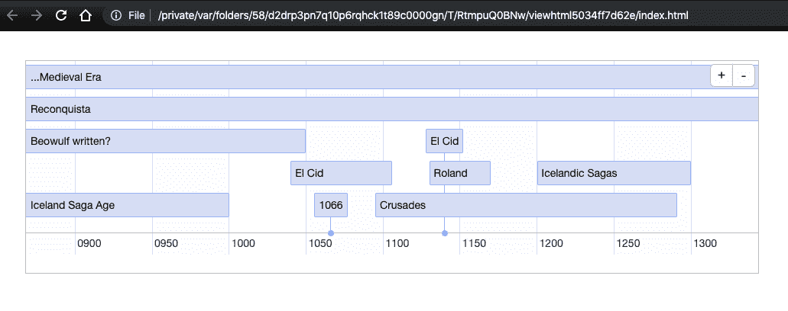

# 第十一章 数据科学与 R

数据科学是一个相对较新的学科，最初因 [O’Reilly 的 Mike Loukides 的这篇文章](https://www.oreilly.com/ideas/what-is-data-science) 而引起了许多人的注意。虽然在这个领域有许多定义，但 Loukides 将他对该领域的详细观察和参与归结为这个定义：

> 数据应用从数据本身获取其价值，并随之生成更多数据。它不仅仅是一个带有数据的应用程序；它是一个数据产品。数据科学使得数据产品的创建成为可能。

用于数据科学软件的主要开源生态系统之一位于 Apache，包括 [Hadoop](https://hadoop.apache.org)（包括 HDFS 分布式文件系统，Hadoop Map/Reduce，¹ Ozone 对象存储和 Yarn 调度程序）、[Cassandra 分布式数据库](https://cassandra.apache.org) 和 [Spark 计算引擎](https://spark.apache.org)。请阅读 Hadoop 页面的“模块和相关工具”部分以获取当前列表。

这里有趣的是，许多数据科学家视为理所当然的大部分基础设施都是用 Java 和 Scala（一种 JVM 语言）编写的。其余大部分则是用 Python 编写的，这是一种与 Java 互补的语言。

数据科学问题可能涉及大量的设置，所以我们只会从传统数据科学中给出一个使用 Spark 框架的例子。Spark 是用 Scala 编写的，因此可以直接被 Java 代码使用。

在本章的其余部分，我将专注于一种称为 R 的语言，它在统计学和数据科学中被广泛使用（好吧，在许多其他科学领域也是如此；你在同行评审的期刊文章中看到的许多图表都是用 R 准备的）。R 被广泛使用，了解它是很有用的。它的主要实现不是用 Java 编写的，而是用 C、Fortran 和 R 本身的混合语言。但是 R 可以在 Java 中使用，Java 也可以在 R 中使用。我将讨论几种 R 的实现方式以及如何选择一种，然后展示如何从 R 中使用 Java，从 Java 中使用 R，以及在 Web 应用程序中使用 R 的技术。

# 11.1 使用 Java 进行机器学习

## 问题

你想要使用 Java 进行机器学习和数据科学，但每个人都告诉你要使用 Python。

## 解决方案

使用众多免费下载的强大 Java 工具包之一。

## 讨论

有时候人们说机器学习（ML）和深度学习必须用 C++ 来提高效率，或者用 Python 来利用广泛的软件可用性。尽管这些语言各有其优势和支持者，但确实可以使用 Java 来实现这些目的。然而，设置这些软件包并展示一个简短的演示比适合本书典型的配方格式要长。

随着行业巨头亚马逊发布基于 Java 的 Deep Java Learning (DJL) 库，以及许多其他优秀的库（其中不少支持 [CUDA](https://developer.nvidia.com/cuda-zone) 以加速 GPU 计算）（参见 Table 11-1），没有理由不使用 Java 进行机器学习。除了 DJL 外，我尽量列出那些仍在维护且在用户中口碑不错的包。

Table 11-1\. 一些 Java 机器学习包

| Library name | 描述 | 信息网址 | 源码网址 |
| --- | --- | --- | --- |
| ADAMS | 用于构建/维护数据驱动反应式工作流程的工作流引擎；与业务流程集成 | [*https://adams.cms.waikato.ac.nz/*](https://adams.cms.waikato.ac.nz/) | [*https://github.com/waikato-datamining/adams-base*](https://github.com/waikato-datamining/adams-base) |
| Deep Java Library | 亚马逊的机器学习库 | [*https://djl.ai*](https://djl.ai) | [*https://github.com/awslabs/djl*](https://github.com/awslabs/djl) |
| Deeplearning4j | DL4J，Eclipse 的分布式深度学习库；与 Hadoop 和 Apache Spark 集成 | [*https://deeplearning4j.org/*](https://deeplearning4j.org/) | [*https://github.com/eclipse/deeplearning4j*](https://github.com/eclipse/deeplearning4j) |
| ELKI | 数据挖掘工具包 | [*https://elki-project.github.io/*](https://elki-project.github.io/) | [*https://github.com/elki-project/elki*](https://github.com/elki-project/elki) |
| Mallet | 用于文本处理的机器学习库 | mallet.cs.umass.edu | [*https://github.com/mimno/Mallet.git*](https://github.com/mimno/Mallet.git) |
| Weka | 数据挖掘的机器学习算法；提供数据准备、分类、回归、聚类、关联规则挖掘和可视化工具 | [*https://www.cs.waikato.ac.nz/ml/weka/index.html*](https://www.cs.waikato.ac.nz/ml/weka/index.html) | [*https://svn.cms.waikato.ac.nz/svn/weka/trunk/weka*](https://svn.cms.waikato.ac.nz/svn/weka/trunk/weka) |

## 另请参阅

书籍 *Data Mining: Practical Machine Learning and Techniques* 由 Ian Witten 等人（Morgan Kaufmann 出版）编写，他们也是 Weka 背后团队的成员。

还可以参考 Eugen Parschiv 的 [Java AI 软件包列表](https://www.baeldung.com/java-ai)。

# 11.2 在 Apache Spark 中使用数据

## 问题

您希望使用 Spark 处理数据。

## 解决方案

创建一个 `SparkSession`，使用其 `read()` 函数读取 `DataSet`，应用操作并总结结果。

## 讨论

Spark 是一个非常庞大的主题！已经有整本书专门讲述了它。引用 [Databricks](https://databricks.com)，这个团队是 Spark 最初的开发者之一：²

> Apache Spark™ 在过去几年中取得了巨大的增长，成为今天企业中的事实标准数据处理和 AI 引擎，这归功于其速度、易用性和复杂的分析功能。Spark 通过简化跨多个来源的大规模数据准备，为数据工程和数据科学工作负载提供一致的 API 集，以及与流行的 AI 框架和库（如 TensorFlow、PyTorch、R 和 SciKit-Learn）的无缝集成，统一了数据和人工智能。

我无法在本书中传达整个主题内容。然而，Spark 擅长处理大量数据，比如在示例 11-1 中，我们读取了一个 Apache 格式的日志文件，并找到（和计数）具有 200、404 和 500 响应的行。

##### 示例 11-1\. spark/src/main/java/sparkdemo/LogReader.java

```java
import org.apache.spark.sql.SparkSession;
import org.apache.spark.sql.Dataset;
import org.apache.spark.api.java.function.FilterFunction;

/**
 * Read an Apache Logfile and summarize it.
 */
public class LogReader {

    public static void main(String[] args) {

        final String logFile = "/var/wildfly/standalone/log/access_log.log";    
        SparkSession spark =
            SparkSession.builder().appName("Log Analyzer").getOrCreate();       
        Dataset<String> logData = spark.read().textFile(logFile).cache();       

        long good = logData.filter(                                             
        new FilterFunction<>() {public boolean call(String s) {
                    return s.contains("200");
                }
            }).count();

        long bad = logData.filter(new FilterFunction<>() {
                public boolean call(String s) {
                    return s.contains("404");
                }
            }).count();

        long ugly = logData.filter(new FilterFunction<>() {
                public boolean call(String s) {
                    return s.contains("500");
                }
            }).count();

        System.out.printf(                                                      
            "Successful transfers %d, 404 tries %d, 500 errors %d\n",
            good, bad, ugly);

        spark.stop();
    }
}
```


设置日志文件的文件名。可能应该从`args`中获取。


启动 Spark `SparkSession`对象——运行时环境。


告诉 Spark 读取日志文件并将其保留在内存中（缓存）。


定义 200、404 和 500 错误的过滤器。它们应该能够使用 lambda 表达式来使代码更简洁，但 Java 和 Scala 版本的`FilterFunction`之间存在歧义。


打印结果。

要使其*编译*通过，您需要将以下内容添加到 Maven 的 POM 文件中：

```java
<dependency>
    <groupId>org.apache.spark</groupId>
    <artifactId>spark-sql_2.12</artifactId>
    <version>2.4.4</version>
    <scope>provided</scope>
</dependency>
```

然后你应该能够执行`mvn package`命令来生成一个打包好的 JAR 文件。

使用`provided`范围的原因是因为我们还将从[Spark 下载页面](https://spark.apache.org/downloads.html)下载 Apache Spark 运行时包以*运行*应用程序。解压分发包并将`SPARK_HOME`环境设置为其根目录：

```java
SPARK_HOME=~/spark-3.0.0-bin-hadoop3.2/
```

然后你可以使用我在源代码下载中提供的`run`脚本（*javasrc/spark*）。

Spark 的设计面向比这个简单示例更大规模的计算，因此其庞大的输出简直淹没了我简单示例程序的输出。尽管如此，对于一个大约有 42,000 行的文件，我确实得到了这个结果，埋藏在日志记录中：

```java
Successful transfers 32555, 404 tries 6539, 500 errors 183
```

如前所述，Spark 是一个庞大的主题，但对大多数数据科学家来说是一个必不可少的工具。你可以使用 Java（显然），或者 Scala 来编写 Spark 程序。Scala 是一种促进函数式编程的 JVM 语言（参见[此 Scala 教程供 Java 开发人员使用](https://www.dhgarrette.com/nlpclass/scala/basics.html)），以及 Python 和可能其他语言。你可以在[*https://spark.apache.org*](https://spark.apache.org)或者在线的众多书籍、视频和教程中了解更多。

# 11.3 使用 R 进行交互

## 问题

你对 R 一无所知，但你想要了解它。

## 解决方案

R 已经存在多年，其前身 S 则存在了十年之久。有许多书籍和在线资源致力于这种语言。官方主页位于[*https://www.r-project.org*](https://www.r-project.org)。还有许多在线教程；[R 项目](https://cran.r-project.org/doc/contrib/Paradis-rdebuts_en.pdf)提供了一个。R 本身可以在大多数系统的软件包管理器中找到，并且可以从官方[下载站点](https://cran.r-project.org/mirrors.html)下载。这些 URL 中的名称 *CRAN* 代表 Comprehensive R Archive Network，类似于 TeX 的 CTAN 和 Perl 语言的 CPAN。

在这个例子中，我们将从 Java 程序中写入一些数据，然后使用 R 进行交互式分析和绘图。

## 讨论

这只是一个使用 R 进行交互式操作简介。可以说，R 是一个非常有价值的交互式环境，用于探索数据。以下是一些简单的计算，展示了该语言的特色：一个健谈的启动（如此之长，我不得不截断了一部分），简单算术运算，如果未保存则自动打印结果，当你犯错误时会有相当不错的错误提示，以及对向量的算术运算。你可能会发现与 Java 的 JShell（见食谱 1.4）有些相似之处；它们都是 REPL（读取-求值-打印 循环）接口。R 添加了在退出程序时保存你的交互会话（*工作空间*）的功能，因此下次启动 R 时会恢复所有的数据和函数定义。展示 R 语法的简单交互会话可能如下所示：

```java
$ R

R version 3.6.0 (2019-04-26) -- "Planting of a Tree"
Copyright (C) 2019 The R Foundation for Statistical Computing
Platform: x86_64-apple-darwin15.6.0 (64-bit)

R is free software and comes with ABSOLUTELY NO WARRANTY.
You are welcome to redistribute it under certain conditions.
Type 'license()' or 'licence()' for distribution details.

...

> 2 + 2
[1] 4
> x = 2 + 2
> x
[1] 4
> r = 10 20 30 40 50
Error: unexpected numeric constant in "r = 10 20"
> r = c(10,20,30,45,55,67)
> r
[1] 10 20 30 45 55 67
> r+3
[1] 13 23 33 48 58 70
> r / 3
[1]  3.333333  6.666667 10.000000 15.000000 18.333333 22.333333
>quit()
Save workspace image? [y/n/c]: n
$
```

R 纯粹主义者通常会在分配时使用*赋值箭头* ← 替代 *=* 符号。如果你喜欢这样，可以去尝试。

这个简短的会话只是浅尝辄止：R 提供了数百个内置函数、示例数据集、一千多个附加包、内置帮助等等。对于交互式数据探索，R 确实是首选。

有些人更喜欢使用 R 的图形用户界面。[RStudio](https://rstudio.com) 是最广泛使用的 GUI 前端。

现在我们想要从 Java 中写入一些数据，并在 R 中进行处理（我们将在本章后续的食谱中一起使用 Java 和 R）。在食谱 5.9 中，我们讨论了 `java.util.Random` 类及其 `nextDouble()` 和 `nextGaussian()` 方法。`nextDouble()` 和相关方法试图提供在 0 到 1.0 之间的平均分布，其中每个值被选择的概率相等。高斯或正态分布是从负无穷到正无穷的钟形曲线，大多数值聚集在零（0.0）附近。我们将使用 R 的直方图和图形函数来视觉化地检查它们的效果：

```java
Random r = new Random();
for (int i = 0; i < 10_000; i++) {
    System.out.println("A normal random double is " + r.nextDouble());
    System.out.println("A gaussian random double is " + r.nextGaussian());
```

为了说明不同的分布，我使用 `nextRandom()` 和 `nextGaussian()` 生成了 10,000 个数字。代码在 *Random4.java* 中（此处未显示），是前面示例代码和仅将数字打印到两个文件中的代码的组合。然后我使用 R 绘制了直方图；生成图形的 R 脚本在 *javasrc* 下的 *src/main/resources* 中，但其核心显示在示例 11-2 中。结果显示在图 11-1 中。

##### 示例 11-2\. 生成直方图的 R 命令

```java
png("randomness.png")
us <- read.table("normal.txt")[[1]]
ns <- read.table("gaussian.txt")[[1]]

layout(t(c(1,2)), respect=TRUE)

hist(us, main = "Using nextRandom()", nclass = 10,
       xlab = NULL, col = "lightgray", las = 1, font.lab = 3)

hist(ns, main = "Using nextGaussian()", nclass = 16,
       xlab = NULL, col = "lightgray", las = 1, font.lab = 3)
dev.off()
```

`png()` 调用告诉 R 使用哪个图形设备。其他包括 `X11()` 和 `Postscript()`。`read.table()` 从文本文件中读取数据到表格中；`[1]` 给出了我们只需要的数据列，忽略了一些元数据。`layout()` 调用表示我们想要两个并排显示的图形对象。每个 `hist()` 调用绘制两个直方图中的一个。而 `dev.off()` 关闭输出并刷新任何写入缓冲区到 PNG 文件。结果显示在图 11-1 中。


###### 图 11-1\. 平面（左）和高斯（右）分布

# 11.4 比较/选择 R 实现

## 问题

你不确定要使用哪个 R 的实现。

## 解决方案

查看原始的 R、Renjin 和 FastR。

## 讨论

R 的原始版本是 S，这是一个由约翰·钱伯斯等人于 1976 年在 AT&T 贝尔实验室开发的交互式编程环境。我在支持多伦多大学统计系时遇到了 S，还在为一个名为 *Sun Expert* 的很久以前的杂志审查了它的商业实现 SPlus。AT&T 只向大学和无法进一步分发源代码的商业许可证持有人提供 S 源代码。奥克兰大学的两位开发人员 Ross Ihaka 和 Robert Gentleman 从 1995 年开始开发了 S 的克隆，并将其命名为 R，以代表他们自己的首字母，同时也是对 S 名称的一种玩笑。（这方面有先例：在 Unix/Linux 上流行的 *awk* 语言是以其设计者 Aho、Weinberger 和 Kernighan 的首字母命名的）。R 发展迅速，因为它与 S 非常兼容，并且更容易获取。这个原始 R 的实现由[R Foundation for Statistical Computing](https://r-project.org)积极管理，该基金会还管理[综合 R 存档网络](https://cran.r-project.org)。

[Renjin](http://renjin.org) 是一个在 Java 中相当完整的 R 实现。该项目通过他们自己的 Maven 仓库提供构建的 JAR 文件。

[FastR](https://jaxenter.com/fastr-r-virtual-machine-java-140667.html) 是另一个 Java 实现，在更快的 GraalVM 中运行，并支持从几乎任何其他编程语言直接调用 JVM 代码。FastR 的技术负责人在[这篇博文](https://medium.com/graalvm/faster-r-with-fastr-4b8db0e0dceb)中描述了该实现。

除了这些实现，R 的流行还促使开发了许多访问库，用于从许多流行的编程语言调用 R。[Rserve](https://www.rforge.net/Rserve) 是一个 TCP/IP 网络访问模式，为其存在 Java 封装。

# 11.5 在 Java 应用程序中使用 R：Renjin

## 问题

您希望通过 Renjin 从 Java 应用程序中访问 R。

## 解决方案

将 Renjin 添加到您的 Maven 或 Gradle 构建中，并通过 Recipe 18.3 中描述的脚本引擎机制进行调用。

## 讨论

Renjin 是一个纯 Java 实现的开源 R 重现，提供脚本引擎接口。将以下依赖项添加到您的构建工具中：

```java
org.renjin:renjin-script-engine:3.5-beta76
```

当然，阅读本文时可能已经有更新版本的 Renjin；除非有特殊原因，应使用最新版本。

注意，您还需要一个 `<repository>` 条目，因为维护者将其构件放在 `nexus.betadriven.com` 而不是通常的 Maven Central。这是我使用的内容（从 [*https://www.renjin.org/downloads.html*](https://www.renjin.org/downloads.html) 获取）：

```java
<repositories>
    <repository>
        <id>bedatadriven</id>
        <name>bedatadriven public repo</name>
        <url>https://nexus.bedatadriven.com/content/groups/public/</url>
    </repository>
</repositories>
```

一旦完成这些步骤，您应该能够通过脚本引擎框架访问 Renjin，就像 示例 11-3 中描述的那样。

##### 示例 11-3\. main/src/main/java/otherlang/RenjinScripting.java

```java
    /**
 * Demonstrate interacting with the "R" implementation called "Renjin"
 */
    public static void main(String[] args) throws ScriptException {
        ScriptEngineManager manager = new ScriptEngineManager();
        ScriptEngine engine = manager.getEngineByName("Renjin");
        engine.put("a", 42);
        Object ret = engine.eval("b <- 2; a*b");
        System.out.println(ret);
    }
```

因为 R 将所有数字视为浮点数，类似于许多解释器，打印的值是 `84.0`。

还可以让 Renjin 调用一个脚本文件；示例 11-4 调用与 Recipe 11.3 中使用的相同脚本来生成和绘制一批伪随机数。

##### 示例 11-4\. 使用脚本文件的 Renjin

```java
    private static final String R_SCRIPT_FILE = "/randomnesshistograms.r";
    private static final int N = 10000;

    public static void main(String[] argv) throws Exception {
        // java.util.Random methods are non-static, do need to construct
        Random r = new Random();
        double[] us = new double[N], ns = new double[N];
        for (int i=0; i<N; i++) {
            us[i] = r.nextDouble();
            ns[i] =r.nextGaussian();
        }
        try (InputStream is =
            Random5.class.getResourceAsStream(R_SCRIPT_FILE)) {
            if (is == null) {
                throw new IllegalStateException("Can't open R file ");
            }
            ScriptEngineManager manager = new ScriptEngineManager();
            ScriptEngine engine = manager.getEngineByName("Renjin");
            engine.put("us", us);
            engine.put("ns", ns);
            engine.eval(FileIO.readerToString(new InputStreamReader(is)));
        }
    }
```

如果您从 [*https://renjin.org/downloads.html*](https://renjin.org/downloads.html) 下载一个包含所有依赖项的 JAR 文件，Renjin 也可以作为一个独立的 R 实现来使用。

# 11.6 在 R 会话中使用 Java

## 问题

您正在使用 R 计算的过程中，意识到有一个 Java 库可以完成下一步操作。或者出于其他原因，需要在 R 会话中调用 Java 代码。

## 解决方案

安装 `rJava`，调用 `.jinit()`，然后使用 `J()` 加载类或调用方法。

## 讨论

这里是交互式 R 会话的一部分，在这部分中我们安装 rJava，通过调用 `.jinit()` 进行初始化，并调用 `java.time.LocalDate.now()` 获取当前日期：

```java
> install.packages('rJava')                            
trying URL 'http://.../rJava_0.9-11.tgz' Content type 'application/x-gzip' length 745354 bytes (727 KB)
==================================================
downloaded 727 KB

The downloaded binary packages are in
    /tmp//Rtmp6XYZ9t/downloaded_packages > library('rJava')                                    
> .jinit()
> J('java.time.LocalDate', 'now')                    
[1] "Java-Object{2019-11-22}"
> d=J('java.time.LocalDate', 'now')$toString()        
> d
[1] "2019-11-22"
```


安装 `rJava` 包；只需执行一次。


加载 `rJava`，并使用 `.jinit()` 初始化；每个 R 会话都需要这两步。


`J` 函数接受一个完整类名作为参数。如果只提供该参数，则返回一个类描述符（例如 `java.lang.Class` 对象）。如果提供多于一个参数，则第二个参数是静态方法名，后续的参数将传递给该方法。


返回的对象可以使用标准的 R *\$* 符号调用 Java 方法；这里调用 `toString()` 方法以返回字符串而不是 `LocalDate` 对象。

`.jcall` 函数使您可以更好地控制调用方法和返回类型：

```java
> d=J('java.time.LocalDate', 'now')                    
> .jcall(d, "I", 'getYear')                            
[1] 2019
>
> .jcall("java/lang/System","S","getProperty","user.dir") 
[1] "/home/ian"
> c=J('java/lang/System')                            
> .jcall(c, "S", 'getProperty', 'user.dir')
[1] "/home/ian"
>
```


在 R 变量 *d* 中调用 Java `LocalDate.now()` 方法并保存结果。


在 `LocalDate` 对象上调用 Java `getYear()` 方法；“I”告诉 `jcall` 期望一个整数结果。


调用 `System.getProperty("user.dir")` 并打印结果；“S”告诉 `.jcall` 期望返回一个字符串。


如果您将要多次使用一个类，请保存 `Class` 对象，并将其作为 `.jcall()` 的第一个参数传递。

这里有更多的功能；请参考[文档](https://cran.r-project.org/web/packages/rJava)和[developer.com 的文章](https://www.developer.com/java/ent/getting-started-with-r-using-java.html)。

# 11.7 使用 FastR，GraalVM 实现的 R

## 问题

您使用 R 语言，但感觉需要更快的速度。

## 解决方案

使用 FastR，Oracle 的 GraalVM 重新实现的 R 语言。

## 讨论

假设您已经按照第 1.2 节的描述安装了 GraalVM，您可以直接输入以下命令：

```java
$ gu install R
Downloading: Component catalog from www.graalvm.org
Processing component archive: FastR
Downloading: Component R: FastR  from github.com
Installing new component: FastR (org.graalvm.R, version 19.2.0.1)
NOTES:
---------------
The user specific library directory was not created automatically.
You can either create the directory manually or edit file
/Library/Java/JavaVirtualMachines/graalvm-ce-19.2.0.1/Contents/
  Home/jre/languages/R/etc/Renviron
to change it to any desired location. Without user specific library
directory, users will need write permission for the GraalVM home
directory in order to install R packages.
...
[more install notes]
```

如果您已将 `PATH` 设置为在其他目录之前使用 GraalVM，那么命令 *R* 现在将给出 GraalVM 版本的 R。要访问标准的 R，您将需要设置您的 `PATH` 或者给出 R 安装的完整路径。在所有 Unix 和类 Unix 系统上，命令 *which R* 将显示您的 `PATH` 上的所有 R 命令：

```java
$ which R
/Library/Java/JavaVirtualMachines/graalvm-ce-19.2.0.1/Contents/Home/bin/R
/usr/local/bin/R
```

让我们来运行它：

```java
$ R
R version 3.5.1 (FastR)
Copyright (c) 2013-19, Oracle and/or its affiliates
Copyright (c) 1995-2018, The R Core Team
Copyright (c) 2018 The R Foundation for Statistical Computing
Copyright (c) 2012-4 Purdue University
Copyright (c) 1997-2002, Makoto Matsumoto and Takuji Nishimura
All rights reserved.

FastR is free software and comes with ABSOLUTELY NO WARRANTY.
You are welcome to redistribute it under certain conditions.
Type 'license()' or 'licence()' for distribution details.

R is a collaborative project with many contributors.
Type 'contributors()' for more information.

Type 'q()' to quit R.
[Previously saved workspace restored]

> 2 + 2
[1] 4
> ^D
Save workspace image? [y/n/c]: n
$
```

从那时起，您应该能够做几乎任何在标准 R 中做的事情，因为此 R 的源代码大部分来自 R 基金会的源代码。

# 11.8 在 Web 应用程序中使用 R

## 问题

您希望在 Web 服务器上的网页中显示 R 的数据和图形。

## 解决方案

有几种方法可以实现这个效果：

+   准备数据，生成图形，就像我们在第 11.3 节的示例中所做的那样，然后将它们都整合到静态网页中。

+   使用多种[R 的附加 Web 框架](https://cran.r-project.org/web/views/WebTechnologies.html#web-and-server-frameworks)，如 [shiny](https://cran.r-project.org/web/packages/shiny/index.html) 或 [Rook](https://cran.r-project.org/web/packages/Rook/index.html)。

+   在 Servlet、JSF、Spring Bean 或其他 Web 层组件中调用 R 的 JVM 实现。

## 讨论

第一种方法很简单，这里不需要讨论。

对于第二种方法，我实际上会使用 `timevis`，它反过来使用 `shiny`。这并未内置到 R 库中，因此我们首先需要使用 R 的 `install.packages()` 安装它：

```java
$ R
> install.packages('timevis')
> quit()
$
```

这可能需要一些时间，因为它会下载并构建多个依赖项。

为了这个演示，我有一个包含一些关于中世纪文学基本信息的小数据集，我使用`shiny`加载和显示：

```java
# Draw the timeline for the epics.

epics = read.table("epics.txt", header=TRUE, fill=TRUE)

# epics

library("timevis")

timevis(epics)
```

运行时，这会创建一个包含 HTML 和 JavaScript 的临时文件，以允许对数据进行交互式探索。该库还会在浏览器中打开此文件，显示在图 11-2 中。用户可以通过展开或收缩时间线并横向滚动来探索数据。



###### 图 11-2\. TimeVis（shiny）的操作

当存在两个框（Cid，Sagas）时，第一个是生活或故事发生的时间，第二个是它们被书写的时间。

要将其暴露在公共网络上，请复制文件（完整路径显示在浏览器标题栏中）和*lib*文件夹放入同一目录，并将该目录服务于 Web 服务器。或者直接使用文件→另存为→完整网页，在浏览器中执行。无论哪种方式，您都必须在 R 会话运行时执行此操作，因为会话结束时会删除临时文件。或者，如果您熟悉`shiny`框架，可以将`timevis`可视化插入到`shiny`应用程序中。

¹ *Map/Reduce*是由 Google 开发的处理大数据问题的著名算法。未指定数量的生成器处理*map*数据，如网页上的单词或页面的 URL，单个（通常）reduce 进程将这些映射减少为可管理的形式，例如包含给定单词的所有页面的列表。早期，数据科学试图通过 Map/Reduce 做所有事情；现在，风向标已经回到使用像 Spark 这样的计算引擎。

² DataBricks 在其网站上提供了几本关于 Spark 的免费电子书；它还提供商业 Spark 附加组件。
