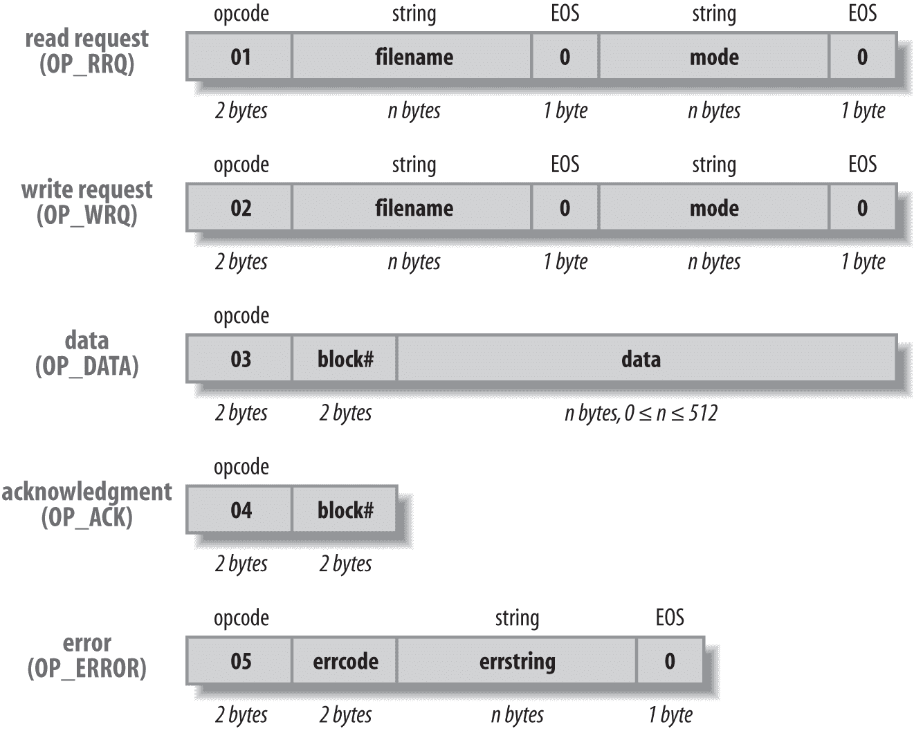
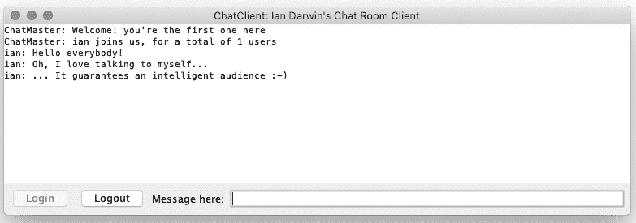

# 第十二章 网络客户端

# 12.0 引言

Java 可用于编写多种类型的网络程序。在传统基于套接字的代码中，程序员负责构建客户端和服务器之间的交互；TCP *套接字代码* 简单地确保您发送的任何数据都能到达另一端。在更高级别的类型（如 HTTP、RMI、CORBA 和 EJB）中，软件接管了更多的控制权。套接字通常用于连接传统服务器；如果您从头开始编写新应用程序，最好使用更高级别的服务。

将套接字与电话系统进行比较可能会有所帮助。电话最初用于模拟语音通信，这种通信结构相当不结构化。随后它开始用于一些分层应用程序；第一个广泛流行的分层应用程序是传真传输，即传真。如果没有广泛的语音电话服务，传真会处于何种地位呢？历史上第二个极为流行的分层应用程序是拨号 TCP/IP。这与 Web 共同存在，成为大众市场服务的流行方式。如果没有广泛部署的语音线路，拨号 IP 会如何呢？如果没有拨号 IP，互联网会处于何种地位呢？现在传真和拨号几乎都已经消失，但它们为您智能手机的联网功能铺平了道路，这正是使其有用（甚至作为时间的耗费者）的原因。

套接字也是分层的。Web、RMI、JDBC、CORBA 和 EJB 都是基于套接字的。HTTP 现在是最常用的协议，当您只想从点 b 获取数据到点 a 时，通常应该使用它。

自从 Java 在 1995 年 5 月发布初版（最初是 HotJava 浏览器的一个附带产品）以来，Java 作为一种用于构建网络应用程序的编程语言就变得非常流行。如果你曾经在 C 中构建过网络应用程序，你就会明白其中的原因。首先，C 程序员必须关注他们所在的平台。Unix 使用同步套接字，其读写操作类似于普通磁盘文件，而 Microsoft 操作系统使用异步套接字，其使用回调来通知读写操作何时完成。Java 则模糊了这种区别。此外，在 C 中设置套接字所需的代码量令人望而却步。只是出于乐趣，示例 12-1 展示了设置客户端套接字的典型 C 代码。请记住，这只是 Unix 的一部分。而且只是建立和关闭连接的部分。要在 Windows 上移植，还需要一些额外的条件代码（使用 C 的 `#ifdef` 机制）。C 的 `#include` 机制要求必须精确包含正确的文件，并且某些文件必须按特定顺序列出（Java 的 `import` 机制则更加灵活）。

##### 示例 12-1\. main/src/main/java/network/Connect.c（C 客户端设置）

```java
#include <sys/types.h>
#include <sys/socket.h>
#include <netinet/in.h>
#include <netdb.h>
#include <stdio.h>
#include <string.h>
#include <fcntl.h>

int
main(int argc, char *argv[])
{
    char* server_name = "localhost";
    struct hostent *host_info;
    int sock;
    struct sockaddr_in server;

    /* Look up the remote host's IP address */
    host_info = gethostbyname(server_name);
    if (host_info == NULL) {
        fprintf(stderr, "%s: unknown host: %s\n", argv[0], server_name);
        exit(1);
    }

    /* Create the socket */
    if ((sock = socket(AF_INET, SOCK_STREAM, 0)) < 0) {
        perror("creating client socket");
        exit(2);
    }

    /* Set up the server's socket address */
    server.sin_family = AF_INET;
    memcpy((char *)&server.sin_addr, host_info->h_addr,
                     host_info->h_length);
    server.sin_port = htons(80);

    /* Connect to the server */
    if (connect(sock,(struct sockaddr *)&server,sizeof server) < 0) {
        perror("connecting to server");
        exit(4);
    }

    /* Finally, we can read and write on the socket. */
    /* ... */

    (void) close(sock);
}
```

在第一个示例中，我们将看到如何在 Java 中用基本上一行代码（加上一些错误处理）完成连接。然后，我们将讨论错误处理和通过套接字传输数据。接下来，我们将简要介绍一个实现了大部分已被用于 20 年来引导无盘工作站的`datagram`或 UDP 客户端的 TFTP（简单文件传输协议）。最后，我们将结束于一个连接到聊天服务器的交互式程序。

大多数这些客户端示例的共同主题是使用现有服务器，这样我们就不必同时生成客户端和服务器。这些大多数服务存在于任何标准 Unix 平台上。如果您找不到附近的 Unix 服务器来尝试它们，请允许我建议您拿一台旧 PC，也许是一台性能不足以运行最新 Microsoft 软件的 PC，并在其上安装一个免费的开源 Unix 系统。我个人最喜欢的是[OpenBSD](https://openbsd.org)，市场上普遍喜欢的是 Linux。这两者都可以通过互联网免费安装，并提供所有在客户端示例中使用的标准服务，包括时间服务器和 TFTP。两者都有免费的 Java 实现可用。

我还提供了对 Web 服务客户端的基本覆盖。术语“Web 服务”现在已经意味着使用 HTTP 进行程序间通信。两个一般类别是基于 SOAP 和基于 REST。REST 服务非常简单 — 您发送一个 HTTP 请求，并获得纯文本或 JSON（第十四章）或 XML 格式的响应。SOAP 更为复杂，本书不涵盖。在 Elliotte Harold（O'Reilly）的[*Java 网络编程*](http://shop.oreilly.com/product/0636920028420.do)中有关客户端连接的更多信息。我不涵盖构建 Web 服务的服务器端 API — JAX-RS 和 JAX-WS，因为这些内容在[几本 O'Reilly 书籍](http://search.oreilly.com/?q=java+enterprise)中有详细介绍。

# 12.1 HTTP/REST Web Client

## 问题

您需要从 URL 读取数据，例如连接到 RESTful Web 服务或通过 HTTP/HTTPS 下载网页或其他资源。

## 解决方案

使用标准 Java 11 的`HttpClient`或`URLConnection`类。

这种技术适用于任何需要从 URL 读取数据的情况，不仅限于 RESTful Web 服务。

## 讨论

在 Java 11 之前，您必须使用`URLConnection`类或下载并使用旧版 Apache HTTP Client 库。使用 Java 11 后，标准 Java 中有一个相当易于使用和灵活的 API。它还支持 HTTP/2.0；而 Apache `HttpClient`截至 2020 年初尚不支持 HTTP/2.0，而传统的`URLConnection`也不太可能支持 HTTP/2.0。

以我们的简单示例为例，我们将使用 Google 的建议服务，即当您在 Google 网络搜索引擎中输入搜索的前几个字符时所看到的内容。

这项 Google 服务支持各种输出格式。基本 URL 如下：

```java
https://suggestqueries.google.com/complete/search?client=firefox&q=
```

将您希望获得建议的单词附加到它。`client=firefox`告诉它我们需要一个简单的 JSON 格式；使用`client=chrome`它包含更多字段。

要使用 Java HTTP 客户端 API，您需要一个`HttpClient`对象，使用构建器模式获取，然后创建一个`Request`对象：

```java
        // This object would be kept for the life of an application
        HttpClient client = HttpClient.newBuilder()
            .followRedirects(Redirect.NORMAL)
            .version(Version.HTTP_1_1)
            .build();

        // Build the HttpRequest object to "GET" the urlString
        HttpRequest req =
            HttpRequest.newBuilder(URI.create(urlString +
                URLEncoder.encode(keyword)))
            .header("User-Agent", "Dept of Silly Walks")
            .GET()
            .build();
```

`HttpRequest`对象可以使用客户端发送，以获取`HttpResponse`对象，从中您可以获取状态和/或正文。发送可以同步进行（如果您需要立即获得结果）或异步进行（如果在此期间可以有用地执行其他操作）。此示例显示了同时以同步和异步方式发送：

```java
        // Send the request - synchronously
        HttpResponse<String> resp =
            client.send(req, BodyHandlers.ofString());

        // Collect the results
        if (resp.statusCode() == 200) {
            String response = resp.body();
            System.out.println(response);
        } else {
            System.out.printf("ERROR: Status %d on request %s\n",
                resp.statusCode(), urlString);
        }
```

```java
        // Send the request - asynchronously
        client.sendAsync(req, BodyHandlers.ofString())
            .thenApply(HttpResponse::body)
            .thenAccept(System.out::println)
            .join();
```

这是输出；该行已在逗号处换行以适应页面：

```java
$ java HttpClientDemo.java
["darwin",["darwin thompson","darwin","darwin awards","darwinism",
 "darwin australia","darwin thompson fantasy","darwin barney",
 "darwin theory","darwinai","darwin dormitorio"]]
```

如果您不想使用`HttpClient`库，则*可以*使用`java.net`中的旧代码，因为我们在这里通常只需要打开并从 URL 读取的能力。这是使用`URLConnection`的代码：

```java
public class RestClientURLDemo {
    public static void main(String[] args) throws Exception {
        URLConnection conn = new URL(
            HttpClientDemo.urlString + HttpClientDemo.keyword)
            .openConnection();
        try (BufferedReader is =
            new BufferedReader(new InputStreamReader(conn.getInputStream()))) {

            String line;
            while ((line = is.readLine()) != null) {
                System.out.println(line);
            }
        }
    }
}
```

输出应该与`HttpClient`版本产生的完全一致。

## 参见

不要将此`HttpClient`与[较旧的 Apache HttpClient 库](https://hc.apache.org/httpcomponents-client-ga/index.html)混淆。

您可以在 Bill Burke 的[*RESTful Java with JAX-RS 2.0, 2nd Edition*](http://shop.oreilly.com/product/0636920028925.do)（O’Reilly）中找到更多关于 REST 服务（包括为其实现服务器端组件）的信息。

# 12.2 联系套接字服务器

## 问题

您需要使用 TCP/IP 联系服务器。

## 解决方案

只需创建一个`java.net.Socket`，将主机名和端口号传递给构造函数。

## 讨论

在 Java 中并不复杂。创建套接字时，传递主机名和端口号。`java.net.Socket`构造函数执行`gethostbyname()`和`socket()`系统调用，设置服务器的`sockaddr_in`结构，并执行`connect()`调用。您只需捕获错误，这些错误是从熟悉的`IOException`继承的子类。示例 12-2 设置了 Java 网络客户端，但实际上尚未执行任何 I/O 操作。它使用 try-with-resources 确保当我们完成时套接字会自动关闭。

##### 示例 12-2\. main/src/main/java/network/ConnectSimple.java（简单客户端连接）

```java
import java.net.Socket;

/* Client with NO error handling */
public class ConnectSimple {

    public static void main(String[] argv) throws Exception {

        try (Socket sock = new Socket("localhost", 8080)) {

            /* If we get here, we can read and write on the socket "sock" */
            System.out.println(" *** Connected OK ***");

            /* Do some I/O here... */

        }
    }
}
```

此版本不进行实际错误报告，但名为*ConnectFriendly*的版本进行了；我们将在 Recipe 12.4 中看到此版本。

## 参见

Java 支持其他使用网络应用程序的方式。您还可以打开 URL 并从中读取（请参阅 Recipe 12.8）。您可以编写代码，以便在 Web 浏览器中打开时从 URL 运行，或者从应用程序中运行。

# 12.3 查找和报告网络地址

## 问题

您希望查找主机的地址名称或编号，或获取网络连接的另一端的地址。

## 解决方案

获取一个`InetAddress`对象。

## 讨论

`InetAddress`对象表示给定计算机或主机的互联网地址。它没有公共构造函数；您通过调用静态的`getByName()`方法获取`InetAddress`，传递主机名如*darwinsys.com*或网络地址作为字符串，如 1.23.45.67。该类中的所有“查找”方法都可以抛出已检查的`UnknownHostException`（`java.io.IOException`的子类），必须在调用方法的头部捕获或声明。这些方法实际上不联系远程主机，因此它们不会抛出与网络连接相关的其他异常。

方法`getHostAddress()`给出与`InetAddress`对应的数值 IP 地址（作为字符串）。其反向是`getHostName()`，它报告`InetAddress`的名称。这可用于根据名称打印主机的地址，或反之亦然：

```java
public class InetAddrDemo {
    public static void main(String[] args) throws IOException {
        String hostName = "darwinsys.com";
        String ipNumber = "8.8.8.8"; // currently a well-known Google DNS server

        // Show getting the InetAddress (looking up a host) by host name
        System.out.println(hostName + "'s address is " +
            InetAddress.getByName(hostName).getHostAddress());

        // Look up a host by address
        System.out.println(ipNumber + "'s name is " +
            InetAddress.getByName(ipNumber).getHostName());

        // Look up my localhost addresss
        final InetAddress localHost = InetAddress.getLocalHost();
        System.out.println("My localhost address is " + localHost);

        // Show getting the InetAddress from an open Socket
        String someServerName = "google.com";
        // assuming there's a web server on the named server:
        try (Socket theSocket = new Socket(someServerName, 80)) {
            InetAddress remote = theSocket.getInetAddress();
            System.out.printf("The InetAddress for %s is %s%n",
                someServerName, remote);
        }
    }
}
```

你还可以通过调用其`getInetAddress()`方法从`Socket`中获取`InetAddress`。你可以使用`InetAddress`而不是主机名字符串构造`Socket`。因此，要连接到与现有套接字上相同主机上的端口号`myPortNumber`，可以使用以下代码：

```java
InetAddress remote = theSocket.getInetAddress( );
Socket anotherSocket = new Socket(remote, myPortNumber);
```

最后，要查找与主机关联的所有地址（服务器可能在多个网络上），请使用静态方法`getAllByName(host)`，它返回一个`InetAddress`对象数组，每个 IP 地址关联一个给定名称。

静态方法`getLocalHost()`返回等同于`localhost`或 127.0.0.1 的`InetAddress`。这可用于连接到作为客户端正在运行的同一计算机上运行的服务器程序。

如果使用 IPv6，可以使用`Inet6Address`。

## 另请参阅

参见第 13.2 节中的`NetworkInterface`，它允许您更多地了解正在运行的计算机的网络。目前标准 API 中没有查找服务的方法，也就是说，无法查找 HTTP 服务位于 80 端口的方法。TCP/IP 的完整实现始终包括一组额外的解析器；在 C 中，调用`getservbyname("http", "tcp");`将查找给定服务^(1)，并返回一个`servent`（服务条目）结构，其`s_port`成员将包含值 80。已建立服务的编号不会更改，但是当服务是新的或以非例行方式安装时，通过更改服务定义可以方便地更改机器或网络上所有程序的服务号码（无论编程语言如何）。Java 应在未来的发布版本中提供此功能。

# 12.4 处理网络错误

## 问题

如果出现问题，您需要比仅有`IOException`更详细的报告。

## 解决方案

捕获更多种类的异常类。`SocketException`有几个子类；最显著的是`ConnectException`和`NoRouteToHostException`。名称是不言自明的：第一个意味着连接被另一端的机器（服务器机器）拒绝，第二个完全解释了失败。示例 12-3 是`Connect`程序的摘录，增强了处理这些条件。

##### 示例 12-3\. ConnectFriendly.java

```java
public class ConnectFriendly {
    public static void main(String[] argv) {
        String server_name = argv.length == 1 ? argv[0] : "localhost";
        int tcp_port = 80;
        try (Socket sock = new Socket(server_name, tcp_port)) {

            /* If we get here, we can read and write on the socket. */
            System.out.println(" *** Connected to " + server_name  + " ***");

            /* Do some I/O here... */

        } catch (UnknownHostException e) {
            System.err.println(server_name + " Unknown host");
            return;
        } catch (NoRouteToHostException e) {
            System.err.println(server_name + " Unreachable" );
            return;
        } catch (ConnectException e) {
            System.err.println(server_name + " connect refused");
            return;
        } catch (java.io.IOException e) {
            System.err.println(server_name + ' ' + e.getMessage());
            return;
        }
    }
}
```

# 12.5 读取和写入文本数据

## 问题

已连接，您希望传输文本数据。

## 解决方案

从套接字的`getInputStream()`或`getOutputStream()`构造一个`BufferedReader`或`PrintWriter`。

## 讨论

`Socket`类有允许您获取用于从套接字读取或写入的`InputStream`或`OutputStream`的方法。它没有获取`Reader`或`Writer`的方法，部分原因是一些网络服务仅限于 ASCII，但主要原因是在有`Reader`和`Writer`类之前就决定了`Socket`类。您可以始终使用转换类从`InputStream`创建`Reader`或从`OutputStream`创建`Writer`。这是两种最常见形式的范例：

```java
BufferedReader is = new BufferedReader(
    new InputStreamReader(sock.getInputStream( )));
PrintWriter os = new PrintWriter(sock.getOutputStream( ), true);
```

示例 12-4 从白天服务读取一行文本，这种服务由全功能的 TCP/IP 套件（例如大多数 Unix 系统中包含的套件）提供。您不必向`Daytime`服务器发送任何内容；您只需连接并读取一行。服务器写入包含日期和时间的一行，然后关闭连接。

运行它看起来像以下代码。我首先在本地主机上获取当前日期和时间，然后运行`DaytimeText`程序以查看服务器（机器*darian*是我的 Unix 服务器之一）上的日期和时间：

```java
C:\javasrc\network>date 
Current date is Sun 01-23-2000
Enter new date (mm-dd-yy):
C:\javasrc\network>time
Current time is  1:13:18.70p
Enter new time:
C:\javasrc\network>java network.DaytimeText darian
Time on darian is Sun Jan 23 13:14:34 2000
```

代码位于`DaytimeText`类中，显示在示例 12-4 中。

##### 示例 12-4\. DaytimeText.java

```java
public class DaytimeText {
    public static final short TIME_PORT = 13;

    public static void main(String[] argv) {
        String server_name = argv.length == 1 ? argv[0] : "localhost";

        try (Socket sock = new Socket(server_name,TIME_PORT);
            BufferedReader is = new BufferedReader(new
                InputStreamReader(sock.getInputStream()));) {
            String remoteTime = is.readLine();
            System.out.println("Time on " + server_name + " is " + remoteTime);
        } catch (IOException e) {
            System.err.println(e);
        }
    }
}
```

第二个示例，显示在示例 12-5 中，显示了在同一个套接字上的读取和写入。`Echo`服务器简单地回显您发送的任何文本行。它不是一个非常聪明的服务器，但它是一个有用的服务器。它有助于网络测试，也有助于测试这类客户端！

`converse()`方法与名为主机上的`Echo`服务器进行简短对话；如果没有指定主机，则尝试联系`localhost`，这是程序正在运行的机器的通用别名^(2)。

##### 示例 12-5\. main/src/main/java/network/EchoClientOneLine.java

```java
public class EchoClientOneLine {
    /** What we send across the net */
    String mesg = "Hello across the net";

    public static void main(String[] argv) {
        if (argv.length == 0)
            new EchoClientOneLine().converse("localhost");
        else
            new EchoClientOneLine().converse(argv[0]);
    }

    /** Hold one conversation across the net */
    protected void converse(String hostName) {
        try (Socket sock = new Socket(hostName, 7);) { // echo server.
            BufferedReader is = new BufferedReader(new
                InputStreamReader(sock.getInputStream()));
            PrintWriter os = new PrintWriter(sock.getOutputStream(), true);
            // Do the CRLF ourself since println appends only a \r on
            // platforms where that is the native line ending.
            os.print(mesg + "\r\n"); os.flush();
            String reply = is.readLine();
            System.out.println("Sent \"" + mesg  + "\"");
            System.out.println("Got  \"" + reply + "\"");
        } catch (IOException e) {
            System.err.println(e);
        }
    }
}
```

将读取和写入代码从此方法中隔离出来，可能是一个好的练习，可以将其封装到一个`NetWriter`类中，可能是`PrintWriter`的子类，并添加`\r\n`和刷新操作。

# 12.6 读取和写入二进制或序列化数据

## 问题

已连接，您希望传输二进制数据，无论是原始二进制数据还是序列化的 Java 对象。

## 解决方案

对于普通的二进制日期，从套接字的`getInputStream()`或`getOutputStream()`构造`DataInputStream`或`DataOutputStream`。对于序列化的 Java 对象数据，构造`ObjectInputStream`或`ObjectOutputStream`。

## 讨论

在套接字上读取/写入的最简单范式是：

```java
DataInputStream is = new DataInputStream(sock.getInputStream());
DataOutputStream is = new DataOutputStream(sock.getOutputStream( ));
```

如果数据量可能很大，插入缓冲流以提高效率。这种范式是：

```java
DataInputStream is = new DataInputStream(
    new BufferedInputStream(sock.getInputStream( )));
DataOutputStream is = new DataOutputStream(
    new BufferedOutputStream(sock.getOutputStream( )));
```

示例中的程序示例 12-6 使用另一个标准服务，以二进制整数表示自 1900 年以来的秒数，因为 Java `Date`类基于 1970 年，我们通过减去 1970 年和 1900 年之间的差异来转换时间基准。当我在课程中使用这个练习时，大多数学生希望*添加*这个时间差，理由是 1970 年更晚。但是如果你思考清楚，你会发现 1999 年和 1970 年之间的秒数比 1999 年和 1900 年之间的秒数少，所以减法给出了正确的秒数。并且因为`Date`构造函数需要毫秒，我们将秒数乘以 1000。

时间差是年数乘以 365，加上两个日期之间的闰年天数（在 1904 年、1908 年等年份中）——19 天。

我们从服务器读取的整数是 C 语言的`unsigned int`。但是 Java 不提供无符号整数类型；通常在需要无符号数字时，您使用下一个更大的整数类型，即`long`。但 Java 还没有提供从数据流中读取无符号整数的方法。`DataInputStream`的`readInt()`方法读取 Java 风格的有符号整数。有`readUnsignedByte()`方法和`readUnsignedShort()`方法，但没有`readUnsignedInt()`方法。因此，我们通过读取无符号字节并使用 Java 的位移操作符重新组装它们，合成读取无符号`int`的能力（必须将其存储在`long`中，否则会丢失符号位并回到起点）：

在代码的结尾，我们使用新的日期/时间 API（见第六章）构造并打印一个`LocalDateTime`对象，以显示本地（客户端）机器上的当前日期和时间：

```java
$ date
Thu Dec 26 09:48:36 EST 2019
java network.RDateClient aragorn
Remote time is 3786360519
BASE_DIFF is 2208988800
Time diff == 1577371719
Time on aragorn is 2019-12-26T09:48:39
Local date/time = 2019-12-26T09:48:41.208180
$
```

名称*aragorn*是我 OpenBSD Unix 计算机之一的主机名。从输出中可以看出，服务器在一秒左右内达成一致。这证实了示例 12-6 中的日期计算代码。这种协议通常称为`rdate`，因此客户端代码称为`RDateClient`。

##### 示例 12-6\. main/src/main/java/network/RDateClient.java

```java
public class RDateClient {
    /** The TCP port for the binary time service. */
    public static final short TIME_PORT = 37;
    /** Seconds between 1970, the time base for dates and times
 * Factors in leap years (up to 2100), hours, minutes, and seconds.
 * Subtract 1 day for 1900, add in 1/2 day for 1969/1970.
 */
    protected static final long BASE_DAYS =
        (long)((1970-1900)*365 + (1970-1900-1)/4);

    /* Seconds since 1970 */
    public static final long BASE_DIFF = (BASE_DAYS * 24 * 60 * 60);

    public static void main(String[] argv) {
        String hostName;
        if (argv.length == 0)
            hostName = "localhost";
        else
            hostName = argv[0];

        try (Socket sock = new Socket(hostName,TIME_PORT);) {
            DataInputStream is = new DataInputStream(new
                BufferedInputStream(sock.getInputStream()));
            // Read 4 bytes from the network, unsigned.
            // Do it yourself; there is no readUnsignedInt().
            // Long is 8 bytes on Java, but we are using the
            // existing time protocol, which uses 4-byte ints.
            long remoteTime = (
                ((long)(is.readUnsignedByte()) << 24) |
                ((long)(is.readUnsignedByte()) << 16) |
                ((long)(is.readUnsignedByte()) <<  8) |
                ((long)(is.readUnsignedByte()) <<  0));
            System.out.println("Remote time is " + remoteTime);
            System.out.println("BASE_DIFF is " + BASE_DIFF);
            System.out.println("Time diff == " + (remoteTime - BASE_DIFF));
            Instant time = Instant.ofEpochSecond(remoteTime - BASE_DIFF);
            LocalDateTime d = LocalDateTime.ofInstant(time, ZoneId.systemDefault());
            System.out.println("Time on " + hostName + " is " + d.toString());
            System.out.println("Local date/time = " + LocalDateTime.now());
        } catch (IOException e) {
            System.err.println(e);
        }
    }
}
```

*对象序列化*是将内存中的对象转换为可以逐字节发送的外部形式的能力。要通过序列化读取或写入 Java 对象，只需从`InputStream`或`OutputStream`构造`ObjectInputStream`或`ObjectOutputStream`；在这种情况下，使用套接字的`getInputStream()`或`getOutputStream()`。

这个程序（及其服务器）提供的服务并不是 TCP/IP 协议栈的标准部分；这是我制作的一个演示服务。此服务的服务器在 Recipe 13.3 中介绍。Example 12-7 中的客户端代码与前一篇中的`DaytimeBinary`程序非常相似，但服务器发送给我们一个已构造好的`LocalDateTime`对象。Example 12-7 展示了与 Example 12-6 不同的客户端代码部分。

##### 示例 12-7\. main/src/main/java/network/DaytimeObject.java

```java
        try (Socket sock = new Socket(hostName, TIME_PORT);) {
            ObjectInputStream is = new ObjectInputStream(new
                BufferedInputStream(sock.getInputStream()));

            // Read and validate the Object
            Object o = is.readObject();
            if (o == null) {
                System.err.println("Read null from server!");
            } else if ((o instanceof LocalDateTime)) {

                // Valid, so cast to LocalDateTime, and print
                LocalDateTime d = (LocalDateTime) o;
                System.out.println("Time on " + hostName + " is " + d);
            } else {
                throw new IllegalArgumentException(
                    String.format("Wanted LocalDateTime, got %s, a %s",
                        o, o.getClass()));
            }
```

我向操作系统询问日期和时间，然后运行程序，在远程机器上打印日期和时间：

```java
$ date
Thu Dec 26 09:29:02 EST 2019
C:\javasrc\network>java network.DaytimeObject aragorn
Time on aragorn is 2019-12-26T09:29:05.227397
C:\javasrc\network>
```

再次结果在几秒钟内达成一致。

# 12.7 UDP 数据报

## 问题

你需要使用数据报连接（UDP）而不是流连接（TCP）。

## 解决方案

使用`DatagramSocket`和`DatagramPacket`。

## 讨论

数据报网络流量与底层基于数据包的以太网和 IP（Internet Protocol）层是一脉相承的。与 TCP 等基于流的连接不同，UDP 等数据报传输像发送单个*数据包*或数据块一样，作为一个单独的实体传输，与其他任何内容都没有必要的关系。^(3)一个常见的比喻是，TCP 就像打电话，而 UDP 就像发送明信片或传真。

差异主要体现在错误处理上。数据包就像明信片一样，可能会丢失。你上次看到邮递员敲门告诉你邮局丢失了几张要送到你手中的明信片是什么时候？这种情况不会发生，因为邮局不会追踪明信片。另一方面，当你在电话上通话时，如果出现噪声爆发——比如有人在房间里大喊大叫，或者是连接不良——你会实时注意到故障，并可以要求对方重复刚才说的话。

对于像 TCP 套接字这样的基于流的连接，网络传输层会帮你处理错误：它会要求对方重新传输。但是对于 UDP 等数据报传输，你必须自己处理重传。这有点像编号你发送的明信片，这样你可以回头重新发送那些未到达的明信片——也许这是返回度假地的好借口。

另一个区别在于数据报传输保留了消息边界。也就是说，如果你使用 TCP 写入了 20 字节，然后写入了 10 字节，那么从另一端读取的程序将不知道你是写了 30 字节的一个块，还是两个 15 字节的块，甚至是 30 个单独的字符。使用`DatagramSocket`时，你为每个缓冲区构造一个`DatagramPacket`对象，其内容作为一个*单独的*实体通过网络发送；它的内容不会与任何其他缓冲区的内容混合在一起。`DatagramPacket`对象具有诸如`getLength()`和`setPort()`的方法。

那么为什么我们会使用 UDP 呢？ UDP 的开销比 TCP 少得多，在可靠的局域网或互联网上跳数较少时特别有价值。在长距离网络上，TCP 可能更受欢迎，因为 TCP 会为您处理丢失数据包的重传。显然，如果保留记录边界能够让您的生活更轻松，这可能是考虑使用 UDP 的原因。UDP 还是执行多播（同时向许多接收者广播）的方式，尽管多播超出了本讨论的范围。

示例 12-8 是一个简短的程序，通过 UDP 连接到配方 12.5 中使用的`Daytime`日期和时间服务器。因为 UDP 没有真正的连接概念，客户端通常会启动对话，有时意味着发送一个空包；UDP 服务器使用从中获取的地址信息来返回其响应。

##### 示例 12-8\. main/src/main/java/network/DaytimeUDP.java

```java
public class DaytimeUDP {
    /** The UDP port number */
    public final static int DAYTIME_PORT = 13;

    /** A buffer plenty big enough for the date string */
    protected final static int PACKET_SIZE = 100;

    /** The main program that drives this network client.
 * @param argv[0] hostname, running daytime/udp server
 */
    public static void main(String[] argv) throws IOException {
        if (argv.length < 1) {
            System.err.println("usage: java DayTimeUDP host");
            System.exit(1);
        }
        String host = argv[0];
        InetAddress servAddr = InetAddress.getByName(host);
        DatagramSocket sock = new DatagramSocket();
        //sock.connect(servAddr, DAYTIME_PORT);
        byte[] buffer = new byte[PACKET_SIZE];

        // The udp packet we will send and receive
        DatagramPacket packet = new DatagramPacket(
            buffer, PACKET_SIZE, servAddr, DAYTIME_PORT);

        /* Send empty max-length (-1 for null byte) packet to server */
        packet.setLength(PACKET_SIZE-1);
        sock.send(packet);
        System.out.println("Sent request");

        // Receive a packet and print it.
        sock.receive(packet);
        System.out.println("Got packet of size " + packet.getLength());
        System.out.print("Date on " + host + " is " +
            new String(buffer, 0, packet.getLength()));

        sock.close();
    }
}
```

我会运行它到我的 Unix 框中，只是为了确保它工作：

```java
$
$ java network.DaytimeUDP aragorn
Sent request
Got packet of size 26
Date on aragorn is Sat Feb  8 20:22:12 2014
$
```

# 12.8 URI、URL 或 URN？

## 问题

在听到这些术语之后，您想知道 URI、URL 和 URN 之间的区别。

## 解决方案

继续阅读。或查看*java.net.uri*的 javadoc。

## 讨论

URL 是传统的网络地址名称，由协议（如 HTTP）、地址（站点名称）和资源或路径名组成。但总共有三个不同的术语：

+   URI（统一资源标识符）

+   URL（统一资源定位符）

+   URN（统一资源名称）

Java 文档末尾的讨论解释了 URI、URL 和 URN 之间的关系。URI 形成了所有标识符的集合。URL 和 URN 是子集。

URI 是最通用的；URI 在不考虑其指定的方案（如果有）的情况下对基本语法进行解析，不需要引用特定的服务器。URL 包括主机名、方案和其他组件；该字符串根据其方案的规则进行解析。构造 URL 时，会自动创建一个`InputStream`。URN 命名资源但不说明如何定位它们；您可能看到的 URN 的典型示例包括`mailto:`和`news:`引用。

`URI`类提供的主要操作是规范化（移除多余的路径段，包括“..”）和相对化（这应该称为“使相对化”，但某人希望用一个单词来作为方法名）。`URI`对象没有用于打开 URI 的任何方法；为此，通常会使用 URI 的字符串表示形式构造 URL 对象，如下所示：

```java
URL x = new URL(theURI.toString( ));
```

示例 12-9 中的程序展示了从 URI 规范化、相对化以及构造 URL 的示例。

##### 示例 12-9\. main/src/main/java/network/URIDemo.java

```java
public class URIDemo {
    public static void main(String[] args)
    throws URISyntaxException, MalformedURLException {

        URI u = new URI("https://darwinsys.com/java/../openbsd/../index.jsp");
        System.out.println("Raw: " + u);
        URI normalized = u.normalize();
        System.out.println("Normalized: " + normalized);
        final URI BASE = new URI("https://darwinsys.com");
        System.out.println("Relativized to " + BASE + ": " + BASE.relativize(u));

        // A URL is a type of URI
        URL url = new URL(normalized.toString());
        System.out.println("URL: " + url);

        // Demo of non-URL but valid URI
        URI uri = new URI("bean:WonderBean");
        System.out.println(uri);
    }
}
```

# 12.9 程序：TFTP UDP 客户端

这个程序实现了 TFTP 应用协议的客户端部分，这是一种曾经非常著名的服务，在 Unix 世界中用于工作站的网络引导，早在 Windows 3.1 之前就已经存在，现在主要用于计算机的网络引导。我选择这个协议是因为它在服务器端广泛实现，所以很容易找到用于测试的服务器。

TFTP 协议有些奇怪。客户端在众所周知的 UDP 端口号 69 上与服务器联系，使用生成的端口号，^(4)，服务器从生成的端口号响应客户端。进一步的通信使用这两个生成的端口号。

更详细地讲，如图 12-1 所示，客户端首先发送包含文件名的读取请求，并读取第一个数据包。读取请求由两个字节（一个`short`）组成，带有读取请求代码（短整数，值为 1，定义为`OP_RRQ`），两个字节用于序列号，然后是 ASCII 文件名，以空字符结尾，和模式字符串，同样以空字符结尾。服务器从客户端读取读取请求，验证是否可以打开文件，并且如果可以，发送第一个数据包（`OP_DATA`），然后再次读取。客户端从其端口读取，并且如果读取正常，将数据包转换为确认包，并发送。这种读取-确认循环重复进行，直到读取所有数据。请注意，除了最后一个包，每个包都是 516 字节（512 字节的数据，加上 2 字节的包类型和另外 2 字节的包编号），最后一个包可以是任何长度，从 4（零字节数据）到 515（511 字节数据）。如果发生网络 I/O 错误，则重新发送该包。如果某个包偏离了轨道，客户端和服务器都应执行超时循环。这个客户端没有这样做，但服务器有。您可以使用线程（参见 Recipe 16.4）或通过在套接字上调用`setSoTimeout()`来添加超时，如果数据包丢失，则捕获`SocketTimeoutException`，重新传输确认（或读取请求），最多尝试某个最大次数。这留给读者作为练习。客户端代码的当前版本显示在示例 12-10 中。



###### 图 12-1\. TFTP 协议包格式

##### 示例 12-10\. main/src/main/java/network/RemCat.java

```java
public class RemCat {
    /** The UDP port number */
    public final static int TFTP_PORT = 69;
    /** The mode we will use - octet for everything. */
    protected final String MODE = "octet";

    /** The offset for the code/response as a byte */
    protected final int OFFSET_REQUEST = 1;
    /** The offset for the packet number as a byte */
    protected final int OFFSET_PACKETNUM = 3;

    /** Debugging flag */
    protected static boolean debug = false;

    /** TFTP op-code for a read request */
    public final int OP_RRQ = 1;
    /** TFTP op-code for a read request */
    public final int OP_WRQ = 2;
    /** TFTP op-code for a read request */
    public final int OP_DATA = 3;
    /** TFTP op-code for a read request */
    public final int OP_ACK    = 4;
    /** TFTP op-code for a read request */
    public final int OP_ERROR = 5;

    protected final static int PACKET_SIZE = 516;    // == 2 + 2 + 512
    protected String host;
    protected InetAddress servAddr;
    protected DatagramSocket sock;
    protected byte buffer[];
    protected DatagramPacket inp, outp;

    /** The main program that drives this network client.
 * @param argv[0] hostname, running TFTP server
 * @param argv[1..n] filename(s), must be at least one
 */
    public static void main(String[] argv) throws IOException {
        if (argv.length < 2) {
            System.err.println("usage: rcat host filename[...]");
            System.exit(1);
        }
        if (debug)
            System.err.println("Java RemCat starting");
        RemCat rc = new RemCat(argv[0]);
        for (int i = 1; i<argv.length; i++) {
            if (debug)
                System.err.println("-- Starting file " +
                    argv[0] + ":" + argv[i] + "---");
            rc.readFile(argv[i]);
        }
    }

    RemCat(String host) throws IOException {
        super();
        this.host = host;
        servAddr = InetAddress.getByName(host);
        sock = new DatagramSocket();
        buffer = new byte[PACKET_SIZE];
        outp = new DatagramPacket(buffer, PACKET_SIZE, servAddr, TFTP_PORT);
        inp = new DatagramPacket(buffer, PACKET_SIZE);
    }

    /* Build a TFTP Read Request packet. This is messy because the
 * fields have variable length. Numbers must be in
 * network order, too; fortunately Java just seems
 * naturally smart enough :-) to use network byte order.
 */
    void readFile(String path) throws IOException {
        buffer[0] = 0;
        buffer[OFFSET_REQUEST] = OP_RRQ;        // read request
        int p = 2;            // number of chars into buffer

        // Convert filename String to bytes in buffer , using "p" as an
        // offset indicator to get all the bits of this request
        // in exactly the right spot.
        byte[] bTemp = path.getBytes();    // i.e., ASCII
        System.arraycopy(bTemp, 0, buffer, p, path.length());
        p += path.length();
        buffer[p++] = 0;        // null byte terminates string

        // Similarly, convert MODE ("stream" or "octet") to bytes in buffer
        bTemp = MODE.getBytes();    // i.e., ASCII
        System.arraycopy(bTemp, 0, buffer, p, MODE.length());
        p += MODE.length();
        buffer[p++] = 0;        // null terminate

        /* Send Read Request to tftp server */
        outp.setLength(p);
        sock.send(outp);

        /* Loop reading data packets from the server until a short
 * packet arrives; this indicates the end of the file.
 */
        do {
            sock.receive(inp);
            if (debug)
                System.err.println(
                    "Packet # " + Byte.toString(buffer[OFFSET_PACKETNUM])+
                    "RESPONSE CODE " + Byte.toString(buffer[OFFSET_REQUEST]));
            if (buffer[OFFSET_REQUEST] == OP_ERROR) {
                System.err.println("rcat ERROR: " +
                    new String(buffer, 4, inp.getLength()-4));
                return;
            }
            if (debug)
                System.err.println("Got packet of size " +
                    inp.getLength());

            /* Print the data from the packet */
            System.out.write(buffer, 4, inp.getLength()-4);

            /* Ack the packet. The block number we
 * want to ack is already in buffer so
 * we just change the opcode. The ACK is
 * sent to the port number which the server
 * just sent the data from, NOT to port
 * TFTP_PORT.
 */
            buffer[OFFSET_REQUEST] = OP_ACK;
            outp.setLength(4);
            outp.setPort(inp.getPort());
            sock.send(outp);
        } while (inp.getLength() == PACKET_SIZE);

        if (debug)
            System.err.println("** ALL DONE** Leaving loop, last size " +
                inp.getLength());
    }
}
```

要测试这个客户端，你需要一个 TFTP 服务器。如果你在管理的 Unix 系统上，你可以通过编辑文件*/etc/inetd.conf*并重新启动或重新加载*inetd*服务器（Linux 使用不同的机制，这可能因你所用的发行版而异）。*inetd*是一个程序，它监听各种连接，并在客户端连接时只启动服务器（一种惰性评估的方式）。^(5) 我设置了传统的*/tftpboot*目录，将这行放入我的*inetd.conf*中，并重新加载了`inetd`：

```java
tftp dgram udp wait root /usr/libexec/tftpd tftpd -s /tftpboot
```

然后我放了几个测试文件，其中一个命名为*foo*，放入*/tftpboot*目录中。运行

```java
$ java network.RemCat localhost foo
```

产生看起来像文件的输出。但为了安全起见，我使用 Unix 的*diff*比较程序测试了`RemCat`的输出和原始文件。没有消息就是好消息：

```java
$ java network.RemCat localhost foo | diff - /tftpboot/foo
```

到目前为止一切都很好。让我们不要在一个毫无防备的网络上运行这个程序，至少要简单地运行一下错误处理：

```java
$ java network.RemCat localhost nosuchfile 
remcat ERROR: File not found
$
```

# 12.10 程序：基于套接字的聊天客户端

这个程序是一个简单的聊天程序。你不能用它打断 ICQ 或 AIM，因为它们各自使用自己的协议。^(6) 相反，这个程序只是向服务器写入和读取。这个服务器将在第十三章中介绍。运行时的效果如何？图 12-2 展示了我某天独自聊天的情况。

代码相当自解释。我们在一个线程中从远程服务器读取以使输入和输出不相互阻塞；这在第十六章讨论过。本章讨论了读取和写入。该程序在示例 12-11 中显示。



###### 图 12-2\. 聊天客户端运行中

##### 示例 12-11\. 主要/src/main/java/chat/ChatClient.java

```java
public class ChatClient extends JFrame {

    private static final long serialVersionUID = -3686334002367908392L;
    private static final String userName =
        System.getProperty("user.name", "User With No Name");
    /** The state of logged-in-ness */
    protected boolean loggedIn;
    /* The main Frame. */
    protected JFrame cp;
    /** The default port number */
    protected static final int PORTNUM = ChatProtocol.PORTNUM;
    /** The actual port number */
    protected int port;
    /** The network socket */
    protected Socket sock;
    /** PrintWriter for sending lines on socket */
    protected PrintWriter pw;
    /** TextField for input */
    protected JTextField tf;
    /** TextArea to display conversations */
    protected JTextArea ta;
    /** The Login Button */
    protected JButton loginButton;
    /** The LogOUT button */
    protected JButton logoutButton;
    /** The TitleBar title */
    final static String TITLE = "ChatClient: Ian Darwin's Chat Room Client";

    final Executor threadPool = Executors.newSingleThreadExecutor();

    /** set up the GUI */
    public ChatClient() {
        cp = this;
        cp.setTitle(TITLE);
        cp.setLayout(new BorderLayout());
        port = PORTNUM;

        // The GUI
        ta = new JTextArea(14, 80);
        ta.setEditable(false);        // readonly
        ta.setFont(new Font("Monospaced", Font.PLAIN, 11));
        cp.add(BorderLayout.NORTH, ta);

        JPanel p = new JPanel();

        // The login button
        p.add(loginButton = new JButton("Login"));
        loginButton.setEnabled(true);
        loginButton.requestFocus();
        loginButton.addActionListener(e -> {
                login();
                loginButton.setEnabled(false);
                logoutButton.setEnabled(true);
                tf.requestFocus();    // set keyboard focus in right place!
        });

        // The logout button
        p.add(logoutButton = new JButton("Logout"));
        logoutButton.setEnabled(false);
        logoutButton.addActionListener(e -> {
                logout();
                loginButton.setEnabled(true);
                logoutButton.setEnabled(false);
                loginButton.requestFocus();
        });

        p.add(new JLabel("Message here:"));
        tf = new JTextField(40);
        tf.addActionListener(e -> {
                if (loggedIn) {
                    pw.println(ChatProtocol.CMD_BCAST+tf.getText());
                    tf.setText("");
                }
        });
        p.add(tf);

        cp.add(BorderLayout.SOUTH, p);

        cp.setDefaultCloseOperation(JFrame.EXIT_ON_CLOSE);
        cp.pack();
    }

    protected String serverHost = "localhost";

    /** LOG ME IN TO THE CHAT */
    public void login() {
        /** BufferedReader for reading from socket */
        BufferedReader is;

        showStatus("In login!");
        if (loggedIn)
            return;
        try {
            sock = new Socket(serverHost, port);
            is = new BufferedReader(new InputStreamReader(sock.getInputStream()));
            pw = new PrintWriter(sock.getOutputStream(), true);
            showStatus("Got socket");

            // FAKE LOGIN FOR NOW - no password needed
            pw.println(ChatProtocol.CMD_LOGIN + userName);

            loggedIn = true;

        } catch(IOException e) {
            warn("Can't get socket to " +
                serverHost + "/" + port + ": " + e);
            cp.add(new JLabel("Can't get socket: " + e));
            return;
        }

        // Construct and start the reader: from server to textarea.
        // Make a Thread to avoid lockups.
        Runnable readerThread = new Runnable() {
            public void run() {
                String line;
                try {
                    while (loggedIn && ((line = is.readLine()) != null))
                        ta.append(line + "\n");
                } catch(IOException e) {
                    showStatus("Lost another client!\n" + e);
                    return;
                }
            }
        };
        threadPool.execute(readerThread);
    }

    /** Log me out, Scotty, there's no intelligent life here! */
    public void logout() {
        if (!loggedIn)
            return;
        loggedIn = false;
        try {
            if (sock != null)
                sock.close();
        } catch (IOException ign) {
            // so what?
        }
    }

    public void showStatus(String message) {
        System.out.println(message);
    }

    private void warn(String message) {
        JOptionPane.showMessageDialog(this, message);
    }

    /** A main method to allow the client to be run as an Application */
    public static void main(String[] args) {
        ChatClient room101 = new ChatClient();
        room101.pack();
        room101.setVisible(true);
    }
}
```

## 另请参阅

有许多更好结构化的方法来编写聊天客户端，包括 WebSockets、RMI 和 JMS。RMI 是 Java 的 RPC 接口，包含在 Java SE 和 Java EE 中；这本书的这一版中没有描述它，但你可以在[我的网站](http://darwinsys.com/java/rmi)找到先前版本的 RMI 章节。其他技术是 Java 企业的一部分，因此我再次推荐阅读 Arun Gupta 的*[Java EE 7 Essentials](http://shop.oreilly.com/product/0636920030614.do)*。

如果你的通信经过公共互联网，你确实需要加密你的套接字连接，所以请查看 Sun 的 JSSE（Java 安全套接字扩展）。如果你听从我的建议并使用标准的 HTTP 协议，你可以通过将 URL 更改为 https 来加密会话。

对于从 C 程序员的角度对网络编程有良好概述，请参阅已故的 W·理查德·史蒂文斯（W. Richard Stevens）的《Unix 网络编程》（Prentice Hall）。尽管书名为 Unix 网络编程，但实际上是关于套接字、TCP/IP 和 UDP 编程，并详细介绍了所有（Unix）网络 API 及协议，如 TFTP。

# 12.11 程序：简单 HTTP 链接检查器

检查链接是网站所有者及撰写链接到外部来源技术文档（例如，您正在阅读的书的作者）的人员面临的持续问题。*链接检查工具*是他们验证页面链接的必备工具，无论是网页还是书页。实现链接检查器基本上是（a）提取链接和（b）打开它们的事情。因此，我们有了示例 12-12 中的程序。我称之为`KwikLinkChecker`，因为它有点快速且粗糙——它不验证链接内容是否仍然包含原始内容；因此，例如，如果一个开源项目忘记更新其域名注册，而其域名被一个色情网站接管，那么`KwikLinkChecker`将永远不会知道。但话虽如此，它完成了它的工作，而且相当快速。

##### 示例 12-12\. darwinsys-api/src/main/java/com/darwinsys/tools/KwikLinkChecker.java

```java
    /**
 * Check one HTTP link; not recursive. Returns a LinkStatus with
 * boolean success, and the filename or an error message in the
 * message part of the LinkStatus.  The end of this method is one of
 * the few places where a whole raft of different "catch" clauses is
 * actually needed for the intent of the program.
 * @param urlString the link to check
 * @return the link's status
 */
    @SuppressWarnings("exports")
    public LinkStatus check(String urlString) {
        try {
            HttpResponse<String> resp = client.send(
                HttpRequest.newBuilder(URI.create(urlString))
                .header("User-Agent", getClass().getName())
                .GET()
                .build(),
                BodyHandlers.ofString());

            // Collect the results
            if (resp.statusCode() == 200) {
                System.out.println(resp.body());
            } else {
                System.out.printf("ERROR: Status %d on request %s\n",
                    resp.statusCode(), urlString);
            }

            switch (resp.statusCode()) {
            case 200:
                return new LinkStatus(true, urlString);
            case 403:
                return new LinkStatus(false,"403: " + urlString );
            case 404:
                return new LinkStatus(false,"404: " + urlString );
            }
            return new LinkStatus(true, urlString);
        } catch (IllegalArgumentException | MalformedURLException e) {
            // JDK throws IAE if host can't be determined from URL string
            return new LinkStatus(false, "Malformed URL: " + urlString);
        } catch (UnknownHostException e) {
            return new LinkStatus(false, "Host invalid/dead: " + urlString);
        } catch (FileNotFoundException e) {
            return new LinkStatus(false,"NOT FOUND (404) " + urlString);
        } catch (ConnectException e) {
            return new LinkStatus(false, "Server not listening: " + urlString);
        } catch (SocketException e) {
            return new LinkStatus(false, e + ": " + urlString);
        } catch (IOException e) {
            return new LinkStatus(false, e.toString()); // includes failing URL
        } catch (Exception e) {
            return new LinkStatus(false, urlString + ": " + e);
        }
    }
```

当然还有更复杂的链接检查工具可用，但这个对我来说就够用了。

^(1) 它被查找的位置各不相同。在 Unix 上，它可能位于名为*/etc/services*的文件中；在 Windows 的*\或 _\winnt*子目录的*services*文件中；或在像 Sun 的网络信息服务（NIS，曾称为 YP）这样的集中注册表中；或在某些其他平台或网络相关位置。

^(2) 在大多数网络系统由全职系统人员管理并接受培训或见习时，这曾是普遍的。今天，互联网上许多机器并未正确配置`localhost`。

^(3) 某些网络可能需要对 UDP 数据包进行分段，但这对我们在 UDP 层级上不重要，因为它将在另一端将网络数据包重新组装为我们的单实体 UDP 数据包。

^(4) 当应用程序不关心时，这些端口号通常由操作系统生成。例如，当您从公用电话或手机拨打公司电话时，公司通常不在乎您从哪个号码打过来，如果在乎的话，也有办法找出来。生成的端口号通常范围从 1024（第一个非特权端口；参见 Chapter 13）到 65535（在 16 位端口号中可以表示的最大值）。

^(5) 警惕安全漏洞；不要在互联网上放任一个 TFTP 服务器，而不先读一本好的安全书，比如[*构建互联网防火墙*](http://shop.oreilly.com/product/9781565928718.do)，作者为 D. Chapman 等人（O’Reilly）。

^(6) 如果你想要一个开源程序，提供 IM 服务，让你从同一个程序中进行通话，请查看 Jabber，网址为[*http://www.jabber.org*](http://www.jabber.org)。
