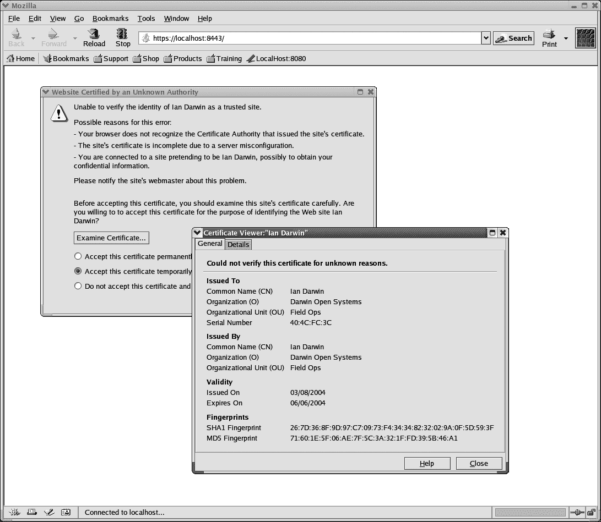
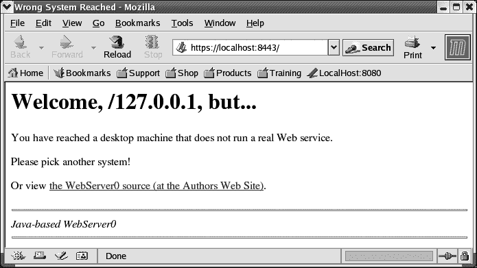

# 第十三章。Java 服务器端

# 13.0 引言

套接字构成几乎所有网络协议的基础。JDBC、RMI、CORBA、EJB，以及非 Java 的 RPC（远程过程调用）和 NFS（网络文件系统），所有这些都通过连接各种类型的套接字来实现。套接字连接可以在几乎任何语言中实现，不仅限于 Java：C、C++、Perl 和 Python 也很流行，还有许多其他可能性。任何一种语言编写的客户端或服务器都可以与用其他任何一种语言编写的对方通信。因此，即使最终使用了诸如 RMI、JDBC、CORBA 或 EJB 等高级服务，快速了解 `ServerSocket` 的行为也是值得的。

讨论首先关注 `ServerSocket` 本身，然后介绍了多种方式在套接字上写入数据。最后，我展示了一个完整的可用网络服务器的实现示例，这是前一章中客户端的聊天服务器的实现。

###### 提示

大多数服务器端 Java 生产工作使用 Java Enterprise Edition（Java EE），最近从 Oracle 转移到 Eclipse Software Foundation 并更名为 Jakarta，但广泛使用其先前的名称（偶尔也使用其非常古老的名称“J2EE”，该名称已于 2005 年停用）。Java EE 提供可扩展性和支持构建良构化的多层分布式应用程序。EE 提供 Servlet 框架；Servlet 是可以安装到任何标准 Java EE Web 服务器中的策略对象。EE 还提供两种 Web 视图技术：原始的 JSP（JavaServer Pages）和较新的基于组件的 JSF（JavaServer Faces）。最后，EE 还提供许多其他基于网络的服务，包括 EJB3 远程访问和 Java Messaging Service（JMS）。这些内容超出了本书的范围；它们在其他书籍中有所涵盖，例如 Arun Gupta 的 *[Java EE 7 Essentials: Enterprise Developer Handbook](http://shop.oreilly.com/product/0636920030614.do)*。本章仅适用于那些需要或希望从头开始构建自己服务器的人。

# 13.1 开启一个用于业务的服务器套接字

## 问题

需要编写基于套接字的服务器。

## 解决方案

为给定的端口号创建 `ServerSocket`。

## 讨论

`ServerSocket` 表示连接的另一端，即等待客户端连接的服务器。你只需用端口号构造一个 `ServerSocket`。¹ 由于它不需要连接到另一台主机，所以不像客户端套接字构造函数那样需要特定主机的地址。

假设`ServerSocket`构造函数不会抛出异常，您就可以开始工作了。您的下一步是等待客户端活动，这可以通过调用`accept()`来实现。此调用将阻塞，直到客户端连接到您的服务器；此时，`accept()`将向您返回一个`Socket`对象（而不是`ServerSocket`），该对象在客户端的`ServerSocket`对象（或其等价对象，如果用另一种语言编写）中双向连接。示例 13-1 展示了基于套接字的服务器的代码。

##### 示例 13-1\. main/src/main/java/network/Listen.java

```java
public class Listen {
    /** The TCP port for the service. */
    public static final short PORT = 9999;

    public static void main(String[] argv) throws IOException {
        ServerSocket sock;
        Socket  clientSock;
        try {
            sock = new ServerSocket(PORT);
            while ((clientSock = sock.accept()) != null) {

                // Process it, usually on a separate thread
                // to avoid blocking the accept() call.
                process(clientSock);
            }

        } catch (IOException e) {
            System.err.println(e);
        }
    }

    /** This would do something with one client. */
    static void process(Socket s) throws IOException {
        System.out.println("Accept from client " + s.getInetAddress());
        // The conversation would be here.
        s.close();
    }
}
```

通常，您会在读取和写入时使用相同的套接字，如下几个示例所示。

您可能只想侦听特定的网络接口。尽管我们倾向于将网络地址视为计算机地址，但两者并不相同。网络地址实际上是给定计算设备上的特定网络卡或网络接口连接的地址。台式计算机、笔记本电脑、平板电脑或手机可能只有一个接口，因此只有一个网络地址。但是大型服务器可能有两个或更多接口，通常当它连接到多个网络时。网络路由器是一个盒子，可以是专用用途的（例如 Cisco 路由器），也可以是通用用途的（例如 Unix 主机），它在多个网络上都有接口，并且具有转发数据包的能力和管理权限。在这样的服务器上运行的程序可能希望仅向其内部网络或外部网络提供服务。通过指定要侦听的网络接口，可以实现这一目标。假设您希望为内部网提供与外部客户不同的网页视图。出于安全原因，您可能不会在同一台机器上运行这两种服务。但是如果您希望这样做，可以通过将网络接口地址作为参数提供给`ServerSocket`构造函数来实现。

然而，要使用构造函数的这种形式，您不能像客户端套接字那样使用字符串作为网络地址的名称；您必须将其转换为`InetAddress`对象。您还必须提供一个 backlog 参数，这是在客户端被告知您的服务器太忙之前可以排队等待接受的连接数。完整的设置如示例 13-2 所示。

##### 示例 13-2\. main/src/main/java/network/ListenInside.java

```java
public class ListenInside {
    /** The TCP port for the service. */
    public static final short PORT = 9999;
    /** The name of the network interface. */
    public static final String INSIDE_HOST = "acmewidgets-inside";
    /** The number of clients allowed to queue */
    public static final int BACKLOG = 10;

    public static void main(String[] argv) throws IOException {
        ServerSocket sock;
        Socket  clientSock;
        try {
            sock = new ServerSocket(PORT, BACKLOG,
                InetAddress.getByName(INSIDE_HOST));
            while ((clientSock = sock.accept()) != null) {

                // Process it.
                process(clientSock);
            }

        } catch (IOException e) {
            System.err.println(e);
        }
    }

    /** Hold server's conversation with one client. */
    static void process(Socket s) throws IOException {
        System.out.println("Connected from  " + INSIDE_HOST +
            ": " + s.getInetAddress(  ));
        // The conversation would be here.
        s.close();
    }
}
```

`InetAddress.getByName()`以系统相关的方式查找给定主机名，在*/etc*或*\windows*目录下的配置文件中，或者通过诸如域名系统这样的解析器来引用。如果需要修改此数据，请参考有关网络和系统管理的好书。

# 13.2 查找网络接口

## 问题

您希望了解计算机的网络安排。

## 解决方案

使用`NetworkInterface`类。

## 讨论

网络中的每台计算机都有一个或多个“网络接口”。在典型的台式机上，网络接口代表网络卡或网络端口，或者某些软件网络接口，如环回接口。每个接口都有一个操作系统定义的名称。在大多数 Unix 版本中，这些设备有一个两个或三个字符的设备驱动程序名称加上一个数字（从 0 开始），例如，`eth0`或`en0`表示第一台以太网设备，系统隐藏了卡片制造商的细节；或者`de0`和`de1`表示第一和第二个基于 Digital Equipment 的 DC21x4x 以太网卡，`xl0`表示 3Com EtherLink XL，等等。环回接口在所有类 Unix 平台上几乎都是`lo0`。

那又怎样？大多数情况下这对你来说无关紧要。如果你只有一个网络连接，比如与 ISP 的电缆连接，你真的不在乎。这在服务器上很重要，例如你可能需要找到特定网络的地址。`NetworkInterface`类允许你找到。它具有用于列出接口的静态方法和用于查找与给定接口关联的地址的其他方法。示例 Example 13-3 中的程序展示了使用此类的一些示例。运行它会打印所有本地接口的名称。如果你恰好在名为*laptop*的计算机上，它会打印机器的网络地址；如果不是，你可能想要从命令行接受本地计算机的名称；这留给读者作为练习。

##### 示例 13-3\. main/src/main/java/network/NetworkInterfaceDemo.java

```java
public class NetworkInterfaceDemo {
    public static void main(String[] a) throws IOException {
        Enumeration<NetworkInterface> list =
            NetworkInterface.getNetworkInterfaces();
        while (list.hasMoreElements()) {
            // Get one NetworkInterface
            NetworkInterface iface = list.nextElement();
            // Print its name
            System.out.println(iface.getDisplayName());
            Enumeration<InetAddress> addrs = iface.getInetAddresses();
            // And its address(es)
            while (addrs.hasMoreElements()) {
                InetAddress addr = addrs.nextElement();
                System.out.println(addr);
            }

        }
        // Try to get the Interface for a given local (this machine's) address
        InetAddress destAddr = InetAddress.getByName("laptop");
        try {
            NetworkInterface dest = NetworkInterface.getByInetAddress(destAddr);
            System.out.println("Address for " + destAddr + " is " + dest);
        } catch (SocketException ex) {
            System.err.println("Couldn't get address for " + destAddr);
        }
    }
}
```

# 13.3 返回响应（字符串或二进制）

## 问题

你需要向客户端写入字符串或二进制数据。

## 解决方案

套接字提供了一个`InputStream`和一个`OutputStream`。使用它们。

## 讨论

上一章中的客户端套接字示例调用了`getInputStream()`和`getOutputStream()`方法。这些示例也一样。主要区别在于，这些示例从`ServerSocket`的`accept()`方法中获取套接字。另一个区别是，按照定义，通常是服务器创建或修改数据并将其发送到客户端。Example 13-4 是一个简单的`Echo`服务器，Recipe 12.5 中的`Echo`客户端可以连接到它。此服务器处理一个完整的客户端连接，然后返回并等待下一个客户端的`accept()`。

##### 示例 13-4\. main/src/main/java/network/EchoServer.java

```java
public class EchoServer {
    /** Our server-side rendezvous socket */
    protected ServerSocket sock;
    /** The port number to use by default */
    public final static int ECHOPORT = 7;
    /** Flag to control debugging */
    protected boolean debug = true;

    /** main: construct and run */
    public static void main(String[] args) {
        int p = ECHOPORT;
        if (args.length == 1) {
            try {
                p = Integer.parseInt(args[0]);
            } catch (NumberFormatException e) {
                System.err.println("Usage: EchoServer [port#]");
                System.exit(1);
            }
        }
        new EchoServer(p).handle();
    }

    /** Construct an EchoServer on the given port number */
    public EchoServer(int port) {
        try {
            sock = new ServerSocket(port);
        } catch (IOException e) {
            System.err.println("I/O error in setup");
            System.err.println(e);
            System.exit(1);
        }
    }

    /** This handles the connections */
    protected void handle() {
        Socket ios = null;
        while (true) {
            try {
                System.out.println("Waiting for client...");
                ios = sock.accept();
                System.err.println("Accepted from " +
                    ios.getInetAddress().getHostName());
                try (BufferedReader is = new BufferedReader(
                            new InputStreamReader(ios.getInputStream(), "8859_1"));
                        PrintWriter os = new PrintWriter(
                            new OutputStreamWriter(ios.getOutputStream(), "8859_1"),
                            true);) {
                    String echoLine;
                    while ((echoLine = is.readLine()) != null) {
                        System.err.println("Read " + echoLine);
                        os.print(echoLine + "\r\n");
                        os.flush();
                        System.err.println("Wrote " + echoLine);
                    }
                    System.err.println("All done!");
                }
            } catch (IOException e) {
                System.err.println(e);
            }
        }
        /* NOTREACHED */
    }
}
```

为了在任意网络连接上发送字符串，一些权威建议同时发送回车和换行字符；许多协议规范要求如此做。这就解释了代码中的`\r\n`。如果另一端是 DOS 程序或类似 Telnet 的程序，可能期望同时接收这两个字符。另一方面，如果你同时编写两端，可以简单地使用`println()`——在读取之前始终紧接着显式地使用`flush()`，以防止出现一端的数据仍在`PrintWriter`缓冲区中导致死锁的情况！

如果需要处理二进制数据，请使用`java.io`中的数据流而不是读取器/写入器。我需要一个服务器用于食谱 12.6 的`DaytimeBinary`程序。在操作中，它应该如下所示：

```java
C:\javasrc\network>java network.DaytimeBinary
Remote time is 3161316799
BASE_DIFF is 2208988800
Time diff == 952284799
Time on localhost is Sun Mar 08 19:33:19 GMT 2014

C:\javasrc\network>time/t
Current time is  7:33:23.84p

C:\javasrc\network>date/t
Current date is Sun 03-08-2014

C:\javasrc\network>
```

嗯，我的武器库中正好有这样一个程序，所以我在示例 13-5 中呈现它。请注意，它直接使用了客户端类中定义的某些公共常量。通常这些常量在服务器类中定义并由客户端使用，但我想先呈现客户端代码。

##### 示例 13-5\. main/src/main/java/network/DaytimeServer.java

```java
public class DaytimeServer {
    /** Our server-side rendezvous socket */
    ServerSocket sock;
    /** The port number to use by default */
    public final static int PORT = 37;

    /** main: construct and run */
    public static void main(String[] argv) {
        new DaytimeServer(PORT).runService();
    }

    /** Construct a DaytimeServer on the given port number */
    public DaytimeServer(int port) {
        try {
            sock = new ServerSocket(port);
        } catch (IOException e) {
            System.err.println("I/O error in setup\n" + e);
            System.exit(1);
        }
    }

    /** This handles the connections */
    protected void runService() {
        Socket ios = null;
        DataOutputStream os = null;
        while (true) {
            try {
                System.out.println("Waiting for connection on port " + PORT);
                ios = sock.accept();
                System.err.println("Accepted from " +
                    ios.getInetAddress().getHostName());
                os = new DataOutputStream(ios.getOutputStream());
                long time = System.currentTimeMillis();

                time /= 1000;    // Daytime Protocol is in seconds

                // Convert to Java time base.
                time += RDateClient.BASE_DIFF;

                // Write it, truncating cast to int since it is using
                // the Internet Daytime protocol which uses 4 bytes.
                // This will fail in the year 2038, along with all
                // 32-bit timekeeping systems based from 1970.
                // Remember, you read about the Y2038 crisis here first!
                os.writeInt((int)time);
                os.close();
            } catch (IOException e) {
                System.err.println(e);
            }
        }
    }
}
```

# 13.4 在网络连接中返回对象信息

## 问题

你需要通过网络连接返回一个对象。

## 解决方案

创建所需的对象，并使用套接字输出流顶部的`ObjectOutputStream`将其写入。

## 讨论

前一章节中示例 12-7 的程序读取一个`Date`对象，使用`ObjectInputStream`。示例 13-6，`DaytimeObjectServer`（该过程的另一端），是一个每次连接时构造一个`Date`对象并返回给客户端的程序。

##### 示例 13-6\. main/src/main/java/network/DaytimeObjectServer.java

```java
public class DaytimeObjectServer {
    /** The TCP port for the object time service. */
    public static final short TIME_PORT = 1951;

    public static void main(String[] argv) {
        ServerSocket sock;
        Socket  clientSock;
        try {
            sock = new ServerSocket(TIME_PORT);
            while ((clientSock = sock.accept()) != null) {
                System.out.println("Accept from " +
                    clientSock.getInetAddress());
                ObjectOutputStream os = new ObjectOutputStream(
                    clientSock.getOutputStream());

                // Construct and write the Object
                os.writeObject(LocalDateTime.now());

                os.close();
            }

        } catch (IOException e) {
            System.err.println(e);
        }
    }
}
```

# 13.5 处理多个客户端

## 问题

你的服务器需要处理多个客户端。

## 解决方案

对每个使用一个线程。

## 讨论

在 C 语言世界中，有几种机制允许服务器处理多个客户端。其中一种是使用特殊的系统调用`select()`或`poll()`，它通知服务器哪些文件/套接字描述符准备好读取、准备好写入或有错误。通过在这个列表中包括它的约会套接字（相当于我们的`ServerSocket`），基于 C 的服务器可以按任何顺序从多个客户端读取。Java 不提供这个调用，因为它在某些 Java 平台上不容易实现。相反，Java 使用通用的`Thread`机制，如第十六章所述（线程现在在许多编程语言中很常见，尽管不总是以这个名称）。每当代码从`ServerSocket`接受新连接时，它立即构造并启动一个新的线程对象来处理该客户端。³

实现在套接字上接受的 Java 代码非常简单，除了必须捕获 `IOException` 外：

```java
/** Run the main loop of the Server. */
void runServer( ) {
    while (true) {
        try {
            Socket clntSock = sock.accept( );
            new Handler(clntSock).start( );
        } catch(IOException e) {
            System.err.println(e);
        }
    }
}
```

要使用线程，你必须要么继承 `Thread` 类，要么实现 `Runnable` 接口。为了使这段代码按照原样运行，`Handler` 类必须是 `Thread` 的子类；如果 `Handler` 实现了 `Runnable` 接口，那么代码将会把 `Runnable` 的实例传递给 `Thread` 的构造函数，就像这样：

```java
Thread t = new Thread(new Handler(clntSock));
t.start( );
```

但按照原样，`Handler` 是使用 `accept()` 返回的普通套接字构造的，并且通常调用套接字的 `getInputStream()` 和 `getOutputStream()` 方法，以正常方式进行通信。我将展示一个完整的实现，一个多线程回显客户端。首先，一个显示其使用情况的会话：

```java
$ java network.EchoServerThreaded
EchoServerThreaded ready for connections.
Socket starting: Socket[addr=localhost/127.0.0.1,port=2117,localport=7]
Socket starting: Socket[addr=darian/192.168.1.50,port=13386,localport=7]
Socket starting: Socket[addr=darian/192.168.1.50,port=22162,localport=7]
Socket ENDED: Socket[addr=darian/192.168.1.50,port=22162,localport=7]
Socket ENDED: Socket[addr=darian/192.168.1.50,port=13386,localport=7]
Socket ENDED: Socket[addr=localhost/127.0.0.1,port=2117,localport=7]
```

在这里，我使用我的 `EchoClient` 程序连接了一次服务器，并且在仍然连接的情况下，使用操作系统提供的 Telnet 客户端多次调用它。服务器同时与所有客户端通信，将第一个客户端的答复发送回给第一个客户端，将第二个客户端的数据发送回给第二个客户端。简而言之，它有效果。我在程序中使用文件结束符号结束了会话，并使用 Telnet 客户端的正常断开机制。示例 13-7 是服务器的代码。

##### 示例 13-7\. 主代码/src/main/java/network/EchoServerThreaded.java

```java
public class EchoServerThreaded {

    public static final int ECHOPORT = 7;

    public static void main(String[] av) {
        new EchoServerThreaded().runServer();
    }

    public void runServer() {
        ServerSocket sock;
        Socket clientSocket;

        try {
            sock = new ServerSocket(ECHOPORT);

            System.out.println("EchoServerThreaded ready for connections.");

            /* Wait for a connection */
            while (true) {
                clientSocket = sock.accept();
                /* Create a thread to do the communication, and start it */
                new Handler(clientSocket).start();
            }
        } catch (IOException e) {
            /* Crash the server if IO fails. Something bad has happened */
            System.err.println("Could not accept " + e);
            System.exit(1);
        }
    }

    /** A Thread subclass to handle one client conversation. */
    class Handler extends Thread {
        Socket sock;

        Handler(Socket s) {
            sock = s;
        }

        public void run() {
            System.out.println("Socket starting: " + sock);
            try (BufferedReader is = new BufferedReader(
                        new InputStreamReader(sock.getInputStream()));
                    PrintStream os = new PrintStream(
                        sock.getOutputStream(), true);) {
                String line;
                while ((line = is.readLine()) != null) {
                    os.print(line + "\r\n");
                    os.flush();
                }
                sock.close();
            } catch (IOException e) {
                System.out.println("IO Error on socket " + e);
                return;
            }
            System.out.println("Socket ENDED: " + sock);
        }
    }
}
```

大量的短交易可能会降低性能，因为每个客户端都会导致创建一个新的线程对象。如果你知道或者可以可靠地预测所需的并发度，另一种范例涉及预先创建固定数量的线程。但是你如何控制它们对`ServerSocket`的访问呢？查看`ServerSocket`类文档会发现`accept()`方法没有同步，这意味着任何数量的线程可以同时调用该方法。这可能会导致糟糕的事情发生。因此，我在此调用周围使用`synchronized`关键字来确保一次只有一个客户端在其中运行，因为它更新全局数据。当没有客户端连接时，你将会有一个（随机选择的）线程在`ServerSocket`对象的`accept()`方法中运行，等待连接，加上*n-1*个线程等待第一个线程从方法返回。一旦第一个线程成功接受连接，它就会离开并进行对话，释放其锁，以便另一个随机选择的线程被允许进入`accept()`方法。每个线程的`run()`方法都有一个从`accept()`开始的无限循环，然后进行对话。结果是客户端连接可以更快地启动，但稍微增加了服务器启动时间。这样做还可以避免每次请求到来时构造一个新的`Handler`或`Thread`对象的开销。这种一般方法类似于流行的 Apache Web 服务器所做的，尽管它通常会创建一组相同的进程（而不是线程）来处理客户端连接。因此，我已经修改了示例 13-7 中显示的`EchoServerThreaded`类，使其以这种方式工作，你可以在示例 13-8 中看到。

##### 示例 13-8\. main/src/main/java/network/EchoServerThreaded2.java

```java
public class EchoServerThreaded2 {

    public static final int ECHOPORT = 7;

    public static final int NUM_THREADS = 4;

    /** Main method, to start the servers. */
    public static void main(String[] av) {
        new EchoServerThreaded2(ECHOPORT, NUM_THREADS);
    }

    /** Constructor */
    public EchoServerThreaded2(int port, int numThreads) {
        ServerSocket servSock;

        try {
            servSock = new ServerSocket(port);

        } catch (IOException e) {
            /* Crash the server if IO fails. Something bad has happened */
            throw new RuntimeException("Could not create ServerSocket ", e);
        }

        // Create a series of threads and start them.
        for (int i = 0; i < numThreads; i++) {
            new Handler(servSock, i).start();
        }
    }

    /** A Thread subclass to handle one client conversation. */
    class Handler extends Thread {
        ServerSocket servSock;
        int threadNumber;

        /** Construct a Handler. */
        Handler(ServerSocket s, int i) {
            servSock = s;
            threadNumber = i;
            setName("Thread " + threadNumber);
        }

        public void run() {
            /*
 * Wait for a connection. Synchronized on the ServerSocket while
 * calling its accept() method.
 */
            while (true) {
                try {
                    System.out.println(getName() + " waiting");

                    Socket clientSocket;
                    // Wait here for the next connection.
                    synchronized (servSock) {
                        clientSocket = servSock.accept();
                    }
                    System.out.println(
                        getName() + " starting, IP=" +
                        clientSocket.getInetAddress());
                    try (BufferedReader is = new BufferedReader(
                            new InputStreamReader(clientSocket.getInputStream()));
                            PrintStream os = new PrintStream(
                                clientSocket.getOutputStream(), true);) {
                        String line;
                        while ((line = is.readLine()) != null) {
                            os.print(line + "\r\n");
                            os.flush();
                        }
                        System.out.println(getName() + " ENDED ");
                        clientSocket.close();
                    }
                } catch (IOException ex) {
                    System.out.println(getName() + ": IO Error on socket " + ex);
                    return;
                }
            }
        }
    }
}
```

用 NIO 实现这种服务器是完全可能的，这是“新的”（在 J2SE 1.4 时）I/O 包。然而，要做到这一点的代码超过了本章的任何内容，并且充满了问题。有几篇关于如何利用 NIO 管理服务器连接获得性能提升的好教程可以在互联网上找到。

# 13.6 提供 HTTP 协议

## 问题

你想要提供像 HTTP 这样的协议。

## 解决方案

创建一个`ServerSocket`，并编写一些能够使用特定协议的代码。或者更好的是，使用一个 Java 驱动的 Web 服务器，比如 Apache Tomcat 或 Java 企业版（Java EE）服务器，比如 JBoss WildFly。

## 讨论

你可以为非常简单的应用程序实现自己的 HTTP 协议服务器，我们将在这里做到这一点。对于任何严肃的开发，你都想要使用 Java 企业版；请参阅本章开头的说明。

这个例子只是构造了一个`ServerSocket`并侦听它。当连接进来时，它们会使用 HTTP 协议进行回复。因此，它比简单的`Echo`服务器更复杂，后者在 Recipe 13.3 中有所介绍。然而，这不是一个完整的 Web 服务器；请求中的文件名被忽略，并且总是返回标准消息。因此，这是一个非常简单的 Web 服务器；它只遵循发送响应所需的 HTTP 协议的最低要求。要获取用 Java 编写的真正的 Web 服务器，请从[Apache Tomcat 网站](http://tomcat.apache.org)或任何 Jakarta/JavaEE 应用服务器中获取 Tomcat。然而，Example 13-9 中显示的代码足以理解如何构建一个使用协议响应请求的简单服务器。

##### 示例 13-9\. main/src/main/java/network/WebServer0.java

```java
public class WebServer0 {
    public static final int HTTP = 80;
    public static final String CRLF = "\r\n";
    ServerSocket s;
    /** A link to the source of this program, used in error message */
    static final String VIEW_SOURCE_URL =
    "https://github.com/IanDarwin/javasrc/tree/master/main/src/main/
 java/network";

    /**
 * Main method, just creates a server and call its runServer().
 */
    public static void main(String[] args) throws Exception {
        System.out.println("DarwinSys JavaWeb Server 0.0 starting...");
        WebServer0 w = new WebServer0();
        int port = HTTP;
        if (args.length == 1) {
            port = Integer.parseInt(args[0]);
            }
        w.runServer(port);        // never returns!!
    }

    /** Get the actual ServerSocket; deferred until after Constructor
 * so subclass can mess with ServerSocketFactory (e.g., to do SSL).
 * @param port The port number to listen on
 */
    protected ServerSocket getServerSocket(int port) throws Exception {
        return new ServerSocket(port);
    }

    /** RunServer accepts connections and passes each one to handler. */
    public void runServer(int port) throws Exception {
        s = getServerSocket(port);
        while (true) {
            try {
                Socket us = s.accept();
                Handler(us);
            } catch(IOException e) {
                System.err.println(e);
                return;
            }

        }
    }

    /** Handler() handles one conversation with a Web client.
 * This is the only part of the program that "knows" HTTP.
 */
    public void Handler(Socket s) {
        BufferedReader is;    // inputStream, from Viewer
        PrintWriter os;        // outputStream, to Viewer
        String request;        // what Viewer sends us.
        try {
            String from = s.getInetAddress().toString();
            System.out.println("Accepted connection from " + from);
            is = new BufferedReader(new InputStreamReader(s.getInputStream()));
            request = is.readLine();
            System.out.println("Request: " + request);

            os = new PrintWriter(s.getOutputStream(), true);
            os.print("HTTP/1.0 200 Here is your data" + CRLF);
            os.print("Content-type: text/html" + CRLF);
            os.print("Server-name: DarwinSys NULL Java WebServer 0" + CRLF);
            String reply1 = "<html><head>" +
                "<title>Wrong System Reached</title></head>\n" +
                "<h1>Welcome, ";
            String reply2 = ", but...</h1>\n" +
                "<p>You have reached a desktop machine " +
                "that does not run a real Web service.\n" +
                "<p>Please pick another system!</p>\n" +
                "<p>Or view <a href=\"" + VIEW_SOURCE_URL + "\">" +
                "the WebServer0 source on github</a>.</p>\n" +
                "<hr/><em>Java-based WebServer0</em><hr/>\n" +
                "</html>\n";
            os.print("Content-length: " +
                (reply1.length() + from.length() + reply2.length()) + CRLF);
            os.print(CRLF);
            os.print(reply1 + from + reply2 + CRLF);
            os.flush();
            s.close();
        } catch (IOException e) {
            System.out.println("IOException " + e);
        }
        return;
    }
}
```

# 13.7 使用 SSL 和 JSSE 保护 Web 服务器

## 问题

当数据在传输过程中，你希望保护网络流量免受窥视或恶意修改。

## 解决方案

使用 Java 安全套接字扩展 JSSE 加密你的流量。

## 讨论

JSSE 提供多个级别的服务，但最简单的使用方式是从`SSLServerSocketFactory`获取`ServerSocket`，而不是直接使用`ServerSocket`构造函数。SSL 即安全套接字层，其修订版被称为 TLS。它专门用于网络安全。要保护其他协议，你必须使用不同形式的`SocketFactory`。

`SSLServerSocketFactory`返回一个设置为进行 SSL 加密的`ServerSocket`。Example 13-10 使用这种技术覆盖了 Recipe 13.6 中的`getServerSocket()`方法。如果你认为这太容易了，那你就错了！

##### 示例 13-10\. main/src/main/java/network/JSSEWebServer0

```java
/**
 * JSSEWebServer - subclass trivial WebServer0 to make it use SSL.
 * N.B. You MUST have set up a server certificate (see the
 * accompanying book text), or you will get the dreaded
 * javax.net.ssl.SSLHandshakeException: no cipher suites in common
 * (because without it JSSE can't use any of its built-in ciphers!).
 */
public class JSSEWebServer0 extends WebServer0 {

    public static final int HTTPS = 8443;

    public static void main(String[] args) throws Exception {
        if (System.getProperty("javax.net.ssl.keyStore") == null) {
            System.err.println(
                "You must pass in a keystore via -D; see the documentation!");
            System.exit(1);
        }
        System.out.println("DarwinSys JSSE Server 0.0 starting...");
        JSSEWebServer0 w = new JSSEWebServer0();
        w.runServer(HTTPS);        // never returns!!
    }

    /** Get an HTTPS ServerSocket using JSSE.
 * @see WebServer0#getServerSocket(int)
 * @throws ClassNotFoundException the SecurityProvider can't be instantiated.
 */
    protected ServerSocket getServerSocket(int port) throws Exception {

        SSLServerSocketFactory ssf =
            (SSLServerSocketFactory)SSLServerSocketFactory.getDefault();

        return ssf.createServerSocket(port);
    }

}
```

这确实是你需要编写的所有 Java 代码。你必须设置 SSL 证书。为了演示目的，可以使用自签名证书；[`darwinsys.com/java/selfsigncert.html`](https://darwinsys.com/java/selfsigncert.html) 中的步骤（步骤 1–4）足以满足要求。你必须告诉 JSSE 层在哪里找到你的密钥库：

```java
java -Djavax.net.ssl.keyStore=/home/ian/.keystore -Djavax.net.ssl.
keyStorePassword=secrit JSSEWebServer0
```

典型的客户端浏览器对自签名证书感到怀疑（见 Figure 13-1），但如果用户确认，将接受该证书。

Figure 13-2 显示了简单的`WebServer0`在 HTTPS 协议下的输出（请注意右下角的挂锁）。



###### 图 13-1\. 浏览器注意事项



###### 图 13-2\. 使用加密

## 参见

JSSE 不仅可以加密 Web 服务器流量，而且有时被视为其最激动人心的应用程序。有关 JSSE 的更多信息，请参见[Sun 网站](http://java.sun.com/products/jsse)或*《Java 安全》*（由 Scott Oaks 编写，O’Reilly 出版）。

# 13.8 使用 JAX-RS 创建 REST 服务

## 问题

您想要通过使用提供的 Java EE/Jakarta EE API 来实现一个 RESTful 服务器。

## 解决方案

在提供服务的类上使用 JAX-RS 注解，并将其安装在企业应用服务器中。

## 讨论

该操作包括编码和配置两部分。

编码步骤包括创建一个扩展 JAX-RS `Application`类的类，并在提供服务的类上添加注解。

这是一个最小化的`Application`类示例：

```java
import javax.ws.rs.ApplicationPath;
import javax.ws.rs.core.Application;

@ApplicationPath("")
public class RestApplication extends Application {
	// Empty
}
```

示例 13-11 是一个类似“Hello, World”的服务类，带有使其成为服务类以及具有三个示例方法所需的注解。

##### 示例 13-11\. restdemo/src/main/java/rest/RestService.java

```java
@Path("")
@ApplicationScoped
public class RestService {

    public RestService() {
        System.out.println("RestService.init()");
    }

    @GET @Path("/timestamp")
    @Produces(MediaType.TEXT_PLAIN)
    public String getDate() {
        return LocalDateTime.now().toString();
    }

    /** A Hello message method
 */
    @GET @Path("/greeting/{userName}")
    @Produces("text/html")
    public String doGreeting(@PathParam("userName")String userName) {
        System.out.println("RestService.greeting()");
        if (userName == null || userName.trim().length() <= 3) {
            return "Missing or too-short username";
        }
        return String.format(
            "<h1>Welcome %s</h1><p>%s, We are glad to see you back!",
            userName, userName);
    }

    /** Used to download all items */
    @GET @Path("/names")
    @Produces(MediaType.APPLICATION_JSON)
    public List<String> findTasksForUser() {
        return List.of("Robin", "Jedunkat", "Lyn", "Glen");
    }
}
```

现在必须部署该类。如果我们已经创建了适当的 Maven 项目结构（参见 Recipe 1.7）并提供了特定于应用服务器的 Maven 插件，并且我们的开发服务器正在运行，则可以使用类似`mvn deploy`的变体。在这种情况下，我已经为在 WildFly 上部署设置了这个，在*rest*子目录下，只需执行`mvn wildfly:deploy`即可编译、打包并部署应用程序到我的服务器。

如果要基于 Eclipse MicroProfile 部署 REST 服务作为微服务，您可能希望研究[Quarkus 框架](https://quarkus.io)。

一旦服务部署完成，您可以使用浏览器或简单的 GET 请求的 Telnet 客户端进行交互探索：

```java
$ telnet localhost 8080 # output cleaned up
Escape character is '^]'.
GET /rest/timestamp HTTP/1.0
Connection: keep-alive

HTTP/1.1 200 OK
Content-Type: text/plain;charset=UTF-8

2019-10-16T19:54:31.42

GET /rest/greeting/Ian%20Darwin HTTP/1.0

HTTP/1.1 200 OK
Content-Type: text/html;charset=UTF-8

<h1>Welcome Ian Darwin</h1><p>Ian Darwin, We are glad to see you back!

get /rest/names HTTP/1.0
Accept: Application/JSON

HTTP/1.1 200 OK
Content-Type: application/json

["Robin","Jedunkat","Lyn","Glen"]
^] (CTRL/C)
$
```

REST 的一个问题是缺乏官方标准来文档化服务器提供的 API 或协议（存在几个竞争的规范）。因此，编写客户端的人必须依赖服务器开发者提供的纯文档，或者通过试验发现协议。我们这里的例子足够简单，不会遇到这个问题，但想象一下一个类中有 20 或 30 个方法的情况。

Spring 框架提供了一个与此处使用的 JAX-RS API 非常相似的 API；如果您已经在使用 Spring，可能更简单使用它们的注解。

# 13.9 网络日志记录

## 问题

您的类正在服务器容器中运行，其调试输出难以获得。

## 解决方案

使用像 Java Logging API (JUL)、Apache Logging Services 项目的`Log4j`或这里展示的简单网络日志记录器。

## 讨论

在大多数操作系统上，从桌面客户端获取调试输出相当容易。 但是，如果要调试的程序正在像 Servlet 引擎或 EJB 服务器这样的容器中运行，那么获取调试输出可能会很困难，特别是如果容器在远程计算机上运行。 如果您的程序可以将消息发送回桌面机器上的程序以进行即时显示，那将非常方便。 不用说，使用 Java 的套接字机制做到这一点并不难。

许多日志 API 可以处理此问题：

+   多年来，Java 一直拥有一个标准的日志 API JUL（在 Recipe 13.12 中讨论），它可以与包括 Unix `syslog`在内的各种日志机制通信。

+   Apache Logging Services 项目生成`Log4j`，用于许多需要日志记录的开源项目（请参阅 Recipe 13.11）。

+   [Apache Jakart Commons Logging (JCL)](http://commons.apache.org/proper/commons-logging)。 这里没有讨论； 与其他日志 API 类似。

+   SLF4J（Java 的简单日志门面，参见 Recipe 13.10）是最新的门面，可以使用其他日志 API。

+   并且，在这些广泛使用之前，我编写了一个小而简单的 API 来处理此类日志记录功能。 我的`netlog`在这里没有讨论，因为最好使用标准的日志机制之一； 如果您想挖掘它，它的代码在* javasrc * repo 的* logging *子目录中。

JDK 日志 API，`Log4j`和`SFL4J`更加完整，可以写入文件； 一个`OutputStream`或`Writer`； 或远程`Log4j`，Unix `syslog`或 Windows 事件日志服务器。

从日志 API 的角度来看，正在调试的程序是客户端——即使它可能在类似 Web 服务器或应用服务器的服务器端容器中运行——因为网络客户端是发起连接的程序。 在您的桌面计算机上运行的程序是套接字的“服务器”程序，因为它等待连接的到来。

如果您希望运行任何可以从任何公共网络访问的基于网络的日志记录器，则需要更加注意安全问题。 一种常见的攻击形式是简单的拒绝服务（DoS），在此期间，攻击者会向您的服务器发起大量连接以减慢其速度。 例如，如果您正在将日志写入磁盘，攻击者可以通过发送大量垃圾邮件填满您的磁盘。 在常见用法中，您的日志监听器将位于防火墙后面，不可从外部访问； 但如果不是这种情况，请注意 DoS 攻击。

# 13.10 设置 SLF4J

## 问题

您希望使用一个日志 API，可以使用任何其他日志 API，例如，这样您的代码可以在其他项目中使用，而无需切换日志 API。

## 解决方案

使用 SLF4J：从`LoggerFactory`获取`Logger`，并使用其各种方法进行日志记录。

## 讨论

使用 SLF4J 仅需要一个 JAR 文件进行编译，*slf4j-api-1.x.y.jar*（其中 *x* 和 *y* 将随时间变化）。要实际获得日志输出，您需要将多个实现 JAR 添加到运行时 `CLASSPATH`，其中最简单的是 *slf4j-simple-1.x.y.jar*（其中 *x* 和 *y* 应该在这两个文件之间匹配）。

一旦将这些 JAR 文件添加到构建脚本或您的 `CLASSPATH` 上，您可以通过调用 `LoggerFactory.getLogger()` 来获取 `Logger`，传递类或包的字符串名称或当前 `Class` 引用。然后调用记录器的记录方法。一个简单的示例在 Example 13-12 中。

##### 示例 13-12\. main/src/main/java/logging/Slf4jDemo.java

```java
public class Slf4jDemo {

    final static Logger theLogger =
            LoggerFactory.getLogger(Slf4jDemo.class);

    public static void main(String[] args) {

        Object o = new Object();
        theLogger.info("I created this object: " + o);

    }
}
```

有各种方法用于记录不同严重程度的信息，这些方法显示在 Table 13-1 中。

Table 13-1\. SLF4j 记录方法

| 名称 | 含义 |
| --- | --- |
| trace | 冗长的调试信息（默认禁用） |
| debug | 冗长的调试信息 |
| info | 低级别信息消息 |
| warn | 可能的错误 |
| error | 严重错误 |

SLF4j 相对于大多数其他日志记录 API 的优势之一是避免了死字符串反模式。在使用许多其他记录器 API 时，您可能会发现以下代码：

```java
logger.log("The value is " + object + "; this is not good");
```

这可能会导致性能问题，因为隐式调用了对象的 `toString()`，并且执行了两次字符串连接，甚至在我们知道日志记录器是否要使用它们之前！如果这是重复调用的代码，可能会浪费大量开销。

这导致其他日志包提供了代码保护功能，基于能够非常快速地查找日志记录器是否启用的记录器方法，导致出现以下代码：

```java
if (logger.isEnabled()) {
	logger.log("The value is " + object + "; this is not good");
}
```

这解决了性能问题，但使代码混乱！SLF4J 的解决方案是使用类似于（但不完全兼容）Java 的 `MessageFormat` 机制，如 Example 13-13 中所示。

##### 示例 13-13\. main/src/main/java/logging/Slf4jDemo2.java

```java
public class Slf4jDemo2 {

    final static Logger theLogger = LoggerFactory.getLogger(Slf4jDemo2.class);

    public static void main(String[] args) {

        try {
            Person p = new Person();
            // populate person's fields here...
            theLogger.info("I created an object {}", p);

            if (p != null) {    // bogus, just to show logging
                throw new IllegalArgumentException("Just testing");
            }
        } catch (Exception ex) {
            theLogger.error("Caught Exception: " + ex, ex);
        }
    }
}
```

虽然这并不演示网络日志记录，但可以与 Log4j 或 JUL（Java Util Logging，JDK 的标准部分）等日志记录实现一起轻松实现，这些实现允许您提供可配置的日志记录。下一个配方中描述了 `Log4j`。

## 参见

SLF4J 网站包含一个[手册](http://www.slf4j.org/manual.html)，讨论了各种 `CLASSPATH` 选项。还有一些[ Maven artifact](http://mvnrepository.com/artifact/org.slf4j)提供了各种选项。

# 13.11 使用 Log4j 进行网络日志记录

## 问题

您希望使用 Log4j 写入日志文件消息。

## 解决方案

获取 `Logger` 并使用其 `log()` 方法或便利方法。通过更改属性文件来控制日志记录。使用 `org.apache.logging.log4j.net` 包使其基于网络。

## 讨论

###### 警告

本文档描述了 Log4j API 的第 2 版。在第 1 版和第 2 版之间，包名称、文件名以及用于获取日志记录器的方法都有所变化。如果您看到使用例如 `Logger.getLogger("class name")` 的代码，则该代码是针对旧 API 编写的，该 API 不再维护（Log4j 网站将 Log4j 1.2 及其 2.12 以下版本称为“遗留版本”；我们在本文档中使用的是 2.13 版本）。对于针对 1.x API 编写的代码，提供了相当大的兼容性；参见 [*https://logging.apache.org/log4j/2.x/manual/compatibility.html*](https://logging.apache.org/log4j/2.x/manual/compatibility.html)。

使用 Log4j 进行日志记录简单、方便且灵活。您需要从静态方法 `LogManager.getLogger()` 获取一个 `Logger` 对象，`Logger` 具有公共 void 方法（`debug()`、`info()`、`warn()`、`error()` 和 `fatal()`），每个方法接受一个要记录的 `Object`（和一个可选的 `Throwable`）。与 `System.out.println()` 类似，如果传入的不是 `String`，将调用其 `toString()` 方法。还包括一个通用的日志记录方法：

```java
public void log(Level level, Object message);
```

`Level` 类在 Log4j 2 API 中定义。标准级别依次为 `DEBUG` < `INFO` < `WARN` < `ERROR` < `FATAL`。即，调试消息被认为是最不重要的，而致命消息则是最重要的。每个 `Logger` 都有一个与其关联的级别；级别低于 `Logger` 的消息将被静默丢弃。

一个简单的应用程序可以使用以下几条语句记录消息：

```java
public class Log4JDemo {

    private static Logger myLogger = LogManager.getLogger();

    public static void main(String[] args) {

        Object o = new Object();
        myLogger.info("I created an object: " + o);

    }
}
```

如果您在没有 *log4j2.properties* 文件的情况下编译并运行此程序，则不会生成任何日志输出（请参阅源文件夹中的 *log4j2demos* 脚本）。我们需要创建一个默认名称为 *log4j2.properties* 的配置文件。您也可以通过系统属性提供日志文件名：`-Dlog4j​.configurationFile=URL`。

###### 提示

Log4j 配置非常灵活，因此也非常复杂。甚至他们自己的文档承认：“试图在不理解[日志架构]的情况下配置 Log4j 将导致沮丧。”查看此[Apache 网站，获取有关日志配置文件位置和格式的详细信息](https://logging.apache.org/log4j/2.x/manual/configuration.html)。

每个 `Logger` 都有一个 `Level` 来指定要写入的消息级别。它还将有一个 `Appender`，它是写出消息的代码。`ConsoleAppender` 当然写入到 `System.out`；其他记录器写入到文件、操作系统级别记录器等等。一个简单的配置文件看起来像这样：

```java
# Log4J2 properties file for the logger demo programs.
# tag::generic[] # Ensure file gets copied for Java Cookbook

# WARNING - log4j2.properties must be on your CLASSPATH,
# not necessarily in your source directory.

# The configuration file for Version 2 is different from V1!

rootLogger.level = info
rootLogger.appenderRef.stdout.ref = STDOUT

appender.console.type = Console
appender.console.name = STDOUT
appender.console.layout.type = PatternLayout
appender.console.layout.pattern = %m%n
appender.console.filter.threshold.type = ThresholdFilter
appender.console.filter.threshold.level = debug
```

此文件将根记录器的级别设置为`DEBUG`，这会导致它写入所有消息。配置文件还设置了一个名为`APPENDER1`的附加器，该附加器在接下来的几行上进行了配置。请注意，我不必引用`com.darwinsys Logger`。因为每个`Logger`都继承自根记录器，所以一个简单的应用程序只需要配置根记录器。属性文件也可以是 XML 文档，或者您可以编写自己的配置解析器（几乎没有人这样做）。

###### 警告

如果找不到日志配置文件，则默认的根记录器将根记录器默认为`Level.ERROR`，因此您将看不到`ERROR`级别以下的任何输出。

配置文件就位后，演示效果更好。运行此程序（使用脚本中所做的适当的`CLASSPATH`）会产生以下输出：

```java
$ java Log4j2Demo
I created an object: java.lang.Object@477b4cdf
$
```

日志记录的常见用法是记录捕获的`Exception`，如示例 13-14 所示。

##### 示例 13-14。main/src/main/java/Log4JDemo2.java（Log4j—捕获和记录）

```java
public class Log4JDemo2 {

    private static Logger myLogger = LogManager.getLogger();

    public static void main(String[] args) {

        try {
            Object o = new Object();
            myLogger.info("I created an object: " + o);
            if (o != null) {    // bogus, just to show logging
                throw new IllegalArgumentException("Just testing");
            }
        } catch (Exception ex) {
            myLogger.error("Caught Exception: " + ex, ex);
        }
    }
}
```

运行时，`Log4JDemo2`产生预期的输出：

```java
$ java Log4JDemo2
I created an object: java.lang.Object@477b4cdf
Caught Exception: java.lang.IllegalArgumentException: Just testing
java.lang.IllegalArgumentException: Just testing
	at logging.Log4JDemo2.main(Log4JDemo2.java:17) [classes/:?]
$
```

Log4j 2 的灵活性很大程度上来自于其使用外部配置文件；您可以在不重新编译应用程序的情况下启用或禁用日志记录。消除大部分日志记录的属性文件可能包含以下条目：

```java
rootLogger.level = fatal
```

只打印致命错误消息；所有比它低的级别都被忽略。

要从客户端记录到远程机器上的服务器，可以使用`SocketAppender`。还有一个`SmtpAppender`通过电子邮件发送紧急通知。有关所有受支持的附加器的详细信息，请参阅[*https://logging.apache.org/log4j/2.x/manual/appenders.html*](https://logging.apache.org/log4j/2.x/manual/appenders.html)。这是*log4j2-network.properties*，配置文件的基于套接字的网络版本：

```java
# Log4J2 properties file for the NETWORKED logger demo programs.
# tag::generic[] # Ensure file gets copied for Java Cookbook

# WARNING - log4j2.properties must be on your CLASSPATH,
# not necessarily in your source directory.

# The configuration file for Version 2 is different from V1!

rootLogger.level = info
rootLogger.appenderRef.stdout.ref = STDOUT

appender.console.type = Socket
appender.console.name = STDOUT
appender.console.host = localhost
appender.console.port = 6666
appender.console.layout.type = PatternLayout
appender.console.layout.pattern = %m%n
appender.console.filter.threshold.type = ThresholdFilter
appender.console.filter.threshold.level = debug
```

此文件通过`netdemos`脚本中的 Java 系统属性传递给演示程序：

```java
build=../../../../target/classes
log4j2_jar=\
${HOME}/.m2/repository/org/apache/logging/log4j/log4j-api/2.13.0/log4j-api-2.13.0.jar:\
${HOME}/.m2/repository/org/apache/logging/log4j/log4j-core/2.13.0/log4j-core-2.13.0.jar

echo "==> Log4JDemo"
java -Dlog4j.configurationFile=log4j2-network.properties \
	-classpath ".:${build}:${log4j2_jar}" logging.Log4JDemo

echo "==> Log4JDemo2"
java -Dlog4j.configurationFile=log4j2-network.properties \
	-classpath ".:${build}:${log4j2_jar}" logging.Log4JDemo2
```

运行时使用*log4j2-network.properties*文件，你需要在另一端安排一个监听器。在 Unix 系统上，`nc`（或`netcat`）程序可以正常工作：

```java
$ nc -kl 6666
I created an object: java.lang.Object@37ceb1df
I created an object: java.lang.Object@37ceb1df
Caught Exception: java.lang.IllegalArgumentException: Just testing
java.lang.IllegalArgumentException: Just testing
	at logging.Log4JDemo2.main(Log4JDemo2.java:17) [classes/:?]
^C
$
```

`Netcat`选项`-l`表示监听编号端口；`-k`告诉它继续监听，也就是说，当客户端关闭连接时重新打开连接，就像每个演示程序退出时一样发生的情况。

某些日志调用存在性能问题。考虑一些昂贵的操作，如`toString()`以及传递给经常使用的代码中的`Log.info()`的几个字符串连接。如果这些操作在更高的日志记录级别下进入生产环境，则将完成所有工作，但产生的字符串将永远不会被使用。在旧的 API 中，我们通常使用“代码保护”方法，如“isLoggerEnabled(Level)”来确定是否值得创建字符串。现在，首选的方法是在 Lambda 表达式中创建字符串（见第九章）。所有的日志方法都有一个接受`Supplier`参数的重载（示例 13-15](#javacook-network-SECT8-log4jlambda)）。

##### 示例 13-15\. main/src/main/java/logging/Log4J2Lambda.java

```java
public class Log4JLambda {

    private static Logger myLogger = LogManager.getLogger();

    public static void main(String[] args) {

        Person customer = getPerson();
        myLogger.info( () -> String.format(
            "Value %d from Customer %s", customer.value, customer) );

    }
```

这样，字符串操作仅在需要时执行：如果日志记录器以`INFO`级别运行，则调用`Supplier`，否则将不执行昂贵的操作。

当作为*log4j2demos*脚本的一部分运行时，会打印：

```java
Value 42 from Customer Customer[Robin]
```

有关 Log4j 的更多信息，请访问其[主网站](http://logging.apache.org/log4j)。Log4j 2 是 Apache 软件基金会许可下的免费软件。

# 13.12 使用 java.util.logging 进行网络日志记录

## 问题

你希望使用 Java 日志机制编写日志消息。

## 解决方案

获取一个`Logger`，并用它来记录您的消息和/或异常。

## 讨论

Java 日志 API（包`java.util.logging`）类似于并明显受到 Log4j 包的启发。通过使用描述性字符串调用静态`Logger.getLogger()`，可以获取`Logger`对象。然后，您可以使用实例方法写入日志；这些方法包括以下内容：

```java
public void log(java.util.logging.LogRecord);
public void log(java.util.logging.Level,String);
// and a variety of overloaded log(  ) methods
public void logp(java.util.logging.Level,String,String,String);
public void logrb(java.util.logging.Level,String,String,String,String);

// Convenience routines for tracing program flow
public void entering(String,String);
public void entering(String,String,Object);
public void entering(String,String,Object[]);
public void exiting(String,String);
public void exiting(String,String,Object);
public void throwing(String,String,Throwable);

// Convenience routines for log(  ) with a given level
public void severe(String);
public void warning(String);
public void info(String);
public void config(String);
public void fine(String);
public void finer(String);
public void finest(String);
```

与 Log4j 类似，每个`Logger`对象都有一个指定的日志级别，低于该级别的消息将被静默丢弃：

```java
public void setLevel(java.util.logging.Level);
public java.util.logging.Level getLevel(  );
public boolean isLoggable(java.util.logging.Level);
```

与 Log4j 一样，对象处理日志的写入。每个日志记录器都有一个`Handler`：

```java
public synchronized void addHandler(java.util.logging.Handler);
public synchronized void removeHandler(java.util.logging.Handler);
public synchronized java.util.logging.Handler[] getHandlers(  );
```

每个`Handler`都有一个`Formatter`，用于格式化`LogRecord`以便显示。通过提供自己的`Formatter`，可以更好地控制日志中传递信息的格式。

与 Log4j 不同，Java SE 日志机制具有默认配置，因此示例 13-16 是一个最小的日志示例程序。

##### 示例 13-16\. main/src/main/java/logging/JulLogDemo.java

```java
public class JulLogDemo {
    public static void main(String[] args) {

        Logger myLogger = Logger.getLogger("com.darwinsys");

        Object o = new Object();
        myLogger.info("I created an object: " + o);
    }
}
```

运行它将打印以下内容：

```java
$ juldemos
Jan 31, 2020 1:03:27 PM logging.JulLogDemo main
INFO: I created an object: java.lang.Object@5ca881b5
$ 
```

与 Log4j 一样，其中一个常见用途是记录捕获的异常；此代码位于示例 13-17 中。

##### 示例 13-17\. main/src/main/java/logging/JulLogDemo2.java（捕获并记录异常）

```java
public class JulLogDemo2 {
    public static void main(String[] args) {

        System.setProperty("java.util.logging.config.file",
            "logging/logging.properties");

        Logger logger = Logger.getLogger("com.darwinsys");

        try {
            Object o = new Object();
            logger.info("I created an object: " + o);
            if (o != null) {    // bogus, just to show logging
                throw new IllegalArgumentException("Just testing");
            }
        } catch (Exception t) {
            // All-in-one call:
            logger.log(Level.SEVERE, "Caught Exception", t);
            // Alternate: Long form, more control.
            // LogRecord msg = new LogRecord(Level.SEVERE, "Caught exception");
            // msg.setThrown(t);
            // logger.log(msg);
        }
    }
}
```

与 Log4j 类似，`java.util.logging`接受 Lambda 表达式（自 Java 8 起）；请参阅示例 13-18。

##### 示例 13-18\. main/src/main/java/logging/JulLambdaDemo.java

```java
/** Demonstrate how Java 8 Lambdas avoid extraneous object creation
 * @author Ian Darwin
 */
public class JulLambdaDemo {
    public static void main(String[] args) {

        Logger myLogger = Logger.getLogger("com.darwinsys.jullambda");

        Object o = new Helper();

        // If you change the log call from finest to info,
        // you see both the systrace from the toString,
        // and the logging output. As it is here,
        // you don't see either, so the toString() is not called!
        myLogger.finest(() -> "I created this object: " + o);
    }

    static class Helper {
        public String toString() {
            System.out.println("JulLambdaDemo.Helper.toString()");
            return "failure!";
        }
    }
}
```

## 参见

本章节主题的一个很好的综合参考是*《Java 网络编程》（http://oreil.ly/java-network-prgamming）*，作者是 Elliotte Harold。

任何网络机制的服务器端都极其敏感于安全问题。一个配置错误或编写不佳的服务器程序很容易 compromise 整个网络的安全性！关于网络安全的许多书籍中，两本书显著：*Firewalls and Internet Security*，作者是 William R. Cheswick 等人（Addison-Wesley），以及系列书籍中标题为*Hacking Exposed*的第一本，作者是 Stuart McClure 等人（McGraw-Hill）。

这完成了我对使用套接字的服务器端 Java 的讨论。聊天服务器可以使用多种技术来实现，例如 RMI（远程方法调用），HTTP Web 服务，JMS（Java 消息服务），以及处理存储转发消息处理的 Java 企业 API。这超出了本书的范围，但在源代码分发的*chat*文件夹中有一个 RMI 聊天服务器的示例，还有一个 JMS 聊天服务器的示例在*[Java 消息服务](http://shop.oreilly.com/product/9780596522056.do)*中，作者是 Mark Richards 等人（O'Reilly）。

¹ 当然，你可能不能随意为自己的服务选择任何端口号。某些众所周知的端口号专门保留用于特定服务，并在你的*services*文件中列出，例如 Secure Shell 的 22 端口和 SMTP 的 25 端口。此外，在基于服务器的操作系统上，低于 1024 的端口被视为特权端口，需要 root 或管理员权限来创建。这是早期的安全机制；今天，随着无数单用户桌面连接到互联网，这种限制提供的实际安全性已经很小，但限制仍然存在。

² 数字设备被康柏吸收，随后被惠普吸收，但名称仍然是`de`，因为负责命名这类东西的工程师们并不关心企业并购。

³ 有一些限制影响着你可以拥有的线程数量，这只影响非常大型的企业级服务器。你不能期望在标准的 Java 运行时中运行成千上万的线程。对于大型高性能服务器，你可能希望使用本地代码（参见 Recipe 18.6）使用`select()`或`poll()`。
