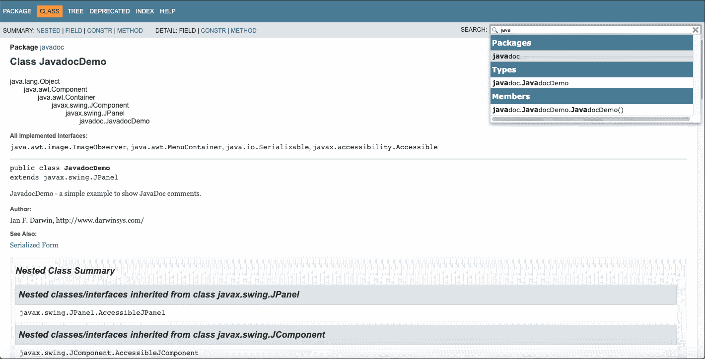
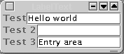

# 第十五章 包和打包

# 第 15.0 章 引言

Java 语言的一个更好的方面之一是它定义了一个非常清晰的打包机制，用于分类和管理其庞大的 API。与大多数其他语言相比，这些语言中的符号可能在 C 库本身或其他几十个库中找到，而没有明确定义的命名约定。^(1) API 包括一个或多个包，包括类，类包括方法和字段。任何人都可以创建一个包，但有一个重要的限制：你和我不能创建以四个字母 `java` 开头的包。以 `java.` 或 `javax.` 命名的包是由 Oracle 的 Java 开发人员使用的，受 Java Community Process (JCP) 管理。当 Java 刚推出时，大约有十几个包，这个结构至今仍然存在，尽管它的大小已经增加了四倍；其中一些包显示在 Table 15-1 中。

Table 15-1\. Java 包基本结构

| 名称 | 功能 |
| --- | --- |
| `java.awt` | 图形用户界面 |
| `java.io` | 读写 |
| `java.lang` | 内置类 (`String` 等) |
| `java.lang.annotation` | 注解处理的库支持 |
| `java.math` | 数学库 |
| `java.net` | 网络 (套接字) |
| `java.nio` | “New” I/O (不再是新的)：基于通道的 I/O |
| `java.sql` | Java 数据库连接 |
| `java.text` | 处理和格式化/解析日期、数字、消息 |
| `java.time` | Java 8：现代日期/时间 API (JSR-311) |
| `java.util` | 实用程序 (集合、日期) |
| `java.util.regex` | 正则表达式 |
| `javax.naming` | JNDI |
| `javax.print` | 打印支持 |
| `javax.script` | Java 6：脚本引擎支持 |
| `javax.swing` | 现代图形用户界面 |

多年来已经添加了许多包，但最初的结构在相当长的时间内经受住了考验。在本章中，我将向您展示如何创建和记录自己的包，然后讨论与在各种平台上以各种方式部署您的包相关的一些问题。

本章还涵盖了包的更传统的含义，即为他人使用创建程序包。这包括了在 Java 9 中引入的 Java 平台模块系统 (JPMS)。我们还涵盖了 `jlink`，这是一个用于创建仅包含您实际使用的 JDK 部分的迷你 Java 分发工具。我们还没有涵盖用于打包应用程序的 `jpackage` 工具，因为它尚未包含在 JDK 中；它可能会在 Java 14 或 15 中推出。

# 15.1 创建一个包

## 问题

您希望能够导入类和/或组织您的类，因此您希望创建自己的包。

## 解决方案

在每个文件的开头放置一个 `package` 语句，并使用 `-d` 或构建工具或 IDE 重新编译。

## 讨论

`package`语句必须是你的 Java 源文件中非注释语句的第一个语句，甚至必须在`import`语句之前，并且必须给出包的完整名称。包名预期以你的域名反向开始；例如，我的互联网域名是 *darwinsys.com*，因此我的大多数包都以`com.darwinsys`和项目名称开头。本书中用于重复使用的实用类位于 Recipe 1.6 中列出的`com.darwinsys`包中，并且每个源文件都以这样的语句开头：

```java
package com.darwinsys.util;
```

*JavaSrc*存储库中的演示类没有遵循这种模式；它们位于与它们所在章节或`java.*`包相关的命名的包中；例如，`lang`用于基本的 Java 内容，`structure`用于数据结构章节的示例（Chapter 7），`threads`用于线程章节（Chapter 16），等等。希望如果你在应用程序中重用它们，你会将它们放入一个“真正的”包中！

一旦你放置了包语句，请注意 Java 运行时甚至编译器都期望找到正确位置的编译后的 *.class* 文件（即在与完整名称对应的子目录中，这些子目录应该在你的`CLASSPATH`设置中）。例如，`com.darwinsys.util.FileIO`的类文件绝不能在我的`CLASSPATH`中的 *FileIO.class* 文件中，而必须相对于`CLASSPATH`中的一个目录或存档中的 *com/darwinsys/util/FileIO.class*。因此，如果你正在使用命令行编译器编译，习惯上（几乎是强制性的）在编译时使用 `-d` 命令行参数。此参数后必须跟随一个现有目录的名称（通常使用 . 表示当前目录），以指定构建目录树的位置。例如，要编译当前目录中的所有 *.java* 文件，并在其中创建目录路径（例如，在示例中创建 *./com/darwinsys/util*），请使用以下命令：

```java
javac -d . *.java
```

这将在当前目录中创建路径（例如 *com/darwinsys/util/*），并将类文件放入该子目录中。这使得后续的编译和创建存档变得简单，这在 Recipe 15.5 中有所涵盖。

当然，如果你使用像 Maven 这样的构建工具（见 Recipe 1.7），这将会默认正确完成（Maven），所以你不必记得一直去做它！

请注意，在所有现代 Java 环境中，不属于包的类（匿名包）不能在`import`语句中列出，尽管它们可以被同一包中的其他类引用。它们也不能成为 JPMS 模块的一部分。

# 15.2 使用 Javadoc 文档化类

## 问题

你听说过这个叫做*代码重用*的东西，并希望通过允许其他开发者使用你的类来推广它。

## 解决方案

使用 javadoc。写代码时编写评论。

## 讨论

Java 文档注释是 Java 早期伟大的发明之一。就像许多好东西一样，它并非完全由 Java 开发者发明；早期的项目如 Knuth 的文学编程已将源代码和文档结合在单个源文件中。但 Java 开发者们在正确的时间做了好事情。Javadoc 对 Java 类而言，就像 Unix 的*man 页面*或 Windows 应用程序的 Windows 帮助一样：这是每个人都期望找到并知道如何使用的标准格式。学习它。使用它。编写它。长命百岁（好吧，也许这并不是百分之百保证）。但是所有那些 HTML 文档，你从编写 Java 代码中学到的，JDK 的完整参考资料——你是否认为他们雇佣了数十名技术作家来制作它？不，这不是 Java 的方式。Java 的开发者们在编写代码的同时编写文档注释，并在发布时，在所有数以万计的公共类上运行 javadoc，并同时生成文档捆绑包。当你为其他开发者准备类时，你可以、应该且真的必须这样做。

你只需在 Java 源文件中放入特殊的*javadoc 注释*就可以使用 javadoc。这些注释类似于多行 Java 注释，但以斜杠和*两个*星号开始，并以正常的星号斜杠结束。Javadoc 注释必须出现在它们所文档化的类、方法或字段的定义之前；如果放在其他地方，它们将被忽略。

一系列关键字，以@符号为前缀，可以出现在特定上下文的文档注释中。其中一些包含在大括号中。截至 Java 8，这些关键字列在 Table 15-2 中。

表 15-2\. Javadoc 关键字

| 关键字 | 使用 |
| --- | --- |
| `@author` | 作者姓名 |
| `{@code *text*}` | 以代码字体显示文本，不解析 HTML |
| `@deprecated` | 引发过时警告 |
| `{@docroot}` | 指向生成文档树的根目录 |
| `@exception` | `@throws`的别名 |
| `{@inheritDoc}` | 从最近的超类/超接口继承文档 |
| `@link` | 生成指向另一个类或成员的内联链接 |
| `@linkplain` | 与`@link`类似，但以纯文本显示 |
| `{@literal *text*}` | 以不解析形式显示文本 |
| `@param *name description*` | 参数名称和含义（仅限方法） |
| `@return` | 返回值 |
| `@see` | 生成到另一个类或成员的交叉引用链接 |
| `@serial` | 描述可序列化字段 |
| `@serialData` | 描述序列化形式中数据的顺序和类型 |
| `@serialField` | 描述可序列化字段 |
| `@since` | JDK 版本引入的版本（主要用于 Sun 使用） |
| `@throws` | 抛出的异常类及条件 |
| `{@value [*ref*]}` | 显示此常量字段或另一个常量字段的值 |
| `@version` | 版本标识符 |

Example 15-1 是一个有些刻意的示例，展示了一些常见的 javadoc 关键字的使用。将其通过 javadoc 运行后，在浏览器中显示的输出如 图 15-1 所示。

##### Example 15-1\. main/src/main/java/javadoc/JavadocDemo.java

```java
public class JavadocDemo extends JPanel {

    private static final long serialVersionUID = 1L;

    /**
 * Construct the GUI
 * @throws java.lang.IllegalArgumentException if constructed on a Sunday.
 */
    public JavadocDemo() {
        // We create and add a pushbutton here,
        // but it doesn't do anything yet.
        Button b = new Button("Hello");
        add(b);                        // connect Button into component
        // Totally capricious example of what you should not do
        if (Calendar.getInstance().get(Calendar.DAY_OF_WEEK) == Calendar.SUNDAY) {
            throw new IllegalArgumentException("Never On A Sunday");
        }
    }

    /** paint() is an AWT Component method, called when the
 * component needs to be painted. This one just draws colored
 * boxes in the window.
 *
 * @param g A java.awt.Graphics that we use for all our
 * drawing methods.
 */
    public void paint(Graphics g) {
        int w = getSize().width, h = getSize().height;
        g.setColor(Color.YELLOW);
        g.fillRect(0, 0, w/2, h);
        g.setColor(Color.GREEN);
        g.fillRect(w/2, 0, w, h);
        g.setColor(Color.BLACK);
        g.drawString("Welcome to Java", 50, 50);
    }
}
```

Javadoc 对单个类的文档生成效果很好，但在处理包或多个包时效果更佳。您可以为每个包提供一个包摘要文件，该文件将被合并到生成的文件中。Javadoc 生成的文档具有深度交叉链接，就像伴随标准 JDK 的文档一样。有几个命令行选项；我通常使用 `-author` 和 `-version` 来包含这些信息，并经常使用 `-link` 告诉它在哪里找到标准 JDK 以进行链接。

运行 `javadoc -help` 可获取完整的选项列表，或在线查看完整文档：[Oracle’s website](https://docs.oracle.com/en/java/javase/13/docs/specs/man/javadoc.html)。图 15-1 展示了在运行 Example 15-1 所示示例时生成的文档的视图：

```java
$ javadoc -author -version JavadocDemo.java
```

如果您在 Java 9+上运行此代码，还将包括一个完全功能的搜索框，显示在图 15-1 的右上角。这是用 JavaScript 实现的，因此应该在任何现代浏览器中都能工作。

请注意，会生成相当多的文件，并且每个生成的文件将与每个类的名称相同，扩展名为 *.html*。如果恰好有一个 HTML 文件记录了该类，并且您在源目录中生成了 javadoc，那么该 *.html* 文件将被静默地覆盖为 javadoc 输出。如果希望避免在源目录中生成文件导致混乱，可以使用 javadoc 的 `-d __directorypath` 选项将生成的文件放置到指定目录中。



###### 图 15-1\. Javadoc 在浏览器中打开的视图

## 另请参阅

Javadoc 还有许多其他命令行参数。如果文档仅供您自己使用而不会分发，可以使用 `-link` 选项告诉它您的标准 JDK 文档的安装位置，以便生成到标准 Java 类（如 `String`、`Object` 等）的链接。如果要分发文档，可以省略 `-link` 或使用 `-link` 与 Oracle 网站上适当 Java API 页面的 URL。查看在线工具文档以获取所有命令行选项。

javadoc 生成的输出对大多数目的都很好。可以编写自己的`Doclet`类来将 javadoc 程序转换为类文档验证器、Java 到其他格式（如 Java 到 RTF）的文档生成器或其他任何你喜欢的工具。这些都是实际例子；请查看随 JDK 提供的 javadoc 工具文档和示例，或者访问[Oracle 的网站](https://docs.oracle.com/en/java/javase/13/docs/specs/man/javadoc.html)。访问[Doclet](http://www.doclet.com)获取一些有点过时但有用的 Doclets 和其他基于 javadoc 的工具集。

## Javadoc 与 JavaHelp

Javadoc 适用于使用你的类的程序员；对于 GUI 应用程序，终端用户可能更喜欢标准的在线帮助。这就是 JavaHelp API 的角色，该 API 未在本书中涵盖，但在*[Creating Effective JavaHelp](http://shop.oreilly.com/product/9781565927193.do)* by Kevin Lewis (O’Reilly)中有全面解释，每个 GUI 应用程序开发者都应该阅读。JavaHelp 是另一个有用的规范，Sun 被 Oracle 收购期间有些被忽视；现在托管在*java.net*上，访问[javahelp](https://javaee.github.io/javahelp)。

# 15.3 超越 Javadoc：注解/元数据

## 问题

你想要不仅从源代码生成文档，还要生成其他代码工件。你需要标记代码以进行额外的编译器验证。

## 解决方案

使用 Java Annotations 或 Metadata 设施。

## 讨论

开源工具[XDoclet](http://xdoclet.sourceforge.net)的持续成功——最初用于为广受批评的 EJB2 框架生成繁琐的辅助类和部署描述符文件——导致标准 Java 中对类似机制的需求。Java *Annotations* 是其结果。*注解* 机制使用类似接口的语法，其中注解的声明和使用都使用前导符号（`@`）。设计者选择这种方式，是为了让人联想到“Javadoc 标签”，这是 Java 编程语言中已有的一种特定注解设施。Javadoc 只是在其`@`标签从未完全集成到语言中的意义上是特定的；大多数标签被编译器忽略，但`@deprecated`始终被编译器理解（参见 Recipe 1.9）。

注解可以在运行时通过反射 API 读取；这在 Recipe 17.10 中讨论，我还会向你展示如何定义自己的注解。注解也可以在编译后由代码生成器等工具读取（也许是你，亲爱的读者！）。

注解还会被*javac*在编译时读取，向编译器提供额外信息。

例如，一个常见的编码错误是在你打算覆盖方法时重载它，因为你错误地使用了错误的参数类型。考虑在`Object`中覆盖`equals`方法。如果你误写了

```java
public boolean equals(MyClass obj) {
    ...
}
```

那么你已经创建了一个新的重载，很可能永远不会被调用，并且将调用`Object`中的默认版本。为了防止这种情况，在`java.lang`中包含的一个注解是`Override`注解。这个注解没有参数，只需简单地放置在方法调用之前，就像这样：

```java
/**
 * AnnotationOverrideDemo - Simple demonstation of Metadata being used to
 * verify that a method does in fact override (not overload) a method
 * from the parent class. This class provides the method.
 */
abstract class Top {
    public abstract void myMethod(Object o);
}

/** Simple demonstation of Metadata being used to verify
 * that a method does in fact override (not overload) a method
 * from the parent class. This class is supposed to do the overriding,
 * but deliberately introduces an error to show how the modern compiler
 * behaves
 */
class Bottom {

    @Override
    public void myMethod(String s) {    // EXPECT COMPILE ERROR
        // Do something here...
    }
}
```

尝试编译此代码将导致编译器错误，指出该方法未覆盖已有方法，尽管注释指示它已覆盖；这是一个致命的编译时错误：

```java
C:> javac AnnotationOverrideDemo.java
AnnotationOverrideDemo.java:16: method does not override a method
            from its superclass
        @Override public void myMethod(String s) {     // EXPECT COMPILE ERROR
         ^
1 error
C:> 
```

# 15.4 准备一个类作为 JavaBean

## 问题

您有一个希望用作 JavaBean 的类。

## 解决方案

确保该类符合 JavaBeans 的要求。可选地，创建一个包含该类、清单和任何辅助条目的 JAR 文件。

## 讨论

有些 Java 组件被称为 Beans 或 JavaBeans：

+   GUI 构建器中用于视觉组件，如本章节所述。

+   普通的旧 Java 对象（POJOs）或用于重用的组件。

+   Java Enterprise 拥有 Enterprise JavaBeans（EJBs）、JSP JavaBeans、JSF Managed Beans 和 CDI Beans，包含用于构建企业级应用程序的功能。创建和使用 Java EE 组件比普通 JavaBeans 更复杂，我们无法在本书中覆盖它们。当您需要了解企业功能时，请参阅 Arun Gupta 的*[Java EE 7 Essentials](http://oreil.ly/javaee7)*。

+   [Spring Framework](http://springframework.org)也使用术语“Beans”（或“Spring Beans”）来管理它所管理的对象。

所有这些类型的 Beans 共同拥有某些命名范例。所有公共属性应通过 get/set 访问器方法访问。对于类型为`Type`的属性`Prop`，应存在以下两种方法（注意大写）：

```java
public Type getProp( );
public void setProp(Type)
```

例如，所有具有文本标签的各种 AWT 和 Swing 组件都具有以下一对方法：

```java
public String getText( );
public void setText(String newText);
```

这种模式的一个常见变化是，对于`boolean`或`Boolean`参数，getter 方法通常称为`isProp()`而不是`getProp()`。

您应该为控制 Bean 的方法（set/get 方法）使用这种 set/get 设计模式。事实上，即使在非 bean 类中，这种技术也很有用以保持一致性。本节开始列出的 API 的 Bean 容器通常使用 Java 内省（参见第十七章）来查找 set/get 方法对，并且有些使用它们来构建 bean 的属性编辑器。例如，bean-aware IDE 为所有标准类型（颜色、字体、标签等）提供编辑器。您可以补充一个`BeanInfo`类以提供或覆盖信息。

作为 JavaBean 可用的类的最低要求如下：

+   类必须有一个无参数的构造函数。

+   该类应使用设置/获取范式。

+   该类必须实现`java.io.Serializable`，尽管许多容器并不强制执行此操作。

+   根据预期的使用方式，类文件可能需要打包成 JAR 文件（参见 Recipe 15.5）。

请注意，没有*required*继承或`implement`s 的 JavaBean 也被称为 POJO。大多数新的 Java 框架接受 POJO 组件，而不是（像往昔那样）要求继承（例如，Struts 1 的`org.struts.Action`类）或实现接口（例如，EJB2 的`javax.ejb.SessionBean`接口）。

下面是一个可能对 Java GUI 工具箱有用的示例 JavaBean，即`LabelText`小部件。它将标签和一行文本字段组合成一个单元，使得组合 GUI 应用程序更加容易。在线源目录中的演示程序设置了三个`LabelText`小部件，如图 15-2 所示。



###### 图 15-2\. LabelText bean

`LabelText`的代码显示在 Example 15-2 中。请注意，它是可序列化的，并且大多数公共方法使用了设置/获取范式。大多数公共设置/获取方法只是将任务委托给标签或文本字段中的相应方法。这个 bean 实际上并没有太多内容，但它是聚合的一个很好的例子，也是 bean 的一个很好的例子。

##### 例 15-2\. darwinsys-api/src/main/java/com/darwinsys/swingui/LabelText.java

```java
// package com.darwinsys.swingui;
public class LabelText extends JPanel implements java.io.Serializable {

    private static final long serialVersionUID = -8343040707105763298L;
    /** The label component */
    protected JLabel theLabel;
    /** The text field component */
    protected JTextField theTextField;
    /** The font to use */
    protected Font myFont;

    /** Construct the object with no initial values.
 * To be usable as a JavaBean there must be a no-argument constructor.
 */
    public LabelText() {
        this("(LabelText)",  12);
    }

    /** Construct the object with the label and a default textfield size */
    public LabelText(String label) {
        this(label, 12);
    }

    /** Construct the object with given label and textfield size */
    public LabelText(String label, int numChars) {
        this(label, numChars, null);
    }

    /** Construct the object with given label, textfield size,
 * and "Extra" component
 * @param label The text to display
 * @param numChars The size of the text area
 * @param extra A third component such as a cancel button
 * may be null, in which case only the label and textfield exist.
 */
    public LabelText(String label, int numChars, JComponent extra) {
        super();
        setLayout(new BoxLayout(this, BoxLayout.X_AXIS));
        theLabel = new JLabel(label);
        add(theLabel);
        theTextField = new JTextField(numChars);
        add(theTextField);
        if (extra != null) {
            add(extra);
        }
    }

    /** Get the label's horizontal alignment */
    public int getLabelAlignment() {
        return theLabel.getHorizontalAlignment();
    }

    /** Set the label's horizontal alignment */
    public void setLabelAlignment(int align) {
        theLabel.setHorizontalAlignment(align);
    }

    /** Get the text displayed in the text field */
    public String getText() {
        return theTextField.getText();
    }

    /** Set the text displayed in the text field */
    public void setText(String text) {
        theTextField.setText(text);
    }

    /** Get the text displayed in the label */
    public String getLabel() {
        return theLabel.getText();
    }

    /** Set the text displayed in the label */
    public void setLabel(String text) {
        theLabel.setText(text);
    }

    /** Set the font used in both subcomponents. */
    public void setFont(Font f) {
        // This class' constructors call to super() can trigger
        // calls to setFont() (from Swing.LookAndFeel.installColorsAndFont),
        // before we create our components, so work around this.
        if (theLabel != null)
            theLabel.setFont(f);
        if (theTextField != null)
            theTextField.setFont(f);
    }

    /** Adds the ActionListener to receive action events from the textfield */
    public void addActionListener(ActionListener l) {
        theTextField.addActionListener(l);
    }

    /** Remove an ActionListener from the textfield. */
    public void removeActionListener(ActionListener l) {
        theTextField.removeActionListener(l);
    }
}
```

一旦编译完成，它就可以打包成 JAR 文件。大多数构建工具（如 Maven）都会为您完成这项工作。

# 15.5 使用 JAR 进行归档

## 问题

你想从你的包（或任何其他文件集合）创建一个 Java 存档（JAR）文件。

## 解决方案

使用*jar*。

## 讨论

*jar*归档程序是 Java 的标准工具，用于构建归档文件。归档文件的作用与其他一些编程语言使用的程序库相同。Java 通常从归档文件加载其标准类，您可以通过使用`-verbose`选项运行一个简单的“Hello, World”程序来验证这一点：

```java
java -verbose HelloWorld
```

创建归档是一个简单的过程。*jar*工具接受几个命令行参数：最常见的是`c`表示创建，`t`表示目录，`x`表示提取。归档名称由`-f`和文件名指定。选项后跟着要归档的文件和目录，如下所示：

```java
jar cvf /tmp/MyClasses.jar .
```

末尾的点很重要；它表示当前目录。这个命令将当前目录及其子目录中的所有文件创建成一个归档文件，并将其保存为*/tmp/MyClasses.jar*文件。

大多数 JAR 文件的应用都依赖于一个额外的文件，这个文件在真正的 JAR 文件中总是存在，称为*清单*（*manifest*）。这个文件总是列出了 JAR 文件的内容及其属性；你可以在其中添加额外的信息。这些属性的形式为`name`: `value`，就像在电子邮件头部、属性文件（参见 Recipe 7.10）和其他地方使用的方式一样。一些属性是应用程序必需的，而另一些是可选的。例如，Recipe 15.6 讨论了直接从 JAR 运行主程序；这需要一个`Main-Program`头部。你甚至可以自己定义属性，比如以下内容：

```java
MySillyAttribute: true
MySillynessLevel: high (5'11")
```

你将其存储在一个名为*manifest.stub*的文件中^(2)，并使用 `-m` 开关将其传递给*jar*。*jar* 将包含你的属性在它创建的清单文件中：

```java
jar -cv -m manifest.stub -f /tmp/com.darwinsys.util.jar .
```

*jar* 程序和相关工具向清单添加了额外的信息，包括存档中包含的所有其他文件的列表。

###### 提示

如果你使用像 Maven 这样的工具（参见 Recipe 1.7），它会自动从源代码项目创建一个 JAR 文件，只需输入 `mvn` `package`。

# 15.6 从 JAR 运行程序

## 问题

你想要分发一个包含应用程序所有类的单个大文件，并从 JAR 中运行主程序。

## 解决方案

在清单中创建一个带有`Main-Class`:行的 JAR 文件；使用`java -jar`选项运行程序。

## 讨论

*java* 命令有一个 `-jar` 选项，告诉它从 JAR 文件中运行找到的主程序。在这种情况下，它还会从同一个 JAR 文件中找到它需要加载的类。它如何知道要运行哪个类？你必须告诉它。创建一个像这样的单行条目，注意属性字段是区分大小写的，冒号后必须跟一个空格：

```java
Main-Class: com.somedomainhere.HelloWorld
```

将其放在一个名为*manifest.stub*的文件中，并假设你想从给定包中运行程序`HelloWorld`。然后，你可以使用以下命令打包你的应用并从 JAR 文件中运行它：

```java
C:> javac HelloWorld.java
C:> jar cvmf manifest.stub hello.jar HelloWorld.class
C:> java -jar hello.jar
Hello, World of Java
C:>
```

现在你可以将 JAR 文件复制到任何地方并以相同的方式运行它。你不需要将其添加到你的`CLASSPATH`或列出主类的名称。

在支持的 GUI 平台上，你也可以通过双击 JAR 文件来启动这个应用程序。这适用于 macOS、Microsoft Windows 和许多 X Windows 桌面。

在实际生活中，你可能会用 Maven 自动化这个过程，在你的 POM 文件中会包含以下内容之一：

```java
<project ...>
    ...
    <packaging>jar</packaging>
    ...
    <build>
        <plugins>
            <plugin>
                <groupId>org.apache.maven.plugins</groupId>
                <artifactId>maven-jar-plugin</artifactId>
                <version>2.4</version>
                <configuration>
                    <archive>
                        <manifest>
                            <addclasspath>true</addclasspath>
                            <mainClass>${main.class}</mainClass>
                        </manifest>
                    </archive>
                </configuration>
            </plugin>
        </plugins>
    </build>
</project>
```

有了这个设置，`mvn package` 将会构建一个可运行的 JAR 文件。然而，如果你的类有外部依赖关系，上述步骤将不会将它们打包，当你运行它时会得到一个缺少类异常。为此，你需要使用 Maven 组件插件：

```java
<plugin>
    <groupId>org.apache.maven.plugins</groupId>
    <artifactId>maven-assembly-plugin</artifactId>
    <version>2.6</version>
    <configuration>
        <descriptorRefs>
            <descriptorRef>jar-with-dependencies</descriptorRef>
        </descriptorRefs>
        <archive>
            <manifest>
                <addDefaultImplementationEntries>true
                </addDefaultImplementationEntries>
                <mainClass>${main.class}</mainClass>
                <!-- <manifestFile>manifest.stub</manifestFile> -->
            </manifest>
            <manifestEntries>
                <Vendor-URL>http://YOURDOMAIN.com/SOME_PATH/</Vendor-URL>
            </manifestEntries>
        </archive>
    </configuration>
</plugin>
```

现在，调用`mvn package assembly:single`将生成一个带有所有依赖关系的可运行 JAR。请注意，你的 *target* 文件夹将包含 *foo-0.0.1-SNAPSHOT.jar* 和 *foo-0.0.1-SNAPSHOT-jar-with-dependencies.jar* 两者；后者是你需要的。

*jpackage* 工具（本章介绍中提到的）将执行与 *assembly:single* 类似的工作，并预计将随 Java 14 一起发布。

# 15.7 将 Web 层组件打包成 WAR 文件

## 问题

你有一些 Web 层资源，并希望将它们打包成一个单一文件以部署到服务器上。

## 解决方案

使用 *jar* 制作 Web 存档（WAR）文件。或者，如前所述，使用 Maven，其`packaging=*war*`。

## 讨论

Servlet 是用于 Web 服务器的服务器端组件。它们可以打包成一个方便安装到 Web 服务器的软件包。在 Servlet API 规范中，*Web 应用程序* 是 HTML 和/或 JSP 页面、Servlet 和其他资源的集合。典型的目录结构可能包括以下内容：

```java
Project Root Directory
├── README.asciidoc
├── index.html - typical web pages
|── signup.jsp - ditto
├── WEB-INF Server directory
    ├── classes - Directory for individual .class files
    ├── lib    - Directory for Jar files needed by app
    └── web.xml - web app Descriptor ("Configuration file")
```

一旦你以这种方式准备好文件，只需用构建工具打包它们即可。使用 Maven，使用`<packaging>war</packaging>`，你的目录结构可能如下所示：

```java
Project Root Directory
├── README.asciidoc
├── pom.xml
└── src
    └── main
        ├── java
        │   └── foo
        │       └── WebTierClass.java
        └── webapp
            ├── WEB-INF
            │   ├── classes
            │   ├── lib
            │   └── web.xml
            ├── index.html
            └── signup.jsp
```

然后，`mvn package` 将编译内容，放置内容，并为你创建 WAR 文件，将其留在 *target* 下。Gradle 用户将使用类似的目录结构。

你也可以手动调用 *jar*，尽管这没什么值得推荐的。然后将生成的 WAR 文件部署到你的 Web 服务器上。有关部署步骤的详细信息，请参阅你使用的特定服务器的文档。

## 参见

关于签名和权限的更多信息，请参阅 Scott Oaks 的 *[Java 安全](http://shop.oreilly.com/product/9780596001575.do)*。有关此处提到的 JDK 工具的更多信息，请参阅你正在使用的 JDK 附带的文档。

# 15.8 使用 jlink 创建更小的分发包

## 问题

你正在将你的应用程序分发给最终用户，并希望最小化下载大小。

## 解决方案

将你的应用程序模块化（参见 Recipe 15.9），使用 `jdeps` 获取它使用的所有模块的完整列表，然后使用 `jlink` 创建迷你 Java，并将其分发给用户。

## 讨论

`jlink` 是在 Java 9 中引入的命令行工具，可以制作一个迷你的 Java 分发包，其中只包含你的应用程序和它使用的 JDK 类。也就是说，它省略了你的应用程序永远不会使用的数千个 JDK 类。

首先，你需要编译和打包你的 `module-info` 和应用程序代码。你可以使用 Maven 或 Gradle，或者直接使用 JDK 工具：

```java
$ javac -d . src/*.java
$ jar cvf demo.jar module-info.class  demo
```

如果你想查看将包含的模块列表，可以选择运行`jdeps`工具以获取此列表：

```java
$ jdeps --module-path . demo.jar
demo
 [file:///Users/ian/workspace/javasrc/jlink/./]
   requires mandated java.base (@11.0.2)
demo -> java.base
   demo          -> java.io        java.base
   demo          -> java.lang      java.base
```

一旦类文件编译完成，你可以运行`jlink`工具来构建一个嵌入你的演示应用的迷你 Java 分发包：

```java
jlink --module-path . --no-header-files \
    --no-man-pages --compress=2 --strip-debug \
    --launcher rundemo=demo/demo.Hello \
    --add-modules demo --output mini-java
```

`--launcher *name*=*module/main*`参数要求`jlink`创建一个名为*name*的脚本文件来运行应用程序。

如果没有错误，您应该能够使用*java*命令或生成的 shell 脚本来运行它：

```java
$ mini-java/bin/java demo.Hello
Hello, world.
$ mini-java/bin/rundemo
Hello, world.
$
```

您可能希望将整个迷你 Java 文件夹复制到没有常规 Java 安装的计算机上，并在那里运行它，以确保没有任何缺少的依赖项。

###### 警告

迷你分发的概念很吸引人，但您必须考虑这些问题：

+   这种迷你 Java 没有升级机制。它们非常适合微服务部署，因为您经常重建。但是对于发送给客户的应用程序，您必须重新生成它们，并让客户下载和重新安装（每当有安全更新时要在短时间内完成）。

+   相对于维护此类分发所需的时间成本，磁盘空间通常不再昂贵。

因此，您必须决定这对您的应用程序是否值得。

# 15.9 使用 JPMS 创建模块

## 问题

您希望您打包的存档能够与 Java 模块系统（JPMS）平稳地工作。

## 解决方案

在源目录的根目录中创建一个*module-info.java*文件。

## 讨论

*module-info.java*文件是在 Java 9 中引入的，用于为编译器和工具提供有关库需求和提供内容的信息。请注意，这甚至不是一个有效的 Java 类文件名，因为它包含一个减号。该模块还有一组伪关键字，这些关键字仅在模块文件内部具有特殊含义。最简单的*module-info*如下所示：

```java
module foo {
    // Empty
}
```

但就像一个没有成员的 Java 类在现实世界中不能让你走得很远一样，这个空模块文件也是如此。我们需要提供一些额外的信息。例如，在这个示例中，我将模块化我的`darwinsys-api`，这是一个大约有 40 个随机积累的类的集合，有时我会重复使用它们。请记住，Jigsaw（模块系统的早期名称）最初被提议作为模块化过度庞大的 JDK 本身的一种方法。大多数应用程序将需要模块`java.base`（它总是包含在内）。如果它们需要 AWT、Swing 或某些其他与桌面应用程序相关的类，则还需要`java.desktop`。因此，我在模块定义中添加了以下行：

```java
require java.desktop
```

此代码还有一些带有 JUnit 注解的类，并使用了 JavaMail API，因此我们也需要它们。不过，JUnit 仅在测试时需要。虽然 Maven 提供了`scope`来编译、测试和运行，但模块系统则没有。因此，我们可以在 POM 文件中省略 JUnit，并将其添加到 Eclipse 中。但是，这样一来，`maven test`将无法工作。

不幸的是，截至本文撰写时，似乎还没有 JavaMail 的模块化版本。幸运的是，有一个称为 *automatic modules* 的功能，如果将一个没有声明模块的 JAR 文件放置在模块路径上，其 JAR 文件名将被用作自动生成模块的基础。因此，我们还将添加以下内容：

```java
requires mail;
```

不幸的是，当我们编译时，Maven 的 Java 编译器模块会输出这样一条看起来很吓人的警告：

```java
[WARNING] *********************************************************************
[WARNING] * Required filename-based automodules detected. Please don't publish
            this project to a public artifact repository! *
[WARNING] *********************************************************************
```

鉴于存在如此多的公共 Java API 库，而且它们大多依赖于其他库，我想知道：这种状态该如何结束？尽管如此，我已经注意到了这个警告，因此人们将继续使用 `com.darwinsys.api` 的自动模块版本，直到我找到模块化的 JavaMail 和 JUnit4 API 为止。

*module-info* 还列出了模块希望提供的任何包，即其公共 API。因此，我们需要一系列的导出命令：

```java
exports com.darwinsys.calendar;
exports com.darwinsys.csv;
exports com.darwinsys.database;
...
```

默认情况下，导出的包不能使用反射 API 进行检查。为了允许一个模块在另一个模块上进行内省（使用反射 API），例如与 JPA 一起使用的领域模型，需要使用 `opens`。

Java 接口的一个重要点是允许对服务进行多个实现。这在 JPMS 中通过服务特性得到支持。其中 API 在一个模块中定义为一个或多个接口，并提供多个实现，每个实现在其自己的模块中，实现模块可以使用 `provides ... with` 定义实现，如下所示：

```java
requires com.foo.interfacemodule;
provides com.foo.interfacemodule.Interface with com.foo.implmodule.ImplClass;
```

`darwinsys-api` 模块的完成的 *module-info* 在 示例 15-3 中显示。

##### 示例 15-3\. DarwinSys-API 模块的 *module-info*

```java
module com.darwinsys.api {

    requires java.desktop;
    requires java.persistence;
    requires java.prefs;
    requires java.sql;
    requires java.sql.rowset;
    requires javax.servlet.api;
    requires mail;
    requires junit;

    exports com.darwinsys.calendar;
    exports com.darwinsys.csv;
    exports com.darwinsys.database;
    exports com.darwinsys.diff;
    exports com.darwinsys.formatting;
    exports com.darwinsys.locks;
    provides com.darwinsys.locks.LockManager
        with com.darwinsys.locks.LockManagerImpl;
    exports com.darwinsys.model;
    opens com.darwinsys.model;
    // another dozen and a half packages...

}
```

想要使用锁接口特性的模块需要 `requires com.darwinsys` 并可能在代码中执行如下操作：

```java
import java.util.ServiceLoader;
import java.util.Optional;

Optional<LockManager> opt = ServiceLoader.load(LockManager.class).findFirst();
if (!opt.isPresent()) {
    throw new RuntimeException("Could not find implementation of LockManager");
}
LockManager mgr = opt.get();
```

`Optional` 接口在 Recipe 8.6 中有描述。

## 参见

JPMS 是相对较新的技术，库提供者仍在学习如何正确使用它。早期的发布可以在 [*https://openjdk.java.net/projects/jigsaw/quick-start*](https://openjdk.java.net/projects/jigsaw/quick-start) 找到。关于迁移到模块化的计划可以在 [*http://tutorials.jenkov.com/java/modules.html#migrating-to-java-9*](http://tutorials.jenkov.com/java/modules.html#migrating-to-java-9) 找到。关于准备多模块 Maven 应用程序的讨论可以在 [*https://www.baeldung.com/maven-multi-module-project-java-jpms*](https://www.baeldung.com/maven-multi-module-project-java-jpms) 找到。Sander Mak 和 Paul Bakker 的书 [*Java 9 Modularity: Patterns and Practices for Developing Maintainable Applications*](http://shop.oreilly.com/product/0636920049494.do) 可能是对 JPMS 最全面的处理。

^(1) 这并不严格正确。至少在 Unix 中的 C 语言中，普通的包含文件和*sys*子目录中的文件是有区别的，而且许多结构体的名称以一个或两个字母加下划线开始，如`pw_name`、`pw_passwd`和`pw_home`。但这远不及 Java 的`java.*`命名约定那样一致。

^(2) 有些人喜欢使用像*MyPackage.mf*这样的名称，这样就清楚这是为哪个包而准备的；扩展名*.mf*是任意的，但对于识别清单文件来说是一个好的约定。
