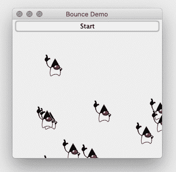
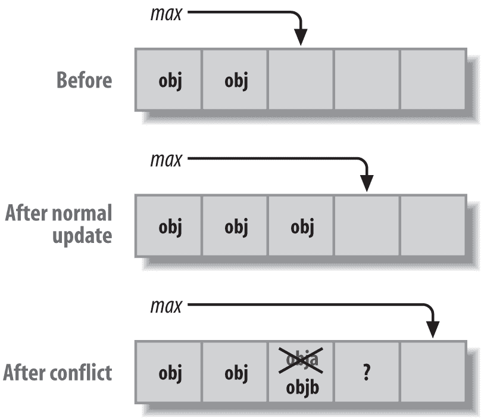
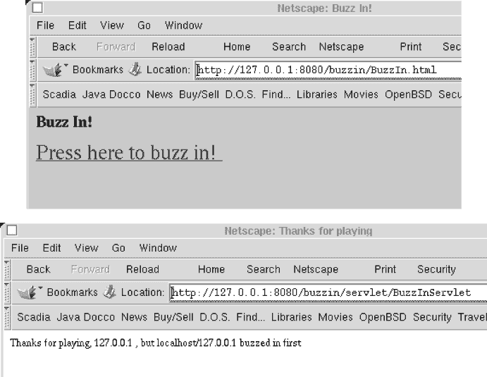
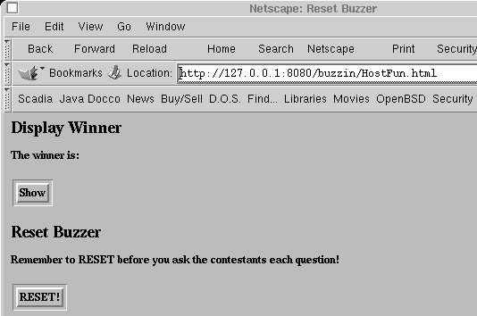

# 第十六章 线程化 Java

# 16.0 介绍

我们生活在一个多活动的世界中。一个人可能一边打电话一边涂鸦或阅读备忘录。一个多功能办公设备可能在接收一个传真、扫描另一个传真并从某人的计算机打印文档。我们希望我们使用的 GUI 程序能够在更新屏幕的同时响应菜单。但普通的计算机程序一次只能做一件事。传统的计算机编程模型——一条接着一条地写语句，由重复循环和二进制决策构成——在本质上是顺序的。

顺序处理虽然简单直接，但效率不及其它方法高。为了提高性能，Java 提供了*线程*，即在单个应用程序或进程内处理多个控制流的能力。Java 提供线程支持，并且实际上要求线程：Java 运行时本身就是固有的多线程的。例如，窗口系统的动作处理和 Java 的垃圾收集（这种神奇的功能使我们可以避免在分配和释放内存时像其他低于或等于 C 语言级别的语言那样需要手动释放所有内容）是在不同的线程中运行的。

就像多任务处理允许单个操作系统在单处理器计算机上同时运行多个程序一样，多线程可以使单个程序或进程在同一时间内看起来像在处理多个任务。多线程导致更交互式的图形和更响应迅速的 GUI 应用程序（程序可以在窗口中绘制同时响应菜单，这两个活动几乎独立进行），更可靠的网络服务器（如果一个客户端出错，服务器继续与其他客户端通信），等等。

请注意，我在上一段中没有说“多处理”。有时候，多任务处理的术语被错误地称为多处理，但事实上，这个术语指的是不同的问题：即两个或更多个 CPU 在单个操作系统下运行的情况。多处理本身并不新鲜：IBM 大型机在 1970 年代就做过，Sun SPARCstations 在 1980 年代做过，Intel PC 在 1990 年代做过。自 2010 年中期以来，越来越难买到只包含一个处理器的计算机，除了手表之外的任何装置。真正的多处理允许您在多个 CPU 上同时运行多个进程。Java 对线程的支持包括多处理，只要操作系统支持。请参阅系统文档以获取详细信息。

尽管大多数现代操作系统都提供线程，但 Java 是第一种在语言中内置支持线程操作的主流编程语言。`java.lang.Object`的语义包括对象的监视器锁定的概念，一些方法（`notify`，`notifyAll`，`wait`）仅在多线程应用程序的上下文中有意义。Java 还有诸如`synchronized`之类的语言关键字，用于控制线程应用程序的行为。

现在世界各地已经有多年与 Java 线程化的经验，专家们开始构建编写线程化应用程序的更好方法。并发实用程序是根据 JSR 166^(1)规范，并包含在所有现代 Java 发布版中，它们在计算机科学系的 Doug Lea 教授的`util.concurrent`包的基础上进行了大量的扩展。这个包旨在解决线程化困难，就像集合类（参见第七章）为数据结构化所做的那样。这不是一个小事业，但他们成功地完成了。

`java.util.concurrent`包包括几个主要部分：

+   `Executor`s，线程池（`ExecutorService`s）和`Future`s/`CompletableFuture`s

+   `Queue`和`BlockingQueue`

+   锁和条件，具有 JVM 支持的更快锁定和解锁

+   同步器，包括`Semaphore`和`Barrier`

+   原子变量

在本章中，我将专注于第一组，即线程池和`Future`s。

`Executor`接口的实现正如其名称所示，是一个可以为你执行代码的类。要执行的代码可以是熟悉的`Runnable`或新的接口`Callable`。一种常见的`Executor`类型是*线程池*。`Future`接口表示已经启动的某事物的未来状态；它有等待结果准备好的方法。`CompletableFuture`是`Future`的实现，它增加了许多用于链式处理`CompletableFuture`和后应用方法的附加方法。

这些简要定义都是过于简化了。解决所有问题超出了本章的范围，但我提供了几个例子。

# 16.1 在不同线程中运行代码

## 问题

你需要编写一个线程化的应用程序。

## 解决方案

编写实现`Runnable`的代码；将其传递给`Executor`，或者实例化一个`Thread`并启动它。

## 讨论

有几种实现线程的方式，它们都要求你实现`Runnable`或`Callable`接口。`Runnable`只有一个方法，并且不返回任何值；这是它的签名：

```java
public interface java.lang.Runnable {
  public abstract void run();
}
```

`Callable`同样只有一个方法，但`call()`方法返回特定类型，因此接口有一个类型参数（这里是`V`，代表“值”）：

```java
public interface java.util.concurrent.Callable<V> {
  public abstract V call() throws Exception;
}
```

你必须提供 `run()` 或 `call()` 方法的实现。这个方法没什么特别的；它是一个普通方法，你也可以自己调用它。但如果你这样做了，那又怎样呢？它不会像独立的控制流那样启动特殊的魔法，所以它不会与你的主程序或控制流并发运行。为了实现这一点，你需要调用线程创建的魔法。

使用线程的原始方式，不再一般推荐，是直接创建 `Thread` 对象并调用它们的 `start()` 方法，这会在新线程初始化后调用 `run()` 方法。原始线程模型中没有支持 `Callable` 接口。你可以通过以下几种方式之一创建线程：

+   继承 `java.lang.Thread`（它实现了 `Runnable`），并重写 `run()` 方法。

+   创建你的 `Runnable` 并将其传递给 `Thread` 构造函数。

+   使用 Java 8+，如 Recipe 9.0 所示，你可以使用 lambda 表达式来实现 `Runnable`。

由于性能等问题（`Thread` 对象的创建和销毁成本高昂，而且一旦其 `run()` 方法返回，线程就无法再使用），不再推荐采用这种方式调用线程。我不再展示这样做的示例。在线源代码中有一些示例，在 *threads* 目录下查看；特别是 *ThreadsDemo4*。

相反，推荐的执行线程操作的方式是使用 `java.util.concurrent` 包的 `ExecutorService`。`ExecutorService` 如其名，是一个可以为你执行代码的服务类。要执行的代码可以是 `Runnable` 或 `Callable`。你可以通过在 `Executors` 类上调用工厂方法来获取 `ExecutorService`。Example 16-1 中的代码展示了一个线程池的简单示例。

##### Example 16-1\. main/src/main/java/threads/ThreadPoolDemo.java

```java
        final ExecutorService pool = Executors.newFixedThreadPool(HOWMANY);
        List<Future<Integer>> futures = new ArrayList<>(HOWMANY);
        for (int i = 0; i < HOWMANY; i++) {
            Future<Integer> f = pool.submit(new DemoRunnable(i));
            System.out.println("Got 'Future' of type " + f.getClass());
            futures.add(f);
        }
        Thread.sleep(3 * 1000);
        done = true;
        for (Future<Integer> f : futures) {
            System.out.println("Result " + f.get());
        }
        pool.shutdown();
```

这将打印一系列如下的行，显示交错运行的线程：

```java
Running Thread[pool-1-thread-3,5,main]
Running Thread[pool-1-thread-3,5,main]
Running Thread[pool-1-thread-1,5,main]
Running Thread[pool-1-thread-1,5,main]
```

注意，有几种提交方法，第一种在父接口 `Executor` 中，另外两种在 `ExecutorService` 中：

```java
public void execute(Runnable);
public Future<T> submit(Callable<T>);
public Future<T> submit(Runnable);
```

也就是说，`execute()` 接受一个 `Runnable` 并且不返回任何内容，而 `submit()` 方法返回一个 `Future<T>`（对于方法 `submit(Runnable)`，类型参数 `T` 总是 `java.lang.Void`）。

当你完成线程池的使用时，应该调用它的 `shutDown()` 方法。

# 16.2 用动画显示移动图像

## 问题

在程序的其他部分运行时，你需要更新图形显示。

## 解决方案

使用后台线程驱动动画。

## 讨论

线程的一个常见用途是动画程序，它显示一个移动的图像。这个动画程序正是这样做的。它在屏幕上不同位置绘制一个图形图像；每个图像的位置更新并从不同的`Thread`重新绘制，以便所有动画并行运行。您可以在图 16-1 中看到程序的运行情况。



###### Figure 16-1\. 动画程序

动画程序的代码包括两个类，`Sprite`（参见示例 16-4）和`Bounce`^(2)（参见示例 16-5）。`Sprite`是一个移动的图像；`Bounce`是主程序。

##### Example 16-4\. main/src/main/java/threads/Sprite.java（动画程序的一部分）

```java
/** A Sprite is one Image that moves around the screen on its own */
public class Sprite extends Component implements Runnable {
    private static final long serialVersionUID = 1L;
    protected static int spriteNumber = 0;
    protected int number;
    protected int x, y;
    protected Component parent;
    protected Image image;
    protected volatile boolean done = false;
    /** The time in mSec to pause between each move. */
    protected volatile int sleepTime = 250;
    /** The direction for this particular sprite. */
    protected Direction direction;
    enum Direction {
        VERTICAL, HORIZONTAL, DIAGONAL
    }
    /** Construct a Sprite with a Component parent, image and direction.
 * Construct and start a Thread to drive this Sprite.
 */
    public Sprite(Component parent, Image image, Direction direction) {
        this.parent = parent;
        this.image = image;
        this.direction = direction;
        this.number = Sprite.spriteNumber++;
        setSize(image.getWidth(this), image.getHeight(this));
    }

    /** Construct a Sprite with the default direction */
    public Sprite(Component parent, Image image) {
        this(parent, image, Direction.DIAGONAL);
    }

    /** Stop this Sprite. */
    public void stop() {
        System.out.println("Stopping " + number);
        done = true;
    }

    /** Adjust the motion rate */
    protected void setSleepTime(int n) {
        sleepTime = n;
    }

    /**
 * Run one Sprite around the screen.
 * This version just moves them around either across, down, or
 * at some 45-degree angle.
 */
    public void run() {
        int width = parent.getSize().width;
        int height = parent.getSize().height;
        // Set initial location
        x = (int)(Math.random() * width);
        y = (int)(Math.random() * height);
        // Flip coin for x & y directions
        int xincr = Math.random()>0.5?1:-1;
        int yincr = Math.random()>0.5?1:-1;
        while (!done) {
            width = parent.getSize().width;
            height = parent.getSize().height;
            if ((x+=xincr) >= width)
                x=0;
            if ((y+=yincr) >= height)
                y=0;
            if (x<0)
                x = width;
            if (y<0)
                y = height;
            switch(direction) {
                case VERTICAL:
                    x = 0;
                    break;
                case HORIZONTAL:
                    y = 0;
                    break;
                case DIAGONAL:
                    // Let it wrap around
                    break;
            }
            //System.out.println("from " + getLocation() + "->" + x + "," + y);
            setLocation(x, y);
            repaint();
            try {
                Thread.sleep(sleepTime);
            } catch (InterruptedException e) {
                return;
            }
        }
    }

    /** paint -- just draw our image at its current location */
    public void paint(Graphics g) {
        g.drawImage(image, 0, 0, this);
    }
}
```

本示例展示了`volatile`关键字的几个用法。`volatile`关键字用于通知 Java 一个变量可能会被多个线程修改，因此在使用时必须始终获取其当前值。如果没有此关键字，Java 可能会使用给定变量的缓存版本。当一个变量只在一个线程中使用时，这样可以提高性能，但（没有`volatile`时）当变量在一个线程中修改并在另一个线程中观察时可能导致不正确的结果。

##### Example 16-5\. main/src/main/java/threads/Bounce.java（动画程序的一部分）

```java
public class Bounce extends JPanel {

    private static final long serialVersionUID = -5359162621719520213L;
    /** The main Panel */
    protected JPanel p;
    /** The image, shared by all the Sprite objects */
    protected Image img;
    /** A Thread Pool */
    protected ExecutorService tp = Executors.newCachedThreadPool();
    /** A Vector of Sprite objects. */
    protected List<Sprite> v = new Vector<Sprite>(); // multithreaded, use Vector;

    public static void main(String[] args) {
        JFrame jf = new JFrame("Bounce Demo");
        jf.add(new Bounce(args.length > 0 ? args[0] : null));
        jf.setSize(300, 300);
        jf.setVisible(true);
        jf.setDefaultCloseOperation(JFrame.EXIT_ON_CLOSE);
    }

    public Bounce(String imgName) {
        setLayout(new BorderLayout());
        JButton b = new JButton("Add a Sprite");
        b.addActionListener(e -> {
            System.out.println("Creating another one!");
            Sprite s = new Sprite(this, img);
            tp.execute(s);
            p.add(s);
            v.add(s);
        });
        add(b, BorderLayout.NORTH);
        add(p = new JPanel(), BorderLayout.CENTER);
        p.setLayout(null);
        if (imgName == null) imgName = "duke.gif";
        final URL resource = getClass().getResource("/" + imgName);
        if (resource == null) {
            throw new IllegalStateException("Could not load image " + imgName);
        }
        img = Toolkit.getDefaultToolkit().getImage(resource);
        MediaTracker mt = new MediaTracker(this);
        mt.addImage(img, 0);
        try {
            mt.waitForID(0);
        } catch(InterruptedException e) {
            throw new IllegalArgumentException(
                "InterruptedException while loading image " + imgName);
        }
        if (mt.isErrorID(0)) {
            throw new IllegalArgumentException(
                "Couldn't load image " + imgName);
        }
        JButton stopper = new JButton("Shut down");
        stopper.addActionListener(e -> {
            stop();
            tp.shutdown();
        });
        add(stopper, BorderLayout.SOUTH);
    }

    public void stop() {
        for (Sprite s : v) {
            s.stop();
        }
        v.clear();
        try {
            tp.awaitTermination(5, TimeUnit.SECONDS);
            System.out.println("ThreadPool is shut down, ending program");
            System.exit(0);
        } catch (InterruptedException e) {
            // Empty
        }
    }
}
```

# 16.3 停止线程

## Problem

您需要停止一个线程。

## 解决方案

不要使用`Thread.stop()`方法；相反，在`run()`方法的主循环顶部使用一个测试的`boolean`。

## 讨论

虽然可以使用线程的`stop()`方法，但不建议这样做。这是因为这种方法非常激烈，无法在具有多个活动线程的程序中可靠地表现。这也是为什么在尝试使用它时，编译器会生成弃用警告。推荐的方法是在`run()`方法的主循环中使用一个`boolean`变量。示例 16-6 中的程序在其`shutDown()`方法被调用后无限打印消息；然后将控制变量`done`设置为 false，从而终止循环。这导致`run()`方法返回，结束其处理。

##### Example 16-6\. main/src/main/java/threads/StopBoolean.java

```java
public class StopBoolean {

    // Must be volatile to ensure changes visible to other threads.
    protected volatile boolean done = false;

    Runnable r = () -> {
        while (!done) {
            System.out.println("StopBoolean running");
            try {
                Thread.sleep(720);
            } catch (InterruptedException ex) {
                // nothing to do
            }
        }
        System.out.println("StopBoolean finished.");
    };

    public void shutDown() {
        System.out.println("Shutting down...");
        done = true;
    }

    public void doDemo() throws InterruptedException {
        ExecutorService pool = Executors.newSingleThreadExecutor();
        pool.submit(r);
        Thread.sleep(1000*5);
        shutDown();
        pool.shutdown();
        pool.awaitTermination(2, TimeUnit.SECONDS);
    }

    public static void main(String[] args) throws InterruptedException {
        new StopBoolean().doDemo();
    }
}
```

运行时看起来像这样：

```java
StopBoolean running
StopBoolean running
StopBoolean running
StopBoolean running
StopBoolean running
StopBoolean running
StopBoolean running
StopBoolean finished.
```

但如果您的线程在读取网络连接时被阻塞呢？此时您无法检查`boolean`，因为正在读取的线程处于休眠状态。这就是`stop`方法的设计初衷，但正如我们所见，它现在已被弃用。相反，您可以简单地关闭套接字。示例 16-7 中的程序故意通过从应该写入的套接字读取数据而导致死锁，以演示关闭套接字确实终止了循环。

##### Example 16-7\. main/src/main/java/threads/StopClose.java

```java
public class StopClose extends Thread {
    protected Socket io;

    public void run() {
        try {
            io = new Socket("java.sun.com", 80);    // HTTP
            BufferedReader is = new BufferedReader(
                new InputStreamReader(io.getInputStream()));
            System.out.println("StopClose reading");

            // The following line will deadlock (intentionally), since HTTP
            // enjoins the client to send a request (like "GET / HTTP/1.0")
            // and a null line, before reading the response.

            String line = is.readLine();    // DEADLOCK

            // Should only get out of the readLine if an interrupt
            // is thrown, as a result of closing the socket.

            // So we shouldn't get here, ever:
            System.out.printf("StopClose FINISHED after reading %s!?", line);
        } catch (IOException ex) {
            System.out.println("StopClose terminating: " + ex);
        }
    }

    public void shutDown() throws IOException {
        if (io != null) {
            // This is supposed to interrupt the waiting read.
            synchronized(io) {
                io.close();
            }
        }
        System.out.println("StopClose.shutDown() completed");
    }

    public static void main(String[] args)
    throws InterruptedException, IOException {
        StopClose t = new StopClose();
        t.start();
        Thread.sleep(1000*5);
        t.shutDown();
    }
}
```

运行时，它会打印一个关闭正在发生的消息：

```java
StopClose reading
StopClose terminating: java.net.SocketException: Resource temporarily unavailable
```

“但是等等，”你说。“如果我想中断等待，但实际上不想终止套接字怎么办？”这确实是一个很好的问题，并且没有完美的答案。但是你可以*中断*正在读取的线程；读取会被`java.io.InterruptedIOException`中断，并且您可以重新尝试读取。本章源代码中的文件*Intr.java*展示了这一点。

# 16.4 会合和超时

## 问题

您需要知道某件事是否已经完成，或者它是否在某个时间长度内完成。

## 解决方案

将某物置于其自己的线程中，并调用其`join()`方法，可以选择是否设置超时值。

## 讨论

目标线程的`join()`方法用于暂停当前线程，直到目标线程完成（从其`run()`方法返回）。此方法有多种重载版本；不带参数的版本永远等待线程终止，而带有参数的版本最多等待指定的时间。举个简单的例子，我创建（并启动！）了一个简单的线程，它只是从控制台终端读取内容，而主线程只是等待它。当我运行程序时，它看起来是这样的：

```java
darwinsys.com$ java threads.Join
Starting
Joining
Reading
hello from standard input # waits indefinitely for me to type this line
Thread Finished.
Main Finished.
darwinsys.com$
```

示例 16-8 列出了`join()`演示的代码。

##### 示例 16-8\. main/src/main/java/threads/Join.java

```java
public class Join {
    public static void main(String[] args) {
        Thread t = new Thread() {
            public void run() {
                System.out.println("Reading");
                try {
                    System.in.read();
                } catch (java.io.IOException ex) {
                    System.err.println(ex);
                }
                System.out.println("Thread Finished.");
            }
        };
        System.out.println("Starting");
        t.start();
        System.out.println("Joining");
        try {
            t.join();
        } catch (InterruptedException ex) {
            // should not happen:
            System.out.println("Who dares interrupt my sleep?");
        }
        System.out.println("Main Finished.");
    }
}
```

正如您所看到的，它使用了一个内部类`Runnable`（参见第 16.1 节）在`Thread t`中可运行。

# 16.5 使用`synchronized`关键字同步线程

## 问题

您需要保护某些数据不被多个线程访问。

## 解决方案

使用` synchronized`关键字来保护您希望保护的方法或代码。

## 讨论

我在第 13.5 节中简要讨论了`synchronized`关键字。该关键字指定一次只允许一个线程在给定对象实例中运行给定方法（或同一类中的任何其他同步方法）（对于静态方法，一次只允许一个线程运行该方法）。您可以同步方法或更小的代码块。同步整个方法更容易和安全，但这可能会导致阻塞线程更多地运行。您只需在方法上添加`synchronized`关键字。例如，`Vector`的许多方法（参见第 7.4 节）都是同步的，以确保在两个线程同时更新或检索时，向量不会变得损坏或提供不正确的结果。

请记住，线程几乎可以在任何时候被中断，在这种情况下，控制权将转移到另一个线程。考虑两个线程同时追加到数据结构的情况。假设我们有与`Vector`相同的方法，但是我们正在操作一个简单的数组。`add()`方法简单地将当前对象数用作数组索引，然后递增它：

```java
public void add(Object obj) {
   data[max] = obj; 
   max = max + 1;   
}
```

线程 A 和 B 都希望调用这个方法。假设线程 A 在之后被中断，但在之前被中断，然后线程 B 开始运行。


线程 B 执行，覆盖了`data[max]`的内容；我们现在丢失了线程 A 传递的对象的所有引用！


然后线程 B 在处增加`max`并返回。稍后，线程 A 再次运行；它在处继续，并将`max`增加到最后一个有效对象之外。所以我们不仅丢失了一个对象，而且数组中有一个未初始化的引用。这种情况如图 16-2 所示。



###### 图 16-2\. 非线程安全的 add 方法的操作：正常和失败的更新

现在你可能会想，“没问题，我只需合并这两行代码！”：

```java
data[max++] = obj;
```

就像游戏节目主持人有时会说的那样，“Bzzzzt！谢谢参与！” 这个改变使得代码变得更短，但对可靠性没有任何影响。中断不会方便地发生在 Java 语句边界；它们可以发生在程序对应的许多 JVM 机器指令中的任何一个之间。代码仍然可能在存储之后和增量之前被中断。唯一的好解决方案是使用适当的同步。

方法使用`synchronized`意味着对它的任何调用都将等待，如果一个线程已经开始运行该方法：

```java
public synchronized void add(Object obj) {
    ...
}
```

任何时候你希望同步一些代码，但不是整个方法，可以在方法内使用未命名代码块的`synchronized`关键字，就像这样：

```java
public void add(Object obj) {
    synchronized (someObject) {
        // this code will execute in one thread at a time
    }
}
```

同步对象的选择由您决定。有时候在包含代码的对象上同步是有意义的，就像在示例 16-9 中那样。对于同步访问`ArrayList`，使用`ArrayList`实例是合理的，就像这样：

```java
synchronized(myArrayList) {
     if (myArrayList.indexOf(someObject) != -1) {
         // do something with it.
     } else {
         create an object and add it...
    }
}
```

示例 16-9 是一个 Web Servlet，我写了一个用于课堂使用的建议，来自 Learning Tree 的同事 Scott Weingust 的建议。^(3) 它允许您玩一个类似游戏节目主持人提问并且第一个按下蜂鸣器的人（按蜂鸣器键）尝试回答问题的风格的游戏。为了确保不会同时有两个人按蜂鸣器，代码在更新`Boolean` `buzzed`变量的代码周围使用了同步块。而且为了可靠性，任何访问这个`Boolean`的代码也是同步的。

##### 示例 16-9\. main/src/main/java/threads/BuzzInServlet.java

```java
public class BuzzInServlet extends HttpServlet {

    /** The attribute name used throughout. */
    protected final static String WINNER = "buzzin.winner";

    /** doGet is called from the contestants web page.
 * Uses a synchronized code block to ensure that
 * only one contestant can change the state of "buzzed".
 */
    public void doGet(HttpServletRequest request, HttpServletResponse response)
    throws ServletException, IOException {
        ServletContext application = getServletContext();

        boolean iWon = false;
        String user = request.getRemoteHost() + '@' + request.getRemoteAddr();

        // Do the synchronized stuff first, and all in one place.
        synchronized(application) {
            if (application.getAttribute(WINNER) == null) {
                application.setAttribute(WINNER, user);
                application.log("BuzzInServlet: WINNER " + user);
                iWon = true;
            }
         }

        response.setContentType("text/html");
        PrintWriter out = response.getWriter();

        out.println("<html><head><title>Thanks for playing</title></head>");
        out.println("<body bgcolor=\"white\">");

        if (iWon) {
            out.println("<b>YOU GOT IT</b>");
            // TODO - output HTML to play a sound file :-)
        } else {
                out.println("Thanks for playing, " + request.getRemoteAddr());
                out.println(", but " + application.getAttribute(WINNER) +
                    " buzzed in first");
        }
        out.println("</body></html>");
    }

    /** The Post method is used from an Administrator page (which should
 * only be installed in the instructor/host's localweb directory).
 * Post is used for administrative functions:
 * 1) to display the winner;
 * 2) to reset the buzzer for the next question.
 */
    public void doPost(HttpServletRequest request, HttpServletResponse response)
    throws ServletException, IOException {
        ServletContext application = getServletContext();

        response.setContentType("text/html");
        HttpSession session = request.getSession();

        PrintWriter out = response.getWriter();

        if (request.isUserInRole("host")) {
            out.println("<html><head><title>Welcome back, " +
                request.getUserPrincipal().getName() + "</title><head>");
            out.println("<body bgcolor=\"white\">");
            String command = request.getParameter("command");
            if (command.equals("reset")) {

                // Synchronize what you need, no more, no less.
                synchronized(application) {
                    application.setAttribute(WINNER, null);
                }
                session.setAttribute("buzzin.message", "RESET");
            } else if (command.equals("show")) {
                String winner = null;
                synchronized(application) {
                    winner = (String)application.getAttribute(WINNER);
                }
                if (winner == null) {
                    session.setAttribute("buzzin.message",
                        "<b>No winner yet!</b>");
                } else {
                    session.setAttribute("buzzin.message",
                        "<b>Winner is: </b>" + winner);
                }
            }
            else {
                session.setAttribute("buzzin.message",
                    "ERROR: Command " + command + " invalid.");
            }
            RequestDispatcher rd = application.getRequestDispatcher(
                "/hosts/index.jsp");
            rd.forward(request, response);
        } else {
            out.println("<html><head><title>Nice try, but... </title><head>");
            out.println("<body bgcolor=\"white\">");
            out.println(
                "I'm sorry, Dave, but you know I can't allow you to do that.");
            out.println("Even if you are " + request.getUserPrincipal());
        }
        out.println("</body></html>");
    }
}
```

两个 HTML 页面导致 Servlet。参赛者页面简单地有一个大链接（`<a href=/servlet/BuzzInServlet>`）。锚点链接生成 HTML GET，因此 Servlet 引擎调用`doGet()`：

```java
<html><head><title>Buzz In!</title></head>
<body>
<h1>Buzz In!</h1>
<p>
<font size=+6>
<a href="servlet/BuzzInServlet">
Press here to buzz in!
</a>
</font>
```

HTML 很简单，但完成了工作。 图 16-3 展示了外观和感觉。



###### 图 16-3\. BuzzInServlet 运行中

游戏主持人可以访问一个具有 POST 方法的 HTML 表单，该方法调用 `doPost()` 方法。这会向游戏主持人显示获胜者并为下一题重置蜂鸣器。

```java
<html><head><title>Reset Buzzer</title></head>
<body>
<h1>Display Winner</h1>
<p>
<b>The winner is:</b>
<form method="post" action="servlet/BuzzInServlet">
    <input type="hidden" name="command" value="show">
    <input type="hidden" name="password" value="syzzy">
    <input type="submit" name="Show" value="Show">
</form>
<h1>Reset Buzzer</h1>
<p>
<b>Remember to RESET before you ask the contestants each question!</b>
<form method="post" action="servlet/BuzzInServlet">
    <input type="hidden" name="command" value="reset">
    <input type="hidden" name="password" value="syzzy">
    <input type="submit" name="Reset" value="RESET!">
</form>
```

提供了一个密码；这里是硬编码的，但实际上密码可以来自属性文件（配方 7.10）或 servlet 初始化参数（如 *[Java Servlet Programming](http://shop.oreilly.com/product/9780596000400.do)* [O’Reilly] 中描述的）：

游戏主持人功能显示在 图 16-4 中。



###### 图 16-4\. BuzzInServlet 游戏主持人功能

当然，为了更完整的游戏体验，Servlet 还会保持一个人们按顺序蜂鸣的 `Stack`（参见 配方 7.16），以防第一个人回答问题不正确。对此的访问也必须进行同步。

# 16.6 使用锁简化同步

## 问题

您希望更简单地同步线程。

## 解决方案

使用 `java.util.concurrent.locks` 中的 `Lock` 机制。

## 讨论

使用 `java.util.concurrent.locks` 包；其主要接口是 `Lock`。该接口有几种锁定和一种解锁方法。以下是使用它的一般模式：

```java
Lock thelock = ....
try  {
        lock.lock( );
        // do the work that is protected by the lock
} finally {
        lock.unlock( );
}
```

将 `unlock()` 调用放在 `finally` 块中的目的当然是确保在发生异常时不会被绕过（代码也可能包含一个或多个 `catch` 块，根据所执行的工作需要）。

与传统的 synchronized 方法和代码块相比，使用 `Lock` 的改进之处在于它实际上看起来像是一个锁定操作！正如我所提到的，有多种锁定方法可用，如 表 16-1 所示。

表 16-1\. Lock 类的锁定方法

| 返回类型 | 方法 | 含义 |
| --- | --- | --- |
| void | `lock( )` | 获取锁，即使必须等待直到另一个线程释放它 |
| boolean | `tryLock( )` | 只有在当前锁空闲时才获取锁 |
| boolean | `tryLock(long time, TimeUnit units) throws` `InterruptedException` | 尝试获取锁，但只等待指定的时间长度 |
| void | `lockInterruptibly( ) throws` `InterruptedException` | 获取锁，除非被中断否则一直等待 |
| void | `unlock( )` | 释放锁 |

`TimeUnit` 类允许您指定指定时间量的单位，包括 `TimeUnit.SECONDS`、`TimeUnit.MILLISECONDS`、`TimeUnit.MICROSECONDS` 和 `TimeUnit.NANOSECONDS`。

在所有情况下，在再次锁定之前必须使用 `unlock()` 释放锁。

标准的`Lock`在许多应用程序中很有用，但根据应用程序的要求，其他类型的锁可能更合适。具有非对称负载模式的应用程序可能会从一种称为*读写锁*的常见模式中受益；我将其称为读写锁以强调可以有多个读取者但只能有一个写入者。实际上它是一对互联的锁；任意数量的读取者可以持有读锁并读取数据，只要数据不被写入（共享读取访问）。然而，尝试锁定写锁的线程将等待所有读取者完成，然后在写者完成之前将它们锁定（独占写入访问）。为支持此模式，`ReadWriteLock`接口和实现类`ReentrantReadWriteLock`都可用。该接口仅有两个方法，`readLock()`和`writeLock()`，它们提供对适当`Lock`实现的引用。*这些方法本身不会锁定或解锁锁*；它们仅提供对它们的访问，因此通常可以看到像这样的代码：

```java
rwlock.readLock( ).lock( );
...
rwlock.readLock( ).unlock( );
```

为了演示`ReadWriteLock`的实际应用，我编写了基于网络的投票应用程序的业务逻辑部分。它可以用于候选人的投票或更常见的网络投票。假设您在主页上显示结果，并且仅在有人点击投票响应时更改数据，此应用程序符合`ReadWriteLock`的预期标准之一——即您有更多的读取者而不是写入者。主类`ReadersWritersDemo`如示例 Example 16-10 所示。辅助类`BallotBox`在线上；它简单地跟踪投票并在请求时返回只读的`Iterator`。请注意，在读取线程的`run()`方法中，您可以在持有锁的同时获取迭代器，但在打印之前释放锁；这样可以提高并发性能，但根据您的应用程序可能需要额外的并发更新锁定。

##### 示例 16-10\. main/src/main/java/threads/ReadersWriterDemo.java

```java
public class ReadersWriterDemo {
    private static final int NUM_READER_THREADS = 3;

    public static void main(String[] args) {
        new ReadersWriterDemo().demo();
    }

    /** Set this to true to end the program */
    private volatile boolean done = false;

    /** The data being protected. */
    private BallotBox theData;

    /** The read lock / write lock combination */
    private ReadWriteLock lock = new ReentrantReadWriteLock();

    /**
 * Constructor: set up some quasi-random initial data
 */
    public ReadersWriterDemo() {
        List<String> questionsList = new ArrayList<>();
        questionsList.add("Agree");
        questionsList.add("Disagree");
        questionsList.add("No opinion");
        theData = new BallotBox(questionsList);
    }

    /**
 * Run a demo with more readers than writers
 */
    private void demo() {

        // Start two reader threads
        for (int i = 0; i < NUM_READER_THREADS; i++) {
            new Thread() {
                public void run() {
                    while (!done) {
                        lock.readLock().lock();
                        try {
                            theData.forEach(p ->
                                System.out.printf("%s: votes %d%n",
                                    p.getName(),
                                    p.getVotes()));
                        } finally {
                            // Unlock in "finally" to be sure it gets done.
                            lock.readLock().unlock();
                        }

                        try {
                            Thread.sleep(((long)(Math.random()* 1000)));
                        } catch (InterruptedException ex) {
                            // nothing to do
                        }
                    }
                }
            }.start();
        }

        // Start one writer thread to simulate occasional voting
        new Thread() {
            public void run() {
                while (!done) {
                    lock.writeLock().lock();
                    try {
                        theData.voteFor(
                            // Vote for random candidate :-)
                            // Performance: should have one PRNG per thread.
                            (((int)(Math.random()*
                            theData.getCandidateCount()))));
                    } finally {
                        lock.writeLock().unlock();
                    }
                    try {
                        Thread.sleep(((long)(Math.random()*1000)));
                    } catch (InterruptedException ex) {
                        // nothing to do
                    }
                }
            }
        }.start();

        // In the main thread, wait a while then terminate the run.
        try {
            Thread.sleep(10 * 1000);
        } catch (InterruptedException ex) {
            // nothing to do
        } finally {
            done = true;
        }
    }
}
```

因为这是一次模拟，投票是随机的，所以不总是会得出 50/50 的结果。在两次连续运行中，以下是每次运行的最后一行：

```java
Agree(6), Disagree(6)
Agree(9), Disagree(4)
```

## 参见

`Lock`接口还提供了`Condition`对象，提供了更多的灵活性。有关更多信息，请参阅在线文档。

# 16.7 使用队列接口简化生产者/消费者

## 问题

需要控制涉及多个线程的生产者/消费者实现。

## 解决方案

使用`Queue`接口或`BlockingQueue`子接口。

## 讨论

作为使用`java.util.Concurrent`包可能带来的简化示例，考虑标准的生产者/消费者程序。使用传统`Thread`代码（`wait()`和`notifyAll()`）同步的实现在在线源代码中称为`ProdCons2`。示例 16-11，*ProdCons15.java*，使用`java.util.BlockingQueue`（`java.util.Queue`的子接口）重新实现了`ProdCons2`，代码行数约为其三分之二，而且更简单。该应用程序简单地将项目放入队列中并从中取出。在示例中，我有四个生产者和只有三个消费者，因此生产者最终会等待。在我的一台较旧的笔记本电脑上运行该应用程序，生产者在大约 10 秒钟的运行时间内超过消费者约 350 个。

##### 示例 16-11\. main/src/main/java/threads/ProdCons15.java

```java
public class ProdCons15 {

    protected volatile boolean done = false;

    /** Inner class representing the Producer side */
    class Producer implements Runnable {

        protected BlockingQueue<Object> queue;

        Producer(BlockingQueue<Object> theQueue) { this.queue = theQueue; }

        public void run() {
            try {
                while (!done) {
                    Object justProduced = getRequestFromNetwork();
                    queue.put(justProduced);
                    System.out.println(
                        "Produced 1 object; List size now " + queue.size());
                }
            } catch (InterruptedException ex) {
                System.out.println("Producer INTERRUPTED");
            }
        }

        Object getRequestFromNetwork() {    // Simulation of reading from client
            try {
                    Thread.sleep(10); // simulate time passing during read
            } catch (InterruptedException ex) {
                 System.out.println("Producer Read INTERRUPTED");
            }
            return new Object();
        }
    }

    /** Inner class representing the Consumer side */
    class Consumer implements Runnable {
        protected BlockingQueue<Object> queue;

        Consumer(BlockingQueue<Object> theQueue) { this.queue = theQueue; }

        public void run() {
            try {
                while (true) {
                    Object obj = queue.take();
                    int len = queue.size();
                    System.out.println("List size now " + len);
                    process(obj);
                    if (done) {
                        return;
                    }
                }
            } catch (InterruptedException ex) {
                    System.out.println("CONSUMER INTERRUPTED");
            }
        }

        void process(Object obj) {
            // Thread.sleep(123) // Simulate time passing
            System.out.println("Consuming object " + obj);
        }
    }

    ProdCons15(int nP, int nC) {
        BlockingQueue<Object> myQueue = new LinkedBlockingQueue<>();
        for (int i=0; i<nP; i++)
            new Thread(new Producer(myQueue)).start();
        for (int i=0; i<nC; i++)
            new Thread(new Consumer(myQueue)).start();
    }

    public static void main(String[] args)
    throws IOException, InterruptedException {

        // Start producers and consumers
        int numProducers = 4;
        int numConsumers = 3;
        ProdCons15 pc = new ProdCons15(numProducers, numConsumers);

        // Let the simulation run for, say, 10 seconds
        Thread.sleep(10*1000);

        // End of simulation - shut down gracefully
        pc.done = true;
    }
}
```

`ProdCons15`在几乎所有方面都优于`ProdCons2`。然而，输出的队列大小不再必然准确反映对象插入或移除后队列的大小。因为这里不再有任何锁定来确保原子性，在`Producer`线程的`queue.put()`和`Consumer`线程的队列大小查询之间，其他线程可以执行任意数量的队列操作。

# 16.8 使用 Fork/Join 优化并行处理

## 问题

您想要优化多处理器和/或大问题空间的使用。

## 解决方案

使用 Fork/Join 框架。

## 讨论

Fork/Join 是一个主要用于可以自然递归地划分的相当大的任务的`ExecutorService`，在这里，您不必确保每个划分的时间相等。它使用工作窃取来使线程保持繁忙。

使用 Fork/Join 的基本方法是扩展`RecursiveTask`或`RecursiveAction`并根据这些行覆盖其`compute()`方法：

```java
if (assigned portion of work is “small enough”) {
	perform the work myself
} else {
	split my work into two pieces
	invoke the two pieces and await the results
}
```

有两个类：`RecursiveTask`和`RecursiveAction`。主要区别在于`RecursiveTask`的每个工作步骤都返回一个值，而`RecursiveAction`则不返回。换句话说，`RecursiveAction`方法`compute()`的返回类型为`void`，而具有相同名称的`RecursiveTask`方法的返回类型为`T`，某些类型参数。当每次调用返回代表其总体任务子集的计算的值时，您可能会使用`RecursiveTask`，换句话说，要划分像汇总数据这样的问题—每个任务将汇总一部分并返回该部分。您可能会使用`RecursiveAction`来操作大型数据结构，在原地执行数据的某种变换。

这里有两个 Fork/Join 框架的演示，命名为每个子类的`ForkJoinTask`：

+   `RecursiveTaskDemo`直接使用`fork()`和`join()`。

+   `RecursiveActionDemo`使用`invokeAll()`来调用两个子任务。`invoke()`只是一个`fork()`和一个`join()`；而`invokeAll()`只是重复执行这个过程直到完成。比较示例 16-12 和 16-13 中的`compute()`版本，这将会让您明白。

##### 示例 16-12\. 主要/src/main/java/threads/RecursiveActionDemo.java

```java
/** A trivial demonstration of the "Fork-Join" framework:
 * square a bunch of numbers using RecursiveAction.
 * We use RecursiveAction here b/c we don't need each
 * compute() call to return its result; the work is
 * accumulated in the "dest" array.
 * @see RecursiveTaskDemo when each computation has to return a value.
 * @author Ian Darwin
 */
public class RecursiveActionDemo extends RecursiveAction {

    private static final long serialVersionUID = 3742774374013520116L;

    static int[] raw = {
        19, 3, 0, -1, 57, 24, 65, Integer.MAX_VALUE, 42, 0, 3, 5
    };
    static int[] sorted = null;

    int[] source;
    int[] dest;
    int length;
    int start;
    final static int THRESHOLD = 4;

    public static void main(String[] args) {
        sorted = new int[raw.length];
        RecursiveActionDemo fb =
            new RecursiveActionDemo(raw, 0, raw.length, sorted);
        ForkJoinPool pool = new ForkJoinPool();
        pool.invoke(fb);
        System.out.print('[');
        for (int i : sorted) {
            System.out.print(i + ",");
        }
        System.out.println(']');
    }

    public RecursiveActionDemo(int[] src, int start, int length, int[] dest) {
        this.source = src;
        this.start = start;
        this.length = length;
        this.dest = dest;
      }

    @Override
    protected void compute() {
        System.out.println("RecursiveActionDemo.compute()");
        if (length <= THRESHOLD) { // Compute Directly
            for (int i = start; i < start + length; i++) {
                dest[i] = source[i] * source[i];
            }
        } else {                    // Divide and Conquer
            int split = length / 2;
            invokeAll(
              new RecursiveActionDemo(source, start,         split,          dest),
              new RecursiveActionDemo(source, start + split, length - split, dest));
        }
    }
}
```

##### 示例 16-13\. 主要/src/main/java/threads/RecursiveTaskDemo.java

```java
/**
 * Demonstrate the Fork-Join Framework to average a large array.
 * Running this on a multi-core machine as e.g.,
 * $ time java threads.RecursiveTaskDemo
 * shows that the CPU time is always greater than the elapsed time,
 * indicating that we are making use of multiple cores.
 * That said, it is a somewhat contrived demo.
 *
 * Use RecursiveTask<T> where, as in this example, each call returns
 * a value that represents the computation for its subset of the overall task.
 * @see RecursiveActionDemo when each computation does not return a value,
 * e.g., when each is just working on some section of a large array.
 * @author Ian Darwin
 */
public class RecursiveTaskDemo extends RecursiveTask<Long> {

    private static final long serialVersionUID = 3742774374013520116L;

    static final int N = 10000000;
    final static int THRESHOLD = 500;

    int[] data;
    int start, length;

    public static void main(String[] args) {
        int[] source = new int[N];
        loadData(source);
        RecursiveTaskDemo fb = new RecursiveTaskDemo(source, 0, source.length);
        ForkJoinPool pool = new ForkJoinPool();
        long before = System.currentTimeMillis();
        pool.invoke(fb);
        long after = System.currentTimeMillis();
        long total = fb.getRawResult();
        long avg = total / N;
        System.out.println("Average: " + avg);
        System.out.println("Time :" + (after - before) + " mSec");
    }

    static void loadData(int[] data) {
        Random r = new Random();
        for (int i = 0; i < data.length; i++) {
            data[i] = r.nextInt();
        }
    }

    public RecursiveTaskDemo(int[] data, int start, int length) {
        this.data = data;
        this.start = start;
        this.length = length;
    }

    @Override
    protected Long compute() {
        if (length <= THRESHOLD) { // Compute Directly
            long total = 0;
            for (int i = start; i < start + length; i++) {
                total += data[i];
            }
            return total;
        } else {                    // Divide and Conquer
            int split = length / 2;
            RecursiveTaskDemo t1 =
                new RecursiveTaskDemo(data, start,         split);
            t1.fork();
            RecursiveTaskDemo t2 =
                new RecursiveTaskDemo(data, start + split, length - split);
            return t2.compute() + t1.join();
        }
    }
}
```

最大的未定义部分是“足够小的”；您可能需要进行一些实验，看看什么大小的块效果最好。或者，更好的做法是，编写更多使用反馈控制系统的代码，当动态调整参数时，测量系统吞吐量，并使系统自动达到特定计算机系统和运行时的最佳值。这留给读者作为扩展练习。

# 16.9 定时任务：未来时间，编辑器中的后台保存

## 问题

您需要在将来的固定时间安排某些事情。您需要定期保存用户的工作在交互式程序中。

## 解决方案

对于一次性的将来任务，请使用`Timer`服务和`TimerTask`对象。对于循环任务，可以使用后台线程，或使用`Timer`服务并重新计算下一次时间。对于更复杂的任务，比如每个第二个星期四的正午运行某些内容，请考虑使用第三方调度库，例如[Quartz](http://www.quartz-scheduler.org)，或在 JavaEE/Jakarta 中使用[EJB 定时器服务](https://eclipse-ee4j.github.io/jakartaee-tutorial/ejb-basicexamples005.html)。

## 讨论

有几种方式可以安排将来的事情。对于一次性安排，您可以使用`java.util`中的`Timer`服务。对于循环任务，您可以使用一个`Runnable`，它在循环中睡眠。

这里是`java.util`中`Timer`服务的示例。这些是使用此 API 的基础知识：

1.  创建`Timer`服务对象。

1.  使用它来安排`TimerTask`实例，其中包含指示日期和时间的传统`Date`对象。

示例代码在示例 16-14 中使用`Item`作为`TimerTask`的子类，以便基于读取具有`年-月-日-小时-分钟 任务`格式的行执行简单的通知操作。

```java
2020 12 25 10 30 Get some sleep.
2020 12 26 01 27 Finish this program
2020 12 25 01 29 Document this program
```

##### 示例 16-14\. 主要/src/main/java/threads/ReminderService.java

```java
public class ReminderService {

    /** The Timer object */
    Timer timer = new Timer();

    class Item extends TimerTask {
        String message;
        Item(String m) {
            message = m;
        }
        public void run() {
            message(message);
        }
    }

    public static void main(String[] argv) throws Exception {
        new ReminderService().loadReminders();
    }

    private String dfPattern = "yyyy MM dd hh mm ss";
    private SimpleDateFormat formatter = new SimpleDateFormat(dfPattern);

    protected void loadReminders() throws Exception {

        Files.lines(Path.of("ReminderService.txt")).forEach(aLine -> {

            ParsePosition pp = new ParsePosition(0);
            Date date = formatter.parse(aLine, pp);
            String task = aLine.substring(pp.getIndex());
            if (date == null) {
                System.out.println("Invalid date in " + aLine);
                return;
            }
            System.out.println("Date = " + date + "; task = " + task);
            timer.schedule(new Item(task), date);
        });
    }
```

在现实生活中，程序需要长时间运行，并使用一些更复杂的消息模式；这里我们只显示定时调度部分。

示例 16-15\. 创建一个后台线程来处理后台保存，如大多数文字处理器中所示。

##### 示例 16-15\. 主要/src/main/java/threads/ReminderService.java

```java
public class AutoSave extends Thread {
    /** The FileSave interface is implemented by the main class. */
    protected FileSaver model;
    /** How long to sleep between tries */
    public static final int MINUTES = 5;
    private static final int SECONDS = MINUTES * 60;

    public AutoSave(FileSaver m) {
        super("AutoSave Thread");
        setDaemon(true);        // so we don't keep the main app alive
        model = m;
    }

    public void run() {
        while (true) {        // entire run method runs forever.
            try {
                sleep(SECONDS*1000);
            } catch (InterruptedException e) {
                // do nothing with it
            }
            if (model.wantAutoSave() && model.hasUnsavedChanges())
                model.saveFile(null);
        }
    }

    // Not shown:
    // 1) saveFile() must now be synchronized.
    // 2) method that shuts down main program be synchronized on *SAME* object
}

/** Local copy of FileSaver interface, for compiling AutoSave demo. */
interface FileSaver {
    /** Load new model from fn; if null, prompt for new fname */
    public void loadFile(String fn);

    /** Ask the model if it wants AutoSave done for it */
    public boolean wantAutoSave();

    /** Ask the model if it has any unsaved changes, don't save otherwise */
    public boolean hasUnsavedChanges();

    /** Save the current model's data in fn.
 * If fn == null, use current fname or prompt for a filename if null.
 */
    public void saveFile(String fn);
}
```

正如您在`run()`方法中所看到的，这段代码会休眠五分钟（300 秒），然后检查是否需要执行任何操作。如果用户已关闭自动保存功能，或者自上次保存以来未做任何更改，则不需要执行任何操作。否则，我们会在主程序中调用`saveFile()`方法，将数据保存到当前文件中。最好将其保存到某个恢复文件中，就像更好的文字处理器所做的那样。

没有显示的是现在所有方法都必须是同步的。如果考虑用户在自动保存方法调用它时同时点击了保存按钮，或者在文件保存方法刚打开文件准备写入时用户点击了退出按钮，就很容易明白为什么要这样做。将数据保存到恢复文件的策略可以解决部分问题，但仍需要极大的注意。

## 另见

有关`java.util.concurrent`的详细信息，请参阅随 JDK 附带的文档。有关 JSR 166 的背景，请参阅[Doug Lea 的主页](http://gee.cs.oswego.edu)及其[JSR 166 页面](http://gee.cs.oswego.edu/dl/concurrency-interest/index.html)。

一本关于 Java 多线程的极好参考书是《Java Concurrency in Practice》（Brian Goetz 等人著，Addison-Wesley 出版）。

[Project Loom: Fibers and Continuations](https://wiki.openjdk.java.net/display/loom/Main)旨在推广更易于使用、轻量级的并发机制。

^(1) JSR 代表 Java 规范请求。Java 社区流程将提议和采纳的标准称为 JSR。详情请见[*http://www.jcp.org*](http://www.jcp.org)。

^(2) 标题掩盖了一些未实现的野心，即使在一些更花哨的动画演示中看到的反弹曲线也无法实现。

^(3) 一个*servlet*是用于与远程客户端交互的低级服务器端 API；今天可能会以 JavaServer Faces (JSF)处理程序的形式编写。
