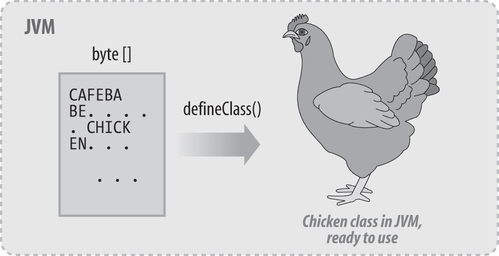

# 第十七章：反射，或“一个名为 Class 的类”

# 17.0 简介

类`java.lang.Class`和反射包`java.lang.reflect`提供了许多机制，用于从 Java 虚拟机中收集信息。这些设施被统称为*反射*，允许您在运行时动态加载类，查找类中的方法和字段，生成它们的列表，并调用动态加载类的方法。甚至有一种机制可以让您在程序运行时从头开始构造一个类（实际上是从字节的数组）。这是 Java 让您接近其神奇、秘密的内部机制的方式。

JVM 本身是一个大型程序，通常用 C 和/或 C++编写，实现 Java 虚拟机抽象。您可以通过互联网获取 OpenJDK 和其他 JVM 的源代码，这可能需要几个月的学习时间。在这里，我们仅集中在几个方面，并且只从使用 JVM 设施的程序员的角度来看待，而不涉及其内部工作原理；这是一个实现细节，可能会因供应商的 JVM 而异。

我将从动态加载现有类开始，继续列出类的字段和方法以及调用方法，最后通过使用`ClassLoader`动态创建类来结束。Java 的一个更有趣的方面之一，也是其灵活性的原因（昔日的小程序、Servlet、Web 服务和其他动态 API），同时也曾是其被认为速度问题的一部分，是*动态加载*的概念。例如，即使是最简单的“Hello, Java”程序也必须加载您的`HelloJava`类的类文件，其父类的类文件（通常是`java.lang.Object`），`PrintStream`类（因为您使用了`System.out`），`PrintStream`的父类，以及`IOException`及其父类等。要看到这个过程，请尝试类似于以下的东西：

```java
java -verbose HelloJava | more
```

举个例子，当小程序流行时，浏览器会通过互联网下载小程序的字节码文件并在您的桌面上运行它。它如何将类文件加载到正在运行的 JVM 中？我们在第 17.4 节中讨论了这部分 Java 的魔法。本章以 JDK 工具的替换版本*javap*和交叉引用工具结束，您可以使用它们来成为一位著名的 Java 作者，通过发布自己对完整 Java API 的参考。

# 17.1 获取类描述符

## 问题

您想从类名或实例中获取一个`Class`对象。

## 解决方案

如果类型名称在编译时已知，可以使用编译器关键字`.class`获取类实例，该关键字适用于任何在编译时已知的类型，甚至是八种基本类型。

否则，如果您有一个对象（一个类的实例），您可以调用`java.lang.Object`类的`getClass()`方法，它将返回该对象的类的`Class`对象（现在这是一个冗长的说法！）：

```java
        System.out.println("Trying the ClassName.class keyword:");
        System.out.println("Object class: " + Object.class);
        System.out.println("String class: " + String.class);
        System.out.println("String[] class: " + String[].class);
        System.out.println("Calendar class: " + Calendar.class);
        System.out.println("Current class: " + ClassKeyword.class);
        System.out.println("Class for int: " + int.class);
        System.out.println();

        System.out.println("Trying the instance.getClass() method:");
        System.out.println("Sir Robin the Brave".getClass());
        System.out.println(Calendar.getInstance().getClass());
```

当我们运行它时，我们看到这个：

```java
C:\javasrc\reflect>java  ClassKeyword 
Trying the ClassName.class keyword:
Object class: class java.lang.Object
String class: class java.lang.String
String[] class: class Ljava.lang.String;
Calendar class: class java.util.Calendar
Current class: class ClassKeyword
Class for int: int

Trying the instance.getClass( ) method:
class java.lang.String
class java.util.GregorianCalendar

C:\javasrc\reflect>
```

没什么花哨的，但正如你所见，你可以获取几乎任何在编译时已知的`Class`对象，无论它是否是包的一部分。

# 17.2 查找和使用方法和字段

## 问题

你需要在任意类中找到任意方法或字段名称。

## 解决方案

使用反射包`java.lang.reflect`。

## 讨论

如果你只想在一个特定的类中查找字段和方法，你不需要这个技巧；你可以简单地使用`new`创建一个类的实例，并直接引用它的字段和方法。但这允许你在任何类中查找方法和字段，即使是尚未编写的类！如同[Recipe 17.1 中创建的类对象一样，你可以获得构造函数列表、方法列表或字段列表。方法`getMethods()`列出了一个给定类的方法作为`Method`对象数组。类似地，`getFields()`返回一个`Field`对象列表。因为构造方法在 Java 中被特殊对待，还有一个`getConstructors()`方法，它返回一个`Constructor`对象数组。尽管`Class`在包`java.lang`中，但它返回的`Constructor`、`Method`和`Field`对象在`java.lang.``reflect`中，所以你需要导入这个包。`ListMethods`类（参见示例 17-1）展示了如何在运行时已知类名的类中获取方法列表。

##### 示例 17-1\. main/src/main/java/reflection/ListMethods.java

```java
public class ListMethods {
    public static void main(String[] argv) throws ClassNotFoundException {
        if (argv.length == 0) {
            System.err.println("Usage: ListMethods className");
            return;
        }
        Class<?> c = Class.forName(argv[0]);
        Constructor<?>[] cons = c.getConstructors();
        printList("Constructors", cons);
        Method[] meths = c.getMethods();
        printList("Methods", meths);
    }
    static void printList(String s, Object[] o) {
        System.out.println("*** " + s + " ***");
        for (int i=0; i<o.length; i++)
            System.out.println(o[i].toString());
    }
}
```

例如，你可以在类似于`java.lang.String`的类上运行示例 17-1，并得到一个相当长的方法列表；我只展示部分输出，让你看看它是什么样子的：

```java
> java reflection.ListMethods java.lang.String
*** Constructors ***
public java.lang.String( )
public java.lang.String(java.lang.String)
public java.lang.String(java.lang.StringBuffer)
public java.lang.String(byte[])
// and many more...
*** Methods ***
public static java.lang.String java.lang.String.copyValueOf(char[])
public static java.lang.String java.lang.String.copyValueOf(char[],int,int)
public static java.lang.String java.lang.String.valueOf(char)
// and more valueOf( ) forms...
public boolean java.lang.String.equals(java.lang.Object)
public final native java.lang.Class java.lang.Object.getClass( )
// and more java.lang.Object methods...
public char java.lang.String.charAt(int)
public int java.lang.String.compareTo(java.lang.Object)
public int java.lang.String.compareTo(java.lang.String)
```

你可以看到，这可以扩展（几乎字面意义上）以编写一个`BeanMethods`类，该类仅列出在 JavaBean 中定义的 set/get 方法（参见 Recipe 15.4）。

或者，你可以找到一个特定的方法并调用它，或者找到一个特定的字段并引用它的值。让我们首先找到一个给定的字段，因为这是最简单的。示例 17-2 是一段代码，给定一个`Object`和一个字段的名称，找到该字段（获取一个`Field`对象），然后检索并打印该字段的值作为一个`int`。

##### 示例 17-2\. main/src/main/java/reflection/FindField.java

```java
public class FindField {

    public static void main(String[] unused)
    throws NoSuchFieldException, IllegalAccessException {

        // Create instance of FindField
        FindField gf = new FindField();

        // Create instance of target class (YearHolder defined below).
        Object o = new YearHolder();

        // Use gf to extract a field from o.
        System.out.println("The value of 'currentYear' is: " +
            gf.intFieldValue(o, "currentYear"));
    }

    int intFieldValue(Object o, String name)
    throws NoSuchFieldException, IllegalAccessException {
        Class<?> c = o.getClass();
        Field fld = c.getField(name);
        int value = fld.getInt(o);
        return value;
    }
}

/** This is just a class that we want to get a field from */
class YearHolder {
    /** Just a field that is used to show getting a field's value. */
    public int currentYear = Calendar.getInstance().get(Calendar.YEAR);
}
```

如果我们需要找到一个方法怎么办？最简单的方法是使用方法`getMethod()`和`invoke()`。但这并不是完全微不足道的。假设有人给了我们一个对象的引用。我们不知道它的类，但被告知它应该有这个方法：

```java
public void work(String s) { }
```

我们希望调用`work()`方法。要找到这个方法，我们必须创建一个`Class`对象的数组，每个数组项对应于参数列表中的一个项目。因此，在这种情况下，我们创建一个仅包含对`String`类对象的引用的数组。因为我们在编译时知道类的名称，所以我们将使用较短的调用`String.class`，而不是`Class.forName()`。这样加上方法名称作为字符串，就可以让我们进入`Class`对象的`getMethod()`方法。如果成功，我们就会得到一个`Method`对象。但你知道吗？为了调用这个方法，我们必须构造另一个数组，这次是一个包含实际传递给调用的数据的`Object`引用数组。当然，我们还需要这个类的实例，在这个实例的上下文中运行方法。对于这个演示类，我们只需要传递一个字符串，因为我们的数组只包含这个字符串。示例 17-3 是找到方法并调用它的代码。

##### 示例 17-3\. main/src/main/java/reflection/GetAndInvokeMethod.java

```java
/**
 * Get a given method, and invoke it.
 * @author Ian F. Darwin, http://www.darwinsys.com/
 */
public class GetAndInvokeMethod {

    /** This class is just here to give us something to work on,
 * with a println() call that will prove we got into it.
 */
    static class X {
        public void work(int i, String s) {
            System.out.printf("Called: i=%d, s=%s%n", i, s);
        }
        // The main code does not use this overload.
        public void work(int i) {
            System.out.println("Unexpected call!");
        }
    }
    public static void main(String[] argv) {
        try {
            Class<?> clX = X.class; // or Class.forName("X");

            // To find a method we need the array of matching Class types.
            Class<?>[] argTypes = {
                int.class,
                String.class
            };

            // Now find a Method object for the given method.
            Method worker = clX.getMethod("work", argTypes);

            // To INVOKE the method, we need the invocation
            // arguments, as an Object array.
            Object[] theData = {
                42,
                "Chocolate Chips"
            };

            // The obvious last step: invoke the method.
            // First arg is an instance, null if static method
            worker.invoke(new X(), theData);

        } catch (Exception e) {
            System.err.println("Invoke() failed: " + e);
        }
    }
}
```

虽然不算微不足道，但也算不上糟糕。在大多数编程语言中，你无法在这里花费的 40 行内完成这项工作。

请注意：当方法的参数是原始类型（例如`int`）时，不要将`Integer.class`传递给`getMethod()`。相反，您必须使用表示原始类型`int`的类对象。找到这个类的最简单方法是在`Integer`类中，有一个名为`TYPE`的公共常量，所以你应该传递`Integer.TYPE`。对于所有原始类型，情况都是如此；每个对应的包装类都有一个称为`TYPE`的原始类引用。

Java 还包括一个称为`MethodHandle`的机制，旨在简化和泛化 Reflection API 用于调用方法；我们在这里不涉及它，因为在实践中它并未显示出显著改进。

# 17.3 通过 Reflection 访问私有方法和字段

## 问题

您想要访问私有字段，并且听说可以使用 Reflection API 来实现。

## 解决方案

通常访问私有字段是一个坏主意。但如果确实需要，并且`SecurityManager`允许您使用 Reflection，那么您可以做到。

## 讨论

有时候需要访问其他类中的私有字段。例如，最近我写了一个 JUnit 测试案例，需要查看目标类的所有字段。秘密在于在尝试获取值或调用方法之前，调用`Field`或`Method`描述符的`setAccessible()`方法并传递值`true`。就像在示例 17-4 中展示的那样，它确实如此简单。

##### 示例 17-4\. main/src/main/java/reflection/DefeatPrivacy.java

```java
class X {
    @SuppressWarnings("unused") // Used surreptitiously below.
    private int p = 42;
    int q = 3;
}

/**
 * Demonstrate that it is, in fact, all too easy to access private members
 * of an object using Reflection, using the default SecurityManager
 */
public class DefeatPrivacy {

    public static void main(String[] args) throws Exception {
        new DefeatPrivacy().process();
    }

    private void process() throws Exception {
        X x = new X();
        System.out.println(x);
        // System.out.println(x.p); // Won't compile
        System.out.println(x.q);
        Class<? extends X> class1 = x.getClass();
        Field[] flds = class1.getDeclaredFields();
        for (Field f : flds) {
            f.setAccessible(true);    // bye-bye "private"
            System.out.println(f + "==" + f.get(x));
            f.setAccessible(false);    // reset to "correct" state
        }
    }
}
```

###### 警告

使用时要*极度小心*，因为它可能违背 Java 编程中最珍视的一些原则。

# 17.4 加载和动态实例化类

## 问题

您想要动态加载类，就像 Web 服务器加载您的 Servlet 一样。

## 解决方案

使用 `class.forName("ClassName");` 和类的 `newInstance( )` 方法。

## 讨论

假设您正在编写一个 Java 应用程序，并希望其他开发人员能够通过编写在您应用程序上下文中运行的 Java 类来扩展您的应用程序。换句话说，这些开发人员实质上是使用 Java 作为扩展语言，就像小程序是 Web 浏览器的扩展一样。您可能希望定义一小组这些扩展程序将具有的方法，您可以调用这些方法进行初始化、操作和终止等目的。当然，最好的方法是发布一个给定的、可能是抽象的类，提供这些方法，并让开发人员从中继承。听起来耳熟能详吗？应该是的。这正是像网景这样的 Web 浏览器允许小程序部署的方式。

暂且不论安全性和通过网络套接字加载类文件的复杂问题，并假设用户可以将类安装到应用程序目录或在程序运行时出现在 `CLASSPATH` 中的目录中。首先，让我们定义我们的类。我们将其称为 `Cooklet`（参见 示例 17-5），以避免侵犯过度使用的 *applet* 这个词。假设每个子类都代表了驱动某种复杂食品准备和烹饪设备的代码，通过传统食谱的步骤制作饼干。在复杂化之前，我们将最初从成分到饼干的最简单路径开始。

##### 示例 17-5\. Cooklet.java

```java
/** A simple class, just to provide the list of methods that
 * users need to provide to be usable in our application.
 * Note that the class is abstract so you must subclass it,
 * but the methods are non-abstract so you don't have to provide
 * dummy versions if you don't need a particular functionality.
 */
public abstract class Cooklet {

    /** The initialization method. The Cookie application will
 * call you here (AFTER calling your no-argument constructor)
 * to allow you to initialize your code
 */
    public void initialize( ) {
    }

    /** The work method. The cookie application will call you
 * here when it is time for you to start cooking.
 */
    public void work( ) {
    }

    /** The termination method. The cookie application will call you
 * here when it is time for you to stop cooking and shut down
 * in an orderly fashion.
 */
    public void terminate( ) {
    }
}
```

现在，因为我们将要为其他人提供这个，我们可能也想做一个演示版本；参见 示例 17-6。

##### 示例 17-6\. main/src/main/java/reflection/DemoCooklet.java

```java
public class DemoCooklet extends Cooklet {
    public void work() {
        System.out.println("I am busy baking cookies.");
    }
    public void terminate() {
        System.out.println("I am shutting down my ovens now.");
    }
}
```

但我们的应用程序如何使用它呢？一旦我们有了用户类的名称，我们需要为该类创建一个 `Class` 对象。这可以通过静态方法 `Class.forName()` 轻松完成。然后我们可以使用 `Class` 对象的 `newInstance()` 方法创建它的实例；这将调用类的无参构造函数。然后我们只需将新构造的对象强制转换为我们的 `Cooklet` 类，并且我们就可以调用它的方法了！实际上，描述这段代码比看代码要花更长的时间，所以现在让我们来看看代码；参见 示例 17-7。

##### 示例 17-7\. main/src/main/java/reflection/Cookies.java

```java
public class Cookies {
    public static void main(String[] argv) {
        System.out.println("Cookies Application Version 0.0");
        Cooklet cooklet = null;
        String cookletClassName = argv[0];
        try {
            Class<Cooklet> cookletClass =
                (Class<Cooklet>) Class.forName(cookletClassName);
            cooklet = cookletClass.newInstance();
        } catch (Exception e) {
            System.err.println("Error " + cookletClassName + e);
        }
        cooklet.initialize();
        cooklet.work();
        cooklet.terminate();
    }
}
```

如果我们运行它呢？

```java
$ java Cookies DemoCooklet
Cookies Application Version 0.0
I am busy baking cookies.
I am shutting down my ovens now.
$
```

当然，这个版本的错误处理能力相对较弱。但您已经知道如何解决这个问题。如果要加载任何中等规模的应用程序类集合，您的 `ClassLoader` 还可以通过构建一个 `Package` 对象将类放入包中。

# 17.5 使用类加载器从头构建类

## 问题

您需要从非标准位置加载类并运行其方法。

## 解决方案

检查现有的加载器，例如`java.net.URLClassLoader`。如果没有合适的加载器，可以编写并使用自己的`ClassLoader`。

## 讨论

当然，`ClassLoader`是一个加载类的程序。Java 虚拟机内置了一个`ClassLoader`，但你的应用程序可以根据需要创建其他`ClassLoader`。学习编写和运行工作中的`ClassLoader`，并使用它来加载类并运行其方法，是一项非常不平凡的任务。事实上，你很少需要编写`ClassLoader`，但了解如何编写是有助于理解 JVM 如何查找类、创建对象和调用方法的过程。

`ClassLoader`本身是抽象的；你必须派生它，通常提供一个按你希望的方式加载类的`loadClass()`方法。它可以从网络连接、本地磁盘、RAM、串口或任何其他位置加载字节。或者，如果你有编译器的访问权限，你可以自己在内存中构造类文件。

如果你只需通过 Web 协议（或更广泛地通过一个或多个 URL）加载类，则可以使用名为`java.net.URLClassLoader`的通用加载器。

你必须调用`ClassLoader`的`loadClass()`方法来显式加载任何你希望加载的类。请注意，此方法用于加载你加载的所有类所需的所有类（例如尚未加载的超类）。然而，JVM 仍会正常通过类路径加载使用`new`运算符实例化的类。

当编写`ClassLoader`时，你的`loadClass()`方法需要将类文件读入字节数组（通常是通过读取），将数组转换为`Class`对象，并返回结果。

什么？听起来有点像“然后奇迹发生了……”确实如此。然而，类创建的奇迹发生在 JVM 内部，在那里你无法访问它。相反，你的`ClassLoader`必须调用其超类（即`java.lang.ClassLoader`）中的`protected defineClass()`方法。这在 Figure 17-1 中有所示，其中一个包含假想`Chicken`类的字节流通过调用`defineClass()`方法在 JVM 中被转换为一个准备运行的`Chicken`类。



###### 图 17-1\. `ClassLoader`的实际应用

### 接下来怎么办？

要使用你的`ClassLoader`子类，你需要实例化它，并调用其`loadClass()`方法，提供你想要加载的类的名称。这将为你提供一个命名类的`Class`对象；`Class`对象反过来让你构造实例、查找和调用方法等。参见 Recipe 17.2。

# 17.6 使用 JavaCompiler 从头构建类

## 问题

你可能更喜欢通过生成源代码并编译来动态构建类。

## 解决方案

使用`javax.tools`中的`JavaCompiler`。

## 讨论

有许多情况下，您可能需要动态生成代码。如果您正在编写一个框架，可能希望内省模型类以找到其字段，并动态生成访问器。正如我们在 Recipe 17.2 中看到的那样，可以使用`Field`类实现此目的。然而，对于高容量操作，生成直接访问代码可能更有效。

Java 编译器 API 自 Java 1.6 就存在，对于简单情况相当易于使用。以下是基本步骤：

+   获取当前 Java 运行时的`JavaCompiler`对象。如果不可用，要么完全放弃，要么退回到使用反射。

+   获取一个`CompilerTask`（也是`Callable`）来运行编译，传递输入和输出。

+   调用`Callable`，可以直接调用或使用`ExecutorService`。

+   检查结果。如果为 true，则调用该类。

这在 Example 17-8 中有所展示。

##### 示例 17-8\. main/src/main/java/reflection/JavaCompilerDemo.java

```java
package reflection;

import java.lang.reflect.Method;
import java.net.URI;
import java.util.List;
import java.util.concurrent.Callable;

// tag::main[] import javax.tools.JavaCompiler;
import javax.tools.SimpleJavaFileObject;
import javax.tools.ToolProvider;

/** Demo the Java Compiler API: Create a class, compile, load, and run it.
 * N.B. Will not run under Eclipse due to classpath settings;
 * best run it standalone using "java JavaCompiler.java"
 * @author Ian Darwin
 */
public class JavaCompilerDemo {
    private final static String PACKAGE = "reflection";
    private final static String CLASS = "AnotherDemo";
    private static boolean verbose;
    public static void main(String[] args) throws Exception {
        String source = "package " + PACKAGE + ";\n" +                  
            "public class " + CLASS + " {\n" +
            "\tpublic static void main(String[] args) {\n" +
            "\t\tString message = (args.length > 0 ? args[0] : \"Hi\")" + ";\n" +
            "\t\tSystem.out.println(message + \" from AnotherDemo\");\n" +
            "\t}\n}\n";
        if (verbose)
            System.out.print("Source to be compiled:\n" + source);

        JavaCompiler compiler = ToolProvider.getSystemJavaCompiler();   
        if (compiler == null) {
            throw new IllegalStateException("No default compiler, giving up.");
        }
        Callable<Boolean> compilation =
            compiler.getTask(null, null, null, List.of("-d","."), null, 
            List.of(new MySource(CLASS, source)));
        boolean result = compilation.call();                            
        if (result) {
            System.out.println("Compiled OK");
            Class<?> c = Class.forName(PACKAGE + "." + CLASS);          
            System.out.println("Class = " + c);
            Method m = c.getMethod("main", args.getClass());            
            System.out.println("Method descriptor = " + m);
            Object[] passedArgs = { args };
            m.invoke(null, passedArgs);                                 
        } else {
            System.out.println("Compilation failed");
        }
    }
}
// end::main[] 
class MySource extends SimpleJavaFileObject {
    final String source;
    MySource(String fileName, String source) {
        super(URI.create("string:///" + fileName.replace('.', '/') +
                Kind.SOURCE.extension), Kind.SOURCE);
        this.source = source;
    }
    @Override
    public CharSequence getCharContent(boolean ignoreEncodingErrors) {
        return source;
    }
}
```


我们要编译的源代码。在实际应用中，它可能是动态生成的，可能使用`StringBuffer`。


获取默认的`JavaCompiler`对象的引用。


要求编译器创建一个`CompilerTask`来执行编译。`CompilerTask`也是`Callable`，我们将其保存为该类型。`-d`和`.`是标准的*javac*参数。`MySource`扩展了编译器提供的 API 类`SimpleJavaFileObject`，通过创建*file://* URL 来访问文件。


可以将`Callable`放入线程池（`ExecutorService`）（参见 Recipe 16.1）；虽然我们不需要此功能，但编译器 API 返回它。我们直接调用`Callable`。


假设`result`为`true`，表示成功，我们使用`Class.forName()`加载该类。


我们必须找到生成类中的`main()`方法。我们重用`String[].class`类型来传递 args，因为所有的`main`方法都有相同的参数。


最后，我们可以调用`main`方法，重用传入的`args`数组来传递任何*欢迎*消息。

运行此程序时，带参数和不带参数都显示参数正确传递给生成的`AnotherDemo`类：

```java
$ java src/main/java/reflection/JavaCompilerDemo.java
Compiled OK
Class = class reflection.AnotherDemo
Method descriptor = public static void
  reflection.AnotherDemo.main(java.lang.String[])
Hi from AnotherDemo
$ java src/main/java/reflection/JavaCompilerDemo.java Welcome
Compiled OK
Class = class reflection.AnotherDemo
Method descriptor = public static void
  reflection.AnotherDemo.main(java.lang.String[])
Welcome from AnotherDemo
$
```

编译器 API 中有很多值得探索的内容，包括`JavaFileManager`，它允许您控制类文件的放置（除了像我们在此处使用`-d`一样），监听器以监视编译过程，以及控制输出和错误流。有关详细信息，请参阅`javax.tools.JavaCompiler`的[文档](https://docs.oracle.com/javase/8/docs/api/javax/tools/JavaCompiler.html)。

# 17.7 性能计时

## 问题

性能慢？

## 解决方案

使用*分析工具*，或者在调用目标方法之前和之后使用`System.currentTimeMillis()`来计时单个方法；差异即为该方法所需的时间。

## 讨论

### 分析工具

分析工具——分析器——作为程序员工具包中的重要工具，拥有悠久的历史。商业分析工具将通过显示每个方法被调用的次数和每次调用所需的时间来帮助找出程序中的瓶颈。

通过使用`VisualVM`工具可以从 Java 应用程序中获得大量有用的信息，该工具是 Oracle JDK 直到 Java 8 的一部分。从 Java 9 开始，该工具已开源，现在可以从[VisualVM 项目](https://visualvm.github.io/index.html)中获取。

JDK 的另一个工具是[Java Flight Recorder](https://en.wikipedia.org/wiki/JDK_Flight_Recorder)，现在已开源并内置于 JDK 中。其数据旨在由[Java Mission Control](https://en.wikipedia.org/wiki/JDK_Mission_Control)分析。还有第三方分析工具将提供更详细的信息；在网上搜索将找到当前的商业产品。

### 测量单个方法

最简单的技术是在动态加载主程序之前和之后保存 JVM 累积时间，然后计算这些时间的差异。要做到这一点的代码在 Example 17-11 中有所呈现；现在只需记住我们有一种计时给定 Java 类的方法。

衡量特定操作效率的一种方式是在隔离环境中多次运行它。因此，程序运行所需的总时间大致相当于多次调用相同操作的总时间。如果您想知道两种方法哪种更有效率，可以比较这些粗略的数字。考虑字符串连接与`println()`的情况。代码

```java
println("Time is " + n.toString( ) + " seconds");
```

可能会通过创建一个`StringBuilder`来工作；附加字符串`"Time is"`，值为`n`的字符串和`"seconds"`；最后将完成的`StringBuilder`转换为`String`并传递给`println()`。假设您有一个执行大量此操作的程序，例如创建大量 HTML 的 Java servlet，并且您期望（或至少希望）您的网站足够繁忙，以便有效地执行此操作将产生差异。有两种思考方式：

+   理论 A：这种字符串连接效率低下。

+   理论 B：字符串连接并不重要；`println()`也效率低下。

支持理论 A 的人可能会说，因为 `println()` 只是把内容放入缓冲区，所以非常快，而字符串连接才是昂贵的部分。

如何在理论 A 和理论 B 之间做出决定？假设你愿意编写一个简单的测试程序来测试这两个理论。我们可以分别用两种方法编写一个简单的程序并计时。示例 17-9 是理论 A 的计时程序。

##### Example 17-9\. main/src/main/java/performance/StringPrintA.java

```java
public class StringPrintA {
    public static void main(String[] argv) {
        Object o = "Hello World";
        for (int i=0; i<100000; i++) {
            System.out.println("<p><b>" + o.toString() + "</b></p>");
        }
    }
}
```

`StringPrintAA`（在 *javasrc* 仓库中但此处未列出）与 `StringBuilder` 明确用于字符串连接是相同的。示例 17-10 是理论 B 的测试程序。

##### 示例 17-10\. main/src/main/java/performance/StringPrintB.java

```java
public class StringPrintB {
    public static void main(String[] argv) {
        Object o = "Hello World";
        for (int i=0; i<100000; i++) {
            System.out.print("<p><b>");
            System.out.print(o.toString());
            System.out.print("</b></p>");
            System.out.println();
        }
    }
}
```

### 计时结果

我在同一台计算机上两次运行了 `StringPrintA`、`StringPrintAA` 和 `StringPrintB`。为了消除 JVM 启动时间，我从一个名为 `TimeNoArgs` 的程序中运行它们，该程序通过 Reflection API 调用类名并调用其 `main()` 方法。`TimeNoArgs` 和一个用于运行它的 shell 脚本 *stringprinttimer.sh*，位于 *javasrc* 源代码库的 *performance* 文件夹中。以下是结果：

| 2004 年程序 | 秒 |
| --- | --- |
| `StringPrintA` | 17.23, 17.20 秒 |
| `StringPrintAA` | 17.23, 17.23 秒 |
| `StringPrintB` | 27.59, 27.60 秒 |
| 2014 年程序 | 秒 |
| --- | --- |
| `StringPrintA` | 0.714, 0.525 秒 |
| `StringPrintAA` | 0.616, 0.561 秒 |
| `StringPrintB` | 1.091, 1.039 秒 |

尽管由于 JVM 的改进和更快的硬件，十年来时间已经减少了大约 20 倍，但比率仍然保持了显著的一致性：`StringPrintB` 多次调用 `print()` 和 `println()`，大约需要两倍的时间。

教训：不要猜测。如果重要，就计时。

另一个教训：多次调用 `System.out.print()` 比同样次数调用 `StringBuilder` 的 `append()` 方法成本更高，大约是 1.5 倍（或 150%）。理论 B 胜出；额外的 `println` 调用似乎节省了字符串连接，但使程序运行时间显著延长。

### 性能的其他方面：GC

软件性能的其他方面很多。在 Java 中，其中一个基本方面是垃圾回收行为。Sun/Oracle 通常在 JavaOne 上讨论这个问题。例如，参见 2003 年 JavaOne 展示文档 [“Java HotSpot 虚拟机中的垃圾收集”](http://www.oracle.com/technetwork/java/javase/tech/ts-3153-coomes-19899-dsf-150093.pdf)。还可以查看由相同 GC 开发团队在 2007 年 JavaOne 上的演讲 [“垃圾收集友好的编程”](https://docs.huihoo.com/javaone/2007/java-se/TS-2906.pdf)。JavaOne 2010 展示了更新的演示文稿 [“垃圾收集神话破除者”](https://oreil.ly/java-world-the-garbage-collection-mythbusters)。

### 一个计时程序

在 Java 中构建一个简化的 `time` 命令非常容易，只要您有 `System.currentTimeMillis()` 就可以开始了。运行我的 `Time` 程序，在命令行上指定要计时的类的名称，后面跟上该类运行所需的参数（如果有的话）。程序显示在 示例 17-11 中。显示出类所花费的时间。但请记住，`System.currentTimeMillis()` 返回的是时钟时间，不一定是 CPU 时间。因此，您必须在一台没有运行大量后台进程的机器上运行它。还要注意，我使用动态加载（参见 配方 17.4）允许您在命令行上放置 Java 类名。

##### 示例 17-11\. main/src/main/java/performance/Time.java

```java
public class Time {
    public static void main(String[] argv) throws Exception {
        // Instantiate target class, from argv[0]
        Class<?> c = Class.forName(argv[0]);

        // Find its static main method (use our own argv as the signature).
        Class<?>[] classes = { argv.getClass() };
        Method main = c.getMethod("main", classes);

        // Make new argv array, dropping class name from front.
        // Normally Java doesn't get the class name, but in
        // this case the user puts the name of the class to time
        // as well as all its arguments...
        String nargv[] = new String[argv.length - 1];
        System.arraycopy(argv, 1, nargv, 0, nargv.length);

        Object[] nargs = { nargv };

        System.err.println("Starting class " + c);

        // About to start timing run. Important to not do anything
        // (even a println) that would be attributed to the program
        // being timed, from here until we've gotten ending time.

        // Get current (i.e., starting) time
        long t0 = System.currentTimeMillis();

        // Run the main program
        main.invoke(null, nargs);

        // Get ending time, and compute usage
        long t1 = System.currentTimeMillis();

        long runTime = t1 - t0;

        System.err.println(
             "runTime="  + Double.toString(runTime/1000D));
    }
}
```

当然，您不能直接将操作系统 `time` 命令的结果与运行此程序的结果进行比较。存在一个相当大但是相当恒定的初始化开销——例如 JVM 启动和 `Object` 以及 `System.out` 的初始化——前者包含在内，后者排除在外。甚至可以说我的 `Time` 程序更加准确，因为它排除了这种恒定的开销。但是，正如前面提到的，必须在单用户机器上运行才能产生可重复的结果。而且，在等待计时程序完成时，在另一个窗口中运行编辑器是不公平的！

## 参见

*[Java 性能](http://shop.oreilly.com/product/0636920272250.do)* 由斯科特·奥克斯（O’Reilly）编著，提供了调优 Java 性能的信息。

# 17.8 打印类信息

## 问题

您想要打印类的所有信息，类似于 *javap* 的方式。

## 解决方案

获取一个 `Class` 对象，调用其 `getFields()` 和 `getMethods()` 方法，并打印结果。

## 讨论

JDK 包含一个名为 *javap* 的程序，即 Java 打印机。Sun 的 JDK 版本通常打印类文件的大纲——方法和字段列表——但也可以打印 Java 字节码或机器指令。Kaffe 软件包没有包含 *javap* 的版本，因此我编写了一个并贡献了它（见 示例 17-12）。Kaffe 的开发人员稍作扩展，但基本上与我的版本相同。我的版本不打印字节码；它的行为类似于在没有给出命令行选项的情况下 Sun 的行为。

`getFields()` 和 `getMethods()` 方法分别返回 `Field` 和 `Method` 的数组；它们都位于 `java.lang.reflect` 包中。我使用 `Modifiers` 对象获取字段和方法的权限和存储属性的详细信息。在许多 Java 实现中，您可以跳过这一步骤，并简单地对每个 `Field` 和 `Method` 对象调用 `toString()` 方法（正如我在这里对 `Constructors` 所做的那样）。这样做使我能够更加控制格式。

##### 示例 17-12\. main/src/main/java/reflection/MyJavaP.java

```java
public class MyJavaP {

    /** Simple main program, construct self, process each class name
 * found in argv.
 */
    public static void main(String[] argv) {
        MyJavaP pp = new MyJavaP();

        if (argv.length == 0) {
            System.err.println("Usage: MyJavaP className [...]");
            System.exit(1);
        } else for (int i=0; i<argv.length; i++)
            pp.doClass(argv[i]);
    }

    /** Format the fields and methods of one class, given its name.
 */
    protected void doClass(String className) {
        try {
            Class<? extends Object> c = Class.forName(className);

            final Annotation[] annotations = c.getAnnotations();
            for (Annotation a : annotations) {
                System.out.println(a);
            }

            System.out.println(c + " {");

            Field fields[] = c.getDeclaredFields();
            for (Field f : fields) {
                final Annotation[] fldAnnotations = f.getAnnotations();
                for (Annotation a : fldAnnotations) {
                    System.out.println(a);
                }
                if (!Modifier.isPrivate(f.getModifiers()))
                    System.out.println("\t" + f + ";");
            }

            Constructor<? extends Object>[] constructors = c.getConstructors();
            for (Constructor<? extends Object> con : constructors) {
                System.out.println("\t" + con + ";");
            }

            Method methods[] = c.getDeclaredMethods();
            for (Method m : methods) {
                final Annotation[] methodAnnotations = m.getAnnotations();
                for (Annotation a : methodAnnotations) {
                    System.out.println(a);
                }
                if (!Modifier.isPrivate(m.getModifiers())) {
                    System.out.println("\t" + m + ";");
                }
            }
            System.out.println("}");
        } catch (ClassNotFoundException e) {
            System.err.println("Error: Class " +
                className + " not found!");
        } catch (Exception e) {
            System.err.println("JavaP Error: " + e);
        }
    }
}
```

# 17.9 列出包中的类

## 问题

想要获取一个包中所有类的列表。

## 解决方案

你通常无法在一般情况下做到这一点。有一些有限的方法，大多涉及`CLASSPATH`扫描。

## 讨论

没有办法找出包中的所有类，部分原因是，正如我们在 Recipe 17.5 中看到的，您可以随时向包中添加类！而且，不管好坏，JVM 和标准类（例如`java.lang.Package`）甚至不允许您枚举当前给定包中的类。

最接近的方法是查看`CLASSPATH`。但这仅适用于本地目录和 JAR 文件；如果有本地定义或网络加载的类，则无法帮助。换句话说，它会找到编译后的类，但不包括动态加载的类。有几个库可以为您自动化此过程，欢迎使用。扫描`CLASSPATH`的代码本质上非常简单，所以具有热情的优秀开发人员将希望仔细研究它。示例 17-13 展示了我的`ClassesInPackage`类及其一个静态方法。该代码可以运行，但对错误处理非常短，遇到不存在的包或其他失败情况将崩溃。

该代码经历了一些变动，将`CLASSPATH`作为 URL 枚举进行检查，然后查看每个元素。

文件

URL 将包含包含*.class*文件的文件路径名，因此我们可以直接列出它。

jar

URL 包含文件名，格式为“file:/path_to_jar_file!package/name”，因此我们需要将其分开；在这种情况下，“包名称”后缀稍显冗余，因为它是我们要求`ClassLoader`给出的包。

##### 示例 17-13\. main/src/main/java/reflection/ClassesInPackage.java

```java
public class ClassesInPackage {

    /** This approach began as a contribution by Paul Kuit at
 * http://stackoverflow.com/questions/1456930/, but his only
 * handled single files in a directory in classpath, not in Jar files.
 * N.B. Does NOT handle system classes!
 * @param packageName
 * @return
 * @throws IOException
 */
    public static String[] getPackageContent(String packageName)
        throws IOException {

        final String packageAsDirName = packageName.replace(".", "/");
        final List<String> list = new ArrayList<>();
        final Enumeration<URL> urls =
                Thread.currentThread().
                getContextClassLoader().
                getResources(packageAsDirName);
        while (urls.hasMoreElements()) {
            URL url = urls.nextElement();
            // System.out.println("URL = " + url);
            String file = url.getFile();
            switch (url.getProtocol()) {
            case "file":
                // This is the easy case: "file" is
                // the full path to the classpath directory
                File dir = new File(file);
                for (File f : dir.listFiles()) {
                    list.add(packageAsDirName + "/" + f.getName());
                }
                break;
            case "jar":
                // This is the harder case; "file" is of the form
                // "jar:/home/ian/bleah/darwinsys.jar!com/darwinsys/io"
                // for some jar file that contains at least one class from
                // the given package.
                int colon = file.indexOf(':');
                int bang = file.indexOf('!');
                String jarFileName = file.substring(colon + 1, bang);
                JarFile jarFile = new JarFile(jarFileName);
                Enumeration<JarEntry> entries = jarFile.entries();
                while (entries.hasMoreElements()) {
                    JarEntry e = entries.nextElement();
                    String jarEntryName = e.getName();
                    if (!jarEntryName.endsWith("/") &&
                        jarEntryName.startsWith(packageAsDirName)) {
                        list.add(jarEntryName);
                    }
                }
                break;
            default:
                throw new IllegalStateException(
                "Dunno what to do with URL " + url);
            }
        }
        return list.toArray(new String[] {});
    }

    public static void main(String[] args) throws IOException {
        String[] names = getPackageContent("com.darwinsys.io");
        for (String name : names) {
            System.out.println(name);
        }
        System.out.println("Done");
    }
}
```

请注意，如果在*javasrc*项目中运行此应用程序，它将两次列出演示包（`com.darwinsys.io`）的成员，因为它将在构建目录和 JAR 文件中找到它们。如果这是一个问题，请将`List`更改为`Set`（参见 Recipe 7.3）。

# 17.10 使用和定义注解

## 问题

你需要知道如何在代码中使用注解或定义自己的注解。

## 解决方案

在你的代码中使用`@``AnnotationName`来标注类、方法、字段等。使用`@interface`在与`class`、`interface`等相同级别定义注解。

## 讨论

注解是一种在源代码之外添加额外信息的方法。注解可以针对编译器或运行时检查。它们的语法在某种程度上模仿了 javadoc 注解（如文档注释内的`@author`、`@version`）。注解是我所谓的*类似类的东西*（因此它们有首字母大写的名称），但在使用时前缀为`@`号（例如`@Override`）。你可以将它们放在类、方法、字段和少数其他位置；它们必须出现在它们注释的东西之前（忽略空格和注释）。在给定位置，给定注解只能出现一次（在 Java 8 或 9 中放宽了这一限制）。

作为编译时注解的一个例子，考虑覆盖时常见的错误：如 Example 17-14 所示，方法签名的小错误可能导致意外的重载。

##### Example 17-14\. MyClass.java（为何我们需要注解的示例）

```java
public class MyClass {

    public boolean equals(MyClass object2) {
        // compare, return boolean
    }
}
```

该代码在任何版本的 Java 上都能编译通过，但是它是错误的。`equals()`方法的标准契约（见 Recipe 8.1）要求其唯一参数为`java.lang.Object`类型。前述版本创建了一个意外的重载。因为`equals()`方法（及其伴侣方法`hashCode()`；见 Recipe 8.1）的主要用途是在集合类（见 Chapter 7）中，这个重载方法永远不会被调用，导致代码无效，并且在`Set`和`Map`中的操作是错误的。

解决方法非常简单：使用注解`java.lang.Override`，例如 Example 17-15，告知编译器注解的方法需要覆盖从超类型（如超类或接口）继承的方法。如果没有，则代码将无法编译通过。

##### Example 17-15\. 带有 @Override 注解的 MyClass.java

```java
public class MyClass {

    @Override
    public boolean equals(MyClass object2) {
        // compare, return boolean
    }
}
```

这个`equals()`版本虽然仍然是错误的，但会在编译时标记为错误，潜在地避免了大量的调试时间。在你自己的类上使用这种注解，在编写新代码时和维护代码库时都会有帮助；如果从超类中删除了一个方法，所有尝试覆盖它的子类 *并且* 带有`@Override`注解的方法将导致一个错误消息，让你能够删除一堆死代码。

注解的第二个主要用途是在运行时提供元数据。例如，Java 持久性 API（JPA，见[*https://darwinsys.com/db_in_java*](https://darwinsys.com/db_in_java)）使用其自己的一组来自`javax.persistence`包的注解来标记要加载和/或持久化的实体类。一个 JPA 实体类可能看起来像 Example 17-16。

##### Example 17-16\. main/src/main/java/domain/Person.java（JPA 注解）

```java
@Entity
public class Person {

    int id;
    protected String firstName;
    protected String lastName;

    public Person() {
        // required by JPA; must code it since we need 2-arg form.
    }

    public Person(String firstName, String lastName) {
        this.firstName = firstName;
        this.lastName = lastName;
    }

    @Id @GeneratedValue(strategy=GenerationType.AUTO, generator="my_poid_gen")
    public int getId() {
        return id;
    }

    public void setId(int id) {
        this.id = id;
    }

    public String getFirstName() {
        return firstName;
    }

    public void setFirstName(String firstName) {
        this.firstName = firstName;
    }

    @Column(name="surname")
    public String getLastName() {
        return lastName;
    }

    public void setLastName(String lastName) {
        this.lastName = lastName;
    }

    @Override
    public String toString() {
        return getFullName();
    }

    @Transient /* synthetic: cannot be used in JPA queries. */
    public String getFullName() {
        StringBuilder sb = new StringBuilder();
        if (firstName != null)
            sb.append(firstName).append(' ');
        if (lastName != null)
            sb.append(lastName);
        if (sb.length() == 0)
            sb.append("NO NAME");
        return sb.toString();
    }
}
```

在类级别上的`@Entity`注解指示 JPA 将其视为要映射到数据库中的数据对象。`@Id`告知 JPA 这个`id`是主键属性，而`@GeneratedValue`告诉它如何为新创建的对象分配主键值。只有在关系数据库中的列名与基于属性的预期名称不同时，才需要`@Column`注解；在这种情况下，SQL 数据库设计者使用了`surname`，而 Java 开发者想使用`lastName`。

我曾说过注解是类似类的东西，因此你可以自定义。这里的语法有点古怪；你使用`@interface`。据传说，开发这一特性的团队要么被告知不要，要么是因为在 Java SE 1.4 引入`enum`关键字时造成的麻烦而害怕引入新的关键字。又或许，他们只是想使用更符合注解使用情况的语法。无论如何，示例 17-17 是一个自定义注解的简单示例。

##### 示例 17-17\. 定义的简单注解

```java
package lang;

public @interface MyToyAnnotation {
}
```

注解是类似类的东西，因此它们的命名应该相同——即以大写字母开头，并且如果是公共的，应存储在同名的源文件中（例如，*MyToyAnnotation.java*）。

使用*javac*编译示例 17-17，你会看到一个新的*MyToyAnnotation.class*文件。在示例 17-18 中，我们使用*javap*，标准的 JDK 类检查工具来检查它。

##### 示例 17-18\. 运行 javap 查看简单注解

```java
$ javap lang.MyToyAnnotation
Compiled from "MyToyAnnotation.java"
public interface lang.MyToyAnnotation extends java.lang.annotation.Annotation {
}
$
```

正如它所说，注解在类文件格式中表示为只是扩展了`Annotation`接口的接口（回答显而易见的问题，你可以这样编写简单接口，但这真是个糟糕的主意）。在示例 17-19 中，我们快速看一下`Annotation`本身。

##### 示例 17-19\. 注解接口详解

```java
$ javap java.lang.annotation.Annotation
Compiled from "Annotation.java"
public interface java.lang.annotation.Annotation {
  public abstract boolean equals(java.lang.Object);
  public abstract int hashCode();
  public abstract java.lang.String toString();
  public abstract java.lang.Class<? extends java.lang.annotation.Annotation>
    annotationType();
}
$
```

注解可以被设计成编译器只允许在代码中的某些点上使用。示例 17-20 是一个只能用于类或接口的注解。

##### 示例 17-20\. 类、接口等的样本注释

```java
@Target(ElementType.TYPE)
@Retention(RetentionPolicy.RUNTIME)
public @interface MyAnnotation {
}
```

`@Target`指定了注解可以使用的位置：`ElementType.TYPE`使其可用于类、接口、类似类的东西（如枚举），甚至是注解！要将其限制在仅注解使用上，有`ElementType.ANNOTATION_TYPE`。其他类型包括`METHOD`、`FIELD`、`CONSTRUCTOR`、`LOCAL_VARIABLE`、`PACKAGE`和`PARAMETER`。因此，这个注解本身被两个`@ANNOTATION_TYPE`目标注解注释。

使用现有框架的注解需要查阅其文档。在运行时使用自定义注解需要使用反射 API，如示例 17-21 所示。

关于注解还有一件事需要注意，那就是它们可能具有属性。这些属性在注解源代码中定义为方法，但在使用注解时用作属性。Example 17-21 展示了一个具有此类属性的注解注解。

##### Example 17-21\. main/src/main/java/lang/AnnotationDemo.java

```java
/**
 * A sample annotation for types (classes, interfaces);
 * it will be available at run time.
 */
@Target(ElementType.TYPE)
@Retention(RetentionPolicy.RUNTIME)
public @interface AnnotationDemo {
    public boolean fancy() default false;
    public int order() default 42;
}

/** A simple example of using the annotation */
@AnnotationDemo(fancy=true)
@Resource(name="Dumbledore")
class FancyClassJustToShowAnnotation {

    /** Print out the annotations attached to this class */
    public static void main(String[] args) {
        Class<?> c = FancyClassJustToShowAnnotation.class;
        System.out.println("Class " + c.getName() + " has these annotations:");
        for (Annotation a : c.getAnnotations()) {
            if (a instanceof AnnotationDemo) {
                AnnotationDemo ad = (AnnotationDemo)a;
                System.out.println("\t" +a +
                    " with fancy=" + ad.fancy() +
                    " and order " + ad.order());
            } else {
                System.out.println("\tSomebody else's annotation: " + a);
            }
        }
    }
}
```

`AnnotationDemo` 具有元注解 `@Target(ElementType.TYPE)`，表明它可以注解用户定义的类型（例如类）。其他 `ElementType` 选项包括 `METHOD`、`FIELD` 和 `PARAMETER`。如果需要多个选项，请使用数组初始化语法。

`AnnotationDemo` 还具有 `@Retention(RetentionPolicy.RUNTIME)` 注解，请求在运行时保留它。显然，任何在运行时被框架检查的注解都需要此注解。

这两个元注解通常用于运行时检查的用户定义注解。

类 `FancyClassJustToShowAnnotation` 展示了如何使用 `AnnotationDemo` 注解，以及一个标准的 Java 注解（`@Resource` 注解）。

参考 Recipe 17.11 以查看如何完整使用此机制的示例。

# 17.11 通过注解查找类似插件的类

## 问题

您希望执行类似插件的操作，但又不想使用显式的插件 API。

## 解决方案

为此目的定义一个注解，并使用它来标记插件类。

## 讨论

假设我们想建模 Java EE 标准中的 `javax.annotations.Named` 或 `javax.faces.ManagedBean` 注解的工作方式；对于每个使用这些注解的类，将类名转换为类似实例的名称（例如，将首字母小写），并进行特殊处理。您可能希望像以下这样做：

1.  获取给定包中的类列表（参见 Recipe 17.9）。

1.  检查类是否已注解。

1.  如果是这样，请保存名称和稍后使用的 `Class` 描述符。

这在 Example 17-22 中实现。

##### Example 17-22\. main/src/main/java/reflection/PluginsViaAnnotations

```java
/** Discover "plugins" or other add-in classes via Reflection using Annotations */
public class PluginsViaAnnotations {

    /**
 * Find all classes in the given package which have the given
 * class-level annotation class.
 */
    public static List<Class<?>> findAnnotatedClasses(String packageName,
        Class<? extends Annotation> annotationClass) throws Exception {

        List<Class<?>> ret = new ArrayList<>();
        String[] clazzNames = ClassesInPackage.getPackageContent(packageName);
        for (String clazzName : clazzNames) {
            if (!clazzName.endsWith(".class")) {
                continue;
            }
            clazzName = clazzName.replace('/', '.').replace(".class", "");
            Class<?> c = null;
            try {
                c = Class.forName(clazzName);
            } catch (ClassNotFoundException ex) {
                System.err.println("Weird: class " + clazzName +
                    " reported in package but gave CNFE: " + ex);
                continue;
            }
            if (c.isAnnotationPresent(annotationClass) &&
                    !ret.contains(c))
                    ret.add(c);

        }
        return ret;
    }
```

我们可以进一步支持特定方法注解，类似于 `javax.annotations.PostCreate`，用于装饰在框架实例化 bean 后调用的方法。我们的流程现在类似于这样，并且代码显示在 Example 17-23 中：

1.  获取给定包中的类列表（参见 Recipe 17.9）。

1.  如果使用类级别的注解，请检查该类是否已注解。

1.  如果此类仍然感兴趣，请获取其方法列表。

1.  对于每个方法，查看其是否包含给定的特定方法注解。

1.  如果是这样，请将该类和方法添加到可调用方法列表中。

##### Example 17-23\. main/src/main/java/reflection/PluginsViaAnnotations（查找带注解方法）

```java
    /**
 * Find all classes in the given package which have the given
 * method-level annotation class on at least one method.
 */
    public static List<Class<?>> findClassesWithAnnotatedMethods(String packageName,
            Class<? extends Annotation> methodAnnotationClass) throws Exception {
        List<Class<?>> ret = new ArrayList<>();
        String[] clazzNames = ClassesInPackage.getPackageContent(packageName);
        for (String clazzName : clazzNames) {
            if (!clazzName.endsWith(".class")) {
                continue;
            }
            clazzName = clazzName.replace('/', '.').replace(".class", "");
            Class<?> c = null;
            try {
                c = Class.forName(clazzName);
                // System.out.println("Loaded " + c);
            } catch (ClassNotFoundException ex) {
                System.err.println("Weird: class " + clazzName +
                    " reported in package but gave CNFE: " + ex);
                continue;
            }
            for (Method m : c.getDeclaredMethods()) {
                // System.out.printf("Class %s Method: %s\n",
                //     c.getSimpleName(), m.getName());
                if (m.isAnnotationPresent(methodAnnotationClass) &&
                        !ret.contains(c)) {
                    ret.add(c);
                }
            }
        }
        return ret;
    }
```

## 参见

第 17.10 节及本章剩余内容。

# 17.12 程序：交叉引用

你可能见过那些完全由 Java API 列表组成的其他 Java 书籍，这些书籍针对 JDK 的某个版本。我不认为你会认为这些作品的作者坐下来从头开始键入整个内容。作为一个程序员，希望你意识到，必须有一种方法从 Java 获取这些信息。但你可能没有意识到这是多么容易！如果你忠实地阅读了这一章，现在你知道有一种真正的方法：让计算机来走这条路。示例 17-24 是一个将大部分技术结合在一起的程序。这个版本生成了一个交叉引用列表，但通过重写最后几个方法，你可以轻松地将其转换为以任何你喜欢的格式打印信息，包括 API 参考书。你需要处理这些或那些发布软件的细节——FrameMaker、troff、T[E]X，或者其他——但这是简单的部分。

此程序比第 17.8 节的`MyJavaP`更充分地利用了反射 API。它还使用了`java.util.zip`类（参见第 10.15 节），以破解包含 API 类文件的 JAR 存档。加载并列出存档中找到的每个类文件；列表部分类似于`MyJavaP`。

##### 示例 17-24\. main/src/main/java/reflection/CrossRef.java

```java
public class CrossRef extends APIFormatter {

    /** Simple main program, construct self, process each .ZIP file
 * found in CLASSPATH or in argv.
 */
    public static void main(String[] argv) throws IOException {
        CrossRef xref = new CrossRef();
        xref.doArgs(argv);
    }

    /**
 * Print the fields and methods of one class.
 */
    protected void doClass(Class<?> c) {
        startClass(c);
        try {
            Field[] fields = c.getDeclaredFields();
            Arrays.sort(fields, new Comparator<Field>() {
                public int compare(Field o1, Field o2) {
                    return o1.getName().compareTo(o2.getName());
                }
            });
            for (int i = 0; i < fields.length; i++) {
                Field field = (Field)fields[i];
                if (!Modifier.isPrivate(field.getModifiers()))
                    putField(field, c);
                // else System.err.println("private field ignored: " + field);
            }

            Method methods[] = c.getDeclaredMethods();
            Arrays.sort(methods, new Comparator<Method>() {
                public int compare(Method o1, Method o2) {
                    return o1.getName().compareTo(o2.getName());
                }
            });
            for (int i = 0; i < methods.length; i++) {
                if (!Modifier.isPrivate(methods[i].getModifiers()))
                    putMethod(methods[i], c);
                // else System.err.println("pvt: " + methods[i]);
            }
        } catch (Exception e) {
            e.printStackTrace();
        }
        endClass();
    }

    /** put a Field's information to the standard output.  */
    protected void putField(Field fld, Class<?> c) {
        println(fld.getName() + " field " + c.getName() + " ");
    }

    /** put a Method's information to the standard output.  */
    protected void putMethod(Method method, Class<?> c) {
        String methName = method.getName();
        println(methName + " method " + c.getName() + " ");
    }

    /** Print the start of a class. Unused in this version,
 * designed to be overridden */
    protected void startClass(Class<?> c) {
    }

    /** Print the end of a class. Unused in this version,
 * designed to be overridden */
    protected void endClass() {
    }

    /** Convenience routine, short for System.out.println */
    protected final void println(String s) {
        System.out.println(s);
    }
}
```

你可能已经注意到了`startClass()`和`endClass()`这两个方法，它们是空的。这些方法是为了在每个类的开始和结束时方便子类化而设计的占位符。一个例子可能是一个高级文本格式化应用程序，在每个类的开头输出粗体标题。另一个例子可能是 XML，你需要在每个类的前面写一个像`<class>`这样的标签，以及类的末尾写一个`</class>`。示例 17-25 是一个特定于 XML 的子类，为每个字段和方法生成（有限的）XML。

##### 示例 17-25\. main/src/main/java/reflection/CrossRefXML.java

```java
public class CrossRefXML extends CrossRef {

    public static void main(String[] argv) throws IOException {
        CrossRef xref = new CrossRefXML();
        xref.doArgs(argv);
    }

    /** Print the start of a class.
 */
    protected void startClass(Class<?> c) {
        println("<class><classname>" + c.getName() + "</classname>");
    }

    protected void putField(Field fld, Class<?> c) {
        println("<field>" + fld + "</field>");
    }

    /** put a Method's information to the standard output.
 * Marked protected so you can override it (hint, hint).
 */
    protected void putMethod(Method method, Class<?> c) {
        println("<method>" + method + "</method>");
    }

    /** Print the end of a class.
 */
    protected void endClass() {
        println("</class>");
    }
}
```

顺便说一句，如果你用这些方法出书赚大钱了，“记得，记得我！”

## 参见

我们还没有探讨反射或`ClassLoader`机制的方方面面，但现在你应该对其工作原理有一个基本的了解。

可能最重要的遗漏是 `SecurityManager` 和 `ProtectionDomain`。在给定的 JVM 实例中只能安装一个 `SecurityManager`（例如，防止恶意代码提供自己的 `SecurityManager`！）。例如，运行旧的 Java Applet API 的浏览器提供的 `SecurityManager` 比标准的要严格得多。编写这样的 `SecurityManager` 留给读者作为一个重要练习，特别是计划从互联网加载类的任何人！（有关安全管理器和 Java 安全 API 的更多信息，请参阅 *[Java Security](http://oreil.ly/java-security-2nd)*，作者 Scott Oaks（O'Reilly）。`ProtectionDomain` 可以通过 `ClassLoader` 提供给指定类运行所需的所有权限。

我还没有深入探讨 JVM 中的许多主题；可以参考（有些过时的）O'Reilly 图书 *[Java Virtual Machine](http://shop.oreilly.com/product/9781565921948.do)*，作者 Troy Downing 和 Jon Meyer，以及 *[Java Language Reference](http://shop.oreilly.com/product/9781565923263.do)*，作者 Mark Grand。你也可以阅读 Sun/Oracle 的 *Java 语言规范* 和 *JVM 规范* 文档（随新版本更新，可在线获取），享受和提高阅读的乐趣！

Apache 软件基金会维护了一系列非常有用的软件包，可以免费获取和使用。源代码始终可以在其网站上免费获取。你可能想调查的两个包括 Commons BeanUtils 和 Byte Code Engineering Library (BCEL)。[Commons BeanUtils](http://commons.apache.org/beanutils) 声称提供了一些对反射 API 更易使用的包装器。BCEL 是一个第三方工具包，用于构建和操作字节码类文件。由 Markus Dahm 编写的 BCEL 已成为 [Apache Commons 项目](http://commons.apache.org/bcel) 的一部分。
