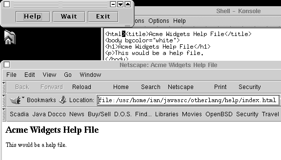

# 第十八章：使用 Java 与其他语言

# 18.0 介绍

Java 有几种运行其他语言编写的程序的方法。你可以使用`Runtime.exec()`来调用已编译的程序或可执行脚本，正如我将在 Recipe 18.1 中描述的那样。这里涉及系统依赖性，因为只能在编译为其操作系统的外部应用程序下运行它们。或者，你可以使用`javax.script`调用多种脚本语言（或*动态语言*），如：awk、bsh、Clojure、Ruby、Perl、Python、Scala，如 Recipe 18.3 所示。或者你可以通过 Java 的*本地代码*机制下降到 C 级别，并调用用 C/C++编写的编译函数，参见 Recipe 18.6。从本地代码，你可以调用几乎任何语言编写的函数。更不用说你可以通过套接字联系任何语言编写的程序（参见 Chapter 13），使用 HTTP 服务（参见 Chapter 13），或者使用 Java 客户端在 RMI 或 CORBA 客户端中使用各种语言。

JVM 还有许多其他语言，包括以下几种：

+   BeanShell，Java 的一般脚本语言。

+   [Groovy](https://groovy-lang.org)是一种基于 Java 的脚本语言，为 Java 语言生态系统中的闭包使用开创了先河。它还有一个快速开发的 Web 包叫做[Grails](http://grails.org)和一个叫做 Gradle 的构建工具（参见 Recipe 1.8）。Gradle 也被用作现代 Android 开发中的构建工具。

+   [Jython](http://jython.org)，Python 的完整 Java 实现。

+   [JRuby](http://jruby.org)，Ruby 语言的完整 Java 实现。

+   [Scala](http://scala-lang.org)，一个声称提供“功能和面向对象语言的最佳结合”的 JVM 语言。

+   [Clojure](http://clojure.org)，一种主要用于 JVM 的函数式[Lisp-1](https://en.wikipedia.org/wiki/Common_Lisp#The_function_namespace)方言。

+   [Renjin](http://renjin.org)（发音为“R engine”），一个相当完整的开源 R 统计包克隆，具有扩展到云端的能力。参见 Recipe 11.5 中使用 Renjin 的示例。

这些都是以 JVM 为中心的，并且有些可以直接从 Java 调用脚本，反之亦然，而不使用`javax.script`。可以在[Wikipedia](http://en.wikipedia.org/wiki/List_of_JVM_languages)上找到这些语言的列表。

# 18.1 在 Java 中运行外部程序

## 问题

你想在 Java 程序中运行外部程序。

## 解决方案

使用`java.lang.Runtime`类中的`exec()`方法之一。或者设置一个`ProcessBuilder`并调用其`start()`方法。

## 讨论

`Runtime`类中的`exec()`方法允许你运行外部程序。你给出的命令行通过简单的`StringTokenizer`（参见 Recipe 3.1）分解为字符串，并传递给操作系统的“执行程序”系统调用。例如，这里是一个使用`exec()`运行* kwrite *的简单程序，一个带窗口的文本编辑器程序。¹ 在 Windows 上，你可能需要将名称更改为`notepad`或`wordpad`，可能包括完整路径名，例如，*c:/windows/notepad.exe*（你也可以使用反斜杠，但要小心要双倍，因为反斜杠在 Java 字符串中是特殊字符）：

```java
public class ExecDemoSimple {
    public static void main(String av[]) throws Exception {

        // Run the "notepad" program or a similar editor
        Process p = Runtime.getRuntime().exec("kwrite");

        p.waitFor();
    }
}
```

当你编译并运行它时，适当的编辑器窗口会出现：

```java
$ javac -d . ExecDemoSimple.java
$ java otherlang.ExecDemoSimple # causes a KWrite window to appear.
$
```

这个版本的`exec()`假设路径名不包含空格，因为空格会破坏`StringTokenizer`的正常操作。为了克服这个潜在问题，使用`exec()`的一个重载形式，接受一个字符串数组作为参数。Example 18-1 运行 Windows 或 Unix 版本的 Firefox 网络浏览器，假设 Firefox 安装在默认目录（或另一个在你的`PATH`上的目录）。它传递一个帮助文件的名称作为参数，提供一种原始的帮助机制，如 Figure 18-1 所示。

##### 例子 18-1\. main/src/main/java/otherlang/ExecDemoNS.java

```java
public class ExecDemoNS extends JFrame {
    private static final String BROWSER = "firefox";

    Logger logger = Logger.getLogger(ExecDemoNS.class.getSimpleName());

    /** The name of the help file. */
    protected final static String HELPFILE = "./help/index.html";

    /** A stack of process objects; each entry tracks one running process */
    Stack<Process> pStack = new Stack<>();

    /** main - instantiate and run */
    public static void main(String av[]) throws Exception {
        String program = av.length == 0 ? BROWSER : av[0];
        new ExecDemoNS(program).setVisible(true);
    }

    /** The path to the binary executable that we will run */
    protected static String program;

    /** Constructor - set up strings and things. */
    public ExecDemoNS(String program) {
        super("ExecDemo: " + program);
        this.program = program;

        Container cp = getContentPane();
        cp.setLayout(new FlowLayout());
        JButton b;
        cp.add(b=new JButton("Exec"));
        b.addActionListener(e -> runProgram());
        cp.add(b=new JButton("Wait"));
        b.addActionListener(e -> doWait());
        cp.add(b=new JButton("Exit"));
        b.addActionListener(e -> System.exit(0));
        pack();
    }

    /** Start the help, in its own Thread. */
    public void runProgram() {

        new Thread() {
            public void run() {

                try {
                    // Get a "file:" URL for the Help File
                    URL helpURL = this.getClass().getClassLoader().
                        getResource(HELPFILE);

                    // Start the external browser from the Java Application.

                    String osname = System.getProperty("os.name");
                    String run;
                    if ("Mac OS X".equals(osname)) {
                        run = "open -a " + program;
                        // "if" allows for other OSes needing special handling
                    } else {
                        run = program;
                    }

                    pStack.push(Runtime.getRuntime().exec(run + " " + helpURL));

                    logger.info("In main after exec " + pStack.size());

                } catch (Exception ex) {
                    JOptionPane.showMessageDialog(ExecDemoNS.this,
                        "Error" + ex, "Error",
                        JOptionPane.ERROR_MESSAGE);
                }
            }
        }.start();

    }

    public void doWait() {
        if (pStack.size() == 0) {
            logger.info("Nothing to wait for.");
            return;
        }
        logger.info("Waiting for process " + pStack.size());
        try {
            Process p = pStack.pop();
            p.waitFor();
            // wait for process to complete
            // (may not work as expected for some old Windows programs)
            logger.info("Process " + p + " is done.");
        } catch (Exception ex) {
            JOptionPane.showMessageDialog(this,
                "Error" + ex, "Error",
                JOptionPane.ERROR_MESSAGE);
        }
    }

}
```



###### 图 18-1\. ExecDemoNS 在运行中

一个更新的类，`ProcessBuilder`，替代了大多数非平凡使用`Runtime.exec()`的情况。这个`ProcessBuilder`使用通用集合允许你修改或替换环境，如示例 Example 18-2 所示。

##### 例子 18-2\. main/src/main/java/otherlang/ProcessBuilderDemo.java

```java
        List<String> command = new ArrayList<>();            
        command.add("notepad");
        command.add("foo.txt");
        ProcessBuilder builder = new ProcessBuilder(command);
        builder.environment().put("PATH",
                "/windows;/windows/system32;/winnt");        
        final Process godot = builder.directory(
            new File(System.getProperty("user.home"))).      
            start();
        System.err.println("Waiting for Godot");             
        godot.waitFor();                                     
```


设置命令行参数列表：编辑器程序名称和文件名。


使用这个来开始配置`ProcessBuilder`。


配置构建器的环境到一组常见的 MS Windows 目录。


设置初始目录为用户的主目录，并启动进程！


我一直想在代码中使用这行。


等待我们小戏的结束。

关于`ProcessBuilder`更多内容，请参阅`java.lang.ProcessBuilder`的 javadoc。

# 18.2 运行程序并捕获其输出

## 问题

想要运行一个程序，同时捕获其输出。

## 解决方案

使用`Process`对象的`getInputStream()`；读取并复制内容到`System.out`或任何你想要的地方。

## 讨论

最初的标准输出和标准错误的概念是它们总是连接到终端；这个概念来自一个早期的时代，当时几乎所有的计算机用户都在命令行上工作。如今，一个程序的标准输出和错误输出并不总是自动出现在任何地方。可以说，应该有一种自动的方法使这种情况发生。但目前，您需要添加几行代码来获取程序的输出并打印它：

```java
public class ExecDemoLs {

    private static Logger logger =
        Logger.getLogger(ExecDemoLs.class.getSimpleName());

    /** The program to run */
    public static final String PROGRAM = "ls"; // "dir" for Windows
    /** Set to true to end the loop */
    static volatile boolean done = false;

    public static void main(String argv[]) throws IOException {

        final Process p;         // Process tracks one external native process
        BufferedReader is;    // reader for output of process
        String line;

        p = Runtime.getRuntime().exec(PROGRAM);

        logger.info("In Main after exec");

        // Optional: start a thread to wait for the process to terminate.
        // Don't just wait in main line, but here set a "done" flag and
        // use that to control the main reading loop below.
        Thread waiter = new Thread() {
            public void run() {
                try {
                    p.waitFor();
                } catch (InterruptedException ex) {
                    // OK, just quit.
                    return;
                }
                System.out.println("Program terminated!");
                done = true;
            }
        };
        waiter.start();

        // getInputStream gives an Input stream connected to
        // the process p's standard output (and vice versa). We use
        // that to construct a BufferedReader so we can readLine() it.
        is = new BufferedReader(new InputStreamReader(p.getInputStream()));

        while (!done && ((line = is.readLine()) != null))
            System.out.println(line);

        logger.info("In Main after EOF");

        return;
    }
}
```

这种情况如此常见，以至于我将其封装为一个名为`ExecAndPrint`的类，它是我的`com.darwinsys.lang`包的一部分。 `ExecAndPrint`有几种重载形式的`run()`方法（有关详细信息，请参阅文档），但它们都至少需要一个命令，并且可选地需要一个输出文件，用于将命令的输出写入。 示例 18-3 显示了其中一些方法的代码。

##### 示例 18-3\. darwinsys-api/src/main/java/com/darwinsys/lang/ExecAndPrint.java

```java
    /** Need a Runtime object for any of these methods */
    protected final static Runtime r = Runtime.getRuntime();

    /** Run the command given as a String, output to System.out
 * @param cmd The command
 * @return The command's exit status
 * @throws IOException if the command isn't found
 */
    public static int run(String cmd) throws IOException {
        return run(cmd, new OutputStreamWriter(System.out));
    }

    /** Run the command given as a String, output to "out"
 * @param cmd The command and list of arguments
 * @param out The output file
 * @return The command's exit status
 * @throws IOException if the command isn't found
 */
    public static int run(String cmd, Writer out) throws IOException {

        Process p = r.exec(cmd);

        FileIO.copyFile(new InputStreamReader(p.getInputStream()), out, true);
        try {
            p.waitFor();    // wait for process to complete
        } catch (InterruptedException e) {
            return -1;
        }
        return p.exitValue();
    }
```

作为直接使用`exec()`和`ExecAndPrint`的简单示例，我将创建三个临时文件，列出它们（目录列表），然后删除它们。当我运行`ExecDemoFiles`程序时，它会列出它已创建的三个文件：

```java
-rw-------  1 ian  wheel  0 Jan 29 14:29 file1
-rw-------  1 ian  wheel  0 Jan 29 14:29 file2
-rw-------  1 ian  wheel  0 Jan 29 14:29 file3
```

其源代码位于示例 18-4。

##### 示例 18-4\. main/src/main/java/otherlang/ExecDemoFiles.java

```java
        // Get and save the Runtime object.
        Runtime rt = Runtime.getRuntime();

        // Create three temporary files (the slow way!)
        rt.exec("mktemp file1");
        rt.exec("mktemp file2");
        rt.exec("mktemp file3");

        // Run the "ls" (directory lister) program
        // with its output sent into a file
        String[] args = { "ls", "-l", "file1", "file2", "file3" };
        ExecAndPrint.run(args);

        rt.exec("rm file1 file2 file3");
```

当创建进程的 Java 程序退出或崩溃时，并不一定会销毁进程。简单的文本程序会销毁，但像*kwrite* Netscape，甚至是基于 Java 的`JFrame`应用程序等基于窗口的程序不会。例如，我们的`ExecDemoNS`程序启动了 Netscape，当单击`ExecDemoNS`的退出按钮时，`ExecDemoNS`退出但 Netscape 仍在运行。如果你想要确保一个进程已经完成，该怎么办？`Process`对象有一个`waitFor()`方法，让你可以这样做，并且一个`exitValue()`方法，告诉你进程的返回码。最后，如果你希望强制终止另一个进程，你可以使用`Process`对象的`destroy()`方法，该方法不接受参数并且不返回值。示例 18-5 是`ExecDemoWait`，一个运行你在命令行中命名的任何程序（以及参数），捕获程序的标准输出，并等待程序终止的程序。

##### 示例 18-5\. main/src/main/java/otherlang/ExecDemoWait.java

```java
        // A Runtime object has methods for dealing with the OS
        Runtime r = Runtime.getRuntime();
        Process p;         // Process tracks one external native process
        BufferedReader is;    // reader for output of process
        String line;

        // Our argv[0] contains the program to run; remaining elements
        // of argv contain args for the target program. This is just
        // what is needed for the String[] form of exec.
        p = r.exec(argv);

        System.out.println("In Main after exec");

        // getInputStream gives an Input stream connected to
        // the process p's standard output. Just use it to make
        // a BufferedReader to readLine() what the program writes out.
        is = new BufferedReader(new InputStreamReader(p.getInputStream()));

        while ((line = is.readLine()) != null)
            System.out.println(line);

        System.out.println("In Main after EOF");
        System.out.flush();
        try {
            p.waitFor();    // wait for process to complete
        } catch (InterruptedException e) {
            System.err.println(e);    // "Can't Happen"
            return;
        }
        System.err.println("Process done, exit status was " + p.exitValue());
```

## 另请参阅

你通常不会以这种方式使用任何形式的`exec()`来从一个 Java 程序运行另一个 Java 程序；相反，你可能会将其创建为同一进程中的一个线程，因为这通常要快得多（Java 解释器已经启动运行，为什么要等待另一个副本启动？）。参见第十六章。

在构建工业级应用程序时，请注意 Java API 文档中关于`Process`类的警告性说明，因为操作系统的缓冲区不足可能导致部分 I/O 丢失的危险。

# 18.3 通过 javax.script 调用其他语言

## 问题

您希望从 Java 程序中调用用其他语言编写的脚本，在 JVM 中运行，并能直接传递变量到/从其他语言。

## 解决方案

如果您想要的脚本是用支持的二十多种语言之一编写的，请使用 `javax.script`。这些语言包括 awk、Perl、Python、Ruby、BeanShell、PNuts、Ksh/Bash、R（Renjin）和几个 JavaScript 的实现。

## 讨论

使用这个 API 的一个最初的任务是找出安装的脚本引擎，然后选择一个可用的引擎。示例 18-6 中的 `ScriptEnginesDemo` 程序列出了已安装的引擎，并运行了一个简单的脚本，使用默认语言 ECMAScript（又名 JavaScript）。

##### 示例 18-6\. main/src/main/java/otherlang/ScriptEnginesDemo.java

```java
public class ScriptEnginesDemo {

    public static void main(String[] args) throws ScriptException {
        ScriptEngineManager scriptEngineManager = new ScriptEngineManager();

        // Print list of supported languages
        scriptEngineManager.getEngineFactories().forEach(factory ->
            System.out.println(factory.getLanguageName()));

        // Run a script in the JavaScript language
        String lang = "JavaScript";
        ScriptEngine engine =
            scriptEngineManager.getEngineByName(lang);
        if (engine == null) {
            System.err.println("Could not find engine");
            return;
        }
        engine.eval("print(\"Hello from " + lang + "\");");
    }
}
```

示例 18-7 是一个非常简单的示例，展示了如何使用 `javax.scripting` 从 Java 调用 Python。我们知道要使用的脚本引擎的名称是 Python。我们将使用在虚拟机中的实现，称为 `jython`，最初称为 JPython，但因商标问题而更改。一旦将 *jython-standalone-2.nnn.jar* 加入到我们的 `CLASSPATH` 中，脚本引擎就会自动检测到。以防失败，我们会打印一个详细的消息，包括可用引擎的列表。

##### 示例 18-7\. main/src/main/java/otherlang/PythonFromJava.java

```java
/**
 * demo using Python (jython) to get a Java variable, print, and change it.
 * @author Ian Darwin
 */
public class PythonFromJava {
    private static final String PY_SCRIPTNAME = "pythonfromjava.py";

    public static void main(String[] args) throws Exception {
        ScriptEngineManager scriptEngineManager = new ScriptEngineManager();

        ScriptEngine engine = scriptEngineManager.getEngineByName("python");
        if (engine == null) {
            final String message =
                "Could not find 'python' engine; add its jar to CLASSPATH";
            System.out.println(message);
            System.out.println("Available script engines are: ");
            scriptEngineManager.getEngineFactories().forEach(factory ->
                System.out.println(factory.getLanguageName()));
            throw new IllegalStateException(message);
        }

        final Bindings bindings = engine.getBindings(ScriptContext.ENGINE_SCOPE);
        bindings.put("meaning", 42);

        // Let's run a python script stored on disk (well, on classpath):
        InputStream is =
            PythonFromJava.class.getResourceAsStream("/" + PY_SCRIPTNAME);
        if (is == null) {
            throw new IOException("Could not find file " + PY_SCRIPTNAME);
        }
        engine.eval(new InputStreamReader(is));
        System.out.println("Java: Meaning is now " + bindings.get("meaning"));
    }
}
```

## 参见

在 Oracle 拆除 java.net 之前，曾经有一个列出许多语言的列表（请参阅 [此存档列表](https://web.archive.org/web/20140909141915/https://java.net/projects/scripting/sources/svn/show/trunk/engines)；链接已经失效，但显示了可用的语言范围）。当时，您可以从该站点下载脚本引擎。不幸的是，我不知道目前有一个官方的引擎列表。然而，作为脚本项目的一部分维护的列表可以在一个非官方的源代码库中找到，通过查看 [*https://github.com/scijava/javax-scripting*](https://github.com/scijava/javax-scripting)，在理论上应该能够构建您想要的列表。此项目外的其他十几个引擎由其他人维护；例如，有一个来自 [Google Code](https://code.google.com/archive/p/javaperlscripting) 的 `Perl5` 脚本引擎。

还有一个 [Java 兼容的脚本语言列表](http://java-source.net/open-source/scripting-languages)（不一定全部使用 `javax.script`）。

你可以自行编写脚本引擎；参见我的介绍 [*https://darwinsys.com/java/scriptengines.html*](https://darwinsys.com/java/scriptengines.html)。

# 18.4 使用 GraalVM 混合语言

## 问题

GraalVM 的目标是多语言的，您希望在 VM 中使用不同的语言。

## 解决方案

使用 *gu*（graal 实用工具）安装额外的语言包并调用其他语言。

## 讨论

虽然 GraalVM 自称能够支持各种编程语言，但目前支持的语言数量虽小，但正在增长。让我们尝试从 Java 内部调用 Python 代码。假设您已经按照 Recipe 1.2 的说明安装了 Graal 本身，您的可执行路径上应该有*gu*，因此请尝试以下操作：

```java
$ gu install python
Downloading: Component catalog from www.graalvm.org
Processing component archive: Graal.Python
Downloading: Component python: Graal.Python  from github.com
Installing new component: Graal.Python (org.graalvm.python, version 19.2.0.1)

IMPORTANT NOTE:
---------------
Set of GraalVM components that provide language implementations have changed.
  The Polyglot native image and polyglot native C library may be out of sync:
- new languages may not be accessible
- removed languages may cause the native binary to fail on missing resources
  or libraries.
To rebuild and refresh the native binaries, use the following command:
      Library/Java/JavaVirtualMachines/graalvm-ce-19.2.0.1/Contents/Home/bin/gu
      rebuild-images

You may need to install "native-image" component which provide the rebuild tools.
```

然后可以使用示例 18-8 中的代码。

##### 示例 18-8\. graal/src/JavaCallPython.java

```java
import java.io.*;
import java.util.stream.*;
import org.graalvm.polyglot.*;

/**
 * GraalVM polyglot: calling Python from Java/
 */
// tag::main[]
public class JavaCallPython {

    public static void main(String[] args) throws java.io.IOException {

         try (Context context = Context.create("jython")) {
            Value result = context.execute("2 + 2");
            System.out.println(result.asString());
        }
    }
}
// end::main[]
```

# 18.5 将 Java 和 Perl 结合起来

## 问题

您希望从 Perl 调用 Java，或者反过来。

## 解决方案

要从 Perl 调用 Java，请使用 Perl 的`Inline::Java`模块。要反过来——从 Java 调用 Perl——请使用`javax.script`，就像在 Recipe 18.3 中所示。

## 讨论

Perl 通常被称为一种粘合语言，可以用来将软件世界的各种部分组合在一起。此外，它还是一个用于创建软件的完整语言。大量的扩展模块提供了就绪运行的解决方案，适用于相当多样化的问题，大多数这些模块可以从 CPAN（[综合 Perl 存档网络](http://www.cpan.org)）免费获取。另外，作为一种脚本语言，它非常适合快速原型设计。然而，尽管 Perl 确实可以构建图形用户界面，但这并不是该语言的强项之一。因此，您可能希望使用 Java Swing 构建 GUI，并同时重用在 Perl 中实现的业务逻辑。

幸运的是，在众多的 CPAN 模块中，`Inline::Java`使得 Perl 和 Java 的集成变得十分简便。首先假设您希望从 Perl 调用 Java。为了业务逻辑，我选择了一个 CPAN 模块，用于测量两个字符串的相似度（所谓的*Levenshtein 编辑距离*）。示例 18-9 展示了完整的源代码。您至少需要使用模块`Inline::Java`的 0.44 版本；早期版本不正确地支持了线程应用程序，因此不支持使用 Swing。

以这种方式使用该模块要求在 Perl 脚本中使用特殊分隔符包含 Java 源码，如示例 18-9 所示。

##### 示例 18-9\. Swinging.pl

```java
#! /usr/bin/perl
# Calling Java from Perl

use strict;
use warnings;

use Text::Levenshtein qw( );
  # Perl module from CPAN to measure string similarity

use Inline 0.44 "JAVA" =&gt; "DATA";  # pointer to the Inline java source
use Inline::Java qw(caught);  # helper function to determine exception type

my $show = new Showit;     # construct Java object using Perl syntax
$show-&gt;show("Just another Perl hacker");            # call method on that object

eval {
  # Call a method that will call back to Perl;
  # catch exceptions, if any.
  print "matcher: ", $show-&gt;match("Japh", shift||"Java"),
  " (displayed from Perl)\n";
};
if ($@) {
  print STDERR "Caught:", caught($@), "\n";
  die $@ unless caught("java.lang.Exception");
  print STDERR $@-&gt;getMessage( ), "\n";
}

__END_  _

__JAVA_  _
// Java starts here
import javax.swing.*;
import org.perl.inline.java.*;

class Showit extends InlineJavaPerlCaller {
  // extension only neeeded if calling back into Perl

  /** Simple Java class to be called from Perl, and to call back to Perl
   */
  public Showit( ) throws InlineJavaException { }

  /** Simple method */
  public void show(String str) {
    System.out.println(str + " inside Java");
  }

  /** Method calling back into Perl */
  public int match(String target, String pattern)
      throws InlineJavaException, InlineJavaPerlException {

    // Calling a function residing in a Perl Module
    String str = (String)CallPerl("Text::Levenshtein", "distance",
          new Object [] {target, pattern});

    // Show result
    JOptionPane.showMessageDialog(null, "Edit distance between '" + target +
        "' and '" + pattern + "' is " + str,
        "Swinging Perl", JOptionPane.INFORMATION_MESSAGE);
    return Integer.parseInt(str);
  }

}
```

由于使用了`Text::Levenshtein`和`Inline::Java`模块，您需要安装这些模块。以下是标准的安装方法：

```java
$ perl -MCPAN -e shell
> install Text::Levenshtein
> install Inline::Java
> quit
```

在某些系统上可能会有特定于操作系统的模块；例如，在 OpenBSD Unix 上，是这样的：

```java
$ doas pkg_add p5-Text-LevenshteinXS
```

在一个简单的 Perl+Java 程序中，你甚至不需要编写单独的 Java 源文件：你可以将所有代码，无论是 Perl 还是 Java，都放在一个单独的文件中。你不需要编译任何东西，只需键入以下命令来执行它：

```java
perl Swinging.pl
```

（您也可以添加一个字符串参数。）稍作处理后，一个 Java 消息框弹出，告诉您`Japh`和`Java`之间的距离为 2。与此同时，您的控制台显示字符串“Just another Perl hacker inside Java。”当您关闭消息框时，您将得到最终结果“matcher: 2（从 Perl 显示）。”

在这期间，你的 Perl 程序通过调用其构造函数创建了 Java 类 `Showit` 的一个实例。然后它调用该对象的 `show()` 方法在 Java 中显示一个字符串。然后它继续调用 `match()` 方法，但这次发生了更复杂的事情：Java 代码回调 Perl，访问模块 `Text::Levenshtein` 的 `distance` 方法，并将两个字符串作为参数传递给它。它接收结果，在消息框中显示它，最后，为了保险起见，将其返回给调用它的 Perl 主程序。

顺便说一句，`eval { }` 块是捕获异常的 Perl 方法。在这种情况下，异常是从 Java 内部抛出的。

如果重新启动程序，您会注意到启动时间大大缩短，这总是一个好消息。为什么会这样？因为在第一次调用时，`Inline::Java` 拆分输入，预编译了 Java 部分，并将其保存到磁盘上（通常在名为 *_Inline* 的子目录中）。在后续调用中，它只需确保 Java 源码没有更改，然后调用已经存在于磁盘上的类文件。（当然，如果您偷偷改变了 Java 代码，它会像自动魔术般重新编译。）然而，在幕后，还发生了更奇怪的事情。当执行 Perl 脚本时，会构建并启动一个 Java 服务器，用户毫不知情，Perl 部分和 Java 部分通过 TCP 套接字进行通信（见 第十三章）。

以一种可移植的方式将 Perl 和 Java 这样两种平台无关的语言结合在一起，可以避开许多可移植性问题。在分发内联应用程序时，确保不仅提供源文件，还提供 *_Inline* 目录的内容。（建议在分发之前清除该目录并重新构建所有内容；否则，留在那里的旧编译版本可能会进入分发版。）每台目标机器都需要重复执行 `Inline::Java` 的魔法步骤，这需要一个 Java 编译器。在任何情况下，都必须安装 `Inline::Java` 模块。

因为 Perl 拥有 `Inline` 模块，可以用于许多其他语言（如普通的 C 语言，但也包括像 Befunge 这样的异国语言），所以你甚至可以考虑使用 Perl 作为这些其他语言与 Java 之间或分别之间互操作的粘合剂。我相信你会在解决这些交互的复杂性时度过许多愉快的时光。

## 参见

您可以在 [CPAN](http://search.cpan.org) 上找到有关 `Inline::Java` 的完整信息，或者在模块本身安装时一同安装的 POD（Plain Old Documentation）中找到。

# 18.6 通过本地代码调用其他语言

## 问题

如果你希望从 Java 中调用本地的 C/C++ 函数，无论是为了提高效率还是访问硬件或特定系统功能。

## 解决方案

使用 JNI（Java Native Interface）。或者使用 GraalVM。

## 讨论

Java 允许你将本地或编译后的代码加载到你的 Java 程序中。为什么你要做这样的事情呢？最好的理由可能是为了访问依赖于操作系统的功能，或者是访问用另一种语言编写的现有代码。一个不太好的理由可能是速度：本地代码有时可能比 Java 运行得更快，尽管随着计算机变得更快、更多核心，这变得不那么重要了。与 Java 中的其他一切一样，本地代码机制受到安全限制；例如，小程序不被允许访问本地代码。

本地代码语言绑定是为使用 C 或 C++ 编写的代码定义的。如果你需要访问除 C/C++ 之外的其他语言，编写一些 C/C++ 并让它通过任何由你的操作系统定义的机制控制其他函数或应用程序。

由于诸如解释头文件和分配处理器的通用寄存器等系统相关特性，你的本地代码可能需要由用于编译你平台的 Java 运行时的相同的 C 编译器来编译。例如，在 Solaris 上，你可以使用 SunPro C 或者也许是 gcc。在 Win32 平台上，使用 Microsoft Visual C++ 版本 4.x 或更高版本（32 位）。对于 Linux 和 macOS，你应该能够使用提供的基于 gcc 的编译器。对于其他平台，请参阅你的 Java 供应商的文档。

还要注意，本节中的细节适用于 Java 1.1 及更高版本的 Java Native Interface (JNI)，与 1.0 版本以及 Microsoft 的本地接口有一些细节上的不同。

第一步是编写调用本地方法的 Java 代码。为此，请使用关键字 `native` 表示该方法是本地方法，并提供一个静态代码块，使用 `System.loadLibrary()` 加载你的本地方法。（动态加载模块在第 5 步创建。）静态块在包含它们的类加载时执行；在这里加载本地代码可以确保在需要时它在内存中！

你的本地代码可能会修改的对象变量应该带有 `volatile` 修饰符。示例 18-10 中显示的 *HelloJni.java* 文件是一个很好的起点。

##### 示例 18-10\. main/src/main/java/jni/HelloJni.java

```java
/**
 * A trivial class to show Java Native Interface 1.1 usage from Java.
 */
public class HelloJni {
  int myNumber = 42; // used to show argument passing

  // declare native class
  public native void displayHelloJni();

  // Application main, call its display method
  public static void main(String[] args) {
    System.out.println("HelloJni starting; args.length="+
                       args.length+"...");
    for (int i=0; i<args.length; i++)
                       System.out.println("args["+i+"]="+args[i]);
    HelloJni hw = new HelloJni();
    hw.displayHelloJni();// call the native function
    System.out.println("Back in Java, \"myNumber\" now " + hw.myNumber);
  }

  // Static code blocks are executed once, when class file is loaded
  static {
    System.loadLibrary("hello");
  }
}
```

第二步很简单；就像平常一样使用 *javac HelloJni.java*。对于像这样的简单程序，你可能不会遇到任何编译错误；如果有，纠正它们然后再次编译。

接下来，你需要创建一个 *.h* 文件。使用 *javah* 生成此文件：

```java
javah jni.HelloJni           // produces HelloJni.h
```

生成的 *.h* 文件是一个粘合文件，实际上不是为人类消费而设计的，尤其不适合编辑。但通过检查生成的 *.h* 文件，你会看到 C 方法的名称由 `Java` 名称、包名称（如果有）以及类名称和方法名称组成：

```java
JNIEXPORT void JNICALL Java_HelloJni_displayHelloWorld(JNIEnv *env,
    jobject this);
```

然后创建一个执行工作的 C 函数。你必须使用与 *.h* 文件中使用的相同的函数签名。

此函数可以随意执行任何操作。请注意，它传递了两个参数：JVM 环境变量和`this`对象的句柄。表 18-1 显示了 Java 类型和在 C 代码中使用的 C 类型（JNI 类型）之间的对应关系。

表 18-1\. Java 和 JNI 类型

| Java 类型 | JNI | Java 数组类型 | JNI |
| --- | --- | --- | --- |
| `byte` | `jbyte` | `byte[]` | `jbyteArray` |
| `short` | `jshort` | `short[]` | `jshortArray` |
| `int` | `jint` | `int[]` | `jintArray` |
| `long` | `jlong` | `long[]` | `jlongArray` |
| float | jfloat | float[] | jfloatArray |
| `double` | `jdouble` | `double[]` | `jdoubleArray` |
| `char` | `jchar` | `char[]` | `jcharArray` |
| `boolean` | `jboolean` | `boolean[]` | `jbooleanArray` |
| `void` | `jvoid` |  |  |
| `Object` | `jobject` | `Object[]` | `jobjectArray` |
| `Class` | `jclass` |  |  |
| `String` | `jstring` |  |  |
| `array` | `jarray` |  |  |
| `Throwable` | `jthrowable` |  |  |

示例 18-11 是一个完整的 C 本地实现。传递一个类型为`Hel⁠lo​Jni.java`的对象，它会增加对象中包含的整数`myNumber`。

##### 示例 18-11\. main/src/main/java/jni/HelloJni.c

```java
#include <jni.h>
#include "HelloJni.h"
#include <stdio.h>
/*
 * This is the Java Native implementation of displayHelloJni.
 */
JNIEXPORT void JNICALL Java_HelloJni_displayHelloJni(JNIEnv *env, jobject this) {
  jfieldID fldid;
  jint n, nn;

  (void)printf("Hello from a Native Method\n");

  if (this == NULL) {
    fprintf(stderr, "'this.' pointer is null!\n");
    return;
  }
  if ((fldid = (*env)->GetFieldID(env,
        (*env)->GetObjectClass(env, this), "myNumber", "I")) == NULL) {
    fprintf(stderr, "GetFieldID failed");
    return;
  }

  n = (*env)->GetIntField(env, this, fldid);/* retrieve myNumber */
  printf("\"myNumber\" value is %d\n", n);

  (*env)->SetIntField(env, this, fldid, ++n);/* increment it! */
  nn = (*env)->GetIntField(env, this, fldid);

  printf("\"myNumber\" value now %d\n", nn); /* make sure */
  return;
}
```

最后，将 C 代码编译成可加载对象。当然，具体细节取决于平台、编译器等。例如，在 Windows 上，您可以使用以下方法：

```java
> set JAVA_HOME=C:\java              # or wherever
> set INCLUDE=%JAVA_HOME%\include;%JAVA_HOME%\include\Win32;%INCLUDE%
> set LIB=%JAVA_HOME%\lib;%LIB%
> cl HelloJni.c -Fehello.dll -MD -LD
```

并且在 Unix 上，您可以使用以下方法：

```java
$ export JAVAHOME=/local/java   # or wherever
$ cc -I$JAVAHOME/include -I$JAVAHOME/include/solaris \
	-G HelloJni.c -o libhello.so
```

示例 18-12 是 Unix 的一个 makefile。

##### 示例 18-12\. main/src/main/java/jni/Makefile（Unix 版本）

```java
# Configuration Section

CFLAGS_FOR_SO = -G # Solaris
CFLAGS_FOR_SO = -shared
CSRCS        = HelloJni.c
# JAVA_HOME should be been set in the environment
#INCLUDES    = -I$(JAVA_HOME)/include -I$(JAVAHOME)/include/solaris
#INCLUDES    = -I$(JAVA_HOME)/include -I$(JAVAHOME)/include/openbsd
INCLUDES    = -I$(JAVA_HOME)/include

all:        testhello testjavafromc

# This part of the Makefile is for C called from Java, in HelloJni
testhello:        hello.all
        @echo
        @echo "Here we test the Java code \"HelloJni\" that calls C code."
        @echo
        LD_LIBRARY_PATH=`pwd`:. java HelloJni

hello.all:        HelloJni.class libhello.so

HelloJni.class: HelloJni.java
        javac HelloJni.java

HelloJni.h:    HelloJni.class
        javah -jni HelloJni

HelloJni.o::    HelloJni.h

libhello.so:    $(CSRCS) HelloJni.h
    $(CC) $(INCLUDES) $(CFLAGS_FOR_SO) $(CSRCS) -o libhello.so

# This part of the Makefile is for Java called from C, in javafromc
testjavafromc:    javafromc.all hello.all
    @echo
    @echo "Now we test HelloJni using javafromc instead of java"
    @echo
    ./javafromc HelloJni
    @echo
    @echo "That was, in case you didn't notice, C->Java->C. And,"
    @echo "incidentally, a replacement for JDK program \"java\" itself!"
    @echo

javafromc.all:    javafromc

javafromc:    javafromc.o
    $(CC) -L$(LIBDIR) javafromc.o -ljava -o $@

javafromc.o:    javafromc.c
    $(CC) -c $(INCLUDES) javafromc.c

clean:
    rm -f core *.class *.o *.so HelloJni.h
clobber: clean
    rm -f javafromc
```

完成！只需在包含主程序的类文件上运行 Java 解释器。假设您已经设置了必要的系统相关设置（可能包括`CLASSPATH`和`LD_LIBRARY_PATH`或其等效项），程序应该像下面这样运行：

```java
C> java jni.HelloJni
Hello from a Native Method      // from C
"myNumber" value is 42          // from C
"myNumber" value now 43         // from C
Value of myNumber now 43        // from Java
```

祝贺！您已经调用了一个本地方法。但是，您放弃了可移植性；Java 类文件现在要求您为每个操作系统和硬件平台构建一个可加载对象。乘以{Windows，Mac OS X，Sun Solaris，HP/UX，Linux，OpenBSD，NetBSD，FreeBSD}乘以{Intel-32，Intel-64/AMD64，Arm，Arm-64，以及可能的 SPARC64，PowerPC 和 HP-PA}，您开始看到可移植性问题。

注意，您的本地代码问题可能会导致运行时进程崩溃，从而使 Java 虚拟机无法保护自己。 JVM 无法防止由于编写不良的 C/C++代码而导致的问题。内存必须由程序员管理；系统运行时分配器获取的内存没有自动垃圾回收机制。您直接与操作系统甚至硬件打交道，所以，请小心。非常小心。

## 另请参阅

如果您需要更多关于 Java 本地方法的信息，您可能会对 Rob Gordon 的*Essential JNI: Java Native Interface*（Prentice Hall 出版）中的全面处理感兴趣。

# 18.7 从本地代码调用 Java

## 问题

您需要采用另一种方式，从 C/C++代码调用 Java。

## 解决方案

再次使用 JNI。

## 讨论

JNI（Java Native Interface）提供了一个接口，用于从 C 调用 Java，包括以下调用：

1.  创建一个 JVM。

1.  载入一个类。

1.  查找并调用该类中的一个方法（例如 `main`）。

JNI 允许您将 Java 添加到遗留代码中。这对多种用途非常有用，并允许您将 Java 代码视为扩展语言。

示例 18-13 中的代码从命令行获取一个类名，启动 JVM，并调用该类中的 `main()` 方法。

##### 示例 18-13\. main/src/main/java/jni/javafromc.c（从 C 调用 Java）

```java
/*
 * This is a C program that calls Java code.
 * This could be used as a model for building Java into an
 * existing application as an extention language, for example.
 */

#include <stdio.h>
#include <jni.h>

int
main(int argc, char *argv[]) {
    int i;
    JavaVM *jvm;        /* The Java VM we will use */
    JNIEnv *myEnv;        /* pointer to native environment */
    JDK1_1InitArgs jvmArgs; /* JNI initialization arguments */
    jclass myClass, stringClass;    /* pointer to the class type */
    jmethodID myMethod;    /* pointer to the main() method */
    jarray args;        /* becomes an array of Strings */
    jthrowable tossed;    /* Exception object, if we get one. */

    JNI_GetDefaultJavaVMInitArgs(&jvmArgs);    /* set up the argument pointer */
    /* Could change values now, like: jvmArgs.classpath = ...; */

    /* initialize the JVM! */
    if (JNI_CreateJavaVM(&jvm, &myEnv, &jvmArgs) < 0) {
        fprintf(stderr, "CreateJVM failed\n");
        exit(1);
    }

    /* find the class named in argv[1] */
    if ((myClass = (*myEnv)->FindClass(myEnv, argv[1])) == NULL) {
        fprintf(stderr, "FindClass %s failed\n", argv[1]);
        exit(1);
    }

    /* find the static void main(String[]) method of that class */
    myMethod = (*myEnv)->GetStaticMethodID(
        myEnv, myClass, "main", "([Ljava/lang/String;)V");
    /* myMethod = (*myEnv)->GetMethodID(myEnv, myClass, "test", "(I)I"); */
    if (myMethod == NULL) {
        fprintf(stderr, "GetStaticMethodID failed\n");
        exit(1);
    }

    /* Since we're calling main, must pass along the command line arguments,
 * in the form of Java String array
 */
    if ((stringClass = (*myEnv)->FindClass(myEnv, "java/lang/String")) == NULL){
        fprintf(stderr, "get of String class failed!!\n");
        exit(1);
    }

    /* make an array of Strings, subtracting 1 for progname & 1 for the
 * java class name */
    if ((args = (*myEnv)->NewObjectArray(myEnv, argc-2, stringClass, NULL))==NULL) {
        fprintf(stderr, "Create array failed!\n");
        exit(1);
    }

    /* fill the array */
    for (i=2; i<argc; i++)
        (*myEnv)->SetObjectArrayElement(myEnv,
            args, i-2, (*myEnv)->NewStringUTF(myEnv, argv[i]));

    /* finally, call the method. */
    (*myEnv)->CallStaticVoidMethodA(myEnv, myClass, myMethod, &args);

    /* And check for exceptions */
    if ((tossed = (*myEnv)->ExceptionOccurred(myEnv)) != NULL) {
        fprintf(stderr, "%s: Exception detected:\n", argv[0]);
        (*myEnv)->ExceptionDescribe(myEnv);    /* writes on stderr */
        (*myEnv)->ExceptionClear(myEnv);    /* OK, we're done with it. */
    }

    (*jvm)->DestroyJavaVM(jvm);    /* no error checking as we're done anyhow */
    return 0;
}
```

====

¹ *kwrite* 是 Unix 特有的；它是 [K Desktop Environment (KDE)](http://www.kde.org) 的一部分。
