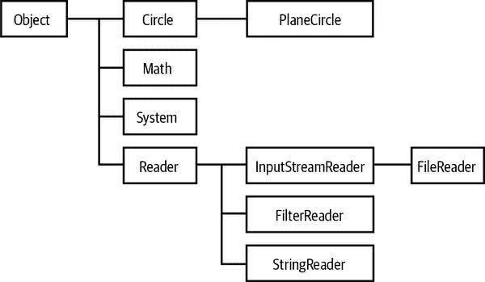

# 第三章。Java 面向对象编程

现在我们已经讲解了基本的 Java 语法，可以开始在 Java 中进行面向对象编程了。所有 Java 程序都使用对象，对象的类型由其 *类* 或 *接口* 定义。每个 Java 程序都定义为一个类，复杂的程序包括多个类和接口定义。

本章将解释如何定义新的类（和记录），以及如何使用它们进行面向对象编程。我们还介绍了接口的概念，但对接口和 Java 类型系统的全面讨论将推迟到第四章。

###### 注意

然而，如果您有面向对象编程经验，请小心。术语“面向对象”在不同语言中有不同的含义。不要假设 Java 与您喜欢的其他面向对象语言工作方式相同。（这对 JavaScript 或 Python 程序员特别适用。）

由于这是一个相当长的章节，让我们从概述和一些定义开始。

# 类和记录概述

类是所有 Java 程序中最基本的结构元素。在定义类之前无法编写 Java 代码。所有 Java 语句都出现在类中，并且所有方法都在类中实现。

## 基本面向对象定义

下面是一些重要的定义：

类

*类* 是包含保存值的数据字段以及操作这些值的方法的集合。类定义了一个新的引用类型，例如第二章中定义的`Account`类型。

`Account`类定义了银行系统中客户账户的类型。

从 Java 17 开始，语言还包括对记录的支持——这是一种具有附加语义的特殊类。

对象

*对象* 是类的 *实例*。

`Account`对象是该类型的一个值：它表示一个特定的客户银行账户。

对象通常通过使用`new`关键字和构造函数调用来 *实例化*，如下所示：

```java
Account a = new Account("John Smith", 100, 1144789);
```

构造函数将在本章稍后详细讲解，参见“创建和初始化对象”。

类定义由 *签名* 和 *主体* 组成。类签名定义了类的名称，可能还指定其他重要信息。类的主体是一组用大括号括起来的 *成员*。类的成员通常包括字段和方法，还可能包括构造函数、初始化程序和嵌套类型。

成员可以是 *静态* 的或非静态的。静态成员属于类本身，而非静态成员与类的实例关联（参见“字段和方法”）。

###### 注意

有四种非常常见的成员类型——类字段、类方法、实例字段和实例方法。大多数 Java 工作涉及与这些类型的成员交互。

类的签名可以声明类*扩展*另一个类。扩展的类称为*超类*，扩展称为*子类*。子类*继承*其超类的成员，可以声明新的成员或使用新实现*覆盖*继承的方法。

类的成员可以具有*访问修饰符*`public`、`protected`或`private`。¹ 这些修饰符指定了它们对客户端和子类的可见性和访问权限。这使得类能够控制对不属于其公共 API 的成员的访问。隐藏成员的能力支持一种称为*数据封装*的面向对象设计技术，我们在“数据隐藏和封装”中讨论。

## 记录

*记录*（或*记录类*）是一种提供了比一般类更多语义保证的特殊形式。

具体而言，记录（*record*）保证实例字段精确地定义了该类型对象的唯一有意义的状态。这可以表达为该记录类是一个*数据载体*或“仅持有字段”的原则（或*模式*）。同意这一原则对程序员施加了约束，但也使他们无需明确某些设计细节。

记录类定义如下：

```java
/** Represents a point in 2-dimensional space */
public record Point(double x, double y) {}
```

不需要显式声明构造函数或字段的访问方法，因为对于记录类，编译器会自动生成这些成员并将它们添加到类定义中。访问方法的名称与它们提供访问权限的底层字段完全相同。虽然可以向记录添加额外的方法，但如果所需的仅仅是基本的数据载体形式，则不必这样做。

记录类的实例（或称为记录）的创建和实例化方式与常规类相同，我们可以在创建的对象上调用访问器：

```java
// Create a Point object representing (2,-3.5).
// Declare a variable p and store a reference to the new Point object
Point p = new Point(2.0, -3.5);
double x = p.x();                    // Read a field of the object
```

记录（*record*）的另一个方面是它们始终是不可变的。一旦创建，记录字段的值就不能被修改。这意味着不需要为字段编写 setter 方法，因为它们不能被修改。

Java 记录的契约是，参数名（如记录声明中指定的）与字段名和方法名都完全相同：如果有一个类型为`double`的记录参数`x`，那么类就有一个名称为`x`、类型为`double`的字段和一个名称为`x()`的实例方法，返回`double`。

记录还具有某些其他方法，这些方法也是由编译器自动生成的。在我们讨论如何将记录作为面向对象设计的一部分时，我们将详细介绍它们，见第五章。

## 其他引用类型

类的签名还可以声明该类*实现*一个或多个接口。*接口*是一种类似于类的引用类型，它定义了方法签名，但通常不包括实现方法的方法体。

但是，从 Java 8 开始，接口可以使用关键字`default`来指示接口中指定的方法是可选的。如果方法是可选的，则接口文件必须包含默认实现（因此选择了关键字），该实现将被所有未提供可选方法实现的实现类使用。

实现接口的类需要为接口的非默认方法提供方法体。实现接口的类的实例也是接口类型的实例。

类和接口是 Java 定义的五种基本引用类型中最重要的两种。数组、枚举类型（或“enums”）和注解类型（通常称为“注解”）是另外三种。数组在第二章中有所涉及。枚举是一种特殊的类，而注解是一种特殊的接口——它们将在第四章中讨论，同时还会全面讨论接口。

## 类定义语法

在其最简单的级别上，类定义由关键字`class`后跟类名和一组在大括号内的类成员组成。`class`关键字前可以有修饰符关键字和注解。如果类扩展另一个类，则类名后跟`extends`关键字和被扩展的类的名称。如果类实现一个或多个接口，则类名或`extends`子句后跟`implements`关键字和逗号分隔的接口名称列表。例如，对于`java.lang`中的`Integer`类

```java
public class Integer extends Number
                     implements Serializable, Comparable {
    // class members go here
}
```

Java 还包括声明*泛型类*的能力，允许从单个类声明中创建整个类型族。我们将在第四章中遇到此功能，以及支持其的机制（如*类型参数*和*通配符*）。

类声明可以包括修饰符关键字。除了访问控制修饰符（`public`、`protected`等）外，还包括：

`abstract`

一个`abstract`类是一个实现不完整且无法实例化的类。任何具有一个或多个`abstract`方法的类必须声明为`abstract`。抽象类在“抽象类和方法”中讨论。

`final`

`final`修饰符指定类不可扩展。类不能同时声明为`abstract`和`final`。

`sealed`

密封类是只能由已知子类集扩展的类。密封类提供了`final`类和默认开放扩展类之间的中间地带。密封类的使用在第五章中有更详细的讨论。密封类仅在 Java 17 及以上版本中可用。

`strictfp`

一个类可以声明为`strictfp`；其所有方法的行为都像它们被声明为`strictfp`一样，并且严格遵循浮点标准的形式语义。这个修饰符在 Java 17 中实际上是一个无操作符，因为其原因在第二章中讨论过。

# 字段和方法

一个类可以被视为数据（也称为*状态*）和操作该状态的代码的集合。数据存储在字段中，而代码组织成方法。

本节介绍字段和方法，这两种是类成员中最重要的。字段和方法有两种不同的类型：类成员（也称为静态成员）与类本身关联，而实例成员与类的各个实例（即对象）关联。这使得我们有四种成员：

+   类字段

+   类方法

+   实例字段

+   实例方法

类`Circle`的简单定义，如示例 3-1 所示，包含了所有四种类型的成员。

##### 示例 3-1\. 一个简单的类及其成员

```java
public class Circle {
  // A class field
  public static final double PI= 3.14159;     // A useful constant

  // A class method: just compute a value based on the arguments
  public static double radiansToDegrees(double radians) {
    return radians * 180 / PI;
  }

  // An instance field
  public double r;                  // The radius of the circle

  // Two instance methods: operate on an object's instance fields

  // Compute the area of the circle
  public double area() {
    return PI * r * r;
  }

  // Compute the circumference of the circle
  public double circumference() {
    return 2 * PI * r;
  }
}
```

###### 警告

在我们的例子中，有一个公共实例字段`r`并不是好的做法。最好有一个私有字段`r`和一个方法`radius()`（或`r()`）来提供对它的访问。这个原因稍后将在“数据隐藏与封装”中解释。现在，我们使用公共字段只是为了给出如何使用实例字段的示例。

接下来的部分解释了所有四种常见成员。首先，我们介绍字段的声明语法。（方法的声明语法稍后在“数据隐藏与封装”章节中讨论。）

## 字段声明语法

字段声明语法与声明局部变量的语法非常相似（参见第二章）。不同之处在于字段定义可能还包括修饰符。最简单的字段声明由字段类型后跟字段名称组成。

类型可能由零个或多个修饰符关键字或注解前缀，并且名称后面可能跟着一个等号和初始化表达式，该表达式提供字段的初始值。如果两个或更多字段共享相同的类型和修饰符，类型后面可以跟着一个逗号分隔的字段名称和初始化器列表。以下是一些有效的字段声明：

```java
int x = 1;
private String name;
public static final int DAYS_PER_WEEK = 7;
String[] daynames = new String[DAYS_PER_WEEK];
private int a = 17, b = 37, c = 53;
```

字段修饰关键字由以下零个或多个关键字组成：

`public`, `protected`, `private`

这些访问修饰符指定字段是否以及在类定义之外的地方能否使用。

`static`

如果存在这个修饰符，它指定字段与定义类本身相关联，而不是与类的每个实例相关联。

`final`

这个修饰符指定一旦字段被初始化，其值就永远不能改变。同时具有`static`和`final`修饰符的字段是编译时常量，`javac`可以内联它们。`final`字段也可以用于创建其实例是不可变的类。

`transient`

这个修饰符指定字段不是对象的持久状态的一部分，因此它不需要与对象的其余部分一起序列化。这个修饰符非常少见。

`volatile`

这个修饰符指示该字段具有用于两个或多个线程并发使用的额外语义。`volatile`修饰符表示必须始终从主内存读取字段的值并刷新到主内存，并且它可能不会被线程（在寄存器或 CPU 缓存中）缓存。详见第六章了解更多细节。

## 类字段

*类字段*与定义它的类相关联，而不是与类的实例相关联。以下行声明了一个类字段：

```java
public static final double PI = 3.14159;
```

这行声明了一个名为`PI`的`double`类型字段，并赋予它值`3.14159`。

`static`修饰符表示该字段是一个类字段。由于这个`static`修饰符，类字段有时也称为静态字段。`final`修饰符表示字段的值不能直接重新分配。因为字段`PI`表示一个常量，我们将其声明为`final`，以确保它不可更改。

在 Java（以及许多其他语言）中，常量通常使用大写字母命名，这就是为什么我们的字段命名为`PI`而不是`pi`的惯例。像这样定义常量是类字段的常见用途，因此`static`和`final`修饰符经常一起使用。然而，并非所有的类字段都是常量。换句话说，字段可以被声明为`static`而不声明为`final`。

###### 注意

使用非`final`的公共字段是一种代码异味——因为多个线程可能更新字段并导致极难调试的行为。初学者不应该使用非`final`的公共字段。

公共静态字段本质上是全局变量。类字段的名称由包含它们的类的唯一名称限定。因此，在不同代码模块定义具有相同名称的全局变量时，Java 不会遇到名称冲突的问题。

关于静态字段的关键是它只有一个副本。该字段与类本身相关联，而不是类的实例。如果你查看`Circle`类的各种方法，你会发现它们使用了这个字段。在`Circle`类内部，可以简单地将该字段称为`PI`。然而，在类外部，为了唯一指定该字段，需要同时使用类名和字段名。不属于`Circle`的方法将该字段访问为`Circle.PI`。

## 类方法

与类字段类似，*类方法*使用`static`修饰符声明。它们也被称为*静态方法*：

```java
public static double radiansToDegrees(double rads) {
  return rads * 180 / PI;
}
```

此行声明了一个名为`radiansToDegrees()`的类方法。它有一个`double`类型的单参数，并返回一个`double`值。

类方法与类相关联，而不是对象。在从类外部代码调用类方法时，必须同时指定类名和方法名。例如：

```java
// How many degrees is 2.0 radians?
double d = Circle.radiansToDegrees(2.0);
```

如果要在定义它的类内部调用类方法，不必指定类名。还可以通过静态导入来缩短所需的输入量（如第二章中讨论的）。

注意，我们的`Circle.radiansToDegrees()`方法体使用了类字段`PI`。类方法可以使用其自身类的任何类字段和类方法（或任何其他可见的类）。

类方法不能使用任何实例字段或实例方法，因为类方法不与类的实例相关联。换句话说，尽管`radiansToDegrees()`方法在`Circle`类中定义，但它不能使用任何`Circle`对象的实例部分。

###### 注意

一个思考方式是，在任何实例中，我们总是有一个引用`this`指向当前对象。`this`引用作为隐式参数传递给任何实例方法。然而，类方法不与特定实例关联，因此它们没有`this`引用，也无法访问实例字段。

正如我们之前讨论的，类字段本质上是全局变量。类方法类似地是全局方法或全局函数。尽管`radiansToDegrees()`不在`Circle`对象上操作，但它在`Circle`类中定义，因为它是一个在处理圆时有时有用的实用方法，所以将它与`Circle`类的其他功能打包是有意义的。

## 实例字段

没有`static`修饰符声明的任何字段都是*实例字段*：

```java
public double r;    // The radius of the circle
```

实例字段与类的实例相关联，因此我们创建的每个`Circle`对象都有其自己的`double`类型字段`r`的副本。在我们的示例中，`r`表示特定圆的半径。每个`Circle`对象可以具有与所有其他`Circle`对象独立的半径。

在类定义内部，实例字段仅通过名称引用。如果查看`circumference()`实例方法的方法体，可以看到一个示例。在类外部的代码中，实例方法的名称必须前缀引用包含该方法的对象。例如，如果变量`c`持有`Circle`对象的引用，则使用表达式`c.r`来引用该圆的半径：

```java
Circle c = new Circle(); // Create a Circle object; store a ref in c
c.r = 2.0;               // Assign a value to its instance field r
Circle d = new Circle(); // Create a different Circle object
d.r = c.r * 2;           // Make this one twice as big
```

实例字段是面向对象编程的关键。实例字段保存对象的状态；这些字段的值使一个对象与另一个对象不同。

## 实例方法

*实例方法* 是针对类的特定实例（对象）运行的方法，未声明为`static`关键字的任何方法都自动成为实例方法。

实例方法是使面向对象编程开始变得有趣的特性。在[Example 3-1](https://example.org/javanut8-CHP-3-EX-1)中定义的`Circle`类包含两个实例方法，`area()`和`circumference()`，用于计算并返回给定`Circle`对象表示的圆的面积和周长。

要从定义它的类的外部使用实例方法，必须前缀引用要操作的实例。例如：

```java
// Create a Circle object; store in variable c
Circle c = new Circle();
c.r = 2.0;                 // Set an instance field of the object
double a = c.area();       // Invoke an instance method of the object
```

###### 注意

这就是为什么它被称为面向对象编程；对象是焦点，而不是方法调用。

在实例方法内部，我们自然地可以访问所有属于调用该方法的对象的实例字段。请记住，一个对象通常被认为是一个包含状态（表示为对象的字段）和行为（操作该状态的方法）的捆绑体。

所有实例方法都使用一个在方法签名中未显示的隐式参数来实现。隐式参数被命名为`this`；它保存通过它调用方法的对象的引用。在我们的示例中，该对象是一个`Circle`。

###### 注意

`area()`和`circumference()`方法的主体都使用类字段`PI`。我们前面看到，类方法只能使用类字段和类方法，而不是实例字段或方法。实例方法没有这种限制：它们可以使用类的任何成员，无论它是声明为`static`还是非`static`的。

## this 引用的工作原理

隐式的`this`参数在方法签名中未显示，因为通常不需要；每当一个 Java 方法访问其类中的实例字段时，隐含地它正在访问`this`参数所引用的对象的字段。当一个实例方法在同一个类中调用另一个实例方法时，情况也是如此——这意味着“在当前对象上调用实例方法”。

然而，当您希望明确指出方法正在访问其自身字段和/或方法时，可以显式使用`this`关键字。例如，我们可以重写`area()`方法，显式使用`this`来引用实例字段：

```java
public double area() { return Circle.PI * this.r * this.r; }
```

此代码还显式使用类名来引用类字段*PI*。在如此简单的方法中，通常不必这样明确。然而，在更复杂的情况下，即使不严格要求，有时使用显式的*this* 可以增加代码的清晰度。

在某些情况下，*this* 关键字是必需的。例如，当方法参数或方法中的局部变量与类的某个字段同名时，必须使用*this* 来引用该字段。这是因为单独使用字段名称会引用方法参数或局部变量，详见“词法作用域和局部变量”。

例如，我们可以将以下方法添加到*Circle* 类中：

```java
public void setRadius(double r) {
  this.r = r;      // Assign the argument (r) to the field (this.r)
                   // Note that writing r = r is a bug
}
```

一些开发人员会有意地选择方法参数的名称，以避免与字段名称冲突，因此可以大部分避免使用*this*。然而，由任何主要 Java IDE 生成的访问方法（setter）将使用此处所示的*this.x = x* 样式。

最后，请注意，虽然实例方法可以使用*this* 关键字，但类方法不能，因为类方法不与单个对象相关联。

# 创建和初始化对象

现在我们已经介绍了字段和方法，让我们继续了解类的其他重要成员。特别是，我们将看看构造函数——这些是类的成员，其工作是在创建类的新实例时初始化类的字段。

再看一下我们如何创建*Circle* 对象：

```java
Circle c = new Circle();
```

这段代码可以轻松地看作是通过调用类似方法的东西来创建*Circle* 的新实例。事实上，*Circle()* 就是*构造函数* 的一个示例。这是类的成员，与类同名，并且有一个像方法一样的主体。

构造函数的工作方式如下。*new* 操作符表示我们需要创建类的一个新实例。首先，在 Java 堆中分配内存以容纳新对象实例。然后，调用构造函数体，传入任何指定的参数。构造函数使用这些参数来执行新对象的任何初始化工作。

Java 中的每个类至少有一个*构造函数*，其目的是为新对象执行任何必要的初始化。如果程序员未显式为类定义构造函数，则*javac* 编译器会自动创建一个构造函数（称为默认构造函数），它不接受任何参数并且不执行任何特殊初始化。在示例 3-1 中看到的*Circle* 类使用了这种机制来自动声明一个构造函数。

## 定义构造函数

对于我们的 `Circle` 对象，有一些明显的初始化工作可以做，因此让我们定义一个构造函数。示例 3-2 展示了 `Circle` 的新定义，包含了一个构造函数，允许我们指定新 `Circle` 对象的半径。我们还利用这个机会将字段 `r` 设为受保护状态（以防止任意对象访问）。

##### 示例 3-2\. Circle 类的构造函数

```java
public class Circle {
    public static final double PI = 3.14159;  // A constant
    // An instance field that holds the radius of the circle
    protected double r;

    // The constructor: initialize the radius field
    public Circle(double r) { this.r = r; }

    // The instance methods: compute values based on the radius
    public double circumference() { return 2 * PI * r; }
    public double area() { return PI * r * r; }
    public double radius() { return r; }
}
```

当我们依赖编译器提供的默认构造函数时，我们必须编写类似以下的代码来显式初始化半径：

```java
Circle c = new Circle();
c.r = 0.25;
```

使用新的构造函数，初始化成为对象创建步骤的一部分：

```java
Circle c = new Circle(0.25);
```

这里有关于命名、声明和编写构造函数的一些基础知识：

+   构造函数的名称始终与类名相同。

+   构造函数声明时没有返回类型（甚至不是 `void` 占位符）。

+   构造函数的主体是初始化对象的代码。您可以将其视为设置 `this` 引用的内容。

+   构造函数不会返回 `this`（或任何其他值）。

## 定义多个构造函数

有时，您希望根据特定情况的方便程度以多种不同的方式初始化对象。例如，我们可能希望将圆的半径初始化为指定值或合理的默认值。以下是我们如何为 `Circle` 定义两个构造函数的方式：

```java
public Circle() { r = 1.0; }
public Circle(double r) { this.r = r; }
```

当然，因为我们的 `Circle` 类只有一个实例字段，所以我们不能以太多的方式初始化它。但在更复杂的类中，通常方便定义各种构造函数。

定义多个构造函数为一个类是完全合法的，只要每个构造函数有不同的参数列表。编译器根据您提供的参数数量和类型确定您希望使用的构造函数。定义多个构造函数的能力类似于方法重载的能力。

## 从另一个构造函数中调用

当一个类有多个构造函数时，`this` 关键字的一个特殊用法是从一个构造函数中调用同一类的另一个构造函数。换句话说，我们可以将前面两个 `Circle` 构造函数重写如下：

```java
// This is the basic constructor: initialize the radius
public Circle(double r) { this.r = r; }
// This constructor uses this() to invoke the constructor above
public Circle() { this(1.0); }
```

当多个构造函数共享大量初始化代码时，这是一种有用的技术，因为它避免了重复编写该代码。在更复杂的情况下，如果构造函数进行了更多的初始化操作，这将是一种非常有用的技术。

使用 `this()` 有一个重要的限制：它只能作为构造函数中的第一条语句出现，但随后可以跟随特定构造函数需要执行的任何额外初始化操作。这个限制涉及到超类构造函数的自动调用，我们将在本章后面探讨这个问题。

## 字段默认值和初始化器

类的字段不一定需要初始化。如果它们的初始值未指定，则字段将自动初始化为默认值`false`、`\u0000`、`0`、`0.0`或`null`，具体取决于它们的类型（有关更多详细信息，请参见表 2-1）。这些默认值由 Java 语言规范指定，并适用于实例字段和类字段。

###### 注意

默认值实际上是每种类型的零位模式的“自然”解释。

如果默认字段值不适合您的字段，则可以显式提供不同的初始值。例如：

```java
public static final double PI = 3.14159;
public double r = 1.0;
```

字段声明不属于任何方法。相反，Java 编译器会自动生成字段的初始化代码，并将其放入类的所有构造函数中。初始化代码按照其在源代码中出现的顺序插入到构造函数中，这意味着字段初始化程序可以使用其之前声明的任何字段的初始值。

请考虑以下代码摘录，显示了假设类的构造函数和两个实例字段：

```java
public class SampleClass {
  public int len = 10;
  public int[] table = new int[len];

  public SampleClass() {
    for(int i = 0; i < len; i = i + 1) {
        table[i] = i;
    }
  }

  // The rest of the class is omitted...
}
```

在这种情况下，由`javac`为构造函数生成的代码实际上等效于：

```java
public SampleClass() {
  len = 10;
  table = new int[len];
  for(int i = 0; i < len; i = i + 1) {
      table[i] = i;
  }
}
```

如果构造函数以对另一个构造函数的`this()`调用开始，则字段初始化代码不会出现在第一个构造函数中。相反，初始化在由`this()`调用的构造函数中处理。

因此，如果实例字段在构造函数中初始化，那么类字段在哪里初始化呢？即使永远不创建类的实例，这些字段也与类关联。从逻辑上讲，这意味着它们需要在调用构造函数之前初始化。

为了支持这一点，`javac` 为每个类自动生成一个类初始化方法。类字段在该方法体中初始化，该方法在类第一次使用之前恰好调用一次（通常是在 Java VM 第一次加载类时）。

与实例字段初始化类似，类字段初始化表达式按照其在源代码中出现的顺序插入到类初始化方法中。这意味着类字段的初始化表达式可以使用在其之前声明的类字段。

类初始化方法是一个对 Java 程序员隐藏的内部方法。在类文件中，它被命名为`<clinit>`（例如，可以使用`javap`检查类文件，详细信息请参见第十三章）。

### 初始化块

到目前为止，我们已经看到对象可以通过其字段的初始化表达式和构造函数中的任意代码进行初始化。一个类有一个类初始化方法（类似于构造函数），但我们不能在 Java 中显式定义此方法的主体，尽管在字节码中这样做是完全合法的。

然而，Java 确实允许我们使用称为*静态初始化器*的结构来表达类的初始化。静态初始化器只是关键字`static`后跟一对花括号内的代码块。静态初始化器可以出现在类定义的任何地方，就像字段或方法定义一样。例如，考虑以下代码，它对两个类字段执行一些非平凡的初始化：

```java
// We can draw the outline of a circle using trigonometric functions
// Trigonometry is slow, though, so we precompute a bunch of values
public class TrigCircle {
  // Here are our static lookup tables and their own initializers
  private static final int NUMPTS = 500;
  private static double sines[] = new double[NUMPTS];
  private static double cosines[] = new double[NUMPTS];

  // Here's a static initializer that fills in the arrays
  static {
    double x = 0.0;
    double delta_x = (Circle.PI/2)/(NUMPTS - 1);
    for(int i = 0, x = 0.0; i < NUMPTS; i = i + 1, x += delta_x) {
      sines[i] = Math.sin(x);
      cosines[i] = Math.cos(x);
    }
  }
  // The rest of the class is omitted...
}
```

类可以有任意数量的静态初始化器。每个初始化器块的主体都会与类初始化方法一起合并，以及任何静态字段初始化表达式。静态初始化器类似于类方法，因为它不能使用`this`关键字或类的任何实例字段或实例方法。

## 记录构造函数

记录类作为 Java 16 的标准特性引入，隐式定义一个构造函数：由参数列表定义的标准构造函数。然而，开发人员可能需要为记录类提供额外的（也称为辅助）构造函数的情况。例如，为记录参数提供默认值，如：

```java
public record Point(double x, double y) {
    /** Constructor simulates default parameters */
    public Point(double x) {
        this(x, 0.0);
    }
}
```

记录还提供了类构造函数的另一种改进：*紧凑构造函数*。这在帮助创建有效的记录对象时，某些验证或其他检查代码很有用。例如：

```java
/** Represents a point in 2-dimensional space */
public record Point(double x, double y) {
    /** Compact constructor provides validation */
    public Point {
        if (Double.isNaN(x) || Double.isNaN(y)) {
            throw new IllegalArgumentException("Illegal NaN");
        }
    }
}
```

在紧凑构造函数语法中，请注意参数列表不需要重复（因为可以从记录声明中推断出来），而且参数（在我们的示例中为`x`和`y`）已经在范围内。紧凑构造函数与标准构造函数一样，也会从参数值隐式初始化字段。

# 子类和继承

早些时候定义的`Circle`是一个简单的类，仅通过其半径区分圆对象。假设我们想要表示既有大小又有位置的圆。例如，在笛卡尔平面上以点 0,0 为中心的半径为 1.0 的圆与以点 1,2 为中心的半径为 1.0 的圆是不同的。为此，我们需要一个新类，我们称之为`PlaneCircle`。

我们希望能够表示圆的位置，而不丢失`Circle`类的任何现有功能。我们通过将`PlaneCircle`定义为`Circle`的子类来实现这一点，这样`PlaneCircle`就继承了其超类`Circle`的字段和方法。通过子类化或扩展类来添加功能是面向对象编程范式的核心。

## 扩展类

在 示例 3-3 中，我们展示了如何将 `PlaneCircle` 实现为 `Circle` 类的子类。

##### 示例 3-3\. 扩展 Circle 类

```java
public class PlaneCircle extends Circle {
  // We automatically inherit the fields and methods of Circle,
  // so we only have to put the new stuff here.
  // New instance fields that store the center point of the circle
  private final double cx, cy;

  // A new constructor to initialize the new fields
  // It uses a special syntax to invoke the Circle() constructor
  public PlaneCircle(double r, double x, double y) {
    super(r);       // Invoke the constructor of the superclass, Circle()
    this.cx = x;    // Initialize the instance field cx
    this.cy = y;    // Initialize the instance field cy
  }

  public double getCenterX() {
    return cx;
  }

  public double getCenterY() {
    return cy;
  }

  // The area() and circumference() methods are inherited from Circle
  // A new instance method checks whether a point is inside the circle
  // Note that it uses the inherited instance field r
  public boolean isInside(double x, double y) {
    double dx = x - cx, dy = y - cy;             // Distance from center
    double distance = Math.sqrt(dx*dx + dy*dy);  // Pythagorean theorem
    return (distance < r);                       // Returns true or false
  }
}
```

注意第一行中 示例 3-3 中关键字 `extends` 的使用。此关键字告诉 Java `PlaneCircle` 类扩展或子类化了 `Circle`，这意味着它继承了该类的字段和方法。

`isInside()` 方法的定义展示了字段继承；此方法使用了 `r` 字段（由 `Circle` 类定义），就好像它是在 `PlaneCircle` 类自身定义的一样。`PlaneCircle` 还继承了 `Circle` 的方法。因此，如果我们有一个变量 `pc` 引用的是 `PlaneCircle` 对象，我们可以说：

```java
double ratio = pc.circumference() / pc.area();
```

这就像 `area()` 和 `circumference()` 方法是在 `PlaneCircle` 类自身定义的一样。

子类化的另一个特点是每个 `PlaneCircle` 对象也是一个完全合法的 `Circle` 对象。如果 `pc` 引用的是 `PlaneCircle` 对象，我们可以将其分配给 `Circle` 变量，并忘记其额外的定位能力：

```java
// Unit circle at the origin
PlaneCircle pc = new PlaneCircle(1.0, 0.0, 0.0);
Circle c = pc;     // Assigned to a Circle variable without casting
```

可以将 `PlaneCircle` 对象分配给 `Circle` 变量而无需强制转换。正如我们在 第二章 中讨论的那样，这样的转换始终是合法的。存储在 `Circle` 变量 `c` 中的值仍然是有效的 `PlaneCircle` 对象，但是编译器无法确定这一点，因此不允许我们在没有强制转换的情况下进行相反的（缩小范围）转换：

```java
// Narrowing conversions require a cast (and a runtime check by the VM)
PlaneCircle pc2 = (PlaneCircle) c;
boolean inside = ((PlaneCircle) c).isInside(0.0, 0.0);
```

这种区别在 “嵌套类型” 中有更详细的介绍，我们在那里讨论了对象的编译时和运行时类型之间的区别。

### 最终类

当一个类使用 `final` 修饰符声明时，意味着它不能被扩展或子类化。`java.lang.String` 就是 `final` 类的一个例子。声明类为 `final` 可以防止不需要的类扩展：如果您在 `String` 对象上调用方法，您知道该方法是由 `String` 类自身定义的，即使这个 `String` 是从某个未知外部来源传递给您的。

一般来说，Java 开发者创建的许多类应该是 `final` 的。仔细考虑是否允许其他（可能未知的）代码扩展您的类是否合理——如果不合理，则通过声明您的类为 `final` 来禁止此机制。

## 超类、Object 和类层次结构

在我们的示例中，`PlaneCircle` 是 `Circle` 的子类。我们还可以说 `Circle` 是 `PlaneCircle` 的超类。类的超类在其 `extends` 子句中指定，并且一个类可能只有一个直接的超类：

```java
public class PlaneCircle extends Circle { ... }
```

程序员定义的每个类都有一个超类。如果超类未在 `extends` 子句中指定，则超类被认为是 `java.lang.Object` 类。

因此，`Object` 类对于几个特定原因非常特殊：

+   这是 Java 中唯一一个没有超类的类。

+   所有 Java 类（直接或间接）继承`Object`的方法。

因为每个类（除了`Object`）都有一个超类，Java 类形成一个类层次结构，可以将其表示为以`Object`为根的树形结构。

###### 注意

`Object`没有超类，但每个其他类都恰好有一个超类。子类不能扩展多个超类；详见第四章了解如何使用接口实现类似结果的更多信息。

图 3-1 展示了一个部分类层次结构图，包括我们的`Circle`和`PlaneCircle`类，以及一些来自 Java API 的标准类。



###### 图 3-1\. 类层次结构图

## 子类构造函数

再看一下来自示例 3-3 的`PlaneCircle()`构造函数：

```java
public PlaneCircle(double r, double x, double y) {
  super(r);       // Invoke the constructor of the superclass, Circle()
  this.cx = x;    // Initialize the instance field cx
  this.cy = y;    // Initialize the instance field cy
}
```

虽然此构造函数显式初始化了由`PlaneCircle`新定义的`cx`和`cy`字段，但它依赖于超类`Circle()`构造函数来初始化类的继承字段。为了调用超类构造函数，我们的构造函数调用了`super()`。

`super`是 Java 中的保留字。其主要用途之一是从子类构造函数中调用超类的构造函数。这与使用`this()`从同一类的另一个构造函数中调用构造函数类似。使用`super()`调用构造函数的限制与使用`this()`相同：

+   `super()`只能在构造函数中以这种方式使用。

+   必须将对超类构造函数的调用作为构造函数中的第一条语句出现，甚至在局部变量声明之前。

传递给`super()`的参数必须与超类构造函数的参数匹配。如果超类定义了多个构造函数，则可以使用`super()`来调用其中任何一个，具体取决于传递的参数。

## 构造函数链和默认构造函数

Java 保证每当创建该类的实例时都会调用该类的构造函数。它还保证每当创建任何子类的实例时都会调用构造函数。为了保证第二点，Java 必须确保每个构造函数调用其超类的构造函数。

因此，如果构造函数中的第一个语句没有显式地使用`this()`或`super()`调用另一个构造函数，`javac`编译器会插入调用`super()`（即调用没有参数的超类构造函数）。如果超类没有一个可见且不带参数的构造函数，这种隐式调用将导致编译错误。

考虑当我们创建`PlaneCircle`类的新实例时会发生什么：

1.  首先，调用了`PlaneCircle`构造函数。

1.  此构造函数显式调用`super(r)`来调用`Circle`构造函数。

1.  那个`Circle()`构造函数隐式调用`super()`来调用其超类`Object`的构造函数（`Object`只有一个构造函数）。

1.  到这一点，我们已经到达了层次结构的顶部，并且构造函数开始运行。

1.  `Object`构造函数的主体首先运行。

1.  当它返回时，`Circle()`构造函数的主体运行。

1.  最后，当对`super(r)`的调用返回时，会执行`PlaneCircle()`构造函数的剩余语句。

所有这些意味着构造函数调用是链式的；每次创建对象时，会调用一系列构造函数，从子类到超类直到`Object`在类层次结构的根部。

因为超类构造函数总是作为其子类构造函数的第一个语句调用，所以`Object`构造函数的主体总是首先运行，然后是其子类的构造函数，以及类层次结构直到被实例化的类。

每当调用构造函数时，它可以确保其超类的字段在构造函数开始运行时已被初始化。

### 默认构造函数

在先前对构造函数链的描述中，有一个遗漏的部分。如果一个构造函数没有调用超类的构造函数，Java 会隐式地这样做。

###### 注意

如果一个类声明时没有构造函数，Java 会隐式地为该类添加一个构造函数。这个默认构造函数什么也不做，只调用超类的构造函数。

例如，如果我们没有为`PlaneCircle`类声明构造函数，Java 会隐式插入这个构造函数：

```java
public PlaneCircle() { super(); }
```

声明为`public`的类具有`public`构造函数。所有其他类都将获得默认构造函数，该构造函数声明时没有任何可见性修饰符；这样的构造函数具有默认可见性。

一个非常重要的点是，如果一个类声明了带参数的构造函数但没有定义无参数构造函数，那么它的所有子类必须定义构造函数来显式调用具有必要参数的构造函数。

###### 注意

如果您正在创建一个不应公开实例化的`public`类，请至少声明一个非`public`构造函数，以防止插入默认的`public`构造函数。

永远不应该实例化的类（如`java.lang.Math`或`java.lang.System`）应该只定义一个`private`构造函数。这样的构造函数永远不能从类的外部调用，并且它阻止默认构造函数的自动插入。总体效果是该类永远不会被实例化，因为它不会被类本身实例化，也没有其他类有正确的访问权限。

## 隐藏超类字段

举个例子，假设我们的`PlaneCircle`类需要知道圆心与原点（0,0）之间的距离。我们可以添加另一个实例字段来保存这个值：

```java
public double r;
```

将以下行添加到构造函数会计算字段的值：

```java
this.r = Math.sqrt(cx*cx + cy*cy);  // Pythagorean theorem
```

但是，请注意；这个新字段`r`与`Circle`超类中的半径字段`r`名称相同。当这种情况发生时，我们称`PlaneCircle`的字段`r`*隐藏*了`Circle`的字段`r`。（当然，这是一个刻意构造的例子：这个新字段应该被称为`distanceFromOrigin`。）

###### 注意

在你写的代码中，应避免声明名称隐藏超类字段的字段。这几乎总是糟糕代码的标志。

使用`PlaneCircle`的这个新定义，表达式`r`和`this.r`都指的是`PlaneCircle`的字段。那么，我们如何引用`Circle`中持有圆的半径的字段`r`呢？一种特殊的语法使用`super`关键字：

```java
r        // Refers to the PlaneCircle field
this.r   // Refers to the PlaneCircle field
super.r  // Refers to the Circle field
```

引用隐藏字段的另一种方法是将`this`（或任何类的实例）转型为适当的超类，然后访问字段：

```java
((Circle) this).r   // Refers to field r of the Circle class
```

当你需要引用定义在不是直接超类的类中的隐藏字段时，这种转型技术特别有用。例如，类`A`、`B`和`C`都定义了一个名为`x`的字段，并且`C`是`B`的子类，`B`是`A`的子类。那么在类`C`的方法中，你可以如下引用这些不同的字段：

```java
x                // Field x in class C
this.x           // Field x in class C
super.x          // Field x in class B
((B)this).x      // Field x in class B
((A)this).x      // Field x in class A
super.super.x    // Illegal; does not refer to x in class A
```

###### 注意

你不能使用`super.super.x`来引用超类的超类中隐藏的字段`x`。这不是合法的语法。

类似地，如果你有一个类`C`的实例`c`，你可以像这样引用三个名为`x`的字段：

```java
c.x              // Field x of class C
((B)c).x         // Field x of class B
((A)c).x         // Field x of class A
```

到目前为止，我们一直在讨论实例字段。类字段也可以被隐藏。你可以使用相同的`super`语法来引用字段的隐藏值，但这从未是必要的，因为你总是可以通过在所需类名前添加来引用类字段。例如，假设`PlaneCircle`的实现者决定`Circle.PI`字段的精度不够。她可以定义自己的类字段`PI`：

```java
public static final double PI = 3.14159265358979323846;
```

现在，`PlaneCircle`中的代码可以使用这个更精确的值，表达式`PI`或`PlaneCircle.PI`。它还可以通过表达式`super.PI`和`Circle.PI`引用旧的、不太精确的值。然而，`PlaneCircle`继承的`area()`和`circumference()`方法是在`Circle`类中定义的，因此它们使用`Circle.PI`的值，即使现在被`PlaneCircle.PI`隐藏了。

## 覆盖超类方法

当一个类定义一个与其超类中方法相同名称、返回类型和参数的实例方法时，该方法*覆盖*了超类的方法。当为该类的对象调用方法时，调用的是该方法的新定义，而不是超类中的旧定义。

###### 提示

覆盖方法的返回类型可以是原始方法返回类型的子类（而不是完全相同的类型）。这被称为*协变返回*。

方法覆盖是面向对象编程中一种重要且有用的技术。`PlaneCircle` 并没有覆盖 `Circle` 定义的任何方法，实际上很难想象出一个能够清晰定义覆盖 `Circle` 方法的好例子。

###### 警告

不要试图用像 `Ellipse` 这样的类对 `Circle` 进行子类化——这实际上违反了面向对象开发的核心原则（里斯科夫原则，我们将在本章后面讨论）。

相反，让我们看一个确实使用方法覆盖的不同示例：

```java
public class Car {
    public static final double LITRE_PER_100KM = 8.9;

    protected double topSpeed;

    protected double fuelTankCapacity;

    private int doors;

    public Car(double topSpeed, double fuelTankCapacity, 
               int doors) {
        this.topSpeed = topSpeed;
        this.fuelTankCapacity = fuelTankCapacity;
        this.doors = doors;
    }

    public double getTopSpeed() {
        return topSpeed;
    }

    public int getDoors() {
        return doors;
    }

    public double getFuelTankCapacity() {
        return fuelTankCapacity;
    }

    public double range() {
        return 100 * fuelTankCapacity / LITRE_PER_100KM;
    }
}
```

这有点复杂，但它将说明覆盖背后的概念。与 `Car` 类一起，我们还有一个特殊化的类 `SportsCar`。这有几个区别：它有一个固定大小的燃料箱，只有两门版本。它的最高速度可能比常规形式高得多，但如果最高速度超过 200 公里/小时，则汽车的燃油效率会下降，因此汽车的整体续航开始减少：

```java
public class SportsCar extends Car {

    private double efficiency;

    public SportsCar(double topSpeed) {
        super(topSpeed, 50.0, 2);
        if (topSpeed > 200.0) {
            efficiency = 200.0 / topSpeed;
        } else {
            efficiency = 1.0;
        }
    }

    public double getEfficiency() {
        return efficiency;
    }

    @Override
    public double range() {
        return 100 * fuelTankCapacity * efficiency / LITRE_PER_100KM;
    }

}
```

即将讨论的方法覆盖仅考虑实例方法。类（也称为静态）方法的行为完全不同，并且它们不能被覆盖。就像字段一样，子类可以隐藏类方法，但不能覆盖它们。正如本章前面所述，始终在类方法调用之前加上定义它的类名是良好的编程风格。如果你认为类名是类方法名称的一部分，那么这两个方法实际上具有不同的名称，因此并没有隐藏任何内容。

###### 注意

`SportsCar` 的代码示例包括语法结构 `@Override`。这被称为*注解*，我们将在第四章中详细介绍这个 Java 语法。

在进一步讨论方法覆盖之前，你应该理解方法覆盖和方法重载之间的区别。正如我们在第二章中讨论的，方法重载指的是在同一个类中定义多个方法，它们具有相同的名称但参数列表不同。

另一方面，当实例方法与其超类中的方法具有相同的名称、返回类型和参数列表时，该方法覆盖其超类中的方法。这两个特性在本质上是非常不同的，所以不要混淆它们。

### 覆盖并非隐藏

尽管 Java 在许多方面类似地对待类的字段和方法，但方法覆盖与字段隐藏毫不相同。你可以通过将对象强制转换为适当超类的实例来引用隐藏字段，但不能使用此技术调用被覆盖的实例方法。以下代码说明了这一关键区别：

```java
class A {                          // Define a class named A
  int i = 1;                       // An instance field
  int f() { return i; }            // An instance method
  static char g() { return 'A'; }  // A class method
}

class B extends A {                // Define a subclass of A
  int i = 2;                       // Hides field i in class A
  int f() { return -i; }           // Overrides method f in class A
  static char g() { return 'B'; }  // Hides class method g() in class A
}

public class OverrideTest {
  public static void main(String args[]) {
    B b = new B();               // Creates a new object of type B
    System.out.println(b.i);     // Refers to B.i; prints 2
    System.out.println(b.f());   // Refers to B.f(); prints -2
    System.out.println(b.g());   // Refers to B.g(); prints B
    System.out.println(B.g());   // A better way to invoke B.g()

    A a = (A) b;                 // Casts b to an instance of class A
    System.out.println(a.i);     // Now refers to A.i; prints 1
    System.out.println(a.f());   // Still refers to B.f(); prints -2
    System.out.println(a.g());   // Refers to A.g(); prints A
    System.out.println(A.g());   // A better way to invoke A.g()
  }
}
```

尽管方法覆盖与字段隐藏之间的区别乍看起来令人惊讶，稍加思考就能明确其目的。

假设我们正在操作一堆`Car`和`SportsCar`对象，并将它们存储在类型为`Car[]`的数组中。我们可以这样做是因为`SportsCar`是`Car`的子类，因此所有`SportsCar`对象都是合法的`Car`对象。

当我们遍历这个数组的元素时，我们不需要知道或关心元素实际上是`Car`还是`SportsCar`。然而，我们非常关心的是，在调用数组中任何元素的`range()`方法时，计算出正确的值。换句话说，当对象实际上是跑车时，我们不希望使用汽车范围的公式！

我们真正想要的是，我们正在计算其范围的对象“做正确的事情”——`Car`对象使用它们自己定义的计算范围的方式，而`SportsCar`对象使用适合它们的定义。

在这种情况下看，Java 处理方法重写与字段隐藏的方式有所不同并不奇怪。

### 虚拟方法查找

如果我们有一个`Car[]`数组，其中包含`Car`和`SportsCar`对象，`javac`如何知道对数组中的任何给定项调用`range()`方法时是调用`Car`类还是`SportsCar`类的`range()`方法？实际上，源代码编译器无法在编译时知道这一点。

相反，`javac`创建的字节码在运行时使用*虚拟*方法查找。当解释器运行代码时，它查找适合数组中每个对象调用的适当`range()`方法。也就是说，当解释器解释表达式`o.range()`时，它检查变量`o`引用的对象的实际运行时类型，然后找到适合该类型的`range()`方法。

###### 注意

某些其他语言（如 C#或 C++）默认不会进行虚拟查找，而是通过`virtual`关键字明确指定，以允许子类覆盖方法。

这是方法重写概念的另一种方式，我们之前讨论过。如果使用`o`的静态类型关联的`range()`方法版本，而没有运行时（也称为虚拟）查找，则重写将无法正常工作。

对于 Java 实例方法，默认为虚拟方法查找。有关编译时和运行时类型及其对虚拟方法查找的影响的更多详细信息，请参见第四章。

### 调用重写方法

我们已经看到了方法重写和字段隐藏之间的重要差异。尽管如此，调用重写方法的 Java 语法与访问隐藏字段的语法非常相似：两者都使用`super`关键字。以下代码说明了这一点：

```java
class A {
  int i = 1;            // An instance field hidden by subclass B
  int f() { return i; } // An instance method overridden by subclass B
}

class B extends A {
  int i;                    // This field hides i in A
  int f() {                 // This method overrides f() in A
    i = super.i + 1;        // It can retrieve A.i like this
    return super.f() + i;   // It can invoke A.f() like this
  }
}
```

请注意，当您使用`super`引用隐藏字段时，它等同于将`this`强制转换为超类类型并通过它访问字段。然而，使用`super`来调用覆盖的方法并不同于转换`this`引用。换句话说，在前面的代码中，表达式`super.f()`与`((A)this).f()`不同。

当解释器使用`super`语法调用实例方法时，执行一种修改后的虚拟方法查找。首先步骤，与常规虚拟方法查找一样，确定通过其调用方法的对象的实际类。通常，运行时搜索适当方法定义的过程将从这个类开始。然而，当使用`super`语法调用方法时，搜索从类的超类开始。如果超类直接实现该方法，则调用该方法的版本。如果超类继承该方法，则调用继承的版本。

请注意，`super`关键字调用的是方法的最直接覆盖版本。假设类`A`有一个子类`B`，`B`有一个子类`C`，并且这三个类都定义了相同的方法`f()`。方法`C.f()`可以使用`super.f()`调用它直接覆盖的方法`B.f()`。但是没有办法让`C.f()`直接调用`A.f()`：`super.super.f()`不是合法的 Java 语法。当然，如果`C.f()`调用`B.f()`，那么假设`B.f()`可能也会调用`A.f()`是合理的。

这种链式调用在覆盖方法中比较常见：这是一种在不完全替换方法的情况下增强方法行为的方式。

###### 注意

不要混淆使用`super`来调用覆盖方法和在构造函数中用`super()`调用超类构造函数的方法。尽管它们都使用相同的关键字，但这是两种完全不同的语法。特别是，您可以在覆盖类中的任何地方使用`super`来调用覆盖方法，但只能在构造函数的第一个语句中使用`super()`来调用超类构造函数。

还要记住，`super`只能在覆盖它的类内部使用来调用覆盖的方法。给定对`SportsCar`对象`e`的引用，程序无法使用`e`来调用`Car`类定义的`range()`方法。

## 封闭类

到目前为止，我们只遇到了类继承的两种可能性：

+   无限制的子类化能力（这是默认情况，没有与之关联的关键字）

+   使用`final`关键字应用于类完全防止子类化

截至 Java 17，有第三种可能性，由`sealed`关键字控制。*封闭类*是一种可以被特定已知类别的类继承的类。声明封闭类时，使用`permits`关键字列举可能的子类列表（这些子类必须与基类在同一个包中）。示例如下：

```java
// In Shape.java
public abstract sealed class Shape permits Circle, Triangle {
    // ...
}

// In Circle.java
public final class Circle extends Shape {
    // ...
}

// In Triangle.java
public final class Triangle extends Shape {
    // ...
}
```

在此示例中，我们将`Circle`和`Triangle`都声明为`final`，因此它们无法进一步被子类化。这是一种常见的做法，但也可以将封闭类的子类型声明为`sealed`（具有进一步允许的子类集合），或者声明为`non-sealed`，恢复 Java 默认的无限制子类化行为。

这最后一个选项（`non-sealed`）不应该没有非常充分的理由而使用，因为这将首先破坏使用类封闭的语义目的。因此，尝试对封闭类进行子类化而不提供三个封闭修饰符之一会在编译时产生错误：这里没有默认行为。

###### 注意

`non-sealed`的引入是 Java 中首次出现的*连字符关键字*的例子。

在此示例中，我们使用了一个抽象的封闭基类（`Shape`）。这并非总是必要的，但通常是一个良好的实践，因为这意味着我们遇到的类型实例必定是“叶子类型”之一，例如`Circle`或`Triangle`。我们稍后将在本章更详细地介绍抽象类。

虽然封闭类是 Java 17 的新特性，但我们预计许多开发者会快速采用它们——连同记录（records）一起，它们代表了 Java 面向对象视角中一个“遗漏的概念”。在我们讨论与封闭类型相关的面向对象设计方面时，我们将在第五章中详细阐述此点。

# 数据隐藏和封装

我们从描述类为数据和方法的集合开始了本章。到目前为止我们尚未讨论的最重要的面向对象技术之一是隐藏类内部数据，并且只通过方法来访问数据。

这种技术被称为*封装*，因为它将数据（和内部方法）安全地包含在类的“胶囊”内部，只有信任的用户（即类的方法）可以访问它。

为什么要这样做？最重要的原因是隐藏类的内部实现细节。如果阻止程序员依赖这些细节，您可以安全地修改实现，而不必担心会破坏使用该类的现有代码。

###### 注意

您应该始终封装您的代码。几乎不可能推理和确保没有良好封装的代码的正确性，特别是在多线程环境中（而且基本上所有 Java 程序都是多线程的）。

封装的另一个原因是保护你的类免受意外或故意的愚蠢。一个类通常包含许多相互依赖的字段，这些字段必须保持一致的状态。如果允许程序员（包括你自己）直接操作这些字段，他们可能只改变一个字段而不改变重要的相关字段，导致类处于不一致的状态。相反，如果程序员必须调用一个方法来改变字段，那么这个方法可以确保做一切必要的工作以保持状态的一致性。同样，如果一个类定义了某些只供内部使用的方法，隐藏这些方法可以防止类的用户调用它们。

这里还有另一种封装的思考方式：当一个类的所有数据都被隐藏时，方法定义了对该类对象可以执行的唯一可能操作。

一旦你仔细测试和调试了你的方法，你可以确信类将按预期工作。另一方面，如果类的所有字段都可以直接操作，那么你需要测试的可能性就变得难以管理。

###### 注意

这个想法可以得出一个非常强有力的结论，正如我们将在“安全的 Java 编程”中看到的那样，当我们讨论 Java 程序的*安全性*（这与 Java 编程语言的*类型安全性*概念不同）。

隐藏类的字段和方法的其他次要原因包括：

+   对外可见的内部字段和方法只会混淆 API。保持可见字段的最小化可以使你的类更整洁，因此更容易使用和理解。

+   如果一个方法对你的类的用户可见，你必须对其进行文档化。相反，隐藏它可以节省时间和精力。

## 访问控制

Java 定义了访问控制规则，可以限制类的成员在类外部的使用。在本章的许多示例中，你已经看到`public`修饰符在字段和方法声明中的使用。这个`public`关键字，以及`protected`、`private`（还有一个特殊的关键字），是*访问* *控制* *修饰符*；它们指定了字段或方法的访问规则。

### 模块访问

Java 9 中最大的变化之一是 Java 平台模块的到来。这些模块是比单个包更大的代码组合，旨在作为未来部署重用代码的方式。由于 Java 经常用于大型应用和环境中，模块的到来应该使得构建和管理企业代码库变得更加容易。

模块技术是一个高级的主题，如果 Java 是你接触的第一种编程语言之一，你不应该在没有获得一些语言熟练程度之前尝试学习它。在第十二章中提供了模块的介绍，我们推迟讨论模块的访问控制影响直到那时。

### 包访问

包内基础上的访问控制并非直接属于核心 Java 语言的一部分，而是由模块机制提供。在正常的编程过程中，访问控制通常是在类及其成员级别上进行的。

###### 注意

已加载的包始终对同一包内定义的代码可访问。它是否对来自其他包的代码可访问取决于包在主机系统上的部署方式。例如，当包含构成包的类文件存储在一个目录中时，用户必须对该目录及其内部文件具有读取权限才能访问该包。

### 类的访问

默认情况下，顶级类在其定义的包内可访问。然而，如果顶级类声明为`public`，则可在任何地方访问。

###### 提示

在第四章，我们将会遇到嵌套类。这些是可以定义为其他类成员的类。由于这些内部类是类的成员，它们遵守成员访问控制规则。

### 成员访问

类的成员在类的主体内部始终是可访问的。默认情况下，成员在定义类的包中也是可访问的。这种默认访问级别通常称为*包访问*。

这是四种可能的访问级别之一。其他三个级别由`public`、`protected`和`private`修饰符定义。以下是使用这些修饰符的一些示例代码：

```java
public class Laundromat {    // People can use this class.
  private Laundry[] dirty;   // They cannot use this internal field,
  public void wash() { ... } // but they can use these public methods
  public void dry() { ... }  // to manipulate the internal field.
  // A subclass might want to tweak this field
  protected int temperature;
}
```

这些访问规则适用于类的成员：

+   类的所有字段和方法都可以在类本身的主体内部使用。

+   如果类的成员使用`public`修饰符声明，则意味着该成员可以在包含类可访问的任何地方访问。这是最不严格的访问控制类型。

+   如果类的成员声明为`private`，则该成员除了在类本身内部外不可访问。这是最严格的访问控制类型。

+   如果类的成员声明为`protected`，则在包内的所有类（与默认包访问权限相同），以及在该类的任何子类主体内，无论该子类定义在哪个包中，都可以访问该成员。

+   如果类的成员没有使用这些修饰符声明，则具有*默认*访问权限（有时称为*包*访问权限），可以在同一包内定义的所有类的代码中访问，但在包外部无法访问。

###### 警告

默认访问权限比`protected`更为严格，因为默认访问权限不允许子类在包外访问。

`protected`访问需要更多阐述。假设类`A`声明了一个`protected`字段`x`，并且由一个类`B`扩展，该类在一个不同的包中定义（这一点很重要）。类`B`继承了`protected`字段`x`，并且它的代码可以访问当前`B`实例中的该字段，或者代码可以引用的任何其他`B`实例中的该字段。但这并不意味着类`B`的代码可以开始读取任意`A`实例的受保护字段。

让我们在代码中详细查看这个语言细节。以下是`A`的定义：

```java
package javanut8.ch03;

public class A {
    protected final String name;

    public A(String named) {
        name = named;
    }

    public String getName() {
        return name;
    }
}
```

这是`B`的定义：

```java
package javanut8.ch03.different;

import javanut8.ch03.A;

public class B extends A {

    public B(String named) {
        super(named);
    }

    @Override
    public String getName() {
        return "B: " + name;
    }
}
```

###### 注意

Java 包不会“嵌套”，所以`javanut8.ch03.different`只是与`javanut8.ch03`不同的包，它不包含在其中，也没有任何关联。

但是，如果我们尝试将此新方法添加到`B`，我们将收到编译错误，因为`B`的实例没有访问任意`A`实例的权限：

```java
    public String examine(A a) {
        return "B sees: " + a.name;
    }
```

如果我们将方法更改为：

```java
    public String examine(B b) {
        return "B sees another B: " + b.name;
    }
```

那么编译器会很高兴，因为相同类型的实例总是可以看到彼此的`protected`字段。当然，如果`B`与`A`在同一个包中，那么`B`的任何实例都可以读取`A`的任何实例的`protected`字段，因为`protected`字段对同一包中的每个类都是可见的。

### 访问控制和继承

Java 规范说明了：

+   子类继承其可访问的超类的所有实例字段和实例方法。

+   如果子类在与超类相同的包中定义，它将继承所有非`private`实例字段和方法。

+   如果子类在不同的包中定义，它将继承所有`protected`和`public`实例字段和方法。

+   `private`字段和方法永远不会被继承；类字段或类方法也不会被继承。

+   构造函数不会被继承（而是链接，如本章前面描述的）。

但是，一些程序员对子类不继承其超类的不可访问字段和方法的说法感到困惑。让我们明确一下：每个子类的实例都包含其中完整的超类实例，包括所有私有字段和方法。当您创建子类的实例时，为超类定义的所有`private`字段都分配了内存；但是，子类不能直接访问这些字段。

这种存在可能无法访问的成员似乎与类的成员始终在类体内部可访问的说法相冲突。为了消除这种混淆，我们定义“继承成员”为指那些可访问的超类成员。

那么关于成员可访问性的正确说明是：“所有继承成员和所有在此类中定义的成员都是可访问的。”这种说法的另一种表述方式是：

+   类继承其超类的*所有*实例字段和实例方法（但不包括构造函数）。

+   类的主体始终可以访问其自身声明的所有字段和方法。它还可以访问其从超类继承的 *可访问* 字段和成员。

### 成员访问摘要

我们在 Table 3-1 中总结了成员访问规则。

Table 3-1\. 类成员访问性

|   | 成员可见性 |   |   |   |
| --- | --- | --- | --- | --- |
| 可访问 | 公共 | 保护的 | 默认 | 私有 |
| --- | --- | --- | --- | --- |
| 定义类 | 是 | 是 | 是 | 是 |
| 同一包中的类 | 是 | 是 | 是 | 否 |
| 不同包中的子类 | 是 | 是 | 否 | 否 |
| 非子类不同包 | 是 | 否 | 否 | 否 |

Java 程序的哪些部分应使用每种可见性修饰符有一些普遍遵循的规则。即使是初学者的 Java 程序员也应遵循这些规则：

+   仅对类的公共 API 的方法和常量使用 `public`。`public` 字段的唯一可接受用法是常量或不可变对象，并且它们必须同时声明为 `final`。

+   对于大多数程序员不使用但可能对创建子类的任何人有兴趣的字段和方法，请使用 `protected`。

###### 注：

`protected` 成员在技术上是类的导出 API 的一部分。它们必须有文档说明，且不能更改，否则可能会破坏依赖它们的代码。

+   对于内部实现细节但被同一包中的协作类使用的字段和方法，请使用默认的包可见性。

+   对于仅在类内部使用且应在其他任何地方隐藏的字段和方法，请使用 `private`。

如果不确定是否使用 `protected`、包或 `private` 访问性，请从 `private` 开始。如果这太严格，您可以稍微放松访问限制（或在字段的情况下提供访问器方法）。

这对于设计 API 尤为重要，因为增加访问限制不是向后兼容的更改，可能会破坏依赖于这些成员访问的代码。

## 数据访问方法

在`Circle`的例子中，我们声明了圆的半径为`public`字段。`Circle`类是一个可能合理地保持该字段公开访问的类；它是一个足够简单的类，没有字段之间的依赖关系。另一方面，我们当前的类实现允许一个`Circle`对象具有负半径，而具有负半径的圆根本不应该存在。然而，只要半径存储在一个`public`字段中，任何程序员都可以将字段设置为任何他们想要的值，无论多么不合理。唯一的解决方案是限制程序员对字段的直接访问，并定义`public`方法提供对字段的间接访问。提供读取和写入字段的`public`方法并不等同于使字段本身成为`public`。关键区别在于方法可以执行错误检查。

例如，我们可能希望阻止具有负半径的`Circle`对象——这些显然是不明智的，但我们当前的实现不会禁止这样做。在例子 3-4 中，我们展示了如何修改`Circle`的定义以防止这种情况发生。

这个`Circle`的版本将`r`字段声明为`protected`，并定义了名为`getRadius()`和`setRadius()`的访问器方法来读取和写入字段值，同时强制限制半径值为负。因为`r`字段是`protected`的，所以它可以直接（并且更有效地）被子类访问。

##### 例子 3-4\. 使用数据隐藏和封装的 Circle 类

```java
package javanut8.ch03.shapes; // Specify a package for the class

public class Circle {     // The class is still public
    // This is a generally useful constant, so we keep it public
    public static final double PI = 3.14159;

    protected double r;     // Radius is hidden but visible to subclasses

    // A method to enforce the restriction on the radius
    // Subclasses may be interested in this implementation detail
    protected void checkRadius(double radius) {
        if (radius < 0.0)
            throw new IllegalArgumentException("illegal negative radius");
    }

    // The non-default constructor
    public Circle(double r) {
        checkRadius(r);
        this.r = r;
    }

    // Public data accessor methods
    public double getRadius() { return r; }
    public void setRadius(double r) {
        checkRadius(r);
        this.r = r;
    }

    // Methods to operate on the instance field
    public double area() { return PI * r * r; }
    public double circumference() { return 2 * PI * r; }
}
```

我们在一个名为`javanut8.ch03.shapes`的包中定义了`Circle`类；`r`是`protected`的，因此`javanut8.ch03.shapes`包中的任何其他类都可以直接访问该字段并按照他们喜欢的方式设置它。这里的假设是`javanut8.ch03.shapes`包中的所有类都由同一作者或紧密合作的一组作者编写，并且这些类之间相互信任，不滥用对彼此实现细节的特权级别。

最后，强制限制半径值为负数的代码本身放置在一个`protected`方法`checkRadius()`中。虽然`Circle`类的用户无法调用此方法，但类的子类可以调用它，甚至可以覆盖它，如果他们想要改变对半径的限制。

###### 注意

一组常见（但较旧的）Java 约定之一——称为 Java Bean 约定——是数据访问器方法以前缀“get”和“set”开头。但是，如果被访问的字段是`boolean`类型，则`get()`方法可以被一个以“is”开头的等效方法替换——一个名为`readable`的`boolean`字段的访问器方法通常被称为`isReadable()`而不是`getReadable()`。

# 抽象类和方法

在 示例 3-4 中，我们声明了我们的 `Circle` 类是属于名为 `shapes` 的包的一部分。假设我们计划实现许多形状类：`Rectangle`、`Square`、`Hexagon`、`Triangle` 等等。我们可以给这些形状类我们的两个基本的 `area()` 和 `circumference()` 方法。现在，为了便于使用形状数组，如果我们的所有形状类都有一个公共的超类 `Shape` 就会很有帮助。如果我们以这种方式结构化我们的类层次结构，那么无论形状对象表示的实际形状类型如何，都可以将其分配给类型为 `Shape` 的变量、字段或数组元素。我们希望 `Shape` 类封装所有我们的形状共有的特征（例如 `area()` 和 `circumference()` 方法）。但是我们的通用 `Shape` 类并不表示任何实际的形状，因此它不能定义有用的方法实现。Java 使用 *抽象方法* 处理这种情况。

Java 允许我们通过声明带有 `abstract` 修饰符的方法来定义一个方法而不实现它。一个 `abstract` 方法没有主体；它只是有一个签名定义，后面跟着一个分号。² 关于 `abstract` 方法和包含它们的 `abstract` 类的规则如下：

+   任何带有 `abstract` 方法的类自动成为 `abstract`，必须声明为这样。不这样做会导致编译错误。

+   抽象类不能被实例化。

+   抽象类的子类只有在覆盖了其超类的每个 `abstract` 方法并为所有方法提供实现（即方法体）时才能被实例化。这样的类通常被称为 *具体* 子类，以强调它不是 `abstract`。

+   如果抽象类的子类没有实现它继承的所有 `abstract` 方法，那么该子类本身就是 `abstract` 的，必须声明为这样。

+   `static`, `private`, and `final` 方法不能是 `abstract`，因为这些类型的方法不能被子类覆盖。同样，一个 `final` 类不能包含任何 `abstract` 方法。

+   即使一个类实际上没有任何 `abstract` 方法，也可以声明该类为 `abstract`。声明这样一个类为 `abstract` 表示该实现在某种程度上是不完整的，是为一个或多个子类提供实现的超类。这样的类不能被实例化。

###### 注意

我们将在 第十一章 中遇到的 `ClassLoader` 类是一个没有任何抽象方法的抽象类的好例子。

让我们看一个示例，说明这些规则是如何工作的。如果我们定义`Shape`类具有`abstract` `area()`和`circumference()`方法，那么`Shape`的任何子类都必须提供这些方法的实现，以便可以实例化它。换句话说，每个`Shape`对象都保证具有这些方法的实现。示例 3-5 展示了这是如何工作的。它定义了一个`abstract`的`Shape`类和它的一个具体子类。您还应该想象，从示例 3-4 中的`Circle`类已被修改为`extends Shape`。

##### 示例 3-5. 一个抽象类和具体子类

```java
public abstract class Shape {
    public abstract double area();            // Abstract methods: note
    public abstract double circumference();   // semicolon instead of body.
}

public class Rectangle extends Shape {
    // Instance data
    protected double w, h;

    // Constructor 
    public Rectangle(double w, double h) {               
        this.w = w;  this.h = h;
    }

    // Accessor methods
    public double getWidth() { return w; }               
    public double getHeight() { return h; }

    // Implementation of abstract methods 
    public double area() { return w*h; }                 
    public double circumference() { return 2*(w + h); }   
}
```

每个`Shape`类中的`abstract`方法在其括号后面都有一个分号。这种类型的方法声明没有花括号，并且没有定义方法体。

请注意，我们本可以将`Shape`类声明为密封类，但故意选择不这样做。这样其他程序员就可以定义自己的形状类作为`Shape`的新子类，如果他们希望的话。

使用示例 3-5 中定义的类，我们现在可以编写如下代码：

```java
Shape[] shapes = new Shape[3];        // Create an array to hold shapes
shapes[0] = new Circle(2.0);          // Fill in the array
shapes[1] = new Rectangle(1.0, 3.0);
shapes[2] = new Rectangle(4.0, 2.0);

double totalArea = 0;
for(int i = 0; i < shapes.length; i++) {
    totalArea += shapes[i].area();   // Compute the area of the shapes
}
```

这里要注意两个重要点：

+   `Shape`的子类可以分配给`Shape`数组的元素。不需要转换。这是引用类型扩展的另一个示例（见第二章讨论）。

+   您可以为任何`Shape`对象调用`area()`和`circumference()`方法，即使`Shape`类没有定义这些方法的具体实现。在这种情况下，通过虚拟查找找到要调用的方法，我们之前已经遇到过。在我们的例子中，这意味着圆的面积是使用`Circle`定义的方法计算的，而矩形的面积是使用`Rectangle`定义的方法计算的。

## 引用类型转换

可以在不同的引用类型之间转换对象引用。与原始类型一样，引用类型转换可以是宽化转换（编译器自动允许）或需要转型的窄化转换（可能需要运行时检查）。为了理解引用类型转换，您需要了解引用类型形成的层次结构，通常称为*类层次结构*。

每个 Java 引用类型*扩展*其他某个类型，称为其*超类*。类型继承其超类的字段和方法，然后定义其自己的额外字段和方法。一个名为`Object`的特殊类作为 Java 类层次结构的根。所有 Java 类直接或间接扩展`Object`。`Object`类定义了一些特殊方法，这些方法被所有对象继承（或重写）。

我们前面讨论的预定义`String`类和`Account`类都扩展自`Object`。因此，我们可以说所有`String`对象也是`Object`对象。我们还可以说所有`Account`对象也是`Object`对象。然而，反之不成立。我们不能说每个`Object`都是`String`，因为正如我们刚刚看到的，一些`Object`对象是`Account`对象。

通过对类层次结构的简单理解，我们可以定义引用类型转换的规则：

+   一个对象引用不能转换为不相关的类型。例如，即使使用强制类型转换运算符，Java 编译器也不允许你将`String`转换为`Account`。

+   可以将对象引用转换为其超类或任何祖先类的类型。这是一种扩展转换，因此不需要强制类型转换。例如，`String`值可以赋给类型为`Object`的变量，或者传递给期望`Object`参数的方法。

###### 注意

实际上不会执行任何转换；该对象仅被视为超类的实例。这是 Liskov 替换原则的一个简单形式，以巴巴拉·利斯科夫命名，她首次明确表述了该原则。

+   可以将对象引用转换为子类的类型，但这是一种窄化转换，需要进行强制类型转换。Java 编译器暂时允许这种类型的转换，但 Java 解释器在运行时会检查其是否有效。只有在基于程序逻辑确信对象实际上是子类的实例时，才可以将引用转换为子类的类型。如果不是，则解释器会抛出`ClassCastException`异常。例如，如果我们将`String`引用赋给类型为`Object`的变量，稍后可以将该变量的值强制转换回`String`类型：

    ```java
    Object o = "string";    // Widening conversion from String
                            // to Object later in the program...
    String s = (String) o;  // Narrowing conversion from Object
                            // to String
    ```

数组是对象，并遵循其自己的一些转换规则。首先，通过扩展转换，任何数组都可以转换为`Object`值。通过强制类型转换，可以将这样的对象值转换回数组。这里是一个例子：

```java
// Widening conversion from array to Object
Object o = new int[] {1,2,3};
// Later in the program...

int[] a = (int[]) o;      // Narrowing conversion back to array type
```

除了将数组转换为对象外，还可以将数组转换为另一种数组类型，如果两个数组的“基本类型”是可以自身转换的引用类型。例如：

```java
// Here is an array of strings.
String[] strings = new String[] { "hi", "there" };
// A widening conversion to CharSequence[] is allowed because String
// can be widened to CharSequence
CharSequence[] sequences = strings;
// The narrowing conversion back to String[] requires a cast.
strings = (String[]) sequences;

// This is an array of arrays of strings
String[][] s = new String[][] { strings };
// It cannot be converted to CharSequence[] because String[] cannot be
// converted to CharSequence: the number of dimensions don't match

sequences = s;  // This line will not compile
// s can be converted to Object or Object[], because all array types
// (including String[] and String[][]) can be converted to Object.
Object[] objects = s;
```

请注意，这些数组转换规则仅适用于对象数组和数组数组。原始类型数组不能转换为任何其他数组类型，即使原始基本类型可以转换：

```java
// Can't convert int[] to double[] even though
// int can be widened to double
// This line causes a compilation error
double[] data = new int[] {1,2,3};
// This line is legal, however,
// because int[] can be converted to Object
Object[] objects = new int[][] {{1,2},{3,4}};
```

# 修饰符概要

如我们所见，类、接口及其成员可以使用一个或多个*修饰符*进行声明，如`public`、`static`和`final`等关键字。让我们通过列出 Java 修饰符来结束这一章节，解释它们可以修饰哪些 Java 构造，并解释它们的作用。详见表格 3-2；你也可以参考“类和记录概述”、“字段声明语法”和“方法修饰符”。

表格 3-2\. Java 修饰符

| 修饰符 | 用于 | 含义 |
| --- | --- | --- |
| `abstract` | 类 | 该类不能被实例化，可能包含未实现的方法。 |
|  | 接口 | 所有接口都是`abstract`的。在接口声明中，修饰符是可选的。 |
|  | 方法 | 方法没有提供方法体；方法体由子类提供。方法签名后跟一个分号。包含该方法的类也必须是`abstract`的。 |
| `default` | 方法 | 此接口方法的实现是可选的。接口为那些选择不实现它的类提供了默认实现。详见第四章。 |
| `final` | 类 | 该类不能被子类化。 |
|  | 方法 | 该方法不能被重写。 |
|  | 字段 | 该字段不能更改其值。`static final`字段是编译时常量。 |
|  | 变量 | 局部变量、方法参数或异常参数不能更改其值。 |
| `native` | 方法 | 该方法以某种平台相关的方式实现（通常为 C 语言）。没有方法体；方法签名后跟一个分号。 |
| `non-sealed` | 类 | 该类从一个密封类型继承，但它本身具有无限制的开放继承。 |
| <无>（包） | 类 | 非`public`类只能在其包内访问。 |
|  | 接口 | 非`public`接口只能在其包内访问。 |
|  | 成员 | 非`private`、`protected`或`public`的成员具有包可见性，只能在其包内访问。 |
| `private` | 成员 | 该成员只能在定义它的类内部访问。 |
| `protected` | 成员 | 该成员只能在定义它的包内和子类中访问。 |
| `public` | 类 | 该类在其包的任何地方都是可访问的。 |
|  | 接口 | 接口在其包的任何地方都是可访问的。 |
|  | 成员 | 该成员在其类所在的任何地方都是可访问的。 |
| `sealed` | 类 | 该类只能被已知子类列表（由`permits`子句给出）继承。如果缺少`permits`子句，则该类只能被同一编译单元内的类继承。 |
| `static` | 类 | 声明为`static`的内部类是一个顶级类，不与包含类的成员相关联。详见第四章。 |
|  | 方法 | `static`方法是类方法。它不会传递隐式的`this`对象引用。可以通过类名调用它。 |
|  | 字段 | `static`字段是类字段。无论创建了多少类实例，只有一个字段实例。可以通过类名访问它。 |
|  | 初始化器 | 初始化器在类加载时运行，而不是在创建实例时运行。 |
| `strictfp` | 类 | 类的所有方法都隐式地采用`strictfp`。 |
|  | 方法 | 方法中进行的所有浮点计算必须严格遵循 IEEE 754 标准。特别是，所有值，包括中间结果，必须表达为 IEEE 的`float`或`double`值，不能利用本地平台浮点格式或硬件提供的任何额外精度或范围。这个修饰符极少被使用，在 Java 17 中已经是一个无操作，因为该语言现在总是严格遵循标准。 |
| `synchronized` | 方法 | 该方法对类或实例进行非原子性修改，因此必须确保两个线程不能同时修改类或实例。对于`static`方法，在执行方法之前会获取类的锁。对于非`static`方法，则会获取特定对象实例的锁。详见第五章了解更多细节。 |
| `transient` | 字段 | 此字段不是对象的持久状态的一部分，不应与对象一起序列化。与对象序列化一起使用；请参阅`java.io.ObjectOutputStream`。 |
| `volatile` | 字段 | 此字段可以被非同步线程访问，因此不能对它进行某些优化。这个修饰符有时可以作为`synchronized`的替代。详见第五章了解更多细节。 |

# 摘要

Java，像所有面向对象的语言一样，有其自己的面向对象工作模型。在本章中，我们已经了解了这个模型的基本概念：静态类型、字段、方法、继承、访问控制、封装、重载、覆盖和密封。要成为一名熟练的 Java 程序员，您需要掌握所有这些概念，并理解它们之间的关系以及它们的交互方式。

接下来的两章将进一步探讨这些特性，并理解这些基本面向对象设计的方面如何直接源自这一相对较小的基本概念集合。

¹ 后面我们还会介绍默认的包可见性。

² 在 Java 中，`abstract` 方法类似于 C++ 中的纯虚函数（即声明为 `= 0` 的虚函数）。在 C++ 中，包含纯虚函数的类称为抽象类，不能被实例化。Java 中包含 `abstract` 方法的类也是如此。
