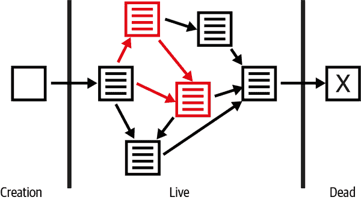

# 第五章：Java 面向对象设计简介

在本章中，我们将考虑与 Java 中面向对象设计（OOD）相关的几种技术。

我们将讨论如何处理 Java 的对象，涵盖`Object`的关键方法、面向对象设计的方面以及实现异常处理方案。在整个章节中，我们将介绍一些*设计模式*——基本上是解决软件设计中一些非常常见情况的最佳实践。在本章的末尾，我们还将考虑*安全*程序——这些程序设计得不会随着时间的推移而变得不一致。

###### 注意

本章旨在展示一个复杂主题和一些基本原则的示例。我们鼓励您查阅其他资源，比如 Josh Bloch 的*Effective Java*。

我们将开始考虑 Java 的调用和传递约定以及 Java 值的性质。

# Java 值

Java 的值及其与类型系统的关系非常直接。Java 有两种类型的值：原始值和对象引用。

###### 注意

Java 中只有八种不同的原始类型，并且程序员不能定义新的原始类型。

原始值和引用之间的关键区别在于原始值不能被更改；值`2`始终是相同的值。相比之下，对象引用的内容通常可以更改——通常称为对象内容的*突变*。

还请注意，变量只能包含适当类型的值。特别是，引用类型的变量始终包含对持有对象的内存位置的引用——它们不直接包含对象内容。这意味着在 Java 中没有等价的解引用运算符或`struct`。

Java 试图简化一个经常让 C++程序员困惑的概念：“对象的内容”和“对象的引用”的区别。不幸的是，完全隐藏这种差异是不可能的，因此程序员有必要了解引用值在平台上的工作原理。

Java 是按值传递的事实可以非常简单地证明，例如，通过运行以下代码：

```java
public void manipulate(Circle circle) {
    circle = new Circle(3);
}

Circle c = new Circle(2);
System.out.println("Radius: "+ c.getRadius());
manipulate(c);
System.out.println("Radius: "+ c.getRadius());
```

这会两次输出`Radius: 2`，因此显示即使在调用`manipulate()`之后，变量`c`中包含的值也未更改——它仍然持有半径为 2 的`Circle`对象的引用。如果 Java 是一种按引用传递的语言，那么它将持有对半径为 3 的`Circle`的引用：

如果我们对这种区别非常小心，并且将对象引用称为 Java 可能的一种值类型之一，则 Java 的一些否则令人惊讶的特性变得明显。要小心！一些较旧的文本在这一点上是含糊的。当我们讨论内存和垃圾收集时，我们将再次遇到 Java 值的概念 第六章。

# 重要的常见方法

正如我们所述，所有类都直接或间接扩展自`java.lang.Object`。该类定义了许多有用的方法，其中一些是为你编写的类设计的。示例 5-1 展示了一个重写了这些方法的类。接下来的章节将文档化每个方法的默认实现，并解释为何你可能需要重写它们。

请注意，此示例仅用于演示目的；在实际情况中，我们会将类如`Circle`表示为记录，并让编译器自动实现许多这些方法。

##### 示例 5-1\. 一个重写重要 Object 方法的类

```java
// This class represents a circle with immutable position and radius.
public class Circle implements Comparable<Circle> {
    // These fields hold the coordinates of the center and the radius.
    // They are private for data encapsulation and final for immutability
    private final int x, y, r;

    // The basic constructor: initialize the fields to specified values
    public Circle(int x, int y, int r) {
        if (r < 0) throw new IllegalArgumentException("negative radius");
        this.x = x; this.y = y; this.r = r;
    }

    // This is a "copy constructor"--a useful alternative to clone()
    public Circle(Circle original) {
        x = original.x;   // Just copy the fields from the original
        y = original.y;
        r = original.r;
    }

    // Public accessor methods for the private fields.
    // These are part of data encapsulation.
    public int getX() { return x; }
    public int getY() { return y; }
    public int getR() { return r; }

    // Return a string representation
    @Override public String toString() {
        return String.format("center=(%d,%d); radius=%d", x, y, r);
    }

    // Test for equality with another object
    @Override public boolean equals(Object o) {
        // Identical references?
        if (o == this) return true;
        // Correct type and non-null?
        if (!(o instanceof Circle)) return false;
        Circle that = (Circle) o;                 // Cast to our type
        if (this.x == that.x && this.y == that.y && this.r == that.r)
            return true;                          // If all fields match
        else
            return false;                         // If fields differ
    }

    // A hash code allows an object to be used in a hash table.
    // Equal objects must have equal hash codes.  Unequal objects are
    // allowed to have equal hash codes, but we try to avoid that.
    // We must override this method because we also override equals().
    @Override public int hashCode() {
        int result = 17;          // This hash code algorithm from
        result = 37*result + x;   // Effective Java, by Joshua Bloch
        result = 37*result + y;
        result = 37*result + r;
        return result;
    }

    // This method is defined by the Comparable interface. Compare
    // this Circle to that Circle.  Return a value < 0 if this < that
    // Return 0 if this == that. Return a value > 0 if this > that.
    // Circles are ordered top to bottom, left to right, then by radius
    public int compareTo(Circle that) {
        // Smaller circles have bigger y
        long result = (long)that.y - this.y;
        // If same compare l-to-r
        if (result==0) result = (long)this.x - that.x;
        // If same compare radius
        if (result==0) result = (long)this.r - that.r;

        // We have to use a long value for subtraction because the
        // differences between a large positive and large negative
        // value could overflow an int. But we can't return the long,
        // so return its sign as an int.
        return Long.signum(result);
    }
}
```

示例 5-1 展示了我们在第四章中介绍的类型系统的许多扩展特性。首先，该示例实现了一个参数化或泛型版本的`Comparable`接口。其次，它使用`@Override`注解来强调（并让编译器验证）某些方法覆盖了`Object`。

## toString()

`toString()`方法的目的是返回对象的文本表示。在字符串连接和诸如`System.out.println()`等方法中，对象会自动调用此方法。给对象提供文本表示在调试或日志输出中非常有用，一个精心制作的`toString()`方法甚至可以帮助生成报告。

继承自`Object`的`toString()`版本返回一个字符串，包括对象的类名以及对象的`hashCode()`值的十六进制表示（本章稍后讨论）。这个默认实现为对象提供了基本的类型和标识信息，但不是非常有用。示例 5-1 中的`toString()`方法返回一个包含`Circle`类每个字段值的可读字符串。

## equals()

`==`运算符测试两个引用是否指向同一个对象。如果你想测试两个不同的对象是否相等，你必须使用`equals()`方法。任何类都可以通过重写`equals()`方法来定义自己的相等性概念。`Object.equals()`方法简单地使用`==`运算符：此默认方法只在两个对象实际上是同一个对象时才认为它们相等。

在示例 5-1 中，`equals()`方法认为两个不同的`Circle`对象在它们的字段都相等时是相等的。注意，它首先通过`==`进行快速的身份测试作为优化，然后使用`instanceof`检查其他对象的类型：一个`Circle`只能与另一个`Circle`相等，且`equals()`方法不可抛出`ClassCastException`。注意，`instanceof`测试还可以排除`null`参数：如果其左操作数为`null`，`instanceof`始终评估为`false`。

## hashCode()

每当您重写 `equals()`，您也必须重写 `hashCode()`。此方法返回一个整数，用于哈希表数据结构。如果根据 `equals()` 方法两个对象相等，则这两个对象必须具有相同的哈希码，这一点至关重要。

对于哈希表的高效操作很重要，但不是必须的，不相等的对象必须具有不相等的哈希码，或者至少不相等的对象不太可能共享一个哈希码。这第二个标准可能会导致涉及轻微复杂算术或位操作的 `hashCode()` 方法。

`Object.hashCode()` 方法与 `Object.equals()` 方法一起使用，根据对象的身份而不是对象的相等性返回一个哈希码。（如果您需要基于身份的哈希码，可以通过静态方法 `System.identityHashCode()` 访问 `Object.hashCode()` 的功能。）

###### 警告

当您重写 `equals()` 时，必须始终重写 `hashCode()`，以保证相等的对象具有相等的哈希码。否则可能会在程序中引起难以察觉的错误。

因为在示例 5-1 中，`equals()` 方法基于三个字段的值来判断对象的相等性，所以 `hashCode()` 方法也基于这三个字段计算其哈希码。从代码可以清楚地看出，如果两个 `Circle` 对象具有相同的字段值，则它们将具有相同的哈希码。

注意，在示例 5-1 中的 `hashCode()` 方法并不简单地将三个字段相加并返回它们的和。这样的实现是合法的，但不高效，因为具有相同半径但 *x* 和 *y* 坐标互换的两个圆将具有相同的哈希码。重复的乘法和加法步骤“扩展”了哈希码的范围，并显著降低了两个不相等的 `Circle` 对象具有相同代码的可能性。

在实践中，现代 Java 程序员通常会从他们的 IDE 中自动生成类的 `hashCode()`、`equals()` 和 `toString()` 方法，或者使用记录（records）类型，其中源代码编译器会生成这些方法的标准形式。对于极少数情况，程序员选择不使用这两种方法的情况，《Effective Java》（Addison Wesley）中包含了一种构建高效 `hashCode()` 方法的有用方法。

## Comparable::compareTo()

示例 5-1 包括一个 `compareTo()` 方法。此方法由 `java.lang.Comparable` 接口定义，而不是由 `Object` 定义，但它是一个常见的实现方法，因此我们在本节中包括它。`Comparable` 及其 `compareTo()` 方法的目的是允许类的实例以类似于 `<`, `<=`, `>`, 和 `>=` 操作符比较数字的方式进行比较。如果一个类实现了 `Comparable` 接口，我们可以调用方法来比较类的实例，从而判断一个实例是否小于、大于或等于另一个实例。这也意味着 `Comparable` 类的实例可以进行排序。

###### 注意

`compareTo()` 方法设置了该类型对象的 *全序*。这被称为该类型的 *自然顺序*，该方法被称为 *自然比较方法*。

因为 `compareTo()` 没有被 `Object` 类声明，所以每个单独的类都需要确定其实例是否应该以及如何排序，并包括一个实现该排序的 `compareTo()` 方法。

由 示例 5-1 定义的顺序将 `Circle` 对象比作页面上的单词。首先，圆按从上到下的顺序排列：具有较大 *y* 坐标的圆小于具有较小 *y* 坐标的圆。如果两个圆具有相同的 *y* 坐标，则按从左到右的顺序排列。具有较小 *x* 坐标的圆小于具有较大 *x* 坐标的圆。最后，如果两个圆具有相同的 *x* 和 *y* 坐标，则按半径比较。具有较小半径的圆小于另一个圆。

注意，在这种顺序下，仅当三个字段都相等时，两个圆才相等。这意味着 `compareTo()` 定义的顺序与 `equals()` 定义的相等性一致。虽然这不是严格要求的，但非常值得，您应该尽可能实现它。

`compareTo()` 方法返回一个需要进一步解释的 `int` 值。如果 `this` 对象小于传递给它的对象，则 `compareTo()` 应返回一个负数。如果两个对象相等，则应返回 0。如果 `this` 大于方法参数，则 `compareTo()` 应返回一个正数。

## clone()

`Object` 定义了一个名为 `clone()` 的方法，其目的是返回一个字段设置与当前对象完全相同的对象。这是一个不寻常的方法的原因之一。

首先，`clone()` 被声明为 `protected`。因此，如果你想让你的对象可以被其他类克隆，你必须重写 `clone()` 方法，并使其为 `public`。接下来，`Object` 中 `clone()` 的默认实现抛出一个受检异常，`CloneNotSupportedException`，除非类实现了 `java.lang.Cloneable` 接口。注意，这个接口不定义任何方法（它是一个标记接口），所以实现它只是在类签名的 `implements` 子句中列出它。

`clone()` 的最初目的是提供一个生成对象的“深度拷贝”的机制，但它本质上是有缺陷的，不建议使用。相反，开发人员应该首选声明一个 *复制构造函数* 来制作他们对象的副本，例如：

```java
Circle original = new Circle(1, 2, 3);  // regular constructor
Circle copy = new Circle(original);     // copy constructor
```

当我们考虑工厂方法时，我们将再次遇到复制构造函数。

# 常量

在 Java 中，常量是一个 `static final` 字段。这个修饰符的组合给定了一个单一的值（每个类），并且在类加载时初始化，然后不能被更改。

按照惯例，Java 的常量以全大写的形式命名，使用 *蛇形命名*，例如 `NETWORK_SERVER_SOCKET`¹，而不是“驼峰命名法”（或“驼峰式”）的约定，如 `networkServerSocket` 对于一个常规字段。

基本上有

+   `public` 常量：这些构成了类的公共 API 的一部分

+   `private` 常量：当常量仅为该类的内部实现细节时使用

+   包级别的常量：这些没有额外的访问关键字，当常量是需要被同一包中的不同类看到的内部实现细节时使用

最终情况可能会出现，例如，客户端和服务器类实现了一个网络协议，其细节（例如连接和监听的端口号）被捕获在一组符号常量中。

正如前面讨论的，常量出现在接口定义中是一种替代方法。实现接口的任何类都会继承它定义的常量，并且可以像在类本身中直接定义它们一样使用它们。这样做的优点是不需要用接口的名称前缀常量，也不需要提供任何常量的实现。

然而，这种方式相当复杂，所以首选方法是在一个类中定义常量（可以是公共的或包级别的），并通过使用 `import static` 声明从定义类中导入常量来使用它们。有关详细信息，请参阅 “包和 Java 命名空间”。

# 处   处理字段

Java 提供了多种访问控制关键字，用于定义字段的访问方式。使用任何这些可能性都是完全合法的，但实际上，Java 开发者通常有三种主要的字段访问选择：

+   常量（`static final`）：我们刚刚遇到的情况，可能还带有额外的访问控制关键字。

+   不可变字段（`private final`）：使用此组合的字段在对象创建后无法更改。

+   可变字段（`private`）：只有在程序员确定字段值在对象生命周期内会改变时才应该使用这种组合。

近年来，许多开发者开始采用尽可能使用不可变数据的实践。这种做法有几个好处，但主要的好处是，如果对象设计得不可修改，那么它们可以在线程之间自由共享。

在编写类时，我们建议根据情况使用上述三种字段修饰符选择。实例字段应始终首先写为`final`，只有在必要时才应使其可变。

此外，除了常量外，不应使用直接字段访问。应优先使用 getter 方法（以及 setter，对于可变状态的情况）。这样做的主要原因是直接字段访问会非常紧密地耦合定义类和任何客户端代码。如果使用访问器方法，则可以稍后修改这些方法的实现代码而无需更改客户端代码——而直接字段访问则无法做到这一点。

我们还应该指出字段处理中的一个常见错误：从 C++转过来的开发者经常犯的一个错误是省略字段的任何访问修饰符。这是一个严重的缺陷，因为 C++的默认可见性是 private，而 Java 的默认访问权限更加开放。这代表了 Java 中封装的失败，开发者应该注意避免这种情况。

# 字段继承和访问器

除了上述考虑因素外，Java 还提供了多种可能的方法来解决状态继承的设计问题。程序员可以选择将字段标记为`protected`，并允许子类直接访问（包括写入）。或者，我们可以提供*访问器方法*来读取（和写入，如果需要）实际的对象字段，同时保持封装性并将字段保留为`private`。

让我们重新审视我们之前在第三章末尾的`PlaneCircle`示例，并明确显示字段继承：

```java
public class Circle {
  // This is a generally useful constant, so we keep it public
  public static final double PI = 3.14159;

  protected double r;     // State inheritance via a protected field

  // A method to enforce the restriction on the radius
  protected void checkRadius(double radius) {
    if (radius < 0.0)
      throw new IllegalArgumentException("radius may not < 0");
  }

  // The non-default constructor
  public Circle(double r) {
    checkRadius(r);
    this.r = r;
  }

  // Public data accessor methods
  public double getRadius() { return r; }
  public void setRadius(double r) {
    checkRadius(r);
    this.r = r;
  }

  // Methods to operate on the instance field
  public double area() { return PI * r * r; }
  public double circumference() { return 2 * PI * r; }
}

public class PlaneCircle extends Circle {
  // We automatically inherit the fields and methods of Circle,
  // so we only have to put the new stuff here.
  // New instance fields that store the center point of the circle
  private final double cx, cy;

  // A new constructor to initialize the new fields
  // It uses a special syntax to invoke the Circle() constructor
  public PlaneCircle(double r, double x, double y) {
    super(r);       // Invoke the constructor of the superclass
    this.cx = x;    // Initialize the instance field cx
    this.cy = y;    // Initialize the instance field cy
  }

  public double getCenterX() {
    return cx;
  }

  public double getCenterY() {
    return cy;
  }

  // The area() and circumference() methods are inherited from Circle
  // A new instance method that checks whether a point is inside the
  // circle; note that it uses the inherited instance field r
  public boolean isInside(double x, double y) {
    double dx = x - cx, dy = y - cy;
    // Pythagorean theorem
    double distance = Math.sqrt(dx*dx + dy*dy);
    return (distance < r);                   // Returns true or false
  }
}
```

而不是前面的代码，我们可以使用访问器方法来重写`PlaneCircle`，如下所示：

```java
public class PlaneCircle extends Circle {
  // Rest of class is the same as above; the field r in
  // the superclass Circle can be made private because
  // we no longer access it directly here

  // Note that we now use the accessor method getRadius()
  public boolean isInside(double x, double y) {
    double dx = x - cx, dy = y - cy;            // Distance to center
    double distance = Math.sqrt(dx*dx + dy*dy); // Pythagorean theorem
    return (distance < getRadius());
  }
}
```

这两种方法在 Java 中都是合法的，但它们有一些区别。正如我们在 “数据隐藏和封装” 中讨论的那样，可在类外部写入的字段通常不是模型化对象状态的正确方式。事实上，正如我们稍后将在本章中看到的，并再次在 “Java 对并发的支持” 中看到的，它们可能会对程序的运行状态造成无法修复的损害。

因此，Java 中的 `protected` 关键字不幸地允许从子类和与声明类在同一包中的类（以及方法）访问字段。这与任何人都可以编写属于任何给定包的类（除了系统包）的能力结合在一起，意味着在 Java 中，受保护的状态继承可能存在缺陷。

###### 警告

Java 不提供一种仅在声明类及其子类中可见成员的机制。

出于所有这些原因，几乎总是更好地使用访问器方法（无论是公共的还是受保护的）来为子类提供对状态的访问——除非继承的状态声明为 `final`，在这种情况下，受保护的状态继承是完全允许的。

# 单例

*单例模式* 是一个非常著名的设计模式。它旨在解决只需要或希望一个类的单个实例的设计问题。Java 提供了多种不同的实现单例模式的方式。在我们的讨论中，我们将使用稍微冗长的形式，这种形式的好处在于非常明确地说明了安全单例所需的操作：

```java
public class Singleton {
  private final static Singleton instance = new Singleton();
  private static boolean initialized = false;

  // Constructor
  private Singleton() {
    super();
  }

  private void init() {
    /* Do initialization */
  }

  // This method should be the only way to get a reference
  // to the instance
  public static synchronized Singleton getInstance() {
    if (initialized) return instance;
    instance.init();
    initialized = true;
    return instance;
  }
}
```

关键点在于，单例模式要有效，必须不可能创建多个实例，并且不可能获取到处于未初始化状态的对象的引用（有关这一重要点的更多信息，请参见本章后面）。

为了实现这一点，我们需要一个仅被调用一次的 `private` 构造函数。在我们的 `Singleton` 版本中，我们只在初始化私有静态变量 `instance` 时调用构造函数。我们还将创建唯一 `Singleton` 对象的过程与初始化分开，初始化过程发生在私有方法 `init()` 中。

有了这个机制，获取 `Singleton` 唯一实例的唯一方法是通过静态辅助方法 `getInstance()`。此方法检查标志 `initialized`，以查看对象是否已经处于活动状态。如果是，则返回对单例对象的引用。如果不是，则 `getInstance()` 调用 `init()` 来激活对象，并将标志设置为 `true`，这样下次请求 `Singleton` 的引用时，不会再进行进一步的初始化。

最后，我们还注意到`getInstance()`是一个`synchronized`方法。详细信息请参见第 6 章，了解其含义及为何需要这样做，但现在只需知道，它存在是为了防止在多线程程序中使用`Singleton`时出现意外后果。

###### 提示

单例模式作为最简单的模式之一，经常被滥用。正确使用时，它可以是一种有用的技术，但程序中有太多的单例类通常是代码设计不良的典型迹象。

单例模式有一些缺点，特别是在测试和与其他类分离时可能很难。在多线程代码中使用时也需要注意。尽管如此，开发人员熟悉单例模式并不会意外地重新发明它是很重要的。单例模式经常用于配置管理，但现代代码通常会使用框架（通常是*依赖注入*框架）自动为程序员提供单例，而不是通过显式的`Singleton`（或等效）类。

# 工厂方法

直接使用构造函数的另一种选择是*工厂方法*模式。这种技术的基本形式是将构造函数设为私有的（或者在某些变体中设为其他非公共修饰符），并提供一个静态方法返回所需的类型。然后客户端代码使用这个静态方法来获取类型的实例。

作为代码作者，我们可能不希望直接暴露构造函数，并可能选择使用工厂。例如，缓存工厂不一定创建新对象，或者因为有多种有效构造对象的方式。

###### 注意

静态工厂方法的方法并不同于经典书籍[*设计模式*](https://oreil.ly/1CbpU)中的*抽象工厂*模式。

让我们重写来自示例 5-1 的构造函数，并引入一些工厂方法：

```java
public final class Circle implements Comparable<Circle> {
    private final int x, y, r;

    // Main constructor
    private Circle(int x, int y, int r) {
        if (r < 0) throw new IllegalArgumentException("radius < 0");
        this.x = x; this.y = y; this.r = r;
    }

    // Usual factory method
    public static Circle of(int x, int y, int r) {
        return new Circle(x, y, r);
    }

    // Factory method playing the role of the copy constructor
    public static Circle of(Circle original) {
        return new Circle(original.x, original.y, original.r);
    }

    // Third factory with intent given by name
    public static Circle ofOrigin(int r) {
        return new Circle(0, 0, r);
    }

    // other methods elided
}
```

这个类包含一个私有构造函数和三个独立的工厂方法：一个与构造函数具有相同签名的“常规”方法，以及两个额外的方法。其中一个额外的工厂实际上是一个复制构造函数，另一个用于处理一个特殊情况：原点处的圆。

使用工厂方法的一个优势是，与构造函数不同，该方法具有名称，因此可以使用名称的一部分指示其意图。在我们的示例中，工厂方法是`of()`，这是一个非常常见的选择，并且我们通过使用表达这一点的名称`ofOrigin()`来区分原点圆。

# 构建器

工厂方法是一种有用的技术，当您不想将构造函数暴露给客户端代码时。然而，工厂方法也有其局限性。当只有少数几个参数是必需的，并且所有这些参数都需要被传递时，它们运行良好。但在某些情况下，我们需要建模数据，其中许多部分是可选的，或者我们的领域对象有许多有效的不同可能的构造。在这种情况下，工厂方法的数量可能会快速增加，以表示所有可能的组合，并且可能会使 API 混乱。

另一种方法是*建造者*模式。这种模式使用一个辅助建造者对象，该对象与真实领域对象的状态完全相同（假设为不可变）。对于领域对象的每个字段，建造者都有相同的字段——相同的名称和类型。然而，虽然领域对象是不可变的，建造者对象是显式可变的。实际上，建造者有一个 setter 方法，命名方式与字段相同（即按“记录约定”），开发人员将使用该方法来设置状态的一部分。

建造者模式的整体意图是从一个“空白”的建造者对象开始，并向其添加状态，直到建造者准备好转换为实际的领域对象，通常是通过在建造者上调用`build()`方法。

让我们看一个简单的例子：

```java
// Generic builder interface
public interface Builder<T> {
    T build();
}

public class BCircle {
    private final int x, y, r;

    // The main constructor is now private
    private BCircle(CircleBuilder cb) {
        if (cb.r < 0)
        throw new IllegalArgumentException("negative radius");
        this.x = cb.x; this.y = cb.y; this.r = cb.r;
    }

    public static class CircleBuilder implements Builder<BCircle> {
        private int x = 0, y = 0, r = 0;

        public CircleBuilder x(int x) {
            this.x = x;
            return this;
        }

        public int x() {
            return x;
        }

        // Similarly for y and r

        @Override
        public BCircle build() {
            return new BCircle(this);
        }
    }

    // Other methods elided
}
```

注意建造者接口通常是泛型的。这是因为在实践中，我们可能会有大量的领域类，所有这些类都将需要建造者，因此使用泛型建造者接口可以消除重复。`Builder`接口只包含一个方法，因此在技术上它可以作为 lambda 目标类型的候选者。但实际上这几乎从不是意图，因此没有被标记为`@FunctionalInterface`。`build()`方法的实现还包含对`this`引用的非可选使用。

建造者可以通过如下简单的代码驱动：

```java
var cb = new BCircle.CircleBuilder();
cb.x(1).y(2).r(3);
var circle = cb.build();
```

注意首先我们要实例化建造者。然后，我们调用方法来设置建造者的各种参数。最后，我们通过调用`build()`方法从建造者创建一个不可变对象。

您可能注意到，增加状态的建造者上的方法都返回`this`。这种接口设计的目的是可以将调用*链式*——即可以在同一个可变对象上连续调用方法，例如`cb.x(1).y(2).r(3)`。另一种描述这种接口设计风格的方式是*流畅接口*。由于每个方法都返回`this`，我们知道所有这些调用都是安全的：不会出现`NullPointerException`。

我们的示例非常简单，有些刻意；它只有三个参数，而且所有这些参数都是必需的。在实践中，当对象参数数量较多且对象状态的“跨度集”有多个可能性时，构建器更加有用。工厂与构建器的使用案例存在重叠；确定在您自己的代码中确切的边界位置是面向对象设计技能开发的一部分。

# 接口与抽象类的比较

Java 8 彻底改变了 Java 的面向对象编程模型。在 Java 8 之前，接口是纯粹的 API 规范，不包含任何实现。当接口有多个实现时，这可能（并经常）导致代码重复。

为了避免这种浪费的努力，发展出了一个简单的编码模式，利用抽象类可以包含子类可以构建的部分实现。许多子类可以依赖抽象超类（也称为*抽象基类*）提供的方法实现。

这种模式由包含基本方法 API 规范的接口以及作为抽象类的主要部分实现配对而成。一个很好的例子就是`java.util.List`，它与`java.util.AbstractList`配对。JDK 提供的`List`的两个主要实现（`ArrayList`和`LinkedList`）都是`AbstractList`的子类。

另一个例子：

```java
// Here is a basic interface. It represents a shape that fits inside
// of a rectangular bounding box. Any class that wants to serve as a
// RectangularShape can implement these methods from scratch.
public interface RectangularShape {
    void setSize(double width, double height);
    void setPosition(double x, double y);
    void translate(double dx, double dy);
    double area();
    boolean isInside();
}

// Here is a partial implementation of that interface. Many
// implementations may find this a useful starting point.
public abstract class AbstractRectangularShape
                        implements RectangularShape {
    // The position and size of the shape
    protected double x, y, w, h;

    // Default implementations of some of the interface methods
    public void setSize(double width, double height) {
     w = width; h = height;
    }
    public void setPosition(double x, double y) {
     this.x = x; this.y = y;
    }
    public void translate (double dx, double dy) { x += dx; y += dy; }
}
```

Java 8 的默认方法的到来显著改变了这一局面。接口现在可以包含实现代码，就像我们在“默认方法”中看到的那样。

这意味着当定义一个抽象类型（例如`Shape`），你期望它有许多子类型（例如`Circle`、`Rectangle`、`Square`）时，你面临选择接口和抽象类之间的选择。由于它们现在可能具有相似的特性，因此并不总是清楚该选择哪一个。

请记住，扩展抽象类的类不能扩展任何其他类，而接口仍然不能包含任何非常量字段。这意味着在 Java 程序中使用继承仍然有一些限制。

接口和抽象类之间的另一个重要区别与兼容性有关。如果你将接口定义为公共 API 的一部分，然后稍后向接口添加一个新的强制方法，你将会破坏实现了接口先前版本的任何类——换句话说，任何新的接口方法必须声明为默认方法，并提供一个实现。

然而，如果使用抽象类，可以安全地向该类添加非抽象方法，而无需修改扩展抽象类的现有类。

在这两种情况下，添加新方法可能会与具有相同名称和签名的子类方法发生冲突 —— 子类方法始终胜出。因此，在添加新方法时要仔细考虑，特别是当方法名称对于此类型是“显而易见”或方法可能具有多个可能含义时。

通常，建议的方法是在需要 API 规范时首选接口。接口的强制方法是非默认的，因为它们代表 API 的一部分，必须存在于实现中才能被视为有效。默认方法应仅在方法真正可选时使用，或者如果它们只打算具有单个可能的实现时使用。

最后，旧的（Java 8 之前的）在文档中声明接口的哪些方法被认为是“可选的”，并指示实现在程序员不想实现它们时抛出`java.lang.UnsupportedOperationException`的技术充满了问题，不应在新代码中使用。

# 默认方法改变了 Java 的继承模型吗？

在 Java 8 之前，语言的严格单继承模型是清晰的。每个类（除了`Object`）都有一个直接超类，方法实现只能在类中定义，或者从超类层次结构继承。

默认方法改变了这种情况，因为它们允许方法实现从多个地方继承 —— 可以是从超类层次结构，也可以是从接口提供的默认实现。任何来自不同接口的默认方法之间的潜在冲突都会导致编译时错误。

这意味着不存在实现的多重继承可能性，因为在任何冲突情况下，程序员需要手动消除歧义的方法。

同样，接口仍然没有状态的多重继承：接口仍然没有非常量字段。

这意味着 Java 的多重继承与例如 C++中的一般多重继承不同。实际上，默认方法实际上是来自 C++的*Mixin*模式（对于熟悉该语言的读者）。一些开发人员还将默认成员视为某些面向对象语言（例如 Scala）中出现的*trait*语言特性的一种形式。

然而，来自 Java 语言设计者的官方立场是，默认方法并不完全满足完整的特征。 JDK 中随附的代码 —— 即使是`java.util.function`中的接口（如`Function`本身）也表现为简单的特征。

例如，考虑以下示例：

```java
public interface IntFunc {
    int apply(int x);

    default IntFunc compose(IntFunc before) {
        return (int y) -> apply(before.apply(y));
    }

    default IntFunc andThen(IntFunc after) {
        return (int z) -> after.apply(apply(z));
    }

    static IntFunc id() {
        return x -> x;
    }
}
```

它是`java.util.function`中`Function`接口的简化版本，删除了泛型，并仅处理`int`作为数据类型。

这种情况显示了现有的功能组合方法（`compose()` 和 `andThen()`）的一个重要点：这些函数只会以标准方式组合，任何理智的对默认 `compose()` 方法的重写都几乎不可能存在。

当然，在 `java.util.function` 中存在的函数类型也是如此，这表明在提供的有限域内，默认方法确实可以被视为一种无状态特征。

# 使用 Lambdas 的面向对象设计

考虑这个简单的 lambda 表达式：

```java
Runnable r = () -> System.out.println("Hello World");
```

*lvalue*（赋值语句左侧）的类型是 `Runnable`，这是一个接口类型。为了使这个语句有意义，*rvalue*（赋值语句右侧）必须包含实现 `Runnable` 的某个类类型的实例（因为接口不能被实例化）。满足这些约束的最小实现是一个类类型（名称不重要），它直接扩展 `Object` 并实现 `Runnable`。

请记住，lambda 表达式的意图是允许 Java 程序员表达尽可能接近其他语言中看到的匿名或内联方法的概念。

此外，鉴于 Java 是一种静态类型语言，这直接导致了 lambda 的设计实现。

###### 提示

Lambdas 是一个新类类型的实例构造的简写，这个新类类型本质上是 `Object` 增强了一个方法。

lambda 的额外方法由接口类型提供签名，并且编译器将检查 `rvalue` 是否与此类型签名一致。

## Lambdas 与嵌套类

在 Java 8 中向语言添加 lambda 相对较晚，与其他编程语言相比。因此，Java 社区已经建立了模式来解决 lambda 的缺失问题。这表现在大量使用非常简单的嵌套（也称为内部）类来填补通常由 lambda 占据的空缺。

在现代的 Java 项目中，开发人员通常会尽可能地使用 lambda。我们还强烈建议，在重构旧代码时，您花一些时间将内部类转换为 lambda，只要有可能。一些 IDE 甚至提供了自动转换功能。

然而，这仍然留下了一个设计问题，即何时使用 lambda，何时使用嵌套类仍然是正确的解决方案。

有些情况是显而易见的；例如，当扩展某些功能的默认实现时，嵌套类方法是适当的，原因有两个：

1.  自定义实现可能必须重写多个方法。

1.  基础实现是一个类，而不是一个接口。

另一个要考虑的主要用例是有状态 lambda。由于没有地方声明任何字段，乍一看似乎 lambda 不能直接用于涉及状态的任何事物—语法只给出了声明方法体的机会。

然而，lambda 可能引用 lambda 所创建的范围内定义的变量，因此我们可以创建一个闭包，如在 第四章 中讨论的那样，来扮演有状态 lambda 的角色。

## Lambda 与方法引用

何时使用 lambda 和何时使用方法引用大多数是个人品味和风格问题。当然，在一些情况下创建 lambda 是必要的。然而，在许多简单情况下，lambda 可以被方法引用替代。

一种可能的方法是考虑 lambda 符号是否增加了代码的可读性。例如，在流 API 中，使用 lambda 形式可能会带来潜在的好处，因为它使用 `->` 操作符。这提供了一种视觉隐喻形式——流 API 是一种惰性抽象，可以将数据项“通过函数管道流动”。

例如，让我们考虑一个 `Person` 对象，它具有标准特征，如姓名、年龄等。我们可以使用类似以下的流水线计算平均值：

```java
List<Person> persons = ... // derived from somewhere
double aveAge = persons.stream()
        .mapToDouble(o -> o.getAge())
        .reduce(0, (x, y) -> x + y ) / persons.size();
```

`mapToDouble()` 方法具有运动或转换方面的概念，使用显式 lambda 很明显。对于经验不足的程序员，这也引起了对函数式 API 的注意。

对于其他用例（例如 *分发表*），方法引用可能更合适。例如：

```java
public class IntOps {
    private Map<String, BinaryOperator> table =
        Map.of("add", IntOps::add, "subtract", IntOps::sub);

    private static int add(int x, int y) {
        return x + y;
    }

    private static int sub(int x, int y) {
        return x - y;
    }

    public int eval(String op, int x, int y) {
        return table.get(op).apply(x, y);
    }
}
```

在可以使用任一符号的情况下，随着时间的推移，您会形成适合个人风格的偏好。关键考虑因素是在重新阅读数月（或数年）前编写的代码时，符号选择是否仍然合理且代码易于阅读。

# 使用封闭类型的面向对象设计

我们在 第三章 中第一次遇到封闭类，并在 第四章 中引入了封闭接口。除了我们已经遇到的情况外，还有一个更简单的可能性，即封闭类型只能由定义在同一编译单元内的类（即 Java 源文件）扩展，例如：

```java
// Note the absence of a permits clause
public abstract sealed class Shape {

    public static final class Circle extends Shape {
        // ...
    }

    public static final class Rectangle extends Shape {
        // ...
    }
}
```

类 `Shape.Circle` 和 `Shape.Rectangle` 是 `Shape` 的唯一允许的子类：任何试图扩展 `Shape` 的尝试都将导致编译错误。这实际上只是额外的细节，因为一般概念保持不变；`sealed` 表示一个只有有限可能兼容的类型。

这里有一个有趣的二元性：

+   枚举是只有有限数量实例的类——任何枚举对象都是这些实例之一

+   封闭类型仅有限数量的兼容类——任何封闭对象都属于其中一个类

现在考虑一个接受枚举的 switch 表达式，例如：

```java
var temp = switch(season) {
    case WINTER -> 2.0;
    case SPRING -> 10.5;
    case SUMMER -> 24.5;
    case AUTUMN -> 16.0;
};
System.out.println("Average temp: "+ temp);
```

所有季节的可能枚举常量都出现在这个 switch 表达式中，因此匹配被称为*完全的*。在这种情况下，不需要包含`default`，因为编译器可以利用枚举常量的*详尽性*推断出永远不会激活默认情况。

不难看出我们可以对密封类型进行类似的操作。一些代码如下所示：

```java
Shape shape = ...

if (shape instanceof Shape.Circle c) {
    System.out.println("Circle: "+ c.circumference());
} else if (shape instanceof Shape.Rectangle r) {
    System.out.println("Rectangle: "+ r.circumference());
}
```

对于人类来说，这显然是详尽无遗的，但当前（截至 Java 17）并未直接被编译器识别。

这是因为，截至 Java 17，密封类型实质上是一种不完整的功能。在 Java 的未来版本中，打算扩展 switch 表达式功能并将其与新形式的`instanceof`（以及其他新语言特性）结合起来，以提供称为*模式匹配*的功能。

这一新特性将使开发人员能够编写代码，例如“对变量的类型进行切换”，这将解锁由函数式编程启发的新设计模式，在 Java 中实现起来并不容易。

###### 注意

附录包含有关模式匹配和其他未来功能的更多信息。

尽管截至 Java 17 还不完全完整，但密封类型在其当前形式下仍然非常有用，也可以与记录结合以产生一些引人注目的设计。

# 使用记录的 OOD

记录在第三章中引入，以其最简单的形式代表“仅仅是字段”或“数据包”。在其他一些编程语言中，这由一个*元组*表示，但 Java 的记录与元组有两个重要的不同之处：

1.  Java 记录是具名类型，而元组是匿名的

1.  Java 记录可以拥有方法、辅助构造函数以及几乎类似类的一切内容

这两者都源于记录是一种特殊类型的类的事实。这使得程序员可以从使用记录作为基本字段集合开始其设计，然后从那里进化。

例如，让我们将示例 5-1 重写为一条记录（简化了`Comparable`接口）：

```java
public record Circle(int x, int y, int r) {
    // Primary (compact) constructor
    public Circle {
        // Validation code in the constructor
        // This would be impossible in a tuple
        if (r < 0) {
            throw new IllegalArgumentException("negative radius");
        }
    }

    // Factory method playing the role of the copy constructor
    public static Circle of(Circle original) {
        return new Circle(original.x, original.y, original.r);
    }
}
```

请注意，我们引入了一种新类型的构造函数，称为*紧凑构造函数*。它仅适用于记录，并且在我们希望在构造函数中做一些额外工作以及初始化字段的情况下使用。紧凑构造函数没有（或不需要）参数列表，因为它们的参数列表始终与记录的声明相同。

这段代码比示例 5-1 要简短得多，并清楚地区分了记录的主构造函数（“真实形式”）与复制构造函数及可能存在的其他工厂之间的情况。

Java 记录的设计意味着它们是程序员的一种非常灵活的选择。一个实体可以最初被建模为仅仅是字段，并且随着时间的推移，可以获得更多的方法、实现接口等。

另一个重要方面是记录可以与密封接口结合使用。让我们来看一个例子：一个快递公司有不同类型的订单：基本订单（免费送货）和快速订单（速度更快但需额外费用）。

订单的基本接口如下所示：

```java
sealed interface Order permits BasicOrder, ExpressOrder {
    double price();
    String address();
    LocalDate delivery();
}
```

并且有两个实现：

```java
public record BasicOrder(double price,
                         String address,
                         LocalDate delivery) implements Order {}

public record ExpressOrder(double price,
                           String address,
                           LocalDate delivery,
                           double deliveryCharge) implements Order {}
```

请记住，所有记录类型的超类型是`java.lang.Record`，因此对于这种类型的用例，我们必须使用接口；不可能使不同的订单类型扩展抽象基类。我们的选择是：

+   将实体建模为类，并使用`sealed abstract`基类。

+   将实体建模为记录，并使用密封接口。

在第二种情况下，任何常见的记录组件都需要提升到接口中，就像我们在`Order`示例中看到的那样。

# 实例方法还是类方法？

实例方法是面向对象编程的一个关键特性。然而，并不意味着您应该避免使用类方法。在许多情况下，定义类方法是完全合理的。

###### 提示

请记住，在 Java 中，类方法使用`static`关键字声明，术语*static method*和*class method*可互换使用。

例如，在使用`Circle`类时，您可能经常需要计算具有给定半径的圆的面积，但不想费事地创建表示该圆的`Circle`对象。在这种情况下，类方法更方便：

```java
public static double area(double r) { return PI * r * r; }
```

一个类可以定义多个具有相同名称的方法，只要这些方法具有不同的参数列表是完全合法的。`area()`方法的这个版本是一个类方法，因此它没有隐含的`this`参数，并且必须有一个参数来指定圆的半径。这个参数使它与同名的实例方法有所区别。

另一个关于实例方法和类方法选择的例子是，考虑定义一个名为`bigger()`的方法，它检查两个`Circle`对象，并返回半径较大的那个。我们可以将`bigger()`编写为实例方法，如下所示：

```java
// Compare the implicit "this" circle to the "that" circle passed
// explicitly as an argument and return the bigger one.
public Circle bigger(Circle that) {
  if (this.r > that.r) return this;
  else return that;
}
```

我们还可以将`bigger()`实现为一个类方法，如下所示：

```java
// Compare circles a and b and return the one with the larger radius
public static Circle bigger(Circle a, Circle b) {
  if (a.r > b.r) return a;
  else return b;
}
```

给定两个`Circle`对象`x`和`y`，我们可以使用实例方法或类方法来确定哪个更大。然而，这两种方法的调用语法有显著区别：

```java
// Instance method: also y.bigger(x)
Circle biggest = x.bigger(y);
Circle biggest = Circle.bigger(x, y);  // Static method
```

这两种方法都很有效，并且从面向对象设计的角度来看，这两种方法都没有比另一种方法更“正确”的说法。实例方法在形式上更符合面向对象，但其调用语法存在某种不对称性。在这种情况下，选择实例方法或类方法仅仅是一种设计决策。根据情况，其中一种方法可能更为自然。

## 关于 System.out.println()的一点说明

我们经常遇到方法`System.out.println()` — 它用于将输出显示到终端窗口或控制台。我们从未解释过为什么这个方法有这么长、笨拙的名字，或者这两个点在里面做什么。现在你理解了类和实例字段以及类和实例方法，更容易理解正在发生的事情：`System`是一个类。它有一个名为`out`的公共类字段。这个字段是`java.io.PrintStream`类型的对象，它有一个名为`println()`的实例方法。

我们可以使用静态导入来缩短这个过程，比如`import static java.lang.System.out;` — 这将使我们能够将打印方法简化为`out.println()`，但由于这是一个实例方法，我们无法进一步缩短它。

# 组合与继承

继承并不是面向对象设计中我们唯一可以使用的技术。对象可以包含对其他对象的引用，因此可以从更小的组件部分聚合出更大的概念单元；这被称为*组合*。

一个重要的相关技术是*委托*，其中特定类型的对象持有对兼容类型的次要对象的引用，并将所有操作转发到次要对象。这通常通过接口类型来完成，正如本例中展示的那样，我们在这里模拟软件公司的就业结构：

```java
public interface Employee {
  void work();
}

public class Programmer implements Employee {
  public void work() { /* program computer */ }
}

public class Manager implements Employee {
  private Employee report;

  public Manager(Employee staff) {
    report = staff;
  }

  public Employee setReport(Employee staff) {
    report = staff;
  }

  public void work() {
    report.work();
  }
}
```

`Manager`类被认为是*委托*`work()`操作给他们的直接报告，`Manager`对象不执行任何实际工作。此模式的变体涉及在委托类中执行一些工作，只将一些调用转发到委托对象。

另一种有用的相关技术称为*装饰者模式*。这提供了在运行时扩展对象功能的能力。设计时需要一些额外的工作量。让我们看一个装饰者模式的例子，应用于模拟在塔科店出售的卷饼。为了保持简单，我们仅模拟要装饰的一个方面——卷饼的价格：

```java
// The basic interface for our burritos
interface Burrito {
  double getPrice();
}

// Concrete implementation-standard size burrito
public class StandardBurrito implements Burrito {
  private static final double BASE_PRICE = 5.99;

  public double getPrice() {
    return BASE_PRICE;
  }
}

// Larger, super-size burrito
public class SuperBurrito implements Burrito {
  private static final double BASE_PRICE = 6.99;

  public double getPrice() {
    return BASE_PRICE;
  }
}
```

这些涵盖了可以提供的基本卷饼——两种不同的尺寸，不同的价格。让我们通过添加一些可选的额外配料——辣椒和鳄梨酱来增强这一点。这里的关键设计点是使用一个抽象基类，所有可选的装饰组件都将其子类化：

```java
/*
 * This class is the Decorator for Burrito. It represents optional
 * extras that the burrito may or may not have.
 */
public abstract class BurritoOptionalExtra implements Burrito {
    private final Burrito burrito;
    private final double price;

    protected BurritoOptionalExtra(Burrito toDecorate,
          double myPrice) {
        burrito = toDecorate;
        price = myPrice;
    }

    public final double getPrice() {
        return (burrito.getPrice() + price);
    }
}
```

结合一个`abstract`基类`BurritoOptionalExtra`，以及一个`protected`构造函数，意味着获取`BurritoOptionalExtra`的唯一有效方法是构造其子类的实例，因为它们具有公共构造函数。这种方法还可以隐藏组件价格的设置，使客户端代码无法访问。

###### 注意

当然，装饰者也可以与密封类型结合使用，以允许仅限于已知的有限列表的装饰者。

让我们来测试这个实现：

```java
Burrito lunch = new Jalapeno(new Guacamole(new SuperBurrito()));
// The overall cost of the burrito is the expected $8.09.
System.out.println("Lunch cost: "+ lunch.getPrice());
```

装饰器模式被广泛应用，尤其是在 JDK 实用类中。当我们在第十章中讨论 Java I/O 时，我们将看到更多实际应用中的装饰器示例。

# 异常和异常处理

我们在“已检查和未检查异常”中遇到了已检查和未检查异常。在本节中，我们讨论异常设计的一些附加方面以及如何在您自己的代码中使用它们。

请记住，在 Java 中，异常是一个对象。这个对象的类型是 `java.lang.Throwable`，或者更常见的是 `Throwable` 的某个子类，更具体地描述了发生的异常类型。`Throwable` 有两个标准的子类：`java.lang.Error` 和 `java.lang.Exception`。属于 `Error` 子类的异常通常指示不可恢复的问题：虚拟机已经耗尽了内存，或者类文件已损坏且无法读取，例如。这类异常可以被捕获和处理，但很少这样做 —— 这些是先前提到的未检查异常。

另一方面，属于 `Exception` 子类的异常指示的是较不严重的情况。这些异常可以被合理地捕获和处理。它们包括诸如 `java.io.EOFException`（表示文件结束）和 `java.lang.ArrayIndexOutOfBoundsException`（指示程序尝试读取超出数组末尾的位置）等异常。这些是来自第二章中的已检查异常（除了 `RuntimeException` 子类，它们也是一种未检查异常）。在本书中，我们使用术语“异常”来指代任何异常对象，无论该异常的类型是 `Exception` 还是 `Error`。

因为异常是一个对象，它可以包含数据，并且它的类可以定义操作该数据的方法。`Throwable` 类及其所有子类都包括一个 `String` 字段，用于存储描述异常条件的可读错误消息。异常对象创建时设置该字段，并可以通过 `getMessage()` 方法从异常中读取。大多数异常只包含这一条消息，但有些异常会添加其他数据。例如，`java.io.InterruptedIOException` 添加了一个名为 `bytesTransferred` 的字段，指定了在异常条件中断之前完成的输入或输出量。

在设计自己的异常时，应考虑与异常对象相关的其他建模信息。这通常是关于中止操作的具体信息，以及遇到的异常情况（正如我们在 `java.io.InterruptedIOException` 中看到的）。

在应用程序设计中使用异常存在一些权衡。使用受检异常意味着编译器可以强制处理（或向上传播到调用堆栈）已知的可能恢复或重试的条件。这也意味着更难忘记实际处理错误——从而减少忘记错误条件导致系统在生产中失败的风险。

另一方面，有些应用程序将无法从某些条件中恢复，即使这些条件在理论上由受检异常建模。例如，如果应用程序要求在文件系统中特定位置放置配置文件，并且在启动时找不到它，则可能只能打印错误消息并退出——尽管`java.io.FileNotFoundException`是一个受检异常。在这些情况下，强制处理或传播无法从中恢复的异常，边缘情况，打印错误并退出是唯一真正明智的操作。

在设计异常方案时，以下是一些您应该遵循的良好实践：

+   考虑需要放置在异常上的附加状态——记住它也是一个像其他任何对象一样的对象。

+   `Exception`有四个公共构造函数——在正常情况下，自定义异常类应该实现所有这些函数——用于初始化额外状态或自定义消息。

+   不要在您的 API 中创建许多细粒度的自定义异常类——Java I/O 和反射 API 都受到此类问题的困扰，并且这样做只会不必要地复杂化与这些包的工作。

+   不要用一个单一的异常类型描述太多的条件。

+   在确定需要抛出异常之前，永远不要创建异常。异常创建可能是一个昂贵的操作。

最后，有两种异常处理反模式您应该避免：

```java
// Never just swallow an exception
try {
  someMethodThatMightThrow();
} catch(Exception e){
}

// Never catch, log, and rethrow an exception
try {
  someMethodThatMightThrow();
} catch(SpecificException e){
  log(e);
  throw e;
}
```

前者只是忽略了几乎肯定需要采取某些行动的条件（即使只是在日志中通知）。这增加了系统中其他地方发生失败的可能性——可能远离原始的真实来源。

第二个只是制造噪音。我们记录了一条消息，但实际上没有处理这个问题；我们仍然需要在系统中更高级别的其他代码来实际处理这个问题。

# 安全的 Java 编程

编程语言有时被描述为*类型安全*；然而，这个术语在工作程序员中使用得比较宽泛。关于类型安全有许多不同的观点和定义，并非所有观点都是相互兼容的。对于我们的目的来说，最有用的观点是*类型安全*是编程语言的一个属性，可以防止在运行时错误地标识数据的类型。这应该被视为一个滑动尺度——更有助于将语言视为在类型安全性方面更多（或更少）的语言，而不是一个简单的安全/不安全的二元属性。

在 Java 中，类型系统的静态特性通过产生编译错误来防止大量可能的错误，例如，如果程序员尝试将不兼容的值分配给变量。然而，Java 并不是完全类型安全的，因为我们可以在任何两个引用类型之间进行强制类型转换——如果值不兼容，这将在运行时失败，抛出 `ClassCastException`。

在本书中，我们倾向于将安全性视为不可分割的正确性主题。这意味着我们应该以程序为中心，而不是语言。这强调了一个观点：安全代码并不是任何广泛使用的语言所保证的，反而需要相当大的程序员努力（和严格的编码纪律）才能确保最终结果真正安全和正确。

我们通过与状态模型抽象的合作来接近安全程序的视角，如图 5-1 所示。一个 *安全* 的程序是指：

+   所有对象在创建后都处于合法状态。

+   外部可访问的方法在合法状态之间转换对象。

+   外部可访问的方法不得在对象处于不一致状态时返回。

+   外部可访问的方法在抛出异常之前必须将对象重置为合法状态。

在这种情况下，“外部可访问”意味着 `public`、包私有（package-private）或 `protected`。这为程序的安全性定义了一个合理的模型，因为它与定义我们的抽象类型有关，使其方法确保状态的一致性，因此合理地将满足这些要求的程序称为“安全程序”，无论该程序是在何种语言中实现。

###### 警告

私有方法不需要以合法状态的对象开始或结束，因为它们不能被外部代码调用。

如   正如你可能想象的，实际实现大量代码，以确保状态模型和方法遵守这些属性，可能是相当艰巨的任务。在像 Java 这样的语言中，程序员直接控制预先多任务执行线程的创建，这个问题要复杂得多。



###### 图 5-1\. 程序状态转换

从我们对面向对象设计的介绍过渡到 Java 语言和平台的最后一个方面，需要理解一个坚实的基础。这就是内存和并发的特性——这是平台中最复杂的之一，但也正是通过细致研究带来了巨大的回报。它是我们下一章的主题，并结束了第一部分。

¹ 从技术上讲，这应该被称为 `SCREAMING_SNAKE_CASE`。
